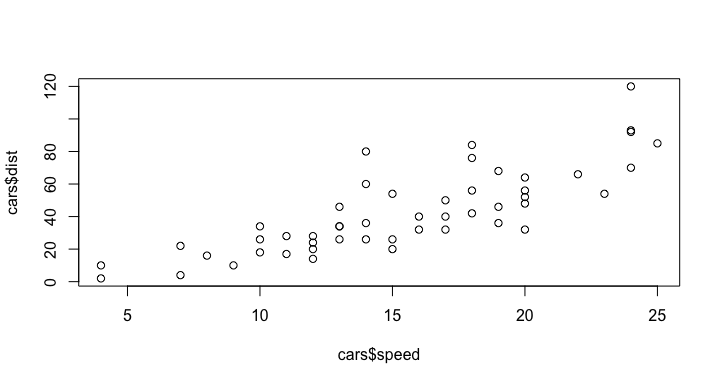
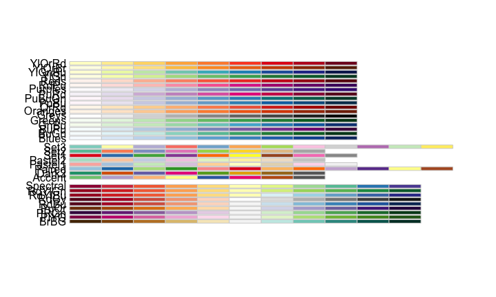

# Slides with Rstudio
Jennifer & Amaury  
January 2018  


# Generality

## Why would I use IOslides ? | Powerpoint is good 

While it's true that Powerpoint is a powerful tool for creating presentations, we are going to see an alternative way of building these very slides directly using Rstudio. In this presentation, we are going to see what we can do. 

The pros of an ioslides presentation are :

- Enable dynamic tools (maps, graphs...)
- Can be updated by changing the source database
- Results in HTML, easily shareable even online

For the cons :

- Harder to customise than a regular powerpoint
- Not a WYSIWYG interface

## Libraries

These are the libraries we are going to use for our presentation.


```r
# Data management
library(dplyr)
library(data.table)

# Shapefile et map
library(rgdal)
library(leaflet)

# Neighbours
library(spdep)

# Colors
library(RColorBrewer)

# Dynamic plot
library(plotly)
```

## Including R code

IOslides work the same as a regular RMarkdown, you can write Rcode which will be evaluated, and the results will be rendered in a slide.


```r
data(cars)
plot(x=cars$speed,y=cars$dist)
```

<!-- -->

## Writting your slides| What can I do ?

- Math with LaTeX : $d(x)=\frac{1}{\sigma\sqrt(2\pi)}e^{\frac{1}{2\sigma}(x-\mu)^2}$
- Add tables 

| Column1 | Column2 |
|---------|---------|
| A       | 1       |
| B       | 2       |
</br>

- Write with markdown language, *i.e.* using `*` or `_` to write in italic, and `__` or`**` for bold. For instance, *this sentence is in italic* and **this one in bold**. 

- Insert links to relevant contents, like [AXA's github](https://github.axa.com/)

## CSS/HTML will help you

- If you are familiar with the HTML language, you can use it too ! <font color="red">Here I can color my text in red</font> with this command `<font color="my color">My text</font>`

- With CSS I can create styles like this :
``` 
custompara { test
 color: SteelBlue;
 text-align:right;
}
```
<style type="text/css">
div#custompara {
 color: SteelBlue;
 text-align:right;
}
</style>
<div id="custompara">This text is on the right and in blue !</div>

- Of course you can add images to strengthen your ideas
<center>

</center>

## Going further 

- You can read more about markdown language [here](https://github.com/adam-p/markdown-here/wiki/Markdown-Cheatsheet), and more about ioslides [here](http://rmarkdown.rstudio.com/ioslides_presentation_format.html).

- Everyone can master something, but nobody can master everything. Most of the time the community can help you (or has already given the answer) :

    - Slack for the Axa Community (ds4a) 
<center>    
[](http://ds4a.slack.com)
</center>    
    - StackOverflow for world community 
<center>    
[](https://stackoverflow.com/)
</center>

Let's see it with a small example, a walk in Paris

# Dynamic maps and plots
## Reading

The full map of France at the IRIS scale can be found [here]( https://wxs-telechargement.ign.fr/1yhlj2ehpqf3q6dt6a2y7b64/telechargement/inspire/CONTOURS-IRIS-2017-06-30$CONTOURS-IRIS_2-1__SHP__FRA_2017-06-30/file/CONTOURS-IRIS_2-1__SHP__FRA_2017-06-30.7z). For the needs of this presentation, we created a shapefile that only contains Paris.


The shapefile object consists in (at least) 4 files :

- SHP : The actual shapefile, containing geographical informations
- SHX : Stocks the index of the recording of the SHP
- The PRJ : the projection associated with the SHP
- The DBF (database file) which contains attributes datas

```r
map.fr <- readOGR(dsn = "./Datas/Shapefile", layer = "parismap")
```

```
## OGR data source with driver: ESRI Shapefile 
## Source: "/Users/Axa/Perso/RAcademyPresentation-master/Datas/Shapefile", layer: "parismap"
## with 992 features
## It has 6 fields
```

## Finding neighbours

The package `spdep` provides a function that will find the adjacent polygons for every individual of a shapefile. This function is very well optimized, and return the list of the indices of neighbours.


```r
#Finding indices of neighbours
nb_q<-poly2nb(map.fr)
# Converting indices to references
nb_list=sapply(nb_q,function(x){as.character(map.fr$CODE_IRIS[x])})
nb_list[1:3]
```

```
## [[1]]
## [1] "751197317" "751197310" "751197311" "751197408" "751197314" "751197409"
## [7] "751197309" "751197315" "751197406"
## 
## [[2]]
## [1] "751176611" "751176715" "751176714"
## 
## [[3]]
## [1] "751124504" "751124601" "751124503" "751124501"
```
Here we can see for instance that the first entry has 9 neighbours, the second one only three and so on.

## A random walk

```r
random_walk_in_paris<-function(starting_point="751041603",step=2000,seed=NULL){
  # Setting the seed allows to have a reproducible example
  set.seed(seed)
  # Initialisation
  current_position=starting_point
  path=c()
  for (i in 1:step){
    indice=which(map.fr@data$CODE_IRIS==current_position)
    # Select at random a neighbour
    current_position=sample(nb_list[indice][[1]],1)
    path=c(path,current_position)
  }
  return (path)
}
my_walk=random_walk_in_paris(seed=1)
head(my_walk)
```

```
## [1] "751041699" "751041603" "751041602" "751041603" "751041699" "751041399"
```
This function create a random path from a given IRIS. For the selected number of step, the algorithm choose randomly a neighbour and goes in that IRIS.

## Walk on the map


```r
#Filtering on the path
walk.map=map.fr[map.fr@data$CODE_IRIS %in% my_walk,]
mapparis<-leaflet(height=300,width = 300) %>% 
  addTiles() %>% 
  addPolygons(data=walk.map, weight = 1, opacity=1, fillOpacity = 0.6, color=grey(0.5))
```
<div class="columns-2">

We can see the selected map by plotting it with leaflet. 

- The `addTiles` function plot the background map
- The `addPolygons` plots the data you've stored in your shapefile.

For this first example we will plot every visited area in grey. Keep in mind that in this example we will just cover the basics, you can go further on the [leaflet for R website](https://rstudio.github.io/leaflet/)
  

```r
mapparis
```

<!--html_preserve--><div id="htmlwidget-dff7dd70311595128778" style="width:300px;height:300px;" class="leaflet html-widget"></div>
<script type="application/json" data-for="htmlwidget-dff7dd70311595128778">{"x":{"options":{"crs":{"crsClass":"L.CRS.EPSG3857","code":null,"proj4def":null,"projectedBounds":null,"options":{}}},"calls":[{"method":"addTiles","args":["//{s}.tile.openstreetmap.org/{z}/{x}/{y}.png",null,null,{"minZoom":0,"maxZoom":18,"maxNativeZoom":null,"tileSize":256,"subdomains":"abc","errorTileUrl":"","tms":false,"continuousWorld":false,"noWrap":false,"zoomOffset":0,"zoomReverse":false,"opacity":1,"zIndex":null,"unloadInvisibleTiles":null,"updateWhenIdle":null,"detectRetina":false,"reuseTiles":false,"attribution":"&copy; <a href=\"http://openstreetmap.org\">OpenStreetMap<\/a> contributors, <a href=\"http://creativecommons.org/licenses/by-sa/2.0/\">CC-BY-SA<\/a>"}]},{"method":"addPolygons","args":[[[[{"lng":[2.37255453210135,2.37257979355506,2.37281781013222,2.37311698528792,2.37332066800349,2.37340416381605,2.37482551557025,2.37599821600059,2.37679554222068,2.37572246902969,2.37506975056947,2.37671270056878,2.37690005193531,2.37652070836486,2.37640460803366,2.37553248673443,2.37514427895671,2.37377212196264,2.37345369851587,2.37224700626142,2.37228016767498,2.37245644195121,2.37255453210135],"lat":[48.8920670727877,48.8921211643705,48.8926287284522,48.893267912612,48.8937959797053,48.8937712356941,48.8936437666122,48.8935509580144,48.8934831645854,48.8926609934047,48.8921584663216,48.8907191231131,48.890562716956,48.890579628145,48.8905943120415,48.8907615374405,48.8908350552837,48.8910743011758,48.8911283934078,48.8913298166862,48.8914073321317,48.8918318361308,48.8920670727877]}]],[[{"lng":[2.3074960317264,2.30741060079326,2.30723144871507,2.30708403061979,2.30650544082077,2.3043067495798,2.30419517189498,2.30460715672489,2.30677452322539,2.31096258287286,2.31119586719429,2.31108409540737,2.31093257546458,2.31068983367215,2.31034767637655,2.31015692015903,2.30917474246953,2.30870352914517,2.30785807925281,2.3074960317264],"lat":[48.8875239317479,48.8875899880606,48.8877301465013,48.8878426090781,48.8882790317338,48.8899345331168,48.8900175223661,48.8902132712711,48.8894766978258,48.8879432331191,48.8878339578033,48.8878297174472,48.8878405368533,48.8878400389923,48.8878290754453,48.8878162852988,48.8877341795664,48.8876855941175,48.8875772869617,48.8875239317479]}]],[[{"lng":[2.35567543059558,2.35561018435439,2.35543535130124,2.35592522902153,2.35598310094393,2.35608012799797,2.35627014715402,2.35654219486102,2.35708481403412,2.35720779007061,2.35729652465192,2.3582413889699,2.35867105205127,2.35872012358263,2.35866313188883,2.35857114492102,2.35854901899352,2.35845602699342,2.35831322121252,2.35821087702866,2.35812964964378,2.35771436398446,2.35759972084744,2.35754167410912,2.35750560780947,2.35624207037661,2.35586511578388,2.35567543059558],"lat":[48.8765269800737,48.87662105901,48.8777478827732,48.8797011723092,48.87976263822,48.8797451734951,48.8797057254534,48.8796487313859,48.8795437267898,48.8795228031742,48.8795142862601,48.8796299728837,48.8797285038746,48.8796190482623,48.879264406161,48.8787620858876,48.8786765307395,48.8783666619679,48.8778946460504,48.8776800560753,48.8775222372109,48.8768122340123,48.8766002752938,48.8764425802494,48.876271513106,48.8764616791768,48.8765136115286,48.8765269800737]}]],[[{"lng":[2.353448493589,2.35547291222332,2.35632037551338,2.35644725585693,2.35661044608486,2.35673112429617,2.35678994458374,2.35679347150544,2.35677700010608,2.35585593754382,2.35397647491429,2.35252660628704,2.35295166655012,2.35343542254219,2.353448493589],"lat":[48.8871045902355,48.8872728867041,48.8873359017047,48.8867799009491,48.8860442295676,48.8854378322372,48.8850919071896,48.8850271745514,48.88492546204,48.8849726713019,48.8849985182185,48.8850212635904,48.885712446466,48.8867295005584,48.8871045902355]}]],[[{"lng":[2.36172676015675,2.3615815283066,2.36134082643621,2.36186011978463,2.36202270153858,2.3617304043103,2.36153672209123,2.36007767702381,2.359752850336,2.35867105205127,2.3582413889699,2.35729652465192,2.35720779007061,2.35769926521013,2.35858849436589,2.3590415591677,2.35918761155534,2.36153265496125,2.36172676015675],"lat":[48.8826190939573,48.8824528430397,48.8820657469443,48.881417401183,48.8806124676299,48.8805416611725,48.8804907155611,48.88010565616,48.8800193822965,48.8797285038746,48.8796299728837,48.8795142862601,48.8795228031742,48.8804688399023,48.8821139861708,48.8828610573853,48.8828492485921,48.8826576294707,48.8826190939573]}]],[[{"lng":[2.25757278995684,2.25749214731869,2.25739536119154,2.25728113329011,2.25737006572537,2.2577109398933,2.25795077451363,2.25806016587914,2.25812375596046,2.2585608550744,2.25876072869392,2.2589984844327,2.25929528328206,2.26137872996433,2.2614580800504,2.2609113273855,2.25938388425944,2.25822538742266,2.2578034655909,2.25757278995684],"lat":[48.8380057446272,48.8381194647772,48.8382186946343,48.838298929225,48.8384640670816,48.8393070984429,48.8398787898142,48.8401384880692,48.8402656941748,48.8410508590792,48.8413677776577,48.8417038172823,48.8416247118647,48.8393100161579,48.839190889324,48.8390265243415,48.8385538989282,48.838198662208,48.8380719311926,48.8380057446272]}]],[[{"lng":[2.34716002591212,2.3488726589247,2.34850105658519,2.34837766680025,2.35014779856018,2.35011610085782,2.34903552157582,2.34839305325767,2.34760670802673,2.34668373656051,2.3467147016434,2.34672526771116,2.34678589313899,2.34688930133892,2.34699179780942,2.34699437740995,2.3470214125606,2.3470626076238,2.34716002591212],"lat":[48.8663533806442,48.8659885832038,48.8649640064868,48.8646935312846,48.86430384678,48.8641130134798,48.863864317577,48.8640083139862,48.8642117788841,48.8644396745393,48.8645792420848,48.8646062801158,48.8647720905232,48.8651135065909,48.8655277643819,48.8655394699338,48.865666424991,48.8658600087454,48.8663533806442]}]],[[{"lng":[2.36885106363699,2.36914618956737,2.36964899484356,2.37018730386981,2.37060273732915,2.3706615022269,2.37085276899023,2.37411958260215,2.3745568667213,2.37477689287161,2.37515250238947,2.37534103687092,2.3747284670082,2.37374088302303,2.37298598734087,2.3723658643772,2.37187230182347,2.37126589507447,2.37116828789975,2.37104899167496,2.37095207182048,2.3708673543114,2.3707140914397,2.37014796595416,2.36944868411603,2.36885106363699],"lat":[48.8663510185638,48.866295016647,48.866199637598,48.8660990472228,48.8660139964663,48.866001714699,48.8659667466124,48.8653453420511,48.8652558951324,48.8652093796205,48.8651474879279,48.8651124984091,48.8650418489876,48.8648703070053,48.8647332517778,48.8646112880894,48.8645070729757,48.8642655628837,48.8642209822523,48.8641663947828,48.8641213679096,48.8640818011612,48.8640180413527,48.8647300411328,48.8656301982871,48.8663510185638]}]],[[{"lng":[2.35140885545995,2.3512418933636,2.35118169941522,2.3510173403778,2.35079172240292,2.35050627629696,2.3495618242416,2.34897227528254,2.34790106599187,2.34793746050504,2.34815950399407,2.34822662738844,2.34827113552117,2.34829347970191,2.34832790279262,2.34835459594423,2.34859492641002,2.34864563195647,2.34882305775062,2.34894123892814,2.34895301070196,2.34951039392627,2.34964287783482,2.35014552250204,2.35030531842729,2.35140885545995],"lat":[48.8771010979889,48.8764940415945,48.8762913649479,48.875694664236,48.8748718973163,48.8738181247129,48.8738975342311,48.8739428935381,48.8740189025004,48.8742700158684,48.8754835310601,48.8757851741316,48.8759329075415,48.8759995800369,48.8760816069867,48.8761276184159,48.8765345267313,48.8766229374923,48.8769359720263,48.8771893279147,48.8772074685639,48.8773605975249,48.8773424313173,48.8772714155458,48.8772497995281,48.8771010979889]}]],[[{"lng":[2.34596224520224,2.34613980073916,2.34623538401216,2.34635149670972,2.34643255342364,2.34658311581241,2.3465893465939,2.34659694089027,2.34983597524024,2.34987338012473,2.34983564198459,2.34953038637168,2.34949915073192,2.34871267496357,2.34741868358173,2.34596224520224],"lat":[48.8796714392518,48.8799736856439,48.8801801548232,48.8804892598581,48.8808755158676,48.8819168642844,48.8819636635064,48.8820104701675,48.8810972961206,48.8807224779663,48.8804686614393,48.8796899801583,48.8796799177801,48.8794391172372,48.8795480845818,48.8796714392518]}]],[[{"lng":[2.29791736923245,2.29791873186691,2.29848527170081,2.30125499247861,2.30153548421946,2.30157379386348,2.30143776197362,2.3007504118715,2.29947837279431,2.29922984922893,2.29870202473109,2.29860049380483,2.29768674970479,2.29599368001503,2.29589801992682,2.29595562681087,2.29655102376542,2.29678858798403,2.29713330400573,2.29779604088345,2.29791736923245],"lat":[48.8490660339977,48.8490660419938,48.8488903920287,48.848029721344,48.8479450203344,48.8479335522608,48.8478140421331,48.8473468546378,48.8464823192292,48.846318078782,48.8459480450391,48.845999612996,48.8463593945706,48.8470113760198,48.8470314984552,48.8471046859855,48.8478186858176,48.8480880927291,48.8483950025202,48.8489681908045,48.8490660339977]}]],[[{"lng":[2.34716002591212,2.3470626076238,2.3470214125606,2.34699437740995,2.34699179780942,2.34688930133892,2.34678589313899,2.34672526771116,2.3467147016434,2.34668373656051,2.34634061961526,2.34560552091124,2.34508846345748,2.34497496823186,2.34385921667289,2.34308257154649,2.34332213064927,2.34337803102802,2.34380664601055,2.34418563137643,2.34505221597392,2.34623931437666,2.34716002591212],"lat":[48.8663533806442,48.8658600087454,48.865666424991,48.8655394699338,48.8655277643819,48.8651135065909,48.8647720905232,48.8646062801158,48.8645792420848,48.8644396745393,48.864516943419,48.8646817783608,48.8647969891321,48.8648251470647,48.865096932939,48.8652851324134,48.8657460122498,48.8658533409492,48.8666731954921,48.866888417174,48.8667043002819,48.8665066394523,48.8663533806442]}]],[[{"lng":[2.28528681495008,2.28637712822263,2.28680665667136,2.28788592435869,2.288184114077,2.28839338441816,2.28939871691013,2.29071595596527,2.29097926339843,2.29085580463873,2.28958732785102,2.28919800696134,2.28789569683857,2.28559425407232,2.28546292693973,2.28450977970982,2.28413182192995,2.28377850205957,2.28361579868151,2.2836489721124,2.28411356443257,2.28448322998689,2.28484134282435,2.28514826713205,2.2851897443361,2.28528681495008],"lat":[48.8807095618593,48.8804507612201,48.8803507962393,48.8801009094463,48.8800325343965,48.8799852142182,48.8797564584195,48.8794521994258,48.8790409626734,48.8789952644709,48.8785245840745,48.878377479443,48.877890391665,48.8769854328004,48.8768182708694,48.8771219512236,48.8772411026894,48.8773532056402,48.8774056529462,48.8774522574548,48.878222174196,48.8790544749622,48.8798849061975,48.8805711359159,48.8806289412194,48.8807095618593]}]],[[{"lng":[2.372857818669,2.37296899991847,2.37476463906815,2.3752959857282,2.37544700978975,2.37684741308042,2.37625918285985,2.37587642277574,2.37494366975227,2.37377869292138,2.37210507681749,2.37198311098994,2.37162873268343,2.37155950784635,2.37149702152754,2.37135715501624,2.37118752252715,2.37114545789945,2.37094056491443,2.37130815189872,2.3715018840709,2.37152710672973,2.37182318508601,2.37204361008381,2.37207924968109,2.37218745635515,2.37223042898199,2.37225852855151,2.3722753128646,2.37224027817938,2.37220658911422,2.37215408898234,2.37194302073506,2.37186784692384,2.37143399608678,2.37184042872132,2.3725362910919,2.372857818669],"lat":[48.8621316781705,48.8620675079236,48.8610057825967,48.8606847930456,48.8605938480499,48.8597485683876,48.8595854201917,48.8594512205993,48.8591486684419,48.8587765434679,48.8582002852247,48.8581420869227,48.8580296067612,48.8580058601827,48.8579884443932,48.8579454403384,48.8578842927401,48.8578687827701,48.8577930599357,48.8586178952364,48.8590541971154,48.8591100891201,48.8597627709724,48.860246876952,48.8603432940196,48.8606388472828,48.8608054517218,48.8609620852996,48.8611528346305,48.8615717458427,48.8617658276862,48.8619373271763,48.8623724019213,48.8625024123573,48.8629866797911,48.8627414940781,48.8623449362064,48.8621316781705]}]],[[{"lng":[2.29368782679046,2.29343609244893,2.29324738874879,2.29321874397937,2.29321329480056,2.29309479955555,2.29169199071416,2.29062294537071,2.29046776644443,2.290418870833,2.28988549939284,2.28968455481168,2.28956617079506,2.28941812200804,2.28924040546362,2.28931142083436,2.28940812509905,2.2896740690349,2.29015339049866,2.29062025035168,2.29069874902531,2.29133775273164,2.29158422735254,2.29195460484494,2.29274799413085,2.29355105858115,2.29368782679046],"lat":[48.8359652244385,48.8360428825425,48.8360939313579,48.8360964602213,48.8360964280223,48.8360939290291,48.8360595483882,48.8360271311867,48.8360172170346,48.836006134492,48.8358554718192,48.8358048131007,48.8364939297254,48.8373600460695,48.8384031616112,48.8384908226413,48.8385930261787,48.8386737504437,48.8387935141433,48.838427541293,48.8383659501354,48.83786429047,48.8376732847743,48.8373876785496,48.8367520188866,48.8361047190032,48.8359652244385]}]],[[{"lng":[2.36468490427393,2.36444880946657,2.36427827560331,2.36401367743168,2.36378591754528,2.36249444214259,2.36208670210618,2.36150032356604,2.36149591309825,2.36108063718139,2.36105165445045,2.36118538015579,2.36262477389946,2.3630950919273,2.36381659519114,2.36449597688518,2.36461194735248,2.36471564438782,2.36547029265528,2.36709967979306,2.36811522949765,2.36812697812202,2.3681235208759,2.36713284237261,2.36705983102841,2.36705929868705,2.36684612307516,2.36676271849115,2.3667037031812,2.36655311029025,2.36580788271992,2.36480083287656,2.36468490427393],"lat":[48.8843687324322,48.8843836673062,48.8843899565665,48.8843939473068,48.8843963345643,48.8844038542064,48.8844043804506,48.8844048521091,48.8844309090907,48.8863793337754,48.8865185746516,48.8867342270779,48.8891305043228,48.8899262100742,48.8899219516492,48.8899048748138,48.8899009936303,48.8898970472192,48.8898587804096,48.8897756727583,48.889702795108,48.8897011483925,48.8896938456345,48.8874960624693,48.8873319994491,48.8873309174453,48.8868506300264,48.8866442434682,48.8865629920541,48.8863868269688,48.8855438108848,48.8844790654639,48.8843687324322]}]],[[{"lng":[2.30410999998447,2.30547707019287,2.30651273681474,2.30744959827733,2.30789605142699,2.30813852433015,2.3084811490263,2.31049061027071,2.31076042203214,2.31077275085096,2.31226820849335,2.3124611501002,2.31244051527816,2.31228532577317,2.31197120459048,2.3118151246101,2.30941295193772,2.30685967662788,2.30434820167106,2.30410999998447],"lat":[48.8724098310712,48.8731534331252,48.8737026402399,48.874199104607,48.8740496980802,48.8739629643243,48.8738291435965,48.8729153128394,48.8728224358215,48.8728180101007,48.8723130871953,48.8722593357076,48.8720667579172,48.8700873112293,48.8699236240501,48.8699739893816,48.8707497780019,48.8715543217091,48.8723365701857,48.8724098310712]}]],[[{"lng":[2.38449291690774,2.38430371908493,2.3842867654211,2.38402084091201,2.38401531362988,2.38399052060652,2.38309840553103,2.3824637602428,2.38117113645918,2.38106717370159,2.38095519124843,2.38086271050482,2.38052323555066,2.38036187383117,2.38000881319385,2.37983449373543,2.3805541228514,2.38191008268346,2.38246645932424,2.38259977320404,2.38267051471328,2.38302840851312,2.38308555997429,2.38320108762044,2.38344596618005,2.38392367200983,2.38480366931962,2.38493445223214,2.38505812111877,2.38570753832182,2.38573219318593,2.38576087411273,2.38596955483633,2.38603216816495,2.38605464767257,2.38667343375943,2.38677773119115,2.38678494952076,2.38640088568756,2.38456641284252,2.38449291690774],"lat":[48.8702151006776,48.8701898455111,48.8702401211849,48.8705930917654,48.870599358679,48.8706208151707,48.8712403602928,48.8711849262255,48.8714318633132,48.8715761189527,48.8717068429669,48.8718025936258,48.8721470816169,48.8723027308652,48.8726426502695,48.8728557891071,48.8729890195908,48.8732676280753,48.8733721245043,48.8733970942224,48.8734100497577,48.8734667543669,48.8734760422699,48.8733912008185,48.8732054007415,48.8728148509558,48.8720684318821,48.8719611836914,48.8718790802044,48.8714921029987,48.8714823368292,48.871477987331,48.8714700646505,48.8714784798543,48.8714219369869,48.870740714319,48.8704507629559,48.8704166251385,48.8703840794594,48.8702253713022,48.8702151006776]}]],[[{"lng":[2.30781747768434,2.30808307121783,2.3086446433126,2.30975402420615,2.31009146126569,2.31007935527197,2.3096391182856,2.30850510064192,2.30776500834658,2.30664538394328,2.30667644176124,2.30669638587295,2.30669455706767,2.30668606027522,2.3066666889551,2.3066242182301,2.30781747768434],"lat":[48.8376936755588,48.8374946524932,48.8371678304626,48.8365230926201,48.8363505613038,48.8363387996471,48.8358380075779,48.8344383286786,48.8351814266682,48.8362892640939,48.8363101296766,48.8363471195282,48.8363821844321,48.836406418223,48.8364287902357,48.8364465314847,48.8376936755588]}]],[[{"lng":[2.2715642696672,2.27162478076727,2.27519755880643,2.27629058397174,2.27725570312428,2.27802111858089,2.27863589055124,2.27853646802292,2.27849135705895,2.27841447224965,2.27829518974551,2.27825150415771,2.27820641153547,2.27784153323816,2.27577367249876,2.27545795469456,2.27509574238395,2.27488250887744,2.27463086738887,2.27429574839581,2.27405497883491,2.2737019345394,2.27350762017433,2.27311624035006,2.27281927335305,2.27232511282446,2.27207045062763,2.27147341858596,2.27123500095714,2.27105407761098,2.27090597583067,2.26979270845758,2.26958164498409,2.26969459493901,2.26982571092208,2.26994118625584,2.26999462289835,2.27042703960621,2.27089645140567,2.27098416443058,2.27107775487839,2.27114968536863,2.27122169136187,2.27133049478283,2.27142860019122,2.2715010462435,2.2715642696672],"lat":[48.8402196848139,48.840179581522,48.8377109188369,48.8373919635379,48.837158565397,48.8369815142042,48.8368602102996,48.8366608489083,48.8365733374732,48.8364190806072,48.8361782278686,48.8360862280255,48.8360958490495,48.8361763891511,48.836646850947,48.8367186876793,48.8368028330602,48.8368528049556,48.836921430431,48.8370165301847,48.8370870191572,48.8371972978237,48.8372581746387,48.8373817093512,48.8374761374275,48.837642214638,48.837731501956,48.8379464151502,48.8380429946135,48.8381201377523,48.8381884869344,48.8386844461959,48.8387730949555,48.8387827783398,48.8388573274145,48.8389785483075,48.8390544218077,48.8396020801417,48.8401355721221,48.8401963646662,48.8402266142931,48.8402468387776,48.8402616674438,48.8402758208488,48.8402755190394,48.8402588721838,48.8402196848139]}]],[[{"lng":[2.29798895871581,2.29800980116478,2.29801835877846,2.29801883157907,2.29782328641252,2.29787879958731,2.29790830767812,2.29792147705583,2.2979209743047,2.29790796905428,2.29789750909747,2.29785888708461,2.2978105261895,2.29773363966541,2.29765243218742,2.29755206218696,2.29743517187422,2.29731533614361,2.29716618179733,2.29657246205156,2.29641042469117,2.29639183355437,2.2962430542896,2.29473378083775,2.29312143694214,2.29323514822128,2.29330011226864,2.29347915430285,2.29361350324332,2.29481591001033,2.29644727674872,2.29756020983015,2.29798895871581],"lat":[48.8872491323207,48.887220475911,48.8871926468057,48.8871575756474,48.8851743004565,48.8851026793516,48.8850381003935,48.8849716269512,48.8849077713328,48.8848609297325,48.8848275930568,48.8847590172211,48.884704773589,48.8846422686185,48.8845968255869,48.8845566660749,48.8845281008757,48.8845157062827,48.884452776771,48.8832801553035,48.8829599392361,48.8829229572375,48.8830344996811,48.8841979013875,48.8854649974448,48.8855268234024,48.8855631801982,48.8856343848385,48.8856828422032,48.8861135158837,48.8866919406818,48.887086536759,48.8872491323207]}]],[[{"lng":[2.30518120193613,2.30484830243637,2.30452506336674,2.30297887103983,2.30107347589919,2.30094342727751,2.30098464268422,2.30117988383645,2.30157084512984,2.30278547625763,2.30317109325465,2.30377822558014,2.30476823994168,2.30518120193613],"lat":[48.8347257522801,48.8343532760693,48.8339718612125,48.8321326326261,48.8326062766595,48.832653183526,48.8327289719491,48.8333066123265,48.8338170426486,48.8353881400528,48.8352815630671,48.8351142176831,48.8348402711706,48.8347257522801]}]],[[{"lng":[2.37966810262834,2.37902310291788,2.37870313337313,2.37855813250227,2.37814900796062,2.37785371686259,2.37669292758489,2.37566620790366,2.37454326823461,2.37179122901043,2.37158510768292,2.37151938676787,2.37146938783591,2.37201577243953,2.37336963795665,2.37769109098974,2.37879493846329,2.37942706682425,2.38144103454055,2.38165041026132,2.3816483130846,2.38154001508591,2.38091846795544,2.37966810262834],"lat":[48.8848807750078,48.8846508013726,48.8844953566822,48.884419060767,48.8841930043113,48.8840268935141,48.8833706427144,48.8827942201703,48.8828513120206,48.8829861918887,48.8830039960628,48.8830261342864,48.8831014153546,48.8832499735824,48.8836078048674,48.8847410126906,48.885030032572,48.8851960885241,48.8856705618231,48.8857238041537,48.8856707331603,48.8856036237713,48.8853494999478,48.8848807750078]}]],[[{"lng":[2.25587339588425,2.25584227458862,2.25520535552947,2.25478866769132,2.25466902995022,2.25463335041507,2.25451315704806,2.25464050989448,2.25466583081505,2.25468711517176,2.25470690851603,2.2553089196482,2.25577295170078,2.25624754866957,2.25643607833931,2.25638554092794,2.25636938294059,2.25638326057515,2.25656677168109,2.25661414910005,2.25685778927725,2.25700314123815,2.25808422145972,2.26059158947368,2.26128588756636,2.26141874216823,2.2623095975791,2.26292631783592,2.26360898293759,2.26369153418991,2.26373165069244,2.2637638346722,2.26377751799708,2.26345618607477,2.26197760835464,2.26149261850529,2.26140515131914,2.25653760221238,2.25514423841751,2.25507169701521,2.25495005215599,2.25483099498994,2.25354723720716,2.25353975455653,2.25238956574078,2.25230479169176,2.25222861865261,2.25201105256339,2.25193052624114,2.25191492067171,2.25170930894686,2.25130814415611,2.2512993576478,2.25190875330721,2.25234687912035,2.2524775511649,2.25277065064088,2.25354766833184,2.25471999991279,2.25497083444575,2.25510443973238,2.25537711321247,2.25587339588425],"lat":[48.8453826337142,48.8452718176306,48.8439404955158,48.8430042404745,48.8426995073828,48.8425266056025,48.8403556690453,48.8395488244199,48.8393978872275,48.8393386611036,48.8392884194327,48.8385402911242,48.8382940520809,48.8382619283156,48.838226226005,48.8381395717803,48.8380306468672,48.8379174117875,48.8368006277457,48.8365356060319,48.8363608421012,48.8362951911697,48.8362470396491,48.8359217019346,48.8356705688222,48.8356210241359,48.8361130846356,48.8367230662625,48.8366202452368,48.8365631933569,48.8365202702408,48.8364602101357,48.8363595642138,48.8360562948394,48.8346387560139,48.8340704133559,48.8340803060513,48.8346428395477,48.834809549361,48.8348997549412,48.8350511720932,48.8351835384085,48.8366758756862,48.8366846428863,48.8380355183462,48.8381420142361,48.838237771314,48.8384927331785,48.8386164334083,48.838640529021,48.838821816226,48.8420597518977,48.8421307473769,48.8442912540829,48.8451906657035,48.845485576361,48.8454766149628,48.8454553839211,48.8454240199812,48.845416588633,48.8454120243744,48.8454020300423,48.8453826337142]}]],[[{"lng":[2.32427307792218,2.32538438531298,2.32670909099223,2.32684619252414,2.32693215303564,2.32706814654005,2.32716472537303,2.32715676830594,2.32705507589014,2.3270093423636,2.32689460427517,2.32673953256934,2.32665663022885,2.32659832797065,2.32656598920984,2.32597006097847,2.32550063133476,2.32515033456205,2.32492224078016,2.32470834830963,2.32447309588128,2.32429230877581,2.324302890228,2.32429849629036,2.32427307792218],"lat":[48.8828706932502,48.8830952282507,48.8833634914896,48.8833907927029,48.8834079136184,48.8834365573436,48.8834550867689,48.8832266117763,48.8804381078246,48.8796509330581,48.8796664760287,48.8796377246626,48.8796165737084,48.8795910643983,48.8795612044375,48.8794607225405,48.8793843331484,48.880005598146,48.8804557781092,48.8809671922924,48.8819686220477,48.8827653100855,48.8827905511161,48.8828139089629,48.8828706932502]}]],[[{"lng":[2.26608916529354,2.26661011316699,2.26718573479382,2.26741406714333,2.26779162555929,2.2687098685552,2.26936126396653,2.26930412744264,2.26907030919964,2.2689719754659,2.26887904295121,2.26874622561106,2.26823877798404,2.26813513808922,2.26793326460099,2.26753888983006,2.26692872810272,2.26649026829331,2.26631845665503,2.26557759950477,2.26542855191478,2.26546087139298,2.26557288460689,2.26573055638806,2.26577900256089,2.2658551102865,2.26596806444009,2.26603198373334,2.26608916529354],"lat":[48.8555447058952,48.8554255868899,48.8552951087772,48.8552434446417,48.8551441278276,48.854878136266,48.8546887529447,48.8545840781719,48.8541527554297,48.8539731817665,48.8537972384393,48.8535500016717,48.8526124618689,48.8524229617904,48.8525323484639,48.8527628698608,48.8531224756362,48.8533859998142,48.8534892724606,48.8539344085139,48.8539694680677,48.854093778417,48.8544623049204,48.8549759085246,48.8551165061242,48.8552284938539,48.8553371101157,48.8554436267727,48.8555447058952]}]],[[{"lng":[2.3583245162074,2.35816843657586,2.3579251378925,2.35756289510186,2.35738996257384,2.35729874083073,2.35736714947059,2.3574453567875,2.35748520261019,2.35762440337746,2.35786625420636,2.3583034358939,2.3588649247669,2.35952204504449,2.35921928107043,2.35952326473829,2.35960567247749,2.35988775536848,2.36081329059899,2.36137149679229,2.36152877359384,2.36183646586727,2.36262398718087,2.36288377380486,2.36291688967793,2.36295617290623,2.36298827658838,2.36304404004726,2.3631675500207,2.36355089447786,2.36334407246503,2.36080635874987,2.35967407836377,2.35892240439901,2.35876277926723,2.35865495990404,2.35853883852107,2.35842133111863,2.3583245162074],"lat":[48.8737685577572,48.8739322995794,48.8742034937456,48.8746116474909,48.8748148685316,48.8749151044112,48.8750063045902,48.8750768725985,48.8751625233593,48.8754834338464,48.8762149914438,48.8761435902962,48.8760530680178,48.8759468667796,48.8753993501588,48.875182438491,48.8751334159291,48.8750341990885,48.8747189812362,48.8745609794838,48.874521348347,48.8744456462175,48.8742654781816,48.8742048069815,48.8740610894847,48.8739704656116,48.8739094816044,48.8738090526932,48.8736316412651,48.8731660251218,48.8731325491584,48.8731729851627,48.8732289878119,48.8732663339959,48.8732753717059,48.8733953052291,48.8735250868615,48.8736566596138,48.8737685577572]}]],[[{"lng":[2.33587439259084,2.33638841077151,2.33737953373139,2.33866894458459,2.33855439057769,2.33852856390981,2.33957763036517,2.33977038609329,2.33948421225728,2.33938510001579,2.33935601495305,2.33920233306272,2.33914393583826,2.33809492797971,2.33656716460231,2.33554951856746,2.33481136853806,2.33422835059214,2.33270310512385,2.33226222481876,2.33210684582664,2.3320261045559,2.33192074802714,2.33135559092708,2.33194343447331,2.33310205828466,2.33348167644007,2.33365103039712,2.33460423967189,2.33514151678755,2.33525362485656,2.33587439259084],"lat":[48.8669792880151,48.8668652243739,48.8666449802118,48.8663364419797,48.8661253622999,48.8646165677502,48.8635849653693,48.863541061564,48.8629971762703,48.8627511074039,48.8626798984044,48.8623301030709,48.8622056706147,48.8624831678818,48.8628911063428,48.8631656074141,48.8635414811721,48.8638305270745,48.8645684903423,48.8639760598157,48.8637620475136,48.8637867786161,48.8638176676885,48.8639880855149,48.8649185947983,48.8666266183164,48.867215105632,48.8675101341672,48.8672717150122,48.86715149062,48.8671260323425,48.8669792880151]}]],[[{"lng":[2.32702520028922,2.32702519796538,2.32700175865746,2.32698711484247,2.32693688958547,2.32734310529799,2.32785837319719,2.3307346403742,2.33131807410899,2.33123427387733,2.33122411812829,2.33122623194301,2.33114155587778,2.3302374397661,2.32834590718402,2.32711261087936,2.32702520028922],"lat":[48.8737808683338,48.8737810481886,48.8739068239478,48.8739849841507,48.8741789590611,48.8741848397715,48.8741922308235,48.8742308300731,48.8742385873233,48.8737569727974,48.8736984590071,48.8736400137629,48.8732267438239,48.8733484953652,48.8736014033567,48.8737689488412,48.8737808683338]}]],[[{"lng":[2.27304828873507,2.27206707964228,2.27199411507235,2.27154561634197,2.27020074414788,2.26936126396653,2.2687098685552,2.26875911777337,2.26920229219879,2.26929860955426,2.27258710505497,2.27263261526818,2.27282039027753,2.27363937974787,2.27422041329085,2.27430359841071,2.27440450081755,2.27429661114555,2.27417786900923,2.27358044801018,2.27304828873507],"lat":[48.8572977675184,48.8567036219955,48.8566582101567,48.8563721825377,48.8555689537492,48.8546887529447,48.854878136266,48.8549620778021,48.855722946128,48.8573100044493,48.8580171495793,48.8582719444762,48.8582946702765,48.858208809177,48.8581799577375,48.8581768648041,48.858173879244,48.8580913834543,48.8580052243032,48.857645453414,48.8572977675184]}]],[[{"lng":[2.29157419196346,2.29236772417101,2.29407666456024,2.2949579656965,2.29512425974834,2.29517392073376,2.29521674065309,2.29539461274373,2.29547928616846,2.29558484256279,2.29570386867635,2.29573681303905,2.29574037830296,2.29575048608283,2.29572638783831,2.29566842834859,2.29556010646616,2.295341994041,2.2947769531078,2.29371485990416,2.29255418001137,2.29157419196346],"lat":[48.8689853338196,48.8700809352589,48.8724410146652,48.873204355497,48.8732071335421,48.8729628045782,48.8727202339502,48.8716654512051,48.8711506251108,48.8705028185149,48.8697660554714,48.8695477082217,48.8694856743125,48.869040557321,48.868201324853,48.8680516921385,48.8678963668859,48.8678959823099,48.8680455434178,48.8683567503623,48.8686988423519,48.8689853338196]}]],[[{"lng":[2.35934023245016,2.35934570608269,2.35910841855759,2.3590415591677,2.35858849436589,2.35769926521013,2.35720779007061,2.35708481403412,2.35654219486102,2.35627014715402,2.35608012799797,2.35598310094393,2.35591180136246,2.35376007874103,2.35369442070049,2.35379268325994,2.35431089415044,2.35433170668167,2.35442511169253,2.3546676866687,2.35559859583435,2.35583024036388,2.3562553381881,2.35655302663825,2.35741884437663,2.35835482698102,2.35888075424525,2.35894344516546,2.3590129760725,2.35934023245016],"lat":[48.88440950101,48.8842971143094,48.8829684354687,48.8828610573853,48.8821139861708,48.8804688399023,48.8795228031742,48.8795437267898,48.8796487313859,48.8797057254534,48.8797451734951,48.87976263822,48.8797946305959,48.8802389961746,48.8802557290395,48.8804685017523,48.8817834217289,48.8818644737139,48.8820295548659,48.8824814270038,48.8840593678115,48.884183822343,48.8842130885777,48.8842349236792,48.8842984796413,48.8843673516767,48.8844034441832,48.8844064778456,48.8844077494384,48.88440950101]}]],[[{"lng":[2.29868008644609,2.29962779743796,2.30014385018458,2.30034542556757,2.30035481660508,2.30069798373275,2.30085561933757,2.30239298610382,2.30268290842536,2.30278547625763,2.30157084512984,2.30117988383645,2.30098464268422,2.30094342727751,2.30047963621867,2.2995538160721,2.29913200364103,2.29868008644609],"lat":[48.833503333747,48.834349802203,48.8348780572667,48.8350851931186,48.8350960405337,48.8355135578531,48.8359497758928,48.8354991725733,48.8354172214479,48.8353881400528,48.8338170426486,48.8333066123265,48.8327289719491,48.832653183526,48.8327997682007,48.8331639931039,48.8333288058701,48.833503333747]}]],[[{"lng":[2.26429865794258,2.26513328702217,2.266306586651,2.26626797052553,2.26616708073934,2.26598306646968,2.265446032612,2.26479642120427,2.26477898720362,2.26416432046165,2.26384429130065,2.26365033501958,2.26337114580421,2.26322991030025,2.26310773851143,2.26300504973683,2.26274733967203,2.26273078556247,2.26255252303041,2.26199301705745,2.26063793310653,2.26021204480248,2.26060849881188,2.26219344629723,2.26362360377366,2.26387141362909,2.26409700569203,2.26428909434323,2.26429865794258],"lat":[48.8479898466405,48.8478474799258,48.8475569904984,48.8474928986152,48.8473996450126,48.8472096490492,48.8466388520028,48.8459351532429,48.845915259996,48.8451506148828,48.8447511247596,48.8444945101062,48.8439055026871,48.8435826583234,48.8432608304902,48.8429103425849,48.8419599176455,48.8418779727727,48.8419578174622,48.8422106880084,48.8429317108837,48.8431773044061,48.8436618182789,48.8456182897811,48.8473507403758,48.847654452814,48.8479877070885,48.8479915865647,48.8479898466405]}]],[[{"lng":[2.32561415439297,2.32678267809872,2.3268579139793,2.32713075636801,2.32777066116193,2.32791833294467,2.32812494401728,2.32831332604167,2.32864422690597,2.32845291878903,2.32853865742716,2.3289549995711,2.32954243031665,2.32957318457032,2.32957072058424,2.32837324225744,2.32767942157789,2.32712796570814,2.32525334105772,2.32506042620817,2.3246417670645,2.3243202630022,2.32429599286538,2.32424702674622,2.32423401027882,2.32425471437096,2.32519321917662,2.32561415439297],"lat":[48.8456611881423,48.8468702163347,48.8469533809217,48.8472463087909,48.8479235272302,48.8480961347085,48.8473966932417,48.8467367205705,48.8455909921852,48.8455269631051,48.845218063653,48.843785016101,48.8420786180768,48.841996948215,48.8419978337711,48.8424048246184,48.8426374602398,48.8428187295131,48.8434287322538,48.8434897001459,48.8436213426716,48.8437211553924,48.8438064579104,48.8440098872948,48.8441730483251,48.8442577054762,48.8452307179099,48.8456611881423]}]],[[{"lng":[2.35301545215846,2.35324716625292,2.35487847787748,2.35514637470098,2.35630969028572,2.35674216588638,2.35686425509561,2.35613574468901,2.35525775377536,2.35488469845622,2.35423824021852,2.35301545215846],"lat":[48.8579681920983,48.8582968080027,48.8604019953446,48.8606723441837,48.8602891895573,48.8601467199974,48.860083522495,48.8593646232173,48.8585010177654,48.858138368066,48.8575116317316,48.8579681920983]}]],[[{"lng":[2.29394180968425,2.29384619131529,2.29231753547445,2.29195460484494,2.29158422735254,2.29133775273164,2.29069874902531,2.29062025035168,2.29015339049866,2.2896740690349,2.28940812509905,2.28950550561807,2.290094475807,2.29036206765706,2.29186833342562,2.29200820003304,2.2921522022668,2.29394180968425],"lat":[48.8383365706284,48.8382541633701,48.8375499146157,48.8373876785496,48.8376732847743,48.83786429047,48.8383659501354,48.838427541293,48.8387935141433,48.8386737504437,48.8385930261787,48.8387455984608,48.8396178879909,48.8399783247002,48.839325314068,48.83925958852,48.839190289795,48.8383365706284]}]],[[{"lng":[2.32826270185095,2.32823735855658,2.32754768906134,2.32742313570393,2.32755642588188,2.32845016352181,2.32954057164,2.32963779019791,2.33091465569167,2.33209651919303,2.33230320559975,2.33225401661272,2.33225459316778,2.33228654278788,2.33234154577152,2.33234319449619,2.33205644146849,2.33190964758443,2.3316975194693,2.33162836870543,2.33099653100938,2.3298549939936,2.32886255359593,2.32837332540121,2.32826270185095],"lat":[48.8817444267832,48.881806338559,48.8833664058274,48.8835078006038,48.8835346299194,48.8839146674351,48.8845898806861,48.884558948483,48.8842036606224,48.8839179770002,48.8838681377704,48.8837587746027,48.8837138112694,48.8836681235743,48.8836324570705,48.8835038619166,48.8827899919581,48.8824339367935,48.8818562808506,48.8815069537302,48.8816518146141,48.8819332167829,48.8821776719869,48.8818367793791,48.8817444267832]}]],[[{"lng":[2.36935839480162,2.36897077972842,2.36851787470898,2.36791585072835,2.36806001574615,2.3695234321626,2.36976773768824,2.3704702024385,2.37098434894423,2.37104532849369,2.37007680867582,2.36935839480162],"lat":[48.8694851961177,48.8700848109488,48.8707839063511,48.8717493155509,48.8717779562067,48.8720689644625,48.8717087174864,48.870777102927,48.8700846174918,48.8700021987911,48.8697129145633,48.8694851961177]}]],[[{"lng":[2.36594151321464,2.36781132889644,2.36785476694784,2.36791585072835,2.36851787470898,2.36897077972842,2.36935839480162,2.36818460076086,2.36786569702148,2.36783586020489,2.36761059037576,2.36750117537826,2.36598725466973,2.36594151321464],"lat":[48.8709852283316,48.871711890728,48.8717274088755,48.8717493155509,48.8707839063511,48.8700848109488,48.8694851961177,48.8690374301886,48.8689170335348,48.8689042851959,48.8688194565957,48.8689609741364,48.8709234162869,48.8709852283316]}]],[[{"lng":[2.28854921773885,2.28827239048429,2.28806123549266,2.28771661294334,2.28745000978604,2.286706818976,2.28591635204433,2.28484060866424,2.28460526570489,2.28431746259931,2.28413792518597,2.28399712451719,2.28399176199377,2.28389865965701,2.28297463889948,2.28266115977843,2.28248052444733,2.28208510926023,2.28126559121437,2.28102890118705,2.28106460344908,2.28130851681139,2.28132443029416,2.28175239799858,2.28361279135906,2.28431728005926,2.28501964404093,2.2853059237141,2.28559627901502,2.28620842483044,2.28699033828517,2.2876827977813,2.28839277605315,2.28900910033493,2.2892317173991,2.28940812509905,2.28931142083436,2.28924040546362,2.28941812200804,2.28956617079506,2.28968455481168,2.28854921773885],"lat":[48.835938367843,48.8359574065564,48.8359561499303,48.8359514000886,48.8359201328299,48.8357709039147,48.8354927775286,48.8349566185251,48.834831996727,48.8346584942812,48.8345378029202,48.8343741731279,48.8343678453957,48.8344014643017,48.8347233013287,48.8348320448867,48.8348903202012,48.8350129607024,48.8352634616483,48.8353357879274,48.8354142481785,48.8359049740353,48.8359365477706,48.8361216914773,48.8368631401219,48.8371524587974,48.8373985905859,48.8374857418893,48.8375738162099,48.8377429553048,48.8379517763133,48.8381267826922,48.8383162791835,48.8384800323535,48.8385407138989,48.8385930261787,48.8384908226413,48.8384031616112,48.8373600460695,48.8364939297254,48.8358048131007,48.835938367843]}]],[[{"lng":[2.30996920951815,2.31041918678442,2.31079228914262,2.31082264545934,2.31088488700318,2.31069894568644,2.31020016785623,2.30926337898887,2.30818138463735,2.30654194625015,2.30604444905978,2.30515797037238,2.30493122108995,2.30542445146269,2.30600824512573,2.30606348762657,2.30610655093306,2.30615444197413,2.30616374050366,2.3070392416756,2.30861912149676,2.30948913497223,2.30996920951815],"lat":[48.8453795103365,48.8452534957828,48.8451702061774,48.8451416013943,48.8450718095077,48.8450158770677,48.8448655063845,48.8445812981116,48.8442530732136,48.8437570243898,48.8444844244966,48.8457689683902,48.8461166045883,48.8462228960418,48.8463845720152,48.8464316593755,48.8464723805225,48.8465598965665,48.8465779377683,48.8463230959097,48.8457683352995,48.8455143431261,48.8453795103365]}]],[[{"lng":[2.30645863886881,2.30586757701177,2.3052592424193,2.30477587750243,2.30441458588893,2.30386643400154,2.30379141753829,2.30297887103983,2.30452506336674,2.30484830243637,2.30518120193613,2.30579118956879,2.30645863886881],"lat":[48.8343509325155,48.8331081662966,48.831834716509,48.8319182478407,48.8319395309441,48.8319777130149,48.8319844713708,48.8321326326261,48.8339718612125,48.8343532760693,48.8347257522801,48.8345476207761,48.8343509325155]}]],[[{"lng":[2.30219666347696,2.30281578590297,2.3039524048708,2.30295407137184,2.30453694219727,2.30561906475833,2.30744353350567,2.30857413840698,2.30877852305135,2.3086128500139,2.30845655429644,2.30826894718616,2.3071214718933,2.30521322142613,2.30319484058006,2.3031418235214,2.30304653190368,2.30296644226252,2.30219666347696],"lat":[48.8800835531007,48.88038394132,48.88093825084,48.8817679253696,48.8821962208766,48.8817285523985,48.8809611952357,48.8804838875812,48.8803924362069,48.8803411167248,48.8803024418826,48.8802599885763,48.8800069348096,48.8795952208391,48.8791621503965,48.8791501504104,48.8792404287789,48.879315506842,48.8800835531007]}]],[[{"lng":[2.32532387344966,2.32501420082458,2.32477614691189,2.32385315609683,2.32237576606583,2.32019371118895,2.32105624565917,2.3221415561079,2.3222996040705,2.32304446148902,2.32368019348518,2.32432276783012,2.32539802004498,2.32535631981415,2.32532387344966],"lat":[48.8851345707438,48.884933173951,48.8847825427569,48.8853960734279,48.8863787830188,48.8876407637686,48.8881142079668,48.8875043169481,48.887410782063,48.8869716263985,48.8865336483056,48.8860930073467,48.8852006396588,48.8851563375054,48.8851345707438]}]],[[{"lng":[2.37814869183177,2.37806138293246,2.37773811556331,2.37735228386414,2.37710024458287,2.37685240314254,2.37671886903299,2.37618390814212,2.37607491479441,2.37570676468219,2.37554843171433,2.37532707131131,2.37513278359561,2.37494931602801,2.37482868155888,2.37459943381538,2.3744715172803,2.37434474760547,2.37426326053792,2.37423699983643,2.37416873557289,2.37414490973175,2.37412806285543,2.37407982734769,2.37407235114791,2.37407343678545,2.37409749323574,2.3742502471402,2.37521838270216,2.37547164385152,2.37847009016888,2.37836593262101,2.37833952293185,2.37830191604354,2.37828805639449,2.37826549028825,2.37826499644139,2.37827696645368,2.37833265090763,2.37839049283723,2.37843385267756,2.37864042014828,2.37880646072479,2.37889618479088,2.37900358948035,2.37911363477988,2.37936228000776,2.37956394812326,2.3797296754203,2.37995429442463,2.38016651405697,2.37987424170656,2.37965567597229,2.37939210835426,2.3788501466611,2.37842976991438,2.37814869183177],"lat":[48.876454272357,48.8764583154487,48.876469226171,48.8764672199631,48.876450620107,48.8764250482431,48.8764180577286,48.8763451232374,48.876338259884,48.8763399378539,48.8763544006925,48.8763946151025,48.8764511584148,48.8765149525709,48.8765691819378,48.8766983877595,48.8767912500251,48.8769021047952,48.876988914147,48.8770184548523,48.8771395078847,48.8771933432708,48.8772337251516,48.8773899567827,48.8774447769592,48.8776947969625,48.8778487085034,48.8784124886624,48.8785218676373,48.878551068386,48.8788850362218,48.8787010319515,48.8786289483467,48.8784668734866,48.8783714724201,48.8782058782945,48.8780188148211,48.8779298431781,48.8777196887828,48.8775572101096,48.8774657034085,48.8771798888869,48.8769766022173,48.876884436555,48.8767959598678,48.8767146914336,48.8765585976216,48.8764544211009,48.876391427313,48.8763062550282,48.87623181011,48.8762734643865,48.8763083052656,48.8763438117847,48.8764003568316,48.8764368461458,48.876454272357]}]],[[{"lng":[2.2715642696672,2.2715399399634,2.27155818404458,2.27159561494162,2.27165369563649,2.2716957668323,2.27415608873042,2.27459629585489,2.27470448290052,2.27479898237922,2.27487976931784,2.2748330083685,2.27482835927762,2.27487378677633,2.2749776408402,2.27500866579057,2.27506661455752,2.27700641751216,2.27706143832101,2.2773148579745,2.27756136487574,2.27764078389334,2.2776940053595,2.27774978963855,2.27789783198811,2.27792449844553,2.27767853804107,2.27708972289961,2.27695159281147,2.27690556631871,2.27697809867867,2.27699494604851,2.27702522992073,2.27806894417491,2.27835978543679,2.27752534119777,2.27725570312428,2.27629058397174,2.27519755880643,2.27162478076727,2.2715642696672],"lat":[48.8402196848139,48.8403031782862,48.840362647958,48.8404141401074,48.8404504686474,48.8404624166382,48.8430342821101,48.8435172156251,48.8434782993397,48.8434437968294,48.8434155067143,48.8433486699253,48.8432910820916,48.8430620181907,48.8425509061487,48.8424755470806,48.8424237347869,48.8410846195293,48.8410471784684,48.8409497788964,48.8408595320069,48.8408312317338,48.8408252575072,48.8408309905569,48.8408651610371,48.8407106301456,48.8403682834118,48.8396955937367,48.839536469358,48.8393185430004,48.8389025718605,48.8388666987752,48.8388443974916,48.8384468826818,48.8384009708743,48.8374623840259,48.837158565397,48.8373919635379,48.8377109188369,48.840179581522,48.8402196848139]}]],[[{"lng":[2.35424306253658,2.35404743790679,2.35403811880312,2.35279845067231,2.35196539912975,2.351510758459,2.35136273007711,2.35094689632603,2.35000606617231,2.34905466016653,2.34903552157582,2.35011610085782,2.35014779856018,2.35015110243166,2.350244940315,2.35026840977679,2.35036500840025,2.35060225925673,2.35063941653316,2.35074895864806,2.35107264124162,2.35113015666437,2.35117694668144,2.35138873068184,2.35154674307221,2.35260925458561,2.3526613457267,2.3532122601618,2.35354588023159,2.35378654681392,2.35424306253658],"lat":[48.8693290568964,48.8689439827853,48.8689259456718,48.8667145119633,48.8652463226684,48.8644272552499,48.8641638443256,48.8634043410057,48.8636456556216,48.8638599249471,48.863864317577,48.8641130134798,48.86430384678,48.8643668188757,48.8648214975235,48.8649070626789,48.8651405172841,48.8656823106904,48.8657634532504,48.865943016951,48.8664412100001,48.8665296574695,48.8666036572706,48.867002314765,48.867340424461,48.8695981274033,48.8696847458319,48.8695627157515,48.869483577427,48.8694246211924,48.8693290568964]}]],[[{"lng":[2.29932568973645,2.30028670529951,2.30064936669259,2.30091161986372,2.299973357375,2.29957240289832,2.29915927350491,2.29854905388169,2.29818188453756,2.29760595113171,2.29740761802058,2.29725419120859,2.29646215031855,2.29656867398546,2.29660790077785,2.29701218827308,2.29757845756913,2.29932568973645],"lat":[48.8521626961086,48.8515369691961,48.8513223436581,48.8511763811308,48.8505152612182,48.8502332132789,48.8499447970513,48.849517621565,48.8497636922881,48.8501299502954,48.8502852747259,48.8504453593866,48.851272613854,48.8513568807302,48.8513786960031,48.8515141774336,48.8516640989267,48.8521626961086]}]],[[{"lng":[2.38790639398649,2.38803799048733,2.38829677078864,2.38861709335392,2.38961219813962,2.38975039960304,2.38979316222874,2.39017217385359,2.3898175610462,2.38949664739242,2.38887014826961,2.38840475773041,2.38824771650912,2.38557474948527,2.38556372449535,2.38596693846274,2.38648177228476,2.38718317911045,2.38790639398649],"lat":[48.8832243488569,48.8828176266998,48.8821471520051,48.8815768160314,48.8804397471223,48.8802821698558,48.880240119384,48.8800118224845,48.8797869820707,48.8795955875765,48.8801149011892,48.8804992358958,48.8806351314544,48.8829803794885,48.8829902155016,48.8830255592164,48.8830776614791,48.8831505018196,48.8832243488569]}]],[[{"lng":[2.33526640487203,2.33522658356299,2.33519696796263,2.33535461098932,2.33544477456457,2.33638801808403,2.33666918036661,2.33706459019299,2.33877453879568,2.3392441529549,2.33933337628923,2.33905404343357,2.33816066955863,2.33807892192735,2.33759467715666,2.33704502809349,2.33650489886902,2.33526640487203],"lat":[48.8742434906383,48.8746929386268,48.8751973027008,48.8761991404349,48.8768264785939,48.8767408782003,48.876718154411,48.8767176467719,48.8768116415687,48.8767656704397,48.8767184980775,48.8759525202314,48.8743683478085,48.8741493566308,48.8741682620647,48.8741841053165,48.8742017974898,48.8742434906383]}]],[[{"lng":[2.26608916529354,2.26603198373334,2.26596806444009,2.2658551102865,2.26577900256089,2.26573055638806,2.26557288460689,2.26546087139298,2.26542855191478,2.26526669566336,2.26478089789826,2.26518330823271,2.26524275356398,2.26527601603985,2.26577454640585,2.26584599356372,2.26572278953064,2.26497332212175,2.26470757432492,2.26462188431571,2.26364519906531,2.26248664642333,2.26234209857242,2.26239961513971,2.26248311434387,2.26267997718282,2.26277009872233,2.26286449996076,2.26293912199678,2.26341885601006,2.26366875073089,2.26393032608354,2.2640915871856,2.26436883096743,2.26453337883425,2.26477508712834,2.26502949519605,2.26541788844108,2.26581575653124,2.26608916529354],"lat":[48.8555447058952,48.8554436267727,48.8553371101157,48.8552284938539,48.8551165061242,48.8549759085246,48.8544623049204,48.854093778417,48.8539694680677,48.8536563956616,48.8517683467205,48.8514515445875,48.8513916522635,48.8513522845037,48.850500049268,48.8503619855175,48.8503045694821,48.8500103720331,48.8499143057938,48.8499992188464,48.8510301796033,48.8517164537664,48.8517227576047,48.852184485871,48.8527363103976,48.8532708459426,48.8534512737957,48.8536182374758,48.853738312372,48.8545093217151,48.8548607114066,48.8551573112694,48.8553192887833,48.8555683177774,48.855690742958,48.8558505157988,48.8557864253774,48.8556925787621,48.8556032858246,48.8555447058952]}]],[[{"lng":[2.32559587720714,2.32553564388755,2.32533378990028,2.32464531890725,2.32417134367159,2.32362446982949,2.32334276655749,2.32274915475961,2.3252093072758,2.32599001313831,2.32663333880874,2.32658348280387,2.32634690177909,2.32628372458108,2.32613433800018,2.32594551067712,2.32563396711627,2.32559587720714],"lat":[48.8875076350737,48.8875252823695,48.8876320645906,48.8880355790992,48.8883036025634,48.8886188767236,48.8887827614275,48.8891256465333,48.8910290208238,48.8907726132989,48.8905927702302,48.8904405037692,48.8897520877146,48.8895754642356,48.8891051749419,48.8885213479441,48.8876202656669,48.8875076350737]}]],[[{"lng":[2.29521576755454,2.29452833468055,2.29415287968399,2.29373323845266,2.29362542023503,2.29348858935033,2.29298041455569,2.29266459783795,2.29106166921609,2.29097738907291,2.29095779694585,2.29094788454687,2.29094873384835,2.29098984168373,2.29146996169538,2.29229498167109,2.29242706077304,2.29255087231971,2.29256463049239,2.29281091319956,2.29298298658182,2.29323514822128,2.29312143694214,2.29473378083775,2.2962430542896,2.29639183355437,2.29638519820845,2.29589766257457,2.2957741166221,2.29555624611146,2.29554429109284,2.29521576755454],"lat":[48.8815580426944,48.8821754352358,48.8825113725584,48.8828875180764,48.8829948022523,48.8831297945149,48.8835980462724,48.8838587866569,48.8851074748799,48.885187915868,48.8852246725337,48.8852515938476,48.8852893708978,48.8853750510421,48.8856683779545,48.8861714878743,48.886085932519,48.8860066234958,48.885997711456,48.8858372864026,48.8857186913063,48.8855268234024,48.8854649974448,48.8841979013875,48.8830344996811,48.8829229572375,48.8829094282142,48.8819541655589,48.8817124168196,48.8812866482678,48.881263195171,48.8815580426944]}]],[[{"lng":[2.33780073493292,2.33782714470741,2.33784468741337,2.3379054052043,2.33795666996792,2.33879701981442,2.33912725858101,2.33974260662742,2.3397413047594,2.34172981868777,2.34178077070445,2.34192227230699,2.34195931462228,2.33980196854301,2.33974322389881,2.33955058218302,2.33789609777053,2.33780073493292],"lat":[48.8823251108717,48.8823714825861,48.8823859689155,48.8824366672766,48.8824801186798,48.8835252885585,48.8839363071798,48.8836941850587,48.8835817615868,48.8834479189961,48.8831927892906,48.8825703309341,48.8824446281882,48.8820235554634,48.8820322248249,48.8820617395515,48.8823107093875,48.8823251108717]}]],[[{"lng":[2.36954115462131,2.369214911405,2.36873877132843,2.36813947068904,2.36812697812202,2.36811522949765,2.36709967979306,2.36547029265528,2.36471564438782,2.36461194735248,2.36449597688518,2.36381659519114,2.3630950919273,2.36318925367708,2.36349403820596,2.36351703644991,2.36352888189456,2.36356715691809,2.36357119335832,2.36454108660456,2.36597770930482,2.36649673341854,2.3688438207362,2.3703070480408,2.37116492751057,2.37134438238135,2.37179155580709,2.37063917478248,2.3705001454225,2.37045717682882,2.37043837673889,2.36987341773834,2.36954115462131],"lat":[48.892906499171,48.8921412581633,48.8910289868107,48.8897281040641,48.8897011483925,48.889702795108,48.8897756727583,48.8898587804096,48.8898970472192,48.8899009936303,48.8899048748138,48.8899219516492,48.8899262100742,48.8907019270319,48.8929914211511,48.8931183475687,48.893153484021,48.8932580085987,48.8932625266522,48.8936957536571,48.8943319927194,48.8944957176339,48.8950764801877,48.8954376150252,48.8956669522307,48.8957381311062,48.895393251171,48.8947037187344,48.8945833786347,48.8945273950073,48.8945030145723,48.8936259050958,48.892906499171]}]],[[{"lng":[2.34144341259529,2.34172981868777,2.3397413047594,2.33974260662742,2.33912725858101,2.33876279500373,2.33859684524667,2.33844441637484,2.33830832691343,2.33797299538289,2.33772579861281,2.33766537813278,2.33745705062278,2.33757204182364,2.33798389669174,2.33791263806578,2.33788290471233,2.33786697885163,2.33788899386821,2.33791811286611,2.33849474064551,2.34082941802818,2.34097359522697,2.34103970689111,2.34107295611744,2.34143318535272,2.34144341259529],"lat":[48.8839904386751,48.8834479189961,48.8835817615868,48.8836941850587,48.8839363071798,48.8840727916967,48.8841474187935,48.8842311136678,48.8843166973069,48.8845747499182,48.8847649400422,48.8847978810111,48.8848803660286,48.8850599688568,48.8857016697833,48.8858361750773,48.8859223462094,48.8859951037569,48.8860869570124,48.8861563663275,48.8859590032442,48.8848800941289,48.8848017468347,48.8847499496157,48.8847087634575,48.8840443422123,48.8839904386751]}]],[[{"lng":[2.25895058756517,2.25886794888017,2.25881430619223,2.25878316697596,2.25872856451449,2.25869488562401,2.2586824953132,2.25868136993993,2.25869178451886,2.25871673289564,2.25901458015407,2.2591022465679,2.25956326981333,2.2596608991798,2.25971390825748,2.259731885988,2.25995535212322,2.26021149510152,2.260422851035,2.2607880911874,2.26124317355974,2.26173631959667,2.26218846054376,2.26196516046178,2.26116091020063,2.2604766453195,2.26025385149892,2.26009371970237,2.26007903847408,2.25946405596827,2.25926648472169,2.2591206997825,2.25899677777675,2.25895058756517],"lat":[48.8444016349457,48.844559412193,48.8446903879088,48.8447720376617,48.8449704601171,48.845134836117,48.8453353187884,48.8456060220445,48.8458318282806,48.8459938693195,48.8467053164379,48.8468650475884,48.8476017860486,48.8477318991702,48.8478374531864,48.8479149100276,48.847916292506,48.8479196753617,48.8479101896748,48.8479079500789,48.8479125597331,48.8479236981119,48.8479435752603,48.8475455769777,48.8463138749078,48.8452717752066,48.8449358322716,48.8446974083388,48.8446757326566,48.8437473745951,48.8439386167715,48.8441292799529,48.8443155815005,48.8444016349457]}]],[[{"lng":[2.36514615301504,2.36577671163429,2.3669420616427,2.36822380217793,2.36860632788204,2.36871824926112,2.36872374709662,2.36882824942627,2.37000084192148,2.3700325620912,2.37008228002996,2.37008338608055,2.37014591592019,2.37016808036393,2.37015449949976,2.37008523169075,2.37002259662147,2.36995986365244,2.36947407653912,2.36916537419672,2.36708863950273,2.36605357805154,2.36514615301504],"lat":[48.8810976225747,48.8816090859526,48.8825487572569,48.8835645739554,48.8838435847607,48.8839475975901,48.8839440292686,48.883872634029,48.8828697641563,48.8828402532358,48.8827883537954,48.8827871005552,48.8827131450188,48.8826844831157,48.8826799150291,48.8826570673985,48.8826495432098,48.8826501124279,48.8825657161457,48.8824966403362,48.8800251137196,48.8805961081323,48.8810976225747]}]],[[{"lng":[2.27492250718128,2.27439853340747,2.27428567431275,2.27389998430041,2.27318913632537,2.27262442627911,2.27257346359389,2.27140331133204,2.27119690463956,2.27054225774637,2.27019072482214,2.27132280191391,2.27146302050899,2.2715441254758,2.27161984285145,2.27526899104238,2.27530700869133,2.27542264949862,2.27597446286429,2.27532687721991,2.27520462541822,2.27492250718128],"lat":[48.8501376329305,48.8495984352564,48.8494826320833,48.8490935651334,48.848373354137,48.8477286742991,48.8476699056427,48.8479325951151,48.8479781049845,48.8482115480025,48.8484998993823,48.8494996989885,48.8496075773112,48.8496548381175,48.8496975692433,48.851191088224,48.8512012114926,48.8512154023046,48.8512241389359,48.8505564882699,48.850429836833,48.8501376329305]}]],[[{"lng":[2.30139752335706,2.30142358436334,2.30182922857531,2.30189990570055,2.30205654639603,2.30245467264017,2.30292951613826,2.30297887103983,2.30379141753829,2.30386643400154,2.30441458588893,2.30477587750243,2.3052592424193,2.30596520712106,2.30683682573268,2.30628680824384,2.30585472056767,2.30533047963,2.30465658733926,2.30453388243034,2.30393026473221,2.30324998628489,2.30303067319112,2.30295369516672,2.30286606107388,2.30278815729423,2.30230859490765,2.30151086674527,2.30139752335706],"lat":[48.8285537779842,48.8286420693247,48.8299863101456,48.8302016739176,48.8306100059854,48.831296754315,48.8320540992983,48.8321326326261,48.8319844713708,48.8319777130149,48.8319395309441,48.8319182478407,48.831834716509,48.8316076756606,48.8313186345058,48.8306786871473,48.8301860197913,48.8297602686826,48.8292185247111,48.829124275926,48.8287277360178,48.8284620555515,48.8283600472293,48.8283101327609,48.8282421685479,48.828261500739,48.8283684282118,48.8285328549315,48.8285537779842]}]],[[{"lng":[2.37892272620675,2.37886973920649,2.37821067845533,2.37806527671976,2.37666442612883,2.37638092400369,2.37576770785564,2.37567369400895,2.37554704722396,2.37567644728004,2.37600530100947,2.37610067423812,2.37615557920746,2.37663754796351,2.37685240314254,2.37710024458287,2.37735228386414,2.37773811556331,2.37806138293246,2.37814869183177,2.37822467528239,2.37864869327618,2.37892272620675],"lat":[48.8746587247327,48.8746431611253,48.8744598727214,48.8744195466565,48.8741316678619,48.8741247952374,48.8740991156442,48.8740941286704,48.8740817767143,48.8742056605399,48.8745239410014,48.8746431502576,48.8747261751607,48.8758078864736,48.8764250482431,48.876450620107,48.8764672199631,48.876469226171,48.8764583154487,48.876454272357,48.8762568138406,48.8752292789559,48.8746587247327]}]],[[{"lng":[2.34295243226241,2.34267674499859,2.34234045181544,2.3418859355311,2.34154816388329,2.34141551354969,2.34054440836237,2.3403735496643,2.34012765065583,2.3394624485194,2.33931914614544,2.3392768400867,2.33898331979713,2.34025195010748,2.34046905243441,2.34063439387752,2.34084902724429,2.34095848959639,2.34165037834333,2.34275569163901,2.34295243226241],"lat":[48.8460976260463,48.8455915702592,48.8449214966392,48.8440106416071,48.8433513489191,48.8433892913319,48.8436372135287,48.843679440971,48.8437293485416,48.8438569844556,48.8438750797485,48.8438802422755,48.8439244882984,48.8462887180317,48.8466847343013,48.8469716421996,48.8473370656678,48.8473124866258,48.8469093356153,48.84624673858,48.8460976260463]}]],[[{"lng":[2.29791736923245,2.29779604088345,2.29713330400573,2.29678858798403,2.29655102376542,2.29595562681087,2.29589801992682,2.29575314884499,2.29424981085559,2.29341014880155,2.29396824494521,2.29405950233762,2.29507092535741,2.29508165630268,2.29589869881623,2.2975478699139,2.29791736923245],"lat":[48.8490660339977,48.8489681908045,48.8483950025202,48.8480880927291,48.8478186858176,48.8471046859855,48.8470314984552,48.8470630228826,48.8476882159179,48.8480070308801,48.8486560686786,48.8487600339423,48.8499486593031,48.849961313597,48.8497044102221,48.8491816816478,48.8490660339977]}]],[[{"lng":[2.31767939269812,2.31749258439686,2.31817107548534,2.31926668990828,2.3195628953548,2.3208183218072,2.32161141764652,2.32277307268719,2.32346494746568,2.32454304336515,2.32474295115295,2.32516055873418,2.32531866173176,2.32458401088495,2.32326699985772,2.3218466249277,2.32120677051331,2.32091268340802,2.32060759632515,2.3202928370478,2.32002181536696,2.31966445514306,2.31935624975032,2.31902868818157,2.31873795429547,2.31841272753846,2.31813543397276,2.31789642595391,2.31767939269812],"lat":[48.8703313262694,48.8704381824168,48.8712001953438,48.8718638504299,48.8734016094979,48.8735247542149,48.8724032768726,48.8707717037305,48.8698272593239,48.8693216217965,48.8693596228471,48.8694303281926,48.8690121254261,48.8679494539847,48.8683790961675,48.8687883526413,48.8689304193543,48.8690060947598,48.8690889017573,48.8691815458344,48.8692654441269,48.8693839254965,48.8694963899227,48.8696294283363,48.8697608767787,48.8699236051213,48.8700695181136,48.8702066552036,48.8703313262694]}]],[[{"lng":[2.2687098685552,2.26779162555929,2.26741406714333,2.26718573479382,2.26661011316699,2.26608916529354,2.26581575653124,2.26541788844108,2.26502949519605,2.26477508712834,2.2645551421372,2.26384636180638,2.26455190527927,2.26467195921574,2.26488966680909,2.26580505940308,2.26600185282493,2.26619147715293,2.26631963445808,2.26649793818191,2.26705620607471,2.26789305116001,2.26812260399978,2.26821069900637,2.2682453148567,2.26831006617167,2.2700786775164,2.27029167430682,2.27038510539124,2.27065380545933,2.27206270895444,2.27235995310715,2.27263261526818,2.27258710505497,2.26929860955426,2.26920229219879,2.26875911777337,2.2687098685552],"lat":[48.854878136266,48.8551441278276,48.8552434446417,48.8552951087772,48.8554255868899,48.8555447058952,48.8556032858246,48.8556925787621,48.8557864253774,48.8558505157988,48.855886937325,48.8560840357003,48.8571783983421,48.8573635048039,48.8572928936755,48.8570394981173,48.8570020329398,48.8569897055401,48.8569868939385,48.8570041755034,48.857817918709,48.8591774746467,48.8596222619287,48.8597550061569,48.8597165454822,48.8596674767734,48.8585423892771,48.8584186775655,48.858365285792,48.8583516347056,48.8582846674648,48.8582765823318,48.8582719444762,48.8580171495793,48.8573100044493,48.855722946128,48.8549620778021,48.854878136266]}]],[[{"lng":[2.37022057364428,2.37006657652648,2.36729302456824,2.36703868100398,2.36667683081564,2.36618322261475,2.36616440868004,2.3658765619359,2.36375621807096,2.36362351258634,2.36358206287117,2.36351829408942,2.36347625066154,2.36346464029388,2.36346263903358,2.36346739934882,2.36348448433005,2.36356871092942,2.36320494131138,2.36285238407887,2.36282463308746,2.36293158527181,2.36295280437727,2.36300343362458,2.36305422802038,2.36310382420215,2.36458842931071,2.36536428838968,2.36539520809728,2.36540997531333,2.3661316980051,2.36626079130285,2.36673828829922,2.36702978158651,2.36708863950273,2.36916537419672,2.36947407653912,2.36995986365244,2.37002259662147,2.37008523169075,2.37015449949976,2.37016808036393,2.370203190783,2.37022319361412,2.37022798018227,2.37022494451469,2.37022314186995,2.37022040249332,2.37022057364428],"lat":[48.8819633178686,48.8819447009856,48.8790270371768,48.8787504971906,48.8783447833988,48.8777863836119,48.8777638006839,48.8774403151417,48.8749963658521,48.8748103973838,48.8747436262073,48.874606588176,48.8744768603019,48.8744228384267,48.8743634716308,48.8743086374654,48.8742493721541,48.8740510667664,48.8741417637561,48.8743188555587,48.874469796248,48.8747545555243,48.8748032325613,48.8748997308692,48.8749827399968,48.8750522526932,48.8767409981862,48.8776318564089,48.8776679936339,48.8776869579041,48.8785469459698,48.8786951198682,48.8792336483118,48.8795949223617,48.8800251137196,48.8824966403362,48.8825657161457,48.8826501124279,48.8826495432098,48.8826570673985,48.8826799150291,48.8826844831157,48.8826001309527,48.8825246925894,48.8824671607478,48.8823799099154,48.8823034575052,48.8819661948206,48.8819633178686]}]],[[{"lng":[2.26802286956731,2.268162179292,2.26868165176486,2.26897638521355,2.26919087351239,2.26924599082071,2.27153895530594,2.27159002758073,2.27243813444992,2.27372844013639,2.27442875421401,2.27186309268903,2.27178653538217,2.27022744358542,2.2693892416924,2.26874984149144,2.26824209208493,2.2674844730101,2.26742667384708,2.26733660729045,2.26732183593316,2.26728893635821,2.26685768247546,2.26638940011974,2.26535823465229,2.2651131459326,2.26514020398856,2.26557440852595,2.26614657114766,2.26686082187399,2.26759403054898,2.26802286956731],"lat":[48.8422729181551,48.8423466195459,48.8426142114197,48.8427787989423,48.8429330024374,48.8429864019922,48.8452479104379,48.8452985860368,48.8461383602483,48.8474197037411,48.8471343569798,48.8444800241573,48.8444004136989,48.8427639531222,48.8419044344732,48.8412502819769,48.8407309374775,48.8399591356282,48.8399030205432,48.8398161291096,48.8398007492918,48.8398149377479,48.8400101575094,48.840222236707,48.8406871797597,48.8407720141171,48.8407856709308,48.8410104825208,48.841308088642,48.8416758144238,48.8420526455425,48.8422729181551]}]],[[{"lng":[2.29368782679046,2.29399684575415,2.295015926924,2.29566564829516,2.29533117649519,2.29447930861116,2.29422936919959,2.29355626007816,2.29337240652151,2.29226863632601,2.2906181672183,2.29046675409632,2.29061805238901,2.29169885421537,2.2922595896901,2.29275959121342,2.29327915823699,2.29338199707463,2.29368782679046],"lat":[48.8359652244385,48.836083967358,48.8350763839181,48.8344812283644,48.8341294015401,48.8332528850611,48.8329977865063,48.8323030917545,48.8320978471819,48.8329232440859,48.8339756293351,48.8340898512701,48.8341842837383,48.8348526289271,48.8351950123396,48.835495662676,48.8357604514624,48.835812323341,48.8359652244385]}]],[[{"lng":[2.28622267444875,2.28427739521646,2.28389281957763,2.28359581483033,2.28106568188814,2.28122812564814,2.28270612389572,2.28280645573884,2.28340821202011,2.2850932859723,2.28512015452191,2.28517027113433,2.28524212457443,2.28531830205473,2.28540156706164,2.28543366621205,2.28592318987922,2.28622267444875],"lat":[48.866250996787,48.8668464407698,48.8669565590771,48.867042917916,48.8678335636553,48.8680153084435,48.8700764871238,48.8702155877835,48.8700770951143,48.8697759975506,48.8698049371348,48.869828619474,48.8698578276788,48.8698699740656,48.8694648656554,48.8693112688964,48.8674138677795,48.866250996787]}]],[[{"lng":[2.28883540656342,2.28994643643084,2.28876417318108,2.28852664018922,2.28838251811527,2.28780301965017,2.28762730468855,2.2875454873504,2.28619207664724,2.2856513605347,2.28546448469924,2.28540401345311,2.28411520617861,2.28420229267826,2.28444176067729,2.28711485219577,2.28866047595927,2.28883540656342],"lat":[48.852108899348,48.8516847038479,48.850338532042,48.8500691097432,48.8499450399354,48.8492706669291,48.8490654653123,48.8489696455857,48.8473930869639,48.8467764924412,48.8468895959056,48.8469270080805,48.8476990528917,48.8478074977576,48.8480328720844,48.8504645200479,48.8519450751292,48.852108899348]}]],[[{"lng":[2.37879493846329,2.37769109098974,2.37336963795665,2.37201577243953,2.37146938783591,2.37122744939961,2.37081002878796,2.37058567653164,2.3706582747089,2.37300227525423,2.37647922732309,2.37700383788031,2.37778194498059,2.37814304535137,2.37827012932764,2.37839725585741,2.37843451326128,2.37849835522679,2.37853031905327,2.37872104826757,2.37875455762,2.37879493846329],"lat":[48.885030032572,48.8847410126906,48.8836078048674,48.8832499735824,48.8831014153546,48.8830362927137,48.882936073034,48.8828827327624,48.8829685505648,48.8844458529477,48.8861853197057,48.8864479553478,48.8860392114149,48.8858342426786,48.8857553123866,48.8856727848766,48.8856361059674,48.8855429075572,48.8854927112582,48.8851654473371,48.8850999704489,48.885030032572]}]],[[{"lng":[2.28161378364365,2.28197538991377,2.28417754899432,2.28634077914137,2.28653651556867,2.28725123257054,2.28883540656342,2.28866047595927,2.28711485219577,2.28444176067729,2.28420229267826,2.28411520617861,2.2837425434481,2.2818282268051,2.28161378364365],"lat":[48.8493424874998,48.849604574326,48.8511961517573,48.8527541770462,48.8528911478089,48.8526489825768,48.852108899348,48.8519450751292,48.8504645200479,48.8480328720844,48.8478074977576,48.8476990528917,48.8479441477976,48.8492079709374,48.8493424874998]}]],[[{"lng":[2.32957318457032,2.32982943750959,2.32982943866596,2.33049689396146,2.33054909281507,2.33059141975128,2.33052541306571,2.3277211431461,2.32560133598688,2.32484451234884,2.32488321914776,2.32555958139898,2.32700549473271,2.32927552253254,2.32945231715434,2.32960181664207,2.32957346862932,2.32957318457032],"lat":[48.841996948215,48.8419049400303,48.8419048501003,48.8395864243586,48.8394473146101,48.8393342312269,48.8393815282864,48.8402480799361,48.8409655341432,48.8412238800007,48.8412861547194,48.8413493280976,48.8415400426156,48.8418549786762,48.8418811520305,48.841910769621,48.8419960504419,48.841996948215]}]],[[{"lng":[2.30781747768434,2.3066242182301,2.30659137932788,2.30655451331313,2.30649054474189,2.30645396589291,2.30643106995016,2.30472155871311,2.30325871066318,2.30283396048943,2.30273580448159,2.30420108132183,2.30466807454401,2.30484383747217,2.30526410689308,2.30625923130478,2.30644585638326,2.3067510787113,2.30690009128556,2.30724456543544,2.30781747768434],"lat":[48.8376936755588,48.8364465314847,48.8364571335809,48.8364632154621,48.8364583477339,48.8364428463247,48.8364229273849,48.8366036695225,48.8367786293416,48.8368561985505,48.8369626516624,48.8380351403591,48.8383661261783,48.8384678772401,48.8386250105766,48.8390975590583,48.8388953836813,48.838585970967,48.8384456333657,48.8381553335084,48.8376936755588]}]],[[{"lng":[2.28969568297331,2.29027958605335,2.29067160607143,2.29078712690848,2.2908710201809,2.29104569388609,2.29107388324979,2.29107320794063,2.28981521590794,2.28877121754858,2.2887631390971,2.28872809976444,2.28868361926663,2.28686193110083,2.28653651556867,2.28634077914137,2.28417754899432,2.28197538991377,2.28161378364365,2.28145829261234,2.2812782733254,2.28006755837509,2.28020922198241,2.28084293741105,2.28121749569647,2.28284529976478,2.28298837402845,2.28738612412726,2.28775995637907,2.28793262590085,2.28807416046267,2.2882066710736,2.28837946338769,2.2885134870117,2.2889541417329,2.28954749611726,2.28969568297331],"lat":[48.8581828803859,48.8579426193872,48.857780361605,48.8577046010362,48.8576493381271,48.8575334567925,48.8575151869927,48.8575147333137,48.8559630776746,48.854515205295,48.8545079624044,48.8544789746344,48.8544427358558,48.8531125317157,48.8528911478089,48.8527541770462,48.8511961517573,48.849604574326,48.8493424874998,48.8494512761758,48.8495599173005,48.850292814534,48.850396194286,48.8508388941971,48.8511010607711,48.8522440247851,48.8523447113711,48.8554413982128,48.8557116327271,48.8558421679449,48.8559572285716,48.8561342910282,48.8567549761033,48.857021083426,48.8574895694939,48.8580551914846,48.8581828803859]}]],[[{"lng":[2.28130280455001,2.28112156435567,2.27863793065928,2.27863589055124,2.27802111858089,2.27725570312428,2.27752534119777,2.27835978543679,2.27846578046288,2.27917137293139,2.27921024759734,2.27985282424672,2.27999800857068,2.28046911844928,2.28091173431616,2.28121070212162,2.28202105393126,2.28311190724666,2.28270628412908,2.28264297021006,2.28222543841832,2.28214912114817,2.28181914569298,2.28156496847656,2.28130280455001],"lat":[48.8382954755237,48.8381990529023,48.836909688192,48.8368602102996,48.8369815142042,48.837158565397,48.8374623840259,48.8384009708743,48.8385194281603,48.8393196270085,48.8393657292488,48.8400935938817,48.8400387067925,48.8398643652564,48.8398787186437,48.8400343080257,48.8404546841134,48.8397003583617,48.8393741529245,48.8393216096763,48.8389701486216,48.8387736274753,48.8385944703836,48.8384517425271,48.8382954755237]}]],[[{"lng":[2.30410999998447,2.3040883442404,2.3031354651359,2.30231787886789,2.30107598392535,2.29651901719974,2.29612054398607,2.29583148338434,2.29590030704592,2.29665407286249,2.29776360974467,2.30218671600945,2.30323500221028,2.30521589903923,2.30547984157835,2.30550710780168,2.30564330704634,2.3059363139817,2.30603234471162,2.30646216149301,2.30744959827733,2.30651273681474,2.30547707019287,2.30410999998447],"lat":[48.8724098310712,48.8723980137115,48.8718807437018,48.8714424973444,48.8718417556819,48.8733061722658,48.8734342345284,48.873536858206,48.8736901513356,48.8739059281877,48.8740266588965,48.8745165855082,48.874631512165,48.8748462770293,48.8748882790308,48.8748884372239,48.8748991200802,48.8748063885358,48.8747619782508,48.8745315399598,48.874199104607,48.8737026402399,48.8731534331252,48.8724098310712]}]],[[{"lng":[2.37966810262834,2.38091846795544,2.38154001508591,2.3816483130846,2.38165041026132,2.38197144210668,2.38226096241413,2.38327785041991,2.38126342479858,2.38238903964706,2.38344964290545,2.38417853508878,2.38423398397685,2.38462397491125,2.3853818380942,2.38545624389065,2.38556372449535,2.38543294190271,2.3845286285767,2.38403446431261,2.38364666720607,2.38330119370403,2.38266345901015,2.38244871571071,2.38227899035637,2.38220441288858,2.38207695713763,2.38194544315923,2.38181532995471,2.38170179175151,2.38109493329641,2.37983694445147,2.37966810262834],"lat":[48.8848807750078,48.8853494999478,48.8856036237713,48.8856707331603,48.8857238041537,48.8857911123774,48.8858708477021,48.8849857582255,48.8847802114903,48.8829299498608,48.8836061779256,48.8841225450898,48.8841615012887,48.88381636658,48.8831502613783,48.8830849924813,48.8829902155016,48.8829796516555,48.882884174274,48.8828141833882,48.8827438387579,48.8826692142411,48.8825175385957,48.8824579748422,48.882396844323,48.8823613857439,48.8823004730407,48.8822368412643,48.8823998471173,48.8825449518619,48.8832378955025,48.8846730061091,48.8848807750078]}]],[[{"lng":[2.29279191214039,2.29196177166064,2.29182066141828,2.29176644377445,2.29036887548147,2.29030258391127,2.29020345855562,2.29009629292022,2.28992052629121,2.28957893278749,2.28930883530146,2.28854303061574,2.2866957856664,2.28636716238516,2.28640555419453,2.28683889683527,2.28704699785078,2.2872938881924,2.28784269293106,2.28798340049869,2.28951070394915,2.29017929245522,2.29049851074971,2.29074919786426,2.2923136416681,2.29279191214039],"lat":[48.8437574728363,48.8427776477606,48.8427336428171,48.8427126363739,48.8420801923037,48.8421454529716,48.842220411845,48.8422854298627,48.8423851159836,48.8425548672993,48.8426773758617,48.8429795085488,48.8436457326754,48.8437624893643,48.8438445608625,48.8443399984533,48.844566980037,48.8448472549496,48.845470186835,48.8456437027,48.8450609997259,48.8447951585227,48.8446684426698,48.8445709987945,48.8439579015477,48.8437574728363]}]],[[{"lng":[2.34135586430561,2.34073489741773,2.34065088027069,2.34030659512284,2.3402071170891,2.3382669539508,2.33732412371146,2.33637856090136,2.33677795332251,2.33759949144462,2.33858704292347,2.3388740288332,2.3401474931454,2.34135586430561],"lat":[48.8957639210042,48.8948234119817,48.89456484424,48.8934262053855,48.8930965053255,48.8933672877304,48.8935041669524,48.8936410236187,48.8941945207691,48.8953376087904,48.8955481122986,48.8956117501105,48.8957563696849,48.8957639210042]}]],[[{"lng":[2.39877029771087,2.39877202867556,2.39856827629467,2.39836972306129,2.39820925050989,2.39805834504953,2.39621482128828,2.39580422297737,2.39577199160185,2.39494080413774,2.39464521808322,2.3943114444298,2.39414807931581,2.39408532426518,2.39406024100411,2.3939643340897,2.39382420691195,2.39360136623213,2.39343424155161,2.393184402025,2.39312381434723,2.39293936478139,2.39275230177915,2.39261226093695,2.39241467341362,2.39229552052757,2.3919355429756,2.39170153743679,2.39143893125116,2.3911901423312,2.39090859803547,2.39060121255066,2.38928289502934,2.38906847504135,2.38722273417277,2.38547938125108,2.38537684879605,2.38441901651498,2.38428555454324,2.38415184859026,2.38407084737073,2.38379560211032,2.38229095602114,2.38218119738686,2.38129044204036,2.38109169182504,2.38044330980466,2.38035007869264,2.38037189252433,2.38061600102883,2.38453004561634,2.38487191438352,2.38505378883778,2.38926539555509,2.38933240090448,2.38941853401164,2.39064876486856,2.39083723961876,2.39100751236661,2.394629782616,2.39596437995646,2.39598533401164,2.39601572124597,2.39760920284006,2.39766782634916,2.39799944260082,2.39823611478681,2.39877029771087],"lat":[48.8902702797334,48.8902621046167,48.8902148563805,48.8901661950047,48.8901267178807,48.8900854899931,48.889586079021,48.8894769887867,48.8895514697428,48.8921885736277,48.8934470239853,48.8948212908978,48.8952638273258,48.8953822195123,48.8954279577011,48.895582154687,48.8957855901046,48.8960641490108,48.8962431656825,48.8964973054644,48.8965464607705,48.8966903156181,48.8968242644547,48.8969026939749,48.8970033142498,48.8970449774667,48.8971519673236,48.8972173282342,48.8972789460982,48.897325345283,48.8973733759933,48.8974149793518,48.8975908246878,48.8976140125546,48.8976351594144,48.8976487094235,48.8975528559039,48.8966558157139,48.8965229302229,48.8964107275721,48.8964552767894,48.8967776144888,48.8989767814562,48.8991452862933,48.9005256302879,48.9008357655394,48.9019043931993,48.9020585924793,48.9020596046448,48.9020653638289,48.9021475933448,48.9020765953523,48.9020387689862,48.9011753966313,48.9011613493071,48.9011447015255,48.9009270383554,48.900907312951,48.9008110532192,48.8987627975934,48.8975374769144,48.8975066462024,48.8974621934896,48.8947219130227,48.8946061961304,48.8935286838304,48.8926404485827,48.8902702797334]}]],[[{"lng":[2.28922594195349,2.28901789468637,2.28825998629319,2.28812207351956,2.28764480575749,2.28748665134701,2.2873956497959,2.28673932053757,2.28624705252584,2.28702903993636,2.28869608623814,2.2887310604955,2.29028461263305,2.29164429327885,2.29200162778428,2.29221018621742,2.29255307462099,2.29256257129122,2.29303795423556,2.29368940207895,2.29374296174288,2.29378288506719,2.2935326147289,2.29302812179925,2.2927347454327,2.29229498167109,2.29146996169538,2.29098984168373,2.29086550640931,2.29056927111722,2.28987286653665,2.28946327694614,2.28922594195349],"lat":[48.8842233373945,48.8840800072033,48.8835601849662,48.883473928155,48.88317430862,48.883072641885,48.8831458458256,48.883674344333,48.8840716149476,48.8845250423749,48.8855763869,48.8856116686893,48.8865903687672,48.8873889336287,48.8875871014439,48.8876944556156,48.8878520663911,48.8878557198267,48.8873953717649,48.8871249201473,48.8870973567886,48.8870697129768,48.8869207461019,48.8866128947032,48.8864250002378,48.8861714878743,48.8856683779545,48.8853750510421,48.8852924753254,48.8851153503134,48.8846831388124,48.8844190024252,48.8842233373945]}]],[[{"lng":[2.28704699785078,2.28683889683527,2.28640555419453,2.28636716238516,2.28633001103388,2.28599425219935,2.28589345974212,2.28553894761185,2.28503157123408,2.28401405508579,2.28347800347996,2.28274840128739,2.282869094552,2.28361231828706,2.28437986879891,2.28537942795752,2.28549232480917,2.28608802639024,2.28704699785078],"lat":[48.844566980037,48.8443399984533,48.8438445608625,48.8437624893643,48.8433908286892,48.8426360536328,48.8425338233064,48.84215397147,48.8423892730006,48.8428616517384,48.843100372462,48.8434422572304,48.8435832822951,48.8444313425675,48.8441049690481,48.8441487175683,48.8442627122421,48.8449416935107,48.844566980037]}]],[[{"lng":[2.32351237644497,2.32242419764372,2.32213962448024,2.32079110201594,2.31980147880455,2.31845707922441,2.31846248660656,2.31849616506909,2.31851081177747,2.31851704141552,2.31850975256118,2.31848349071081,2.31883357446879,2.31936953873675,2.32077321136117,2.32164354731573,2.32223899469252,2.32278893018043,2.32351237644497],"lat":[48.8842304142431,48.8840192132601,48.8841956701006,48.8850217078034,48.8856168427757,48.8864347829935,48.8864384110935,48.8864700793441,48.886497142612,48.886542144571,48.8865780762852,48.8866049067067,48.8868434225955,48.8871549405258,48.8862887630168,48.8857433070892,48.8852569937385,48.8848090910938,48.8842304142431]}]],[[{"lng":[2.36165234828971,2.36171715395906,2.3617606026064,2.36172676015675,2.36153265496125,2.35918761155534,2.3590415591677,2.35910841855759,2.35934570608269,2.35934023245016,2.35960612827321,2.35985158163899,2.35990340829247,2.3609262171309,2.36150032356604,2.36150181944875,2.36161271078393,2.36165234828971],"lat":[48.8830162006305,48.882846572987,48.8827505764151,48.8826190939573,48.8826576294707,48.8828492485921,48.8828610573853,48.8829684354687,48.8842971143094,48.88440950101,48.8844109235032,48.8844113367811,48.8844107145412,48.884405386401,48.8844048521091,48.8843940681543,48.8832462174348,48.8830162006305]}]],[[{"lng":[2.27693846277742,2.27709363449073,2.2772010519117,2.27727055476684,2.2773197315095,2.2773635078913,2.27741443369637,2.27856825654079,2.27951448702534,2.27983861065326,2.28078679942867,2.28331277664293,2.28390479845042,2.28361231828706,2.282869094552,2.28274840128739,2.2823013085219,2.2785729093875,2.27731277184944,2.27693846277742],"lat":[48.8460811036713,48.8461917641858,48.8462086018176,48.8462081223418,48.8461994257416,48.8461870990337,48.8461505325826,48.8461763826563,48.8462360468931,48.8460527288713,48.8455754728035,48.8450087411602,48.8447640609294,48.8444313425675,48.8435832822951,48.8434422572304,48.8436518267935,48.845348093523,48.8459151836992,48.8460811036713]}]],[[{"lng":[2.35877277677331,2.3586244496337,2.35911319856701,2.35908628649233,2.35868800587134,2.35815126787804,2.35649589311392,2.35615564374809,2.35575520302945,2.35574249112705,2.35576598599834,2.35580861746032,2.3558257158482,2.35582656745308,2.35580839029073,2.35579315075269,2.35575726344642,2.35613548928508,2.35683649610184,2.35720271650791,2.35782842143968,2.35852021756882,2.35877277677331],"lat":[48.8709128644067,48.8706692481659,48.8685080540807,48.8684350633638,48.8684967832081,48.8685766454811,48.8688294651976,48.8688941866314,48.8689756706066,48.86897839014,48.8689856213945,48.8690658921748,48.8691163472772,48.8691577215305,48.8691944966666,48.8692142001386,48.869249980604,48.8699732866743,48.8711650828521,48.8717588149124,48.8714321161859,48.8710518080195,48.8709128644067]}]],[[{"lng":[2.32260917863604,2.32273718924653,2.32354207400495,2.32479624531867,2.32484451234884,2.32560133598688,2.3277211431461,2.33052541306571,2.33059141975128,2.33060692572224,2.33061818282782,2.33064782073364,2.33082847490979,2.33085956689857,2.33148234349125,2.33212771680493,2.3322574958386,2.33235511230209,2.33242986085246,2.33262771910645,2.33223995929135,2.33206687193284,2.33195216568798,2.33095845704354,2.3300058109869,2.32865767978382,2.32763125370962,2.32720019139736,2.32658441373053,2.32325795824145,2.32292512780763,2.3228882701176,2.32290213435333,2.32266280661677,2.32260917863604],"lat":[48.8385581088931,48.8386676573302,48.8396381329868,48.8411633500371,48.8412238800007,48.8409655341432,48.8402480799361,48.8393815282864,48.8393342312269,48.8392938464762,48.8392660290871,48.8391861512496,48.8386988054657,48.8386117407315,48.8369019262009,48.8351265781808,48.8348862714744,48.8347105397514,48.8346183217801,48.8344872184091,48.8344472806424,48.834452609787,48.8344735540771,48.8348349431242,48.8351803652244,48.835661164275,48.8360205431755,48.8361683141,48.8363771001948,48.8374897333726,48.8375202271731,48.8376306409646,48.8377170588928,48.8384154129635,48.8385581088931]}]],[[{"lng":[2.28711421591955,2.28868859099954,2.29052921525,2.29114776374591,2.29163390819216,2.29177972582135,2.29174076532933,2.29243102788654,2.29256257129122,2.29255307462099,2.29221018621742,2.29200162778428,2.29164429327885,2.29028461263305,2.2887310604955,2.28869608623814,2.28702903993636,2.28624705252584,2.28558497126124,2.28477118694369,2.28334510104709,2.28362647918926,2.28378587687581,2.28399762938634,2.28430281252102,2.28426487033745,2.28312920098127,2.28195605034185,2.28157908177252,2.28140026729183,2.28120407740652,2.2811345100407,2.28095870531901,2.28080533445597,2.28054852987108,2.28036294438675,2.28033007366269,2.27994933256754,2.27995909889883,2.27999043771336,2.28063155197127,2.28066904287782,2.28089735227933,2.28101351971156,2.28110747095199,2.28453819830359,2.28445957175466,2.28564161638002,2.28711421591955],"lat":[48.8872782301466,48.8880518458129,48.8889561617363,48.8893015707667,48.8894555352256,48.8894735749809,48.8894201941156,48.8881022587086,48.8878557198267,48.8878520663911,48.8876944556156,48.8875871014439,48.8873889336287,48.8865903687672,48.8856116686893,48.8855763869,48.8845250423749,48.8840716149476,48.8836260923791,48.8831068135035,48.8818976709478,48.8815657007424,48.8813777935109,48.8811506283008,48.8808718596462,48.8808545453934,48.8799987748582,48.8790951028495,48.878745695994,48.87856205671,48.8783531312618,48.8781971276232,48.878250032241,48.8782976753334,48.8783806702817,48.8784407099666,48.8784513044517,48.8785731239734,48.8786162611208,48.8787559372949,48.8815999041985,48.8817683056351,48.8827922236949,48.8829709900643,48.8830403534926,48.8855740966606,48.8856392781932,48.8865546635517,48.8872782301466]}]],[[{"lng":[2.30666026833481,2.30819057564171,2.30975500711032,2.3102411979044,2.31044123396284,2.3106977931948,2.31133165783591,2.31274447443815,2.31481007402285,2.31579168161392,2.31478170788084,2.31358725987411,2.31196628504822,2.3094302938933,2.30919863754314,2.30882016043327,2.30864320774163,2.30793403311739,2.30765949905466,2.30687101914056,2.30666026833481],"lat":[48.8773683061117,48.8774347171672,48.8774986073806,48.8775418799364,48.8775718111633,48.8774518780555,48.8771542478613,48.8765148433883,48.8755850763588,48.8752786201834,48.8752539570652,48.8752088919561,48.8751469746917,48.8750460350642,48.8750366043771,48.8754058471665,48.8755891900243,48.8763216513827,48.8765628855436,48.8772076455723,48.8773683061117]}]],[[{"lng":[2.30458659801717,2.30377883233346,2.30323918596655,2.30286606107388,2.30295369516672,2.30303067319112,2.30324998628489,2.30393026473221,2.30453388243034,2.30465658733926,2.30533047963,2.30585472056767,2.30628680824384,2.30683682573268,2.3074094643145,2.30821242645387,2.30837679022976,2.30915284626451,2.30924848023491,2.30943837493141,2.31128410839056,2.31176603514384,2.31216562699657,2.31221914723768,2.31248500570549,2.31289962533259,2.31288789572536,2.31281914340196,2.31276912392249,2.31275982034967,2.3118551570875,2.31077553419829,2.31066772202507,2.31056932678846,2.30958531950797,2.30713533759914,2.3062821053427,2.30546180056719,2.30460101514137,2.30458659801717],"lat":[48.8278581676912,48.8280307355068,48.8281490088347,48.8282421685479,48.8283101327609,48.8283600472293,48.8284620555515,48.8287277360178,48.829124275926,48.8292185247111,48.8297602686826,48.8301860197913,48.8306786871473,48.8313186345058,48.8320000811533,48.8326756619699,48.8328142168547,48.8335687800399,48.8336511754065,48.8338168573319,48.8356909999234,48.8354086729248,48.8351708391092,48.8351414675865,48.8350233795071,48.8348542516959,48.8348449207773,48.8347896640755,48.8347498942358,48.8347425558623,48.8340241517209,48.8331455428579,48.8330567828772,48.8329770708145,48.8321853412604,48.8301781562157,48.8292918204336,48.8285945383771,48.827870033388,48.8278581676912]}]],[[{"lng":[2.28419439749897,2.28365671274993,2.28311190724666,2.28202105393126,2.28121070212162,2.28091173431616,2.28046911844928,2.27999800857068,2.27985282424672,2.28003509160568,2.28046829467002,2.28062803899969,2.28086010209695,2.28097007182711,2.2816420024254,2.28224553210026,2.28274840128739,2.28347800347996,2.28258226643258,2.28226844435918,2.28281677238045,2.28419439749897],"lat":[48.8406439855508,48.8401110373889,48.8397003583617,48.8404546841134,48.8400343080257,48.8398787186437,48.8398643652564,48.8400387067925,48.8400935938817,48.8403132383126,48.8408122977303,48.8409859376968,48.8412508486289,48.8413783209238,48.842154916739,48.842853751997,48.8434422572304,48.843100372462,48.8420490374891,48.8416847089433,48.8413453375206,48.8406439855508]}]],[[{"lng":[2.33430530139721,2.33351349855879,2.33348409593468,2.33304984673348,2.33273360555142,2.33185424388145,2.33183724513988,2.33177928030552,2.33057524158571,2.32927919149885,2.32888504759628,2.32943032628471,2.33100739919034,2.33141700520297,2.33333524855506,2.33430530139721],"lat":[48.8905574257538,48.8892337102602,48.8891867816269,48.8884855867869,48.8879415305444,48.8885589613481,48.888608329481,48.8887680862137,48.8893908895889,48.8900608295933,48.8902726607936,48.891139068165,48.8909959034341,48.8909604194803,48.8906932230285,48.8905574257538]}]],[[{"lng":[2.32042726180188,2.32045867653463,2.32272578970361,2.32679574759034,2.32702520028922,2.32699575964939,2.32691115924738,2.3267132420905,2.32540046208114,2.32240790945665,2.3208183218072,2.32062267458415,2.32014008355867,2.31997379842561,2.32042726180188],"lat":[48.874656602471,48.8746522841126,48.8743557598268,48.8738121342156,48.8737808683338,48.8736324916358,48.8734269664769,48.8731281718622,48.8732224060911,48.8734285400448,48.8735247542149,48.8737862513452,48.8745137754764,48.8747187797201,48.874656602471]}]],[[{"lng":[2.30493122108995,2.30515797037238,2.30604444905978,2.30654194625015,2.30639400856899,2.30460793603283,2.30271874954453,2.302678019935,2.30260121907297,2.30256548455709,2.30240814436536,2.30223741459171,2.30206724533097,2.30259962758714,2.30320938909051,2.30488234891362,2.30493122108995],"lat":[48.8461166045883,48.8457689683902,48.8444844244966,48.8437570243898,48.8437129971856,48.8431800964875,48.8426168885563,48.8426058587391,48.8427448129554,48.8428696166584,48.8437320913361,48.8445764997612,48.8453786404464,48.8455112536749,48.8456658999621,48.8461028301747,48.8461166045883]}]],[[{"lng":[2.36468490427393,2.36480083287656,2.36580788271992,2.36655311029025,2.3667037031812,2.36676271849115,2.36684612307516,2.36705929868705,2.36850057038309,2.36908947127038,2.36909496936294,2.36924220645367,2.36916930063407,2.36836265696279,2.36778045849548,2.36778131009214,2.367791444758,2.36782885109482,2.36882925774835,2.36903110786724,2.36884082888345,2.36871824926112,2.36867426654996,2.36861108493156,2.36857265448181,2.36853289315565,2.36849864057145,2.3683713822355,2.36832761736951,2.36827567111368,2.36822783734368,2.36811039640073,2.36797798894644,2.36788381578336,2.36774052156685,2.36754673831872,2.36747168115683,2.36530589768235,2.36526904849251,2.36468490427393],"lat":[48.8843687324322,48.8844790654639,48.8855438108848,48.8863868269688,48.8865629920541,48.8866442434682,48.8868506300264,48.8873309174453,48.8868296895391,48.8866232513022,48.8866196829723,48.8865107410313,48.8864501021482,48.8857200937213,48.8851504454191,48.8850803024474,48.8850317923271,48.8849834262003,48.8843519807648,48.8842370314899,48.8840723510168,48.8839475975901,48.8839761441531,48.8840135827283,48.8840340645867,48.8840518414314,48.8840651506819,48.8841013518143,48.8841119128512,48.8841224307047,48.8841311715817,48.8841449410577,48.8841559334325,48.8841626308921,48.8841717668719,48.8841836937004,48.8841883334276,48.8843252609677,48.8843277636028,48.8843687324322]}]],[[{"lng":[2.34946498589375,2.34951673335673,2.34979729886754,2.35007934045947,2.35110118536523,2.35124287158377,2.35125520278835,2.35125020791553,2.35112730200151,2.35114543098248,2.35117717260626,2.35120737143101,2.35127570361144,2.35401505953526,2.35411468416267,2.35417603044261,2.35422497142298,2.3542655976238,2.35433170668167,2.35431089415044,2.35379268325994,2.35369442070049,2.35368104280124,2.35308218371821,2.35271312142093,2.35251902886535,2.35243019122631,2.35228302651092,2.35232341599017,2.35228720533963,2.35216952207276,2.35176088248703,2.35118259982665,2.34983597524024,2.34968598154542,2.34947590124926,2.34946498589375],"lat":[48.8837249229844,48.8837306001183,48.8837582046659,48.8837768232739,48.8838480168666,48.883858677314,48.8837445293334,48.883707629772,48.8821897943136,48.8821575166705,48.8821271114574,48.8821110871628,48.8820988668155,48.8817782285408,48.8817715713988,48.8817728016681,48.8817847569591,48.8818074593492,48.8818644737139,48.8817834217289,48.8804685017523,48.8802557290395,48.8802349721864,48.8803657380995,48.8804383877889,48.8804760094939,48.8804926163006,48.8804846255324,48.8805262133035,48.8805871719539,48.8806207098025,48.880695840383,48.8808159162273,48.8810972961206,48.8824077059723,48.8836152641064,48.8837249229844]}]],[[{"lng":[2.3582509124382,2.35839211321403,2.35844993685072,2.35876630673299,2.3593713299658,2.35946702268112,2.35958846998103,2.35961956591424,2.35971945556907,2.35975796362237,2.36022549819497,2.36100790805602,2.36160646564216,2.36443651847549,2.36461537602855,2.36460958113244,2.36461482666662,2.36460738071791,2.36361341771457,2.36136877382504,2.36044428803481,2.35977875194974,2.35869740371763,2.3582509124382],"lat":[48.8633654870948,48.8635218308634,48.8635859943387,48.8639078565892,48.8644785830092,48.8645672309143,48.8646677080202,48.8646885593201,48.864657616722,48.8646299430671,48.8642987866194,48.8637453730993,48.8633438623309,48.8619271676327,48.8619029356882,48.8618192657663,48.861500925162,48.8613291105207,48.8614650264089,48.8617732363127,48.8622440533512,48.8626056291911,48.8631934075199,48.8633654870948]}]],[[{"lng":[2.34732044074097,2.34755834456573,2.34794514288522,2.34945969942097,2.35045623140909,2.35113015666437,2.35107264124162,2.35074895864806,2.35063941653316,2.35060225925673,2.35036500840025,2.35026840977679,2.350244940315,2.35015110243166,2.35014779856018,2.34837766680025,2.34850105658519,2.3488726589247,2.34716002591212,2.34729920574703,2.34730668585475,2.34732044074097],"lat":[48.8673678154404,48.8673115545937,48.8672309229392,48.8669010116949,48.8666797896105,48.8665296574695,48.8664412100001,48.865943016951,48.8657634532504,48.8656823106904,48.8651405172841,48.8649070626789,48.8648214975235,48.8643668188757,48.86430384678,48.8646935312846,48.8649640064868,48.8659885832038,48.8663533806442,48.8672130126523,48.8672688127094,48.8673678154404]}]],[[{"lng":[2.30956361859301,2.31078183017017,2.31117154522954,2.31209502601619,2.31263690377574,2.31310721468364,2.3135692318676,2.31409314059337,2.31415871215708,2.31420954458141,2.31548554602609,2.31511067456365,2.31435690958447,2.31407005061006,2.31365605116342,2.31259663963114,2.31146333683682,2.30993824833916,2.30956361859301],"lat":[48.8859701371816,48.8863503782145,48.88647672855,48.8867680249176,48.8869384123708,48.8866416343681,48.886352900897,48.8861274733259,48.8861188556371,48.8860903682145,48.8848781768769,48.8846601934521,48.8842197032033,48.8840498849478,48.8838010952485,48.8843067376746,48.8848299323456,48.885690806158,48.8859701371816]}]],[[{"lng":[2.34874719722418,2.34811165003772,2.34760486930114,2.3462963121099,2.34612598219874,2.34645245414205,2.34756285416336,2.34833176656713,2.34957607437029,2.34942298284688,2.3492403030064,2.34912406835875,2.34906339857424,2.34895877811098,2.34874719722418],"lat":[48.8927070835567,48.8934680489874,48.89407412966,48.8956399052467,48.8958440202739,48.895805332992,48.8956854828969,48.8956051334588,48.8954653089745,48.8948367520402,48.894065941051,48.8935446024175,48.8932699796019,48.8928017635398,48.8927070835567]}]],[[{"lng":[2.28396639627946,2.28404234799181,2.28451831687022,2.28452697816536,2.28438589565396,2.28351245149877,2.28175644023575,2.27975813659088,2.27965215419467,2.27951720601577,2.2800970632532,2.28070467738768,2.28104402621945,2.28148663015029,2.28170377165936,2.28193840162636,2.28209421886415,2.28228222390707,2.28235372532034,2.28303341183978,2.28319389424997,2.28328076799816,2.28339227491483,2.28367973325392,2.28396639627946],"lat":[48.8750915853498,48.8748231360963,48.8729274671931,48.8728924445253,48.8729401657716,48.8732029454874,48.873696054639,48.8750456542779,48.8751178633663,48.87521418029,48.8754811764253,48.8757132620757,48.8758227721118,48.875958981902,48.8760322324259,48.8761226749544,48.8761937582022,48.8763037059363,48.876358994467,48.8769035715717,48.8770322391034,48.8771595663794,48.8769830636943,48.8761079259736,48.8750915853498]}]],[[{"lng":[2.31123597732184,2.31136711526408,2.31161578153927,2.31170425542156,2.31183594236834,2.31200622719646,2.31220822558593,2.31366740290664,2.31448002287694,2.31487939836914,2.3149391656007,2.31513204668979,2.31576191559631,2.31622134379452,2.3164474572886,2.31658850495501,2.31672220828875,2.316379935379,2.31536057422412,2.31370726034346,2.31209303884177,2.31197225751727,2.31187455965079,2.31135650372672,2.31134687049931,2.31123597732184],"lat":[48.8475096673134,48.8475577286653,48.8476113227194,48.8476190266466,48.8487916526621,48.8504474556522,48.8503209078883,48.8494164364033,48.8492807949309,48.8493775154204,48.8493922474211,48.8494401184158,48.84827725113,48.847431779672,48.8471272886443,48.8469707060289,48.8468545525963,48.846768956601,48.8464636397434,48.8466052185018,48.8469683254949,48.8470441667291,48.8471055709335,48.8474326562031,48.8474397956541,48.8475096673134]}]],[[{"lng":[2.3654260647554,2.36542606365995,2.36532460945584,2.36519806036666,2.36507978742563,2.36489049403809,2.36485750638542,2.36486060076217,2.3648775096834,2.36495074800003,2.36505898510744,2.3651645729957,2.36532952623772,2.36571266803151,2.3690999679541,2.37012412822006,2.36927114866096,2.36732182713641,2.36688885546911,2.36679236479552,2.36674794724646,2.36668643332777,2.36637629050087,2.36584632580808,2.36563070559146,2.3654260647554],"lat":[48.8652877822789,48.8652878722073,48.8654474172667,48.8656526955944,48.8658499235781,48.8661699844562,48.866248142108,48.8663856679381,48.8664523089782,48.8665947936274,48.8666619191768,48.8667227351786,48.8666102929387,48.8663793944989,48.8643710793459,48.8637703163655,48.8634051871488,48.8626259583452,48.8624734780128,48.862898357649,48.8630761928685,48.863202674941,48.8637100621916,48.8645823166997,48.8649382132929,48.8652877822789]}]],[[{"lng":[2.30458659801717,2.30510391537347,2.30545496395773,2.30554647465512,2.30590032997194,2.30670028208891,2.30739096479822,2.30788422252362,2.30864921966149,2.30886094673905,2.30881545946933,2.3085185699922,2.30842672010031,2.30841598462982,2.31013512005787,2.31118964464254,2.31064588594071,2.30884966460629,2.30884290240564,2.30874688164297,2.30866979754512,2.30856297675042,2.30834818608008,2.30831553717665,2.30695903706023,2.30686339975538,2.30601634007264,2.30494794875265,2.30406671701607,2.30400251121075,2.30233042414842,2.30212007369315,2.302099584634,2.30186600623132,2.30131541848845,2.30398255538722,2.30458659801717],"lat":[48.8278581676912,48.8277488422739,48.8276762330899,48.8276578775557,48.8275789877108,48.8273988054969,48.8272404696319,48.82712640602,48.8269617476108,48.826917103075,48.8268547830134,48.8264393521577,48.826072773437,48.8257525320318,48.8254341878109,48.8251065963359,48.8248183593987,48.823863641099,48.8238600044886,48.8238081847156,48.82376636754,48.8237072901205,48.8235628663811,48.8235700524708,48.8238679884224,48.8238899186667,48.8240828698834,48.8243257936312,48.82452662686,48.8245406432972,48.8249050426115,48.8249487843027,48.8249530716997,48.8250021636111,48.8251257608331,48.8273618838742,48.8278581676912]}]],[[{"lng":[2.34552105909319,2.34551013099241,2.34449242621383,2.34396517895619,2.34284376376315,2.34269078289316,2.34208570347162,2.34142852193405,2.3404734870931,2.34006497721241,2.33969740550839,2.33969453540884,2.33969466936768,2.34081580736339,2.34097485372677,2.34113248230817,2.3411561989602,2.34118746506976,2.34122262539703,2.34125324237144,2.3413008881962,2.34249643012178,2.34325767875142,2.34360102143742,2.34518529226178,2.34599982557699,2.34583895540207,2.34581740889965,2.34573374195393,2.34561665323658,2.34556390164689,2.34551625388817,2.34552105909319],"lat":[48.8376328643122,48.8376351428732,48.8378490156642,48.83795584793,48.8381817290005,48.8382123662964,48.8383322530677,48.8384779315758,48.838689417114,48.8387788994739,48.8388632102269,48.8388639138771,48.8388640944899,48.8406015572698,48.8408461615172,48.8410952545061,48.8411592400245,48.841272732165,48.8414015349269,48.8416742109339,48.8421088661458,48.8416306859744,48.841338976804,48.8412320381787,48.8406093669439,48.8403035420514,48.8393340459884,48.8392053188524,48.8388154357938,48.8382661818264,48.8380185673905,48.837690037767,48.8376328643122]}]],[[{"lng":[2.38082582274577,2.38142803680399,2.38147150263016,2.38239784185323,2.38430117988174,2.38440157570563,2.38450616809681,2.38467438092204,2.38481594396273,2.38463241722944,2.38453119738289,2.38308889717146,2.38226096241413,2.38220034478233,2.38214921896688,2.3814556202377,2.38082582274577],"lat":[48.8871773473888,48.8873387409715,48.887353354689,48.887667503551,48.8882816506785,48.8880951077941,48.8878995931421,48.8872826228179,48.8866124549096,48.8865638476639,48.8864742943447,48.886086457666,48.8858708477021,48.8859226957661,48.8859790894008,48.886623921081,48.8871773473888]}]],[[{"lng":[2.29868008644609,2.29760055809085,2.2955767221724,2.29556341680357,2.29546362872347,2.29254081216745,2.29229300422881,2.29235317829369,2.29244443819487,2.29263103336683,2.29283395169642,2.293019395011,2.29304759832516,2.29313890962757,2.29321140672579,2.29337240652151,2.29355626007816,2.29422936919959,2.29447930861116,2.29533117649519,2.29566564829516,2.29643718771905,2.29786022370105,2.29868008644609],"lat":[48.833503333747,48.832533767793,48.8298714006932,48.8298479384898,48.8298734326575,48.8308365010751,48.8309276708843,48.8310107696841,48.831112039906,48.8313155035882,48.8315208622032,48.8317090289678,48.8317388751193,48.8318365475262,48.8319152217583,48.8320978471819,48.8323030917545,48.8329977865063,48.8332528850611,48.8341294015401,48.8344812283644,48.834246535597,48.833787222964,48.833503333747]}]],[[{"lng":[2.34468038068329,2.34529240603346,2.34621889870889,2.34656884806903,2.34801297121292,2.34787888757764,2.34770731055132,2.34766851938484,2.34761057082223,2.34708238764079,2.34302737229922,2.34188974331122,2.34139394732158,2.34159788701256,2.34250155892889,2.34264356710724,2.34293695115302,2.34389649064427,2.34439450791803,2.34468038068329],"lat":[48.8893268219109,48.8891350162822,48.8888792741735,48.8888137349892,48.8883872328134,48.8878774841845,48.8870950349315,48.8869257501548,48.886979394042,48.8878830361639,48.887203117677,48.88708658318,48.8871468099811,48.8876272729235,48.8891781802879,48.8893804088769,48.8897993060239,48.8895203807935,48.8893936057526,48.8893268219109]}]],[[{"lng":[2.35567543059558,2.35559491438787,2.35543105503037,2.35417322429724,2.35331006947752,2.35219420597945,2.35140885545995,2.35153304650605,2.35234241596506,2.35228302651092,2.35243019122631,2.35251902886535,2.35271312142093,2.35308218371821,2.35368104280124,2.35369442070049,2.35376007874103,2.35591180136246,2.35598310094393,2.35592522902153,2.35543535130124,2.35561018435439,2.35567543059558],"lat":[48.8765269800737,48.8765328420197,48.8765526445399,48.8767212354996,48.8768379859187,48.876992034264,48.8771010979889,48.8775298539574,48.8804237922732,48.8804846255324,48.8804926163006,48.8804760094939,48.8804383877889,48.8803657380995,48.8802349721864,48.8802557290395,48.8802389961746,48.8797946305959,48.87976263822,48.8797011723092,48.8777478827732,48.87662105901,48.8765269800737]}]],[[{"lng":[2.36119301518302,2.36126406310425,2.36139939881013,2.36148558620008,2.3620989001328,2.36257362633426,2.36285215388351,2.36305302086983,2.36358222945541,2.36399357627953,2.36437971995364,2.36541978703779,2.36514162491635,2.36467349109389,2.36450248197707,2.36435586675975,2.36402351851168,2.36370219344098,2.36122892170627,2.36119301518302],"lat":[48.8705489824587,48.8706473895625,48.8708396708531,48.8709264671634,48.8714972198052,48.8712506321224,48.8711055228987,48.8708448844478,48.8701508662971,48.8696267847464,48.8691521859322,48.8681531416897,48.8680464437303,48.8678676889369,48.8678056258919,48.8677442317554,48.8679559697954,48.8681467209156,48.8705114018453,48.8705489824587]}]],[[{"lng":[2.30070554472449,2.30103987733807,2.30219666347696,2.30296644226252,2.30304653190368,2.3031418235214,2.3024320804395,2.30176314744171,2.30097729070525,2.3008372458024,2.3008483454764,2.30083426467915,2.29937769664351,2.29887002436077,2.29965238781934,2.29959024613403,2.2985585511158,2.29967348335016,2.30055062410742,2.30070554472449],"lat":[48.8815614556713,48.8812378484272,48.8800835531007,48.879315506842,48.8792404287789,48.8791501504104,48.8789994248822,48.8788561278371,48.8786878622139,48.8786582655758,48.8787455662042,48.8787787594804,48.8797154480001,48.8800515260698,48.8804805925196,48.8805386858729,48.8813096723734,48.8815482282505,48.8817251291315,48.8815614556713]}]],[[{"lng":[2.33743605465442,2.33712294261779,2.33709573530353,2.33699643723255,2.33684680291482,2.33534506098231,2.33418340143603,2.33415484293636,2.33400487436117,2.33376375795294,2.33328642793942,2.33324196317815,2.3352140871504,2.33545308179015,2.33579718447555,2.33638708495475,2.33743605465442],"lat":[48.8723830955806,48.8714901159501,48.8714854685722,48.8714678311321,48.8714418206793,48.8711780784421,48.8709737672666,48.8709682123578,48.8712884427907,48.8719130421246,48.8728843697373,48.8729497738666,48.8726810481214,48.8726490996303,48.8726069418648,48.8725337698286,48.8723830955806]}]],[[{"lng":[2.27563317369036,2.27518983482138,2.27388203868989,2.27316003894185,2.27307182208949,2.27288664330605,2.27278324708025,2.27277904514806,2.27272712077905,2.27262386849257,2.27244873505295,2.2724307211217,2.27241291463656,2.27242300900072,2.2728241714216,2.27316697576146,2.27354388149755,2.27385966480785,2.27418242654159,2.27446313506397,2.27474535692469,2.2749635790274,2.27526795951802,2.27563107483547,2.27647617425708,2.27693903806755,2.27737198929251,2.27731948018796,2.27660452051563,2.27652669024132,2.27614635593616,2.27563317369036],"lat":[48.8615602039132,48.8618785892219,48.8626063332107,48.8621837506283,48.8621562341783,48.862434808443,48.8626158497476,48.8626239184017,48.8627306260072,48.8629989053364,48.8635338555622,48.8636524606997,48.8638538075809,48.8640094570416,48.8640784473209,48.8641290947825,48.8641781495513,48.8642115432927,48.8642332869344,48.864240385128,48.8642366996018,48.8642281289441,48.8641993945513,48.8641620213714,48.8640673052861,48.8640125440838,48.8639522043688,48.8639051209677,48.8632667576939,48.8631781505975,48.8624932413798,48.8615602039132]}]],[[{"lng":[2.31486260561398,2.3152936838769,2.31624484428651,2.31640750431746,2.31657154940864,2.3164470129398,2.31632648130851,2.31607446086709,2.31570312458623,2.31470159291719,2.31454591671745,2.31408705996675,2.31396315579828,2.3138419763876,2.31350022430233,2.31150045651037,2.3115244800868,2.31060212764189,2.30983264523813,2.30954185463932,2.31079091386307,2.3114856175803,2.31280637671023,2.31300504485448,2.31319055154883,2.31335383319929,2.31342861394659,2.31371844656866,2.31389228071495,2.31437817610853,2.31486260561398],"lat":[48.8404970973184,48.8401461139653,48.8393052490291,48.8391613803445,48.8390157206011,48.838953851934,48.8388983016039,48.838791634764,48.8387445426016,48.8386497714363,48.8386767599072,48.8386543434976,48.8386482367289,48.8386421454616,48.8386248953258,48.838496483711,48.8385343955108,48.8389436926352,48.8393313804581,48.8394780982528,48.840431437169,48.8409606685809,48.8419584664023,48.8420819213609,48.8421702251117,48.8419804967162,48.8418891905205,48.8416084524123,48.8414448653922,48.8409673891455,48.8404970973184]}]],[[{"lng":[2.35934499717165,2.35889151954426,2.35827813114791,2.35806211638633,2.35728745483324,2.35701651713448,2.35686425509561,2.3574265637612,2.35818578097317,2.35931894167539,2.36283342460273,2.36384362315197,2.36437061665973,2.36447843792517,2.36445541760839,2.36442698780562,2.36431379033747,2.36286094774804,2.36176775751168,2.36077023515231,2.36066057664898,2.35936655260475,2.35934499717165],"lat":[48.8583397719319,48.8586068781979,48.8590532648257,48.8592175863819,48.8598087969424,48.8600051980722,48.860083522495,48.8605757882771,48.8612390839081,48.8606470900134,48.8587052758006,48.8583518102753,48.8581675461331,48.858155527917,48.8574727997296,48.8566749255921,48.856457580934,48.8569004284899,48.857243550608,48.8576753100474,48.8577259871387,48.858327026639,48.8583397719319]}]],[[{"lng":[2.28528681495008,2.28510975026409,2.28451609366785,2.28430281252102,2.28433931711784,2.28666608844342,2.28748665134701,2.28843652655383,2.28920687226238,2.28970941062708,2.28985575337849,2.28995654934812,2.28860708850306,2.28839338441816,2.288184114077,2.28788592435869,2.28680665667136,2.28637712822263,2.28528681495008],"lat":[48.8807095618593,48.8806950145957,48.880830865584,48.8808718596462,48.8808945613213,48.8825497380015,48.883072641885,48.8822167269592,48.8815243169645,48.881070436218,48.8809382024305,48.8808461685184,48.8801123916608,48.8799852142182,48.8800325343965,48.8801009094463,48.8803507962393,48.8804507612201,48.8807095618593]}]],[[{"lng":[2.3808843164971,2.38100998870465,2.38148472134631,2.3815063665913,2.38163906143757,2.38188844239252,2.38194544315923,2.38207695713763,2.38220441288858,2.38227899035637,2.38244871571071,2.38266345901015,2.38330119370403,2.38364666720607,2.38403446431261,2.3845286285767,2.38543294190271,2.38556372449535,2.38557474948527,2.38824771650912,2.38840475773041,2.38887014826961,2.38949664739242,2.38931611044032,2.38836717425394,2.38730231383771,2.38677884667693,2.385826192065,2.3855850643258,2.38530454555167,2.384693178622,2.38441696384193,2.38435165702374,2.38376940395878,2.38315076681498,2.38293467394368,2.38270657719297,2.38247174934214,2.3822696444248,2.38207862894101,2.38190693685119,2.38181256515792,2.38154987110485,2.38126172798553,2.38120261895779,2.38117043614741,2.38115146863475,2.38120028512772,2.38124197024394,2.38138869095533,2.38187846968122,2.38131756939002,2.38112612329936,2.38091829524507,2.38061825323375,2.38025944705046,2.38016651405697,2.37995429442463,2.3797296754203,2.37956394812326,2.37936228000776,2.37911363477988,2.37900358948035,2.37889618479088,2.37880646072479,2.37864042014828,2.37843385267756,2.37839049283723,2.37833265090763,2.37827696645368,2.37826499644139,2.37826549028825,2.37828805639449,2.37830191604354,2.37833952293185,2.37836593262101,2.37847009016888,2.37879544960753,2.37895513592508,2.3792654506686,2.379619197436,2.37994259624087,2.38069376381466,2.3808843164971],"lat":[48.8815694532845,48.8816654318912,48.8819925428146,48.8820070438818,48.8820859708304,48.8822140638032,48.8822368412643,48.8823004730407,48.8823613857439,48.882396844323,48.8824579748422,48.8825175385957,48.8826692142411,48.8827438387579,48.8828141833882,48.882884174274,48.8829796516555,48.8829902155016,48.8829803794885,48.8806351314544,48.8804992358958,48.8801149011892,48.8795955875765,48.8795263177721,48.8795196747809,48.8795151290254,48.8795043548774,48.8794661961625,48.8794478716226,48.8794167537319,48.8793443646776,48.8792952802244,48.8792832531118,48.879170539186,48.8790216617329,48.8789620916367,48.8788799759928,48.8787906305408,48.8787014534715,48.8785970446706,48.8784729500457,48.8783825296909,48.8781140716167,48.8776925950341,48.877503429909,48.8773431825269,48.8769887477449,48.8766670392092,48.8764864888903,48.8761868701305,48.8755868471535,48.8759760587343,48.876023633112,48.8760729211295,48.8761374700231,48.8762134052788,48.87623181011,48.8763062550282,48.876391427313,48.8764544211009,48.8765585976216,48.8767146914336,48.8767959598678,48.876884436555,48.8769766022173,48.8771798888869,48.8774657034085,48.8775572101096,48.8777196887828,48.8779298431781,48.8780188148211,48.8782058782945,48.8783714724201,48.8784668734866,48.8786289483467,48.8787010319515,48.8788850362218,48.8793858533307,48.8796016217225,48.879992640921,48.8804009714801,48.8807246067154,48.8814254745318,48.8815694532845]}]],[[{"lng":[2.34022959415071,2.34075330084774,2.34437848985678,2.34499737433864,2.34659694089027,2.3465893465939,2.34658311581241,2.34643255342364,2.34635149670972,2.34623538401216,2.34613980073916,2.34596224520224,2.3455737506691,2.34516899504749,2.34375511143196,2.34293073355935,2.34044822598183,2.34028953342391,2.34025476319454,2.34022959415071],"lat":[48.88077494181,48.8808749547007,48.8815675623838,48.8816905610106,48.8820104701675,48.8819636635064,48.8819168642844,48.8808755158676,48.8804892598581,48.8801801548232,48.8799736856439,48.8796714392518,48.879770940831,48.879862258209,48.8801782760608,48.8802412043024,48.8804155140435,48.8806718488604,48.8807256172169,48.88077494181]}]],[[{"lng":[2.33914393583826,2.33920684983537,2.33946924965161,2.33933353263883,2.33913666042747,2.33913001671221,2.33689211466582,2.3322875257169,2.33210684582664,2.33226222481876,2.33270310512385,2.33422835059214,2.33481136853806,2.33554951856746,2.33656716460231,2.33809492797971,2.33914393583826],"lat":[48.8622056706147,48.8621889304051,48.8621346194056,48.8618730593359,48.8614897493147,48.8614762223998,48.8622067049099,48.8637036987794,48.8637620475136,48.8639760598157,48.8645684903423,48.8638305270745,48.8635414811721,48.8631656074141,48.8628911063428,48.8624831678818,48.8622056706147]}]],[[{"lng":[2.33231989081264,2.33234934298185,2.33235698135934,2.33234410008986,2.33192445913222,2.33147940564823,2.33142800204041,2.33141177718671,2.33141125766929,2.33141060308514,2.33145546122169,2.33244870645624,2.33308549612179,2.3328047954432,2.33378116897716,2.33479844869014,2.33451743364331,2.3343471939167,2.3342906873388,2.33426320321823,2.33419624838211,2.33322072162709,2.3328704861895,2.33275479592684,2.33231989081264],"lat":[48.8767065660674,48.8767489991571,48.8767913105807,48.8768389035799,48.8778779937376,48.878983490418,48.8791639696646,48.8800029580959,48.8800434252287,48.8804130478159,48.880636333077,48.880485391457,48.8803783224567,48.8797247413335,48.8795053452201,48.8792852691131,48.8786550724048,48.8779994099163,48.8777265970237,48.8774233680142,48.8769013806765,48.8768455881906,48.8768319455134,48.8768160120096,48.8767065660674]}]],[[{"lng":[2.31123597732184,2.31134687049931,2.31135650372672,2.31187455965079,2.31197225751727,2.31199135573295,2.31179759594209,2.31152819674018,2.31110473751899,2.31090116604124,2.31088488700318,2.31082264545934,2.31079228914262,2.31041918678442,2.30996920951815,2.30951110323101,2.30835471691909,2.30735414922155,2.30821820059836,2.30880647404143,2.30955506077655,2.31032513277025,2.31049489937719,2.31115449068976,2.31123597732184],"lat":[48.8475096673134,48.8474397956541,48.8474326562031,48.8471055709335,48.8470441667291,48.8469290681828,48.8454008345451,48.8452670779758,48.845139628657,48.845077299464,48.8450718095077,48.8451416013943,48.8451702061774,48.8452534957828,48.8453795103365,48.8458103607196,48.8464907949101,48.8471334472771,48.8474334376124,48.8475672452881,48.8477379498146,48.8479330562378,48.8479763047687,48.8475610014454,48.8475096673134]}]],[[{"lng":[2.33166446416062,2.33173017461347,2.33180700788608,2.33187860371831,2.33189395280529,2.33204903455535,2.3328948410149,2.33427712259169,2.33566518410711,2.33638783818524,2.33705734899499,2.337327563408,2.33638747490534,2.33595558494688,2.33567904815122,2.33544497133673,2.33523829675935,2.33319792862383,2.33276168644114,2.33268973189183,2.33255529226045,2.33166446416062],"lat":[48.8484121098961,48.849345112597,48.8502610887788,48.8507354502841,48.8508137801229,48.851366851518,48.8512987223756,48.8512668496161,48.8513159351225,48.8513936926454,48.8514711513467,48.8492980015422,48.8492819986819,48.8492742062493,48.849266375594,48.8492416923326,48.8492054692023,48.8488064913937,48.8487132240091,48.8486921374361,48.848655413142,48.8484121098961]}]],[[{"lng":[2.35363849897492,2.35267012385375,2.34946755081636,2.34814999747214,2.34788360018523,2.3478884499957,2.34789346687326,2.34790106599187,2.34897227528254,2.3495618242416,2.35050627629696,2.35156314202446,2.35168745854834,2.35202932050182,2.35246447708337,2.35264784964816,2.35295869928868,2.35296692363177,2.35318749435628,2.35410762915328,2.3542937579466,2.35439611424061,2.35403115894004,2.35388272750472,2.35365048908363,2.35363849897492],"lat":[48.8715777404935,48.8717208983256,48.8722215551417,48.8724302286642,48.872473744582,48.8730664350337,48.8734279962602,48.8740189025004,48.8739428935381,48.8738975342311,48.8738181247129,48.8736889538658,48.8736689424713,48.873587155139,48.8734582066638,48.8734034395636,48.8732936023922,48.8732900494979,48.8732040058178,48.8728852127132,48.8728277599424,48.8728193186646,48.8722354780043,48.8720017482412,48.8716002887103,48.8715777404935]}]],[[{"lng":[2.36725172597669,2.36715706277202,2.3670981877709,2.36688885546911,2.36732182713641,2.36927114866096,2.37012412822006,2.37076820094002,2.37116781381999,2.37127347126735,2.37143399608678,2.37186784692384,2.37194302073506,2.37215408898234,2.37186492315659,2.37008650285633,2.36783769022394,2.36743399659964,2.36732783950743,2.36725172597669],"lat":[48.8609905775103,48.8613776951134,48.8616238045174,48.8624734780128,48.8626259583452,48.8634051871488,48.8637703163655,48.8633752951054,48.8631309752178,48.8630730729666,48.8629866797911,48.8625024123573,48.8623724019213,48.8619373271763,48.8618404792087,48.8613580758946,48.8607778311632,48.8606848639998,48.8606717119726,48.8609905775103]}]],[[{"lng":[2.30144818855851,2.30118091609059,2.30025547567196,2.29955600298018,2.2991377247724,2.29806136440612,2.29735286185066,2.297295426266,2.29673685281527,2.29681936039563,2.2974281784562,2.29776912514039,2.29846406800115,2.29926903444004,2.29984838172265,2.30009089383297,2.30047290642546,2.30144818855851],"lat":[48.8379885167578,48.8375993265768,48.8372188783847,48.8367525071665,48.8364496666404,48.8367572359813,48.836962629899,48.8369784811949,48.8373808152903,48.8374253695863,48.8377428278631,48.837920207413,48.8383182098224,48.838742034946,48.8390242322625,48.8391263809651,48.8387832573131,48.8379885167578]}]],[[{"lng":[2.27583688918841,2.27581647363968,2.27392969913711,2.27021380085707,2.26936126396653,2.27020074414788,2.27092300813473,2.27170130470343,2.27234689650648,2.27308275402458,2.2734903549855,2.27520012076165,2.27551745814064,2.27704499496846,2.27741728572838,2.27660976317702,2.27607772933914,2.27593980563889,2.27583688918841],"lat":[48.8528862274406,48.8529823355803,48.8534160852355,48.8544421345443,48.8546887529447,48.8555689537492,48.8553799942333,48.8551796797301,48.8550149773371,48.8548274364895,48.8547228880841,48.8542808785933,48.8541982605045,48.8538234725811,48.85370880448,48.8531706039939,48.8528157358802,48.8527375562154,48.8528862274406]}]],[[{"lng":[2.3074960317264,2.30780592346752,2.30914896293548,2.30956361859301,2.30801003972502,2.30738829099731,2.30720888425052,2.30644372427835,2.30471802591839,2.3046250708225,2.30453048780155,2.30447694578282,2.3044242508065,2.30441532421238,2.30441524012376,2.30441554664664,2.30444728898143,2.30449141229226,2.30455347927446,2.30461219460004,2.3042480154216,2.30420378267339,2.30399714172979,2.30384136044179,2.30394576449344,2.30417755185939,2.30419517189498,2.3043067495798,2.30650544082077,2.30708403061979,2.30723144871507,2.30741060079326,2.3074960317264],"lat":[48.8875239317479,48.8872945957312,48.8862852092916,48.8859701371816,48.8854809252307,48.8852686851514,48.8852235799143,48.8858477831481,48.8871193217632,48.8871358692385,48.8871721924659,48.8871988613866,48.88726420643,48.8873199130825,48.8873262079094,48.8874053507956,48.887479280309,48.8875451877511,48.8875950114438,48.8876915808209,48.8889206479952,48.8890669816674,48.8897321835947,48.8898571840386,48.8899027574191,48.8900093260196,48.8900175223661,48.8899345331168,48.8882790317338,48.8878426090781,48.8877301465013,48.8875899880606,48.8875239317479]}]],[[{"lng":[2.34652983146407,2.34679033062192,2.34685171385504,2.34935244395922,2.35094121562213,2.35238981733462,2.35376565268275,2.3564090102175,2.35928588397307,2.36009005478881,2.36013281797242,2.36039349478555,2.36051869359128,2.36096421766142,2.36105789316845,2.36002400917544,2.35994996249792,2.35930834179982,2.35861411195356,2.35817903609261,2.35550154902224,2.3532949207373,2.35159798262687,2.35171029085904,2.35197643822135,2.35217309153228,2.35219808904116,2.35219691513762,2.35209028869707,2.35204205396398,2.35197193646365,2.35184510613045,2.3517659179923,2.35137106064322,2.35123605239289,2.35105041877681,2.35080741250516,2.35075399468009,2.35070196201729,2.35028205420263,2.34975351107265,2.34746535237305,2.346476434929,2.34652584448156,2.34652983146407],"lat":[48.8562790439758,48.8567103564224,48.8566954025077,48.8559517719586,48.8553263570874,48.8545715549876,48.8540762551565,48.8531317916394,48.8521408543442,48.851798906497,48.8517568655403,48.8515037420042,48.8511851403093,48.8491936494189,48.8485556065346,48.8490762043793,48.8491135812537,48.8494276199247,48.8496973046455,48.8498370698008,48.8506923541035,48.8512650285993,48.8516146873884,48.8517888715015,48.8521950229594,48.8524910761734,48.852563159871,48.8526575857271,48.8533414168636,48.8534940458084,48.8536528516783,48.8538788018021,48.8539997855294,48.8544077507907,48.8545239347559,48.8546560323598,48.854798610641,48.8548199052808,48.8548394087074,48.8550691624158,48.8552668469928,48.8559082200651,48.8561897165166,48.8562709280351,48.8562790439758]},{"lng":[2.35400289366987,2.35329031942805,2.35317383556982,2.35334309054896,2.35370654985804,2.35416813057201,2.35897048207448,2.36004979591787,2.36010399365686,2.36007987810314,2.36001733081194,2.35981302191587,2.35968083203466,2.35947794648541,2.35924780593906,2.35903559000272,2.35796373174035,2.35529968253323,2.35400289366987],"lat":[48.8534084173432,48.8536123188007,48.853444409409,48.852874234555,48.8521387277392,48.8516222923483,48.8500841388713,48.8504163827244,48.850996756702,48.851073972251,48.8511734661021,48.8513864195459,48.8514972321637,48.8515941758749,48.8516909732843,48.8517707785362,48.852158949029,48.8530196959167,48.8534084173432]}]],[[{"lng":[2.29279191214039,2.29300557150126,2.29319454681774,2.29335888708689,2.29363416135482,2.29508730147931,2.29498919129602,2.29491638439052,2.29485013446407,2.29416130321313,2.29337643007926,2.29181720385772,2.29064477205935,2.29036206765706,2.28883611364744,2.28856187553729,2.28790923678531,2.28861531631282,2.28893243226423,2.29036887548147,2.29176644377445,2.29182066141828,2.29196177166064,2.29279191214039],"lat":[48.8437574728363,48.8436768932856,48.8436078592909,48.8435467737896,48.8434440728609,48.8428950363448,48.8427946283555,48.8427375390767,48.8426993751283,48.8423508547878,48.8419513983951,48.8411831103634,48.8403298565872,48.8399783247002,48.8406734695645,48.840800448834,48.8410987539602,48.8413772627762,48.8415032611892,48.8420801923037,48.8427126363739,48.8427336428171,48.8427776477606,48.8437574728363]}]],[[{"lng":[2.3413008881962,2.34125324237144,2.34122262539703,2.34118746506976,2.3411561989602,2.34113248230817,2.34097485372677,2.34079709002359,2.33982344235034,2.33896877291239,2.33775593459552,2.33820014084668,2.33866750388431,2.33898331979713,2.3392768400867,2.33931914614544,2.3394624485194,2.34012765065583,2.3403735496643,2.34054440836237,2.34141551354969,2.34154816388329,2.34138701862772,2.34136365314115,2.34134745379209,2.3413008881962],"lat":[48.8421088661458,48.8416742109339,48.8414015349269,48.841272732165,48.8411592400245,48.8410952545061,48.8408461615172,48.8408964458611,48.8411752758023,48.841418780735,48.8417547305581,48.8425045604711,48.8433633391224,48.8439244882984,48.8438802422755,48.8438750797485,48.8438569844556,48.8437293485416,48.843679440971,48.8436372135287,48.8433892913319,48.8433513489191,48.8430563701504,48.8429645064673,48.8427368783634,48.8421088661458]}]],[[{"lng":[2.33610932701972,2.33618723856895,2.33638741263436,2.33676637561633,2.3369482022776,2.33570635510343,2.33500884947664,2.3343113252301,2.33477071493555,2.33496780865693,2.33544138187387,2.33583153254494,2.33613010302841,2.33638781052862,2.33720617678392,2.33745705062278,2.33766537813278,2.33772579861281,2.33797299538289,2.33830832691343,2.33844441637484,2.33859684524667,2.33876279500373,2.33912725858101,2.33879701981442,2.33795666996792,2.3379054052043,2.33784468741337,2.33782714470741,2.33780073493292,2.33777327347877,2.33760372322107,2.33740014811799,2.33695944847985,2.33610932701972],"lat":[48.8827628912954,48.8828660269414,48.8832088824732,48.8838611984807,48.8843604345194,48.8848598735283,48.8851258004464,48.8853926225023,48.8858331490881,48.8857766869181,48.8856408196959,48.8855233737811,48.8854225060999,48.8853178138767,48.8849841990711,48.8848803660286,48.8847978810111,48.8847649400422,48.8845747499182,48.8843166973069,48.8842311136678,48.8841474187935,48.8840727916967,48.8839363071798,48.8835252885585,48.8824801186798,48.8824366672766,48.8823859689155,48.8823714825861,48.8823251108717,48.8823292757691,48.8823549580318,48.8823862074743,48.8825132713993,48.8827628912954]}]],[[{"lng":[2.36954115462131,2.36987341773834,2.37043837673889,2.37045717682882,2.37126321225278,2.37204050288386,2.37286704704111,2.37313501578825,2.37332066800349,2.37311698528792,2.37281781013222,2.37257979355506,2.37255453210135,2.37119301910089,2.37086867313382,2.37014742507775,2.36954115462131],"lat":[48.892906499171,48.8936259050958,48.8945030145723,48.8945273950073,48.8943050013406,48.8940905453795,48.8938628525298,48.8938093971155,48.8937959797053,48.893267912612,48.8926287284522,48.8921211643705,48.8920670727877,48.8924376456199,48.8925294713165,48.8927352214637,48.892906499171]}]],[[{"lng":[2.36849088668274,2.36827851557945,2.36494121805568,2.36442999352554,2.36431379033747,2.36442698780562,2.36445541760839,2.36447843792517,2.36460105343016,2.36714506919127,2.36715573200024,2.36719091592753,2.36724664154623,2.36764798497999,2.36783451579174,2.36806157847783,2.36822903786357,2.36849088668274],"lat":[48.8558051857621,48.8557851784223,48.856306224187,48.8564285196362,48.856457580934,48.8566749255921,48.8574727997296,48.858155527917,48.8581597764369,48.8584376659986,48.8584575080507,48.8584783791226,48.8584912646682,48.8585518437867,48.8585681182406,48.8576025178964,48.8569432798487,48.8558051857621]}]],[[{"lng":[2.37224700626142,2.37345369851587,2.37377212196264,2.37514427895671,2.37553248673443,2.37640460803366,2.37652070836486,2.37690005193531,2.37596899821894,2.37526776977097,2.37430733302058,2.37410054948814,2.37402393509072,2.37385247008703,2.37364425011195,2.37337714234164,2.37257753429979,2.37244341599169,2.3716455963779,2.37144722015123,2.37126556623275,2.37147571139847,2.37201695584913,2.37224700626142],"lat":[48.8913298166862,48.8911283934078,48.8910743011758,48.8908350552837,48.8907615374405,48.8905943120415,48.890579628145,48.890562716956,48.8898438071345,48.8892951614059,48.8885284201654,48.888372655851,48.8883929397814,48.888475680326,48.8885528324226,48.8886503604275,48.8889132721767,48.8889521395478,48.8891790815106,48.8892311003866,48.8892535290879,48.8896953004151,48.8908411783368,48.8913298166862]}]],[[{"lng":[2.30139752335706,2.30129372662659,2.30035451956794,2.29879628593195,2.29744088857401,2.29647214727588,2.29587367749693,2.29556341680357,2.2955767221724,2.29760055809085,2.29868008644609,2.29913200364103,2.2995538160721,2.30047963621867,2.30094342727751,2.30107347589919,2.30297887103983,2.30292951613826,2.30245467264017,2.30205654639603,2.30189990570055,2.30182922857531,2.30142358436334,2.30139752335706],"lat":[48.8285537779842,48.8285738573259,48.8287743242186,48.8291186539826,48.829420985016,48.8296374367555,48.8297715196403,48.8298479384898,48.8298714006932,48.832533767793,48.833503333747,48.8333288058701,48.8331639931039,48.8327997682007,48.832653183526,48.8326062766595,48.8321326326261,48.8320540992983,48.831296754315,48.8306100059854,48.8302016739176,48.8299863101456,48.8286420693247,48.8285537779842]}]],[[{"lng":[2.32826270185095,2.32846352594723,2.32959246438375,2.33087049778864,2.3309450202294,2.33084782898205,2.32956775219663,2.32800935770924,2.32733696347247,2.32696447159054,2.3269650215037,2.32698051368002,2.32700704545512,2.3270093423636,2.32705507589014,2.32715676830594,2.32716472537303,2.32733880530574,2.32742313570393,2.32754768906134,2.32823735855658,2.32826270185095],"lat":[48.8817444267832,48.8812922894892,48.8789702403987,48.8767092653755,48.8765334118671,48.8765634460847,48.8769708782012,48.8774954470253,48.8777219008525,48.8778475130061,48.8779104696368,48.878716361715,48.8796176447571,48.8796509330581,48.8804381078246,48.8832266117763,48.8834550867689,48.8834911388685,48.8835078006038,48.8833664058274,48.881806338559,48.8817444267832]}]],[[{"lng":[2.28531830205473,2.28524212457443,2.28517027113433,2.28512015452191,2.2850932859723,2.28340821202011,2.28280645573884,2.28179443768429,2.28044191867807,2.27920175167512,2.27898161581967,2.27786302189095,2.27765515254167,2.27748829155129,2.27775363223743,2.27985531800615,2.28253297542928,2.28414748118121,2.28469200984825,2.28472516727866,2.28496789254303,2.28528959487924,2.28531830205473],"lat":[48.8698699740656,48.8698578276788,48.869828619474,48.8698049371348,48.8697759975506,48.8700770951143,48.8702155877835,48.8704460478496,48.8707508973726,48.8710141389577,48.8710604784895,48.8713055522018,48.8713519633005,48.8713905274606,48.8714272033254,48.8716656022545,48.8719577812132,48.8721338265036,48.8721928411964,48.8720617349396,48.8711642892219,48.8699750262435,48.8698699740656]}]],[[{"lng":[2.31900971098757,2.31892487872673,2.31882233483545,2.31876091431978,2.31835096328015,2.31635188341949,2.31615736466151,2.31587039998164,2.31579168161392,2.31481007402285,2.31274447443815,2.31133165783591,2.3106977931948,2.31044123396284,2.3106912446926,2.31101284801766,2.31370352991115,2.3155970090043,2.31629735343552,2.31768549564191,2.31809339442198,2.3189201889968,2.31900971098757],"lat":[48.8755649733086,48.8755878734969,48.8756097735019,48.8756148200147,48.8755810094687,48.8753951375904,48.8753607509742,48.8753060502736,48.8752786201834,48.8755850763588,48.8765148433883,48.8771542478613,48.8774518780555,48.8775718111633,48.877534579462,48.877548122239,48.8776638207497,48.877746191515,48.8777834688621,48.8766303437771,48.8763008121704,48.8756337130989,48.8755649733086]}]],[[{"lng":[2.30874609244928,2.30827536972324,2.30666429573661,2.30719216436098,2.30792903949107,2.30913679375451,2.31238966250082,2.3125891634337,2.31319055154883,2.31300504485448,2.31280637671023,2.3114856175803,2.31079091386307,2.30954185463932,2.30939937210401,2.30874609244928],"lat":[48.8386613717244,48.8392252534632,48.8411153932563,48.8412776397193,48.8415022501674,48.8418725757434,48.8428707275536,48.8429312322543,48.8421702251117,48.8420819213609,48.8419584664023,48.8409606685809,48.840431437169,48.8394780982528,48.8393315779393,48.8386613717244]}]],[[{"lng":[2.31548554602609,2.31420954458141,2.31415871215708,2.31409314059337,2.3135692318676,2.31310721468364,2.31263690377574,2.31336880425381,2.31381950440689,2.31392560752663,2.31408655244534,2.31434951968652,2.31464560387341,2.31514539645459,2.31549973011747,2.31568389725683,2.31585582652487,2.31641385212892,2.31659339857744,2.31682516161558,2.31622293162827,2.31548554602609],"lat":[48.8848781768769,48.8860903682145,48.8861188556371,48.8861274733259,48.886352900897,48.8866416343681,48.8869384123708,48.8871773369315,48.8873337060747,48.8873540993399,48.8873523234432,48.8872665945907,48.887151376836,48.8868934308814,48.8867038997559,48.8865952341836,48.8864838004054,48.8860481143451,48.8858755684706,48.88567274301,48.8853212641003,48.8848781768769]}]],[[{"lng":[2.32427307792218,2.32429849629036,2.324302890228,2.32429230877581,2.32447309588128,2.32470834830963,2.32492224078016,2.32515033456205,2.32550063133476,2.3240827833444,2.32345496843031,2.32323185769889,2.32229841594503,2.32226461139977,2.32223500245495,2.32220281296116,2.32185327031993,2.32071417928144,2.32050736090892,2.32044880312552,2.3204935403138,2.32050047540202,2.32056847453556,2.32102815431855,2.3241984107343,2.32427307792218],"lat":[48.8828706932502,48.8828139089629,48.8827905511161,48.8827653100855,48.8819686220477,48.8809671922924,48.8804557781092,48.880005598146,48.8793843331484,48.8791568985505,48.8790975934462,48.879058560283,48.8788050630738,48.8787832876393,48.878753441924,48.8788171125348,48.879482440114,48.8816146001279,48.88199834131,48.8820969356331,48.8821065426225,48.882108020917,48.8821218968352,48.8822153373178,48.8828556126859,48.8828706932502]}]],[[{"lng":[2.34959751972127,2.34961866124499,2.34962616520987,2.34958448192957,2.34957147221845,2.34933968612711,2.34923838298834,2.34801297121292,2.34814650733412,2.348323642276,2.34846337236484,2.34871285088611,2.34872953362214,2.34959751972127],"lat":[48.8915650688925,48.891510325022,48.8914555070765,48.8883508132574,48.8874271348559,48.8874231775466,48.8874541034314,48.8883872328134,48.8890498633409,48.8898251461531,48.8904293530712,48.8916367029807,48.8917204307455,48.8915650688925]}]],[[{"lng":[2.34844477179644,2.34842349257577,2.34830446362827,2.34806443204876,2.34780913615085,2.34777456052634,2.3477479600572,2.34769601018672,2.3476618237374,2.3476153256434,2.34634922458294,2.34543188608423,2.34378853901003,2.34312570757282,2.34314985639241,2.34323606671104,2.34366126838894,2.3484174332616,2.34844477179644],"lat":[48.8623798796435,48.8623374944882,48.8621003181181,48.861620558016,48.8611083374896,48.861039348936,48.8609865920997,48.8609988998176,48.8610077069512,48.8610200443517,48.8613324041474,48.8615495290853,48.8624547362028,48.8634857784125,48.8635164887332,48.8634899814718,48.8633888892755,48.8623860262279,48.8623798796435]}]],[[{"lng":[2.32997307372478,2.33004109462007,2.33206788391819,2.33252241034986,2.33262548094805,2.33244036298305,2.33302432125009,2.33358474327463,2.33365103039712,2.33229871846744,2.32826187459689,2.3280008284992,2.32900739562573,2.32911212953979,2.32997307372478],"lat":[48.8702649745075,48.8702761473622,48.870628325177,48.8706920159222,48.8703085717248,48.8702859552238,48.8689716740193,48.8676833384963,48.8675101341672,48.8678290595812,48.8697571475293,48.8699139665312,48.8700895892255,48.8701081631553,48.8702649745075]}]],[[{"lng":[2.35818578097317,2.3574265637612,2.35686425509561,2.35674216588638,2.35630969028572,2.35514637470098,2.35349993208879,2.3536184462234,2.35392738325887,2.35424694142845,2.35429767647905,2.35552306304832,2.35584435568774,2.35692632370421,2.35750210199301,2.35818578097317],"lat":[48.8612390839081,48.8605757882771,48.860083522495,48.8601467199974,48.8602891895573,48.8606723441837,48.8612129622999,48.8614384392823,48.8620264816602,48.8626379631997,48.8627236748205,48.8623957232701,48.8623174112527,48.8619014366744,48.8616347252993,48.8612390839081]}]],[[{"lng":[2.36431379033747,2.36361938447049,2.36330569509887,2.36293436748621,2.36276321612446,2.36241401012652,2.36167588414011,2.36111237036205,2.36009010985707,2.36022743175422,2.36036663665605,2.36059742242785,2.3608547225113,2.36139375885808,2.36176775751168,2.36286094774804,2.36431379033747],"lat":[48.856457580934,48.8555086724881,48.8550807113245,48.8545741986842,48.854638940017,48.8547755799739,48.8550639339353,48.8552273065402,48.8554565747945,48.8557055300261,48.8559122256082,48.8562084461013,48.8564544440535,48.8567325231784,48.857243550608,48.8569004284899,48.856457580934]}]],[[{"lng":[2.39580422297737,2.39547783144087,2.39486522030498,2.39368499375036,2.39311267124034,2.3922764795389,2.39216334532049,2.39183373769369,2.39122283968753,2.38981363756063,2.38814536381487,2.38802820554907,2.3879385657344,2.38780614058364,2.38631255551731,2.38493752636826,2.38404256543625,2.38415184859026,2.38428555454324,2.38441901651498,2.38537684879605,2.38547938125108,2.38722273417277,2.38906847504135,2.38928289502934,2.39060121255066,2.39090859803547,2.3911901423312,2.39143893125116,2.39170153743679,2.3919355429756,2.39229552052757,2.39241467341362,2.39261226093695,2.39275230177915,2.39293936478139,2.39312381434723,2.393184402025,2.39343424155161,2.39360136623213,2.39382420691195,2.3939643340897,2.39406024100411,2.39408532426518,2.39414807931581,2.3943114444298,2.39464521808322,2.39494080413774,2.39577199160185,2.39580422297737],"lat":[48.8894769887867,48.8893979998575,48.8893040740915,48.8890004285415,48.8888437452518,48.8886272643465,48.8887391052696,48.8890530933866,48.8896300510684,48.8909448791232,48.8924804976604,48.8925851192622,48.8926691970716,48.8927962233704,48.8941969103725,48.8954844227977,48.8963094421662,48.8964107275721,48.8965229302229,48.8966558157139,48.8975528559039,48.8976487094235,48.8976351594144,48.8976140125546,48.8975908246878,48.8974149793518,48.8973733759933,48.897325345283,48.8972789460982,48.8972173282342,48.8971519673236,48.8970449774667,48.8970033142498,48.8969026939749,48.8968242644547,48.8966903156181,48.8965464607705,48.8964973054644,48.8962431656825,48.8960641490108,48.8957855901046,48.895582154687,48.8954279577011,48.8953822195123,48.8952638273258,48.8948212908978,48.8934470239853,48.8921885736277,48.8895514697428,48.8894769887867]}]],[[{"lng":[2.31738562748601,2.31758124770904,2.32139434027479,2.32183282438955,2.32198788740087,2.32206710002784,2.32227212303478,2.3225024711965,2.32260917863604,2.32266280661677,2.32290213435333,2.3228882701176,2.32279015832181,2.32214746200445,2.31946968787721,2.31906758682927,2.31890618801894,2.31785277126391,2.31738576607748,2.31738562748601],"lat":[48.8384332609123,48.8385915868009,48.8397770620134,48.8401096165922,48.8400250556796,48.8399058887528,48.8393845178629,48.8388012334244,48.8385581088931,48.8384154129635,48.8377170588928,48.8376306409646,48.8376318842803,48.8373935084808,48.836186638092,48.835992783678,48.8362499841952,48.8378159565617,48.8384330818294,48.8384332609123]}]],[[{"lng":[2.32346227344431,2.32326061780934,2.32306965660918,2.32078747432559,2.31942717684313,2.31821848327595,2.3173560952871,2.31707273575804,2.31629246674056,2.31619668079404,2.3162798028804,2.31720235913395,2.31760975540573,2.31767939269812,2.31789642595391,2.31813543397276,2.31841272753846,2.31873795429547,2.31902868818157,2.31935624975032,2.31966445514306,2.32002181536696,2.3202928370478,2.32060759632515,2.32091268340802,2.32120677051331,2.3218466249277,2.32326699985772,2.32458401088495,2.32358822039607,2.32354940296978,2.32346227344431],"lat":[48.8663593714918,48.866351936011,48.8663607489062,48.867003442513,48.8674067161806,48.8677865557143,48.8680577391989,48.8681469565946,48.868392519916,48.8684198524135,48.8685264499789,48.8696981660925,48.8702355988828,48.8703313262694,48.8702066552036,48.8700695181136,48.8699236051213,48.8697608767787,48.8696294283363,48.8694963899227,48.8693839254965,48.8692654441269,48.8691815458344,48.8690889017573,48.8690060947598,48.8689304193543,48.8687883526413,48.8683790961675,48.8679494539847,48.8665282610453,48.8664731815611,48.8663593714918]}]],[[{"lng":[2.30874609244928,2.30835251660086,2.30832161210498,2.30781747768434,2.30724456543544,2.30690009128556,2.3067510787113,2.30644585638326,2.30625923130478,2.30626426186778,2.30609263341428,2.30583796692276,2.30497875631132,2.30545645674723,2.30589209239086,2.30666429573661,2.30827536972324,2.30874609244928],"lat":[48.8386613717244,48.838237292112,48.8382047360842,48.8376936755588,48.8381553335084,48.8384456333657,48.838585970967,48.8388953836813,48.8390975590583,48.8391290661739,48.83933042886,48.8396284413221,48.840610959431,48.8407540354567,48.8408842743139,48.8411153932563,48.8392252534632,48.8386613717244]}]],[[{"lng":[2.28012350422416,2.27990967372453,2.27975173959008,2.27941490675051,2.27918494578531,2.27813637357209,2.27747987102722,2.27737198929251,2.27693903806755,2.27647617425708,2.27563107483547,2.27526795951802,2.2749635790274,2.275014335339,2.27543864821519,2.27558396896332,2.27576922013117,2.27640535470248,2.27694125372553,2.27701295221764,2.2778809205864,2.27897424630121,2.27998118359364,2.28012350422416],"lat":[48.8665643142445,48.8662545507491,48.866043152389,48.8656580014207,48.8654308795238,48.8645665781643,48.8640364955042,48.8639522043688,48.8640125440838,48.8640673052861,48.8641620213714,48.8641993945513,48.8642281289441,48.8643030826879,48.8649621794451,48.8651968906286,48.865501093283,48.8665652758509,48.8674867510999,48.8676247847311,48.8673593203947,48.8669639024937,48.8666039288952,48.8665643142445]}]],[[{"lng":[2.3623230789731,2.3625239522226,2.36268226263943,2.3628972217514,2.36419382352175,2.36444901017969,2.36491409855576,2.36540997531333,2.36539520809728,2.36536428838968,2.36458842931071,2.36310382420215,2.36305422802038,2.36300343362458,2.36295280437727,2.36293158527181,2.36282463308746,2.36285238407887,2.36285378038562,2.36288377380486,2.36262398718087,2.36183646586727,2.36152877359384,2.36137149679229,2.36081329059899,2.35988775536848,2.35960567247749,2.35952326473829,2.35921928107043,2.35952204504449,2.3600522832501,2.3603020513767,2.3603763174338,2.36055920408127,2.36078637136795,2.36100381077926,2.36157828742976,2.36191121753853,2.36218040619124,2.36229593160336,2.3623230789731],"lat":[48.8789098349528,48.8789855493148,48.8790853187141,48.8792357519571,48.8785744415342,48.8784453933888,48.8780989206286,48.8776869579041,48.8776679936339,48.8776318564089,48.8767409981862,48.8750522526932,48.8749827399968,48.8748997308692,48.8748032325613,48.8747545555243,48.874469796248,48.8743188555587,48.8743161649834,48.8742048069815,48.8742654781816,48.8744456462175,48.874521348347,48.8745609794838,48.8747189812362,48.8750341990885,48.8751334159291,48.875182438491,48.8753993501588,48.8759468667796,48.8758471783853,48.8758260299901,48.8758848835903,48.8760918082793,48.8764680439434,48.8768595157811,48.8778230689765,48.8783599470211,48.8787579871035,48.8788997976935,48.8789098349528]}]],[[{"lng":[2.32471154395975,2.32402640303272,2.32307179323595,2.32322302960487,2.32208068320437,2.32156782045686,2.32165676855402,2.32207106381008,2.32177765825205,2.32214179492635,2.32251755314626,2.32299164130825,2.32327058223165,2.32373888086029,2.32389370120973,2.32477411695979,2.32487678514656,2.3249611381165,2.32488498363679,2.32471154395975],"lat":[48.8320315689861,48.8322345545724,48.832521451873,48.8332543974101,48.8336238658908,48.8337765493808,48.8338508024209,48.8342587682316,48.834401903769,48.8346863707589,48.8350203678008,48.835441259756,48.8354680206513,48.8354958516425,48.8351135948036,48.8329852578706,48.8327367111378,48.8325348283043,48.8323140520157,48.8320315689861]}]],[[{"lng":[2.31128410839056,2.30943837493141,2.30924848023491,2.30915284626451,2.30902564618437,2.30720940723496,2.30645863886881,2.30579118956879,2.30518120193613,2.30555549791221,2.3056731923712,2.30744262697668,2.30776500834658,2.30850510064192,2.3096391182856,2.31007935527197,2.31009146126569,2.31026982216862,2.31128410839056],"lat":[48.8356909999234,48.8338168573319,48.8336511754065,48.8335687800399,48.8336067183399,48.8341376350557,48.8343509325155,48.8345476207761,48.8347257522801,48.8351614238751,48.8351216353564,48.8347334714855,48.8351814266682,48.8344383286786,48.8358380075779,48.8363387996471,48.8363505613038,48.8362562565407,48.8356909999234]}]],[[{"lng":[2.3270093423636,2.32700704545512,2.32698051368002,2.3269650215037,2.32696447159054,2.32691850127767,2.32691397752836,2.32687552716812,2.32685228165652,2.32681551454808,2.32671127837447,2.32666565747828,2.32649792119436,2.32639959850026,2.32620887165241,2.32604964114495,2.32443565874091,2.32421663022316,2.32394423853156,2.32305967390821,2.32298124417025,2.32264917640292,2.32226983677975,2.32223500245495,2.32226461139977,2.32229841594503,2.32323185769889,2.32345496843031,2.3240827833444,2.32550063133476,2.32597006097847,2.32656598920984,2.32659832797065,2.32665663022885,2.32673953256934,2.32689460427517,2.3270093423636],"lat":[48.8796509330581,48.8796176447571,48.878716361715,48.8779104696368,48.8778475130061,48.8771844434938,48.8771124711088,48.8761841388338,48.8758728372452,48.8757638105949,48.8756004441761,48.8755435292691,48.8755461830138,48.8755582205208,48.8755463550773,48.8755238745983,48.8752890430323,48.875251833197,48.8755443788629,48.8771995576782,48.8773591961621,48.8780453103999,48.8786960816267,48.878753441924,48.8787832876393,48.8788050630738,48.879058560283,48.8790975934462,48.8791568985505,48.8793843331484,48.8794607225405,48.8795612044375,48.8795910643983,48.8796165737084,48.8796377246626,48.8796664760287,48.8796509330581]}]],[[{"lng":[2.28883540656342,2.28725123257054,2.28653651556867,2.28686193110083,2.28868361926663,2.28872809976444,2.2887631390971,2.28886950878821,2.28965718820362,2.29059973447819,2.29057852707267,2.29104577135442,2.29141049192706,2.29152789879156,2.29177098489525,2.29192725420943,2.29215634331203,2.29237707132071,2.29195147665528,2.29177612433244,2.29160784172088,2.28994643643084,2.28883540656342],"lat":[48.852108899348,48.8526489825768,48.8528911478089,48.8531125317157,48.8544427358558,48.8544789746344,48.8545079624044,48.8544033696028,48.8536085177876,48.8526481969839,48.852504173573,48.8520185901442,48.8516556100849,48.8515402877477,48.8513024967765,48.851135241086,48.8509243472817,48.8507268939871,48.8509573108435,48.851024624502,48.8510730931667,48.8516847038479,48.852108899348]}]],[[{"lng":[2.3400304322397,2.33984157112535,2.33939146069093,2.3392441529549,2.33908875752587,2.33799819760687,2.33761141446188,2.33745275805987,2.33719772337961,2.33700472737798,2.33683654660275,2.33689762674167,2.33721765218328,2.33732257226689,2.3400304322397],"lat":[48.87938257558,48.8788994912569,48.8772988902073,48.8767656704397,48.8768700349227,48.8779261244162,48.8783196923379,48.8784654059514,48.8786843312211,48.8788496394387,48.8789935007677,48.8791224439176,48.8797969179275,48.8800169361451,48.87938257558]}]],[[{"lng":[2.35988051317222,2.35821840798667,2.35628000669632,2.35605114185781,2.35595001151682,2.35594279262003,2.35580364359327,2.35601399091351,2.35617099712785,2.35634301533753,2.35644398646332,2.35831998224343,2.3598970644922,2.35990047734997,2.35990364699037,2.35991243334946,2.35991121646422,2.35988051317222],"lat":[48.8890466172661,48.8889082175683,48.8887260414253,48.8887059250072,48.8891640365772,48.8891963734226,48.8904124099656,48.8903865617122,48.8903730168258,48.8903586531057,48.8903546991985,48.890293720464,48.890251799276,48.8901960594902,48.8901601035101,48.890000070953,48.8897662403807,48.8890466172661]}]],[[{"lng":[2.34531362125159,2.34500834883984,2.34475453981785,2.34464842782634,2.34453578331475,2.34453315842982,2.34434502765641,2.34378864083691,2.34317915084726,2.34247596361516,2.34129738444343,2.3413556450187,2.34190312492895,2.34190989631775,2.34222157430225,2.34229971994713,2.34241294070769,2.34271783708122,2.34322008110816,2.34531362125159],"lat":[48.8787703591865,48.8783244183573,48.8776898979596,48.8773457711878,48.8769791250562,48.8769710166659,48.876535607364,48.8765433507466,48.8765454041758,48.8765172618083,48.8765611452905,48.8765902446055,48.8768558616399,48.8768594962075,48.8770113982454,48.8773014136044,48.8777292197565,48.8783109650251,48.8792463308462,48.8787703591865]}]],[[{"lng":[2.35988051317222,2.35986609795753,2.35957885906682,2.35934230405863,2.35934288490391,2.35934023245016,2.3590129760725,2.35894344516546,2.35888075424525,2.35835482698102,2.35741884437663,2.35655302663825,2.3562553381881,2.35583024036388,2.35601147857331,2.35649634227597,2.35677700010608,2.35679347150544,2.35678994458374,2.35673112429617,2.35661044608486,2.35644725585693,2.35632037551338,2.35618802276518,2.35605114185781,2.35628000669632,2.35821840798667,2.35988051317222],"lat":[48.8890466172661,48.8886661260739,48.8867391349749,48.8847953236834,48.8845264278198,48.88440950101,48.8844077494384,48.8844064778456,48.8844034441832,48.8843673516767,48.8842984796413,48.8842349236792,48.8842130885777,48.884183822343,48.8843044079813,48.8846838334136,48.88492546204,48.8850271745514,48.8850919071896,48.8854378322372,48.8860442295676,48.8867799009491,48.8873359017047,48.8880033889678,48.8887059250072,48.8887260414253,48.8889082175683,48.8890466172661]}]],[[{"lng":[2.34993369966302,2.3490238379796,2.34538738091912,2.34463429701909,2.34481075091765,2.34482422038168,2.34491849550725,2.34585304260528,2.34588925124542,2.34597636611196,2.34605123864704,2.346476434929,2.34746535237305,2.34975351107265,2.35028205420263,2.34975917031519,2.34917594198993,2.35056080604759,2.35089055051108,2.35195226953597,2.35219691513762,2.35219808904116,2.35217309153228,2.35197643822135,2.35171029085904,2.35159798262687,2.35124546322395,2.35000895106673,2.34993369966302],"lat":[48.8520759296409,48.8523633631955,48.8538094715277,48.8540886456809,48.8542541937559,48.8542668584611,48.854356410643,48.8552554804433,48.8553024447297,48.8554198367672,48.8555353631166,48.8561897165166,48.8559082200651,48.8552668469928,48.8550691624158,48.8543765184385,48.8536061990295,48.8531523549893,48.8530480204909,48.8527138196338,48.8526575857271,48.852563159871,48.8524910761734,48.8521950229594,48.8517888715015,48.8516146873884,48.8516883223507,48.8520521458092,48.8520759296409]}]],[[{"lng":[2.3772561097487,2.37723277685312,2.37717664065367,2.37612989559314,2.37596597483825,2.37563576139358,2.37519783920601,2.37432181047922,2.37410054948814,2.37430733302058,2.37526776977097,2.37596899821894,2.37690005193531,2.37710798718822,2.37865487416387,2.37896774692265,2.37891906179551,2.37804249250547,2.3772561097487],"lat":[48.8880455676464,48.8880580368177,48.8880766306231,48.8882528446387,48.8882753728558,48.8882907385839,48.8883037427731,48.8883450338822,48.888372655851,48.8885284201654,48.8892951614059,48.8898438071345,48.890562716956,48.8903956257101,48.8891113371248,48.8888350696408,48.8888006428701,48.8884300686052,48.8880455676464]}]],[[{"lng":[2.31127466705854,2.31114785013267,2.30899438402862,2.30783342414104,2.30720888425052,2.30738829099731,2.30801003972502,2.30956361859301,2.30993824833916,2.31146333683682,2.31259663963114,2.31365605116342,2.31303605519643,2.3127248035783,2.31175670146719,2.31127466705854],"lat":[48.8818763358367,48.8818765055655,48.8828272828233,48.8847127739262,48.8852235799143,48.8852686851514,48.8854809252307,48.8859701371816,48.885690806158,48.8848299323456,48.8843067376746,48.8838010952485,48.8834557929496,48.8832750393422,48.8823404663625,48.8818763358367]}]],[[{"lng":[2.34120242051069,2.34130114054816,2.34145137254532,2.34190534340666,2.34188132912352,2.34219987440941,2.34449452321423,2.34628318034186,2.34732044074097,2.34730668585475,2.34729920574703,2.34716002591212,2.34623931437666,2.34505221597392,2.34418563137643,2.34380664601055,2.34337803102802,2.34332213064927,2.34308257154649,2.3425767847227,2.34217206738857,2.34161817120503,2.34133780859276,2.34120242051069],"lat":[48.8657442558949,48.8658068540452,48.8660001405274,48.8684794295916,48.868545848894,48.8684738539128,48.8679616766398,48.8675735001503,48.8673678154404,48.8672688127094,48.8672130126523,48.8663533806442,48.8665066394523,48.8667043002819,48.866888417174,48.8666731954921,48.8658533409492,48.8657460122498,48.8652851324134,48.8653974713254,48.8654941754547,48.8656377229479,48.8657099266136,48.8657442558949]}]],[[{"lng":[2.28790923678531,2.28751354790454,2.28479260487859,2.28416109006384,2.28346182089003,2.28306748431529,2.28288187851022,2.28267869859261,2.28214912114817,2.28222543841832,2.28264297021006,2.28270628412908,2.28311190724666,2.28365671274993,2.28419439749897,2.28456743265862,2.28469075144948,2.28553894761185,2.28628336487293,2.28711687213505,2.28790923678531],"lat":[48.8410987539602,48.8409399074749,48.8398453247061,48.8395969181999,48.8393220206459,48.8391658652566,48.8390892054369,48.8390025468406,48.8387736274753,48.8389701486216,48.8393216096763,48.8393741529245,48.8397003583617,48.8401110373889,48.8406439855508,48.8410626257138,48.8412108599091,48.84215397147,48.841822050962,48.8414510844583,48.8410987539602]}]],[[{"lng":[2.26802286956731,2.2678949235397,2.26765691907666,2.26734498616266,2.26726530582532,2.26685741532337,2.26671061873322,2.2666927927119,2.26659408724271,2.26624609445349,2.26605328863377,2.26584037463365,2.26571227626779,2.265576231131,2.26526098554149,2.26515234242837,2.26511006762341,2.26498407298065,2.26582750930136,2.26733853003523,2.26868973391372,2.268842834578,2.2698571305407,2.2705410819018,2.27062520522711,2.27147081326925,2.27159002758073,2.27153895530594,2.26924599082071,2.26919087351239,2.26897638521355,2.26868165176486,2.268162179292,2.26802286956731],"lat":[48.8422729181551,48.8423602735721,48.8425225022965,48.8427094601674,48.8427557394249,48.8429834792661,48.8430545291852,48.843062514251,48.8431050789483,48.8432396493352,48.8432879319687,48.8433127072571,48.8433137197945,48.8432984947386,48.8432363011448,48.8432104514509,48.8432128898728,48.843257983715,48.8441292564294,48.84568939475,48.8470877220847,48.8472478458162,48.8468268409023,48.8465432155372,48.8464717790361,48.8454435577803,48.8452985860368,48.8452479104379,48.8429864019922,48.8429330024374,48.8427787989423,48.8426142114197,48.8423466195459,48.8422729181551]}]],[[{"lng":[2.25631404867171,2.25628551981867,2.25611627337065,2.25606349410989,2.25604749490782,2.25604263909804,2.25605690894358,2.25608391591765,2.25634476174598,2.25655574995539,2.25710448525381,2.25809311029164,2.25841503680506,2.25846520237658,2.25859662414286,2.25870868901143,2.2594865927345,2.259731885988,2.25971390825748,2.2596608991798,2.25956326981333,2.2591022465679,2.25901458015407,2.25871673289564,2.25869178451886,2.25868136993993,2.2586824953132,2.25869488562401,2.25872856451449,2.25878316697596,2.25881430619223,2.25886794888017,2.25895058756517,2.25873741594554,2.25860537447638,2.25778332178563,2.25742071552695,2.25714797718532,2.25727539105011,2.25746022624689,2.25759776699666,2.25741456138889,2.25732362121209,2.25663048530765,2.25655601549558,2.25646776791856,2.25631404867171],"lat":[48.8399990347043,48.8401841284065,48.841445796523,48.8418978528612,48.8420641372995,48.8422134029367,48.842359190006,48.8424717794901,48.8430031314097,48.8434001663068,48.8444792228407,48.846438788744,48.8470856319143,48.8471992632526,48.8473484734845,48.8475173497059,48.8479151907696,48.8479149100276,48.8478374531864,48.8477318991702,48.8476017860486,48.8468650475884,48.8467053164379,48.8459938693195,48.8458318282806,48.8456060220445,48.8453353187884,48.845134836117,48.8449704601171,48.8447720376617,48.8446903879088,48.844559412193,48.8444016349457,48.8443481507963,48.8442430055895,48.8432180214789,48.8427507960448,48.8423839576846,48.8420483835813,48.8416034422182,48.8413218928021,48.8410788242991,48.8409586430925,48.8400711527593,48.8400383124853,48.8400161790154,48.8399990347043]}]],[[{"lng":[2.28203655374491,2.28211755518805,2.2824610015495,2.28294113197101,2.28312623273265,2.28341393366077,2.28366892817661,2.28393811264866,2.28403500287961,2.284356342246,2.28456481348591,2.28459371796828,2.28462933804131,2.28464164099328,2.28467033552957,2.28471532287275,2.28475475993736,2.28485241308147,2.28550460748706,2.28603659169783,2.28646779751973,2.28640173294736,2.28372402488899,2.28360121141938,2.28327292267609,2.28252148834545,2.2820982543928,2.28194571968656,2.28192218026944,2.28191758372702,2.28193744327753,2.2821834912699,2.28224007271359,2.2825435104384,2.28211224029495,2.28203655374491],"lat":[48.8565399135328,48.856596159714,48.8567951790484,48.8570651663797,48.8571831919058,48.8573728808098,48.8575623731942,48.8578104081046,48.8579009235352,48.8582221173247,48.8585246482689,48.8585041358799,48.8584908584804,48.8584882339589,48.8584830093528,48.8584823789103,48.858488910127,48.85842474011,48.8577784012358,48.8572500565054,48.8568146415103,48.8567620848215,48.8546451846579,48.8545572115461,48.8547432117277,48.8551739983122,48.8554250790896,48.8555158984643,48.8555427379741,48.8555795841061,48.8556219731515,48.8558662762756,48.8559142816921,48.8561481359225,48.856487305496,48.8565399135328]}]],[[{"lng":[2.32019371118895,2.32237576606583,2.32385315609683,2.32477614691189,2.3245085041333,2.32408104827577,2.32351237644497,2.32278893018043,2.32223899469252,2.32164354731573,2.32077321136117,2.31936953873675,2.31991356207774,2.32019371118895],"lat":[48.8876407637686,48.8863787830188,48.8853960734279,48.8847825427569,48.884600267544,48.8843334517792,48.8842304142431,48.8848090910938,48.8852569937385,48.8857433070892,48.8862887630168,48.8871549405258,48.8874763943275,48.8876407637686]}]],[[{"lng":[2.37616268016067,2.37660807498252,2.37668299204587,2.37675659906939,2.37683172069066,2.37710910687982,2.37752215193199,2.37757685792279,2.37752330239726,2.37697182867623,2.37687368730456,2.37676304559663,2.37648490164216,2.37725840202375,2.3776810964426,2.37739753144375,2.3771046052332,2.37679554222068,2.37599821600059,2.37482551557025,2.37340416381605,2.37332066800349,2.37413066813695,2.3742062431669,2.37590385404646,2.37616268016067],"lat":[48.8964440204904,48.8966100153699,48.8966184991676,48.8966224795191,48.8966138772789,48.8965721531694,48.8964780739597,48.8964657678693,48.8963818530888,48.8956199620206,48.8955007415399,48.8954003415721,48.8951641718778,48.8944676281882,48.8942494926202,48.8940105986603,48.8937563668547,48.8934831645854,48.8935509580144,48.8936437666122,48.8937712356941,48.8937959797053,48.8946033072466,48.8946702517435,48.8961890646643,48.8964440204904]}]],[[{"lng":[2.32685456966176,2.32639325322621,2.32573343776919,2.32496258373994,2.32418492113292,2.32370881181051,2.32347251524923,2.32331315806336,2.32321342131433,2.32303933141237,2.32294213001072,2.32292512780763,2.32325795824145,2.32658441373053,2.32720019139736,2.32763125370962,2.32685456966176],"lat":[48.8349747035568,48.8351447856797,48.8353883949826,48.8356844368914,48.8359795359643,48.8361333354322,48.8361796658044,48.8365960721664,48.8368275453434,48.8372240816322,48.8374699587259,48.8375202271731,48.8374897333726,48.8363771001948,48.8361683141,48.8360205431755,48.8349747035568]}]],[[{"lng":[2.38263574397918,2.38220596134121,2.38214240009107,2.38092088615297,2.38041924849999,2.37961794406231,2.37932502823219,2.37924501167963,2.37917306993922,2.37896774692265,2.37865487416387,2.37710798718822,2.37690005193531,2.37700157863912,2.37720304316894,2.37760947563218,2.37786873615595,2.37824818131868,2.37862785648298,2.37913211337915,2.38034459194974,2.38260129898087,2.38263574397918],"lat":[48.8902614758183,48.8900470194213,48.8900017254093,48.889390172877,48.8891411640601,48.8887476085715,48.8886084942349,48.8886283141962,48.8886571691967,48.8888350696408,48.8891113371248,48.8903956257101,48.890562716956,48.8906261977022,48.8907720363994,48.8911131935513,48.8913303777555,48.8916480099822,48.8919467563654,48.8923207909648,48.891632796413,48.8902909758154,48.8902614758183]}]],[[{"lng":[2.39219285863848,2.39238698455403,2.39291747350991,2.39239614399993,2.39100884737406,2.39014952482102,2.38970876421283,2.38966085919277,2.38957074465629,2.38952455761218,2.38831870998374,2.38821769948137,2.38808803862602,2.38801159903922,2.38566662169504,2.38538614737675,2.38538831804142,2.38561048803546,2.38569178758902,2.38628814379664,2.3864916869528,2.38672785499497,2.38681339443395,2.38689899748562,2.38702696926749,2.38745208074417,2.38777493319816,2.38964512976328,2.39045749316421,2.3913339407239,2.39138438424251,2.39206880008206,2.3921015212554,2.39219285863848],"lat":[48.8754621338459,48.8751837867334,48.8744715087625,48.8741648891144,48.8734113923763,48.8736786163135,48.8738283573816,48.873844301143,48.8738555329762,48.873724894033,48.8737780942924,48.8737883700961,48.8738002980283,48.873808001258,48.8739209969469,48.8739348458711,48.8739357563504,48.8740565082833,48.8740991942255,48.8743990333013,48.8744810166879,48.8745712608675,48.8746013770734,48.8746260975425,48.87464204158,48.8746649023487,48.8746881379865,48.8753029393372,48.8754392804754,48.8754590287295,48.8754592852045,48.8754610542162,48.8754611304521,48.8754621338459]}]],[[{"lng":[2.33415484293636,2.33418340143603,2.33534506098231,2.33684680291482,2.33699643723255,2.33687513602081,2.33684084767078,2.3367846100978,2.33677962683382,2.33638744445853,2.33372693116259,2.33262548094805,2.33252241034986,2.33259042082716,2.33415484293636],"lat":[48.8709682123578,48.8709737672666,48.8711780784421,48.8714418206793,48.8714678311321,48.8703942453945,48.8700891786442,48.869580738887,48.8695438382486,48.869616309912,48.8701024632682,48.8703085717248,48.8706920159222,48.8707040866012,48.8709682123578]}]],[[{"lng":[2.35140885545995,2.35030531842729,2.35014552250204,2.34964287783482,2.34951039392627,2.34895301070196,2.34899876260049,2.34906660907858,2.34912235400144,2.34952510107821,2.34953038637168,2.34983564198459,2.34987338012473,2.34983597524024,2.35118259982665,2.35176088248703,2.35216952207276,2.35228720533963,2.35232341599017,2.35228302651092,2.35234241596506,2.35153304650605,2.35140885545995],"lat":[48.8771010979889,48.8772497995281,48.8772714155458,48.8773424313173,48.8773605975249,48.8772074685639,48.8772777755477,48.8774130446728,48.8775347579286,48.8796764614515,48.8796899801583,48.8804686614393,48.8807224779663,48.8810972961206,48.8808159162273,48.880695840383,48.8806207098025,48.8805871719539,48.8805262133035,48.8804846255324,48.8804237922732,48.8775298539574,48.8771010979889]}]],[[{"lng":[2.2757615998213,2.27520721375063,2.27505116189316,2.27542614428631,2.27520491603571,2.27492250718128,2.27520462541822,2.27532687721991,2.27597446286429,2.2770662279693,2.2779987112252,2.27816477279432,2.2783294593084,2.27847247438523,2.27901581376727,2.27909418329691,2.27892006514296,2.27889576096887,2.2779154554696,2.27708221387647,2.2757615998213],"lat":[48.8484977771751,48.8486760917571,48.848726410108,48.8491019181211,48.8500170305411,48.8501376329305,48.850429836833,48.8505564882699,48.8512241389359,48.8513107838348,48.851385665335,48.8514001577332,48.851415540969,48.8513228697713,48.8509592050622,48.850909312957,48.8507877490758,48.8507714140628,48.850116161381,48.8498638046185,48.8484977771751]}]],[[{"lng":[2.29639183355437,2.29641042469117,2.29657246205156,2.29716618179733,2.29731533614361,2.29743517187422,2.29755206218696,2.29765243218742,2.29894184111385,2.29934957583956,2.30055062410742,2.29967348335016,2.2985585511158,2.29819493304255,2.2965474783578,2.29639183355437],"lat":[48.8829229572375,48.8829599392361,48.8832801553035,48.884452776771,48.8845157062827,48.8845281008757,48.8845566660749,48.8845968255869,48.8833264287952,48.8829205176423,48.8817251291315,48.8815482282505,48.8813096723734,48.8815791409281,48.8828078575997,48.8829229572375]}]],[[{"lng":[2.26725844389754,2.26734213030075,2.26761578946057,2.26813513808922,2.26823877798404,2.26874622561106,2.26887904295121,2.2689719754659,2.26958685420806,2.27060185323835,2.2707445225062,2.27100312102034,2.27122673085682,2.2714542745543,2.27187440478997,2.2721527226436,2.27228835079696,2.27198476807259,2.27031791426475,2.26862214700673,2.26847797091215,2.2672938414542,2.26719870433145,2.26725844389754],"lat":[48.8508032383622,48.8509575421299,48.8514610626437,48.8524229617904,48.8526124618689,48.8535500016717,48.8537972384393,48.8539731817665,48.8537628887154,48.8533976439446,48.8533310614199,48.8531608590998,48.8527638038234,48.8523775643125,48.8516678263455,48.8512558126225,48.8511073432645,48.8509867804582,48.8503164933416,48.8496702884538,48.8497476517899,48.8506118905234,48.850690451945,48.8508032383622]}]],[[{"lng":[2.35424306253658,2.35442898900744,2.35495669895539,2.35516179767393,2.35542848329261,2.35559117838042,2.35574249112705,2.35567635087723,2.35560851532729,2.35553286803118,2.3552852747352,2.35502256905176,2.35488641363275,2.35512256909915,2.35608350585069,2.35680807127897,2.35597743932496,2.35563999287558,2.35574016450121,2.35563399975476,2.35544281437106,2.35515779962159,2.35387032691725,2.35205723701024,2.351510758459,2.35196539912975,2.35279845067231,2.35403811880312,2.35404743790679,2.35424306253658],"lat":[48.8693290568964,48.8692868914994,48.8691665269146,48.8691172689751,48.8690485568646,48.8690107612568,48.86897839014,48.8689581586805,48.8689317126049,48.8688755461794,48.8683930652848,48.8679203949653,48.8676867316443,48.8676610240173,48.8674512549379,48.8672842758982,48.8659964472705,48.8655053881712,48.8654519668229,48.8652184652517,48.8648055361935,48.8642643942045,48.8646486652428,48.8645480292613,48.8644272552499,48.8652463226684,48.8667145119633,48.8689259456718,48.8689439827853,48.8693290568964]}]],[[{"lng":[2.31153430542541,2.31187633923838,2.31229302200473,2.31446277683838,2.31489265108536,2.31863097870053,2.31943633696546,2.31971503907052,2.31982375120542,2.3199077125684,2.31997379842561,2.32014008355867,2.32062267458415,2.3208183218072,2.3195628953548,2.3179261947046,2.315990914912,2.31477426359892,2.31286347405031,2.31258705508792,2.3124611501002,2.31226820849335,2.31077275085096,2.31076042203214,2.31082556094526,2.31153430542541],"lat":[48.8730670136299,48.8731831967495,48.8733249893257,48.8736917756501,48.8737643853546,48.8743954755686,48.8745313606478,48.8745923012631,48.8746198992162,48.8746635445652,48.8747187797201,48.8745137754764,48.8737862513452,48.8735247542149,48.8734016094979,48.8732430040157,48.8728776204498,48.8726071548136,48.8721456307819,48.8722231857925,48.8722593357076,48.8723130871953,48.8728180101007,48.8728224358215,48.8728452944251,48.8730670136299]}]],[[{"lng":[2.38808803862602,2.38815842230607,2.38833013285393,2.38891955257162,2.3893399740296,2.38947882404132,2.38931565338573,2.38784093526028,2.3868554354802,2.38609584396104,2.38604571157146,2.386024101187,2.3860188920468,2.38601776201592,2.38603216816495,2.38596955483633,2.38576087411273,2.38573219318593,2.38570753832182,2.38505812111877,2.38493445223214,2.38480366931962,2.38392367200983,2.38344596618005,2.38320108762044,2.38308555997429,2.38316313943973,2.38424537821171,2.38447673358048,2.38470260422808,2.38483590939616,2.38496098184543,2.38505737218639,2.38538614737675,2.38566662169504,2.38801159903922,2.38808803862602],"lat":[48.8738002980283,48.8737278117512,48.8736180712112,48.8732316699385,48.8729559211266,48.8728577025936,48.8728208968665,48.8723205285913,48.8719566497518,48.8716280962165,48.8716017583478,48.8715845601198,48.8715638486737,48.8715440574865,48.8714784798543,48.8714700646505,48.871477987331,48.8714823368292,48.8714921029987,48.8718790802044,48.8719611836914,48.8720684318821,48.8728148509558,48.8732054007415,48.8733912008185,48.8734760422699,48.8734872340834,48.873625907549,48.8736612721281,48.8736993060679,48.8737251725679,48.8737554932898,48.8737901632076,48.8739348458711,48.8739209969469,48.873808001258,48.8738002980283]}]],[[{"lng":[2.28922594195349,2.28930742250221,2.2918618486445,2.29197212648745,2.29132381022644,2.29057520597575,2.28995654934812,2.28985575337849,2.28970941062708,2.28920687226238,2.28843652655383,2.28748665134701,2.28764480575749,2.28812207351956,2.28825998629319,2.28901789468637,2.28922594195349],"lat":[48.8842233373945,48.8841482769534,48.8820211953684,48.8819337126242,48.881577336807,48.881176295557,48.8808461685184,48.8809382024305,48.881070436218,48.8815243169645,48.8822167269592,48.883072641885,48.88317430862,48.883473928155,48.8835601849662,48.8840800072033,48.8842233373945]}]],[[{"lng":[2.26016479503352,2.26037909352197,2.26088192124851,2.26127175997689,2.26131359733942,2.26160453724132,2.26164224974315,2.26176869256201,2.26200139922603,2.26318603910124,2.26331234806639,2.2630164607029,2.26292631783592,2.2623095975791,2.26141874216823,2.26128588756636,2.2610387868213,2.26090967136897,2.26066667835355,2.26020711616642,2.26016479503352],"lat":[48.8370990449231,48.8372631572675,48.8376413050708,48.8379171234329,48.837945262441,48.8381817957025,48.8382126072489,48.8383276083002,48.8385394979655,48.8381079060028,48.8375578166679,48.8368036661731,48.8367230662625,48.8361130846356,48.8356210241359,48.8356705688222,48.8359946169665,48.8361647008234,48.8364869747133,48.8370930110467,48.8370990449231]}]],[[{"lng":[2.32532387344966,2.32535631981415,2.32539802004498,2.32432276783012,2.32368019348518,2.32304446148902,2.32464531890725,2.32533378990028,2.32553564388755,2.32559587720714,2.32560749681378,2.32574230742436,2.32593305849096,2.32600985034471,2.32615717333603,2.32637466400308,2.32638196644486,2.32657271160263,2.32696121170488,2.32739213893101,2.32742313570393,2.32733880530574,2.32716472537303,2.32706814654005,2.32693215303564,2.32684619252414,2.32683476065019,2.32682993767797,2.32680265864483,2.32678327840684,2.32532387344966],"lat":[48.8851345707438,48.8851563375054,48.8852006396588,48.8860930073467,48.8865336483056,48.8869716263985,48.8880355790992,48.8876320645906,48.8875252823695,48.8875076350737,48.8874528414778,48.8871523255899,48.8867442049271,48.8866061405243,48.8862868084771,48.8858140855639,48.8857977588447,48.8853682326243,48.8845358384193,48.8835849689895,48.8835078006038,48.8834911388685,48.8834550867689,48.8834365573436,48.8834079136184,48.8833907927029,48.8834523326526,48.8835089634329,48.8836149311857,48.8836373055031,48.8851345707438]}]],[[{"lng":[2.38387820939328,2.38373923712565,2.38518553860412,2.38569178758902,2.38561048803546,2.38538831804142,2.38538614737675,2.38535286169,2.38229829866018,2.38187846968122,2.38138869095533,2.38124197024394,2.38120028512772,2.38115146863475,2.38117043614741,2.38120261895779,2.38126172798553,2.38187977855316,2.3834900750801,2.38387820939328],"lat":[48.8767734830124,48.8764193301831,48.8744824093396,48.8740991942255,48.8740565082833,48.8739357563504,48.8739348458711,48.8739364736307,48.8752508649857,48.8755868471535,48.8761868701305,48.8764864888903,48.8766670392092,48.8769887477449,48.8773431825269,48.877503429909,48.8776925950341,48.8774295857473,48.8768506259549,48.8767734830124]}]],[[{"lng":[2.37274016501465,2.37282809942629,2.37289980876723,2.37331860692734,2.37409832790046,2.37440321668922,2.37508583900664,2.374702208525,2.37463325874739,2.37457801211835,2.37412875065682,2.37393565081794,2.37381258208228,2.3737113950086,2.37047690972258,2.37025512756254,2.37025512212827,2.37030496807622,2.37083673899619,2.37146480004374,2.37274016501465],"lat":[48.8548085720777,48.8546363576563,48.8545665841235,48.854307067098,48.8538398881907,48.8536454240218,48.8532047113498,48.8530336289932,48.8529874016955,48.8529349505175,48.8523282366141,48.8520664141036,48.8518742079196,48.851902457614,48.8531886457661,48.8532715681527,48.8532720178002,48.8533199457968,48.8538061447788,48.8543324184221,48.8548085720777]}]],[[{"lng":[2.29049851074971,2.29017929245522,2.28951070394915,2.28798340049869,2.2873696485383,2.286857273831,2.28647327133069,2.28602525761938,2.28761323605268,2.28795773244941,2.28799721009362,2.28886174212253,2.28891077012951,2.29043855859865,2.29242114702603,2.2916291698278,2.29139173964236,2.29127104283056,2.29096659086451,2.29049851074971],"lat":[48.8446684426698,48.8447951585227,48.8450609997259,48.8456437027,48.8458837765974,48.8460839802012,48.8462633625117,48.8465394930951,48.8466056193879,48.8466247581606,48.8466276912088,48.8466840970415,48.8466861871902,48.8467699054632,48.8468787790184,48.8459954124698,48.8457188004604,48.8455759856776,48.8452180326635,48.8446684426698]}]],[[{"lng":[2.33241042759809,2.33246731979647,2.33249108223079,2.33257723360461,2.33266343553787,2.33268973189183,2.33276168644114,2.33319792862383,2.33523829675935,2.33544497133673,2.33567904815122,2.33595558494688,2.33638747490534,2.337327563408,2.33778291589226,2.33840962637857,2.3385574539484,2.33871647906496,2.3388552352911,2.33911902875846,2.33920184730687,2.33997490297838,2.34050819380203,2.34063439387752,2.34046905243441,2.34025195010748,2.33898331979713,2.33895461591453,2.3377013121473,2.33758382732685,2.33728116613252,2.33663562620223,2.33558812044678,2.33478404093071,2.33290194601986,2.33282048686942,2.33241042759809],"lat":[48.8448584021081,48.8448848010827,48.8455828387566,48.8469422544648,48.8482980712704,48.8486921374361,48.8487132240091,48.8488064913937,48.8492054692023,48.8492416923326,48.849266375594,48.8492742062493,48.8492819986819,48.8492980015422,48.8492825355654,48.849187073271,48.8491357278249,48.8490610607643,48.8489727911076,48.848803370388,48.8487201874682,48.8478286930128,48.8470374992471,48.8469716421996,48.8466847343013,48.8462887180317,48.8439244882984,48.8439315245943,48.8442303759627,48.8442540082817,48.84426672183,48.8442937223559,48.8443202863685,48.8443311071441,48.8443566014463,48.8444397879294,48.8448584021081]}]],[[{"lng":[2.27789783198811,2.27769877572011,2.27762986721723,2.27760920982209,2.27795309289994,2.27849951324055,2.27913909799945,2.27918290761065,2.28056299053612,2.28086010209695,2.28062803899969,2.28046829467002,2.28003509160568,2.27985282424672,2.27921024759734,2.27917137293139,2.27846578046288,2.27835978543679,2.27806894417491,2.27702522992073,2.27699494604851,2.27697809867867,2.27690556631871,2.27695159281147,2.27708972289961,2.27767853804107,2.27792449844553,2.27789783198811],"lat":[48.8408651610371,48.841955795426,48.8423070330951,48.8424211283481,48.8422856008449,48.8420865394272,48.8418502633934,48.8418352380857,48.8413551878576,48.8412508486289,48.8409859376968,48.8408122977303,48.8403132383126,48.8400935938817,48.8393657292488,48.8393196270085,48.8385194281603,48.8384009708743,48.8384468826818,48.8388443974916,48.8388666987752,48.8389025718605,48.8393185430004,48.839536469358,48.8396955937367,48.8403682834118,48.8407106301456,48.8408651610371]}]],[[{"lng":[2.28396639627946,2.28367973325392,2.28339227491483,2.28328076799816,2.2834689646122,2.28355252863378,2.2836048218802,2.28361579868151,2.28377850205957,2.28413182192995,2.28450977970982,2.28546292693973,2.2872034605042,2.28711272250194,2.28706869240912,2.28704066548746,2.28508827161365,2.28396639627946],"lat":[48.8750915853498,48.8761079259736,48.8769830636943,48.8771595663794,48.8772560231474,48.8773266718976,48.877390838065,48.8774056529462,48.8773532056402,48.8772411026894,48.8771219512236,48.8768182708694,48.8762656596221,48.8761212246335,48.8760508137627,48.8760065790958,48.8754058658912,48.8750915853498]}]],[[{"lng":[2.2991424742011,2.29961878077403,2.30062448915228,2.302678019935,2.30305780558334,2.30413710841113,2.3042498168442,2.30346118973225,2.30193405718351,2.30056368361808,2.30039824576113,2.3003538649833,2.2994880271822,2.29945718385607,2.29922365188584,2.2991424742011],"lat":[48.8415680121653,48.8417129019921,48.8420065837498,48.8426058587391,48.8421242122649,48.840581783457,48.8404061627553,48.8401821272786,48.8397572669043,48.8393288065743,48.8392702794275,48.8393284789176,48.8404925922793,48.8405571662445,48.8413067714864,48.8415680121653]}]],[[{"lng":[2.35016179160565,2.34975098444361,2.34938686969546,2.34825117859548,2.34822321039084,2.34813289966607,2.34761973285824,2.34758413996057,2.34744046162223,2.347454079359,2.34744515858418,2.34743115788436,2.34735905917424,2.34713030396842,2.34682763336976,2.34643769542034,2.34648069801245,2.34655006854793,2.34658036722351,2.34662079305483,2.34671713343216,2.34759269562623,2.3476618237374,2.34769601018672,2.3477479600572,2.34777456052634,2.34780913615085,2.34806443204876,2.34830446362827,2.34842349257577,2.34844477179644,2.34850341634841,2.34865258612563,2.34906062576494,2.34906588684509,2.34903552157582,2.34905466016653,2.35000606617231,2.35094689632603,2.35069661186948,2.35044189546068,2.35016179160565],"lat":[48.8619800125578,48.861257403944,48.8606168879344,48.8585691856873,48.8585168710607,48.8585451583383,48.858708741572,48.8587211384256,48.8587662218583,48.858876016794,48.8589353252318,48.8589649274247,48.8590625633489,48.8593162811465,48.8595947768207,48.8600387249966,48.8601963458913,48.8604251592704,48.8605089641253,48.8605460581374,48.860580759338,48.8608679311586,48.8610077069512,48.8609988998176,48.8609865920997,48.861039348936,48.8611083374896,48.861620558016,48.8621003181181,48.8623374944882,48.8623798796435,48.8624863218306,48.8627659312441,48.8637097666733,48.8637250841651,48.863864317577,48.8638599249471,48.8636456556216,48.8634043410057,48.8629245313066,48.8624725765404,48.8619800125578]}]],[[{"lng":[2.31565016897788,2.31528071862747,2.31494433143888,2.31475124996595,2.3138450253011,2.31365605116342,2.31407005061006,2.31435690958447,2.31511067456365,2.31548554602609,2.31670480404484,2.31737962837914,2.31765424621664,2.31734574056627,2.3170521991667,2.31698297821885,2.31652974699742,2.31622754930902,2.31591042561364,2.31565016897788],"lat":[48.8821055756022,48.882410136051,48.8826888038184,48.8828540755537,48.8836376005082,48.8838010952485,48.8840498849478,48.8842197032033,48.8846601934521,48.8848781768769,48.883725003062,48.8831146082419,48.8828661590993,48.8827870577862,48.8827107390291,48.8826860621501,48.8825170989601,48.8823732787083,48.8822239763773,48.8821055756022]}]],[[{"lng":[2.33241042759809,2.33282048686942,2.33290194601986,2.3330248673054,2.33461559749168,2.33485581208284,2.33407864121656,2.333041752555,2.33258132859626,2.33225277770671,2.33223620937515,2.33218235934216,2.33210859355597,2.33176645546084,2.33158506657571,2.33135655357232,2.33124443795125,2.33095901946239,2.33070703711174,2.33241042759809],"lat":[48.8448584021081,48.8444397879294,48.8443566014463,48.8442277785594,48.8425827072035,48.8423376172631,48.8419510636253,48.841311234731,48.8416216458998,48.8418482511162,48.8418652465659,48.8419207065851,48.8420417090221,48.8426900389421,48.843021790346,48.8433092091793,48.8434452857856,48.8437072034661,48.8440178731112,48.8448584021081]}]],[[{"lng":[2.25946405596827,2.26007903847408,2.26009371970237,2.26025385149892,2.2604766453195,2.26116091020063,2.26196516046178,2.26218846054376,2.26298450024902,2.26335627443716,2.26355830812881,2.26409700569203,2.26387141362909,2.26362360377366,2.26219344629723,2.26060849881188,2.26021204480248,2.25986008405221,2.25966575154221,2.25946405596827],"lat":[48.8437473745951,48.8446757326566,48.8446974083388,48.8449358322716,48.8452717752066,48.8463138749078,48.8475455769777,48.8479435752603,48.8480249279228,48.8480425068074,48.8480176689461,48.8479877070885,48.847654452814,48.8473507403758,48.8456182897811,48.8436618182789,48.8431773044061,48.8433981714016,48.8435534594794,48.8437473745951]}]],[[{"lng":[2.3732211241621,2.37309455856744,2.37075119734367,2.3706790073868,2.37032361612783,2.37029029215946,2.37028723019462,2.3702868906695,2.37028660380599,2.37028577743728,2.37024369846752,2.37023839419578,2.37022057364428,2.37022040249332,2.37022314186995,2.37022494451469,2.37022798018227,2.37022319361412,2.370203190783,2.37016808036393,2.37014591592019,2.37008338608055,2.37014347561092,2.37020618701003,2.37027577042271,2.37058567653164,2.37081002878796,2.37122744939961,2.37146938783591,2.37151938676787,2.37158510768292,2.37179122901043,2.37454326823461,2.37566620790366,2.37512272425021,2.37463889001576,2.37429205075069,2.37420950343887,2.37402699721892,2.37383528260422,2.37371395185845,2.3732211241621],"lat":[48.8812184116914,48.8810846482804,48.8784382151785,48.8783191239165,48.8780537508857,48.8779906223558,48.8783566343577,48.8784636530522,48.8785212087721,48.8785895536308,48.8812801292219,48.8814932423745,48.8819633178686,48.8819661948206,48.8823034575052,48.8823799099154,48.8824671607478,48.8825246925894,48.8826001309527,48.8826844831157,48.8827131450188,48.8827871005552,48.8828021656755,48.8828033949031,48.8828001636023,48.8828827327624,48.882936073034,48.8830362927137,48.8831014153546,48.8830261342864,48.8830039960628,48.8829861918887,48.8828513120206,48.8827942201703,48.8825170898172,48.8822694966505,48.8820828725074,48.882030280014,48.8818989232824,48.8817396389011,48.8816238901787,48.8812184116914]}]],[[{"lng":[2.28636716238516,2.2866957856664,2.28854303061574,2.28930883530146,2.28957893278749,2.28992052629121,2.29009629292022,2.29020345855562,2.29030258391127,2.29036887548147,2.28893243226423,2.28861531631282,2.28790923678531,2.28711687213505,2.28628336487293,2.28553894761185,2.28589345974212,2.28599425219935,2.28633001103388,2.28636716238516],"lat":[48.8437624893643,48.8436457326754,48.8429795085488,48.8426773758617,48.8425548672993,48.8423851159836,48.8422854298627,48.842220411845,48.8421454529716,48.8420801923037,48.8415032611892,48.8413772627762,48.8410987539602,48.8414510844583,48.841822050962,48.84215397147,48.8425338233064,48.8426360536328,48.8433908286892,48.8437624893643]}]],[[{"lng":[2.33629629061152,2.33618199279653,2.33566051246538,2.33546146868854,2.33537322984298,2.33532698956832,2.33524569609886,2.33517113023588,2.33527340751496,2.33554751480085,2.3379381218021,2.33865681552017,2.33977100303262,2.34109863586998,2.34232535611552,2.34336320758841,2.34375594916009,2.34379276833556,2.34410916179737,2.34412825339524,2.34427429281511,2.34429910544752,2.34426901331398,2.34424794822485,2.34414374488071,2.34410782937208,2.34414754872389,2.34384770084946,2.34275270902528,2.34241179658267,2.34168923627247,2.34115310316155,2.34084764233901,2.34079912393909,2.34015265545504,2.33832402841312,2.33645174659714,2.33629629061152],"lat":[48.8991318169477,48.8993236375123,48.900211070302,48.9005229283778,48.9007032014296,48.9007991717097,48.9009695906892,48.901147241466,48.9011496077892,48.9011556253736,48.9012075346822,48.901222297127,48.9012446319695,48.9012699295163,48.9012928596214,48.9013111445679,48.9013206715202,48.9013215927076,48.9013278223618,48.9013282866373,48.9012136141742,48.9011930657621,48.9010912783551,48.9010309088758,48.8993949315541,48.8981856024848,48.8980644120704,48.898045682588,48.8980207926304,48.8980135253179,48.8979843747759,48.8978825014959,48.8978763240687,48.8992304299447,48.8992232726704,48.8991790097256,48.8991353763003,48.8991318169477]}]],[[{"lng":[2.32427307792218,2.3241984107343,2.32102815431855,2.32056847453556,2.32050047540202,2.3204935403138,2.32048949697932,2.32043411196818,2.32041760909558,2.32034633129717,2.31925778306797,2.31935567536817,2.32221071680228,2.32242419764372,2.32351237644497,2.32408104827577,2.3245085041333,2.32477614691189,2.32501420082458,2.32532387344966,2.32678327840684,2.32680265864483,2.32682993767797,2.32683476065019,2.32684619252414,2.32670909099223,2.32538438531298,2.32427307792218],"lat":[48.8828706932502,48.8828556126859,48.8822153373178,48.8821218968352,48.882108020917,48.8821065426225,48.8821133546081,48.8821777922536,48.8821884905805,48.8822168646347,48.8832898797878,48.8833120203304,48.8839721389959,48.8840192132601,48.8842304142431,48.8843334517792,48.884600267544,48.8847825427569,48.884933173951,48.8851345707438,48.8836373055031,48.8836149311857,48.8835089634329,48.8834523326526,48.8833907927029,48.8833634914896,48.8830952282507,48.8828706932502]}]],[[{"lng":[2.34398067132233,2.34378823104058,2.34358638777146,2.34321232714184,2.34286602897945,2.34267164310927,2.34247309405207,2.34161505291881,2.33986069056845,2.34012405267642,2.34057766328701,2.34084507149425,2.34121463744114,2.34213990767118,2.34341686853964,2.34389856743879,2.34396972263271,2.34398067132233],"lat":[48.8598903786711,48.8596941647607,48.8594871067252,48.8591019312937,48.8586773355707,48.8584199530801,48.858492609029,48.8586578685557,48.8589962521579,48.85951033428,48.8603932979203,48.8609118967688,48.8607898216421,48.8604846362661,48.8600680558226,48.859916009685,48.8598939160479,48.8598903786711]}]],[[{"lng":[2.33526640487203,2.33650489886902,2.33704502809349,2.33759467715666,2.33807892192735,2.33779938120273,2.33765035114816,2.33743605465442,2.33638708495475,2.33579718447555,2.33545308179015,2.33537014810941,2.33534353004685,2.33529884003637,2.33526640487203],"lat":[48.8742434906383,48.8742017974898,48.8741841053165,48.8741682620647,48.8741493566308,48.8734022588623,48.8730066244796,48.8723830955806,48.8725337698286,48.8726069418648,48.8726490996303,48.8728446952166,48.8731143492563,48.8736249257357,48.8742434906383]}]],[[{"lng":[2.27417341658566,2.27411985583214,2.27368742350412,2.27330617150926,2.27310353374741,2.27302494297494,2.27281654779951,2.27277084836111,2.27262633906893,2.27248544941414,2.27243140921867,2.27241307310397,2.27241529617704,2.27242300900072,2.27226145014264,2.27164125320521,2.27130346003253,2.27090228658779,2.27046615615003,2.26999698950162,2.26984352537089,2.26963833069848,2.26933101274727,2.26926020014886,2.26917017950292,2.2691516027161,2.26899678930428,2.26884407058272,2.26867759563339,2.26854096765481,2.26822511732615,2.26792439817795,2.26784895287961,2.26765636282274,2.2675680937692,2.267493290176,2.26736576870106,2.26746998464845,2.26919495825954,2.2715360045995,2.27408135302488,2.27414280831727,2.27421692135833,2.274310195015,2.27441188629974,2.27449873246242,2.27463460511371,2.27473804825378,2.27481438947668,2.27495622862592,2.27508325989306,2.2752378560898,2.2754241441924,2.27551352984361,2.27562086240982,2.27572050299004,2.27579991985556,2.27647244058014,2.276393970135,2.2759849874108,2.27568760818204,2.27462591862312,2.27417341658566],"lat":[48.8685977823723,48.8685282076682,48.8679616921889,48.8674404530686,48.8671127583841,48.8669809758707,48.8665777000949,48.8664335262641,48.8659460990665,48.8651996800919,48.8646768278873,48.8643304656374,48.8641712936932,48.8640094570416,48.8639626077419,48.8637654739103,48.8636491997483,48.8634839734081,48.8632843571495,48.8631079209414,48.863067413164,48.8630220927263,48.8629689536418,48.8629640245123,48.8629679715869,48.8630290142304,48.8630847280208,48.8630882918654,48.8631007649962,48.8631233132192,48.8631924313216,48.8632517482554,48.8632854621837,48.8634101933927,48.8634834002456,48.8635683810497,48.8637186919223,48.8638686225815,48.8659629685277,48.868855161659,48.8718780449447,48.8719683522757,48.8720308565798,48.8720880809212,48.8721282686332,48.8721575741253,48.8721907740449,48.8722030923586,48.8722035548907,48.872199917398,48.8721826998669,48.8721440647994,48.8720813390316,48.8720261206158,48.8719548225097,48.8718484032543,48.8717256733154,48.871795392628,48.8715556921295,48.870965945541,48.8705864205486,48.8691922971452,48.8685977823723]}]],[[{"lng":[2.33719115815466,2.33693695665775,2.33686482827412,2.33685937857838,2.3367776102558,2.33670118862108,2.33655352022875,2.33612440071809,2.33520091331359,2.33485581208284,2.33461559749168,2.3330248673054,2.33290194601986,2.33478404093071,2.33558812044678,2.33663562620223,2.33728116613252,2.33758382732685,2.3377013121473,2.33895461591453,2.33898331979713,2.33866750388431,2.33820014084668,2.33775593459552,2.33746544828035,2.33741086888035,2.3373401463368,2.33719115815466],"lat":[48.8408441434176,48.8407977664061,48.8407910710258,48.8407910408153,48.8407923862309,48.840801855526,48.8408424074398,48.8410504782153,48.841987884078,48.8423376172631,48.8425827072035,48.8442277785594,48.8443566014463,48.8443311071441,48.8443202863685,48.8442937223559,48.84426672183,48.8442540082817,48.8442303759627,48.8439315245943,48.8439244882984,48.8433633391224,48.8425045604711,48.8417547305581,48.8412395848084,48.8411385536298,48.8410212444193,48.8408441434176]}],[{"lng":[2.33166446416062,2.33255529226045,2.33268973189183,2.33266343553787,2.33257723360461,2.33249108223079,2.33246731979647,2.33241042759809,2.33231655431403,2.33226132711995,2.33139536593779,2.33150081481544,2.33152341308194,2.33157286074971,2.33166446416062],"lat":[48.8484121098961,48.848655413142,48.8486921374361,48.8482980712704,48.8469422544648,48.8455828387566,48.8448848010827,48.8448584021081,48.8449532106565,48.8450095622515,48.8459130815056,48.8459784248227,48.8460226198178,48.8470544634657,48.8484121098961]}]],[[{"lng":[2.29639183355437,2.2965474783578,2.29819493304255,2.2985585511158,2.29959024613403,2.29965238781934,2.29887002436077,2.29793323639487,2.29776400784598,2.29645113850403,2.29554429109284,2.29555624611146,2.2957741166221,2.29589766257457,2.29638519820845,2.29639183355437],"lat":[48.8829229572375,48.8828078575997,48.8815791409281,48.8813096723734,48.8805386858729,48.8804805925196,48.8800515260698,48.8795478030611,48.8794577760697,48.8804510305592,48.881263195171,48.8812866482678,48.8817124168196,48.8819541655589,48.8829094282142,48.8829229572375]}]],[[{"lng":[2.3583245162074,2.35842133111863,2.35853883852107,2.35865495990404,2.35876277926723,2.35888165928933,2.360400905802,2.36067877248278,2.3608253595125,2.36074309726641,2.3602807276963,2.35953589911909,2.35877277677331,2.35852021756882,2.35782842143968,2.35720271650791,2.35730947860555,2.35744957936653,2.35788455852852,2.35826862085571,2.3583245162074],"lat":[48.8737685577572,48.8736566596138,48.8735250868615,48.8733953052291,48.8732753717059,48.8731429065968,48.8714400440954,48.8711272097515,48.8709580176052,48.8708847318611,48.8704577736048,48.8704960594433,48.8709128644067,48.8710518080195,48.8714321161859,48.8717588149124,48.8719455512218,48.872192722017,48.8729608422285,48.8736576396997,48.8737685577572]}]],[[{"lng":[2.29690203249315,2.29744535681175,2.29766787153482,2.29780015182593,2.29870202473109,2.29922984922893,2.29947837279431,2.3007504118715,2.30143776197362,2.30157379386348,2.30157318991457,2.30162608804515,2.30187115934458,2.30199490273211,2.30206724533097,2.30223741459171,2.30240814436536,2.30256548455709,2.30260121907297,2.302678019935,2.30245250523827,2.30067946889213,2.29867687529539,2.29853890034632,2.29846785697303,2.29777197379029,2.29647143608892,2.29577398613357,2.29586913136505,2.29626197672985,2.29645177107644,2.29690203249315],"lat":[48.8446289029468,48.8450601931248,48.8452323791369,48.8453257902963,48.8459480450391,48.846318078782,48.8464823192292,48.8473468546378,48.8478140421331,48.8479335522608,48.8477752608197,48.8474886727107,48.8462840560207,48.8456929961312,48.8453786404464,48.8445764997612,48.8437320913361,48.8428696166584,48.8427448129554,48.8426058587391,48.8427592351444,48.843189573411,48.8436653069386,48.8436914789966,48.8437054522768,48.8436752878389,48.8436199801768,48.8436050841293,48.8437234612744,48.8440963120248,48.844269207378,48.8446289029468]}]],[[{"lng":[2.31128410839056,2.31026982216862,2.31009146126569,2.3101171188919,2.311188319579,2.31150045651037,2.31350022430233,2.3138419763876,2.31396315579828,2.31408705996675,2.31454591671745,2.31470159291719,2.31570312458623,2.31607446086709,2.31632648130851,2.3164470129398,2.31657154940864,2.31667480039154,2.316939058248,2.31719795231471,2.31738562748601,2.31726442593745,2.31483053793085,2.31302272368203,2.31289962533259,2.31248500570549,2.31221914723768,2.31216562699657,2.31176603514384,2.31128410839056],"lat":[48.8356909999234,48.8362562565407,48.8363505613038,48.83636779735,48.8379910395324,48.838496483711,48.8386248953258,48.8386421454616,48.8386482367289,48.8386543434976,48.8386767599072,48.8386497714363,48.8387445426016,48.838791634764,48.8388983016039,48.838953851934,48.8390157206011,48.8389344679054,48.8388352478776,48.8386253742594,48.8384332609123,48.8383352574487,48.836303153885,48.8349518211886,48.8348542516959,48.8350233795071,48.8351414675865,48.8351708391092,48.8354086729248,48.8356909999234]}]],[[{"lng":[2.37134438238135,2.37116492751057,2.3703070480408,2.3688438207362,2.36649673341854,2.36597770930482,2.36574940740768,2.36569129351419,2.3656445942239,2.36556515171617,2.3654639862786,2.36356784012879,2.36108876923997,2.35944221104525,2.35931783426292,2.35928102057092,2.35906042663397,2.35903272046976,2.35901365164488,2.35901437340012,2.35911395226933,2.36168916776114,2.36232628201511,2.36290723240665,2.36586164024266,2.36914339091658,2.36962072794181,2.36995216650957,2.37015680174804,2.37031608287041,2.37031417749069,2.37031181510809,2.37031228281889,2.37032955719309,2.37034204778366,2.37035190179971,2.37038522675686,2.3704029093951,2.37042049408691,2.3704374153711,2.37046105820064,2.37126700654741,2.37134438238135],"lat":[48.8957381311062,48.8956669522307,48.8954376150252,48.8950764801877,48.8944957176339,48.8943319927194,48.8947111957093,48.8947792361371,48.8948059683359,48.8948334263718,48.8948526753855,48.8950989191997,48.8953860910796,48.8955193875101,48.8955403058196,48.8959825736017,48.8981685333774,48.8984246903032,48.8986440214276,48.8986961856306,48.8986958192299,48.8985908625212,48.8985816660843,48.8985919524526,48.8986543967262,48.8987193921285,48.8987255028234,48.8987272469049,48.8987247260089,48.8987165704213,48.8986823864276,48.8985393828866,48.898500714788,48.8979747060289,48.8976186426085,48.897367785215,48.8968679404775,48.8967592161206,48.8966585850872,48.8966128088841,48.8965751618624,48.8957978892384,48.8957381311062]}]],[[{"lng":[2.28969568297331,2.290474666558,2.29074907223636,2.29183842153847,2.29219588285174,2.29368994191609,2.29486456206273,2.29545969490228,2.29687051417201,2.2975518244952,2.2985891328135,2.29922246555016,2.30014391633404,2.30137209673307,2.30173728758363,2.30174401827308,2.30233257482415,2.30636276760811,2.30959019768136,2.3103902407555,2.31042537514916,2.31042736902012,2.31042603570785,2.31042545230436,2.31015714566848,2.30962040182885,2.30921160052389,2.3062162791977,2.30542312885464,2.3024410602055,2.3019461761244,2.30159900067786,2.30098900511707,2.30057638952274,2.30017886987559,2.29975432085733,2.29939803047721,2.29898341128592,2.29865727773983,2.29808557405895,2.2980638513635,2.29792537385042,2.29724414801874,2.29697572560609,2.296639763539,2.29623780846032,2.29602950606411,2.29584425311006,2.29569842895894,2.29547957828088,2.29525672517505,2.2952108720685,2.29487499512796,2.29486151193218,2.2944513356222,2.29211809964803,2.29163591857681,2.29162241219055,2.29157512764819,2.29107388324979,2.29104569388609,2.2908710201809,2.29078712690848,2.29067160607143,2.29027958605335,2.28969568297331],"lat":[48.8581828803859,48.858830541016,48.8590983768611,48.8599682088229,48.860253620189,48.8612463404104,48.8618756193775,48.8621165535145,48.8626194944118,48.8628393397285,48.8631440083795,48.8632835205732,48.8633860425115,48.8634867508699,48.8634960769422,48.8635024116656,48.8635256298344,48.8635670431177,48.8636000949003,48.8636083049771,48.8629106119809,48.8628629579143,48.8627577262629,48.8625958398528,48.8625790046081,48.8625552244122,48.8625456706376,48.8624887722174,48.8624760773766,48.8624479405755,48.862454048507,48.862423243724,48.8623733657611,48.8623435247829,48.8623061261671,48.8622514803926,48.8621891385582,48.8621057689039,48.8620310105631,48.8618711715068,48.8618647486313,48.8618234654759,48.8615982263969,48.8614896268911,48.8613356621942,48.8611228505107,48.8610038101089,48.8608938984847,48.8607914134412,48.8606462287023,48.8604947244918,48.8604584803097,48.8601983871983,48.860187515505,48.8598784181734,48.8582538941805,48.8579299708084,48.8579208972953,48.8578900392704,48.8575151869927,48.8575334567925,48.8576493381271,48.8577046010362,48.857780361605,48.8579426193872,48.8581828803859]}]],[[{"lng":[2.33260173732071,2.33253572669232,2.33243589089864,2.3316189022708,2.33100076048776,2.33079789702144,2.33017228026335,2.32974686182703,2.32963779019791,2.32954057164,2.32845016352181,2.32755642588188,2.32742313570393,2.32739213893101,2.32696121170488,2.32657271160263,2.32638196644486,2.32770804006195,2.32763147301769,2.32788387330893,2.32841711169983,2.32862560894442,2.32900015580026,2.32927919149885,2.33057524158571,2.33177928030552,2.33183724513988,2.33185424388145,2.33273360555142,2.3326428634211,2.33257273850852,2.33260676536211,2.33260173732071],"lat":[48.8866322733059,48.8865689523412,48.8864847581911,48.8859630861767,48.885568425625,48.8854368891504,48.8849882224753,48.8846665794551,48.884558948483,48.8845898806861,48.8839146674351,48.8835346299194,48.8835078006038,48.8835849689895,48.8845358384193,48.8853682326243,48.8857977588447,48.8866840367179,48.8884948539156,48.8888038409195,48.8894381604013,48.8896623625958,48.8899126761178,48.8900608295933,48.8893908895889,48.8887680862137,48.888608329481,48.8885589613481,48.8879415305444,48.8875731998172,48.8871923932231,48.8866655764888,48.8866322733059]}]],[[{"lng":[2.34711473890289,2.34707192765965,2.34697445686658,2.34679033062192,2.34652983146407,2.34645004282615,2.34514466182836,2.34476070872299,2.34399577389193,2.34154547890629,2.34128882363805,2.34320471701316,2.34337682368708,2.34352636562898,2.34375392611163,2.34491849550725,2.34482422038168,2.34481075091765,2.34463429701909,2.34410987602321,2.34292950485999,2.34250631523265,2.3417583174798,2.34136761626879,2.34077643571883,2.34056747495699,2.33880223009468,2.33751366080265,2.33638841150567,2.33483186626258,2.33339016566967,2.33291597080109,2.33121188781137,2.32985907973621,2.32798045292226,2.32590446873174,2.32522003457414,2.32197227553209,2.32093347255873,2.32130176107914,2.32135666070275,2.32139683668882,2.32146780002597,2.32236030393012,2.32266695214399,2.32349794405244,2.32408839781536,2.3246941773922,2.32538689105474,2.3274511797783,2.32979289221807,2.3301419361182,2.33069473883529,2.33397327219134,2.33796343688001,2.3395358186828,2.33986069056845,2.34161505291881,2.34247309405207,2.34267164310927,2.34335703303914,2.34439770450662,2.34565843595157,2.34664564433122,2.34691232613517,2.34711473890289],"lat":[48.8572409454462,48.8571768579275,48.857015342175,48.8567103564224,48.8562790439758,48.8563379654507,48.8566393064761,48.8567163476168,48.8568506567564,48.857152871338,48.8568627668499,48.8551645283008,48.8550260731091,48.8549477505377,48.8548428750829,48.854356410643,48.8542668584611,48.8542541937559,48.8540886456809,48.8542827307287,48.854832954691,48.8551040335322,48.8557330657093,48.8561284297508,48.8565334803499,48.8566753259982,48.8576611677067,48.8583492395025,48.8586254009386,48.8589468208167,48.8592391816823,48.8593354678335,48.8596794012493,48.8601574825612,48.8608205610874,48.8614682887586,48.8616818942818,48.8626959910051,48.863019262906,48.8635231886495,48.8635990452459,48.8636541333128,48.863752564639,48.863464433905,48.8633636440869,48.8630877475709,48.8628599511751,48.8626061572112,48.8623753339635,48.8616971518259,48.8609584328294,48.8608443709712,48.8606783862149,48.859952465645,48.8592079105876,48.8590340309962,48.8589962521579,48.8586578685557,48.858492609029,48.8584199530801,48.8582186640396,48.8579446719382,48.8576201616218,48.8573687910503,48.8572965000279,48.8572409454462]}]],[[{"lng":[2.38836717425394,2.38931611044032,2.38949664739242,2.38959576413869,2.38996814969251,2.38981453661863,2.38949000549937,2.38943533589399,2.38922391139389,2.38956396129364,2.3895253365167,2.38952809814851,2.38900073304962,2.38882874993402,2.38763718762392,2.38760288156759,2.38765591464493,2.38786940223188,2.38813933639511,2.38823528540919,2.38832624790458,2.38836717425394],"lat":[48.8795196747809,48.8795263177721,48.8795955875765,48.8795151533652,48.8791537224557,48.8788813420828,48.8780684918641,48.8778469777659,48.8769240850827,48.8768772556752,48.8763338624733,48.8760982516152,48.8760739771181,48.8760901864941,48.8763152254008,48.8763339358768,48.8764619122891,48.8772067512709,48.8783700664752,48.8787914432824,48.8792892373705,48.8795196747809]}]],[[{"lng":[2.28969568297331,2.28954749611726,2.2889541417329,2.2885134870117,2.28837946338769,2.2882066710736,2.28807416046267,2.28793262590085,2.28775995637907,2.28738612412726,2.28298837402845,2.28284529976478,2.28121749569647,2.28084293741105,2.28020922198241,2.28006755837509,2.27988058324572,2.27909418329691,2.27901581376727,2.27847247438523,2.27900617061956,2.27919264327646,2.28037805873142,2.28073633717016,2.28096760128152,2.28243268911967,2.28251644924151,2.2829365533173,2.28326158956743,2.28350011617858,2.28360121141938,2.28372402488899,2.28640173294736,2.28646779751973,2.28652982297253,2.28855916373254,2.2908626267438,2.29105667250331,2.29121566257284,2.29126384219354,2.29137931890475,2.29183842153847,2.29074907223636,2.290474666558,2.28969568297331],"lat":[48.8581828803859,48.8580551914846,48.8574895694939,48.857021083426,48.8567549761033,48.8561342910282,48.8559572285716,48.8558421679449,48.8557116327271,48.8554413982128,48.8523447113711,48.8522440247851,48.8511010607711,48.8508388941971,48.850396194286,48.850292814534,48.8504113046503,48.850909312957,48.8509592050622,48.8513228697713,48.8516561530269,48.8517714955615,48.8524792339069,48.8526873419492,48.8528164412304,48.8537048112988,48.8537583758402,48.8540307022251,48.8542790742675,48.854475663867,48.8545572115461,48.8546451846579,48.8567620848215,48.8568146415103,48.8568635766471,48.8583726058042,48.8600685542516,48.8602324870924,48.8603683319882,48.8603335425276,48.8602613786883,48.8599682088229,48.8590983768611,48.858830541016,48.8581828803859]}]],[[{"lng":[2.32997307372478,2.32991797723468,2.33058187078555,2.3310699940521,2.33114155587778,2.33165233104056,2.33284595991907,2.33324196317815,2.33328642793942,2.33376375795294,2.33400487436117,2.33415484293636,2.33259042082716,2.33252241034986,2.33206788391819,2.33004109462007,2.32997307372478],"lat":[48.8702649745075,48.8704148562109,48.8717963621008,48.87285401725,48.8732267438239,48.8731585489678,48.8729988297587,48.8729497738666,48.8728843697373,48.8719130421246,48.8712884427907,48.8709682123578,48.8707040866012,48.8706920159222,48.870628325177,48.8702761473622,48.8702649745075]}]],[[{"lng":[2.30154349045158,2.3016820367007,2.30220534260437,2.30265934708279,2.30300351354974,2.30430851605152,2.30453048780155,2.3046250708225,2.30471802591839,2.30644372427835,2.30720888425052,2.30713611231677,2.30702260074807,2.30590450796322,2.30493928627398,2.30372899770805,2.30311884546581,2.30290941371633,2.30154349045158],"lat":[48.8865927233589,48.8866340014012,48.8867629587257,48.8868735235105,48.8869375813225,48.8871484196847,48.8871721924659,48.8871358692385,48.8871193217632,48.8858477831481,48.8852235799143,48.8851584068925,48.8850804073813,48.8844569885745,48.8839270777457,48.884899419342,48.8853509318786,48.8855115925628,48.8865927233589]}]],[[{"lng":[2.26736576870106,2.267493290176,2.2675680937692,2.26765636282274,2.26784895287961,2.26792439817795,2.26822511732615,2.26854096765481,2.26829256440886,2.26817726737531,2.26806126495907,2.26785519697546,2.26781292756699,2.26784579419668,2.26816975986099,2.26818836192983,2.26821069900637,2.26812260399978,2.26789305116001,2.26705620607471,2.26649793818191,2.26631963445808,2.26619147715293,2.26600185282493,2.26580505940308,2.26488966680909,2.26467195921574,2.26443397335731,2.2639755900512,2.26355541527852,2.26347331350692,2.26300818749758,2.26307086811551,2.26403650519435,2.26515337576324,2.26707680406919,2.26736576870106],"lat":[48.8637186919223,48.8635683810497,48.8634834002456,48.8634101933927,48.8632854621837,48.8632517482554,48.8631924313216,48.8631233132192,48.8628546864942,48.8627172796193,48.8625331018536,48.862162206492,48.8617752251465,48.8615703731841,48.8598554837781,48.8597926425528,48.8597550061569,48.8596222619287,48.8591774746467,48.857817918709,48.8570041755034,48.8569868939385,48.8569897055401,48.8570020329398,48.8570394981173,48.8572928936755,48.8573635048039,48.8574222992168,48.8575489883993,48.8576723135411,48.8576951915726,48.8578164393917,48.8579139561923,48.8594119343947,48.8619815144131,48.8635235615185,48.8637186919223]}]],[[{"lng":[2.36594151321464,2.36598725466973,2.36750117537826,2.36761059037576,2.36739729484261,2.36728046726228,2.36722204806707,2.36706443525762,2.36701323350026,2.36621464429165,2.36587679434079,2.36541700461302,2.36461916922939,2.36457761386654,2.36451400519233,2.36440039780989,2.36407065349415,2.36383718300328,2.36365075318498,2.36355089447786,2.3631675500207,2.36304404004726,2.36298827658838,2.36295617290623,2.36291688967793,2.36288377380486,2.36285378038562,2.36285238407887,2.36320494131138,2.36356871092942,2.36359116099222,2.36365094734455,2.36372848922332,2.36575447853594,2.36594151321464],"lat":[48.8709852283316,48.8709234162869,48.8689609741364,48.8688194565957,48.8687589730267,48.868725079925,48.8687085829721,48.8686654806279,48.8687281636565,48.8697141105823,48.8701422052482,48.8707315333416,48.8717624390408,48.8718161787114,48.8718895867129,48.8720382735472,48.8724700027626,48.8727767851273,48.873027158835,48.8731660251218,48.8736316412651,48.8738090526932,48.8739094816044,48.8739704656116,48.8740610894847,48.8742048069815,48.8743161649834,48.8743188555587,48.8741417637561,48.8740510667664,48.8739990246394,48.8739040128634,48.8738063974213,48.871230656071,48.8709852283316]}]],[[{"lng":[2.31153430542541,2.31097278310023,2.30972528321742,2.30964949112086,2.30948513590866,2.30919863754314,2.3094302938933,2.31196628504822,2.31358725987411,2.31478170788084,2.31579168161392,2.31587039998164,2.31615736466151,2.31635188341949,2.31835096328015,2.31876091431978,2.31882233483545,2.31892487872673,2.31900971098757,2.31924930484587,2.31940358378779,2.31940532294603,2.31939728349362,2.31943633696546,2.31863097870053,2.31489265108536,2.31446277683838,2.31229302200473,2.31187633923838,2.31153430542541],"lat":[48.8730670136299,48.8735683133112,48.8744946420528,48.8745553601428,48.874714494808,48.8750366043771,48.8750460350642,48.8751469746917,48.8752088919561,48.8752539570652,48.8752786201834,48.8753060502736,48.8753607509742,48.8753951375904,48.8755810094687,48.8756148200147,48.8756097735019,48.8755878734969,48.8755649733086,48.8753846695955,48.8752641360751,48.875131043762,48.8748072358746,48.8745313606478,48.8743954755686,48.8737643853546,48.8736917756501,48.8733249893257,48.8731831967495,48.8730670136299]}]],[[{"lng":[2.3707140914397,2.3708673543114,2.37095207182048,2.37104899167496,2.37116828789975,2.37126589507447,2.37187230182347,2.3723658643772,2.37298598734087,2.37374088302303,2.3747284670082,2.37490597132433,2.3751934542743,2.37537979236682,2.37552406026917,2.3747356772996,2.37407920289581,2.37313723896149,2.37368720914779,2.3737037488697,2.372857818669,2.3725362910919,2.37184042872132,2.37143399608678,2.37127347126735,2.37116781381999,2.37076820094002,2.37012412822006,2.37017566241399,2.3707140914397],"lat":[48.8640180413527,48.8640818011612,48.8641213679096,48.8641663947828,48.8642209822523,48.8642655628837,48.8645070729757,48.8646112880894,48.8647332517778,48.8648703070053,48.8650418489876,48.8647900610176,48.8644039455395,48.8641540015482,48.8639452074911,48.863646106604,48.8633737713206,48.8629254645561,48.8624184158062,48.8624032135079,48.8621316781705,48.8623449362064,48.8627414940781,48.8629866797911,48.8630730729666,48.8631309752178,48.8633752951054,48.8637703163655,48.8637921718291,48.8640180413527]}]],[[{"lng":[2.36514615301504,2.36605357805154,2.36708863950273,2.36702978158651,2.36673828829922,2.36626079130285,2.3661316980051,2.36540997531333,2.36491409855576,2.36444901017969,2.36419382352175,2.3628972217514,2.36292425940681,2.36355515889373,2.36429822882546,2.36514615301504],"lat":[48.8810976225747,48.8805961081323,48.8800251137196,48.8795949223617,48.8792336483118,48.8786951198682,48.8785469459698,48.8776869579041,48.8780989206286,48.8784453933888,48.8785744415342,48.8792357519571,48.8792547818091,48.8797905417361,48.8804096321065,48.8810976225747]}]],[[{"lng":[2.353448493589,2.35349263992999,2.35350560807245,2.35356649129156,2.35458962963808,2.35605114185781,2.35618802276518,2.35632037551338,2.35547291222332,2.353448493589],"lat":[48.8871045902355,48.8876129478003,48.8877766951016,48.8884749002952,48.8885595601449,48.8887059250072,48.8880033889678,48.8873359017047,48.8872728867041,48.8871045902355]}]],[[{"lng":[2.3582509124382,2.35745584942423,2.35680457420174,2.35673343020227,2.35658980121238,2.35545174342929,2.35515779962159,2.35544281437106,2.35563399975476,2.35574016450121,2.35621500242302,2.35825275848681,2.35961956591424,2.35958846998103,2.35946702268112,2.3593713299658,2.35876630673299,2.35844993685072,2.35839211321403,2.3582509124382],"lat":[48.8633654870948,48.8636166351,48.8638136906192,48.8638348925241,48.8638754903076,48.8641940300506,48.8642643942045,48.8648055361935,48.8652184652517,48.8654519668229,48.8654149508356,48.8649861157116,48.8646885593201,48.8646677080202,48.8645672309143,48.8644785830092,48.8639078565892,48.8635859943387,48.8635218308634,48.8633654870948]}]],[[{"lng":[2.32516055873418,2.32474295115295,2.32454304336515,2.32346494746568,2.32277307268719,2.32161141764652,2.3208183218072,2.32240790945665,2.32540046208114,2.3267132420905,2.32646984849174,2.32597136507326,2.32584072450073,2.32516055873418],"lat":[48.8694303281926,48.8693596228471,48.8693216217965,48.8698272593239,48.8707717037305,48.8724032768726,48.8735247542149,48.8734285400448,48.8732224060911,48.8731281718622,48.8727616704142,48.8700887192116,48.8695438809831,48.8694303281926]}]],[[{"lng":[2.35567543059558,2.35586511578388,2.35624207037661,2.35750560780947,2.35786625420636,2.35762440337746,2.35748520261019,2.3574453567875,2.35736714947059,2.35729874083073,2.3572387231902,2.35676682904793,2.3565515195324,2.35654087992809,2.35653288912102,2.35590564870657,2.35455741401771,2.35449306202452,2.35444661074314,2.35439611424061,2.35450873387319,2.35555535252205,2.35592367199176,2.35603059221236,2.35612278326707,2.35611402807912,2.35596058656817,2.35569251404593,2.35567543059558],"lat":[48.8765269800737,48.8765136115286,48.8764616791768,48.876271513106,48.8762149914438,48.8754834338464,48.8751625233593,48.8750768725985,48.8750063045902,48.8749151044112,48.874806861858,48.8738258491371,48.8733759228252,48.873354281541,48.8733389498545,48.8722437805021,48.872785114349,48.8728072507821,48.8728150943168,48.8728193186646,48.8729728134347,48.874606252538,48.8751964005665,48.8753705475748,48.8755230311826,48.8757900866792,48.8761804720015,48.8764686152688,48.8765269800737]}]],[[{"lng":[2.36705929868705,2.36705983102841,2.36713284237261,2.3681235208759,2.36812697812202,2.37126556623275,2.3709207835636,2.37028992622959,2.36934060747403,2.36924220645367,2.36909496936294,2.36908947127038,2.36850057038309,2.36705929868705],"lat":[48.8873309174453,48.8873319994491,48.8874960624693,48.8896938456345,48.8897011483925,48.8892535290879,48.8886680575224,48.8876062373622,48.8866056885124,48.8865107410313,48.8866196829723,48.8866232513022,48.8868296895391,48.8873309174453]}]],[[{"lng":[2.33479844869014,2.33378116897716,2.3328047954432,2.33308549612179,2.33244870645624,2.33145546122169,2.33156690342105,2.33162836870543,2.3316975194693,2.33190964758443,2.33205644146849,2.33338565398152,2.33431201865551,2.33616331200162,2.33573055387071,2.33559023439116,2.33531656553823,2.33496817929507,2.33479844869014],"lat":[48.8792852691131,48.8795053452201,48.8797247413335,48.8803783224567,48.880485391457,48.880636333077,48.881196340689,48.8815069537302,48.8818562808506,48.8824339367935,48.8827899919581,48.8822820831037,48.8819248066319,48.8812129220846,48.880931728541,48.8807079153002,48.8802486355314,48.879661234459,48.8792852691131]}]],[[{"lng":[2.29157419196346,2.29142513637284,2.29054333340307,2.29019601435059,2.28888791645699,2.28736606483905,2.28722272480421,2.28737518678297,2.28965397961863,2.29170715666275,2.29415302001957,2.29424865402947,2.29448018240458,2.29490881407861,2.29503206929939,2.2951356661708,2.29554288065699,2.2954207947606,2.29527264885542,2.29512425974834,2.2949579656965,2.29407666456024,2.29236772417101,2.29157419196346],"lat":[48.8689853338196,48.8691193535496,48.8698030296362,48.8700797678543,48.8711296343645,48.8723535857267,48.8724669490372,48.8724840450128,48.8727381645943,48.8730925316448,48.8738489373576,48.8740356651871,48.8739533911493,48.8738138205519,48.8737731767373,48.8736739597549,48.8733031295999,48.8732574438903,48.8732232960925,48.8732071335421,48.873204355497,48.8724410146652,48.8700809352589,48.8689853338196]}]],[[{"lng":[2.30666026833481,2.30635831346307,2.30587547930049,2.305616300693,2.30537352965485,2.3051415327906,2.30355549666775,2.3031418235214,2.30319484058006,2.30521322142613,2.3071214718933,2.30826894718616,2.30845655429644,2.3086128500139,2.30877852305135,2.30887477944368,2.30914016443002,2.30928719127391,2.3094574924124,2.31018067905912,2.31171639275217,2.312199698545,2.31252393983643,2.31252504485637,2.31554915074661,2.31629735343552,2.3155970090043,2.31370352991115,2.31101284801766,2.3106912446926,2.31044123396284,2.3102411979044,2.30975500711032,2.30819057564171,2.30666026833481],"lat":[48.8773683061117,48.8775176457753,48.8777342857405,48.8778451999777,48.8779526115008,48.8780699777856,48.878907038487,48.8791501504104,48.8791621503965,48.8795952208391,48.8800069348096,48.8802599885763,48.8803024418826,48.8803411167248,48.8803924362069,48.8804343613803,48.8804727659013,48.8804907016382,48.880501576756,48.8805669007646,48.8807475127467,48.8808051498164,48.8808476621268,48.8808465892699,48.8783790513139,48.8777834688621,48.877746191515,48.8776638207497,48.877548122239,48.877534579462,48.8775718111633,48.8775418799364,48.8774986073806,48.8774347171672,48.8773683061117]}]],[[{"lng":[2.32666565747828,2.32671127837447,2.32681551454808,2.32685228165652,2.32687552716812,2.32691397752836,2.32691850127767,2.32696447159054,2.32733696347247,2.32800935770924,2.32956775219663,2.33084782898205,2.3309450202294,2.3309921136855,2.33103553279176,2.33105986482269,2.33107794595976,2.33079237076166,2.33020077212739,2.32971481073652,2.32707539286245,2.32666565747828],"lat":[48.8755435292691,48.8756004441761,48.8757638105949,48.8758728372452,48.8761841388338,48.8771124711088,48.8771844434938,48.8778475130061,48.8777219008525,48.8774954470253,48.8769708782012,48.8765634460847,48.8765334118671,48.8764761174941,48.8763864264322,48.87629662869,48.8761627284813,48.8761044741191,48.8759878489196,48.8759266719092,48.8755943975257,48.8755435292691]}]],[[{"lng":[2.28469200984825,2.28414748118121,2.28253297542928,2.27985531800615,2.27775363223743,2.27748829155129,2.27693576748765,2.27666074904154,2.27647244058014,2.27579991985556,2.27572050299004,2.27562086240982,2.27551352984361,2.2754241441924,2.27556619553638,2.2756593458511,2.27582219704207,2.2758866324652,2.27932617304154,2.27951720601577,2.27965215419467,2.27975813659088,2.28175644023575,2.28351245149877,2.28438589565396,2.28452697816536,2.28458714989605,2.28463671159706,2.28469200984825],"lat":[48.8721928411964,48.8721338265036,48.8719577812132,48.8716656022545,48.8714272033254,48.8713905274606,48.8715157976041,48.8715869830266,48.871795392628,48.8717256733154,48.8718484032543,48.8719548225097,48.8720261206158,48.8720813390316,48.8721604419481,48.8722266579352,48.8723787334195,48.8724510709053,48.8751266933998,48.87521418029,48.8751178633663,48.8750456542779,48.873696054639,48.8732029454874,48.8729401657716,48.8728924445253,48.8726805588269,48.8724470253737,48.8721928411964]}]],[[{"lng":[2.36904148159049,2.36908799089468,2.36912388144193,2.3692300563555,2.36942605327537,2.37022774746965,2.37025512756254,2.37025513299681,2.3708118566347,2.3714176371787,2.37230247340126,2.37272520792831,2.37295373106164,2.37318093310254,2.37297573193217,2.37234182242922,2.37207922840803,2.37255952312986,2.37318185857975,2.37384707400223,2.37386550486183,2.37386382775874,2.37311284668343,2.37237696525172,2.37201922339521,2.3719659930197,2.37160182026198,2.37142394218614,2.37109661360699,2.37056722098791,2.37017605916744,2.36989984507618,2.36975564677241,2.36963294283143,2.36952487700514,2.36942612962172,2.36937082607183,2.36933177718064,2.36927446840241,2.36924077219797,2.36920138543434,2.36916787407899,2.3690939611782,2.3689719948681,2.36904148159049],"lat":[48.8529931204088,48.8530913950751,48.8531662305648,48.8531766832028,48.8531975020166,48.853281766597,48.8532715681527,48.8532711185052,48.8527065559258,48.8521413489082,48.8513185890855,48.8509565678172,48.8507653039306,48.850570435246,48.8502959563543,48.849409466204,48.8490357552461,48.8486452566054,48.8483409390054,48.8477562434069,48.8470161693611,48.8469289229586,48.8468278597319,48.8467178774077,48.8466647367871,48.8467849712515,48.8476041719255,48.8480034511553,48.8487041280884,48.8498866945627,48.8507929842216,48.8514336686582,48.8517503810137,48.8519799690902,48.8521259942885,48.8521776364051,48.8522429977163,48.8523165388537,48.8524349513705,48.8525166148588,48.8526180340944,48.8526844095274,48.852823419493,48.8528453500785,48.8529931204088]}]],[[{"lng":[2.38386141100395,2.3837884728938,2.38239827678115,2.38286435102983,2.38402495846332,2.38436798957009,2.38480601367038,2.38487553261782,2.38521330018399,2.38540526247729,2.3854235074418,2.38531843009535,2.38528626252342,2.38523350059793,2.38514952098021,2.38476174961512,2.38460175150588,2.38453531040459,2.38386141100395],"lat":[48.8908712328914,48.8909266154316,48.8916550972286,48.8920307177902,48.8942238360941,48.8945115830085,48.8938015744955,48.8936895168728,48.8931525598318,48.8928351864547,48.8923294132594,48.891641344315,48.8915935152485,48.891557271599,48.8915082771618,48.8913147303513,48.8912356673573,48.891202950363,48.8908712328914]}]],[[{"lng":[2.3413008881962,2.34134745379209,2.34136365314115,2.34138701862772,2.34154816388329,2.3418859355311,2.34234045181544,2.34267674499859,2.34295243226241,2.34357419977717,2.34371648358996,2.34385885773638,2.34412497080191,2.34454353575427,2.34453458607802,2.34453917138603,2.34457674050423,2.34462786710173,2.34477121097519,2.34490768493616,2.34532947168324,2.34523385568936,2.34480610290707,2.34462118310234,2.34438164870855,2.3442778197137,2.34387711350263,2.34375991294732,2.34371186150967,2.34360102143742,2.34325767875142,2.34249643012178,2.3413008881962],"lat":[48.8421088661458,48.8427368783634,48.8429645064673,48.8430563701504,48.8433513489191,48.8440106416071,48.8449214966392,48.8455915702592,48.8460976260463,48.8459580408746,48.8459129540901,48.8458606727463,48.8457209323183,48.8454857950285,48.8454389792284,48.8453994324699,48.845337582393,48.8452812027377,48.8451515805517,48.8450264173707,48.8445340774988,48.844335694654,48.843460072105,48.8431038109446,48.8426483201257,48.8424534885845,48.8417048196443,48.8414901281156,48.8414107204559,48.8412320381787,48.841338976804,48.8416306859744,48.8421088661458]}]],[[{"lng":[2.36896593944036,2.36907932770207,2.3691051857131,2.36912388144193,2.36908799089468,2.36904148159049,2.36882600298462,2.36842759099767,2.36779177905813,2.36755132151331,2.36725116615938,2.36664828594407,2.36598839421542,2.36570054693626,2.36545071449649,2.36369101712633,2.36310999690616,2.36334622156124,2.36421147632184,2.36475328641219,2.36484354725537,2.36512119788516,2.36552861712358,2.36585120407706,2.36632816498638,2.3665263120713,2.36691265073393,2.36713380000489,2.36718293575782,2.36875631358248,2.36896593944036],"lat":[48.8538517832495,48.8533566583366,48.8532470737018,48.8531662305648,48.8530913950751,48.8529931204088,48.8528930551626,48.8529314237315,48.8527670818523,48.8527042054348,48.8526194283752,48.8524372674165,48.8522368142196,48.8521489506873,48.8520729796589,48.8515402104374,48.8519130491191,48.8526562730315,48.8534496063167,48.8539462284635,48.8539206264083,48.8538393595141,48.85373359828,48.853655266013,48.8535462731839,48.8535023547589,48.8534486396408,48.8534183321977,48.8534122966061,48.8536958091465,48.8538517832495]}]],[[{"lng":[2.32055539456637,2.32077737582603,2.32189945531703,2.32294456636774,2.32330886639875,2.32460535004745,2.32378402506233,2.32278244668364,2.32146397566314,2.32074957322425,2.31971258179375,2.31912561584225,2.31883343078337,2.31698262350471,2.31684914529911,2.31672220828875,2.31694195604906,2.31821833345809,2.3195413908368,2.31975126852148,2.32019130137222,2.32055539456637],"lat":[48.8484250836859,48.8485405629222,48.8491261158978,48.8496590595154,48.8498346968668,48.8485343533628,48.8480836312129,48.8475581353573,48.846882439188,48.8464916595303,48.845865207163,48.8455264055891,48.8456749359929,48.8466356957816,48.8467347629189,48.8468545525963,48.8469313538608,48.8473829192067,48.8479138799286,48.84801670125,48.8482350490193,48.8484250836859]}]],[[{"lng":[2.32561415439297,2.32519321917662,2.32425471437096,2.32423401027882,2.32424702674622,2.32429599286538,2.3243202630022,2.32412328180308,2.32336508248452,2.32319268255471,2.32290532906015,2.32128494930508,2.32055278628206,2.32012050200869,2.31989340596786,2.31912561584225,2.31971258179375,2.32074957322425,2.32146397566314,2.32278244668364,2.3235069635525,2.32415120774096,2.32544901817085,2.32561415439297],"lat":[48.8456611881423,48.8452307179099,48.8442577054762,48.8441730483251,48.8440098872948,48.8438064579104,48.8437211553924,48.8437803000741,48.8440359303285,48.8440907156829,48.8441835228785,48.8447247515718,48.8449670211976,48.8450967717483,48.8451656313014,48.8455264055891,48.845865207163,48.8464916595303,48.846882439188,48.8475581353573,48.8468571348515,48.8462501092153,48.8456809424919,48.8456611881423]}]],[[{"lng":[2.30091161986372,2.30064936669259,2.30028670529951,2.29932568973645,2.29920457340662,2.29834255675556,2.29793562571434,2.29689807034088,2.29578543954684,2.29544407872798,2.29403802508334,2.29296419348599,2.29194787814833,2.29126710745627,2.29109794732511,2.29107388324979,2.29157512764819,2.29162241219055,2.29163591857681,2.29170474645769,2.29254490500884,2.29404452091009,2.29515343400614,2.29635580806516,2.29757196809086,2.29804633241783,2.29918058911899,2.3002859186094,2.30185292315274,2.30198492408816,2.30148943865382,2.30108847981318,2.30091161986372],"lat":[48.8511763811308,48.8513223436581,48.8515369691961,48.8521626961086,48.8522510234181,48.8528098700156,48.8530718946907,48.8537349255297,48.8544550642515,48.8547039757246,48.8555761599337,48.856268620518,48.8569389276263,48.8573881732683,48.8574995908166,48.8575151869927,48.8578900392704,48.8579208972953,48.8579299708084,48.8578800142836,48.8573363769755,48.8570079747526,48.8563417929296,48.8555650795834,48.8547740450252,48.8544647515281,48.8537303288993,48.8530164113213,48.8520191815835,48.8519318144631,48.8515835686301,48.8513006267522,48.8511763811308]}]],[[{"lng":[2.34167190472257,2.34053729875832,2.33829322968472,2.33774756939443,2.33799324057545,2.33959177201811,2.33966127083428,2.33969453540884,2.33969740550839,2.34006497721241,2.3404734870931,2.34142852193405,2.34208570347162,2.34208195693528,2.34193195106449,2.34185066685971,2.34173186573165,2.34167190472257],"lat":[48.8353890427412,48.8355842513033,48.8358164862971,48.8358719253969,48.8362663096336,48.8387052378989,48.838811746855,48.8388639138771,48.8388632102269,48.8387788994739,48.838689417114,48.8384779315758,48.8383322530677,48.8383052514548,48.8372368772768,48.8366608345384,48.8358192711747,48.8353890427412]}]],[[{"lng":[2.29091917782744,2.29145323949834,2.29154845924251,2.29196969681639,2.29240725781039,2.29508165630268,2.29507092535741,2.29405950233762,2.29396824494521,2.29341014880155,2.29238664061632,2.29091917782744],"lat":[48.8490031782527,48.8496143116428,48.849727295844,48.8502181431654,48.8507117833635,48.849961313597,48.8499486593031,48.8487600339423,48.8486560686786,48.8480070308801,48.8484164878056,48.8490031782527]}]],[[{"lng":[2.2589984844327,2.25876072869392,2.2585608550744,2.25812375596046,2.25806016587914,2.25795077451363,2.2577109398933,2.25737006572537,2.25728113329011,2.25719331512193,2.2570811155269,2.256986869904,2.25697674719327,2.25662095185564,2.25652393358006,2.25638074979184,2.25631404867171,2.25646776791856,2.25655601549558,2.25663048530765,2.25732362121209,2.25741456138889,2.25759776699666,2.25746022624689,2.25727539105011,2.25714797718532,2.25742071552695,2.25778332178563,2.25860537447638,2.25873741594554,2.25895058756517,2.25899677777675,2.2591206997825,2.25926648472169,2.25946405596827,2.25966575154221,2.25986008405221,2.26021204480248,2.26006608862123,2.2595431835996,2.2589984844327],"lat":[48.8417038172823,48.8413677776577,48.8410508590792,48.8402656941748,48.8401384880692,48.8398787898142,48.8393070984429,48.8384640670816,48.838298929225,48.8383424533146,48.8383759327836,48.8383924355384,48.8385290777152,48.8393066252629,48.8395173753421,48.8398123795205,48.8399990347043,48.8400161790154,48.8400383124853,48.8400711527593,48.8409586430925,48.8410788242991,48.8413218928021,48.8416034422182,48.8420483835813,48.8423839576846,48.8427507960448,48.8432180214789,48.8442430055895,48.8443481507963,48.8444016349457,48.8443155815005,48.8441292799529,48.8439386167715,48.8437473745951,48.8435534594794,48.8433981714016,48.8431773044061,48.8429965274577,48.8423979079522,48.8417038172823]}]],[[{"lng":[2.36468490427393,2.36526904849251,2.36530589768235,2.36747168115683,2.36754673831872,2.36740185735015,2.36560758923402,2.36499742986696,2.3634762336078,2.36335598055489,2.36332438899236,2.36321325204927,2.36317211581714,2.36305683302065,2.36233073425622,2.36199164169469,2.3617829418633,2.36165234828971,2.36161271078393,2.36150181944875,2.36150032356604,2.36208670210618,2.36249444214259,2.36378591754528,2.36401367743168,2.36427827560331,2.36444880946657,2.36468490427393],"lat":[48.8843687324322,48.8843277636028,48.8843252609677,48.8841883334276,48.8841836937004,48.8840989311186,48.8831793175746,48.8828945931517,48.8821760453846,48.8820854730484,48.8821041909693,48.8821602576539,48.8821789247671,48.8822394658985,48.8826277083045,48.8828138615332,48.8829305612865,48.8830162006305,48.8832462174348,48.8843940681543,48.8844048521091,48.8844043804506,48.8844038542064,48.8843963345643,48.8843939473068,48.8843899565665,48.8843836673062,48.8843687324322]}]],[[{"lng":[2.35301545215846,2.35423824021852,2.35420181073474,2.35416686677271,2.35389266336319,2.35371771687059,2.35238611055827,2.35301545215846],"lat":[48.8579681920983,48.8575116317316,48.8574817565775,48.8574419965755,48.8569125976004,48.8569521236487,48.8572821809349,48.8579681920983]}]],[[{"lng":[2.33419624838211,2.33426320321823,2.3342906873388,2.3343471939167,2.33451743364331,2.33479844869014,2.33638696070331,2.33680935759042,2.33700472737798,2.33719772337961,2.33745275805987,2.33761141446188,2.33799819760687,2.33908875752587,2.3392441529549,2.33877453879568,2.33706459019299,2.33666918036661,2.33638801808403,2.33544477456457,2.33419624838211],"lat":[48.8769013806765,48.8774233680142,48.8777265970237,48.8779994099163,48.8786550724048,48.8792852691131,48.8789640294118,48.8788800340093,48.8788496394387,48.8786843312211,48.8784654059514,48.8783196923379,48.8779261244162,48.8768700349227,48.8767656704397,48.8768116415687,48.8767176467719,48.876718154411,48.8767408782003,48.8768264785939,48.8769013806765]}]],[[{"lng":[2.33365103039712,2.33348167644007,2.33310205828466,2.33194343447331,2.33159488797815,2.33081957305692,2.330151514653,2.32854101513463,2.3274599116904,2.32697641052248,2.32621025207815,2.32587634762661,2.32458401088495,2.32531866173176,2.32516055873418,2.32584072450073,2.32644062856313,2.3280008284992,2.32826187459689,2.33229871846744,2.33365103039712],"lat":[48.8675101341672,48.867215105632,48.8666266183164,48.8649185947983,48.8650983166764,48.865497790575,48.8658241133644,48.8666101103835,48.8670393234001,48.8672164745536,48.8674298053229,48.8675286517424,48.8679494539847,48.8690121254261,48.8694303281926,48.8695438809831,48.8696443874407,48.8699139665312,48.8697571475293,48.8678290595812,48.8675101341672]}]],[[{"lng":[2.33775593459552,2.33896877291239,2.33982344235034,2.34079709002359,2.34097485372677,2.34081580736339,2.33969466936768,2.33969453540884,2.33833584624814,2.33819229359686,2.33791339624095,2.33755248049096,2.33725854926678,2.33675677822359,2.3366815833212,2.33671957223402,2.33698377099812,2.3370788432208,2.33715195662092,2.33719115815466,2.3373401463368,2.33741086888035,2.33746544828035,2.33775593459552],"lat":[48.8417547305581,48.841418780735,48.8411752758023,48.8408964458611,48.8408461615172,48.8406015572698,48.8388640944899,48.8388639138771,48.8392208294733,48.8392596074683,48.8393345102721,48.8394305430364,48.8395089585206,48.8396455792634,48.8396658477439,48.8401067477957,48.8407593531729,48.8407832635747,48.8408196433404,48.8408441434176,48.8410212444193,48.8411385536298,48.8412395848084,48.8417547305581]}]],[[{"lng":[2.2876827977813,2.28588322754117,2.28552050865304,2.28545547254449,2.2853984504137,2.28531938384007,2.28460904163342,2.28416109006384,2.28479260487859,2.28751354790454,2.28790923678531,2.28856187553729,2.28883611364744,2.29036206765706,2.290094475807,2.28950550561807,2.28940812509905,2.2892317173991,2.28900910033493,2.28839277605315,2.2876827977813],"lat":[48.8381267826922,48.8392033936803,48.8389269193098,48.8389004490452,48.8388857184564,48.8388888435749,48.8393216921773,48.8395969181999,48.8398453247061,48.8409399074749,48.8410987539602,48.840800448834,48.8406734695645,48.8399783247002,48.8396178879909,48.8387455984608,48.8385930261787,48.8385407138989,48.8384800323535,48.8383162791835,48.8381267826922]}]],[[{"lng":[2.30144818855851,2.30047290642546,2.30009089383297,2.30039824576113,2.30056368361808,2.30193405718351,2.30346118973225,2.3042498168442,2.30497875631132,2.30583796692276,2.30609263341428,2.30626426186778,2.30625923130478,2.30526410689308,2.30484383747217,2.30466807454401,2.30420108132183,2.30273580448159,2.30227722882659,2.30194534277434,2.30151291777266,2.30144818855851],"lat":[48.8379885167578,48.8387832573131,48.8391263809651,48.8392702794275,48.8393288065743,48.8397572669043,48.8401821272786,48.8404061627553,48.840610959431,48.8396284413221,48.83933042886,48.8391290661739,48.8390975590583,48.8386250105766,48.8384678772401,48.8383661261783,48.8380351403591,48.8369626516624,48.8373278206513,48.8375920982402,48.8379367312279,48.8379885167578]}]],[[{"lng":[2.29152789879156,2.29192859317464,2.29304546434568,2.29446715861104,2.29494184896106,2.29531326738387,2.29587509210804,2.29597505723589,2.29656867398546,2.29646215031855,2.29725419120859,2.29740761802058,2.29760595113171,2.29818188453756,2.29854905388169,2.29819264586937,2.29801985128881,2.29791736923245,2.2975478699139,2.29589869881623,2.29508165630268,2.29240725781039,2.29237707132071,2.29215634331203,2.29192725420943,2.29177098489525,2.29152789879156],"lat":[48.8515402877477,48.8515381628814,48.8513837815607,48.8511610375047,48.8510280321391,48.851275745834,48.8516531875585,48.8517185297665,48.8513568807302,48.851272613854,48.8504453593866,48.8502852747259,48.8501299502954,48.8497636922881,48.849517621565,48.8492682068646,48.8491466785951,48.8490660339977,48.8491816816478,48.8497044102221,48.849961313597,48.8507117833635,48.8507268939871,48.8509243472817,48.851135241086,48.8513024967765,48.8515402877477]}]],[[{"lng":[2.29868008644609,2.29786022370105,2.29643718771905,2.29566564829516,2.29610227211813,2.29625542128968,2.29634274264841,2.29660130286436,2.2969606302293,2.29723600738501,2.29806136440612,2.2991377247724,2.30022377753965,2.30035917602633,2.30077356816096,2.30085561933757,2.30069798373275,2.30035481660508,2.30034542556757,2.30014385018458,2.29962779743796,2.29868008644609],"lat":[48.833503333747,48.833787222964,48.834246535597,48.8344812283644,48.8349361839773,48.8350962743627,48.835187624868,48.8354616559285,48.835840605977,48.8361309230254,48.8367572359813,48.8364496666404,48.8361295530901,48.8360907727449,48.8359726799594,48.8359497758928,48.8355135578531,48.8350960405337,48.8350851931186,48.8348780572667,48.834349802203,48.833503333747]}]],[[{"lng":[2.28073633717016,2.28037805873142,2.27919264327646,2.27900617061956,2.27847247438523,2.2783294593084,2.2783047191023,2.27810282097333,2.27803827586917,2.27762372440711,2.27733568608969,2.27693748149576,2.27658455540318,2.27607095138068,2.27593980563889,2.27607772933914,2.27660976317702,2.27741728572838,2.27769927185486,2.27851723492031,2.27946368669317,2.28020502411852,2.28035563277511,2.28054242957143,2.28073633717016],"lat":[48.8526873419492,48.8524792339069,48.8517714955615,48.8516561530269,48.8513228697713,48.851415540969,48.8514306809091,48.8515436819864,48.8515792670418,48.8517944106517,48.851927575654,48.8521428155839,48.8523358438791,48.8526169359047,48.8527375562154,48.8528157358802,48.8531706039939,48.85370880448,48.853619671589,48.853405162421,48.8531626419178,48.8529692444228,48.8529188867575,48.8528138854656,48.8526873419492]}]],[[{"lng":[2.34531362125159,2.34596449455365,2.34684649731801,2.34712139657854,2.34731694792037,2.34906660907858,2.34899876260049,2.34895301070196,2.34894123892814,2.34882305775062,2.34864563195647,2.34741337739171,2.3451614994715,2.34467482501181,2.34434502765641,2.34453315842982,2.34453578331475,2.34464842782634,2.34475453981785,2.34500834883984,2.34531362125159],"lat":[48.8787703591865,48.8786237281079,48.877877599544,48.8778107496654,48.8777650505966,48.8774130446728,48.8772777755477,48.8772074685639,48.8771893279147,48.8769359720263,48.8766229374923,48.8765982396168,48.8765544657985,48.8765482052512,48.876535607364,48.8769710166659,48.8769791250562,48.8773457711878,48.8776898979596,48.8783244183573,48.8787703591865]}]],[[{"lng":[2.34957607437029,2.34833176656713,2.34756285416336,2.34645245414205,2.34612598219874,2.34598750574477,2.34439093869235,2.34434112397427,2.34483172924166,2.34617567859363,2.34728592678152,2.34837134309026,2.35232267795417,2.35248083818443,2.35250099577799,2.35275532474137,2.35287235005653,2.35289255039752,2.35290930637603,2.35290986521932,2.35161099837033,2.34957607437029],"lat":[48.8954653089745,48.8956051334588,48.8956854828969,48.895805332992,48.8958440202739,48.8960096382471,48.8980171815271,48.8980735658563,48.8981086262168,48.898186117676,48.8981912744667,48.8982187687947,48.8983472216808,48.8983525734959,48.8982672473549,48.8969007599319,48.8961549579591,48.8958466007069,48.8951569132846,48.8951119503203,48.8952533126468,48.8954653089745]}]],[[{"lng":[2.28130280455001,2.28177424282015,2.28341677131369,2.28361279135906,2.28175239799858,2.28132443029416,2.28130851681139,2.28106460344908,2.28102890118705,2.28088797915593,2.27963499104748,2.27918505879533,2.27866686059297,2.27838267015048,2.27825150415771,2.27829518974551,2.27841447224965,2.27849135705895,2.27853646802292,2.27863589055124,2.27863793065928,2.28112156435567,2.28130280455001],"lat":[48.8382954755237,48.8378980861375,48.8370490357128,48.8368631401219,48.8361216914773,48.8359365477706,48.8359049740353,48.8354142481785,48.8353357879274,48.8353790101598,48.8357438118469,48.8358670137779,48.8360005948494,48.8360591387948,48.8360862280255,48.8361782278686,48.8364190806072,48.8365733374732,48.8366608489083,48.8368602102996,48.836909688192,48.8381990529023,48.8382954755237]}]],[[{"lng":[2.35363849897492,2.35365048908363,2.35388272750472,2.35403115894004,2.35439611424061,2.35444661074314,2.35449306202452,2.35455741401771,2.35590564870657,2.35559888794116,2.35533614050678,2.3552186259379,2.35497151993705,2.35466172916967,2.35424306253658,2.35378654681392,2.35354588023159,2.3532122601618,2.3526613457267,2.35264124416075,2.3527145430647,2.35356383208466,2.35363849897492],"lat":[48.8715777404935,48.8716002887103,48.8720017482412,48.8722354780043,48.8728193186646,48.8728150943168,48.8728072507821,48.872785114349,48.8722437805021,48.8716935330455,48.8712226633839,48.8710241758161,48.8706118463604,48.8700876601156,48.8693290568964,48.8694246211924,48.869483577427,48.8695627157515,48.8696847458319,48.8697664770975,48.8699017745664,48.8714424364335,48.8715777404935]}]],[[{"lng":[2.38836717425394,2.38832624790458,2.38823528540919,2.38813933639511,2.38786940223188,2.38765591464493,2.38760288156759,2.38728156082005,2.38697932622226,2.38692188494925,2.38657036682113,2.3842135563234,2.38387820939328,2.3834900750801,2.38187977855316,2.38126172798553,2.38154987110485,2.38181256515792,2.38190693685119,2.38207862894101,2.3822696444248,2.38247174934214,2.38270657719297,2.38293467394368,2.38315076681498,2.38376940395878,2.38435165702374,2.38441696384193,2.384693178622,2.38530454555167,2.3855850643258,2.385826192065,2.38677884667693,2.38730231383771,2.38836717425394],"lat":[48.8795196747809,48.8792892373705,48.8787914432824,48.8783700664752,48.8772067512709,48.8764619122891,48.8763339358768,48.8764114328761,48.8764890267518,48.8765040212293,48.876598448967,48.8767788058202,48.8767734830124,48.8768506259549,48.8774295857473,48.8776925950341,48.8781140716167,48.8783825296909,48.8784729500457,48.8785970446706,48.8787014534715,48.8787906305408,48.8788799759928,48.8789620916367,48.8790216617329,48.879170539186,48.8792832531118,48.8792952802244,48.8793443646776,48.8794167537319,48.8794478716226,48.8794661961625,48.8795043548774,48.8795151290254,48.8795196747809]}]],[[{"lng":[2.28469200984825,2.28463671159706,2.28458714989605,2.28452697816536,2.28451831687022,2.28404234799181,2.28396639627946,2.28508827161365,2.28704066548746,2.28706869240912,2.28711272250194,2.2872034605042,2.28893986714347,2.29045439967306,2.29253985774729,2.2929985654885,2.29391869989999,2.29424865402947,2.29415302001957,2.29170715666275,2.28965397961863,2.28737518678297,2.28722272480421,2.28545707606705,2.28482405866805,2.28469200984825],"lat":[48.8721928411964,48.8724470253737,48.8726805588269,48.8728924445253,48.8729274671931,48.8748231360963,48.8750915853498,48.8754058658912,48.8760065790958,48.8760508137627,48.8761212246335,48.8762656596221,48.8757129984977,48.8752309445646,48.8745714791682,48.8744266971213,48.8741371437804,48.8740356651871,48.8738489373576,48.8730925316448,48.8727381645943,48.8724840450128,48.8724669490372,48.8722756537294,48.8722071204112,48.8721928411964]}]],[[{"lng":[2.33774756939443,2.33761815801892,2.33648943695517,2.33645733879694,2.33607229860163,2.33590005110785,2.33428013374301,2.3330445842922,2.33281691939441,2.33262771910645,2.33275732565257,2.33322416925901,2.33348082273319,2.33404423280862,2.33416258746436,2.33553059721755,2.33631906404252,2.33748635216267,2.33755248049096,2.33791339624095,2.33819229359686,2.33833584624814,2.33969453540884,2.33966127083428,2.33959177201811,2.33799324057545,2.33774756939443],"lat":[48.8358719253969,48.8356562595409,48.83324688556,48.8330929149556,48.8331609292067,48.8332076396339,48.8338034615319,48.8342754933633,48.8343938399858,48.8344872184091,48.8346858030663,48.8352532110799,48.8355316475128,48.8361130804129,48.8362333554323,48.8376102515168,48.8383894341253,48.8393807116509,48.8394305430364,48.8393345102721,48.8392596074683,48.8392208294733,48.8388639138771,48.838811746855,48.8387052378989,48.8362663096336,48.8358719253969]}]],[[{"lng":[2.36849088668274,2.36873183639698,2.36892248782711,2.36896593944036,2.36875631358248,2.36718293575782,2.36713380000489,2.36691265073393,2.3665263120713,2.36632816498638,2.36585120407706,2.36552861712358,2.36512119788516,2.36484354725537,2.36475328641219,2.36409389519618,2.36370394432425,2.36348359193275,2.36320844177683,2.36293436748621,2.36330569509887,2.36361938447049,2.36431379033747,2.36442999352554,2.36494121805568,2.36827851557945,2.36849088668274],"lat":[48.8558051857621,48.8548162720329,48.8540411374419,48.8538517832495,48.8536958091465,48.8534122966061,48.8534183321977,48.8534486396408,48.8535023547589,48.8535462731839,48.853655266013,48.85373359828,48.8538393595141,48.8539206264083,48.8539462284635,48.8541504763065,48.8542761112852,48.8543522835848,48.8544515470148,48.8545741986842,48.8550807113245,48.8555086724881,48.856457580934,48.8564285196362,48.856306224187,48.8557851784223,48.8558051857621]}]],[[{"lng":[2.33260173732071,2.33260676536211,2.33257273850852,2.3326428634211,2.33273360555142,2.33335561991982,2.33474668622407,2.33680440863142,2.33798389669174,2.33757204182364,2.33745705062278,2.33720617678392,2.33638781052862,2.33613010302841,2.33583153254494,2.33544138187387,2.33496780865693,2.33477071493555,2.33457341393924,2.33381571707261,2.33260173732071],"lat":[48.8866322733059,48.8866655764888,48.8871923932231,48.8875731998172,48.8879415305444,48.8875043247401,48.8868600488454,48.8860144041189,48.8857016697833,48.8850599688568,48.8848803660286,48.8849841990711,48.8853178138767,48.8854225060999,48.8855233737811,48.8856408196959,48.8857766869181,48.8858331490881,48.8859057977029,48.8861848729261,48.8866322733059]}]],[[{"lng":[2.34951540827659,2.34951753321238,2.3496981209571,2.35010512393306,2.35033904836557,2.35074235850166,2.35258132092833,2.353448493589,2.35343542254219,2.35295166655012,2.35252660628704,2.3522060411563,2.35174361844498,2.35131627904845,2.35079472824173,2.34951540827659],"lat":[48.8852558544218,48.8854132483713,48.8855851016394,48.8859722237327,48.8862414927614,48.8867068338002,48.8869820927473,48.8871045902355,48.8867295005584,48.885712446466,48.8850212635904,48.8850294222271,48.8850404093419,48.8850812625803,48.8851314961063,48.8852558544218]}]],[[{"lng":[2.34073489741773,2.341002134185,2.3414488503362,2.34178529530599,2.34196297783243,2.34228866641131,2.34270628358678,2.34299149231826,2.34318089367605,2.34441917111065,2.34448211121359,2.34537158727469,2.34496831029093,2.34445837502071,2.34431272352592,2.34413641091208,2.34353249788128,2.34196395578594,2.34080957455764,2.3402071170891,2.34030659512284,2.34065088027069,2.34073489741773],"lat":[48.8948234119817,48.8946153410426,48.8942355869036,48.8939469557641,48.8938094367161,48.8936160731016,48.8933791464185,48.8935830589956,48.8937055064353,48.8945837341514,48.8945678909196,48.894335335798,48.8936496463663,48.8927700169572,48.8925308990585,48.8925605104897,48.8926462342655,48.8928687510867,48.8930188841868,48.8930965053255,48.8934262053855,48.89456484424,48.8948234119817]}]],[[{"lng":[2.34120242051069,2.34109164727677,2.3409070287466,2.34074566191421,2.34045995842614,2.33976280363145,2.33943876027808,2.33906684810611,2.33866894458459,2.33737953373139,2.33638841077151,2.33587439259084,2.33625995419942,2.33638722903315,2.33652522715351,2.33669267850878,2.33677962683382,2.33744374319521,2.33787828380591,2.33945810072259,2.34134146332666,2.34188132912352,2.34190534340666,2.34145137254532,2.34130114054816,2.34120242051069],"lat":[48.8657442558949,48.8657724251268,48.8658190738565,48.8658595549676,48.8659227337096,48.8660753758684,48.8661518308358,48.8662406114148,48.8663364419797,48.8666449802118,48.8668652243739,48.8669792880151,48.8678528910617,48.8681350912923,48.8684317402392,48.8688778430605,48.8695438382486,48.8694207090517,48.8693403741786,48.8690343333309,48.8686552970278,48.868545848894,48.8684794295916,48.8660001405274,48.8658068540452,48.8657442558949]}]],[[{"lng":[2.35567543059558,2.35569251404593,2.35596058656817,2.35611402807912,2.35612278326707,2.35603059221236,2.35592367199176,2.35555535252205,2.35450873387319,2.35439611424061,2.3542937579466,2.35410762915328,2.35318749435628,2.35296692363177,2.35295869928868,2.35264784964816,2.35246447708337,2.35202932050182,2.35168745854834,2.35156314202446,2.35050627629696,2.35079172240292,2.3510173403778,2.35118169941522,2.3512418933636,2.35140885545995,2.35219420597945,2.35331006947752,2.35417322429724,2.35543105503037,2.35559491438787,2.35567543059558],"lat":[48.8765269800737,48.8764686152688,48.8761804720015,48.8757900866792,48.8755230311826,48.8753705475748,48.8751964005665,48.874606252538,48.8729728134347,48.8728193186646,48.8728277599424,48.8728852127132,48.8732040058178,48.8732900494979,48.8732936023922,48.8734034395636,48.8734582066638,48.873587155139,48.8736689424713,48.8736889538658,48.8738181247129,48.8748718973163,48.875694664236,48.8762913649479,48.8764940415945,48.8771010979889,48.876992034264,48.8768379859187,48.8767212354996,48.8765526445399,48.8765328420197,48.8765269800737]}]],[[{"lng":[2.29798895871581,2.29756020983015,2.29644727674872,2.29481591001033,2.29361350324332,2.29347915430285,2.29330011226864,2.29323514822128,2.29298298658182,2.29281091319956,2.29256463049239,2.29255087231971,2.29242706077304,2.29229498167109,2.2927347454327,2.29302812179925,2.2935326147289,2.29378288506719,2.29385454761823,2.29408333083575,2.29461904809175,2.29762515102228,2.29786381142184,2.29842634731486,2.29866232762156,2.29882545156237,2.29897075064059,2.29941490058554,2.29956717395673,2.29963591319796,2.29969941540816,2.29834572828765,2.29798895871581],"lat":[48.8872491323207,48.887086536759,48.8866919406818,48.8861135158837,48.8856828422032,48.8856343848385,48.8855631801982,48.8855268234024,48.8857186913063,48.8858372864026,48.885997711456,48.8860066234958,48.886085932519,48.8861714878743,48.8864250002378,48.8866128947032,48.8869207461019,48.8870697129768,48.8871151022361,48.8872396597613,48.8874833882068,48.8887425860601,48.8888438114356,48.8885925983059,48.888487859752,48.8884258619719,48.8883709542543,48.8882008823414,48.8881343234048,48.8880933562842,48.8880361705418,48.8873897205759,48.8872491323207]}]],[[{"lng":[2.34690932691686,2.34667807785892,2.34389496207728,2.34285028322417,2.34195931462228,2.34192227230699,2.34178077070445,2.34172981868777,2.34144341259529,2.34158819870032,2.3425073860171,2.34264339038566,2.34282722179129,2.3432972544999,2.34334903595235,2.34371559698262,2.34418027845617,2.34484126881852,2.3448938663817,2.34720126581918,2.34703414997497,2.34698875998459,2.34697315299162,2.34694291922377,2.34690932691686],"lat":[48.8834142307661,48.8833689019462,48.8828230777538,48.882618596137,48.8824446281882,48.8825703309341,48.8831927892906,48.8834479189961,48.8839904386751,48.8840793693014,48.8842885684268,48.8843171944375,48.8843379888524,48.8843720444024,48.884375026397,48.8843959221548,48.8844218509345,48.8844524495924,48.8848241602864,48.8846011389545,48.8837908313991,48.8836044226154,48.8835440824007,48.8834539845152,48.8834142307661]}]],[[{"lng":[2.35301545215846,2.35238611055827,2.35144955337242,2.34963571777671,2.34959327774872,2.34971057328109,2.35021811114488,2.35071234335088,2.35136081556272,2.35164286819345,2.35165173750005,2.35174195097517,2.35206046267043,2.35257035880388,2.35335229705705,2.35349993208879,2.35514637470098,2.35487847787748,2.35324716625292,2.35301545215846],"lat":[48.8579681920983,48.8572821809349,48.8575181346178,48.858043403834,48.8580584621248,48.858270446875,48.8589944823304,48.8598029816748,48.8610332091925,48.8615887356178,48.8616427444979,48.8616225482224,48.8615487279757,48.8614300757101,48.8612472391961,48.8612129622999,48.8606723441837,48.8604019953446,48.8582968080027,48.8579681920983]}]],[[{"lng":[2.35502256905176,2.3552852747352,2.35553286803118,2.35560851532729,2.35567635087723,2.35574249112705,2.35575520302945,2.35615564374809,2.35649589311392,2.35815126787804,2.35868800587134,2.35908628649233,2.35926575838383,2.35971507463326,2.36089366689413,2.36262256469634,2.36284792230292,2.36329044681483,2.36342488018696,2.36360459315813,2.36378705371276,2.36387211672716,2.36385449491774,2.36301756960022,2.36291810601965,2.36234530869556,2.36094338223553,2.35853907958651,2.35628989314312,2.35502256905176],"lat":[48.8679203949653,48.8683930652848,48.8688755461794,48.8689317126049,48.8689581586805,48.86897839014,48.8689756706066,48.8688941866314,48.8688294651976,48.8685766454811,48.8684967832081,48.8684350633638,48.8684072453498,48.8683412999077,48.8681686301704,48.8679197386244,48.867884964863,48.8678162718378,48.8677477376471,48.867655161857,48.8675608017153,48.8675162867841,48.867508099054,48.8671663948033,48.867162268045,48.8672941189801,48.867560940964,48.8674167755214,48.8677383558281,48.8679203949653]}]],[[{"lng":[2.31286347405031,2.31477426359892,2.315990914912,2.3179261947046,2.3195628953548,2.31926668990828,2.31817107548534,2.31749258439686,2.31631403861811,2.31605616033045,2.31596323719034,2.31572652636349,2.31416514959484,2.31286347405031],"lat":[48.8721456307819,48.8726071548136,48.8728776204498,48.8732430040157,48.8734016094979,48.8718638504299,48.8712001953438,48.8704381824168,48.8711113598599,48.8712312979033,48.8712478544193,48.871313052806,48.871755586706,48.8721456307819]}]],[[{"lng":[2.2689719754659,2.26907030919964,2.26930412744264,2.26936126396653,2.27021380085707,2.27392969913711,2.27581647363968,2.27583688918841,2.27560593752435,2.27520287205112,2.27430205048799,2.27413297721063,2.2739488020207,2.27286941601633,2.27228835079696,2.2721527226436,2.27187440478997,2.2714542745543,2.27122673085682,2.27100312102034,2.2707445225062,2.27060185323835,2.26958685420806,2.2689719754659],"lat":[48.8539731817665,48.8541527554297,48.8545840781719,48.8546887529447,48.8544421345443,48.8534160852355,48.8529823355803,48.8528862274406,48.8527355353831,48.8525154488667,48.8520252323507,48.851933371147,48.8518495123184,48.8513635970633,48.8511073432645,48.8512558126225,48.8516678263455,48.8523775643125,48.8527638038234,48.8531608590998,48.8533310614199,48.8533976439446,48.8537628887154,48.8539731817665]}]],[[{"lng":[2.37966810262834,2.37983694445147,2.38109493329641,2.38170179175151,2.38148501303313,2.38034191053916,2.37940997059359,2.3789337895995,2.37760212964823,2.37566620790366,2.37669292758489,2.37785371686259,2.37814900796062,2.37855813250227,2.37870313337313,2.37902310291788,2.37966810262834],"lat":[48.8848807750078,48.8846730061091,48.8832378955025,48.8825449518619,48.8825420334914,48.8825756930001,48.882625724912,48.8826493361903,48.8827143670714,48.8827942201703,48.8833706427144,48.8840268935141,48.8841930043113,48.884419060767,48.8844953566822,48.8846508013726,48.8848807750078]}]],[[{"lng":[2.3243202630022,2.3246417670645,2.32424445991442,2.32410002673168,2.3218709982082,2.32162294351852,2.32154868012174,2.32149381693159,2.32140974853789,2.32135866758702,2.32128123120165,2.32117954289634,2.32111725197285,2.32206620133082,2.32272700632416,2.32314696460923,2.32319268255471,2.32336508248452,2.32412328180308,2.3243202630022],"lat":[48.8437211553924,48.8436213426716,48.8432620513701,48.8431569091163,48.8413644498007,48.8411606859145,48.8410982983935,48.841136570051,48.841209841247,48.8414703677398,48.8417667192684,48.842146574082,48.8423260937461,48.8431175204913,48.84367167459,48.8440436900962,48.8440907156829,48.8440359303285,48.8437803000741,48.8437211553924]}]],[[{"lng":[2.29151286897721,2.29127885666154,2.29071653654393,2.28963497510178,2.28870780580316,2.28867035257152,2.28785181573,2.28724587068938,2.28693810114359,2.28689121382433,2.28652750338369,2.28639233849393,2.28625707643273,2.28622267444875,2.28638800160105,2.28646825096138,2.28768347822875,2.28780598388132,2.28837676702571,2.28915198487915,2.28981388388247,2.29129993589088,2.29151286897721],"lat":[48.8688833446249,48.8685483013586,48.8677958136556,48.866334252965,48.8650507699672,48.8649983850365,48.8638486432482,48.8635023829997,48.8634807639062,48.8636198840848,48.864995522634,48.8656080738708,48.8661279910183,48.866250996787,48.8662232034613,48.8662362728144,48.8670880005771,48.8672011482252,48.8677297628856,48.8684628414401,48.8691098040647,48.868902769003,48.8688833446249]}]],[[{"lng":[2.35219691513762,2.35195226953597,2.35089055051108,2.35056080604759,2.34917594198993,2.34975917031519,2.35028205420263,2.35070196201729,2.35075399468009,2.35080741250516,2.35105041877681,2.35123605239289,2.35137106064322,2.3517659179923,2.35184510613045,2.35197193646365,2.35204205396398,2.35209028869707,2.35219691513762],"lat":[48.8526575857271,48.8527138196338,48.8530480204909,48.8531523549893,48.8536061990295,48.8543765184385,48.8550691624158,48.8548394087074,48.8548199052808,48.854798610641,48.8546560323598,48.8545239347559,48.8544077507907,48.8539997855294,48.8538788018021,48.8536528516783,48.8534940458084,48.8533414168636,48.8526575857271]}]],[[{"lng":[2.36119301518302,2.36104793711331,2.36092495645424,2.3608253595125,2.36067877248278,2.360400905802,2.35888165928933,2.35876277926723,2.35892240439901,2.35967407836377,2.36080635874987,2.36334407246503,2.36355089447786,2.36365075318498,2.36383718300328,2.36407065349415,2.36440039780989,2.36451400519233,2.36435371338981,2.36429668779125,2.36283307814131,2.36257362633426,2.3620989001328,2.36148558620008,2.36139939881013,2.36126406310425,2.36119301518302],"lat":[48.8705489824587,48.8707064917548,48.8708407360321,48.8709580176052,48.8711272097515,48.8714400440954,48.8731429065968,48.8732753717059,48.8732663339959,48.8732289878119,48.8731729851627,48.8731325491584,48.8731660251218,48.873027158835,48.8727767851273,48.8724700027626,48.8720382735472,48.8718895867129,48.8718419700514,48.8718227811183,48.8713275579201,48.8712506321224,48.8714972198052,48.8709264671634,48.8708396708531,48.8706473895625,48.8705489824587]}]],[[{"lng":[2.31778533475515,2.31814327948915,2.31861807060954,2.31921309669373,2.32161460193791,2.32177765825205,2.32207106381008,2.32165676855402,2.32156782045686,2.32140259488582,2.32106863442476,2.32092801436356,2.32054840023345,2.32045094521376,2.31933427823113,2.3181035742058,2.31772977189899,2.31726967277539,2.31684134859685,2.31733211661169,2.31778533475515],"lat":[48.8352821687199,48.834997310186,48.8346321727451,48.834552818752,48.8344738281988,48.834401903769,48.8342587682316,48.8338508024209,48.8337765493808,48.8335966369287,48.8331927220358,48.8330066528712,48.8324477847936,48.8325038916658,48.8332017513427,48.8339709000603,48.8342187939704,48.8345021690168,48.8347515475973,48.8350394505918,48.8352821687199]}]],[[{"lng":[2.29157419196346,2.29151286897721,2.29129993589088,2.28981388388247,2.28767653391403,2.28747307797519,2.28602161777471,2.28586052955272,2.28561271633995,2.28556419728398,2.28551016396168,2.28546677699448,2.28540156706164,2.28531830205473,2.28528959487924,2.28496789254303,2.28472516727866,2.28469200984825,2.28482405866805,2.28545707606705,2.28722272480421,2.28736606483905,2.28888791645699,2.29019601435059,2.29054333340307,2.29142513637284,2.29157419196346],"lat":[48.8689853338196,48.8688833446249,48.868902769003,48.8691098040647,48.8693902902572,48.8694142609759,48.8695818836829,48.8695980102617,48.8695758464549,48.869535086234,48.8694987898111,48.8694814432115,48.8694648656554,48.8698699740656,48.8699750262435,48.8711642892219,48.8720617349396,48.8721928411964,48.8722071204112,48.8722756537294,48.8724669490372,48.8723535857267,48.8711296343645,48.8700797678543,48.8698030296362,48.8691193535496,48.8689853338196]}]],[[{"lng":[2.27417341658566,2.27470218120915,2.27636381181666,2.27701295221764,2.27694125372553,2.27640535470248,2.27576922013117,2.27558396896332,2.27543864821519,2.275014335339,2.2749635790274,2.27474535692469,2.27446313506397,2.27418242654159,2.27385966480785,2.27354388149755,2.27316697576146,2.2728241714216,2.27242300900072,2.27241529617704,2.27241307310397,2.27243140921867,2.27248544941414,2.27262633906893,2.27277084836111,2.27281654779951,2.27302494297494,2.27310353374741,2.27330617150926,2.27368742350412,2.27411985583214,2.27417341658566],"lat":[48.8685977823723,48.8684148224701,48.867838504376,48.8676247847311,48.8674867510999,48.8665652758509,48.865501093283,48.8651968906286,48.8649621794451,48.8643030826879,48.8642281289441,48.8642366996018,48.864240385128,48.8642332869344,48.8642115432927,48.8641781495513,48.8641290947825,48.8640784473209,48.8640094570416,48.8641712936932,48.8643304656374,48.8646768278873,48.8651996800919,48.8659460990665,48.8664335262641,48.8665777000949,48.8669809758707,48.8671127583841,48.8674404530686,48.8679616921889,48.8685282076682,48.8685977823723]}]],[[{"lng":[2.38387820939328,2.3842135563234,2.38657036682113,2.38692188494925,2.38697932622226,2.38728156082005,2.38760288156759,2.38753145887823,2.38749854879926,2.38741573526887,2.38739243253216,2.38739246652566,2.38739719230011,2.38741992906551,2.38745208074417,2.38702696926749,2.38689899748562,2.38681339443395,2.38672785499497,2.3864916869528,2.38628814379664,2.38569178758902,2.38518553860412,2.38373923712565,2.38387820939328],"lat":[48.8767734830124,48.8767788058202,48.876598448967,48.8765040212293,48.8764890267518,48.8764114328761,48.8763339358768,48.8762625232553,48.876162529019,48.8759003996056,48.8757950584741,48.8755603328747,48.8753903831919,48.8749642157647,48.8746649023487,48.87464204158,48.8746260975425,48.8746013770734,48.8745712608675,48.8744810166879,48.8743990333013,48.8740991942255,48.8744824093396,48.8764193301831,48.8767734830124]}]],[[{"lng":[2.25696817409024,2.25715710674599,2.25778296538284,2.25844971998808,2.25891027319383,2.25950429704624,2.26021368948159,2.26153256030517,2.26227789207236,2.2625741008635,2.26295348070268,2.26300818749758,2.26347331350692,2.26355541527852,2.2639755900512,2.26443397335731,2.26467195921574,2.26455190527927,2.26384636180638,2.2645551421372,2.26477508712834,2.26453337883425,2.26436883096743,2.2640915871856,2.26393032608354,2.26366875073089,2.26341885601006,2.26293912199678,2.26286449996076,2.26277009872233,2.26267997718282,2.26248311434387,2.26239961513971,2.26234209857242,2.26226614200348,2.26221424478737,2.26215924058404,2.26203894310802,2.26192574014013,2.26169337635706,2.26163988951704,2.26159434936164,2.2614842814701,2.26028197676416,2.26021149510152,2.25995535212322,2.259731885988,2.2594865927345,2.25870868901143,2.25859662414286,2.25846520237658,2.25842783017135,2.25813737513591,2.25754202767483,2.25721903084962,2.25696817409024],"lat":[48.8474453956792,48.8476705115532,48.8488740186129,48.8501068207656,48.8508300660856,48.851751995375,48.8528527081506,48.8548979111322,48.8560653825016,48.8568037843599,48.8577333614086,48.8578164393917,48.8576951915726,48.8576723135411,48.8575489883993,48.8574222992168,48.8573635048039,48.8571783983421,48.8560840357003,48.855886937325,48.8558505157988,48.855690742958,48.8555683177774,48.8553192887833,48.8551573112694,48.8548607114066,48.8545093217151,48.853738312372,48.8536182374758,48.8534512737957,48.8532708459426,48.8527363103976,48.852184485871,48.8517227576047,48.8512159471911,48.8510312574475,48.8508735294325,48.8506110723302,48.850425104846,48.8500891073035,48.850016827994,48.8499607862801,48.8498422900295,48.8480424251183,48.8479196753617,48.847916292506,48.8479149100276,48.8479151907696,48.8475173497059,48.8473484734845,48.8471992632526,48.8473357355616,48.8474454564812,48.8474345683986,48.8474370603423,48.8474453956792]}]],[[{"lng":[2.31647890830176,2.31649771013152,2.31691462079451,2.31737853026823,2.31823421202112,2.31846022768311,2.31975655797214,2.31982838272457,2.3196815113371,2.31815446334735,2.31734921767142,2.31629735343552,2.31554915074661,2.31252504485637,2.31252393983643,2.31255089139883,2.31414250041374,2.31511734009302,2.31533516529416,2.31557473545137,2.31647890830176],"lat":[48.8813412892657,48.8813217011841,48.880880259017,48.880389619819,48.8795005563273,48.8793174793846,48.8783032063873,48.8782325668965,48.8782029535588,48.8778848938469,48.877840733878,48.8777834688621,48.8783790513139,48.8808465892699,48.8808476621268,48.8808512343638,48.8810339346985,48.8811465362649,48.8811729635469,48.8812049107532,48.8813412892657]}]],[[{"lng":[2.34084507149425,2.34057766328701,2.34012405267642,2.33986069056845,2.3395358186828,2.33796343688001,2.33397327219134,2.33069473883529,2.3301419361182,2.330073798749,2.33008129419913,2.33148953680328,2.33196786121824,2.33204457334566,2.33210684582664,2.3322875257169,2.33689211466582,2.33913001671221,2.33929425681689,2.33980755626892,2.34084507149425],"lat":[48.8609118967688,48.8603932979203,48.85951033428,48.8589962521579,48.8590340309962,48.8592079105876,48.859952465645,48.8606783862149,48.8608443709712,48.860949213481,48.861002317074,48.863004048233,48.8636515514265,48.8637284241232,48.8637620475136,48.8637036987794,48.8622067049099,48.8614762223998,48.8614231683594,48.8612533262283,48.8609118967688]}]],[[{"lng":[2.31665664163648,2.31656669972381,2.31622199919984,2.31595440174851,2.31561487893317,2.31402891634958,2.31389228071495,2.31371844656866,2.31342861394659,2.31335383319929,2.31319055154883,2.3125891634337,2.31278867668773,2.31381135514766,2.31463244254346,2.31529952621812,2.31618038922801,2.31769968748499,2.31782472114755,2.31733597429598,2.31674513889186,2.31665664163648],"lat":[48.8431254151187,48.8430223736513,48.8427083239942,48.8425413108113,48.8423523007449,48.8415193970838,48.8414448653922,48.8416084524123,48.8418891905205,48.8419804967162,48.8421702251117,48.8429312322543,48.8429908373211,48.8432966462297,48.8435459805219,48.8437463117126,48.8440103671421,48.8444273533695,48.8444523492463,48.843899150176,48.8432347438136,48.8431254151187]}]],[[{"lng":[2.33629629061152,2.33645174659714,2.33832402841312,2.34015265545504,2.34079912393909,2.34084764233901,2.33917171798495,2.33836579155848,2.33742894113042,2.33707448828821,2.33638768692601,2.33629629061152],"lat":[48.8991318169477,48.8991353763003,48.8991790097256,48.8992232726704,48.8992304299447,48.8978763240687,48.8978410079866,48.8978248671139,48.897807097237,48.8982206210107,48.8990244052491,48.8991318169477]}]],[[{"lng":[2.33231989081264,2.33214262794608,2.33198135698792,2.33188498540227,2.3317844431101,2.33166460623222,2.3315256247173,2.33138653933991,2.3313237557004,2.33126910599899,2.33117067874948,2.3309450202294,2.33087049778864,2.32959246438375,2.32846352594723,2.32826270185095,2.32837332540121,2.32886255359593,2.3298549939936,2.33099653100938,2.33162836870543,2.33156690342105,2.33145546122169,2.33141060308514,2.33141125766929,2.33141177718671,2.33142800204041,2.33147940564823,2.33192445913222,2.33234410008986,2.33235698135934,2.33234934298185,2.33231989081264],"lat":[48.8767065660674,48.8766012541908,48.8765248100598,48.8764909967702,48.8764634554792,48.8764519944486,48.8764449230776,48.8764459449982,48.876450990338,48.8764596784318,48.8764798133001,48.8765334118671,48.8767092653755,48.8789702403987,48.8812922894892,48.8817444267832,48.8818367793791,48.8821776719869,48.8819332167829,48.8816518146141,48.8815069537302,48.881196340689,48.880636333077,48.8804130478159,48.8800434252287,48.8800029580959,48.8791639696646,48.878983490418,48.8778779937376,48.8768389035799,48.8767913105807,48.8767489991571,48.8767065660674]}]],[[{"lng":[2.33082847490979,2.3310044862447,2.33350713143764,2.33465723435864,2.33473414531613,2.33480011127465,2.33485934567913,2.3355528617168,2.33656126906633,2.3366815833212,2.33675677822359,2.33725854926678,2.33755248049096,2.33748635216267,2.33631906404252,2.33553059721755,2.33416258746436,2.33404423280862,2.33348082273319,2.33322416925901,2.33275732565257,2.33262771910645,2.33242986085246,2.33235511230209,2.3322574958386,2.33212771680493,2.33148234349125,2.33085956689857,2.33082847490979],"lat":[48.8386988054657,48.8387852299022,48.8393343237537,48.8400683137785,48.8401272003357,48.8401896234408,48.8402457135135,48.840031921105,48.8396984570741,48.8396658477439,48.8396455792634,48.8395089585206,48.8394305430364,48.8393807116509,48.8383894341253,48.8376102515168,48.8362333554323,48.8361130804129,48.8355316475128,48.8352532110799,48.8346858030663,48.8344872184091,48.8346183217801,48.8347105397514,48.8348862714744,48.8351265781808,48.8369019262009,48.8386117407315,48.8386988054657]}]],[[{"lng":[2.30154349045158,2.30290941371633,2.30311884546581,2.30372899770805,2.30493928627398,2.30476619286871,2.3044372177473,2.3030038690075,2.30194950096362,2.3002995085725,2.29916792505519,2.29838198850234,2.29790796905428,2.2979209743047,2.29792147705583,2.29790830767812,2.29787879958731,2.29794254825628,2.30056994439502,2.30154349045158],"lat":[48.8865927233589,48.8855115925628,48.8853509318786,48.884899419342,48.8839270777457,48.8838181527209,48.8836390732236,48.8828357259694,48.8832639617236,48.8839737975819,48.8844618127406,48.8847998557673,48.8848609297325,48.8849077713328,48.8849716269512,48.8850381003935,48.8851026793516,48.8851282345008,48.8862767707904,48.8865927233589]}]],[[{"lng":[2.3808843164971,2.37872054092548,2.37791087747777,2.37787827204668,2.37650620758729,2.37569786006386,2.37439489173716,2.37439248043935,2.37437764683973,2.37428939617821,2.37425994236499,2.3740993076435,2.37405063506935,2.37394403703892,2.37363230093816,2.37356365087528,2.3732211241621,2.37371395185845,2.37383528260422,2.37402699721892,2.37420950343887,2.37429205075069,2.37463889001576,2.37512272425021,2.37566620790366,2.37760212964823,2.3789337895995,2.37940997059359,2.38034191053916,2.38148501303313,2.38170179175151,2.38181532995471,2.38194544315923,2.38188844239252,2.38163906143757,2.3815063665913,2.38148472134631,2.38100998870465,2.3808843164971],"lat":[48.8815694532845,48.8812075061111,48.8810684023905,48.8810583403449,48.880515202394,48.8801539559343,48.8796516232686,48.8797388457116,48.8798385938552,48.8801475022012,48.8802156973341,48.8805341197151,48.8806130062525,48.8807464489702,48.8810433957663,48.8810826070655,48.8812184116914,48.8816238901787,48.8817396389011,48.8818989232824,48.882030280014,48.8820828725074,48.8822694966505,48.8825170898172,48.8827942201703,48.8827143670714,48.8826493361903,48.882625724912,48.8825756930001,48.8825420334914,48.8825449518619,48.8823998471173,48.8822368412643,48.8822140638032,48.8820859708304,48.8820070438818,48.8819925428146,48.8816654318912,48.8815694532845]}]],[[{"lng":[2.28994643643084,2.29160784172088,2.29177612433244,2.29195147665528,2.29237707132071,2.29240725781039,2.29213802199787,2.29115946469681,2.29009666225186,2.28838251811527,2.28852664018922,2.28876417318108,2.28994643643084],"lat":[48.8516847038479,48.8510730931667,48.851024624502,48.8509573108435,48.8507268939871,48.8507117833635,48.8506679207954,48.8504732613777,48.8502610061674,48.8499450399354,48.8500691097432,48.850338532042,48.8516847038479]}]],[[{"lng":[2.27263261526818,2.27235995310715,2.27206270895444,2.27065380545933,2.27038510539124,2.27029167430682,2.2700786775164,2.26831006617167,2.2682453148567,2.26821069900637,2.26818836192983,2.26816975986099,2.26784579419668,2.26781292756699,2.26785519697546,2.26806126495907,2.26817726737531,2.26829256440886,2.26854096765481,2.26867759563339,2.26884407058272,2.26899678930428,2.2691516027161,2.26917017950292,2.26921052627377,2.26924390663232,2.27095219461985,2.27254504675795,2.27263261526818],"lat":[48.8582719444762,48.8582765823318,48.8582846674648,48.8583516347056,48.858365285792,48.8584186775655,48.8585423892771,48.8596674767734,48.8597165454822,48.8597550061569,48.8597926425528,48.8598554837781,48.8615703731841,48.8617752251465,48.862162206492,48.8625331018536,48.8627172796193,48.8628546864942,48.8631233132192,48.8631007649962,48.8630882918654,48.8630847280208,48.8630290142304,48.8629679715869,48.8629097599382,48.8628622979881,48.8608308437356,48.8583937248139,48.8582719444762]}]],[[{"lng":[2.27304828873507,2.27358044801018,2.27417786900923,2.27429661114555,2.27440450081755,2.27470088017746,2.27478093904664,2.27493945636951,2.2751418380277,2.27519550284689,2.27686152487473,2.27728721281264,2.27751652318647,2.27755118595352,2.27767396925638,2.27788009358031,2.27779964576733,2.27761597355987,2.27749846883232,2.27665340416401,2.27660878143316,2.27493358043859,2.2746970848385,2.27458573204325,2.27331456221796,2.27304828873507],"lat":[48.8572977675184,48.857645453414,48.8580052243032,48.8580913834543,48.858173879244,48.8582278387287,48.8582535059551,48.8583219183379,48.8581765491459,48.8581400005443,48.8580088808496,48.8579772769617,48.857953479652,48.8577144598193,48.857116228696,48.8562082213576,48.8561124038071,48.8559907810205,48.8559136260669,48.8554264639656,48.8554010121395,48.8562956286117,48.8564443883222,48.8565129639641,48.8571644810626,48.8572977675184]}]],[[{"lng":[2.31767939269812,2.31760975540573,2.31720235913395,2.3162798028804,2.31619668079404,2.31613725736013,2.31600417716401,2.31592800658451,2.31583119995476,2.31570847001482,2.31559114536423,2.31546419597203,2.31536309893514,2.31525237708932,2.31518125723098,2.31514288823571,2.315041483511,2.31489986142995,2.31478096286745,2.31468128984963,2.31461753173889,2.31463623728789,2.31472984815672,2.31456829718136,2.31340734672805,2.31215465476265,2.31197120459048,2.31228532577317,2.31244051527816,2.3124611501002,2.31258705508792,2.31286347405031,2.31416514959484,2.31572652636349,2.31596323719034,2.31605616033045,2.31631403861811,2.31749258439686,2.31767939269812],"lat":[48.8703313262694,48.8702355988828,48.8696981660925,48.8685264499789,48.8684198524135,48.8683772436877,48.8683378114042,48.868324785253,48.8683260306176,48.868328926388,48.8683354503219,48.8683482145111,48.8683647238272,48.8683874734108,48.8684050534148,48.8684201227437,48.8684600130011,48.868551834991,48.8686779620103,48.8687934068438,48.8688730834562,48.8689019696015,48.869040105334,48.8690922416314,48.869464211724,48.8698653217084,48.8699236240501,48.8700873112293,48.8720667579172,48.8722593357076,48.8722231857925,48.8721456307819,48.871755586706,48.871313052806,48.8712478544193,48.8712312979033,48.8711113598599,48.8704381824168,48.8703313262694]}]],[[{"lng":[2.28922594195349,2.28946327694614,2.28987286653665,2.29056927111722,2.29086550640931,2.29098984168373,2.29094873384835,2.29094788454687,2.29095779694585,2.29097738907291,2.29106166921609,2.29266459783795,2.29298041455569,2.29348858935033,2.29362542023503,2.29373323845266,2.29197212648745,2.2918618486445,2.28930742250221,2.28922594195349],"lat":[48.8842233373945,48.8844190024252,48.8846831388124,48.8851153503134,48.8852924753254,48.8853750510421,48.8852893708978,48.8852515938476,48.8852246725337,48.885187915868,48.8851074748799,48.8838587866569,48.8835980462724,48.8831297945149,48.8829948022523,48.8828875180764,48.8819337126242,48.8820211953684,48.8841482769534,48.8842233373945]}]],[[{"lng":[2.34690932691686,2.34706864692516,2.34889445721706,2.34897070343288,2.34927841566849,2.34946498589375,2.34947590124926,2.34968598154542,2.34983597524024,2.34659694089027,2.34670736734694,2.34689943473912,2.34690932691686],"lat":[48.8834142307661,48.8834321869957,48.8836579692772,48.8836673771938,48.8837050231959,48.8837249229844,48.8836152641064,48.8824077059723,48.8810972961206,48.8820104701675,48.8824472482363,48.8832244181917,48.8834142307661]}]],[[{"lng":[2.31647890830176,2.31647972521051,2.31876919555376,2.32044880312552,2.32050736090892,2.32071417928144,2.32185327031993,2.32220281296116,2.32223500245495,2.31982838272457,2.31975655797214,2.31846022768311,2.31823421202112,2.31737853026823,2.31691462079451,2.31649771013152,2.31647890830176],"lat":[48.8813412892657,48.8813413838631,48.8817573348468,48.8820969356331,48.88199834131,48.8816146001279,48.879482440114,48.8788171125348,48.878753441924,48.8782325668965,48.8783032063873,48.8793174793846,48.8795005563273,48.880389619819,48.880880259017,48.8813217011841,48.8813412892657]}]],[[{"lng":[2.35016179160565,2.35044189546068,2.35069661186948,2.35094689632603,2.35163459819614,2.352826742968,2.35374803054134,2.35424694142845,2.35392738325887,2.3536184462234,2.35349993208879,2.35335229705705,2.35257035880388,2.35206046267043,2.35174195097517,2.35165173750005,2.35088489212599,2.35016179160565],"lat":[48.8619800125578,48.8624725765404,48.8629245313066,48.8634043410057,48.8632389916528,48.8629558549088,48.8627494870748,48.8626379631997,48.8620264816602,48.8614384392823,48.8612129622999,48.8612472391961,48.8614300757101,48.8615487279757,48.8616225482224,48.8616427444979,48.8618166582943,48.8619800125578]}]],[[{"lng":[2.34951540827659,2.35079472824173,2.35131627904845,2.35174361844498,2.3522060411563,2.35252660628704,2.35397647491429,2.35585593754382,2.35677700010608,2.35649634227597,2.35601147857331,2.35583024036388,2.3553969727827,2.35338187439242,2.35124287158377,2.35110118536523,2.35007934045947,2.34979729886754,2.34951673335673,2.34946498589375,2.34947426539332,2.349489548631,2.34951540827659],"lat":[48.8852558544218,48.8851314961063,48.8850812625803,48.8850404093419,48.8850294222271,48.8850212635904,48.8849985182185,48.8849726713019,48.88492546204,48.8846838334136,48.8843044079813,48.884183822343,48.8841536112824,48.8840132419251,48.883858677314,48.8838480168666,48.8837768232739,48.8837582046659,48.8837306001183,48.8837249229844,48.8838553761519,48.8844876874649,48.8852558544218]}]],[[{"lng":[2.29157419196346,2.29255418001137,2.29371485990416,2.2947769531078,2.295341994041,2.29556010646616,2.29538600183714,2.2952145519756,2.2951188660036,2.29350876931549,2.29241012491739,2.2915817610671,2.29032223906621,2.29046933197172,2.28822699416282,2.28795153309383,2.2874031255881,2.28703205351499,2.28693810114359,2.28724587068938,2.28785181573,2.28867035257152,2.28870780580316,2.28963497510178,2.29071653654393,2.29127885666154,2.29151286897721,2.29157419196346],"lat":[48.8689853338196,48.8686988423519,48.8683567503623,48.8680455434178,48.8678959823099,48.8678963668859,48.8676660084001,48.8674410613244,48.8673595565168,48.8662636501141,48.8655044043171,48.8649203225128,48.8640171070715,48.8639262453924,48.863326553076,48.8632349792687,48.8627685486766,48.8629902773629,48.8634807639062,48.8635023829997,48.8638486432482,48.8649983850365,48.8650507699672,48.866334252965,48.8677958136556,48.8685483013586,48.8688833446249,48.8689853338196]}]],[[{"lng":[2.37616268016067,2.37590385404646,2.3742062431669,2.37413066813695,2.37332066800349,2.37313501578825,2.37286704704111,2.37204050288386,2.37126321225278,2.37045717682882,2.3705001454225,2.37063917478248,2.37179155580709,2.37194269751642,2.37210489869094,2.37247022586381,2.37290750380275,2.37582392433408,2.37616268016067],"lat":[48.8964440204904,48.8961890646643,48.8946702517435,48.8946033072466,48.8937959797053,48.8938093971155,48.8938628525298,48.8940905453795,48.8943050013406,48.8945273950073,48.8945833786347,48.8947037187344,48.895393251171,48.8953014142008,48.895310358617,48.8954408759561,48.8955996477837,48.8963712093741,48.8964440204904]}]],[[{"lng":[2.3074960317264,2.30785807925281,2.30870352914517,2.30917474246953,2.31015692015903,2.31034767637655,2.31068983367215,2.31093257546458,2.31108409540737,2.31119586719429,2.31150554676649,2.31178815528233,2.31207084670637,2.31234543904448,2.31256001863179,2.31286076874438,2.31303990468981,2.31309734387372,2.3133886777489,2.3135172870269,2.31361716484153,2.31368014127774,2.31408655244534,2.31392560752663,2.31381950440689,2.31336880425381,2.31263690377574,2.31209502601619,2.31117154522954,2.31078183017017,2.30956361859301,2.30914896293548,2.30780592346752,2.3074960317264],"lat":[48.8875239317479,48.8875772869617,48.8876855941175,48.8877341795664,48.8878162852988,48.8878290754453,48.8878400389923,48.8878405368533,48.8878297174472,48.8878339578033,48.8878258462578,48.8878022897143,48.8877724376736,48.8877362431457,48.8877006027837,48.8876456713292,48.8876089273702,48.8875966662857,48.8875317868604,48.8875001484162,48.8874755397726,48.8874570148426,48.8873523234432,48.8873540993399,48.8873337060747,48.8871773369315,48.8869384123708,48.8867680249176,48.88647672855,48.8863503782145,48.8859701371816,48.8862852092916,48.8872945957312,48.8875239317479]}]],[[{"lng":[2.35961956591424,2.35969944438812,2.35981694701967,2.35992756846623,2.36006515325905,2.36023232850948,2.36045181432771,2.36088841842691,2.36145487661378,2.36344108117722,2.36388056618812,2.36449812943786,2.3647276300399,2.36474688826589,2.36476078199052,2.36476789333317,2.36463458141743,2.36461537602855,2.36443651847549,2.36160646564216,2.36100790805602,2.36022549819497,2.35975796362237,2.35971945556907,2.35961956591424],"lat":[48.8646885593201,48.8647330545509,48.8648218188321,48.8649159422497,48.8650344920071,48.865185576136,48.8654061889814,48.8658186216886,48.8655356541722,48.8645254800323,48.864591670155,48.8646983754863,48.8647697426882,48.8647554554156,48.8647339449192,48.8647097003919,48.8620046637146,48.8619029356882,48.8619271676327,48.8633438623309,48.8637453730993,48.8642987866194,48.8646299430671,48.864657616722,48.8646885593201]}]],[[{"lng":[2.25696817409024,2.25721903084962,2.25754202767483,2.25813737513591,2.25842783017135,2.25846520237658,2.25841503680506,2.25809311029164,2.25710448525381,2.25655574995539,2.25634476174598,2.25608391591765,2.25605690894358,2.25604263909804,2.25604749490782,2.25606349410989,2.25611627337065,2.25628551981867,2.25631404867171,2.25638074979184,2.25652393358006,2.25662095185564,2.25697674719327,2.256986869904,2.25682761612414,2.25667546912847,2.25654001681927,2.25643607833931,2.25624754866957,2.25577295170078,2.2553089196482,2.25470690851603,2.25468711517176,2.25466583081505,2.25464050989448,2.25451315704806,2.25463335041507,2.25466902995022,2.25478866769132,2.25520535552947,2.25584227458862,2.25587339588425,2.25599864939077,2.2561385471503,2.25617812711974,2.25627415361634,2.25633015117728,2.25638488922269,2.25642043377571,2.25654994963506,2.25663397016715,2.25668212501583,2.25671828612172,2.25680950510807,2.25685381627206,2.25696817409024],"lat":[48.8474453956792,48.8474370603423,48.8474345683986,48.8474454564812,48.8473357355616,48.8471992632526,48.8470856319143,48.846438788744,48.8444792228407,48.8434001663068,48.8430031314097,48.8424717794901,48.842359190006,48.8422134029367,48.8420641372995,48.8418978528612,48.841445796523,48.8401841284065,48.8399990347043,48.8398123795205,48.8395173753421,48.8393066252629,48.8385290777152,48.8383924355384,48.8383815530833,48.8383500289429,48.8382943252317,48.838226226005,48.8382619283156,48.8382940520809,48.8385402911242,48.8392884194327,48.8393386611036,48.8393978872275,48.8395488244199,48.8403556690453,48.8425266056025,48.8426995073828,48.8430042404745,48.8439404955158,48.8452718176306,48.8453826337142,48.8455812740871,48.8458996214875,48.8459907038904,48.8462323318527,48.8464143525099,48.8465891703292,48.8466766300318,48.8469589373356,48.8470871697512,48.8471504247387,48.847194718454,48.8472960143885,48.8473421574197,48.8474453956792]}]],[[{"lng":[2.35363849897492,2.35356383208466,2.3527145430647,2.35264124416075,2.3526613457267,2.35204753203293,2.35095808162778,2.34827359605661,2.34791822821259,2.34789665913272,2.3478887904391,2.34788360018523,2.34814999747214,2.34946755081636,2.35267012385375,2.35363849897492],"lat":[48.8715777404935,48.8714424364335,48.8699017745664,48.8697664770975,48.8696847458319,48.8698217216808,48.8700559429659,48.8706151353987,48.8706878451728,48.8713217622776,48.8720591776491,48.872473744582,48.8724302286642,48.8722215551417,48.8717208983256,48.8715777404935]}]],[[{"lng":[2.26725844389754,2.26708501735988,2.26584599356372,2.26577454640585,2.26527601603985,2.26524275356398,2.26518330823271,2.26478089789826,2.26526669566336,2.26542855191478,2.26557759950477,2.26631845665503,2.26649026829331,2.26692872810272,2.26753888983006,2.26793326460099,2.26813513808922,2.26761578946057,2.26734213030075,2.26725844389754],"lat":[48.8508032383622,48.8508282577051,48.8503619855175,48.850500049268,48.8513522845037,48.8513916522635,48.8514515445875,48.8517683467205,48.8536563956616,48.8539694680677,48.8539344085139,48.8534892724606,48.8533859998142,48.8531224756362,48.8527628698608,48.8525323484639,48.8524229617904,48.8514610626437,48.8509575421299,48.8508032383622]}]],[[{"lng":[2.26503175572843,2.26517451806061,2.26642914790539,2.26763552737755,2.2683511331103,2.26959606121182,2.26959492701383,2.26958164498409,2.26979270845758,2.27090597583067,2.27105407761098,2.27123500095714,2.27147341858596,2.27207045062763,2.27232511282446,2.27281927335305,2.27311624035006,2.27350762017433,2.2737019345394,2.27405497883491,2.27429574839581,2.27463086738887,2.27488250887744,2.27509574238395,2.27545795469456,2.27577367249876,2.27784153323816,2.27820641153547,2.27825150415771,2.27838267015048,2.27866686059297,2.27918505879533,2.27963499104748,2.28088797915593,2.28102890118705,2.28126559121437,2.28208510926023,2.28248052444733,2.28266115977843,2.28297463889948,2.28389865965701,2.28399176199377,2.2839192753998,2.28384403982611,2.28365671471478,2.28098965132927,2.28059869571182,2.28039132264875,2.27994497833427,2.2791643024351,2.27911126827938,2.27905193065332,2.27882715578874,2.27629734898429,2.27530444177305,2.27527568727464,2.27346000328612,2.27331005239187,2.27292775495579,2.27285260733239,2.27279319018676,2.27109902343605,2.26782645295742,2.2676257076323,2.26733860682031,2.26964546371028,2.27005071077976,2.26779705248363,2.26778886634409,2.26731959464693,2.26503175572843],"lat":[48.8342726284486,48.8343895253526,48.8354378061832,48.8365784128503,48.8372825062582,48.8386193900581,48.8387003267802,48.8387730949555,48.8386844461959,48.8381884869344,48.8381201377523,48.8380429946135,48.8379464151502,48.837731501956,48.837642214638,48.8374761374275,48.8373817093512,48.8372581746387,48.8371972978237,48.8370870191572,48.8370165301847,48.836921430431,48.8368528049556,48.8368028330602,48.8367186876793,48.836646850947,48.8361763891511,48.8360958490495,48.8360862280255,48.8360591387948,48.8360005948494,48.8358670137779,48.8357438118469,48.8353790101598,48.8353357879274,48.8352634616483,48.8350129607024,48.8348903202012,48.8348320448867,48.8347233013287,48.8344014643017,48.8343678453957,48.8342891657481,48.8342122683419,48.8340636489066,48.8322551871932,48.832055872494,48.8319791671553,48.8321409770579,48.8324420630388,48.832464677531,48.832489952137,48.8322925326309,48.8302320637103,48.8294354960356,48.8294461143613,48.8283585385226,48.8282685886666,48.8280387214461,48.8279573201688,48.8279200842171,48.8278913331236,48.8278358167645,48.8279685956045,48.831531984395,48.8328573883462,48.8330064609576,48.8345845845845,48.8345854338486,48.8346293277877,48.8342726284486]}]],[[{"lng":[2.2589984844327,2.2595431835996,2.26006608862123,2.26021204480248,2.26063793310653,2.26199301705745,2.26255252303041,2.26273078556247,2.26353296019784,2.26364814138529,2.26379757361628,2.26404223201743,2.26499250539038,2.2651131459326,2.26497513104415,2.26377354217665,2.26296872881504,2.26281845814156,2.26264376679361,2.26185691041171,2.2614580800504,2.26137872996433,2.25929528328206,2.2589984844327],"lat":[48.8417038172823,48.8423979079522,48.8429965274577,48.8431773044061,48.8429317108837,48.8422106880084,48.8419578174622,48.8418779727727,48.8415186683122,48.8414672137786,48.8414024793445,48.8412519908709,48.8408243359034,48.8407720141171,48.8407037132119,48.8401135302384,48.8396975604776,48.8396291814699,48.8395534567455,48.8393138672248,48.839190889324,48.8393100161579,48.8416247118647,48.8417038172823]}]],[[{"lng":[2.28012350422416,2.28076120721739,2.28099249528502,2.28106568188814,2.28359581483033,2.28389281957763,2.28427739521646,2.28338731233914,2.28162749477195,2.28156570156823,2.28137723410348,2.28117374851526,2.27886104923843,2.27737198929251,2.27747987102722,2.27813637357209,2.27918494578531,2.27941490675051,2.27975173959008,2.27990967372453,2.28012350422416],"lat":[48.8665643142445,48.8674728940246,48.8678025461522,48.8678335636553,48.867042917916,48.8669565590771,48.8668464407698,48.8655514466358,48.8635713164551,48.86350529279,48.8635311418343,48.8635586990844,48.8638163903847,48.8639522043688,48.8640364955042,48.8645665781643,48.8654308795238,48.8656580014207,48.866043152389,48.8662545507491,48.8665643142445]}]],[[{"lng":[2.297295426266,2.29735286185066,2.29806136440612,2.29723600738501,2.2969606302293,2.29660130286436,2.29634274264841,2.29625542128968,2.29610227211813,2.29566564829516,2.295015926924,2.29399684575415,2.29437734963215,2.29503261573456,2.29576771937228,2.29644056640093,2.297295426266],"lat":[48.8369784811949,48.836962629899,48.8367572359813,48.8361309230254,48.835840605977,48.8354616559285,48.835187624868,48.8350962743627,48.8349361839773,48.8344812283644,48.8350763839181,48.836083967358,48.8362561942086,48.8365622473276,48.8369092385677,48.8372261796721,48.8369784811949]}]],[[{"lng":[2.35016179160565,2.35088489212599,2.35165173750005,2.35164286819345,2.35136081556272,2.35071234335088,2.35021811114488,2.34971057328109,2.34959327774872,2.34950979418,2.34933460457998,2.34872690066712,2.3482861732602,2.34822321039084,2.34825117859548,2.34938686969546,2.34975098444361,2.35016179160565],"lat":[48.8619800125578,48.8618166582943,48.8616427444979,48.8615887356178,48.8610332091925,48.8598029816748,48.8589944823304,48.858270446875,48.8580584621248,48.8580858882015,48.8581442928721,48.8583478375561,48.8584956295789,48.8585168710607,48.8585691856873,48.8606168879344,48.861257403944,48.8619800125578]}]],[[{"lng":[2.34263194560539,2.34271858027018,2.34284595498654,2.34305073334899,2.34338272319829,2.34599758447459,2.34675578172017,2.34643464956278,2.34506990337818,2.34276241034129,2.3426743507435,2.34263194560539],"lat":[48.8702083598935,48.8704732418898,48.8708588590627,48.8714850245955,48.871429288476,48.8709939341665,48.8708694688108,48.8702777485151,48.8694177135006,48.8699167904754,48.8700889804157,48.8702083598935]}]],[[{"lng":[2.26379757361628,2.26364814138529,2.26353296019784,2.26273078556247,2.26274733967203,2.26300504973683,2.26310773851143,2.26322991030025,2.26337114580421,2.26365033501958,2.26384429130065,2.26416432046165,2.26477898720362,2.26479642120427,2.265446032612,2.26598306646968,2.26616708073934,2.26626797052553,2.266306586651,2.26676680442895,2.26684591046136,2.26710875086795,2.2673538777354,2.26813286185688,2.26836673589616,2.26852419092668,2.268553082944,2.268842834578,2.26868973391372,2.26733853003523,2.26582750930136,2.26498407298065,2.26483228225268,2.26386149678812,2.26379757361628],"lat":[48.8414024793445,48.8414672137786,48.8415186683122,48.8418779727727,48.8419599176455,48.8429103425849,48.8432608304902,48.8435826583234,48.8439055026871,48.8444945101062,48.8447511247596,48.8451506148828,48.845915259996,48.8459351532429,48.8466388520028,48.8472096490492,48.8473996450126,48.8474928986152,48.8475569904984,48.8474869631905,48.8474820517797,48.8474935552258,48.8475049496209,48.8475393965312,48.8474787706624,48.8474257714354,48.8474061620062,48.8472478458162,48.8470877220847,48.84568939475,48.8441292564294,48.843257983715,48.8431032586028,48.8415071999057,48.8414024793445]}]],[[{"lng":[2.2757615998213,2.27520801933062,2.27442875421401,2.27372844013639,2.2732636303579,2.27257346359389,2.27262442627911,2.27318913632537,2.27389998430041,2.27428567431275,2.27439853340747,2.27492250718128,2.27520491603571,2.27542614428631,2.27505116189316,2.27520721375063,2.2757615998213],"lat":[48.8484977771751,48.84793232137,48.8471343569798,48.8474197037411,48.8475266038978,48.8476699056427,48.8477286742991,48.848373354137,48.8490935651334,48.8494826320833,48.8495984352564,48.8501376329305,48.8500170305411,48.8491019181211,48.848726410108,48.8486760917571,48.8484977771751]}]],[[{"lng":[2.29521576755454,2.29554429109284,2.29517746479273,2.29478135901703,2.29470433778657,2.29426232981738,2.2942133947844,2.29287156949974,2.29151065251981,2.29097926339843,2.29071595596527,2.29124045752292,2.29399503430042,2.29446652445999,2.29521576755454],"lat":[48.8815580426944,48.881263195171,48.8805595533181,48.8798035757631,48.8796511339118,48.8787617813604,48.8786499748523,48.8789604224573,48.8792698427063,48.8790409626734,48.8794521994258,48.8796864357778,48.880977972638,48.8812019890238,48.8815580426944]}]],[[{"lng":[2.37892272620675,2.37864869327618,2.37822467528239,2.37814869183177,2.37842976991438,2.3788501466611,2.37939210835426,2.37965567597229,2.37987424170656,2.38016651405697,2.38025944705046,2.38061825323375,2.38091829524507,2.38112612329936,2.38131756939002,2.38187846968122,2.38229829866018,2.38535286169,2.38538614737675,2.38505737218639,2.38496098184543,2.38483590939616,2.38470260422808,2.38447673358048,2.38424537821171,2.38316313943973,2.38308555997429,2.38302840851312,2.38294547108705,2.38291069629361,2.38287494170631,2.38128907300506,2.38094283985217,2.38057564772315,2.37989889606616,2.37970254601849,2.37956485080958,2.37927899325864,2.37909809008242,2.37892272620675],"lat":[48.8746587247327,48.8752292789559,48.8762568138406,48.876454272357,48.8764368461458,48.8764003568316,48.8763438117847,48.8763083052656,48.8762734643865,48.87623181011,48.8762134052788,48.8761374700231,48.8760729211295,48.876023633112,48.8759760587343,48.8755868471535,48.8752508649857,48.8739364736307,48.8739348458711,48.8737901632076,48.8737554932898,48.8737251725679,48.8736993060679,48.8736612721281,48.873625907549,48.8734872340834,48.8734760422699,48.8734667543669,48.8736776704872,48.873735947963,48.8737618443358,48.8745873407937,48.8746961688142,48.8747329406735,48.8747753028954,48.8747769836014,48.8747762700061,48.8747379153732,48.874701903157,48.8746587247327]}]],[[{"lng":[2.35371771687059,2.3533475170712,2.35328226758168,2.35270998174493,2.35260331445759,2.35240310431978,2.35068935705619,2.34892589124313,2.34824180425007,2.34732947325123,2.34751740088172,2.34757394271278,2.34778465893115,2.34800991966085,2.34817654433805,2.34822321039084,2.3482861732602,2.34872690066712,2.34933460457998,2.34950979418,2.34959327774872,2.34963571777671,2.35144955337242,2.35238611055827,2.35371771687059],"lat":[48.8569521236487,48.8562513279025,48.8561277641324,48.85534852917,48.855267909766,48.8553666544816,48.8560696541678,48.8567121020706,48.8569215243121,48.8571809609712,48.8573024988698,48.8573585669216,48.8577284494311,48.8581343846891,48.8584338766772,48.8585168710607,48.8584956295789,48.8583478375561,48.8581442928721,48.8580858882015,48.8580584621248,48.858043403834,48.8575181346178,48.8572821809349,48.8569521236487]}]],[[{"lng":[2.27545077578848,2.27563317369036,2.27614635593616,2.27652669024132,2.27660452051563,2.27731948018796,2.27737198929251,2.27886104923843,2.28117374851526,2.28137723410348,2.28156570156823,2.28149861772519,2.28076762778011,2.28004379454192,2.2793101585498,2.27833897991876,2.27720390091427,2.27642002666355,2.27545077578848],"lat":[48.8612479229564,48.8615602039132,48.8624932413798,48.8631781505975,48.8632667576939,48.8639051209677,48.8639522043688,48.8638163903847,48.8635586990844,48.8635311418343,48.86350529279,48.8634275457415,48.8626141868795,48.8618764116126,48.8612082723054,48.8617492272781,48.8607404958205,48.8608472788197,48.8612479229564]}]],[[{"lng":[2.28012350422416,2.27998118359364,2.27897424630121,2.2778809205864,2.27701295221764,2.27737229868607,2.27840905336511,2.27889103417818,2.27898161581967,2.27920175167512,2.28044191867807,2.28179443768429,2.28280645573884,2.28270612389572,2.28122812564814,2.28106568188814,2.28099249528502,2.28076120721739,2.28012350422416],"lat":[48.8665643142445,48.8666039288952,48.8669639024937,48.8673593203947,48.8676247847311,48.8682538013688,48.8700740417494,48.8709070438708,48.8710604784895,48.8710141389577,48.8707508973726,48.8704460478496,48.8702155877835,48.8700764871238,48.8680153084435,48.8678335636553,48.8678025461522,48.8674728940246,48.8665643142445]}]],[[{"lng":[2.29503206929939,2.29490881407861,2.29448018240458,2.29424865402947,2.29391869989999,2.2929985654885,2.29253985774729,2.29045439967306,2.28893986714347,2.28906990068835,2.28918519605234,2.29045617215784,2.2910625900004,2.29165915154202,2.2923803055159,2.29290042077006,2.29425783097444,2.2942133947844,2.29555101656296,2.29725524963373,2.29746787307063,2.29790844777493,2.29783631625421,2.29717641367128,2.29654596881777,2.29616583009763,2.29573196926348,2.29535453081516,2.29516183713101,2.29503206929939],"lat":[48.8737731767373,48.8738138205519,48.8739533911493,48.8740356651871,48.8741371437804,48.8744266971213,48.8745714791682,48.8752309445646,48.8757129984977,48.8758756523412,48.8760193323291,48.8764018978277,48.8766258292131,48.8768730819857,48.8771831227189,48.8774380112645,48.878389428511,48.8786499748523,48.8783466821915,48.8779537946639,48.8778588133381,48.8777453832788,48.8776343414822,48.8767230351827,48.875853267151,48.875329414793,48.8747458883141,48.8742251963434,48.8739565074813,48.8737731767373]}]],[[{"lng":[2.35424694142845,2.35374803054134,2.352826742968,2.35163459819614,2.35094689632603,2.35136273007711,2.351510758459,2.35205723701024,2.35387032691725,2.35515779962159,2.3548861092471,2.35458054946102,2.35429767647905,2.35424694142845],"lat":[48.8626379631997,48.8627494870748,48.8629558549088,48.8632389916528,48.8634043410057,48.8641638443256,48.8644272552499,48.8645480292613,48.8646486652428,48.8642643942045,48.8637485047282,48.8632162434933,48.8627236748205,48.8626379631997]}]],[[{"lng":[2.25757278995684,2.2576056608213,2.25759633764364,2.26008423968628,2.26016479503352,2.26020711616642,2.26066667835355,2.26090967136897,2.2610387868213,2.26128588756636,2.26059158947368,2.25808422145972,2.25700314123815,2.25685778927725,2.25661414910005,2.25656677168109,2.25638326057515,2.25636938294059,2.25638554092794,2.25643607833931,2.25654001681927,2.25667546912847,2.25682761612414,2.256986869904,2.2570811155269,2.25719331512193,2.25728113329011,2.25739536119154,2.25749214731869,2.25757278995684],"lat":[48.8380057446272,48.8378980235589,48.8377873424716,48.8371111379122,48.8370990449231,48.8370930110467,48.8364869747133,48.8361647008234,48.8359946169665,48.8356705688222,48.8359217019346,48.8362470396491,48.8362951911697,48.8363608421012,48.8365356060319,48.8368006277457,48.8379174117875,48.8380306468672,48.8381395717803,48.838226226005,48.8382943252317,48.8383500289429,48.8383815530833,48.8383924355384,48.8383759327836,48.8383424533146,48.838298929225,48.8382186946343,48.8381194647772,48.8380057446272]}]],[[{"lng":[2.36919300364353,2.36930808800197,2.37095008043722,2.37192604628391,2.37567692743509,2.3772561097487,2.37804249250547,2.37891906179551,2.37896774692265,2.37917306993922,2.37924501167963,2.37932502823219,2.37961794406231,2.38041924849999,2.38092088615297,2.38214240009107,2.38220596134121,2.38263574397918,2.38307523656935,2.38260211507595,2.38082723310775,2.38019815454616,2.37998801594634,2.37970673911668,2.3799809469104,2.37994297850989,2.37868349691682,2.37700383788031,2.37647922732309,2.37300227525423,2.3706582747089,2.37058567653164,2.37027577042271,2.37020618701003,2.37014347561092,2.37008338608055,2.37008228002996,2.3700325620912,2.37000084192148,2.36882824942627,2.36872374709662,2.36871824926112,2.36884082888345,2.36903110786724,2.36919300364353],"lat":[48.8843808775717,48.8843365175037,48.8848883490149,48.8853755114689,48.8872459391745,48.8880455676464,48.8884300686052,48.8888006428701,48.8888350696408,48.8886571691967,48.8886283141962,48.8886084942349,48.8887476085715,48.8891411640601,48.889390172877,48.8900017254093,48.8900470194213,48.8902614758183,48.8898869253895,48.8896470660383,48.8887790489399,48.8884673266962,48.8883628166622,48.8881626095128,48.8879257091109,48.887907526036,48.8872840612935,48.8864479553478,48.8861853197057,48.8844458529477,48.8829685505648,48.8828827327624,48.8828001636023,48.8828033949031,48.8828021656755,48.8827871005552,48.8827883537954,48.8828402532358,48.8828697641563,48.883872634029,48.8839440292686,48.8839475975901,48.8840723510168,48.8842370314899,48.8843808775717]}]],[[{"lng":[2.3026009770705,2.3031162610319,2.30369655298649,2.30384136044179,2.30373830824961,2.30002604944518,2.29969941540816,2.29963591319796,2.29956717395673,2.29941490058554,2.29897075064059,2.29882545156237,2.29866232762156,2.29842634731486,2.29786381142184,2.29869750603826,2.2999136272528,2.30090481159867,2.30234371345405,2.3026009770705],"lat":[48.8910280864273,48.8906389793468,48.8900793755762,48.8898571840386,48.8898125177537,48.8881873693416,48.8880361705418,48.8880933562842,48.8881343234048,48.8882008823414,48.8883709542543,48.8884258619719,48.888487859752,48.8885925983059,48.8888438114356,48.889217422509,48.8898037071719,48.8902834445166,48.8909906147106,48.8910280864273]}]],[[{"lng":[2.38082582274577,2.38036407964396,2.3799809469104,2.37970673911668,2.37998801594634,2.38019815454616,2.38082723310775,2.38260211507595,2.38307523656935,2.38311793789536,2.38316753230048,2.3836897122543,2.38380757435473,2.3840559716816,2.38430117988174,2.38239784185323,2.38147150263016,2.38142803680399,2.38082582274577],"lat":[48.8871773473888,48.8875886475654,48.8879257091109,48.8881626095128,48.8883628166622,48.8884673266962,48.8887790489399,48.8896470660383,48.8898869253895,48.889851172534,48.8898091599223,48.8893612886796,48.8891973193968,48.8887201581538,48.8882816506785,48.887667503551,48.887353354689,48.8873387409715,48.8871773473888]}]],[[{"lng":[2.34398067132233,2.34396972263271,2.34389856743879,2.34341686853964,2.34213990767118,2.34121463744114,2.34084507149425,2.33980755626892,2.33929425681689,2.33913001671221,2.33913666042747,2.33933353263883,2.33946924965161,2.33969065690711,2.34479703648535,2.34631222466564,2.34643769542034,2.34682763336976,2.34713030396842,2.34735905917424,2.34743115788436,2.34744515858418,2.347454079359,2.34744046162223,2.34643184511332,2.34480597541407,2.34400393162133,2.34398067132233],"lat":[48.8598903786711,48.8598939160479,48.859916009685,48.8600680558226,48.8604846362661,48.8607898216421,48.8609118967688,48.8612533262283,48.8614231683594,48.8614762223998,48.8614897493147,48.8618730593359,48.8621346194056,48.8620881757918,48.8610891862186,48.8601531563462,48.8600387249966,48.8595947768207,48.8593162811465,48.8590625633489,48.8589649274247,48.8589353252318,48.858876016794,48.8587662218583,48.8590925775762,48.8596196991876,48.8598833113857,48.8598903786711]}]],[[{"lng":[2.32019371118895,2.31991356207774,2.31936953873675,2.3183726991076,2.31761420372897,2.3174217929384,2.31668233375861,2.31718937335782,2.31868482574826,2.31954592628537,2.32021113794614,2.32105624565917,2.32019371118895],"lat":[48.8876407637686,48.8874763943275,48.8871549405258,48.8877761023773,48.8886796544199,48.8892608726937,48.8896982250725,48.8902407138866,48.8894569247615,48.8889977681617,48.8886040435934,48.8881142079668,48.8876407637686]}]],[[{"lng":[2.25757278995684,2.2578034655909,2.25822538742266,2.25938388425944,2.2609113273855,2.2614580800504,2.26185691041171,2.26264376679361,2.26281845814156,2.26296872881504,2.26333649389503,2.26209723512676,2.26200139922603,2.26176869256201,2.26164224974315,2.26160453724132,2.26131359733942,2.26127175997689,2.26088192124851,2.26037909352197,2.26016479503352,2.26008423968628,2.25759633764364,2.2576056608213,2.25757278995684],"lat":[48.8380057446272,48.8380719311926,48.838198662208,48.8385538989282,48.8390265243415,48.839190889324,48.8393138672248,48.8395534567455,48.8396291814699,48.8396975604776,48.8396089891201,48.8386030454318,48.8385394979655,48.8383276083002,48.8382126072489,48.8381817957025,48.837945262441,48.8379171234329,48.8376413050708,48.8372631572675,48.8370990449231,48.8371111379122,48.8377873424716,48.8378980235589,48.8380057446272]}]],[[{"lng":[2.27417341658566,2.27462591862312,2.27568760818204,2.2759849874108,2.276393970135,2.27647244058014,2.27666074904154,2.27693576748765,2.27748829155129,2.27765515254167,2.27786302189095,2.27898161581967,2.27889103417818,2.27840905336511,2.27737229868607,2.27701295221764,2.27636381181666,2.27470218120915,2.27417341658566],"lat":[48.8685977823723,48.8691922971452,48.8705864205486,48.870965945541,48.8715556921295,48.871795392628,48.8715869830266,48.8715157976041,48.8713905274606,48.8713519633005,48.8713055522018,48.8710604784895,48.8709070438708,48.8700740417494,48.8682538013688,48.8676247847311,48.867838504376,48.8684148224701,48.8685977823723]}]],[[{"lng":[2.33743605465442,2.33765035114816,2.33779938120273,2.33807892192735,2.33910322566738,2.34234233783962,2.34242004561315,2.34259278424573,2.34263147844064,2.34288576116111,2.34303845136985,2.34317340534259,2.34320022077876,2.34320213716771,2.34319548853811,2.34318326223767,2.34316942327053,2.34315407369206,2.34311501382689,2.34305073334899,2.34184985433942,2.34162169435112,2.34003552792892,2.33774463393001,2.33712294261779,2.33743605465442],"lat":[48.8723830955806,48.8730066244796,48.8734022588623,48.8741493566308,48.8741181434272,48.8740343578742,48.8740347847791,48.8738513692903,48.8738102122403,48.8735391089373,48.8731073652504,48.8726764232308,48.8723878825281,48.8722359047096,48.8721144574137,48.8720028722325,48.8719110636603,48.8718309382045,48.8716850308233,48.8714850245955,48.8716843765086,48.8717226927269,48.8719864577867,48.8715960820269,48.8714901159501,48.8723830955806]}]],[[{"lng":[2.30792903949107,2.30684824009537,2.30639400856899,2.30654194625015,2.30818138463735,2.30926337898887,2.31020016785623,2.31069894568644,2.31088488700318,2.31091670086887,2.31103299623241,2.31168275889935,2.31252952119783,2.3125891634337,2.31238966250082,2.30913679375451,2.30792903949107],"lat":[48.8415022501674,48.8430617906658,48.8437129971856,48.8437570243898,48.8442530732136,48.8445812981116,48.8448655063845,48.8450158770677,48.8450718095077,48.8450360181787,48.8448972864734,48.8440880008546,48.8430109330968,48.8429312322543,48.8428707275536,48.8418725757434,48.8415022501674]}]],[[{"lng":[2.27263261526818,2.27254504675795,2.27095219461985,2.26924390663232,2.26921052627377,2.26917017950292,2.26926020014886,2.26933101274727,2.26963833069848,2.26984352537089,2.26999698950162,2.27046615615003,2.27090228658779,2.27130346003253,2.27164125320521,2.27226145014264,2.27242300900072,2.27241291463656,2.2724307211217,2.27244873505295,2.27262386849257,2.27272712077905,2.27277904514806,2.27278324708025,2.27288664330605,2.27307182208949,2.27310796203274,2.27323850255267,2.27336516654503,2.27365633212302,2.27373866423632,2.27377385357111,2.27384284390797,2.27386121390319,2.27387881000779,2.27389386818265,2.27390087424893,2.27386741257713,2.27379142555832,2.27370546941061,2.2734903563906,2.27334958570352,2.27320288769438,2.27273973696504,2.27263261526818],"lat":[48.8582719444762,48.8583937248139,48.8608308437356,48.8628622979881,48.8629097599382,48.8629679715869,48.8629640245123,48.8629689536418,48.8630220927263,48.863067413164,48.8631079209414,48.8632843571495,48.8634839734081,48.8636491997483,48.8637654739103,48.8639626077419,48.8640094570416,48.8638538075809,48.8636524606997,48.8635338555622,48.8629989053364,48.8627306260072,48.8626239184017,48.8626158497476,48.862434808443,48.8621562341783,48.8621060898412,48.861933307224,48.8617452118737,48.8612946038755,48.8611575022118,48.8610776731426,48.8609198052445,48.8608731502274,48.8607842208007,48.8606817856315,48.8601790882365,48.8598416266402,48.8595236927153,48.8593343061605,48.8590236216234,48.8588554864897,48.8587214907369,48.8584092979129,48.8582719444762]}]],[[{"lng":[2.38386141100395,2.38313195875356,2.38267098758603,2.38263574397918,2.38260129898087,2.38034459194974,2.37913211337915,2.38006732503947,2.38239827678115,2.3837884728938,2.38386141100395],"lat":[48.8908712328914,48.8905095477282,48.8902796439391,48.8902614758183,48.8902909758154,48.891632796413,48.8923207909648,48.8930414942756,48.8916550972286,48.8909266154316,48.8908712328914]}]],[[{"lng":[2.28958732785102,2.29085580463873,2.29097926339843,2.29151065251981,2.29287156949974,2.2942133947844,2.29425783097444,2.29290042077006,2.2923803055159,2.29165915154202,2.2910625900004,2.29034307778234,2.28958732785102],"lat":[48.8785245840745,48.8789952644709,48.8790409626734,48.8792698427063,48.8789604224573,48.8786499748523,48.878389428511,48.8774380112645,48.8771831227189,48.8768730819857,48.8766258292131,48.8775973504902,48.8785245840745]}]],[[{"lng":[2.3136979810933,2.31317250685042,2.31238551862051,2.31210607085658,2.31187793485785,2.31233059316053,2.31248037575333,2.31261967292742,2.31495977459655,2.31726069513705,2.31718937335782,2.31668233375861,2.31640923326186,2.31565887055744,2.31524022044473,2.31497368195716,2.31491835189039,2.31426829711737,2.31423441927375,2.31408655244534,2.31368014127774,2.31361716484153,2.3135172870269,2.3133886777489,2.31309734387372,2.31303990468981,2.31286076874438,2.31256001863179,2.31234543904448,2.31207084670637,2.31178815528233,2.31150554676649,2.31119586719429,2.31096258287286,2.30677452322539,2.30460715672489,2.30419517189498,2.30417755185939,2.30394576449344,2.30384136044179,2.30369655298649,2.3031162610319,2.3026009770705,2.30238473834671,2.30127225523619,2.30101997080236,2.30098962991587,2.30058826814619,2.3017820963245,2.30331902040833,2.30338000681206,2.30374319903781,2.30377436235161,2.30571501881114,2.30768731721423,2.30867536265943,2.30953448407952,2.30967370411135,2.31032872449554,2.31166989535668,2.31197910260434,2.31252471695945,2.31356914151675,2.31362665923109,2.31366642349665,2.3136979810933],"lat":[48.8943810349582,48.8942017547662,48.893892367478,48.8937774476471,48.8935985202804,48.8929909284573,48.8928029301679,48.8926859181989,48.8915180635527,48.890313966059,48.8902407138866,48.8896982250725,48.8894124787079,48.8886032937713,48.8881863097417,48.8879212817188,48.8878768980235,48.8874280088113,48.8874116268516,48.8873523234432,48.8874570148426,48.8874755397726,48.8875001484162,48.8875317868604,48.8875966662857,48.8876089273702,48.8876456713292,48.8877006027837,48.8877362431457,48.8877724376736,48.8878022897143,48.8878258462578,48.8878339578033,48.8879432331191,48.8894766978258,48.8902132712711,48.8900175223661,48.8900093260196,48.8899027574191,48.8898571840386,48.8900793755762,48.8906389793468,48.8910280864273,48.8911860078777,48.892069855835,48.8922707320866,48.8922957361367,48.8926288415168,48.8932068806476,48.8939343933429,48.8939635265445,48.8941383092269,48.8941537789408,48.8950895517596,48.8960101863566,48.8963810193521,48.8967035265838,48.8965936225641,48.8961585270356,48.8954072145349,48.8952318246817,48.8949192955484,48.8944288600077,48.894411203209,48.8943952432823,48.8943810349582]}]],[[{"lng":[2.30139752335706,2.30151086674527,2.30230859490765,2.30278815729423,2.30286606107388,2.30323918596655,2.30377883233346,2.30458659801717,2.30398255538722,2.30131541848845,2.3001774245365,2.29697123074926,2.29229307769038,2.29219183648019,2.29225969005074,2.29230053470264,2.2922968848251,2.29229405418257,2.29229300422881,2.29254081216745,2.29546362872347,2.29556341680357,2.29587367749693,2.29647214727588,2.29744088857401,2.29879628593195,2.30035451956794,2.30129372662659,2.30139752335706],"lat":[48.8285537779842,48.8285328549315,48.8283684282118,48.828261500739,48.8282421685479,48.8281490088347,48.8280307355068,48.8278581676912,48.8273618838742,48.8251257608331,48.8253754303645,48.826084673909,48.8271191599422,48.8271415849268,48.82726070476,48.8280649924976,48.8304411303931,48.8308503306103,48.8309276708843,48.8308365010751,48.8298734326575,48.8298479384898,48.8297715196403,48.8296374367555,48.829420985016,48.8291186539826,48.8287743242186,48.8285738573259,48.8285537779842]}]],[[{"lng":[2.35502256905176,2.35628989314312,2.35853907958651,2.36094338223553,2.36234530869556,2.36291810601965,2.36283863905093,2.3621466656432,2.36201050901712,2.36156189581125,2.35774033563057,2.35680807127897,2.35608350585069,2.35512256909915,2.35488641363275,2.35502256905176],"lat":[48.8679203949653,48.8677383558281,48.8674167755214,48.867560940964,48.8672941189801,48.867162268045,48.8670836023021,48.8668173087211,48.8668039922272,48.8667026724235,48.8670770374584,48.8672842758982,48.8674512549379,48.8676610240173,48.8676867316443,48.8679203949653]}]],[[{"lng":[2.32042726180188,2.31997379842561,2.3199077125684,2.31982375120542,2.31971503907052,2.31943633696546,2.31939728349362,2.31940532294603,2.31940358378779,2.31924930484587,2.31900971098757,2.3189201889968,2.31809339442198,2.31768549564191,2.31629735343552,2.31734921767142,2.31815446334735,2.3196815113371,2.31982838272457,2.32223500245495,2.32226983677975,2.32264917640292,2.32298124417025,2.32305967390821,2.32394423853156,2.32421663022316,2.32397853884789,2.32381643190587,2.32294595885933,2.32158644285953,2.32046191460072,2.32038650771824,2.32035983992744,2.32035218811746,2.32035941537563,2.32037345916806,2.32042726180188],"lat":[48.874656602471,48.8747187797201,48.8746635445652,48.8746198992162,48.8745923012631,48.8745313606478,48.8748072358746,48.875131043762,48.8752641360751,48.8753846695955,48.8755649733086,48.8756337130989,48.8763008121704,48.8766303437771,48.8777834688621,48.877840733878,48.8778848938469,48.8782029535588,48.8782325668965,48.878753441924,48.8786960816267,48.8780453103999,48.8773591961621,48.8771995576782,48.8755443788629,48.875251833197,48.8752127166276,48.8752019083198,48.8751439271313,48.8750534908404,48.8749266010195,48.8748542257821,48.8748082080664,48.8747676943475,48.8747362585,48.8747048613523,48.874656602471]}]],[[{"lng":[2.28704699785078,2.28608802639024,2.28549232480917,2.28537942795752,2.28437986879891,2.28361231828706,2.28390479845042,2.28431678137974,2.28471572870113,2.28512536160966,2.28540014789498,2.28602525761938,2.28647327133069,2.286857273831,2.2873696485383,2.28798340049869,2.28784269293106,2.2872938881924,2.28704699785078],"lat":[48.844566980037,48.8449416935107,48.8442627122421,48.8441487175683,48.8441049690481,48.8444313425675,48.8447640609294,48.8452261029086,48.8456952602292,48.8461806684217,48.8465132767606,48.8465394930951,48.8462633625117,48.8460839802012,48.8458837765974,48.8456437027,48.845470186835,48.8448472549496,48.844566980037]}]],[[{"lng":[2.26429865794258,2.26428909434323,2.26409700569203,2.26355830812881,2.26335627443716,2.26298450024902,2.26218846054376,2.26173631959667,2.26124317355974,2.2607880911874,2.260422851035,2.26021149510152,2.26028197676416,2.2614842814701,2.26159434936164,2.26163988951704,2.26169337635706,2.26192574014013,2.26203894310802,2.26215924058404,2.26221424478737,2.26226614200348,2.26234209857242,2.26248664642333,2.26364519906531,2.26462188431571,2.26470757432492,2.2646262086508,2.26442572916126,2.26478771482682,2.26492855608075,2.26435969996107,2.26429865794258],"lat":[48.8479898466405,48.8479915865647,48.8479877070885,48.8480176689461,48.8480425068074,48.8480249279228,48.8479435752603,48.8479236981119,48.8479125597331,48.8479079500789,48.8479101896748,48.8479196753617,48.8480424251183,48.8498422900295,48.8499607862801,48.850016827994,48.8500891073035,48.850425104846,48.8506110723302,48.8508735294325,48.8510312574475,48.8512159471911,48.8517227576047,48.8517164537664,48.8510301796033,48.8499992188464,48.8499143057938,48.8498859253986,48.8495105569714,48.8486772709464,48.8483534650733,48.8481062403124,48.8479898466405]}]],[[{"lng":[2.3647276300399,2.36449812943786,2.36388056618812,2.36344108117722,2.36145487661378,2.36088841842691,2.36112518867867,2.36145662836795,2.36168601879625,2.36201050901712,2.3621466656432,2.36283863905093,2.36291810601965,2.36301756960022,2.36385449491774,2.36387211672716,2.36410522048483,2.36415595244032,2.3643067849048,2.36463164239727,2.36478942363242,2.36485750638542,2.36489049403809,2.36507978742563,2.36519806036666,2.36532460945584,2.36542606365995,2.3654260647554,2.36527725468037,2.36509360938382,2.36488703429904,2.3647276300399],"lat":[48.8647697426882,48.8646983754863,48.864591670155,48.8645254800323,48.8655356541722,48.8658186216886,48.8660752991476,48.8663936364651,48.8665855206442,48.8668039922272,48.8668173087211,48.8670836023021,48.867162268045,48.8671663948033,48.867508099054,48.8675162867841,48.8674051078184,48.8673810951284,48.8673090496862,48.8667163098743,48.866409572434,48.866248142108,48.8661699844562,48.8658499235781,48.8656526955944,48.8654474172667,48.8652878722073,48.8652877822789,48.8651944507865,48.8650513805003,48.864888402678,48.8647697426882]}]],[[{"lng":[2.35870284388393,2.3587078665009,2.35873107255777,2.35873927728234,2.35877157521733,2.35882852737876,2.35884981787755,2.35890934238658,2.35901408758691,2.35901437340012,2.35901365164488,2.35903272046976,2.35906042663397,2.35928102057092,2.35931783426292,2.35932470344581,2.35933872378338,2.35946488465763,2.3597004675115,2.35985465023502,2.35986529814286,2.35989498218438,2.3598970644922,2.35831998224343,2.35644398646332,2.35634301533753,2.35617099712785,2.35601399091351,2.35580364359327,2.35519261082596,2.35453235845785,2.35319954836746,2.35163297670859,2.35164540478786,2.3516807031366,2.3517259957887,2.35203330712966,2.35235130051743,2.35242319998409,2.35261089831294,2.35276060269839,2.35283821736205,2.35287677398848,2.35289708664455,2.35291435884567,2.35290986521932,2.35290930637603,2.35289255039752,2.35287235005653,2.35275532474137,2.35250099577799,2.35248083818443,2.35247938477202,2.35245732627365,2.35200133715613,2.35198353616043,2.35241994251638,2.35388259189647,2.35483518981993,2.35514340183255,2.35637420458582,2.35747783600396,2.3585732842463,2.35870284388393],"lat":[48.9016181909986,48.9015426755287,48.9012091542827,48.9010967839382,48.9006895674375,48.9004956203781,48.900428285748,48.9002469427865,48.8988301822045,48.8986961856306,48.8986440214276,48.8984246903032,48.8981685333774,48.8959825736017,48.8955403058196,48.8953146135394,48.895061979896,48.8942307842533,48.8927085953313,48.8910393792367,48.8908388872471,48.8903102441404,48.890251799276,48.890293720464,48.8903546991985,48.8903586531057,48.8903730168258,48.8903865617122,48.8904124099656,48.8905260331916,48.890649280554,48.8908974965458,48.8911884990559,48.8912856932313,48.8914081922617,48.8914947724638,48.8920616599767,48.8926474899025,48.8927881729286,48.8931588089426,48.893733385026,48.8940728484004,48.8944822475367,48.8947134825719,48.89496988208,48.8951119503203,48.8951569132846,48.8958466007069,48.8961549579591,48.8969007599319,48.8982672473549,48.8983525734959,48.8983597601743,48.8984882432421,48.9013698827473,48.9014848987039,48.9014935542926,48.9015221379431,48.9015407628028,48.9015469192218,48.9015715259712,48.901593639279,48.9016156985874,48.9016181909986]}]],[[{"lng":[2.31912561584225,2.31989340596786,2.32012050200869,2.31975147743461,2.31882702631549,2.31836264291815,2.31790640153937,2.31782472114755,2.31769968748499,2.31618038922801,2.31529952621812,2.31463244254346,2.31381135514766,2.31278867668773,2.3125891634337,2.31252952119783,2.31168275889935,2.31103299623241,2.31091670086887,2.31088488700318,2.31090116604124,2.31110473751899,2.31152819674018,2.31179759594209,2.31199135573295,2.31197225751727,2.31209303884177,2.31370726034346,2.31536057422412,2.316379935379,2.31672220828875,2.31684914529911,2.31698262350471,2.31883343078337,2.31912561584225],"lat":[48.8455264055891,48.8451656313014,48.8450967717483,48.8449732599231,48.8447053855787,48.8445804270299,48.8444582111672,48.8444523492463,48.8444273533695,48.8440103671421,48.8437463117126,48.8435459805219,48.8432966462297,48.8429908373211,48.8429312322543,48.8430109330968,48.8440880008546,48.8448972864734,48.8450360181787,48.8450718095077,48.845077299464,48.845139628657,48.8452670779758,48.8454008345451,48.8469290681828,48.8470441667291,48.8469683254949,48.8466052185018,48.8464636397434,48.846768956601,48.8468545525963,48.8467347629189,48.8466356957816,48.8456749359929,48.8455264055891]}]],[[{"lng":[2.34122897705383,2.34169809286903,2.34229840322336,2.34277975134297,2.34322008110816,2.34271783708122,2.34241294070769,2.34229971994713,2.34222157430225,2.34190989631775,2.34057074427762,2.34098814538413,2.34122897705383],"lat":[48.8797057422864,48.8795932081041,48.8794571109087,48.8793473376897,48.8792463308462,48.8783109650251,48.8777292197565,48.8773014136044,48.8770113982454,48.8768594962075,48.8770931489005,48.8792340653277,48.8797057422864]}]],[[{"lng":[2.3434066498744,2.34325938652427,2.34149496697032,2.34135586430561,2.34168627985993,2.34227998051881,2.34229468805647,2.34231878388189,2.34239096932736,2.34246047270902,2.34253259064926,2.34262198562146,2.34262990795431,2.34270585733176,2.34275270902528,2.34384770084946,2.34414754872389,2.34425115029659,2.34434112397427,2.34439093869235,2.34598750574477,2.34612598219874,2.34581375861657,2.34580692798894,2.34575639715825,2.3434066498744],"lat":[48.8958120546475,48.8958085491882,48.8957655852922,48.8957639210042,48.8962765515602,48.8972187031067,48.8972421661725,48.8972782712587,48.897394679789,48.8975074762611,48.8976292802192,48.8977871516943,48.897807879505,48.8979503886733,48.8980207926304,48.898045682588,48.8980644120704,48.8980694759712,48.8980735658563,48.8980171815271,48.8960096382471,48.8958440202739,48.8958342212351,48.8958350832414,48.8958402031142,48.8958120546475]}]],[[{"lng":[2.26377751799708,2.2637638346722,2.26373165069244,2.26369153418991,2.26360898293759,2.26292631783592,2.2630164607029,2.26331234806639,2.26318603910124,2.26200139922603,2.26209723512676,2.26333649389503,2.26296872881504,2.26377354217665,2.26497513104415,2.2651131459326,2.26535823465229,2.26638940011974,2.26685768247546,2.26728893635821,2.26732183593316,2.26721971055672,2.26546163971901,2.26395093038371,2.26377751799708],"lat":[48.8363595642138,48.8364602101357,48.8365202702408,48.8365631933569,48.8366202452368,48.8367230662625,48.8368036661731,48.8375578166679,48.8381079060028,48.8385394979655,48.8386030454318,48.8396089891201,48.8396975604776,48.8401135302384,48.8407037132119,48.8407720141171,48.8406871797597,48.840222236707,48.8400101575094,48.8398149377479,48.8398007492918,48.8396993939266,48.8379905928735,48.8365252173057,48.8363595642138]}]],[[{"lng":[2.28958732785102,2.29034307778234,2.2910625900004,2.29045617215784,2.28918519605234,2.28906990068835,2.28893986714347,2.2872034605042,2.28546292693973,2.28559425407232,2.28789569683857,2.28919800696134,2.28958732785102],"lat":[48.8785245840745,48.8775973504902,48.8766258292131,48.8764018978277,48.8760193323291,48.8758756523412,48.8757129984977,48.8762656596221,48.8768182708694,48.8769854328004,48.877890391665,48.878377479443,48.8785245840745]}]],[[{"lng":[2.31778533475515,2.31803549705583,2.3184709062728,2.31885108846085,2.31906758682927,2.31946968787721,2.32214746200445,2.32279015832181,2.3228882701176,2.32292512780763,2.32294213001072,2.32303933141237,2.32321342131433,2.32331315806336,2.32347251524923,2.32373888086029,2.32327058223165,2.32299164130825,2.32251755314626,2.32214179492635,2.32177765825205,2.32161460193791,2.31921309669373,2.31861807060954,2.31814327948915,2.31778533475515],"lat":[48.8352821687199,48.8354256960059,48.8356764042173,48.8358791296108,48.835992783678,48.836186638092,48.8373935084808,48.8376318842803,48.8376306409646,48.8375202271731,48.8374699587259,48.8372240816322,48.8368275453434,48.8365960721664,48.8361796658044,48.8354958516425,48.8354680206513,48.835441259756,48.8350203678008,48.8346863707589,48.834401903769,48.8344738281988,48.834552818752,48.8346321727451,48.834997310186,48.8352821687199]}]],[[{"lng":[2.3707140914397,2.37017566241399,2.37012412822006,2.3690999679541,2.36571266803151,2.36532952623772,2.3651645729957,2.36525899328616,2.36534547624706,2.36550363475394,2.36567433047597,2.36602134899822,2.36718145949448,2.36800811273745,2.36817890390855,2.36885106363699,2.36944868411603,2.37014796595416,2.3707140914397],"lat":[48.8640180413527,48.8637921718291,48.8637703163655,48.8643710793459,48.8663793944989,48.8666102929387,48.8667227351786,48.8668050760577,48.8668675892507,48.866977248132,48.8669529713576,48.8668900574215,48.8666632674325,48.866504854524,48.8664724806106,48.8663510185638,48.8656301982871,48.8647300411328,48.8640180413527]}]],[[{"lng":[2.34242004561315,2.34234233783962,2.33910322566738,2.33807892192735,2.33816066955863,2.33905404343357,2.33933337628923,2.33944727685767,2.34044749862199,2.34129738444343,2.34247596361516,2.34317915084726,2.34378864083691,2.34434502765641,2.34422945446247,2.34365873484573,2.3432764418043,2.34236914955214,2.34242004561315],"lat":[48.8740347847791,48.8740343578742,48.8741181434272,48.8741493566308,48.8743683478085,48.8759525202314,48.8767184980775,48.876660669785,48.8765969359003,48.8765611452905,48.8765172618083,48.8765454041758,48.8765433507466,48.876535607364,48.8764018726154,48.875815975037,48.8753174445695,48.8740704786925,48.8740347847791]}]],[[{"lng":[2.38175861924617,2.38186983900342,2.38228283858559,2.38346550360394,2.38354882523275,2.38348660976861,2.38345080828577,2.38338357374587,2.38333432513747,2.3832551990847,2.38252726318761,2.38143940472729,2.38015835801578,2.37830873867027,2.37790644646377,2.37757685792279,2.37752215193199,2.37710910687982,2.37683172069066,2.37675659906939,2.37668299204587,2.37660807498252,2.37616268016067,2.37582392433408,2.37290750380275,2.37247022586381,2.37210489869094,2.37194269751642,2.37179155580709,2.37134438238135,2.37126700654741,2.37046105820064,2.3704374153711,2.37042049408691,2.3704029093951,2.37038522675686,2.37035190179971,2.37034204778366,2.37032955719309,2.37031228281889,2.37031181510809,2.37031417749069,2.37031608287041,2.37031649205377,2.37220189509303,2.3740986593254,2.3762696889772,2.37897582322663,2.37996934791152,2.38166042526047,2.38175861924617],"lat":[48.8990073092447,48.8988307184832,48.8981664575153,48.8962030513985,48.8958473511279,48.8959180768414,48.895946670648,48.8959804984989,48.8959928353394,48.8959942265009,48.8959589993677,48.8959102181792,48.8960492838075,48.8962852096183,48.8963928371448,48.8964657678693,48.8964780739597,48.8965721531694,48.8966138772789,48.8966224795191,48.8966184991676,48.8966100153699,48.8964440204904,48.8963712093741,48.8955996477837,48.8954408759561,48.895310358617,48.8953014142008,48.895393251171,48.8957381311062,48.8957978892384,48.8965751618624,48.8966128088841,48.8966585850872,48.8967592161206,48.8968679404775,48.897367785215,48.8976186426085,48.8979747060289,48.898500714788,48.8985393828866,48.8986823864276,48.8987165704213,48.8987165725726,48.8988038117563,48.8988542086935,48.8988970111141,48.8989524323945,48.8989782744678,48.8990059029977,48.8990073092447]}]],[[{"lng":[2.30874609244928,2.30939937210401,2.30954185463932,2.30983264523813,2.31060212764189,2.3115244800868,2.31150045651037,2.311188319579,2.3101171188919,2.31009146126569,2.30975402420615,2.3086446433126,2.30808307121783,2.30781747768434,2.30832161210498,2.30835251660086,2.30874609244928],"lat":[48.8386613717244,48.8393315779393,48.8394780982528,48.8393313804581,48.8389436926352,48.8385343955108,48.838496483711,48.8379910395324,48.83636779735,48.8363505613038,48.8365230926201,48.8371678304626,48.8374946524932,48.8376936755588,48.8382047360842,48.838237292112,48.8386613717244]}]],[[{"lng":[2.36954115462131,2.37014742507775,2.37086867313382,2.37119301910089,2.37255453210135,2.37245644195121,2.37228016767498,2.37224700626142,2.37201695584913,2.37147571139847,2.37126556623275,2.36812697812202,2.36813947068904,2.36873877132843,2.369214911405,2.36954115462131],"lat":[48.892906499171,48.8927352214637,48.8925294713165,48.8924376456199,48.8920670727877,48.8918318361308,48.8914073321317,48.8913298166862,48.8908411783368,48.8896953004151,48.8892535290879,48.8897011483925,48.8897281040641,48.8910289868107,48.8921412581633,48.892906499171]}]],[[{"lng":[2.37679554222068,2.37802360629612,2.37826098133484,2.37889065093136,2.3789930203357,2.37909603315458,2.37913211337915,2.37862785648298,2.37824818131868,2.37786873615595,2.37760947563218,2.37720304316894,2.37700157863912,2.37690005193531,2.37671270056878,2.37506975056947,2.37572246902969,2.37679554222068],"lat":[48.8934831645854,48.8928654219753,48.8927461458808,48.8924400476115,48.8924333839803,48.8923727644262,48.8923207909648,48.8919467563654,48.8916480099822,48.8913303777555,48.8911131935513,48.8907720363994,48.8906261977022,48.890562716956,48.8907191231131,48.8921584663216,48.8926609934047,48.8934831645854]}]],[[{"lng":[2.34732044074097,2.34733313677065,2.34734187847888,2.34739571617007,2.34821862496548,2.35198320668969,2.3520170177822,2.35204753203293,2.3526613457267,2.35260925458561,2.35154674307221,2.35138873068184,2.35117694668144,2.35113015666437,2.35045623140909,2.34945969942097,2.34794514288522,2.34755834456573,2.34732044074097],"lat":[48.8673678154404,48.8674425301306,48.8676152516083,48.8678880459704,48.8681443458907,48.8697323387345,48.8697541059544,48.8698217216808,48.8696847458319,48.8695981274033,48.867340424461,48.867002314765,48.8666036572706,48.8665296574695,48.8666797896105,48.8669010116949,48.8672309229392,48.8673115545937,48.8673678154404]}]],[[{"lng":[2.34711473890289,2.34732947325123,2.34824180425007,2.34892589124313,2.35068935705619,2.35240310431978,2.35260331445759,2.35252077674339,2.35238981733462,2.35094121562213,2.34935244395922,2.34685171385504,2.34679033062192,2.34697445686658,2.34707192765965,2.34711473890289],"lat":[48.8572409454462,48.8571809609712,48.8569215243121,48.8567121020706,48.8560696541678,48.8553666544816,48.855267909766,48.855000355538,48.8545715549876,48.8553263570874,48.8559517719586,48.8566954025077,48.8567103564224,48.857015342175,48.8571768579275,48.8572409454462]}]],[[{"lng":[2.33587439259084,2.33525362485656,2.33514151678755,2.33460423967189,2.33365103039712,2.33358474327463,2.33302432125009,2.33244036298305,2.33262548094805,2.33372693116259,2.33638744445853,2.33677962683382,2.33669267850878,2.33652522715351,2.33638722903315,2.33625995419942,2.33587439259084],"lat":[48.8669792880151,48.8671260323425,48.86715149062,48.8672717150122,48.8675101341672,48.8676833384963,48.8689716740193,48.8702859552238,48.8703085717248,48.8701024632682,48.869616309912,48.8695438382486,48.8688778430605,48.8684317402392,48.8681350912923,48.8678528910617,48.8669792880151]}]],[[{"lng":[2.37215408898234,2.37220658911422,2.37224027817938,2.3722753128646,2.37225852855151,2.37223042898199,2.37218745635515,2.37207924968109,2.37204361008381,2.37189925795138,2.36791991304666,2.36761219928738,2.36746421991483,2.36732783950743,2.36743399659964,2.36783769022394,2.37008650285633,2.37186492315659,2.37215408898234],"lat":[48.8619373271763,48.8617658276862,48.8615717458427,48.8611528346305,48.8609620852996,48.8608054517218,48.8606388472828,48.8603432940196,48.860246876952,48.8602362265859,48.8595056896867,48.8594788822486,48.8601040457947,48.8606717119726,48.8606848639998,48.8607778311632,48.8613580758946,48.8618404792087,48.8619373271763]}]],[[{"lng":[2.34022959415071,2.34019323245136,2.33986884781556,2.33958819507747,2.33955897989432,2.33955058218302,2.33974322389881,2.33980196854301,2.34195931462228,2.34285028322417,2.34389496207728,2.34667807785892,2.34690932691686,2.34689943473912,2.34670736734694,2.34659694089027,2.34499737433864,2.34437848985678,2.34075330084774,2.34022959415071],"lat":[48.88077494181,48.8808466880255,48.8814807277939,48.8819989938196,48.8820446985756,48.8820617395515,48.8820322248249,48.8820235554634,48.8824446281882,48.882618596137,48.8828230777538,48.8833689019462,48.8834142307661,48.8832244181917,48.8824472482363,48.8820104701675,48.8816905610106,48.8815675623838,48.8808749547007,48.88077494181]}]],[[{"lng":[2.28203655374491,2.28192446774755,2.28165264856612,2.28126233310222,2.28018175185777,2.28004401426997,2.27994812978175,2.28005163249674,2.28053985580465,2.28078182440664,2.28110670477585,2.28286215843527,2.28449691649425,2.28456481348591,2.284356342246,2.28403500287961,2.28393811264866,2.28366892817661,2.28341393366077,2.28312623273265,2.28294113197101,2.2824610015495,2.28211755518805,2.28203655374491],"lat":[48.8565399135328,48.8564645942389,48.8562111424318,48.8564462292564,48.8570216186445,48.8574219035868,48.8577522902159,48.8577583091203,48.8578367914892,48.8578832138983,48.857946322369,48.8582477974309,48.8585062551947,48.8585246482689,48.8582221173247,48.8579009235352,48.8578104081046,48.8575623731942,48.8573728808098,48.8571831919058,48.8570651663797,48.8567951790484,48.856596159714,48.8565399135328]}]],[[{"lng":[2.29503206929939,2.29516183713101,2.29535453081516,2.29573196926348,2.29616583009763,2.29654596881777,2.29717641367128,2.29783631625421,2.29790844777493,2.29791528894427,2.29842793923117,2.30163767153197,2.30522978764124,2.30540122139227,2.30547984157835,2.30521589903923,2.30323500221028,2.30218671600945,2.29776360974467,2.29665407286249,2.29590030704592,2.29583148338434,2.2950785060276,2.29503206929939],"lat":[48.8737731767373,48.8739565074813,48.8742251963434,48.8747458883141,48.875329414793,48.875853267151,48.8767230351827,48.8776343414822,48.8777453832788,48.8777436247223,48.8776441055263,48.876570625426,48.8750316218473,48.8749561727593,48.8748882790308,48.8748462770293,48.874631512165,48.8745165855082,48.8740266588965,48.8739059281877,48.8736901513356,48.873536858206,48.8737671548098,48.8737731767373]}]],[[{"lng":[2.32346227344431,2.32354940296978,2.32358822039607,2.32458401088495,2.32587634762661,2.32621025207815,2.32697641052248,2.3274599116904,2.32854101513463,2.330151514653,2.33081957305692,2.33159488797815,2.33194343447331,2.33135559092708,2.33011132397279,2.32602251982442,2.3250451137342,2.32346363653496,2.32346227344431],"lat":[48.8663593714918,48.8664731815611,48.8665282610453,48.8679494539847,48.8675286517424,48.8674298053229,48.8672164745536,48.8670393234001,48.8666101103835,48.8658241133644,48.865497790575,48.8650983166764,48.8649185947983,48.8639880855149,48.8643912296571,48.865713696317,48.8660301541818,48.8663593791968,48.8663593714918]}]],[[{"lng":[2.27551745814064,2.27535142271564,2.275066131265,2.2748162291917,2.2746970848385,2.27493358043859,2.27660878143316,2.27665340416401,2.27749846883232,2.27761597355987,2.27779964576733,2.27788009358031,2.27797956235486,2.27949094908079,2.27959175035858,2.27922150206723,2.27903707245544,2.27857100386784,2.27835855568534,2.27749939114951,2.27741728572838,2.27704499496846,2.27551745814064],"lat":[48.8541982605045,48.8548672786215,48.8555850384761,48.8562076796459,48.8564443883222,48.8562956286117,48.8554010121395,48.8554264639656,48.8559136260669,48.8559907810205,48.8561124038071,48.8562082213576,48.8561116908293,48.8549363448095,48.8548416196062,48.8547098820934,48.8546431177221,48.8544433487608,48.8543332450907,48.8537830478708,48.85370880448,48.8538234725811,48.8541982605045]}]],[[{"lng":[2.36849088668274,2.36822903786357,2.36885652893002,2.36921310759172,2.36990760139656,2.37050555934365,2.37094056491443,2.37114545789945,2.37118752252715,2.37135715501624,2.37149702152754,2.37155950784635,2.37162873268343,2.37119889205846,2.37048630371553,2.3705979022305,2.3707760614332,2.37122067045156,2.3716460496844,2.37201538204186,2.37276530750378,2.37305336934449,2.37274016501465,2.37146480004374,2.37083673899619,2.37030496807622,2.37025512212827,2.37025512756254,2.37022774746965,2.36942605327537,2.3692300563555,2.36912388144193,2.3691051857131,2.36907932770207,2.36896593944036,2.36892248782711,2.36873183639698,2.36849088668274],"lat":[48.8558051857621,48.8569432798487,48.8571237629097,48.8559277093479,48.8555257613825,48.8567960924835,48.8577930599357,48.8578687827701,48.8578842927401,48.8579454403384,48.8579884443932,48.8580058601827,48.8580296067612,48.8570551529698,48.855456859235,48.8554700371957,48.8555015520843,48.855589327493,48.8556895911593,48.8553515756342,48.8552107135771,48.8549433174177,48.8548085720777,48.8543324184221,48.8538061447788,48.8533199457968,48.8532720178002,48.8532715681527,48.853281766597,48.8531975020166,48.8531766832028,48.8531662305648,48.8532470737018,48.8533566583366,48.8538517832495,48.8540411374419,48.8548162720329,48.8558051857621]}]],[[{"lng":[2.34732044074097,2.34628318034186,2.34449452321423,2.34219987440941,2.34188132912352,2.34230893216768,2.34236203995435,2.34240553759385,2.34257073687472,2.34263194560539,2.3426743507435,2.34276241034129,2.34506990337818,2.34643464956278,2.34675578172017,2.34702898779946,2.34791822821259,2.34787119814341,2.3477475570946,2.34772371778098,2.34764314389475,2.34747158990305,2.34739571617007,2.34734187847888,2.34733313677065,2.34732044074097],"lat":[48.8673678154404,48.8675735001503,48.8679616766398,48.8684738539128,48.868545848894,48.8694457426598,48.8695584521689,48.8696765048929,48.8700893106947,48.8702083598935,48.8700889804157,48.8699167904754,48.8694177135006,48.8702777485151,48.8708694688108,48.8708259925232,48.8706878451728,48.8700886282594,48.8688576558904,48.8686929464447,48.8683777376484,48.8680341531154,48.8678880459704,48.8676152516083,48.8674425301306,48.8673678154404]}]],[[{"lng":[2.26802286956731,2.26759403054898,2.26686082187399,2.26614657114766,2.26557440852595,2.26514020398856,2.2651131459326,2.26499250539038,2.26404223201743,2.26379757361628,2.26386149678812,2.26483228225268,2.26498407298065,2.26511006762341,2.26515234242837,2.26526098554149,2.265576231131,2.26571227626779,2.26584037463365,2.26605328863377,2.26624609445349,2.26659408724271,2.2666927927119,2.26671061873322,2.26685741532337,2.26726530582532,2.26734498616266,2.26765691907666,2.2678949235397,2.26802286956731],"lat":[48.8422729181551,48.8420526455425,48.8416758144238,48.841308088642,48.8410104825208,48.8407856709308,48.8407720141171,48.8408243359034,48.8412519908709,48.8414024793445,48.8415071999057,48.8431032586028,48.843257983715,48.8432128898728,48.8432104514509,48.8432363011448,48.8432984947386,48.8433137197945,48.8433127072571,48.8432879319687,48.8432396493352,48.8431050789483,48.843062514251,48.8430545291852,48.8429834792661,48.8427557394249,48.8427094601674,48.8425225022965,48.8423602735721,48.8422729181551]}]],[[{"lng":[2.34791822821259,2.34827359605661,2.35095808162778,2.35204753203293,2.3520170177822,2.35198320668969,2.34821862496548,2.34739571617007,2.34747158990305,2.34764314389475,2.34772371778098,2.3477475570946,2.34787119814341,2.34791822821259],"lat":[48.8706878451728,48.8706151353987,48.8700559429659,48.8698217216808,48.8697541059544,48.8697323387345,48.8681443458907,48.8678880459704,48.8680341531154,48.8683777376484,48.8686929464447,48.8688576558904,48.8700886282594,48.8706878451728]}]],[[{"lng":[2.38327785041991,2.38423398397685,2.38417853508878,2.38344964290545,2.38238903964706,2.38126342479858,2.38327785041991],"lat":[48.8849857582255,48.8841615012887,48.8841225450898,48.8836061779256,48.8829299498608,48.8847802114903,48.8849857582255]}]],[[{"lng":[2.34690932691686,2.34694291922377,2.34697315299162,2.34698875998459,2.34703414997497,2.34720126581918,2.34729127163609,2.34755202320617,2.34766851938484,2.34770731055132,2.34787888757764,2.34801297121292,2.34923838298834,2.34933968612711,2.34957147221845,2.34956880339524,2.34955248053149,2.34952008502817,2.34951753321238,2.34951540827659,2.349489548631,2.34947426539332,2.34946498589375,2.34927841566849,2.34897070343288,2.34889445721706,2.34706864692516,2.34690932691686],"lat":[48.8834142307661,48.8834539845152,48.8835440824007,48.8836044226154,48.8837908313991,48.8846011389545,48.8850360054013,48.8863189689057,48.8869257501548,48.8870950349315,48.8878774841845,48.8883872328134,48.8874541034314,48.8874231775466,48.8874271348559,48.8872040874107,48.8865456915486,48.885536470159,48.8854132483713,48.8852558544218,48.8844876874649,48.8838553761519,48.8837249229844,48.8837050231959,48.8836673771938,48.8836579692772,48.8834321869957,48.8834142307661]}]],[[{"lng":[2.36594151321464,2.36575447853594,2.36372848922332,2.36365094734455,2.36359116099222,2.36356871092942,2.36392970876162,2.36430719661148,2.36461767337889,2.36494040781429,2.36529057789456,2.36608980962512,2.36774790925229,2.36791585072835,2.36785476694784,2.36781132889644,2.36594151321464],"lat":[48.8709852283316,48.871230656071,48.8738063974213,48.8739040128634,48.8739990246394,48.8740510667664,48.8739639512861,48.8738661302569,48.8737850397467,48.8737049127975,48.87349902339,48.8730266102941,48.8718824298635,48.8717493155509,48.8717274088755,48.871711890728,48.8709852283316]}]],[[{"lng":[2.28981388388247,2.28915198487915,2.28837676702571,2.28780598388132,2.28768347822875,2.28646825096138,2.28638800160105,2.28622267444875,2.28592318987922,2.28543366621205,2.28540156706164,2.28546677699448,2.28551016396168,2.28556419728398,2.28561271633995,2.28586052955272,2.28602161777471,2.28747307797519,2.28767653391403,2.28981388388247],"lat":[48.8691098040647,48.8684628414401,48.8677297628856,48.8672011482252,48.8670880005771,48.8662362728144,48.8662232034613,48.866250996787,48.8674138677795,48.8693112688964,48.8694648656554,48.8694814432115,48.8694987898111,48.869535086234,48.8695758464549,48.8695980102617,48.8695818836829,48.8694142609759,48.8693902902572,48.8691098040647]}]],[[{"lng":[2.3732211241621,2.37356365087528,2.37363230093816,2.37394403703892,2.37405063506935,2.3740993076435,2.37425994236499,2.37428939617821,2.37437764683973,2.37439248043935,2.37439489173716,2.37439731150043,2.37437658525409,2.37432197436483,2.3742502471402,2.37322369462783,2.37072791675592,2.37072144176398,2.3707057054011,2.3706790073868,2.37075119734367,2.37309455856744,2.3732211241621],"lat":[48.8812184116914,48.8810826070655,48.8810433957663,48.8807464489702,48.8806130062525,48.8805341197151,48.8802156973341,48.8801475022012,48.8798385938552,48.8797388457116,48.8796516232686,48.8794501858893,48.8792459295251,48.8787977773328,48.8784124886624,48.8782857086921,48.8781080380224,48.8781925411891,48.8782536130376,48.8783191239165,48.8784382151785,48.8810846482804,48.8812184116914]}]],[[{"lng":[2.35424306253658,2.35466172916967,2.35497151993705,2.3552186259379,2.35533614050678,2.35559888794116,2.35590564870657,2.35653288912102,2.35654087992809,2.3565515195324,2.35676682904793,2.3572387231902,2.35729874083073,2.35738996257384,2.35756289510186,2.3579251378925,2.35816843657586,2.3583245162074,2.35826862085571,2.35788455852852,2.35744957936653,2.35730947860555,2.35720271650791,2.35683649610184,2.35613548928508,2.35575726344642,2.35579315075269,2.35580839029073,2.35582656745308,2.3558257158482,2.35580861746032,2.35576598599834,2.35574249112705,2.35559117838042,2.35542848329261,2.35516179767393,2.35495669895539,2.35442898900744,2.35424306253658],"lat":[48.8693290568964,48.8700876601156,48.8706118463604,48.8710241758161,48.8712226633839,48.8716935330455,48.8722437805021,48.8733389498545,48.873354281541,48.8733759228252,48.8738258491371,48.874806861858,48.8749151044112,48.8748148685316,48.8746116474909,48.8742034937456,48.8739322995794,48.8737685577572,48.8736576396997,48.8729608422285,48.872192722017,48.8719455512218,48.8717588149124,48.8711650828521,48.8699732866743,48.869249980604,48.8692142001386,48.8691944966666,48.8691577215305,48.8691163472772,48.8690658921748,48.8689856213945,48.86897839014,48.8690107612568,48.8690485568646,48.8691172689751,48.8691665269146,48.8692868914994,48.8693290568964]}]],[[{"lng":[2.30070554472449,2.30085305390411,2.30162370471674,2.3030038690075,2.3042846281416,2.30453694219727,2.30295407137184,2.3039524048708,2.30281578590297,2.30219666347696,2.30103987733807,2.30070554472449],"lat":[48.8815614556713,48.8816450560784,48.8820353689696,48.8828357259694,48.8823017757931,48.8821962208766,48.8817679253696,48.88093825084,48.88038394132,48.8800835531007,48.8812378484272,48.8815614556713]}]],[[{"lng":[2.31565016897788,2.31591042561364,2.31622754930902,2.31652974699742,2.31698297821885,2.3170521991667,2.31734574056627,2.31765424621664,2.31790427439759,2.31888000291269,2.31925778306797,2.32034633129717,2.32041760909558,2.32043411196818,2.32048949697932,2.3204935403138,2.32044880312552,2.31876919555376,2.31647972521051,2.31647890830176,2.31642029282478,2.31583226595864,2.31565016897788],"lat":[48.8821055756022,48.8822239763773,48.8823732787083,48.8825170989601,48.8826860621501,48.8827107390291,48.8827870577862,48.8828661590993,48.8829332351341,48.8831897039294,48.8832898797878,48.8822168646347,48.8821884905805,48.8821777922536,48.8821133546081,48.8821065426225,48.8820969356331,48.8817573348468,48.8813413838631,48.8813412892657,48.8814021992753,48.8819456355695,48.8821055756022]}]],[[{"lng":[2.3400304322397,2.34017173951387,2.34024972197025,2.34122897705383,2.34098814538413,2.34057074427762,2.34190989631775,2.34190312492895,2.3413556450187,2.34129738444343,2.34044749862199,2.33944727685767,2.33933337628923,2.3392441529549,2.33939146069093,2.33984157112535,2.3400304322397],"lat":[48.87938257558,48.8797448866091,48.8799395724006,48.8797057422864,48.8792340653277,48.8770931489005,48.8768594962075,48.8768558616399,48.8765902446055,48.8765611452905,48.8765969359003,48.876660669785,48.8767184980775,48.8767656704397,48.8772988902073,48.8788994912569,48.87938257558]}]],[[{"lng":[2.25541033668947,2.2554187221003,2.25541639405118,2.25538806019932,2.25537234362285,2.25775422330249,2.25992856868586,2.26356633074191,2.26515106078673,2.26703464570652,2.26731316476021,2.26736576870106,2.26707680406919,2.26515337576324,2.26403650519435,2.26307086811551,2.26300818749758,2.26292742267315,2.26283572945248,2.26270846180114,2.26211322335281,2.26149884997924,2.26121985567992,2.26103947212842,2.26090147770657,2.26076082121325,2.26055199545872,2.26030638473278,2.26004050952852,2.25799131743296,2.25785770453718,2.2577431846773,2.25761780025632,2.25747885117891,2.25733454036519,2.25707725218737,2.25683769439777,2.25653421017407,2.25627840112497,2.25552453377426,2.2546400139029,2.25352956497586,2.25282576488447,2.25227712582708,2.25114127694512,2.25043985825414,2.24988389058377,2.24950902747287,2.24902904293753,2.24845750026865,2.24803445649753,2.24739948056043,2.24699644911135,2.24681196878614,2.2461079866701,2.24538708623456,2.24497240319381,2.24459581364424,2.24416972814389,2.2437598381503,2.2434580839381,2.24321110513008,2.2430917105355,2.24287204031896,2.24250132594475,2.24200527622995,2.24156406513839,2.24075963147648,2.2397442123713,2.23938206904224,2.23897299058767,2.238778632437,2.23832208868682,2.2380821388004,2.23791389030339,2.23763609547495,2.23756391689798,2.23739917982884,2.23725820523,2.23716037855491,2.23699390076834,2.23410085243404,2.23057738200481,2.22961513243855,2.22961458454321,2.22979730816897,2.23065898274339,2.23137602562629,2.23173635974686,2.23217487785084,2.23286845497885,2.23370227450469,2.23557581105711,2.23579301043658,2.23665663721952,2.23743625366663,2.23804041737428,2.23843406352416,2.23922505676246,2.23959259728436,2.23997201500525,2.24034992754823,2.24094530450473,2.24123733962604,2.24185606151368,2.24272338713384,2.24301027320801,2.24326867681199,2.24455267707027,2.24567823654814,2.24570378840558,2.24624979564664,2.24639777770242,2.24653328131267,2.25481714066856,2.25541033668947],"lat":[48.8742635426679,48.8742492052825,48.8742213110582,48.8741051190974,48.8740600539972,48.8719541861451,48.8701446697471,48.8684232678356,48.867074088926,48.8640494253125,48.8637759285298,48.8637186919223,48.8635235615185,48.8619815144131,48.8594119343947,48.8579139561923,48.8578164393917,48.8578411240009,48.8578675399521,48.8579036296017,48.8580690401561,48.8582379270961,48.8583045562608,48.8583376181233,48.8583610485857,48.8583799656499,48.8584002600479,48.8584194273481,48.8584258778152,48.8584689492069,48.8584717180764,48.8584737058688,48.8584729280731,48.8584675691827,48.8584558813407,48.858433599025,48.858410526908,48.8583780635664,48.8583476944823,48.8582616147711,48.8581621255243,48.8580400856128,48.8579799328934,48.8579351354103,48.8578740710352,48.8578382018778,48.8578293219088,48.8578323676453,48.8578473435946,48.8578788304812,48.857914845339,48.8579971921059,48.8580630080628,48.8580960227579,48.858237286128,48.8584171111786,48.8585341104012,48.8586558454638,48.8588069456158,48.8589689389181,48.8590992375339,48.8592118945999,48.8592677991601,48.8593770308056,48.8595626509794,48.8598374121416,48.8600900347909,48.8605741853143,48.8612242708967,48.8614746895292,48.8617652797027,48.861913337083,48.8622800684787,48.8625627382014,48.8627892044597,48.8631426814346,48.8632312580117,48.8634037843698,48.8635359908543,48.8636073159119,48.8637123787922,48.8652282019525,48.8665897106766,48.8668542267555,48.8668544030999,48.8670721438582,48.8680795669185,48.8687281112413,48.8690685816018,48.8692845422434,48.8695848766766,48.8698977964833,48.8705231346457,48.8705865768534,48.8708214223181,48.871021550921,48.8711935770773,48.8713111992073,48.8715734435498,48.8717052854738,48.8718641821628,48.872032960909,48.8723416175044,48.8725098487238,48.8729013886882,48.8735427184955,48.8737846591134,48.8740165260895,48.8753080050517,48.8764347891236,48.876459232468,48.8762279424079,48.8761776113776,48.8761415911581,48.8740808813605,48.8742635426679]}]],[[{"lng":[2.34711473890289,2.34691232613517,2.34664564433122,2.34565843595157,2.34439770450662,2.34335703303914,2.34267164310927,2.34286602897945,2.34321232714184,2.34358638777146,2.34378823104058,2.34398067132233,2.34400393162133,2.34480597541407,2.34643184511332,2.34744046162223,2.34758413996057,2.34761973285824,2.34813289966607,2.34822321039084,2.34817654433805,2.34800991966085,2.34778465893115,2.34757394271278,2.34751740088172,2.34732947325123,2.34711473890289],"lat":[48.8572409454462,48.8572965000279,48.8573687910503,48.8576201616218,48.8579446719382,48.8582186640396,48.8584199530801,48.8586773355707,48.8591019312937,48.8594871067252,48.8596941647607,48.8598903786711,48.8598833113857,48.8596196991876,48.8590925775762,48.8587662218583,48.8587211384256,48.858708741572,48.8585451583383,48.8585168710607,48.8584338766772,48.8581343846891,48.8577284494311,48.8573585669216,48.8573024988698,48.8571809609712,48.8572409454462]}]],[[{"lng":[2.31486260561398,2.31437817610853,2.31389228071495,2.31402891634958,2.31561487893317,2.31595440174851,2.31622199919984,2.31656669972381,2.31665664163648,2.31694206041478,2.32100042342272,2.32111725197285,2.32096747158992,2.32087813522056,2.3206830314365,2.3199623838575,2.3189105988484,2.31867310042009,2.31604910104982,2.31528752490807,2.31522235355589,2.31508091078298,2.31486260561398],"lat":[48.8404970973184,48.8409673891455,48.8414448653922,48.8415193970838,48.8423523007449,48.8425413108113,48.8427083239942,48.8430223736513,48.8431254151187,48.8430766806765,48.8424036755008,48.8423260937461,48.8422137223001,48.8421682468809,48.8420834980908,48.841863555763,48.8415427938276,48.8414703914302,48.8407242321141,48.8405112220613,48.8404937610207,48.8404740645287,48.8404970973184]}]],[[{"lng":[2.32242419764372,2.32221071680228,2.31935567536817,2.31925778306797,2.31851712641808,2.31788042451163,2.31682516161558,2.31689830029561,2.31829249381129,2.31834027918012,2.31838794682971,2.31842867871005,2.31845707922441,2.31980147880455,2.32079110201594,2.32213962448024,2.32242419764372],"lat":[48.8840192132601,48.8839721389959,48.8833120203304,48.8832898797878,48.8840348101056,48.8846499246733,48.88567274301,48.8857109322057,48.8864023694766,48.8863981448848,48.8864029129053,48.886416634727,48.8864347829935,48.8856168427757,48.8850217078034,48.8841956701006,48.8840192132601]}]],[[{"lng":[2.29046675409632,2.2906181672183,2.29226863632601,2.29337240652151,2.29321140672579,2.29313890962757,2.29304759832516,2.293019395011,2.29283395169642,2.29263103336683,2.29244443819487,2.29235317829369,2.29229300422881,2.29227519848278,2.28851332834215,2.28825427640857,2.28838231065671,2.28943535493745,2.28980123391475,2.28989979465482,2.29004121221456,2.29046675409632],"lat":[48.8340898512701,48.8339756293351,48.8329232440859,48.8320978471819,48.8319152217583,48.8318365475262,48.8317388751193,48.8317090289678,48.8315208622032,48.8313155035882,48.831112039906,48.8310107696841,48.8309276708843,48.8309347605428,48.8324791562897,48.8325945339714,48.8326960260138,48.8333975046588,48.8336407104903,48.8337060507399,48.8338256078387,48.8340898512701]}]],[[{"lng":[2.26429865794258,2.26435969996107,2.26492855608075,2.26564638038252,2.26585896864225,2.2664976093393,2.26715273491524,2.26834867190477,2.26862214700673,2.26937000718952,2.2693878979102,2.27019072482214,2.2698947292857,2.26944535441148,2.26891086290226,2.2683712014637,2.26813286185688,2.2673538777354,2.26710875086795,2.26684591046136,2.26676680442895,2.266306586651,2.26513328702217,2.26429865794258],"lat":[48.8479898466405,48.8481062403124,48.8483534650733,48.8486672552263,48.8487638927002,48.849040317659,48.8493078464186,48.8496389373581,48.8496702884538,48.8491082576352,48.8490957757715,48.8484998993823,48.8482282836522,48.8478163288309,48.847546851352,48.8475489485854,48.8475393965312,48.8475049496209,48.8474935552258,48.8474820517797,48.8474869631905,48.8475569904984,48.8478474799258,48.8479898466405]}]],[[{"lng":[2.27593980563889,2.27607095138068,2.27658455540318,2.27693748149576,2.27733568608969,2.27762372440711,2.27803827586917,2.27810282097333,2.2783047191023,2.2783294593084,2.27816477279432,2.2779987112252,2.2770662279693,2.27597446286429,2.27542264949862,2.27530700869133,2.27526899104238,2.27161984285145,2.2715441254758,2.27146302050899,2.27132280191391,2.27019072482214,2.2693878979102,2.26937000718952,2.26862214700673,2.27031791426475,2.27198476807259,2.27228835079696,2.27286941601633,2.2739488020207,2.27413297721063,2.27430205048799,2.27520287205112,2.27560593752435,2.27583688918841,2.27593980563889],"lat":[48.8527375562154,48.8526169359047,48.8523358438791,48.8521428155839,48.851927575654,48.8517944106517,48.8515792670418,48.8515436819864,48.8514306809091,48.851415540969,48.8514001577332,48.851385665335,48.8513107838348,48.8512241389359,48.8512154023046,48.8512012114926,48.851191088224,48.8496975692433,48.8496548381175,48.8496075773112,48.8494996989885,48.8484998993823,48.8490957757715,48.8491082576352,48.8496702884538,48.8503164933416,48.8509867804582,48.8511073432645,48.8513635970633,48.8518495123184,48.851933371147,48.8520252323507,48.8525154488667,48.8527355353831,48.8528862274406,48.8527375562154]}]],[[{"lng":[2.29152789879156,2.29141049192706,2.29149170376251,2.29299692283395,2.29320579216368,2.2933129589315,2.29341608660983,2.29373829584293,2.29383051406674,2.2958021640344,2.29587509210804,2.29531326738387,2.29494184896106,2.29446715861104,2.29304546434568,2.29192859317464,2.29152789879156],"lat":[48.8515402877477,48.8516556100849,48.8516965622604,48.8528521505661,48.8530269610131,48.8531139325427,48.853197282677,48.8534564017996,48.8533894941284,48.8517049212796,48.8516531875585,48.851275745834,48.8510280321391,48.8511610375047,48.8513837815607,48.8515381628814,48.8515402877477]}]],[[{"lng":[2.38175861924617,2.38166042526047,2.37996934791152,2.37897582322663,2.3762696889772,2.3740986593254,2.37220189509303,2.37031649205377,2.37031608287041,2.37032206093715,2.37032497808074,2.37030063993681,2.37026892094694,2.37025092897321,2.37030180465332,2.37053500970882,2.37402551937191,2.37656423399643,2.37872035946408,2.37977591706079,2.37986768941094,2.38135572048498,2.3815265335764,2.3817113370036,2.38175861924617],"lat":[48.8990073092447,48.8990059029977,48.8989782744678,48.8989524323945,48.8988970111141,48.8988542086935,48.8988038117563,48.8987165725726,48.8987165704213,48.8988200230877,48.8989171644459,48.8993505062123,48.9006194964534,48.9017684991687,48.9018479061681,48.9018527292721,48.9019267793618,48.9019795916053,48.9020249691466,48.9020475268156,48.9019014142243,48.8996239565302,48.8993685343933,48.8990835068332,48.8990073092447]}]],[[{"lng":[2.26813286185688,2.2683712014637,2.26891086290226,2.26944535441148,2.2698947292857,2.27019072482214,2.27054225774637,2.27119690463956,2.27140331133204,2.27257346359389,2.2732636303579,2.27372844013639,2.27243813444992,2.27159002758073,2.27147081326925,2.27062520522711,2.2705410819018,2.2698571305407,2.268842834578,2.268553082944,2.26852419092668,2.26836673589616,2.26813286185688],"lat":[48.8475393965312,48.8475489485854,48.847546851352,48.8478163288309,48.8482282836522,48.8484998993823,48.8482115480025,48.8479781049845,48.8479325951151,48.8476699056427,48.8475266038978,48.8474197037411,48.8461383602483,48.8452985860368,48.8454435577803,48.8464717790361,48.8465432155372,48.8468268409023,48.8472478458162,48.8474061620062,48.8474257714354,48.8474787706624,48.8475393965312]}]],[[{"lng":[2.33759949144462,2.33638787623734,2.33560316479005,2.33548891222206,2.3346334255045,2.33268040189335,2.33261178070778,2.33257997480347,2.33246523272277,2.33107593091492,2.3310330734765,2.33149871768348,2.33175877712181,2.33231156067731,2.33297462341061,2.33470671949678,2.33493005050512,2.33616114900596,2.33638722079962,2.33839732763615,2.33847222722269,2.33847040214832,2.33815097243044,2.33812688001254,2.33798764445525,2.33759949144462],"lat":[48.8953376087904,48.8950503126402,48.8948714932661,48.8948465776538,48.8946565672436,48.8942212199676,48.8941479924431,48.8941819894331,48.8943018590757,48.8957465114225,48.8957912380864,48.8958558914676,48.8958915170869,48.8959683446704,48.8960610724301,48.8962856450116,48.8963138650982,48.8964654862112,48.8964928194397,48.8967386636379,48.8967480705931,48.8966770142517,48.896160838284,48.8961247323225,48.8959189176712,48.8953376087904]}]],[[{"lng":[2.27789783198811,2.27774978963855,2.2776940053595,2.27764078389334,2.27756136487574,2.2773148579745,2.27706143832101,2.27700641751216,2.27506661455752,2.27500866579057,2.2749776408402,2.27487378677633,2.27482835927762,2.2748330083685,2.27487976931784,2.2752139035818,2.27575345762166,2.27760920982209,2.27762986721723,2.27769877572011,2.27789783198811],"lat":[48.8408651610371,48.8408309905569,48.8408252575072,48.8408312317338,48.8408595320069,48.8409497788964,48.8410471784684,48.8410846195293,48.8424237347869,48.8424755470806,48.8425509061487,48.8430620181907,48.8432910820916,48.8433486699253,48.8434155067143,48.843296116683,48.8431024224783,48.8424211283481,48.8423070330951,48.841955795426,48.8408651610371]}]],[[{"lng":[2.26736576870106,2.26731316476021,2.26703464570652,2.26515106078673,2.26356633074191,2.25992856868586,2.25775422330249,2.25537234362285,2.25538806019932,2.25541639405118,2.2554187221003,2.25541033668947,2.25605743708942,2.25846717111418,2.26154172642896,2.26462170261459,2.27076760326599,2.27748702981382,2.27946994948085,2.27957472000291,2.27982520065924,2.27994933256754,2.28033007366269,2.28036294438675,2.28054852987108,2.28080533445597,2.28095870531901,2.2811345100407,2.28114628487854,2.28341421180154,2.28361579868151,2.2836048218802,2.28355252863378,2.2834689646122,2.28328076799816,2.28319389424997,2.28303341183978,2.28235372532034,2.28228222390707,2.28209421886415,2.28193840162636,2.28170377165936,2.28148663015029,2.28104402621945,2.28070467738768,2.2800970632532,2.27951720601577,2.27932617304154,2.2758866324652,2.27582219704207,2.2756593458511,2.27556619553638,2.2754241441924,2.2752378560898,2.27508325989306,2.27495622862592,2.27481438947668,2.27473804825378,2.27463460511371,2.27449873246242,2.27441188629974,2.274310195015,2.27421692135833,2.27414280831727,2.27408135302488,2.2715360045995,2.26919495825954,2.26746998464845,2.26736576870106],"lat":[48.8637186919223,48.8637759285298,48.8640494253125,48.867074088926,48.8684232678356,48.8701446697471,48.8719541861451,48.8740600539972,48.8741051190974,48.8742213110582,48.8742492052825,48.8742635426679,48.8755598362449,48.8803872630774,48.8800230581299,48.8796580881951,48.8788510217191,48.8779683208442,48.8785315680003,48.878547487332,48.8785768739883,48.8785731239734,48.8784513044517,48.8784407099666,48.8783806702817,48.8782976753334,48.878250032241,48.8781971276232,48.8781936009668,48.8774697385832,48.8774056529462,48.877390838065,48.8773266718976,48.8772560231474,48.8771595663794,48.8770322391034,48.8769035715717,48.876358994467,48.8763037059363,48.8761937582022,48.8761226749544,48.8760322324259,48.875958981902,48.8758227721118,48.8757132620757,48.8754811764253,48.87521418029,48.8751266933998,48.8724510709053,48.8723787334195,48.8722266579352,48.8721604419481,48.8720813390316,48.8721440647994,48.8721826998669,48.872199917398,48.8722035548907,48.8722030923586,48.8721907740449,48.8721575741253,48.8721282686332,48.8720880809212,48.8720308565798,48.8719683522757,48.8718780449447,48.868855161659,48.8659629685277,48.8638686225815,48.8637186919223]}]],[[{"lng":[2.32346227344431,2.32346363653496,2.3250451137342,2.32602251982442,2.33011132397279,2.33135559092708,2.33192074802714,2.3320261045559,2.33210684582664,2.33204457334566,2.33196786121824,2.33148953680328,2.33008129419913,2.330073798749,2.3301419361182,2.32979289221807,2.3274511797783,2.32538689105474,2.3246941773922,2.32408839781536,2.32349794405244,2.32266695214399,2.32236030393012,2.32146780002597,2.32159369907764,2.32236586516833,2.32246649180054,2.32337651906768,2.32346227344431],"lat":[48.8663593714918,48.8663593791968,48.8660301541818,48.865713696317,48.8643912296571,48.8639880855149,48.8638176676885,48.8637867786161,48.8637620475136,48.8637284241232,48.8636515514265,48.863004048233,48.861002317074,48.860949213481,48.8608443709712,48.8609584328294,48.8616971518259,48.8623753339635,48.8626061572112,48.8628599511751,48.8630877475709,48.8633636440869,48.863464433905,48.863752564639,48.8639241545343,48.8649232076236,48.8650469878943,48.8662446697733,48.8663593714918]}]],[[{"lng":[2.29798895871581,2.29834572828765,2.29969941540816,2.30002604944518,2.30373830824961,2.30384136044179,2.30399714172979,2.30420378267339,2.3042480154216,2.30461219460004,2.30455347927446,2.30449141229226,2.30444728898143,2.30441554664664,2.30441524012376,2.30441532421238,2.3044242508065,2.30447694578282,2.30453048780155,2.30430851605152,2.30300351354974,2.30265934708279,2.30220534260437,2.3016820367007,2.30154349045158,2.30056994439502,2.29794254825628,2.29787879958731,2.29782328641252,2.29801883157907,2.29801835877846,2.29800980116478,2.29798895871581],"lat":[48.8872491323207,48.8873897205759,48.8880361705418,48.8881873693416,48.8898125177537,48.8898571840386,48.8897321835947,48.8890669816674,48.8889206479952,48.8876915808209,48.8875950114438,48.8875451877511,48.887479280309,48.8874053507956,48.8873262079094,48.8873199130825,48.88726420643,48.8871988613866,48.8871721924659,48.8871484196847,48.8869375813225,48.8868735235105,48.8867629587257,48.8866340014012,48.8865927233589,48.8862767707904,48.8851282345008,48.8851026793516,48.8851743004565,48.8871575756474,48.8871926468057,48.887220475911,48.8872491323207]}]],[[{"lng":[2.36725172597669,2.36732783950743,2.36746421991483,2.36761219928738,2.36766531218925,2.36783451579174,2.36764798497999,2.36724664154623,2.36719091592753,2.36715573200024,2.36714506919127,2.36460105343016,2.36447843792517,2.36450712982244,2.36456754359134,2.36460738071791,2.36696947380265,2.36708542344197,2.36725172597669],"lat":[48.8609905775103,48.8606717119726,48.8601040457947,48.8594788822486,48.8592579234268,48.8585681182406,48.8585518437867,48.8584912646682,48.8584783791226,48.8584575080507,48.8584376659986,48.8581597764369,48.858155527917,48.8588202988314,48.860348611223,48.8613291105207,48.8609989776251,48.8609914967905,48.8609905775103]}]],[[{"lng":[2.36791585072835,2.36774790925229,2.36608980962512,2.36529057789456,2.36494040781429,2.36530562475131,2.36695449376438,2.36831139680317,2.36843854843397,2.36854004751456,2.36862962480631,2.36921947843498,2.3700560834056,2.37032829347301,2.37033246598477,2.37031563030781,2.37028819714669,2.37002687327484,2.36967393929191,2.36957601103652,2.3695234321626,2.36806001574615,2.36791585072835],"lat":[48.8717493155509,48.8718824298635,48.8730266102941,48.87349902339,48.8737049127975,48.8739424758444,48.8750225598206,48.8760061605624,48.8760895701748,48.8761521596537,48.8760734907629,48.8752716963092,48.8741321478905,48.8740580359246,48.8739384462698,48.8737521952631,48.8736531240343,48.8730527913034,48.8722496244993,48.8721178055902,48.8720689644625,48.8717779562067,48.8717493155509]}]],[[{"lng":[2.36514615301504,2.36472201771748,2.3635260996698,2.36335598055489,2.3634762336078,2.36499742986696,2.36560758923402,2.36740185735015,2.36754673831872,2.36774052156685,2.36788381578336,2.36797798894644,2.36811039640073,2.36822783734368,2.36827567111368,2.36832761736951,2.3683713822355,2.36849864057145,2.36853289315565,2.36857265448181,2.36861108493156,2.36867426654996,2.36871824926112,2.36860632788204,2.36822380217793,2.3669420616427,2.36577671163429,2.36514615301504],"lat":[48.8810976225747,48.8813265005328,48.8820009412635,48.8820854730484,48.8821760453846,48.8828945931517,48.8831793175746,48.8840989311186,48.8841836937004,48.8841717668719,48.8841626308921,48.8841559334325,48.8841449410577,48.8841311715817,48.8841224307047,48.8841119128512,48.8841013518143,48.8840651506819,48.8840518414314,48.8840340645867,48.8840135827283,48.8839761441531,48.8839475975901,48.8838435847607,48.8835645739554,48.8825487572569,48.8816090859526,48.8810976225747]}]],[[{"lng":[2.36885652893002,2.36822903786357,2.36806157847783,2.36783451579174,2.36766531218925,2.36761219928738,2.36791991304666,2.37189925795138,2.37204361008381,2.37182318508601,2.37152710672973,2.3715018840709,2.37130815189872,2.37094056491443,2.36985176068721,2.36885652893002],"lat":[48.8571237629097,48.8569432798487,48.8576025178964,48.8585681182406,48.8592579234268,48.8594788822486,48.8595056896867,48.8602362265859,48.860246876952,48.8597627709724,48.8591100891201,48.8590541971154,48.8586178952364,48.8577930599357,48.8574383840042,48.8571237629097]}]],[[{"lng":[2.29690203249315,2.29650829484381,2.2962216936815,2.29563402170271,2.29463947967619,2.2951722116474,2.29589801992682,2.29599368001503,2.29768674970479,2.29860049380483,2.29870202473109,2.29780015182593,2.29766787153482,2.29744535681175,2.29690203249315],"lat":[48.8446289029468,48.8448262475401,48.8449603661426,48.8451898433406,48.8455788052721,48.8461881173197,48.8470314984552,48.8470113760198,48.8463593945706,48.845999612996,48.8459480450391,48.8453257902963,48.8452323791369,48.8450601931248,48.8446289029468]}]],[[{"lng":[2.35580364359327,2.35594279262003,2.35595001151682,2.35605114185781,2.35458962963808,2.35356649129156,2.35359317994182,2.35331790863868,2.35319954836746,2.35453235845785,2.35519261082596,2.35580364359327],"lat":[48.8904124099656,48.8891963734226,48.8891640365772,48.8887059250072,48.8885595601449,48.8884749002952,48.8889615791348,48.8903720316624,48.8908974965458,48.890649280554,48.8905260331916,48.8904124099656]}]],[[{"lng":[2.29368782679046,2.29355105858115,2.29274799413085,2.29195460484494,2.29231753547445,2.29384619131529,2.29394180968425,2.29461628638863,2.29593344512451,2.29631857891304,2.29644056640093,2.29576771937228,2.29503261573456,2.29437734963215,2.29399684575415,2.29368782679046],"lat":[48.8359652244385,48.8361047190032,48.8367520188866,48.8373876785496,48.8375499146157,48.8382541633701,48.8383365706284,48.8380302666968,48.8374498375671,48.8372803238006,48.8372261796721,48.8369092385677,48.8365622473276,48.8362561942086,48.836083967358,48.8359652244385]}]],[[{"lng":[2.34120242051069,2.34133780859276,2.34161817120503,2.34217206738857,2.3425767847227,2.34308257154649,2.34385921667289,2.34497496823186,2.34274214505098,2.34262406272146,2.34181474319572,2.340842571653,2.34044629457886,2.34064692784171,2.34069509883769,2.34114739874171,2.34120242051069],"lat":[48.8657442558949,48.8657099266136,48.8656377229479,48.8654941754547,48.8653974713254,48.8652851324134,48.865096932939,48.8648251470647,48.8636356620949,48.8637033638672,48.8641054201656,48.8645569374608,48.8647409188286,48.8650442044318,48.8651155180906,48.8656756028093,48.8657442558949]}]],[[{"lng":[2.38386141100395,2.38453531040459,2.38460175150588,2.38476174961512,2.38514952098021,2.38523350059793,2.38528626252342,2.38531843009535,2.3854235074418,2.38540526247729,2.38521330018399,2.38487553261782,2.38480601367038,2.38436798957009,2.38432773646842,2.38391182967806,2.38362020433707,2.38354882523275,2.38346550360394,2.38228283858559,2.38186983900342,2.38175861924617,2.3817113370036,2.3815265335764,2.38135572048498,2.37986768941094,2.37977591706079,2.37985638430189,2.38026824739057,2.38035007869264,2.38044330980466,2.38109169182504,2.38129044204036,2.38218119738686,2.38229095602114,2.38379560211032,2.38407084737073,2.38415184859026,2.38404256543625,2.38493752636826,2.38631255551731,2.38780614058364,2.3879385657344,2.38793449551168,2.38637388981964,2.38648786236603,2.38620321134794,2.38527568957706,2.38482279151978,2.38356192511012,2.38307523656935,2.38263574397918,2.38267098758603,2.38313195875356,2.38386141100395],"lat":[48.8908712328914,48.891202950363,48.8912356673573,48.8913147303513,48.8915082771618,48.891557271599,48.8915935152485,48.891641344315,48.8923294132594,48.8928351864547,48.8931525598318,48.8936895168728,48.8938015744955,48.8945115830085,48.8945707310094,48.8952547709418,48.8958090479318,48.8958473511279,48.8962030513985,48.8981664575153,48.8988307184832,48.8990073092447,48.8990835068332,48.8993685343933,48.8996239565302,48.9019014142243,48.9020475268156,48.9020488427914,48.9020572697773,48.9020585924793,48.9019043931993,48.9008357655394,48.9005256302879,48.8991452862933,48.8989767814562,48.8967776144888,48.8964552767894,48.8964107275721,48.8963094421662,48.8954844227977,48.8941969103725,48.8927962233704,48.8926691970716,48.8926673776308,48.8918859765026,48.8915888857582,48.8914399386115,48.8909873193681,48.8907655593604,48.8901331478877,48.8898869253895,48.8902614758183,48.8902796439391,48.8905095477282,48.8908712328914]}]],[[{"lng":[2.36725172597669,2.36708542344197,2.36696947380265,2.36460738071791,2.36461482666662,2.36460958113244,2.36461537602855,2.36463458141743,2.36476789333317,2.36476078199052,2.36474688826589,2.3647276300399,2.36488703429904,2.36509360938382,2.36527725468037,2.3654260647554,2.36563070559146,2.36584632580808,2.36637629050087,2.36668643332777,2.36674794724646,2.36679236479552,2.36688885546911,2.3670981877709,2.36715706277202,2.36725172597669],"lat":[48.8609905775103,48.8609914967905,48.8609989776251,48.8613291105207,48.861500925162,48.8618192657663,48.8619029356882,48.8620046637146,48.8647097003919,48.8647339449192,48.8647554554156,48.8647697426882,48.864888402678,48.8650513805003,48.8651944507865,48.8652877822789,48.8649382132929,48.8645823166997,48.8637100621916,48.863202674941,48.8630761928685,48.862898357649,48.8624734780128,48.8616238045174,48.8613776951134,48.8609905775103]}]],[[{"lng":[2.33179573979506,2.33195311026926,2.33196852679826,2.33197866535553,2.33191939360627,2.33204903455535,2.33189395280529,2.33187860371831,2.33180700788608,2.33173017461347,2.33166446416062,2.33102227579776,2.32956661757881,2.32812494401728,2.32791833294467,2.32812005824255,2.32874495354025,2.32978839875446,2.33111137134236,2.33179573979506],"lat":[48.8523088626601,48.8522584780818,48.8522252879609,48.8521785780201,48.8513805174334,48.851366851518,48.8508137801229,48.8507354502841,48.8502610887788,48.849345112597,48.8484121098961,48.8482268501297,48.8478247821412,48.8473966932417,48.8480961347085,48.8483041205838,48.8489848461724,48.8501292843229,48.8515837545178,48.8523088626601]}]],[[{"lng":[2.29141049192706,2.29104577135442,2.29057852707267,2.29059973447819,2.28965718820362,2.28886950878821,2.2887631390971,2.28877121754858,2.28981521590794,2.29107320794063,2.29107388324979,2.29109794732511,2.29126710745627,2.29194787814833,2.29296419348599,2.29403802508334,2.29544407872798,2.29528413406504,2.29416568248176,2.29373829584293,2.29341608660983,2.2933129589315,2.29320579216368,2.29299692283395,2.29149170376251,2.29141049192706],"lat":[48.8516556100849,48.8520185901442,48.852504173573,48.8526481969839,48.8536085177876,48.8544033696028,48.8545079624044,48.854515205295,48.8559630776746,48.8575147333137,48.8575151869927,48.8574995908166,48.8573881732683,48.8569389276263,48.856268620518,48.8555761599337,48.8547039757246,48.8546391794031,48.8537988814973,48.8534564017996,48.853197282677,48.8531139325427,48.8530269610131,48.8528521505661,48.8516965622604,48.8516556100849]}]],[[{"lng":[2.30091161986372,2.30122795694384,2.30206374593057,2.3035975173324,2.3036673310909,2.30354067824126,2.30178144111365,2.30175837318854,2.30157379386348,2.30153548421946,2.30125499247861,2.29848527170081,2.29791873186691,2.29791736923245,2.29801985128881,2.29819264586937,2.29854905388169,2.29915927350491,2.29957240289832,2.299973357375,2.30091161986372],"lat":[48.8511763811308,48.8510622115143,48.8505238759123,48.8495579055161,48.8495140632636,48.8494262678663,48.8479968203139,48.847989490784,48.8479335522608,48.8479450203344,48.848029721344,48.8488903920287,48.8490660419938,48.8490660339977,48.8491466785951,48.8492682068646,48.849517621565,48.8499447970513,48.8502332132789,48.8505152612182,48.8511763811308]}]],[[{"lng":[2.34263194560539,2.34257073687472,2.34240553759385,2.34236203995435,2.34230893216768,2.34188132912352,2.34134146332666,2.33945810072259,2.33787828380591,2.33744374319521,2.33677962683382,2.3367846100978,2.33684084767078,2.33687513602081,2.33699643723255,2.33709573530353,2.33712294261779,2.33774463393001,2.34003552792892,2.34162169435112,2.34184985433942,2.34305073334899,2.34284595498654,2.34271858027018,2.34263194560539],"lat":[48.8702083598935,48.8700893106947,48.8696765048929,48.8695584521689,48.8694457426598,48.868545848894,48.8686552970278,48.8690343333309,48.8693403741786,48.8694207090517,48.8695438382486,48.869580738887,48.8700891786442,48.8703942453945,48.8714678311321,48.8714854685722,48.8714901159501,48.8715960820269,48.8719864577867,48.8717226927269,48.8716843765086,48.8714850245955,48.8708588590627,48.8704732418898,48.8702083598935]}]],[[{"lng":[2.3026009770705,2.30234371345405,2.30090481159867,2.2999136272528,2.29869750603826,2.29786381142184,2.29762515102228,2.29461904809175,2.29408333083575,2.29385454761823,2.29378288506719,2.29374296174288,2.29368940207895,2.29303795423556,2.29256257129122,2.29243102788654,2.29174076532933,2.29177972582135,2.292710865105,2.29274748618134,2.29294093864958,2.2940411948899,2.29457078421013,2.29501318322306,2.29547524887119,2.29557939778154,2.29732720683657,2.29734156289559,2.29752848419632,2.29862837597724,2.29960804314917,2.30058826814619,2.30098962991587,2.30101997080236,2.30127225523619,2.30238473834671,2.3026009770705],"lat":[48.8910280864273,48.8909906147106,48.8902834445166,48.8898037071719,48.889217422509,48.8888438114356,48.8887425860601,48.8874833882068,48.8872396597613,48.8871151022361,48.8870697129768,48.8870973567886,48.8871249201473,48.8873953717649,48.8878557198267,48.8881022587086,48.8894201941156,48.8894735749809,48.8895887070505,48.8895935099432,48.8896188443993,48.8897440478093,48.8898128200162,48.8898747812529,48.8900960378772,48.8901498909112,48.8910537332925,48.8910611920278,48.8911567182135,48.8917171516288,48.8921728192305,48.8926288415168,48.8922957361367,48.8922707320866,48.892069855835,48.8911860078777,48.8910280864273]}]],[[{"lng":[2.32042726180188,2.32037345916806,2.32035941537563,2.32035218811746,2.32035983992744,2.32038650771824,2.32046191460072,2.32158644285953,2.32294595885933,2.32381643190587,2.32397853884789,2.32421663022316,2.32443565874091,2.32604964114495,2.32620887165241,2.32639959850026,2.32649792119436,2.32666565747828,2.32663964648131,2.32663674237263,2.32665429976206,2.32670230035444,2.32674004825041,2.32674581535841,2.32693688958547,2.32698711484247,2.32700175865746,2.32702519796538,2.32702520028922,2.32679574759034,2.32272578970361,2.32045867653463,2.32042726180188],"lat":[48.874656602471,48.8747048613523,48.8747362585,48.8747676943475,48.8748082080664,48.8748542257821,48.8749266010195,48.8750534908404,48.8751439271313,48.8752019083198,48.8752127166276,48.875251833197,48.8752890430323,48.8755238745983,48.8755463550773,48.8755582205208,48.8755461830138,48.8755435292691,48.8754462544276,48.8753545055825,48.8752619724883,48.8750293138021,48.8748514570521,48.8748272073411,48.8741789590611,48.8739849841507,48.8739068239478,48.8737810481886,48.8737808683338,48.8738121342156,48.8743557598268,48.8746522841126,48.874656602471]}]],[[{"lng":[2.31153430542541,2.31082556094526,2.31076042203214,2.31049061027071,2.3084811490263,2.30813852433015,2.30789605142699,2.30744959827733,2.30646216149301,2.30603234471162,2.3059363139817,2.30564330704634,2.30581767907662,2.30592533277386,2.30891791385748,2.30919863754314,2.30948513590866,2.30964949112086,2.30972528321742,2.31097278310023,2.31153430542541],"lat":[48.8730670136299,48.8728452944251,48.8728224358215,48.8729153128394,48.8738291435965,48.8739629643243,48.8740496980802,48.874199104607,48.8745315399598,48.8747619782508,48.8748063885358,48.8748991200802,48.8749100241544,48.8749142457621,48.8750259906366,48.8750366043771,48.874714494808,48.8745553601428,48.8744946420528,48.8735683133112,48.8730670136299]}]],[[{"lng":[2.36885106363699,2.36817890390855,2.36800811273745,2.36718145949448,2.36602134899822,2.36567433047597,2.36550363475394,2.36534547624706,2.36525899328616,2.3651645729957,2.36505898510744,2.36495074800003,2.3648775096834,2.36486060076217,2.36485750638542,2.36478942363242,2.36463164239727,2.3643067849048,2.36415595244032,2.36410522048483,2.36387211672716,2.36435464652432,2.36435586675975,2.36450248197707,2.36467349109389,2.36514162491635,2.36541978703779,2.3656177984525,2.36611882953686,2.36649912266846,2.36706443525762,2.36722204806707,2.36728046726228,2.36739729484261,2.36761059037576,2.36783586020489,2.36812198358397,2.36823418790814,2.36832294579902,2.36856855386701,2.36920331463107,2.36978363460064,2.3698646229455,2.37014407436377,2.3704244602053,2.37079529062452,2.37112060968075,2.3712346413889,2.37086800739407,2.3706615022269,2.37060273732915,2.37018730386981,2.36964899484356,2.36914618956737,2.36885106363699],"lat":[48.8663510185638,48.8664724806106,48.866504854524,48.8666632674325,48.8668900574215,48.8669529713576,48.866977248132,48.8668675892507,48.8668050760577,48.8667227351786,48.8666619191768,48.8665947936274,48.8664523089782,48.8663856679381,48.866248142108,48.866409572434,48.8667163098743,48.8673090496862,48.8673810951284,48.8674051078184,48.8675162867841,48.8677436856703,48.8677442317554,48.8678056258919,48.8678676889369,48.8680464437303,48.8681531416897,48.8682369306856,48.8684014664752,48.8685176961153,48.8686654806279,48.8687085829721,48.868725079925,48.8687589730267,48.8688194565957,48.8689042851959,48.8686926525145,48.8686581705602,48.8686460482603,48.8686275587441,48.8685571598839,48.8684792763036,48.8683205195374,48.8678705216728,48.8674556022003,48.8668882694699,48.866363864607,48.8661774006785,48.866059458922,48.866001714699,48.8660139964663,48.8660990472228,48.866199637598,48.866295016647,48.8663510185638]}]],[[{"lng":[2.32666565747828,2.32707539286245,2.32971481073652,2.33020077212739,2.33079237076166,2.33107794595976,2.33134584674461,2.33135540683819,2.33131807410899,2.3307346403742,2.32785837319719,2.32734310529799,2.32693688958547,2.32674581535841,2.32674004825041,2.32670230035444,2.32665429976206,2.32663674237263,2.32663964648131,2.32666565747828],"lat":[48.8755435292691,48.8755943975257,48.8759266719092,48.8759878489196,48.8761044741191,48.8761627284813,48.8752612902225,48.8746228134703,48.8742385873233,48.8742308300731,48.8741922308235,48.8741848397715,48.8741789590611,48.8748272073411,48.8748514570521,48.8750293138021,48.8752619724883,48.8753545055825,48.8754462544276,48.8755435292691]}]],[[{"lng":[2.28130280455001,2.28156496847656,2.28181914569298,2.28214912114817,2.28267869859261,2.28288187851022,2.28306748431529,2.28346182089003,2.28416109006384,2.28460904163342,2.28531938384007,2.2853984504137,2.28545547254449,2.28552050865304,2.28588322754117,2.2876827977813,2.28699033828517,2.28620842483044,2.28559627901502,2.2853059237141,2.28501964404093,2.28431728005926,2.28361279135906,2.28341677131369,2.28177424282015,2.28130280455001],"lat":[48.8382954755237,48.8384517425271,48.8385944703836,48.8387736274753,48.8390025468406,48.8390892054369,48.8391658652566,48.8393220206459,48.8395969181999,48.8393216921773,48.8388888435749,48.8388857184564,48.8389004490452,48.8389269193098,48.8392033936803,48.8381267826922,48.8379517763133,48.8377429553048,48.8375738162099,48.8374857418893,48.8373985905859,48.8371524587974,48.8368631401219,48.8370490357128,48.8378980861375,48.8382954755237]}]],[[{"lng":[2.35934499717165,2.35903706195505,2.35846857169413,2.35839323744815,2.357863103035,2.35758884668743,2.35702614027901,2.35681949210652,2.35661393427133,2.35563532174448,2.354987466385,2.35389266336319,2.35416686677271,2.35420181073474,2.35423824021852,2.35488469845622,2.35525775377536,2.35613574468901,2.35686425509561,2.35701651713448,2.35728745483324,2.35806211638633,2.35827813114791,2.35889151954426,2.35934499717165],"lat":[48.8583397719319,48.8580770418647,48.8576450057724,48.857675179766,48.8578917774844,48.8575845265637,48.856906092383,48.8566432708142,48.8562923182826,48.8565154876968,48.8566630882678,48.8569125976004,48.8574419965755,48.8574817565775,48.8575116317316,48.858138368066,48.8585010177654,48.8593646232173,48.860083522495,48.8600051980722,48.8598087969424,48.8592175863819,48.8590532648257,48.8586068781979,48.8583397719319]}]],[[{"lng":[2.28161378364365,2.28105065006156,2.27875417065685,2.27747328353007,2.27709363449073,2.27693846277742,2.27675532715004,2.27621038921407,2.27552993477816,2.274575681409,2.27454230768557,2.27455918327877,2.27459629585489,2.27415608873042,2.2716957668323,2.27165369563649,2.27159561494162,2.27155818404458,2.2715399399634,2.2715642696672,2.2715010462435,2.27142860019122,2.27133049478283,2.27122169136187,2.27114968536863,2.27107775487839,2.27098416443058,2.27089645140567,2.27042703960621,2.26999462289835,2.26994118625584,2.26982571092208,2.26969459493901,2.26958164498409,2.26959492701383,2.26959606121182,2.2683511331103,2.26763552737755,2.26642914790539,2.26517451806061,2.26503175572843,2.26279152452651,2.26355794764754,2.26370865255891,2.26386474377513,2.26404102851045,2.26507596773811,2.26603238468276,2.26674016324401,2.26877805193327,2.27122454536765,2.27399408867169,2.27520966794323,2.27544341544645,2.27546356641029,2.27605696388896,2.27702888461658,2.27745620485996,2.27802104806648,2.27957504734967,2.27970194353715,2.28006755837509,2.2812782733254,2.28145829261234,2.28161378364365],"lat":[48.8493424874998,48.8489703655847,48.8473152020931,48.8464269936482,48.8461917641858,48.8460811036713,48.8459235067944,48.845423760314,48.8446749648355,48.8436277130568,48.8435780453622,48.8435403741832,48.8435172156251,48.8430342821101,48.8404624166382,48.8404504686474,48.8404141401074,48.840362647958,48.8403031782862,48.8402196848139,48.8402588721838,48.8402755190394,48.8402758208488,48.8402616674438,48.8402468387776,48.8402266142931,48.8401963646662,48.8401355721221,48.8396020801417,48.8390544218077,48.8389785483075,48.8388573274145,48.8387827783398,48.8387730949555,48.8387003267802,48.8386193900581,48.8372825062582,48.8365784128503,48.8354378061832,48.8343895253526,48.8342726284486,48.8339233735154,48.8346395030099,48.8347726393395,48.8349103054962,48.8350651838499,48.8359682261144,48.8368383991511,48.8375649384917,48.8397251186992,48.8422987614637,48.8451755960611,48.8464420812321,48.8466836280635,48.8467044355373,48.8472476476315,48.8481088217388,48.8484450677284,48.8488882670585,48.8499381988293,48.8500253017606,48.850292814534,48.8495599173005,48.8494512761758,48.8493424874998]}]],[[{"lng":[2.27959175035858,2.27949094908079,2.27797956235486,2.27788009358031,2.27767396925638,2.27755118595352,2.27751652318647,2.27781954014489,2.2783275839625,2.27875781888476,2.27891227006515,2.27981059291568,2.27982829764712,2.27994812978175,2.28004401426997,2.28018175185777,2.28126233310222,2.28165264856612,2.28105856951789,2.28047301404609,2.28010986085836,2.28000678606861,2.27959175035858],"lat":[48.8548416196062,48.8549363448095,48.8561116908293,48.8562082213576,48.857116228696,48.8577144598193,48.857953479652,48.8579220325324,48.8578486521433,48.8577837942292,48.8577523481734,48.8577433683222,48.857744374233,48.8577522902159,48.8574219035868,48.8570216186445,48.8564462292564,48.8562111424318,48.8557057324123,48.8551760876952,48.8550237103931,48.8549871158406,48.8548416196062]}]],[[{"lng":[2.29846406800115,2.29760593677377,2.29699806891971,2.29697743914487,2.29653045387063,2.29585389319273,2.29573349258261,2.29700393225832,2.29822507424408,2.29888597740236,2.29908004390817,2.2991424742011,2.29922365188584,2.29945718385607,2.2994880271822,2.3003538649833,2.30039824576113,2.30009089383297,2.29984838172265,2.29926903444004,2.29846406800115],"lat":[48.8383182098224,48.8389085575568,48.8393276908628,48.8393419595483,48.8396514132492,48.8403129664528,48.840450760609,48.8409133143731,48.8412946219402,48.841491861545,48.8415496590142,48.8415680121653,48.8413067714864,48.8405571662445,48.8404925922793,48.8393284789176,48.8392702794275,48.8391263809651,48.8390242322625,48.838742034946,48.8383182098224]}]],[[{"lng":[2.34314985639241,2.34312570757282,2.34378853901003,2.34543188608423,2.34634922458294,2.3476153256434,2.3476618237374,2.34759269562623,2.34671713343216,2.34662079305483,2.34658036722351,2.34655006854793,2.34648069801245,2.34643769542034,2.34631222466564,2.34479703648535,2.33969065690711,2.33946924965161,2.33920684983537,2.33914393583826,2.33920233306272,2.33935601495305,2.33938510001579,2.33948421225728,2.33977038609329,2.33988484818479,2.34004987605075,2.34018447854448,2.34044629457886,2.340842571653,2.34181474319572,2.34262406272146,2.34274214505098,2.34298017287447,2.34314985639241],"lat":[48.8635164887332,48.8634857784125,48.8624547362028,48.8615495290853,48.8613324041474,48.8610200443517,48.8610077069512,48.8608679311586,48.860580759338,48.8605460581374,48.8605089641253,48.8604251592704,48.8601963458913,48.8600387249966,48.8601531563462,48.8610891862186,48.8620881757918,48.8621346194056,48.8621889304051,48.8622056706147,48.8623301030709,48.8626798984044,48.8627511074039,48.8629971762703,48.863541061564,48.8637593348421,48.864075016208,48.8643176824828,48.8647409188286,48.8645569374608,48.8641054201656,48.8637033638672,48.8636356620949,48.8635686187494,48.8635164887332]}]],[[{"lng":[2.29790844777493,2.29746787307063,2.29725524963373,2.29555101656296,2.2942133947844,2.29426232981738,2.29470433778657,2.29478135901703,2.29517746479273,2.29554429109284,2.29645113850403,2.29776400784598,2.29793323639487,2.29887002436077,2.29937769664351,2.30083426467915,2.3008483454764,2.3008372458024,2.30063059934243,2.2989569654144,2.29798750563494,2.29790844777493],"lat":[48.8777453832788,48.8778588133381,48.8779537946639,48.8783466821915,48.8786499748523,48.8787617813604,48.8796511339118,48.8798035757631,48.8805595533181,48.881263195171,48.8804510305592,48.8794577760697,48.8795478030611,48.8800515260698,48.8797154480001,48.8787787594804,48.8787455662042,48.8786582655758,48.8786129909548,48.8782524598553,48.8778483715836,48.8777453832788]}]],[[{"lng":[2.2991424742011,2.29908004390817,2.29888597740236,2.29822507424408,2.29700393225832,2.29573349258261,2.29416130321313,2.29485013446407,2.29491638439052,2.29498919129602,2.29508730147931,2.29577398613357,2.29647143608892,2.29777197379029,2.29846785697303,2.29853890034632,2.29875189473162,2.29891551561975,2.29903588094397,2.2991424742011],"lat":[48.8415680121653,48.8415496590142,48.841491861545,48.8412946219402,48.8409133143731,48.840450760609,48.8423508547878,48.8426993751283,48.8427375390767,48.8427946283555,48.8428950363448,48.8436050841293,48.8436199801768,48.8436752878389,48.8437054522768,48.8436914789966,48.8429507498597,48.842334742681,48.8417940284463,48.8415680121653]}]],[[{"lng":[2.28762730468855,2.28791225612294,2.28909859971146,2.29016835379795,2.28934301837404,2.28891077012951,2.28886174212253,2.28799721009362,2.28795773244941,2.28761323605268,2.28602525761938,2.2856513605347,2.28619207664724,2.2875454873504,2.28762730468855],"lat":[48.8490654653123,48.8489556405274,48.8485004225475,48.8480993622819,48.8471654190917,48.8466861871902,48.8466840970415,48.8466276912088,48.8466247581606,48.8466056193879,48.8465394930951,48.8467764924412,48.8473930869639,48.8489696455857,48.8490654653123]}]],[[{"lng":[2.28427739521646,2.28622267444875,2.28625707643273,2.28639233849393,2.28652750338369,2.28689121382433,2.28693810114359,2.28703205351499,2.28637119712937,2.28442994104072,2.28174871681018,2.28156570156823,2.28162749477195,2.28338731233914,2.28427739521646],"lat":[48.8668464407698,48.866250996787,48.8661279910183,48.8656080738708,48.864995522634,48.8636198840848,48.8634807639062,48.8629902773629,48.8629719488773,48.8631842962557,48.8634794107279,48.86350529279,48.8635713164551,48.8655514466358,48.8668464407698]}]],[[{"lng":[2.31668233375861,2.3174217929384,2.31761420372897,2.3183726991076,2.31936953873675,2.31883357446879,2.31848349071081,2.31850975256118,2.31851704141552,2.31851081177747,2.31849616506909,2.31846248660656,2.31845707922441,2.31842867871005,2.31838794682971,2.31834027918012,2.31829249381129,2.31689830029561,2.31682516161558,2.31659339857744,2.31641385212892,2.31585582652487,2.31568389725683,2.31549973011747,2.31514539645459,2.31464560387341,2.31434951968652,2.31408655244534,2.31423441927375,2.31426829711737,2.31491835189039,2.31497368195716,2.31524022044473,2.31565887055744,2.31640923326186,2.31668233375861],"lat":[48.8896982250725,48.8892608726937,48.8886796544199,48.8877761023773,48.8871549405258,48.8868434225955,48.8866049067067,48.8865780762852,48.886542144571,48.886497142612,48.8864700793441,48.8864384110935,48.8864347829935,48.886416634727,48.8864029129053,48.8863981448848,48.8864023694766,48.8857109322057,48.88567274301,48.8858755684706,48.8860481143451,48.8864838004054,48.8865952341836,48.8867038997559,48.8868934308814,48.887151376836,48.8872665945907,48.8873523234432,48.8874116268516,48.8874280088113,48.8878768980235,48.8879212817188,48.8881863097417,48.8886032937713,48.8894124787079,48.8896982250725]}]],[[{"lng":[2.33526640487203,2.33529884003637,2.33534353004685,2.33537014810941,2.33545308179015,2.3352140871504,2.33324196317815,2.33284595991907,2.33165233104056,2.33114155587778,2.33122623194301,2.33122411812829,2.33123427387733,2.33131807410899,2.3327040299337,2.33384408197679,2.33445228579057,2.33526640487203],"lat":[48.8742434906383,48.8736249257357,48.8731143492563,48.8728446952166,48.8726490996303,48.8726810481214,48.8729497738666,48.8729988297587,48.8731585489678,48.8732267438239,48.8736400137629,48.8736984590071,48.8737569727974,48.8742385873233,48.8742867916612,48.8742670606807,48.8742569537235,48.8742434906383]}]],[[{"lng":[2.32685456966176,2.32763125370962,2.32865767978382,2.3300058109869,2.33095845704354,2.33195216568798,2.33206687193284,2.33223995929135,2.33262771910645,2.33235497020296,2.33191989412733,2.3315186166599,2.33101454783086,2.33054496967267,2.32913643574839,2.32844664151196,2.32763761641624,2.32685456966176],"lat":[48.8349747035568,48.8360205431755,48.835661164275,48.8351803652244,48.8348349431242,48.8344735540771,48.834452609787,48.8344472806424,48.8344872184091,48.8341898031953,48.8336963170617,48.833223703545,48.8334367344833,48.8336157802075,48.8341358193225,48.8343819736321,48.8346823154116,48.8349747035568]}]],[[{"lng":[2.27304828873507,2.27331456221796,2.27458573204325,2.2746970848385,2.2748162291917,2.275066131265,2.27535142271564,2.27551745814064,2.27520012076165,2.2734903549855,2.27308275402458,2.27234689650648,2.27170130470343,2.27092300813473,2.27020074414788,2.27154561634197,2.27199411507235,2.27206707964228,2.27304828873507],"lat":[48.8572977675184,48.8571644810626,48.8565129639641,48.8564443883222,48.8562076796459,48.8555850384761,48.8548672786215,48.8541982605045,48.8542808785933,48.8547228880841,48.8548274364895,48.8550149773371,48.8551796797301,48.8553799942333,48.8555689537492,48.8563721825377,48.8566582101567,48.8567036219955,48.8572977675184]}]],[[{"lng":[2.34022959415071,2.34025476319454,2.34028953342391,2.34044822598183,2.34024972197025,2.34017173951387,2.3400304322397,2.33732257226689,2.33774885012073,2.33722752516623,2.33721154239013,2.33727435502626,2.33734523422671,2.33740917006551,2.33745666381937,2.33752846042801,2.33764275695205,2.33777327347877,2.33780073493292,2.33789609777053,2.33955058218302,2.33955897989432,2.33958819507747,2.33986884781556,2.34019323245136,2.34022959415071],"lat":[48.88077494181,48.8807256172169,48.8806718488604,48.8804155140435,48.8799395724006,48.8797448866091,48.87938257558,48.8800169361451,48.8809150307581,48.8819140021231,48.8819912561914,48.8819844092519,48.8819866002468,48.8819986454236,48.8820168949002,48.8820541648056,48.8821807036457,48.8823292757691,48.8823251108717,48.8823107093875,48.8820617395515,48.8820446985756,48.8819989938196,48.8814807277939,48.8808466880255,48.88077494181]}]],[[{"lng":[2.34242004561315,2.34236914955214,2.3432764418043,2.34365873484573,2.34422945446247,2.34434502765641,2.34467482501181,2.3451614994715,2.34741337739171,2.34864563195647,2.34859492641002,2.34835459594423,2.34832790279262,2.34829347970191,2.34827113552117,2.34822662738844,2.34815950399407,2.34793746050504,2.34790106599187,2.34726979299112,2.34426201505073,2.34242004561315],"lat":[48.8740347847791,48.8740704786925,48.8753174445695,48.875815975037,48.8764018726154,48.876535607364,48.8765482052512,48.8765544657985,48.8765982396168,48.8766229374923,48.8765345267313,48.8761276184159,48.8760816069867,48.8759995800369,48.8759329075415,48.8757851741316,48.8754835310601,48.8742700158684,48.8740189025004,48.8740208579318,48.8740322985484,48.8740347847791]}]],[[{"lng":[2.28103291114437,2.28211984267765,2.28342383314467,2.2848529235242,2.28636006594258,2.28659088433956,2.28661290513558,2.28666946315582,2.28665726188792,2.28658587877307,2.28635194438705,2.28618082655583,2.28552351258395,2.28456858559924,2.28455117684322,2.28454603403834,2.28454374049043,2.28454945134144,2.28456481348591,2.28429038453507,2.28312859853588,2.2821007877345,2.28103291114437],"lat":[48.8602320423991,48.8605848193249,48.8610135325061,48.8614906445818,48.8619933865869,48.862059516209,48.8619445302655,48.8615968176299,48.861492419885,48.8613301106981,48.8609941562333,48.8607494106857,48.85987851017,48.8586469832651,48.8586243952803,48.8586018806281,48.8585703894482,48.8585515371111,48.8585246482689,48.8586579106861,48.8591905701887,48.8596925446542,48.8602320423991]}]],[[{"lng":[2.28039132264875,2.28059869571182,2.28098965132927,2.28365671471478,2.28384403982611,2.2839192753998,2.28399176199377,2.28418891367548,2.28449015088932,2.28483933051481,2.28532822099275,2.28573634824335,2.28659656806198,2.28681581557701,2.28692956875405,2.28704611994836,2.28715452219624,2.28726984594335,2.28822960941386,2.28825427640857,2.28851332834215,2.29227519848278,2.29229300422881,2.29229405418257,2.2922968848251,2.29230053470264,2.29225969005074,2.29219183648019,2.29023512200324,2.28940765600972,2.28669383773729,2.2847193504052,2.28468357762352,2.28358582721177,2.28267092095614,2.28039132264875],"lat":[48.8319791671553,48.832055872494,48.8322551871932,48.8340636489066,48.8342122683419,48.8342891657481,48.8343678453957,48.8342970753767,48.834186455817,48.8340567855812,48.8338721878852,48.8337154362563,48.8333743103777,48.8332811833918,48.8332314965487,48.8331764300165,48.8331195160489,48.8330545488387,48.8326051797003,48.8325945339714,48.8324791562897,48.8309347605428,48.8309276708843,48.8308503306103,48.8304411303931,48.8280649924976,48.82726070476,48.8271415849268,48.8279888964194,48.8283338415758,48.8294518040855,48.8302908242244,48.8303067091568,48.8307957861932,48.8311527518984,48.8319791671553]}]],[[{"lng":[2.38172298390204,2.38006732503947,2.37913211337915,2.37909603315458,2.3789930203357,2.37889065093136,2.37826098133484,2.37802360629612,2.37679554222068,2.3771046052332,2.37739753144375,2.3776810964426,2.37791718770032,2.37927888724515,2.38003004084014,2.38147464556515,2.3815940468086,2.38172298390204],"lat":[48.894312696824,48.8930414942756,48.8923207909648,48.8923727644262,48.8924333839803,48.8924400476115,48.8927461458808,48.8928654219753,48.8934831645854,48.8937563668547,48.8940105986603,48.8942494926202,48.89446655561,48.8956823039704,48.8952563215117,48.8944364195696,48.8943740839818,48.894312696824]}]],[[{"lng":[2.35870284388393,2.3588064871724,2.35903832612273,2.35915833767185,2.36229364613247,2.36534032263959,2.36561990360848,2.36617766883869,2.36766687739599,2.36884385125643,2.36976718247213,2.37000721845239,2.37030180465332,2.37025092897321,2.37026892094694,2.37030063993681,2.37032497808074,2.37032206093715,2.37031608287041,2.37015680174804,2.36995216650957,2.36962072794181,2.36914339091658,2.36586164024266,2.36290723240665,2.36232628201511,2.36168916776114,2.35911395226933,2.35901437340012,2.35901408758691,2.35890934238658,2.35884981787755,2.35882852737876,2.35877157521733,2.35873927728234,2.35873107255777,2.3587078665009,2.35870284388393],"lat":[48.9016181909986,48.9016205445284,48.9016253827156,48.9016278235359,48.9016913225434,48.9017524711829,48.901757549597,48.9017703950141,48.9018034473554,48.9018244940981,48.9018387989983,48.9018427597618,48.9018479061681,48.9017684991687,48.9006194964534,48.8993505062123,48.8989171644459,48.8988200230877,48.8987165704213,48.8987247260089,48.8987272469049,48.8987255028234,48.8987193921285,48.8986543967262,48.8985919524526,48.8985816660843,48.8985908625212,48.8986958192299,48.8986961856306,48.8988301822045,48.9002469427865,48.900428285748,48.9004956203781,48.9006895674375,48.9010967839382,48.9012091542827,48.9015426755287,48.9016181909986]}]],[[{"lng":[2.32812494401728,2.32956661757881,2.33102227579776,2.33166446416062,2.33157286074971,2.33152341308194,2.33150081481544,2.33139536593779,2.33102671477742,2.32999282729082,2.32874326434688,2.32864422690597,2.32831332604167,2.32812494401728],"lat":[48.8473966932417,48.8478247821412,48.8482268501297,48.8484121098961,48.8470544634657,48.8460226198178,48.8459784248227,48.8459130815056,48.8462887525719,48.8462595835142,48.8456248243164,48.8455909921852,48.8467367205705,48.8473966932417]}]],[[{"lng":[2.29521576755454,2.29446652445999,2.29399503430042,2.29124045752292,2.29071595596527,2.28939871691013,2.28839338441816,2.28860708850306,2.28995654934812,2.29057520597575,2.29132381022644,2.29197212648745,2.29373323845266,2.29415287968399,2.29452833468055,2.29521576755454],"lat":[48.8815580426944,48.8812019890238,48.880977972638,48.8796864357778,48.8794521994258,48.8797564584195,48.8799852142182,48.8801123916608,48.8808461685184,48.881176295557,48.881577336807,48.8819337126242,48.8828875180764,48.8825113725584,48.8821754352358,48.8815580426944]}]],[[{"lng":[2.30144818855851,2.30151291777266,2.30194534277434,2.30227722882659,2.30273580448159,2.30283396048943,2.30325871066318,2.30472155871311,2.30643106995016,2.30645396589291,2.30649054474189,2.30655451331313,2.30659137932788,2.3066242182301,2.30647502443,2.30555549791221,2.30518120193613,2.30476823994168,2.30377822558014,2.30317109325465,2.30278547625763,2.30268290842536,2.30239298610382,2.30085561933757,2.30077356816096,2.30035917602633,2.30022377753965,2.2991377247724,2.29955600298018,2.30025547567196,2.30118091609059,2.30144818855851],"lat":[48.8379885167578,48.8379367312279,48.8375920982402,48.8373278206513,48.8369626516624,48.8368561985505,48.8367786293416,48.8366036695225,48.8364229273849,48.8364428463247,48.8364583477339,48.8364632154621,48.8364571335809,48.8364465314847,48.836293672687,48.8351614238751,48.8347257522801,48.8348402711706,48.8351142176831,48.8352815630671,48.8353881400528,48.8354172214479,48.8354991725733,48.8359497758928,48.8359726799594,48.8360907727449,48.8361295530901,48.8364496666404,48.8367525071665,48.8372188783847,48.8375993265768,48.8379885167578]}]],[[{"lng":[2.31684134859685,2.31659497304738,2.31628270914124,2.3161366592393,2.31595539190578,2.3155185498669,2.31506429823841,2.31497218613552,2.31455186302236,2.31441349616145,2.31433814703739,2.31400873544046,2.31363142953262,2.31332615455117,2.31309909534974,2.31276912392249,2.31281914340196,2.31288789572536,2.31289962533259,2.31302272368203,2.31483053793085,2.31726442593745,2.31738562748601,2.31738576607748,2.31785277126391,2.31890618801894,2.31906758682927,2.31885108846085,2.3184709062728,2.31803549705583,2.31778533475515,2.31733211661169,2.31684134859685],"lat":[48.8347515475973,48.8346314230068,48.8344452670802,48.8343625892244,48.8342644204407,48.8340208894033,48.8337547726691,48.8337146727268,48.8338732524528,48.8339318180396,48.8339637635463,48.8341498436647,48.8343518367383,48.8345151194412,48.8346356806762,48.8347498942358,48.8347896640755,48.8348449207773,48.8348542516959,48.8349518211886,48.836303153885,48.8383352574487,48.8384332609123,48.8384330818294,48.8378159565617,48.8362499841952,48.835992783678,48.8358791296108,48.8356764042173,48.8354256960059,48.8352821687199,48.8350394505918,48.8347515475973]}]],[[{"lng":[2.28073633717016,2.28054242957143,2.28035563277511,2.28020502411852,2.27946368669317,2.27851723492031,2.27769927185486,2.27741728572838,2.27749939114951,2.27835855568534,2.27857100386784,2.27903707245544,2.27922150206723,2.27959175035858,2.28000678606861,2.28010986085836,2.28047301404609,2.28105856951789,2.28165264856612,2.28192446774755,2.28203655374491,2.28211224029495,2.2825435104384,2.28224007271359,2.2821834912699,2.28193744327753,2.28191758372702,2.28192218026944,2.28194571968656,2.2820982543928,2.28252148834545,2.28327292267609,2.28360121141938,2.28350011617858,2.28326158956743,2.2829365533173,2.28251644924151,2.28243268911967,2.28096760128152,2.28073633717016],"lat":[48.8526873419492,48.8528138854656,48.8529188867575,48.8529692444228,48.8531626419178,48.853405162421,48.853619671589,48.85370880448,48.8537830478708,48.8543332450907,48.8544433487608,48.8546431177221,48.8547098820934,48.8548416196062,48.8549871158406,48.8550237103931,48.8551760876952,48.8557057324123,48.8562111424318,48.8564645942389,48.8565399135328,48.856487305496,48.8561481359225,48.8559142816921,48.8558662762756,48.8556219731515,48.8555795841061,48.8555427379741,48.8555158984643,48.8554250790896,48.8551739983122,48.8547432117277,48.8545572115461,48.854475663867,48.8542790742675,48.8540307022251,48.8537583758402,48.8537048112988,48.8528164412304,48.8526873419492]}]],[[{"lng":[2.38006732503947,2.38172298390204,2.38227991024845,2.38235152176706,2.38275531296202,2.3832832105077,2.38354882523275,2.38362020433707,2.38391182967806,2.38432773646842,2.38436798957009,2.38402495846332,2.38286435102983,2.38239827678115,2.38006732503947],"lat":[48.8930414942756,48.894312696824,48.8947346528629,48.8947916792213,48.895131005064,48.8955869804391,48.8958473511279,48.8958090479318,48.8952547709418,48.8945707310094,48.8945115830085,48.8942238360941,48.8920307177902,48.8916550972286,48.8930414942756]}]],[[{"lng":[2.35818578097317,2.35975986891196,2.35977875194974,2.36044428803481,2.36136877382504,2.36361341771457,2.36460738071791,2.36456754359134,2.36450712982244,2.36447843792517,2.36437061665973,2.36384362315197,2.36283342460273,2.35931894167539,2.35818578097317],"lat":[48.8612390839081,48.8625893399519,48.8626056291911,48.8622440533512,48.8617732363127,48.8614650264089,48.8613291105207,48.860348611223,48.8588202988314,48.858155527917,48.8581675461331,48.8583518102753,48.8587052758006,48.8606470900134,48.8612390839081]}]],[[{"lng":[2.33479844869014,2.33496817929507,2.33531656553823,2.33559023439116,2.33573055387071,2.33616331200162,2.33638754141266,2.33713992923651,2.33721154239013,2.33722752516623,2.33774885012073,2.33732257226689,2.33721765218328,2.33689762674167,2.33683654660275,2.33700472737798,2.33680935759042,2.33638696070331,2.33479844869014],"lat":[48.8792852691131,48.879661234459,48.8802486355314,48.8807079153002,48.880931728541,48.8812129220846,48.8813796423907,48.8819395977963,48.8819912561914,48.8819140021231,48.8809150307581,48.8800169361451,48.8797969179275,48.8791224439176,48.8789935007677,48.8788496394387,48.8788800340093,48.8789640294118,48.8792852691131]}]],[[{"lng":[2.34120242051069,2.34114739874171,2.34069509883769,2.34064692784171,2.34044629457886,2.34018447854448,2.34004987605075,2.33988484818479,2.33977038609329,2.33957763036517,2.33852856390981,2.33855439057769,2.33866894458459,2.33906684810611,2.33943876027808,2.33976280363145,2.34045995842614,2.34074566191421,2.3409070287466,2.34109164727677,2.34120242051069],"lat":[48.8657442558949,48.8656756028093,48.8651155180906,48.8650442044318,48.8647409188286,48.8643176824828,48.864075016208,48.8637593348421,48.863541061564,48.8635849653693,48.8646165677502,48.8661253622999,48.8663364419797,48.8662406114148,48.8661518308358,48.8660753758684,48.8659227337096,48.8658595549676,48.8658190738565,48.8657724251268,48.8657442558949]}]],[[{"lng":[2.31738562748601,2.31719795231471,2.316939058248,2.31667480039154,2.31657154940864,2.31640750431746,2.31624484428651,2.3152936838769,2.31486260561398,2.31508091078298,2.31522235355589,2.31528752490807,2.31604910104982,2.31867310042009,2.3189105988484,2.3199623838575,2.3206830314365,2.32087813522056,2.32096747158992,2.32111725197285,2.32117954289634,2.32128123120165,2.32135866758702,2.32140974853789,2.32149381693159,2.32154868012174,2.32153129325595,2.32150190516998,2.32148058632891,2.32147152935407,2.32176535767276,2.32183282438955,2.32139434027479,2.31758124770904,2.31738562748601],"lat":[48.8384332609123,48.8386253742594,48.8388352478776,48.8389344679054,48.8390157206011,48.8391613803445,48.8393052490291,48.8401461139653,48.8404970973184,48.8404740645287,48.8404937610207,48.8405112220613,48.8407242321141,48.8414703914302,48.8415427938276,48.841863555763,48.8420834980908,48.8421682468809,48.8422137223001,48.8423260937461,48.842146574082,48.8417667192684,48.8414703677398,48.841209841247,48.841136570051,48.8410982983935,48.8410837199797,48.8410385849639,48.8410015900091,48.8409646646011,48.8402684221049,48.8401096165922,48.8397770620134,48.8385915868009,48.8384332609123]}]],[[{"lng":[2.34531362125159,2.34322008110816,2.34277975134297,2.34229840322336,2.34169809286903,2.34122897705383,2.34024972197025,2.34044822598183,2.34293073355935,2.34375511143196,2.34516899504749,2.3455737506691,2.34596224520224,2.34575320846747,2.34531362125159],"lat":[48.8787703591865,48.8792463308462,48.8793473376897,48.8794571109087,48.8795932081041,48.8797057422864,48.8799395724006,48.8804155140435,48.8802412043024,48.8801782760608,48.879862258209,48.879770940831,48.8796714392518,48.8793789131283,48.8787703591865]}]],[[{"lng":[2.34229468805647,2.33867786596447,2.33847222722269,2.33839732763615,2.33638722079962,2.33616114900596,2.33493005050512,2.33470671949678,2.33297462341061,2.33302525232501,2.33370993718638,2.33399449685408,2.33403774585967,2.33435683259813,2.3353501337419,2.33632442145445,2.33742894113042,2.33836579155848,2.33917171798495,2.34084764233901,2.34115310316155,2.34168923627247,2.34241179658267,2.34275270902528,2.34270585733176,2.34262990795431,2.34262198562146,2.34253259064926,2.34246047270902,2.34239096932736,2.34231878388189,2.34229468805647],"lat":[48.8972421661725,48.8967734879667,48.8967480705931,48.8967386636379,48.8964928194397,48.8964654862112,48.8963138650982,48.8962856450116,48.8960610724301,48.8961548837738,48.8971695310568,48.897583002278,48.8977208386526,48.8977280085135,48.8977578068907,48.8977811964242,48.897807097237,48.8978248671139,48.8978410079866,48.8978763240687,48.8978825014959,48.8979843747759,48.8980135253179,48.8980207926304,48.8979503886733,48.897807879505,48.8977871516943,48.8976292802192,48.8975074762611,48.897394679789,48.8972782712587,48.8972421661725]}]],[[{"lng":[2.39251368790254,2.39229869613604,2.39218678578118,2.39212208963921,2.39206392825577,2.39203537255678,2.39201934957138,2.3920244368678,2.39203288066746,2.39206880008206,2.39138438424251,2.3913339407239,2.39045749316421,2.38964512976328,2.38777493319816,2.38745208074417,2.38741992906551,2.38739719230011,2.38739246652566,2.38739243253216,2.38741573526887,2.38749854879926,2.38753145887823,2.38760288156759,2.38763718762392,2.38882874993402,2.38900073304962,2.38952809814851,2.3895253365167,2.38956396129364,2.39057284258124,2.39246321180897,2.39251368790254],"lat":[48.87659458212,48.876440604592,48.876333015988,48.8762688349431,48.8761120558841,48.8759887024121,48.8758429292732,48.8757575185748,48.8756181649915,48.8754610542162,48.8754592852045,48.8754590287295,48.8754392804754,48.8753029393372,48.8746881379865,48.8746649023487,48.8749642157647,48.8753903831919,48.8755603328747,48.8757950584741,48.8759003996056,48.876162529019,48.8762625232553,48.8763339358768,48.8763152254008,48.8760901864941,48.8760739771181,48.8760982516152,48.8763338624733,48.8768772556752,48.8767672815634,48.8765970239552,48.87659458212]}]],[[{"lng":[2.32702520028922,2.32711261087936,2.32834590718402,2.3302374397661,2.33114155587778,2.3310699940521,2.33058187078555,2.32991797723468,2.32997307372478,2.32911212953979,2.32900739562573,2.3280008284992,2.32644062856313,2.32584072450073,2.32597136507326,2.32646984849174,2.3267132420905,2.32691115924738,2.32699575964939,2.32702520028922],"lat":[48.8737808683338,48.8737689488412,48.8736014033567,48.8733484953652,48.8732267438239,48.87285401725,48.8717963621008,48.8704148562109,48.8702649745075,48.8701081631553,48.8700895892255,48.8699139665312,48.8696443874407,48.8695438809831,48.8700887192116,48.8727616704142,48.8731281718622,48.8734269664769,48.8736324916358,48.8737808683338]}]],[[{"lng":[2.2991424742011,2.29903588094397,2.29891551561975,2.29875189473162,2.29853890034632,2.29867687529539,2.30067946889213,2.30245250523827,2.302678019935,2.30062448915228,2.29961878077403,2.2991424742011],"lat":[48.8415680121653,48.8417940284463,48.842334742681,48.8429507498597,48.8436914789966,48.8436653069386,48.843189573411,48.8427592351444,48.8426058587391,48.8420065837498,48.8417129019921,48.8415680121653]}]],[[{"lng":[2.31127466705854,2.31178025126507,2.3121579082775,2.31223923225119,2.31252393983643,2.312199698545,2.31171639275217,2.31018067905912,2.3094574924124,2.30928719127391,2.30914016443002,2.30887477944368,2.30877852305135,2.30857413840698,2.30744353350567,2.30561906475833,2.30453694219727,2.3042846281416,2.3030038690075,2.3044372177473,2.30476619286871,2.30493928627398,2.30590450796322,2.30702260074807,2.30713611231677,2.30720888425052,2.30783342414104,2.30899438402862,2.31114785013267,2.31127466705854],"lat":[48.8818763358367,48.8814871333284,48.881181731162,48.8811156475791,48.8808476621268,48.8808051498164,48.8807475127467,48.8805669007646,48.880501576756,48.8804907016382,48.8804727659013,48.8804343613803,48.8803924362069,48.8804838875812,48.8809611952357,48.8817285523985,48.8821962208766,48.8823017757931,48.8828357259694,48.8836390732236,48.8838181527209,48.8839270777457,48.8844569885745,48.8850804073813,48.8851584068925,48.8852235799143,48.8847127739262,48.8828272828233,48.8818765055655,48.8818763358367]}]],[[{"lng":[2.30555549791221,2.30647502443,2.3066242182301,2.3066666889551,2.30668606027522,2.30669455706767,2.30669638587295,2.30667644176124,2.30664538394328,2.30776500834658,2.30744262697668,2.3056731923712,2.30555549791221],"lat":[48.8351614238751,48.836293672687,48.8364465314847,48.8364287902357,48.836406418223,48.8363821844321,48.8363471195282,48.8363101296766,48.8362892640939,48.8351814266682,48.8347334714855,48.8351216353564,48.8351614238751]}]],[[{"lng":[2.30410999998447,2.30434820167106,2.30685967662788,2.30941295193772,2.3118151246101,2.31197120459048,2.31175995022936,2.31044898781164,2.31028622996807,2.30988878287392,2.30967384925398,2.30919599528471,2.30905769536964,2.30826900090208,2.30791026056894,2.30731473202497,2.30628937453374,2.30349099301782,2.30259824210583,2.30231787886789,2.3031354651359,2.3040883442404,2.30410999998447],"lat":[48.8724098310712,48.8723365701857,48.8715543217091,48.8707497780019,48.8699739893816,48.8699236240501,48.8698162868935,48.8691594147388,48.8690964221624,48.8690491639858,48.8691171741141,48.8692736011991,48.8693195688603,48.8695794208159,48.8696969599035,48.869885075393,48.8702046998688,48.871087793082,48.8713766803814,48.8714424973444,48.8718807437018,48.8723980137115,48.8724098310712]}]],[[{"lng":[2.28161378364365,2.2818282268051,2.2837425434481,2.28411520617861,2.28540401345311,2.28546448469924,2.2856513605347,2.28602525761938,2.28540014789498,2.28523945147461,2.28313130146226,2.28041592906163,2.27951448702534,2.27856825654079,2.27741443369637,2.2773635078913,2.2773197315095,2.27727055476684,2.2772010519117,2.27709363449073,2.27747328353007,2.27875417065685,2.28105065006156,2.28161378364365],"lat":[48.8493424874998,48.8492079709374,48.8479441477976,48.8476990528917,48.8469270080805,48.8468895959056,48.8467764924412,48.8465394930951,48.8465132767606,48.8465060212407,48.8464133641188,48.8462828431146,48.8462360468931,48.8461763826563,48.8461505325826,48.8461870990337,48.8461994257416,48.8462081223418,48.8462086018176,48.8461917641858,48.8464269936482,48.8473152020931,48.8489703655847,48.8493424874998]}]],[[{"lng":[2.28854921773885,2.28968455481168,2.28988549939284,2.290418870833,2.29046776644443,2.29062294537071,2.29169199071416,2.29309479955555,2.29321329480056,2.29321874397937,2.29324738874879,2.29343609244893,2.29368782679046,2.29338199707463,2.29327915823699,2.29275959121342,2.2922595896901,2.29169885421537,2.29061805238901,2.29046675409632,2.29004121221456,2.28989979465482,2.28831021208297,2.28875269999326,2.28902611151276,2.28854921773885],"lat":[48.835938367843,48.8358048131007,48.8358554718192,48.836006134492,48.8360172170346,48.8360271311867,48.8360595483882,48.8360939290291,48.8360964280223,48.8360964602213,48.8360939313579,48.8360428825425,48.8359652244385,48.835812323341,48.8357604514624,48.835495662676,48.8351950123396,48.8348526289271,48.8341842837383,48.8340898512701,48.8338256078387,48.8337060507399,48.8345842865222,48.8349043979625,48.8351353640386,48.835938367843]}]],[[{"lng":[2.2757615998213,2.27708221387647,2.2779154554696,2.27889576096887,2.27892006514296,2.27909418329691,2.27988058324572,2.28006755837509,2.27970194353715,2.27957504734967,2.27802104806648,2.27745620485996,2.27702888461658,2.27605696388896,2.27546356641029,2.27544341544645,2.27520966794323,2.27399408867169,2.27122454536765,2.26877805193327,2.26674016324401,2.26603238468276,2.26507596773811,2.26404102851045,2.26386474377513,2.26370865255891,2.26355794764754,2.26279152452651,2.26149261850529,2.26197760835464,2.26345618607477,2.26377751799708,2.26395093038371,2.26546163971901,2.26721971055672,2.26732183593316,2.26733660729045,2.26742667384708,2.2674844730101,2.26824209208493,2.26874984149144,2.2693892416924,2.27022744358542,2.27178653538217,2.27186309268903,2.27442875421401,2.27520801933062,2.2757615998213],"lat":[48.8484977771751,48.8498638046185,48.850116161381,48.8507714140628,48.8507877490758,48.850909312957,48.8504113046503,48.850292814534,48.8500253017606,48.8499381988293,48.8488882670585,48.8484450677284,48.8481088217388,48.8472476476315,48.8467044355373,48.8466836280635,48.8464420812321,48.8451755960611,48.8422987614637,48.8397251186992,48.8375649384917,48.8368383991511,48.8359682261144,48.8350651838499,48.8349103054962,48.8347726393395,48.8346395030099,48.8339233735154,48.8340704133559,48.8346387560139,48.8360562948394,48.8363595642138,48.8365252173057,48.8379905928735,48.8396993939266,48.8398007492918,48.8398161291096,48.8399030205432,48.8399591356282,48.8407309374775,48.8412502819769,48.8419044344732,48.8427639531222,48.8444004136989,48.8444800241573,48.8471343569798,48.84793232137,48.8484977771751]}]],[[{"lng":[2.29091917782744,2.29238664061632,2.29341014880155,2.29424981085559,2.29575314884499,2.29589801992682,2.29562405607692,2.29328307260978,2.29242114702603,2.29043855859865,2.28891077012951,2.28934301837404,2.29016835379795,2.29091917782744],"lat":[48.8490031782527,48.8484164878056,48.8480070308801,48.8476882159179,48.8470630228826,48.8470314984552,48.8470361813456,48.8469270431385,48.8468787790184,48.8467699054632,48.8466861871902,48.8471654190917,48.8480993622819,48.8490031782527]}]],[[{"lng":[2.32346227344431,2.32337651906768,2.32246649180054,2.32236586516833,2.32159369907764,2.32146780002597,2.32139683668882,2.32126810360383,2.32056302819483,2.32034945744119,2.31915588992966,2.31877405000685,2.31852006554226,2.31515850583313,2.31220941279176,2.31065602676925,2.31035905166865,2.31035671244018,2.31025354382696,2.31020557041706,2.30994357152804,2.30985199096895,2.30975767214808,2.30965230511413,2.30945363630625,2.30938768083855,2.309289860189,2.30919892654422,2.30918503268964,2.3091558460196,2.3091082226985,2.30909413792561,2.30908274365906,2.30907119431193,2.30906375826987,2.30906188220011,2.309061405071,2.30907427326456,2.30909156494836,2.30911417810028,2.30919599528471,2.30967384925398,2.30988878287392,2.31028622996807,2.31044898781164,2.31175995022936,2.31197120459048,2.31215465476265,2.31340734672805,2.31456829718136,2.31472984815672,2.31463623728789,2.31461753173889,2.31468128984963,2.31478096286745,2.31489986142995,2.315041483511,2.31514288823571,2.31518125723098,2.31525237708932,2.31536309893514,2.31546419597203,2.31559114536423,2.31570847001482,2.31583119995476,2.31592800658451,2.31600417716401,2.31613725736013,2.31619668079404,2.31629246674056,2.31707273575804,2.3173560952871,2.31821848327595,2.31942717684313,2.32078747432559,2.32306965660918,2.32326061780934,2.32346227344431],"lat":[48.8663593714918,48.8662446697733,48.8650469878943,48.8649232076236,48.8639241545343,48.863752564639,48.8636541333128,48.8637001694152,48.8639353953125,48.8640061305074,48.8643824686939,48.8644990097889,48.8645326384016,48.8644325085939,48.8643760254477,48.8643311142483,48.8643168124507,48.8643905455822,48.8668289825594,48.8676722931693,48.8683093185737,48.8683276768023,48.8683469185154,48.8683768885793,48.8684521869158,48.8684913775794,48.8685690561833,48.8686413783792,48.8686610837909,48.8687031845705,48.8687991396479,48.8688332334712,48.868870040859,48.8689185388388,48.8689652618696,48.8690039228867,48.8690398939424,48.869097526319,48.8691300025611,48.8691724023128,48.8692736011991,48.8691171741141,48.8690491639858,48.8690964221624,48.8691594147388,48.8698162868935,48.8699236240501,48.8698653217084,48.869464211724,48.8690922416314,48.869040105334,48.8689019696015,48.8688730834562,48.8687934068438,48.8686779620103,48.868551834991,48.8684600130011,48.8684201227437,48.8684050534148,48.8683874734108,48.8683647238272,48.8683482145111,48.8683354503219,48.868328926388,48.8683260306176,48.868324785253,48.8683378114042,48.8683772436877,48.8684198524135,48.868392519916,48.8681469565946,48.8680577391989,48.8677865557143,48.8674067161806,48.867003442513,48.8663607489062,48.866351936011,48.8663593714918]}]],[[{"lng":[2.37154371070461,2.37161418843091,2.37211451588719,2.37265912525129,2.37259674464519,2.37205032769939,2.37225266479901,2.37244388878587,2.37217306520968,2.3716923596333,2.3710806819351,2.36978363460064,2.36920331463107,2.36856855386701,2.36832294579902,2.36823418790814,2.36812198358397,2.36783586020489,2.36786569702148,2.36818460076086,2.36935839480162,2.37007680867582,2.37104532849369,2.37129382676272,2.37154371070461],"lat":[48.8701631001574,48.8700843284006,48.8695185720267,48.8688972863967,48.8688699792446,48.868623392769,48.8683492562044,48.8680921484329,48.8681671720433,48.8682374960972,48.8683161234925,48.8684792763036,48.8685571598839,48.8686275587441,48.8686460482603,48.8686581705602,48.8686926525145,48.8689042851959,48.8689170335348,48.8690374301886,48.8694851961177,48.8697129145633,48.8700021987911,48.8700835454379,48.8701631001574]}]],[[{"lng":[2.30666026833481,2.30687101914056,2.30765949905466,2.30793403311739,2.30864320774163,2.30882016043327,2.30919863754314,2.30891791385748,2.30592533277386,2.30581767907662,2.30564330704634,2.30550710780168,2.30547984157835,2.30540122139227,2.30522978764124,2.30163767153197,2.29842793923117,2.29791528894427,2.29790844777493,2.29798750563494,2.2989569654144,2.30063059934243,2.3008372458024,2.30097729070525,2.30176314744171,2.3024320804395,2.3031418235214,2.30355549666775,2.3051415327906,2.30537352965485,2.305616300693,2.30587547930049,2.30635831346307,2.30666026833481],"lat":[48.8773683061117,48.8772076455723,48.8765628855436,48.8763216513827,48.8755891900243,48.8754058471665,48.8750366043771,48.8750259906366,48.8749142457621,48.8749100241544,48.8748991200802,48.8748884372239,48.8748882790308,48.8749561727593,48.8750316218473,48.876570625426,48.8776441055263,48.8777436247223,48.8777453832788,48.8778483715836,48.8782524598553,48.8786129909548,48.8786582655758,48.8786878622139,48.8788561278371,48.8789994248822,48.8791501504104,48.878907038487,48.8780699777856,48.8779526115008,48.8778451999777,48.8777342857405,48.8775176457753,48.8773683061117]}]],[[{"lng":[2.29036206765706,2.29064477205935,2.29181720385772,2.29337643007926,2.29416130321313,2.29573349258261,2.29519491470172,2.29373676457423,2.29373133938061,2.29309790795635,2.29275734025897,2.2924167128846,2.29222128726647,2.29200820003304,2.29186833342562,2.29036206765706],"lat":[48.8399783247002,48.8403298565872,48.8411831103634,48.8419513983951,48.8423508547878,48.840450760609,48.8402776076688,48.8397941399656,48.8397923091933,48.839581712357,48.8394771710054,48.8393771251679,48.8393202080146,48.83925958852,48.839325314068,48.8399783247002]}]],[[{"lng":[2.33231989081264,2.33275479592684,2.3328704861895,2.33322072162709,2.33419624838211,2.33544477456457,2.33535461098932,2.33519696796263,2.33522658356299,2.33526640487203,2.33445228579057,2.33384408197679,2.3327040299337,2.33131807410899,2.33135540683819,2.33134584674461,2.33107794595976,2.33105986482269,2.33103553279176,2.3309921136855,2.3309450202294,2.33117067874948,2.33126910599899,2.3313237557004,2.33138653933991,2.3315256247173,2.33166460623222,2.3317844431101,2.33188498540227,2.33198135698792,2.33214262794608,2.33231989081264],"lat":[48.8767065660674,48.8768160120096,48.8768319455134,48.8768455881906,48.8769013806765,48.8768264785939,48.8761991404349,48.8751973027008,48.8746929386268,48.8742434906383,48.8742569537235,48.8742670606807,48.8742867916612,48.8742385873233,48.8746228134703,48.8752612902225,48.8761627284813,48.87629662869,48.8763864264322,48.8764761174941,48.8765334118671,48.8764798133001,48.8764596784318,48.876450990338,48.8764459449982,48.8764449230776,48.8764519944486,48.8764634554792,48.8764909967702,48.8765248100598,48.8766012541908,48.8767065660674]}]],[[{"lng":[2.34314985639241,2.34298017287447,2.34274214505098,2.34497496823186,2.34508846345748,2.34560552091124,2.34634061961526,2.34668373656051,2.34760670802673,2.34839305325767,2.34903552157582,2.34906588684509,2.34906062576494,2.34865258612563,2.34850341634841,2.34844477179644,2.3484174332616,2.34366126838894,2.34323606671104,2.34314985639241],"lat":[48.8635164887332,48.8635686187494,48.8636356620949,48.8648251470647,48.8647969891321,48.8646817783608,48.864516943419,48.8644396745393,48.8642117788841,48.8640083139862,48.863864317577,48.8637250841651,48.8637097666733,48.8627659312441,48.8624863218306,48.8623798796435,48.8623860262279,48.8633888892755,48.8634899814718,48.8635164887332]}]],[[{"lng":[2.34531362125159,2.34575320846747,2.34596224520224,2.34741868358173,2.34871267496357,2.34949915073192,2.34953038637168,2.34952510107821,2.34912235400144,2.34906660907858,2.34731694792037,2.34712139657854,2.34684649731801,2.34596449455365,2.34531362125159],"lat":[48.8787703591865,48.8793789131283,48.8796714392518,48.8795480845818,48.8794391172372,48.8796799177801,48.8796899801583,48.8796764614515,48.8775347579286,48.8774130446728,48.8777650505966,48.8778107496654,48.877877599544,48.8786237281079,48.8787703591865]}]],[[{"lng":[2.38082582274577,2.3814556202377,2.38214921896688,2.38220034478233,2.38226096241413,2.38197144210668,2.38165041026132,2.38144103454055,2.37942706682425,2.37879493846329,2.37875455762,2.37872104826757,2.37853031905327,2.37849835522679,2.37843451326128,2.37839725585741,2.37827012932764,2.37814304535137,2.37778194498059,2.37700383788031,2.37868349691682,2.37994297850989,2.3799809469104,2.38036407964396,2.38082582274577],"lat":[48.8871773473888,48.886623921081,48.8859790894008,48.8859226957661,48.8858708477021,48.8857911123774,48.8857238041537,48.8856705618231,48.8851960885241,48.885030032572,48.8850999704489,48.8851654473371,48.8854927112582,48.8855429075572,48.8856361059674,48.8856727848766,48.8857553123866,48.8858342426786,48.8860392114149,48.8864479553478,48.8872840612935,48.887907526036,48.8879257091109,48.8875886475654,48.8871773473888]}]],[[{"lng":[2.29394180968425,2.2921522022668,2.29200820003304,2.29222128726647,2.2924167128846,2.29275734025897,2.29309790795635,2.29373133938061,2.29373676457423,2.29519491470172,2.29573349258261,2.29585389319273,2.29653045387063,2.29697743914487,2.29699806891971,2.29760593677377,2.29846406800115,2.29776912514039,2.2974281784562,2.29681936039563,2.29673685281527,2.297295426266,2.29644056640093,2.29631857891304,2.29593344512451,2.29461628638863,2.29394180968425],"lat":[48.8383365706284,48.839190289795,48.83925958852,48.8393202080146,48.8393771251679,48.8394771710054,48.839581712357,48.8397923091933,48.8397941399656,48.8402776076688,48.840450760609,48.8403129664528,48.8396514132492,48.8393419595483,48.8393276908628,48.8389085575568,48.8383182098224,48.837920207413,48.8377428278631,48.8374253695863,48.8373808152903,48.8369784811949,48.8372261796721,48.8372803238006,48.8374498375671,48.8380302666968,48.8383365706284]}]],[[{"lng":[2.30792903949107,2.30719216436098,2.30666429573661,2.30589209239086,2.30545645674723,2.30497875631132,2.3042498168442,2.30413710841113,2.30305780558334,2.302678019935,2.30271874954453,2.30460793603283,2.30639400856899,2.30684824009537,2.30792903949107],"lat":[48.8415022501674,48.8412776397193,48.8411153932563,48.8408842743139,48.8407540354567,48.840610959431,48.8404061627553,48.840581783457,48.8421242122649,48.8426058587391,48.8426168885563,48.8431800964875,48.8437129971856,48.8430617906658,48.8415022501674]}]],[[{"lng":[2.28103291114437,2.28091613171501,2.28022221383847,2.27994883938258,2.2793101585498,2.28004379454192,2.28076762778011,2.28149861772519,2.28156570156823,2.28174871681018,2.28442994104072,2.28637119712937,2.28703205351499,2.2874031255881,2.28682262494913,2.28680239302254,2.28668875604576,2.28659088433956,2.28636006594258,2.2848529235242,2.28342383314467,2.28211984267765,2.28103291114437],"lat":[48.8602320423991,48.8602987923828,48.8607029279162,48.8608568717552,48.8612082723054,48.8618764116126,48.8626141868795,48.8634275457415,48.86350529279,48.8634794107279,48.8631842962557,48.8629719488773,48.8629902773629,48.8627685486766,48.8624566127674,48.8623413750289,48.8621788142192,48.862059516209,48.8619933865869,48.8614906445818,48.8610135325061,48.8605848193249,48.8602320423991]}]],[[{"lng":[2.32927919149885,2.32900015580026,2.32862560894442,2.32841711169983,2.32788387330893,2.32700256849137,2.32650577206686,2.32628372458108,2.32634690177909,2.32658348280387,2.32663333880874,2.32666088389778,2.32687601374174,2.32742619545907,2.32879823064763,2.32943032628471,2.32888504759628,2.32927919149885],"lat":[48.8900608295933,48.8899126761178,48.8896623625958,48.8894381604013,48.8888038409195,48.8892494536665,48.88948947867,48.8895754642356,48.8897520877146,48.8904405037692,48.8905927702302,48.8906774617561,48.8913378768982,48.8912951027847,48.8911885869544,48.891139068165,48.8902726607936,48.8900608295933]}]],[[{"lng":[2.36451400519233,2.36457761386654,2.36461916922939,2.36541700461302,2.36587679434079,2.36621464429165,2.36701323350026,2.36706443525762,2.36649912266846,2.36611882953686,2.3656177984525,2.36541978703779,2.36437971995364,2.36399357627953,2.36358222945541,2.36305302086983,2.36285215388351,2.36257362633426,2.36283307814131,2.36429668779125,2.36435371338981,2.36451400519233],"lat":[48.8718895867129,48.8718161787114,48.8717624390408,48.8707315333416,48.8701422052482,48.8697141105823,48.8687281636565,48.8686654806279,48.8685176961153,48.8684014664752,48.8682369306856,48.8681531416897,48.8691521859322,48.8696267847464,48.8701508662971,48.8708448844478,48.8711055228987,48.8712506321224,48.8713275579201,48.8718227811183,48.8718419700514,48.8718895867129]}]],[[{"lng":[2.30070554472449,2.30055062410742,2.29934957583956,2.29894184111385,2.29765243218742,2.29773363966541,2.2978105261895,2.29785888708461,2.29789750909747,2.29790796905428,2.29838198850234,2.29916792505519,2.3002995085725,2.30194950096362,2.3030038690075,2.30162370471674,2.30085305390411,2.30070554472449],"lat":[48.8815614556713,48.8817251291315,48.8829205176423,48.8833264287952,48.8845968255869,48.8846422686185,48.884704773589,48.8847590172211,48.8848275930568,48.8848609297325,48.8847998557673,48.8844618127406,48.8839737975819,48.8832639617236,48.8828357259694,48.8820353689696,48.8816450560784,48.8815614556713]}]],[[{"lng":[2.32319268255471,2.32314696460923,2.32272700632416,2.32206620133082,2.32111725197285,2.32100042342272,2.31694206041478,2.31665664163648,2.31674513889186,2.31733597429598,2.31782472114755,2.31790640153937,2.31836264291815,2.31882702631549,2.31975147743461,2.32012050200869,2.32055278628206,2.32128494930508,2.32290532906015,2.32319268255471],"lat":[48.8440907156829,48.8440436900962,48.84367167459,48.8431175204913,48.8423260937461,48.8424036755008,48.8430766806765,48.8431254151187,48.8432347438136,48.843899150176,48.8444523492463,48.8444582111672,48.8445804270299,48.8447053855787,48.8449732599231,48.8450967717483,48.8449670211976,48.8447247515718,48.8441835228785,48.8440907156829]}]],[[{"lng":[2.31127466705854,2.31175670146719,2.3127248035783,2.31303605519643,2.31365605116342,2.3138450253011,2.31475124996595,2.31494433143888,2.31528071862747,2.31565016897788,2.31583226595864,2.31642029282478,2.31647890830176,2.31557473545137,2.31533516529416,2.31511734009302,2.31414250041374,2.31255089139883,2.31252393983643,2.31223923225119,2.3121579082775,2.31178025126507,2.31127466705854],"lat":[48.8818763358367,48.8823404663625,48.8832750393422,48.8834557929496,48.8838010952485,48.8836376005082,48.8828540755537,48.8826888038184,48.882410136051,48.8821055756022,48.8819456355695,48.8814021992753,48.8813412892657,48.8812049107532,48.8811729635469,48.8811465362649,48.8810339346985,48.8808512343638,48.8808476621268,48.8811156475791,48.881181731162,48.8814871333284,48.8818763358367]}]],[[{"lng":[2.37057563549156,2.37050664580794,2.37006629135834,2.36990687965446,2.36971952318431,2.36861934070224,2.36854004751456,2.36843854843397,2.36831139680317,2.36695449376438,2.36530562475131,2.36494040781429,2.36461767337889,2.36430719661148,2.36392970876162,2.36356871092942,2.36348448433005,2.36346739934882,2.36346263903358,2.36346464029388,2.36347625066154,2.36351829408942,2.36358206287117,2.36362351258634,2.36375621807096,2.3658765619359,2.36616440868004,2.36627809571774,2.36796835569448,2.36986976937692,2.36989169607692,2.36992747456563,2.36998391105908,2.37008682343632,2.3702868906695,2.37028723019462,2.37029029215946,2.37048190287348,2.37057563549156],"lat":[48.8777340146241,48.8776886852553,48.8776845702352,48.8775623214171,48.8773832672883,48.8762470079367,48.8761521596537,48.8760895701748,48.8760061605624,48.8750225598206,48.8739424758444,48.8737049127975,48.8737850397467,48.8738661302569,48.8739639512861,48.8740510667664,48.8742493721541,48.8743086374654,48.8743634716308,48.8744228384267,48.8744768603019,48.874606588176,48.8747436262073,48.8748103973838,48.8749963658521,48.8774403151417,48.8777638006839,48.8777212345925,48.8777700621414,48.8781502893825,48.8782538279718,48.8783394528144,48.8784080990528,48.8784670971659,48.8784636530522,48.8783566343577,48.8779906223558,48.8778180589946,48.8777340146241]}]],[[{"lng":[2.28419439749897,2.28281677238045,2.28226844435918,2.28258226643258,2.28347800347996,2.28401405508579,2.28503157123408,2.28553894761185,2.28469075144948,2.28456743265862,2.28419439749897],"lat":[48.8406439855508,48.8413453375206,48.8416847089433,48.8420490374891,48.843100372462,48.8428616517384,48.8423892730006,48.84215397147,48.8412108599091,48.8410626257138,48.8406439855508]}]],[[{"lng":[2.26725844389754,2.26719870433145,2.2672938414542,2.26847797091215,2.26862214700673,2.26834867190477,2.26715273491524,2.2664976093393,2.26585896864225,2.26564638038252,2.26492855608075,2.26478771482682,2.26442572916126,2.2646262086508,2.26470757432492,2.26497332212175,2.26572278953064,2.26584599356372,2.26708501735988,2.26725844389754],"lat":[48.8508032383622,48.850690451945,48.8506118905234,48.8497476517899,48.8496702884538,48.8496389373581,48.8493078464186,48.849040317659,48.8487638927002,48.8486672552263,48.8483534650733,48.8486772709464,48.8495105569714,48.8498859253986,48.8499143057938,48.8500103720331,48.8503045694821,48.8503619855175,48.8508282577051,48.8508032383622]}]],[[{"lng":[2.28430281252102,2.28399762938634,2.28378587687581,2.28362647918926,2.28334510104709,2.28477118694369,2.28558497126124,2.28624705252584,2.28673932053757,2.2873956497959,2.28748665134701,2.28666608844342,2.28433931711784,2.28430281252102],"lat":[48.8808718596462,48.8811506283008,48.8813777935109,48.8815657007424,48.8818976709478,48.8831068135035,48.8836260923791,48.8840716149476,48.883674344333,48.8831458458256,48.883072641885,48.8825497380015,48.8808945613213,48.8808718596462]}]],[[{"lng":[2.28528681495008,2.2851897443361,2.28514826713205,2.28484134282435,2.28448322998689,2.28411356443257,2.2836489721124,2.28361579868151,2.28341421180154,2.28114628487854,2.2811345100407,2.28120407740652,2.28140026729183,2.28157908177252,2.28195605034185,2.28312920098127,2.28426487033745,2.28430281252102,2.28451609366785,2.28510975026409,2.28528681495008],"lat":[48.8807095618593,48.8806289412194,48.8805711359159,48.8798849061975,48.8790544749622,48.878222174196,48.8774522574548,48.8774056529462,48.8774697385832,48.8781936009668,48.8781971276232,48.8783531312618,48.87856205671,48.878745695994,48.8790951028495,48.8799987748582,48.8808545453934,48.8808718596462,48.880830865584,48.8806950145957,48.8807095618593]}]],[[{"lng":[2.32559587720714,2.32563396711627,2.32594551067712,2.32613433800018,2.32628372458108,2.32650577206686,2.32700256849137,2.32788387330893,2.32763147301769,2.32770804006195,2.32638196644486,2.32637466400308,2.32615717333603,2.32600985034471,2.32593305849096,2.32574230742436,2.32560749681378,2.32559587720714],"lat":[48.8875076350737,48.8876202656669,48.8885213479441,48.8891051749419,48.8895754642356,48.88948947867,48.8892494536665,48.8888038409195,48.8884948539156,48.8866840367179,48.8857977588447,48.8858140855639,48.8862868084771,48.8866061405243,48.8867442049271,48.8871523255899,48.8874528414778,48.8875076350737]}]],[[{"lng":[2.34242004561315,2.34426201505073,2.34726979299112,2.34790106599187,2.34789346687326,2.3478884499957,2.34788360018523,2.3478887904391,2.34789665913272,2.34791822821259,2.34702898779946,2.34675578172017,2.34599758447459,2.34338272319829,2.34305073334899,2.34311501382689,2.34315407369206,2.34316942327053,2.34318326223767,2.34319548853811,2.34320213716771,2.34320022077876,2.34317340534259,2.34303845136985,2.34288576116111,2.34263147844064,2.34259278424573,2.34242004561315],"lat":[48.8740347847791,48.8740322985484,48.8740208579318,48.8740189025004,48.8734279962602,48.8730664350337,48.872473744582,48.8720591776491,48.8713217622776,48.8706878451728,48.8708259925232,48.8708694688108,48.8709939341665,48.871429288476,48.8714850245955,48.8716850308233,48.8718309382045,48.8719110636603,48.8720028722325,48.8721144574137,48.8722359047096,48.8723878825281,48.8726764232308,48.8731073652504,48.8735391089373,48.8738102122403,48.8738513692903,48.8740347847791]}]],[[{"lng":[2.38172298390204,2.3815940468086,2.38147464556515,2.38003004084014,2.37927888724515,2.37791718770032,2.3776810964426,2.37725840202375,2.37648490164216,2.37676304559663,2.37687368730456,2.37697182867623,2.37752330239726,2.37757685792279,2.37790644646377,2.37830873867027,2.38015835801578,2.38143940472729,2.38252726318761,2.3832551990847,2.38333432513747,2.38338357374587,2.38345080828577,2.38348660976861,2.38354882523275,2.3832832105077,2.38275531296202,2.38235152176706,2.38227991024845,2.38172298390204],"lat":[48.894312696824,48.8943740839818,48.8944364195696,48.8952563215117,48.8956823039704,48.89446655561,48.8942494926202,48.8944676281882,48.8951641718778,48.8954003415721,48.8955007415399,48.8956199620206,48.8963818530888,48.8964657678693,48.8963928371448,48.8962852096183,48.8960492838075,48.8959102181792,48.8959589993677,48.8959942265009,48.8959928353394,48.8959804984989,48.895946670648,48.8959180768414,48.8958473511279,48.8955869804391,48.895131005064,48.8947916792213,48.8947346528629,48.894312696824]}]],[[{"lng":[2.29503206929939,2.2950785060276,2.29583148338434,2.29612054398607,2.29651901719974,2.30107598392535,2.30231787886789,2.30259824210583,2.30245703097883,2.30187573824932,2.30110510877385,2.30091176223204,2.29871801910375,2.29642108554477,2.29635329967571,2.29620959727898,2.29590871573422,2.29590450440127,2.29572001760615,2.29554288065699,2.2951356661708,2.29503206929939],"lat":[48.8737731767373,48.8737671548098,48.873536858206,48.8734342345284,48.8733061722658,48.8718417556819,48.8714424973444,48.8713766803814,48.8712319624975,48.8705585619358,48.8708904196406,48.8709738289321,48.8717964871157,48.8725825246495,48.8725542465414,48.8724940450266,48.872866402509,48.8728753711718,48.8731090144688,48.8733031295999,48.8736739597549,48.8737731767373]}]],[[{"lng":[2.29578773928844,2.29587536491158,2.29582484953826,2.29435396414402,2.29255471231098,2.29311044694027,2.2932698941126,2.29318623158469,2.29214484292347,2.29177411451866,2.29180474714893,2.29181865771807,2.29174774215596,2.29121566257284,2.29112627685846,2.28907520029806,2.28855002896877,2.2874031255881,2.28795153309383,2.28822699416282,2.29046933197172,2.29059021232412,2.29315999876467,2.29412867908438,2.29448790154122,2.29474253601854,2.29578773928844],"lat":[48.8656799132704,48.8649456602086,48.8643463958073,48.8634950405699,48.8625365014797,48.8621647554364,48.8620667683764,48.862004218959,48.8612012370893,48.8608986596185,48.8608511751595,48.8608305723455,48.860733022468,48.8603683319882,48.8604262605549,48.8617028672365,48.8620307082408,48.8627685486766,48.8632349792687,48.863326553076,48.8639262453924,48.8639584392785,48.8646409625734,48.864880510784,48.8650292229668,48.865150337278,48.8656799132704]}]],[[{"lng":[2.37780507991106,2.37701723372954,2.3764799517486,2.37616630362085,2.3760370737587,2.37600524289285,2.37573223791381,2.37499396526611,2.3749279220088,2.37480800180821,2.37433914686228,2.37375655515639,2.37318093310254,2.37295373106164,2.37272520792831,2.37230247340126,2.3714176371787,2.3708118566347,2.37025513299681,2.37025512756254,2.37047690972258,2.3737113950086,2.37381258208228,2.37446598053821,2.37614299515151,2.37676079830043,2.37739227852603,2.37763557959815,2.37780507991106],"lat":[48.8508904585584,48.8497639652537,48.848996714908,48.8485597919648,48.8484269128083,48.8483538989932,48.8485062646326,48.8489341008311,48.8489868177698,48.8491004093041,48.849560676569,48.8500725091513,48.850570435246,48.8507653039306,48.8509565678172,48.8513185890855,48.8521413489082,48.8527065559258,48.8532711185052,48.8532715681527,48.8531886457661,48.851902457614,48.8518742079196,48.8517094466601,48.8513036005999,48.8511512321451,48.8509944349027,48.8509336453216,48.8508904585584]}]],[[{"lng":[2.35877277677331,2.35953589911909,2.3602807276963,2.36074309726641,2.3608253595125,2.36092495645424,2.36104793711331,2.36119301518302,2.36122892170627,2.36370219344098,2.36402351851168,2.36435586675975,2.36435464652432,2.36387211672716,2.36378705371276,2.36360459315813,2.36342488018696,2.36329044681483,2.36284792230292,2.36262256469634,2.36089366689413,2.35971507463326,2.35926575838383,2.35908628649233,2.35911319856701,2.3586244496337,2.35877277677331],"lat":[48.8709128644067,48.8704960594433,48.8704577736048,48.8708847318611,48.8709580176052,48.8708407360321,48.8707064917548,48.8705489824587,48.8705114018453,48.8681467209156,48.8679559697954,48.8677442317554,48.8677436856703,48.8675162867841,48.8675608017153,48.867655161857,48.8677477376471,48.8678162718378,48.867884964863,48.8679197386244,48.8681686301704,48.8683412999077,48.8684072453498,48.8684350633638,48.8685080540807,48.8706692481659,48.8709128644067]}]],[[{"lng":[2.31765424621664,2.31737962837914,2.31670480404484,2.31548554602609,2.31622293162827,2.31682516161558,2.31788042451163,2.31851712641808,2.31925778306797,2.31888000291269,2.31790427439759,2.31765424621664],"lat":[48.8828661590993,48.8831146082419,48.883725003062,48.8848781768769,48.8853212641003,48.88567274301,48.8846499246733,48.8840348101056,48.8832898797878,48.8831897039294,48.8829332351341,48.8828661590993]}]],[[{"lng":[2.34959751972127,2.34872953362214,2.34883245992779,2.34889675753007,2.34874719722418,2.34895877811098,2.34906339857424,2.34912406835875,2.3492403030064,2.34942298284688,2.34957607437029,2.35161099837033,2.35290986521932,2.352771445892,2.35203112197001,2.35178928071787,2.35155553449303,2.35064621419884,2.34955212706643,2.34959751972127],"lat":[48.8915650688925,48.8917204307455,48.8922147186317,48.8925262337781,48.8927070835567,48.8928017635398,48.8932699796019,48.8935446024175,48.894065941051,48.8948367520402,48.8954653089745,48.8952533126468,48.8951119503203,48.894945727456,48.8943742529629,48.8941894827635,48.8940119504351,48.893049695676,48.8917051166997,48.8915650688925]}]],[[{"lng":[2.33719115815466,2.33715195662092,2.3370788432208,2.33698377099812,2.33671957223402,2.3366815833212,2.33656126906633,2.3355528617168,2.33485934567913,2.33372364867094,2.33178200583317,2.33132636493418,2.33107733909869,2.32983217513366,2.32982943750959,2.32984821234697,2.33002724687999,2.33176645546084,2.33210859355597,2.33218235934216,2.33223620937515,2.33225277770671,2.33258132859626,2.333041752555,2.33407864121656,2.33485581208284,2.33520091331359,2.33612440071809,2.33655352022875,2.33670118862108,2.3367776102558,2.33685937857838,2.33686482827412,2.33693695665775,2.33719115815466],"lat":[48.8408441434176,48.8408196433404,48.8407832635747,48.8407593531729,48.8401067477957,48.8396658477439,48.8396984570741,48.840031921105,48.8402457135135,48.8406225231704,48.8412646324085,48.8414140791196,48.8414954284878,48.8419039660653,48.8419049400303,48.8419283387667,48.8419922971485,48.8426900389421,48.8420417090221,48.8419207065851,48.8418652465659,48.8418482511162,48.8416216458998,48.841311234731,48.8419510636253,48.8423376172631,48.841987884078,48.8410504782153,48.8408424074398,48.840801855526,48.8407923862309,48.8407910408153,48.8407910710258,48.8407977664061,48.8408441434176]}]],[[{"lng":[2.32957318457032,2.32954243031665,2.3289549995711,2.32853865742716,2.32845291878903,2.32864422690597,2.32874326434688,2.32999282729082,2.33102671477742,2.33139536593779,2.33226132711995,2.33231655431403,2.33241042759809,2.33070703711174,2.33095901946239,2.33124443795125,2.33135655357232,2.33158506657571,2.33176645546084,2.33002724687999,2.32984821234697,2.32982943750959,2.32957318457032],"lat":[48.841996948215,48.8420786180768,48.843785016101,48.845218063653,48.8455269631051,48.8455909921852,48.8456248243164,48.8462595835142,48.8462887525719,48.8459130815056,48.8450095622515,48.8449532106565,48.8448584021081,48.8440178731112,48.8437072034661,48.8434452857856,48.8433092091793,48.843021790346,48.8426900389421,48.8419922971485,48.8419283387667,48.8419049400303,48.841996948215]}]],[[{"lng":[2.34874719722418,2.34889675753007,2.34883245992779,2.34872953362214,2.34695799773337,2.34629774057391,2.34609672437276,2.344986650384,2.34462849220587,2.34431272352592,2.34445837502071,2.34496831029093,2.34537158727469,2.34572316180807,2.34601747753506,2.34604275830266,2.34612598219874,2.3462963121099,2.34760486930114,2.34811165003772,2.34874719722418],"lat":[48.8927070835567,48.8925262337781,48.8922147186317,48.8917204307455,48.8920381362361,48.892158640241,48.892200710214,48.8924086821161,48.8924741716788,48.8925308990585,48.8927700169572,48.8936496463663,48.894335335798,48.8950117477152,48.8955781284282,48.8956286283998,48.8958440202739,48.8956399052467,48.89407412966,48.8934680489874,48.8927070835567]}]],[[{"lng":[2.29932568973645,2.29757845756913,2.29701218827308,2.29660790077785,2.29656867398546,2.29597505723589,2.29587509210804,2.2958021640344,2.29383051406674,2.29373829584293,2.29416568248176,2.29528413406504,2.29544407872798,2.29578543954684,2.29689807034088,2.29793562571434,2.29834255675556,2.29920457340662,2.29932568973645],"lat":[48.8521626961086,48.8516640989267,48.8515141774336,48.8513786960031,48.8513568807302,48.8517185297665,48.8516531875585,48.8517049212796,48.8533894941284,48.8534564017996,48.8537988814973,48.8546391794031,48.8547039757246,48.8544550642515,48.8537349255297,48.8530718946907,48.8528098700156,48.8522510234181,48.8521626961086]}]],[[{"lng":[2.30683682573268,2.30596520712106,2.3052592424193,2.30586757701177,2.30645863886881,2.30720940723496,2.30902564618437,2.30915284626451,2.30837679022976,2.30821242645387,2.3074094643145,2.30683682573268],"lat":[48.8313186345058,48.8316076756606,48.831834716509,48.8331081662966,48.8343509325155,48.8341376350557,48.8336067183399,48.8335687800399,48.8328142168547,48.8326756619699,48.8320000811533,48.8313186345058]}]]],null,null,{"lineCap":null,"lineJoin":null,"clickable":true,"pointerEvents":null,"className":"","stroke":true,"color":"#808080","weight":1,"opacity":1,"fill":true,"fillColor":"#808080","fillOpacity":0.6,"dashArray":null,"smoothFactor":1,"noClip":false},null,null,null,null,null]}],"limits":{"lat":[48.8235628663811,48.9021475933448],"lng":[2.22961458454321,2.39877202867556]}},"evals":[],"jsHooks":[]}</script><!--/html_preserve-->

</div>


## Add data 

The `@data` part of the shapefile is just a dataframe, so you can add any column you want:


```r
freq=data.frame(table(my_walk))
colnames(freq)=c("IRIS","frequency")

map.fr@data$Random=floor( #We floor to have an integer
  runif( # Runif will take a random float
    length(map.fr@data$INSEE_COM), # Size of the vector
    min=0, #Min
    max = max(freq$frequency) # Max
    )
  )

head(map.fr@data$Random)
```

```
## [1] 14 16 14  7  3  1
```

Here for instance we created a random estimate of the number of time each iris has been visited. This is a dummy prediciton, don't take it seriously.

## About projection

The projection is an important thing to set before manipulating spatial object.
See the projection as a way of seeing a 3D object on a 2D plan.

<center></center>

You can switch projection from one to another if you know the EPSG code.

```r
# To see the actual projection
p <- proj4string(map.fr)

# More readable
showEPSG(p)
```

```
## [1] "4326"
```

---- 


```r
# To switch to another projection
map.fr2 <- spTransform(map.fr, CRS("+init=epsg:2154"))

leaflet(height=300,width = 600) %>% 
  addTiles() %>% 
  addPolygons(data=map.fr2, weight = 1, opacity=1, fillOpacity = 0.6, color=grey(0.5))
```

<!--html_preserve--><div id="htmlwidget-0c98ca9907651b06d753" style="width:600px;height:300px;" class="leaflet html-widget"></div>
<script type="application/json" data-for="htmlwidget-0c98ca9907651b06d753">{"x":{"options":{"crs":{"crsClass":"L.CRS.EPSG3857","code":null,"proj4def":null,"projectedBounds":null,"options":{}}},"calls":[{"method":"addTiles","args":["//{s}.tile.openstreetmap.org/{z}/{x}/{y}.png",null,null,{"minZoom":0,"maxZoom":18,"maxNativeZoom":null,"tileSize":256,"subdomains":"abc","errorTileUrl":"","tms":false,"continuousWorld":false,"noWrap":false,"zoomOffset":0,"zoomReverse":false,"opacity":1,"zIndex":null,"unloadInvisibleTiles":null,"updateWhenIdle":null,"detectRetina":false,"reuseTiles":false,"attribution":"&copy; <a href=\"http://openstreetmap.org\">OpenStreetMap<\/a> contributors, <a href=\"http://creativecommons.org/licenses/by-sa/2.0/\">CC-BY-SA<\/a>"}]},{"method":"addPolygons","args":[[[[{"lng":[653993.799999988,653995.699999988,654013.599999988,654036.099999988,654051.499999988,654057.599999988,654161.699999988,654247.599999988,654305.999999988,654226.599999988,654178.299999988,654297.499999988,654311.099999988,654283.299999988,654274.799999988,654210.999999988,654182.599999988,654082.199999988,654058.899999988,653970.599999988,653973.099999988,653986.399999988,653993.799999988],"lat":[6865966.89999849,6865972.89999849,6866029.19999849,6866100.09999849,6866158.69999849,6866155.89999849,6866140.89999849,6866129.89999849,6866121.89999849,6866031.09999849,6865975.59999849,6865814.59999849,6865797.09999849,6865799.19999849,6865800.89999849,6865819.99999849,6865828.39999849,6865855.79999849,6865861.99999849,6865885.09999849,6865893.69999849,6865940.79999849,6865966.89999849]}]],[[{"lng":[649219.199999987,649212.999999987,649199.999999987,649189.299999987,649147.299999987,648987.699999987,648979.599999987,649009.999999987,649168.199999987,649473.799999987,649490.799999987,649482.599999987,649471.499999987,649453.699999987,649428.599999987,649414.599999987,649342.499999987,649307.899999987,649245.799999987,649219.199999987],"lat":[6865501.59999849,6865508.99999849,6865524.69999849,6865537.29999849,6865586.19999849,6865771.69999849,6865780.99999849,6865802.49999849,6865719.19999849,6865545.99999849,6865533.69999849,6865533.29999849,6865534.59999849,6865534.69999849,6865533.69999849,6865532.39999849,6865523.89999849,6865518.79999849,6865507.29999849,6865501.59999849]}]],[[{"lng":[656283.999999988,656281.799999989,656218.599999988,656177.499999988,656172.599999988,656212.699999988,656214.799999989,656216.899999988,656219.799999989,656222.599999988,656239.699999988,656277.699999989,656405.899999988,656458.499999988,656512.199999989,656559.499999989,656570.599999989,656575.799999989,656581.499999989,656589.799999989,656588.699999989,656545.299999989,656542.999999989,656540.799999989,656538.799999989,656536.699999989,656534.199999989,656531.799999989,656528.599999989,656525.799999989,656522.499999989,656518.699999989,656514.999999989,656505.799999989,656494.699999989,656457.499999988,656453.499999989,656449.499999989,656445.199999989,656440.499999989,656435.299999989,656429.699999988,656356.999999988,656344.899999988,656317.299999989,656309.299999989,656301.199999988,656292.499999988,656283.999999988],"lat":[6859518.39999847,6859525.09999847,6859646.89999847,6859730.19999848,6859740.39999847,6859784.89999847,6859791.09999847,6859797.99999847,6859807.59999848,6859822.49999848,6859902.59999847,6859916.89999848,6859966.19999848,6859986.99999847,6860009.29999848,6860027.89999847,6860032.09999848,6860033.79999848,6860035.29999848,6860035.59999848,6860030.39999848,6859825.69999847,6859814.99999847,6859805.69999847,6859797.99999847,6859790.99999847,6859784.29999848,6859778.09999847,6859771.69999847,6859766.29999847,6859760.59999847,6859754.49999847,6859748.99999847,6859735.59999848,6859720.59999847,6859673.39999847,6859668.39999847,6859663.59999847,6859659.19999847,6859654.39999848,6859649.39999847,6859644.19999847,6859579.09999847,6859568.29999847,6859543.79999847,6859537.19999847,6859530.69999847,6859524.19999847,6859518.39999847]}]],[[{"lng":[652742.099999988,652737.399999988,652725.599999988,652763.299999988,652767.599999988,652774.699999988,652788.599999988,652808.499999988,652848.199999988,652857.199999988,652863.699999988,652933.099999988,652964.699999988,652968.199999988,652963.699999988,652956.499999988,652954.799999988,652947.699999988,652936.799999988,652929.099999988,652922.999999988,652891.899999988,652883.299999988,652878.899999988,652876.099999988,652783.599999988,652755.999999988,652742.099999988],"lat":[6864248.89999848,6864259.39999848,6864384.79999849,6864601.69999849,6864608.49999849,6864606.49999849,6864601.99999849,6864595.49999849,6864583.49999849,6864581.09999849,6864580.09999849,6864592.39999849,6864603.09999849,6864590.89999849,6864551.49999849,6864495.69999849,6864486.19999849,6864451.79999849,6864399.39999849,6864375.59999848,6864358.09999848,6864279.39999849,6864255.89999848,6864238.39999849,6864219.39999849,6864241.29999849,6864247.29999848,6864248.89999848]}]],[[{"lng":[652588.399999988,652736.999999988,652799.199999988,652807.999999988,652819.299999988,652827.599999988,652831.599999988,652831.799999988,652830.499999988,652762.999999988,652625.199999988,652518.899999988,652550.699999987,652587.099999988,652588.399999988],"lat":[6865426.39999849,6865443.89999849,6865450.39999849,6865388.49999849,6865306.59999849,6865239.09999849,6865200.59999849,6865193.39999849,6865182.09999849,6865187.89999849,6865191.89999849,6865195.29999849,6865271.89999849,6865384.69999849,6865426.39999849]}]],[[{"lng":[653894.999999988,653905.499999988,653992.799999988,653995.499999988,654030.999999988,654085.399999988,654106.299999988,654289.399999988,654322.899999988,654353.099999988,654272.899999988,654247.999999988,654148.199999988,654112.299999988,654035.999999988,653998.099999988,653997.599999988,653976.699999988,653921.799999988,653894.999999988],"lat":[6861922.49999848,6861928.89999848,6861983.09999848,6861984.79999848,6862006.49999848,6862040.59999848,6862053.69999848,6862168.79999848,6862100.79999848,6862039.69999848,6861997.59999848,6861984.19999848,6861928.79999848,6861909.19999848,6861861.79999848,6861838.99999848,6861838.69999848,6861868.59999848,6861884.69999848,6861922.49999848]}]],[[{"lng":[653191.399999988,653180.599999988,653162.599999988,653200.099999988,653211.299999988,653189.799999988,653175.549999988,653068.199999988,653044.299999988,652964.699999988,652933.099999988,652863.699999988,652857.199999988,652894.099999988,652960.799999988,652994.699999988,653005.399999988,653177.199999988,653191.399999988],"lat":[6864922.69999848,6864904.29999848,6864861.39999849,6864788.99999848,6864699.39999849,6864691.69999849,6864686.14999849,6864644.19999849,6864634.79999849,6864603.09999849,6864592.39999849,6864580.09999849,6864581.09999849,6864685.99999848,6864868.39999849,6864951.19999848,6864949.79999849,6864927.09999849,6864922.69999848]}]],[[{"lng":[655422.499999988,655433.899999988,655477.899999988,655498.599999988,655570.599999988,655574.699999988,655579.499999988,655486.499999988,655453.299999988,655442.699999988,655432.699999988,655393.099999988,655358.199999988,655343.999999988,655314.899999988,655311.699999988,655310.599999988,655310.699999988,655313.299999988,655334.999999988,655344.699999988,655356.599999988,655357.499999988,655359.499999988,655359.899999988,655357.299999988,655352.699999988,655345.899999988,655337.999999988,655228.999999988,655218.199999988,655208.099999988,655177.499999988,655134.599999988,655122.099999988,655116.999999988,655126.499999988,655133.899999988,655222.299999988,655237.999999988,655262.399999988,655315.799999988,655390.899999988,655422.499999988],"lat":[6863685.69999848,6863672.99999848,6863623.69999848,6863599.69999848,6863515.39999848,6863508.99999848,6863501.49999848,6863451.09999848,6863432.29999848,6863427.19999848,6863423.99999848,6863413.89999848,6863403.49999848,6863428.49999848,6863480.59999848,6863486.79999848,6863492.49999848,6863498.89999848,6863511.19999848,6863602.59999848,6863625.49999848,6863652.79999848,6863656.69999848,6863668.39999848,6863678.29999848,6863685.79999848,6863694.49999848,6863703.19999848,6863711.69999848,6863814.09999848,6863821.19999848,6863832.19999848,6863863.09999848,6863906.39999848,6863918.69999848,6863926.79999848,6863925.39999849,6863924.19999848,6863917.59999848,6863903.59999848,6863878.49999848,6863813.39999848,6863720.29999848,6863685.69999848]}]],[[{"lng":[653688.799999988,653675.499999988,653661.499999988,653630.799999988,653565.499999988,653544.999999988,653540.199999988,653514.849999988,653491.699999988,653559.899999988,653674.699999988,653688.799999988],"lat":[6858125.39999847,6858116.39999847,6858108.59999847,6858092.39999847,6858059.99999847,6858050.19999847,6858063.89999847,6858135.59999847,6858200.39999847,6858224.99999847,6858136.69999847,6858125.39999847]}]],[[{"lng":[655612.399999988,655561.499999988,655513.599999988,655504.699999988,655450.099999988,655443.699999988,655436.299999988,655401.499999988,655380.699999988,655455.699999988,655672.599999988,655786.799999988,655786.989999988,655783.599999988,655780.299999988,655776.599999988,655768.699999988,655761.999999988,655753.699999988,655746.999999988,655739.099999988,655755.599999988,655788.899999988,655838.899999988,655847.999999988,655837.999999988,655627.899999988,655612.399999988],"lat":[6860771.19999848,6860861.59999848,6860944.49999848,6860959.99999848,6861048.49999848,6861059.09999848,6861071.49999848,6861130.59999848,6861163.49999848,6861145.39999848,6861095.59999848,6861078.79999848,6861078.77999848,6861063.49999848,6861051.09999848,6861045.09999848,6861033.59999848,6861024.99999848,6861015.59999848,6861009.09999848,6861002.59999848,6860942.49999848,6860870.79999848,6860766.39999848,6860751.69999848,6860754.39999848,6860788.89999848,6860771.19999848]}]],[[{"lng":[655018.499999988,655022.299999988,655121.999999988,655145.299999988,655192.799999988,655185.099999988,655166.199999988,655163.599999988,655127.499999988,655083.099999988,654976.199999988,654947.099999988,654926.699999988,654913.699999988,654910.599999988,654901.899999988,654873.199999988,654853.499999988,654850.199999988,654855.599999988,654990.299999988,655018.499999988],"lat":[6863551.29999848,6863551.79999848,6863563.59999848,6863555.19999848,6863530.69999848,6863512.19999848,6863467.49999848,6863461.49999848,6863413.99999848,6863383.69999848,6863337.49999848,6863390.39999848,6863432.99999848,6863456.59999848,6863462.19999848,6863473.89999848,6863501.89999848,6863521.69999848,6863530.19999848,6863531.29999848,6863547.89999848,6863551.29999848]}]],[[{"lng":[650535.999999987,650526.599999987,650444.999999987,650436.099999987,650423.999999987,650389.999999987,650364.899999987,650336.699999987,650386.999999987,650446.099999987,650547.299999987,650579.199999987,650672.999999987,650751.199999987,650718.699999987,650691.199999987,650657.699999987,650652.599999987,650650.899999987,650585.999999987,650546.699999987,650535.999999987],"lat":[6861989.89999848,6861998.89999848,6862094.09999848,6862104.89999848,6862123.59999848,6862180.19999848,6862222.69999848,6862265.79999848,6862342.19999848,6862434.69999848,6862387.69999848,6862373.09999848,6862330.79999848,6862295.59999848,6862230.39999848,6862173.09999848,6862098.79999848,6862089.79999848,6862087.59999848,6862031.89999848,6861998.29999848,6861989.89999848]}]],[[{"lng":[645506.699999986,645500.899999986,645493.899999986,645485.599999986,645492.299999986,645518.199999986,645536.399999986,645544.699999986,645549.499999986,645582.399999986,645597.399999986,645615.199999986,645636.899999986,645787.399999986,645793.099999986,645752.799999986,645640.199999986,645554.799999986,645523.699999986,645506.699999986],"lat":[6860028.89999848,6860041.59999848,6860052.69999847,6860061.69999848,6860079.99999847,6860173.49999848,6860236.89999847,6860265.69999848,6860279.79999848,6860366.79999848,6860401.89999848,6860439.09999848,6860430.09999848,6860171.29999848,6860157.99999847,6860140.09999847,6860088.59999847,6860049.89999847,6860036.09999848,6860028.89999848]}]],[[{"lng":[651999.099999987,651939.599999987,651823.899999987,651832.199999987,651835.799999987,651844.599999987,651874.699999987,651882.499999987,651900.499999987,651914.399999987,651946.599999987,651953.799999987,651923.299999987,651913.399999987,651902.999999987,651899.299999987,651896.599999987,651896.299999987,651896.999999987,651901.799999987,652049.799999987,652117.699999987,652146.699999987,652154.999999987,652155.899999987,652162.599999987,652165.099999987,652161.699999987,652083.599999987,651999.099999987],"lat":[6860226.99999847,6860261.49999848,6860331.69999847,6860351.49999848,6860360.29999847,6860384.09999848,6860467.09999848,6860488.69999848,6860539.19999848,6860578.69999848,6860675.79999848,6860697.79999848,6860752.79999848,6860766.79999848,6860781.29999848,6860787.59999848,6860794.49999848,6860798.89999848,6860804.09999848,6860801.09999848,6860726.09999848,6860699.89999847,6860687.49999848,6860682.99999848,6860653.19999848,6860508.69999847,6860376.99999847,6860361.29999848,6860296.19999848,6860226.99999847]}]],[[{"lng":[652108.199999987,652233.499999988,652205.299999987,652195.999999987,652325.499999987,652322.999999987,652243.499999987,652196.499999987,652138.999999987,652071.499999987,652073.899999987,652074.699999987,652079.299999987,652087.199999987,652095.099999987,652095.299999987,652097.399999987,652100.599999987,652108.199999987],"lat":[6863122.79999848,6863081.19999848,6862967.49999848,6862937.49999848,6862893.09999848,6862871.89999848,6862844.89999848,6862861.29999848,6862884.39999848,6862910.29999848,6862925.79999848,6862928.79999848,6862947.19999848,6862985.09999848,6863031.09999848,6863032.39999848,6863046.49999848,6863067.99999848,6863122.79999848]}]],[[{"lng":[653699.399999988,653720.999999988,653757.799999988,653797.199999988,653827.599999988,653831.899999988,653845.899999988,654084.999999988,654116.999999988,654133.099999988,654160.599999988,654174.399999988,654129.399999988,654056.799999988,654001.299999988,653955.699999988,653919.399999988,653874.699999988,653867.499999988,653858.699999988,653851.549999988,653845.299999988,653833.999999988,653793.099999988,653742.599999988,653699.399999988],"lat":[6863109.59999848,6863103.19999848,6863092.29999848,6863080.79999848,6863071.09999848,6863069.69999848,6863065.69999848,6862994.69999848,6862984.49999848,6862979.19999848,6862972.09999848,6862968.09999848,6862960.59999848,6862942.09999848,6862927.29999848,6862914.09999848,6862902.79999848,6862876.29999848,6862871.39999848,6862865.39999848,6862860.44999848,6862856.09999848,6862849.09999848,6862928.59999848,6863029.09999848,6863109.59999848]}]],[[{"lng":[652760.399999988,652743.299999988,652673.599999988,652655.399999988,652648.399999988,652643.499999988,652640.499999988,652636.899999988,652632.399999988,652625.099999988,652424.499999988,652419.499999988,652417.299999988,652414.999999988,652413.699999987,652424.099999988,652424.499999988,652423.699999987,652580.699999987,652728.599999988,652760.399999988],"lat":[6865100.19999849,6865086.49999849,6864911.59999849,6864861.49999849,6864843.19999849,6864836.89999849,6864834.39999849,6864833.09999849,6864832.99999849,6864833.79999849,6864871.09999849,6864872.49999849,6864874.29999849,6864877.69999849,6864881.29999848,6865049.99999849,6865054.09999849,6865066.79999849,6865082.69999849,6865097.09999849,6865100.19999849]}]],[[{"lng":[652429.699999987,652416.899999988,652412.299999988,652399.699999987,652382.399999988,652360.499999988,652291.299999988,652248.099999988,652169.599999987,652172.499999987,652189.899999988,652195.099999987,652198.499999987,652200.199999987,652202.799999988,652204.799999987,652222.799999988,652226.599999988,652239.899999988,652248.799999988,652249.679999988,652290.699999987,652300.399999988,652337.199999987,652348.899999988,652429.699999987],"lat":[6864315.29999848,6864247.89999849,6864225.39999848,6864159.14999849,6864067.79999848,6863950.79999848,6863960.19999848,6863965.59999848,6863974.69999848,6864002.59999848,6864137.39999848,6864170.89999848,6864187.29999848,6864194.69999848,6864203.79999849,6864208.89999849,6864253.99999848,6864263.79999848,6864298.49999848,6864326.59999848,6864328.60999849,6864345.29999848,6864343.19999849,6864334.99999848,6864332.49999849,6864315.29999848]}]],[[{"lng":[654531.699999988,654472.499999988,654459.399999988,654408.899999988,654373.799999988,654321.299999988,654316.999999988,654264.699999988,654217.599999988,654320.699999988,654374.999999988,654394.499999988,654404.099999988,654413.399999988,654463.699999988,654512.399999988,654531.699999988],"lat":[6863101.29999848,6863079.79999848,6863074.69999848,6863057.09999848,6863044.89999848,6863026.59999848,6863032.89999848,6863126.89999848,6863210.59999848,6863250.29999848,6863270.59999848,6863277.89999848,6863281.59999848,6863285.39999848,6863209.79999848,6863136.49999848,6863101.29999848]}]],[[{"lng":[652032.599999987,652045.899999987,652053.099999987,652061.899999987,652068.199999987,652080.199999987,652080.699999987,652081.299999987,652317.999999988,652320.399999988,652317.399999988,652294.299999988,652291.999999988,652234.099999988,652139.299999987,652032.599999987],"lat":[6864604.39999849,6864637.89999849,6864660.79999848,6864695.09999848,6864737.99999849,6864853.69999849,6864858.89999849,6864864.09999849,6864760.59999849,6864718.89999849,6864690.69999849,6864604.29999849,6864603.19999848,6864576.89999849,6864589.79999848,6864604.39999849]}]],[[{"lng":[648478.799999987,648478.899999987,648520.299999987,648722.699999986,648743.199999986,648745.999999986,648735.899999987,648684.999999986,648590.799999987,648572.399999987,648533.299999987,648525.899999987,648459.199999986,648335.599999986,648328.599999986,648332.899999986,648377.299999986,648394.999999986,648420.599999986,648469.799999987,648478.799999987],"lat":[6861231.59999848,6861231.59999848,6861211.69999848,6861114.19999848,6861104.59999848,6861103.29999848,6861090.09999848,6861038.59999848,6860943.29999848,6860925.19999848,6860884.39999848,6860890.19999848,6860930.79999848,6861004.39999848,6861006.69999848,6861014.79999848,6861093.79999848,6861123.59999848,6861157.49999848,6861220.79999848,6861231.59999848]}]],[[{"lng":[652108.199999987,652100.599999987,652097.399999987,652095.299999987,652095.099999987,652087.199999987,652079.299999987,652074.699999987,652073.899999987,652071.499999987,652046.399999987,651992.624999987,651954.799999987,651946.499999987,651864.899999987,651808.099999987,651826.099999987,651830.299999987,651862.499999987,651890.499999987,651953.899999987,652040.799999987,652108.199999987],"lat":[6863122.79999848,6863067.99999848,6863046.49999848,6863032.39999848,6863031.09999848,6862985.09999848,6862947.19999848,6862928.79999848,6862925.79999848,6862910.29999848,6862919.09999848,6862937.87499848,6862950.99999848,6862954.19999848,6862985.09999848,6863006.49999848,6863057.59999848,6863069.49999848,6863160.39999848,6863184.09999848,6863163.09999848,6863140.39999848,6863122.79999848]}]],[[{"lng":[649876.299999987,649881.399999987,650029.899999987,650060.699999987,650091.399999987,650075.899999987,650039.299999987,650008.599999987,649959.299999987,649949.999999987,649926.299999987,649686.399999987,649683.899999987,649680.599999987,649710.399999987,649740.399999987,649825.049999987,649860.999999987,649876.299999987],"lat":[6866368.39999849,6866358.29999849,6866304.09999849,6866293.39999849,6866283.19999849,6866249.39999849,6866171.49999849,6866107.09999849,6866006.19999849,6866015.39999849,6866037.89999849,6866255.79999849,6866257.99999849,6866260.09999849,6866277.99999849,6866294.49999849,6866340.19999849,6866359.39999849,6866368.39999849]}]],[[{"lng":[647583.799999986,647663.499999986,647694.899999986,647773.799999986,647795.599999986,647810.899999986,647884.399999986,647980.699999986,647999.599999986,647990.499999986,647896.999999986,647868.299999986,647772.299999986,647602.599999986,647592.799999986,647523.199999986,647495.599999986,647469.799999986,647457.919999986,647460.399999986,647495.249999986,647523.199999986,647550.299999986,647573.499999986,647576.599999986,647583.799999986],"lat":[6864758.39999849,6864728.89999849,6864717.49999848,6864688.99999848,6864681.19999849,6864675.79999849,6864649.69999848,6864614.99999849,6864569.09999848,6864564.09999848,6864512.59999849,6864496.49999849,6864443.19999848,6864344.09999848,6864325.59999848,6864359.99999848,6864373.49999848,6864386.19999848,6864392.13999849,6864397.29999848,6864482.59999849,6864574.89999849,6864666.99999849,6864743.09999849,6864749.49999849,6864758.39999849]}]],[[{"lng":[654598.199999988,654599.799999988,654496.299999988,654470.799999988,654459.399999988,654472.499999988,654531.699999988,654537.099999988,654560.799999988,654612.599999988,654678.199999988,654684.799999988,654722.749999988,654782.799999988,654789.999999988,654763.099999988,654683.299999988,654678.399999988,654609.499999988,654603.199999988,654598.199999988],"lat":[6862843.29999848,6862848.89999848,6863004.39999848,6863052.09999848,6863074.69999848,6863079.79999848,6863101.29999848,6863103.29999848,6863112.09999848,6863131.69999848,6862989.69999848,6862982.49999848,6862941.84999848,6862883.79999848,6862884.39999848,6862792.59999848,6862817.49999848,6862818.99999848,6862839.99999848,6862841.79999848,6862843.29999848]}]],[[{"lng":[655789.599999988,655827.099999988,655847.799999988,655854.699999988,655868.599999988,655903.299999988,655931.299999988,655999.499999988,656110.099999988,656116.299999989,656107.999999988,656085.099999988,655968.499999988,655956.999999988,655950.299999988,655946.099999988,655823.599999988,655794.999999988,655789.599999988],"lat":[6859515.39999847,6859570.19999847,6859599.09999847,6859608.69999847,6859626.19999847,6859667.19999847,6859696.09999847,6859593.99999848,6859434.69999847,6859427.19999847,6859422.89999847,6859410.89999847,6859348.99999847,6859342.79999847,6859339.09999847,6859344.99999847,6859485.49999847,6859511.09999847,6859515.39999847]}]],[[{"lng":[653989.599999988,653997.699999988,654128.499999988,654167.199999988,654178.199999988,654280.199999988,654236.899999988,654208.699999988,654139.999999988,654054.199999988,653930.899999988,653921.899999988,653895.799999988,653890.699999988,653886.099999988,653875.799999988,653863.299999988,653860.199999988,653845.099999988,653872.799999988,653887.399999988,653889.299999988,653911.599999988,653928.199999988,653930.899999988,653939.099999988,653942.399999988,653944.599999988,653945.999999988,653943.799999988,653941.499999988,653937.799999988,653922.699999988,653917.299999988,653885.899999988,653915.499999988,653966.199999988,653989.599999988],"lat":[6862638.09999848,6862630.89999848,6862511.79999848,6862475.79999848,6862465.59999848,6862370.79999848,6862352.99999848,6862338.29999848,6862305.19999848,6862264.49999848,6862201.39999848,6862194.99999848,6862182.69999848,6862180.09999848,6862178.19999848,6862173.49999848,6862166.79999848,6862165.09999848,6862156.79999848,6862248.29999848,6862296.69999848,6862302.89999848,6862375.29999848,6862428.99999848,6862439.69999848,6862472.49999848,6862490.99999848,6862508.39999848,6862529.59999848,6862576.19999848,6862597.79999848,6862616.89999848,6862665.39999848,6862679.89999848,6862733.99999848,6862706.49999848,6862661.99999848,6862638.09999848]}]],[[{"lng":[648155.399999986,648136.999999986,648123.199999986,648121.099999986,648120.699999986,648111.999999986,648008.999999986,647930.499999986,647919.099999986,647915.499999986,647876.199999986,647861.399999986,647853.399999986,647843.399999986,647831.399999986,647836.699999986,647843.899999986,647863.499999986,647898.799999986,647932.699999986,647938.399999986,647984.799999986,648002.699999986,648029.599999986,648087.199999986,648145.499999986,648155.399999986],"lat":[6859777.69999848,6859786.49999848,6859792.29999847,6859792.59999848,6859792.59999848,6859792.39999847,6859789.49999848,6859786.59999847,6859785.59999847,6859784.39999848,6859767.99999847,6859762.49999848,6859839.19999847,6859935.59999847,6860051.69999847,6860061.39999848,6860072.69999847,6860081.49999847,6860094.49999847,6860053.49999847,6860046.59999848,6859990.39999847,6859968.99999847,6859936.99999848,6859865.79999847,6859793.29999847,6859777.69999848]}]],[[{"lng":[653409.899999988,653392.599999988,653380.099999988,653360.699999988,653343.999999988,653249.299999988,653219.399999988,653176.399999988,653176.099999988,653147.399999988,653145.399999988,653155.399999988,653263.099999988,653298.299999988,653351.199999988,653400.999999988,653409.499999988,653417.099999988,653472.399999988,653591.799999988,653666.199999988,653667.059999988,653666.799999988,653592.199999988,653586.699999988,653586.659999988,653570.599999988,653564.299999988,653559.899999988,653548.699999988,653493.299999988,653418.499999988,653409.899999988],"lat":[6865115.49999849,6865117.29999848,6865118.09999849,6865118.69999849,6865119.09999849,6865120.69999849,6865120.99999849,6865121.39999849,6865124.29999848,6865341.19999849,6865356.69999849,6865380.59999849,6865646.19999849,6865734.39999849,6865733.49999849,6865731.19999849,6865730.69999849,6865730.19999849,6865725.49999849,6865715.29999849,6865706.59999849,6865706.40999849,6865705.59999849,6865461.79999849,6865443.59999849,6865443.47999849,6865390.19999849,6865367.29999849,6865358.29999849,6865338.79999849,6865245.49999849,6865127.69999849,6865115.49999849]}]],[[{"lng":[648956.099999987,649057.099999987,649133.599999987,649202.799999987,649235.399999987,649253.099999987,649278.099999987,649424.599999987,649444.299999987,649445.199999987,649554.399999987,649568.499999987,649566.799999987,649553.499999987,649530.299999987,649518.899999987,649343.449999987,649156.949999987,648973.499999987,648956.099999987],"lat":[6863823.19999848,6863904.99999848,6863965.39999849,6864019.99999848,6864003.09999848,6863993.29999848,6863978.19999848,6863875.29999848,6863864.79999848,6863864.29999848,6863807.19999848,6863801.09999848,6863779.69999848,6863559.69999848,6863541.69999848,6863547.39999849,6863635.19999848,6863726.29999848,6863814.89999848,6863823.19999848]}]],[[{"lng":[654538.599999988,654549.099999988,654822.399999988,654897.999999988,654874.499999988,654703.199999988,654682.999999988,654655.399999988,654543.799999988,654487.899999988,654490.899999988,654492.899999988,654516.299999988,654521.399999988,654527.099999988,654533.599999988,654538.599999988],"lat":[6862137.09999848,6862126.19999848,6861872.89999848,6861804.29999848,6861796.59999848,6861737.09999848,6861729.89999848,6861720.29999848,6861982.09999848,6862112.89999848,6862119.69999848,6862123.39999848,6862140.39999848,6862137.29999848,6862134.99999848,6862134.99999848,6862137.09999848]}]],[[{"lng":[654850.199999988,654836.299999988,654835.099999988,654815.899999988,654815.499999988,654813.699999988,654748.799999988,654702.199999988,654607.599999988,654600.099999988,654591.999999988,654585.299999988,654560.699999988,654548.999999988,654523.399999988,654510.799999988,654563.699999988,654663.399999988,654704.299999988,654714.099999988,654719.299999988,654745.599999988,654749.799999988,654758.199999988,654775.999999988,654810.699999988,654874.599999988,654884.099999988,654893.099999988,654940.399999988,654942.199999988,654944.299999988,654959.599999988,654964.199999988,654965.799999988,655010.599999988,655017.999999988,655018.499999988,654990.299999988,654855.599999988,654850.199999988],"lat":[6863530.19999848,6863527.49999848,6863533.09999848,6863572.49999848,6863573.19999848,6863575.59999848,6863644.99999848,6863639.19999848,6863667.39999848,6863683.49999848,6863698.09999848,6863708.79999848,6863747.29999848,6863764.69999848,6863802.69999848,6863826.49999848,6863840.89999848,6863871.09999848,6863882.39999849,6863885.09999848,6863886.49999848,6863892.59999848,6863893.59999848,6863884.09999848,6863863.29999848,6863819.59999848,6863736.09999848,6863724.09999848,6863714.89999848,6863671.49999848,6863670.39999848,6863669.89999849,6863668.89999849,6863669.79999848,6863663.49999848,6863587.39999848,6863555.09999848,6863551.29999848,6863547.89999848,6863531.29999848,6863530.19999848]}]],[[{"lng":[654487.899999988,654543.799999988,654655.399999988,654623.199999988,654537.599999988,654522.999999988,654498.099999988,654465.599999988,654414.799999988,654353.099999988,654425.699999988,654487.899999988],"lat":[6862112.89999848,6861982.09999848,6861720.29999848,6861708.99999848,6861683.89999848,6861709.49999848,6861757.09999848,6861819.49999848,6861924.49999848,6862039.69999848,6862079.19999848,6862112.89999848]}]],[[{"lng":[652813.399999988,652822.399999988,652911.499999988,652975.299999988,652989.499999988,653012.999999988,653016.499999988,653064.999999988,653140.699999988,653148.799999988,653107.899999988,652969.099999988,652918.999999988,652896.299999988,652888.999999988,652883.299999988,652876.699999987,652851.099999988,652821.599999988,652813.399999988],"lat":[6858650.19999847,6858649.79999847,6858647.29999847,6858646.69999847,6858646.69999847,6858646.29999847,6858630.39999847,6858534.39999847,6858385.09999847,6858370.39999847,6858353.89999847,6858301.39999847,6858282.99999847,6858276.29999847,6858274.19999847,6858297.39999847,6858330.19999847,6858458.09999847,6858607.49999847,6858650.19999847]}]],[[{"lng":[655720.999999988,655678.899999988,655644.199999988,655627.699999988,655612.999999988,655597.699999988,655573.699999988,655567.299999988,655474.699999988,655468.199999988,655456.899999988,655496.699999988,655486.499999988,655579.499999988,655590.599999988,655600.799999988,655646.149999988,655712.199999988,655720.999999988],"lat":[6863226.59999848,6863167.49999848,6863120.39999848,6863099.29999848,6863082.49999848,6863065.09999848,6863039.39999848,6863032.59999848,6863127.99999848,6863133.19999848,6863182.59999848,6863435.39999848,6863451.09999848,6863501.49999848,6863496.59999848,6863470.59999848,6863377.89999848,6863243.59999848,6863226.59999848]}]],[[{"lng":[649194.199999987,649213.499999987,649254.399999987,649335.199999987,649359.799999987,649358.899999987,649326.099999987,649241.499999987,649187.899999987,649106.799999987,649109.099999987,649110.599999987,649110.499999987,649109.899999987,649108.499999987,649105.399999987,649194.199999987],"lat":[6859960.69999847,6859938.39999848,6859901.69999847,6859829.29999847,6859809.89999848,6859808.59999847,6859753.19999847,6859598.29999848,6859681.39999847,6859805.29999848,6859807.59999847,6859811.69999848,6859815.59999847,6859818.29999848,6859820.79999847,6859822.79999847,6859960.69999847]}]],[[{"lng":[654619.099999988,654613.499999988,654607.099999988,654482.799999988,654471.699999988,654463.099999988,654305.999999988,654165.999999988,654133.599999988,654120.599999988,654089.399999988,654081.899999988,654079.099999988,654075.699999988,654073.899999988,654087.599999988,654183.599999988,654229.699999988,654237.199999988,654304.199999988,654314.799999988,654334.799999988,654489.099999988,654619.099999988],"lat":[6860652.39999848,6860648.99999848,6860645.79999848,6860576.99999848,6860586.29999848,6860593.19999848,6860670.49999848,6860734.29999848,6860758.39999848,6860769.39999848,6860795.99999848,6860806.09999848,6860811.29999848,6860818.79999848,6860826.19999848,6860836.89999848,6860852.49999848,6860859.29999848,6860860.39999848,6860869.89999848,6860872.39999848,6860863.99999848,6860749.19999848,6860652.39999848]}]],[[{"lng":[651677.699999987,651676.919999987,651673.599999987,651662.199999987,651657.399999987,651571.699999987,651337.999999987,651269.099999987,651255.999999987,651239.899999987,651173.099999987,651169.699999987,651185.299999987,651272.199999987,651303.099999987,651416.199999987,651447.999999987,651507.099999987,651584.599999987,651622.699999987,651662.799999987,651672.199999987,651677.699999987],"lat":[6858688.99999847,6858685.40999847,6858670.19999847,6858543.69999847,6858485.99999847,6858484.99999847,6858457.39999847,6858447.29999847,6858445.49999847,6858512.49999847,6858792.39999847,6858806.79999847,6858802.39999847,6858784.09999847,6858777.59999847,6858751.59999847,6858744.29999847,6858730.69999847,6858712.79999847,6858703.99999847,6858693.79999847,6858690.59999847,6858688.99999847]}]],[[{"lng":[646535.899999986,646540.299999986,646799.999999986,646879.899999986,646950.499999986,647006.499999986,647051.499999986,647043.999999986,647040.599999986,647034.799999986,647025.799999986,647022.499999986,647019.199999986,646992.499999986,646841.199999986,646818.099999986,646791.599999986,646775.999999986,646757.599999986,646733.099999986,646715.499999986,646689.699999986,646675.499999986,646646.899999986,646625.199999986,646589.099999986,646570.499999986,646526.899999986,646509.499999986,646496.299999986,646485.499999986,646404.299999986,646388.899999986,646397.199999986,646406.899999986,646415.499999986,646419.499999986,646451.799999986,646486.799999986,646493.299999986,646500.199999986,646505.499999986,646510.799999986,646518.799999986,646525.999999986,646531.299999986,646535.899999986],"lat":[6860265.49999848,6860260.99999848,6859984.09999848,6859947.89999848,6859921.29999847,6859901.09999847,6859887.19999847,6859865.09999847,6859855.39999847,6859838.29999848,6859811.59999847,6859801.39999848,6859802.49999848,6859811.69999848,6859865.39999848,6859873.59999847,6859883.19999847,6859888.89999847,6859896.69999848,6859907.49999847,6859915.49999847,6859927.99999848,6859934.89999847,6859948.89999847,6859959.59999847,6859978.39999848,6859988.49999847,6860012.79999847,6860023.69999848,6860032.39999848,6860040.09999848,6860095.99999848,6860105.99999848,6860106.99999848,6860115.19999847,6860128.59999847,6860136.99999848,6860197.59999847,6860256.59999848,6860263.29999848,6860266.59999848,6860268.79999848,6860270.39999848,6860271.89999848,6860271.79999847,6860269.89999848,6860265.49999848]}]],[[{"lng":[653962.199999988,653961.199999988,653954.899999988,653949.499999988,653945.799999988,653938.299999988,653914.399999988,653940.699999988,653994.799999988,654049.999999988,654093.899999988,654157.299999988,654199.099999988,654208.399999988,654253.699999988,654269.099999988,654333.599999988,654366.799999988,654395.299999988,654407.899999988,654422.799999988,654372.499999988,654332.899999988,654314.799999988,654304.199999988,654237.199999988,654229.699999988,654183.599999988,654087.599999988,654073.899999988,654054.799999988,654015.599999988,653962.199999988],"lat":[6860809.09999848,6860815.19999848,6860816.39999848,6860819.59999848,6860823.09999848,6860832.89999848,6860918.79999848,6860924.49999848,6860936.29999848,6860947.09999848,6860957.39999848,6860989.09999848,6861083.69999848,6861104.29999848,6861062.59999848,6861048.39999848,6860987.39999848,6860952.09999848,6860921.59999848,6860907.49999848,6860890.29999848,6860882.49999848,6860875.89999848,6860872.39999848,6860869.89999848,6860860.39999848,6860859.29999848,6860852.49999848,6860836.89999848,6860826.19999848,6860823.19999848,6860817.09999848,6860809.09999848]}]],[[{"lng":[648521.799999987,648523.299999987,648523.899999987,648523.899999987,648507.599999987,648511.599999986,648513.699999987,648514.599999987,648514.499999986,648513.499999986,648512.699999987,648509.799999987,648506.199999986,648500.499999986,648494.499999986,648487.099999987,648478.499999986,648469.699999986,648458.699999986,648413.999999986,648401.799999987,648400.399999987,648389.599999986,648280.074999986,648163.099999986,648171.499999986,648176.299999987,648189.499999986,648199.399999987,648287.999999986,648408.199999986,648490.199999986,648521.799999987],"lat":[6865477.19999849,6865473.99999849,6865470.89999849,6865466.99999849,6865246.59999849,6865238.59999849,6865231.39999849,6865223.99999849,6865216.89999849,6865211.69999849,6865207.99999849,6865200.39999849,6865194.39999849,6865187.49999849,6865182.49999849,6865178.09999849,6865174.99999849,6865173.69999849,6865166.79999849,6865036.79999849,6865001.29999849,6864997.19999849,6865009.69999849,6865140.04999849,6865281.99999849,6865288.79999849,6865292.79999849,6865300.59999849,6865305.89999849,6865352.99999849,6865416.24999849,6865459.39999849,6865477.19999849]}]],[[{"lng":[648997.799999987,648972.999999986,648948.899999987,648833.599999986,648694.199999986,648684.699999986,648687.799999987,648702.699999986,648731.899999987,648822.599999987,648850.799999987,648895.199999986,648967.599999986,648997.799999987],"lat":[6859632.39999847,6859591.19999847,6859548.99999847,6859345.49999847,6859399.39999847,6859404.69999847,6859413.09999847,6859477.19999847,6859533.69999847,6859707.59999848,6859695.49999847,6859676.49999847,6859645.39999847,6859632.39999847]}]],[[{"lng":[654509.099999988,654461.599999988,654437.999999988,654427.299999988,654397.099999988,654375.299999988,654289.599999988,654213.799999988,654131.499999988,653929.799999988,653914.699999988,653909.899999988,653906.299999988,653946.499999988,654046.099999988,654363.999999988,654445.199999988,654491.699999988,654639.799999988,654655.199999988,654654.999999988,654646.999999988,654601.199999988,654509.099999988],"lat":[6865163.69999849,6865138.49999849,6865121.39999849,6865112.99999849,6865088.09999849,6865069.79999849,6864997.49999849,6864933.99999849,6864940.99999848,6864957.59999849,6864959.69999849,6864962.19999849,6864970.59999848,6864986.79999849,6865025.79999848,6865149.29999849,6865180.79999849,6865198.89999849,6865250.49999849,6865256.29999849,6865250.39999849,6865242.99999849,6865215.09999849,6865163.69999849]}]],[[{"lng":[645389.699999986,645387.299999986,645339.162499986,645307.599999986,645298.499999986,645295.699999986,645284.599999986,645293.099999986,645294.799999986,645296.299999986,645297.699999986,645341.099999986,645374.899999986,645409.699999986,645423.499999986,645419.699999986,645418.399999986,645419.299999986,645431.599999986,645434.799999986,645452.499999986,645463.099999986,645542.399999986,645726.099999986,645776.799999986,645786.499999986,645852.399999986,645898.299999986,645948.299999986,645954.299999986,645957.199999986,645959.499999986,645960.399999986,645936.499999986,645826.499999986,645790.309999986,645783.899999986,645427.199999986,645325.099999986,645319.869999986,645311.099999986,645302.499999986,645209.839999986,645209.299999986,645126.299999986,645120.189999986,645114.699999986,645098.999999986,645093.219999986,645092.099999986,645077.199999986,645051.169999986,645050.599999986,645097.599999986,645130.699999986,645140.599999986,645162.099999986,645219.099999986,645305.099999986,645323.499999986,645333.299999986,645353.299999986,645389.699999986],"lat":[6860850.29999848,6860837.99999848,6860690.41249848,6860586.59999848,6860552.79999848,6860533.59999848,6860292.29999848,6860202.49999848,6860185.69999848,6860179.09999847,6860173.49999847,6860089.89999848,6860062.19999848,6860058.29999847,6860054.19999847,6860044.59999848,6860032.49999848,6860019.89999847,6859895.59999847,6859866.09999847,6859846.49999847,6859839.09999847,6859832.99999847,6859795.09999848,6859766.69999847,6859761.09999847,6859815.19999847,6859882.59999847,6859870.69999847,6859864.29999848,6859859.49999848,6859852.79999847,6859841.59999847,6859808.09999848,6859651.49999847,6859588.63999847,6859589.79999847,6859655.69999847,6859675.19999847,6859685.27999847,6859702.19999847,6859716.99999847,6859883.81999847,6859884.79999847,6860035.79999848,6860047.69999847,6860058.39999848,6860086.89999847,6860100.70999847,6860103.39999848,6860123.69999848,6860483.99999848,6860491.89999848,6860731.69999848,6860831.39999848,6860864.09999848,6860862.89999848,6860859.99999848,6860855.69999848,6860854.69999848,6860854.09999848,6860852.79999848,6860850.29999848]}]],[[{"lng":[653141.199999988,653198.599999988,653257.399999988,653273.299999988,653307.599999988,653437.199999988,653455.599999988,653476.799999988,653525.399999988,653569.799999988,653591.899999988,653609.599999988,653656.399999988,653637.499999988,653572.599999988,653487.699999988,653476.099999988,653476.109999988,653475.499999988,653428.299999988,653427.199999988,653422.299999988,653402.199999988,653384.699999988,653287.299999988,653218.099999988,653172.099999988,653163.499999988,653155.399999988,653151.599999988,653147.199999988,653143.799999988,653142.299999988,653141.199999988,653141.099999988,653141.199999988],"lat":[6861387.09999848,6861415.59999848,6861443.09999848,6861450.29999848,6861465.79999848,6861523.99999848,6861532.29999848,6861541.89999848,6861563.79999848,6861583.69999848,6861592.94999848,6861599.79999848,6861617.69999848,6861586.49999848,6861391.79999848,6861121.09999848,6860968.79999848,6860968.77999848,6860968.29999848,6860928.59999848,6860927.59999848,6860936.79999848,6860972.69999848,6861002.09999848,6861103.79999848,6861175.39999848,6861222.79999848,6861231.49999848,6861241.19999848,6861248.69999848,6861261.59999848,6861276.09999848,6861287.29999848,6861303.39999848,6861357.79999848,6861387.09999848]}]],[[{"lng":[650444.989999987,650526.699999987,650624.099999987,650634.179999987,650640.499999987,650650.499999987,650657.599999987,650656.799999987,650646.699999987,650642.599999987,650634.199999987,650622.799999987,650616.699999987,650612.399999987,650609.999999987,650566.199999987,650531.699999987,650506.599999987,650490.299999987,650475.099999987,650458.799999987,650446.299999987,650447.099999987,650446.799999987,650444.989999987],"lat":[6864973.52999849,6864997.79999849,6865026.79999849,6865029.74999849,6865031.59999848,6865034.69999849,6865036.69999849,6865011.29999849,6864701.29999849,6864613.79999849,6864615.59999849,6864612.49999849,6864610.19999849,6864607.39999849,6864604.09999849,6864593.29999848,6864585.09999848,6864654.39999849,6864704.59999849,6864761.59999849,6864873.09999848,6864961.79999849,6864964.59999849,6864967.19999849,6864973.52999849]}]],[[{"lng":[646149.899999986,646187.999999986,646230.099999986,646246.799999986,646274.399999986,646341.499999986,646389.099999986,646384.799999986,646367.199999986,646359.799999986,646352.799999986,646342.799999986,646304.599999986,646296.799999986,646282.099999986,646253.399999986,646208.999999986,646177.099999986,646164.599999986,646110.699999986,646099.799999986,646102.299999986,646110.899999986,646122.999999986,646126.699999986,646132.399999986,646140.799999986,646145.599999986,646149.899999986],"lat":[6861973.19999848,6861959.59999848,6861944.69999848,6861938.79999848,6861927.49999848,6861897.29999848,6861875.79999848,6861864.19999848,6861816.39999848,6861796.49999848,6861776.99999848,6861749.59999848,6861645.69999848,6861624.69999848,6861636.99999848,6861662.89999848,6861703.29999848,6861732.89999848,6861744.49999848,6861794.49999848,6861798.49999848,6861812.29999848,6861853.19999848,6861910.19999848,6861925.79999848,6861938.19999848,6861950.19999848,6861961.99999848,6861973.19999848]}]],[[{"lng":[656646.799999989,656646.899999989,656646.899999989,656642.799999989,656633.099999989,656627.299999989,656626.799999989,656626.699999989,656635.999999989,656643.999999989,656657.399999989,656744.999999989,656774.349999989,656777.899999989,656784.499999989,656784.499999989,656760.699999989,656730.999999989,656719.799999989,656722.799999989,656725.199999989,656656.399999989,656646.799999989],"lat":[6863264.29999848,6863269.49999848,6863279.49999848,6863318.69999848,6863430.74999848,6863537.29999848,6863548.99999848,6863553.79999848,6863556.19999848,6863557.99999848,6863559.29999848,6863562.89999848,6863562.69999848,6863529.89999848,6863410.39999848,6863399.89999848,6863398.79999848,6863396.99999848,6863395.59999848,6863310.79999848,6863259.69999848,6863263.59999848,6863264.29999848]}]],[[{"lng":[652933.899999988,652922.599999988,652904.999999988,652878.799999988,652866.299999988,652859.699999988,652864.799999988,652870.599999988,652873.599999988,652884.099999988,652902.499999988,652934.499999988,652975.599999988,653023.699999988,653000.999999988,653023.099999988,653029.099999988,653049.699999988,653117.299999988,653158.099999988,653169.599999988,653192.099999988,653249.699999988,653268.699999988,653270.999999988,653273.799999988,653276.099999988,653280.099999988,653288.999999988,653316.699999988,653301.499999988,653115.399999988,653032.399999988,652977.299999988,652965.599999988,652957.799999988,652949.399999988,652940.899999988,652933.899999988],"lat":[6863940.59999848,6863958.89999849,6863989.19999848,6864034.79999848,6864057.49999848,6864068.69999848,6864078.79999849,6864086.59999848,6864096.09999848,6864131.69999848,6864212.89999848,6864204.69999848,6864194.29999848,6864182.09999848,6864121.39999849,6864097.09999848,6864091.59999848,6864080.39999848,6864044.79999848,6864026.89999849,6864022.39999849,6864013.79999848,6863993.29999848,6863986.39999849,6863970.39999848,6863960.29999848,6863953.49999848,6863942.29999848,6863922.49999848,6863870.49999848,6863866.89999848,6863872.89999848,6863879.79999848,6863884.39999848,6863885.49999848,6863898.89999848,6863913.39999849,6863928.09999848,6863940.59999848]}]],[[{"lng":[651280.899999987,651318.499999987,651390.999999987,651485.299999987,651476.699999987,651473.399999987,651549.399999987,651563.499999987,651541.999999987,651534.499999987,651532.299999987,651520.699999987,651516.299999987,651439.599999987,651327.899999987,651253.499999987,651199.699999987,651157.199999987,651045.999999987,651013.099999987,651001.499999987,650995.599999987,650987.899999987,650946.599999987,650990.599999987,651077.199999987,651105.599999987,651118.299999987,651187.999999987,651227.299999987,651235.499999987,651280.899999987],"lat":[6863199.29999848,6863186.29999848,6863161.19999848,6863126.09999848,6863102.69999848,6862934.94999848,6862819.59999848,6862814.59999848,6862754.29999848,6862726.99999848,6862719.09999848,6862680.29999848,6862666.49999848,6862697.99999848,6862744.29999848,6862775.44999848,6862817.69999848,6862850.19999848,6862933.19999848,6862867.59999848,6862843.89999848,6862846.69999848,6862850.19999848,6862869.49999848,6862972.59999848,6863161.79999848,6863226.99999848,6863259.69999848,6863232.59999848,6863218.89999848,6863215.99999848,6863199.29999848]}]],[[{"lng":[655148.599999988,655121.799999988,655069.699999988,654980.399999988,654965.699999988,654988.099999988,655044.652880403,655095.799999988,655088.799999988,655102.199999988,655109.499999988,655124.499999988,655161.499999988,655171.099999988,655177.999999988,655195.199999988,655259.149999988,655309.599999988,655314.299999988,655320.499999988,655332.299999988,655385.099999988,655429.599999988,655516.599999988,655530.799999988,655536.499999988,655545.999999988,655582.999999988,655630.399999988,655768.099999988,655784.299999988,655793.299999988,655792.999999988,655784.299999988,655753.699999988,655733.599999988,655722.699999988,655712.199999988,655702.199999988,655692.799999988,655670.199999988,655656.899999988,655643.899999988,655631.999999988,655619.299999988,655606.099999988,655591.299999988,655579.399999988,655572.299999988,655546.799999988,655537.399999988,655472.449999988,655409.199999988,655394.899999988,655381.399999988,655368.199999988,655355.899999988,655344.499999988,655334.499999988,655320.999999988,655309.199999988,655294.999999988,655279.699999988,655215.899999988,655188.799999988,655147.499999988,655133.799999988,655119.299999988,655104.499999988,655091.399999988,655086.999999988,655073.399999988,655031.399999988,654999.599999988,654955.099999988,654946.899999988,654954.099999988,655185.899999988,655173.699999988,655148.599999988],"lat":[6859487.49999847,6859520.09999847,6859584.49999847,6859694.89999847,6859714.29999848,6859732.29999847,6859875.3977537,6860039.79999847,6860050.99999848,6860048.79999848,6860048.79999848,6860050.09999848,6860054.09999847,6860054.99999848,6860041.89999848,6860018.29999848,6859937.64999848,6859873.79999847,6859867.19999847,6859857.89999847,6859836.69999848,6859730.89999847,6859640.49999847,6859522.89999847,6859506.09999847,6859500.19999847,6859490.59999848,6859454.09999847,6859405.69999848,6859270.09999847,6859254.39999847,6859246.69999847,6859246.49999847,6859240.79999847,6859220.89999847,6859208.09999847,6859201.39999847,6859194.99999847,6859189.09999847,6859183.79999847,6859171.89999847,6859165.19999847,6859158.99999847,6859153.49999847,6859147.79999847,6859142.09999847,6859136.09999847,6859131.69999847,6859129.29999847,6859120.79999847,6859117.79999847,6859097.59999847,6859078.09999847,6859073.69999847,6859069.19999847,6859064.69999847,6859059.69999847,6859054.79999847,6859049.89999847,6859042.89999847,6859036.39999847,6859028.09999847,6859018.99999847,6858979.69999847,6858962.99999847,6858937.39999847,6858928.59999847,6858919.09999847,6858909.09999847,6858900.19999847,6858897.09999847,6858919.59999847,6858991.89999847,6859045.09999847,6859089.59999847,6859093.29999847,6859100.79999847,6859332.29999847,6859456.69999847,6859487.49999847]}]],[[{"lng":[650638.199999987,650638.199999987,650636.599999987,650635.599999987,650632.099999987,650661.899999987,650699.699999987,650910.699999987,650953.499999987,650946.899999987,650946.099999987,650946.199999987,650939.599999987,650873.399999987,650734.899999987,650644.599999987,650638.199999987],"lat":[6863961.07999848,6863961.09999848,6863975.09999848,6863983.79999848,6864005.39999848,6864005.79999848,6864006.29999849,6864008.79999848,6864009.29999848,6863955.79999848,6863949.29999848,6863942.79999848,6863896.89999848,6863910.99999848,6863940.29999848,6863959.69999848,6863961.07999848]}]],[[{"lng":[655443.999999988,655440.299999988,655301.799999988,655227.899999988,655202.999999988,655219.299999988,655223.499999988,655247.999999988,655259.499999988,655232.499999988,655225.299999988,655248.999999988,655275.199999988,655316.299999988,655358.199999988,655344.299999988,655370.799999988,655419.799999988,655440.699999988,655450.599999988,655449.699999988,655446.799999988,655443.999999988],"lat":[6864234.99999848,6864235.29999849,6864255.29999848,6864268.09999848,6864273.49999849,6864375.99999848,6864400.59999848,6864490.79999849,6864520.99999848,6864561.39999848,6864570.39999849,6864591.49999849,6864616.29999849,6864583.09999849,6864555.99999849,6864505.09999848,6864372.79999848,6864303.69999848,6864276.89999849,6864265.49999849,6864259.79999848,6864236.69999848,6864234.99999848]}]],[[{"lng":[646662.299999986,646589.699999986,646584.299999986,646551.099999986,646451.599999986,646389.099999986,646341.499999986,646345.199999986,646378.499999986,646387.199999986,646629.199999986,646632.799999986,646646.599999986,646706.599999986,646749.199999986,646755.299999986,646762.699999986,646754.699999986,646745.899999986,646701.699999986,646662.299999986],"lat":[6862163.39999848,6862097.99999848,6862092.99999848,6862061.49999848,6861973.09999848,6861875.79999848,6861897.29999848,6861906.59999848,6861990.89999848,6862167.29999848,6862243.69999848,6862271.99999848,6862274.39999848,6862264.29999848,6862260.69999848,6862260.29999848,6862259.89999848,6862250.79999848,6862241.29999848,6862201.69999848,6862163.39999848]}]],[[{"lng":[648033.199999986,648092.499999986,648220.199999986,648285.599999986,648297.799999987,648301.199999986,648304.099999986,648316.099999986,648321.799999987,648328.899999987,648336.899999987,648339.099999986,648339.299999987,648339.599999986,648336.999999986,648332.599999986,648324.499999986,648308.499999986,648267.199999986,648189.599999986,648104.799999986,648033.199999986],"lat":[6863450.59999848,6863571.89999848,6863833.19999848,6863917.49999848,6863917.69999848,6863890.49999848,6863863.49999849,6863746.09999848,6863688.79999848,6863616.69999848,6863534.69999848,6863510.39999848,6863503.49999848,6863453.99999848,6863360.69999848,6863344.09999848,6863326.89999848,6863326.99999848,6863343.99999848,6863379.29999848,6863418.09999848,6863450.59999848]}]],[[{"lng":[654511.799999988,654513.899999988,654526.799999988,654531.899999988,654565.399999988,654584.399999988,654580.599999988,654537.599999988,654623.199999988,654655.399999988,654682.999999988,654707.899999988,654743.499999988,654801.599999988,654819.499999988,654826.799999988,654829.899999988,654834.799999988,654848.499999988,654830.199999988,654807.199999988,654789.099999988,654769.599999988,654611.499999988,654608.009999988,654605.399999988,654511.799999988],"lat":[6861335.59999848,6861346.89999848,6861409.79999848,6861424.09999848,6861509.69999848,6861559.39999848,6861587.19999848,6861683.89999848,6861708.99999848,6861720.29999848,6861729.89999848,6861660.59999848,6861562.99999848,6861414.19999848,6861367.09999848,6861346.49999848,6861335.09999848,6861328.09999848,6861291.69999848,6861296.59999848,6861301.09999848,6861304.39999848,6861307.79999848,6861329.09999848,6861329.55999848,6861329.89999848,6861335.59999848]}]],[[{"lng":[656224.499999988,656266.899999989,656312.199999989,656339.899999989,656408.999999989,656369.699999989,656320.499999989,656311.599999989,656305.199999989,656267.999999989,656241.299999989,656224.499999988],"lat":[6863995.79999848,6864006.49999849,6864018.09999848,6864025.29999848,6864043.39999848,6863901.19999848,6863721.19999848,6863688.59999848,6863710.49999848,6863836.99999848,6863928.79999848,6863995.79999848]}]],[[{"lng":[653017.999999988,653018.299999988,652999.699999988,652994.699999988,652960.799999988,652894.099999988,652857.199999988,652848.199999988,652808.499999988,652788.599999988,652774.699999988,652767.599999988,652762.399999988,652604.999999988,652600.199999987,652607.599999988,652646.799999988,652648.399999988,652655.399999988,652673.599999988,652743.299999988,652760.399999988,652791.599999988,652813.449999988,652876.999999988,652945.699999988,652984.299999988,652988.899999988,652993.999999988,653017.999999988],"lat":[6865123.19999849,6865110.69999849,6864963.09999849,6864951.19999848,6864868.39999849,6864685.99999848,6864581.09999849,6864583.49999849,6864595.49999849,6864601.99999849,6864606.49999849,6864608.49999849,6864612.09999849,6864662.79999849,6864664.69999848,6864688.29999848,6864834.19999849,6864843.19999849,6864861.49999849,6864911.59999849,6865086.49999849,6865100.19999849,6865103.19999849,6865105.44999849,6865111.99999849,6865119.09999849,6865122.79999849,6865123.09999849,6865123.19999849,6865123.19999849]}]],[[{"lng":[648519.399999986,648589.799999987,648628.199999986,648643.199999986,648643.899999987,648669.499999986,648681.499999986,648793.899999987,648815.099999986,648822.599999987,648731.899999987,648702.699999986,648687.799999987,648684.699999986,648650.799999987,648583.199999986,648552.399999987,648519.399999986],"lat":[6859500.69999847,6859594.19999847,6859652.59999848,6859675.49999848,6859676.69999847,6859722.89999848,6859771.29999847,6859720.19999847,6859710.89999847,6859707.59999848,6859533.69999847,6859477.19999847,6859413.09999847,6859404.69999847,6859421.29999847,6859462.39999847,6859480.99999847,6859500.69999847]}]],[[{"lng":[646010.699999986,646071.799999986,646157.599999986,646154.699999986,646147.199999986,646133.499999986,646093.499999986,646045.099999986,646043.799999986,645997.899999986,645973.999999986,645959.499999986,645938.399999986,645927.699999986,645918.399999986,645910.499999986,645890.599999986,645889.299999986,645876.299999986,645835.499999986,645736.799999986,645705.799999986,645735.399999986,645853.749999986,645960.499999986,645978.999999986,645995.899999986,646009.999999986,646010.699999986],"lat":[6861134.39999848,6861117.99999848,6861084.89999848,6861077.79999848,6861067.49999848,6861046.49999848,6860983.39999848,6860905.59999848,6860903.39999848,6860818.79999848,6860774.59999848,6860746.19999848,6860680.89999848,6860645.09999848,6860609.39999848,6860570.49999848,6860464.99999848,6860455.89999848,6860464.89999848,6860493.39999848,6860574.49999848,6860602.09999848,6860655.69999848,6860872.14999848,6861063.79999848,6861097.39999848,6861134.29999848,6861134.59999848,6861134.39999848]}]],[[{"lng":[656266.799999989,656273.099999988,656310.999999988,656350.699999988,656388.399999988,656422.399999989,656424.499999989,656424.999999989,656432.999999989,656440.799999989,656370.499999988,656255.899999988,656215.699999988,656193.699999988,656147.899999988,656136.799999989,656104.299999989,656286.599999989,656269.799999989,656266.799999989],"lat":[6861528.99999848,6861531.39999848,6861541.49999848,6861552.09999848,6861562.39999848,6861571.29999848,6861544.49999848,6861542.99999848,6861436.49999848,6861324.99999848,6861307.39999848,6861280.49999848,6861273.49999848,6861270.19999848,6861267.29999848,6861265.29999848,6861376.09999848,6861407.69999848,6861510.09999848,6861528.99999848]}]],[[{"lng":[652787.199999987,652858.999999988,652861.099999988,652880.999999988,652982.699999988,653010.649999988,653047.199999988,653102.299999988,653118.799999988,653136.899999988,653153.099999988,653159.099999988,653129.799999988,653030.899999988,652946.499999988,652932.699999988,652874.399999988,652798.199999987,652798.399999988,652804.199999987,652796.799999988,652742.999999988,652733.899999988,652734.599999988,652693.999999988,652709.599999988,652715.499999988,652723.099999988,652733.799999988,652761.799999988,652782.799999988,652787.199999987],"lat":[6859436.99999847,6859580.29999848,6859584.29999847,6859574.49999847,6859524.19999847,6859510.29999847,6859491.69999848,6859463.49999847,6859450.89999847,6859431.59999847,6859406.39999847,6859392.69999847,6859377.99999847,6859329.49999847,6859288.49999847,6859281.39999847,6859250.09999847,6859213.89999847,6859213.29999847,6859202.29999847,6859195.99999847,6859169.99999847,6859185.19999847,6859203.09999847,6859238.99999847,6859283.99999847,6859295.89999847,6859310.89999847,6859330.69999847,6859386.39999847,6859428.19999848,6859436.99999847]}]],[[{"lng":[650507.999999987,650594.899999987,650600.499999987,650620.799999987,650668.399999987,650679.399999987,650693.899999987,650707.099999987,650730.299999987,650716.199999987,650722.199999987,650751.399999987,650792.899999987,650795.079999987,650794.899999987,650707.399999987,650656.699999987,650616.399999987,650479.399999987,650465.299999987,650434.699999987,650411.199999987,650409.499999987,650406.099999987,650405.299999987,650406.899999987,650476.699999987,650507.999999987],"lat":[6860835.29999848,6860968.99999848,6860978.19999848,6861010.59999848,6861085.49999848,6861104.59999848,6861026.69999848,6860953.19999848,6860825.59999848,6860818.59999848,6860784.19999848,6860624.59999848,6860434.49999848,6860425.39999847,6860425.49999848,6860471.49999848,6860497.79999848,6860518.29999848,6860587.29999848,6860594.19999848,6860609.09999848,6860620.39999848,6860629.89999848,6860652.54999848,6860670.69999848,6860680.09999848,6860787.69999848,6860835.29999848]}]],[[{"lng":[652513.199999987,652614.099999988,652806.499999988,652808.599999988,652808.599999988,652814.899999988,652823.899999988,652833.599999988,652836.199999987,652858.699999987,652749.399999988,652663.599999988,652635.999999988,652517.999999988,652513.199999987],"lat":[6859874.19999848,6859921.59999847,6860012.89999847,6860013.90999848,6860013.89999848,6859989.29999848,6859962.59999847,6859936.79999847,6859930.19999847,6859878.79999847,6859816.29999847,6859767.19999847,6859743.39999847,6859863.79999848,6859874.19999848]}]],[[{"lng":[652530.099999988,652547.399999988,652668.999999988,652688.899999988,652773.899999988,652805.499999988,652814.399999988,652760.299999988,652695.099999988,652667.399999988,652619.399999988,652530.099999988],"lat":[6862186.89999848,6862223.29999848,6862456.39999848,6862486.29999848,6862442.99999848,6862426.89999848,6862419.79999848,6862340.29999848,6862244.79999848,6862204.69999848,6862135.39999848,6862186.89999848]}]],[[{"lng":[648176.399999986,648169.299999986,648056.399999986,648029.599999986,648002.699999986,647984.799999986,647938.399999986,647932.699999986,647898.799999986,647863.499999986,647843.899999986,647851.199999986,647895.299999986,647915.299999986,648025.199999986,648035.399999986,648045.899999986,648176.399999986],"lat":[6860041.19999847,6860032.09999848,6859954.79999848,6859936.99999848,6859968.99999847,6859990.39999847,6860046.59999848,6860053.49999847,6860094.49999847,6860081.49999847,6860072.69999847,6860089.59999848,6860186.19999847,6860226.09999848,6860152.49999848,6860145.09999848,6860137.29999847,6860041.19999847]}]],[[{"lng":[652310.099999988,652306.899999988,652388.349999988,652455.899999988,652473.199999987,652491.099999988,652545.899999988,652556.199999988,652556.399999988,652554.899999988,652553.199999988,652549.999999988,652543.999999988,652532.499999988,652518.399999988,652512.999999988,652489.149999988,652466.099999988,652462.699999987,652459.999999988,652458.999999988,652396.799999988,652326.599999988,652310.099999988],"lat":[6865924.69999849,6865940.29999849,6866089.14999849,6866195.59999849,6866215.19999849,6866235.59999849,6866298.69999849,6866317.09999849,6866301.29999849,6866272.79999849,6866247.09999849,6866201.59999849,6866163.89999849,6866100.09999849,6866058.99999849,6866043.39999849,6865978.44999849,6865915.59999849,6865905.99999849,6865892.39999849,6865881.59999849,6865899.89999849,6865919.99999849,6865924.69999849]}]],[[{"lng":[650736.499999987,650734.699999987,650685.599999987,650676.599999987,650686.399999987,650752.299999987,650832.899999987,650839.999999987,650933.299999987,651019.699999987,651034.809999987,651031.099999987,651031.099999987,651033.399999987,651037.399999987,651037.399999987,651015.699999987,651004.599999987,650988.499999987,650983.099999987,650936.899999987,650853.449999987,650780.899999987,650744.699999987,650736.499999987],"lat":[6864845.79999848,6864852.69999848,6865026.59999849,6865042.39999849,6865045.29999849,6865086.99999849,6865161.39999849,6865157.89999849,6865117.59999849,6865085.09999849,6865079.42999849,6865067.29999848,6865062.29999849,6865057.19999849,6865053.19999849,6865038.89999849,6864959.69999849,6864920.19999849,6864856.09999849,6864817.29999848,6864833.79999849,6864865.79999849,6864893.59999849,6864855.99999849,6864845.79999848]}]],[[{"lng":[651885.399999987,651874.199999987,651850.999999987,651829.299999987,651584.699999987,651508.399999987,651490.199999987,651461.699999987,651456.199999987,651494.099999987,651520.999999987,651541.299999987,651563.399999987,651608.099999987,651659.299999987,651691.749999987,651731.199999987,651740.099999987,651757.299999987,651803.899999987,651867.099999987,651885.399999987],"lat":[6861723.89999848,6861688.29999848,6861614.49999848,6861623.29999848,6861692.19999848,6861703.09999848,6861706.89999848,6861713.09999848,6861715.39999848,6861782.99999848,6861831.39999848,6861867.89999848,6861905.79999848,6861982.39999848,6861924.59999848,6861887.94999848,6861843.69999848,6861834.39999848,6861819.49999848,6861783.89999848,6861737.29999848,6861723.89999848]}]],[[{"lng":[653739.399999988,653711.499999988,653678.899999988,653635.599999988,653646.199999988,653753.799999988,653771.399999988,653822.099999988,653859.199999988,653863.599999988,653792.299999988,653739.399999988],"lat":[6863457.79999848,6863524.69999848,6863602.69999848,6863710.39999848,6863713.49999848,6863744.99999848,6863704.79999848,6863600.79999848,6863523.49999848,6863514.29999848,6863482.69999848,6863457.79999848]}]],[[{"lng":[653490.099999988,653627.899999988,653631.099999988,653635.599999988,653678.899999988,653711.499999988,653739.399999988,653652.899999988,653629.399999988,653627.199999988,653610.599999988,653602.699999988,653493.399999988,653490.099999988],"lat":[6863626.59999848,6863706.29999848,6863707.99999848,6863710.39999848,6863602.69999848,6863524.69999848,6863457.79999848,6863408.69999848,6863395.49999848,6863394.09999848,6863384.79999848,6863400.59999848,6863619.69999848,6863626.59999848]}]],[[{"lng":[647778.199999986,647757.899999986,647742.399999986,647717.099999986,647697.499999986,647642.799999986,647584.499999986,647504.999999986,647487.599999986,647466.299999986,647452.999999986,647442.499999986,647442.099999986,647435.299999986,647367.799999986,647344.899999986,647331.699999986,647302.799999986,647242.899999986,647225.599999986,647228.299999986,647246.699999986,647247.899999986,647279.499999986,647416.799999986,647468.799999986,647520.599999986,647541.699999986,647563.099999986,647608.199999986,647665.799999986,647716.799999986,647769.099999986,647814.499999986,647830.899999986,647843.899999986,647836.699999986,647831.399999986,647843.399999986,647853.399999986,647861.399999986,647778.199999986],"lat":[6859778.09999847,6859780.39999847,6859780.39999847,6859780.09999848,6859776.79999848,6859760.69999847,6859730.29999848,6859671.39999847,6859657.69999847,6859638.59999847,6859625.29999848,6859607.19999847,6859606.49999847,6859610.29999848,6859646.69999847,6859658.99999847,6859665.59999847,6859679.49999848,6859707.89999847,6859716.09999848,6859724.79999847,6859779.19999848,6859782.69999847,6859802.99999847,6859884.19999847,6859915.89999847,6859942.79999847,6859952.29999848,6859961.89999847,6859980.29999847,6860002.99999848,6860021.99999847,6860042.59999848,6860060.39999847,6860066.99999848,6860072.69999847,6860061.39999848,6860051.69999847,6859935.59999847,6859839.19999847,6859762.49999848,6859778.09999847]}]],[[{"lng":[652052.699999987,652052.399999987,652048.699999987,652016.899999987,652011.299999987,652004.799999987,652002.099999987,651932.699999987,651847.699999987,651831.099999987,651820.199999987,651807.699999987,651668.699999987,651687.799999987,651867.299999987,651923.299999987,651951.399999987,652046.899999987,652052.699999987],"lat":[6862002.99999848,6862002.09999848,6861993.09999848,6861920.59999848,6861907.79999848,6861894.79999848,6861889.59999848,6861790.19999848,6861844.99999848,6861856.79999848,6861865.59999848,6861881.09999848,6862071.09999848,6862103.19999848,6862068.09999848,6862052.69999848,6862043.89999848,6862009.59999848,6862002.99999848]}]],[[{"lng":[649359.599999987,649392.499999987,649419.799999987,649421.999999987,649426.499999987,649412.799999987,649376.049999987,649307.024999987,649227.299999987,649106.499999987,649070.699999987,649006.899999987,648990.599999987,649026.899999987,649069.899999987,649073.999999987,649077.199999987,649080.799999987,649081.499999987,649145.499999987,649260.899999987,649324.499999987,649359.599999987],"lat":[6860813.89999848,6860799.59999848,6860790.09999848,6860786.89999848,6860779.09999848,6860772.99999848,6860756.59999848,6860725.59999848,6860689.79999848,6860635.69999848,6860716.89999848,6860860.29999848,6860899.09999848,6860910.59999848,6860928.19999848,6860933.39999848,6860937.89999848,6860947.59999848,6860949.59999848,6860920.69999848,6860857.99999848,6860829.19999848,6860813.89999848]}]],[[{"lng":[651676.899999987,651681.699999987,651691.199999987,651697.699999987,651709.699999987,651709.999999987,651754.299999987,651765.499999987,651847.599999987,651886.199999987,651960.699999987,651961.499999987,651961.499999987,651959.699999987,651941.299999987,651919.999999987,651908.999999987,651873.299999987,651815.799999987,651797.199999987,651669.499999987,651644.799999987,651670.099999987,651676.399999987,651676.899999987],"lat":[6859683.19999847,6859730.99999847,6859824.49999847,6859888.49999847,6860007.19999848,6860010.19999847,6859996.49999848,6859992.99999848,6859967.19999848,6859954.99999847,6859930.59999847,6859930.33999847,6859930.29999848,6859914.59999847,6859798.69999847,6859633.29999848,6859545.99999847,6859527.69999847,6859505.69999847,6859498.59999847,6859442.69999848,6859428.09999847,6859619.79999848,6859678.29999847,6859683.19999847]}]],[[{"lng":[649091.199999987,649046.599999987,649000.699999987,648965.299999987,648938.799999987,648898.599999986,648893.099999986,648833.599999986,648948.899999987,648972.999999986,648997.799999987,649042.399999987,649091.199999987],"lat":[6859589.89999847,6859452.09999847,6859310.89999847,6859320.49999847,6859323.09999847,6859327.69999847,6859328.49999847,6859345.49999847,6859548.99999847,6859591.19999847,6859632.39999847,6859612.19999847,6859589.89999847]}]],[[{"lng":[648823.299999987,648868.999999987,648952.899999987,648880.499999987,648996.999999987,649075.899999987,649208.949999987,649291.399999987,649306.299999987,649294.099999987,649282.599999987,649268.799999987,649184.399999987,649044.049999987,648895.599999987,648891.699999987,648884.799999987,648878.999999987,648823.299999987],"lat":[6864677.69999848,6864710.69999848,6864771.59999849,6864864.49999849,6864911.09999849,6864858.39999849,6864771.89999848,6864718.09999849,6864707.79999849,6864702.19999848,6864697.99999849,6864693.39999849,6864665.99999849,6864621.44999849,6864574.59999849,6864573.29999849,6864583.39999849,6864591.79999848,6864677.69999848]}]],[[{"lng":[650804.999999987,650804.999999987,650733.399999987,650723.799999987,650622.599999987,650518.999999987,650450.499999987,650441.099999987,650387.299999987,650363.899999987,650336.799999987,650314.699999987,650294.499999987,650276.799999987,650262.099999987,650253.499999987,649963.699999987,649876.299999987,649860.999999987,649825.049999987,649740.399999987,649710.399999987,649680.599999987,649678.299999987,649675.399999987,649671.199999987,649595.099999987,649555.399999987,649598.099999987,649709.599999987,649944.299999987,650104.149999987,650218.699999987,650326.299999987,650444.099999987,650500.799999987,650506.599999987,650826.499999987,650841.099999987,650837.299999987,650835.999999987,650819.674999987,650807.499999987,650806.659999987,650804.999999987],"lat":[6866611.96999849,6866611.99999849,6866609.29999849,6866608.99999849,6866605.99999849,6866604.77499849,6866603.99999849,6866603.89999849,6866602.99999849,6866601.59999849,6866600.89999849,6866598.29999849,6866594.29999849,6866589.69999849,6866585.49999849,6866580.89999849,6866417.49999849,6866368.39999849,6866359.39999849,6866340.19999849,6866294.49999849,6866277.99999849,6866260.09999849,6866261.69999849,6866263.49999849,6866265.49999849,6866320.69999849,6866355.79999849,6866397.39999849,6866472.29999849,6866555.79999849,6866646.74999849,6866711.89999849,6866746.52499849,6866753.79999849,6866756.19999849,6866756.39999849,6866765.99999849,6866766.29999849,6866750.89999849,6866745.59999849,6866675.59999849,6866622.89999849,6866619.21999849,6866611.96999849]}]],[[{"lng":[650524.199999987,650501.299999987,650483.699999987,650416.599999987,650309.199999987,650150.399999987,650214.099999987,650293.099999987,650304.599999987,650358.799999987,650404.999999987,650451.699999987,650529.699999987,650526.599999987,650524.199999987],"lat":[6865224.59999849,6865202.39999849,6865185.79999849,6865254.59999848,6865364.79999849,6865506.49999849,6865558.59999849,6865490.09999849,6865479.59999849,6865430.29999849,6865381.19999849,6865331.79999849,6865231.89999849,6865226.99999848,6865224.59999849]}]],[[{"lng":[656037.899999988,655999.899999988,655988.499999988,655928.399999988,655844.899999988,655809.699999988,655746.099999988,655741.099999988,655722.099999988,655677.099999988,655675.899999988,655708.299999989,655724.099999988,655752.399999988,655791.499999988,655811.399999988,655823.999999988,655849.799999989,655933.399999988,655953.599999988,655969.599999988,655978.399999988,656024.199999988,656037.899999988],"lat":[6863398.39999848,6863377.09999848,6863370.69999848,6863334.39999848,6863296.59999848,6863339.49999848,6863417.19999848,6863423.39999848,6863447.69999848,6863508.09999848,6863509.79999848,6863511.19999848,6863513.59999848,6863517.89999848,6863526.39999848,6863531.79999848,6863537.69999848,6863552.49999848,6863584.59999848,6863549.59999848,6863521.29999848,6863505.59999848,6863422.89999848,6863398.39999848]}]],[[{"lng":[649957.599999987,649939.699999987,649852.149999987,649684.599999987,649546.799999987,649536.699999987,649545.499999987,649565.699999987,649585.499999987,649625.799999987,649654.099999987,649667.799999987,649699.199999987,649717.999999987,649726.299999987,649851.199999987,649856.199999987,649924.399999987,650046.899999987,650042.899999987,650004.499999987,649961.099999987,649957.599999987],"lat":[6858521.49999847,6858527.59999847,6858558.14999847,6858616.29999847,6858663.79999847,6858667.09999847,6858675.49999847,6858694.19999847,6858714.19999847,6858754.89999847,6858783.39999847,6858796.99999847,6858826.29999847,6858846.69999847,6858855.79999847,6858739.89999847,6858736.79999847,6858713.69999847,6858672.69999847,6858666.89999847,6858605.99999847,6858529.09999847,6858521.49999847]}]],[[{"lng":[654390.299999988,654383.899999988,654360.199999988,654331.899999988,654313.399999988,654295.199999988,654285.399999988,654246.099999988,654238.099999988,654211.099999988,654199.499999988,654183.299999988,654169.099999988,654155.699999988,654146.899999988,654130.199999988,654120.899999988,654111.699999988,654105.799999988,654103.899999988,654098.999999988,654097.299999988,654096.099999988,654092.699999988,654092.199999988,654092.499999988,654094.399999988,654106.099999988,654177.199999988,654195.799999988,654415.999999988,654408.199999988,654406.199999988,654403.299999988,654402.199999988,654400.399999988,654400.199999988,654400.999999988,654404.899999988,654408.999999988,654412.099999988,654426.999999988,654438.999999988,654445.499999988,654453.299999988,654461.299999988,654479.399999988,654494.099999988,654506.199999988,654522.599999988,654538.099999988,654516.699999988,654500.699999988,654481.399999988,654441.699999988,654410.899999988,654390.299999988],"lat":[6864227.59999848,6864228.09999848,6864229.49999848,6864229.49999848,6864227.79999848,6864225.09999849,6864224.39999849,6864216.59999848,6864215.89999849,6864216.29999848,6864217.99999848,6864222.59999848,6864228.99999849,6864236.19999849,6864242.29999848,6864256.79999848,6864267.19999849,6864279.59999848,6864289.29999848,6864292.59999848,6864306.09999848,6864312.09999848,6864316.59999848,6864333.99999849,6864340.09999848,6864367.89999848,6864384.99999848,6864447.59999849,6864459.19999849,6864462.29999849,6864497.69999849,6864477.29999849,6864469.29999849,6864451.29999849,6864440.69999848,6864422.29999849,6864401.49999849,6864391.59999849,6864368.19999849,6864350.09999849,6864339.89999849,6864307.99999849,6864285.29999849,6864274.99999849,6864265.09999848,6864255.99999848,6864238.49999848,6864226.79999848,6864219.69999848,6864210.09999848,6864201.69999849,6864206.49999848,6864210.49999849,6864214.59999848,6864221.19999848,6864225.49999849,6864227.59999848]}]],[[{"lng":[656888.599999989,656906.299999989,656921.499999989,656932.199999989,656940.699999989,656955.399999989,656975.299999989,656990.499999989,656990.729999989,656991.299999989,657009.099999989,657009.069999989,657008.899999989,657009.499999989,657011.049999989,657009.099999989,657008.799999989,657001.999999989,656926.199999989,656900.199999989,656852.399999989,656796.099999989,656724.599999989,656687.299999989,656643.699999989,656624.199999989,656624.299999989,656635.599999989,656636.399999989,656643.199999989,656671.199999989,656729.499999989,656769.499999989,656783.899999989,656797.999999989,656801.999999989,656797.099999989,656791.999999989,656784.499999989,656784.499999989,656777.899999989,656774.349999989,656744.999999989,656657.399999989,656643.999999989,656635.999999989,656626.699999989,656625.899999989,656625.599999989,656626.199999989,656625.999999989,656620.049999989,656601.299999989,656598.999999989,656596.499999989,656586.599999989,656581.899999989,656574.199999989,656542.899999988,656533.099999989,656529.299999989,656499.699999989,656480.499999989,656476.299999989,656476.269999989,656476.299999989,656496.199999989,656570.799999989,656575.799999989,656587.599999989,656685.399999989,656783.799999989,656788.199999989,656848.099999989,656886.039999989,656888.599999989],"lat":[6864240.49999848,6864207.09999848,6864126.09999849,6864068.79999848,6864023.29999848,6863944.99999848,6863839.29999848,6863761.09999848,6863757.29999848,6863747.59999848,6863439.29999848,6863437.95999848,6863430.79999848,6863213.29999848,6863151.14999848,6862976.59999848,6862953.99999848,6862962.99999848,6862956.19999848,6862953.49999848,6862946.69999848,6862933.39999848,6862911.99999848,6862899.69999848,6862885.59999848,6862882.79999848,6862884.29999848,6863073.89999848,6863087.39999848,6863086.99999848,6863088.79999848,6863092.79999848,6863096.99999848,6863098.99999848,6863102.29999848,6863103.99999848,6863182.09999848,6863270.19999848,6863399.89999848,6863410.39999848,6863529.89999848,6863562.69999848,6863562.89999848,6863559.29999848,6863557.99999848,6863556.19999848,6863553.79999848,6863564.29999848,6863570.39999848,6863585.09999848,6863593.79999848,6863665.29999848,6863870.29999848,6863886.49999848,6863900.19999848,6863946.69999848,6863965.99999848,6863992.69999848,6864094.54999848,6864126.29999848,6864138.39999848,6864220.19999848,6864271.89999849,6864284.79999849,6864284.88999848,6864284.89999849,6864292.39999849,6864332.59999848,6864335.09999848,6864341.09999848,6864386.09999848,6864428.49999849,6864429.59999848,6864316.79999848,6864245.31999848,6864240.49999848]}]],[[{"lng":[646535.899999986,646534.199999986,646535.599999986,646538.399999986,646542.699999986,646545.799999986,646728.999999986,646761.799999986,646769.699999986,646776.599999986,646782.499999986,646778.999999986,646778.599999986,646781.699999986,646788.799999986,646790.999999986,646795.199999986,646936.199999986,646940.199999986,646958.699999986,646976.699999986,646982.499999986,646986.399999986,646990.499999986,647001.399999986,647003.199999986,646984.799999986,646940.899999986,646930.599999986,646926.999999986,646931.899999986,646933.099999986,646935.299999986,647011.499999986,647032.799999986,646970.599999986,646950.499999986,646879.899999986,646799.999999986,646540.299999986,646535.899999986],"lat":[6860265.49999848,6860274.79999848,6860281.39999848,6860287.09999848,6860291.09999848,6860292.39999848,6860576.69999847,6860630.09999848,6860625.69999848,6860621.79999848,6860618.59999848,6860611.19999848,6860604.79999848,6860579.29999848,6860522.39999848,6860513.99999847,6860508.19999848,6860357.99999848,6860353.79999848,6860342.79999848,6860332.59999848,6860329.39999848,6860328.69999848,6860329.29999848,6860332.99999848,6860315.79999848,6860277.89999848,6860203.49999847,6860185.89999848,6860161.69999848,6860115.39999848,6860111.39999848,6860108.89999848,6860063.99999847,6860058.69999848,6859954.89999847,6859921.29999847,6859947.89999848,6859984.09999848,6860260.99999848,6860265.49999848]}]],[[{"lng":[652237.999999987,652243.599999987,652268.499999987,652295.399999987,652362.299999987,652391.399999987,652443.199999987,652457.399999987,652464.099999987,652468.599999988,652473.999999987,652486.699999987,652590.999999987,652611.399999988,652615.199999987,652502.199999987,652492.199999987,652482.199999987,652454.599999988,652261.199999987,652237.999999987],"lat":[6858818.69999847,6858826.29999847,6858859.79999847,6858893.69999847,6858975.89999847,6859009.29999847,6859066.89999847,6859083.39999847,6859096.09999847,6859106.89999847,6859126.99999847,6859132.89999847,6859181.99999847,6859191.79999847,6859179.59999847,6858906.59999847,6858888.09999847,6858868.99999847,6858860.59999847,6858823.09999847,6858818.69999847]}]],[[{"lng":[652630.499999988,652615.799999988,652615.099999988,652522.149999988,652459.699999987,652425.599999988,652414.499999988,652383.299999988,652314.499999988,652244.899999987,652243.499999987,652322.999999987,652325.499999987,652325.799999987,652333.099999987,652334.899999988,652342.199999987,652360.099999988,652362.899999988,652371.099999988,652395.299999988,652399.599999988,652403.099999988,652418.999999988,652430.899999988,652510.899999988,652514.799999988,652555.099999988,652579.499999988,652597.099999988,652630.499999988],"lat":[6863449.39999848,6863406.69999848,6863404.69999848,6863159.54999848,6862996.79999848,6862905.99999848,6862876.79999848,6862792.59999848,6862819.99999848,6862844.39999848,6862844.89999848,6862871.89999848,6862893.09999848,6862900.09999848,6862950.59999848,6862960.09999848,6862985.99999848,6863046.09999848,6863055.09999848,6863074.99999848,6863130.19999848,6863139.99999848,6863148.19999848,6863192.39999848,6863229.89999848,6863480.29999848,6863489.89999848,6863475.99999848,6863466.99999848,6863460.29999848,6863449.39999848]}]],[[{"lng":[650340.799999987,650355.099999987,650392.799999987,650430.099999987,650458.599999987,650493.899999987,650508.399999987,650535.199999987,650687.639999987,650687.309999987,650678.699999987,650545.149999987,650366.699999987,650311.699999987,650297.899999987,650228.499999987,650311.699999987,650333.299999987,650340.799999987],"lat":[6866166.19999849,6866161.69999849,6866157.89999849,6866159.89999849,6866161.59999849,6866161.79999849,6866159.59999849,6866151.09999849,6866103.54999849,6866102.25999849,6866099.19999849,6866053.94999849,6865995.49999849,6865984.09999849,6865980.09999849,6865957.89999849,6866115.49999849,6866154.69999849,6866166.19999849]}]],[[{"lng":[650689.399999987,650713.499999987,650789.299999987,650852.099999987,650893.399999987,650889.999999987,650830.999999987,650784.699999987,650684.199999987,650643.899999987,650650.499999987,650686.699999987,650687.309999987,650689.399999987],"lat":[6866102.99999849,6866095.59999849,6866072.59999849,6866053.49999849,6866040.39999849,6866031.39999849,6865889.69999849,6865895.59999849,6865908.29999849,6865913.39999849,6865943.39999849,6866099.89999849,6866102.25999849,6866102.99999849]}]],[[{"lng":[654445.499999988,654458.399999988,654471.699999988,654492.699999988,654502.799999988,654517.199999988,654566.799999988,654593.699999988,654618.999999988,654734.599999988,654737.199999988,654739.699999988,654745.599999988,654719.299999988,654714.099999988,654704.299999988,654663.399999988,654563.699999988,654510.799999988,654466.199999988,654441.899999988,654438.199999988,654433.699999988,654401.399999988,654393.099999988,654441.599999988,654445.499999988],"lat":[6864027.49999848,6864032.19999848,6864036.09999848,6864040.19999848,6864040.19999848,6864039.89999848,6864034.79999849,6864030.49999848,6864018.19999849,6863925.49999848,6863922.59999848,6863916.09999848,6863892.59999848,6863886.49999848,6863885.09999848,6863882.39999849,6863871.09999848,6863840.89999848,6863826.49999848,6863811.19999848,6863801.49999848,6863800.07999848,6863824.59999848,6863985.09999848,6864005.79999848,6864025.79999848,6864027.49999848]}]],[[{"lng":[655251.599999988,655279.299999988,655424.399999988,655544.199999988,655561.499999988,655612.399999988,655647.999999988,655674.199999988,655748.199999988,655777.699999988,655660.099999988,655556.299999988,655528.199999988,655520.899999988,655285.699999988,655251.599999988],"lat":[6860635.39999848,6860654.59999848,6860758.29999848,6860844.69999848,6860861.59999848,6860771.19999848,6860712.29999848,6860661.89999848,6860521.29999848,6860465.39999848,6860377.49999848,6860298.89999848,6860278.59999848,6860287.79999848,6860591.49999848,6860635.39999848]}]],[[{"lng":[654618.299999988,654616.699999988,654450.899999988,654275.799999988,654260.699999988,654259.799999988,654228.099999988,654226.499999988,654235.699999988,654257.799999988,654275.999999988,654335.299999988,654343.999999988,654350.999999988,654375.899999988,654459.299999988,654524.099999988,654576.299999988,654604.499999988,654613.899999988,654631.899999988,654663.549999988,654713.599999988,654766.299999988,654775.199999988,654791.999999988,654851.899999988,654893.199999988,654906.399999988,654898.199999988,654650.599999988,654622.199999988,654618.299999988],"lat":[6858593.59999847,6858596.49999847,6858806.09999847,6858820.29999847,6858811.29999847,6858813.79999847,6858890.59999847,6858894.29999847,6858899.19999847,6858911.89999847,6858922.79999847,6858959.09999847,6858965.29999847,6858970.29999847,6858985.49999847,6859036.74999847,6859076.69999847,6859109.69999847,6859127.59999847,6859133.99999847,6859112.09999847,6859073.44999847,6859012.29999847,6858947.89999847,6858936.39999847,6858913.49999847,6858836.19999847,6858783.39999847,6858766.89999847,6858760.99999847,6858609.59999847,6858595.59999847,6858593.59999847]}]],[[{"lng":[648585.199999986,648655.099999986,648681.499999986,648700.599999986,648631.099999986,648601.399999987,648570.799999987,648525.599999986,648498.899999987,648456.999999986,648442.599999986,648431.499999986,648374.199999986,648382.099999986,648384.999999986,648414.799999987,648456.499999986,648585.199999986],"lat":[6861574.99999848,6861504.79999848,6861480.69999848,6861464.29999848,6861391.39999848,6861360.29999848,6861328.49999848,6861281.39999848,6861308.99999848,6861350.09999848,6861367.49999848,6861385.39999848,6861477.89999848,6861487.19999848,6861489.59999848,6861504.39999848,6861520.69999848,6861574.99999848]}]],[[{"lng":[652070.899999987,652094.899999987,652176.199999987,652244.899999987,652271.299999987,652257.699999987,652211.299999987,652215.799999987,652227.599999987,652232.599999987,652221.399999987,652210.249999987,652201.899999987,652197.599999987,652191.699999987,652154.599999987,652114.999999987,652054.799999987,651985.699999987,651925.899999987,651952.099999987,651978.199999987,652017.899999987,652058.999999987,652070.899999987],"lat":[6861645.39999848,6861627.19999848,6861565.69999848,6861517.29999848,6861500.49999848,6861467.49999848,6861350.79999848,6861325.29999848,6861301.19999848,6861290.89999848,6861255.49999848,6861219.49999848,6861190.59999848,6861173.79999848,6861150.69999848,6861165.99999848,6861182.29999848,6861207.09999848,6861235.39999848,6861259.99999848,6861328.69999848,6861397.49999848,6861503.59999848,6861613.59999848,6861645.39999848]}]],[[{"lng":[655111.799999988,655121.099999988,655139.499999988,655162.499999988,655234.499999988,655244.499999988,655247.599999988,655275.199999988,655248.999999988,655225.299999988,655179.799999988,655145.999999988,655134.599999988,654940.599999988,654939.799999988,654969.399999988,655007.199999988,655058.699999988,655111.799999988],"lat":[6864974.79999849,6864929.49999849,6864854.79999849,6864791.19999849,6864664.19999848,6864646.59999849,6864641.89999849,6864616.29999849,6864591.49999849,6864570.39999849,6864628.49999849,6864671.49999849,6864686.69999849,6864948.99999849,6864950.09999848,6864953.79999849,6864959.29999849,6864966.99999849,6864974.79999849]}]],[[{"lng":[655758.199999988,655715.999999988,655704.699999988,655663.899999988,655448.099999988,655439.699999988,655433.799999988,655384.599999988,655358.199999988,655316.299999988,655275.199999988,655247.599999988,655244.499999988,655234.499999988,655162.499999988,655139.499999988,655121.099999988,655111.799999988,655121.299999988,655131.799999988,655144.199999988,655475.899999988,655484.299999988,655499.699999988,655503.599999988,655513.599999988,655766.499999988,655763.399999988,655758.199999988],"lat":[6864656.19999849,6864654.99999849,6864654.09999848,6864649.59999849,6864525.49999849,6864521.29999848,6864524.09999848,6864545.09999849,6864555.99999849,6864583.09999849,6864616.29999849,6864641.89999849,6864646.59999849,6864664.19999848,6864791.19999849,6864854.79999849,6864929.49999849,6864974.79999849,6864966.99999848,6864961.19999849,6864955.99999849,6864828.29999849,6864827.89999849,6864831.49999849,6864833.99999849,6864830.39999849,6864699.19999849,6864686.69999849,6864656.19999849]}]],[[{"lng":[653701.499999988,653696.269999988,653691.899999988,653671.099999988,653664.199999988,653620.799999988,653619.399999988,653568.199999988,653506.599999988,653490.199999988,653484.699999988,653476.899999988,653476.109999988,653476.099999988,653487.699999988,653572.599999988,653637.499999988,653656.399999988,653685.599999988,653701.499999988],"lat":[6861624.19999848,6861607.80999848,6861594.09999848,6861529.59999848,6861508.29999848,6861373.19999848,6861368.69999848,6861201.89999848,6861000.99999848,6860980.69999848,6860975.99999848,6860969.39999848,6860968.77999848,6860968.79999848,6861121.09999848,6861391.79999848,6861586.49999848,6861617.69999848,6861613.19999848,6861624.19999848]}]],[[{"lng":[651243.099999987,651240.599999987,651238.899999987,651251.399999987,651258.599999987,651327.699999987,651348.299999987,651377.299999987,651502.799999987,651537.199999987,651543.699999987,651522.499999987,651455.499999987,651449.299999987,651413.799999987,651373.499999987,651333.899999987,651243.099999987],"lat":[6864007.39999848,6864057.39999848,6864113.49999848,6864224.79999849,6864294.49999849,6864284.39999849,6864281.69999848,6864281.39999849,6864290.79999848,6864285.39999849,6864280.09999848,6864195.09999848,6864019.49999848,6863995.19999849,6863997.59999848,6863999.69999848,6864001.99999848,6864007.39999848]}]],[[{"lng":[650361.499999987,650331.199999987,650311.699999987,650366.699999987,650545.149999987,650678.699999987,650687.309999987,650686.699999987,650650.499999987,650643.899999987,650627.499999987,650625.399999987,650578.399999987,650521.399999987,650485.099999987,650421.999999987,650361.499999987],"lat":[6865958.59999849,6865975.09999849,6865984.09999849,6865995.49999849,6866053.94999849,6866099.19999849,6866102.25999849,6866099.89999849,6865943.39999849,6865913.39999849,6865840.09999849,6865830.69999849,6865851.09999849,6865880.09999849,6865897.59999849,6865928.79999849,6865958.59999849]}]],[[{"lng":[651268.999999987,651241.999999987,651070.199640657,650956.299999987,650931.299999987,650873.299999987,650892.499999987,650935.399999987,650962.199999987,651007.199999987,651041.099999987,651082.599999987,651131.099999987,651199.999999987,651221.599999987,651229.199999987,651249.399999987,651290.699999987,651300.699999987,651289.499999987,651343.199999987,651348.299999987,651349.499999987,651305.499999987,651268.999999987],"lat":[6861661.39999848,6861671.69999848,6861736.82513697,6861779.99999848,6861789.49999848,6861811.59999848,6861876.69999848,6861970.39999848,6862016.09999848,6862095.79999848,6862158.19999848,6862236.49999848,6862214.79999848,6862186.99999848,6862181.69999848,6862180.79999848,6862180.89999848,6862185.09999848,6862186.49999848,6862156.29999848,6861811.99999848,6861741.49999848,6861634.69999848,6861649.29999848,6861661.39999848]}]],[[{"lng":[646149.899999986,646145.599999986,646140.799999986,646132.399999986,646126.699999986,646122.999999986,646110.899999986,646102.299999986,646099.799999986,646087.599999986,646049.999999986,646079.199999986,646083.499999986,646085.899999986,646121.599999986,646126.699999986,646117.599999986,646062.299999986,646042.699999986,646036.499999986,645965.899999986,645881.599999986,645870.999999986,645875.699999986,645882.399999986,645897.399999986,645904.199999986,645911.299999986,645916.899999986,645952.899999986,645971.599999986,645991.099999986,646003.099999986,646023.699999986,646035.899999986,646053.799999986,646072.399999986,646100.799999986,646129.899999986,646149.899999986],"lat":[6861973.19999848,6861961.99999848,6861950.19999848,6861938.19999848,6861925.79999848,6861910.19999848,6861853.19999848,6861812.29999848,6861798.49999848,6861763.79999848,6861554.19999848,6861518.69999848,6861511.99999848,6861507.59999848,6861412.49999848,6861397.09999848,6861390.79999848,6861358.59999848,6861348.09999848,6861357.59999848,6861472.89999848,6861549.99999848,6861550.79999848,6861602.09999848,6861663.39999848,6861722.69999848,6861742.69999848,6861761.19999848,6861774.49999848,6861859.89999848,6861898.79999848,6861931.59999848,6861949.49999848,6861976.99999848,6861990.49999848,6862008.09999848,6862000.79999848,6861990.09999848,6861979.89999848,6861973.19999848]}]],[[{"lng":[650546.399999987,650541.999999987,650527.299999987,650477.199999987,650442.699999987,650402.899999987,650382.399999987,650339.199999987,650521.399999987,650578.399999987,650625.399999987,650621.599999987,650603.599999987,650598.799999987,650587.399999987,650572.999999987,650549.299999987,650546.399999987],"lat":[6865488.29999849,6865490.29999849,6865502.29999849,6865547.59999849,6865577.69999849,6865613.09999849,6865631.49999849,6865669.99999849,6865880.09999849,6865851.09999849,6865830.69999849,6865813.79999849,6865737.39999849,6865717.79999849,6865665.59999849,6865600.79999849,6865500.79999849,6865488.29999849]}]],[[{"lng":[653023.699999988,652975.599999988,652934.499999988,652902.499999988,652876.099999988,652878.899999988,652883.299999988,652891.899999988,652922.999999988,652929.099999988,652936.799999988,652947.699999988,652954.799999988,652956.499999988,652963.699999988,652968.199999988,652964.699999988,653044.299999988,653068.199999988,653175.549999988,653189.799999988,653211.299999988,653222.899999988,653228.999999988,653230.099999988,653234.199999988,653235.499999988,653235.199999988,653233.899999988,653231.799999988,653229.799999988,653221.199999988,653201.099999988,653176.199999988,653133.199999988,653116.899999988,653099.899999988,653086.299999988,653080.799999988,653062.499999988,653023.699999988],"lat":[6864182.09999848,6864194.29999848,6864204.69999848,6864212.89999848,6864219.39999849,6864238.39999849,6864255.89999848,6864279.39999849,6864358.09999848,6864375.59999848,6864399.39999849,6864451.79999849,6864486.19999849,6864495.69999849,6864551.49999849,6864590.89999849,6864603.09999849,6864634.79999849,6864644.19999849,6864686.14999849,6864691.69999849,6864699.39999849,6864649.09999848,6864631.89999849,6864620.49999849,6864567.39999849,6864544.69999848,6864529.79999848,6864518.49999849,6864509.89999849,6864508.79999849,6864493.09999848,6864448.99999848,6864389.49999849,6864282.69999849,6864239.29999848,6864197.59999848,6864174.69999848,6864168.19999848,6864170.69999848,6864182.09999848]}]],[[{"lng":[651676.899999987,651676.399999987,651670.099999987,651644.799999987,651640.899999987,651637.899999987,651634.799999987,651632.199999987,651629.699999987,651635.789999987,651622.199999987,651301.199999987,651291.999999987,651294.499999987,651379.599999987,651389.299999987,651429.299999987,651593.799999987,651676.899999987],"lat":[6859683.19999847,6859678.29999847,6859619.79999848,6859428.09999847,6859403.79999847,6859379.79999847,6859347.19999847,6859309.39999847,6859303.59999847,6859283.10999847,6859288.99999847,6859427.19999847,6859431.09999847,6859448.19999847,6859715.39999847,6859739.29999847,6859732.79999847,6859705.59999847,6859683.19999847]}]],[[{"lng":[648312.799999987,648262.999999986,648235.799999987,648205.399999987,648197.599999986,648187.699999986,648150.899999987,648127.999999986,648011.699999986,648005.599999986,648004.199999986,648003.499999986,648003.599999986,648006.699999986,648042.199999986,648103.199999986,648112.799999987,648121.799999986,648122.799999986,648140.699999986,648153.199999986,648171.499999986,648163.099999986,648280.074999986,648389.599999986,648400.399999987,648399.899999987,648363.199999986,648353.899999987,648337.499999986,648336.599999986,648312.799999987],"lat":[6864846.19999849,6864915.29999849,6864952.89999849,6864994.99999849,6865006.99999848,6865022.09999849,6865074.49999849,6865103.69999849,6865243.59999848,6865252.59999849,6865256.69999849,6865259.69999849,6865263.89999849,6865273.39999849,6865305.69999849,6865361.09999849,6865351.49999849,6865342.59999849,6865341.59999849,6865323.59999849,6865310.29999849,6865288.79999849,6865281.99999849,6865140.04999849,6865009.69999849,6864997.19999849,6864995.69999849,6864889.79999849,6864862.99999849,6864815.79999848,6864813.19999849,6864846.19999849]}]],[[{"lng":[652901.899999988,652885.999999988,652562.299999988,652553.799999988,652547.299999987,652543.399999988,652533.299999987,652531.799999988,652526.199999987,652502.099999987,652487.699999987,652482.199999987,652492.199999987,652502.199999987,652615.199999987,652611.399999988,652651.999999988,652660.399999988,652693.999999988,652734.599999988,652733.899999988,652742.999999988,652747.599999988,652755.199999987,652804.799999988,652847.299999988,652879.399999988,652901.899999988],"lat":[6858861.09999847,6858857.69999847,6858794.59999847,6858793.89999847,6858795.59999847,6858797.39999847,6858803.99999847,6858805.39999847,6858810.89999847,6858842.49999847,6858861.59999847,6858868.99999847,6858888.09999847,6858906.59999847,6859179.59999847,6859191.79999847,6859211.39999847,6859215.49999847,6859238.99999847,6859203.09999847,6859185.19999847,6859169.99999847,6859160.69999847,6859145.49999847,6859049.89999847,6858967.79999847,6858905.69999847,6858861.09999847]}]],[[{"lng":[652246.599999988,652245.299999988,652225.899999988,652148.699999987,652106.399999987,652097.099999988,652012.699999987,651995.199999987,652008.499999988,652013.899999987,652145.199999987,652232.699999987,652246.599999988],"lat":[6865942.49999849,6865933.19999849,6865799.09999849,6865788.59999849,6865788.79999849,6865791.59999849,6865831.09999849,6865842.79999849,6865845.19999849,6865839.89999849,6865892.79999849,6865928.09999849,6865942.49999849]}]],[[{"lng":[651436.519999987,651438.499999987,651439.799999987,651444.299999987,651448.099999987,651510.699999987,651535.299999987,651580.199999987,651579.999999987,651725.699999987,651729.199999987,651738.999999987,651741.599999987,651582.999999987,651578.699999987,651564.599999987,651443.499999987,651436.519999987],"lat":[6864904.45999848,6864909.59999849,6864911.19999849,6864916.79999849,6864921.59999849,6865037.29999849,6865082.79999849,6865055.49999849,6865042.99999849,6865026.89999849,6864998.49999849,6864929.19999849,6864915.19999849,6864869.69999849,6864870.69999849,6864874.09999848,6864902.79999849,6864904.45999848]}]],[[{"lng":[655380.699999988,655401.499999988,655436.299999988,655443.699999988,655422.899999988,655221.849999988,655045.599999988,655024.899999988,655029.799999988,655040.099999988,655141.599999988,655187.099999988,655194.299999988,655202.199999988,655243.899999988,655287.499999988,655370.999999988,655380.699999988],"lat":[6861163.49999848,6861130.59999848,6861071.49999848,6861059.09999848,6861055.79999848,6861022.69999848,6860993.39999848,6860990.09999848,6861005.59999848,6861019.09999848,6861132.59999848,6861186.29999848,6861194.79999848,6861206.09999848,6861196.19999848,6861185.79999848,6861165.79999848,6861163.49999848]}]],[[{"lng":[656445.599999989,656414.699999989,656346.326960402,656301.399999989,656286.699999988,656323.199999989,656337.999999989,656345.699999989,656373.599999989,656417.999999989,656423.799999989,656439.899999989,656448.099999989,656462.299999989,656535.699999989,656631.299999989,656646.899999989,656646.899999989,656646.799999989,656646.799999989,656645.399999989,656641.874999989,656636.599999989,656636.399999989,656635.599999989,656624.299999989,656624.199999989,656606.899999989,656584.499999989,656544.599999989,656529.399999989,656503.899999989,656469.399999989,656445.599999989],"lat":[6862643.59999848,6862660.39999848,6862763.73837627,6862868.49999848,6862903.89999848,6862902.09999848,6862927.49999848,6862940.79999848,6862987.39999848,6863061.19999848,6863068.09999848,6863084.99999848,6863093.39999848,6863107.49999848,6863180.29999848,6863264.69999848,6863279.49999848,6863269.49999848,6863264.29999848,6863260.59999848,6863234.09999848,6863175.62499848,6863091.19999848,6863087.39999848,6863073.89999848,6862884.29999848,6862882.79999848,6862881.69999848,6862856.89999848,6862797.29999848,6862773.79999848,6862733.99999848,6862680.49999848,6862643.59999848]}]],[[{"lng":[653773.599999988,653748.999999988,653713.099999988,653667.999999988,653667.059999988,653666.199999988,653591.799999988,653472.399999988,653417.099999988,653409.499999988,653400.999999988,653351.199999988,653298.299999988,653305.899999988,653330.299999988,653332.099999988,653332.999999988,653335.899999988,653336.199999988,653407.699999988,653513.599999988,653551.799999988,653724.399999988,653831.999999988,653895.099999988,653908.319999988,653940.799999988,653855.699999988,653845.399999988,653842.199999988,653840.799999988,653798.599999988,653773.599999988],"lat":[6866061.99999849,6865977.09999849,6865853.69999849,6865709.39999849,6865706.40999849,6865706.59999849,6865715.29999849,6865725.49999849,6865730.19999849,6865730.69999849,6865731.19999849,6865733.49999849,6865734.39999849,6865820.59999849,6866074.99999849,6866089.09999849,6866092.99999849,6866104.59999849,6866105.09999849,6866152.69999849,6866222.59999849,6866240.49999849,6866303.69999849,6866342.99999849,6866367.99999849,6866375.80999849,6866337.19999849,6866261.19999849,6866247.89999849,6866241.69999849,6866238.99999849,6866141.79999849,6866061.99999849]}]],[[{"lng":[648947.429999987,648948.499999987,649012.399999986,649073.299999987,649136.799999987,649318.599999987,649391.599999987,649398.899999987,649401.999999987,649411.499999987,649422.699999987,649425.299999987,649461.099999987,649453.399999987,649423.799999987,649390.499999987,649387.399999987,649412.099999987,649387.899999987,649289.799999987,649255.599999987,649211.699999987,649172.199999987,649161.699999987,649152.599999987,649100.299999987,649078.699999987,649028.999999986,649015.499999987,649010.999999986,648985.299999987,648947.429999987],"lat":[6858869.18999847,6858870.49999847,6858950.49999847,6859027.49999847,6859125.49999847,6859347.09999847,6859434.49999847,6859443.29999848,6859441.39999847,6859435.69999847,6859428.99999847,6859427.59999847,6859408.79999847,6859398.99999847,6859372.29999847,6859343.39999847,6859163.39999847,6859135.49999847,6859118.49999847,6859049.79999847,6859026.09999847,6858995.79999847,6858969.79999847,6858962.99999847,6858956.99999847,6858919.79999847,6858904.39999847,6858867.69999847,6858856.99999847,6858848.39999847,6858856.69999847,6858869.18999847]}]],[[{"lng":[648749.269999987,648770.899999987,648784.199999987,648803.299999987,649021.399999987,649111.199999987,649214.299999987,649301.099999987,649320.499999987,649332.299999987,649339.399999987,649344.199999987,649358.699999987,649366.399999987,649373.299999987,649379.999999987,649398.599999987,649401.299999987,649406.499999987,649406.599999987,649360.599999987,649136.499999987,648779.299999987,648768.479999986,648767.999999986,648767.599999987,648766.799999987,648749.269999987],"lat":[6862954.81999848,6862964.49999848,6862970.49999848,6862981.79999848,6863153.69999848,6863223.09999848,6863302.69999848,6863368.99999848,6863383.79999848,6863392.79999848,6863384.09999848,6863379.69999848,6863371.19999848,6863367.79999848,6863365.59999848,6863363.49999848,6863292.49999848,6863198.69999848,6862927.49999848,6862919.29999848,6862918.49999848,6862914.64999848,6862912.89999848,6862911.42999848,6862919.19999848,6862927.19999848,6862944.29999848,6862954.81999848]}]],[[{"lng":[656162.599999988,656143.799999989,656135.699999988,656124.999999988,656107.799999989,656086.899999988,656080.299999989,656048.099999988,656013.399999988,655974.999999988,655972.499999988,655936.299999989,656009.099999988,656040.999999988,656058.299999989,656085.399999988,656092.099999988,656111.599999988,656162.599999988],"lat":[6863676.39999848,6863674.89999848,6863673.39999848,6863669.49999848,6863661.79999848,6863651.19999848,6863647.79999848,6863631.59999848,6863619.99999848,6863707.39999848,6863713.59999848,6863803.19999848,6863831.09999848,6863844.69999848,6863852.09999848,6863863.59999848,6863845.09999848,6863798.49999848,6863676.39999848]}]],[[{"lng":[656384.399999989,656358.099999989,656323.999999989,656315.999999989,656307.599999989,656311.599999989,656320.499999989,656369.699999989,656408.999999989,656411.799999989,656436.999999989,656445.699999989,656467.099999989,656476.299999989,656480.499999989,656499.699999989,656529.299999989,656533.099999989,656542.899999988,656574.199999989,656581.899999989,656586.599999989,656596.499999989,656598.999999989,656601.299999989,656620.049999989,656625.999999989,656626.199999989,656620.599999989,656513.749999989,656421.499999989,656384.399999989],"lat":[6863408.39999848,6863502.39999848,6863623.99999848,6863652.39999848,6863682.19999848,6863688.59999848,6863721.19999848,6863901.19999848,6864043.39999848,6864053.59999848,6864153.39999848,6864186.69999848,6864268.39999849,6864284.79999849,6864271.89999849,6864220.19999848,6864138.39999848,6864126.29999848,6864094.54999848,6863992.69999848,6863965.99999848,6863946.69999848,6863900.19999848,6863886.49999848,6863870.29999848,6863665.29999848,6863593.79999848,6863585.09999848,6863582.69999848,6863507.99999848,6863437.89999848,6863408.39999848]}]],[[{"lng":[650588.899999987,650646.099999987,650705.199999987,650755.599999987,650858.499999987,650892.799999987,650929.599999987,650922.499999987,650903.799999987,650880.299999987,650866.399999987,650830.499999987,650635.399999987,650555.399999987,650510.999999987,650513.099999987,650545.899999987,650588.899999987],"lat":[6859646.29999848,6859613.29999847,6859579.39999847,6859551.59999847,6859492.89999847,6859472.69999847,6859448.69999847,6859433.99999847,6859400.49999847,6859361.39999847,6859336.39999847,6859353.79999847,6859433.39999847,6859469.79999847,6859490.09999847,6859494.49999847,6859561.39999848,6859646.29999848]}]],[[{"lng":[651705.199999987,651725.699999987,651579.999999987,651580.199999987,651535.299999987,651508.699999987,651496.599999987,651485.499999987,651475.599999987,651451.249999987,651433.299999987,651428.899999987,651413.699999987,651422.299999987,651453.099999987,651447.999999987,651445.899999987,651444.799999987,651446.499999987,651448.699999987,651490.799999987,651660.999999987,651671.499999987,651676.299999987,651678.699999987,651704.499999987,651705.199999987],"lat":[6865087.39999849,6865026.89999849,6865042.99999849,6865055.49999849,6865082.79999849,6865098.19999849,6865106.59999849,6865115.99999848,6865125.59999849,6865154.49999849,6865175.79999849,6865179.49999849,6865188.79999848,6865208.69999849,6865279.79999849,6865294.79999849,6865304.39999849,6865312.49999849,6865322.69999849,6865330.39999849,6865308.09999849,6865186.69999849,6865177.89999849,6865172.09999849,6865167.49999849,6865093.39999849,6865087.39999849]}]],[[{"lng":[654600.099999988,654581.499999988,654561.699999988,654546.999999988,654470.499999988,654403.999999988,654395.699999988,654363.899999988,654302.999999988,654295.199999988,654305.099999988,654315.999999988,654334.999999988,654349.099999988,654426.999999988,654438.199999988,654441.899999988,654466.199999988,654510.799999988,654523.399999988,654548.999999988,654560.699999988,654585.299999988,654591.999999988,654600.099999988],"lat":[6863683.49999848,6863675.29999848,6863666.59999848,6863660.29999848,6863627.89999849,6863599.59999848,6863595.99999848,6863637.59999848,6863727.39999849,6863738.39999848,6863745.09999848,6863751.79999848,6863760.19999848,6863766.09999848,6863795.79999848,6863800.07999848,6863801.49999848,6863811.19999848,6863826.49999848,6863802.69999848,6863764.69999848,6863747.29999848,6863708.79999848,6863698.09999848,6863683.49999848]}]],[[{"lng":[649643.799999987,649497.499999987,649458.499999987,649273.099999987,649219.389999987,649235.299999987,649243.199999987,649248.899999987,649255.999999987,649256.499999987,649389.299999987,649429.499999987,649467.599999987,649529.299999987,649536.699999987,649546.799999987,649684.599999987,649852.149999987,649939.699999987,649957.599999987,649969.599999987,650002.799999987,650026.499999987,650013.499999987,649910.499999987,649816.999999987,649669.499999987,649665.499999987,649660.799999987,649643.799999987],"lat":[6858243.99999847,6858293.99999847,6858307.39999847,6858370.89999847,6858389.17999847,6858405.09999847,6858411.59999847,6858416.19999847,6858421.89999847,6858422.29999847,6858527.29999847,6858558.99999847,6858597.39999847,6858659.99999847,6858667.09999847,6858663.79999847,6858616.29999847,6858558.14999847,6858527.59999847,6858521.49999847,6858517.49999847,6858506.09999847,6858498.29999847,6858490.99999847,6858424.89999847,6858363.69999847,6858261.89999847,6858258.69999847,6858255.29999847,6858243.99999847]}]],[[{"lng":[656090.799999989,656068.099999988,655872.699999988,655867.799999989,655862.799999989,655859.299999989,655839.299999988,655807.399999988,655772.499999988,655798.199999988,655901.499999988,655986.399999988,656008.099999988,656022.399999988,656066.799999989,656071.299999989,656090.799999989],"lat":[6863308.99999848,6863269.69999848,6862951.79999848,6862951.99999848,6862951.19999848,6862949.29999848,6862999.69999848,6863061.19999848,6863128.39999848,6863143.69999848,6863216.79999848,6863278.49999848,6863288.49999848,6863293.69999848,6863304.89999848,6863305.69999848,6863308.99999848]}]],[[{"lng":[651341.899999987,651348.499999987,651398.099999987,651423.699999987,651342.699999987,651271.249999987,651198.399999987,651174.999999987,651127.199999987,651138.599999987,651267.899999987,651281.999999987,651296.299999987,651333.699999987,651341.899999987],"lat":[6866774.19999849,6866762.19999849,6866672.39999849,6866626.19999849,6866623.99999849,6866621.99999849,6866619.29999849,6866618.69999849,6866618.09999849,6866643.59999849,6866927.39999849,6866929.39999849,6866894.59999849,6866795.59999849,6866774.19999849]}]],[[{"lng":[652598.399999988,652693.199999987,652887.899999988,652966.199999988,652981.699999988,652998.499999988,653013.299999988,653022.899999988,653037.699999988,653042.199999988,653043.899999988,653039.399999988,652959.899999988,652608.899999988,652575.499999988,652549.499999988,652537.599999988,652546.299999988,652598.399999988],"lat":[6861679.29999848,6861635.29999848,6861537.99999848,6861494.19999848,6861485.19999848,6861474.29999848,6861463.39999848,6861450.99999848,6861427.19999848,6861416.09999848,6861407.49999848,6861342.99999848,6861306.69999848,6861480.59999848,6861538.29999848,6861620.29999848,6861683.79999848,6861702.39999848,6861679.29999848]}]],[[{"lng":[645614.499999986,645608.599999986,645604.799999986,645602.599999986,645598.799999986,645596.499999986,645595.799999986,645595.999999986,645596.999999986,645598.999999986,645621.599999986,645628.199999986,645662.799999986,645670.099999986,645674.099999986,645675.499999986,645691.899999986,645710.699999986,645726.199999986,645752.999999986,645786.399999986,645822.599999986,645855.799999986,645838.999999986,645778.699999986,645727.399999986,645710.699999986,645698.699999986,645697.599999986,645651.499999986,645637.199999986,645626.699999986,645617.799999986,645614.499999986],"lat":[6860739.09999848,6860756.69999848,6860771.29999848,6860780.39999848,6860802.49999848,6860820.79999848,6860843.09999848,6860873.19999848,6860898.29999848,6860916.29999848,6860995.19999848,6861012.89999848,6861094.49999848,6861108.89999848,6861120.59999848,6861129.19999848,6861129.19999848,6861129.39999848,6861128.19999848,6861127.69999848,6861127.89999848,6861128.79999848,6861130.69999848,6861086.59999848,6860950.19999848,6860834.79999848,6860797.59999848,6860771.19999848,6860768.79999848,6860665.99999848,6860687.39999848,6860708.69999848,6860729.49999848,6860739.09999848]}]],[[{"lng":[653061.799999988,653064.699999988,653064.999999988,653064.499999988,653064.299999988,653064.099999988,653088.299999988,653091.499999988,653128.649999988,653141.699999988,653145.399999988,653147.399999988,653176.099999988,653176.399999988,653134.299999988,653059.299999988,653055.499999988,653037.499999988,653017.999999988,653018.299999988,653018.499999988,653037.599999988,653060.399999988,653061.799999988],"lat":[6865638.49999849,6865718.49999849,6865744.49999849,6865762.29999849,6865766.29999849,6865772.49999849,6865762.69999849,6865745.29999849,6865483.69999849,6865384.59999849,6865356.69999849,6865341.19999849,6865124.29999848,6865121.39999849,6865121.79999849,6865122.99999849,6865123.09999849,6865123.19999849,6865123.19999849,6865136.19999848,6865166.09999849,6865382.09999849,6865596.19999849,6865638.49999849]}]],[[{"lng":[653440.799999988,653487.499999988,653573.799999988,653668.699999988,653696.999999988,653705.299999988,653705.699999988,653713.299999988,653798.399999988,653800.699999988,653804.299999988,653804.379999988,653808.899999988,653810.499999988,653809.499999988,653804.399999988,653799.799999988,653795.199999988,653759.499999988,653736.799999988,653582.299999988,653506.899999988,653440.799999988],"lat":[6864751.49999849,6864807.99999849,6864911.79999849,6865023.99999849,6865054.79999849,6865066.29999849,6865065.89999849,6865057.89999849,6864945.69999848,6864942.39999849,6864936.59999849,6864936.45999849,6864928.19999849,6864924.99999849,6864924.49999849,6864921.99999849,6864921.19999849,6864921.29999849,6864912.19999848,6864904.69999849,6864631.09999849,6864695.19999849,6864751.49999849]}]],[[{"lng":[649205.399999987,649212.899999987,649288.099999987,649400.699999987,649388.199999987,649331.499999987,649276.399999987,649233.099999987,649169.399999987,649098.499999987,649093.099999987,649085.499999987,649075.199999987,649073.509999987,649082.499999987,649183.899999987,649205.399999987],"lat":[6861277.09999848,6861268.99999848,6861193.99999848,6861102.29999848,6861097.59999848,6861076.39999848,6861057.89999848,6861043.39999848,6861010.59999848,6861083.49999848,6861089.09999848,6861096.69999848,6861106.79999848,6861108.40999848,6861121.09999848,6861272.89999848,6861277.09999848]}]],[[{"lng":[646792.499999986,646753.499999986,646745.099999986,646716.399999986,646663.499999986,646621.399999986,646617.599999986,646531.999999986,646516.899999986,646469.099999986,646443.599999986,646527.699999986,646538.099999986,646544.099999986,646549.699999986,646818.999999986,646821.799999986,646830.299999986,646870.799999986,646822.599999986,646813.499999986,646792.499999986],"lat":[6861365.99999848,6861306.39999848,6861293.59999848,6861250.59999848,6861170.99999848,6861099.69999848,6861093.19999848,6861123.19999848,6861128.39999848,6861154.79999848,6861187.09999848,6861297.49999848,6861309.39999848,6861314.59999848,6861319.29999848,6861482.89999848,6861483.99999848,6861485.49999848,6861486.09999848,6861412.29999848,6861398.29999848,6861365.99999848]}]],[[{"lng":[646936.299999986,646963.599999986,647055.499999986,647327.399999986,647359.999999986,647322.499999986,647277.499999986,647227.399999986,647219.199999986,647197.499999986,647096.699999986,647093.499999986,647120.599999986,647160.199999986,647104.399999986,647014.699999986,646955.199999986,646960.899999986,646872.999999986,646856.799999986,646831.499999986,646882.199999986,646922.699999986,646936.299999986],"lat":[6860913.59999848,6860894.89999848,6860830.99999848,6860639.89999848,6860616.29999848,6860551.19999848,6860473.89999848,6860387.99999847,6860373.89999848,6860385.69999847,6860439.99999848,6860441.69999848,6860484.79999848,6860547.89999848,6860703.49999848,6860771.29999848,6860738.19999848,6860679.89999848,6860731.39999848,6860741.69999848,6860758.19999848,6860840.99999848,6860896.19999848,6860913.59999848]}]],[[{"lng":[648713.999999986,648715.999999986,648747.099999986,648752.499999986,648764.399999987,648794.299999987,648829.899999987,648833.599999986,648893.099999986,648898.599999986,648938.799999987,648965.299999987,649000.699999987,649052.299999987,649115.999999987,649074.999999987,649042.799999987,649003.899999987,648953.899999987,648944.799999987,648900.099999987,648849.899999987,648833.699999986,648827.999999986,648821.499999986,648815.799999987,648780.699999986,648722.299999987,648713.999999986],"lat":[6858948.59999847,6858958.39999847,6859107.59999847,6859131.49999847,6859176.79999847,6859252.89999847,6859336.79999847,6859345.49999847,6859328.49999847,6859327.69999847,6859323.09999847,6859320.49999847,6859310.89999847,6859285.19999847,6859252.49999847,6859181.69999847,6859127.19999847,6859080.19999847,6859020.39999847,6859009.99999847,6858966.29999847,6858937.19999847,6858925.99999847,6858920.49999847,6858912.99999847,6858915.19999847,6858927.39999847,6858946.19999847,6858948.59999847]}]],[[{"lng":[652481.099999988,652491.099999988,652497.399999988,652519.399999988,652726.999999988,653056.299999988,653064.699999988,653054.099999988,653065.399999988,653046.699999988,653043.599999988,652984.899999988,652774.699999987,652581.599999988,652481.099999988],"lat":[6861809.59999848,6861857.19999848,6861886.89999848,6861873.19999848,6861749.69999848,6861566.19999848,6861562.29999848,6861537.49999848,6861516.89999848,6861491.99999848,6861496.69999848,6861535.19999848,6861647.09999848,6861753.69999848,6861809.59999848]}]],[[{"lng":[654445.499999988,654441.599999988,654393.099999988,654382.399999988,654279.399999988,654258.599999988,654213.599999988,654206.699999988,654197.399999988,654206.999999988,654231.399999988,654238.499999988,654242.599999988,654278.899999988,654295.199999988,654313.399999988,654331.899999988,654360.199999988,654383.899999988,654390.299999988,654395.699999988,654425.899999988,654445.499999988],"lat":[6864027.49999848,6864025.79999848,6864005.79999848,6864001.39999848,6863970.19999848,6863969.59999848,6863967.09999849,6863966.59999849,6863965.29999848,6863978.99999848,6864014.19999848,6864027.39999848,6864036.59999848,6864156.59999848,6864225.09999849,6864227.79999848,6864229.49999848,6864229.49999848,6864228.09999848,6864227.59999848,6864205.59999848,6864091.09999848,6864027.49999848]}]],[[{"lng":[646632.799999986,646640.799999986,646675.099999986,646685.999999986,646696.499999986,646712.599999986,646719.099999986,646724.999999986,646727.799999986,646727.799999986,646726.799999986,646725.599999986,646724.299999986,646719.399999986,646716.899999986,646710.999999986,646690.099999986,646680.999999986,646671.599999986,646668.999999986,646675.499999986,646728.899999986,646824.099999986,646856.299999986,646842.599999986,646838.099999986,646823.099999986,646812.149999986,646805.099999986,646802.099999986,646790.399999986,646784.499999986,646762.699999986,646755.299999986,646749.199999986,646706.599999986,646646.599999986,646632.799999986],"lat":[6862271.99999848,6862287.19999848,6862321.59999848,6862336.39999848,6862354.99999848,6862389.39999848,6862410.39999848,6862445.69999848,6862483.19999848,6862539.09999848,6862550.49999848,6862560.39999848,6862565.59999848,6862583.19999848,6862592.09999848,6862607.39999848,6862657.69999848,6862678.69999848,6862697.99999848,6862703.59999848,6862706.59999848,6862753.09999848,6862671.29999848,6862635.59999848,6862600.99999848,6862591.09999848,6862547.49999848,6862489.59999848,6862299.99999848,6862275.99999848,6862268.49999848,6862265.69999848,6862259.89999848,6862260.29999848,6862260.69999848,6862264.29999848,6862274.39999848,6862271.99999848]}]],[[{"lng":[653962.199999988,654015.599999988,654054.799999988,654073.899999988,654075.699999988,654079.099999988,654081.899999988,654089.399999988,654120.599999988,654133.599999988,654165.999999988,654305.999999988,654463.099999988,654471.699999988,654482.799999988,654414.899999988,654331.999999988,654258.499999988,654250.699999988,654243.199999988,654233.599999988,654217.199999988,654200.199999988,654179.999999988,654170.499999988,654137.599999988,654105.399999988,653991.499999988,653971.499999988,653962.399999988,653943.199999988,653935.599999988,653928.199999988,653852.499999988,653851.399999988,653849.199999988,653858.599999988,653948.799999988,653962.199999988],"lat":[6860809.09999848,6860817.09999848,6860823.19999848,6860826.19999848,6860818.79999848,6860811.29999848,6860806.09999848,6860795.99999848,6860769.39999848,6860758.39999848,6860734.29999848,6860670.49999848,6860593.19999848,6860586.29999848,6860576.99999848,6860539.69999848,6860484.69999848,6860434.29999848,6860427.99999848,6860420.69999848,6860410.09999848,6860423.39999848,6860436.79999848,6860453.49999848,6860461.39999848,6860488.89999848,6860515.99999848,6860613.29999848,6860630.49999848,6860638.59999848,6860657.79999848,6860666.89999848,6860676.79999848,6860781.69999848,6860783.59999848,6860793.49999848,6860794.99999848,6860807.09999848,6860809.09999848]}]],[[{"lng":[651780.799999987,651760.099999987,651734.799999987,651700.599999987,651675.199999987,651665.499999987,651601.799999987,651589.299999987,651571.299999987,651522.599999987,651512.099999987,651508.999999987,651487.499999987,651582.799999987,651599.099999987,651611.499999987,651627.589999987,651635.599999987,651685.999999987,651766.499999987,651780.799999987],"lat":[6860873.09999848,6860816.99999848,6860742.69999847,6860641.69999848,6860568.59999848,6860572.89999848,6860600.99999848,6860605.79999848,6860611.49999848,6860626.09999848,6860628.19999848,6860628.79999848,6860633.89999848,6860895.99999848,6860939.89999848,6860971.69999848,6861012.19999848,6861009.39999848,6860964.14999848,6860889.79999847,6860873.09999848]}]],[[{"lng":[648478.799999987,648469.799999987,648420.599999986,648394.999999986,648377.299999986,648332.899999986,648328.599999986,648317.999999986,648208.299999986,648146.999999986,648188.599999986,648195.399999986,648270.799999986,648271.599999986,648331.299999986,648451.799999987,648478.799999987],"lat":[6861231.59999848,6861220.79999848,6861157.49999848,6861123.59999848,6861093.79999848,6861014.79999848,6861006.69999848,6861010.29999848,6861080.79999848,6861116.79999848,6861188.59999848,6861200.09999848,6861331.59999848,6861332.99999848,6861303.89999848,6861244.69999848,6861231.59999848]}]],[[{"lng":[649949.399999987,649935.799999987,649986.299999987,650067.299999987,650090.499999987,650182.699999987,650239.799999987,650323.449999987,650373.299999987,650451.899999987,650466.599999987,650497.299999987,650508.499999987,650453.599999987,650357.399999987,650253.599999987,650206.799999987,650185.299999987,650162.999999987,650139.999999987,650120.199999987,650094.099999987,650071.599999987,650047.699999987,650026.499999987,650002.799999987,649982.599999987,649965.199999987,649949.399999987],"lat":[6863583.39999848,6863595.39999848,6863679.69999848,6863752.79999848,6863923.59999848,6863936.49999848,6863811.29999848,6863629.14999848,6863523.69999848,6863466.79999848,6863470.89999848,6863478.49999848,6863431.89999848,6863314.19999848,6863362.79999848,6863409.19999848,6863425.39999848,6863433.99999848,6863443.39999848,6863453.89999848,6863463.39999848,6863476.79999848,6863489.49999848,6863504.49999848,6863519.29999848,6863537.59999848,6863553.99999848,6863569.39999848,6863583.39999848]}]],[[{"lng":[646341.499999986,646274.399999986,646246.799999986,646230.099999986,646187.999999986,646149.899999986,646129.899999986,646100.799999986,646072.399999986,646053.799999986,646037.699999986,645985.899999986,646038.799999986,646047.799999986,646063.699999986,646130.599999986,646144.999999986,646158.899999986,646168.299999986,646181.399999986,646223.199999986,646285.999999986,646303.299999986,646309.899999986,646312.399999986,646317.099999986,646445.699999986,646461.199999986,646467.999999986,646487.699999986,646590.999999986,646612.799999986,646632.799999986,646629.199999986,646387.199999986,646378.499999986,646345.199999986,646341.499999986],"lat":[6861897.29999848,6861927.49999848,6861938.79999848,6861944.69999848,6861959.59999848,6861973.19999848,6861979.89999848,6861990.09999848,6862000.79999848,6862008.09999848,6862012.29999848,6862034.69999848,6862155.89999848,6862176.39999848,6862168.39999848,6862139.59999848,6862135.29999848,6862133.79999848,6862133.39999848,6862135.19999848,6862225.29999848,6862375.89999848,6862425.19999848,6862439.89999848,6862435.59999848,6862430.09999848,6862303.79999848,6862289.89999848,6862283.89999848,6862282.19999848,6862273.79999848,6862272.69999848,6862271.99999848,6862243.69999848,6862167.29999848,6861990.89999848,6861906.59999848,6861897.29999848]}]],[[{"lng":[653813.709999988,653802.399999988,653596.399999988,653577.499999988,653550.599999988,653513.899999988,653512.499999988,653491.099999988,653333.399999988,653323.499999988,653320.399999988,653315.599999988,653312.399999988,653311.499999988,653311.299999988,653311.599999988,653312.799999988,653318.799999988,653292.199999988,653266.499999988,653264.599999988,653272.699999988,653274.299999988,653278.099999988,653281.899999988,653285.599999988,653395.999999988,653453.699999988,653455.999999988,653457.099999988,653510.799999988,653520.399999988,653555.899999988,653577.599999988,653582.299999988,653736.799999988,653759.499999988,653795.199999988,653799.799999988,653804.399999988,653809.499999988,653810.499999988,653812.999999988,653814.399999988,653814.699999988,653814.399999988,653814.199999988,653813.699999988,653813.709999988],"lat":[6864844.77999848,6864842.79999848,6864519.99999849,6864489.39999849,6864444.49999848,6864382.69999848,6864380.19999848,6864344.39999849,6864073.89999848,6864053.29999848,6864045.89999848,6864030.69999848,6864016.29999848,6864010.29999849,6864003.69999848,6863997.59999848,6863990.99999849,6863968.89999848,6863979.19999849,6863999.09999848,6864015.89999849,6864047.49999848,6864052.89999849,6864063.59999849,6864072.79999848,6864080.49999849,6864267.39999849,6864365.99999849,6864369.99999848,6864372.09999848,6864467.29999848,6864483.69999848,6864543.29999849,6864583.29999849,6864631.09999849,6864904.69999849,6864912.19999848,6864921.29999849,6864921.19999849,6864921.99999849,6864924.49999849,6864924.99999849,6864915.59999849,6864907.19999849,6864900.79999849,6864891.09999849,6864882.59999849,6864845.09999848,6864844.77999848]}]],[[{"lng":[653835.999999988,653842.499999988,653963.199999988,653964.079999988,653999.599999988,654033.729999988,654024.499999988,653814.899999988,653813.499999988,653814.599999988,653794.699999988,653734.349999988,653691.799999988,653685.299999988,653691.199999988,653772.899999988,653786.799999988,653798.599999988,653830.899999988,653835.999999988],"lat":[6864374.29999848,6864365.29999849,6864198.19999848,6864196.97999849,6864147.69999848,6864100.41999848,6864100.19999848,6864095.19999848,6864021.89999848,6863965.69999848,6863974.09999848,6864101.29999848,6864190.79999849,6864199.59999849,6864210.09999848,6864335.79999848,6864355.59999848,6864369.09999849,6864369.29999848,6864374.29999848]}]],[[{"lng":[650405.799999987,650394.599999987,650342.799999987,650315.899999987,650238.699999987,650155.799999987,650139.399999987,650109.299999987,650095.199999987,650068.799999987,650065.599999987,650029.899999987,650029.899999987,650036.699999987,650079.099999987,650101.599999987,650169.299999987,650234.099999987,650262.999999987,650386.199999987,650376.899999987,650372.499999987,650368.499999987,650359.799999987,650376.299999987,650383.649999987,650395.499999987,650396.699999987,650405.799999987],"lat":[6861344.79999848,6861337.79999848,6861300.79999848,6861281.49999848,6861222.89999848,6861158.49999848,6861145.79999848,6861244.29999848,6861289.89999848,6861379.79999848,6861395.09999848,6861510.29999848,6861537.19999848,6861624.99999848,6861790.69999848,6861871.89999848,6861846.39999848,6861820.99999848,6861809.79999848,6861763.19999848,6861664.39999848,6861623.89999848,6861587.39999848,6861509.09999848,6861449.99999848,6861421.49999848,6861377.69999848,6861373.79999848,6861344.79999848]}]],[[{"lng":[649063.099999987,649043.699999987,649041.399999987,649038.699999987,649018.599999987,648987.899999987,648956.099999987,648965.199999987,649000.899999987,649032.899999987,649075.899999987,649116.199999987,649159.399999987,649198.799999987,649161.499999987,649072.999999987,649069.299999987,649063.099999987],"lat":[6861829.49999848,6861845.39999848,6861848.09999848,6861853.59999848,6861919.34999848,6862020.39999848,6862125.29999848,6862129.89999848,6862147.99999848,6862164.19999848,6862184.99999848,6862062.69999848,6862078.39999848,6861962.39999848,6861924.59999848,6861836.59999848,6861833.39999848,6861829.49999848]}]],[[{"lng":[650280.699999987,650273.099999987,650256.749999987,650242.199999987,650236.499999987,650225.199999987,650220.399999987,650199.499999987,650200.199999987,650201.799999987,650203.999999987,650205.289999987,650210.799999987,650229.199999987,650394.499999987,650405.199999987,650408.299999987,650410.099999987,650428.699999987,650442.099999987,650450.199999987,650447.299999987,650443.699999987,650350.199999987,650290.199999987,650280.699999987],"lat":[6860047.39999848,6860074.49999847,6860139.49999848,6860197.59999847,6860210.89999848,6860220.39999848,6860238.09999847,6860315.69999848,6860319.79999848,6860323.89999848,6860328.89999848,6860330.50999848,6860337.39999848,6860359.89999848,6860557.79999848,6860569.39999848,6860558.99999848,6860551.99999848,6860449.29999848,6860376.49999848,6860349.29999847,6860342.39999848,6860335.69999848,6860166.89999847,6860059.49999848,6860047.39999848]}]],[[{"lng":[654627.499999988,654614.399999988,654557.799999988,654589.099999988,654591.999999988,654608.009999988,654611.499999988,654769.599999988,654789.099999988,654807.199999988,654830.199999988,654820.499999988,654786.299999988,654777.899999988,654679.399999988,654650.199999988,654627.499999988],"lat":[6860924.09999848,6860951.39999848,6861087.19999848,6861247.89999848,6861262.09999848,6861329.55999848,6861329.09999848,6861307.79999848,6861304.39999848,6861301.09999848,6861296.59999848,6861281.79999848,6861020.29999848,6860949.99999848,6860933.29999848,6860928.89999848,6860924.09999848]}]],[[{"lng":[646278.099999986,646288.399999986,646326.799999986,646348.599999986,646364.499999986,646368.599999986,646539.199999986,646542.999999986,646606.099999986,646702.099999986,646753.199999986,646562.199999986,646556.499999986,646440.399999986,646377.999999986,646330.399999986,646292.599999986,646236.199999986,646231.899999986,646225.199999986,646224.099999986,646221.699999986,646190.249999986,646156.099999986,646080.899999986,646062.999999986,646064.999999986,646097.099999986,646139.399999986,646192.199999986,646246.399999986,646278.099999986],"lat":[6860496.19999848,6860504.29999848,6860533.69999848,6860551.79999848,6860568.79999848,6860574.69999847,6860824.59999848,6860830.19999848,6860922.99999848,6861064.59999848,6861032.39999848,6860738.99999848,6860730.19999848,6860549.29999848,6860454.29999848,6860381.99999848,6860324.59999848,6860239.29999848,6860233.09999848,6860223.49999847,6860221.79999848,6860223.39999848,6860245.39999848,6860269.29999848,6860321.69999848,6860331.29999848,6860332.79999848,6860357.49999848,6860390.19999848,6860430.59999848,6860471.99999848,6860496.19999848]}]],[[{"lng":[655842.899999988,655818.699999988,655805.499999988,655785.999999988,655763.499999988,655744.699999988,655724.399999988,655701.499999988,655675.499999988,655671.599999988,655658.899999988,655664.399999988,655725.499999988,655731.299999988,655745.999999988,655753.499999988,655758.199999988,655784.399999988,655803.599999988,655840.299999989,655854.199999988,655865.699999988,655895.699999988,655913.299999989,655920.399999988,655931.999999988,655912.699999988,655894.699999988,655852.799999989,655846.799999989,655842.899999988],"lat":[6864416.69999849,6864409.19999848,6864404.89999848,6864397.49999848,6864388.79999849,6864381.39999849,6864374.29999848,6864366.29999849,6864357.49999849,6864355.49999848,6864348.29999848,6864363.59999848,6864519.39999849,6864532.19999848,6864591.69999848,6864628.09999849,6864656.19999849,6864655.09999848,6864650.19999849,6864637.89999849,6864632.69999849,6864628.09999849,6864612.79999849,6864601.19999849,6864600.69999849,6864592.99999849,6864539.49999848,6864526.49999848,6864494.59999848,6864453.49999849,6864416.69999849]}]],[[{"lng":[648155.399999986,648178.199999986,648251.999999986,648299.099999986,648274.199999986,648210.799999986,648192.199999986,648142.099999986,648128.399999986,648048.199999986,647928.099999986,647917.099999986,647928.299999986,648008.299999986,648049.799999986,648086.799999986,648125.199999986,648132.799999986,648155.399999986],"lat":[6859777.69999848,6859790.69999847,6859677.99999847,6859611.39999847,6859572.49999847,6859475.59999847,6859447.39999847,6859370.59999847,6859347.89999847,6859440.39999847,6859558.49999847,6859571.29999848,6859581.69999847,6859655.29999847,6859692.99999847,6859726.09999847,6859755.19999847,6859760.89999847,6859777.69999848]}]],[[{"lng":[656115.699999988,656121.599999988,656120.399999988,656115.699999988,656077.399999988,656048.899999988,656011.099999988,656008.299999989,656002.799999988,655976.199999988,655969.999999988,655984.099999988,656006.599999988,656080.399999988,656146.799999989,656193.799999989,656265.899999988,656283.499999988,656274.399999988,656243.899999988,656239.699999988,656222.599999988,656219.799999989,656216.899999988,656214.799999989,656212.699999988,656172.599999988,656140.699999988,656132.199999988,656129.099999988,656125.799999989,656115.699999988],"lat":[6859847.19999847,6859860.89999847,6859877.29999847,6859889.29999848,6859962.69999847,6860014.89999848,6860073.09999848,6860077.29999847,6860085.39999848,6860123.29999847,6860132.99999848,6860133.39999848,6860132.39999847,6860129.29999847,6860128.79999847,6860129.69999847,6860132.69999847,6860134.79999848,6860083.19999848,6859925.79999847,6859902.59999847,6859822.49999848,6859807.59999848,6859797.99999847,6859791.09999847,6859784.89999847,6859740.39999847,6859805.09999847,6859824.79999847,6859832.59999847,6859841.59999847,6859847.19999847]}]],[[{"lng":[647637.899999986,647495.799999986,647467.699999986,647445.999999986,647261.199999986,647273.299999986,647383.799999986,647391.299999986,647435.299999986,647558.599999986,647560.599999986,647564.299999986,647569.599999986,647575.199999986,647580.899999986,647583.099999986,647617.099999986,647637.899999986],"lat":[6863150.09999848,6863217.59999848,6863230.09999848,6863239.89999848,6863329.49999848,6863349.59999848,6863577.79999848,6863593.19999848,6863577.39999848,6863542.79999848,6863545.99999848,6863548.59999848,6863551.79999848,6863553.09999848,6863507.99999848,6863490.89999848,6863279.59999848,6863150.09999848]}]],[[{"lng":[647815.399999986,647896.499999986,647808.399999986,647790.699999986,647779.999999986,647736.799999986,647723.699999986,647717.599999986,647616.699999986,647576.399999986,647562.799999986,647558.399999986,647464.599999986,647471.099999986,647488.899999986,647687.499999986,647802.399999986,647815.399999986],"lat":[6861575.89999848,6861527.99999848,6861379.09999848,6861349.29999848,6861335.59999848,6861260.99999848,6861238.29999848,6861227.69999848,6861053.29999848,6860985.09999848,6860997.79999848,6861001.99999848,6861088.69999848,6861100.69999848,6861125.59999848,6861394.19999848,6861557.79999848,6861575.89999848]}]],[[{"lng":[654445.199999988,654363.999999988,654046.099999988,653946.499999988,653906.299999988,653888.499999988,653857.799999988,653841.299999988,653846.699999988,654019.899999988,654276.399999988,654315.099999988,654371.799999988,654398.099999988,654407.349999988,654416.599999988,654419.299999988,654423.899999988,654426.199999988,654439.899999988,654442.299999988,654445.199999988],"lat":[6865180.79999849,6865149.29999849,6865025.79999848,6864986.79999849,6864970.59999848,6864963.49999849,6864952.59999849,6864946.79999849,6864956.29999849,6865119.19999849,6865310.59999849,6865339.49999849,6865293.59999849,6865270.59999849,6865261.74999849,6865252.49999849,6865248.39999849,6865237.99999849,6865232.39999849,6865195.89999849,6865188.59999849,6865180.79999849]}]],[[{"lng":[647282.699999986,647309.499999986,647472.699999986,647632.999999986,647647.499999986,647699.699999986,647815.399999986,647802.399999986,647687.499999986,647488.899999986,647471.099999986,647464.599999986,647437.499999986,647298.299999986,647282.699999986],"lat":[6861273.09999848,6861301.99999848,6861477.49999848,6861649.29999848,6861664.39999848,6861636.99999848,6861575.89999848,6861557.79999848,6861394.19999848,6861125.59999848,6861100.69999848,6861088.69999848,6861116.19999848,6861257.99999848,6861273.09999848]}]],[[{"lng":[651961.499999987,651961.199999987,651964.999999987,651969.099999987,651978.199999987,651984.699999987,651986.399999987,651999.099999987,652089.599999987,652177.999999987,652235.399999987,652277.699999987,652268.899999987,652229.099999987,652221.799999987,652216.499999987,652221.399999987,652215.399999987,652086.599999987,652078.799999987,652070.299999987,652022.199999987,651961.499999987],"lat":[6859930.33999847,6859936.69999848,6859973.19999848,6860000.69999847,6860061.69999847,6860104.99999847,6860119.29999848,6860226.99999847,6860172.09999848,6860117.69999848,6860082.19999848,6860057.89999847,6860033.29999847,6859909.89999848,6859886.99999848,6859870.29999848,6859865.89999847,6859866.89999848,6859890.69999847,6859892.19999847,6859894.19999847,6859910.49999848,6859930.33999847]}]],[[{"lng":[650773.699999987,650776.199999987,650794.399999987,650800.899999987,650820.399999987,650908.399999987,650895.999999987,650886.699999987,650890.499999987,650874.299999987,650805.399999987,650817.699999987,650827.399999987,650838.299999987,650810.699999987,650779.999999987,650749.199999987,650738.899999987,650638.899999987,650621.799999987,650611.499999987,650602.199999987,650593.599999987,650575.999999987,650586.099999987,650588.299999987,650599.599999987,650610.199999987,650618.899999987,650631.199999987,650657.199999987,650698.299999987,650727.799999987,650773.699999987],"lat":[6859178.79999847,6859183.09999847,6859213.29999847,6859225.19999847,6859213.89999847,6859151.99999847,6859128.69999847,6859106.89999847,6859057.39999847,6859056.19999847,6859040.89999847,6858968.39999847,6858912.49999847,6858848.99999847,6858849.69999847,6858851.19999847,6858852.09999847,6858852.39999847,6858853.39999847,6858853.59999847,6858853.89999847,6858855.09999847,6858856.99999847,6858852.99999847,6858869.59999847,6858872.99999847,6858885.79999847,6858899.59999847,6858912.49999847,6858932.99999847,6858977.69999847,6859048.39999847,6859099.19999847,6859178.79999847]}]],[[{"lng":[655055.479999988,655048.399999988,655044.399999988,655007.099999988,654951.199999988,654907.499999988,654705.299999988,654701.699999988,654668.999999988,654601.499999988,654603.199999988,654609.499999988,654678.399999988,654683.299999988,654763.099999988,654873.999999988,655038.399999988,655042.699999988,655052.399999988,655055.479999988],"lat":[6862714.97999848,6862711.29999848,6862709.59999848,6862694.09999848,6862671.49999848,6862654.19999848,6862572.59999848,6862570.89999848,6862653.99999848,6862834.49999848,6862841.79999848,6862839.99999848,6862818.99999848,6862817.49999848,6862792.59999848,6862760.79999848,6862734.19999848,6862735.99999848,6862721.89999848,6862714.97999848]}]],[[{"lng":[649106.499999987,649145.299999987,649165.799999987,649316.799999987,649335.999999987,649391.999999987,649701.399999987,649704.299999987,649717.099999987,649716.399999987,649715.799999987,649699.899999987,649698.599999987,649670.999999987,649631.599999987,649560.699999987,649551.699999987,649544.099999987,649524.999999987,649504.799999987,649409.499999987,649389.899999987,649386.499999987,649372.799999987,649359.699999987,649354.599999987,649278.099999987,649106.499999987],"lat":[6861785.89999848,6861783.89999848,6861782.49999848,6861770.49999848,6861767.99999848,6861761.69999848,6861734.99999848,6861734.79999848,6861733.99999848,6861725.89999848,6861718.59999848,6861539.39999848,6861525.19999848,6861523.89999848,6861520.19999848,6861510.29999848,6861509.09999848,6861508.09999848,6861505.59999848,6861502.89999848,6861485.69999848,6861504.09999848,6861507.39999848,6861521.99999848,6861534.19999848,6861538.99999848,6861614.29999848,6861785.89999848]}]],[[{"lng":[654148.199999988,654221.199999988,654222.999999988,654278.499999988,654280.399999988,654280.499999988,654278.299999988,654273.999999988,654264.099999988,654242.599999988,654239.599999988,654193.399999988,654178.899999988,654164.699999988,654161.699999988,654145.199999988,654095.499999988,654073.299999988,654016.499999988,653985.999999988,653980.799999988,653974.499999988,653997.599999988,653998.099999988,654035.999999988,654112.299999988,654148.199999988],"lat":[6861928.79999848,6861782.89999848,6861779.39999848,6861668.39999848,6861662.59999848,6861658.09999848,6861653.99999848,6861650.49999848,6861650.69999848,6861651.19999848,6861651.29999848,6861655.19999848,6861654.89999848,6861652.69999848,6861651.89999848,6861644.19999848,6861693.59999848,6861715.39999848,6861767.79999848,6861796.89999848,6861804.69999848,6861823.89999848,6861838.69999848,6861838.99999848,6861861.79999848,6861909.19999848,6861928.79999848]}]],[[{"lng":[654803.999999988,654832.699999988,654960.199999988,655042.699999988,655038.399999988,654873.999999988,654763.099999988,654789.999999988,654782.799999988,654722.749999988,654684.799999988,654678.199999988,654612.599999988,654648.999999988,654708.399999988,654721.199999988,654737.799999988,654742.989999988,654748.399999988,654783.399999988,654803.999999988],"lat":[6863060.02999848,6863021.89999848,6862849.79999848,6862735.99999848,6862734.19999848,6862760.79999848,6862792.59999848,6862884.39999848,6862883.79999848,6862941.84999848,6862982.49999848,6862989.69999848,6863131.69999848,6863144.79999848,6863166.29999848,6863171.09999848,6863175.99999848,6863177.40999848,6863163.69999848,6863087.39999848,6863060.02999848]}]],[[{"lng":[652310.099999988,652326.599999988,652396.799999988,652458.999999988,652445.599999988,652450.599999988,652457.299999988,652448.899999988,652447.799999988,652423.299999988,652407.199999987,652406.099999988,652389.599999988,652359.599999988,652342.199999987,652311.999999988,652298.599999988,652298.899999988,652302.199999987,652303.999999988,652304.399999988,652306.199999987,652312.099999988,652311.599999988,652310.099999988],"lat":[6865924.69999849,6865919.99999849,6865899.89999849,6865881.59999849,6865801.19999849,6865720.79999849,6865644.59999849,6865560.39999849,6865555.99999849,6865481.99999849,6865434.39999849,6865431.29999849,6865383.79999849,6865332.29999849,6865302.49999849,6865259.69999849,6865240.69999849,6865254.39999849,6865366.59999849,6865439.79999849,6865464.59999849,6865567.29999849,6865912.49999849,6865918.59999849,6865924.69999849]}]],[[{"lng":[650795.079999987,650813.799999987,650813.799999987,650860.599999987,650864.299999987,650867.299999987,650862.499999987,650657.499999987,650502.599999987,650447.299999987,650450.199999987,650499.899999987,650606.199999987,650773.099999987,650786.099999987,650797.099999987,650795.099999987,650795.079999987],"lat":[6860425.39999847,6860415.00999848,6860414.99999848,6860156.79999847,6860141.29999848,6860128.69999848,6860133.99999848,6860232.09999847,6860313.19999848,6860342.39999848,6860349.29999847,6860355.89999847,6860376.19999848,6860409.79999848,6860412.59999848,6860415.79999848,6860425.29999848,6860425.39999847]}]],[[{"lng":[649194.199999987,649105.399999987,649102.999999987,649100.299999987,649095.599999987,649092.899999987,649091.199999987,648965.899999987,648858.699999986,648827.599999987,648820.499999986,648929.099999987,648963.699999987,648976.699999987,649007.699999987,649081.199999987,649094.699999987,649116.799999987,649127.599999987,649152.599999987,649194.199999987],"lat":[6859960.69999847,6859822.79999847,6859823.99999847,6859824.69999848,6859824.19999848,6859822.49999847,6859820.29999847,6859841.49999848,6859861.89999848,6859870.79999847,6859882.69999847,6860000.99999848,6860037.49999848,6860048.69999848,6860065.89999848,6860117.79999848,6860095.19999848,6860060.59999847,6860044.89999848,6860012.39999848,6859960.69999847]}]],[[{"lng":[651433.899999987,651372.599999987,651342.799999987,651247.999999987,651193.899999987,651067.099999987,651072.199999987,651215.799999987,651278.699999987,651287.099999987,651344.799999987,651433.899999987],"lat":[6866351.49999849,6866224.89999849,6866163.59999849,6866183.79999849,6866195.39999849,6866222.29999849,6866230.39999849,6866277.59999849,6866298.19999849,6866300.89999849,6866320.29999849,6866351.49999849]}]],[[{"lng":[647884.599999986,647927.199999986,647955.799999986,647964.199999986,647970.299999986,647982.999999986,647985.049999986,647984.999999986,647891.149999986,647813.099999986,647812.499999986,647809.899999986,647806.599999986,647671.599999986,647647.499999986,647632.999999986,647472.699999986,647309.499999986,647282.699999986,647271.399999986,647258.299999986,647170.199999986,647180.699999986,647227.649999986,647255.399999986,647375.999999986,647386.599999986,647712.399999986,647740.099999986,647752.899999986,647763.399999986,647773.299999986,647786.599999986,647796.699999986,647829.499999986,647873.599999986,647884.599999986],"lat":[6862250.69999848,6862223.59999848,6862205.29999848,6862196.79999848,6862190.59999848,6862177.59999848,6862175.54999848,6862175.49999848,6862003.79999848,6861843.49999848,6861842.69999848,6861839.49999848,6861835.49999848,6861688.79999848,6861664.39999848,6861649.29999848,6861477.49999848,6861301.99999848,6861273.09999848,6861285.29999848,6861297.49999848,6861379.79999848,6861391.19999848,6861439.99999848,6861468.89999848,6861594.89999848,6861605.99999848,6861947.39999848,6861977.19999848,6861991.59999848,6862004.29999848,6862023.89999848,6862092.79999848,6862122.29999848,6862174.09999848,6862236.59999848,6862250.69999848]}]],[[{"lng":[647248.699999986,647235.299999986,647051.699999986,647051.499999986,647006.499999986,646950.499999986,646970.599999986,647032.799999986,647040.699999986,647093.299999986,647096.199999986,647144.099999986,647154.699999986,647189.099999986,647221.599999986,647243.699999986,647303.599999986,647382.899999986,647352.799999986,647348.099999986,647317.099999986,647311.299999986,647286.899999986,647268.099999986,647248.699999986],"lat":[6860044.99999848,6860034.39999847,6859892.69999847,6859887.19999847,6859901.09999847,6859921.29999847,6859954.89999847,6860058.69999848,6860071.79999848,6860160.29999848,6860165.39999847,6860245.89999848,6860239.69999847,6860219.99999848,6860221.29999848,6860238.39999848,6860284.59999848,6860199.99999848,6860163.99999848,6860158.19999848,6860119.39999848,6860097.59999848,6860077.89999848,6860062.19999848,6860044.99999848]}]],[[{"lng":[651310.799999987,651311.199999987,651315.999999987,651317.199999987,651314.099999987,651309.299999987,651300.699999987,651290.699999987,651249.399999987,651229.199999987,651221.599999987,651199.999999987,651131.099999987,651082.599999987,651023.699999987,651026.899999987,651031.099999987,651034.799999987,651056.699999987,651091.399999987,651196.899999987,651310.799999987],"lat":[6862270.09999848,6862252.79999848,6862197.19999848,6862183.79999848,6862184.99999848,6862186.39999848,6862186.49999848,6862185.09999848,6862180.89999848,6862180.79999848,6862181.69999848,6862186.99999848,6862214.79999848,6862236.49999848,6862262.19999848,6862271.49999848,6862283.39999848,6862293.09999848,6862351.19999848,6862340.19999848,6862306.79999848,6862270.09999848]}]],[[{"lng":[656266.799999989,656072.199999988,655970.099999988,655937.999999988,655925.599999988,656030.499999988,656060.499999988,656086.399999988,656091.699999988,656122.699999988,656155.499999988,656166.699999988,656215.299999989,656253.399999989,656273.099999988,656266.799999989],"lat":[6861528.99999848,6861481.09999848,6861453.59999848,6861444.89999848,6861486.09999848,6861601.69999848,6861628.99999848,6861651.19999848,6861655.49999848,6861677.69999848,6861702.89999848,6861713.09999848,6861634.49999848,6861566.29999848,6861531.39999848,6861528.99999848]}]],[[{"lng":[648956.099999987,648954.499999987,648884.099999987,648823.699999987,648732.999999987,648400.199999986,648371.099999986,648349.999999986,648355.199999986,648410.699999986,648492.199999986,648817.099999987,648894.099999987,649039.599999987,649058.999999987,649060.999999987,649070.999999987,649092.399999987,649099.399999987,649130.699999987,649202.799999987,649133.599999987,649057.099999987,648956.099999987],"lat":[6863823.19999848,6863821.89999848,6863764.99999848,6863716.79999848,6863761.99999848,6863927.79999848,6863942.29999848,6863953.89999848,6863970.89999849,6863994.39999848,6864007.09999848,6864058.69999848,6864070.79999848,6864093.39999848,6864097.89999849,6864097.89999848,6864098.99999849,6864088.49999848,6864083.49999848,6864057.59999848,6864019.99999848,6863965.39999849,6863904.99999848,6863823.19999848]}]],[[{"lng":[654509.099999988,654601.199999988,654646.999999988,654654.999999988,654655.199999988,654678.799999988,654700.099999988,654773.899999988,654625.999999988,654706.934142484,654785.299999988,654839.199999988,654843.299999988,654871.599999988,654926.599999988,654931.999999988,654939.799999988,654930.199999988,654863.799999988,654827.499999988,654798.999999988,654773.599999988,654726.699999988,654710.899999988,654698.399999988,654692.899999988,654683.499999988,654673.799999988,654664.399999988,654656.199999988,654612.299999988,654521.299999988,654509.099999988],"lat":[6865163.69999849,6865215.09999849,6865242.99999849,6865250.39999849,6865256.29999849,6865263.59999849,6865272.29999849,6865173.29999849,6865151.59999849,6864945.21512972,6865019.79999849,6865076.79999849,6865081.09999849,6865042.49999849,6864967.99999849,6864960.69999849,6864950.09999848,6864948.99999848,6864938.89999849,6864931.39999849,6864923.79999849,6864915.69999849,6864899.19999849,6864892.69999849,6864885.99999848,6864882.09999849,6864875.39999849,6864868.39999849,6864886.59999849,6864902.79999849,6864980.19999848,6865140.49999849,6865163.69999849]}]],[[{"lng":[655480.399999988,655547.499999988,655552.799999988,655560.499999988,655643.999999988,655685.499999988,655689.799999988,655731.699999988,655803.599999988,655826.699999988,655844.899999988,655779.199999988,655744.699999988,655707.199999988,655653.099999988,655566.599999988,655458.399999988,655480.399999988],"lat":[6859824.69999847,6859924.09999847,6859928.09999847,6859933.39999848,6859990.29999848,6860019.19999847,6860012.59999847,6859949.09999847,6859848.59999847,6859820.09999848,6859797.79999848,6859717.99999848,6859677.09999848,6859691.69999847,6859712.99999847,6859747.29999848,6859790.59999848,6859824.69999847]}]],[[{"lng":[648097.399999986,648035.499999986,648025.099999986,648021.099999986,647917.899999986,647913.099999986,647905.899999986,647898.099999986,647885.299999986,647860.399999986,647840.699999986,647784.799999986,647649.899999986,647625.899999986,647628.799999986,647661.099999986,647676.599999986,647694.999999986,647735.899999986,647746.399999986,647857.899999986,647906.699999986,647929.999999986,647948.299999986,648062.499999986,648097.399999986],"lat":[6860644.69999848,6860536.29999848,6860531.49999848,6860529.19999848,6860459.79999848,6860467.09999848,6860475.49999848,6860482.79999848,6860493.99999848,6860513.09999848,6860526.89999848,6860560.99999848,6860636.29999848,6860649.49999848,6860658.59999848,6860713.39999848,6860738.49999848,6860769.49999848,6860838.39999848,6860857.59999848,6860791.79999848,6860761.79999848,6860747.49999848,6860736.49999848,6860667.29999848,6860644.69999848]}]],[[{"lng":[652658.299999988,652663.699999987,652804.199999987,652813.399999988,652821.599999988,652851.099999988,652876.699999987,652883.299999988,652888.999999988,652890.999999988,652896.899999988,652901.099999988,652892.499999988,652749.799999988,652735.099999988,652734.899999988,652732.499999988,652730.099999988,652728.099999988,652721.999999988,652718.699999987,652714.799999988,652711.299999988,652703.499999988,652698.599999988,652693.799999988,652675.899999988,652669.699999987,652665.199999987,652660.299999988,652660.099999988,652659.999999988,652659.999999988,652660.799999988,652661.899999988,652667.999999988,652673.949999987,652677.099999988,652678.299999988,652678.199999987,652677.499999988,652676.599999988,652675.599999988,652663.299999988,652661.899999988,652658.299999988],"lat":[6858638.89999847,6858639.29999847,6858649.59999847,6858650.19999847,6858607.49999847,6858458.09999847,6858330.19999847,6858297.39999847,6858274.19999847,6858266.39999847,6858233.59999847,6858207.09999847,6858206.09999847,6858165.59999847,6858026.59999847,6857995.49999847,6857998.39999847,6858001.49999847,6858003.89999847,6858011.19999847,6858014.89999847,6858019.19999847,6858022.59999847,6858029.49999847,6858033.09999847,6858036.19999847,6858047.54999847,6858051.29999847,6858053.89999847,6858056.39999847,6858056.49999847,6858084.19999847,6858086.99999847,6858097.59999847,6858109.99999847,6858200.79999847,6858295.79999847,6858347.79999847,6858384.89999847,6858419.89999847,6858449.99999847,6858479.59999847,6858490.99999847,6858622.79999847,6858627.79999847,6858638.89999847]}]],[[{"lng":[651709.699999987,651663.299999987,651656.899999987,651630.599999987,651622.999999987,651480.999999987,651411.999999987,651342.799999987,651372.599999987,651433.899999987,651506.499999987,651527.599999987,651621.099999987,651709.699999987],"lat":[6866396.59999849,6866292.39999849,6866263.69999849,6866137.29999849,6866100.69999849,6866131.99999849,6866147.79999849,6866163.59999849,6866224.89999849,6866351.49999849,6866374.29999849,6866381.19999849,6866396.49999849,6866396.59999849]}]],[[{"lng":[655914.459999988,655914.579999988,655899.599999988,655884.999999988,655873.199999988,655862.099999988,655726.499999988,655696.299999989,655693.999999988,655635.299999989,655614.699999988,655591.399999988,655579.799999988,655575.299999988,655573.499999988,655566.599999988,655556.499999988,655540.399999988,655528.299999988,655510.199999988,655505.799999988,655492.399999988,655478.799999988,655468.599999988,655454.199999988,655445.499999988,655419.199999988,655402.099999988,655382.899999988,655364.699999988,655344.099999988,655321.599999988,655225.099999988,655209.399999988,655074.099999988,654946.299999988,654938.699999988,654867.699999988,654857.799999988,654847.899999988,654841.999999988,654822.099999988,654713.699999988,654705.799999988,654641.699999988,654627.399999988,654580.799999988,654574.099999988,654575.699999988,654593.599999988,654880.599999988,654905.599999988,654918.899999988,655226.899999988,655231.799999988,655238.099999988,655328.099999988,655341.899999988,655354.299999988,655618.099999988,655714.899999988,655716.409999989,655718.599999988,655833.099999988,655837.299999989,655860.699999988,655877.299999989,655914.459999988],"lat":[6865752.14999849,6865751.23999849,6865746.09999849,6865740.79999849,6865736.49999849,6865731.99999849,6865677.49999849,6865665.59999849,6865673.89999849,6865967.59999849,6866107.69999849,6866260.69999849,6866309.99999849,6866323.19999849,6866328.29999849,6866345.49999849,6866368.19999849,6866399.29999849,6866419.29999849,6866447.69999849,6866453.19999849,6866469.29999849,6866484.29999849,6866493.09999849,6866504.39999849,6866509.09999849,6866521.19999849,6866528.59999849,6866535.59999849,6866540.89999849,6866546.39999849,6866551.19999849,6866571.49999849,6866574.19999849,6866577.59999849,6866580.09999849,6866569.49999849,6866470.29999849,6866455.59999849,6866443.19999849,6866448.19999849,6866484.19999849,6866729.59999849,6866748.39999849,6866902.39999849,6866936.99999849,6867056.19999849,6867073.39999849,6867073.49999849,6867073.99999849,6867080.89999849,6867072.80999849,6867068.49999849,6866970.09999849,6866968.49999849,6866966.59999849,6866941.69999849,6866939.39999849,6866928.59999849,6866698.79999849,6866561.79999849,6866558.35999849,6866553.39999849,6866247.79999849,6866234.89999849,6866114.89999849,6866015.99999849,6865752.14999849]}]],[[{"lng":[647876.199999986,647860.799999986,647804.699999986,647794.499999986,647759.199999986,647747.499999986,647740.899999986,647693.299999986,647657.599999986,647715.399999986,647838.699999986,647841.299999986,647956.199999986,648056.699999986,648083.099999986,648098.499999986,648123.799999986,648124.499999986,648158.899999986,648206.399999986,648210.299999986,648213.199999986,648194.699999986,648157.399999987,648135.699999986,648103.199999986,648042.199999986,648006.699999986,647997.499999986,647975.599999986,647924.099999986,647893.799999986,647876.199999986],"lat":[6865146.49999849,6865130.69999849,6865073.39999849,6865063.89999849,6865030.89999849,6865019.69999849,6865027.89999849,6865087.09999848,6865131.59999848,6865181.49999849,6865297.29999849,6865301.19999849,6865408.99999849,6865496.89999849,6865518.69999849,6865530.49999849,6865547.79999849,6865548.19999849,6865496.69999849,6865466.19999849,6865463.09999849,6865459.99999849,6865443.59999849,6865409.69999849,6865388.99999849,6865361.09999849,6865305.69999849,6865273.39999849,6865264.29999849,6865244.79999849,6865197.19999849,6865168.09999849,6865146.49999849]}]],[[{"lng":[650200.899999987,650172.899999987,650074.899999987,650046.899999987,650065.699999987,650092.499999987,650130.999999987,650151.699999987,650182.199999987,650185.799999987,650205.399999987,650231.099999987,650249.499999987,650267.699999987,650275.799999987,650309.599999987,650464.999999987,650565.999999987,650575.999999987,650570.499999987,650392.799999987,650313.599999987,650242.599999987,650200.899999987],"lat":[6858609.39999847,6858622.49999847,6858662.89999847,6858672.69999847,6858700.69999847,6858740.89999847,6858798.59999847,6858829.59999847,6858873.29999847,6858878.39999847,6858904.89999847,6858942.29999847,6858971.69999847,6859004.39999847,6859019.39999847,6858999.29999847,6858912.39999847,6858858.49999847,6858852.99999847,6858851.69999847,6858735.59999847,6858683.69999847,6858637.09999847,6858609.39999847]}]],[[{"lng":[653491.199999988,653537.199999988,653640.799999988,653653.299999988,653693.699999988,653723.699999988,653744.199999988,653750.299999988,653769.399999988,653775.499999988,653738.999999988,653675.199999988,653671.999999988,653633.599999988,653628.299999988,653607.899999988,653555.499999988,653524.799999988,653491.199999988],"lat":[6858736.39999847,6858745.39999847,6858764.59999847,6858741.89999847,6858629.39999847,6858549.49999847,6858495.29999847,6858479.69999847,6858431.89999847,6858416.99999847,6858394.59999847,6858355.29999847,6858345.59999847,6858323.19999847,6858336.39999847,6858395.69999847,6858548.39999847,6858637.99999847,6858736.39999847]}]],[[{"lng":[647676.599999986,647661.099999986,647628.799999986,647625.899999986,647622.799999986,647597.399999986,647589.899999986,647563.499999986,647526.499999986,647452.299999986,647413.199999986,647359.999999986,647368.999999986,647424.399999986,647480.399999986,647553.799999986,647562.199999986,647606.599999986,647676.599999986],"lat":[6860738.49999848,6860713.39999848,6860658.59999848,6860649.49999848,6860608.19999848,6860524.49999848,6860513.19999848,6860471.19999848,6860497.69999848,6860550.89999848,6860577.79999848,6860616.29999848,6860631.89999848,6860725.69999848,6860688.89999848,6860693.09999848,6860705.69999848,6860780.79999848,6860738.49999848]}]],[[{"lng":[650390.499999987,650310.499999987,650289.799999987,650191.699999987,650119.699999987,650021.899999987,650022.299999987,650024.799999987,650025.899999987,650026.399999987,650025.899999987,650023.999999987,650049.899999987,650089.499999987,650191.599999987,650254.899999987,650298.099999987,650337.999999987,650390.499999987],"lat":[6865125.19999849,6865102.39999849,6865122.19999849,6865214.89999849,6865281.69999849,6865373.49999849,6865373.89999849,6865377.39999849,6865380.39999849,6865385.39999849,6865389.39999849,6865392.39999849,6865418.69999849,6865452.99999849,6865355.79999849,6865294.59999849,6865240.14999849,6865189.99999849,6865125.19999849]}]],[[{"lng":[656286.699999988,656301.399999989,656346.326960402,656414.699999989,656445.599999989,656411.499999989,656407.199999989,656344.799999989,656342.199999989,656338.899999988,656337.599999988,656335.599999989,656250.499999989,656234.299999989,656219.299999989,656180.599999988,656144.899999988,656108.599999988,655971.299999989,655919.099999988,655890.599999988,655880.299999989,655882.899999988,655884.999999988,655996.099999988,656079.199999988,656243.799999989,656286.699999988],"lat":[6862903.89999848,6862868.49999848,6862763.73837627,6862660.39999848,6862643.59999848,6862588.99999848,6862582.19999848,6862501.99999848,6862499.89999848,6862499.29999848,6862500.19999848,6862501.59999848,6862626.99999848,6862650.59999848,6862674.89999848,6862716.29999848,6862747.69999848,6862769.59999848,6862849.19999848,6862839.39999848,6862894.39999848,6862918.19999848,6862921.19999848,6862924.89999848,6862923.69999848,6862919.59999848,6862907.19999848,6862903.89999848]}]],[[{"lng":[649715.499999987,649722.299999987,649755.899999987,649788.199999987,649817.199999987,650073.199999987,650084.999999987,650070.599999987,650052.199999987,650030.199999987,650022.299999987,650011.999999987,649926.599999987,649922.199999987,649813.199999987,649755.299999987,649747.299999987,649718.799999987,649715.499999987],"lat":[6859513.69999848,6859518.09999847,6859547.39999847,6859574.19999847,6859542.89999847,6859286.79999847,6859278.89999847,6859245.89999847,6859204.09999847,6859154.79999847,6859168.09999847,6859182.99999847,6859293.49999847,6859299.09999847,6859421.49999847,6859478.99999847,6859486.79999847,6859511.49999847,6859513.69999848]}]],[[{"lng":[655458.399999988,655566.599999988,655653.099999988,655707.199999988,655744.699999988,655779.199999988,655844.899999988,655884.599999988,655931.299999988,655903.299999988,655868.599999988,655854.699999988,655847.799999988,655827.099999988,655789.599999988,655775.899999988,655731.999999988,655722.699999988,655679.699999988,655663.399999988,655447.899999988,655458.399999988],"lat":[6859790.59999848,6859747.29999848,6859712.99999847,6859691.69999847,6859677.09999848,6859717.99999848,6859797.79999848,6859750.89999848,6859696.09999847,6859667.19999847,6859626.19999847,6859608.69999847,6859599.09999847,6859570.19999847,6859515.39999847,6859526.29999847,6859559.19999848,6859565.69999847,6859592.99999847,6859603.99999848,6859769.79999847,6859790.59999848]}]],[[{"lng":[651861.199999987,651888.499999987,651919.399999987,651952.999999987,651986.399999987,651980.299999987,651978.999999987,651966.499999987,651959.899999987,651883.099999987,651756.299999987,651769.599999987,651785.299999987,651789.399999987,651834.299999987,651838.699999987,651846.599999987,651849.699999987,651853.099999987,651855.599999987,651858.799999987,651861.199999987],"lat":[6859208.09999847,6859195.69999847,6859182.29999847,6859168.19999847,6859153.49999847,6859120.19999847,6859110.19999847,6858936.99999847,6858848.59999847,6858876.09999847,6858921.59999847,6858941.89999847,6858969.29999847,6858977.69999847,6859094.99999847,6859108.79999847,6859136.39999847,6859148.09999847,6859161.79999847,6859171.99999847,6859191.89999847,6859208.09999847]}]],[[{"lng":[656264.699999988,656223.899999988,656172.999999988,656135.599999988,656188.999999988,656334.699999989,656337.599999988,656338.899999988,656342.199999989,656344.799999989,656407.199999989,656411.499999989,656435.799999989,656454.299999989,656489.599999989,656493.599999989,656509.699999989,656511.599999989,656503.799999989,656487.599999989,656471.099999989,656451.599999989,656421.199999989,656418.999999989,656418.699999989,656415.599999989,656412.599999989,656410.699999989,656409.199999989,656363.899999989,656298.699999989,656298.299999989,656264.699999988],"lat":[6862118.79999848,6862173.09999848,6862241.79999848,6862289.69999848,6862333.19999848,6862485.69999848,6862500.19999848,6862499.29999848,6862499.89999848,6862501.99999848,6862582.19999848,6862588.99999848,6862544.29999848,6862508.59999848,6862414.49999848,6862402.59999848,6862351.39999848,6862330.99999848,6862325.49999848,6862313.99999848,6862301.49999848,6862285.69999848,6862257.49999848,6862254.89999848,6862254.49999848,6862253.19999848,6862253.19999848,6862253.69999848,6862255.19999848,6862217.49999848,6862154.89999848,6862154.49999848,6862118.79999848]}]],[[{"lng":[650804.999999987,650804.599999987,650779.699999987,650768.899999987,650757.799999987,650751.799999987,650748.899999987,650743.699999987,650712.699999987,650692.689999987,650687.639999987,650535.199999987,650553.999999987,650581.599999987,650608.499999987,650624.599999987,650629.599999987,650632.899999987,650638.099999987,650671.799999987,650718.599999987,650723.799999987,650733.399999987,650804.999999987,650804.999999987],"lat":[6866611.96999849,6866610.19999849,6866498.79999849,6866451.79999849,6866405.39999849,6866381.09999849,6866369.59999849,6866347.19999849,6866212.99999849,6866123.14999849,6866103.54999849,6866151.09999849,6866197.29999849,6866265.59999849,6866332.39999849,6866372.49999849,6866388.49999849,6866398.39999849,6866413.89999849,6866497.89999849,6866598.29999849,6866608.99999849,6866609.29999849,6866611.99999849,6866611.96999849]}]],[[{"lng":[653186.299999988,653190.899999988,653193.999999988,653191.399999988,653177.199999988,653005.399999988,652994.699999988,652999.699999988,653018.299999988,653017.999999988,653037.499999988,653055.499999988,653059.299999988,653134.299999988,653176.399999988,653176.499999988,653183.599999988,653186.299999988],"lat":[6864966.89999849,6864947.99999849,6864937.29999849,6864922.69999848,6864927.09999849,6864949.79999849,6864951.19999848,6864963.09999849,6865110.69999849,6865123.19999849,6865123.19999849,6865123.09999849,6865122.99999849,6865121.79999849,6865121.39999849,6865120.19999849,6864992.49999849,6864966.89999849]}]],[[{"lng":[646936.299999986,646947.799999986,646955.699999986,646960.799999986,646964.399999986,646967.599999986,646971.299999986,647055.999999986,647125.499999986,647149.099999986,647218.199999986,647402.999999986,647446.199999986,647424.399999986,647368.999999986,647359.999999986,647327.399999986,647055.499999986,646963.599999986,646936.299999986],"lat":[6860913.59999848,6860925.79999848,6860927.59999848,6860927.49999848,6860926.49999848,6860925.09999848,6860920.99999848,6860923.09999848,6860929.09999848,6860908.49999848,6860854.79999848,6860790.09999848,6860762.49999848,6860725.69999848,6860631.89999848,6860616.29999848,6860639.89999848,6860830.99999848,6860894.89999848,6860913.59999848]}]],[[{"lng":[652173.299999987,652195.399999987,652219.899999987,652227.899999987,652234.599999987,652283.299999987,652356.499999987,652368.299999987,652450.899999988,652473.999999987,652468.599999988,652464.099999987,652457.399999987,652443.199999987,652391.399999987,652362.299999987,652295.399999987,652268.499999987,652243.599999987,652237.999999987,652208.599999987,652187.799999987,652159.499999987,652081.099999987,652094.299999987,652106.499999987,652158.799999987,652173.299999987],"lat":[6859071.69999847,6859061.09999847,6859050.09999847,6859047.29999847,6859045.59999847,6859039.79999847,6859074.19999847,6859080.19999847,6859117.39999847,6859126.99999847,6859106.89999847,6859096.09999847,6859083.39999847,6859066.89999847,6859009.29999847,6858975.89999847,6858893.69999847,6858859.79999847,6858826.29999847,6858818.69999847,6858812.49999847,6858789.39999847,6858803.79999847,6858843.69999847,6858887.19999847,6858927.89999847,6859042.39999847,6859071.69999847]}]],[[{"lng":[647778.199999986,647812.399999986,647792.099999986,647759.299999986,647875.099999986,647867.799999986,647840.699999986,647762.699999986,647753.199999986,647751.399999986,647681.399999986,647672.999999986,647665.099999986,647656.599999986,647648.299999986,647632.299999986,647569.499999986,647539.699999986,647503.999999986,647478.499999986,647456.499999986,647442.099999986,647442.499999986,647452.999999986,647466.299999986,647487.599999986,647504.999999986,647584.499999986,647642.799999986,647697.499999986,647717.099999986,647742.399999986,647757.899999986,647778.199999986],"lat":[6859778.09999847,6859688.49999847,6859662.99999847,6859627.69999847,6859528.99999847,6859521.79999847,6859494.99999847,6859417.69999847,6859406.49999847,6859407.69999847,6859458.29999847,6859465.59999848,6859471.99999847,6859478.19999847,6859483.79999848,6859494.29999847,6859532.79999847,6859550.49999847,6859571.34999847,6859585.99999847,6859598.49999847,6859606.49999847,6859607.19999847,6859625.29999848,6859638.59999847,6859657.69999847,6859671.39999847,6859730.29999848,6859760.69999847,6859776.79999848,6859780.09999848,6859780.39999847,6859780.39999847,6859778.09999847]}]],[[{"lng":[654280.199999988,654178.199999988,654167.199999988,654128.499999988,654148.199999988,654129.599999988,654105.399999988,654256.199999988,654284.899999988,654292.299999988,654317.299999988,654388.999999988,654412.599999988,654280.199999988],"lat":[6862370.79999848,6862465.59999848,6862475.79999848,6862511.79999848,6862522.99999848,6862555.19999848,6862591.69999848,6862691.79999848,6862632.49999848,6862620.19999848,6862582.09999848,6862469.69999848,6862432.49999848,6862370.79999848]}]],[[{"lng":[652964.199999988,652953.099999988,652986.999999988,652984.959999988,652955.799999988,652916.499999988,652795.299999988,652770.399999988,652741.099999988,652740.169999988,652741.899999988,652745.099999988,652746.399999988,652746.499999988,652745.199999987,652744.099999988,652741.499999988,652769.899999988,652822.399999988,652849.799999988,652895.399999988,652945.799999988,652964.199999988],"lat":[6863622.79999848,6863595.79999848,6863355.19999848,6863347.09999848,6863354.19999848,6863363.39999848,6863392.49999848,6863399.89999848,6863409.19999848,6863409.50999848,6863410.29999848,6863419.19999848,6863424.79999848,6863429.39999848,6863433.49999848,6863435.69999848,6863439.69999848,6863519.89999848,6863651.99999848,6863717.79999848,6863681.09999848,6863638.39999848,6863622.79999848]}]],[[{"lng":[652744.199999987,652799.299999988,652828.599999988,652842.199999987,652848.599999988,652854.899999988,652866.999999988,652883.199999987,652895.799999988,652999.199999988,653104.999999988,653091.399999988,652867.199999987,652809.099999988,652767.899999988,652736.699999987,652683.299999988,652615.499999988,652548.599999988,652531.499999988,652527.099999988,652556.299999988,652635.899999988,652692.299999988,652713.899999988,652739.099999988,652741.999999988,652744.199999987],"lat":[6861229.09999848,6861232.49999848,6861219.39999848,6861212.39999848,6861208.99999848,6861204.19999848,6861192.89999848,6861176.19999848,6861163.19999848,6861056.39999848,6860945.59999848,6860935.39999848,6860766.69999848,6860722.89999848,6860766.39999848,6860799.39999848,6860857.39999848,6860930.59999848,6860998.99999848,6861008.69999848,6861010.29999848,6861036.69999848,6861111.89999848,6861166.79999848,6861188.99999848,6861218.39999848,6861222.99999848,6861229.09999848]}]],[[{"lng":[651947.499999987,652055.799999987,652043.299999987,652030.899999987,652002.399999987,651995.199999987,652012.699999987,652097.099999988,652106.399999987,652148.699999987,652225.899999988,652215.099999988,652201.399999988,652190.999999988,652085.499999987,652059.899999988,651992.199999987,651947.499999987],"lat":[6865678.79999849,6865697.89999849,6865731.79999849,6865761.29999849,6865828.19999849,6865842.79999849,6865831.09999849,6865791.59999849,6865788.79999849,6865788.59999849,6865799.09999849,6865731.99999849,6865645.89999849,6865572.29999849,6865620.59999849,6865628.09999849,6865657.09999849,6865678.79999849]}]],[[{"lng":[650280.699999987,650290.199999987,650350.199999987,650443.699999987,650447.299999987,650502.599999987,650657.499999987,650862.499999987,650867.299999987,650868.399999987,650869.199999987,650871.299999987,650884.099999987,650886.299999987,650930.399999987,650976.099999987,650985.399999987,650992.399999987,650997.799999987,651012.199999987,650983.699999987,650970.999999987,650962.599999987,650889.999999987,650820.399999987,650721.899999987,650646.899999987,650615.399999987,650570.399999987,650327.299999987,650302.899999987,650300.299999987,650301.399999987,650284.499999987,650280.699999987],"lat":[6860047.39999848,6860059.49999848,6860166.89999847,6860335.69999848,6860342.39999848,6860313.19999848,6860232.09999847,6860133.99999848,6860128.69999848,6860124.19999848,6860121.09999848,6860112.19999848,6860057.89999847,6860048.19999847,6859857.69999848,6859659.89999847,6859633.09999847,6859613.49999847,6859603.19999847,6859588.49999847,6859584.29999847,6859584.99999848,6859587.39999847,6859628.19999847,6859667.19999847,6859721.49999847,6859762.09999847,6859778.79999847,6859802.39999847,6859928.19999847,6859931.79999848,6859944.09999847,6859953.69999847,6860031.49999848,6860047.39999848]}]],[[{"lng":[647724.409999986,647840.629999986,647976.499999986,648022.199999986,648057.999999986,648068.709999986,648065.799999986,648115.099999986,648124.499999986,648123.799999986,648098.499999986,648083.099999986,648056.699999986,647956.199999986,647841.299999986,647838.699999986,647715.399999986,647657.599999986,647608.599999986,647548.399999986,647442.599999986,647462.899999986,647474.399999986,647489.699999986,647511.799999986,647508.999999986,647424.849999986,647337.899999986,647309.899999986,647296.599999986,647281.999999986,647276.739999986,647263.899999986,647252.699999986,647233.949999986,647220.399999986,647217.999999986,647190.199999986,647190.959999986,647193.399999986,647243.299999986,647246.219999986,647263.999999986,647272.699999986,647279.659999986,647533.799999986,647528.099999986,647615.699999986,647724.409999986],"lat":[6865487.57999849,6865572.55999849,6865671.89999849,6865709.89999849,6865726.69999849,6865728.60999849,6865722.69999849,6865575.69999849,6865548.19999849,6865547.79999849,6865530.49999849,6865518.69999849,6865496.89999849,6865408.99999849,6865301.19999849,6865297.29999849,6865181.49999849,6865131.59999848,6865082.49999849,6865025.29999849,6864891.79999849,6864854.69999849,6864833.69999849,6864808.29999849,6864777.09999849,6864775.19999849,6864680.79999849,6864581.09999849,6864542.49999849,6864522.19999849,6864499.09999848,6864481.79999848,6864487.79999848,6864493.19999849,6864502.59999849,6864509.39999849,6864510.59999849,6864524.39999849,6864529.18999849,6864544.69999849,6864860.49999849,6864879.19999849,6864992.89999849,6865012.69999849,6865020.34999849,6865299.79999849,6865307.09999849,6865408.09999849,6865487.57999849]}]],[[{"lng":[649147.999999987,649260.299999987,649375.099999987,649410.799999987,649425.499999987,649444.199999987,649490.399999987,649593.399999987,649743.999999987,649815.699999987,649741.599999987,649653.949999987,649534.999999987,649348.899999987,649331.899999987,649304.499999987,649291.699999987,649240.399999987,649220.499999987,649163.299999987,649147.999999987],"lat":[6864372.89999848,6864379.29999849,6864385.39999848,6864389.89999849,6864393.09999848,6864379.59999848,6864346.09999848,6864274.09999848,6864169.39999849,6864134.69999848,6864132.59999848,6864128.34999848,6864122.49999848,6864112.89999849,6864111.99999848,6864153.29999848,6864173.79999848,6864255.69999848,6864282.69999848,6864354.89999849,6864372.89999848]}]],[[{"lng":[656658.599999989,656661.099999989,656709.899999989,656718.599999989,656722.999999989,656724.299999989,657011.895361771,657081.299999989,657088.199999989,657085.999999989,657080.999999989,657076.999999989,657073.499999989,657070.699999989,657058.899999989,657053.999999989,657008.299999989,656992.899999989,656981.999999989,656925.699999989,656920.799999989,656920.199999989,656921.199999989,656832.299999989,656635.999999989,656634.299999989,656635.399999989,656638.299999989,656645.399999989,656653.299999989,656657.199999989,656658.599999989],"lat":[6860349.09999847,6860359.89999848,6860578.39999848,6860617.89999848,6860636.19999848,6860636.19999848,6860593.17591207,6860582.49999848,6860581.39999848,6860571.19999847,6860547.59999848,6860528.64999848,6860512.04999848,6860498.69999848,6860441.89999848,6860418.09999848,6860208.19999848,6860127.29999848,6860128.89999848,6860146.49999848,6860149.49999847,6860153.79999848,6860159.19999848,6860272.69999848,6860238.29999848,6860237.99999848,6860243.59999848,6860257.69999847,6860289.59999847,6860324.99999848,6860342.69999848,6860349.09999847]}]],[[{"lng":[653159.099999988,653159.399999988,653169.799999988,653179.399999988,653235.299999988,653271.299999988,653283.699999988,653288.699999988,653288.099999988,653302.899999988,653364.599999988,653389.799999988,653394.599999988,653391.199999988,653031.899999988,653023.399999988,653016.299999988,652986.899999988,652933.199999987,652879.399999988,652874.399999988,652932.699999988,652946.499999988,653030.899999988,653129.799999988,653159.099999988],"lat":[6859392.69999847,6859392.39999847,6859382.69999847,6859374.89999847,6859311.29999847,6859269.19999847,6859254.29999847,6859247.69999847,6859241.99999847,6859203.19999847,6859049.39999847,6858990.59999847,6858978.29999847,6858976.09999847,6859013.09999847,6859015.29999847,6859020.89999847,6859061.59999847,6859138.49999847,6859238.89999847,6859250.09999847,6859281.39999847,6859288.49999847,6859329.49999847,6859377.99999847,6859392.69999847]}]],[[{"lng":[648947.429999987,648888.299999987,648848.799999987,648821.499999986,648827.999999986,648833.699999986,648849.899999987,648900.099999987,648944.799999987,648953.899999987,649003.899999987,649042.799999987,649074.999999987,649115.999999987,649158.699999987,649218.299999987,649230.499999987,649288.199999987,649295.299999987,649309.399999987,649446.699999987,649481.799999987,649510.899999987,649514.799999987,649534.199999987,649564.469999987,649563.599999987,649558.499999987,649554.789999987,649554.099999987,649486.999999987,649406.899999987,649398.899999987,649391.599999987,649318.599999987,649136.799999987,649073.299999987,649012.399999986,648948.499999987,648947.429999987],"lat":[6858869.18999847,6858888.89999847,6858902.39999847,6858912.99999847,6858920.49999847,6858925.99999847,6858937.19999847,6858966.29999847,6859009.99999847,6859020.39999847,6859080.19999847,6859127.19999847,6859181.69999847,6859252.49999847,6859327.89999847,6859402.49999847,6859417.79999847,6859501.19999847,6859510.29999847,6859528.59999847,6859735.79999847,6859704.09999847,6859677.39999847,6859674.09999847,6859660.79999847,6859641.72999847,6859640.69999847,6859634.59999847,6859630.20999847,6859629.39999847,6859550.09999848,6859453.09999847,6859443.29999848,6859434.49999847,6859347.09999847,6859125.49999847,6859027.49999847,6858950.49999847,6858870.49999847,6858869.18999847]}]],[[{"lng":[647463.299999986,647423.299999986,647382.899999986,647303.599999986,647243.699999986,647221.599999986,647189.099999986,647154.699999986,647144.099999986,647157.699999986,647189.999999986,647201.899999986,647219.199999986,647227.399999986,647277.499999986,647322.499999986,647359.999999986,647413.199999986,647346.399999986,647322.999999986,647362.899999986,647463.299999986],"lat":[6860304.19999848,6860245.29999848,6860199.99999848,6860284.59999848,6860238.39999848,6860221.29999848,6860219.99999848,6860239.69999847,6860245.89999848,6860270.19999847,6860325.39999848,6860344.59999848,6860373.89999848,6860387.99999847,6860473.89999848,6860551.19999848,6860616.29999848,6860577.79999848,6860461.49999848,6860421.19999848,6860383.09999848,6860304.19999848]}]],[[{"lng":[650804.999999987,650806.659999987,650814.899999987,650846.399999987,650984.899999987,651005.499999987,651018.099999987,651058.099999987,651127.199999987,651174.999999987,651171.699999987,651150.449999987,651099.299999987,651095.499999987,651046.799999987,651006.199999987,650987.099999987,650952.899999987,650861.699999987,650793.899999987,650779.999999987,650751.799999987,650757.799999987,650768.899999987,650779.699999987,650804.599999987,650804.999999987],"lat":[6866611.96999849,6866619.21999849,6866623.29999849,6866623.99999849,6866626.49999849,6866625.89999849,6866625.19999849,6866616.49999849,6866618.09999849,6866618.69999849,6866603.39999849,6866557.59999849,6866445.19999849,6866434.79999849,6866424.89999849,6866416.69999849,6866412.89999849,6866405.99999849,6866390.89999849,6866384.29999849,6866383.09999849,6866381.09999849,6866405.39999849,6866451.79999849,6866498.79999849,6866610.19999849,6866611.96999849]}]],[[{"lng":[651187.899999987,651128.599999987,651126.399999987,651093.899999987,651070.199999987,651006.299999987,651005.099999987,651000.999999987,650913.299999987,650818.899999987,650790.199999987,650830.999999987,650946.499999987,650976.499999987,651116.899999987,651187.899999987],"lat":[6865821.99999849,6865675.29999849,6865670.09999849,6865592.39999849,6865532.09999849,6865601.29999849,6865606.79999849,6865624.59999849,6865694.59999849,6865769.89999849,6865793.69999849,6865889.69999849,6865872.79999849,6865868.59999849,6865837.69999849,6865821.99999849]}]],[[{"lng":[649454.629999987,649448.699999987,649400.699999987,649288.099999987,649212.899999987,649205.399999987,649214.899999987,649338.799999987,649356.599999987,649365.699999987,649372.799999987,649386.499999987,649389.899999987,649409.499999987,649504.799999987,649524.999999987,649517.899999987,649515.899999987,649513.999999987,649499.899999987,649489.099999987,649482.599999987,649464.299999987,649454.629999987],"lat":[6861049.93999848,6861055.69999848,6861102.29999848,6861193.99999848,6861268.99999848,6861277.09999848,6861290.99999848,6861473.29999848,6861499.49999848,6861512.19999848,6861521.99999848,6861507.39999848,6861504.09999848,6861485.69999848,6861502.89999848,6861505.59999848,6861408.69999848,6861396.49999848,6861376.09999848,6861192.09999848,6861061.79999848,6861060.99999848,6861055.19999848,6861049.93999848]}]],[[{"lng":[650155.099999987,650157.399999987,650323.399999987,650621.399999987,650638.199999987,650635.899999987,650629.499999987,650614.699999987,650518.499999987,650299.199999987,650182.699999987,650168.599999987,650133.899999987,650121.899999987,650155.099999987],"lat":[6864062.59999848,6864062.09999848,6864027.69999848,6863964.69999848,6863961.07999848,6863944.59999848,6863921.79999848,6863888.69999848,6863899.99999848,6863924.79999848,6863936.49999848,6863965.69999848,6864046.89999849,6864069.79999849,6864062.59999848]}]],[[{"lng":[648990.599999987,649006.899999987,649070.699999987,649106.499999987,649095.599999987,648963.999999987,648824.799999987,648821.799999987,648816.299999987,648813.799999987,648803.099999987,648791.399999987,648779.699999986,648818.899999987,648863.799999987,648986.999999987,648990.599999987],"lat":[6860899.09999848,6860860.29999848,6860716.89999848,6860635.69999848,6860630.89999848,6860572.79999848,6860511.39999848,6860510.19999848,6860525.69999848,6860539.59999848,6860635.59999848,6860729.59999848,6860818.89999848,6860833.29999848,6860850.09999848,6860897.59999848,6860899.09999848]}]],[[{"lng":[653409.899999988,653418.499999988,653493.299999988,653548.699999988,653559.899999988,653564.299999988,653570.599999988,653586.659999988,653691.899999988,653734.899999988,653735.299999988,653745.999999988,653740.599999988,653680.799999988,653637.599999988,653637.599999988,653638.299999988,653640.999999988,653713.799999988,653728.499999988,653714.399999988,653705.299999988,653702.099999988,653697.499999988,653694.699999988,653691.799999988,653689.299999988,653679.999999988,653676.799999988,653672.999999988,653669.499999988,653660.899999988,653651.199999988,653644.299999988,653633.799999988,653619.599999988,653614.099999988,653455.399999988,653452.699999988,653409.899999988],"lat":[6865115.49999849,6865127.69999849,6865245.49999849,6865338.79999849,6865358.29999849,6865367.29999849,6865390.19999849,6865443.47999849,6865386.89999849,6865363.59999849,6865363.19999849,6865350.99999849,6865344.29999849,6865263.59999849,6865200.59999849,6865192.79999848,6865187.39999849,6865181.99999849,6865111.19999849,6865098.29999849,6865080.09999849,6865066.29999849,6865069.49999849,6865073.69999849,6865075.99999849,6865077.99999848,6865079.49999849,6865083.59999849,6865084.79999849,6865085.99999849,6865086.99999849,6865088.59999849,6865089.89999849,6865090.69999849,6865091.79999849,6865093.23999849,6865093.79999849,6865110.29999849,6865110.59999849,6865115.49999849]}]],[[{"lng":[653833.999999988,653813.399999988,653814.799999988,653814.599999988,653813.499999988,653814.899999988,654024.499999988,654033.729999988,654050.699999988,654104.699999988,654123.199999988,654105.799999988,654091.899999988,654038.099999988,654024.699999988,654015.599999988,653922.799999988,653833.999999988],"lat":[6863892.29999848,6863931.69999848,6863952.39999849,6863965.69999848,6864021.89999848,6864095.19999848,6864100.19999848,6864100.41999848,6864076.89999849,6864002.19999848,6863976.59999848,6863987.59999848,6863993.49999849,6864015.49999848,6864018.29999848,6864012.89999848,6863949.39999848,6863892.29999848]}]],[[{"lng":[655253.599999988,655339.299999988,655401.199999988,655446.999999988,655517.099999988,655561.199999988,655681.699999988,655526.999999988,655475.299999988,655437.999999988,655395.199999988,655189.199999988,655137.699999988,655124.799999988,655122.899999988,655240.299999988,655260.599999988,655253.599999988],"lat":[6861899.99999848,6861918.79999848,6861932.89999848,6861951.29999848,6861981.19999848,6862001.79999848,6861757.49999848,6861703.39999848,6861684.49999848,6861675.39999848,6861660.39999848,6861601.49999848,6861586.09999848,6861597.99999848,6861604.79999848,6861743.59999848,6861870.99999848,6861899.99999848]}]],[[{"lng":[649500.599999987,649509.299999987,649529.399999987,649595.699999987,649727.399999987,649759.599999987,649753.299999987,649741.899999987,649740.899999987,649731.299999987,649742.749999987,649726.399999987,649717.099999987,649704.299999987,649701.399999987,649391.999999987,649335.999999987,649336.499999987,649351.449999987,649368.699999987,649369.899999987,649370.499999987,649378.699999987,649388.299999987,649457.199999987,649460.599999987,649470.399999987,649495.699999987,649497.499999987,649498.999999987,649499.999999987,649500.599999987],"lat":[6862750.39999848,6862752.29999848,6862753.59999848,6862753.99999848,6862756.99999848,6862757.79999848,6862697.09999848,6862557.19999848,6862544.99999848,6862431.99999848,6862160.84999848,6861844.49999848,6861733.99999848,6861734.79999848,6861734.99999848,6861761.69999848,6861767.99999848,6861775.59999848,6861936.79999848,6862119.69999848,6862131.09999848,6862136.99999848,6862144.89999848,6862154.19999848,6862227.39999848,6862260.09999848,6862356.39999848,6862648.09999848,6862680.59999848,6862708.79999848,6862734.69999848,6862750.39999848]}]],[[{"lng":[652293.199999987,652296.999999988,652317.599999988,652338.299999988,652413.299999988,652423.699999987,652424.499999988,652424.099999988,652413.699999987,652414.999999988,652417.299999988,652419.499999988,652424.499999988,652625.099999988,652632.399999988,652636.899999988,652640.499999988,652643.499999988,652648.399999988,652646.799999988,652607.599999988,652600.199999987,652599.199999987,652555.399999988,652528.399999988,652514.199999987,652507.699999987,652496.899999988,652499.899999988,652497.299999988,652488.699999987,652458.799999988,652416.499999988,652317.999999988,652308.199999987,652293.899999988,652293.199999987],"lat":[6865052.99999849,6865053.59999849,6865056.49999849,6865058.39999849,6865065.69999849,6865066.79999849,6865054.09999849,6865049.99999849,6864881.29999848,6864877.69999849,6864874.29999849,6864872.49999849,6864871.09999849,6864833.79999849,6864832.99999849,6864833.09999849,6864834.39999849,6864836.89999849,6864843.19999849,6864834.19999849,6864688.29999848,6864664.69999848,6864662.39999849,6864677.29999849,6864685.59999849,6864689.89999849,6864691.79999849,6864690.99999848,6864695.59999849,6864702.39999849,6864706.19999849,6864714.79999848,6864728.49999849,6864760.59999849,6864906.39999849,6865040.79999849,6865052.99999849]}]],[[{"lng":[652971.099999988,652972.399999988,653000.099999988,653026.099999988,653032.599999988,653043.399999988,653016.399999988,652927.599999988,652888.999999988,652818.699999987,652776.699999987,652768.699999987,652750.999999988,652735.899999988,652727.999999988,652700.099999988,652667.699999987,652559.999999987,652520.099999988,652519.299999987,652364.299999987,652180.399999987,652174.099999987,652168.399999987,652127.499999987,652063.299999987,652053.099999987,652044.299999987,651862.399999987,651854.799999987,651846.399999987,651832.299999987,651822.499999987,651825.399999987,651874.999999987,651875.999999987,651876.059999987,651879.099999987,651982.199999987,652070.918749987,652203.299999987,652329.599999987,652340.599999987,652349.999999987,652459.199999987,652463.799999987,652467.699999987,652623.999999988,652629.999999988,652634.999999988,652644.899999988,652650.199999987,652655.599999988,652660.099999988,652660.299999988,652665.199999987,652669.699999987,652675.899999988,652693.799999988,652698.599999988,652703.499999988,652711.299999988,652714.799999988,652718.699999987,652721.999999988,652728.099999988,652730.099999988,652732.499999988,652734.899999988,652735.499999988,652745.099999988,652751.699999987,652762.149999988,652772.199999987,652783.299999988,652798.499999988,652804.199999987,652809.099999988,652813.799999988,652817.099999988,652822.099999988,652827.899999988,652833.999999988,652840.399999988,652846.799999988,652853.099999988,652859.299999988,652865.299999988,652870.699999987,652875.499999988,652880.299999988,652884.699999987,652891.349999988,652898.099999988,652903.299999988,652908.499999988,652920.999999988,652927.999999988,652942.399999988,652964.299999988,652971.099999988],"lat":[6857849.89999847,6857843.29999847,6857701.29999847,6857558.19999847,6857525.99999847,6857523.50999847,6857522.49999847,6857519.89999847,6857518.79999847,6857516.39999847,6857514.99999847,6857514.79999847,6857513.89999847,6857512.79999847,6857512.19999847,6857510.19999847,6857549.59999847,6857675.29999847,6857719.99999847,6857720.89999847,6857739.69999847,6857618.09999847,6857613.89999847,6857609.89999847,6857580.59999847,6857535.29999847,6857529.29999847,6857526.19999847,6857476.99999847,6857481.69999847,6857486.59999847,6857494.59999847,6857500.09999847,6857527.29999847,6857895.79999847,6857902.99999847,6857903.53999847,6857902.99999847,6857920.84999847,6857956.59999847,6858010.39999847,6858059.69999847,6858063.49999847,6858065.39999847,6858063.59999847,6858063.49999847,6858063.49999847,6858063.69999847,6858063.49999847,6858063.29999847,6858061.79999847,6858060.49999847,6858058.49999847,6858056.49999847,6858056.39999847,6858053.89999847,6858051.29999847,6858047.54999847,6858036.19999847,6858033.09999847,6858029.49999847,6858022.59999847,6858019.19999847,6858014.89999847,6858011.19999847,6858003.89999847,6858001.49999847,6857998.39999847,6857995.49999847,6857994.89999847,6857983.79999847,6857975.99999847,6857963.27542383,6857951.09999847,6857938.09999847,6857920.99999847,6857914.59999847,6857909.49999847,6857904.69999847,6857901.39999847,6857897.19999847,6857892.49999847,6857887.89999847,6857883.79999847,6857879.89999847,6857876.59999847,6857873.39999847,6857870.39999847,6857867.99999847,6857865.99999847,6857864.19999847,6857862.79999847,6857860.94999847,6857859.19999847,6857857.89999847,6857856.79999847,6857854.79999847,6857853.69999847,6857851.69999847,6857849.79999847,6857849.89999847]}]],[[{"lng":[652919.099999988,652929.599999988,652933.899999988,652957.399999988,653002.299999988,653009.399999988,653018.399999988,653020.699999988,653027.999999988,653030.799999988,653064.799999988,653121.699999988,653165.249999988,653371.599999988,653384.699999988,653384.199999988,653384.299999988,653383.599999988,653310.799999988,653146.399999988,653078.999999988,653030.499999988,652951.699999988,652919.099999988],"lat":[6862783.89999848,6862801.19999848,6862808.29999848,6862843.89999848,6862906.99999848,6862916.79999848,6862927.89999848,6862930.19999848,6862926.69999848,6862923.59999848,6862886.49999848,6862824.49999848,6862779.49999848,6862620.29999848,6862617.49999848,6862608.19999848,6862572.79999848,6862553.69999848,6862569.39999848,6862604.99999848,6862657.89999848,6862698.49999848,6862764.49999848,6862783.89999848]}]],[[{"lng":[652120.899999987,652138.299999987,652166.599999987,652277.399999988,652350.299999988,652399.599999988,652395.299999988,652371.099999988,652362.899999988,652360.099999988,652342.199999987,652334.899999988,652333.099999987,652325.799999987,652325.499999987,652195.999999987,652205.299999987,652233.499999988,652108.199999987,652119.199999987,652119.799999987,652120.899999987],"lat":[6863235.49999848,6863229.09999848,6863219.89999848,6863182.29999848,6863157.09999848,6863139.99999848,6863130.19999848,6863074.99999848,6863055.09999848,6863046.09999848,6862985.99999848,6862960.09999848,6862950.59999848,6862900.09999848,6862893.09999848,6862937.49999848,6862967.49999848,6863081.19999848,6863122.79999848,6863218.29999848,6863224.49999848,6863235.49999848]}]],[[{"lng":[655777.699999988,655785.399999988,655837.999999988,655897.424999988,655960.099999988,655969.999999988,655953.899999988,655904.399999988,655827.699999988,655762.499999988,655750.399999988,655736.599999988,655721.899999988,655712.699999988,655704.099999988,655664.799999988,655622.499999988,655620.999999988,655616.599999988,655610.499999988,655606.699999988,655579.099999988,655528.199999988,655556.299999988,655660.099999988,655777.699999988],"lat":[6860465.39999848,6860452.49999848,6860362.49999847,6860257.74999848,6860146.29999848,6860132.99999848,6860128.69999848,6860121.39999847,6860118.19999847,6860115.59999848,6860115.19999847,6860117.29999848,6860120.39999848,6860123.49999848,6860133.99999847,6860154.09999848,6860174.29999848,6860174.19999848,6860171.89999847,6860167.99999848,6860172.69999848,6860208.99999848,6860278.59999848,6860298.89999848,6860377.49999848,6860465.39999848]}]],[[{"lng":[649678.219999987,649643.799999987,649660.799999987,649665.499999987,649669.499999987,649816.999999987,649910.499999987,650013.499999987,650026.499999987,650027.799999987,650243.249999987,650476.899999987,650479.699999987,650476.399999987,650369.999999987,650362.609999987,650193.999999987,650148.509999987,650116.099999987,649678.219999987],"lat":[6858232.15999847,6858243.99999847,6858255.29999847,6858258.69999847,6858261.89999847,6858363.69999847,6858424.89999847,6858490.99999847,6858498.29999847,6858497.89999847,6858422.79999847,6858333.79999847,6858332.79999847,6858319.69999847,6858014.39999847,6857996.93999847,6858054.49999847,6858070.32999847,6858081.59999847,6858232.15999847]}]],[[{"lng":[655251.599999988,655285.699999988,655520.899999988,655528.199999988,655579.099999988,655606.699999988,655610.499999988,655598.299999988,655595.899999988,655590.299999988,655555.699999988,655512.799999988,655314.399999988,655188.099999988,655157.299999988,655145.999999988,655091.899999988,655078.599999988,655051.299999988,655035.999999988,655023.699999988,655005.099999988,654978.999999988,654973.299999988,654936.499999988,654932.699999988,654930.499999988,654932.499999988,654936.899999988,655047.374999988,655133.699999988,655227.299999988,655245.499999988,655251.599999988],"lat":[6860635.39999848,6860591.49999848,6860287.79999848,6860278.59999848,6860208.99999848,6860172.69999848,6860167.99999848,6860159.89999848,6860157.79999847,6860141.99999848,6860154.69999848,6860169.89999848,6860237.89999848,6860280.99999848,6860290.49999848,6860294.49999848,6860314.29999848,6860319.79999848,6860331.49999848,6860339.99999848,6860347.49999848,6860359.99999848,6860379.59999848,6860391.99999848,6860454.59999848,6860460.99999848,6860464.59999848,6860465.99999848,6860468.99999848,6860544.49999848,6860603.49999848,6860667.79999847,6860643.59999848,6860635.39999848]}]],[[{"lng":[655842.899999988,655846.799999989,655852.799999989,655894.699999988,655912.699999988,655931.999999988,655920.399999988,655917.699999988,655911.699999988,655904.999999988,655897.499999988,655892.299999989,655901.099999988,655923.499999988,655943.799999989,655963.399999988,655981.499999989,655998.799999989,656005.399999988,656011.399999988,656017.299999989,656112.499999988,656113.299999989,656093.999999988,656031.099999988,656003.399999988,655960.199999988,655876.199999988,655842.899999988],"lat":[6864416.69999849,6864453.49999849,6864494.59999848,6864526.49999848,6864539.49999848,6864592.99999849,6864600.69999849,6864606.39999849,6864610.89999849,6864616.29999849,6864622.99999849,6864627.69999848,6864633.39999849,6864645.99999848,6864656.79999849,6864666.79999849,6864675.79999849,6864683.29999849,6864671.39999849,6864660.39999849,6864649.49999849,6864467.49999848,6864457.49999849,6864467.59999848,6864453.59999849,6864447.59999849,6864435.49999848,6864422.59999849,6864416.69999849]}]],[[{"lng":[655380.699999988,655380.099999988,655374.899999988,655296.999999988,655279.599999988,655317.099999988,655376.199999988,655421.799999988,655453.399999988,655566.799999988,655621.499999988,655627.399999988,655638.699999988,655655.499999988,655670.999999988,655686.999999988,655699.699999988,655721.399999988,655743.299999988,655753.499999988,655765.699999988,655771.999999988,655777.999999988,655783.299999988,655786.699999988,655787.699999988,655787.899999988,655787.999999988,655787.699999988,655786.999999988,655786.989999988,655786.799999988,655672.599999988,655455.699999988,655380.699999988],"lat":[6861163.49999848,6861164.29999848,6861173.29999848,6861303.99999848,6861331.49999848,6861329.19999848,6861323.29999848,6861322.69999848,6861328.59999848,6861352.89999848,6861218.49999848,6861204.09999848,6861207.99999848,6861210.89999848,6861211.89999848,6861211.59999848,6861208.69999848,6861199.39999848,6861186.89999848,6861178.19999848,6861164.09999848,6861153.99999848,6861141.79999848,6861129.09999848,6861116.79999848,6861109.89999848,6861104.29999848,6861094.59999848,6861086.59999848,6861078.79999848,6861078.77999848,6861078.79999848,6861095.59999848,6861145.39999848,6861163.49999848]}]],[[{"lng":[649369.299999987,649458.999999987,649487.699999987,649555.699999987,649595.599999987,649629.799999987,649663.399999987,649701.599999987,649706.399999987,649710.099999987,649802.499999987,649774.799999987,649719.099999987,649697.899999987,649667.299999987,649590.099999987,649507.499999987,649396.499999987,649369.299999987],"lat":[6865327.49999849,6865368.99999849,6865382.79999849,6865414.59999849,6865433.19999849,6865399.89999849,6865367.49999849,6865342.09999849,6865341.09999849,6865337.89999849,6865202.29999849,6865178.29999849,6865129.79999848,6865111.09999849,6865083.69999849,6865140.59999849,6865199.49999849,6865296.19999849,6865327.49999849]}]],[[{"lng":[652248.799999988,652202.899999988,652166.299999988,652071.799999987,652059.499999988,652083.399999988,652164.699999987,652220.999999988,652312.099999988,652300.299999988,652286.199999987,652277.199999987,652272.499999988,652264.399999988,652248.799999988],"lat":[6866052.19999849,6866137.19999849,6866204.89999849,6866379.79999849,6866402.59999849,6866398.09999849,6866384.09999849,6866374.69999849,6866358.39999849,6866288.59999849,6866202.99999849,6866145.09999849,6866114.59999849,6866062.59999849,6866052.19999849]}]],[[{"lng":[646761.799999986,646759.099999986,646757.899999986,646760.399999986,646831.499999986,646856.799999986,646872.999999986,646960.899999986,646955.199999986,647014.699999986,647104.399999986,647160.199999986,647120.599999986,647093.499999986,647046.799999986,647006.899999986,646981.799999986,646846.299999986,646806.899999986,646782.499999986,646776.599999986,646769.699999986,646761.799999986],"lat":[6860630.09999848,6860632.69999848,6860636.89999848,6860642.39999848,6860758.19999848,6860741.69999848,6860731.39999848,6860679.89999848,6860738.19999848,6860771.29999848,6860703.49999848,6860547.89999848,6860484.79999848,6860441.69999848,6860468.39999848,6860490.89999848,6860506.19999848,6860583.19999848,6860605.09999848,6860618.59999848,6860621.79999848,6860625.69999848,6860630.09999848]}]],[[{"lng":[656532.999999989,656595.599999989,656656.499999989,656635.399999989,656612.999999989,656595.099999989,656579.299999989,656566.799999989,656541.299999989,656472.199999989,656411.699999989,656405.899999989,656400.199999989,656399.699999989,656481.399999989,656520.899999989,656532.999999989],"lat":[6862128.69999848,6862071.09999848,6862010.99999848,6861983.09999848,6861953.09999848,6861928.89999848,6861907.29999848,6861913.59999848,6861919.49999848,6861934.29999848,6861947.29999848,6861950.39999848,6861959.09999848,6861965.89999848,6862065.19999848,6862113.79999848,6862128.69999848]}]],[[{"lng":[647481.299999986,647486.599999986,647519.599999986,647520.199999986,647509.899999986,647446.099999986,647317.799999986,647172.599999986,647164.899999986,647155.099999986,647197.899999986,647242.699999986,647267.699999986,647300.299999986,647316.299999986,647333.599999986,647345.099999986,647358.999999986,647364.299999986,647414.699999986,647426.599999986,647433.099999986,647441.099999986,647461.299999986,647481.299999986],"lat":[6864134.59999848,6864104.69999849,6863893.59999848,6863889.69999848,6863895.09999848,6863924.89999848,6863980.89999848,6864132.29999848,6864140.39999849,6864151.19999848,6864180.49999848,6864205.89999848,6864217.84999848,6864232.69999848,6864240.69999848,6864250.59999849,6864258.39999848,6864270.49999848,6864276.59999848,6864336.69999848,6864350.89999849,6864364.99999848,6864345.29999849,6864247.79999848,6864134.59999848]}]],[[{"lng":[656162.599999988,656274.699999989,656307.599999989,656283.699999989,656190.649999988,656177.799999989,656138.099999988,656090.799999989,656037.899999988,656024.199999988,655978.399999988,655969.599999988,655953.599999988,655933.399999988,656013.399999988,656048.099999988,656080.299999989,656086.899999988,656107.799999989,656124.999999988,656135.699999988,656143.799999989,656162.599999988],"lat":[6863676.39999848,6863682.39999848,6863682.19999848,6863639.19999848,6863478.84999848,6863456.89999848,6863389.39999848,6863308.99999848,6863398.39999848,6863422.89999848,6863505.59999848,6863521.29999848,6863549.59999848,6863584.59999848,6863619.99999848,6863631.59999848,6863647.79999848,6863651.19999848,6863661.79999848,6863669.49999848,6863673.39999848,6863674.89999848,6863676.39999848]}]],[[{"lng":[649396.599999987,649386.699999987,649377.999999987,649348.899999987,649290.899999987,649216.899999987,649144.399999987,649103.599999987,649018.399999987,649014.599999987,648967.199999987,648954.299999987,648906.699999987,648898.999999987,648863.299999987,648829.299999987,648825.299999987,648819.199999987,648829.399999987,648875.499999987,649100.449999987,649362.599999987,649396.599999987],"lat":[6862565.09999848,6862431.49999848,6862431.69999848,6862428.29999848,6862421.29999848,6862410.59999848,6862395.59999848,6862384.29999848,6862357.39999848,6862356.19999848,6862341.19999848,6862336.39999848,6862314.29999848,6862310.69999848,6862428.69999848,6862540.59999848,6862553.19999848,6862573.59999848,6862573.39999848,6862572.89999848,6862569.79999848,6862565.69999848,6862565.09999848]}]],[[{"lng":[653332.999999988,653324.999999988,653207.499999988,653164.599999988,653137.799999988,653062.299999988,653061.699999988,653051.899999988,653035.999999988,653027.499999988,653035.899999988,653044.199999988,653204.399999988,653323.699999988,653332.999999988],"lat":[6866092.99999849,6866090.19999849,6865977.59999849,6865885.49999849,6865868.79999849,6865837.79999849,6865860.09999849,6866045.79999849,6866215.19999849,6866307.69999849,6866308.99999849,6866314.89999849,6866195.39999849,6866102.39999849,6866092.99999849]}]],[[{"lng":[649454.629999987,649464.299999987,649482.599999987,649489.099999987,649499.899999987,649513.999999987,649528.699999987,649634.899999987,649694.399999987,649723.799999987,649728.199999987,649742.399999987,649787.499999987,649820.399999987,649836.699999987,649846.899999987,649856.599999987,649831.399999987,649756.299999987,649635.107969343,649516.999999987,649508.209999987,649501.099999987,649463.399999987,649462.699999987,649454.629999987],"lat":[6861049.93999848,6861055.19999848,6861060.99999848,6861061.79999848,6861192.09999848,6861376.09999848,6861361.89999848,6861260.39999848,6861244.79999848,6861255.29999848,6861256.89999848,6861262.09999848,6861132.39999848,6861038.09999848,6861004.09999848,6860986.59999848,6860973.59999848,6860964.29999848,6860930.99999848,6860947.79538472,6860989.19999848,6860997.70999848,6861004.59999848,6861041.29999848,6861042.09999848,6861049.93999848]}]],[[{"lng":[653447.199999988,653447.199999988,653439.899999988,653430.799999988,653422.299999988,653408.699999988,653406.349999988,653406.699999988,653407.999999988,653413.499999988,653421.499999988,653429.299999988,653441.299999988,653469.199999988,653715.899999988,653790.499999988,653727.599999988,653583.899999988,653551.999999988,653545.299999988,653542.199999988,653537.799999988,653515.499999988,653477.399999988,653461.899999988,653447.199999988],"lat":[6862993.38999848,6862993.39999848,6863011.19999848,6863034.09999848,6863056.09999848,6863091.79999848,6863100.50999848,6863115.79999848,6863123.19999848,6863138.99999848,6863146.39999848,6863153.09999848,6863140.49999848,6863114.59999848,6862889.29999848,6862821.89999848,6862781.79999848,6862696.29999848,6862679.59999848,6862726.89999848,6862746.69999848,6862760.79999848,6862817.39999848,6862914.69999848,6862954.39999848,6862993.38999848]}]],[[{"lng":[651923.499999987,651894.399999987,651875.999999987,651872.899999987,651857.599999987,651802.699999987,651766.299999987,651748.899999987,651719.499999987,651675.199999987,651668.099999987,651653.599999987,651608.099999987,651579.599999987,651584.499999987,651613.899999987,651622.999999987,651667.099999987,651751.599999987,651866.399999987,651910.599999987,651923.499999987],"lat":[6866035.29999849,6865957.49999849,6865901.39999849,6865888.49999849,6865890.59999849,6865893.89999849,6865895.99999849,6865896.99999849,6865898.09999849,6865899.69999849,6865899.39999849,6865897.29999849,6865891.29999849,6865888.69999849,6865912.29999849,6866054.49999849,6866100.69999849,6866091.69999849,6866074.29999849,6866048.59999849,6866038.69999849,6866035.29999849]}]],[[{"lng":[648947.429999987,648985.299999987,649010.999999986,649017.699999987,649043.599999986,649102.149999987,649152.699999987,649188.799999987,649244.799999987,649260.299999987,649256.899999987,649234.699999987,649227.599999987,649226.499999987,649352.399999987,649429.499999987,649389.299999987,649256.499999987,649255.999999987,649248.899999987,649243.199999987,649235.299999987,649219.389999987,649216.999999987,649117.699999987,649110.699999987,649048.699999987,648970.499999986,648905.999999986,648901.299999987,648778.899999987,648763.499999986,648761.999999986,648744.899999987,648704.599999986,648902.599999986,648947.429999987],"lat":[6858869.18999847,6858856.69999847,6858848.39999847,6858846.29999847,6858837.29999847,6858816.74999847,6858798.69999847,6858785.69999847,6858766.89999847,6858761.79999847,6858754.89999847,6858708.89999847,6858668.19999847,6858632.59999847,6858596.09999847,6858558.99999847,6858527.29999847,6858422.29999847,6858421.89999847,6858416.19999847,6858411.59999847,6858405.09999847,6858389.17999847,6858389.99999847,6858423.99999847,6858426.49999847,6858448.49999847,6858476.19999847,6858499.09999847,6858500.69999847,6858542.29999847,6858547.29999847,6858547.78999847,6858553.39999847,6858567.49999847,6858814.39999847,6858869.18999847]}]],[[{"lng":[651961.499999987,651960.699999987,651886.199999987,651847.599999987,651765.499999987,651754.299999987,651709.999999987,651661.899999987,651591.999999987,651562.099999987,651535.199999987,651534.989999987,651534.999999987,651618.899999987,651630.799999987,651642.599999987,651644.399999987,651646.799999987,651649.499999987,651651.999999987,651655.899999987,651743.199999987,651798.799999987,651823.899999987,651939.599999987,651999.099999987,651986.399999987,651984.699999987,651978.199999987,651969.099999987,651964.999999987,651961.199999987,651961.499999987],"lat":[6859930.33999847,6859930.59999847,6859954.99999847,6859967.19999848,6859992.99999848,6859996.49999848,6860010.19999847,6860026.79999847,6860050.89999847,6860061.09999847,6860070.69999847,6860070.77999848,6860070.79999848,6860263.29999848,6860290.39999848,6860317.99999847,6860325.09999847,6860337.69999848,6860351.99999847,6860382.29999848,6860430.59999848,6860376.69999848,6860343.79999848,6860331.69999847,6860261.49999848,6860226.99999847,6860119.29999848,6860104.99999847,6860061.69999847,6860000.69999847,6859973.19999848,6859936.69999848,6859930.33999847]}]],[[{"lng":[651317.199999987,651333.399999987,651367.699999987,651410.799999987,651428.499999987,651439.699999987,651477.799999987,651525.699999987,651602.499999987,651608.099999987,651563.399999987,651541.299999987,651520.999999987,651494.099999987,651456.199999987,651451.899999987,651422.799999987,651377.999999987,651356.499999987,651348.299999987,651343.199999987,651289.499999987,651300.699999987,651309.299999987,651314.099999987,651317.199999987],"lat":[6862183.79999848,6862177.99999848,6862165.59999848,6862149.09999848,6862140.99999848,6862135.19999848,6862102.29999848,6862060.49999848,6861988.49999848,6861982.39999848,6861905.79999848,6861867.89999848,6861831.39999848,6861782.99999848,6861715.39999848,6861717.19999848,6861726.29999848,6861737.39999848,6861741.59999848,6861741.49999848,6861811.99999848,6862156.29999848,6862186.49999848,6862186.39999848,6862184.99999848,6862183.79999848]}]],[[{"lng":[654595.999999988,654640.299999988,654643.499999988,654711.699999988,654851.799999988,654858.999999988,654866.499999988,654878.299999988,654888.099999988,654874.599999988,654867.099999988,654760.999999988,654700.099999988,654695.699999988,654691.999999988,654641.699999988,654595.999999988],"lat":[6865418.39999849,6865435.99999849,6865437.59999849,6865471.99999849,6865539.19999849,6865518.39999849,6865496.59999849,6865427.89999849,6865353.29999849,6865347.99999849,6865338.09999849,6865295.79999849,6865272.29999849,6865278.09999849,6865284.39999849,6865356.49999849,6865418.39999849]}]],[[{"lng":[650765.399999987,650746.899999987,650732.799999987,650541.499999987,650538.399999987,650511.799999987,650515.099999987,650534.299999987,650545.099999987,650547.099999987,650553.699999987,650563.899999987,650574.499999987,650577.899999987,650575.999999987,650593.599999987,650602.199999987,650611.499999987,650621.799999987,650638.899999987,650738.899999987,650692.599999987,650765.399999987],"lat":[6858686.99999847,6858672.79999847,6858661.99999847,6858530.39999847,6858528.99999847,6858517.39999847,6858548.49999847,6858658.79999847,6858711.29999847,6858720.39999847,6858749.69999847,6858789.59999847,6858833.49999847,6858848.09999847,6858852.99999847,6858856.99999847,6858855.09999847,6858853.89999847,6858853.59999847,6858853.39999847,6858852.39999847,6858747.59999847,6858686.99999847]}]],[[{"lng":[648519.399999986,648439.199999986,648287.999999986,648286.999999986,648279.699999986,648066.099999986,648047.999999986,648052.499999986,648059.299999986,648073.199999986,648088.299999986,648102.099999986,648104.199999986,648110.999999986,648116.399999986,648128.399999986,648142.099999986,648192.199999986,648210.799999986,648274.199999986,648299.099999986,648355.499999986,648459.499999986,648519.399999986],"lat":[6859500.69999847,6859393.59999847,6859098.89999847,6859096.29999847,6859099.19999847,6859208.19999847,6859218.49999847,6859227.69999847,6859238.89999847,6859261.39999847,6859284.09999847,6859304.89999847,6859308.19999847,6859318.99999847,6859327.69999847,6859347.89999847,6859370.59999847,6859447.39999847,6859475.59999847,6859572.49999847,6859611.39999847,6859584.79999847,6859532.79999847,6859500.69999847]}]],[[{"lng":[650118.599999987,650140.399999987,650263.699999987,650375.099999987,650360.599999987,650347.999999987,650327.299999987,650310.199999987,650289.599999987,650275.799999987,650241.799999987,650167.199999987,650109.299999987,650067.099999987,650036.099999987,650030.199999987,650052.199999987,650070.599999987,650084.999999987,650091.499999987,650096.199999987,650111.799999987,650118.599999987],"lat":[6859356.59999847,6859342.69999847,6859271.59999847,6859205.89999847,6859174.59999847,6859147.49999847,6859110.39999847,6859082.69999847,6859046.09999847,6859019.39999847,6859036.99999847,6859078.69999847,6859111.19999847,6859134.84999847,6859151.69999847,6859154.79999847,6859204.09999847,6859245.89999847,6859278.89999847,6859293.09999847,6859303.69999847,6859339.49999847,6859356.59999847]}]],[[{"lng":[651947.499999987,651992.199999987,652059.899999988,652085.499999987,652190.999999988,652180.699999987,652167.399999988,652164.399999988,652160.199999987,652122.299999988,651824.328177207,651740.799999987,651704.499999987,651719.899999987,651787.599999987,651798.199999987,651820.099999987,651890.199999987,651926.599999987,651947.499999987],"lat":[6865678.79999849,6865657.09999849,6865628.09999849,6865620.59999849,6865572.29999849,6865515.69999848,6865428.79999849,6865409.99999849,6865415.99999849,6865516.79999849,6865443.66328375,6865431.39999849,6865438.39999849,6865491.69999849,6865663.59999849,6865685.99999849,6865732.39999849,6865700.79999849,6865686.39999849,6865678.79999849]}]],[[{"lng":[652237.999999987,652261.199999987,652454.599999988,652482.199999987,652496.599999987,652522.299999987,652547.399999987,652541.699999987,652440.499999987,652410.599999987,652329.999999987,652308.099999987,652151.399999987,652131.099999987,652085.499999987,652076.899999987,652028.799999987,652028.599999987,652026.999999987,652027.099999987,652029.299999987,652060.699999987,652070.199999987,652081.099999987,652159.499999987,652187.799999987,652208.599999987,652237.999999987],"lat":[6858818.69999847,6858823.09999847,6858860.59999847,6858868.99999847,6858806.59999847,6858720.29999847,6858630.89999847,6858630.49999847,6858622.99999847,6858620.69999847,6858613.69999847,6858613.59999847,6858602.29999847,6858600.79999847,6858597.49999847,6858598.99999847,6858609.59999847,6858614.59999847,6858660.19999847,6858674.19999847,6858689.99999847,6858783.19999847,6858811.19999847,6858843.69999847,6858803.79999847,6858789.39999847,6858812.49999847,6858818.69999847]}]],[[{"lng":[652742.099999988,652736.199999988,652724.199999988,652632.099999988,652568.899999988,652487.199999987,652429.699999987,652439.199999987,652501.199999987,652496.899999988,652507.699999987,652514.199999987,652528.399999988,652555.399999988,652599.199999987,652600.199999987,652604.999999988,652762.399999988,652767.599999988,652763.299999988,652725.599999988,652737.399999988,652742.099999988],"lat":[6864248.89999848,6864249.59999848,6864251.89999849,6864271.39999849,6864284.89999849,6864302.69999848,6864315.29999848,6864362.89999849,6864684.19999849,6864690.99999848,6864691.79999849,6864689.89999849,6864685.59999849,6864677.29999849,6864662.39999849,6864664.69999848,6864662.79999849,6864612.09999849,6864608.49999849,6864601.69999849,6864384.79999849,6864259.39999848,6864248.89999848]}]],[[{"lng":[653141.399999988,653146.699999988,653156.799999988,653163.199999988,653208.699999988,653243.299999988,653263.599999988,653278.099999988,653316.296153893,653345.999999988,653373.899999988,653449.299999988,653428.799999988,653394.299999988,653381.699999988,653370.889999988,653346.699999988,653323.299999988,653143.999999988,653141.399999988],"lat":[6863580.89999848,6863591.79999848,6863613.09999848,6863622.69999848,6863685.79999848,6863658.09999848,6863641.79999848,6863612.69999848,6863535.2171777,6863476.69999848,6863423.69999848,6863311.99999848,6863300.29999848,6863280.69999848,6863273.89999848,6863267.15999848,6863290.89999848,6863312.29999848,6863576.69999848,6863580.89999848]}]],[[{"lng":[648715.399999987,648739.599999987,648823.299999987,648878.999999987,648884.799999987,648891.699999987,648839.499999987,648790.299999987,648732.499999987,648722.199999987,648723.099999987,648722.099999987,648616.199999986,648579.299999987,648637.099999987,648632.599999987,648557.699999986,648639.699999986,648704.199999987,648715.399999987],"lat":[6864842.99999849,6864806.79999849,6864677.69999848,6864591.79999848,6864583.39999849,6864573.29999849,6864556.99999848,6864541.49999848,6864523.29999849,6864520.09999849,6864529.79999849,6864533.49999849,6864638.59999849,6864676.29999849,6864723.49999848,6864729.99999848,6864816.39999849,6864842.19999849,6864861.29999849,6864842.99999849]}]],[[{"lng":[655758.199999988,655753.499999988,655745.999999988,655731.299999988,655725.499999988,655664.399999988,655658.899999988,655641.699999988,655556.099999988,655538.299999988,655534.999999988,655444.699999988,655439.699999988,655448.099999988,655663.899999988,655704.699999988,655715.999999988,655758.199999988],"lat":[6864656.19999849,6864628.09999849,6864591.69999848,6864532.19999848,6864519.39999849,6864363.59999848,6864348.29999848,6864342.29999848,6864333.79999849,6864334.19999848,6864346.09999849,6864507.69999848,6864521.29999848,6864525.49999849,6864649.59999849,6864654.09999848,6864654.99999849,6864656.19999849]}]],[[{"lng":[654619.099999988,654489.099999988,654334.799999988,654314.799999988,654332.899999988,654372.499999988,654422.799999988,654452.499999988,654475.099999988,654627.499999988,654650.199999988,654679.399999988,654777.899999988,654757.899999988,654749.899999988,654748.899999988,654745.899999988,654721.999999988,654714.899999988,654677.499999988,654642.099999988,654622.499999988,654619.099999988],"lat":[6860652.39999848,6860749.19999848,6860863.99999848,6860872.39999848,6860875.89999848,6860882.49999848,6860890.29999848,6860895.29999848,6860898.99999848,6860924.09999848,6860928.89999848,6860933.29999848,6860949.99999848,6860803.89999848,6860734.99999848,6860727.49999848,6860711.99999848,6860709.49999848,6860707.19999848,6860686.29999848,6860665.99999848,6860654.39999848,6860652.39999848]}]],[[{"lng":[656422.399999989,656388.399999988,656350.699999988,656310.999999988,656273.099999988,656253.399999989,656215.299999989,656166.699999988,656175.299999989,656293.299999989,656298.699999988,656324.499999989,656338.299999989,656341.499999989,656377.799999989,656402.999999989,656422.399999989],"lat":[6861571.29999848,6861562.39999848,6861552.09999848,6861541.49999848,6861531.39999848,6861566.29999848,6861634.49999848,6861713.09999848,6861727.39999848,6861924.69999848,6861933.39999848,6861961.69999848,6861958.69999848,6861948.49999848,6861794.99999848,6861663.79999848,6861571.29999848]}]],[[{"lng":[649359.599999987,649324.499999987,649260.899999987,649145.499999987,649081.499999987,648811.799999987,648747.899999987,648745.999999986,648759.599999986,648761.299999987,648891.799999987,648901.179999987,648911.199999987,648924.099999987,648963.899999987,649068.499999987,649073.509999987,649075.199999987,649085.499999987,649093.099999987,649098.499999987,649169.399999987,649242.199999987,649326.399999987,649359.599999987],"lat":[6860813.89999848,6860829.19999848,6860857.99999848,6860920.69999848,6860949.59999848,6861072.39999848,6861102.39999848,6861103.29999848,6861109.39999848,6861110.19999848,6861267.99999848,6861277.67999848,6861267.99999848,6861254.79999848,6861213.99999848,6861113.19999848,6861108.40999848,6861106.79999848,6861096.69999848,6861089.09999848,6861083.49999848,6861010.59999848,6860938.49999848,6860862.09999848,6860813.89999848]}]],[[{"lng":[655703.999999988,655712.399999988,655832.099999988,655844.499999988,655936.299999989,655972.499999988,655974.999999988,656013.399999988,655933.399999988,655849.799999989,655823.999999988,655811.399999988,655791.499999988,655752.399999988,655724.099999988,655708.299999989,655675.899999988,655665.999999988,655656.399999988,655647.599999988,655648.399999988,655650.799999988,655684.599999988,655703.999999988],"lat":[6863787.69999848,6863784.59999848,6863759.09999848,6863764.29999848,6863803.19999848,6863713.59999848,6863707.39999848,6863619.99999848,6863584.59999848,6863552.49999848,6863537.69999848,6863531.79999848,6863526.39999848,6863517.89999848,6863513.59999848,6863511.19999848,6863509.79999848,6863531.39999848,6863552.59999848,6863577.99999848,6863585.89999848,6863596.79999848,6863716.99999848,6863787.69999848]}]],[[{"lng":[655018.499999988,655017.999999988,655010.599999988,654965.799999988,654964.199999988,654963.199999988,654963.299999988,654963.699999988,654965.299999988,654968.999999988,655024.999999988,655097.599999988,655206.199999988,655218.199999988,655224.199999988,655244.999999988,655249.799999988,655255.399999988,655267.099999988,655269.599999988,655267.399999988,655254.699999988,655252.199999988,655208.699999988,655192.799999988,655145.299999988,655121.999999988,655022.299999988,655018.499999988],"lat":[6863551.29999848,6863555.09999848,6863587.39999848,6863663.49999848,6863669.79999848,6863677.09999848,6863679.29999848,6863681.59999848,6863683.49999848,6863686.39999848,6863722.49999848,6863762.39999848,6863817.19999848,6863821.19999848,6863801.39999848,6863733.39999848,6863718.89999848,6863706.99999848,6863686.19999848,6863679.29999848,6863670.19999848,6863643.09999848,6863638.39999848,6863558.59999848,6863530.69999848,6863555.19999848,6863563.59999848,6863551.79999848,6863551.29999848]}]],[[{"lng":[654397.299999988,654392.899999988,654398.299999988,654397.599999988,654342.699999988,654330.299999988,654312.499999988,654266.299999988,654221.099999988,654098.399999988,654050.599999988,654059.799999988,654074.199999988,654107.699999988,654111.799999988,654116.899999988,654145.199999988,654161.699999988,654164.699999988,654178.899999988,654193.399999988,654239.599999988,654242.599999988,654264.099999988,654273.999999988,654306.499999988,654374.799999988,654390.599999988,654397.299999988],"lat":[6861652.09999848,6861592.29999848,6861375.59999848,6861364.09999848,6861385.29999848,6861390.19999848,6861397.09999848,6861414.89999848,6861432.19999848,6861478.29999848,6861496.99999848,6861518.29999848,6861547.29999848,6861614.49999848,6861620.29999848,6861625.39999848,6861644.19999848,6861651.89999848,6861652.69999848,6861654.89999848,6861655.19999848,6861651.29999848,6861651.19999848,6861650.69999848,6861650.49999848,6861648.89999848,6861649.29999848,6861650.59999848,6861652.09999848]}]],[[{"lng":[651779.899999987,651778.799999987,651734.399999987,651709.699999987,651621.099999987,651527.599999987,651506.499999987,651433.899999987,651462.899999987,651473.299999987,651475.099999987,651498.999999987,651499.199999987,651514.299999987,651779.899999987],"lat":[6866560.39999849,6866557.79999849,6866453.39999849,6866396.59999849,6866396.49999849,6866381.19999849,6866374.29999849,6866351.49999849,6866415.89999849,6866438.69999849,6866442.69999849,6866499.89999849,6866507.79999849,6866510.49999849,6866560.39999849]}]],[[{"lng":[654337.999999988,654345.399999988,654375.299999988,654404.899999988,654420.699999988,654430.199999988,654434.499999988,654401.099999988,654358.899999988,654226.999999988,654217.399999988,654123.299999988,654083.599999988,654098.399999988,654098.899999988,654098.599999988,654098.099999988,654325.999999988,654337.999999988],"lat":[6858649.19999847,6858645.49999847,6858617.89999847,6858588.39999847,6858572.59999847,6858561.69999847,6858553.99999847,6858537.19999847,6858516.59999847,6858446.99999847,6858441.59999847,6858533.69999847,6858573.39999847,6858578.19999847,6858598.99999847,6858616.59999847,6858623.69999847,6858647.99999847,6858649.19999847]}]],[[{"lng":[651400.499999987,651376.699999987,651374.699999987,651367.399999987,651356.399999987,651245.999999987,651160.599999987,651158.499999987,651147.799999987,651130.699999987,651096.599999987,651093.399999987,651237.799999987,651255.299999987,651280.499999987,651323.699999987,651400.499999987],"lat":[6863799.19999848,6863700.09999848,6863699.59999848,6863697.69999848,6863694.89999848,6863666.49999848,6863644.49999848,6863643.89999848,6863679.59999848,6863749.19999848,6863857.49999848,6863864.79999848,6863833.69999848,6863829.99999848,6863825.09999848,6863816.59999848,6863799.19999848]}]],[[{"lng":[654289.399999988,654106.299999988,654085.399999988,654030.999999988,654007.799999988,653982.299999988,653921.899999988,653930.899999988,654054.199999988,654139.999999988,654208.699999988,654231.199999988,654255.499999988,654266.199999988,654273.399999988,654289.399999988],"lat":[6862168.79999848,6862053.69999848,6862040.59999848,6862006.49999848,6862045.89999848,6862089.29999848,6862194.99999848,6862201.39999848,6862264.49999848,6862305.19999848,6862338.29999848,6862289.79999848,6862237.69999848,6862215.89999848,6862201.39999848,6862168.79999848]}]],[[{"lng":[655253.599999988,655260.599999988,655240.299999988,655122.899999988,655124.799999988,655072.199999988,655010.699999988,654897.999999988,654957.199999988,654974.499999988,655029.699999988,655057.499999988,655216.099999988,655253.599999988],"lat":[6861899.99999848,6861870.99999848,6861743.59999848,6861604.79999848,6861597.99999848,6861645.49999848,6861700.09999848,6861804.29999848,6861825.69999848,6861831.99999848,6861850.19999848,6861855.69999848,6861890.99999848,6861899.99999848]}]],[[{"lng":[653485.899999988,653459.199999988,653400.899999988,653391.899999988,653320.499999988,653301.199999988,653288.699999988,653283.699999988,653271.299999988,653235.299999988,653179.399999988,653169.799999988,653159.399999988,653159.099999988,653192.799999988,653231.199999988,653273.099999988,653277.399999988,653277.699999988,653287.649999988,653299.799999988,653377.199999988,653470.199999988,653485.899999988],"lat":[6859213.49999847,6859128.79999847,6859160.29999847,6859165.89999847,6859215.89999847,6859235.59999847,6859247.69999847,6859254.29999847,6859269.19999847,6859311.29999847,6859374.89999847,6859382.69999847,6859392.39999847,6859392.69999847,6859409.39999847,6859428.49999847,6859449.19999847,6859451.29999847,6859450.89999847,6859436.64999847,6859422.59999847,6859334.69999847,6859230.19999847,6859213.49999847]}]],[[{"lng":[646856.299999986,646824.099999986,646728.899999986,646675.499999986,646668.999999986,646655.699999986,646648.299999986,646647.999999986,646644.299999986,646636.999999986,646624.699999986,646623.499999986,646622.399999986,646623.299999986,646652.799999986,646677.999999986,646705.699999986,646728.899999986,646752.599999986,646773.199999986,646793.899999986,646809.899999986,646832.199999986,646858.799999986,646920.699999986,646954.599999986,646986.299999986,646982.399999986,646929.299999986,646923.499999986,646894.899999986,646856.299999986],"lat":[6862635.59999848,6862671.29999848,6862753.09999848,6862706.59999848,6862703.59999848,6862734.69999848,6862754.89999848,6862755.79999848,6862767.69999848,6862797.59999848,6862857.19999848,6862870.39999848,6862892.79999848,6862910.09999848,6862917.49999848,6862922.89999848,6862928.09999848,6862931.59999848,6862933.79999848,6862934.39999848,6862933.79999848,6862932.69999848,6862929.29999848,6862924.89999848,6862913.79999848,6862907.39999848,6862900.39999848,6862895.19999848,6862824.69999848,6862814.89999848,6862738.99999848,6862635.59999848]}]],[[{"lng":[649713.999999987,649745.299999987,649814.299999987,649826.099999987,649837.999999987,649828.799999987,649819.899999987,649801.299999987,649773.999999987,649700.399999987,649688.999999987,649655.299999987,649646.199999987,649637.299999987,649612.199999987,649465.299999987,649467.099999987,649399.799999987,649343.699999987,649322.499999987,649415.099999987,649466.599999987,649564.499999987,649579.199999987,649592.899999987,649604.699999987,649610.099999987,649631.099999987,649643.699999987,649678.899999987,649713.999999987],"lat":[6860267.89999847,6860228.59999847,6860134.49999847,6860118.39999848,6860102.09999847,6860095.29999847,6860089.19999848,6860077.49999848,6860072.49999848,6860062.59999847,6860065.69999848,6860063.49999848,6860062.89999848,6860062.29999847,6860060.59999847,6860047.59999848,6860051.79999848,6860097.89999848,6860141.49999848,6860157.99999848,6860263.19999848,6860321.59999847,6860431.69999848,6860445.29999848,6860454.99999848,6860433.79999848,6860423.59999848,6860392.19999848,6860373.89999848,6860320.49999847,6860267.89999847]}]],[[{"lng":[652994.829999988,652961.799999988,652917.199999988,652901.499999988,652845.199999988,652825.499999988,652814.399999988,652856.099999988,652912.399999988,652994.999999988,653251.099999988,653324.899999988,653363.399999988,653371.299999988,653368.999999988,653366.199999988,653357.699999988,653251.499999988,653171.599999988,653098.799999988,653090.799999988,652996.399999988,652994.829999988],"lat":[6862224.42999848,6862254.39999848,6862304.39999848,6862322.79999848,6862388.99999848,6862410.99999848,6862419.79999848,6862474.19999848,6862547.49999848,6862480.99999848,6862262.99999848,6862223.09999848,6862202.29999848,6862200.89999848,6862124.99999848,6862036.29999848,6862012.19999848,6862062.29999848,6862101.09999848,6862149.69999848,6862155.39999848,6862222.99999848,6862224.42999848]}]],[[{"lng":[652426.799999987,652416.699999987,652363.499999988,652342.099999987,652383.999999987,652406.399999988,652668.099999988,652761.699999987,652776.599999988,652786.299999988,652798.499999988,652799.599999988,652806.799999988,652808.599999988,652806.499999988,652614.099999988,652513.199999987,652486.299999987,652426.799999987],"lat":[6859834.39999848,6859854.59999847,6859972.09999848,6860020.69999847,6860031.89999848,6860037.79999848,6860113.59999847,6860148.79999848,6860154.09999847,6860111.69999847,6860057.59999847,6860051.29999847,6860017.29999848,6860013.90999848,6860012.89999847,6859921.59999847,6859874.19999848,6859861.49999848,6859834.39999848]}]],[[{"lng":[647583.799999986,647570.799999986,647527.399999986,647511.799999986,647514.499999986,647686.799999986,647747.499999986,647816.299999986,647872.099999986,647908.499999986,647919.099999986,647926.399999986,647826.699999986,647810.899999986,647795.599999986,647773.799999986,647694.899999986,647663.499999986,647583.799999986],"lat":[6864758.39999849,6864756.89999849,6864772.39999849,6864777.09999849,6864779.59999849,6864962.09999849,6865019.69999849,6864923.89999849,6864846.39999849,6864795.59999848,6864780.79999848,6864770.49999849,6864689.79999849,6864675.79999849,6864681.19999849,6864688.99999848,6864717.49999848,6864728.89999849,6864758.39999849]}]],[[{"lng":[654595.399999988,654604.699999988,654639.799999988,654641.399999988,654651.199999988,654669.599999988,654673.799999988,654683.499999988,654692.899999988,654698.399999988,654710.899999988,654726.699999988,654773.599999988,654798.999999988,654827.499999988,654863.799999988,654930.199999988,654939.799999988,654940.599999988,655134.599999988,655145.999999988,655179.799999988,655225.299999988,655211.999999988,655142.399999988,655064.299999988,655025.899999988,654955.999999988,654938.299999988,654917.699999988,654872.799999988,654852.499999988,654847.699999988,654804.899999988,654759.399999988,654743.499999988,654726.699999988,654709.399999988,654694.499999988,654680.399999988,654667.699999988,654660.699999988,654641.199999988,654619.699999988,654615.199999988,654612.699999988,654610.999999988,654614.299999988,654617.199999988,654627.699999988,654663.099999988,654622.299999988,654608.299999988,654593.099999988,654571.149999988,654544.899999988,654538.099999988,654522.599999988,654506.199999988,654494.099999988,654479.399999988,654461.299999988,654453.299999988,654445.499999988,654438.999999988,654426.999999988,654412.099999988,654408.999999988,654404.899999988,654400.999999988,654400.199999988,654400.399999988,654402.199999988,654403.299999988,654406.199999988,654408.199999988,654415.999999988,654440.299999988,654452.199999988,654475.299999988,654501.599999988,654525.599999988,654581.299999988,654595.399999988],"lat":[6864794.79999849,6864805.39999849,6864841.49999849,6864843.09999849,6864851.79999849,6864865.89999849,6864868.39999849,6864875.39999849,6864882.09999849,6864885.99999848,6864892.69999849,6864899.19999849,6864915.69999849,6864923.79999849,6864931.39999849,6864938.89999849,6864948.99999848,6864950.09999848,6864948.99999849,6864686.69999849,6864671.49999849,6864628.49999849,6864570.39999849,6864562.79999849,6864562.59999848,6864562.69999849,6864561.79999849,6864558.09999848,6864556.19999848,6864552.89999849,6864545.19999849,6864539.89999849,6864538.59999849,6864526.39999849,6864510.19999849,6864503.69999849,6864494.69999849,6864484.89999849,6864475.09999849,6864463.59999848,6864449.89999849,6864439.89999849,6864410.19999848,6864363.49999848,6864342.49999848,6864324.69999848,6864285.29999849,6864249.49999848,6864229.39999848,6864195.99999848,6864128.99999848,6864172.59999848,6864177.99999848,6864183.59999848,6864190.94999849,6864199.59999848,6864201.69999849,6864210.09999848,6864219.69999848,6864226.79999848,6864238.49999848,6864255.99999848,6864265.09999848,6864274.99999849,6864285.29999849,6864307.99999849,6864339.89999849,6864350.09999849,6864368.19999849,6864391.59999849,6864401.49999849,6864422.29999849,6864440.69999848,6864451.29999849,6864469.29999849,6864477.29999849,6864497.69999849,6864553.19999849,6864577.09999848,6864620.39999849,6864665.59999849,6864701.39999849,6864778.89999849,6864794.79999849]}]],[[{"lng":[651613.199999987,651651.699999987,651918.199999987,651963.699999987,652081.299999987,652080.699999987,652080.199999987,652068.199999987,652061.899999987,652053.099999987,652045.899999987,652032.599999987,652004.199999987,651974.599999987,651871.199999987,651810.799999987,651628.899999987,651617.499999987,651614.999999987,651613.199999987],"lat":[6864730.59999849,6864741.39999849,6864816.19999849,6864829.49999849,6864864.09999849,6864858.89999849,6864853.69999849,6864737.99999849,6864695.09999848,6864660.79999848,6864637.89999849,6864604.39999849,6864615.69999849,6864626.09999848,6864662.09999849,6864669.59999849,6864690.49999848,6864719.09999849,6864725.09999849,6864730.59999849]}]],[[{"lng":[652171.999999987,652202.999999987,652228.699999987,652251.399999987,652308.099999987,652329.999999987,652410.599999987,652440.499999987,652541.699999987,652547.399999987,652558.699999987,652551.199999987,652544.499999987,652521.099999988,652515.199999987,652510.199999987,652506.099999988,652503.299999987,652500.899999987,652499.299999987,652498.699999987,652469.399999988,652274.399999987,652183.499999987,652171.999999987],"lat":[6858416.79999847,6858461.99999847,6858499.39999847,6858532.39999847,6858613.59999847,6858613.69999847,6858620.69999847,6858622.99999847,6858630.49999847,6858630.89999847,6858591.29999847,6858517.69999847,6858490.89999847,6858415.69999847,6858415.09999847,6858413.39999847,6858410.69999847,6858406.89999847,6858402.89999847,6858398.49999847,6858393.79999847,6858394.89999847,6858406.39999847,6858412.09999847,6858416.79999847]}]],[[{"lng":[654888.099999988,654908.099999988,654956.999999988,654999.999999988,655001.699999988,655028.499999988,655039.799999988,654999.399999988,654908.199999988,654869.849999988,654841.399999988,654850.699999988,654871.599999988,654843.299999988,654773.899999988,654700.099999988,654760.999999988,654867.099999988,654874.599999988,654888.099999988],"lat":[6865353.29999849,6865360.99999849,6865379.69999849,6865396.19999849,6865389.49999849,6865291.49999849,6865246.59999849,6865234.99999849,6865210.99999849,6865177.34999849,6865111.59999849,6865089.99999849,6865042.49999849,6865081.09999849,6865173.29999849,6865272.29999849,6865295.79999849,6865338.09999849,6865347.99999849,6865353.29999849]}]],[[{"lng":[651516.299999987,651520.899999987,651540.099999987,651529.899999987,651515.099999987,651514.599999987,651351.099999987,651014.699999987,651001.499999987,651013.099999987,651045.999999987,651157.199999987,651199.699999987,651253.499999987,651327.899999987,651439.599999987,651516.299999987],"lat":[6862666.49999848,6862664.59999848,6862658.39999848,6862629.39999848,6862586.89999848,6862585.39999848,6862667.99999848,6862837.29999848,6862843.89999848,6862867.59999848,6862933.19999848,6862850.19999848,6862817.69999848,6862775.44999848,6862744.29999848,6862697.99999848,6862666.49999848]}]],[[{"lng":[648338.999999986,648261.799999987,648242.999999986,648216.499999986,648145.199999986,647955.999999986,647947.099999986,647936.399999986,648029.699999986,648091.049999986,648172.399999986,648291.599999986,648298.699999986,648311.499999986,648324.499999986,648332.599999986,648336.999999986,648339.599999986,648339.299999987,648339.099999986,648371.199999986,648404.199999986,648469.379999987,648470.099999986,648521.399999987,648570.599999986,648570.609999987,648553.499999986,648355.599999986,648338.999999986],"lat":[6863080.29999848,6863022.09999848,6863008.79999848,6862992.49999848,6862966.49999848,6862892.29999848,6862888.79999848,6862898.99999848,6862998.59999848,6863062.99999848,6863146.69999848,6863267.49999848,6863276.49999848,6863301.39999848,6863326.89999848,6863344.09999848,6863360.69999848,6863453.99999848,6863503.49999848,6863510.39999848,6863538.29999848,6863580.19999848,6863665.28999848,6863663.49999848,6863528.99999848,6863395.69999848,6863395.66999848,6863372.49999848,6863092.89999848,6863080.29999848]}]],[[{"lng":[648474.399999987,648454.999999986,648320.799999986,648311.399999986,648327.599999986,648338.399999986,648352.099999986,648367.499999986,648397.199999986,648421.999999986,648441.799999987,648491.999999986,648502.199999986,648503.799999987,648545.899999987,648569.899999987,648600.399999987,648626.599999986,648657.799999987,648686.999999986,648717.299999987,648762.099999987,648787.599999987,648787.899999987,648789.799999987,648793.699999987,648809.199999987,648829.399999987,648819.199999987,648825.299999987,648829.299999987,648863.299999987,648853.499999987,648843.699999987,648735.299999987,648718.199999987,648710.899999987,648702.199999986,648705.199999986,648694.699999987,648691.799999987,648568.899999987,648474.399999987],"lat":[6862362.49999848,6862377.99999848,6862510.99999848,6862520.79999848,6862536.79999848,6862548.09999848,6862560.19999848,6862573.29999848,6862596.69999848,6862613.59999848,6862625.49999848,6862650.09999848,6862654.59999848,6862655.29999848,6862672.69999848,6862680.79999848,6862689.79999848,6862696.49999848,6862702.29999848,6862706.19999848,6862709.24999848,6862714.39999848,6862717.59999848,6862702.09999848,6862670.69999848,6862656.19999848,6862642.59999848,6862573.39999848,6862573.59999848,6862553.19999848,6862540.59999848,6862428.69999848,6862425.69999848,6862422.79999848,6862406.09999848,6862405.39999848,6862408.29999848,6862411.89999848,6862426.39999848,6862428.69999848,6862429.29999848,6862393.79999848,6862362.49999848]}]],[[{"lng":[651029.299999987,651031.499999987,651032.099999987,651031.199999987,651001.399999987,650969.799999987,650966.199999987,650965.799999987,650965.799999987,650966.099999987,650969.599999987,651042.299999987,651088.899999987,651067.699999987,651139.099999987,651213.499999987,651192.299999987,651179.199999987,651174.799999987,651172.499999987,651167.099999987,651095.499999987,651069.799999987,651061.299999987,651029.299999987],"lat":[6864283.09999849,6864287.79999848,6864292.49999848,6864297.79999848,6864413.59999849,6864536.79999849,6864556.89999848,6864650.19999849,6864654.69999848,6864695.79999849,6864720.59999849,6864703.19999848,6864690.89999849,6864618.39999849,6864593.39999848,6864568.29999849,6864498.39999848,6864425.59999849,6864395.29999848,6864361.59999848,6864303.59999848,6864297.99999849,6864296.69999848,6864294.99999849,6864283.09999849]}]],[[{"lng":[649454.629999987,649462.699999987,649463.399999987,649501.099999987,649508.209999987,649509.499999987,649493.799999987,649473.899999987,649442.699999987,649427.699999987,649426.499999987,649421.999999987,649419.799999987,649392.499999987,649359.599999987,649326.399999987,649242.199999987,649169.399999987,649233.099999987,649276.399999987,649331.499999987,649388.199999987,649400.699999987,649448.699999987,649454.629999987],"lat":[6861049.93999848,6861042.09999848,6861041.29999848,6861004.59999848,6860997.70999848,6860984.89999848,6860815.09999848,6860800.39999848,6860786.49999848,6860779.69999848,6860779.09999848,6860786.89999848,6860790.09999848,6860799.59999848,6860813.89999848,6860862.09999848,6860938.49999848,6861010.59999848,6861043.39999848,6861057.89999848,6861076.39999848,6861097.59999848,6861102.29999848,6861055.69999848,6861049.93999848]}]],[[{"lng":[650954.599999987,650960.299999987,650966.799999987,650972.499999987,650973.699999987,650985.599999987,651047.599999987,651148.999999987,651250.899999987,651303.999999987,651353.199999987,651370.999999987,651301.999999987,651270.299999987,651249.999999987,651232.799999987,651217.599999987,651067.499999987,651035.399999987,651030.099999987,651020.199999987,650954.599999987],"lat":[6861137.39999848,6861241.09999848,6861342.89999848,6861395.59999848,6861404.29999848,6861465.69999848,6861457.59999848,6861453.19999848,6861457.79999848,6861465.99999848,6861474.19999848,6861232.39999848,6861231.19999848,6861230.59999848,6861229.89999848,6861227.29999848,6861223.39999848,6861180.29999848,6861170.19999848,6861167.89999848,6861163.89999848,6861137.39999848]}]],[[{"lng":[656384.399999989,656421.499999989,656513.749999989,656620.599999989,656626.199999989,656625.599999989,656625.899999989,656626.699999989,656626.799999989,656627.299999989,656633.099999989,656642.799999989,656646.899999989,656631.299999989,656535.699999989,656462.299999989,656448.099999989,656444.799999989,656397.499999989,656390.099999989,656387.799999989,656385.699999989,656384.399999989],"lat":[6863408.39999848,6863437.89999848,6863507.99999848,6863582.69999848,6863585.09999848,6863570.39999848,6863564.29999848,6863553.79999848,6863548.99999848,6863537.29999848,6863430.74999848,6863318.69999848,6863279.49999848,6863264.69999848,6863180.29999848,6863107.49999848,6863093.39999848,6863101.29999848,6863294.89999848,6863380.39999848,6863392.89999848,6863403.59999848,6863408.39999848]}]],[[{"lng":[654595.399999988,654581.299999988,654525.599999988,654501.599999988,654475.299999988,654452.199999988,654440.299999988,654415.999999988,654195.799999988,654177.199999988,654106.099999988,654111.699999988,654116.099999988,654117.799999988,654117.799999988,654213.799999988,654273.399999988,654374.499999988,654376.899999988,654436.399999988,654595.399999988],"lat":[6864794.79999849,6864778.89999849,6864701.39999849,6864665.59999849,6864620.39999849,6864577.09999848,6864553.19999849,6864497.69999849,6864462.29999849,6864459.19999849,6864447.59999849,6864490.39999849,6864540.19999848,6864562.89999849,6864585.29999849,6864640.39999849,6864680.09999849,6864739.69999849,6864740.79999849,6864755.79999849,6864794.79999849]}]],[[{"lng":[652171.999999987,652183.499999987,652274.399999987,652469.399999988,652498.699999987,652498.799999987,652500.699999987,652504.099999988,652508.999999987,652492.999999987,652477.199999987,652473.099999987,652445.399999987,652074.299999987,652066.699999987,652058.799999987,652051.999999987,652040.999999987,652056.299999987,652087.799999987,652128.299999987,652171.999999987],"lat":[6858416.79999847,6858412.09999847,6858406.39999847,6858394.89999847,6858393.79999847,6858387.59999847,6858381.59999847,6858375.99999847,6858371.99999847,6858285.49999847,6858218.39999847,6858204.69999847,6858205.09999847,6858209.89999847,6858211.19999847,6858213.19999847,6858216.39999847,6858221.99999847,6858246.39999847,6858291.64999847,6858350.19999847,6858416.79999847]}]],[[{"lng":[655703.999999988,655699.099999988,655634.799999988,655607.899999988,655564.999999988,655563.999999988,655553.099999988,655548.099999988,655544.899999988,655539.999999988,655536.899999988,655534.699999988,655523.599999988,655488.499999988,655471.799999988,655433.499999988,655419.499999988,655424.599999988,655430.199999988,655448.399999988,655454.099999988,655494.599999988,655518.799999988,655606.999999988,655641.599999988,655643.599999988,655652.199999988,655658.599999988,655669.799999988,655683.799999988,655686.899999988,655690.199999988,655709.899999988,655711.499999988,655703.999999988],"lat":[6863787.69999848,6863790.09999848,6863795.89999848,6863798.29999848,6863807.39999848,6863812.69999848,6863837.09999848,6863846.89999848,6863851.39999848,6863854.19999848,6863857.19999848,6863860.39999848,6863884.39999848,6863960.69999848,6863998.69999848,6864078.19999848,6864109.25999848,6864109.29999849,6864108.39999848,6864104.89999848,6864103.69999848,6864097.49999849,6864094.59999849,6864086.29999848,6864083.83999848,6864083.69999849,6864084.39999848,6864067.89999848,6864036.59999848,6863995.39999849,6863984.29999848,6863963.49999848,6863829.09999848,6863814.09999848,6863787.69999848]}]],[[{"lng":[652588.199999987,652517.299999988,652282.849999988,652186.399999988,652166.899999988,652167.799999988,652168.499999987,652169.599999987,652248.099999988,652291.299999988,652360.499999988,652437.899999988,652446.999999988,652471.999999988,652503.799999988,652517.199999987,652539.899999988,652540.499999988,652556.599999988,652623.799999988,652637.399999988,652644.899999988,652617.599999988,652606.499999988,652589.099999988,652588.199999987],"lat":[6863699.79999848,6863716.29999848,6863773.89999848,6863797.89999849,6863802.89999848,6863868.79999848,6863908.99999848,6863974.69999848,6863965.59999848,6863960.19999848,6863950.79999848,6863935.79999848,6863933.49999848,6863924.19999848,6863909.59999848,6863903.39999848,6863890.99999848,6863890.59999848,6863880.89999848,6863844.89999848,6863838.39999849,6863837.39999848,6863772.69999848,6863746.79999848,6863702.29999848,6863699.79999848]}]],[[{"lng":[656658.599999989,656657.199999989,656653.299999989,656645.399999989,656638.299999989,656635.399999989,656634.299999989,656632.499999989,656626.899999989,656625.999999989,656616.699999989,656552.199999989,656541.299999989,656527.099999989,656516.999999989,656488.899999989,656466.799999989,656442.599999988,656432.399999989,656412.499999988,656363.499999989,656334.399999989,656311.099999988,656289.899999988,656298.999999988,656302.099999988,656305.699999988,656307.599999988,656317.499999988,656349.899999988,656351.499999988,656358.799999989,656360.999999989,656575.799999989,656613.599999989,656650.999999989,656658.599999989],"lat":[6860349.09999847,6860342.69999848,6860324.99999848,6860289.59999847,6860257.69999847,6860243.59999848,6860237.99999848,6860228.39999848,6860202.49999848,6860198.79999847,6860198.99999847,6860197.49999848,6860196.59999848,6860193.09999847,6860190.59999848,6860182.49999848,6860175.69999848,6860171.29999848,6860169.59999848,6860168.59999848,6860166.29999848,6860165.39999847,6860164.79999848,6860165.19999848,6860212.89999848,6860228.89999848,6860247.89999848,6860258.09999848,6860310.09999847,6860480.49999848,6860488.19999848,6860526.89999848,6860526.49999848,6860597.69999848,6860588.59999848,6860350.29999848,6860349.09999847]}]],[[{"lng":[652730.899999988,652739.199999987,652758.899999988,652771.399999988,652776.599999988,652761.699999987,652668.099999988,652406.399999988,652383.999999987,652342.099999987,652344.399999987,652350.999999987,652361.599999987,652371.799999987,652399.199999987,652408.099999987,652414.399999987,652418.199999987,652428.499999988,652431.199999987,652443.999999988,652488.899999988,652530.999999988,652541.099999988,652544.399999988,652585.499999988,652708.999999988,652730.899999988],"lat":[6860318.79999847,6860278.99999848,6860197.59999848,6860162.09999848,6860154.09999847,6860148.79999848,6860113.59999847,6860037.79999848,6860031.89999848,6860020.69999847,6860031.79999848,6860063.39999848,6860089.89999848,6860116.09999848,6860188.99999848,6860212.69999848,6860230.49999848,6860242.19999847,6860274.39999848,6860283.99999848,6860279.49999848,6860261.99999847,6860247.39999848,6860246.89999847,6860247.49999848,6860262.09999848,6860309.49999848,6860318.79999847]}]],[[{"lng":[651861.199999987,651862.899999987,651872.599999987,651884.499999987,651908.999999987,651954.799999987,651962.999999987,651970.699999987,651987.599999987,651991.399999987,651994.499999987,652023.899999987,652164.699999987,652138.899999987,652096.049999987,652055.299999987,652027.699999987,652013.599999987,652000.999999987,651989.199999987,651986.399999987,651952.999999987,651919.399999987,651888.499999987,651861.199999987],"lat":[6859208.09999847,6859216.99999847,6859276.39999847,6859379.29999847,6859545.99999847,6859567.39999847,6859572.49999848,6859578.69999848,6859594.09999847,6859598.39999847,6859603.09999847,6859643.69999847,6859709.49999848,6859628.29999847,6859493.19999847,6859364.79999847,6859279.49999847,6859236.19999847,6859197.59999847,6859162.19999847,6859153.49999847,6859168.19999847,6859182.29999847,6859195.69999847,6859208.09999847]}]],[[{"lng":[653769.699999988,653864.699999988,653909.499999988,653944.699999988,653964.499999988,654031.399999988,654040.999999988,654049.699999988,654105.799999988,654116.999999988,654084.999999988,653845.899999988,653831.899999988,653847.099999988,653874.099999988,653865.899999988,653842.499999988,653815.799999988,653795.599999988,653775.499999988,653769.699999988],"lat":[6863345.69999848,6863326.79999848,6863317.69999848,6863309.59999848,6863301.09999848,6863165.69999848,6863143.89999848,6863123.99999848,6863003.59999848,6862984.49999848,6862994.69999848,6863065.69999848,6863069.69999848,6863075.99999848,6863088.89999848,6863109.69999848,6863168.19999848,6863231.49999848,6863277.79999848,6863327.99999848,6863345.69999848]}]],[[{"lng":[653577.299999988,653570.699999988,653566.599999988,653551.999999988,653583.899999988,653727.599999988,653790.499999988,653837.399999988,653866.499999988,653874.199999988,653885.899999988,653917.299999988,653922.699999988,653937.799999988,653916.499999988,653785.599999988,653620.099999988,653590.399999988,653582.599999988,653577.299999988],"lat":[6862514.49999848,6862557.59999848,6862584.99999848,6862679.59999848,6862696.29999848,6862781.79999848,6862821.89999848,6862777.59999848,6862750.19999848,6862743.69999848,6862733.99999848,6862679.89999848,6862665.39999848,6862616.89999848,6862606.29999848,6862553.69999848,6862490.49999848,6862480.39999848,6862478.99999848,6862514.49999848]}]],[[{"lng":[653491.199999988,653524.799999988,653555.499999988,653607.899999988,653628.299999988,653633.599999988,653636.999999988,653656.399999988,653697.299999988,653694.399999988,653688.799999988,653674.699999988,653559.899999988,653552.099999988,653537.149999988,653517.199999988,653487.499999988,653485.199999988,653476.599999988,653496.499999988,653505.599999988,653490.999999988,653423.999999988,653522.199999988,653492.499999988,653467.099999988,653410.899999988,653461.999999988,653491.199999988],"lat":[6858736.39999847,6858637.99999847,6858548.39999847,6858395.69999847,6858336.39999847,6858323.19999847,6858314.69999847,6858264.79999847,6858146.89999847,6858136.59999847,6858125.39999847,6858136.69999847,6858224.99999847,6858231.09999847,6858242.69999847,6858258.09999847,6858281.29999847,6858283.09999847,6858290.09999847,6858302.99999847,6858316.99999847,6858381.79999847,6858444.99999847,6858474.49999847,6858563.19999847,6858554.89999847,6858720.89999847,6858730.49999847,6858736.39999847]}]],[[{"lng":[656283.999999988,656282.999999988,656272.099999988,656250.199999988,656239.599999988,656165.799999989,656118.999999988,656116.299999989,656110.099999988,655999.499999988,655931.299999988,655947.499999988,655985.599999988,656027.899999988,656059.199999988,656087.199999988,656118.099999988,656121.499999988,656125.799999989,656129.099999988,656132.199999988,656140.699999988,656172.599999988,656177.499999988,656218.599999988,656281.799999989,656283.999999988],"lat":[6859518.39999847,6859517.69999847,6859511.09999847,6859498.79999847,6859492.99999848,6859453.59999847,6859428.69999847,6859427.19999847,6859434.69999847,6859593.99999848,6859696.09999847,6859709.49999847,6859737.69999847,6859768.69999848,6859790.79999848,6859809.79999848,6859832.89999848,6859836.59999847,6859841.59999847,6859832.59999847,6859824.79999847,6859805.09999847,6859740.39999847,6859730.19999848,6859646.89999847,6859525.09999847,6859518.39999847]}]],[[{"lng":[651342.799999987,651411.999999987,651480.999999987,651622.999999987,651613.899999987,651584.499999987,651579.599999987,651530.299999987,651458.599999987,651412.999999987,651405.799999987,651351.499999987,651273.499999987,651236.499999987,651242.699999987,651338.799999987,651342.799999987],"lat":[6866163.59999849,6866147.79999849,6866131.99999849,6866100.69999849,6866054.49999849,6865912.29999849,6865888.69999849,6865896.69999849,6865908.39999849,6865915.89999849,6865917.09999849,6865926.19999849,6865939.99999849,6865946.49999849,6865959.29999849,6866155.89999849,6866163.59999849]}]],[[{"lng":[648726.999999986,648706.999999986,648638.699999986,648586.899999987,648555.899999987,648477.199999986,648425.399999986,648421.199999986,648380.599999986,648386.699999986,648431.699999986,648456.899999986,648508.299999987,648567.799999987,648610.599999986,648628.499999986,648656.199999986,648726.999999986],"lat":[6859997.59999848,6859954.49999847,6859912.79999847,6859861.39999847,6859827.99999848,6859862.89999847,6859886.19999848,6859887.99999848,6859933.09999847,6859937.99999847,6859972.89999848,6859992.39999847,6860036.19999847,6860082.79999848,6860113.79999848,6860124.99999848,6860086.59999848,6859997.59999848]}]],[[{"lng":[651023.699999987,650998.199999987,650817.799999987,650790.899999987,650746.799999987,650711.099999987,650691.099999987,650619.799999987,650548.499999987,650512.699999987,650499.699999987,650505.099999987,650511.599999987,650547.299999987,650544.309999987,650695.999999987,650833.199999987,650931.999999987,651056.699999987,651034.799999987,651031.099999987,651026.899999987,651023.699999987],"lat":[6862262.19999848,6862273.29999848,6862363.99999848,6862377.69999848,6862398.89999848,6862416.39999848,6862426.39999848,6862461.29999848,6862495.09999848,6862511.89999848,6862517.89999848,6862526.89999848,6862534.89999848,6862588.19999848,6862592.71999848,6862519.39999848,6862444.49999848,6862390.49999848,6862351.19999848,6862293.09999848,6862283.39999848,6862271.49999848,6862262.19999848]}]],[[{"lng":[651292.399999987,651290.899999987,651290.899999987,651293.899999987,651295.599999987,651340.299999987,651350.299999987,651358.899999987,651475.599999987,651579.599999987,651608.099999987,651653.599999987,651643.399999987,651624.199999987,651618.999999987,651618.599999987,651617.799999987,651589.399999987,651493.099999987,651335.899999987,651292.399999987],"lat":[6865704.89999849,6865739.19999849,6865769.29999849,6865785.89999849,6865797.79999849,6865788.79999849,6865786.79999849,6865785.09999849,6865839.79999849,6865888.69999849,6865891.29999849,6865897.29999849,6865850.99999849,6865764.29999849,6865738.39999849,6865733.19999849,6865721.99999849,6865720.19999849,6865714.29999849,6865707.09999849,6865704.89999849]}]],[[{"lng":[646862.399999986,646860.999999986,646722.999999986,646451.399999986,646389.099999986,646451.599999986,646504.399999986,646561.299999986,646608.499999986,646662.299999986,646692.099999986,646817.099999986,646840.299999986,646951.999999986,646979.199999986,646919.399999986,646879.999999986,646869.799999986,646862.399999986],"lat":[6861670.99999848,6861681.69999848,6861731.19999848,6861847.79999848,6861875.79999848,6861973.09999848,6861951.59999848,6861928.79999848,6861910.04999848,6861888.69999848,6861876.79999848,6861826.49999848,6861817.09999848,6861774.39999848,6861761.39999848,6861702.09999848,6861662.99999848,6861654.39999848,6861670.99999848]}]],[[{"lng":[652573.599999988,652581.799999988,652600.699999987,652598.299999988,652448.899999988,652457.299999988,652450.599999988,652445.599999988,652458.999999988,652573.599999988],"lat":[6865848.29999849,6865789.79999849,6865632.79999849,6865578.69999849,6865560.39999849,6865644.59999849,6865720.79999849,6865801.19999849,6865881.59999849,6865848.29999849]}]],[[{"lng":[649219.199999987,649241.699999987,649339.199999987,649369.299999987,649254.899999987,649209.099999987,649195.899999987,649140.399999987,649015.099999987,649008.299999987,649001.399999987,648997.499999987,648993.699999987,648993.099999987,648993.099999987,648993.199999987,648995.599999987,648998.899999987,649003.499999987,649007.899999987,648982.399999987,648979.299999987,648964.799999987,648953.499999987,648961.199999987,648978.299999987,648979.599999987,648987.699999987,649147.299999987,649189.299999987,649199.999999987,649212.999999987,649219.199999987],"lat":[6865501.59999849,6865475.89999849,6865362.79999849,6865327.49999849,6865274.09999849,6865250.89999849,6865245.99999849,6865315.89999849,6865458.39999849,6865460.29999849,6865464.39999849,6865467.39999849,6865474.69999849,6865480.89999849,6865481.59999849,6865490.39999849,6865498.59999849,6865505.89999849,6865511.39999849,6865522.09999849,6865658.99999849,6865675.29999849,6865749.39999849,6865763.39999849,6865768.39999849,6865780.09999849,6865780.99999849,6865771.69999849,6865586.19999849,6865537.29999849,6865524.69999849,6865508.99999849,6865501.59999849]}]],[[{"lng":[651000.999999987,651041.199999987,651108.499999987,651169.699999987,651173.099999987,651239.899999987,651255.999999987,651241.299999987,651169.599999987,651019.199999987,650913.699999987,650880.699999987,650891.799999987,650899.949999987,650919.399999987,650946.699999987,650966.099999987,650976.499999987,650980.899999987,650994.499999987,650998.099999987,651000.999999987],"lat":[6858846.69999847,6858838.39999847,6858821.79999847,6858806.79999847,6858792.39999847,6858512.49999847,6858445.49999847,6858442.89999847,6858430.09999847,6858407.19999847,6858409.79999847,6858419.29999847,6858465.09999847,6858497.59999847,6858574.59999847,6858676.19999847,6858741.99999847,6858776.39999847,6858789.19999847,6858828.09999847,6858838.39999847,6858846.69999847]}]],[[{"lng":[652052.699999987,652072.209999987,652076.699999987,652259.499999987,652375.499999988,652481.099999988,652581.599999988,652774.699999987,652984.899999988,653043.599999988,653046.699999988,653065.599999988,653074.499999988,653105.399999988,653111.699999988,653036.299999988,653030.899999988,652984.099999988,652933.399999988,652901.599999988,652705.899999988,652544.499999988,652420.299999988,652428.699999987,652448.599999988,652463.299999988,652465.199999987,652465.199999987,652457.999999988,652454.599999988,652449.599999988,652440.499999988,652434.799999988,652406.199999987,652396.399999988,652382.899999988,652365.199999987,652361.299999988,652357.499999987,652326.899999988,652288.299999987,652120.999999987,652048.699999987,652052.399999987,652052.699999987],"lat":[6862002.99999848,6862050.79999848,6862049.09999848,6861964.89999848,6861894.39999848,6861809.59999848,6861753.69999848,6861647.09999848,6861535.19999848,6861496.69999848,6861491.99999848,6861463.69999848,6861428.19999848,6861206.49999848,6861135.49999848,6861193.99999848,6861198.19999848,6861233.49999848,6861263.89999848,6861279.69999848,6861376.39999848,6861441.39999848,6861481.29999848,6861500.59999848,6861545.59999848,6861578.39999848,6861586.39999848,6861596.89999848,6861672.99999848,6861689.99999848,6861707.69999848,6861732.89999848,6861746.39999848,6861791.99999848,6861804.99999848,6861819.79999848,6861835.79999848,6861838.19999848,6861840.39999848,6861866.19999848,6861888.49999848,6861961.19999848,6861993.09999848,6862002.09999848,6862002.99999848]},{"lng":[652598.399999988,652546.299999988,652537.599999988,652549.499999988,652575.499999988,652608.899999988,652959.899999988,653039.399999988,653043.899999988,653042.199999988,653037.699999988,653022.899999988,653013.299999988,652998.499999988,652981.699999988,652966.199999988,652887.899999988,652693.199999987,652598.399999988],"lat":[6861679.29999848,6861702.39999848,6861683.79999848,6861620.29999848,6861538.29999848,6861480.59999848,6861306.69999848,6861342.99999848,6861407.49999848,6861416.09999848,6861427.19999848,6861450.99999848,6861463.39999848,6861474.29999848,6861485.19999848,6861494.19999848,6861537.99999848,6861635.29999848,6861679.29999848]}]],[[{"lng":[650516.199999987,650492.499999987,650463.699999987,650417.199999987,650390.799999987,650386.199999987,650262.999999987,650234.099999987,650169.299999987,650101.599999987,650188.699999987,650285.499999987,650312.599999987,650336.699999987,650364.899999987,650389.999999987,650423.999999987,650436.099999987,650444.999999987,650526.599999987,650535.999999987,650524.999999987,650516.199999987],"lat":[6861971.89999848,6861947.29999848,6861909.19999848,6861838.39999848,6861787.89999848,6861763.19999848,6861809.79999848,6861820.99999848,6861846.39999848,6861871.89999848,6862040.29999848,6862186.39999848,6862225.79999848,6862265.79999848,6862222.69999848,6862180.19999848,6862123.59999848,6862104.89999848,6862094.09999848,6861998.89999848,6861989.89999848,6861980.59999848,6861971.89999848]}]],[[{"lng":[650507.999999987,650495.899999987,650401.199999987,650354.499999987,650301.999999987,650375.999999987,650436.699999987,650496.599999987,650563.999999987,650586.199999987,650600.499999987,650594.899999987,650507.999999987],"lat":[6860835.29999848,6860837.59999848,6860901.69999848,6860969.59999848,6861047.99999848,6861105.79999848,6861155.39999848,6861205.19999848,6861037.69999848,6860980.19999848,6860978.19999848,6860968.99999848,6860835.29999848]}]],[[{"lng":[649376.699999987,649370.499999987,649333.299999987,649228.099999987,649198.799999987,649159.399999987,649116.199999987,649075.899999987,649120.099999987,649265.899999987,649326.699999987,649376.699999987],"lat":[6862223.29999848,6862136.99999848,6862099.09999848,6861992.19999848,6861962.39999848,6862078.39999848,6862062.69999848,6862184.99999848,6862199.19999848,6862214.99999848,6862219.59999848,6862223.29999848]}]],[[{"lng":[648097.399999986,648112.999999986,648126.799999986,648138.799999986,648158.899999986,648264.999999986,648257.699999986,648252.299999986,648247.399999986,648196.499999986,648138.499999986,648023.299999986,647936.399999986,647915.299999986,647803.999999986,647783.999999986,647736.399999986,647788.499999986,647811.899999986,647917.899999986,648021.099999986,648025.099999986,648035.499999986,648097.399999986],"lat":[6860644.69999848,6860635.59999848,6860627.79999848,6860620.89999848,6860609.29999848,6860547.29999847,6860536.19999848,6860529.89999848,6860525.69999848,6860487.39999848,6860443.49999847,6860359.09999848,6860264.99999848,6860226.09999848,6860304.39999848,6860318.69999847,6860352.29999848,6860382.79999848,6860396.59999848,6860459.79999848,6860529.19999848,6860531.49999848,6860536.29999848,6860644.69999848]}]],[[{"lng":[652473.099999987,652477.199999987,652492.999999987,652508.999999987,652504.099999988,652500.699999987,652498.799999987,652498.699999987,652499.299999987,652500.899999987,652503.299999987,652506.099999988,652510.199999987,652515.199999987,652521.099999988,652544.499999987,652551.199999987,652558.699999987,652547.399999987,652598.799999987,652658.299999988,652661.899999988,652663.299999988,652675.599999988,652676.599999988,652677.499999988,652678.199999987,652678.299999988,652677.099999988,652673.949999987,652667.999999988,652661.899999988,652660.799999988,652659.999999988,652659.999999988,652660.099999988,652655.599999988,652650.199999987,652644.899999988,652634.999999988,652629.999999988,652623.999999988,652467.699999987,652463.799999987,652463.099999987,652462.799999987,652463.399999987,652464.999999987,652473.099999987],"lat":[6858204.69999847,6858218.39999847,6858285.49999847,6858371.99999847,6858375.99999847,6858381.59999847,6858387.59999847,6858393.79999847,6858398.49999847,6858402.89999847,6858406.89999847,6858410.69999847,6858413.39999847,6858415.09999847,6858415.69999847,6858490.89999847,6858517.69999847,6858591.29999847,6858630.89999847,6858634.49999847,6858638.89999847,6858627.79999847,6858622.79999847,6858490.99999847,6858479.59999847,6858449.99999847,6858419.89999847,6858384.89999847,6858347.79999847,6858295.79999847,6858200.79999847,6858109.99999847,6858097.59999847,6858086.99999847,6858084.19999847,6858056.49999847,6858058.49999847,6858060.49999847,6858061.79999847,6858063.29999847,6858063.49999847,6858063.69999847,6858063.49999847,6858063.49999847,6858095.69999847,6858142.79999847,6858156.29999847,6858171.29999847,6858204.69999847]}]],[[{"lng":[651655.899999987,651651.999999987,651649.499999987,651646.799999987,651644.399999987,651642.599999987,651630.799999987,651617.799999987,651546.599999987,651484.099999987,651395.399999987,651428.699999987,651463.799999987,651487.499999987,651508.999999987,651512.099999987,651522.599999987,651571.299999987,651589.299999987,651601.799999987,651665.499999987,651675.199999987,651663.099999987,651661.299999987,651659.899999987,651655.899999987],"lat":[6860430.59999848,6860382.29999848,6860351.99999847,6860337.69999848,6860325.09999847,6860317.99999847,6860290.39999848,6860296.09999848,6860327.69999848,6860355.29999848,6860393.39999848,6860476.49999848,6860571.69999848,6860633.89999848,6860628.79999848,6860628.19999848,6860626.09999848,6860611.49999848,6860605.79999848,6860600.99999848,6860572.89999848,6860568.59999848,6860535.89999848,6860525.69999848,6860500.39999848,6860430.59999848]}]],[[{"lng":[657056.579999989,657057.299999989,657059.199999989,657060.099999989,657061.799999989,657051.199999989,656996.749999989,656822.999999989,656819.099999989,656825.599999989,656826.799999989,656826.799999989,656818.399999989,656809.999999989,656801.599999989,656762.899999989,656721.199999989,656674.499999989,656665.699999989,656664.999999989,656664.599999989,656663.599999989,656658.899999989,656657.199999989,656653.399999989,656649.599999989,656647.699999989,656644.499999989,656638.999999989,656636.799999989,656623.599999989,656624.199999989,656643.699999989,656687.299999989,656724.599999989,656796.099999989,656852.399999989,656900.199999989,656926.199999989,657001.999999989,657008.799999989,657008.499999989,657011.199999989,657016.199999989,657016.899999989,657017.699999989,657017.899999989,657033.899999989,657037.199999989,657056.579999989],"lat":[6862233.38999848,6862226.99999848,6862208.19999848,6862197.79999848,6862183.39999848,6862178.19999848,6862139.19999848,6862067.19999848,6862065.59999848,6862192.19999848,6862219.49999848,6862234.79999848,6862316.79999848,6862391.09999848,6862460.69999848,6862458.19999848,6862453.89999848,6862449.39999848,6862448.89999848,6862455.19999848,6862458.99999848,6862469.99999848,6862515.09999848,6862530.99999848,6862566.19999848,6862600.99999848,6862618.19999848,6862645.99999848,6862692.29999848,6862709.69999848,6862872.49999848,6862882.79999848,6862885.59999848,6862899.69999848,6862911.99999848,6862933.39999848,6862946.69999848,6862953.49999848,6862956.19999848,6862962.99999848,6862953.99999848,6862931.39999848,6862846.89999848,6862789.49999848,6862779.59999848,6862767.79999848,6862765.49999848,6862449.89999848,6862404.59999848,6862233.38999848]}]],[[{"lng":[651312.889999987,651318.699999987,651333.699999987,651362.099999987,651375.899999987,651285.299999987,651234.399999987,651183.499999987,651217.599999987,651231.999999987,651266.599999987,651295.099999987,651316.899999987,651335.699999987,651395.399999987,651413.699999987,651428.899999987,651433.299999987,651451.249999987,651475.599999987,651485.499999987,651496.599999987,651508.699999987,651535.299999987,651510.699999987,651448.099999987,651444.299999987,651439.799999987,651438.499999987,651436.519999987,651434.509999987,651422.099999987,651407.199999987,651374.999999987,651312.889999987],"lat":[6864954.17999849,6864965.59999849,6865003.59999849,6865075.89999849,6865131.29999849,6865187.59999849,6865217.59999849,6865247.69999849,6865296.39999849,6865289.99999849,6865274.59999849,6865261.29999849,6865249.89999849,6865238.09999849,6865200.49999849,6865188.79999848,6865179.49999849,6865175.79999849,6865154.49999849,6865125.59999849,6865115.99999848,6865106.59999849,6865098.19999849,6865082.79999849,6865037.29999849,6864921.59999849,6864916.79999849,6864911.19999849,6864909.59999849,6864904.45999848,6864904.93999849,6864907.89999849,6864911.49999849,6864925.89999849,6864954.17999849]}]],[[{"lng":[653186.299999988,653195.799999988,653210.999999988,653235.699999988,653288.599999988,653296.999999988,653299.999999988,653308.099999988,653310.399999988,653322.799999988,653409.899999988,653440.799999988,653377.999999988,653322.949999988,653276.199999988,653274.199999988,653258.299999988,653246.599999988,653231.799999988,653233.899999988,653235.199999988,653235.499999988,653234.199999988,653230.099999988,653228.999999988,653222.899999988,653211.299999988,653200.099999988,653162.599999988,653180.599999988,653191.399999988,653193.999999988,653190.899999988,653186.299999988],"lat":[6864966.89999849,6864957.29999849,6864944.19999848,6864923.29999849,6864879.69999849,6864872.89999849,6864870.79999849,6864864.49999849,6864862.39999849,6864852.89999849,6864777.19999848,6864751.49999849,6864675.49999849,6864607.09999849,6864547.89999849,6864545.79999849,6864529.19999849,6864518.19999849,6864509.89999849,6864518.49999849,6864529.79999848,6864544.69999848,6864567.39999849,6864620.49999849,6864631.89999849,6864649.09999848,6864699.39999849,6864788.99999848,6864861.39999849,6864904.29999848,6864922.69999848,6864937.29999849,6864947.99999849,6864966.89999849]}]],[[{"lng":[653773.599999988,653798.599999988,653840.799999988,653842.199999988,653901.099999988,653957.899999988,654018.299999988,654037.899999988,654051.499999988,654036.099999988,654013.599999988,653995.699999988,653993.799999988,653894.299999988,653870.599999988,653817.899999988,653773.599999988],"lat":[6866061.99999849,6866141.79999849,6866238.99999849,6866241.69999849,6866216.49999849,6866192.19999849,6866166.39999849,6866160.29999849,6866158.69999849,6866100.09999849,6866029.19999849,6865972.89999849,6865966.89999849,6866008.89999849,6866019.29999849,6866042.59999849,6866061.99999849]}]],[[{"lng":[648469.379999987,648467.799999987,648454.999999986,648449.399999987,648386.799999987,648376.699999986,648387.299999987,648392.299999987,648559.999999986,648720.099999987,648734.199999987,648790.399999987,648752.499999986,648725.399999987,648726.199999986,648713.799999987,648682.099999987,648580.499999986,648570.699999986,648570.609999987,648570.599999986,648521.399999987,648470.099999986,648469.379999987],"lat":[6863665.28999848,6863669.19999849,6863692.99999848,6863703.39999848,6863818.69999848,6863837.69999848,6863844.29999848,6863847.39999848,6863758.49999848,6863665.59999848,6863656.19999848,6863618.79999848,6863575.69999848,6863563.49999848,6863549.79999848,6863537.59999848,6863506.69999848,6863407.99999848,6863395.79999848,6863395.66999848,6863395.69999848,6863528.99999848,6863663.49999848,6863665.28999848]}]],[[{"lng":[653663.599999988,653647.999999988,653403.599999988,653366.199999988,653357.699999988,653366.199999988,653368.999999988,653371.299999988,653380.299999988,653567.199999988,653567.999999988,653570.599999988,653574.699999988,653604.199999988,653617.899999988,653633.699999988,653645.399999988,653663.599999988],"lat":[6861937.19999848,6861935.09999848,6861994.99999848,6862008.89999848,6862012.19999848,6862036.29999848,6862124.99999848,6862200.89999848,6862201.29999848,6862230.69999848,6862232.89999848,6862235.19999848,6862236.59999848,6862243.09999848,6862244.79999848,6862137.29999848,6862063.89999848,6861937.19999848]}]],[[{"lng":[651677.699999987,651694.999999987,651728.099999987,651733.999999987,651736.899999987,651742.799999987,651756.299999987,651883.099999987,651959.899999987,651938.799999987,651929.999999987,651928.199999987,651845.199999987,651694.499999987,651677.699999987],"lat":[6858688.99999847,6858749.09999847,6858864.19999847,6858884.69999847,6858891.39999847,6858901.69999847,6858921.59999847,6858876.09999847,6858848.59999847,6858698.69999847,6858636.09999847,6858630.99999847,6858650.19999847,6858684.79999847,6858688.99999847]}]],[[{"lng":[653970.599999988,654058.899999988,654082.199999988,654182.599999988,654210.999999988,654274.799999988,654283.299999988,654311.099999988,654242.199999988,654190.299999988,654119.199999988,654103.899999988,654098.299999988,654085.799999988,654070.599999988,654051.099999988,653992.699999988,653982.899999988,653924.599999988,653910.099999988,653896.799999988,653912.599999988,653953.299999988,653970.599999988],"lat":[6865885.09999849,6865861.99999849,6865855.79999849,6865828.39999849,6865819.99999849,6865800.89999849,6865799.19999849,6865797.09999849,6865717.69999849,6865657.09999849,6865572.39999849,6865555.19999849,6865557.49999849,6865566.79999849,6865575.49999849,6865586.49999849,6865616.19999849,6865620.59999849,6865646.29999849,6865652.19999849,6865654.79999849,6865703.79999849,6865830.89999849,6865885.09999849]}]],[[{"lng":[648713.999999986,648706.399999987,648637.649999987,648523.599999986,648424.399999986,648353.499999986,648309.699999986,648286.999999986,648287.999999986,648439.199999986,648519.399999986,648552.399999987,648583.199999986,648650.799999987,648684.699999986,648694.199999986,648833.599999986,648829.899999987,648794.299999987,648764.399999987,648752.499999986,648747.099999986,648715.999999986,648713.999999986],"lat":[6858948.59999847,6858950.89999847,6858973.79999847,6859013.09999847,6859047.59999847,6859072.29999847,6859087.59999847,6859096.29999847,6859098.89999847,6859393.59999847,6859500.69999847,6859480.99999847,6859462.39999847,6859421.29999847,6859404.69999847,6859399.39999847,6859345.49999847,6859336.79999847,6859252.89999847,6859176.79999847,6859131.49999847,6859107.59999847,6858958.39999847,6858948.59999847]}]],[[{"lng":[650736.499999987,650750.799999987,650831.399999987,650922.999999987,650928.299999987,650921.199999987,650827.699999987,650713.899999987,650664.799999987,650637.599999987,650637.699999987,650639.599999987,650642.399999987,650642.599999987,650646.699999987,650656.799999987,650657.599999987,650670.399999987,650676.599999987,650685.599999987,650734.699999987,650736.499999987],"lat":[6864845.79999848,6864795.39999849,6864536.49999849,6864284.29999848,6864264.69999848,6864268.09999848,6864314.19999848,6864373.49999848,6864399.09999848,6864413.29999849,6864420.29999848,6864509.89999849,6864610.09999849,6864613.79999849,6864701.29999849,6865011.29999849,6865036.69999849,6865040.59999849,6865042.39999849,6865026.59999849,6864852.69999848,6864845.79999848]}]],[[{"lng":[651187.899999987,651116.899999987,650976.499999987,650946.499999987,650830.999999987,650889.999999987,650893.399999987,650911.399999987,650951.899999987,651000.499999987,651012.999999987,651040.899999987,651130.299999987,651166.499999987,651178.399999987,651236.499999987,651187.899999987],"lat":[6865821.99999849,6865837.69999849,6865868.59999849,6865872.79999849,6865889.69999849,6866031.39999849,6866040.39999849,6866034.79999849,6866021.84999849,6866006.29999849,6866002.39999849,6865993.49999849,6865965.09999849,6865956.99999849,6865954.39999849,6865946.49999849,6865821.99999849]}]],[[{"lng":[647575.199999986,647569.599999986,647564.299999986,647560.599999986,647558.599999986,647435.299999986,647391.299999986,647317.299999986,647218.399999986,647127.699999986,647111.599999986,647029.799999986,647014.599999986,647002.399999986,647021.899999986,647176.299999986,647372.999999986,647491.599999986,647531.599999986,647533.899999986,647550.799999986,647573.199999986,647575.199999986],"lat":[6863553.09999848,6863551.79999848,6863548.59999848,6863545.99999848,6863542.79999848,6863577.39999848,6863593.19999848,6863619.49999848,6863654.29999848,6863684.39999848,6863689.69999848,6863717.69999848,6863722.99999848,6863727.39999848,6863731.29999848,6863756.39999849,6863787.09999848,6863805.59999848,6863811.79999848,6863797.19999848,6863697.24999848,6863564.79999848,6863553.09999848]}]],[[{"lng":[650051.999999987,650045.799999987,650038.299999987,650033.799999987,650003.699999987,649856.899999987,649842.599999987,649821.499999987,649815.699999987,649743.999999987,649593.399999987,649490.399999987,649444.199999987,649425.499999987,649443.799999987,649467.399999987,649664.850360781,649803.799999987,649855.199999987,649955.899999987,649985.499999987,650045.499999987,650051.999999987],"lat":[6864164.49999848,6864167.09999848,6864169.59999848,6864170.19999848,6864166.69999848,6864147.29999848,6864143.59999848,6864137.69999848,6864134.69999848,6864169.39999849,6864274.09999848,6864346.09999848,6864379.59999848,6864393.09999848,6864388.79999848,6864390.09999848,6864401.24629524,6864409.19999849,6864412.89999849,6864283.79999848,6864246.89999848,6864172.19999848,6864164.49999848]}]],[[{"lng":[649263.299999987,649229.299999987,649112.899999987,649151.799999987,649206.099999987,649295.099999987,649534.799999987,649549.499999987,649592.899999987,649579.199999987,649564.499999987,649466.599999987,649415.099999987,649322.499999987,649311.899999987,649263.299999987],"lat":[6860067.69999847,6860130.69999847,6860341.89999848,6860359.59999848,6860384.09999848,6860424.49999848,6860533.39999848,6860539.99999848,6860454.99999848,6860445.29999848,6860431.69999848,6860321.59999847,6860263.19999848,6860157.99999848,6860141.79999848,6860067.69999847]}]],[[{"lng":[649802.499999987,649710.099999987,649706.399999987,649701.599999987,649663.399999987,649629.799999987,649595.599999987,649649.499999987,649682.699999987,649690.499999987,649702.299999987,649721.499999987,649743.099999987,649779.499999987,649805.299999987,649818.699999987,649831.199999987,649871.699999987,649884.699999987,649901.499999987,649856.999999987,649802.499999987],"lat":[6865202.29999849,6865337.89999849,6865341.09999849,6865342.09999849,6865367.49999849,6865399.89999849,6865433.19999849,6865459.29999849,6865476.39999849,6865478.59999849,6865478.29999849,6865468.59999849,6865455.59999849,6865426.59999849,6865405.29999849,6865393.09999849,6865380.59999849,6865331.79999849,6865312.49999849,6865289.79999848,6865251.09999849,6865202.29999849]}]],[[{"lng":[650444.989999987,650446.799999987,650447.099999987,650446.299999987,650458.799999987,650475.099999987,650490.299999987,650506.599999987,650531.699999987,650427.499999987,650381.399999987,650364.999999987,650296.299999987,650293.799999987,650291.599999987,650289.299999987,650264.299999987,650182.799999987,650167.999999987,650163.799999987,650167.089999987,650167.599999987,650172.599999987,650206.399999987,650439.499999987,650444.989999987],"lat":[6864973.52999849,6864967.19999849,6864964.59999849,6864961.79999849,6864873.09999848,6864761.59999849,6864704.59999849,6864654.39999849,6864585.09999848,6864560.69999849,6864554.49999849,6864550.29999849,6864522.69999848,6864520.29999849,6864516.99999849,6864524.09999849,6864598.29999849,6864836.09999849,6864878.89999849,6864889.89999849,6864890.93999849,6864891.09999849,6864892.59999849,6864902.69999849,6864971.89999849,6864973.52999849]}]],[[{"lng":[654130.119999988,654153.999999988,654160.599999988,654205.299999988,654218.399999988,654220.159999988,654280.799999988,654280.049999988,654328.999999988,654335.299999988,654327.999999988,654290.699999988,654248.399999988,654218.699999988,654184.499999988,654190.399999988,654171.299999988,654130.119999988],"lat":[6863650.83999848,6863663.19999848,6863666.69999848,6863689.99999848,6863696.69999848,6863697.57999848,6863636.69999848,6863530.09999848,6863435.39999848,6863424.39999848,6863419.89999848,6863402.29999848,6863382.09999848,6863437.19999848,6863504.19999848,6863520.69999848,6863562.39999848,6863650.83999848]}]],[[{"lng":[652310.099999988,652311.599999988,652312.099999988,652306.199999987,652304.399999988,652287.399999988,652279.999999988,652190.999999988,652201.399999988,652215.099999988,652225.899999988,652245.299999988,652246.599999988,652310.099999988],"lat":[6865924.69999849,6865918.59999849,6865912.49999849,6865567.29999849,6865464.59999849,6865464.29999849,6865467.79999849,6865572.29999849,6865645.89999849,6865731.99999849,6865799.09999849,6865933.19999849,6865942.49999849,6865924.69999849]}]],[[{"lng":[652198.799999987,652197.199999987,652188.249999987,652170.199999987,652150.999999987,652148.399999987,652146.399999987,652142.599999987,652140.099999987,652136.699999987,652044.099999987,651976.999999987,651857.273557716,651809.599999987,651811.399999987,651817.699999987,651848.799999987,652196.799999987,652198.799999987],"lat":[6862680.19999848,6862675.49999848,6862649.19999848,6862595.99999848,6862539.19999848,6862531.54999848,6862525.69999848,6862527.09999848,6862528.09999848,6862529.49999848,6862564.99999848,6862589.69999848,6862691.35222781,6862806.39999848,6862809.79999848,6862806.79999848,6862795.29999848,6862680.89999848,6862680.19999848]}]],[[{"lng":[653358.899999988,653477.599999988,653456.799999988,653394.549999988,653391.499999988,653389.779999988,653385.999999988,653364.299999988,653315.899999988,653292.299999988,653154.599999988,653104.999999988,653140.399999988,653206.899999988,653216.099999988,653358.899999988],"lat":[6860869.99999848,6860733.59999848,6860714.89999848,6860648.24999848,6860642.39999848,6860639.22999848,6860644.79999848,6860676.39999848,6860723.59999848,6860748.39999848,6860893.29999848,6860945.59999848,6860975.19999848,6861030.59999848,6861033.09999848,6860869.99999848]}]],[[{"lng":[650851.099999987,650856.099999987,651005.099999987,651038.499999987,651045.699999987,651032.099999987,651073.699999987,651113.599999987,651118.299999987,651019.399999987,650725.099999987,650706.099999987,650780.099999987,650787.799999987,650851.099999987],"lat":[6863568.29999848,6863569.49999848,6863607.39999848,6863614.19999848,6863571.49999848,6863569.09999848,6863422.59999848,6863278.99999848,6863259.69999848,6863295.99999848,6863512.89999848,6863530.49999848,6863549.39999848,6863551.39999848,6863568.29999848]}]],[[{"lng":[655422.499999988,655390.899999988,655315.799999988,655262.399999988,655237.999999988,655222.299999988,655225.799999988,655232.399999988,655235.899999988,655268.099999988,655330.899999988,655433.299999988,655471.799999988,655488.499999988,655523.599999988,655534.699999988,655536.899999988,655539.999999988,655544.899999988,655548.099999988,655553.099999988,655563.999999988,655564.999999988,655524.999999988,655449.199999988,655422.499999988],"lat":[6863685.69999848,6863720.29999848,6863813.39999848,6863878.49999848,6863903.59999848,6863917.59999848,6863932.09999848,6863930.79999848,6863928.99999848,6863912.09999848,6863881.89999848,6863964.89999848,6863998.69999848,6863960.69999848,6863884.39999848,6863860.39999848,6863857.19999848,6863854.19999848,6863851.39999848,6863846.89999848,6863837.09999848,6863812.69999848,6863807.39999848,6863775.09999848,6863710.19999848,6863685.69999848]}]],[[{"lng":[652912.399999988,652856.099999988,652814.399999988,652805.499999988,652773.899999988,652688.899999988,652568.599999988,652577.499999988,652600.699999987,652624.699999987,652628.499999988,652718.099999988,652741.599999988,652820.599999988,652862.599999988,652912.399999988],"lat":[6862547.49999848,6862474.19999848,6862419.79999848,6862426.89999848,6862442.99999848,6862486.29999848,6862547.39999848,6862572.39999848,6862637.59999848,6862705.39999848,6862714.89999848,6862677.69999848,6862668.79999848,6862621.89999848,6862591.89999848,6862547.49999848]}]],[[{"lng":[653357.699999988,653305.899999988,653282.499999988,653254.799999988,653242.299999988,653216.799999988,653162.899999988,653121.699999988,653046.899999988,653057.199999988,653067.599999988,653084.799999988,653103.899999988,653143.699999988,653171.599999988,653251.499999988,653357.699999988],"lat":[6862012.19999848,6861907.09999848,6861859.69999848,6861803.59999848,6861810.89999848,6861826.29999848,6861858.79999848,6861877.29999848,6861903.39999848,6861930.99999848,6861953.89999848,6861986.69999848,6862013.89999848,6862044.49999848,6862101.09999848,6862062.29999848,6862012.19999848]}]],[[{"lng":[655498.399999988,655540.499999988,655627.299999989,655672.299999988,655696.299999989,655700.599999988,655704.799999988,655707.999999988,655709.499999988,655710.299999988,655708.599999988,655705.499999988,655702.299999989,655699.899999988,655698.499999988,655698.199999988,655690.299999988,655681.699999988,655674.999999988,655669.499999988,655664.199999988,655657.299999988,655598.999999988,655586.399999988,655579.999999988,655562.474999988,655550.099999988,655536.999999988,655521.899999988,655497.399999988,655468.599999988,655454.999999988,655429.699999988,655420.399999988,655393.899999988,655360.199999988,655298.499999988,655293.399999988,655267.699999988,655267.599999988,655266.799999988,655256.499999988,655253.599999988,655318.099999988,655521.599999988,655527.099999988,655540.999999988,655533.099999988,655502.499999988,655500.899999988,655498.399999988],"lat":[6865596.69999849,6865613.79999849,6865646.89999849,6865656.99999849,6865665.59999849,6865652.09999849,6865635.09999849,6865611.49999849,6865594.19999849,6865580.39999849,6865567.59999849,6865555.19999849,6865544.29999849,6865536.39999849,6865530.09999849,6865526.09999849,6865525.09999849,6865523.39999849,6865520.29999849,6865515.29999849,6865508.69999849,6865497.49999849,6865396.69999849,6865374.19999849,6865362.99999849,6865332.12499849,6865303.69999849,6865275.59999849,6865249.39999849,6865214.29999849,6865178.59999849,6865164.59999849,6865142.79999849,6865135.59999849,6865118.19999849,6865097.19999849,6865061.29999849,6865071.79999849,6865217.49999849,6865218.29999849,6865224.09999849,6865286.09999849,6865292.29999849,6865299.79999849,6865325.49999849,6865350.89999849,6865415.89999849,6865450.39999849,6865583.99999849,6865590.69999849,6865596.69999849]}]],[[{"lng":[655696.299999989,655672.299999988,655627.299999989,655540.499999988,655498.399999988,655436.899999988,655428.699999988,655404.799999988,655360.499999988,655258.299999988,655137.299999988,655128.799999988,655122.299999988,655112.699999988,655004.399999988,654904.699999988,654839.799999988,654847.899999988,654857.799999988,654867.699999988,654938.699999988,654946.299999988,655074.099999988,655209.399999988,655225.099999988,655321.599999988,655344.099999988,655364.699999988,655382.899999988,655402.099999988,655419.199999988,655445.499999988,655454.199999988,655468.599999988,655478.799999988,655492.399999988,655505.799999988,655510.199999988,655528.299999988,655540.399999988,655556.499999988,655566.599999988,655573.499999988,655575.299999988,655579.799999988,655591.399999988,655614.699999988,655635.299999989,655693.999999988,655696.299999989],"lat":[6865665.59999849,6865656.99999849,6865646.89999849,6865613.79999849,6865596.69999849,6865573.09999849,6865585.59999849,6865620.69999849,6865685.19999849,6865832.19999849,6866003.89999849,6866015.59999849,6866024.99999849,6866039.19999849,6866195.79999849,6866339.74999849,6866431.99999849,6866443.19999849,6866455.59999849,6866470.29999849,6866569.49999849,6866580.09999849,6866577.59999849,6866574.19999849,6866571.49999849,6866551.19999849,6866546.39999849,6866540.89999849,6866535.59999849,6866528.59999849,6866521.19999849,6866509.09999849,6866504.39999849,6866493.09999849,6866484.29999849,6866469.29999849,6866453.19999849,6866447.69999849,6866419.29999849,6866399.29999849,6866368.19999849,6866345.49999849,6866328.29999849,6866323.19999849,6866309.99999849,6866260.69999849,6866107.69999849,6865967.59999849,6865673.89999849,6865665.59999849]}]],[[{"lng":[649897.189999987,649911.699999987,650192.699999987,650225.199999987,650236.499999987,650242.199999987,650256.749999987,650273.099999987,650280.699999987,650284.499999987,650301.399999987,650300.299999987,650293.099999987,650245.699999987,650047.999999987,650018.299999987,650006.699999987,649930.883792011,649897.199999987,649897.189999987],"lat":[6860036.81999848,6860054.29999848,6860183.69999848,6860220.39999848,6860210.89999848,6860197.59999847,6860139.49999848,6860074.49999847,6860047.39999848,6860031.49999848,6859953.69999847,6859944.09999847,6859944.29999848,6859918.19999848,6859785.69999847,6859764.39999848,6859793.09999847,6859967.88622451,6860036.79999847,6860036.81999848]}]],[[{"lng":[654036.899999988,654030.999999988,653944.999999988,653872.299999988,653841.899999988,653752.199999988,653662.799999988,653644.899999988,653666.999999988,653712.199999988,653742.699999988,653844.399999988,653849.199999988,653851.399999988,653852.499999988,653928.199999988,653935.599999988,653943.199999988,653962.399999988,653971.499999988,653991.499999988,654105.399999988,654137.599999988,654170.499999988,654179.999999988,654200.199999988,654217.199999988,654233.599999988,654220.599999988,654047.599999988,654036.899999988],"lat":[6860262.19999848,6860270.29999848,6860394.59999848,6860490.39999848,6860529.19999848,6860635.99999848,6860742.79999848,6860765.69999848,6860769.79999848,6860776.19999848,6860779.39999848,6860792.79999848,6860793.49999848,6860783.59999848,6860781.69999848,6860676.79999848,6860666.89999848,6860657.79999848,6860638.59999848,6860630.49999848,6860613.29999848,6860515.99999848,6860488.89999848,6860461.39999848,6860453.49999848,6860436.79999848,6860423.39999848,6860410.09999848,6860399.89999848,6860268.49999848,6860262.19999848]}]],[[{"lng":[653644.899999988,653662.799999988,653752.199999988,653841.899999988,653872.299999988,653944.999999988,654030.999999988,654036.899999988,654015.899999988,653948.099999988,653940.439999988,653888.599999988,653704.499999988,653611.799999988,653477.599999988,653358.899999988,653420.199999988,653421.299999988,653427.199999988,653428.299999988,653475.499999988,653476.109999988,653478.599999988,653486.299999988,653502.199999988,653509.199999988,653536.799999988,653547.799999988,653591.999999988,653644.899999988],"lat":[6860765.69999848,6860742.79999848,6860635.99999848,6860529.19999848,6860490.39999848,6860394.59999848,6860270.29999848,6860262.19999848,6860248.39999848,6860204.19999847,6860197.43999848,6860259.29999848,6860471.79999848,6860578.79999848,6860733.59999848,6860869.99999848,6860921.59999848,6860922.49999848,6860927.59999848,6860928.59999848,6860968.29999848,6860968.77999848,6860965.69999848,6860956.59999848,6860937.89999848,6860929.49999848,6860896.29999848,6860882.59999848,6860830.79999848,6860765.69999848]}]],[[{"lng":[648097.399999986,648062.499999986,647948.299999986,647929.999999986,647964.899999986,647987.599999986,647996.599999986,648014.299999986,648073.299999986,648136.599999986,648308.499999986,648328.599999986,648274.499999986,648234.799999986,648226.799999986,648169.599999986,648167.099999986,648112.999999986,648097.399999986],"lat":[6860644.69999848,6860667.29999848,6860736.49999848,6860747.49999848,6860808.29999848,6860847.89999848,6860863.69999848,6860894.29999848,6860991.99999848,6860996.79999848,6861007.39999848,6861006.69999848,6860913.39999848,6860845.99999848,6860832.59999848,6860734.79999848,6860730.49999848,6860635.59999848,6860644.69999848]}]],[[{"lng":[655221.199999988,655149.699999988,654991.399999988,654779.499999988,654665.299999988,654561.399999988,654454.399999988,654369.399999988,654148.799999988,654121.799999988,654115.499999988,654109.899999988,654020.299999988,653974.999999988,653940.439999988,653948.099999988,654015.899999988,654036.899999988,654041.099999988,654081.199999988,654184.699999988,654194.999999988,654215.399999988,654293.149999988,654385.899999988,654577.299999988,654627.599999988,654651.999999988,654689.899999988,654740.699999988,654763.999999988,654786.699999988,654795.499999988,654807.999999988,654871.449999988,654934.699999988,654946.899999988,654955.099999988,654999.599999988,655031.399999988,655073.399999988,655086.999999988,655097.299999988,655200.699999988,655284.199999988,655286.099999988,655285.199999988,655221.199999988],"lat":[6858576.49999847,6858650.59999847,6858842.99999847,6859120.19999847,6859258.09999847,6859383.69999847,6859515.59999847,6859620.69999847,6859909.89999848,6859950.19999847,6859959.69999847,6859968.29999848,6860102.19999847,6860156.19999848,6860197.43999848,6860204.19999847,6860248.39999848,6860262.19999848,6860256.49999848,6860200.79999848,6860056.99999848,6860039.79999848,6860017.19999848,6859915.64999847,6859783.19999847,6859547.49999847,6859485.69999847,6859455.89999847,6859409.79999847,6859348.69999847,6859320.69999847,6859293.19999847,6859282.39999847,6859267.29999847,6859192.14999847,6859111.89999847,6859093.29999847,6859089.59999847,6859045.09999847,6858991.89999847,6858919.59999847,6858897.09999847,6858880.19999847,6858730.04999847,6858623.39999847,6858619.59999847,6858618.99999847,6858576.49999847]}]],[[{"lng":[649376.699999987,649326.699999987,649265.899999987,649120.099999987,649075.899999987,649032.899999987,649000.899999987,648965.199999987,648956.099999987,648902.899999987,648898.999999987,648906.699999987,648954.299999987,648967.199999987,649014.599999987,649018.399999987,649103.599999987,649144.399999987,649216.899999987,649290.899999987,649348.899999987,649377.999999987,649386.699999987,649376.699999987],"lat":[6862223.29999848,6862219.59999848,6862214.99999848,6862199.19999848,6862184.99999848,6862164.19999848,6862147.99999848,6862129.89999848,6862125.29999848,6862297.89999848,6862310.69999848,6862314.29999848,6862336.39999848,6862341.19999848,6862356.19999848,6862357.39999848,6862384.29999848,6862395.59999848,6862410.59999848,6862421.29999848,6862428.29999848,6862431.69999848,6862431.49999848,6862223.29999848]}]],[[{"lng":[650369.799999987,650354.999999987,650340.999999987,650174.199999987,650074.799999987,649986.499999987,649923.499999987,649902.799999987,649845.799999987,649838.799999987,649844.999999987,649913.799999987,649944.199999987,649949.399999987,649965.199999987,649982.599999987,650002.799999987,650026.499999987,650047.699999987,650071.599999987,650094.099999987,650120.199999987,650139.999999987,650162.999999987,650185.299999987,650206.799999987,650253.599999987,650357.399999987,650453.599999987,650379.199999987,650376.299999987,650369.799999987],"lat":[6863138.09999848,6863137.39999848,6863138.49999848,6863211.39999848,6863257.09999848,6863300.09999848,6863330.79999848,6863340.89999848,6863368.69999848,6863371.79999848,6863383.59999848,6863513.29999848,6863572.79999848,6863583.39999848,6863569.39999848,6863553.99999848,6863537.59999848,6863519.29999848,6863504.49999848,6863489.49999848,6863476.79999848,6863463.39999848,6863453.89999848,6863443.39999848,6863433.99999848,6863425.39999848,6863409.19999848,6863362.79999848,6863314.19999848,6863156.79999848,6863150.69999848,6863138.09999848]}]],[[{"lng":[649263.299999987,649233.999999987,649231.699999987,649194.199999987,649152.599999987,649127.599999987,649116.799999987,649094.699999987,649081.199999987,649081.599999987,649069.199999987,649050.799999987,648988.699999987,649023.899999987,649055.999999987,649112.899999987,649229.299999987,649263.299999987],"lat":[6860067.69999847,6860020.79999848,6860017.19999848,6859960.69999847,6860012.39999848,6860044.89999848,6860060.59999847,6860095.19999848,6860117.79999848,6860121.29999848,6860143.79999848,6860177.09999848,6860286.89999848,6860302.49999847,6860316.69999848,6860341.89999848,6860130.69999847,6860067.69999847]}]],[[{"lng":[654002.999999988,653931.699999988,653929.199999988,653844.399999988,653812.599999988,653785.099999988,653775.499999988,653769.399999988,653750.299999988,653744.199999988,653723.699999988,653693.699999988,653653.299999988,653640.799999988,653684.899999988,653689.199999988,653775.599999988,653824.099999988,653881.499999988,653928.599999988,653993.599999988,654002.999999988],"lat":[6858374.89999847,6858358.19999847,6858357.59999847,6858336.99999847,6858329.09999847,6858394.19999847,6858416.99999847,6858431.89999847,6858479.69999847,6858495.29999847,6858549.49999847,6858629.39999847,6858741.89999847,6858764.59999847,6858774.29999847,6858775.19999847,6858792.19999847,6858702.39999847,6858598.99999847,6858512.69999847,6858392.49999847,6858374.89999847]}]],[[{"lng":[647190.799999986,647174.799999986,647162.999999986,647137.899999986,647120.799999986,647042.999999986,646994.299999986,646986.299999986,646954.599999986,646920.699999986,646858.799999986,646832.199999986,646809.899999986,646813.699999986,646845.499999986,646856.399999986,646870.299999986,646918.049999986,646958.299999986,646963.699999986,647027.099999986,647106.899999986,647180.399999986,647190.799999986],"lat":[6863188.99999848,6863154.69999848,6863131.29999848,6863088.69999848,6863063.59999848,6862968.19999848,6862909.69999848,6862900.39999848,6862907.39999848,6862913.79999848,6862924.89999848,6862929.29999848,6862932.69999848,6862940.99999848,6863013.99999848,6863039.99999848,6863073.69999848,6863191.59999848,6863293.69999848,6863308.99999848,6863278.89999848,6863234.19999848,6863193.49999848,6863188.99999848]}]],[[{"lng":[651860.099999987,651856.399999987,651853.699999987,651846.899999987,651830.199999987,651827.599999987,651806.499999987,651776.099999987,651752.399999987,651739.499999987,651715.099999987,651682.699999987,651663.299999987,651709.699999987,651719.899999987,651849.299999987,651860.099999987],"lat":[6866400.69999849,6866371.59999849,6866349.99999849,6866296.19999849,6866171.39999849,6866153.09999849,6866130.59999849,6866157.19999849,6866178.89999849,6866194.29999849,6866226.59999849,6866269.09999849,6866292.39999849,6866396.59999849,6866396.69999849,6866400.39999849,6866400.69999849]}]],[[{"lng":[653964.499999988,653977.999999988,653990.399999988,654004.799999988,654014.099999988,654032.299999988,654111.699999988,654146.999999988,654157.899999988,654223.899999988,654248.399999988,654290.699999988,654327.999999988,654335.299999988,654358.699999988,654377.799999988,654390.699999988,654406.499999988,654408.199999988,654410.299999988,654413.399999988,654404.099999988,654394.499999988,654374.999999988,654320.699999988,654217.599999988,654179.699999988,654118.699999988,654073.999999988,654040.999999988,654031.399999988,653964.499999988],"lat":[6863301.09999848,6863300.69999848,6863298.99999848,6863298.49999848,6863298.99999848,6863301.79999848,6863325.29999848,6863337.59999848,6863341.19999848,6863369.19999848,6863382.09999848,6863402.29999848,6863419.89999848,6863424.39999848,6863372.99999848,6863336.59999848,6863312.79999848,6863291.79999848,6863290.79999848,6863288.69999848,6863285.39999848,6863281.59999848,6863277.89999848,6863270.59999848,6863250.29999848,6863210.59999848,6863196.09999848,6863172.09999848,6863155.19999848,6863143.89999848,6863165.69999848,6863301.09999848]}]],[[{"lng":[653231.799999988,653246.599999988,653258.299999988,653274.199999988,653368.699999988,653387.299999988,653421.099999988,653457.099999988,653455.999999988,653453.699999988,653395.999999988,653285.599999988,653281.899999988,653278.099999988,653274.299999988,653272.699999988,653264.599999988,653266.499999988,653266.599999988,653268.699999988,653249.699999988,653192.099999988,653169.599999988,653158.099999988,653117.299999988,653049.699999988,653029.099999988,653023.099999988,653000.999999988,653023.699999988,653062.499999988,653080.799999988,653086.299999988,653099.899999988,653116.899999988,653133.199999988,653176.199999988,653201.099999988,653221.199999988,653229.799999988,653231.799999988],"lat":[6864509.89999849,6864518.19999849,6864529.19999849,6864545.79999849,6864471.49999849,6864456.99999848,6864418.19999848,6864372.09999848,6864369.99999848,6864365.99999849,6864267.39999849,6864080.49999849,6864072.79999848,6864063.59999849,6864052.89999849,6864047.49999848,6864015.89999849,6863999.09999848,6863998.79999848,6863986.39999849,6863993.29999848,6864013.79999848,6864022.39999849,6864026.89999849,6864044.79999848,6864080.39999848,6864091.59999848,6864097.09999848,6864121.39999849,6864182.09999848,6864170.69999848,6864168.19999848,6864174.69999848,6864197.59999848,6864239.29999848,6864282.69999849,6864389.49999849,6864448.99999848,6864493.09999848,6864508.79999849,6864509.89999849]}]],[[{"lng":[650428.799999987,650378.699999987,650308.899999987,650320.699999987,650237.199999987,650199.699999987,650206.299999987,650237.099999987,650215.699999987,650242.699999987,650270.599999987,650305.799999987,650326.299999987,650360.699999987,650371.699999987,650434.299999987,650441.599999987,650447.599999987,650441.799999987,650428.799999987],"lat":[6859320.39999847,6859343.39999847,6859375.89999847,6859457.29999847,6859499.09999847,6859516.39999847,6859524.59999847,6859569.69999847,6859585.79999847,6859617.19999847,6859654.09999847,6859700.59999848,6859703.39999847,6859706.19999847,6859663.59999847,6859426.39999847,6859398.69999848,6859376.19999847,6859351.69999847,6859320.39999847]}]],[[{"lng":[650994.499999987,650980.899999987,650976.499999987,650966.099999987,650946.699999987,650919.399999987,650899.949999987,650891.799999987,650880.699999987,650684.499999987,650640.699999987,650510.299999987,650511.799999987,650538.399999987,650541.499999987,650732.799999987,650746.899999987,650765.399999987,650773.399999987,650968.099999987,650972.099999987,650994.499999987],"lat":[6858828.09999847,6858789.19999847,6858776.39999847,6858741.99999847,6858676.19999847,6858574.59999847,6858497.59999847,6858465.09999847,6858419.29999847,6858477.19999847,6858485.99999847,6858503.39999847,6858517.39999847,6858528.99999847,6858530.39999847,6858661.99999847,6858672.79999847,6858686.99999847,6858693.29999847,6858825.29999847,6858826.99999847,6858828.09999847]}]],[[{"lng":[651292.399999987,651293.099999987,651293.899999987,651295.199999987,651273.799999987,651238.499999987,651218.699999987,651215.499999987,651203.799999987,651197.399999987,651189.599999987,651140.699999987,651107.999999987,651093.899999987,651126.399999987,651128.599999987,651187.899999987,651278.499999987,651295.599999987,651293.899999987,651290.899999987,651290.899999987,651292.399999987],"lat":[6865704.89999849,6865693.69999849,6865680.59999849,6865657.09999849,6865586.79999849,6865528.69999849,6865502.29999849,6865503.89999849,6865506.39999849,6865504.89999849,6865501.29999849,6865529.79999849,6865572.69999849,6865592.39999849,6865670.09999849,6865675.29999849,6865821.99999849,6865801.59999849,6865797.79999849,6865785.89999849,6865769.29999849,6865739.19999849,6865704.89999849]}]],[[{"lng":[649446.699999987,649309.399999987,649295.299999987,649288.199999987,649278.899999987,649146.099999987,649091.199999987,649042.399999987,648997.799999987,649025.699999987,649034.299999987,649163.799999987,649187.899999987,649241.499999987,649326.099999987,649358.899999987,649359.799999987,649372.799999987,649446.699999987],"lat":[6859735.79999847,6859528.59999847,6859510.29999847,6859501.19999847,6859505.49999847,6859565.69999847,6859589.89999847,6859612.19999847,6859632.39999847,6859680.59999847,6859676.09999848,6859631.79999847,6859681.39999847,6859598.29999848,6859753.19999847,6859808.59999847,6859809.89999848,6859799.29999847,6859735.79999847]}]],[[{"lng":[650642.599999987,650642.399999987,650639.599999987,650637.699999987,650637.599999987,650633.599999987,650633.199999987,650629.499999987,650627.499999987,650624.699999987,650616.899999987,650613.499999987,650601.199999987,650593.999999987,650579.999999987,650568.299999987,650449.699999987,650433.599999987,650413.899999987,650350.599999987,650344.999999987,650321.299999987,650294.099999987,650291.599999987,650293.799999987,650296.299999987,650364.999999987,650381.399999987,650427.499999987,650531.699999987,650566.199999987,650609.999999987,650612.399999987,650616.699999987,650622.799999987,650634.199999987,650642.599999987],"lat":[6864613.79999849,6864610.09999849,6864509.89999849,6864420.29999848,6864413.29999849,6864339.59999848,6864331.59999848,6864228.39999849,6864193.79999849,6864181.69999848,6864163.59999848,6864157.29999848,6864157.69999848,6864159.09999848,6864157.89999849,6864155.49999848,6864130.39999849,6864126.39999849,6864159.09999849,6864343.69999848,6864361.49999848,6864437.99999848,6864510.59999848,6864516.99999849,6864520.29999849,6864522.69999848,6864550.29999849,6864554.49999849,6864560.69999849,6864585.09999848,6864593.29999848,6864604.09999849,6864607.39999849,6864610.19999849,6864612.49999849,6864615.59999849,6864613.79999849]}]],[[{"lng":[647815.399999986,647699.699999986,647647.499999986,647671.599999986,647806.599999986,647809.899999986,647812.499999986,647820.199999986,647877.199999986,647945.399999986,647943.699999986,647977.499999986,648003.899999986,648012.399999986,648029.999999986,648041.299999986,648057.899999986,648073.899999986,648042.899999986,648030.099999986,648017.799999986,647896.499999986,647815.399999986],"lat":[6861575.89999848,6861636.99999848,6861664.39999848,6861688.79999848,6861835.49999848,6861839.49999848,6861842.69999848,6861830.99999848,6861742.09999848,6861634.69999848,6861618.69999848,6861564.39999848,6861523.79999848,6861510.89999848,6861484.29999848,6861465.59999848,6861441.99999848,6861419.89999848,6861445.79999848,6861453.39999848,6861458.89999848,6861527.99999848,6861575.89999848]}]],[[{"lng":[652171.999999987,652128.299999987,652087.799999987,652056.299999987,652040.999999987,652039.999999987,652035.049999987,652031.999999987,652028.799999987,652076.899999987,652085.499999987,652131.099999987,652151.399999987,652308.099999987,652251.399999987,652228.699999987,652202.999999987,652171.999999987],"lat":[6858416.79999847,6858350.19999847,6858291.64999847,6858246.39999847,6858221.99999847,6858249.69999847,6858425.94999847,6858535.79999847,6858609.59999847,6858598.99999847,6858597.49999847,6858600.79999847,6858602.29999847,6858613.59999847,6858532.39999847,6858499.39999847,6858461.99999847,6858416.79999847]}]],[[{"lng":[651597.299999987,651582.999999987,651548.499999987,651537.199999987,651525.899999987,651446.899999987,651418.899999987,651407.399999987,651388.899999987,651374.899999987,651362.699999987,651367.299999987,651391.399999987,651399.299999987,651597.299999987],"lat":[6864575.89999848,6864522.29999849,6864344.59999849,6864285.39999849,6864297.09999848,6864415.19999848,6864459.19999848,6864475.49999848,6864499.99999848,6864518.49999849,6864534.59999848,6864548.89999849,6864623.69999848,6864648.09999849,6864575.89999848]}]],[[{"lng":[656113.299999989,656114.599999988,656119.449999988,656128.799999989,656150.099999988,656180.519999988,656179.799999989,655934.099999988,655957.299999989,656007.699999988,656016.199999988,656016.199999988,656003.399999988,656031.099999988,656093.999999988,656113.299999989],"lat":[6864457.49999849,6864446.69999848,6864408.24999848,6864335.99999848,6864264.79999849,6864163.10999848,6864162.79999848,6864113.89999849,6864181.59999848,6864320.39999849,6864366.99999849,6864395.59999849,6864447.59999849,6864453.59999849,6864467.59999848,6864457.49999849]}]],[[{"lng":[653061.799999988,652939.799999988,652797.499999988,652780.699999988,652773.699999988,652773.199999988,652764.099999988,652779.499999988,652790.999999988,652803.599999988,652810.999999988,652948.499999988,653064.099999988,653064.299999988,653064.499999988,653064.999999988,653064.699999988,653061.799999988],"lat":[6865638.49999849,6865624.09999849,6865604.99999849,6865602.89999849,6865653.89999849,6865657.49999849,6865792.79999849,6865789.79999849,6865788.19999849,6865786.49999849,6865785.99999849,6865778.09999849,6865772.49999849,6865766.29999849,6865762.29999849,6865744.49999849,6865718.49999849,6865638.49999849]}]],[[{"lng":[651984.199999987,651961.399999987,651942.199999987,651934.099999987,651925.499999987,651925.299999987,651911.099999987,651870.299999987,651825.599999987,651773.999999987,651687.599999987,651691.899999987,651732.299999987,651732.799999987,651755.799999987,651761.799999987,651770.499999987,651793.399999987,651831.099999987,651984.199999987],"lat":[6864504.59999849,6864455.19999848,6864384.79999848,6864346.59999848,6864305.89999849,6864304.99999848,6864256.69999848,6864257.89999849,6864258.49999848,6864255.79999848,6864261.39999848,6864264.59999848,6864293.79999848,6864294.19999849,6864310.89999848,6864343.09999849,6864390.59999849,6864455.09999849,6864558.79999848,6864504.59999849]}]],[[{"lng":[653061.799999988,653060.399999988,653037.599999988,653018.499999988,653018.299999988,653017.999999988,652993.999999988,652988.899999988,652984.299999988,652945.699999988,652876.999999988,652813.449999988,652791.599999988,652760.399999988,652773.799999988,652809.699999988,652830.499999988,652831.799999988,652831.599999988,652827.599999988,652819.299999988,652807.999999988,652799.199999988,652790.099999988,652780.699999988,652797.499999988,652939.799999988,653061.799999988],"lat":[6865638.49999849,6865596.19999849,6865382.09999849,6865166.09999849,6865136.19999848,6865123.19999849,6865123.19999849,6865123.09999849,6865122.79999849,6865119.09999849,6865111.99999849,6865105.44999849,6865103.19999849,6865100.19999849,6865113.49999849,6865155.39999849,6865182.09999849,6865193.39999849,6865200.59999849,6865239.09999849,6865306.59999849,6865388.49999849,6865450.39999849,6865524.69999849,6865602.89999849,6865604.99999849,6865624.09999849,6865638.49999849]}]],[[{"lng":[652298.599999988,652232.099999987,651966.599999987,651911.599999987,651924.699999987,651925.699999987,651932.699999987,652002.099999987,652004.799999987,652011.299999987,652016.899999987,652048.699999987,652120.999999987,652288.299999987,652326.899999988,652287.899999988,652244.399999987,652345.599999987,652369.699999987,652447.299999987,652465.199999987,652465.199999987,652463.299999988,652448.599999988,652428.699999987,652420.299999988,652394.499999988,652304.099999987,652298.599999988],"lat":[6861533.58999848,6861566.09999848,6861729.09999848,6861760.59999848,6861778.89999848,6861780.29999848,6861790.19999848,6861889.59999848,6861894.79999848,6861907.79999848,6861920.59999848,6861993.09999848,6861961.19999848,6861888.49999848,6861866.19999848,6861789.49999848,6861704.19999848,6861652.89999848,6861641.09999848,6861603.29999848,6861596.89999848,6861586.39999848,6861578.39999848,6861545.59999848,6861500.59999848,6861481.29999848,6861489.69999848,6861530.89999848,6861533.58999848]}]],[[{"lng":[655230.699999988,655235.299999988,655243.799999988,655249.399999988,655402.399999988,655409.099999988,655426.499999988,655500.499999988,655561.199999988,655517.099999988,655446.999999988,655401.199999988,655339.299999988,655250.699999988,655244.599999988,655230.699999988],"lat":[6862208.90999848,6862206.99999848,6862203.29999848,6862200.79999848,6862130.59999848,6862126.39999848,6862112.19999848,6862051.49999848,6862001.79999848,6861981.19999848,6861951.29999848,6861932.89999848,6861918.79999848,6862146.19999848,6862163.99999848,6862208.90999848]}]],[[{"lng":[654334.999999988,654333.299999988,654329.199999988,654252.599999988,654240.599999988,654216.399999988,654184.299999988,654120.099999988,654103.899999988,654119.199999988,654190.299999988,654242.199999988,654311.099999988,654326.199999988,654438.499999988,654461.199999988,654457.599999988,654392.999999988,654334.999999988],"lat":[6865516.99999849,6865518.39999849,6865520.49999849,6865540.69999849,6865543.29999849,6865545.19999849,6865546.89999849,6865551.99999849,6865555.19999849,6865572.39999849,6865657.09999849,6865717.69999849,6865797.09999849,6865778.39999849,6865634.69999849,6865603.79999849,6865599.99999849,6865559.29999849,6865516.99999849]}]],[[{"lng":[649490.799999987,649481.499999987,649324.499999987,649241.199999987,649195.899999987,649209.099999987,649254.899999987,649369.299999987,649396.499999987,649507.499999987,649590.099999987,649667.299999987,649621.499999987,649598.499999987,649526.599999987,649490.799999987],"lat":[6864871.19999849,6864871.29999849,6864978.39999849,6865188.79999848,6865245.99999849,6865250.89999849,6865274.09999849,6865327.49999849,6865296.19999849,6865199.49999849,6865140.59999849,6865083.69999849,6865045.69999849,6865025.79999849,6864922.49999848,6864871.19999849]}]],[[{"lng":[651670.599999987,651677.899999987,651689.099999987,651724.699999987,651722.999999987,651746.299999987,651914.149999987,652044.999999987,652120.899999987,652119.799999987,652119.199999987,652108.199999987,652040.799999987,651953.899999987,651890.499999987,651862.499999987,651830.299999987,651826.099999987,651808.099999987,651771.099999987,651741.499999987,651700.999999987,651680.499999987,651670.599999987],"lat":[6863058.69999848,6863065.59999848,6863086.99999848,6863362.39999848,6863369.79999848,6863361.59999848,6863303.24999848,6863258.99999848,6863235.49999848,6863224.49999848,6863218.29999848,6863122.79999848,6863140.39999848,6863163.09999848,6863184.09999848,6863160.39999848,6863069.49999848,6863057.59999848,6863006.49999848,6863019.29999848,6863030.29999848,6863046.59999848,6863054.79999848,6863058.69999848]}]],[[{"lng":[647736.399999986,647707.199999986,647506.399999986,647459.799999986,647408.199999986,647379.099999986,647365.399999986,647350.399999986,647311.299999986,647317.099999986,647348.099999986,647352.799999986,647382.899999986,647423.299999986,647463.299999986,647491.099999986,647500.299999986,647563.499999986,647617.799999986,647678.599999986,647736.399999986],"lat":[6860352.29999848,6860334.89999848,6860214.99999848,6860187.79999848,6860157.69999848,6860140.59999848,6860132.19999847,6860122.69999848,6860097.59999848,6860119.39999848,6860158.19999848,6860163.99999848,6860199.99999848,6860245.29999848,6860304.19999848,6860350.49999848,6860366.89999848,6860471.19999848,6860433.79999848,6860391.99999848,6860352.29999848]}]],[[{"lng":[646278.099999986,646268.799999986,646251.499999986,646228.799999986,646222.999999986,646193.299999986,646182.599999986,646181.299999986,646174.099999986,646148.699999986,646134.599999986,646118.999999986,646109.599999986,646099.599999986,646076.399999986,646068.399999986,646065.299999986,646056.099999986,646118.899999986,646231.400606817,646331.999999986,646343.399999986,646417.399999986,646467.299999986,646473.399999986,646534.399999986,646542.999999986,646539.199999986,646368.599999986,646364.499999986,646348.599999986,646326.799999986,646288.399999986,646278.099999986],"lat":[6860496.19999848,6860505.99999848,6860524.19999848,6860545.19999848,6860550.39999848,6860575.99999848,6860583.99999847,6860584.89999848,6860589.69999848,6860604.89999848,6860610.39999848,6860613.29999848,6860613.49999848,6860611.89999848,6860605.19999848,6860602.39999848,6860602.69999848,6860607.79999848,6860704.09999848,6860876.54030575,6861031.09999848,6861048.79999848,6861001.29999848,6860969.29999848,6860961.29999848,6860846.39999848,6860830.19999848,6860824.59999848,6860574.69999847,6860568.79999848,6860551.79999848,6860533.69999848,6860504.29999848,6860496.19999848]}]],[[{"lng":[655419.499999988,655412.799999988,655410.399999988,655407.899999988,655407.399999988,655407.099999988,655408.399999988,655410.599999988,655414.999999988,655419.799999988,655428.099999988,655443.999999988,655446.799999988,655449.699999988,655450.599999988,655456.899999988,655460.399999988,655463.299999988,655526.999999988,655538.299999988,655556.099999988,655641.699999988,655658.899999988,655671.599999988,655675.499999988,655669.199999988,655637.999999988,655641.599999988,655606.999999988,655518.799999988,655494.599999988,655454.099999988,655448.399999988,655430.199999988,655424.599999988,655419.499999988],"lat":[6864109.25999848,6864109.19999848,6864109.20999849,6864126.69999848,6864142.19999849,6864151.69999849,6864167.89999848,6864181.59999848,6864198.99999848,6864206.09999848,6864217.99999848,6864234.99999848,6864236.69999848,6864259.79999848,6864265.49999849,6864300.09999849,6864311.49999848,6864316.59999848,6864332.19999849,6864334.19999848,6864333.79999849,6864342.29999848,6864348.29999848,6864355.49999848,6864357.49999849,6864311.29999848,6864096.29999849,6864083.83999848,6864086.29999848,6864094.59999849,6864097.49999849,6864103.69999848,6864104.89999848,6864108.39999848,6864109.29999849,6864109.25999848]}]],[[{"lng":[656234.299999989,656108.099999988,656086.399999988,656077.299999989,656024.299999989,656014.999999988,655995.399999988,655995.299999989,655982.699999988,655964.999999988,655960.199999988,655955.599999988,655948.299999989,655919.099999988,655971.299999989,656108.599999988,656144.899999988,656180.599999988,656219.299999989,656234.299999989],"lat":[6862650.59999848,6862559.29999848,6862589.79999848,6862602.89999848,6862589.39999848,6862585.39999848,6862576.49999848,6862577.19999848,6862671.49999848,6862737.69999848,6862751.69999848,6862763.39999848,6862779.79999848,6862839.39999848,6862849.19999848,6862769.59999848,6862747.69999848,6862716.29999848,6862674.89999848,6862650.59999848]}]],[[{"lng":[645416.399999986,645414.499999986,645403.399999986,645399.999999986,645398.999999986,645398.799999986,645399.999999986,645402.099999986,645421.799999986,645437.699999986,645479.099999986,645553.699999986,645577.999999986,645581.799999986,645591.599999986,645599.999999986,645657.499999986,645675.499999986,645674.099999986,645670.099999986,645662.799999986,645628.199999986,645621.599999986,645598.999999986,645596.999999986,645595.999999986,645595.799999986,645596.499999986,645598.799999986,645602.599999986,645604.799999986,645608.599999986,645614.499999986,645598.799999986,645588.999999986,645527.599999986,645500.499999986,645480.099999986,645489.099999986,645502.199999986,645511.999999986,645498.299999986,645491.499999986,645439.699999986,645434.199999986,645427.699999986,645416.399999986],"lat":[6860251.39999848,6860271.99999848,6860412.39999848,6860462.69999848,6860481.19999848,6860497.79999848,6860513.99999848,6860526.49999848,6860585.39999848,6860629.39999848,6860748.99999848,6860966.19999848,6861037.89999848,6861050.49999848,6861066.99999848,6861085.69999848,6861129.39999848,6861129.19999848,6861120.59999848,6861108.89999848,6861094.49999848,6861012.89999848,6860995.19999848,6860916.29999848,6860898.29999848,6860873.19999848,6860843.09999848,6860820.79999848,6860802.49999848,6860780.39999848,6860771.29999848,6860756.69999848,6860739.09999848,6860733.29999848,6860721.69999848,6860608.29999848,6860556.59999848,6860515.99999848,6860478.59999848,6860428.99999848,6860397.59999848,6860370.69999848,6860357.39999848,6860259.19999848,6860255.59999848,6860253.19999848,6860251.39999848]}]],[[{"lng":[656445.599999989,656469.399999989,656503.899999989,656529.399999989,656544.599999989,656584.499999989,656606.899999989,656624.199999989,656623.599999989,656636.799999989,656638.999999989,656644.499999989,656647.699999989,656649.599999989,656653.399999989,656657.199999989,656658.899999989,656663.599999989,656664.599999989,656656.799999989,656615.599999989,656583.299999989,656569.599999989,656549.299999989,656511.599999989,656509.699999989,656493.599999989,656489.599999989,656454.299999989,656435.799999989,656411.499999989,656445.599999989],"lat":[6862643.59999848,6862680.49999848,6862733.99999848,6862773.79999848,6862797.29999848,6862856.89999848,6862881.69999848,6862882.79999848,6862872.49999848,6862709.69999848,6862692.29999848,6862645.99999848,6862618.19999848,6862600.99999848,6862566.19999848,6862530.99999848,6862515.09999848,6862469.99999848,6862458.99999848,6862448.59999848,6862409.29999848,6862379.29999848,6862370.29999848,6862356.79999848,6862330.99999848,6862351.39999848,6862402.59999848,6862414.49999848,6862508.59999848,6862544.29999848,6862588.99999848,6862643.59999848]}]],[[{"lng":[653141.199999988,653141.099999988,653141.199999988,653142.299999988,653143.799999988,653147.199999988,653151.599999988,653155.399999988,653163.499999988,653172.099999988,653218.099999988,653287.299999988,653384.699999988,653402.199999988,653422.299999988,653427.199999988,653421.299999988,653420.199999988,653358.899999988,653216.099999988,653199.299999988,653111.699999988,653105.399999988,653074.499999988,653065.599999988,653046.699999988,653065.399999988,653054.099999988,653064.699999988,653073.399999988,653087.099999988,653097.599999988,653104.899999988,653125.299999988,653131.799999988,653136.599999988,653137.299999988,653138.599999988,653140.899999988,653141.199999988],"lat":[6861387.09999848,6861357.79999848,6861303.39999848,6861287.29999848,6861276.09999848,6861261.59999848,6861248.69999848,6861241.19999848,6861231.49999848,6861222.79999848,6861175.39999848,6861103.79999848,6861002.09999848,6860972.69999848,6860936.79999848,6860927.59999848,6860922.49999848,6860921.59999848,6860869.99999848,6861033.09999848,6861052.09999848,6861135.49999848,6861206.49999848,6861428.19999848,6861463.69999848,6861491.99999848,6861516.89999848,6861537.49999848,6861562.29999848,6861558.29999848,6861549.69999848,6861541.79999848,6861534.79999848,6861507.69999848,6861496.49999848,6861482.09999848,6861476.79999848,6861463.89999848,6861416.99999848,6861387.09999848]}]],[[{"lng":[651342.799999987,651338.799999987,651242.699999987,651236.499999987,651178.399999987,651166.499999987,651130.299999987,651040.899999987,651012.999999987,651025.499999987,651079.499999987,651093.699999987,651137.799999987,651147.499999987,651067.099999987,651193.899999987,651247.999999987,651342.799999987],"lat":[6866163.59999849,6866155.89999849,6865959.29999849,6865946.49999849,6865954.39999849,6865956.99999849,6865965.09999849,6865993.49999849,6866002.39999849,6866051.79999849,6866036.89999849,6866034.29999849,6866029.29999849,6866093.19999849,6866222.29999849,6866195.39999849,6866183.79999849,6866163.59999849]}]],[[{"lng":[651970.099999987,652033.899999987,652063.399999987,652084.899999987,652031.999999987,652054.799999987,652114.999999987,652154.599999987,652191.699999987,652190.899999987,652190.299999987,652192.199999987,652197.699999987,652240.999999987,652241.199999987,652204.799999987,652154.999999987,652146.699999987,652117.699999987,652049.799999987,651901.799999987,651896.999999987,651904.999999987,651902.499999987,651908.199999987,651963.099999987,651965.799999987,651970.099999987],"lat":[6860960.29999848,6860937.29999848,6861026.69999848,6861092.99999848,6861158.29999848,6861207.09999848,6861182.29999848,6861165.99999848,6861150.69999848,6861086.79999848,6861026.69999848,6861019.09999848,6861000.94999848,6860695.99999848,6860693.69999848,6860690.99999848,6860682.99999848,6860687.49999848,6860699.89999847,6860726.09999848,6860801.09999848,6860804.09999848,6860825.19999848,6860906.09999848,6860929.59999848,6860959.79999848,6860960.49999848,6860960.29999848]}]],[[{"lng":[647320.999999986,647326.999999986,647352.399999986,647387.899999986,647401.599999986,647422.899999986,647441.799999986,647461.799999986,647468.999999986,647492.899999986,647508.499999986,647510.599999986,647513.199999986,647514.099999986,647516.199999986,647519.499999986,647522.399999986,647529.499999986,647576.699999986,647615.199999986,647646.399999986,647641.499999986,647442.899999986,647433.799999986,647409.899999986,647355.199999986,647324.399999986,647313.299999986,647311.599999986,647311.299999986,647312.799999986,647331.099999986,647335.299999986,647357.799999986,647326.499999986,647320.999999986],"lat":[6862073.09999848,6862079.29999848,6862101.19999848,6862130.89999848,6862143.89999848,6862164.79999848,6862185.69999848,6862213.09999848,6862223.09999848,6862258.59999848,6862292.09999848,6862289.79999848,6862288.29999848,6862287.99999848,6862287.39999848,6862287.29999848,6862287.99999848,6862280.79999848,6862208.49999848,6862149.39999848,6862100.69999848,6862094.89999848,6861861.29999848,6861851.59999848,6861872.49999848,6861920.89999848,6861949.09999848,6861959.29999848,6861962.29999848,6861966.39999848,6861971.09999848,6861998.09999848,6862003.39999848,6862029.19999848,6862067.19999848,6862073.09999848]}]],[[{"lng":[652580.699999987,652593.499999988,652673.599999988,652720.999999988,652792.599999988,652829.399999988,652892.899999988,653017.999999988,653046.899999988,653121.699999988,653162.899999988,653216.799999988,653242.299999988,653222.299999988,653077.799999988,653073.399999988,653064.699999988,653056.299999988,652726.999999988,652519.399999988,652497.399999988,652505.299999988,652547.999999988,652552.899999988,652580.699999987],"lat":[6862073.49999848,6862068.99999848,6862040.59999848,6862023.79999848,6861998.39999848,6861983.09999848,6861958.19999848,6861911.99999848,6861903.39999848,6861877.29999848,6861858.79999848,6861826.29999848,6861810.89999848,6861784.99999848,6861567.59999848,6861558.29999848,6861562.29999848,6861566.19999848,6861749.69999848,6861873.19999848,6861886.89999848,6861895.79999848,6861982.09999848,6861995.79999848,6862073.49999848]}]],[[{"lng":[650150.399999987,650309.199999987,650416.599999987,650483.699999987,650463.899999987,650432.299999987,650390.499999987,650337.999999987,650298.099999987,650254.899999987,650191.599999987,650089.499999987,650129.699999987,650150.399999987],"lat":[6865506.49999849,6865364.79999849,6865254.59999848,6865185.79999849,6865165.69999849,6865136.29999849,6865125.19999849,6865189.99999849,6865240.14999849,6865294.59999849,6865355.79999849,6865452.99999849,6865488.39999849,6865506.49999849]}]],[[{"lng":[655251.599999988,655245.499999988,655227.299999988,655203.199999988,655177.399999988,655115.599999988,655112.399999988,655125.099999988,655365.799999988,655483.599999988,655504.699999988,655513.599999988,655561.499999988,655544.199999988,655424.399999988,655279.299999988,655251.599999988],"lat":[6860635.39999848,6860643.59999848,6860667.79999847,6860697.99999848,6860730.49999848,6860810.79999848,6860815.29999848,6860824.09999848,6860899.89999848,6860944.79999848,6860959.99999848,6860944.49999848,6860861.59999848,6860844.69999848,6860758.29999848,6860654.59999848,6860635.39999848]}]],[[{"lng":[654262.199999988,654294.999999988,654300.499999988,654305.899999988,654311.399999988,654331.699999988,654361.899999988,654365.899999988,654361.899999988,654320.799999988,654313.499999988,654305.299999988,654284.699999988,654340.799999988,654371.599999988,654350.599999988,654328.899999988,654305.999999988,654247.599999988,654161.699999988,654057.599999988,654051.499999988,654111.599999988,654117.199999988,654242.999999988,654262.199999988],"lat":[6866451.49999849,6866469.69999849,6866470.59999849,6866470.99999849,6866469.99999849,6866465.19999849,6866454.49999849,6866453.09999849,6866443.79999849,6866359.39999849,6866346.19999849,6866335.09999849,6866308.99999849,6866231.09999849,6866206.59999849,6866180.19999849,6866152.09999849,6866121.89999849,6866129.89999849,6866140.89999849,6866155.89999849,6866158.69999849,6866247.99999849,6866255.39999849,6866423.29999849,6866451.49999849]}]],[[{"lng":[650588.899999987,650555.199999987,650506.999999987,650450.699999987,650393.899999987,650359.099999987,650341.799999987,650330.499999987,650323.399999987,650310.999999987,650304.099999987,650302.899999987,650327.299999987,650570.399999987,650615.399999987,650646.899999987,650588.899999987],"lat":[6859646.29999848,6859665.49999847,6859692.99999847,6859726.39999847,6859759.69999847,6859777.09999848,6859782.39999847,6859828.79999847,6859854.59999848,6859898.79999847,6859926.19999848,6859931.79999848,6859928.19999847,6859802.39999847,6859778.79999847,6859762.09999847,6859646.29999848]}]],[[{"lng":[656685.399999989,656704.299999989,656726.099999989,656745.299999989,656754.599999989,656755.799999989,656756.599999989,656758.299999989,656763.599999989,656765.299999989,656766.999999989,656803.599999989,656803.699999989,656803.499999989,656798.599999989,656725.049999989,656649.599999989,656626.699999989,656486.899999989,656432.999999989,656424.999999989,656424.499999989,656422.399999989,656461.299999989,656578.899999989,656663.799999989,656685.399999989],"lat":[6861639.49999848,6861644.59999848,6861650.39999848,6861655.29999848,6861657.29999848,6861657.59999848,6861650.89999848,6861636.29999848,6861587.89999848,6861571.79999848,6861555.29999848,6861194.19999848,6861174.89999848,6861166.99999848,6861165.69999848,6861160.79999848,6861157.79999848,6861327.59999848,6861454.29999848,6861436.49999848,6861542.99999848,6861544.49999848,6861571.29999848,6861581.19999848,6861612.59999848,6861634.19999848,6861639.49999848]}]],[[{"lng":[655567.299999988,655556.399999988,655355.699999988,655320.699999988,655249.899999988,655240.499999988,655229.399999988,655216.799999988,655191.499999988,655178.599999988,655183.799999988,655222.399999988,655231.399999988,655236.899999988,655238.899999988,655225.899999988,655225.099999988,655220.199999988,655210.599999988,655178.199999988,655177.399999988,655187.399999988,655291.799999988,655300.899999988,655315.599999988,655439.099999988,655468.199999988,655474.699999988,655567.299999988],"lat":[6863032.59999848,6863025.89999848,6862884.29999848,6862866.29999848,6862834.09999848,6862829.99999848,6862825.69999848,6862822.59999848,6862819.19999848,6862820.69999848,6862829.69999848,6862911.79999848,6862940.69999848,6862975.39999848,6863004.29999848,6863098.69999848,6863102.09999848,6863112.79999848,6863131.59999848,6863194.69999848,6863206.79999848,6863211.59999848,6863260.79999848,6863261.59999848,6863249.99999848,6863155.09999848,6863133.19999848,6863127.99999848,6863032.59999848]}]],[[{"lng":[654731.399999988,654699.699999988,654694.999999988,654604.899999988,654567.899999988,654508.799999988,654487.199999988,654481.349999988,654476.099999988,654461.199999988,654438.499999988,654326.199999988,654311.099999988,654318.599999988,654333.499999988,654363.599999988,654382.799999988,654410.899999988,654438.999999988,654476.299999988,654564.599999988,654728.899999988,654731.399999988],"lat":[6865760.29999849,6865736.69999849,6865731.69999849,6865664.39999849,6865636.99999849,6865593.69999849,6865578.39999849,6865580.64999849,6865583.89999849,6865603.79999849,6865634.69999849,6865778.39999849,6865797.09999849,6865804.09999849,6865820.19999849,6865857.89999849,6865881.89999849,6865916.99999849,6865949.99999849,6865991.29999849,6865914.09999849,6865763.59999849,6865760.29999849]}]],[[{"lng":[652298.599999988,652304.099999987,652394.499999988,652420.299999988,652544.499999988,652705.899999988,652901.599999988,652933.399999988,652984.099999988,653030.899999988,653036.299999988,653111.699999988,653199.299999988,653216.099999988,653206.899999988,653140.399999988,653104.999999988,652999.199999988,652895.799999988,652883.199999987,652866.999999988,652854.899999988,652848.599999988,652842.199999987,652828.599999988,652799.299999988,652774.399999988,652560.899999988,652492.299999988,652397.799999987,652333.899999987,652271.299999987,652288.699999987,652290.799999987,652298.599999988],"lat":[6861533.58999848,6861530.89999848,6861489.69999848,6861481.29999848,6861441.39999848,6861376.39999848,6861279.69999848,6861263.89999848,6861233.49999848,6861198.19999848,6861193.99999848,6861135.49999848,6861052.09999848,6861033.09999848,6861030.59999848,6860975.19999848,6860945.59999848,6861056.39999848,6861163.19999848,6861176.19999848,6861192.89999848,6861204.19999848,6861208.99999848,6861212.39999848,6861219.39999848,6861232.49999848,6861244.59999848,6861347.09999848,6861378.99999848,6861428.09999848,6861462.59999848,6861500.49999848,6861526.29999848,6861529.69999848,6861533.58999848]}]],[[{"lng":[654997.799999988,655024.899999988,655045.599999988,655221.849999988,655422.899999988,655443.699999988,655450.099999988,655504.699999988,655483.599999988,655365.799999988,655125.099999988,655112.399999988,655097.499999988,655072.299999988,655046.999999988,655023.699999988,655017.399999988,654997.799999988],"lat":[6860985.49999848,6860990.09999848,6860993.39999848,6861022.69999848,6861055.79999848,6861059.09999848,6861048.49999848,6860959.99999848,6860944.79999848,6860899.89999848,6860824.09999848,6860815.29999848,6860834.79999848,6860867.29999848,6860900.49999848,6860937.49999848,6860948.69999848,6860985.49999848]}]],[[{"lng":[655419.499999988,655433.499999988,655471.799999988,655433.299999988,655330.899999988,655268.099999988,655235.899999988,655232.399999988,655225.799999988,655222.299999988,655133.899999988,655126.499999988,655116.999999988,655111.399999988,654939.499999988,654918.939999988,654919.099999988,654935.499999988,654941.499999988,654985.499999988,655000.499999988,655017.899999988,655024.199999988,655030.499999988,655039.899999988,655071.099999988,655094.799999988,655232.499999988,655292.199999988,655356.499999988,655360.199999988,655410.399999988,655412.799999988,655419.499999988],"lat":[6864109.25999848,6864078.19999848,6863998.69999848,6863964.89999848,6863881.89999848,6863912.09999848,6863928.99999848,6863930.79999848,6863932.09999848,6863917.59999848,6863924.19999848,6863925.39999849,6863926.79999848,6863927.69999848,6863941.59999848,6863943.29999848,6863943.39999848,6863956.69999848,6863961.39999848,6863994.39999848,6864003.39999848,6864013.29999848,6864016.59999848,6864019.29999848,6864020.99999848,6864023.29999848,6864025.69999848,6864092.99999848,6864107.69999848,6864109.39999849,6864109.39999848,6864109.20999849,6864109.19999848,6864109.25999848]}]],[[{"lng":[653782.199999988,653739.299999988,653725.099999988,653695.399999988,653688.099999988,653684.699999988,653680.599999988,653679.899999988,653694.399999988,653713.999999988,653733.999999988,653747.099999988,653811.299999988,653829.099999988,653837.899999988,653840.899999988,653849.999999988,653860.999999988,653866.299999988,654019.699999988,654130.549999988,654226.099999988,654245.499999988,654264.799999988,654294.649999988,654323.999999988,654343.999999988,654335.299999988,654275.999999988,654257.799999988,654235.699999988,654226.499999988,654221.299999988,654202.699999988,654189.199999988,654181.399999988,654160.499999988,654155.399999988,654152.599999988,654150.999999988,654147.099999988,654143.499999988,654142.299999988,654139.799999988,654147.699999988,654135.799999988,654123.699999988,654117.899999988,654098.299999988,654082.999999988,654072.799999988,654026.999999988,653958.299999988,653902.399999988,653865.899999988,653829.499999988,653812.799999988,653782.199999988],"lat":[6859464.49999847,6859533.69999847,6859558.99999847,6859613.99999848,6859628.99999847,6859639.69999847,6859648.69999847,6859649.99999847,6859657.09999847,6859666.99999847,6859678.39999848,6859686.79999848,6859727.99999847,6859740.29999847,6859746.39999847,6859748.79999847,6859756.29999847,6859765.39999847,6859757.29999847,6859490.79999847,6859309.69999847,6859155.39999847,6859124.79999847,6859093.49999847,6859044.99999847,6858997.39999847,6858965.29999847,6858959.09999847,6858922.79999847,6858911.89999847,6858899.19999847,6858894.29999847,6858908.09999847,6858950.19999847,6858979.79999847,6858995.59999847,6859037.19999847,6859028.39999847,6859033.69999847,6859036.89999847,6859045.09999847,6859051.69999847,6859053.99999847,6859061.49999847,6859062.19999847,6859087.09999847,6859108.59999847,6859118.79999847,6859150.89999847,6859169.79999847,6859179.09999847,6859212.19999847,6859261.89999847,6859302.99999847,6859329.99999848,6859357.89999847,6859409.59999847,6859464.49999847]}],[{"lng":[654618.299999988,654611.399999988,654470.899999988,654454.599999988,654438.599999988,654419.899999988,654398.899999988,654353.499999988,654278.399999988,654257.499999988,654251.699999988,654245.299999988,654235.399999988,654223.899999988,654217.399999988,654226.999999988,654358.899999988,654401.099999988,654434.499999988,654430.199999988,654420.699999988,654404.899999988,654375.299999988,654345.399999988,654337.999999988,654337.999999988,654337.199999988,654318.399999988,654293.199999988,654277.199999988,654264.499999988,654260.699999988,654275.799999988,654450.899999988,654616.699999988,654618.299999988],"lat":[6858593.59999847,6858590.09999847,6858518.39999847,6858508.99999847,6858500.39999847,6858490.59999847,6858480.09999847,6858457.49999847,6858420.89999847,6858410.79999847,6858407.99999847,6858415.29999847,6858424.99999847,6858436.09999847,6858441.59999847,6858446.99999847,6858516.59999847,6858537.19999847,6858553.99999847,6858561.69999847,6858572.59999847,6858588.39999847,6858617.89999847,6858645.49999847,6858649.19999847,6858654.79999847,6858658.99999847,6858694.59999847,6858742.99999847,6858774.89999847,6858800.89999847,6858811.29999847,6858820.29999847,6858806.09999847,6858596.49999847,6858593.59999847]}]],[[{"lng":[654393.099999988,654401.399999988,654433.699999988,654438.199999988,654426.999999988,654349.099999988,654334.999999988,654315.999999988,654305.099999988,654295.199999988,654183.999999988,654163.689999988,654163.699999988,654167.799999988,654192.399999988,654197.399999988,654206.699999988,654213.599999988,654258.599999988,654279.399999988,654382.399999988,654393.099999988],"lat":[6864005.79999848,6863985.09999848,6863824.59999848,6863800.07999848,6863795.79999848,6863766.09999848,6863760.19999848,6863751.79999848,6863745.09999848,6863738.39999848,6863892.49999848,6863920.58999848,6863920.59999849,6863928.59999848,6863962.09999848,6863965.29999848,6863966.59999849,6863967.09999849,6863969.59999848,6863970.19999848,6864001.39999848,6864005.79999848]}]],[[{"lng":[653088.299999988,653064.099999988,653063.999999988,653062.299999988,653137.799999988,653164.599999988,653207.499999988,653324.999999988,653332.999999988,653332.099999988,653330.299999988,653305.899999988,653298.299999988,653257.699999988,653244.299999988,653166.599999988,653088.299999988],"lat":[6865762.69999849,6865772.49999849,6865778.99999849,6865837.79999849,6865868.79999849,6865885.49999849,6865977.59999849,6866090.19999849,6866092.99999849,6866089.09999849,6866074.99999849,6865820.59999849,6865734.39999849,6865735.89999849,6865738.09999849,6865751.19999849,6865762.69999849]}]],[[{"lng":[651961.499999987,652022.199999987,652070.299999987,652078.799999987,652086.599999987,652215.399999987,652221.399999987,652225.599999987,652364.599999988,652395.599999987,652426.799999987,652411.999999987,652393.799999987,652375.399999987,652296.699999987,652268.199999987,652254.399999987,652180.199999987,652164.699999987,652023.899999987,651994.499999987,651991.399999987,651987.599999987,651970.699999987,651962.999999987,651954.799999987,651908.999999987,651919.999999987,651941.299999987,651959.699999987,651961.499999987,651961.499999987],"lat":[6859930.33999847,6859910.49999848,6859894.19999847,6859892.19999847,6859890.69999847,6859866.89999848,6859865.89999847,6859865.19999847,6859842.34999847,6859838.79999848,6859834.39999848,6859824.49999848,6859814.89999847,6859806.49999847,6859771.59999847,6859758.29999847,6859751.89999848,6859716.79999848,6859709.49999848,6859643.69999847,6859603.09999847,6859598.39999847,6859594.09999847,6859578.69999848,6859572.49999848,6859567.39999847,6859545.99999847,6859633.29999848,6859798.69999847,6859914.59999847,6859930.29999848,6859930.33999847]}]],[[{"lng":[651158.499999987,651160.599999987,651245.999999987,651356.399999987,651367.399999987,651357.499999987,651354.699999987,651350.099999987,651349.699999987,651320.999999987,651126.299999987,651045.699999987,651038.499999987,651043.499999987,651158.499999987],"lat":[6863643.89999848,6863644.49999848,6863666.49999848,6863694.89999848,6863697.69999848,6863578.39999848,6863544.49999848,6863487.99999848,6863483.89999848,6863492.19999848,6863547.89999848,6863571.49999848,6863614.19999848,6863615.49999848,6863643.89999848]}]],[[{"lng":[651835.799999987,651779.499999987,651744.699999987,651822.799999987,651833.799999987,651902.199999987,651923.999999987,651951.099999987,651970.099999987,651965.799999987,651963.099999987,651908.199999987,651902.499999987,651904.999999987,651896.999999987,651866.499999987,651847.099999987,651836.699999987,651826.299999987,651780.799999987,651766.499999987,651685.999999987,651635.599999987,651627.589999987,651640.099999987,651756.599999987,651758.499999987,651796.999999987,651835.799999987],"lat":[6861298.49999848,6861155.79999848,6861064.19999848,6861016.69999848,6861013.09999848,6860994.39999848,6860986.49999848,6860971.19999848,6860960.29999848,6860960.49999848,6860959.79999848,6860929.59999848,6860906.09999848,6860825.19999848,6860804.09999848,6860830.49999848,6860846.19999848,6860852.09999848,6860857.19999848,6860873.09999848,6860889.79999847,6860964.14999848,6861009.39999848,6861012.19999848,6861043.69999848,6861341.99999848,6861346.79999848,6861322.39999848,6861298.49999848]}]],[[{"lng":[652429.699999987,652348.899999988,652337.199999987,652300.399999988,652290.699999987,652249.679999988,652253.099999987,652258.199999987,652262.399999988,652293.899999988,652294.299999988,652317.399999988,652320.399999988,652317.999999988,652416.499999988,652458.799999988,652488.699999987,652497.299999988,652499.899999988,652496.899999988,652501.199999987,652439.199999987,652429.699999987],"lat":[6864315.29999848,6864332.49999849,6864334.99999848,6864343.19999849,6864345.29999848,6864328.60999849,6864336.39999848,6864351.39999848,6864364.89999849,6864602.79999849,6864604.29999849,6864690.69999849,6864718.89999849,6864760.59999849,6864728.49999849,6864714.79999848,6864706.19999849,6864702.39999849,6864695.59999849,6864690.99999848,6864684.19999849,6864362.89999849,6864315.29999848]}]],[[{"lng":[646852.399999986,646811.899999986,646800.499999986,646828.399999986,646813.099999986,646792.499999986,646813.499999986,646822.599999986,646870.799999986,646950.999999986,647019.499999986,647031.699999986,647043.799999986,647054.199999986,647093.699999986,647099.399999986,647086.499999986,647084.699999986,647012.099999986,646950.699999986,646852.399999986],"lat":[6861183.09999848,6861203.29999848,6861208.99999848,6861250.49999848,6861352.39999848,6861365.99999848,6861398.29999848,6861412.29999848,6861486.09999848,6861494.99999848,6861502.69999848,6861504.19999848,6861505.79999848,6861495.39999848,6861454.59999848,6861448.99999848,6861435.59999848,6861433.79999848,6861361.59999848,6861334.09999848,6861183.09999848]}]],[[{"lng":[648400.399999987,648401.799999987,648413.999999986,648458.699999986,648469.699999986,648478.499999986,648487.099999987,648494.499999986,648587.799999987,648617.299999987,648704.199999987,648639.699999986,648557.699999986,648531.299999987,648411.699999986,648400.399999987],"lat":[6864997.19999849,6865001.29999849,6865036.79999849,6865166.79999849,6865173.69999849,6865174.99999849,6865178.09999849,6865182.49999849,6865040.39999849,6864994.99999849,6864861.29999849,6864842.19999849,6864816.39999849,6864846.59999849,6864984.29999849,6864997.19999849]}]],[[{"lng":[646230.799999986,646237.099999986,646257.699999986,646296.799999986,646304.599999986,646342.799999986,646352.799999986,646359.799999986,646404.699999986,646478.799999986,646489.199999986,646507.999999986,646523.999999986,646540.299999986,646570.399999986,646590.399999986,646600.199999986,646577.799999986,646454.799999986,646329.699999986,646319.199999986,646233.199999986,646226.299999986,646230.799999986],"lat":[6861445.19999848,6861462.29999848,6861518.09999848,6861624.69999848,6861645.69999848,6861749.59999848,6861776.99999848,6861796.49999848,6861772.69999848,6861731.39999848,6861723.89999848,6861704.79999848,6861660.49999848,6861617.39999848,6861538.19999848,6861492.19999848,6861475.59999848,6861462.39999848,6861388.99999848,6861318.29999848,6861326.99999848,6861423.89999848,6861432.69999848,6861445.19999848]}]],[[{"lng":[656532.999999989,656521.399999989,656510.199999989,656482.799999989,656442.399999989,656431.899999989,656418.999999989,656421.199999989,656451.599999989,656471.099999989,656487.599999989,656503.799999989,656511.599999989,656549.299999989,656569.599999989,656583.299999989,656615.599999989,656656.799999989,656664.599999989,656664.999999989,656665.699999989,656666.699999989,656668.599999989,656698.049999989,656715.099999989,656717.099999989,656718.899999989,656709.499999989,656688.799999989,656668.599999989,656656.499999989,656595.599999989,656532.999999989],"lat":[6862128.69999848,6862142.99999848,6862154.69999848,6862183.09999848,6862221.69999848,6862234.49999848,6862254.89999848,6862257.49999848,6862285.69999848,6862301.49999848,6862313.99999848,6862325.49999848,6862330.99999848,6862356.79999848,6862370.29999848,6862379.29999848,6862409.29999848,6862448.59999848,6862458.99999848,6862455.19999848,6862448.89999848,6862440.09999848,6862422.69999848,6862147.84999848,6861987.39999848,6861969.89999848,6861954.19999848,6861960.39999848,6861977.59999848,6861997.79999848,6862010.99999848,6862071.09999848,6862128.69999848]}]],[[{"lng":[654662.499999988,654713.299999988,654719.199999988,654776.999999988,654702.099999988,654632.999999988,654618.999999988,654597.799999988,654588.899999988,654542.999999988,654538.599999988,654533.599999988,654527.099999988,654521.399999988,654516.299999988,654492.899999988,654490.899999988,654487.899999988,654485.399999988,654466.599999988,654461.099999988,654467.399999988,654487.999999988,654489.899999988,654511.899999988,654523.499999988,654529.099999988,654602.899999988,654580.799999988,654562.799999988,654662.499999988],"lat":[6862414.29999848,6862332.69999848,6862323.69999848,6862230.59999848,6862201.79999848,6862175.49999848,6862170.29999848,6862162.59999848,6862159.49999848,6862144.89999848,6862137.09999848,6862134.99999848,6862134.99999848,6862137.29999848,6862140.39999848,6862123.39999848,6862119.69999848,6862112.89999848,6862122.09999848,6862172.69999848,6862191.39999848,6862203.69999848,6862211.49999848,6862212.29999848,6862221.59999848,6862226.99999848,6862230.59999848,6862288.79999848,6862334.29999848,6862369.09999848,6862414.29999848]}]],[[{"lng":[652630.499999988,652644.099999988,652682.699999987,652697.699999988,652717.199999988,652729.099999988,652740.169999988,652735.299999988,652730.299999988,652724.699999988,652706.099999988,652686.399999988,652676.199999987,652693.499999988,652763.799999988,652816.799999988,652754.699999988,652729.499999988,652736.799999988,652728.799999988,652714.399999988,652692.999999988,652598.899999988,652465.799999988,652425.599999988,652459.699999987,652522.149999988,652615.099999988,652615.799999988,652630.499999988],"lat":[6863449.39999848,6863444.59999848,6863430.89999848,6863425.29999848,6863417.49999848,6863413.19999848,6863409.50999848,6863407.29999848,6863404.39999848,6863398.19999848,6863344.69999848,6863292.29999848,6863266.39999848,6863263.39999848,6863239.49999848,6863220.49999848,6863077.79999848,6863023.39999848,6863017.39999848,6862991.49999848,6862945.69999848,6862885.69999848,6862929.19999848,6862919.09999848,6862905.99999848,6862996.79999848,6863159.54999848,6863404.69999848,6863406.69999848,6863449.39999848]}]],[[{"lng":[656476.269999989,656473.999999989,656453.399999989,656445.099999989,656437.699999989,656430.099999989,656393.899999989,656120.099999988,656113.299999989,656123.999999988,656120.499999988,656118.099999989,656114.999999988,656107.599999988,656105.699999988,656102.499999988,656101.999999988,656105.599999988,656108.299999989,656112.399999988,656122.599999989,656126.099999988,656142.299999989,656152.299999989,656405.099999989,656427.699999989,656450.199999989,656471.799999989,656490.699999989,656508.699999989,656524.899999989,656543.399999989,656560.499999989,656592.599999989,656617.899999989,656610.599999989,656603.199999989,656595.999999989,656590.099999989,656581.799999989,656575.799999989,656570.799999989,656496.199999989,656476.299999989,656476.269999989],"lat":[6864284.88999848,6864293.49999848,6864330.89999849,6864337.89999848,6864343.19999848,6864347.39999849,6864358.29999848,6864453.59999849,6864457.49999849,6864459.89999849,6864520.39999849,6864528.89999849,6864540.49999849,6864568.69999848,6864577.29999848,6864606.19999848,6864622.09999848,6864661.39999849,6864678.79999848,6864697.19999848,6864730.09999849,6864737.99999848,6864769.19999849,6864785.09999849,6864653.79999848,6864641.09999849,6864626.89999849,6864610.89999848,6864594.99999848,6864575.99999848,6864557.09999848,6864533.49999848,6864508.99999848,6864440.99999849,6864375.89999849,6864372.39999849,6864368.29999848,6864363.39999849,6864357.39999849,6864344.99999848,6864335.09999848,6864332.59999848,6864292.39999849,6864284.89999849,6864284.88999848]}]],[[{"lng":[654337.999999988,654325.999999988,654098.099999988,654098.599999988,654098.899999988,654098.399999988,654083.599999988,654003.499999988,653980.899999988,653867.599999988,653851.099999988,653965.099999988,654060.099999988,654140.599999988,654147.099999988,654150.999999988,654152.599999988,654155.399999988,654160.499999988,654181.399999988,654189.199999988,654202.699999988,654221.299999988,654226.499999988,654228.099999988,654259.799999988,654260.699999988,654264.499999988,654277.199999988,654293.199999988,654318.399999988,654337.199999988,654337.999999988,654337.999999988],"lat":[6858649.19999847,6858647.99999847,6858623.69999847,6858616.59999847,6858598.99999847,6858578.19999847,6858573.39999847,6858653.89999847,6858676.59999847,6858790.39999847,6858806.99999847,6858894.79999847,6858973.09999847,6859039.59999847,6859045.09999847,6859036.89999847,6859033.69999847,6859028.39999847,6859037.19999847,6858995.59999847,6858979.79999847,6858950.19999847,6858908.09999847,6858894.29999847,6858890.59999847,6858813.79999847,6858811.29999847,6858800.89999847,6858774.89999847,6858742.99999847,6858694.59999847,6858658.99999847,6858654.79999847,6858649.19999847]}]],[[{"lng":[656685.399999989,656663.799999989,656578.899999989,656461.299999989,656422.399999989,656402.999999989,656377.799999989,656341.499999989,656338.299999989,656380.099999989,656386.199999988,656391.599999989,656399.299999989,656405.899999989,656411.699999989,656472.199999989,656541.299999989,656566.799999989,656579.299999989,656574.099999989,656578.999999989,656674.299999989,656685.399999989],"lat":[6861639.49999848,6861634.19999848,6861612.59999848,6861581.19999848,6861571.29999848,6861663.79999848,6861794.99999848,6861948.49999848,6861958.69999848,6861951.29999848,6861946.89999848,6861945.99999848,6861947.49999848,6861950.39999848,6861947.29999848,6861934.29999848,6861919.49999848,6861913.59999848,6861907.29999848,6861899.79999848,6861848.59999848,6861672.99999848,6861639.49999848]}]],[[{"lng":[654470.599999988,654440.999999988,654420.499999988,654387.299999988,654335.849999988,654261.099999988,654245.499999988,654226.099999988,654130.549999988,654019.699999988,653866.299999988,653860.999999988,653870.999999988,653902.099999988,653934.999999988,654026.899999988,654033.899999988,654039.099999988,654040.699999988,654046.499999988,654077.599999988,654111.599999988,654151.299999988,654162.599999988,654302.299999988,654395.899999988,654419.299999988,654440.699999988,654464.199999988,654470.599999988],"lat":[6859309.79999847,6859284.99999847,6859268.19999847,6859241.99999847,6859200.24999847,6859138.59999847,6859124.79999847,6859155.39999847,6859309.69999847,6859490.79999847,6859757.29999847,6859765.39999847,6859773.69999847,6859798.89999848,6859825.69999848,6859889.69999848,6859894.59999847,6859886.59999847,6859884.09999847,6859874.99999848,6859814.99999847,6859758.29999847,6859692.79999847,6859677.29999847,6859506.09999847,6859391.79999847,6859363.39999847,6859340.59999847,6859315.79999847,6859309.79999847]}]],[[{"lng":[649501.299999987,649526.499999987,649557.199999987,649716.699999987,649748.299999987,650023.099999987,650082.299999987,650102.799999987,650110.799999987,650116.999999987,650121.899999987,650133.899999987,650168.599999987,650182.699999987,650090.499999987,649970.299999987,649827.999999987,649738.499999987,649597.899999987,649577.699999987,649568.499999987,649554.399999987,649445.199999987,649444.299999987,649449.099999987,649501.299999987],"lat":[6863891.49999848,6863904.19999848,6863919.69999848,6863959.09999848,6863966.89999848,6864034.69999848,6864049.29999848,6864055.89999849,6864058.89999849,6864063.69999848,6864069.79999849,6864046.89999849,6863965.69999848,6863936.49999848,6863923.59999848,6863906.99999848,6863867.59999848,6863838.29999848,6863788.19999848,6863796.99999848,6863801.09999848,6863807.19999848,6863864.29999848,6863864.79999848,6863867.29999848,6863891.49999848]}]],[[{"lng":[655116.999999988,655122.099999988,655134.599999988,655177.499999988,655208.099999988,655218.199999988,655206.199999988,655097.599999988,655024.999999988,654968.999999988,654965.299999988,654963.699999988,654963.299999988,654963.199999988,654964.199999988,654959.599999988,654944.299999988,654942.199999988,654940.399999988,654893.099999988,654884.099999988,654874.599999988,654810.699999988,654775.999999988,654758.199999988,654749.799999988,654755.499999988,654834.999999988,654851.999999988,654868.599999988,654878.399999988,654887.599999988,654894.699999988,654918.939999988,654939.499999988,655111.399999988,655116.999999988],"lat":[6863926.79999848,6863918.69999848,6863906.39999848,6863863.09999848,6863832.19999848,6863821.19999848,6863817.19999848,6863762.39999848,6863722.49999848,6863686.39999848,6863683.49999848,6863681.59999848,6863679.29999848,6863677.09999848,6863669.79999848,6863668.89999849,6863669.89999849,6863670.39999848,6863671.49999848,6863714.89999848,6863724.09999848,6863736.09999848,6863819.59999848,6863863.29999848,6863884.09999848,6863893.59999848,6863894.79999848,6863909.59999848,6863913.39999848,6863917.49999848,6863920.29999848,6863923.59999848,6863927.39999848,6863943.29999848,6863941.59999848,6863927.69999848,6863926.79999848]}]],[[{"lng":[649962.499999987,649974.399999987,649984.299999987,649976.999999987,649972.299999987,649968.999999987,649965.699999987,649964.499999987,649965.399999987,650023.499999987,650063.499999987,650087.399999987,650081.499999987,650059.599999987,650041.699999987,650051.499999987,650153.499999987,650427.099999987,650499.699999987,650446.099999987,650386.999999987,650336.699999987,650312.599999987,650285.499999987,650093.799999987,650047.999999987,649962.499999987],"lat":[6862348.99999848,6862412.59999848,6862470.89999848,6862474.59999848,6862477.69999848,6862482.99999848,6862490.99999848,6862499.39999848,6862523.69999848,6862515.39999848,6862611.29999848,6862669.09999848,6862678.89999848,6862707.09999848,6862720.99999848,6862719.19999848,6862677.59999848,6862552.19999848,6862517.89999848,6862434.69999848,6862342.19999848,6862265.79999848,6862225.79999848,6862186.39999848,6862281.79999848,6862306.19999848,6862348.99999848]}]],[[{"lng":[656658.599999989,656650.999999989,656613.599999989,656575.799999989,656360.999999989,656358.799999989,656360.999999988,656370.999999988,656377.899999989,656384.499999988,656386.799999989,656387.599999988,656391.899999988,656579.999999989,656718.399999989,656722.999999989,656718.599999989,656709.899999989,656661.099999989,656658.599999989],"lat":[6860349.09999847,6860350.29999848,6860588.59999848,6860597.69999848,6860526.49999848,6860526.89999848,6860538.99999848,6860591.79999848,6860628.19999848,6860663.09999848,6860678.09999848,6860683.79999848,6860683.19999848,6860656.29999848,6860636.49999848,6860636.19999848,6860617.89999848,6860578.39999848,6860359.89999848,6860349.09999847]}]],[[{"lng":[647876.199999986,647882.099999986,648067.299999986,648075.299999986,648027.399999986,647972.099999986,647926.399999986,647919.099999986,647908.499999986,647872.099999986,647816.299999986,647747.499999986,647759.199999986,647794.499999986,647804.699999986,647860.799999986,647876.199999986],"lat":[6865146.49999849,6865138.09999849,6864899.89999849,6864890.09999848,6864850.89999849,6864806.79999849,6864770.49999849,6864780.79999848,6864795.59999848,6864846.39999849,6864923.89999849,6865019.69999849,6865030.89999849,6865063.89999849,6865073.39999849,6865130.69999849,6865146.49999849]}]],[[{"lng":[645695.999999986,645711.899999986,645749.199999986,645778.099999986,645781.199999986,645802.799999986,645805.599999986,645814.999999986,645832.299999986,645918.799999986,645927.499999986,645904.999999986,645898.299999986,645852.399999986,645786.499999986,645776.799999986,645758.999999986,645749.699999986,645732.199999986,645699.099999986,645695.999999986],"lat":[6859926.29999848,6859944.39999847,6859986.09999847,6860016.49999847,6860019.59999847,6860045.69999847,6860049.09999847,6860061.79999848,6860085.19999848,6860036.39999848,6859975.14999847,6859891.49999847,6859882.59999847,6859815.19999847,6859761.09999847,6859766.69999847,6859802.89999847,6859821.89999848,6859857.89999847,6859925.59999847,6859926.29999848]}]],[[{"lng":[650524.199999987,650526.599999987,650529.699999987,650451.699999987,650404.999999987,650358.799999987,650477.199999987,650527.299999987,650541.999999987,650546.399999987,650547.199999987,650556.799999987,650570.399999987,650575.899999987,650586.399999987,650601.899999987,650602.419999987,650615.999999987,650643.699999987,650674.399999987,650676.599999987,650670.399999987,650657.599999987,650650.499999987,650640.499999987,650634.179999987,650633.399999987,650633.099999987,650631.199999987,650629.799999987,650524.199999987],"lat":[6865224.59999849,6865226.99999848,6865231.89999849,6865331.79999849,6865381.19999849,6865430.29999849,6865547.59999849,6865502.29999849,6865490.29999849,6865488.29999849,6865482.19999849,6865448.69999849,6865403.19999849,6865387.79999849,6865352.19999849,6865299.49999849,6865297.67999849,6865249.79999849,6865156.99999849,6865050.99999849,6865042.39999849,6865040.59999849,6865036.69999849,6865034.69999849,6865031.59999848,6865029.74999849,6865036.59999848,6865042.89999849,6865054.69999849,6865057.19999849,6865224.59999849]}]],[[{"lng":[650967.899999987,650916.999999987,650818.549999987,650740.899999987,650694.399999987,650679.399999987,650638.699999987,650612.799999987,650605.129999987,650605.299999987,650678.999999987,650737.199999987,650750.299999987,650829.699999987,650850.199999987,650959.699999987,650974.499999987,650967.899999987],"lat":[6861570.59999848,6861490.39999848,6861329.49999848,6861202.89999848,6861127.59999848,6861104.59999848,6861330.89999848,6861463.09999848,6861472.46999848,6861472.59999848,6861510.99999848,6861523.49999848,6861526.29999848,6861547.99999848,6861554.89999848,6861579.29999848,6861580.99999848,6861570.59999848]}]],[[{"lng":[654810.799999988,654800.299999988,654904.699999988,654941.499999988,654935.499999988,654919.099999988,654918.939999988,654916.499999988,654693.599999988,654663.099999988,654627.699999988,654617.199999988,654614.299999988,654610.999999988,654612.699999988,654615.199999988,654619.699999988,654664.799999988,654782.399999988,654810.799999988],"lat":[6864259.79999848,6864220.49999848,6864004.29999848,6863961.39999848,6863956.69999848,6863943.39999848,6863943.29999848,6863943.49999849,6864091.39999848,6864128.99999848,6864195.99999848,6864229.39999848,6864249.49999848,6864285.29999849,6864324.69999848,6864342.49999848,6864363.49999848,6864333.89999849,6864268.59999849,6864259.79999848]}]],[[{"lng":[650752.999999987,650479.599999987,650475.289999987,650362.609999987,650369.999999987,650476.399999987,650479.699999987,650482.499999987,650829.499999987,650834.599999987,650831.899999987,650799.799999987,650781.999999987,650771.099999987,650772.599999987,650774.999999987,650762.199999987,650752.999999987],"lat":[6857863.09999847,6857956.99999847,6857958.46999847,6857996.93999847,6858014.39999847,6858319.69999847,6858332.79999847,6858331.89999847,6858222.49999847,6858220.89999847,6858212.59999847,6858093.49999847,6857993.79999847,6857929.59999847,6857918.49999847,6857910.59999847,6857874.59999847,6857863.09999847]}]],[[{"lng":[653974.499999988,653980.799999988,653985.999999988,654016.499999988,654073.299999988,654095.499999988,654145.199999988,654116.899999988,654111.799999988,654107.699999988,654074.199999988,654059.799999988,654050.599999988,654043.199999988,653806.999999988,653790.799999988,653790.799999988,653794.499999988,653833.949999988,653880.499999988,653974.499999988],"lat":[6861823.89999848,6861804.69999848,6861796.89999848,6861767.79999848,6861715.39999848,6861693.59999848,6861644.19999848,6861625.39999848,6861620.29999848,6861614.49999848,6861547.29999848,6861518.29999848,6861496.99999848,6861500.19999848,6861645.09999848,6861654.44999848,6861654.49999848,6861659.79999848,6861713.54999848,6861771.69999848,6861823.89999848]}]],[[{"lng":[651000.999999987,650961.299999987,650901.899999987,650850.499999987,650838.299999987,650827.399999987,650817.699999987,650805.399999987,650874.299999987,650890.499999987,650940.599999987,650977.499999987,651086.499999987,651098.299999987,651054.399999987,651007.299999987,651000.999999987],"lat":[6858846.69999847,6858846.09999847,6858847.99999847,6858849.09999847,6858848.99999847,6858912.49999847,6858968.39999847,6859040.89999847,6859056.19999847,6859057.39999847,6859058.39999847,6859060.09999847,6859065.69999847,6859066.29999847,6858974.09999847,6858866.29999847,6858846.69999847]}]],[[{"lng":[647929.999999986,647906.699999986,647857.899999986,647746.399999986,647701.599999986,647664.199999986,647636.199999986,647603.599999986,647720.199999986,647745.499999986,647748.399999986,647811.899999986,647815.499999986,647927.699999986,648073.299999986,648014.299999986,647996.599999986,647987.599999986,647964.899999986,647929.999999986],"lat":[6860747.49999848,6860761.79999848,6860791.79999848,6860857.59999848,6860884.69999848,6860907.29999848,6860927.49999848,6860958.49999848,6860964.79999848,6860966.69999848,6860966.99999848,6860972.69999848,6860972.89999848,6860981.19999848,6860991.99999848,6860894.29999848,6860863.69999848,6860847.89999848,6860808.29999848,6860747.49999848]}]],[[{"lng":[655842.899999988,655840.499999988,655840.899999988,655841.499999988,655839.699999988,655819.599999988,655813.099999988,655676.099999988,655652.199999988,655643.599999988,655641.599999988,655637.999999988,655669.199999988,655675.499999988,655701.499999988,655724.399999988,655744.699999988,655763.499999988,655785.999999988,655805.499999988,655818.699999988,655842.899999988],"lat":[6864416.69999849,6864401.69999848,6864275.69999848,6864120.59999848,6864106.09999849,6864104.09999848,6864103.39999849,6864087.19999848,6864084.39999848,6864083.69999849,6864083.83999848,6864096.29999849,6864311.29999848,6864357.49999849,6864366.29999849,6864374.29999848,6864381.39999849,6864388.79999849,6864397.49999848,6864404.89999848,6864409.19999848,6864416.69999849]}]],[[{"lng":[651481.399999987,651522.399999987,651732.699999987,651758.499999987,651756.599999987,651640.099999987,651627.589999987,651611.499999987,651602.299999987,651563.899999987,651507.999999987,651501.999999987,651482.799999987,651472.699999987,651461.099999987,651450.299999987,651404.399999987,651370.999999987,651353.199999987,651441.499999987,651458.749999987,651473.499999987,651474.199999987,651475.999999987,651481.399999987],"lat":[6861583.79999848,6861568.29999848,6861364.99999848,6861346.79999848,6861341.99999848,6861043.69999848,6861012.19999848,6860971.69999848,6860979.09999848,6861067.39999848,6861166.99999848,6861176.29999848,6861195.29999848,6861205.19999848,6861213.59999848,6861219.39999848,6861230.39999848,6861232.39999848,6861474.19999848,6861481.09999848,6861506.92499848,6861531.59999848,6861544.69999848,6861561.79999848,6861583.79999848]}]],[[{"lng":[654763.299999988,654799.199999988,654892.199999988,654925.599999988,654993.999999988,655031.699999988,655192.399999988,655209.299999988,655215.499999988,655217.499999988,655160.799999988,655060.999999988,655032.299999988,654999.999999988,654956.999999988,654908.099999988,654888.099999988,654878.299999988,654866.499999988,654858.999999988,654851.799999988,654834.199999988,654816.399999988,654807.899999988,654769.999999988,654766.399999988,654763.299999988],"lat":[6865718.39999849,6865745.49999849,6865815.09999849,6865839.49999849,6865889.29999849,6865833.29999849,6865543.29999849,6865502.09999849,6865486.89999849,6865481.09999849,6865459.89999849,6865419.99999849,6865408.59999849,6865396.19999849,6865379.69999849,6865360.99999849,6865353.29999849,6865427.89999849,6865496.59999849,6865518.39999849,6865539.19999849,6865588.09999849,6865641.29999849,6865659.59999849,6865709.69999849,6865714.39999849,6865718.39999849]}]],[[{"lng":[652173.299999987,652158.799999987,652106.499999987,652094.299999987,652081.099999987,652070.199999987,652060.699999987,652029.299999987,652027.099999987,652026.999999987,652028.599999987,652028.799999987,651928.199999987,651929.999999987,651938.799999987,651959.899999987,651966.499999987,651978.999999987,651980.299999987,651986.399999987,652011.999999987,652037.099999987,652063.999999987,652077.399999987,652109.299999987,652144.099999987,652173.299999987],"lat":[6859071.69999847,6859042.39999847,6858927.89999847,6858887.19999847,6858843.69999847,6858811.19999847,6858783.19999847,6858689.99999847,6858674.19999847,6858660.19999847,6858614.59999847,6858609.59999847,6858630.99999847,6858636.09999847,6858698.69999847,6858848.59999847,6858936.99999847,6859110.19999847,6859120.19999847,6859153.49999847,6859142.49999847,6859130.89999847,6859118.49999847,6859112.49999847,6859099.59999847,6859084.39999847,6859071.69999847]}]],[[{"lng":[655720.999999988,655772.499999988,655807.399999988,655839.299999988,655859.299999989,655855.499999988,655852.699999988,655851.099999988,655850.499999988,655806.399999988,655783.399999988,655768.099999988,655704.899999988,655694.799999988,655657.099999988,655653.399999988,655608.599999988,655567.299999988,655573.699999988,655597.699999988,655612.999999988,655627.699999988,655644.199999988,655678.899999988,655720.999999988],"lat":[6863226.59999848,6863128.39999848,6863061.19999848,6862999.69999848,6862949.29999848,6862946.19999848,6862942.49999848,6862938.29999848,6862932.79999848,6862934.99999848,6862936.19999848,6862937.19999848,6862941.49999848,6862942.69999848,6862938.49999848,6862945.09999848,6862991.09999848,6863032.59999848,6863039.39999848,6863065.09999848,6863082.49999848,6863099.29999848,6863120.39999848,6863167.49999848,6863226.59999848]}]],[[{"lng":[656166.699999988,656132.399999988,656083.399999988,656064.099999988,656058.499999988,656052.399999988,656045.999999988,656039.599999988,656033.999999988,656029.599999988,656024.899999988,656022.099999988,656020.299999989,656020.299999989,656022.399999988,656027.899999988,656034.699999988,656040.299999989,656047.399999988,656054.399999988,656060.599999988,656171.899999988,656264.699999988,656277.199999988,656290.699999988,656310.199999989,656310.399999989,656333.699999988,656338.299999989,656324.499999989,656298.699999988,656293.299999989,656175.299999989,656166.699999988],"lat":[6861713.09999848,6861771.29999848,6861854.49999848,6861884.39999848,6861881.99999848,6861880.29999848,6861879.99999848,6861881.19999848,6861883.79999848,6861887.39999848,6861892.59999848,6861898.69999848,6861906.69999848,6861915.89999848,6861924.79999848,6861932.59999848,6861937.29999848,6861939.79999848,6861941.39999848,6861941.19999848,6861939.39999848,6862031.99999848,6862118.79999848,6862096.99999848,6862072.29999848,6862034.79999848,6862034.39999848,6861971.09999848,6861958.69999848,6861961.69999848,6861933.39999848,6861924.69999848,6861727.39999848,6861713.09999848]}]],[[{"lng":[651005.999999987,651010.199999987,651012.599999987,651020.199999987,651027.799999987,651030.099999987,651035.399999987,651067.499999987,651217.599999987,651232.799999987,651249.999999987,651270.299999987,651301.999999987,651370.999999987,651404.399999987,651450.299999987,651461.099999987,651472.699999987,651482.799999987,651501.999999987,651507.999999987,651563.899999987,651602.299999987,651611.499999987,651599.099999987,651582.799999987,651487.499999987,651485.399999987,651393.699999987,651385.099999987,651362.899999987,651315.549999987,651238.699999987,651179.699999987,651041.599999987,651035.699999987,651005.999999987],"lat":[6860741.79999848,6860744.69999848,6860822.29999848,6860973.39999848,6861124.09999848,6861167.89999848,6861170.19999848,6861180.29999848,6861223.39999848,6861227.29999848,6861229.89999848,6861230.59999848,6861231.19999848,6861232.39999848,6861230.39999848,6861219.39999848,6861213.59999848,6861205.19999848,6861195.29999848,6861176.29999848,6861166.99999848,6861067.39999848,6860979.09999848,6860971.69999848,6860939.89999848,6860895.99999848,6860633.89999848,6860634.69999848,6860668.69999848,6860671.39999848,6860672.99999848,6860676.39999848,6860679.99999848,6860681.69999848,6860685.69999848,6860694.99999848,6860741.79999848]}]],[[{"lng":[652734.899999988,652735.099999988,652749.799999988,652892.499999988,652901.099999988,652908.599999988,652912.999999988,652915.599999988,652940.199999987,652951.999999988,652960.199999987,652970.899999988,652971.099999988,652964.299999988,652942.399999988,652927.999999988,652920.999999988,652908.499999988,652903.299999988,652898.099999988,652891.349999988,652884.699999987,652880.299999988,652875.499999988,652870.699999987,652865.299999988,652859.299999988,652853.099999988,652846.799999988,652840.399999988,652833.999999988,652827.899999988,652822.099999988,652817.099999988,652813.799999988,652809.099999988,652804.199999987,652798.499999988,652783.299999988,652772.199999987,652762.149999988,652751.699999987,652745.099999988,652735.499999988,652734.899999988],"lat":[6857995.49999847,6858026.59999847,6858165.59999847,6858206.09999847,6858207.09999847,6858167.89999847,6858145.79999847,6858132.99999847,6858008.89999847,6857948.89999847,6857906.59999847,6857851.19999847,6857849.89999847,6857849.79999847,6857851.69999847,6857853.69999847,6857854.79999847,6857856.79999847,6857857.89999847,6857859.19999847,6857860.94999847,6857862.79999847,6857864.19999847,6857865.99999847,6857867.99999847,6857870.39999847,6857873.39999847,6857876.59999847,6857879.89999847,6857883.79999847,6857887.89999847,6857892.49999847,6857897.19999847,6857901.39999847,6857904.69999847,6857909.49999847,6857914.59999847,6857920.99999847,6857938.09999847,6857951.09999847,6857963.27542383,6857975.99999847,6857983.79999847,6857994.89999847,6857995.49999847]}]],[[{"lng":[647001.399999986,646987.899999986,646983.199999986,646981.799999986,647006.899999986,647046.799999986,647093.499999986,647096.699999986,647197.499999986,647219.199999986,647201.899999986,647189.999999986,647157.699999986,647144.099999986,647096.199999986,647093.299999986,647040.699999986,647032.799999986,647011.499999986,646935.299999986,646933.099999986,646931.899999986,646926.999999986,646930.599999986,646940.899999986,646984.799999986,647003.199999986,647001.399999986],"lat":[6860332.99999848,6860454.39999848,6860493.49999848,6860506.19999848,6860490.89999848,6860468.39999848,6860441.69999848,6860439.99999848,6860385.69999847,6860373.89999848,6860344.59999848,6860325.39999848,6860270.19999847,6860245.89999848,6860165.39999847,6860160.29999848,6860071.79999848,6860058.69999848,6860063.99999847,6860108.89999848,6860111.39999848,6860115.39999848,6860161.69999848,6860185.89999848,6860203.49999847,6860277.89999848,6860315.79999848,6860332.99999848]}]],[[{"lng":[647481.299999986,647461.299999986,647441.099999986,647433.099999986,647446.999999986,647453.199999986,647457.099999986,647457.919999986,647469.799999986,647495.599999986,647523.199999986,647592.799999986,647719.899999986,647713.099999986,647709.799999986,647707.699999986,647563.899999986,647481.299999986],"lat":[6864134.59999848,6864247.79999848,6864345.29999849,6864364.99999848,6864375.59999849,6864383.39999849,6864390.49999848,6864392.13999849,6864386.19999848,6864373.49999848,6864359.99999848,6864325.59999848,6864262.99999848,6864246.99999848,6864239.19999848,6864234.29999848,6864168.79999848,6864134.59999848]}]],[[{"lng":[648561.299999987,648596.399999987,648670.499999986,648821.799999987,648849.199999986,648926.899999987,648934.999999987,648876.899999987,648764.399999986,648663.399999987,648651.199999986,648647.999999986,648585.599999986,648583.399999987,648566.999999986,648561.299999987],"lat":[6860397.09999848,6860412.89999848,6860444.89999848,6860510.19999848,6860456.39999847,6860284.19999848,6860264.59999848,6860240.19999848,6860193.94999847,6860147.19999848,6860140.79999848,6860147.29999848,6860277.29999848,6860284.49999848,6860367.99999848,6860397.09999848]}]],[[{"lng":[654422.899999988,654428.599999988,654433.699999988,654439.399999988,654444.399999988,654466.099999988,654626.924999988,654843.399999988,655034.399999988,655069.999999988,655088.799999988,655095.799999988,655044.652880403,654988.099999988,654965.699999988,654938.699999988,654864.399999988,654818.799999988,654774.299999988,654725.199999988,654683.399999988,654652.799999988,654557.999999988,654445.099999988,654432.999999988,654428.699999988,654422.899999988],"lat":[6860220.59999847,6860223.99999848,6860226.69999848,6860228.29999848,6860228.39999847,6860223.39999848,6860177.17499848,6860118.29999848,6860066.69999848,6860057.19999848,6860050.99999848,6860039.79999847,6859875.3977537,6859732.29999847,6859714.29999848,6859692.09999848,6859669.79999847,6859725.99999847,6859780.89999848,6859839.99999847,6859891.19999847,6859928.99999848,6860047.04999848,6860189.19999848,6860208.69999848,6860214.19999848,6860220.59999847]}]],[[{"lng":[656162.599999988,656111.599999988,656092.099999988,656085.399999988,656113.599999988,656152.099999988,656237.899999988,656241.299999989,656267.999999989,656305.199999989,656311.599999989,656307.599999989,656274.699999989,656162.599999988],"lat":[6863676.39999848,6863798.49999848,6863845.09999848,6863863.59999848,6863875.39999848,6863891.49999848,6863927.29999848,6863928.79999848,6863836.99999848,6863710.49999848,6863688.59999848,6863682.19999848,6863682.39999848,6863676.39999848]}]],[[{"lng":[654251.699999988,654257.499999988,654278.399999988,654353.499999988,654398.899999988,654419.899999988,654438.599999988,654454.599999988,654470.899999988,654611.399999988,654618.299999988,654622.199999988,654650.599999988,654898.199999988,654906.399999988,654946.099999988,654985.049999988,655039.599999988,655064.099999988,655091.499999988,655116.999999988,655127.299999988,655117.699999988,654863.699999988,654774.999999988,654724.499999988,654721.989999988,654710.099999988,654590.799999988,654534.599999988,654439.599999988,654410.499999988,654408.199999988,654403.299999988,654368.399999988,654331.399999988,654258.199999988,654251.699999988],"lat":[6858407.99999847,6858410.79999847,6858420.89999847,6858457.49999847,6858480.09999847,6858490.59999847,6858500.39999847,6858508.99999847,6858518.39999847,6858590.09999847,6858593.59999847,6858595.59999847,6858609.59999847,6858760.99999847,6858766.89999847,6858716.99999847,6858673.24999847,6858612.79999847,6858586.49999847,6858556.29999847,6858527.29999847,6858511.99999847,6858507.19999847,6858360.99999847,6858313.79999847,6858287.29999847,6858286.02999847,6858279.99999847,6858216.49999847,6858137.99999847,6858091.19999847,6858078.59999847,6858083.89999847,6858097.49999847,6858176.99999847,6858256.09999847,6858403.19999847,6858407.99999847]}]],[[{"lng":[652266.799999987,652266.099999987,652265.899999987,652266.199999987,652266.899999987,652275.499999987,652287.599999987,652280.299999987,652277.699999987,652235.399999987,652177.999999987,652089.599999987,651999.099999987,652083.599999987,652161.699999987,652165.099999987,652162.599999987,652155.899999987,652154.999999987,652204.799999987,652241.199999987,652242.199999987,652252.199999987,652267.499999987,652266.799999987],"lat":[6860352.69999848,6860340.09999847,6860327.99999848,6860313.49999848,6860286.29999848,6860199.59999848,6860118.59999847,6860069.89999848,6860057.89999847,6860082.19999848,6860117.69999848,6860172.09999848,6860226.99999847,6860296.19999848,6860361.29999848,6860376.99999847,6860508.69999847,6860653.19999848,6860682.99999848,6860690.99999848,6860693.69999848,6860680.49999848,6860609.09999848,6860361.39999848,6860352.69999848]}]],[[{"lng":[653088.299999988,653166.599999988,653244.299999988,653257.699999988,653298.299999988,653263.099999988,653155.399999988,653145.399999988,653141.699999988,653128.649999988,653091.499999988,653088.299999988],"lat":[6865762.69999849,6865751.19999849,6865738.09999849,6865735.89999849,6865734.39999849,6865646.19999849,6865380.59999849,6865356.69999849,6865384.59999849,6865483.69999849,6865745.29999849,6865762.69999849]}]],[[{"lng":[654871.599999988,654850.699999988,654841.399999988,654869.849999988,654908.199999988,654999.399999988,655039.799999988,655069.199999988,655073.199999988,655076.199999988,655081.299999988,655085.699999988,655111.799999988,655058.699999988,655007.199999988,654969.399999988,654939.799999988,654931.999999988,654926.599999988,654871.599999988],"lat":[6865042.49999849,6865089.99999849,6865111.59999849,6865177.34999849,6865210.99999849,6865234.99999849,6865246.59999849,6865135.09999849,6865120.09999849,6865109.99999849,6865093.29999849,6865078.69999849,6864974.79999849,6864966.99999849,6864959.29999849,6864953.79999849,6864950.09999848,6864960.69999849,6864967.99999849,6865042.49999849]}]],[[{"lng":[652324.399999988,652293.599999988,652266.299999987,652181.099999987,652178.999999987,652172.399999987,652134.899999987,652132.299999987,652121.799999987,652122.899999987,652122.299999987,652121.299999987,652116.099999987,652099.549999987,652077.599999987,652049.399999987,652052.699999987,652057.999999987,652060.299999987,652063.299999987,652070.399999987,652134.899999987,652140.099999987,652142.599999987,652146.399999987,652148.399999987,652150.999999987,652170.199999987,652188.249999987,652197.199999987,652198.799999987,652203.199999987,652214.399999987,652245.199999987,652245.599999988,652243.499999987,652244.899999987,652314.499999988,652383.299999988,652364.499999988,652345.399999988,652324.399999988],"lat":[6862634.69999848,6862554.59999848,6862483.59999848,6862256.59999848,6862250.79999848,6862253.99999848,6862272.49999848,6862273.89999848,6862278.99999848,6862291.19999848,6862297.79999848,6862301.09999848,6862311.99999848,6862340.34999848,6862371.49999848,6862421.09999848,6862438.59999848,6862463.99999848,6862473.29999848,6862477.39999848,6862481.19999848,6862512.59999848,6862528.09999848,6862527.09999848,6862525.69999848,6862531.54999848,6862539.19999848,6862595.99999848,6862649.19999848,6862675.49999848,6862680.19999848,6862691.99999848,6862722.99999848,6862827.69999848,6862829.39999848,6862844.89999848,6862844.39999848,6862819.99999848,6862792.59999848,6862739.39999848,6862689.29999848,6862634.69999848]}]],[[{"lng":[651218.699999987,651254.199999987,651273.999999987,651285.299999987,651319.999999987,651347.499999987,651397.799999987,651404.599999987,651422.699999987,651497.199999987,651507.999999987,651514.899999987,651494.399999987,651487.299999987,651482.099999987,651476.499999987,651468.599999987,651466.599999987,651463.899999987,651460.199999987,651456.599999987,651448.699999987,651446.499999987,651444.799999987,651445.899999987,651447.999999987,651453.099999987,651366.899999987,651216.799999987,651115.399999987,651070.199999987,651093.899999987,651107.999999987,651140.699999987,651189.599999987,651197.399999987,651203.799999987,651215.499999987,651218.699999987],"lat":[6865502.29999849,6865484.99999849,6865476.09999849,6865472.59999849,6865464.99999849,6865461.19999849,6865454.39999849,6865452.89999849,6865446.99999849,6865396.39999849,6865365.19999849,6865345.09999849,6865347.99999849,6865348.99999849,6865349.39999849,6865349.69999849,6865348.79999849,6865347.99999849,6865346.89999849,6865343.99999849,6865339.59999849,6865330.39999849,6865322.69999849,6865312.49999849,6865304.39999849,6865294.79999849,6865279.79999849,6865315.29999849,6865410.59999849,6865483.09999849,6865532.09999849,6865592.39999849,6865572.69999849,6865529.79999849,6865501.29999849,6865504.89999849,6865506.39999849,6865503.89999849,6865502.29999849]}]],[[{"lng":[652426.799999987,652395.599999987,652364.599999988,652225.599999987,652221.399999987,652216.499999987,652221.799999987,652229.099999987,652268.899999987,652277.699999987,652280.299999987,652287.599999987,652275.499999987,652266.899999987,652266.199999987,652265.899999987,652266.099999987,652266.799999987,652288.299999987,652338.699999987,652369.699999987,652402.399999988,652431.199999987,652428.499999988,652418.199999987,652414.399999987,652408.099999987,652399.199999987,652371.799999987,652361.599999987,652350.999999987,652344.399999987,652342.099999987,652363.499999988,652416.699999987,652426.799999987],"lat":[6859834.39999848,6859838.79999848,6859842.34999847,6859865.19999847,6859865.89999847,6859870.29999848,6859886.99999848,6859909.89999848,6860033.29999847,6860057.89999847,6860069.89999848,6860118.59999847,6860199.59999848,6860286.29999848,6860313.49999848,6860327.99999848,6860340.09999847,6860352.69999848,6860354.99999848,6860324.59999848,6860300.99999848,6860290.49999848,6860283.99999848,6860274.39999848,6860242.19999847,6860230.49999848,6860212.69999848,6860188.99999848,6860116.09999848,6860089.89999848,6860063.39999848,6860031.79999848,6860020.69999847,6859972.09999848,6859854.59999847,6859834.39999848]}]],[[{"lng":[647723.699999986,647736.799999986,647779.999999986,647906.099999986,647984.299999986,648056.299999986,648076.099999986,648043.499999986,648012.099999986,648004.999999986,647965.199999986,647909.199999986,647831.099999986,647744.499999986,647723.699999986],"lat":[6861238.29999848,6861260.99999848,6861335.59999848,6861369.59999848,6861392.49999848,6861413.49999848,6861418.19999848,6861363.59999848,6861309.29999848,6861296.79999848,6861229.19999848,6861129.19999848,6861174.49999848,6861225.89999848,6861238.29999848]}]],[[{"lng":[649811.899999987,649785.099999987,649760.699999987,649746.699999987,649680.999999987,649667.299999987,649697.899999987,649719.099999987,649774.799999987,649802.499999987,649890.799999987,649939.699999987,649959.599999987,649936.899999987,649915.299999987,649910.199999987,649876.799999987,649854.499999987,649831.099999987,649811.899999987],"lat":[6864893.89999849,6864927.99999849,6864959.19999849,6864977.69999849,6865065.39999849,6865083.69999849,6865111.09999849,6865129.79999848,6865178.29999849,6865202.29999849,6865073.29999848,6865004.99999849,6864977.19999849,6864968.59999849,6864960.29999849,6864957.59999849,6864939.09999848,6864923.29999849,6864906.89999849,6864893.89999849]}]],[[{"lng":[655720.999999988,655712.199999988,655646.149999988,655600.799999988,655590.599999988,655639.099999988,655666.599999988,655675.899999988,655677.099999988,655722.099999988,655741.099999988,655746.099999988,655809.699999988,655844.899999988,655928.399999988,655988.499999988,655999.899999988,656037.899999988,656090.799999989,656071.299999989,656066.799999989,656022.399999988,656008.099999988,655986.399999988,655901.499999988,655798.199999988,655772.499999988,655720.999999988],"lat":[6863226.59999848,6863243.59999848,6863377.89999848,6863470.59999848,6863496.59999848,6863503.49999848,6863508.19999848,6863509.79999848,6863508.09999848,6863447.69999848,6863423.39999848,6863417.19999848,6863339.49999848,6863296.59999848,6863334.39999848,6863370.69999848,6863377.09999848,6863398.39999848,6863308.99999848,6863305.69999848,6863304.89999848,6863293.69999848,6863288.49999848,6863278.49999848,6863216.79999848,6863143.69999848,6863128.39999848,6863226.59999848]}]],[[{"lng":[656625.999999989,656624.299999989,656621.699999989,656616.199999989,656602.599999989,656595.399999989,656591.999999989,656589.799999989,656581.499999989,656575.799999989,656570.599999989,656559.499999989,656512.199999989,656458.499999988,656405.899999988,656277.699999989,656239.699999988,656243.899999988,656274.399999988,656283.499999988,656289.899999988,656311.099999988,656334.399999989,656363.499999989,656412.499999988,656432.399999989,656442.599999988,656466.799999989,656488.899999989,656516.999999989,656527.099999989,656541.299999989,656552.199999989,656616.699999989,656625.999999989],"lat":[6860198.79999847,6860190.99999847,6860179.09999847,6860154.19999848,6860094.19999848,6860061.69999848,6860045.89999847,6860035.59999848,6860035.29999848,6860033.79999848,6860032.09999848,6860027.89999847,6860009.29999848,6859986.99999847,6859966.19999848,6859916.89999848,6859902.59999847,6859925.79999847,6860083.19999848,6860134.79999848,6860165.19999848,6860164.79999848,6860165.39999847,6860166.29999848,6860168.59999848,6860169.59999848,6860171.29999848,6860175.69999848,6860182.49999848,6860190.59999848,6860193.09999847,6860196.59999848,6860197.49999848,6860198.99999847,6860198.79999847]}]],[[{"lng":[651005.999999987,651035.699999987,651041.599999987,651050.499999987,651165.699999987,651183.099999987,651125.699999987,651048.999999987,651015.499999987,650991.599999987,650990.399999987,650986.499999987,650981.199999987,650956.699999987,650943.699999987,650927.199999987,650919.099999987,650898.399999987,650880.199999987,651005.999999987],"lat":[6860741.79999848,6860694.99999848,6860685.69999848,6860671.29999848,6860487.39999848,6860459.99999848,6860417.49999848,6860346.99999848,6860381.79999848,6860407.19999848,6860409.09999848,6860415.29999848,6860428.79999848,6860501.09999848,6860538.09999848,6860570.19999848,6860585.39999848,6860614.69999848,6860649.39999848,6860741.79999848]}]],[[{"lng":[653931.999999988,653902.699999988,653885.699999988,653833.999999988,653922.799999988,654015.599999988,654024.699999988,654038.099999988,654091.899999988,654105.799999988,654123.199999988,654159.999999988,654163.689999988,654161.199999988,654153.299999988,654137.599999988,653988.699999988,653931.999999988],"lat":[6863713.89999848,6863763.59999848,6863793.29999848,6863892.29999848,6863949.39999848,6864012.89999848,6864018.29999848,6864015.49999848,6863993.49999849,6863987.59999848,6863976.59999848,6863925.69999848,6863920.58999848,6863917.79999848,6863904.59999848,6863872.89999848,6863737.59999848,6863713.89999848]}]],[[{"lng":[650689.399999987,650704.599999987,650834.299999987,650882.799999987,651011.999999987,651067.099999987,651147.499999987,651137.799999987,651093.699999987,651079.499999987,651025.499999987,651012.999999987,651000.499999987,650951.899999987,650911.399999987,650893.399999987,650852.099999987,650789.299999987,650713.499999987,650689.399999987],"lat":[6866102.99999849,6866107.19999849,6866147.59999849,6866163.19999849,6866204.69999849,6866222.29999849,6866093.19999849,6866029.29999849,6866034.29999849,6866036.89999849,6866051.79999849,6866002.39999849,6866006.29999849,6866021.84999849,6866034.79999849,6866040.39999849,6866053.49999849,6866072.59999849,6866095.59999849,6866102.99999849]}]],[[{"lng":[652919.099999988,652951.699999988,653030.499999988,653029.099999988,652912.399999988,652862.599999988,652820.599999988,652741.599999988,652718.099999988,652628.499999988,652649.699999987,652672.599999988,652692.999999988,652714.499999988,652797.699999988,652808.199999988,652813.399999988,652860.999999988,652919.099999988],"lat":[6862783.89999848,6862764.49999848,6862698.49999848,6862696.69999848,6862547.49999848,6862591.89999848,6862621.89999848,6862668.79999848,6862677.69999848,6862714.89999848,6862769.49999848,6862828.49999848,6862885.69999848,6862877.69999848,6862841.59999848,6862836.99999848,6862834.59999848,6862812.29999848,6862783.89999848]}]],[[{"lng":[645651.499999986,645697.599999986,645698.699999986,645710.699999986,645727.399999986,645778.699999986,645838.999999986,645855.799999986,645914.299999986,645941.599999986,645956.399999986,645995.899999986,645978.999999986,645960.499999986,645853.749999986,645735.399999986,645705.799999986,645680.199999986,645666.099999986,645651.499999986],"lat":[6860665.99999848,6860768.79999848,6860771.19999848,6860797.59999848,6860834.79999848,6860950.19999848,6861086.59999848,6861130.69999848,6861139.19999848,6861140.89999848,6861137.99999848,6861134.29999848,6861097.39999848,6861063.79999848,6860872.14999848,6860655.69999848,6860602.09999848,6860626.89999848,6860644.29999848,6860665.99999848]}]],[[{"lng":[654033.099999988,654023.699999988,653849.499999988,653844.099999988,653817.799999988,653815.299999988,653815.399999988,653815.469999988,653815.499999988,653815.499999988,653814.799999988,653814.599999988,653813.709999988,653813.699999988,653814.199999988,653814.399999988,653814.699999988,653814.399999988,653812.999999988,653810.499999988,653808.899999988,653804.379999988,653808.799999988,653813.399999988,653818.499999988,653841.299999988,653857.799999988,653888.499999988,653906.299999988,653909.899999988,653914.699999988,653929.799999988,654131.499999988,654213.799999988,654173.699999988,654137.999999988,654112.399999988,654106.299999988,654092.799999988,654078.599999988,654069.599999988,654033.099999988],"lat":[6864760.19999849,6864745.39999849,6864452.49999848,6864439.29999848,6864409.99999848,6864402.99999849,6864443.69999848,6864455.59999849,6864461.99999848,6864469.59999848,6864768.79999849,6864792.49999849,6864844.77999848,6864845.09999848,6864882.59999849,6864891.09999849,6864900.79999849,6864907.19999849,6864915.59999849,6864924.99999849,6864928.19999849,6864936.45999849,6864938.09999848,6864938.19999849,6864937.79999849,6864946.79999849,6864952.59999849,6864963.49999849,6864970.59999848,6864962.19999849,6864959.69999849,6864957.59999849,6864940.99999848,6864933.99999849,6864903.49999849,6864876.24999849,6864855.69999848,6864849.89999849,6864835.39999849,6864817.79999849,6864804.99999849,6864760.19999849]}]],[[{"lng":[651947.499999987,651926.599999987,651890.199999987,651820.099999987,651825.599999987,651845.699999987,651852.599999987,651863.899999987,651868.499999987,651872.899999987,651920.199999987,651985.599999987,651995.199999987,652002.399999987,652030.899999987,652043.299999987,652055.799999987,651947.499999987],"lat":[6865678.79999849,6865686.39999849,6865700.79999849,6865732.39999849,6865741.29999849,6865781.69999849,6865796.69999849,6865831.09999849,6865854.99999849,6865888.49999849,6865874.39999849,6865846.59999849,6865842.79999849,6865828.19999849,6865761.29999849,6865731.79999849,6865697.89999849,6865678.79999849]}]],[[{"lng":[650516.199999987,650524.999999987,650535.999999987,650552.199999987,650607.499999987,650665.999999987,650692.499999987,650782.199999987,650873.299999987,650867.799999987,650737.499999987,650736.199999987,650737.199999987,650678.999999987,650605.299999987,650605.129999987,650605.099999987,650601.199999987,650598.499999987,650593.299999987,650557.549999987,650524.699999987,650516.199999987],"lat":[6861971.89999848,6861980.59999848,6861989.89999848,6861980.29999848,6861942.09999848,6861904.39999848,6861890.69999848,6861851.39999848,6861811.59999848,6861799.09999848,6861544.39999848,6861541.09999848,6861523.49999848,6861510.99999848,6861472.59999848,6861472.46999848,6861472.49999848,6861494.29999848,6861510.19999848,6861543.99999848,6861772.74999848,6861957.99999848,6861971.89999848]}]],[[{"lng":[649965.399999987,649892.399999987,649847.499999987,649740.899999987,649741.899999987,649753.299999987,649759.599999987,649865.699999987,649954.599999987,649966.199999987,649998.399999987,650008.499999987,650024.399999987,650041.699999987,650059.599999987,650081.499999987,650087.399999987,650063.499999987,650023.499999987,649965.399999987],"lat":[6862523.69999848,6862531.49999848,6862535.59999848,6862544.99999848,6862557.19999848,6862697.09999848,6862757.79999848,6862757.49999848,6862756.29999848,6862753.99999848,6862741.49999848,6862736.29999848,6862728.19999848,6862720.99999848,6862707.09999848,6862678.89999848,6862669.09999848,6862611.29999848,6862515.39999848,6862523.69999848]}]],[[{"lng":[647625.899999986,647649.899999986,647784.799999986,647840.699999986,647860.399999986,647885.299999986,647898.099999986,647905.899999986,647913.099999986,647917.899999986,647811.899999986,647788.499999986,647736.399999986,647678.599999986,647617.799999986,647563.499999986,647589.899999986,647597.399999986,647622.799999986,647625.899999986],"lat":[6860649.49999848,6860636.29999848,6860560.99999848,6860526.89999848,6860513.09999848,6860493.99999848,6860482.79999848,6860475.49999848,6860467.09999848,6860459.79999848,6860396.59999848,6860382.79999848,6860352.29999848,6860391.99999848,6860433.79999848,6860471.19999848,6860513.19999848,6860524.49999848,6860608.19999848,6860649.49999848]}]],[[{"lng":[651312.889999987,651374.999999987,651407.199999987,651422.099999987,651434.509999987,651424.799999987,651416.299999987,651410.999999987,651407.499999987,651402.799999987,651397.599999987,651392.999999987,651387.699999987,651331.999999987,651315.399999987,651180.299999987,651112.699999987,651015.699999987,651037.399999987,651037.399999987,651033.399999987,651031.099999987,651031.099999987,651034.809999987,651044.499999987,651055.799999987,651066.929999987,651080.299999987,651226.999999987,651312.889999987],"lat":[6864954.17999849,6864925.89999849,6864911.49999849,6864907.89999849,6864904.93999849,6864888.49999849,6864874.49999849,6864870.39999849,6864868.39999849,6864867.09999849,6864866.89999849,6864867.69999849,6864861.99999849,6864800.19999849,6864781.79999848,6864862.09999849,6864902.39999849,6864959.69999849,6865038.89999849,6865053.19999849,6865057.19999849,6865062.29999849,6865067.29999848,6865079.42999849,6865075.79999849,6865070.89999849,6865065.85999849,6865059.79999849,6864993.29999849,6864954.17999849]}]],[[{"lng":[651341.899999987,651333.699999987,651296.299999987,651281.999999987,651275.699999987,651272.399999987,651266.599999987,651261.299999987,651268.799999987,651288.899999987,651464.199999987,651516.899999987,651598.599999987,651695.949999987,651785.899999987,651861.999999987,651890.799999987,651893.499999987,651916.699999987,651918.099999987,651928.699999987,651930.499999987,651928.199999987,651926.599999987,651917.449999987,651913.699999987,651916.499999987,651894.499999987,651814.199999987,651789.199999987,651736.199999987,651696.799999987,651674.399999987,651672.099999987,651624.699999987,651490.599999987,651353.299999987,651341.899999987],"lat":[6866774.19999849,6866795.59999849,6866894.59999849,6866929.39999849,6866949.49999849,6866960.19999849,6866979.19999849,6866998.99999849,6866999.19999849,6866999.69999849,6867003.99999849,6867005.19999849,6867006.99999849,6867008.99999849,6867010.79999849,6867012.19999849,6867013.01999849,6867013.09999849,6867013.59999849,6867013.63999849,6867000.79999849,6866998.49999849,6866987.19999849,6866980.49999849,6866798.64999849,6866664.19999849,6866650.69999849,6866648.79999849,6866646.69999849,6866646.09999849,6866643.29999849,6866632.29999849,6866631.79999849,6866782.39999849,6866781.99999849,6866778.19999849,6866774.49999849,6866774.19999849]}]],[[{"lng":[654538.599999988,654542.999999988,654588.899999988,654597.799999988,654618.999999988,654632.999999988,654702.099999988,654776.999999988,654847.899999988,654885.599999988,654921.099999988,654942.799999988,654965.799999988,654981.699999988,655000.699999988,655029.699999988,654974.499999988,654957.199999988,654897.999999988,654822.399999988,654549.099999988,654538.599999988],"lat":[6862137.09999848,6862144.89999848,6862159.49999848,6862162.59999848,6862170.29999848,6862175.49999848,6862201.79999848,6862230.59999848,6862129.59999848,6862068.99999848,6862016.89999848,6861979.69999848,6861944.49999848,6861922.09999848,6861893.99999848,6861850.19999848,6861831.99999848,6861825.69999848,6861804.29999848,6861872.89999848,6862126.19999848,6862137.09999848]}]],[[{"lng":[648898.999999987,648902.899999987,648956.099999987,648987.899999987,649018.599999987,649038.699999987,649041.399999987,649043.699999987,649063.099999987,649036.499999987,649019.099999987,649007.499999987,648748.399999987,648663.199999986,648652.799999987,648662.699999986,648665.699999986,648680.899999987,648746.499999987,648789.299999987,648816.099999987,648830.999999987,648856.799999987,648889.399999987,648898.999999987],"lat":[6862310.69999848,6862297.89999848,6862125.29999848,6862020.39999848,6861919.34999848,6861853.59999848,6861848.09999848,6861845.39999848,6861829.49999848,6861805.59999848,6861822.79999848,6861833.89999848,6862089.69999848,6862174.49999848,6862184.79999848,6862190.89999848,6862192.69999848,6862201.79999848,6862237.39999848,6862260.49999848,6862274.89999848,6862282.89999848,6862294.79999848,6862307.09999848,6862310.69999848]}]],[[{"lng":[654848.499999988,654834.799999988,654829.899999988,654858.899999988,654916.399999988,654984.399999988,654991.899999988,655234.699999988,655279.599999988,655296.999999988,655374.899999988,655380.099999988,655380.699999988,655370.999999988,655287.499999988,655243.899999988,655202.199999988,655040.499999988,654848.499999988],"lat":[6861291.69999848,6861328.09999848,6861335.09999848,6861334.29999848,6861332.99999848,6861331.89999848,6861331.59999848,6861331.69999848,6861331.49999848,6861303.99999848,6861173.29999848,6861164.29999848,6861163.49999848,6861165.79999848,6861185.79999848,6861196.19999848,6861206.09999848,6861245.09999848,6861291.69999848]}]],[[{"lng":[650444.989999987,650439.499999987,650206.399999987,650172.599999987,650167.599999987,650167.089999987,650166.799999987,650162.799999987,650161.599999987,650156.399999987,650077.599999987,650084.799999987,650294.799999987,650310.499999987,650390.499999987,650432.299999987,650463.899999987,650483.699999987,650501.299999987,650524.199999987,650629.799999987,650631.199999987,650633.099999987,650633.399999987,650634.179999987,650624.099999987,650526.699999987,650444.989999987],"lat":[6864973.52999849,6864971.89999849,6864902.69999849,6864892.59999849,6864891.09999849,6864890.93999849,6864891.69999849,6864898.89999849,6864900.09999849,6864903.29999849,6865023.29999849,6865025.69999849,6865097.29999848,6865102.39999849,6865125.19999849,6865136.29999849,6865165.69999849,6865185.79999849,6865202.39999849,6865224.59999849,6865057.19999849,6865054.69999849,6865042.89999849,6865036.59999848,6865029.74999849,6865026.79999849,6864997.79999849,6864973.52999849]}]],[[{"lng":[651868.999999987,651854.699999987,651839.699999987,651811.899999987,651786.099999987,651771.599999987,651757.099999987,651694.299999987,651565.899999987,651585.699999987,651619.799999987,651639.899999987,651666.899999987,651734.499999987,651827.799999987,651862.999999987,651868.199999987,651868.999999987],"lat":[6862406.09999848,6862384.39999848,6862361.49999848,6862318.89999848,6862271.89999848,6862243.39999848,6862251.59999848,6862270.49999848,6862309.19999848,6862366.19999848,6862464.09999848,6862521.59999848,6862507.79999848,6862473.29999848,6862426.19999848,6862408.99999848,6862406.49999848,6862406.09999848]}]],[[{"lng":[651243.099999987,651333.899999987,651373.499999987,651413.799999987,651449.299999987,651428.099999987,651416.799999987,651400.499999987,651323.699999987,651280.499999987,651255.299999987,651249.399999987,651247.699999987,651244.899999987,651243.099999987],"lat":[6864007.39999848,6864001.99999848,6863999.69999848,6863997.59999848,6863995.19999849,6863912.29999848,6863868.39999848,6863799.19999848,6863816.59999848,6863825.09999848,6863829.99999848,6863851.79999848,6863881.79999848,6863938.59999848,6864007.39999848]}]],[[{"lng":[653428.799999988,653414.599999988,653361.099999988,653266.299999988,653241.699999988,653217.999999988,653187.999999988,653148.799999988,653140.699999988,653064.999999988,653016.499999988,653012.999999988,653027.999999988,653040.299999988,653088.099999988,653190.899999988,653195.999999988,653265.499999988,653275.299999988,653283.399999988,653299.999999988,653312.999999988,653337.299999988,653373.699999988,653403.099999988,653428.799999988],"lat":[6858326.99999847,6858314.29999847,6858274.29999847,6858203.89999847,6858186.29999847,6858233.39999847,6858292.59999847,6858370.39999847,6858385.09999847,6858534.39999847,6858630.39999847,6858646.29999847,6858635.69999847,6858626.39999847,6858589.99999847,6858511.69999847,6858507.69999847,6858453.69999847,6858446.09999847,6858439.99999847,6858427.09999847,6858416.89999847,6858397.99999847,6858369.69999847,6858346.89999847,6858326.99999847]}]],[[{"lng":[646756.399999986,646752.399999986,646720.099999986,646691.599999986,646676.399999986,646670.499999986,646654.799999986,646651.299999986,646640.199999986,646629.099999986,646624.599999986,646622.899999986,646622.899999986,646623.299999986,646611.399999986,646565.699999986,646540.799999986,646511.199999986,646478.999999986,646444.399999986,646433.099999986,646417.999999986,646395.399999986,646390.199999986,646383.599999986,646382.299999986,646370.999999986,646359.799999986,646347.599999986,646337.599999986,646314.499999986,646292.499999986,646286.999999986,646272.999999986,646266.599999986,646261.199999986,646251.999999986,646259.799999986,646388.499999986,646563.199999986,646752.999999986,646757.599999986,646763.099999986,646769.999999986,646777.499999986,646783.899999986,646793.899999986,646801.499999986,646807.099999986,646817.499999986,646826.799999986,646838.099999986,646851.699999986,646858.199999986,646865.999999986,646873.199999986,646878.899999986,646928.299999986,646922.299999986,646891.699999986,646869.499999986,646790.199999986,646756.399999986],"lat":[6863419.09999848,6863411.39999848,6863348.69999848,6863290.99999848,6863254.69999848,6863240.09999848,6863195.39999848,6863179.39999848,6863125.29999848,6863042.39999848,6862984.29999848,6862945.79999848,6862928.09999848,6862910.09999848,6862904.99999848,6862883.49999848,6862870.79999848,6862852.69999848,6862830.79999848,6862811.49999848,6862807.09999848,6862802.19999848,6862796.49999848,6862795.99999848,6862796.49999848,6862803.29999848,6862809.59999848,6862810.09999848,6862811.59999848,6862814.19999848,6862822.09999848,6862828.89999848,6862832.69999848,6862846.69999848,6862854.89999848,6862864.39999848,6862881.19999848,6862897.79999848,6863129.49999848,6863449.49999848,6863783.89999848,6863793.89999848,6863800.79999848,6863807.09999848,6863811.49999848,6863814.69999848,6863818.29999848,6863819.59999848,6863819.59999848,6863819.09999848,6863817.09999848,6863812.69999848,6863805.59999848,6863799.39999848,6863791.39999848,6863779.49999848,6863765.79999848,6863773.09999848,6863746.49999848,6863681.19999848,6863639.19999848,6863484.89999848,6863419.09999848]}]],[[{"lng":[651229.899999987,651236.099999987,651256.899999987,651261.299999987,651266.599999987,651272.399999987,651275.699999987,651281.999999987,651267.899999987,651138.599999987,651127.199999987,651058.099999987,651018.099999987,651005.499999987,650984.899999987,650846.399999987,650814.899999987,650806.659999987,650807.499999987,650819.674999987,650835.999999987,650837.299999987,650841.099999987,650870.499999987,650877.399999987,650882.999999987,650890.399999987,650892.899999987,650912.999999987,650981.074999987,651028.499999987,651220.199999987,651229.899999987],"lat":[6866998.30999849,6866998.49999849,6866998.89999849,6866998.99999849,6866979.19999849,6866960.19999849,6866949.49999849,6866929.39999849,6866927.39999849,6866643.59999849,6866618.09999849,6866616.49999849,6866625.19999849,6866625.89999849,6866626.49999849,6866623.99999849,6866623.29999849,6866619.21999849,6866622.89999849,6866675.59999849,6866745.59999849,6866750.89999849,6866766.29999849,6866896.89999849,6866926.19999849,6866949.89999849,6866980.69999849,6866990.59999849,6866990.99999849,6866992.34999849,6866993.29999849,6866997.99999849,6866998.30999849]}]],[[{"lng":[651353.099999987,651334.399999987,651329.099999987,651328.699999987,651322.699999987,651317.099999987,651306.299999987,651274.999999987,651208.099999987,651183.099999987,651165.699999987,651050.499999987,651041.599999987,651179.699999987,651238.699999987,651315.549999987,651362.899999987,651385.099999987,651393.699999987,651485.399999987,651487.499999987,651463.799999987,651428.699999987,651395.399999987,651373.599999987,651369.499999987,651364.199999987,651353.099999987],"lat":[6860292.49999848,6860287.49999848,6860286.79999848,6860286.79999848,6860286.99999848,6860288.09999848,6860292.69999848,6860316.09999848,6860420.89999848,6860459.99999848,6860487.39999848,6860671.29999848,6860685.69999848,6860681.69999848,6860679.99999848,6860676.39999848,6860672.99999848,6860671.39999848,6860668.69999848,6860634.69999848,6860633.89999848,6860571.69999848,6860476.49999848,6860393.39999848,6860336.29999848,6860325.09999848,6860312.09999848,6860292.49999848]}],[{"lng":[650954.599999987,651020.199999987,651030.099999987,651027.799999987,651020.199999987,651012.599999987,651010.199999987,651005.999999987,650999.199999987,650995.199999987,650932.499999987,650940.299999987,650941.999999987,650946.599999987,650954.599999987],"lat":[6861137.39999848,6861163.89999848,6861167.89999848,6861124.09999848,6860973.39999848,6860822.29999848,6860744.69999848,6860741.79999848,6860752.39999848,6860758.69999848,6860859.69999848,6860866.89999848,6860871.79999848,6860986.49999848,6861137.39999848]}]],[[{"lng":[654130.119999988,654171.299999988,654190.399999988,654184.499999988,654218.699999988,654248.399999988,654223.899999988,654157.899999988,654146.999999988,654108.199999988,654099.199999988,654073.699999988,654030.999999988,654012.599999988,653999.899999988,654033.299999988,654044.499999988,654058.899999988,654090.199999988,654101.399999988,654109.599999988,654128.299999988,654130.119999988],"lat":[6863650.83999848,6863562.39999848,6863520.69999848,6863504.19999848,6863437.19999848,6863382.09999848,6863369.19999848,6863341.19999848,6863337.59999848,6863401.39999848,6863414.29999848,6863453.89999848,6863521.99999848,6863552.89999848,6863576.39999848,6863593.09999848,6863598.89999848,6863607.49999848,6863627.79999848,6863635.39999848,6863639.99999848,6863649.89999848,6863650.83999848]}]],[[{"lng":[648400.399999987,648411.699999986,648531.299999987,648557.699999986,648632.599999987,648637.099999987,648579.299999987,648510.099999986,648497.599999986,648402.299999987,648336.599999986,648337.499999986,648353.899999987,648363.199999986,648399.899999987,648400.399999987],"lat":[6864997.19999849,6864984.29999849,6864846.59999849,6864816.39999849,6864729.99999848,6864723.49999848,6864676.29999849,6864620.89999849,6864610.99999848,6864722.29999848,6864813.19999849,6864815.79999848,6864862.99999849,6864889.79999849,6864995.69999849,6864997.19999849]}]],[[{"lng":[652933.899999988,652940.899999988,652949.399999988,652957.799999988,652965.599999988,652974.199999988,653084.099999988,653104.199999988,653114.799999988,653108.699999988,653074.399999988,653019.799999988,652964.199999988,652945.799999988,652895.399999988,652849.799999988,652857.799999988,652868.299999988,652900.899999988,652929.699999988,652933.899999988],"lat":[6863940.59999848,6863928.09999848,6863913.39999849,6863898.89999848,6863885.49999848,6863870.69999848,6863680.44999848,6863645.49999848,6863626.59999848,6863618.49999848,6863571.29999848,6863575.99999848,6863622.79999848,6863638.39999848,6863681.09999848,6863717.79999848,6863738.49999848,6863765.89999848,6863851.04999848,6863928.29999848,6863940.59999848]}]],[[{"lng":[652971.199999988,653016.199999988,653033.699999988,653235.899999988,653270.699999988,653277.399999988,653273.099999988,653231.199999988,653192.799999988,653159.099999988,653153.099999988,653136.899999988,653118.799999988,653102.299999988,653047.199999988,653010.649999988,652982.699999988,652880.999999988,652861.099999988,652895.199999987,652915.299999988,652923.499999988,652936.599999988,652971.199999988],"lat":[6859804.09999847,6859754.69999847,6859735.39999848,6859503.29999847,6859463.29999847,6859451.29999847,6859449.19999847,6859428.49999847,6859409.39999847,6859392.69999847,6859406.39999847,6859431.59999847,6859450.89999847,6859463.49999847,6859491.69999848,6859510.29999847,6859524.19999847,6859574.49999847,6859584.29999847,6859652.49999847,6859692.59999847,6859708.69999847,6859734.89999847,6859804.09999847]}]],[[{"lng":[648399.899999986,648440.199999986,648456.699999986,648466.499999986,648533.299999987,648572.399999987,648590.799999987,648684.999999986,648735.899999987,648745.999999986,648745.799999987,648749.399999987,648766.199999986,648774.699999986,648779.699999986,648791.399999987,648803.099999987,648813.799999987,648816.299999987,648821.799999987,648805.399999987,648675.699999986,648529.199999986,648519.099999986,648513.899999987,648462.799999986,648367.299999986,648316.099999986,648323.199999986,648352.399999986,648366.499999986,648399.899999986],"lat":[6860738.89999848,6860786.49999848,6860805.49999848,6860815.79999848,6860884.39999848,6860925.19999848,6860943.29999848,6861038.59999848,6861090.09999848,6861103.29999848,6861085.69999848,6861053.79999848,6860919.69999848,6860853.89999848,6860818.89999848,6860729.59999848,6860635.59999848,6860539.59999848,6860525.69999848,6860510.19999848,6860527.39999848,6860576.39999848,6860630.59999848,6860633.59999848,6860635.19999848,6860632.29999848,6860626.99999848,6860625.79999848,6860638.89999848,6860680.09999848,6860699.19999848,6860738.89999848]}]],[[{"lng":[653410.299999988,653407.199999988,653410.799999988,653465.099999988,653491.199999988,653461.999999988,653410.899999988,653393.999999988,653291.199999988,653284.899999988,653277.899999988,653273.699999988,653030.899999988,653023.399999988,653031.899999988,653391.199999988,653394.599999988,653398.399999988,653401.999999988,653405.599999988,653408.399999988,653410.899999988,653411.999999988,653411.899999988,653410.299999988],"lat":[6858958.29999847,6858954.19999847,6858941.39999847,6858802.69999847,6858736.39999847,6858730.49999847,6858720.89999847,6858717.69999847,6858697.39999847,6858695.99999847,6858698.39999847,6858701.19999847,6859003.59999847,6859015.29999847,6859013.09999847,6858976.09999847,6858978.29999847,6858978.99999847,6858978.99999847,6858977.69999847,6858975.29999847,6858971.79999847,6858967.19999847,6858962.29999847,6858958.29999847]}]],[[{"lng":[649446.699999987,649372.799999987,649359.799999987,649361.699999987,649441.899999987,649465.299999987,649612.199999987,649637.299999987,649646.199999987,649655.299999987,649688.999999987,649700.399999987,649773.999999987,649801.299999987,649819.899999987,649828.799999987,649837.999999987,649845.499999987,649864.799999987,649883.599999987,649897.189999987,649888.199999987,649707.599999987,649573.599999987,649564.469999987,649534.199999987,649514.799999987,649510.899999987,649481.799999987,649446.699999987],"lat":[6859735.79999847,6859799.29999847,6859809.89999848,6859811.79999847,6859991.59999847,6860047.59999848,6860060.59999847,6860062.29999847,6860062.89999848,6860063.49999848,6860065.69999848,6860062.59999847,6860072.49999848,6860077.49999848,6860089.19999848,6860095.29999847,6860102.09999847,6860092.99999847,6860081.79999848,6860058.29999847,6860036.81999848,6860025.99999848,6859801.59999847,6859652.49999848,6859641.72999847,6859660.79999847,6859674.09999847,6859677.39999847,6859704.09999847,6859735.79999847]}]],[[{"lng":[653908.319999988,653895.099999988,653831.999999988,653724.399999988,653551.799999988,653513.599999988,653497.199999988,653492.999999988,653489.599999988,653483.799999988,653476.399999988,653337.599999988,653156.099999988,653035.499999988,653026.399999988,653024.099999988,653009.899999988,653008.099999988,653006.899999988,653006.999999988,653014.299999988,653202.999999988,653249.699999988,653292.299999988,653508.949999988,653749.599999988,653784.599999988,653808.899999988,653823.899999988,653835.569999988,653835.399999988,653835.099999988,653835.099999988,653835.899999988,653836.499999988,653836.999999988,653838.999999988,653840.199999988,653841.399999988,653842.599999988,653844.299999988,653902.699999988,653908.319999988],"lat":[6866375.80999849,6866367.99999849,6866342.99999849,6866303.69999849,6866240.49999849,6866222.59999849,6866264.89999849,6866272.49999849,6866275.49999849,6866278.59999849,6866280.79999849,6866309.29999849,6866342.69999849,6866358.49999849,6866360.89999849,6866410.09999849,6866653.29999849,6866681.79999849,6866706.19999849,6866711.99999849,6866711.89999849,6866698.69999849,6866697.29999849,6866698.09999849,6866703.29999849,6866708.59999849,6866708.99999849,6866708.99999849,6866708.59999849,6866707.59999849,6866703.79999849,6866687.89999849,6866683.59999849,6866625.09999849,6866585.49999849,6866557.59999849,6866501.99999849,6866489.89999849,6866478.69999849,6866473.59999849,6866469.39999849,6866382.49999849,6866375.80999849]}]],[[{"lng":[652173.299999987,652144.099999987,652109.299999987,652077.399999987,652084.899999987,652128.599999987,652149.399999987,652251.199999987,652278.299999987,652308.499999987,652313.599999987,652321.299999987,652326.399999987,652333.799999987,652337.299999987,652478.249999988,652605.899999988,652611.399999988,652590.999999987,652486.699999987,652473.999999987,652450.899999988,652368.299999987,652356.499999987,652283.299999987,652234.599999987,652227.899999987,652219.899999987,652195.399999987,652173.299999987],"lat":[6859071.69999847,6859084.39999847,6859099.59999847,6859112.49999847,6859120.79999847,6859167.19999848,6859189.19999847,6859285.79999847,6859310.19999847,6859276.49999847,6859270.89999847,6859264.49999847,6859262.29999847,6859261.59999847,6859262.49999847,6859235.34999847,6859210.09999847,6859191.79999847,6859181.99999847,6859132.89999847,6859126.99999847,6859117.39999847,6859080.19999847,6859074.19999847,6859039.79999847,6859045.59999847,6859047.29999847,6859050.09999847,6859061.09999847,6859071.69999847]}]],[[{"lng":[647884.599999986,647942.399999986,647962.799999986,648043.589999986,648070.099999986,648180.699999986,648267.499999986,648311.399999987,648415.399999987,648465.599999986,648541.999999986,648588.599999986,648656.299999987,648746.499999986,648773.299999987,648773.799999987,648816.999999986,649112.699999987,649349.499999987,649408.199999987,649410.099999987,649410.199999987,649409.999999987,649409.799999987,649390.099999987,649350.699999987,649320.699999987,649100.899999987,649042.699999987,648823.899999987,648787.599999987,648762.099999987,648717.299999987,648686.999999986,648657.799999987,648626.599999986,648600.399999987,648569.899999987,648545.899999987,648503.799999987,648502.199999986,648491.999999986,648441.799999987,648421.999999986,648397.199999986,648367.499999986,648352.099999986,648338.399999986,648327.599999986,648311.399999986,648294.899999986,648291.499999986,648266.599999986,648265.599999986,648235.199999986,648062.399999986,648026.699999986,648025.699999986,648022.199999986,647985.049999986,647982.999999986,647970.299999986,647964.199999986,647955.799999986,647927.199999986,647884.599999986],"lat":[6862250.69999848,6862322.19999848,6862351.79999848,6862447.79999848,6862479.29999848,6862588.69999848,6862657.89999848,6862684.29999848,6862739.29999848,6862763.29999848,6862796.49999848,6862811.59999848,6862822.39999848,6862832.79999848,6862833.59999848,6862834.29999848,6862836.49999848,6862838.49999848,6862840.09999848,6862840.49999848,6862762.89999848,6862757.59999848,6862745.89999848,6862727.89999848,6862726.19999848,6862723.89999848,6862723.09999848,6862718.69999848,6862717.79999848,6862716.59999848,6862717.59999848,6862714.39999848,6862709.24999848,6862706.19999848,6862702.29999848,6862696.49999848,6862689.79999848,6862680.79999848,6862672.69999848,6862655.29999848,6862654.59999848,6862650.09999848,6862625.49999848,6862613.59999848,6862596.69999848,6862573.29999848,6862560.19999848,6862548.09999848,6862536.79999848,6862520.79999848,6862504.09999848,6862500.09999848,6862471.39999848,6862470.19999848,6862436.09999848,6862256.99999848,6862221.29999848,6862220.29999848,6862216.89999848,6862175.54999848,6862177.59999848,6862190.59999848,6862196.79999848,6862205.29999848,6862223.59999848,6862250.69999848]}]],[[{"lng":[651059.299999987,651054.399999987,651046.999999987,650986.599999987,650940.899999987,650925.899999987,650879.599999987,650848.099999987,650839.999999987,650832.899999987,650752.299999987,650686.399999987,650676.599999987,650674.399999987,650643.699999987,650615.999999987,650602.419999987,650700.499999987,650696.599999987,650715.399999987,650755.099999987,650770.599999987,650798.299999987,650818.899999987,650913.299999987,651000.999999987,651005.099999987,651006.299999987,651070.199999987,651063.199999987,651057.699999987,651059.699999987,651059.299999987],"lat":[6865386.59999849,6865379.59999849,6865370.29999849,6865312.79999849,6865269.29999849,6865254.79999849,6865205.29999849,6865169.79999849,6865157.89999849,6865161.39999849,6865086.99999849,6865045.29999849,6865042.39999849,6865050.99999849,6865156.99999849,6865249.79999849,6865297.67999849,6865395.39999849,6865596.79999849,6865630.99999849,6865701.19999849,6865725.99999849,6865753.59999849,6865769.89999849,6865694.59999849,6865624.59999849,6865606.79999849,6865601.29999849,6865532.09999849,6865491.19999849,6865448.89999849,6865390.29999849,6865386.59999849]}]],[[{"lng":[652096.499999987,652093.299999987,652085.999999987,652072.209999987,652052.699999987,652046.899999987,651951.399999987,651923.299999987,651867.299999987,651687.799999987,651668.699999987,651807.699999987,651820.199999987,651831.099999987,651847.699999987,651932.699999987,651925.699999987,651924.699999987,651911.599999987,651873.299999987,651787.199999987,651756.399999987,651702.099999987,651673.799999987,651630.799999987,651615.599999987,651486.999999987,651393.099999987,651310.799999987,651196.899999987,651091.399999987,651056.699999987,650931.999999987,650833.199999987,650695.999999987,650544.309999987,650494.299999987,650256.999999987,650181.099999987,650208.599999987,650212.699999987,650215.699999987,650220.999999987,650286.199999987,650308.599999987,650369.299999987,650412.399999987,650456.599999987,650507.199999987,650657.999999987,650829.099999987,650854.599999987,650894.999999987,651134.849999987,651426.899999987,651542.099999987,651565.899999987,651694.299999987,651757.099999987,651771.599999987,651821.699999987,651897.799999987,651989.999999987,652062.199999987,652081.699999987,652096.499999987],"lat":[6862109.59999848,6862102.49999848,6862084.59999848,6862050.79999848,6862002.99999848,6862009.59999848,6862043.89999848,6862052.69999848,6862068.09999848,6862103.19999848,6862071.09999848,6861881.09999848,6861865.59999848,6861856.79999848,6861844.99999848,6861790.19999848,6861780.29999848,6861778.89999848,6861760.59999848,6861782.49999848,6861844.39999848,6861874.79999848,6861945.19999848,6861989.39999848,6862034.79999848,6862050.69999848,6862161.39999848,6862238.69999848,6862270.09999848,6862306.79999848,6862340.19999848,6862351.19999848,6862390.49999848,6862444.49999848,6862519.39999848,6862592.71999848,6862616.89999848,6862731.69999848,6862768.29999848,6862824.09999848,6862832.49999848,6862838.59999848,6862849.49999848,6862816.89999848,6862805.49999848,6862774.29999848,6862748.59999848,6862719.99999848,6862693.89999848,6862617.19999848,6862533.59999848,6862520.69999848,6862501.89999848,6862419.14999848,6862333.89999848,6862313.59999848,6862309.19999848,6862270.49999848,6862251.59999848,6862243.39999848,6862220.59999848,6862189.49999848,6862152.64999848,6862124.09999848,6862115.89999848,6862109.59999848]}]],[[{"lng":[648474.399999987,648568.899999987,648691.799999987,648694.699999987,648705.199999986,648702.199999986,648710.899999987,648718.199999987,648735.299999987,648843.699999987,648853.499999987,648863.299999987,648898.999999987,648889.399999987,648856.799999987,648830.999999987,648816.099999987,648789.299999987,648746.499999987,648680.899999987,648665.699999986,648662.699999986,648652.799999987,648645.899999987,648537.399999987,648474.399999987],"lat":[6862362.49999848,6862393.79999848,6862429.29999848,6862428.69999848,6862426.39999848,6862411.89999848,6862408.29999848,6862405.39999848,6862406.09999848,6862422.79999848,6862425.69999848,6862428.69999848,6862310.69999848,6862307.09999848,6862294.79999848,6862282.89999848,6862274.89999848,6862260.49999848,6862237.39999848,6862201.79999848,6862192.69999848,6862190.89999848,6862184.79999848,6862191.69999848,6862296.79999848,6862362.49999848]}]],[[{"lng":[655142.399999988,655211.999999988,655225.299999988,655232.499999988,655259.499999988,655247.999999988,655223.499999988,655219.299999988,655202.999999988,655227.899999988,655224.599999988,655224.599999988,655185.899999988,655173.299999988,655086.099999988,655083.599999988,655087.599999988,655103.899999988,655124.699999988,655132.099999988,655139.199999988,655142.399999988],"lat":[6864562.59999848,6864562.79999849,6864570.39999849,6864561.39999848,6864520.99999848,6864490.79999849,6864400.59999848,6864375.99999848,6864273.49999849,6864268.09999848,6864207.69999848,6864181.49999848,6864179.09999848,6864180.99999848,6864206.69999848,6864208.79999848,6864222.99999848,6864305.69999848,6864434.89999849,6864481.69999849,6864536.99999848,6864562.59999848]}]],[[{"lng":[647884.599999986,647873.599999986,647829.499999986,647796.699999986,647786.599999986,647773.299999986,647763.399999986,647752.899999986,647740.099999986,647712.399999986,647386.599999986,647375.999999986,647255.399999986,647227.649999986,647180.699999986,647170.199999986,647156.599999986,647099.399999986,647093.699999986,647054.199999986,647093.699999986,647107.499999986,647195.199999986,647221.699999986,647238.799999986,647347.199999986,647353.399999986,647384.499999986,647408.599999986,647426.299999986,647433.799999986,647442.899999986,647641.499999986,647646.399999986,647650.999999986,647801.405316682,647972.099999986,647986.499999986,647998.299999986,648001.799999986,648010.199999986,648043.589999986,647962.799999986,647942.399999986,647884.599999986],"lat":[6862250.69999848,6862236.59999848,6862174.09999848,6862122.29999848,6862092.79999848,6862023.89999848,6862004.29999848,6861991.59999848,6861977.19999848,6861947.39999848,6861605.99999848,6861594.89999848,6861468.89999848,6861439.99999848,6861391.19999848,6861379.79999848,6861393.09999848,6861448.99999848,6861454.59999848,6861495.39999848,6861532.09999848,6861544.79999848,6861622.69999848,6861645.59999848,6861659.79999848,6861757.59999848,6861763.49999848,6861793.49999848,6861820.89999848,6861842.59999848,6861851.59999848,6861861.29999848,6862094.89999848,6862100.69999848,6862106.09999848,6862272.5463998,6862459.59999848,6862477.69999848,6862492.69999848,6862488.79999848,6862480.69999848,6862447.79999848,6862351.79999848,6862322.19999848,6862250.69999848]}]],[[{"lng":[654619.099999988,654622.499999988,654642.099999988,654677.499999988,654714.899999988,654721.999999988,654745.899999988,654750.299999988,654798.018537137,654816.799999988,654878.999999988,654928.799999988,654930.499999988,654932.699999988,654936.499999988,654973.299999988,654978.999999988,654941.299999988,655004.499999988,655071.099999988,655083.099999988,655088.799999988,655069.999999988,655034.399999988,654843.399999988,654626.924999988,654466.099999988,654444.399999988,654439.399999988,654433.699999988,654428.599999988,654422.899999988,654409.199999988,654314.499999988,654306.699999988,654233.599999988,654243.199999988,654250.699999988,654258.499999988,654331.999999988,654414.899999988,654482.799999988,654607.099999988,654613.499999988,654619.099999988],"lat":[6860652.39999848,6860654.39999848,6860665.99999848,6860686.29999848,6860707.19999848,6860709.49999848,6860711.99999848,6860703.89999848,6860646.49282855,6860622.69999848,6860543.79999848,6860467.29999847,6860464.59999848,6860460.99999848,6860454.59999848,6860391.99999848,6860379.59999848,6860406.49999848,6860182.09999848,6860079.59999848,6860060.39999847,6860050.99999848,6860057.19999848,6860066.69999848,6860118.29999848,6860177.17499848,6860223.39999848,6860228.39999847,6860228.29999848,6860226.69999848,6860223.99999848,6860220.59999847,6860234.79999847,6860343.09999848,6860350.29999847,6860410.09999848,6860420.69999848,6860427.99999848,6860434.29999848,6860484.69999848,6860539.69999848,6860576.99999848,6860645.79999848,6860648.99999848,6860652.39999848]}]],[[{"lng":[650851.099999987,650847.199999987,650897.199999987,650933.999999987,650939.599999987,650976.999999987,651064.399999987,651093.399999987,651096.599999987,651130.699999987,651147.799999987,651158.499999987,651043.499999987,651038.499999987,651005.099999987,650856.099999987,650851.099999987],"lat":[6863568.29999848,6863584.99999848,6863738.19999848,6863855.49999848,6863896.89999848,6863888.99999848,6863870.49999848,6863864.79999848,6863857.49999848,6863749.19999848,6863679.59999848,6863643.89999848,6863615.49999848,6863614.19999848,6863607.39999848,6863569.49999848,6863568.29999848]}]],[[{"lng":[648781.799999987,648791.999999987,648830.499999987,648863.899999987,648889.199999987,648985.099999987,649001.399999987,649008.299999987,649015.099999987,649140.399999987,649195.899999987,649190.499999987,649182.099999987,649099.499999987,649028.199999987,648940.399999987,648896.099999987,648880.899999987,648781.799999987],"lat":[6865401.89999849,6865406.39999849,6865420.39999849,6865432.39999849,6865439.29999849,6865461.89999849,6865464.39999849,6865460.29999849,6865458.39999849,6865315.89999849,6865245.99999849,6865238.79999849,6865230.19999849,6865161.59999849,6865103.29999849,6865212.19999849,6865262.79999849,6865280.79999849,6865401.89999849]}]],[[{"lng":[646251.999999986,646261.199999986,646266.599999986,646272.999999986,646286.999999986,646292.499999986,646314.499999986,646337.599999986,646319.099999986,646310.499999986,646301.799999986,646286.299999986,646282.799999986,646284.999999986,646306.999999986,646308.299999986,646309.899999986,646303.299999986,646285.999999986,646223.199999986,646181.399999986,646168.299999986,646158.899999986,646144.999999986,646130.599999986,646063.699999986,646047.799999986,646030.399999986,645996.899999986,645966.199999986,645960.199999986,645926.199999986,645930.899999986,646003.299999986,646087.899999986,646230.599999986,646251.999999986],"lat":[6862881.19999848,6862864.39999848,6862854.89999848,6862846.69999848,6862832.69999848,6862828.89999848,6862822.09999848,6862814.19999848,6862784.49999848,6862769.29999848,6862748.89999848,6862707.79999848,6862664.79999848,6862641.99999848,6862451.09999848,6862444.09999848,6862439.89999848,6862425.19999848,6862375.89999848,6862225.29999848,6862135.19999848,6862133.39999848,6862133.79999848,6862135.29999848,6862139.59999848,6862168.39999848,6862176.39999848,6862183.09999848,6862197.49999848,6862211.49999848,6862214.09999848,6862227.89999848,6862238.69999848,6862404.59999848,6862689.54999848,6862859.69999848,6862881.19999848]}]],[[{"lng":[653490.099999988,653493.399999988,653602.699999988,653610.599999988,653594.899999988,653586.299999988,653581.999999988,653570.399999988,653566.699999988,653508.999999988,653484.599999988,653451.399999988,653393.799999988,653390.799999988,653386.199999988,653377.999999988,653354.199999988,653337.349999988,653323.899999988,653316.699999988,653288.999999988,653280.099999988,653276.099999988,653273.799999988,653270.999999988,653268.699999988,653266.599999988,653266.499999988,653292.199999988,653318.799999988,653320.399999988,653324.699999988,653330.299999988,653476.599999988,653490.099999988],"lat":[6863626.59999848,6863619.69999848,6863400.59999848,6863384.79999848,6863378.19999848,6863374.49999848,6863372.69999848,6863367.99999848,6863374.99999848,6863485.09999848,6863532.89999848,6863598.69999848,6863713.79999848,6863719.79999848,6863727.99999848,6863744.59999848,6863792.79999848,6863827.04999848,6863854.99999848,6863870.49999848,6863922.49999848,6863942.29999848,6863953.49999848,6863960.29999848,6863970.39999848,6863986.39999849,6863998.79999848,6863999.09999848,6863979.19999849,6863968.89999848,6863963.09999848,6863952.49999848,6863941.59999848,6863653.99999848,6863626.59999848]}]],[[{"lng":[649501.299999987,649460.599999987,649369.999999987,649364.499999987,649352.599999987,649331.899999987,649348.899999987,649534.999999987,649653.949999987,649741.599999987,649815.699999987,649821.499999987,649842.599999987,649856.899999987,650003.699999987,650033.799999987,650038.299999987,650045.799999987,650051.999999987,650069.399999987,650080.599999987,650080.599999987,650079.699999987,650082.299999987,650023.099999987,649748.299999987,649716.699999987,649557.199999987,649526.499999987,649501.299999987],"lat":[6863891.49999848,6863947.59999848,6864051.39999849,6864058.19999848,6864075.99999849,6864111.99999848,6864112.89999849,6864122.49999848,6864128.34999848,6864132.59999848,6864134.69999848,6864137.69999848,6864143.59999848,6864147.29999848,6864166.69999848,6864170.19999848,6864169.59999848,6864167.09999848,6864164.49999848,6864144.29999849,6864130.79999849,6864115.99999848,6864079.99999848,6864049.29999848,6864034.69999848,6863966.89999848,6863959.09999848,6863919.69999848,6863904.19999848,6863891.49999848]}]],[[{"lng":[653833.999999988,653845.299999988,653851.549999988,653858.699999988,653867.499999988,653874.699999988,653919.399999988,653955.699999988,654001.299999988,654056.799999988,654129.399999988,654142.199999988,654162.949999988,654176.399999988,654186.799999988,654128.699999988,654080.299999988,654010.799999988,654050.699999988,654051.899999988,653989.599999988,653966.199999988,653915.499999988,653885.899999988,653874.199999988,653866.499999988,653837.399999988,653790.499999988,653794.299999988,653833.999999988],"lat":[6862849.09999848,6862856.09999848,6862860.44999848,6862865.39999848,6862871.39999848,6862876.29999848,6862902.79999848,6862914.09999848,6862927.29999848,6862942.09999848,6862960.59999848,6862932.49999848,6862889.39999848,6862861.49999848,6862838.19999848,6862805.39999848,6862775.49999848,6862726.19999848,6862669.49999848,6862667.79999848,6862638.09999848,6862661.99999848,6862706.49999848,6862733.99999848,6862743.69999848,6862750.19999848,6862777.59999848,6862821.89999848,6862824.29999848,6862849.09999848]}]],[[{"lng":[653440.799999988,653506.899999988,653582.299999988,653577.599999988,653555.899999988,653520.399999988,653510.799999988,653457.099999988,653421.099999988,653387.299999988,653368.699999988,653274.199999988,653276.199999988,653322.949999988,653377.999999988,653440.799999988],"lat":[6864751.49999849,6864695.19999849,6864631.09999849,6864583.29999849,6864543.29999849,6864483.69999848,6864467.29999848,6864372.09999848,6864418.19999848,6864456.99999848,6864471.49999849,6864545.79999849,6864547.89999849,6864607.09999849,6864675.49999849,6864751.49999849]}]],[[{"lng":[652588.399999988,652592.099999988,652593.199999988,652598.299999988,652673.399999988,652780.699999988,652790.099999988,652799.199999988,652736.999999988,652588.399999988],"lat":[6865426.39999849,6865482.89999849,6865501.09999849,6865578.69999849,6865587.49999849,6865602.89999849,6865524.69999849,6865450.39999849,6865443.89999849,6865426.39999849]}]],[[{"lng":[652919.099999988,652860.999999988,652813.399999988,652808.199999988,652797.699999988,652714.499999988,652692.999999988,652714.399999988,652728.799999988,652736.799999988,652771.599999988,652920.699999988,653020.699999988,653018.399999988,653009.399999988,653002.299999988,652957.399999988,652933.899999988,652929.599999988,652919.099999988],"lat":[6862783.89999848,6862812.29999848,6862834.59999848,6862836.99999848,6862841.59999848,6862877.69999848,6862885.69999848,6862945.69999848,6862991.49999848,6863017.39999848,6863012.99999848,6862964.09999848,6862930.19999848,6862927.89999848,6862916.79999848,6862906.99999848,6862843.89999848,6862808.29999848,6862801.19999848,6862783.89999848]}]],[[{"lng":[650497.299999987,650466.599999987,650451.899999987,650373.299999987,650323.449999987,650239.799999987,650182.699999987,650299.199999987,650518.499999987,650614.699999987,650596.499999987,650557.399999987,650547.299999987,650497.299999987],"lat":[6863478.49999848,6863470.89999848,6863466.79999848,6863523.69999848,6863629.14999848,6863811.29999848,6863936.49999848,6863924.79999848,6863899.99999848,6863888.69999848,6863848.09999848,6863551.19999848,6863490.69999848,6863478.49999848]}]],[[{"lng":[652742.099999988,652755.999999988,652783.599999988,652876.099999988,652902.499999988,652884.099999988,652873.599999988,652870.599999988,652864.799999988,652859.699999988,652855.199999988,652819.699999988,652803.499999988,652802.699999988,652802.099999988,652755.099999988,652656.699999987,652651.999999988,652648.599999988,652644.899999988,652653.299999988,652731.549999988,652759.099999988,652767.099999988,652773.999999988,652773.599999988,652762.699999988,652743.299999988,652742.099999988],"lat":[6864248.89999848,6864247.29999848,6864241.29999849,6864219.39999849,6864212.89999848,6864131.69999848,6864096.09999848,6864086.59999848,6864078.79999849,6864068.69999848,6864056.69999849,6863947.89999848,6863897.99999849,6863895.59999848,6863893.89999848,6863772.49999848,6863833.49999848,6863835.99999848,6863836.89999848,6863837.39999848,6863854.39999848,6864035.39999848,6864100.79999848,6864120.09999848,6864136.99999848,6864166.69999848,6864210.19999848,6864242.39999849,6864248.89999848]}]],[[{"lng":[653586.659999988,653586.699999988,653592.199999988,653666.799999988,653667.059999988,653896.799999988,653870.999999988,653823.799999988,653753.299999988,653745.999999988,653735.299999988,653734.899999988,653691.899999988,653586.659999988],"lat":[6865443.47999849,6865443.59999849,6865461.79999849,6865705.59999849,6865706.40999849,6865654.79999849,6865589.89999849,6865472.19999849,6865361.49999849,6865350.99999849,6865363.19999849,6865363.59999849,6865386.89999849,6865443.47999849]}]],[[{"lng":[651213.499999987,651139.099999987,651067.699999987,651088.899999987,651042.299999987,650969.599999987,650978.299999987,650983.099999987,650988.499999987,651004.599999987,651015.699999987,651112.699999987,651180.299999987,651315.399999987,651283.399999987,651272.899999987,651252.399999987,651226.299999987,651213.499999987],"lat":[6864568.29999849,6864593.39999848,6864618.39999849,6864690.89999849,6864703.19999848,6864720.59999849,6864782.79999848,6864817.29999848,6864856.09999849,6864920.19999849,6864959.69999849,6864902.39999849,6864862.09999849,6864781.79999848,6864750.79999848,6864725.99999848,6864675.09999849,6864609.99999849,6864568.29999849]}]],[[{"lng":[656532.999999989,656520.899999989,656481.399999989,656399.699999989,656400.199999989,656405.899999989,656399.299999989,656391.599999989,656386.199999988,656380.099999989,656338.299999989,656333.699999988,656310.399999989,656310.199999989,656290.699999988,656277.199999988,656264.699999988,656298.299999989,656298.699999989,656363.899999989,656409.199999989,656410.699999989,656412.599999989,656415.599999989,656418.699999989,656418.999999989,656431.899999989,656442.399999989,656482.799999989,656510.199999989,656521.399999989,656532.999999989],"lat":[6862128.69999848,6862113.79999848,6862065.19999848,6861965.89999848,6861959.09999848,6861950.39999848,6861947.49999848,6861945.99999848,6861946.89999848,6861951.29999848,6861958.69999848,6861971.09999848,6862034.39999848,6862034.79999848,6862072.29999848,6862096.99999848,6862118.79999848,6862154.49999848,6862154.89999848,6862217.49999848,6862255.19999848,6862253.69999848,6862253.19999848,6862253.19999848,6862254.49999848,6862254.89999848,6862234.49999848,6862221.69999848,6862183.09999848,6862154.69999848,6862142.99999848,6862128.69999848]}]],[[{"lng":[653332.999999988,653323.699999988,653204.399999988,653044.199999988,653035.899999988,653027.499999988,653026.699999988,653026.399999988,653035.499999988,653156.099999988,653337.599999988,653476.399999988,653483.799999988,653489.599999988,653492.999999988,653497.199999988,653513.599999988,653407.699999988,653336.199999988,653335.899999988,653332.999999988],"lat":[6866092.99999849,6866102.39999849,6866195.39999849,6866314.89999849,6866308.99999849,6866307.69999849,6866335.79999849,6866360.89999849,6866358.49999849,6866342.69999849,6866309.29999849,6866280.79999849,6866278.59999849,6866275.49999849,6866272.49999849,6866264.89999849,6866222.59999849,6866152.69999849,6866105.09999849,6866104.59999849,6866092.99999849]}]],[[{"lng":[656819.099999989,656817.799999989,656726.699999989,656718.899999989,656717.099999989,656715.099999989,656698.049999989,656668.599999989,656666.699999989,656665.699999989,656674.499999989,656721.199999989,656762.899999989,656801.599999989,656809.999999989,656818.399999989,656826.799999989,656826.799999989,656825.599999989,656819.099999989],"lat":[6862065.59999848,6862052.89999848,6861962.29999848,6861954.19999848,6861969.89999848,6861987.39999848,6862147.84999848,6862422.69999848,6862440.09999848,6862448.89999848,6862449.39999848,6862453.89999848,6862458.19999848,6862460.69999848,6862391.09999848,6862316.79999848,6862234.79999848,6862219.49999848,6862192.19999848,6862065.59999848]}]],[[{"lng":[648033.199999986,648022.399999986,647958.399999986,647933.199999986,647838.299999986,647727.899999986,647717.499999986,647728.699999986,647896.099999986,648047.049999986,648227.199999986,648234.399999986,648251.299999987,648282.599999986,648291.599999986,648299.099999986,648328.599999986,648319.599999986,648308.699999986,648297.799999987,648285.599999986,648220.199999986,648092.499999986,648033.199999986],"lat":[6863450.59999848,6863465.59999848,6863542.19999848,6863573.19999848,6863690.79999848,6863827.89999848,6863840.59999848,6863842.39999848,6863869.14999849,6863907.19999848,6863989.69999848,6864010.39999848,6864001.09999848,6863985.29999848,6863980.69999848,6863969.59999848,6863928.09999848,6863923.09999848,6863919.39999848,6863917.69999848,6863917.49999848,6863833.19999848,6863571.89999848,6863450.59999848]}]],[[{"lng":[649147.999999987,649125.999999987,649090.799999987,649071.899999987,649054.199999987,649037.299999987,648921.799999987,648891.699999987,648895.599999987,649044.049999987,649184.399999987,649268.799999987,649282.599999987,649294.099999987,649306.299999987,649313.399999987,649332.899999987,649343.699999987,649356.199999987,649409.299999987,649522.099999987,649557.599999987,649581.419999987,649581.499999987,649800.899999987,649855.199999987,649803.799999987,649664.850360781,649467.399999987,649443.799999987,649425.499999987,649410.799999987,649375.099999987,649260.299999987,649147.999999987],"lat":[6864372.89999848,6864389.69999849,6864414.09999849,6864426.59999848,6864438.69999848,6864451.89999848,6864545.99999848,6864573.29999849,6864574.59999849,6864621.44999849,6864665.99999849,6864693.39999849,6864697.99999849,6864702.19999848,6864707.79999849,6864712.39999849,6864716.49999849,6864718.39999849,6864719.49999849,6864726.29999849,6864745.39999849,6864751.49999849,6864756.01999848,6864755.89999849,6864479.59999848,6864412.89999849,6864409.19999849,6864401.24629524,6864390.09999848,6864388.79999848,6864393.09999848,6864389.89999849,6864385.39999848,6864379.29999849,6864372.89999848]}]],[[{"lng":[650613.499999987,650616.899999987,650624.699999987,650627.499999987,650629.499999987,650633.199999987,650633.599999987,650637.599999987,650664.799999987,650713.899999987,650827.699999987,650921.199999987,650928.299999987,650931.699999987,650934.799999987,650936.499999987,650937.699999987,650916.699999987,650873.199999987,650837.499999987,650643.599999987,650613.499999987],"lat":[6864157.29999848,6864163.59999848,6864181.69999848,6864193.79999849,6864228.39999849,6864331.59999848,6864339.59999848,6864413.29999849,6864399.09999848,6864373.49999848,6864314.19999848,6864268.09999848,6864264.69999848,6864258.29999848,6864248.29999848,6864238.29999848,6864223.39999849,6864217.09999849,6864204.49999848,6864197.99999848,6864162.69999848,6864157.29999848]}]],[[{"lng":[647531.599999986,647491.599999986,647372.999999986,647176.299999986,647021.899999986,647002.399999986,646961.999999986,646941.899999986,646928.299999986,646878.899999986,646873.199999986,646865.999999986,646858.199999986,646851.699999986,646862.199999986,646869.099999986,646881.199999986,646885.999999986,647140.999999986,647155.099999986,647164.899999986,647172.599999986,647317.799999986,647446.099999986,647509.899999986,647520.199999986,647524.399999986,647527.799999986,647531.599999986],"lat":[6863811.79999848,6863805.59999848,6863787.09999848,6863756.39999849,6863731.29999848,6863727.39999848,6863741.69999848,6863749.79999848,6863773.09999848,6863765.79999848,6863779.49999848,6863791.39999848,6863799.39999848,6863805.59999848,6863814.29999848,6863821.59999848,6863838.39999848,6863846.39999848,6864141.59999848,6864151.19999848,6864140.39999849,6864132.29999848,6863980.89999848,6863924.89999848,6863895.09999848,6863889.69999848,6863866.09999848,6863840.09999848,6863811.79999848]}]],[[{"lng":[650104.199999987,650041.499999987,649932.599999987,649937.899999987,649770.349999987,649599.899999987,649589.799999987,649578.999999987,649546.399999987,649563.299999987,649583.899999987,649641.899999987,649680.599999987,649683.899999987,649686.399999987,649926.299999987,649949.999999987,649959.299999987,649969.699999987,649976.799999987,649980.699999987,649985.199999987,650023.799999987,650025.799999987,650070.699999987,650119.999999987,650157.899999987,650193.799999987,650140.299999987,650104.199999987],"lat":[6865657.79999849,6865709.39999849,6865797.49999849,6865805.59999849,6865940.94999849,6866072.29999849,6866085.39999849,6866106.39999849,6866174.24999849,6866193.99999849,6866206.59999849,6866240.49999849,6866260.09999849,6866257.99999849,6866255.79999849,6866037.89999849,6866015.39999849,6866006.19999849,6865996.79999849,6865988.69999849,6865982.19999849,6865977.19999849,6865942.19999849,6865940.99999849,6865909.19999849,6865864.59999849,6865830.19999849,6865797.59999849,6865711.39999849,6865657.79999849]}]],[[{"lng":[653701.499999988,653704.999999988,653707.699999988,653715.499999988,653729.899999988,653788.799999988,653790.799999988,653790.799999988,653831.149999988,653875.099999988,653939.299999988,653969.999999988,653986.599999988,654003.099999988,653987.799999988,653940.499999988,653920.899999988,653955.799999988,654001.199999988,654049.499999988,654050.199999988,654049.999999988,653994.799999988,653940.699999988,653914.399999988,653910.599999988,653884.599999988,653871.899999988,653848.499999988,653810.699999988,653782.799999988,653763.099999988,653752.799999988,653743.999999988,653736.199999988,653728.999999988,653724.999999988,653722.199999988,653718.099999988,653715.699999988,653712.899999988,653710.499999988,653705.199999988,653696.269999988,653701.499999988],"lat":[6861624.19999848,6861635.09999848,6861643.39999848,6861644.49999848,6861646.69999848,6861655.59999848,6861654.44999848,6861654.39999848,6861591.29999848,6861528.09999848,6861436.09999848,6861395.59999848,6861374.19999848,6861352.39999848,6861321.99999848,6861223.79999848,6861182.39999848,6861138.69999848,6861104.49999848,6861039.09999848,6860956.79999848,6860947.09999848,6860936.29999848,6860924.49999848,6860918.79999848,6860932.19999848,6861023.49999848,6861067.99999848,6861146.09999848,6861277.89999848,6861378.89999848,6861450.29999848,6861485.59999848,6861511.19999848,6861527.49999848,6861533.29999848,6861540.59999848,6861548.79999848,6861561.99999848,6861571.09999848,6861582.39999848,6861589.79999848,6861605.29999848,6861607.80999848,6861624.19999848]}]],[[{"lng":[655877.299999988,655883.399999988,655927.099999988,655966.999999988,656022.099999988,656024.899999988,656029.599999988,656033.999999988,656039.599999988,656045.999999988,656052.399999988,656058.499999988,656064.099999988,656083.399999988,656037.699999988,655795.299999988,655762.299999988,655758.799999988,655758.399999988,655681.699999988,655687.399999988,655694.799999988,655796.799999988,655877.299999988],"lat":[6861839.89999848,6861842.49999848,6861862.49999848,6861877.89999848,6861898.69999848,6861892.59999848,6861887.39999848,6861883.79999848,6861881.19999848,6861879.99999848,6861880.29999848,6861881.99999848,6861884.39999848,6861854.49999848,6861801.79999848,6861625.59999848,6861610.79999848,6861607.89999848,6861608.69999848,6861757.49999848,6861759.99999848,6861763.19999848,6861806.19999848,6861839.89999848]}]],[[{"lng":[654821.799999988,654816.499999988,654715.199999988,654749.699999988,654836.699999988,654862.099999988,654893.599999988,654898.599999988,654922.899999988,654936.699999988,654937.599999988,654929.299999988,654926.899999988,654922.999999988,654916.799999988,654888.199999988,654876.399999988,654871.499999988,654821.799999988],"lat":[6865827.39999849,6865833.59999849,6865915.39999849,6865956.89999849,6866200.09999849,6866231.89999849,6866152.69999849,6866140.19999849,6866080.29999849,6866044.89999849,6865988.64999849,6865912.19999849,6865906.89999849,6865902.89999849,6865897.49999849,6865876.19999849,6865867.49999849,6865863.89999849,6865827.39999849]}]],[[{"lng":[652426.799999987,652486.299999987,652513.199999987,652517.999999988,652635.999999988,652663.599999988,652749.399999988,652858.699999987,652899.599999988,652877.099999988,652712.999999988,652634.599999988,652696.499999988,652706.699999987,652787.199999987,652782.799999988,652761.799999988,652733.799999988,652723.099999988,652715.499999988,652709.599999988,652693.999999988,652674.499999988,652582.699999987,652514.499999988,652472.699999987,652432.499999987,652426.799999987],"lat":[6859834.39999848,6859861.49999848,6859874.19999848,6859863.79999848,6859743.39999847,6859767.19999847,6859816.29999847,6859878.79999847,6859789.69999847,6859775.99999847,6859676.39999847,6859616.89999847,6859542.19999847,6859530.29999847,6859436.99999847,6859428.19999848,6859386.39999847,6859330.69999847,6859310.89999847,6859295.89999847,6859283.99999847,6859238.99999847,6859283.89999847,6859486.49999847,6859635.29999847,6859726.39999847,6859817.29999847,6859834.39999848]}]],[[{"lng":[651655.899999987,651659.899999987,651661.299999987,651663.099999987,651675.199999987,651700.599999987,651734.799999987,651760.099999987,651780.799999987,651826.299999987,651836.699999987,651847.099999987,651866.499999987,651896.999999987,651896.299999987,651896.599999987,651899.299999987,651902.999999987,651913.399999987,651923.299999987,651953.799999987,651946.599999987,651914.399999987,651900.499999987,651882.499999987,651874.699999987,651844.599999987,651835.799999987,651832.199999987,651823.899999987,651798.799999987,651743.199999987,651655.899999987],"lat":[6860430.59999848,6860500.39999848,6860525.69999848,6860535.89999848,6860568.59999848,6860641.69999848,6860742.69999847,6860816.99999848,6860873.09999848,6860857.19999848,6860852.09999848,6860846.19999848,6860830.49999848,6860804.09999848,6860798.89999848,6860794.49999848,6860787.59999848,6860781.29999848,6860766.79999848,6860752.79999848,6860697.79999848,6860675.79999848,6860578.69999848,6860539.19999848,6860488.69999848,6860467.09999848,6860384.09999848,6860360.29999847,6860351.49999848,6860331.69999847,6860343.79999848,6860376.69999848,6860430.59999848]}]],[[{"lng":[653696.719999988,653704.599999988,653706.399999988,653707.699999988,653704.999999988,653701.499999988,653685.599999988,653656.399999988,653609.599999988,653591.899999988,653569.799999988,653525.399999988,653476.799999988,653455.599999988,653437.199999988,653307.599999988,653265.299999988,653283.299999988,653347.499999988,653387.699999988,653394.299999988,653414.599999988,653444.399999988,653467.999999988,653502.899999988,653517.399999988,653545.699999988,653561.899999988,653565.499999988,653681.199999988,653696.719999988],"lat":[6861719.71999848,6861664.59999848,6861652.39999848,6861643.39999848,6861635.09999848,6861624.19999848,6861613.19999848,6861617.69999848,6861599.79999848,6861592.94999848,6861583.69999848,6861563.79999848,6861541.89999848,6861532.29999848,6861523.99999848,6861465.79999848,6861507.59999848,6861590.09999848,6861677.79999848,6861732.69999848,6861729.79999848,6861720.59999848,6861708.59999848,6861699.69999848,6861687.29999848,6861682.29999848,6861676.09999848,6861672.59999848,6861671.89999848,6861702.49999848,6861719.71999848]}]],[[{"lng":[650139.399999987,650155.799999987,650238.699999987,650315.899999987,650342.799999987,650436.699999987,650375.999999987,650301.999999987,650204.599999987,650151.799999987,650075.099999987,650031.699999987,650010.399999987,649875.499999987,649865.799999987,649856.599999987,649872.799999987,649966.899999987,650064.499999987,650079.999999987,650112.499999987,650139.399999987],"lat":[6861145.79999848,6861158.49999848,6861222.89999848,6861281.49999848,6861300.79999848,6861155.39999848,6861105.79999848,6861047.99999848,6860973.69999848,6860930.69999848,6860861.69999848,6860824.39999848,6860841.09999848,6860949.09999848,6860960.19999848,6860973.59999848,6860981.99999848,6861031.39999848,6861089.59999848,6861100.89999848,6861124.89999848,6861145.79999848]}]],[[{"lng":[652423.399999988,652434.199999987,652469.899999988,652472.499999988,652464.999999988,652409.799999987,652386.299999987,652360.899999987,652334.199999987,652321.799999987,652264.899999987,652241.199999987,652240.999999987,652197.699999987,652192.199999987,652190.299999987,652190.899999987,652191.699999987,652257.699999987,652334.199999987,652337.899999987,652349.899999988,652380.599999987,652388.099999987,652398.799999988,652417.999999988,652423.399999988],"lat":[6860905.59999848,6860858.59999848,6860703.39999848,6860685.99999848,6860610.19999848,6860630.59999848,6860638.59999848,6860647.19999848,6860656.59999848,6860661.09999848,6860681.89999848,6860693.69999848,6860695.99999848,6861000.94999848,6861019.09999848,6861026.69999848,6861086.79999848,6861150.69999848,6861124.49999848,6861093.69999848,6861087.69999848,6861058.29999848,6860996.89999848,6860981.99999848,6860961.29999848,6860924.29999848,6860905.59999848]}]],[[{"lng":[650507.999999987,650476.699999987,650406.899999987,650405.299999987,650406.099999987,650409.499999987,650411.199999987,650396.799999987,650341.399999987,650328.799999987,650307.799999987,650189.399999987,650135.899999987,650104.299999987,650087.699999987,650031.699999987,650075.099999987,650151.799999987,650204.599999987,650301.999999987,650354.499999987,650401.199999987,650495.899999987,650507.999999987],"lat":[6860835.29999848,6860787.69999848,6860680.09999848,6860670.69999848,6860652.54999848,6860629.89999848,6860620.39999848,6860627.09999848,6860655.99999848,6860662.19999848,6860672.69999848,6860733.89999848,6860761.29999848,6860775.99999848,6860783.79999848,6860824.39999848,6860861.69999848,6860930.69999848,6860973.69999848,6861047.99999848,6860969.59999848,6860901.69999848,6860837.59999848,6860835.29999848]}]],[[{"lng":[648700.599999986,648681.499999986,648655.099999986,648585.199999986,648576.399999987,648513.699999986,648484.099999986,648408.624999986,648327.699999986,648302.899999986,648200.599999986,648122.499999986,648048.599999986,647999.099999986,647986.799999986,647985.049999986,648022.199999986,648025.699999986,648026.699999986,648031.699999986,648092.799999986,648202.499999986,648283.199999986,648370.649999986,648459.099999986,648493.599999986,648576.099999986,648656.499999986,648770.499999987,648780.099999986,648743.399999987,648713.699999986,648700.599999986],"lat":[6861464.29999848,6861480.69999848,6861504.79999848,6861574.99999848,6861584.89999848,6861647.59999848,6861676.99999848,6861751.39999848,6861832.19999848,6861860.09999848,6861957.99999848,6862035.69999848,6862110.89999848,6862161.29999848,6862173.79999848,6862175.54999848,6862216.89999848,6862220.29999848,6862221.29999848,6862215.69999848,6862154.69999848,6862117.19999848,6862042.39999848,6861955.24999848,6861866.49999848,6861831.79999848,6861749.39999848,6861669.29999848,6861557.39999848,6861547.59999848,6861509.19999848,6861477.99999848,6861464.29999848]}]],[[{"lng":[655217.499999988,655219.399999988,655236.499999988,655254.999999988,655253.599999988,655256.499999988,655266.799999988,655267.599999988,655267.699999988,655293.399999988,655298.499999988,655254.499999988,655218.999999988,655196.899999988,655180.299999988,655165.199999988,655148.799999988,655130.399999988,655111.799999988,655085.699999988,655081.299999988,655076.199999988,655073.199999988,655069.199999988,655039.799999988,655028.499999988,655001.699999988,654999.999999988,655032.299999988,655060.999999988,655160.799999988,655217.499999988],"lat":[6865481.09999849,6865475.39999849,6865430.09999849,6865299.19999849,6865292.29999849,6865286.09999849,6865224.09999849,6865218.29999849,6865217.49999849,6865071.79999849,6865061.29999849,6865034.29999848,6865013.49999848,6865001.19999849,6864993.29999849,6864986.59999849,6864981.39999849,6864977.59999849,6864974.79999849,6865078.69999849,6865093.29999849,6865109.99999849,6865120.09999849,6865135.09999849,6865246.59999849,6865291.49999849,6865389.49999849,6865396.19999849,6865408.59999849,6865419.99999849,6865459.89999849,6865481.09999849]}]],[[{"lng":[652423.399999988,652435.799999988,652443.999999988,652586.599999988,652640.499999988,652644.599999988,652653.999999988,652657.099999988,652659.799999988,652663.199999987,652626.599999988,652596.349999988,652517.099999988,652498.099999988,652464.999999988,652472.499999988,652469.899999988,652434.199999987,652423.399999988],"lat":[6860905.59999848,6860904.19999848,6860900.79999848,6860840.44999848,6860755.69999848,6860717.79999848,6860634.39999848,6860614.29999848,6860603.59999848,6860595.09999848,6860595.29999848,6860596.09999848,6860599.09999848,6860601.29999848,6860610.19999848,6860685.99999848,6860703.39999848,6860858.59999848,6860905.59999848]}]],[[{"lng":[651676.899999987,651593.799999987,651429.299999987,651389.299999987,651407.699999987,651527.299999987,651532.499999987,651534.989999987,651535.199999987,651562.099999987,651591.999999987,651661.899999987,651709.999999987,651709.699999987,651697.699999987,651691.199999987,651681.699999987,651676.899999987],"lat":[6859683.19999847,6859705.59999847,6859732.79999847,6859739.29999847,6859782.99999847,6860053.19999847,6860064.99999847,6860070.77999848,6860070.69999847,6860061.09999847,6860050.89999847,6860026.79999847,6860010.19999847,6860007.19999848,6859888.49999847,6859824.49999847,6859730.99999847,6859683.19999847]}]],[[{"lng":[647965.199999986,648004.999999986,648012.099999986,648043.499999986,648076.099999986,648271.599999986,648270.799999986,648195.399999986,648188.599999986,648146.999999986,648072.299999986,647965.199999986],"lat":[6861229.19999848,6861296.79999848,6861309.29999848,6861363.59999848,6861418.19999848,6861332.99999848,6861331.59999848,6861200.09999848,6861188.59999848,6861116.79999848,6861162.99999848,6861229.19999848]}]],[[{"lng":[651692.699999987,651704.899999987,651862.999999987,651878.399999987,651921.899999987,652017.399999987,652040.999999987,652023.199999987,652019.599999987,651758.599999987,651736.299999987,651725.159999987,651723.699999987,651713.299999987,651692.699999987],"lat":[6858204.69999847,6858212.99999847,6858363.79999847,6858421.09999847,6858364.39999847,6858243.09999847,6858221.99999847,6858217.59999847,6858216.69999847,6858145.59999847,6858137.89999847,6858132.71999847,6858134.99999847,6858157.19999847,6858204.69999847]}]],[[{"lng":[645615.199999986,645597.399999986,645582.399999986,645549.499999986,645544.699999986,645536.399999986,645518.199999986,645492.299999986,645485.599999986,645479.199999986,645470.999999986,645464.099999986,645463.499999986,645438.199999986,645431.299999986,645421.099999986,645416.399999986,645427.699999986,645434.199999986,645439.699999986,645491.499999986,645498.299999986,645511.999999986,645502.199999986,645489.099999986,645480.099999986,645500.499999986,645527.599999986,645588.999999986,645598.799999986,645614.499999986,645617.799999986,645626.699999986,645637.199999986,645651.499999986,645666.099999986,645680.199999986,645705.799999986,645694.899999986,645655.899999986,645615.199999986],"lat":[6860439.09999848,6860401.89999848,6860366.79999848,6860279.79999848,6860265.69999848,6860236.89999847,6860173.49999848,6860079.99999847,6860061.69999848,6860066.59999847,6860070.39999848,6860072.29999848,6860087.49999848,6860174.19999847,6860197.69999848,6860230.59999847,6860251.39999848,6860253.19999848,6860255.59999848,6860259.19999848,6860357.39999848,6860370.69999848,6860397.59999848,6860428.99999848,6860478.59999848,6860515.99999848,6860556.59999848,6860608.29999848,6860721.69999848,6860733.29999848,6860739.09999848,6860729.49999848,6860708.69999848,6860687.39999848,6860665.99999848,6860644.29999848,6860626.89999848,6860602.09999848,6860582.09999848,6860515.89999848,6860439.09999848]}]],[[{"lng":[647557.699999986,647537.199999986,647506.649999986,647476.899999986,647446.199999986,647402.999999986,647218.199999986,647149.099999986,647125.499999986,647191.699999986,647391.099999986,647545.899999986,647557.699999986],"lat":[6860955.99999848,6860919.19999848,6860865.49999848,6860813.59999848,6860762.49999848,6860790.09999848,6860854.79999848,6860908.49999848,6860929.09999848,6860933.69999848,6860946.39999848,6860955.29999848,6860955.99999848]}]],[[{"lng":[653409.899999988,653452.699999988,653455.399999988,653614.099999988,653619.599999988,653608.899999988,653476.499999988,653431.499999988,653319.299999988,653310.399999988,653308.099999988,653299.999999988,653296.999999988,653288.599999988,653235.699999988,653210.999999988,653195.799999988,653186.299999988,653183.599999988,653176.499999988,653176.399999988,653219.399999988,653249.299999988,653343.999999988,653360.699999988,653380.099999988,653392.599999988,653409.899999988],"lat":[6865115.49999849,6865110.59999849,6865110.29999849,6865093.79999849,6865093.23999849,6865083.89999849,6864982.69999848,6864951.39999849,6864872.39999849,6864862.39999849,6864864.49999849,6864870.79999849,6864872.89999849,6864879.69999849,6864923.29999849,6864944.19999848,6864957.29999849,6864966.89999849,6864992.49999849,6865120.19999849,6865121.39999849,6865120.99999849,6865120.69999849,6865119.09999849,6865118.69999849,6865118.09999849,6865117.29999848,6865115.49999849]}]],[[{"lng":[652464.999999988,652498.099999988,652517.099999988,652596.349999988,652626.599999988,652663.199999987,652667.999999988,652699.299999988,652721.699999987,652657.799999988,652638.599999988,652490.299999987,652446.199999987,652452.799999987,652456.199999987,652458.899999988,652464.999999988],"lat":[6860610.19999848,6860601.29999848,6860599.09999848,6860596.09999848,6860595.29999848,6860595.09999848,6860586.79999847,6860456.29999847,6860363.09999848,6860348.39999848,6860345.09999847,6860435.59999848,6860432.39999848,6860490.99999848,6860523.59999848,6860550.89999848,6860610.19999848]}]],[[{"lng":[652721.699999987,652723.199999987,652730.899999988,652708.999999988,652585.499999988,652544.399999988,652541.099999988,652530.999999988,652488.899999988,652443.999999988,652431.199999987,652439.499999988,652446.199999987,652490.299999987,652638.599999988,652657.799999988,652721.699999987],"lat":[6860363.09999848,6860356.49999848,6860318.79999847,6860309.49999848,6860262.09999848,6860247.49999848,6860246.89999847,6860247.39999848,6860261.99999847,6860279.49999848,6860283.99999848,6860372.89999848,6860432.39999848,6860435.59999848,6860345.09999847,6860348.39999848,6860363.09999848]}]],[[{"lng":[652530.099999988,652619.399999988,652616.699999987,652614.099999988,652593.499999988,652580.699999987,652483.299999988,652530.099999988],"lat":[6862186.89999848,6862135.39999848,6862132.09999848,6862127.69999848,6862068.99999848,6862073.49999848,6862110.99999848,6862186.89999848]}]],[[{"lng":[651167.099999987,651172.499999987,651174.799999987,651179.199999987,651192.299999987,651213.499999987,651329.699999987,651360.599999987,651374.899999987,651388.899999987,651407.399999987,651418.899999987,651446.899999987,651525.899999987,651537.199999987,651502.799999987,651377.299999987,651348.299999987,651327.699999987,651258.599999987,651167.099999987],"lat":[6864303.59999848,6864361.59999848,6864395.29999848,6864425.59999849,6864498.39999848,6864568.29999849,6864531.59999849,6864521.99999849,6864518.49999849,6864499.99999848,6864475.49999848,6864459.19999848,6864415.19999848,6864297.09999848,6864285.39999849,6864290.79999848,6864281.39999849,6864281.69999848,6864284.39999849,6864294.49999849,6864303.59999848]}]],[[{"lng":[651118.299999987,651105.599999987,651077.199999987,650990.599999987,650965.199999987,650908.699999987,650859.999999987,650742.599999987,650663.699999987,650628.399999987,650572.399999987,650547.999999987,650453.599999987,650508.499999987,650497.299999987,650547.299999987,650591.399999987,650706.099999987,650725.099999987,651019.399999987,651118.299999987],"lat":[6863259.69999848,6863226.99999848,6863161.79999848,6862972.59999848,6862992.79999848,6863037.69999848,6863074.39999848,6863162.79999848,6863211.19999848,6863231.19999848,6863255.39999848,6863266.59999848,6863314.19999848,6863431.89999848,6863478.49999848,6863490.69999848,6863501.49999848,6863530.49999848,6863512.89999848,6863295.99999848,6863259.69999848]}]],[[{"lng":[651395.399999987,651484.099999987,651546.599999987,651617.799999987,651630.799999987,651618.899999987,651534.999999987,651534.989999987,651435.599999987,651425.099999987,651404.699999987,651378.299999987,651356.799999987,651320.099999987,651314.599999987,651317.799999987,651337.799999987,651344.799999987,651350.199999987,651353.099999987,651364.199999987,651369.499999987,651373.599999987,651395.399999987],"lat":[6860393.39999848,6860355.29999848,6860327.69999848,6860296.09999848,6860290.39999848,6860263.29999848,6860070.79999848,6860070.77999848,6860111.29999848,6860115.69999847,6860124.19999848,6860135.09999848,6860143.99999847,6860159.49999848,6860161.79999848,6860210.79999848,6860283.19999848,6860285.79999848,6860289.79999848,6860292.49999848,6860312.09999848,6860325.09999848,6860336.29999848,6860393.39999848]}]],[[{"lng":[647716.799999986,647585.799999986,647558.899999986,647554.099999986,647549.899999986,647544.099999986,647492.399999986,647459.799999986,647506.399999986,647707.199999986,647736.399999986,647783.999999986,647803.999999986,647915.299999986,647895.299999986,647851.199999986,647843.899999986,647830.899999986,647814.499999986,647769.099999986,647716.799999986],"lat":[6860021.99999847,6860142.89999847,6860112.39999848,6860109.49999848,6860107.89999847,6860108.29999847,6860156.89999847,6860187.79999848,6860214.99999848,6860334.89999848,6860352.29999848,6860318.69999847,6860304.39999848,6860226.09999848,6860186.19999847,6860089.59999848,6860072.69999847,6860066.99999848,6860060.39999847,6860042.59999848,6860021.99999847]}]],[[{"lng":[650465.199999987,650486.799999987,650728.199999987,650773.699999987,650727.799999987,650698.299999987,650657.199999987,650631.199999987,650618.899999987,650610.199999987,650599.599999987,650588.299999987,650586.099999987,650575.999999987,650578.699999987,650577.399999987,650575.499999987,650572.799999987,650564.899999987,650522.099999987,650477.399999987,650465.199999987],"lat":[6859304.79999847,6859295.79999847,6859197.79999847,6859178.79999847,6859099.19999847,6859048.39999847,6858977.69999847,6858932.99999847,6858912.49999847,6858899.59999847,6858885.79999847,6858872.99999847,6858869.59999847,6858852.99999847,6858874.79999847,6858882.19999847,6858891.09999847,6858901.59999847,6858930.59999847,6859086.82499847,6859256.49999847,6859304.79999847]}]],[[{"lng":[648726.999999986,648656.199999986,648628.499999986,648651.199999986,648663.399999987,648764.399999986,648876.899999987,648934.999999987,648988.699999987,649050.799999987,649069.199999987,649081.599999987,649081.199999987,649007.699999987,648976.699999987,648963.699999987,648929.099999987,648820.499999986,648787.199999986,648763.099999986,648731.699999986,648726.999999986],"lat":[6859997.59999848,6860086.59999848,6860124.99999848,6860140.79999848,6860147.19999848,6860193.94999847,6860240.19999848,6860264.59999848,6860286.89999848,6860177.09999848,6860143.79999848,6860121.29999848,6860117.79999848,6860065.89999848,6860048.69999848,6860037.49999848,6860000.99999848,6859882.69999847,6859923.59999848,6859953.19999848,6859991.79999848,6859997.59999848]}]],[[{"lng":[656131.999999988,656150.599999988,656198.299999989,656220.599999988,656221.299999989,656222.499999988,656222.399999988,656419.699999989,656423.299999989,656430.499999989,656430.499999989,656429.399999989,656423.499999989,656387.599999988,656376.899999989,656148.199999988,656131.999999988],"lat":[6860717.99999848,6860722.09999848,6860800.89999848,6860983.69999848,6860989.89999848,6861008.09999848,6861016.89999848,6860988.49999848,6860988.09999848,6860987.23999848,6860987.19999848,6860977.99999848,6860936.89999848,6860683.79999848,6860685.09999848,6860711.69999848,6860717.99999848]}]],[[{"lng":[648012.399999986,648041.799999986,648123.599999986,648227.699999986,648262.399999986,648289.899999986,648331.499999986,648338.899999986,648382.099999986,648374.199999986,648431.499999986,648442.599999986,648456.999999986,648498.899999987,648525.599999986,648499.199999986,648486.399999987,648478.799999987,648451.799999987,648331.299999986,648271.599999986,648076.099999986,648073.899999986,648057.899999986,648041.299999986,648029.999999986,648012.399999986],"lat":[6861510.89999848,6861510.39999848,6861492.49999848,6861466.79999848,6861451.69999848,6861478.99999848,6861520.59999848,6861527.79999848,6861487.19999848,6861477.89999848,6861385.39999848,6861367.49999848,6861350.09999848,6861308.99999848,6861281.39999848,6861253.89999848,6861240.49999848,6861231.59999848,6861244.69999848,6861303.89999848,6861332.99999848,6861418.19999848,6861419.89999848,6861441.99999848,6861465.59999848,6861484.29999848,6861510.89999848]}]],[[{"lng":[648519.399999986,648459.499999986,648355.499999986,648299.099999986,648331.599999986,648342.999999986,648349.499999986,648368.749999986,648395.499999986,648415.999999986,648477.199999986,648555.899999987,648635.299999987,648645.199999986,648675.499999986,648681.499999986,648669.499999986,648643.899999987,648643.199999986,648628.199999986,648589.799999987,648519.399999986],"lat":[6859500.69999847,6859532.79999847,6859584.79999847,6859611.39999847,6859661.69999847,6859679.39999848,6859689.49999848,6859719.79999847,6859761.69999847,6859793.79999847,6859862.89999847,6859827.99999848,6859791.69999848,6859787.29999848,6859773.89999847,6859771.29999847,6859722.89999848,6859676.69999847,6859675.49999848,6859652.59999848,6859594.19999847,6859500.69999847]}]],[[{"lng":[647221.699999986,647195.199999986,647107.499999986,647093.699999986,647054.199999986,647043.799999986,647041.999999986,647027.299999986,647022.599999986,646992.399999986,646971.399999986,646942.399999986,646916.699999986,646879.299999986,646869.799999986,646879.999999986,646919.399999986,646979.199999986,646999.799999986,647059.599999986,647128.799999986,647182.999999986,647193.999999986,647207.599999986,647221.699999986],"lat":[6861645.59999848,6861622.69999848,6861544.79999848,6861532.09999848,6861495.39999848,6861505.79999848,6861507.49999848,6861520.19999848,6861524.19999848,6861548.39999848,6861563.39999848,6861587.59999848,6861609.29999848,6861640.89999848,6861654.39999848,6861662.99999848,6861702.09999848,6861761.39999848,6861751.29999848,6861726.89999848,6861699.29999848,6861677.29999848,6861671.59999848,6861659.79999848,6861645.59999848]}]],[[{"lng":[656286.699999988,656243.799999989,656079.199999988,655996.099999988,655884.999999988,655882.899999988,655880.299999989,655875.799999988,655870.799999988,655864.599999988,655859.799999989,655855.699999988,655852.699999988,655850.799999989,655850.499999988,655851.099999988,655852.699999988,655855.499999988,655859.299999989,655862.799999989,655867.799999989,655872.699999988,656068.099999988,656090.799999989,656109.899999988,656151.099999988,656178.899999989,656221.299999989,656286.699999988],"lat":[6862903.89999848,6862907.19999848,6862919.59999848,6862923.69999848,6862924.89999848,6862921.19999848,6862918.19999848,6862914.79999848,6862913.49999848,6862913.99999848,6862916.19999848,6862918.69999848,6862922.29999848,6862927.49999848,6862932.79999848,6862938.29999848,6862942.49999848,6862946.19999848,6862949.29999848,6862951.19999848,6862951.99999848,6862951.79999848,6863269.69999848,6863308.99999848,6863275.49999848,6863189.79999848,6863132.59999848,6863045.09999848,6862903.89999848]}]],[[{"lng":[651984.199999987,652031.799999987,652095.799999987,652115.899999988,652130.199999987,652258.199999987,652253.099999987,652249.679999988,652248.799999988,652239.899999988,652226.599999988,652136.199999987,651970.999999987,651935.299999987,651911.099999987,651925.299999987,651925.499999987,651934.099999987,651942.199999987,651961.399999987,651984.199999987],"lat":[6864504.59999849,6864487.89999849,6864404.39999849,6864396.79999848,6864391.59999849,6864351.39999848,6864336.39999848,6864328.60999849,6864326.59999848,6864298.49999848,6864263.79999848,6864261.79999849,6864258.29999848,6864257.89999849,6864256.69999848,6864304.99999848,6864305.89999849,6864346.59999848,6864384.79999848,6864455.19999848,6864504.59999849]}]],[[{"lng":[654997.799999988,655017.399999988,655023.699999988,655012.399999988,654979.699999988,654931.199999988,654885.499999988,654831.499999988,654755.899999988,654745.899999988,654748.899999988,654749.899999988,654757.899999988,654777.899999988,654818.199999988,654832.799999988,654867.399999988,654931.299999988,654997.799999988],"lat":[6860985.49999848,6860948.69999848,6860937.49999848,6860926.19999848,6860894.19999848,6860853.39999848,6860819.09999848,6860777.79999848,6860719.89999848,6860711.99999848,6860727.49999848,6860734.99999848,6860803.89999848,6860949.99999848,6860957.39999848,6860959.89999848,6860965.19999848,6860975.09999848,6860985.49999848]}]],[[{"lng":[650104.199999987,650140.299999987,650193.799999987,650229.699999987,650264.499999987,650309.199999987,650339.199999987,650382.399999987,650402.899999987,650442.699999987,650477.199999987,650358.799999987,650304.599999987,650293.099999987,650214.099999987,650152.599999987,650104.199999987],"lat":[6865657.79999849,6865711.39999849,6865797.59999849,6865766.79999849,6865735.79999849,6865696.79999849,6865669.99999849,6865631.49999849,6865613.09999849,6865577.69999849,6865547.59999849,6865430.29999849,6865479.59999849,6865490.09999849,6865558.59999849,6865613.59999849,6865657.79999849]}]],[[{"lng":[652312.099999988,652220.999999988,652164.699999987,652083.399999988,652059.499999988,652049.499999987,651934.299999987,651930.699999987,651966.699999987,652065.299999987,652146.699999987,652226.299999988,652516.099999988,652527.699999988,652529.099999988,652546.499999988,652554.399999988,652555.599999988,652556.199999988,652556.199999988,652461.099999988,652312.099999988],"lat":[6866358.39999849,6866374.69999849,6866384.09999849,6866398.09999849,6866402.59999849,6866421.09999849,6866645.29999849,6866651.59999849,6866655.19999849,6866662.99999849,6866662.89999849,6866665.29999849,6866677.19999849,6866677.69999849,6866668.19999849,6866516.09999849,6866433.09999849,6866398.79999849,6866322.09999849,6866317.09999849,6866333.59999849,6866358.39999849]}]],[[{"lng":[647248.699999986,647282.899999986,647402.599999986,647416.799999986,647279.499999986,647247.899999986,647246.699999986,647228.299999986,647225.599999986,647215.299999986,647123.699999986,647090.799999986,647052.899999986,647032.099999986,647022.499999986,647025.799999986,647034.799999986,647040.599999986,647043.999999986,647051.499999986,647051.699999986,647235.299999986,647248.699999986],"lat":[6860044.99999848,6860000.49999848,6859904.99999847,6859884.19999847,6859802.99999847,6859782.69999847,6859779.19999848,6859724.79999847,6859716.09999848,6859720.99999847,6859762.39999847,6859776.39999847,6859791.59999847,6859798.29999848,6859801.39999848,6859811.59999847,6859838.29999848,6859855.39999847,6859865.09999847,6859887.19999847,6859892.69999847,6860034.39999847,6860044.99999848]}]],[[{"lng":[655877.299999988,655832.599999988,655819.799999988,655774.199999988,655765.699999988,655769.699999988,655781.899999988,655798.799999988,655816.399999988,655832.099999988,655892.499999988,655904.599999988,655915.799999989,655923.599999988,655928.699999988,655936.999999988,655991.599999988,656034.699999988,656027.899999988,656022.399999988,656020.299999989,656020.299999989,656022.099999988,655966.999999988,655927.099999988,655883.399999988,655877.299999988],"lat":[6861839.89999848,6861888.89999848,6861911.29999848,6862013.99999848,6862035.69999848,6862036.29999848,6862039.59999848,6862044.79999848,6862050.99999848,6862057.29999848,6862086.29999848,6862093.49999848,6862101.99999848,6862109.39999848,6862115.09999848,6862101.49999848,6862012.29999848,6861937.29999848,6861932.59999848,6861924.79999848,6861915.89999848,6861906.69999848,6861898.69999848,6861877.89999848,6861862.49999848,6861842.49999848,6861839.89999848]}]],[[{"lng":[656234.299999989,656250.499999989,656335.599999989,656337.599999988,656334.699999989,656188.999999988,656135.599999988,656080.899999988,656072.899999988,656053.899999988,656034.099999988,656018.299999989,656008.499999988,655997.699999988,655996.099999988,655995.399999988,656014.999999988,656024.299999989,656077.299999989,656086.399999988,656108.099999988,656234.299999989],"lat":[6862650.59999848,6862626.99999848,6862501.59999848,6862500.19999848,6862485.69999848,6862333.19999848,6862289.69999848,6862354.39999848,6862363.99999848,6862397.29999848,6862432.39999848,6862479.49999848,6862517.49999848,6862561.59999848,6862571.99999848,6862576.49999848,6862585.39999848,6862589.39999848,6862602.89999848,6862589.79999848,6862559.29999848,6862650.59999848]}]],[[{"lng":[652588.199999987,652589.099999988,652606.499999988,652617.599999988,652644.899999988,652648.599999988,652651.999999988,652656.699999987,652755.099999988,652732.099999988,652712.399999988,652703.599999988,652685.099999988,652661.899999988,652630.499999988,652597.099999988,652579.499999988,652555.099999988,652514.799999988,652513.399999988,652518.899999988,652582.599999988,652588.199999987],"lat":[6863699.79999848,6863702.29999848,6863746.79999848,6863772.69999848,6863837.39999848,6863836.89999848,6863835.99999848,6863833.49999848,6863772.49999848,6863711.49999848,6863659.29999848,6863637.29999848,6863591.59999848,6863533.49999848,6863449.39999848,6863460.29999848,6863466.99999848,6863475.99999848,6863489.89999848,6863498.99999848,6863513.99999848,6863684.79999848,6863699.79999848]}]],[[{"lng":[655142.399999988,655139.199999988,655132.099999988,655124.699999988,655103.899999988,655087.599999988,655083.599999988,655060.099999988,655037.999999988,655033.799999988,655008.099999988,654835.399999988,654810.799999988,654782.399999988,654664.799999988,654619.699999988,654641.199999988,654660.699999988,654667.699999988,654680.399999988,654694.499999988,654709.399999988,654726.699999988,654743.499999988,654759.399999988,654804.899999988,654847.699999988,654852.499999988,654872.799999988,654917.699999988,654938.299999988,654955.999999988,655025.899999988,655064.299999988,655142.399999988],"lat":[6864562.59999848,6864536.99999848,6864481.69999849,6864434.89999849,6864305.69999848,6864222.99999848,6864208.79999848,6864217.59999849,6864226.39999849,6864228.09999848,6864238.79999848,6864260.19999849,6864259.79999848,6864268.59999849,6864333.89999849,6864363.49999848,6864410.19999848,6864439.89999849,6864449.89999849,6864463.59999848,6864475.09999849,6864484.89999849,6864494.69999849,6864503.69999849,6864510.19999849,6864526.39999849,6864538.59999849,6864539.89999849,6864545.19999849,6864552.89999849,6864556.19999848,6864558.09999848,6864561.79999849,6864562.69999849,6864562.59999848]}]],[[{"lng":[656131.999999988,656110.799999989,656108.199999988,656101.799999989,656043.899999988,656007.899999988,655961.799999989,655875.599999988,655847.999999988,655838.899999988,655788.899999988,655755.599999988,655739.099999988,655746.999999988,655753.699999988,655761.999999988,655768.699999988,655776.599999988,655780.299999988,655783.599999988,655786.989999988,655836.099999988,655904.499999988,655904.199999988,656135.399999988,656131.999999988],"lat":[6860717.99999848,6860715.99999848,6860715.89999848,6860716.19999848,6860724.39999848,6860729.79999848,6860736.39999848,6860747.99999848,6860751.69999848,6860766.39999848,6860870.79999848,6860942.49999848,6861002.59999848,6861009.09999848,6861015.59999848,6861024.99999848,6861033.59999848,6861045.09999848,6861051.09999848,6861063.49999848,6861078.77999848,6861072.79999848,6861062.69999848,6861048.59999848,6860735.89999848,6860717.99999848]}]],[[{"lng":[649653.599999987,649741.899999987,649798.049999987,649862.699999987,649873.899999987,649833.099999987,649820.899999987,649814.799999987,649797.399999987,649662.499999987,649628.299999987,649592.499999987,649518.599999987,649535.399999987,649558.299999987,649564.199999987,649599.199999987,649653.599999987],"lat":[6859302.79999847,6859271.99999847,6859252.09999847,6859230.49999847,6859226.99999847,6859145.69999847,6859121.39999847,6859110.29999847,6859077.99999847,6859178.39999847,6859145.29999847,6859119.19999847,6859209.49999847,6859221.69999847,6859236.59999847,6859240.39999847,6859264.29999848,6859302.79999847]}]],[[{"lng":[647531.599999986,647527.799999986,647524.399999986,647520.199999986,647519.599999986,647486.599999986,647481.299999986,647563.899999986,647707.699999986,647709.799999986,647713.099999986,647719.899999986,647846.699999986,647957.299999986,648109.599999986,648143.099999986,648210.299999986,648234.399999986,648227.199999986,648047.049999986,647896.099999986,647728.699999986,647717.499999986,647587.799999986,647541.299999986,647531.599999986],"lat":[6863811.79999848,6863840.09999848,6863866.09999848,6863889.69999848,6863893.59999848,6864104.69999849,6864134.59999848,6864168.79999848,6864234.29999848,6864239.19999848,6864246.99999848,6864262.99999848,6864200.39999848,6864145.79999848,6864071.09999848,6864054.69999848,6864021.89999848,6864010.39999848,6863989.69999848,6863907.19999848,6863869.14999849,6863842.39999848,6863840.59999848,6863820.49999848,6863813.29999848,6863811.79999848]}]],[[{"lng":[651389.299999987,651379.599999987,651294.499999987,651291.999999987,651263.799999987,651251.199999987,651132.849999987,651042.599999987,651025.999999987,651012.199999987,651021.899999987,651056.699999987,651075.799999987,651117.699999987,651126.499999987,651228.199999987,651286.799999987,651373.399999987,651378.299999987,651404.699999987,651425.099999987,651435.599999987,651534.989999987,651532.499999987,651527.299999987,651407.699999987,651389.299999987],"lat":[6859739.29999847,6859715.39999847,6859448.19999847,6859431.09999847,6859438.89999847,6859444.19999847,6859511.44999847,6859564.69999847,6859577.99999847,6859588.49999847,6859610.49999847,6859673.29999847,6859704.09999847,6859768.39999847,6859781.69999847,6859933.94999848,6860020.09999847,6860129.59999848,6860135.09999848,6860124.19999848,6860115.69999847,6860111.29999848,6860070.77999848,6860064.99999847,6860053.19999847,6859782.99999847,6859739.29999847]}]],[[{"lng":[653663.599999988,653680.399999988,653693.699999988,653696.719999988,653681.199999988,653565.499999988,653561.899999988,653545.699999988,653517.399999988,653502.899999988,653467.999999988,653444.399999988,653414.599999988,653394.299999988,653387.699999988,653339.499999988,653310.999999988,653294.899999988,653274.799999988,653254.799999988,653282.499999988,653305.899999988,653357.699999988,653366.199999988,653403.599999988,653647.999999988,653663.599999988],"lat":[6861937.19999848,6861827.09999848,6861740.79999848,6861719.71999848,6861702.49999848,6861671.89999848,6861672.59999848,6861676.09999848,6861682.29999848,6861687.29999848,6861699.69999848,6861708.59999848,6861720.59999848,6861729.79999848,6861732.69999848,6861755.79999848,6861769.99999848,6861778.59999848,6861789.79999848,6861803.59999848,6861859.69999848,6861907.09999848,6862012.19999848,6862008.89999848,6861994.99999848,6861935.09999848,6861937.19999848]}]],[[{"lng":[651059.299999987,651059.699999987,651057.699999987,651063.199999987,651070.199999987,651115.399999987,651216.799999987,651366.899999987,651453.099999987,651422.299999987,651413.699999987,651395.399999987,651335.699999987,651316.899999987,651295.099999987,651266.599999987,651231.999999987,651217.599999987,651203.199999987,651147.899999987,651059.299999987],"lat":[6865386.59999849,6865390.29999849,6865448.89999849,6865491.19999849,6865532.09999849,6865483.09999849,6865410.59999849,6865315.29999849,6865279.79999849,6865208.69999849,6865188.79999848,6865200.49999849,6865238.09999849,6865249.89999849,6865261.29999849,6865274.59999849,6865289.99999849,6865296.39999849,6865304.59999849,6865336.09999849,6865386.59999849]}]],[[{"lng":[654395.699999988,654461.499999988,654461.589999988,654454.199999988,654451.399999988,654344.499999988,654335.299999988,654328.999999988,654280.049999988,654280.799999988,654220.159999988,654233.099999988,654244.999999988,654288.899999988,654295.199999988,654302.999999988,654363.899999988,654395.699999988],"lat":[6863595.99999848,6863516.29999848,6863516.18999848,6863511.49999848,6863509.49999848,6863431.59999848,6863424.39999848,6863435.39999848,6863530.09999848,6863636.69999848,6863697.57999848,6863703.99999848,6863710.29999848,6863734.59999848,6863738.39999848,6863727.39999849,6863637.59999848,6863595.99999848]}]],[[{"lng":[652298.299999988,652298.599999988,652311.999999988,652342.199999987,652359.599999988,652389.599999988,652524.699999987,652588.399999988,652587.099999988,652550.699999987,652518.899999988,652495.399999988,652461.499999988,652430.199999987,652391.999999988,652298.299999988],"lat":[6865223.19999849,6865240.69999849,6865259.69999849,6865302.49999849,6865332.29999849,6865383.79999849,6865413.29999848,6865426.39999849,6865384.69999849,6865271.89999849,6865195.29999849,6865196.39999849,6865197.89999849,6865202.69999849,6865208.59999849,6865223.19999849]}]],[[{"lng":[651663.299999987,651682.699999987,651715.099999987,651739.499999987,651752.399999987,651776.099999987,651806.499999987,651827.599999987,651841.599999987,651933.199999987,651937.799999987,652002.799999988,651972.599999987,651934.399999987,651923.499999987,651910.599999987,651866.399999987,651751.599999987,651667.099999987,651622.999999987,651630.599999987,651656.899999987,651663.299999987],"lat":[6866292.39999849,6866269.09999849,6866226.59999849,6866194.29999849,6866178.89999849,6866157.19999849,6866130.59999849,6866153.09999849,6866166.59999849,6866263.49999849,6866261.69999849,6866235.29999849,6866159.29999849,6866061.79999849,6866035.29999849,6866038.69999849,6866048.59999849,6866074.29999849,6866091.69999849,6866100.69999849,6866137.29999849,6866263.69999849,6866292.39999849]}]],[[{"lng":[656265.419999989,656269.399999989,656332.599999989,656408.399999989,656492.499999989,656588.099999989,656608.999999989,656615.289999989,656682.599999989,656723.799999989,656778.199999989,656788.199999989,656783.799999989,656685.399999989,656587.599999989,656575.799999989,656581.799999989,656590.099999989,656595.999999989,656603.199999989,656610.599999989,656617.899999989,656592.599999989,656560.499999989,656543.399999989,656524.899999989,656508.699999989,656490.699999989,656471.799999989,656450.199999989,656427.699999989,656405.099999989,656152.299999989,656142.299999989,656126.099999988,656122.599999989,656112.399999988,656108.299999989,656105.599999988,656101.999999988,656102.499999988,656105.699999988,656107.599999988,656114.999999988,656118.099999989,656120.499999988,656123.999999988,656113.299999989,656112.499999988,656017.299999989,656011.399999988,656005.399999988,655998.799999989,655995.699999988,655816.499999988,655808.299999989,655801.899999988,655794.499999988,655788.699999988,655783.399999988,655779.699999988,655776.799999989,655770.899999988,655740.399999988,655707.899999988,655699.199999988,655698.199999988,655698.499999988,655699.899999988,655702.299999989,655705.499999988,655708.599999988,655710.299999988,655709.499999988,655707.999999988,655704.799999988,655700.599999988,655696.299999989,655726.499999988,655862.099999988,655873.199999988,655884.999999988,655899.599999988,655914.579999988,655923.699999988,655926.399999988,655938.099999988,655942.649999988,655963.099999988,655984.799999989,655991.709999988,655996.799999989,656006.999999988,656038.849999988,656096.799999989,656125.499999988,656162.699999989,656190.599999988,656217.924999989,656253.699999989,656265.419999989],"lat":[6864793.93999849,6864791.19999849,6864747.99999849,6864718.29999849,6864691.79999848,6864661.69999848,6864655.19999849,6864653.27999848,6864632.69999849,6864552.59999849,6864447.09999848,6864429.59999848,6864428.49999849,6864386.09999848,6864341.09999848,6864335.09999848,6864344.99999848,6864357.39999849,6864363.39999849,6864368.29999848,6864372.39999849,6864375.89999849,6864440.99999849,6864508.99999848,6864533.49999848,6864557.09999848,6864575.99999848,6864594.99999848,6864610.89999848,6864626.89999849,6864641.09999849,6864653.79999848,6864785.09999849,6864769.19999849,6864737.99999848,6864730.09999849,6864697.19999848,6864678.79999848,6864661.39999849,6864622.09999848,6864606.19999848,6864577.29999848,6864568.69999848,6864540.49999849,6864528.89999849,6864520.39999849,6864459.89999849,6864457.49999849,6864467.49999848,6864649.49999849,6864660.39999849,6864671.39999849,6864683.29999849,6864691.89999849,6864949.49999849,6864957.19999849,6864963.89999849,6864972.99999849,6864982.69999849,6864993.49999849,6865004.79999849,6865016.09999849,6865042.79999849,6865251.79999849,6865466.69999849,6865516.19999849,6865526.09999849,6865530.09999849,6865536.39999849,6865544.29999849,6865555.19999849,6865567.59999849,6865580.39999849,6865594.19999849,6865611.49999849,6865635.09999849,6865652.09999849,6865665.59999849,6865677.49999849,6865731.99999849,6865736.49999849,6865740.79999849,6865746.09999849,6865751.23999849,6865686.49999849,6865669.99999849,6865572.69999849,6865383.84999849,6865156.99999849,6865096.39999849,6865076.99999849,6865062.69999849,6865034.29999849,6864992.09999849,6864916.79999849,6864889.79999848,6864864.29999849,6864845.19999849,6864826.49999849,6864801.99999849,6864793.93999849]}]],[[{"lng":[651292.399999987,651335.899999987,651493.099999987,651589.399999987,651617.799999987,651606.899999987,651580.299999987,651579.899999987,651570.399999987,651556.399999987,651532.199999987,651514.899999987,651507.999999987,651497.199999987,651422.699999987,651404.599999987,651397.799999987,651347.499999987,651319.999999987,651285.299999987,651273.999999987,651254.199999987,651218.699999987,651238.499999987,651273.799999987,651295.199999987,651293.899999987,651293.099999987,651292.399999987],"lat":[6865704.89999849,6865707.09999849,6865714.29999849,6865720.19999849,6865721.99999849,6865672.69999849,6865434.89999849,6865425.69999849,6865426.29999849,6865426.89999849,6865401.09999849,6865345.09999849,6865365.19999849,6865396.39999849,6865446.99999849,6865452.89999849,6865454.39999849,6865461.19999849,6865464.99999849,6865472.59999849,6865476.09999849,6865484.99999849,6865502.29999849,6865528.69999849,6865586.79999849,6865657.09999849,6865680.59999849,6865693.69999849,6865704.89999849]}]],[[{"lng":[653410.299999988,653425.599999988,653540.499999988,653673.349999988,653802.199999988,653809.699999988,653851.099999988,653813.699999988,653775.599999988,653689.199999988,653684.899999988,653640.799999988,653537.199999988,653491.199999988,653465.099999988,653410.799999988,653407.199999988,653410.299999988],"lat":[6858958.29999847,6858951.49999847,6858894.29999847,6858850.99999847,6858816.79999847,6858814.89999847,6858806.99999847,6858799.59999847,6858792.19999847,6858775.19999847,6858774.29999847,6858764.59999847,6858745.39999847,6858736.39999847,6858802.69999847,6858941.39999847,6858954.19999847,6858958.29999847]}]],[[{"lng":[651670.599999987,651662.499999987,651648.999999987,651637.199999987,651616.299999987,651565.299999987,651541.599999987,651514.399999987,651485.299999987,651390.999999987,651318.499999987,651280.899999987,651309.999999987,651319.599999987,651329.999999987,651342.699999987,651349.699999987,651398.299999987,651430.099999987,651545.699999987,651683.499999987,651722.999999987,651724.699999987,651689.099999987,651677.899999987,651670.599999987],"lat":[6863058.69999848,6863061.89999848,6863067.19999848,6863071.79999848,6863078.99999848,6863096.39999848,6863105.09999848,6863115.19999848,6863126.09999848,6863161.19999848,6863186.29999848,6863199.29999848,6863296.19999848,6863327.49999848,6863360.39999848,6863409.89999848,6863483.89999848,6863469.79999848,6863460.59999848,6863425.59999848,6863382.29999848,6863369.79999848,6863362.39999848,6863086.99999848,6863065.59999848,6863058.69999848]}]],[[{"lng":[653154.399999988,653084.799999988,653010.899999988,652964.199999988,652864.499999988,652808.599999988,652806.799999988,652799.599999988,652798.499999988,652786.299999988,652776.599999988,652889.599999988,652904.499999988,652918.999999988,652941.799999988,652955.799999988,652977.399999988,652984.299999988,653058.599999988,653148.499999988,653157.299999988,653170.869999988,653162.299999988,653156.499999988,653154.399999988],"lat":[6860177.19999848,6860144.89999848,6860110.69999848,6860088.39999847,6860040.69999848,6860013.90999848,6860017.29999848,6860051.29999847,6860057.59999847,6860111.69999847,6860154.09999847,6860184.89999847,6860189.29999848,6860194.49999848,6860203.59999848,6860210.09999847,6860216.19999847,6860216.89999848,6860220.99999848,6860221.89999848,6860218.49999848,6860210.54999848,6860194.39999848,6860182.79999848,6860177.19999848]}]],[[{"lng":[655421.799999988,655376.199999988,655317.099999988,655279.599999988,655234.699999988,654991.899999988,654984.399999988,654982.199999988,654973.299999988,654967.499999988,654962.699999988,654983.699999988,655060.099999988,655072.199999988,655124.799999988,655137.699999988,655158.799999988,655170.199999988,655217.149999988,655273.699999988,655392.999999988,655421.799999988],"lat":[6861322.69999848,6861323.29999848,6861329.19999848,6861331.49999848,6861331.69999848,6861331.59999848,6861331.89999848,6861353.99999848,6861485.69999848,6861562.99999848,6861608.19999848,6861615.19999848,6861640.89999848,6861645.49999848,6861597.99999848,6861586.09999848,6861564.69999848,6861554.39999848,6861511.84999848,6861460.09999848,6861349.59999848,6861322.69999848]}]],[[{"lng":[652742.099999988,652743.299999988,652762.699999988,652773.599999988,652773.999999988,652767.099999988,652759.099999988,652731.549999988,652653.299999988,652644.899999988,652637.399999988,652623.799999988,652556.599999988,652540.499999988,652539.899999988,652517.199999987,652503.799999988,652471.999999988,652446.999999988,652437.899999988,652360.499999988,652382.399999988,652399.699999987,652412.299999988,652416.899999988,652429.699999987,652487.199999987,652568.899999988,652632.099999988,652724.199999988,652736.199999988,652742.099999988],"lat":[6864248.89999848,6864242.39999849,6864210.19999848,6864166.69999848,6864136.99999848,6864120.09999848,6864100.79999848,6864035.39999848,6863854.39999848,6863837.39999848,6863838.39999849,6863844.89999848,6863880.89999848,6863890.59999848,6863890.99999848,6863903.39999848,6863909.59999848,6863924.19999848,6863933.49999848,6863935.79999848,6863950.79999848,6864067.79999848,6864159.14999849,6864225.39999848,6864247.89999849,6864315.29999848,6864302.69999848,6864284.89999849,6864271.39999849,6864251.89999849,6864249.59999848,6864248.89999848]}]],[[{"lng":[648521.799999987,648490.199999986,648408.199999986,648287.999999986,648199.399999987,648189.499999986,648176.299999987,648171.499999986,648153.199999986,648140.699999986,648122.799999986,648121.799999986,648112.799999987,648103.199999986,648135.699999986,648157.399999987,648194.699999986,648213.199999986,648218.499999986,648235.399999987,648274.924999987,648496.599999986,648514.199999986,648555.199999987,648572.399999987,648584.299999987,648594.899999987,648627.299999987,648638.399999987,648643.399999987,648647.999999987,648548.099999987,648521.799999987],"lat":[6865477.19999849,6865459.39999849,6865416.24999849,6865352.99999849,6865305.89999849,6865300.59999849,6865292.79999849,6865288.79999849,6865310.29999849,6865323.59999849,6865341.59999849,6865342.59999849,6865351.49999849,6865361.09999849,6865388.99999849,6865409.69999849,6865443.59999849,6865459.99999849,6865464.99999849,6865478.69999849,6865505.44999849,6865643.49999849,6865654.59999849,6865626.29999849,6865614.49999849,6865607.49999849,6865601.29999849,6865582.09999849,6865574.59999849,6865569.99999849,6865563.59999849,6865492.59999849,6865477.19999849]}]],[[{"lng":[652105.499999987,652088.499999987,651883.899999987,651807.099999987,651741.599999987,651738.999999987,651729.199999987,651725.699999987,651705.199999987,651715.899999987,651783.499999987,651793.499999987,651806.999999987,651841.499999987,651845.299999987,651872.199999987,651906.299999987,651954.799999987,651958.999999987,652127.999999987,652114.999999987,652111.499999987,652110.299999987,652107.999999987,652105.499999987],"lat":[6865019.99999849,6865015.09999849,6864956.09999849,6864933.99999849,6864915.19999849,6864929.19999849,6864998.49999849,6865026.89999849,6865087.39999849,6865097.19999849,6865119.89999849,6865122.99999849,6865125.19999849,6865128.69999849,6865128.99999849,6865131.09999849,6865133.69999848,6865136.69999849,6865177.99999849,6865151.79999848,6865061.79999849,6865041.09999849,6865034.39999849,6865024.39999849,6865019.99999849]}]],[[{"lng":[651000.999999987,650998.099999987,650994.499999987,650972.099999987,650968.099999987,650773.399999987,650765.399999987,650692.599999987,650738.899999987,650749.199999987,650779.999999987,650810.699999987,650838.299999987,650850.499999987,650901.899999987,650961.299999987,651000.999999987],"lat":[6858846.69999847,6858838.39999847,6858828.09999847,6858826.99999847,6858825.29999847,6858693.29999847,6858686.99999847,6858747.59999847,6858852.39999847,6858852.09999847,6858851.19999847,6858849.69999847,6858848.99999847,6858849.09999847,6858847.99999847,6858846.09999847,6858846.69999847]}]],[[{"lng":[652530.099999988,652483.299999988,652414.799999988,652282.199999987,652279.099999987,652287.899999987,652325.799999987,652362.799999988,652411.499999988,652432.699999987,652433.399999988,652439.999999988,652463.299999988,652500.599999988,652557.799999988,652568.599999988,652688.899999988,652668.999999988,652547.399999988,652530.099999988],"lat":[6862186.89999848,6862110.99999848,6862137.79999848,6862197.29999848,6862198.99999848,6862222.49999848,6862302.69999848,6862392.29999848,6862528.69999848,6862590.29999848,6862596.29999848,6862593.99999848,6862585.59999848,6862572.09999848,6862551.29999848,6862547.39999848,6862486.29999848,6862456.39999848,6862223.29999848,6862186.89999848]}]],[[{"lng":[652686.399999988,652706.099999988,652724.699999988,652730.299999988,652735.299999988,652740.169999988,652741.099999988,652770.399999988,652795.299999988,652916.499999988,652955.799999988,652984.959999988,652998.099999988,653030.999999988,653117.299999988,653243.899999988,653260.399999988,653292.799999988,653302.599999988,653315.699999988,653328.999999988,653335.199999988,653333.899999988,653272.199999988,653264.899999988,653222.999999988,653120.399999988,652943.899999988,652779.199999988,652686.399999988],"lat":[6863292.29999848,6863344.69999848,6863398.19999848,6863404.39999848,6863407.29999848,6863409.50999848,6863409.19999848,6863399.89999848,6863392.49999848,6863363.39999848,6863354.19999848,6863347.09999848,6863343.89999848,6863336.29999848,6863316.39999848,6863287.69999848,6863283.69999848,6863275.79999848,6863268.09999848,6863257.69999848,6863247.09999848,6863242.09999848,6863241.19999848,6863203.69999848,6863203.29999848,6863218.29999848,6863248.79999848,6863234.19999848,6863271.29999848,6863292.29999848]}]],[[{"lng":[649597.899999987,649738.499999987,649827.999999987,649970.299999987,650090.499999987,650067.299999987,649986.299999987,649935.799999987,649849.999999987,649831.199999987,649824.399999987,649807.099999987,649692.999999987,649597.899999987],"lat":[6863788.19999848,6863838.29999848,6863867.59999848,6863906.99999848,6863923.59999848,6863752.79999848,6863679.69999848,6863595.39999848,6863670.99999848,6863684.49999848,6863686.39999848,6863693.79999848,6863743.99999848,6863788.19999848]}]],[[{"lng":[650751.199999987,650782.599999987,650787.899999987,650790.899999987,650817.799999987,650998.199999987,651023.699999987,651082.599999987,651041.099999987,651007.199999987,650962.199999987,650935.399999987,650892.499999987,650873.299999987,650782.199999987,650692.499999987,650665.999999987,650607.499999987,650552.199999987,650535.999999987,650546.699999987,650585.999999987,650650.899999987,650652.599999987,650657.699999987,650691.199999987,650718.699999987,650751.199999987],"lat":[6862295.59999848,6862360.79999848,6862373.49999848,6862377.69999848,6862363.99999848,6862273.29999848,6862262.19999848,6862236.49999848,6862158.19999848,6862095.79999848,6862016.09999848,6861970.39999848,6861876.69999848,6861811.59999848,6861851.39999848,6861890.69999848,6861904.39999848,6861942.09999848,6861980.29999848,6861989.89999848,6861998.29999848,6862031.89999848,6862087.59999848,6862089.79999848,6862098.79999848,6862173.09999848,6862230.39999848,6862295.59999848]}]],[[{"lng":[646359.799999986,646367.199999986,646384.799999986,646389.099999986,646451.399999986,646722.999999986,646860.999999986,646862.399999986,646845.299999986,646815.499999986,646748.899999986,646736.399999986,646722.799999986,646643.099999986,646600.199999986,646590.399999986,646570.399999986,646540.299999986,646523.999999986,646507.999999986,646489.199999986,646478.799999986,646404.699999986,646359.799999986],"lat":[6861796.49999848,6861816.39999848,6861864.19999848,6861875.79999848,6861847.79999848,6861731.19999848,6861681.69999848,6861670.99999848,6861654.39999848,6861630.19999848,6861576.29999848,6861566.19999848,6861556.99999848,6861503.69999848,6861475.59999848,6861492.19999848,6861538.19999848,6861617.39999848,6861660.49999848,6861704.79999848,6861723.89999848,6861731.39999848,6861772.69999848,6861796.49999848]}]],[[{"lng":[654509.099999988,654521.299999988,654612.299999988,654656.199999988,654640.299999988,654556.499999988,654488.199999988,654453.299999988,654355.699999988,654213.799999988,654289.599999988,654375.299999988,654397.099999988,654427.299999988,654437.999999988,654461.599999988,654509.099999988],"lat":[6865163.69999849,6865140.49999849,6864980.19999848,6864902.79999849,6864902.59999849,6864906.99999849,6864913.09999849,6864915.99999848,6864923.99999849,6864933.99999849,6864997.49999849,6865069.79999849,6865088.09999849,6865112.99999849,6865121.39999849,6865138.49999849,6865163.69999849]}]],[[{"lng":[654997.799999988,654931.299999988,654867.399999988,654832.799999988,654818.199999988,654777.899999988,654786.299999988,654820.499999988,654830.199999988,654848.499999988,655040.499999988,655202.199999988,655194.299999988,655187.099999988,655141.599999988,655040.099999988,655029.799999988,655024.899999988,654997.799999988],"lat":[6860985.49999848,6860975.09999848,6860965.19999848,6860959.89999848,6860957.39999848,6860949.99999848,6861020.29999848,6861281.79999848,6861296.59999848,6861291.69999848,6861245.09999848,6861206.09999848,6861194.79999848,6861186.29999848,6861132.59999848,6861019.09999848,6861005.59999848,6860990.09999848,6860985.49999848]}]],[[{"lng":[650411.199999987,650434.699999987,650405.199999987,650394.499999987,650229.199999987,650210.799999987,650205.289999987,650201.299999987,650195.199999987,650191.699999987,650186.299999987,650179.199999987,650174.799999987,650245.199999987,650294.224999987,650325.399999987,650328.799999987,650341.399999987,650396.799999987,650411.199999987],"lat":[6860620.39999848,6860609.09999848,6860569.39999848,6860557.79999848,6860359.89999848,6860337.39999848,6860330.50999848,6860334.79999848,6860342.99999848,6860371.99999848,6860404.99999848,6860447.29999848,6860467.29999848,6860554.69999848,6860615.89999848,6860656.99999848,6860662.19999848,6860655.99999848,6860627.09999848,6860620.39999848]}]],[[{"lng":[655586.399999988,655584.299999988,655583.399999988,655592.499999988,655593.199999988,655599.199999988,655617.799999988,655630.199999988,655607.999999988,655564.599999988,655525.399999988,655512.199999988,655502.599999988,655449.099999988,655426.399999988,655426.199999988,655389.999999988,655360.199999988,655393.899999988,655420.399999988,655429.699999988,655454.999999988,655468.599999988,655497.399999988,655521.899999988,655536.999999988,655550.099999988,655562.474999988,655579.999999988,655586.399999988],"lat":[6865374.19999849,6865338.59999849,6865318.29999849,6865168.39999849,6865156.89999849,6865116.79999849,6865031.19999849,6864975.39999849,6864958.09999849,6864915.99999849,6864876.69999849,6864863.39999849,6864878.19999849,6864959.99999848,6864994.19999849,6864994.49999849,6865048.49999849,6865097.19999849,6865118.19999849,6865135.59999849,6865142.79999849,6865164.59999849,6865178.59999849,6865214.29999849,6865249.39999849,6865275.59999849,6865303.69999849,6865332.12499849,6865362.99999849,6865374.19999849]}]],[[{"lng":[648028.599999986,648011.099999986,647969.099999986,647888.299999986,647818.999999986,647816.199999986,647754.999999986,647710.199999986,647687.599999986,647684.299999986,647658.999999986,647649.699999986,647640.299999986,647637.899999986,647649.999999986,647655.899999986,647745.899999986,647754.999999986,647797.399999986,647854.999999986,647904.199999986,648012.999999986,648028.599999986],"lat":[6863439.29999848,6863402.19999848,6863318.89999848,6863157.09999848,6863014.99999848,6863009.19999848,6862881.89999848,6862843.79999848,6862841.59999848,6862857.09999848,6863010.29999848,6863078.49999848,6863136.39999848,6863150.09999848,6863146.89999848,6863148.29999848,6863242.19999848,6863254.69999848,6863313.09999848,6863394.09999848,6863465.59999848,6863441.59999848,6863439.29999848]}]],[[{"lng":[652465.199999987,652447.299999987,652369.699999987,652345.599999987,652244.399999987,652287.899999988,652326.899999988,652357.499999987,652361.299999988,652365.199999987,652382.899999988,652396.399999988,652406.199999987,652434.799999988,652440.499999988,652449.599999988,652454.599999988,652457.999999988,652465.199999987],"lat":[6861596.89999848,6861603.29999848,6861641.09999848,6861652.89999848,6861704.19999848,6861789.49999848,6861866.19999848,6861840.39999848,6861838.19999848,6861835.79999848,6861819.79999848,6861804.99999848,6861791.99999848,6861746.39999848,6861732.89999848,6861707.69999848,6861689.99999848,6861672.99999848,6861596.89999848]}]],[[{"lng":[653141.399999988,653130.899999988,653121.999999988,653114.799999988,653104.199999988,653084.099999988,652974.199999988,652965.599999988,652977.299999988,653032.399999988,653115.399999988,653301.499999988,653316.699999988,653323.899999988,653337.349999988,653354.199999988,653377.999999988,653386.199999988,653374.399999988,653370.199999988,653262.399999988,653243.299999988,653208.699999988,653163.199999988,653156.799999988,653146.699999988,653141.399999988],"lat":[6863580.89999848,6863598.49999849,6863613.49999848,6863626.59999848,6863645.49999848,6863680.44999848,6863870.69999848,6863885.49999848,6863884.39999848,6863879.79999848,6863872.89999848,6863866.89999848,6863870.49999848,6863854.99999848,6863827.04999848,6863792.79999848,6863744.59999848,6863727.99999848,6863722.79999848,6863720.69999848,6863666.49999848,6863658.09999848,6863685.79999848,6863622.69999848,6863613.09999848,6863591.79999848,6863580.89999848]}]],[[{"lng":[653740.499999988,653750.899999988,653855.399999988,653862.999999988,653866.999999988,653959.699999988,654061.299999988,654103.899999988,654120.099999988,654184.299999988,654216.399999988,654240.599999988,654252.599999988,654329.199999988,654333.299999988,654334.999999988,654218.499999988,653941.799999988,653869.799999988,653748.899999988,653740.499999988],"lat":[6865114.19999849,6865127.09999849,6865250.69999849,6865259.59999849,6865264.39999849,6865376.49999849,6865500.29999849,6865555.19999849,6865551.99999849,6865546.89999849,6865545.19999849,6865543.29999849,6865540.69999849,6865520.49999849,6865518.39999849,6865516.99999849,6865428.99999849,6865223.19999849,6865169.59999849,6865109.19999849,6865114.19999849]}]],[[{"lng":[655178.599999988,655176.899999988,655154.699999988,655131.399999988,655126.899999988,655120.599999988,655113.099999988,655077.999999988,655049.499999988,655057.999999988,655032.199999988,655081.999999988,655177.399999988,655178.199999988,655210.599999988,655220.199999988,655225.099999988,655225.899999988,655238.899999988,655236.899999988,655231.399999988,655222.399999988,655183.799999988,655178.599999988],"lat":[6862820.69999848,6862817.99999848,6862791.19999848,6862763.19999848,6862758.29999848,6862752.39999848,6862766.99999848,6862839.59999848,6862902.99999848,6863056.99999848,6863138.79999848,6863161.49999848,6863206.79999848,6863194.69999848,6863131.59999848,6863112.79999848,6863102.09999848,6863098.69999848,6863004.29999848,6862975.39999848,6862940.69999848,6862911.79999848,6862829.69999848,6862820.69999848]}]],[[{"lng":[655842.899999988,655876.199999988,655960.199999988,656003.399999988,656016.199999988,656016.199999988,656007.699999988,655957.299999989,655934.099999988,655916.299999989,655907.099999988,655880.699999988,655839.699999988,655841.499999988,655840.899999988,655840.499999988,655842.899999988],"lat":[6864416.69999849,6864422.59999849,6864435.49999848,6864447.59999849,6864395.59999849,6864366.99999849,6864320.39999849,6864181.59999848,6864113.89999849,6864108.69999848,6864107.39999849,6864106.59999849,6864106.09999849,6864120.59999848,6864275.69999848,6864401.69999848,6864416.69999849]}]],[[{"lng":[655969.999999988,655988.999999988,655993.499999988,655994.999999988,656009.199999988,656024.799999989,656043.499999988,656077.099999988,656087.099999988,656087.399999988,656134.499999988,656131.099999988,656131.999999988,656208.499999988,656262.099999988,656307.599999988,656305.699999988,656302.099999988,656298.999999988,656289.899999988,656283.499999988,656265.899999988,656193.799999989,656146.799999989,656080.399999988,656006.599999988,655984.099999988,655969.999999988],"lat":[6860132.99999848,6860153.79999848,6860169.59999847,6860175.09999848,6860228.29999848,6860288.89999848,6860361.79999848,6860492.89999848,6860487.79999848,6860487.69999848,6860476.79999848,6860377.49999848,6860280.69999848,6860270.69999848,6860263.99999848,6860258.09999848,6860247.89999848,6860228.89999848,6860212.89999848,6860165.19999848,6860134.79999848,6860132.69999847,6860129.69999847,6860128.79999847,6860129.29999847,6860132.39999847,6860133.39999848,6860132.99999848]}]],[[{"lng":[651268.999999987,651305.499999987,651349.499999987,651405.999999987,651481.399999987,651475.999999987,651474.199999987,651473.499999987,651458.749999987,651441.499999987,651353.199999987,651303.999999987,651250.899999987,651148.999999987,651047.599999987,650985.599999987,650976.099999987,650981.199999987,650980.499999987,650979.399999987,650967.899999987,650974.499999987,651005.299999987,651066.799999987,651261.799999987,651268.999999987],"lat":[6861661.39999848,6861649.29999848,6861634.69999848,6861612.89999848,6861583.79999848,6861561.79999848,6861544.69999848,6861531.59999848,6861506.92499848,6861481.09999848,6861474.19999848,6861465.99999848,6861457.79999848,6861453.19999848,6861457.59999848,6861465.69999848,6861467.29999848,6861555.99999848,6861561.19999848,6861564.89999848,6861570.59999848,6861580.99999848,6861594.29999848,6861607.09999848,6861656.89999848,6861661.39999848]}]],[[{"lng":[649409.799999987,649407.199999987,649396.599999987,649362.599999987,649100.449999987,648875.499999987,648829.399999987,648809.199999987,648793.699999987,648789.799999987,648787.899999987,648787.599999987,648823.899999987,649042.699999987,649100.899999987,649320.699999987,649350.699999987,649390.099999987,649409.799999987],"lat":[6862727.89999848,6862706.29999848,6862565.09999848,6862565.69999848,6862569.79999848,6862572.89999848,6862573.39999848,6862642.59999848,6862656.19999848,6862670.69999848,6862702.09999848,6862717.59999848,6862716.59999848,6862717.79999848,6862718.69999848,6862723.09999848,6862723.89999848,6862726.19999848,6862727.89999848]}]],[[{"lng":[655703.999999988,655711.499999988,655709.899999988,655690.199999988,655686.899999988,655683.799999988,655669.799999988,655658.599999988,655652.199999988,655676.099999988,655813.099999988,655819.599999988,655839.699999988,655880.699999988,655907.099999988,655916.299999989,655921.799999989,655928.349999988,655932.499999988,655932.699999988,655936.299999989,655844.499999988,655832.099999988,655712.399999988,655703.999999988],"lat":[6863787.69999848,6863814.09999848,6863829.09999848,6863963.49999848,6863984.29999848,6863995.39999849,6864036.59999848,6864067.89999848,6864084.39999848,6864087.19999848,6864103.39999849,6864104.09999848,6864106.09999849,6864106.59999849,6864107.39999849,6864108.69999848,6864071.29999848,6864010.14999849,6863959.69999848,6863904.19999848,6863803.19999848,6863764.29999848,6863759.09999848,6863784.59999848,6863787.69999848]}]],[[{"lng":[649876.299999987,649963.699999987,650253.499999987,650262.099999987,650276.799999987,650294.499999987,650314.699999987,650336.799999987,650363.899999987,650387.299999987,650380.199999987,650307.399999987,650284.899999987,650282.399999987,650280.999999987,650280.399999987,650280.199999987,650252.199999987,650238.199999987,650187.299999987,650129.299999987,650109.999999987,650091.399999987,650060.699999987,650029.899999987,649881.399999987,649876.299999987],"lat":[6866368.39999849,6866417.49999849,6866580.89999849,6866585.49999849,6866589.69999849,6866594.29999849,6866598.29999849,6866600.89999849,6866601.59999849,6866602.99999849,6866598.39999849,6866463.59999849,6866421.69999849,6866416.99999849,6866414.29999849,6866413.09999849,6866412.79999849,6866360.89999849,6866334.79999849,6866239.29999849,6866269.89999849,6866276.39999849,6866283.19999849,6866293.39999849,6866304.09999849,6866358.29999849,6866368.39999849]}]],[[{"lng":[649923.499999987,649949.499999987,649983.999999987,650027.599999987,650203.799999987,650215.699999987,650237.099999987,650206.299999987,650199.699999987,650187.399999987,650162.499999987,650151.999999987,650123.599999987,650116.499999987,650035.199999987,649945.599999987,649918.399999987,649884.899999987,649853.699999987,649889.999999987,649923.499999987],"lat":[6859686.19999847,6859654.29999847,6859613.39999847,6859604.19999847,6859593.89999847,6859585.79999847,6859569.69999847,6859524.59999847,6859516.39999847,6859496.49999847,6859451.79999847,6859431.19999847,6859369.29999847,6859375.59999847,6859453.89999847,6859540.19999848,6859567.99999848,6859599.79999847,6859627.79999847,6859659.49999847,6859686.19999847]}]],[[{"lng":[648033.199999986,648028.599999986,648012.999999986,647904.199999986,647747.699999986,647732.799999986,647626.499999986,647614.699999986,647596.499999986,647592.899999986,647588.899999986,647585.699999986,647580.899999986,647575.199999986,647573.199999986,647550.799999986,647533.899999986,647531.599999986,647541.299999986,647587.799999986,647717.499999986,647727.899999986,647838.299999986,647933.199999986,647958.399999986,648022.399999986,648033.199999986],"lat":[6863450.59999848,6863439.29999848,6863441.59999848,6863465.59999848,6863498.19999848,6863500.99999848,6863520.59999848,6863522.49999848,6863520.19999848,6863515.69999848,6863511.69999848,6863509.79999848,6863507.99999848,6863553.09999848,6863564.79999848,6863697.24999848,6863797.19999848,6863811.79999848,6863813.29999848,6863820.49999848,6863840.59999848,6863827.89999848,6863690.79999848,6863573.19999848,6863542.19999848,6863465.59999848,6863450.59999848]}]],[[{"lng":[653964.079999988,653972.099999988,654028.199999988,654059.799999988,654080.099999988,654097.299999988,654098.999999988,654103.899999988,654105.799999988,654111.699999988,654120.899999988,654130.199999988,654146.899999988,654155.699999988,654169.099999988,654183.299999988,654199.499999988,654211.099999988,654238.099999988,654246.099999988,654285.399999988,654295.199999988,654278.899999988,654242.599999988,654238.499999988,654231.399999988,654206.999999988,654197.399999988,654192.399999988,654167.799999988,654163.699999988,654163.689999988,654159.999999988,654123.199999988,654104.699999988,654050.699999988,654033.729999988,653999.599999988,653964.079999988],"lat":[6864196.97999849,6864198.39999849,6864234.49999848,6864257.59999848,6864279.19999849,6864312.09999848,6864306.09999848,6864292.59999848,6864289.29999848,6864279.59999848,6864267.19999849,6864256.79999848,6864242.29999848,6864236.19999849,6864228.99999849,6864222.59999848,6864217.99999848,6864216.29999848,6864215.89999849,6864216.59999848,6864224.39999849,6864225.09999849,6864156.59999848,6864036.59999848,6864027.39999848,6864014.19999848,6863978.99999848,6863965.29999848,6863962.09999848,6863928.59999848,6863920.59999849,6863920.58999848,6863925.69999848,6863976.59999848,6864002.19999848,6864076.89999849,6864100.41999848,6864147.69999848,6864196.97999849]}]],[[{"lng":[651456.199999987,651461.699999987,651490.199999987,651508.399999987,651584.699999987,651829.299999987,651850.999999987,651818.399999987,651802.999999987,651770.999999987,651760.199999987,651758.499999987,651732.699999987,651522.399999987,651481.399999987,651405.999999987,651349.499999987,651348.299999987,651356.499999987,651377.999999987,651422.799999987,651451.899999987,651456.199999987],"lat":[6861715.39999848,6861713.09999848,6861706.89999848,6861703.09999848,6861692.19999848,6861623.29999848,6861614.49999848,6861510.39999848,6861461.29999848,6861378.89999848,6861351.09999848,6861346.79999848,6861364.99999848,6861568.29999848,6861583.79999848,6861612.89999848,6861634.69999848,6861741.49999848,6861741.59999848,6861737.39999848,6861726.29999848,6861717.19999848,6861715.39999848]}]],[[{"lng":[652971.199999988,652936.599999988,652921.199999988,652899.599999988,652858.699999987,652836.199999987,652833.599999988,652823.899999988,652814.899999988,652808.599999988,652808.599999988,652864.499999988,652964.199999988,653010.899999988,653084.799999988,653154.399999988,653150.699999988,653142.699999988,652987.999999988,652971.199999988],"lat":[6859804.09999847,6859734.89999847,6859742.09999847,6859789.69999847,6859878.79999847,6859930.19999847,6859936.79999847,6859962.59999847,6859989.29999848,6860013.89999848,6860013.90999848,6860040.69999848,6860088.39999847,6860110.69999848,6860144.89999848,6860177.19999848,6860166.79999847,6860145.89999848,6859837.69999848,6859804.09999847]}]],[[{"lng":[646756.399999986,646794.999999986,646916.299999986,646963.699999986,646958.299999986,646918.049999986,646870.299999986,646856.399999986,646845.499999986,646813.699999986,646809.899999986,646793.899999986,646773.199999986,646752.599999986,646728.899999986,646705.699999986,646677.999999986,646652.799999986,646623.299999986,646622.899999986,646622.899999986,646624.599999986,646629.099999986,646640.199999986,646651.299999986,646654.799999986,646670.499999986,646676.399999986,646691.599999986,646720.099999986,646752.399999986,646756.399999986],"lat":[6863419.09999848,6863398.39999848,6863333.19999848,6863308.99999848,6863293.69999848,6863191.59999848,6863073.69999848,6863039.99999848,6863013.99999848,6862940.99999848,6862932.69999848,6862933.79999848,6862934.39999848,6862933.79999848,6862931.59999848,6862928.09999848,6862922.89999848,6862917.49999848,6862910.09999848,6862928.09999848,6862945.79999848,6862984.29999848,6863042.39999848,6863125.29999848,6863179.39999848,6863195.39999848,6863240.09999848,6863254.69999848,6863290.99999848,6863348.69999848,6863411.39999848,6863419.09999848]}]],[[{"lng":[654810.799999988,654835.399999988,655008.099999988,655033.799999988,655037.999999988,655060.099999988,655083.599999988,655078.299999988,655075.799999988,655069.499999988,655067.699999988,655067.499999988,655067.699999988,655068.999999988,655071.099999988,655039.899999988,655030.499999988,655024.199999988,655017.899999988,655000.499999988,654985.499999988,654941.499999988,654904.699999988,654800.299999988,654810.799999988],"lat":[6864259.79999848,6864260.19999849,6864238.79999848,6864228.09999848,6864226.39999849,6864217.59999849,6864208.79999848,6864200.89999848,6864189.79999848,6864160.69999848,6864148.99999848,6864122.89999849,6864103.99999848,6864056.59999848,6864023.29999848,6864020.99999848,6864019.29999848,6864016.59999848,6864013.29999848,6864003.39999848,6863994.39999848,6863961.39999848,6864004.29999848,6864220.49999848,6864259.79999848]}]],[[{"lng":[651187.899999987,651236.499999987,651273.499999987,651351.499999987,651405.799999987,651412.999999987,651458.599999987,651530.299999987,651579.599999987,651475.599999987,651358.899999987,651350.299999987,651340.299999987,651295.599999987,651278.499999987,651187.899999987],"lat":[6865821.99999849,6865946.49999849,6865939.99999849,6865926.19999849,6865917.09999849,6865915.89999849,6865908.39999849,6865896.69999849,6865888.69999849,6865839.79999849,6865785.09999849,6865786.79999849,6865788.79999849,6865797.79999849,6865801.59999849,6865821.99999849]}]],[[{"lng":[651958.999999987,651954.799999987,651906.299999987,651872.199999987,651845.299999987,651841.499999987,651806.999999987,651793.499999987,651783.499999987,651715.899999987,651705.199999987,651704.499999987,651678.699999987,651676.299999987,651671.499999987,651660.999999987,651490.799999987,651448.699999987,651456.599999987,651460.199999987,651463.899999987,651466.599999987,651468.599999987,651476.499999987,651482.099999987,651487.299999987,651494.399999987,651514.899999987,651532.199999987,651556.399999987,651570.399999987,651579.899999987,651596.599999987,651610.799999987,651617.999999987,651636.499999987,651649.799999987,651681.299999987,651688.699999987,651697.899999987,651701.699999987,651929.799999987,651972.999999987,651968.899999987,651961.399999987,651958.999999987],"lat":[6865177.99999849,6865136.69999849,6865133.69999848,6865131.09999849,6865128.99999849,6865128.69999849,6865125.19999849,6865122.99999849,6865119.89999849,6865097.19999849,6865087.39999849,6865093.39999849,6865167.49999849,6865172.09999849,6865177.89999849,6865186.69999849,6865308.09999849,6865330.39999849,6865339.59999849,6865343.99999849,6865346.89999849,6865347.99999849,6865348.79999849,6865349.69999849,6865349.39999849,6865348.99999849,6865347.99999849,6865345.09999849,6865401.09999849,6865426.89999849,6865426.29999849,6865425.69999849,6865422.39999849,6865418.49999849,6865416.19999849,6865405.79999849,6865391.29999849,6865382.49999849,6865380.69999849,6865379.69999849,6865310.49999849,6865338.49999849,6865350.39999849,6865291.79999849,6865220.39999849,6865177.99999849]}]],[[{"lng":[645472.199999986,645486.299999986,645533.485296052,645583.699999986,645618.249999986,645662.799999986,645715.999999986,645814.899999986,645870.799999986,645893.299999986,645922.099999986,645926.199999986,645960.199999986,645966.199999986,645996.899999986,646030.399999986,646047.799999986,646038.799999986,645985.899999986,646037.699999986,646053.799999986,646035.899999986,646023.699999986,646003.099999986,645991.099999986,645971.599999986,645952.899999986,645916.899999986,645911.299999986,645904.199999986,645897.399999986,645882.399999986,645875.699999986,645870.999999986,645864.899999986,645860.899999986,645856.699999986,645847.599999986,645839.099999986,645821.699999986,645817.699999986,645814.299999986,645806.099999986,645715.999999986,645710.699999986,645691.899999986,645675.499999986,645657.499999986,645599.999999986,645591.599999986,645581.799999986,645579.199999986,645557.999999986,645514.299999986,645490.599999986,645472.199999986],"lat":[6861078.89999848,6861103.79999848,6861237.18517335,6861373.79999848,6861453.89999848,6861555.99999848,6861677.89999848,6861904.39999848,6862033.69999848,6862115.59999848,6862218.69999848,6862227.89999848,6862214.09999848,6862211.49999848,6862197.49999848,6862183.09999848,6862176.39999848,6862155.89999848,6862034.69999848,6862012.29999848,6862008.09999848,6861990.49999848,6861976.99999848,6861949.49999848,6861931.59999848,6861898.79999848,6861859.89999848,6861774.49999848,6861761.19999848,6861742.69999848,6861722.69999848,6861663.39999848,6861602.09999848,6861550.79999848,6861494.49999848,6861473.99999848,6861456.49999848,6861427.39999848,6861406.79999848,6861369.59999848,6861361.59999848,6861355.39999848,6861342.29999848,6861142.99999848,6861129.39999848,6861129.19999848,6861129.19999848,6861129.39999848,6861085.69999848,6861066.99999848,6861050.49999848,6861065.69999848,6861078.09999848,6861077.29999848,6861077.79999848,6861078.89999848]}]],[[{"lng":[649871.939999987,649873.299999987,649903.449999987,649936.999999987,649998.899999987,650015.299999987,650109.399999987,650114.599999987,650103.799999987,649991.499999987,649932.399999987,649855.199999987,649800.899999987,649581.499999987,649581.419999987,649583.399999987,649700.299999987,649771.899999987,649787.899999987,649805.499999987,649871.939999987],"lat":[6864808.38999849,6864806.19999849,6864756.84999849,6864701.99999849,6864602.59999849,6864582.09999848,6864468.49999848,6864460.59999848,6864457.39999849,6864422.99999849,6864418.59999848,6864412.89999849,6864479.59999848,6864755.89999849,6864756.01999848,6864756.39999849,6864775.69999849,6864787.59999849,6864790.39999849,6864793.79999849,6864808.38999849]}]],[[{"lng":[654691.989999988,654636.699999988,654564.999999988,654561.769999988,654564.899999988,654571.899999988,654679.799999988,654744.699999988,654753.599999988,654763.299999988,654836.299999988,654850.199999988,654853.499999988,654873.199999988,654901.899999988,654910.599999988,654913.699999988,654926.699999988,654947.099999988,654909.599999988,654849.399999988,654809.299999988,654744.199999988,654723.599999988,654691.989999988],"lat":[6863244.43999848,6863308.69999848,6863391.39999848,6863395.21999848,6863397.29999848,6863402.69999848,6863466.39999848,6863501.09999848,6863504.89999848,6863507.99999848,6863527.49999848,6863530.19999848,6863521.69999848,6863501.89999848,6863473.89999848,6863462.19999848,6863456.59999848,6863432.99999848,6863390.39999848,6863370.09999848,6863335.79999848,6863312.89999848,6863273.79999848,6863260.49999848,6863244.43999848]}]],[[{"lng":[651639.899999987,651619.799999987,651585.699999987,651565.899999987,651542.099999987,651426.899999987,651134.849999987,650894.999999987,650854.599999987,650849.699999987,650850.299999987,650955.499999987,650991.199999987,650996.899999987,651001.499999987,651014.699999987,651351.099999987,651514.599999987,651526.599999987,651564.099999987,651639.899999987],"lat":[6862521.59999848,6862464.09999848,6862366.19999848,6862309.19999848,6862313.59999848,6862333.89999848,6862419.14999848,6862501.89999848,6862520.69999848,6862532.39999848,6862538.29999848,6862759.99999848,6862831.69999848,6862840.19999848,6862843.89999848,6862837.29999848,6862667.99999848,6862585.39999848,6862579.39999848,6862560.19999848,6862521.59999848]}]],[[{"lng":[649848.199999987,649841.499999987,649815.899999987,649796.099999987,649770.999999987,649653.799999987,649643.699999987,649631.099999987,649610.099999987,649604.699999987,649592.899999987,649549.499999987,649564.199999987,649639.549999987,649700.049999987,649749.199999987,649814.099999987,649925.999999987,649935.199999987,649898.799999987,649854.799999987,649848.199999987],"lat":[6860558.99999848,6860547.59999847,6860512.89999848,6860494.49999848,6860473.69999848,6860382.09999847,6860373.89999848,6860392.19999848,6860423.59999848,6860433.79999848,6860454.99999848,6860539.99999848,6860546.49999848,6860579.84999847,6860607.04999848,6860628.89999848,6860657.69999848,6860703.09999848,6860705.79999848,6860644.59999848,6860571.09999848,6860558.99999848]}]],[[{"lng":[651341.899999987,651353.299999987,651490.599999987,651624.699999987,651672.099999987,651674.399999987,651551.499999987,651492.399999987,651423.699999987,651398.099999987,651348.499999987,651341.899999987],"lat":[6866774.19999849,6866774.49999849,6866778.19999849,6866781.99999849,6866782.39999849,6866631.79999849,6866628.89999849,6866627.59999849,6866626.19999849,6866672.39999849,6866762.19999849,6866774.19999849]}]],[[{"lng":[651029.299999987,651016.199999987,651004.299999987,650997.199999987,650989.799999987,650980.999999987,650970.799999987,650960.599999987,650955.999999987,650951.999999987,650944.799999987,650928.299999987,650922.999999987,650831.399999987,650750.799999987,650736.499999987,650744.699999987,650780.899999987,650853.449999987,650936.899999987,650983.099999987,650978.299999987,650969.599999987,650966.099999987,650965.799999987,650965.799999987,650966.199999987,650969.799999987,651001.399999987,651031.199999987,651032.099999987,651031.499999987,651029.299999987],"lat":[6864283.09999849,6864271.49999849,6864263.09999849,6864259.39999849,6864256.39999849,6864255.19999848,6864254.49999848,6864254.69999848,6864255.29999849,6864256.29999848,6864258.59999848,6864264.69999848,6864284.29999848,6864536.49999849,6864795.39999849,6864845.79999848,6864855.99999849,6864893.59999849,6864865.79999849,6864833.79999849,6864817.29999848,6864782.79999848,6864720.59999849,6864695.79999849,6864654.69999848,6864650.19999849,6864556.89999848,6864536.79999849,6864413.59999849,6864297.79999848,6864292.49999848,6864287.79999848,6864283.09999849]}]],[[{"lng":[655853.909999988,655853.199999988,655758.799999988,655762.299999988,655795.299999988,656037.699999988,656083.399999988,656132.399999988,656166.699999988,656155.499999988,656122.699999988,656091.699999988,656086.399999988,656060.499999988,656030.499999988,655925.599999988,655937.999999988,655867.299999988,655863.799999988,655858.899999988,655853.909999988],"lat":[6861419.30999848,6861421.19999848,6861607.89999848,6861610.79999848,6861625.59999848,6861801.79999848,6861854.49999848,6861771.29999848,6861713.09999848,6861702.89999848,6861677.69999848,6861655.49999848,6861651.19999848,6861628.99999848,6861601.69999848,6861486.09999848,6861444.89999848,6861423.39999848,6861422.29999848,6861420.79999848,6861419.30999848]}]],[[{"lng":[650375.099999987,650263.699999987,650140.399999987,650118.599999987,650122.099999987,650123.599999987,650151.999999987,650162.499999987,650187.399999987,650199.699999987,650237.199999987,650320.699999987,650308.899999987,650378.699999987,650428.799999987,650407.099999987,650375.099999987],"lat":[6859205.89999847,6859271.59999847,6859342.69999847,6859356.59999847,6859365.69999848,6859369.29999847,6859431.19999847,6859451.79999847,6859496.49999847,6859516.39999847,6859499.09999847,6859457.29999847,6859375.89999847,6859343.39999847,6859320.39999847,6859275.49999847,6859205.89999847]}]],[[{"lng":[649559.299999987,649518.499999987,649470.699999987,649461.099999987,649425.299999987,649422.699999987,649411.499999987,649401.999999987,649398.899999987,649406.899999987,649486.999999987,649554.099999987,649554.789999987,649578.899999987,649595.449999987,649617.699999987,649645.199999987,649669.199999987,649674.699999987,649684.799999987,649715.499999987,649636.499999987,649559.299999987],"lat":[6859349.99999847,6859374.59999847,6859403.39999847,6859408.79999847,6859427.59999847,6859428.99999847,6859435.69999847,6859441.39999847,6859443.29999848,6859453.09999847,6859550.09999848,6859629.39999847,6859630.20999847,6859617.29999848,6859603.74999847,6859585.39999847,6859562.69999847,6859541.79999847,6859538.19999847,6859531.59999847,6859513.69999848,6859430.49999847,6859349.99999847]}]],[[{"lng":[650884.099999987,650897.099999987,651081.299999987,651166.399999987,651172.099999987,651176.999999987,651181.399999987,651232.099999987,651305.799999987,651314.599999987,651320.099999987,651356.799999987,651378.299999987,651373.399999987,651286.799999987,651228.199999987,651126.499999987,651117.699999987,651075.799999987,651056.699999987,651021.899999987,651012.199999987,650997.799999987,650992.399999987,650985.399999987,650976.099999987,650930.399999987,650886.299999987,650884.099999987],"lat":[6860057.89999847,6860067.39999848,6860126.89999848,6860207.79999848,6860214.29999848,6860221.19999848,6860227.39999848,6860203.19999847,6860165.49999848,6860161.79999848,6860159.49999848,6860143.99999847,6860135.09999848,6860129.59999848,6860020.09999847,6859933.94999848,6859781.69999847,6859768.39999847,6859704.09999847,6859673.29999847,6859610.49999847,6859588.49999847,6859603.19999847,6859613.49999847,6859633.09999847,6859659.89999847,6859857.69999848,6860048.19999847,6860057.89999847]}]],[[{"lng":[655298.499999988,655360.199999988,655389.999999988,655426.199999988,655426.399999988,655449.099999988,655502.599999988,655512.199999988,655505.199999988,655500.899999988,655504.299999988,655505.099999988,655505.099999988,655504.999999988,655503.599999988,655499.699999988,655484.299999988,655475.899999988,655144.199999988,655131.799999988,655121.299999988,655111.799999988,655130.399999988,655148.799999988,655165.199999988,655180.299999988,655196.899999988,655218.999999988,655254.499999988,655298.499999988],"lat":[6865061.29999849,6865097.19999849,6865048.49999849,6864994.49999849,6864994.19999849,6864959.99999848,6864878.19999849,6864863.39999849,6864856.29999849,6864850.79999849,6864849.29999849,6864846.19999849,6864843.89999849,6864838.39999849,6864833.99999849,6864831.49999849,6864827.89999849,6864828.29999849,6864955.99999849,6864961.19999849,6864966.99999848,6864974.79999849,6864977.59999849,6864981.39999849,6864986.59999849,6864993.29999849,6865001.19999849,6865013.49999848,6865034.29999848,6865061.29999849]}]],[[{"lng":[654002.999999988,654038.499999988,654117.999999988,654159.999999988,654176.599999988,654199.599999988,654217.399999988,654223.899999988,654235.399999988,654245.299999988,654251.699999988,654235.799999988,654157.599999988,654094.599999988,654056.299999988,653994.799999988,653976.599999988,653975.599999988,653924.599999988,653874.749999988,653838.799999988,653773.099999988,653737.999999988,653700.399999988,653688.799999988,653694.399999988,653697.299999988,653656.399999988,653636.999999988,653633.599999988,653671.999999988,653675.199999988,653738.999999988,653775.499999988,653785.099999988,653812.599999988,653844.399999988,653929.199999988,653931.699999988,654002.999999988],"lat":[6858374.89999847,6858382.69999847,6858402.69999847,6858414.29999847,6858421.09999847,6858432.39999847,6858441.59999847,6858436.09999847,6858424.99999847,6858415.29999847,6858407.99999847,6858400.19999847,6858362.29999847,6858330.89999847,6858311.49999847,6858280.29999847,6858270.89999847,6858270.39999847,6858245.79999847,6858221.54999847,6858203.99999847,6858170.99999847,6858153.09999847,6858132.39999847,6858125.39999847,6858136.59999847,6858146.89999847,6858264.79999847,6858314.69999847,6858323.19999847,6858345.59999847,6858355.29999847,6858394.59999847,6858416.99999847,6858394.19999847,6858329.09999847,6858336.99999847,6858357.59999847,6858358.19999847,6858374.89999847]}]],[[{"lng":[648781.799999987,648880.899999987,648896.099999987,648940.399999987,649028.199999987,649015.399999987,648991.099999987,648885.199999987,648808.299999987,648687.999999987,648605.499999986,648548.199999986,648513.499999986,648514.499999986,648514.599999987,648513.699999987,648511.599999986,648516.299999987,648710.099999987,648781.799999987],"lat":[6865401.89999849,6865280.79999849,6865262.79999849,6865212.19999849,6865103.29999849,6865091.29999849,6865071.59999849,6864983.19999848,6865031.49999849,6865111.49999849,6865166.49999849,6865204.59999849,6865211.69999849,6865216.89999849,6865223.99999849,6865231.39999849,6865238.59999849,6865241.39999849,6865367.39999849,6865401.89999849]}]],[[{"lng":[648570.609999987,648570.699999986,648580.499999986,648682.099999987,648713.799999987,648726.199999986,648726.299999987,648742.549999987,648752.199999987,648753.599999987,648749.999999986,648733.699999986,648719.799999987,648707.999999986,648669.199999986,648636.999999986,648623.399999987,648610.299999987,648594.999999986,648585.999999987,648575.499999986,648570.609999987],"lat":[6863395.66999848,6863395.79999848,6863407.99999848,6863506.69999848,6863537.59999848,6863549.79999848,6863545.29999848,6863241.69999848,6863033.39999848,6862998.49999848,6862984.69999848,6862972.09999848,6862972.49999848,6862979.39999848,6863002.59999848,6863031.09999848,6863126.39999848,6863195.89999848,6863275.29999848,6863320.49999848,6863372.89999848,6863395.66999848]}]],[[{"lng":[654595.399999988,654436.399999988,654376.899999988,654374.499999988,654273.399999988,654213.799999988,654117.799999988,654117.699999988,654116.699999988,654110.499999988,654108.399999988,654096.899999988,654093.399999988,654085.699999988,654063.099999988,654058.099999988,654033.099999988,654069.599999988,654078.599999988,654092.799999988,654106.299999988,654112.399999988,654137.999999988,654173.699999988,654213.799999988,654355.699999988,654453.299999988,654488.199999988,654556.499999988,654640.299999988,654656.199999988,654664.399999988,654673.799999988,654669.599999988,654651.199999988,654641.399999988,654639.799999988,654604.699999988,654595.399999988],"lat":[6864794.79999849,6864755.79999849,6864740.79999849,6864739.69999849,6864680.09999849,6864640.39999849,6864585.29999849,6864594.99999848,6864606.09999849,6864640.49999848,6864648.09999849,6864683.59999849,6864692.39999849,6864707.29999849,6864740.49999849,6864744.89999849,6864760.19999849,6864804.99999849,6864817.79999849,6864835.39999849,6864849.89999849,6864855.69999848,6864876.24999849,6864903.49999849,6864933.99999849,6864923.99999849,6864915.99999848,6864913.09999849,6864906.99999849,6864902.59999849,6864902.79999849,6864886.59999849,6864868.39999849,6864865.89999849,6864851.79999849,6864843.09999849,6864841.49999849,6864805.39999849,6864794.79999849]}]],[[{"lng":[655458.399999988,655447.899999988,655663.399999988,655679.699999988,655722.699999988,655650.099999988,655645.999999988,655605.299999988,655582.999999988,655545.999999988,655536.499999988,655530.799999988,655516.599999988,655429.599999988,655385.099999988,655332.299999988,655320.499999988,655338.899999988,655350.799999988,655359.399999988,655377.699999988,655458.399999988],"lat":[6859790.59999848,6859769.79999847,6859603.99999848,6859592.99999847,6859565.69999847,6859510.39999847,6859507.19999847,6859474.69999847,6859454.09999847,6859490.59999848,6859500.19999847,6859506.09999847,6859522.89999847,6859640.49999847,6859730.89999847,6859836.69999848,6859857.89999847,6859844.69999847,6859835.69999847,6859829.79999847,6859822.19999847,6859790.59999848]}]],[[{"lng":[655879.599999988,655891.999999988,655911.999999988,655914.399999988,655914.389999988,655914.199999988,655909.099999988,655904.499999988,655836.099999988,655786.989999988,655786.999999988,655787.699999988,655787.999999988,655787.899999988,655787.699999988,655786.699999988,655783.299999988,655777.999999988,655771.999999988,655765.699999988,655753.499999988,655743.299999988,655721.399999988,655699.699999988,655686.999999988,655670.999999988,655655.499999988,655638.699999988,655627.399999988,655621.499999988,655566.799999988,655616.699999988,655650.999999988,655711.499999988,655852.199999988,655853.909999988,655857.399999988,655861.899999988,655878.099999988,655879.599999988],"lat":[6861311.99999848,6861250.59999848,6861157.19999848,6861148.49999848,6861147.95999848,6861136.79999848,6861095.99999848,6861062.69999848,6861072.79999848,6861078.77999848,6861078.79999848,6861086.59999848,6861094.59999848,6861104.29999848,6861109.89999848,6861116.79999848,6861129.09999848,6861141.79999848,6861153.99999848,6861164.09999848,6861178.19999848,6861186.89999848,6861199.39999848,6861208.69999848,6861211.59999848,6861211.89999848,6861210.89999848,6861207.99999848,6861204.09999848,6861218.49999848,6861352.89999848,6861359.29999848,6861367.39999848,6861381.89999848,6861418.79999848,6861419.30999848,6861409.99999848,6861392.19999848,6861317.89999848,6861311.99999848]}]],[[{"lng":[647896.499999986,648017.799999986,648030.099999986,648042.899999986,648073.899999986,648076.099999986,648056.299999986,647984.299999986,647906.099999986,647779.999999986,647790.699999986,647808.399999986,647896.499999986],"lat":[6861527.99999848,6861458.89999848,6861453.39999848,6861445.79999848,6861419.89999848,6861418.19999848,6861413.49999848,6861392.49999848,6861369.59999848,6861335.59999848,6861349.29999848,6861379.09999848,6861527.99999848]}]],[[{"lng":[646632.799999986,646612.799999986,646590.999999986,646487.699999986,646467.999999986,646461.199999986,646445.699999986,646317.099999986,646312.399999986,646309.899999986,646308.299999986,646306.999999986,646284.999999986,646282.799999986,646286.299999986,646301.799999986,646310.499999986,646319.099999986,646337.599999986,646347.599999986,646359.799999986,646370.999999986,646382.299999986,646383.599999986,646386.499999986,646388.899999986,646512.137499986,646626.499999986,646632.799999986],"lat":[6862271.99999848,6862272.69999848,6862273.79999848,6862282.19999848,6862283.89999848,6862289.89999848,6862303.79999848,6862430.09999848,6862435.59999848,6862439.89999848,6862444.09999848,6862451.09999848,6862641.99999848,6862664.79999848,6862707.79999848,6862748.89999848,6862769.29999848,6862784.49999848,6862814.19999848,6862811.59999848,6862810.09999848,6862809.59999848,6862803.29999848,6862796.49999848,6862789.99999848,6862784.69999848,6862557.66249848,6862285.59999848,6862271.99999848]}]],[[{"lng":[646662.299999986,646701.699999986,646745.899999986,646754.699999986,646762.699999986,646784.499999986,646790.399999986,646802.099999986,646816.799999986,646820.699999986,646942.799999986,646973.999999986,646990.799999986,646993.099999986,647001.499999986,647015.699999986,647009.699999986,646996.099999986,646987.399999986,646924.899999986,646921.599999986,646799.599999986,646782.399999986,646774.299999986,646681.699999986,646662.299999986],"lat":[6862163.39999848,6862201.69999848,6862241.29999848,6862250.79999848,6862259.89999848,6862265.69999848,6862268.49999848,6862275.99999848,6862259.69999848,6862255.59999848,6862239.89999848,6862236.09999848,6862233.29999848,6862206.69999848,6862140.09999848,6862038.99999848,6862028.39999848,6862014.99999848,6862006.49999848,6861952.89999848,6861950.09999848,6862050.69999848,6862067.39999848,6862075.09999848,6862148.39999848,6862163.39999848]}]],[[{"lng":[649949.399999987,649944.199999987,649913.799999987,649844.999999987,649838.799999987,649834.399999987,649824.599999987,649818.999999987,649811.899999987,649802.899999987,649794.299999987,649784.999999987,649777.599999987,649769.499999987,649764.299999987,649761.499999987,649754.099999987,649743.799999987,649735.199999987,649727.999999987,649723.399999987,649724.799999987,649731.799999987,649719.999999987,649635.199999987,649543.699999987,649530.299999987,649553.499999987,649566.799999987,649568.499999987,649577.699999987,649597.899999987,649692.999999987,649807.099999987,649824.399999987,649831.199999987,649849.999999987,649935.799999987,649949.399999987],"lat":[6863583.39999848,6863572.79999848,6863513.29999848,6863383.59999848,6863371.79999848,6863367.09999848,6863362.79999848,6863361.39999848,6863361.59999848,6863361.99999848,6863362.79999848,6863364.29999848,6863366.19999848,6863368.79999848,6863370.79999848,6863372.49999848,6863376.99999848,6863387.29999848,6863401.39999848,6863414.29999848,6863423.19999848,6863426.39999848,6863441.69999848,6863447.59999848,6863489.69999848,6863535.09999848,6863541.69999848,6863559.69999848,6863779.69999848,6863801.09999848,6863796.99999848,6863788.19999848,6863743.99999848,6863693.79999848,6863686.39999848,6863684.49999848,6863670.99999848,6863595.39999848,6863583.39999848]}]],[[{"lng":[647876.199999986,647893.799999986,647924.099999986,647975.599999986,647997.499999986,648006.699999986,648003.599999986,648003.499999986,648004.199999986,648005.599999986,648011.699999986,648127.999999986,648150.899999987,648187.699999986,648197.599999986,648205.399999987,648075.299999986,648067.299999986,647882.099999986,647876.199999986],"lat":[6865146.49999849,6865168.09999849,6865197.19999849,6865244.79999849,6865264.29999849,6865273.39999849,6865263.89999849,6865259.69999849,6865256.69999849,6865252.59999849,6865243.59999848,6865103.69999849,6865074.49999849,6865022.09999849,6865006.99999848,6864994.99999849,6864890.09999848,6864899.89999849,6865138.09999849,6865146.49999849]}]],[[{"lng":[649475.699999987,649558.299999987,649646.599999987,649694.299999987,649758.499999987,649748.799999987,649726.299999987,649717.999999987,649699.199999987,649667.799999987,649654.099999987,649625.799999987,649585.499999987,649565.699999987,649548.399999987,649445.299999987,649337.099999987,649179.499999987,649172.199999987,649211.699999987,649255.599999987,649289.799999987,649387.899999987,649412.099999987,649475.699999987],"lat":[6859178.69999847,6859091.49999847,6859001.59999847,6858953.09999847,6858887.89999847,6858878.29999847,6858855.79999847,6858846.69999847,6858826.29999847,6858796.99999847,6858783.39999847,6858754.89999847,6858714.19999847,6858694.19999847,6858714.99999847,6858853.49999847,6858910.19999847,6858967.09999847,6858969.79999847,6858995.79999847,6859026.09999847,6859049.79999847,6859118.49999847,6859135.49999847,6859178.69999847]}]],[[{"lng":[652105.499999987,652117.199999987,652251.299999988,652256.899999988,652279.499999988,652293.199999987,652293.899999988,652308.199999987,652317.999999988,652081.299999987,652089.799999987,652104.599999987,652105.499999987],"lat":[6865019.99999849,6865021.89999849,6865045.89999849,6865046.89999849,6865050.89999849,6865052.99999849,6865040.79999849,6864906.39999849,6864760.59999849,6864864.09999849,6864912.59999849,6864998.89999849,6865019.99999849]}]],[[{"lng":[649871.939999987,649871.999999987,650040.299999987,650163.799999987,650167.999999987,650182.799999987,650264.299999987,650289.299999987,650291.599999987,650114.599999987,650109.399999987,650015.299999987,649998.899999987,649936.999999987,649903.449999987,649873.299999987,649871.939999987],"lat":[6864808.38999849,6864808.39999849,6864853.19999849,6864889.89999849,6864878.89999849,6864836.09999849,6864598.29999849,6864524.09999849,6864516.99999849,6864460.59999848,6864468.49999848,6864582.09999848,6864602.59999849,6864701.99999849,6864756.84999849,6864806.19999849,6864808.38999849]}]],[[{"lng":[652324.399999988,652345.399999988,652364.499999988,652383.299999988,652433.599999988,652520.799999988,652588.199999987,652624.699999987,652600.699999987,652577.499999988,652568.599999988,652557.799999988,652500.599999988,652463.299999988,652439.999999988,652433.399999988,652377.299999987,652324.399999988],"lat":[6862634.69999848,6862689.29999848,6862739.39999848,6862792.59999848,6862773.79999848,6862741.59999848,6862718.09999848,6862705.39999848,6862637.59999848,6862572.39999848,6862547.39999848,6862551.29999848,6862572.09999848,6862585.59999848,6862593.99999848,6862596.29999848,6862616.09999848,6862634.69999848]}]],[[{"lng":[652298.299999988,652391.999999988,652430.199999987,652461.499999988,652495.399999988,652518.899999988,652625.199999988,652762.999999988,652830.499999988,652809.699999988,652773.799999988,652760.399999988,652728.599999988,652580.699999987,652423.699999987,652413.299999988,652338.299999988,652317.599999988,652296.999999988,652293.199999987,652293.999999988,652295.699999987,652298.299999988],"lat":[6865223.19999849,6865208.59999849,6865202.69999849,6865197.89999849,6865196.39999849,6865195.29999849,6865191.89999849,6865187.89999849,6865182.09999849,6865155.39999849,6865113.49999849,6865100.19999849,6865097.09999849,6865082.69999849,6865066.79999849,6865065.69999849,6865058.39999849,6865056.49999849,6865053.59999849,6865052.99999849,6865067.49999849,6865137.79999849,6865223.19999849]}]],[[{"lng":[648033.199999986,648104.799999986,648189.599999986,648267.199999986,648308.499999986,648324.499999986,648311.499999986,648298.699999986,648291.599999986,648172.399999986,648091.049999986,648029.699999986,647936.399999986,647947.099999986,647781.999999986,647761.699999986,647720.999999986,647693.999999986,647687.599999986,647710.199999986,647754.999999986,647816.199999986,647818.999999986,647888.299999986,647969.099999986,648011.099999986,648028.599999986,648033.199999986],"lat":[6863450.59999848,6863418.09999848,6863379.29999848,6863343.99999848,6863326.99999848,6863326.89999848,6863301.39999848,6863276.49999848,6863267.49999848,6863146.69999848,6863062.99999848,6862998.59999848,6862898.99999848,6862888.79999848,6862823.59999848,6862813.59999848,6862762.09999848,6862786.99999848,6862841.59999848,6862843.79999848,6862881.89999848,6863009.19999848,6863014.99999848,6863157.09999848,6863318.89999848,6863402.19999848,6863439.29999848,6863450.59999848]}]],[[{"lng":[654262.199999988,654242.999999988,654117.199999988,654111.599999988,654051.499999988,654037.899999988,654018.299999988,653957.899999988,653901.099999988,653842.199999988,653845.399999988,653855.699999988,653940.799999988,653951.799999988,653963.699999988,653990.599999988,654022.799999988,654237.299999988,654262.199999988],"lat":[6866451.49999849,6866423.29999849,6866255.39999849,6866247.99999849,6866158.69999849,6866160.29999849,6866166.39999849,6866192.19999849,6866216.49999849,6866241.69999849,6866247.89999849,6866261.19999849,6866337.19999849,6866326.89999849,6866327.79999849,6866342.09999849,6866359.49999849,6866443.59999849,6866451.49999849]}]],[[{"lng":[649219.199999987,649245.799999987,649307.899999987,649342.499999987,649414.599999987,649428.599999987,649453.699999987,649471.499999987,649482.599999987,649490.799999987,649513.499999987,649534.199999987,649554.899999987,649574.999999987,649590.699999987,649612.699999987,649625.799999987,649629.999999987,649651.299999987,649660.699999987,649667.999999987,649672.599999987,649702.299999987,649690.499999987,649682.699999987,649649.499999987,649595.599999987,649555.699999987,649487.699999987,649458.999999987,649369.299999987,649339.199999987,649241.699999987,649219.199999987],"lat":[6865501.59999849,6865507.29999849,6865518.79999849,6865523.89999849,6865532.39999849,6865533.69999849,6865534.69999849,6865534.59999849,6865533.29999849,6865533.69999849,6865532.59999849,6865529.79999849,6865526.29999849,6865522.09999849,6865517.99999849,6865511.69999849,6865507.49999849,6865506.09999849,6865498.69999849,6865495.09999849,6865492.29999849,6865490.19999849,6865478.29999849,6865478.59999849,6865476.39999849,6865459.29999849,6865433.19999849,6865414.59999849,6865382.79999849,6865368.99999849,6865327.49999849,6865362.79999849,6865475.89999849,6865501.59999849]}]],[[{"lng":[653020.699999988,653026.599999988,653035.299999988,653043.499999988,653053.699999988,653066.099999988,653082.399999988,653114.799999988,653156.099999988,653300.899999988,653333.199999988,653378.599999988,653395.499999988,653396.899999988,653397.899999988,653398.399999988,653386.199999988,653384.699999988,653371.599999988,653165.249999988,653121.699999988,653064.799999988,653030.799999988,653027.999999988,653020.699999988],"lat":[6862930.19999848,6862935.09999848,6862944.89999848,6862955.29999848,6862968.39999848,6862985.09999848,6863009.49999848,6863055.09999848,6863023.29999848,6862909.79999848,6862916.89999848,6862928.39999848,6862936.19999848,6862934.59999848,6862932.19999848,6862929.49999848,6862628.79999848,6862617.49999848,6862620.29999848,6862779.49999848,6862824.49999848,6862886.49999848,6862923.59999848,6862926.69999848,6862930.19999848]}]],[[{"lng":[645472.199999986,645490.599999986,645514.299999986,645557.999999986,645579.199999986,645581.799999986,645577.999999986,645553.699999986,645479.099999986,645437.699999986,645421.799999986,645402.099999986,645399.999999986,645398.799999986,645398.999999986,645399.999999986,645403.399999986,645414.499999986,645416.399999986,645421.099999986,645431.299999986,645438.199999986,645463.499999986,645464.099999986,645452.399999986,645441.199999986,645431.199999986,645423.499999986,645409.699999986,645374.899999986,645341.099999986,645297.699999986,645296.299999986,645294.799999986,645293.099999986,645284.599999986,645295.699999986,645298.499999986,645307.599999986,645339.162499986,645387.299999986,645389.699999986,645399.099999986,645409.699999986,645412.699999986,645419.999999986,645424.299999986,645428.499999986,645431.199999986,645440.999999986,645447.299999986,645450.899999986,645453.599999986,645460.399999986,645463.699999986,645472.199999986],"lat":[6861078.89999848,6861077.79999848,6861077.29999848,6861078.09999848,6861065.69999848,6861050.49999848,6861037.89999848,6860966.19999848,6860748.99999848,6860629.39999848,6860585.39999848,6860526.49999848,6860513.99999848,6860497.79999848,6860481.19999848,6860462.69999848,6860412.39999848,6860271.99999848,6860251.39999848,6860230.59999847,6860197.69999848,6860174.19999847,6860087.49999848,6860072.29999848,6860071.19999847,6860067.79999847,6860061.69999848,6860054.19999847,6860058.29999847,6860062.19999848,6860089.89999848,6860173.49999847,6860179.09999847,6860185.69999848,6860202.49999848,6860292.29999848,6860533.59999848,6860552.79999848,6860586.59999848,6860690.41249848,6860837.99999848,6860850.29999848,6860872.29999848,6860907.59999848,6860917.69999848,6860944.49999848,6860964.69999848,6860984.09999848,6860993.79999848,6861025.09999848,6861039.29999848,6861046.29999848,6861051.19999848,6861062.39999848,6861067.49999848,6861078.89999848]}]],[[{"lng":[652588.399999988,652524.699999987,652389.599999988,652406.099999988,652407.199999987,652423.299999988,652447.799999988,652448.899999988,652598.299999988,652593.199999988,652592.099999988,652588.399999988],"lat":[6865426.39999849,6865413.29999848,6865383.79999849,6865431.29999849,6865434.39999849,6865481.99999849,6865555.99999849,6865560.39999849,6865578.69999849,6865501.09999849,6865482.89999849,6865426.39999849]}]],[[{"lng":[650140.199999987,650170.999999987,650180.599999987,650262.699999987,650280.999999987,650300.799999987,650308.199999987,650335.999999987,650388.199999987,650576.799999987,650627.999999987,650719.249999987,650833.899999987,650862.899999987,650868.499999987,650871.999999987,650892.899999987,650890.399999987,650882.999999987,650877.399999987,650870.499999987,650841.099999987,650826.499999987,650506.599999987,650500.799999987,650444.099999987,650326.299999987,650218.699999987,650104.149999987,649944.299999987,649709.599999987,649598.099999987,649555.399999987,649532.899999987,649435.299999987,649387.699999987,649377.599999987,649381.999999987,649461.499999987,649592.499999987,649787.909999987,650039.199999987,650140.199999987],"lat":[6866932.09999849,6866958.69999849,6866966.89999849,6866970.39999849,6866971.09999849,6866971.69999849,6866967.79999849,6866968.39999849,6866969.89999849,6866983.29999849,6866985.39999849,6866987.19999849,6866989.39999849,6866989.98999849,6866990.09999849,6866990.19999849,6866990.59999849,6866980.69999849,6866949.89999849,6866926.19999849,6866896.89999849,6866766.29999849,6866765.99999849,6866756.39999849,6866756.19999849,6866753.79999849,6866746.52499849,6866711.89999849,6866646.74999849,6866555.79999849,6866472.29999849,6866397.39999849,6866355.79999849,6866375.49999849,6866459.89999849,6866508.69999849,6866521.00999849,6866523.49999849,6866567.79999849,6866639.09999849,6866727.67999849,6866841.59999849,6866932.09999849]}]],[[{"lng":[652588.199999987,652582.599999988,652518.899999988,652513.399999988,652514.799999988,652469.899999988,652390.199999987,652193.799999988,652167.799999987,652166.799999987,652166.899999988,652166.899999988,652186.399999988,652282.849999988,652517.299999988,652588.199999987],"lat":[6863699.79999848,6863684.79999848,6863513.99999848,6863498.99999848,6863489.89999848,6863505.49999848,6863532.19999848,6863595.99999848,6863604.29999848,6863674.79999848,6863756.79999848,6863802.89999848,6863797.89999849,6863773.89999848,6863716.29999848,6863699.79999848]}]],[[{"lng":[646230.799999986,646218.099999986,646126.699999986,646121.599999986,646085.899999986,646083.499999986,646079.199999986,646049.999999986,646087.599999986,646099.799999986,646110.699999986,646164.599999986,646177.099999986,646208.999999986,646253.399999986,646282.099999986,646296.799999986,646257.699999986,646237.099999986,646230.799999986],"lat":[6861445.19999848,6861448.09999848,6861397.09999848,6861412.49999848,6861507.59999848,6861511.99999848,6861518.69999848,6861554.19999848,6861763.79999848,6861798.49999848,6861794.49999848,6861744.49999848,6861732.89999848,6861703.29999848,6861662.89999848,6861636.99999848,6861624.69999848,6861518.09999848,6861462.29999848,6861445.19999848]}]],[[{"lng":[650280.399999987,650282.599999987,650321.899999987,650350.699999987,650362.799999987,650370.399999987,650412.999999987,650447.399999987,650473.999999987,650443.699999987,650442.599999987,650367.199999987,650340.799999987,650321.499999987,650298.399999987,650243.699999987,650210.599999987,650187.299999987,650238.199999987,650252.199999987,650280.199999987,650280.399999987],"lat":[6866413.09999849,6866413.29999849,6866417.19999849,6866420.89999849,6866421.29999849,6866421.29999849,6866420.59999849,6866419.19999849,6866416.79999849,6866358.19999849,6866356.09999849,6866214.19999849,6866166.19999849,6866173.29999849,6866183.69999849,6866210.59999849,6866227.39999849,6866239.29999849,6866334.79999849,6866360.89999849,6866412.79999849,6866413.09999849]}]],[[{"lng":[646050.299999986,646060.899999986,646154.074999986,646243.799999986,646297.049999986,646389.799999986,646389.799999986,646388.899999986,646404.299999986,646485.499999986,646496.299999986,646509.499999986,646526.899999986,646570.499999986,646589.099999986,646625.199999986,646646.899999986,646675.499999986,646689.699999986,646715.499999986,646733.099999986,646757.599999986,646775.999999986,646791.599999986,646818.099999986,646841.199999986,646992.499999986,647019.199999986,647022.499999986,647032.099999986,647052.899999986,647090.799999986,647123.699999986,647215.299999986,647225.599999986,647242.899999986,647302.799999986,647331.699999986,647344.899999986,647367.799999986,647435.299999986,647442.099999986,647436.699999986,647431.099999986,647417.199999986,647219.599999986,647190.699999986,647175.399999986,647142.799999986,647085.799999986,647081.929999986,647077.599999986,647060.899999986,646873.099999986,646799.399999986,646797.299999986,646662.899999986,646651.799999986,646623.499999986,646617.899999986,646613.499999986,646489.099999986,646248.799999986,646234.199999986,646216.799999986,646387.499999986,646417.399999986,646253.599999986,646252.999999986,646218.599999986,646050.299999986],"lat":[6859608.69999848,6859621.59999847,6859737.29999847,6859863.29999848,6859941.09999847,6860088.89999847,6860097.89999848,6860105.99999848,6860095.99999848,6860040.09999848,6860032.39999848,6860023.69999848,6860012.79999847,6859988.49999847,6859978.39999848,6859959.59999847,6859948.89999847,6859934.89999847,6859927.99999848,6859915.49999847,6859907.49999847,6859896.69999848,6859888.89999847,6859883.19999847,6859873.59999847,6859865.39999848,6859811.69999848,6859802.49999848,6859801.39999848,6859798.29999848,6859791.59999847,6859776.39999847,6859762.39999847,6859720.99999847,6859716.09999848,6859707.89999847,6859679.49999848,6859665.59999847,6859658.99999847,6859646.69999847,6859610.29999848,6859606.49999847,6859597.79999847,6859589.29999847,6859572.89999847,6859373.59999847,6859351.69999847,6859343.30999847,6859361.59999847,6859395.59999847,6859398.14999847,6859400.99999847,6859379.19999847,6859151.79999847,6859063.89999847,6859065.09999847,6858945.39999847,6858935.49999847,6858910.19999847,6858901.19999847,6858897.09999847,6858895.04999847,6858891.09999847,6858905.99999847,6859302.39999847,6859448.19999847,6859464.49999847,6859641.49999848,6859641.59999847,6859646.79999848,6859608.69999848]}]],[[{"lng":[651059.299999987,651147.899999987,651203.199999987,651217.599999987,651183.499999987,651162.899999987,651159.699999987,651074.499999987,651067.099999987,651066.929999987,651055.799999987,651044.499999987,651034.809999987,651019.699999987,650933.299999987,650839.999999987,650848.099999987,650879.599999987,650925.899999987,650940.899999987,650986.599999987,651046.999999987,651054.399999987,651059.299999987],"lat":[6865386.59999849,6865336.09999849,6865304.59999849,6865296.39999849,6865247.69999849,6865218.79999849,6865214.09999849,6865088.39999849,6865066.59999849,6865065.85999849,6865070.89999849,6865075.79999849,6865079.42999849,6865085.09999849,6865117.59999849,6865157.89999849,6865169.79999849,6865205.29999849,6865254.79999849,6865269.29999849,6865312.79999849,6865370.29999849,6865379.59999849,6865386.59999849]}]],[[{"lng":[649010.999999986,649015.499999987,649028.999999986,649078.699999987,649100.299999987,649152.599999987,649161.699999987,649172.199999987,649179.499999987,649337.099999987,649445.299999987,649548.399999987,649565.699999987,649545.499999987,649536.699999987,649509.199999987,649458.999999987,649379.799999987,649300.799999987,649260.299999987,649244.799999987,649188.799999987,649152.699999987,649102.149999987,649043.599999986,649017.699999987,649010.999999986],"lat":[6858848.39999847,6858856.99999847,6858867.69999847,6858904.39999847,6858919.79999847,6858956.99999847,6858962.99999847,6858969.79999847,6858967.09999847,6858910.19999847,6858853.49999847,6858714.99999847,6858694.19999847,6858675.49999847,6858667.09999847,6858675.99999847,6858693.09999847,6858720.89999847,6858748.69999847,6858761.79999847,6858766.89999847,6858785.69999847,6858798.69999847,6858816.74999847,6858837.29999847,6858846.29999847,6858848.39999847]}]],[[{"lng":[645615.199999986,645655.899999986,645694.899999986,645705.799999986,645736.799999986,645835.499999986,645876.299999986,645889.299999986,645947.799999986,645956.199999986,645967.099999986,645984.899999986,646054.199999986,646062.999999986,646052.799999986,645963.999999986,645904.499999986,645893.399999986,645880.499999986,645822.499999986,645793.099999986,645787.399999986,645636.899999986,645615.199999986],"lat":[6860439.09999848,6860515.89999848,6860582.09999848,6860602.09999848,6860574.49999848,6860493.39999848,6860464.89999848,6860455.89999848,6860415.39999847,6860409.59999848,6860402.29999848,6860385.39999848,6860337.19999848,6860331.29999848,6860323.79999848,6860258.99999848,6860213.29999848,6860205.79999847,6860197.49999848,6860171.39999848,6860157.99999847,6860171.29999848,6860430.09999848,6860439.09999848]}]],[[{"lng":[647190.799999986,647238.499999986,647255.799999986,647261.199999986,647445.999999986,647467.699999986,647495.799999986,647429.199999986,647298.099999986,647293.499999986,647279.699999986,647264.799999986,647095.399999986,646986.299999986,646994.299999986,647042.999999986,647120.799999986,647137.899999986,647162.999999986,647174.799999986,647190.799999986],"lat":[6863188.99999848,6863289.59999848,6863326.09999848,6863329.49999848,6863239.89999848,6863230.09999848,6863217.59999848,6863074.19999848,6862855.19999848,6862847.89999848,6862850.89999848,6862854.09999848,6862884.29999848,6862900.39999848,6862909.69999848,6862968.19999848,6863063.59999848,6863088.69999848,6863131.29999848,6863154.69999848,6863188.99999848]}]],[[{"lng":[648421.199999986,648425.399999986,648477.199999986,648415.999999986,648395.499999986,648368.749999986,648349.499999986,648342.999999986,648331.599999986,648299.099999986,648251.999999986,648178.199999986,648206.299999986,648254.699999986,648308.999999986,648358.699999986,648421.199999986],"lat":[6859887.99999848,6859886.19999848,6859862.89999847,6859793.79999847,6859761.69999847,6859719.79999847,6859689.49999848,6859679.39999848,6859661.69999847,6859611.39999847,6859677.99999847,6859790.69999847,6859809.59999847,6859843.19999847,6859881.29999847,6859916.09999847,6859887.99999848]}]],[[{"lng":[652324.399999988,652377.299999987,652433.399999988,652432.699999987,652411.499999988,652362.799999988,652325.799999987,652287.899999987,652279.099999987,652272.999999987,652260.199999987,652215.799999987,652183.599999987,652178.999999987,652181.099999987,652266.299999987,652293.599999988,652324.399999988],"lat":[6862634.69999848,6862616.09999848,6862596.29999848,6862590.29999848,6862528.69999848,6862392.29999848,6862302.69999848,6862222.49999848,6862198.99999848,6862202.09999848,6862208.69999848,6862231.69999848,6862248.39999848,6862250.79999848,6862256.59999848,6862483.59999848,6862554.59999848,6862634.69999848]}]],[[{"lng":[651779.599999987,651786.199999987,651795.899999987,651811.499999987,651835.799999987,652027.199999987,652082.699999987,652058.599999987,651957.699999987,651788.899999987,651782.599999987,651779.599999987],"lat":[6863554.19999848,6863583.59999848,6863626.39999848,6863695.89999848,6863689.49999848,6863639.49999848,6863625.19999848,6863559.59999848,6863464.79999848,6863521.69999848,6863540.89999848,6863554.19999848]}]],[[{"lng":[645967.099999986,645956.199999986,645947.799999986,645889.299999986,645890.599999986,645910.499999986,645918.399999986,645927.699999986,645938.399999986,645959.499999986,645973.999999986,645997.899999986,646043.799999986,646045.099999986,646093.499999986,646133.499999986,646147.199999986,646154.699999986,646157.599999986,646191.299999986,646197.099999986,646216.399999986,646234.399999986,646291.599999986,646308.699999986,646320.199999986,646322.299999986,646343.399999986,646331.999999986,646231.400606817,646118.899999986,646056.099999986,646044.799999986,645971.899999986,645967.099999986],"lat":[6860402.29999848,6860409.59999848,6860415.39999847,6860455.89999848,6860464.99999848,6860570.49999848,6860609.39999848,6860645.09999848,6860680.89999848,6860746.19999848,6860774.59999848,6860818.79999848,6860903.39999848,6860905.59999848,6860983.39999848,6861046.49999848,6861067.49999848,6861077.79999848,6861084.89999848,6861076.79999848,6861076.19999848,6861077.29999848,6861078.39999848,6861081.69999848,6861074.79999848,6861068.79999848,6861066.59999848,6861048.79999848,6861031.09999848,6860876.54030575,6860704.09999848,6860607.79999848,6860590.69999848,6860413.89999848,6860402.29999848]}]],[[{"lng":[646802.099999986,646828.799999986,646938.899999986,647030.199999986,647101.899999986,647113.799999986,647215.699999986,647219.199999986,647225.599999986,647230.299999986,647212.499999986,647176.599999986,647168.999999986,647160.199999986,647158.899999986,647092.999999986,647081.699999986,647050.199999986,647012.999999986,646990.799999986,646973.999999986,646942.799999986,646820.699999986,646816.799999986,646802.099999986],"lat":[6862275.99999848,6862290.99999848,6862352.99999848,6862403.99999848,6862429.99999848,6862419.79999848,6862296.29999848,6862291.39999848,6862262.69999848,6862223.29999848,6862218.29999848,6862209.89999848,6862209.29999848,6862208.49999848,6862208.39999848,6862209.99999848,6862213.59999848,6862221.09999848,6862229.59999848,6862233.29999848,6862236.09999848,6862239.89999848,6862255.59999848,6862259.69999848,6862275.99999848]}]],[[{"lng":[654343.999999988,654323.999999988,654294.649999988,654264.799999988,654245.499999988,654261.099999988,654335.849999988,654387.299999988,654420.499999988,654440.999999988,654470.599999988,654497.299999988,654541.999999988,654600.099999988,654613.899999988,654604.499999988,654576.299999988,654524.099999988,654459.299999988,654375.899999988,654350.999999988,654343.999999988],"lat":[6858965.29999847,6858997.39999847,6859044.99999847,6859093.49999847,6859124.79999847,6859138.59999847,6859200.24999847,6859241.99999847,6859268.19999847,6859284.99999847,6859309.79999847,6859276.79999847,6859221.99999847,6859150.89999847,6859133.99999847,6859127.59999847,6859109.69999847,6859076.69999847,6859036.74999847,6858985.49999847,6858970.29999847,6858965.29999847]}]],[[{"lng":[646852.399999986,646811.199999986,646753.199999986,646702.099999986,646668.099999986,646617.599999986,646621.399999986,646663.499999986,646716.399999986,646745.099999986,646753.499999986,646792.499999986,646813.099999986,646828.399999986,646800.499999986,646811.899999986,646852.399999986],"lat":[6861183.09999848,6861120.59999848,6861032.39999848,6861064.59999848,6861076.79999848,6861093.19999848,6861099.69999848,6861170.99999848,6861250.59999848,6861293.59999848,6861306.39999848,6861365.99999848,6861352.39999848,6861250.49999848,6861208.99999848,6861203.29999848,6861183.09999848]}]],[[{"lng":[648312.799999987,648336.599999986,648308.999999986,648279.199999986,648273.399999987,648240.099999986,648236.399999987,648138.299999986,648038.799999986,647999.599999986,647980.699999986,648019.399999986,648222.699999986,648257.499999986,648312.799999987],"lat":[6864846.19999849,6864813.19999849,6864735.19999849,6864651.39999849,6864634.49999848,6864535.89999849,6864523.49999849,6864558.89999849,6864594.19999849,6864569.09999848,6864614.99999849,6864640.69999849,6864782.49999849,6864807.09999848,6864846.19999849]}]],[[{"lng":[656241.499999988,656232.199999988,656117.999999988,656116.299999989,656118.999999988,656165.799999989,656239.599999988,656250.199999988,656272.099999988,656282.999999988,656283.999999988,656292.499999988,656301.199999988,656309.299999989,656317.299999989,656344.899999988,656356.999999988,656429.699999988,656435.299999989,656440.499999989,656445.199999989,656449.499999989,656453.499999989,656457.499999988,656494.699999989,656505.799999989,656514.999999989,656518.699999989,656522.499999989,656525.799999989,656528.599999989,656531.799999989,656534.199999989,656536.699999989,656538.799999989,656540.799999989,656542.999999989,656545.299999989,656588.699999989,656589.799999989,656591.999999989,656595.399999989,656602.599999989,656616.199999989,656621.699999989,656624.299999989,656625.999999989,656626.899999989,656632.499999989,656634.299999989,656635.999999989,656832.299999989,656921.199999989,656920.199999989,656920.799999989,656925.699999989,656981.999999989,656992.899999989,656991.099999989,656957.199999989,656914.799999989,656902.299999989,656856.399999989,656799.099999989,656781.499999989,656755.699999989,656729.699999989,656720.499999989,656429.299999989,656255.299999989,656241.499999988],"lat":[6859302.89999847,6859312.09999847,6859425.19999847,6859427.19999847,6859428.69999847,6859453.59999847,6859492.99999848,6859498.79999847,6859511.09999847,6859517.69999847,6859518.39999847,6859524.19999847,6859530.69999847,6859537.19999847,6859543.79999847,6859568.29999847,6859579.09999847,6859644.19999847,6859649.39999847,6859654.39999848,6859659.19999847,6859663.59999847,6859668.39999847,6859673.39999847,6859720.59999847,6859735.59999848,6859748.99999847,6859754.49999847,6859760.59999847,6859766.29999847,6859771.69999847,6859778.09999847,6859784.29999848,6859790.99999847,6859797.99999847,6859805.69999847,6859814.99999847,6859825.69999847,6860030.39999848,6860035.59999848,6860045.89999847,6860061.69999848,6860094.19999848,6860154.19999848,6860179.09999847,6860190.99999847,6860198.79999847,6860202.49999848,6860228.39999848,6860237.99999848,6860238.29999848,6860272.69999848,6860159.19999848,6860153.79999848,6860149.49999847,6860146.49999848,6860128.89999848,6860127.29999848,6860118.89999847,6859962.79999848,6859785.99999847,6859733.99999847,6859547.79999847,6859480.39999847,6859480.79999847,6859486.69999847,6859496.69999848,6859500.39999847,6859458.49999847,6859316.59999847,6859302.89999847]}]],[[{"lng":[654445.499999988,654425.899999988,654395.699999988,654390.299999988,654410.899999988,654441.699999988,654481.399999988,654500.699999988,654516.699999988,654538.099999988,654544.899999988,654571.149999988,654593.099999988,654608.299999988,654622.299999988,654663.099999988,654693.599999988,654916.499999988,654918.939999988,654894.699999988,654887.599999988,654878.399999988,654868.599999988,654851.999999988,654834.999999988,654755.499999988,654749.799999988,654745.599999988,654739.699999988,654737.199999988,654734.599999988,654618.999999988,654593.699999988,654566.799999988,654517.199999988,654502.799999988,654492.699999988,654471.699999988,654458.399999988,654445.499999988],"lat":[6864027.49999848,6864091.09999848,6864205.59999848,6864227.59999848,6864225.49999849,6864221.19999848,6864214.59999848,6864210.49999849,6864206.49999848,6864201.69999849,6864199.59999848,6864190.94999849,6864183.59999848,6864177.99999848,6864172.59999848,6864128.99999848,6864091.39999848,6863943.49999849,6863943.29999848,6863927.39999848,6863923.59999848,6863920.29999848,6863917.49999848,6863913.39999848,6863909.59999848,6863894.79999848,6863893.59999848,6863892.59999848,6863916.09999848,6863922.59999848,6863925.49999848,6864018.19999849,6864030.49999848,6864034.79999849,6864039.89999848,6864040.19999848,6864040.19999848,6864036.09999848,6864032.19999848,6864027.49999848]}]],[[{"lng":[652580.699999987,652552.899999988,652547.999999988,652505.299999988,652497.399999988,652482.799999988,652357.699999987,652228.899999987,652178.899999987,652112.199999987,652126.099999987,652130.299999987,652146.099999987,652162.999999987,652175.499999987,652178.999999987,652183.599999987,652215.799999987,652260.199999987,652272.999999987,652279.099999987,652282.199999987,652414.799999988,652483.299999988,652580.699999987],"lat":[6862073.49999848,6861995.79999848,6861982.09999848,6861895.79999848,6861886.89999848,6861897.99999848,6861977.19999848,6862049.69999848,6862073.39999848,6862102.79999848,6862116.19999848,6862122.39999848,6862163.39999848,6862208.39999848,6862241.59999848,6862250.79999848,6862248.39999848,6862231.69999848,6862208.69999848,6862202.09999848,6862198.99999848,6862197.29999848,6862137.79999848,6862110.99999848,6862073.49999848]}]],[[{"lng":[646842.599999986,646856.299999986,646894.899999986,646923.499999986,646929.299999986,646982.399999986,646986.299999986,647095.399999986,647264.799999986,647279.699999986,647293.499999986,647288.499999986,647234.049999986,647180.199999986,647125.699999986,647054.999999986,646970.699999986,646913.299999986,646842.599999986],"lat":[6862600.99999848,6862635.59999848,6862738.99999848,6862814.89999848,6862824.69999848,6862895.19999848,6862900.39999848,6862884.29999848,6862854.09999848,6862850.89999848,6862847.89999848,6862839.29999848,6862749.34999848,6862667.79999848,6862593.99999848,6862654.79999848,6862543.39999848,6862555.79999848,6862600.99999848]}]],[[{"lng":[647190.799999986,647180.399999986,647106.899999986,647027.099999986,646963.699999986,646990.699999986,647068.599999986,647104.799999986,647111.599999986,647127.699999986,647218.399999986,647317.299999986,647391.299999986,647383.799999986,647273.299999986,647261.199999986,647255.799999986,647238.499999986,647190.799999986],"lat":[6863188.99999848,6863193.49999848,6863234.19999848,6863278.89999848,6863308.99999848,6863378.69999848,6863580.39999848,6863672.69999848,6863689.69999848,6863684.39999848,6863654.29999848,6863619.49999848,6863593.19999848,6863577.79999848,6863349.59999848,6863329.49999848,6863326.09999848,6863289.59999848,6863188.99999848]}]],[[{"lng":[656115.699999988,656125.799999989,656121.499999988,656118.099999988,656087.199999988,656059.199999988,656027.899999988,655985.599999988,655947.499999988,655931.299999988,655884.599999988,655844.899999988,655826.699999988,655803.599999988,655731.699999988,655689.799999988,655685.499999988,655672.899999988,655658.299999988,655656.099999988,655654.799999988,655686.699999988,655693.399999988,655725.599999988,655781.899999988,656020.599999988,656115.699999988],"lat":[6859847.19999847,6859841.59999847,6859836.59999847,6859832.89999848,6859809.79999848,6859790.79999848,6859768.69999848,6859737.69999847,6859709.49999847,6859696.09999847,6859750.89999848,6859797.79999848,6859820.09999848,6859848.59999847,6859949.09999847,6860012.59999847,6860019.19999847,6860042.99999848,6860072.29999847,6860079.59999848,6860086.09999848,6860075.69999848,6860077.39999848,6860068.49999848,6860036.99999848,6859901.89999847,6859847.19999847]}]],[[{"lng":[648291.599999986,648282.599999986,648251.299999987,648234.399999986,648210.299999986,648143.099999986,648109.599999986,647957.299999986,647846.699999986,647856.399999986,647864.999999986,647958.599999986,648003.299999986,648047.299999986,648100.499999986,648138.899999986,648239.399999987,648236.399999987,648334.199999986,648458.799999987,648474.299999987,648506.499999986,648501.099999986,648451.799999987,648404.699999986,648376.299999987,648343.899999987,648315.699999986,648301.299999987,648291.599999986],"lat":[6863980.69999848,6863985.29999848,6864001.09999848,6864010.39999848,6864021.89999848,6864054.69999848,6864071.09999848,6864145.79999848,6864200.39999848,6864218.39999849,6864234.29999848,6864275.99999848,6864300.49999848,6864327.59999848,6864361.59999848,6864389.59999849,6864494.49999848,6864523.49999849,6864488.89999849,6864444.09999848,6864433.39999849,6864420.49999849,6864408.19999849,6864307.29999848,6864210.99999848,6864152.99999848,6864088.39999849,6864030.74999849,6864000.99999848,6863980.69999848]}]],[[{"lng":[652624.699999987,652588.199999987,652520.799999988,652433.599999988,652383.299999988,652414.499999988,652425.599999988,652465.799999988,652598.899999988,652692.999999988,652672.599999988,652649.699999987,652628.499999988,652624.699999987],"lat":[6862705.39999848,6862718.09999848,6862741.59999848,6862773.79999848,6862792.59999848,6862876.79999848,6862905.99999848,6862919.09999848,6862929.19999848,6862885.69999848,6862828.49999848,6862769.49999848,6862714.89999848,6862705.39999848]}]],[[{"lng":[649260.299999987,649300.799999987,649379.799999987,649458.999999987,649509.199999987,649536.699999987,649529.299999987,649467.599999987,649429.499999987,649352.399999987,649226.499999987,649227.599999987,649234.699999987,649256.899999987,649260.299999987],"lat":[6858761.79999847,6858748.69999847,6858720.89999847,6858693.09999847,6858675.99999847,6858667.09999847,6858659.99999847,6858597.39999847,6858558.99999847,6858596.09999847,6858632.59999847,6858668.19999847,6858708.89999847,6858754.89999847,6858761.79999847]}]],[[{"lng":[654036.899999988,654047.599999988,654220.599999988,654233.599999988,654306.699999988,654314.499999988,654409.199999988,654422.899999988,654412.099999988,654269.099999988,654203.699999988,654194.999999988,654184.699999988,654081.199999988,654041.099999988,654036.899999988],"lat":[6860262.19999848,6860268.49999848,6860399.89999848,6860410.09999848,6860350.29999847,6860343.09999848,6860234.79999847,6860220.59999847,6860213.59999847,6860099.79999848,6860046.79999848,6860039.79999848,6860056.99999848,6860200.79999848,6860256.49999848,6860262.19999848]}]],[[{"lng":[653862.999999988,653854.299999988,653797.799999988,653774.999999988,653753.899999988,653745.999999988,653753.299999988,653823.799999988,653870.999999988,653896.799999988,653910.099999988,653924.599999988,653982.899999988,653992.699999988,654051.099999988,654070.599999988,654085.799999988,654098.299999988,654103.899999988,654061.299999988,653959.699999988,653866.999999988,653862.999999988],"lat":[6865259.59999849,6865266.49999849,6865311.79999849,6865330.19999849,6865347.09999849,6865350.99999849,6865361.49999849,6865472.19999849,6865589.89999849,6865654.79999849,6865652.19999849,6865646.29999849,6865620.59999849,6865616.19999849,6865586.49999849,6865575.49999849,6865566.79999849,6865557.49999849,6865555.19999849,6865500.29999849,6865376.49999849,6865264.39999849,6865259.59999849]}]],[[{"lng":[649890.699999987,649903.099999987,649919.849999987,649949.499999987,649962.499999987,650047.999999987,650093.799999987,650285.499999987,650188.699999987,650101.599999987,650079.099999987,650036.699999987,650029.899999987,650029.899999987,649970.699999987,649927.299999987,649890.699999987],"lat":[6861518.99999848,6861591.49999848,6861942.24999848,6862270.89999848,6862348.99999848,6862306.19999848,6862281.79999848,6862186.39999848,6862040.29999848,6861871.89999848,6861790.69999848,6861624.99999848,6861537.19999848,6861510.29999848,6861513.99999848,6861516.79999848,6861518.99999848]}]],[[{"lng":[653284.899999988,653263.199999988,653297.599999988,653345.799999988,653366.299999988,653410.499999988,653423.999999988,653389.699999988,653367.199999988,653275.299999988,653265.499999988,653195.999999988,653190.899999988,653088.099999988,653040.299999988,653027.999999988,653012.999999988,653123.499999988,653284.899999988],"lat":[6858695.99999847,6858654.49999847,6858660.69999847,6858645.89999847,6858596.59999847,6858483.59999847,6858444.99999847,6858465.89999847,6858485.39999847,6858446.09999847,6858453.69999847,6858507.69999847,6858511.69999847,6858589.99999847,6858626.39999847,6858635.69999847,6858646.29999847,6858665.49999847,6858695.99999847]}]],[[{"lng":[645506.699999986,645508.999999986,645508.199999986,645690.099999986,645695.999999986,645699.099999986,645732.199999986,645749.699999986,645758.999999986,645776.799999986,645726.099999986,645542.399999986,645463.099999986,645452.499999986,645434.799999986,645431.599999986,645419.299999986,645418.399999986,645419.699999986,645423.499999986,645431.199999986,645441.199999986,645452.399999986,645464.099999986,645470.999999986,645479.199999986,645485.599999986,645493.899999986,645500.899999986,645506.699999986],"lat":[6860028.89999848,6860016.89999848,6860004.59999848,6859927.69999848,6859926.29999848,6859925.59999847,6859857.89999847,6859821.89999848,6859802.89999847,6859766.69999847,6859795.09999848,6859832.99999847,6859839.09999847,6859846.49999847,6859866.09999847,6859895.59999847,6860019.89999847,6860032.49999848,6860044.59999848,6860054.19999847,6860061.69999848,6860067.79999847,6860071.19999847,6860072.29999848,6860070.39999848,6860066.59999847,6860061.69999848,6860052.69999847,6860041.59999848,6860028.89999848]}]],[[{"lng":[653740.499999988,653748.899999988,653869.799999988,653941.799999988,654218.499999988,654334.999999988,654392.999999988,654457.599999988,654461.199999988,654476.099999988,654481.349999988,654487.199999988,654508.799999988,654567.899999988,654604.899999988,654694.999999988,654699.699999988,654731.399999988,654763.299999988,654728.399999988,654597.499999988,654551.099999988,654535.599999988,654514.799999988,654534.699999988,654531.899999988,654438.999999988,654315.099999988,654276.399999988,654019.899999988,653846.699999988,653841.299999988,653818.499999988,653813.399999988,653808.799999988,653804.379999988,653804.299999988,653800.699999988,653798.399999988,653713.299999988,653705.699999988,653705.299999988,653714.399999988,653728.499999988,653740.499999988],"lat":[6865114.19999849,6865109.19999849,6865169.59999849,6865223.19999849,6865428.99999849,6865516.99999849,6865559.29999849,6865599.99999849,6865603.79999849,6865583.89999849,6865580.64999849,6865578.39999849,6865593.69999849,6865636.99999849,6865664.39999849,6865731.69999849,6865736.69999849,6865760.29999849,6865718.39999849,6865691.99999849,6865596.49999849,6865562.19999849,6865550.69999849,6865528.59999849,6865502.09999849,6865500.09999849,6865431.49999849,6865339.49999849,6865310.59999849,6865119.19999849,6864956.29999849,6864946.79999849,6864937.79999849,6864938.19999849,6864938.09999848,6864936.45999849,6864936.59999849,6864942.39999849,6864945.69999848,6865057.89999849,6865065.89999849,6865066.29999849,6865080.09999849,6865098.29999849,6865114.19999849]}]],[[{"lng":[651677.699999987,651672.199999987,651662.799999987,651667.499999987,651665.099999987,651658.499999987,651653.899999987,651650.999999987,651648.199999987,651644.899999987,651643.599999987,651642.099999987,651641.599999987,651641.399999987,651641.899999987,651642.399999987,651635.789999987,651629.699999987,651633.699999987,651689.199999987,651772.899999987,651819.399999987,651861.199999987,651858.799999987,651855.599999987,651853.099999987,651849.699999987,651846.599999987,651838.699999987,651834.299999987,651789.399999987,651785.299999987,651769.599999987,651756.299999987,651742.799999987,651736.899999987,651733.999999987,651728.099999987,651694.999999987,651677.699999987],"lat":[6858688.99999847,6858690.59999847,6858693.79999847,6858826.39999847,6858900.89999847,6858952.59999847,6858982.99999847,6858999.69999847,6859020.19999847,6859087.99999847,6859114.79999847,6859149.79999847,6859188.19999847,6859222.59999847,6859249.89999847,6859260.89999847,6859283.10999847,6859303.59999847,6859301.69999847,6859278.79999847,6859244.49999847,6859225.49999847,6859208.09999847,6859191.89999847,6859171.99999847,6859161.79999847,6859148.09999847,6859136.39999847,6859108.79999847,6859094.99999847,6858977.69999847,6858969.29999847,6858941.89999847,6858921.59999847,6858901.69999847,6858891.39999847,6858884.69999847,6858864.19999847,6858749.09999847,6858688.99999847]}]],[[{"lng":[648863.699999987,648901.099999987,648943.099999987,648953.499999987,648945.899999987,648672.099999987,648647.999999987,648643.399999987,648638.399999987,648627.299999987,648594.899999987,648584.299999987,648572.399999987,648555.199999987,648514.199999986,648575.699999986,648665.449999987,648738.599999987,648844.799999987,648863.699999987],"lat":[6865894.39999849,6865850.79999849,6865788.19999849,6865763.39999849,6865758.49999849,6865580.19999849,6865563.59999849,6865569.99999849,6865574.59999849,6865582.09999849,6865601.29999849,6865607.49999849,6865614.49999849,6865626.29999849,6865654.59999849,6865695.59999849,6865759.99999849,6865812.69999849,6865890.39999849,6865894.39999849]}]],[[{"lng":[651635.789999987,651642.399999987,651641.899999987,651641.399999987,651641.599999987,651642.099999987,651643.599999987,651584.299999987,651496.599999987,651307.599999987,651310.399999987,651293.299999987,651244.499999987,651180.999999987,651158.699999987,651182.899999987,651198.499999987,651210.899999987,651257.399999987,651263.799999987,651291.999999987,651301.199999987,651622.199999987,651635.789999987],"lat":[6859283.10999847,6859260.89999847,6859249.89999847,6859222.59999847,6859188.19999847,6859149.79999847,6859114.79999847,6859117.09999847,6859120.49999847,6859128.09999847,6859185.49999847,6859175.99999847,6859160.59999847,6859187.99999847,6859200.09999847,6859254.29999847,6859288.29999847,6859315.79999847,6859423.19999848,6859438.89999847,6859431.09999847,6859427.19999847,6859288.99999847,6859283.10999847]}]],[[{"lng":[654595.999999988,654562.499999988,654534.699999988,654514.799999988,654535.599999988,654551.099999988,654597.499999988,654728.399999988,654763.299999988,654766.399999988,654769.999999988,654807.899999988,654816.399999988,654834.199999988,654851.799999988,654711.699999988,654643.499999988,654640.299999988,654595.999999988],"lat":[6865418.39999849,6865464.39999849,6865502.09999849,6865528.59999849,6865550.69999849,6865562.19999849,6865596.49999849,6865691.99999849,6865718.39999849,6865714.39999849,6865709.69999849,6865659.59999849,6865641.29999849,6865588.09999849,6865539.19999849,6865471.99999849,6865437.59999849,6865435.99999849,6865418.39999849]}]],[[{"lng":[652423.399999988,652417.999999988,652398.799999988,652388.099999987,652380.599999987,652349.899999988,652337.899999987,652382.399999987,652507.199999987,652527.099999988,652531.499999988,652548.599999988,652615.499999988,652683.299999988,652736.699999987,652767.899999988,652809.099999988,652804.099999988,652748.499999988,652709.399999988,652681.099999988,652657.099999988,652653.999999988,652644.599999988,652640.499999988,652586.599999988,652443.999999988,652435.799999988,652423.399999988],"lat":[6860905.59999848,6860924.29999848,6860961.29999848,6860981.99999848,6860996.89999848,6861058.29999848,6861087.69999848,6861069.39999848,6861013.59999848,6861010.29999848,6861008.69999848,6860998.99999848,6860930.59999848,6860857.39999848,6860799.39999848,6860766.39999848,6860722.89999848,6860719.19999848,6860676.89999848,6860647.09999848,6860625.59999848,6860614.29999848,6860634.39999848,6860717.79999848,6860755.69999848,6860840.44999848,6860900.79999848,6860904.19999848,6860905.59999848]}]],[[{"lng":[656685.399999989,656674.299999989,656578.999999989,656574.099999989,656579.299999989,656595.099999989,656612.999999989,656635.399999989,656656.499999989,656668.599999989,656688.799999989,656709.499999989,656718.899999989,656718.999999989,656754.899999989,656755.799999989,656754.599999989,656745.299999989,656726.099999989,656704.299999989,656685.399999989],"lat":[6861639.49999848,6861672.99999848,6861848.59999848,6861899.79999848,6861907.29999848,6861928.89999848,6861953.09999848,6861983.09999848,6862010.99999848,6861997.79999848,6861977.59999848,6861960.39999848,6861954.19999848,6861953.59999848,6861665.39999848,6861657.59999848,6861657.29999848,6861655.29999848,6861650.39999848,6861644.59999848,6861639.49999848]}]],[[{"lng":[654487.899999988,654425.699999988,654353.099999988,654322.899999988,654289.399999988,654273.399999988,654266.199999988,654255.499999988,654231.199999988,654208.699999988,654236.899999988,654280.199999988,654407.899999988,654450.399999988,654467.399999988,654461.099999988,654466.599999988,654485.399999988,654487.899999988],"lat":[6862112.89999848,6862079.19999848,6862039.69999848,6862100.79999848,6862168.79999848,6862201.39999848,6862215.89999848,6862237.69999848,6862289.79999848,6862338.29999848,6862352.99999848,6862370.79999848,6862257.19999848,6862219.39999848,6862203.69999848,6862191.39999848,6862172.69999848,6862122.09999848,6862112.89999848]}]],[[{"lng":[651868.999999987,651868.199999987,651862.999999987,651827.799999987,651734.499999987,651666.899999987,651639.899999987,651564.099999987,651526.599999987,651514.599999987,651515.099999987,651529.899999987,651540.099999987,651556.299999987,651929.999999987,652040.299999987,652049.399999987,652077.599999987,652099.549999987,652116.099999987,652121.299999987,652122.299999987,652122.899999987,652121.799999987,652048.099999987,651929.299999987,651870.699999987,651868.999999987],"lat":[6862406.09999848,6862406.49999848,6862408.99999848,6862426.19999848,6862473.29999848,6862507.79999848,6862521.59999848,6862560.19999848,6862579.39999848,6862585.39999848,6862586.89999848,6862629.39999848,6862658.39999848,6862653.09999848,6862538.89999848,6862433.89999848,6862421.09999848,6862371.49999848,6862340.34999848,6862311.99999848,6862301.09999848,6862297.79999848,6862291.19999848,6862278.99999848,6862315.89999848,6862375.49999848,6862405.29999848,6862406.09999848]}]],[[{"lng":[650150.399999987,650129.699999987,650089.499999987,650016.999999987,649962.249999987,649948.699999987,649894.899999987,649932.599999987,650041.499999987,650104.199999987,650152.599999987,650214.099999987,650150.399999987],"lat":[6865506.49999849,6865488.39999849,6865452.99999849,6865522.69999849,6865623.64999849,6865688.39999849,6865737.49999849,6865797.49999849,6865709.39999849,6865657.79999849,6865613.59999849,6865558.59999849,6865506.49999849]}]],[[{"lng":[653410.299999988,653411.899999988,653411.999999988,653410.899999988,653408.399999988,653405.599999988,653409.599999988,653414.699999988,653577.999999988,653580.799999988,653584.099999988,653614.299999988,653616.199999988,653620.799999988,653699.399999988,653669.099999988,653662.199999988,653743.199999988,653756.699999988,653835.099999988,653851.099999988,653809.699999988,653802.199999988,653673.349999988,653540.499999988,653425.599999988,653410.299999988],"lat":[6858958.29999847,6858962.29999847,6858967.19999847,6858971.79999847,6858975.29999847,6858977.69999847,6858994.89999847,6859008.89999847,6859101.79999847,6859104.09999847,6859106.89999847,6859125.39999847,6859125.39999847,6859123.09999847,6859035.39999847,6859030.29999847,6859010.09999847,6858915.89999847,6858902.39999847,6858823.19999847,6858806.99999847,6858814.89999847,6858816.79999847,6858850.99999847,6858894.29999847,6858951.49999847,6858958.29999847]}]],[[{"lng":[645506.699999986,645523.699999986,645554.799999986,645640.199999986,645752.799999986,645793.099999986,645822.499999986,645880.499999986,645893.399999986,645904.499999986,645931.399999986,645839.399999986,645832.299999986,645814.999999986,645805.599999986,645802.799999986,645781.199999986,645778.099999986,645749.199999986,645711.899999986,645695.999999986,645690.099999986,645508.199999986,645508.999999986,645506.699999986],"lat":[6860028.89999848,6860036.09999848,6860049.89999847,6860088.59999847,6860140.09999847,6860157.99999847,6860171.39999848,6860197.49999848,6860205.79999847,6860213.29999848,6860203.19999848,6860092.19999847,6860085.19999848,6860061.79999848,6860049.09999847,6860045.69999847,6860019.59999847,6860016.49999847,6859986.09999847,6859944.39999847,6859926.29999848,6859927.69999848,6860004.59999848,6860016.89999848,6860028.89999848]}]],[[{"lng":[659478.099999989,659508.599999989,659536.799999989,659568.799999989,659600.799999989,659634.899999989,659662.699999989,660014.29999999,660108.699999989,660132.29999999,660210.29999999,660266.79999999,660358.99999999,660442.09999999,660475.49999999,660499.59999999,660529.99999999,660547.29999999,660563.89999999,660576.69999999,660587.29999999,660641.99999999,660674.09999999,660695.79999999,660710.49999999,660726.79999999,660752.69999999,660770.59999999,660784.79999999,660811.99999999,660818.59999999,660838.39999999,660853.09999999,660874.09999999,660892.99999999,660902.39999999,660924.29999999,660936.29999999,660945.49999999,660953.49999999,660957.29999999,660991.59999999,661000.79999999,661012.59999999,661041.69999999,661058.89999999,661066.19999999,661072.59999999,661082.79999999,661085.09999999,661086.19999999,661084.49999999,661080.89999999,661075.99999999,661067.29999999,661061.89999999,661058.99999999,661058.69999999,661056.89999999,660898.49999999,660883.59999999,660869.69999999,660842.39999999,660838.69999999,660820.49999999,660804.09999999,660787.09999999,660772.59999999,660768.69999999,660757.59999999,660751.79999999,660746.09999999,660736.49999999,660731.39999999,660727.69999999,660725.89999999,660717.89999999,660710.79999999,660708.19999999,660705.69999999,660702.89999999,660701.09999999,660698.79999999,660697.39999999,660695.39999999,660695.49999999,660697.09999999,660697.69999999,660698.69999999,660704.69999999,660721.39999999,660730.39999999,660755.29999999,660809.79999999,660788.39999999,660780.89999999,660776.09999999,660774.69999999,660695.99999999,660633.69999999,660613.49999999,660588.69999999,660535.29999999,660485.89999999,660437.89999999,660322.699999989,660158.29999999,659956.699999989,659833.043277159,659691.399999989,659494.099999989,659274.499999989,659259.324999989,659131.699999989,658999.399999989,658709.299999989,658631.899999989,658542.399999989,658445.299999989,658438.899999989,658294.499999989,658267.599999989,658190.599999989,658183.699999989,658177.099999989,658168.899999989,658132.799999989,658126.899999989,658119.199999989,658116.299999989,658114.099999989,658111.799999989,658110.699999989,658063.199999989,658030.199999989,657994.099999989,657941.499999989,657879.999999989,657673.699999989,657456.699999989,657436.999999989,657414.499999989,657397.999999989,657383.849999989,657372.199999989,657328.799999989,657307.999999989,657288.399999989,657263.299999989,657253.599999989,657244.899999989,657231.599999989,657216.599999989,657188.899999989,657157.699999989,657132.899999989,657094.999999989,657072.199999989,657051.499999989,657017.199999989,656981.699999989,656950.849999989,656921.299999989,656893.899999989,656876.399999989,656820.499999989,656807.599999989,656743.699999989,656705.999999989,656691.599999989,656678.099999989,656646.899999989,656633.599999989,656616.899999989,656609.199999989,656601.099999989,656585.599999989,656577.099999989,656567.799999989,656558.599999989,656537.899999989,656524.899999989,656508.999999988,656492.899999988,656474.999999989,656456.399999989,656435.799999989,656414.099999989,656388.299999989,656362.499999988,656342.599999988,656329.399999988,656312.599999988,656302.599999988,656292.199999988,656280.999999988,656262.499999988,656241.499999988,656255.299999989,656429.299999989,656720.499999989,656729.699999989,656755.699999989,656781.499999989,656799.099999989,656810.599999989,656826.399999989,656843.899999989,656859.899999989,656880.799999989,656892.199999989,656923.599999989,656948.199999989,656978.699999989,656999.199999989,657013.999999989,657030.999999989,657050.499999989,657070.199999989,657092.499999989,657113.199999989,657129.099999989,657145.999999989,657164.999999989,657176.199999989,657204.799999989,657229.899999989,657295.299999989,657378.099999989,657410.999999989,657442.399999989,657454.499999989,657500.899999989,657549.499999989,657576.199999989,657583.599999989,657572.999999989,657559.299999989,657551.299999989,657543.799999989,657538.599999989,657535.999999989,657533.999999989,657530.699999989,657520.599999989,657507.099999989,657497.799999989,657486.499999989,657482.699999989,657475.099999989,657468.599999989,657465.199999989,657459.299999989,657452.799999989,657446.899999989,657440.399999989,657432.199999989,657414.499999989,657409.999999989,657404.299999989,657397.399999989,657392.499999989,657390.599999989,657387.199999989,657386.399999989,657385.699999989,657384.799999989,657384.699999989,657384.899999989,657385.899999989,657387.399999989,657422.899999989,657452.299999989,657569.299999989,657574.799999989,657581.799999989,657588.599999989,657596.799999989,657604.099999989,657612.099999989,657619.299999989,657627.899999989,657635.999999989,657642.399999989,657645.899999989,657650.499999989,657656.099999989,657663.999999989,657673.399999989,657682.799999989,657688.499999989,657694.099999989,657699.499999989,657705.499999989,657711.299999989,657716.699999989,657721.599999989,657727.099999989,657732.299999989,657739.599999989,657750.699999989,657754.599999989,657759.299999989,657764.399999989,657772.999999989,657779.299999989,657785.999999989,657792.599999989,657798.799999989,657858.499999989,657967.399999989,657987.299999989,658027.999999989,658044.199999989,658217.799999989,658277.499999989,658329.999999989,658378.899999989,658580.349999989,658659.10111824,658719.599999989,658746.999999989,658750.399999989,658751.799999989,658767.499999989,658952.099999989,658958.299999989,658965.499999989,659037.099999989,659069.199999989,659206.099999989,659448.999999989,659478.099999989],"lat":[6860676.89999848,6860672.19999848,6860667.29999848,6860661.39999848,6860655.29999848,6860648.39999848,6860642.59999848,6860568.19999848,6860548.99999848,6860543.89999848,6860525.79999848,6860511.89999848,6860483.79999848,6860456.19999848,6860442.99999848,6860432.69999848,6860418.79999848,6860410.29999848,6860401.39999847,6860394.29999848,6860387.89999848,6860353.09999847,6860328.99999848,6860310.99999848,6860298.39999847,6860283.89999848,6860257.89999848,6860237.69999848,6860220.09999847,6860183.19999848,6860173.89999848,6860142.69999848,6860118.29999848,6860081.59999848,6860043.99999848,6860026.19999848,6859988.29999848,6859967.89999847,6859953.49999848,6859942.09999847,6859937.29999847,6859892.39999848,6859880.09999848,6859864.09999847,6859823.89999848,6859796.99999848,6859782.69999848,6859767.99999848,6859741.19999847,6859733.19999848,6859724.69999847,6859657.89999848,6859625.09999847,6859590.89999847,6859553.39999848,6859532.19999847,6859512.69999847,6859510.49999847,6859508.59999847,6859342.69999847,6859331.59999847,6859320.29999847,6859295.09999847,6859290.99999847,6859270.19999847,6859248.69999847,6859223.09999847,6859196.99999847,6859188.19999847,6859162.09999847,6859145.59999847,6859128.59999847,6859096.99999847,6859078.69999847,6859062.69999847,6859054.49999847,6859015.89999847,6858980.49999847,6858966.09999847,6858951.59999847,6858935.29999847,6858920.09999847,6858899.69999847,6858883.79999847,6858852.89999847,6858832.99999847,6858784.29999847,6858768.99999847,6858751.49999847,6858749.59999847,6858744.59999847,6858742.09999847,6858744.79999847,6858717.89999847,6858638.39999847,6858612.09999847,6858595.59999847,6858589.79999847,6858699.49999847,6858779.79999847,6858804.89999847,6858834.69999847,6858896.59999847,6858950.29999847,6859000.19999847,6859118.79999847,6859283.69999847,6859518.69999847,6859559.80996216,6859591.29999847,6859518.09999847,6859448.29999848,6859450.79999847,6859488.19999847,6859513.09999847,6859558.09999847,6859572.54999847,6859589.39999847,6859607.99999847,6859609.19999847,6859635.09999847,6859638.49999847,6859542.89999847,6859533.79999847,6859523.09999847,6859507.99999848,6859412.59999847,6859393.89999847,6859365.89999847,6859353.79999847,6859338.99999847,6859321.99999847,6859302.69999847,6859198.79999847,6859127.49999847,6859053.49999847,6858947.79999847,6858932.09999847,6858966.94999847,6859003.49999847,6859001.19999847,6858948.09999847,6858909.09999847,6858859.59999847,6858821.89999847,6858804.09999847,6858796.79999847,6858791.89999847,6858789.79999847,6858789.29999847,6858789.29999847,6858789.99999847,6858791.09999847,6858796.59999847,6858804.09999847,6858811.29999847,6858823.49999847,6858831.69999847,6858839.69999847,6858855.19999847,6858873.59999847,6858891.29999847,6858908.89999847,6858926.19999847,6858937.59999847,6858974.29999847,6858983.09999847,6859029.19999847,6859059.29999847,6859071.29999847,6859082.89999847,6859110.79999847,6859122.69999847,6859143.89999847,6859156.49999847,6859170.79999847,6859188.39999847,6859197.19999847,6859205.39999847,6859212.09999847,6859226.99999847,6859236.29999847,6859245.89999847,6859255.19999847,6859264.09999848,6859271.59999847,6859278.49999847,6859284.69999847,6859291.89999847,6859298.09999847,6859302.39999847,6859304.79999847,6859307.29999847,6859308.09999847,6859308.19999847,6859307.79999847,6859305.79999847,6859302.89999847,6859316.59999847,6859458.49999847,6859500.39999847,6859496.69999848,6859486.69999847,6859480.79999847,6859480.39999847,6859477.59999847,6859473.99999847,6859470.09999847,6859466.79999847,6859463.09999847,6859461.79999847,6859458.49999848,6859456.39999847,6859454.89999847,6859455.09999848,6859455.49999847,6859456.29999847,6859457.89999847,6859460.09999847,6859463.19999847,6859467.19999847,6859470.69999848,6859475.59999847,6859481.29999847,6859485.19999847,6859496.19999847,6859506.09999847,6859536.79999847,6859576.49999847,6859593.09999847,6859608.49999847,6859614.69999847,6859638.59999847,6859664.19999847,6859678.39999847,6859682.39999848,6859708.39999847,6859743.79999847,6859765.89999847,6859789.29999847,6859813.39999847,6859827.09999847,6859840.79999847,6859870.89999847,6859945.69999847,6860026.89999847,6860075.69999848,6860115.59999848,6860128.79999848,6860154.39999848,6860175.49999848,6860185.49999848,6860199.49999848,6860213.39999848,6860224.29999847,6860234.49999848,6860244.89999848,6860271.19999848,6860279.49999848,6860292.79999847,6860312.19999848,6860338.69999848,6860350.19999848,6860373.19999848,6860380.09999848,6860389.09999848,6860409.29999847,6860424.39999847,6860428.89999848,6860433.29999848,6860437.69999848,6860522.49999848,6860558.89999848,6860643.19999848,6860639.29999848,6860633.69999848,6860627.89999848,6860619.89999848,6860611.09999848,6860600.69999848,6860589.59999848,6860575.99999848,6860559.89999848,6860546.59999848,6860539.09999848,6860529.19999848,6860516.09999848,6860495.89999848,6860472.79999848,6860454.69999848,6860444.19999848,6860434.79999848,6860425.99999848,6860416.49999848,6860407.79999848,6860399.79999848,6860392.89999848,6860386.19999848,6860380.39999848,6860374.09999848,6860365.29999848,6860362.99999848,6860360.59999847,6860358.09999848,6860354.79999847,6860352.59999848,6860350.79999847,6860349.19999848,6860348.09999848,6860338.39999848,6860323.89999848,6860321.39999848,6860316.39999848,6860313.99999848,6860288.89999848,6860281.19999848,6860273.39999848,6860267.79999848,6860256.79999847,6860322.02401421,6860432.19999848,6860626.69999848,6860650.49999848,6860659.89999848,6860657.49999848,6860723.29999848,6860802.99999848,6860801.99999848,6860797.09999848,6860795.79999848,6860791.59999848,6860680.99999848,6860676.89999848]}]],[[{"lng":[646756.399999986,646790.199999986,646869.499999986,646891.699999986,646922.299999986,646928.299999986,646941.899999986,646961.999999986,647002.399999986,647014.599999986,647029.799999986,647111.599999986,647104.799999986,647068.599999986,646990.699999986,646963.699999986,646916.299999986,646794.999999986,646756.399999986],"lat":[6863419.09999848,6863484.89999848,6863639.19999848,6863681.19999848,6863746.49999848,6863773.09999848,6863749.79999848,6863741.69999848,6863727.39999848,6863722.99999848,6863717.69999848,6863689.69999848,6863672.69999848,6863580.39999848,6863378.69999848,6863308.99999848,6863333.19999848,6863398.39999848,6863419.09999848]}]],[[{"lng":[652298.599999988,652290.799999987,652288.699999987,652271.299999987,652244.899999987,652176.199999987,652094.899999987,652070.899999987,652063.299999987,652013.149999987,652000.999999987,651920.799999987,651885.399999987,651889.999999987,651895.199999987,651911.599999987,651966.599999987,652232.099999987,652298.599999988],"lat":[6861533.58999848,6861529.69999848,6861526.29999848,6861500.49999848,6861517.29999848,6861565.69999848,6861627.19999848,6861645.39999848,6861651.39999848,6861671.84999848,6861676.79999848,6861709.39999848,6861723.89999848,6861730.29999848,6861737.59999848,6861760.59999848,6861729.09999848,6861566.09999848,6861533.58999848]}]],[[{"lng":[651400.499999987,651416.799999987,651428.099999987,651449.299999987,651524.399999987,651761.899999987,651767.599999987,651780.099999987,651782.899999987,651801.299999987,651812.099999987,651821.599999987,651823.299999987,651823.299999987,651822.699999987,651821.699999987,651820.599999987,651819.399999987,651816.399999987,651811.499999987,651723.599999987,651706.899999987,651590.799999987,651422.399999987,651376.699999987,651400.499999987],"lat":[6863799.19999848,6863868.39999848,6863912.29999848,6863995.19999849,6863991.09999848,6863979.79999848,6863979.79999848,6863959.29999848,6863954.69999848,6863924.39999848,6863876.29999848,6863828.29999848,6863796.19999848,6863779.29999848,6863765.79999848,6863753.39999848,6863743.19999848,6863734.29999848,6863718.09999848,6863695.89999848,6863718.79999848,6863723.19999848,6863753.49999848,6863711.49999848,6863700.09999848,6863799.19999848]}]],[[{"lng":[649206.099999987,649128.299999987,649095.599999987,649106.499999987,649227.299999987,649307.024999987,649376.049999987,649412.799999987,649426.499999987,649428.799999987,649437.199999987,649484.099999987,649545.199999987,649549.499999987,649534.799999987,649295.099999987,649206.099999987],"lat":[6860384.09999848,6860558.19999848,6860630.89999848,6860635.69999848,6860689.79999848,6860725.59999848,6860756.59999848,6860772.99999848,6860779.09999848,6860775.09999848,6860759.59999848,6860669.19999848,6860548.89999848,6860539.99999848,6860533.39999848,6860424.49999848,6860384.09999848]}]],[[{"lng":[653074.699999988,653068.899999988,652909.199999987,652901.099999988,652896.899999988,652890.999999988,652888.999999988,652896.299999988,652918.999999988,652969.099999988,653107.899999988,653148.799999988,653187.999999988,653217.999999988,653241.699999988,653247.199999988,653254.099999988,653227.999999988,653153.099999988,653083.299999988,653074.699999988],"lat":[6858080.89999847,6858116.59999847,6858208.49999847,6858207.09999847,6858233.59999847,6858266.39999847,6858274.19999847,6858276.29999847,6858282.99999847,6858301.39999847,6858353.89999847,6858370.39999847,6858292.59999847,6858233.39999847,6858186.29999847,6858175.29999847,6858162.39999847,6858151.59999847,6858115.69999847,6858083.09999847,6858080.89999847]}]],[[{"lng":[652127.999999987,651958.999999987,651961.399999987,651968.899999987,651972.999999987,652085.399999987,652164.399999988,652155.299999988,652134.999999988,652127.999999987],"lat":[6865151.79999848,6865177.99999849,6865220.39999849,6865291.79999849,6865350.39999849,6865386.69999849,6865409.99999849,6865342.59999849,6865200.09999849,6865151.79999848]}]],[[{"lng":[646632.799999986,646626.499999986,646512.137499986,646388.899999986,646386.499999986,646383.599999986,646390.199999986,646395.399999986,646417.999999986,646433.099999986,646444.399999986,646478.999999986,646511.199999986,646540.799999986,646565.699999986,646611.399999986,646623.299999986,646622.399999986,646623.499999986,646624.699999986,646636.999999986,646644.299999986,646647.999999986,646648.299999986,646655.699999986,646668.999999986,646671.599999986,646680.999999986,646690.099999986,646710.999999986,646716.899999986,646719.399999986,646724.299999986,646725.599999986,646726.799999986,646727.799999986,646727.799999986,646724.999999986,646719.099999986,646712.599999986,646696.499999986,646685.999999986,646675.099999986,646640.799999986,646632.799999986],"lat":[6862271.99999848,6862285.59999848,6862557.66249848,6862784.69999848,6862789.99999848,6862796.49999848,6862795.99999848,6862796.49999848,6862802.19999848,6862807.09999848,6862811.49999848,6862830.79999848,6862852.69999848,6862870.79999848,6862883.49999848,6862904.99999848,6862910.09999848,6862892.79999848,6862870.39999848,6862857.19999848,6862797.59999848,6862767.69999848,6862755.79999848,6862754.89999848,6862734.69999848,6862703.59999848,6862697.99999848,6862678.69999848,6862657.69999848,6862607.39999848,6862592.09999848,6862583.19999848,6862565.59999848,6862560.39999848,6862550.49999848,6862539.09999848,6862483.19999848,6862445.69999848,6862410.39999848,6862389.39999848,6862354.99999848,6862336.39999848,6862321.59999848,6862287.19999848,6862271.99999848]}]],[[{"lng":[654821.799999988,654767.999999988,654733.999999988,654731.399999988,654728.899999988,654564.599999988,654476.299999988,654545.499999988,654715.199999988,654816.499999988,654821.799999988],"lat":[6865827.39999849,6865787.59999849,6865762.29999849,6865760.29999849,6865763.59999849,6865914.09999849,6865991.29999849,6866070.89999849,6865915.39999849,6865833.59999849,6865827.39999849]}]],[[{"lng":[655758.199999988,655763.399999988,655766.499999988,655513.599999988,655503.599999988,655504.999999988,655505.099999988,655505.099999988,655504.299999988,655500.899999988,655505.199999988,655512.199999988,655525.399999988,655564.599999988,655607.999999988,655630.199999988,655644.099999988,655688.199999988,655753.499999988,655776.799999989,655779.699999988,655783.399999988,655788.699999988,655794.499999988,655801.899999988,655808.299999989,655816.499999988,655995.699999988,655998.799999989,655981.499999989,655963.399999988,655943.799999989,655923.499999988,655901.099999988,655892.299999989,655897.499999988,655904.999999988,655911.699999988,655917.699999988,655920.399999988,655913.299999989,655895.699999988,655865.699999988,655854.199999988,655840.299999989,655803.599999988,655784.399999988,655758.199999988],"lat":[6864656.19999849,6864686.69999849,6864699.19999849,6864830.39999849,6864833.99999849,6864838.39999849,6864843.89999849,6864846.19999849,6864849.29999849,6864850.79999849,6864856.29999849,6864863.39999849,6864876.69999849,6864915.99999849,6864958.09999849,6864975.39999849,6864981.89999849,6864993.59999849,6865010.19999848,6865016.09999849,6865004.79999849,6864993.49999849,6864982.69999849,6864972.99999849,6864963.89999849,6864957.19999849,6864949.49999849,6864691.89999849,6864683.29999849,6864675.79999849,6864666.79999849,6864656.79999849,6864645.99999848,6864633.39999849,6864627.69999848,6864622.99999849,6864616.29999849,6864610.89999849,6864606.39999849,6864600.69999849,6864601.19999849,6864612.79999849,6864628.09999849,6864632.69999849,6864637.89999849,6864650.19999849,6864655.09999848,6864656.19999849]}]],[[{"lng":[647896.999999986,647990.499999986,647999.599999986,648038.799999986,648138.299999986,648236.399999987,648239.399999987,648138.899999986,648100.499999986,648047.299999986,648003.299999986,647951.499999986,647896.999999986],"lat":[6864512.59999849,6864564.09999848,6864569.09999848,6864594.19999849,6864558.89999849,6864523.49999849,6864494.49999848,6864389.59999849,6864361.59999848,6864327.59999848,6864300.49999848,6864408.99999848,6864512.59999849]}]],[[{"lng":[649680.599999987,649641.899999987,649583.899999987,649563.299999987,649546.399999987,649578.999999987,649589.799999987,649599.899999987,649770.349999987,649937.899999987,649932.599999987,649894.899999987,649874.599999987,649818.799999987,649787.699999987,649767.899999987,649763.799999987,649715.699999987,649713.199999987,649702.299999987,649672.599999987,649667.999999987,649660.699999987,649651.299999987,649629.999999987,649625.799999987,649612.699999987,649590.699999987,649574.999999987,649554.899999987,649534.199999987,649513.499999987,649490.799999987,649473.799999987,649168.199999987,649009.999999987,648979.599999987,648978.299999987,648961.199999987,648953.499999987,648943.099999987,648901.099999987,648863.699999987,648847.999999987,648767.299999987,648748.999999987,648746.799999987,648717.699999987,648805.799999987,648919.199999987,648923.699999987,648950.499999987,648952.799999987,649095.999999987,649241.499999987,649314.299999987,649377.599999987,649387.699999987,649435.299999987,649532.899999987,649555.399999987,649595.099999987,649671.199999987,649675.399999987,649678.299999987,649680.599999987],"lat":[6866260.09999849,6866240.49999849,6866206.59999849,6866193.99999849,6866174.24999849,6866106.39999849,6866085.39999849,6866072.29999849,6865940.94999849,6865805.59999849,6865797.49999849,6865737.49999849,6865705.89999849,6865616.39999849,6865570.29999849,6865540.99999849,6865536.09999849,6865486.59999849,6865484.79999849,6865478.29999849,6865490.19999849,6865492.29999849,6865495.09999849,6865498.69999849,6865506.09999849,6865507.49999849,6865511.69999849,6865517.99999849,6865522.09999849,6865526.29999849,6865529.79999849,6865532.59999849,6865533.69999849,6865545.99999849,6865719.19999849,6865802.49999849,6865780.99999849,6865780.09999849,6865768.39999849,6865763.39999849,6865788.19999849,6865850.79999849,6865894.39999849,6865912.09999849,6866011.09999849,6866033.59999849,6866036.39999849,6866073.69999849,6866137.19999849,6866217.09999849,6866220.29999849,6866239.49999849,6866241.19999849,6866343.99999849,6866445.09999849,6866485.69999849,6866521.00999849,6866508.69999849,6866459.89999849,6866375.49999849,6866355.79999849,6866320.69999849,6866265.49999849,6866263.49999849,6866261.69999849,6866260.09999849]}]],[[{"lng":[648713.999999986,648722.299999987,648780.699999986,648815.799999987,648821.499999986,648848.799999987,648888.299999987,648947.429999987,648902.599999986,648704.599999986,648621.299999987,648386.619999986,648044.209999986,648036.799999986,648041.899999986,648045.699999986,648047.799999986,648047.999999986,648047.999999986,648066.099999986,648279.699999986,648286.999999986,648309.699999986,648353.499999986,648424.399999986,648523.599999986,648637.649999987,648706.399999987,648713.999999986],"lat":[6858948.59999847,6858946.19999847,6858927.39999847,6858915.19999847,6858912.99999847,6858902.39999847,6858888.89999847,6858869.18999847,6858814.39999847,6858567.49999847,6858595.99999847,6858676.94999847,6858795.03999847,6858797.59999847,6858810.79999847,6858900.19999847,6859164.39999847,6859209.89999847,6859218.49999847,6859208.19999847,6859099.19999847,6859096.29999847,6859087.59999847,6859072.29999847,6859047.59999847,6859013.09999847,6858973.79999847,6858950.89999847,6858948.59999847]}]],[[{"lng":[652686.399999988,652779.199999988,652943.899999988,653120.399999988,653222.999999988,653264.899999988,653258.999999988,653207.999999988,653197.999999988,653164.999999988,652884.999999988,652816.799999988,652763.799999988,652693.499999988,652676.199999987,652686.399999988],"lat":[6863292.29999848,6863271.29999848,6863234.19999848,6863248.79999848,6863218.29999848,6863203.29999848,6863194.59999848,6863165.39999848,6863163.99999848,6863152.99999848,6863196.89999848,6863220.49999848,6863239.49999848,6863263.39999848,6863266.39999848,6863292.29999848]}]],[[{"lng":[650155.099999987,650121.899999987,650116.999999987,650110.799999987,650102.799999987,650082.299999987,650079.699999987,650080.599999987,650080.599999987,650069.399999987,650051.999999987,650045.499999987,649985.499999987,649955.899999987,649855.199999987,649932.399999987,649991.499999987,650103.799999987,650114.599999987,650291.599999987,650294.099999987,650321.299999987,650344.999999987,650350.599999987,650413.899999987,650433.599999987,650416.099999987,650404.199999987,650340.299999987,650240.499999987,650157.899999987,650152.299999987,650150.299999987,650149.699999987,650150.199999987,650151.199999987,650155.099999987],"lat":[6864062.59999848,6864069.79999849,6864063.69999848,6864058.89999849,6864055.89999849,6864049.29999848,6864079.99999848,6864115.99999848,6864130.79999849,6864144.29999849,6864164.49999848,6864172.19999848,6864246.89999848,6864283.79999848,6864412.89999849,6864418.59999848,6864422.99999849,6864457.39999849,6864460.59999848,6864516.99999849,6864510.59999848,6864437.99999848,6864361.49999848,6864343.69999848,6864159.09999849,6864126.39999849,6864122.19999849,6864121.09999848,6864115.19999848,6864105.99999848,6864092.59999848,6864084.59999848,6864079.49999848,6864074.99999848,6864071.49999848,6864067.99999848,6864062.59999848]}]],[[{"lng":[652464.999999988,652458.899999988,652456.199999987,652452.799999987,652446.199999987,652439.499999988,652431.199999987,652402.399999988,652369.699999987,652338.699999987,652288.299999987,652266.799999987,652267.499999987,652252.199999987,652242.199999987,652241.199999987,652264.899999987,652321.799999987,652334.199999987,652360.899999987,652386.299999987,652409.799999987,652464.999999988],"lat":[6860610.19999848,6860550.89999848,6860523.59999848,6860490.99999848,6860432.39999848,6860372.89999848,6860283.99999848,6860290.49999848,6860300.99999848,6860324.59999848,6860354.99999848,6860352.69999848,6860361.39999848,6860609.09999848,6860680.49999848,6860693.69999848,6860681.89999848,6860661.09999848,6860656.59999848,6860647.19999848,6860638.59999848,6860630.59999848,6860610.19999848]}]],[[{"lng":[647676.599999986,647606.599999986,647562.199999986,647553.799999986,647480.399999986,647424.399999986,647446.199999986,647476.899999986,647506.649999986,647537.199999986,647557.699999986,647603.599999986,647636.199999986,647664.199999986,647701.599999986,647746.399999986,647735.899999986,647694.999999986,647676.599999986],"lat":[6860738.49999848,6860780.79999848,6860705.69999848,6860693.09999848,6860688.89999848,6860725.69999848,6860762.49999848,6860813.59999848,6860865.49999848,6860919.19999848,6860955.99999848,6860958.49999848,6860927.49999848,6860907.29999848,6860884.69999848,6860857.59999848,6860838.39999848,6860769.49999848,6860738.49999848]}]],[[{"lng":[656636.399999989,656636.599999989,656641.874999989,656645.399999989,656646.799999989,656646.799999989,656656.399999989,656725.199999989,656722.799999989,656719.799999989,656730.999999989,656760.699999989,656784.499999989,656791.999999989,656797.099999989,656801.999999989,656797.999999989,656783.899999989,656769.499999989,656729.499999989,656671.199999989,656643.199999989,656636.399999989],"lat":[6863087.39999848,6863091.19999848,6863175.62499848,6863234.09999848,6863260.59999848,6863264.29999848,6863263.59999848,6863259.69999848,6863310.79999848,6863395.59999848,6863396.99999848,6863398.79999848,6863399.89999848,6863270.19999848,6863182.09999848,6863103.99999848,6863102.29999848,6863098.99999848,6863096.99999848,6863092.79999848,6863088.79999848,6863086.99999848,6863087.39999848]}]],[[{"lng":[646010.699999986,646009.999999986,645995.899999986,645956.399999986,645941.599999986,645914.299999986,645855.799999986,645822.599999986,645786.399999986,645752.999999986,645726.199999986,645710.699999986,645715.999999986,645806.099999986,645814.299999986,645817.699999986,645821.699999986,645839.099999986,645847.599999986,645856.699999986,645860.899999986,645864.899999986,645870.999999986,645881.599999986,645965.899999986,646036.499999986,646042.699999986,646036.699999986,646021.599999986,646047.299999986,646057.299999986,646015.299999986,646010.699999986],"lat":[6861134.39999848,6861134.59999848,6861134.29999848,6861137.99999848,6861140.89999848,6861139.19999848,6861130.69999848,6861128.79999848,6861127.89999848,6861127.69999848,6861128.19999848,6861129.39999848,6861142.99999848,6861342.29999848,6861355.39999848,6861361.59999848,6861369.59999848,6861406.79999848,6861427.39999848,6861456.49999848,6861473.99999848,6861494.49999848,6861550.79999848,6861549.99999848,6861472.89999848,6861357.59999848,6861348.09999848,6861344.99999848,6861303.39999848,6861210.49999848,6861174.39999848,6861147.29999848,6861134.39999848]}]],[[{"lng":[653395.499999988,653378.599999988,653333.199999988,653300.899999988,653156.099999988,653114.799999988,653132.399999988,653156.999999988,653173.999999988,653197.999999988,653207.999999988,653258.999999988,653264.899999988,653272.199999988,653333.899999988,653335.199999988,653352.199999988,653355.899999988,653366.899999988,653390.199999988,653401.499999988,653406.349999988,653408.699999988,653422.299999988,653430.799999988,653439.899999988,653447.199999988,653447.199999988,653436.199999988,653422.599999988,653407.299999988,653395.499999988],"lat":[6862936.19999848,6862928.39999848,6862916.89999848,6862909.79999848,6863023.29999848,6863055.09999848,6863083.49999848,6863118.69999848,6863139.89999848,6863163.99999848,6863165.39999848,6863194.59999848,6863203.29999848,6863203.69999848,6863241.19999848,6863242.09999848,6863229.59999848,6863226.89999848,6863218.79999848,6863152.69999848,6863118.49999848,6863100.50999848,6863091.79999848,6863056.09999848,6863034.09999848,6863011.19999848,6862993.39999848,6862993.38999848,6862983.09999848,6862967.29999848,6862949.29999848,6862936.19999848]}]],[[{"lng":[652721.699999987,652699.299999988,652667.999999988,652663.199999987,652659.799999988,652657.099999988,652681.099999988,652709.399999988,652748.499999988,652804.099999988,652809.099999988,652867.199999987,653091.399999988,653104.999999988,653154.599999988,653292.299999988,653315.899999988,653364.299999988,653385.999999988,653389.779999988,653365.499999988,653354.099999988,653334.499999988,653334.439999988,653322.099999988,653312.499999988,653261.799999988,653247.099999988,653129.899999988,653099.999999988,652962.999999988,652877.599999988,652789.799999988,652730.899999988,652723.199999987,652721.699999987],"lat":[6860363.09999848,6860456.29999847,6860586.79999847,6860595.09999848,6860603.59999848,6860614.29999848,6860625.59999848,6860647.09999848,6860676.89999848,6860719.19999848,6860722.89999848,6860766.69999848,6860935.39999848,6860945.59999848,6860893.29999848,6860748.39999848,6860723.59999848,6860676.39999848,6860644.79999848,6860639.22999848,6860594.49999848,6860573.59999848,6860536.59999848,6860536.46999848,6860539.69999848,6860538.59999848,6860520.89999848,6860515.39999848,6860471.39999848,6860459.99999848,6860407.69999848,6860374.99999848,6860339.99999848,6860318.79999847,6860356.49999848,6860363.09999848]}]],[[{"lng":[652986.799999988,652987.099999988,652988.499999988,652988.999999988,652990.999999988,652994.999999988,652996.499999988,653000.699999988,653007.099999988,653006.999999988,653006.899999988,653008.099999988,653009.899999988,653024.099999988,653026.399999988,653026.699999988,653027.499999988,653035.999999988,653051.899999988,653061.699999988,653062.299999988,653063.999999988,653064.099999988,652948.499999988,652810.999999988,652803.599999988,652790.999999988,652779.499999988,652764.099999988,652719.399999988,652671.099999988,652573.599999988,652458.999999988,652459.999999988,652462.699999987,652466.099999988,652489.149999988,652512.999999988,652518.399999988,652532.499999988,652543.999999988,652549.999999988,652553.199999988,652554.899999988,652556.399999988,652556.199999988,652556.199999988,652555.599999988,652554.399999988,652546.499999988,652529.099999988,652527.699999988,652527.599999988,652526.099999988,652495.299999988,652494.099999988,652526.099999988,652633.349999988,652703.199999988,652725.799999988,652816.049999988,652896.974999988,652977.299999988,652986.799999988],"lat":[6867037.09999849,6867028.69999849,6866991.59999849,6866979.09999849,6866933.79999849,6866912.19999849,6866904.69999849,6866884.49999849,6866726.89999849,6866711.99999849,6866706.19999849,6866681.79999849,6866653.29999849,6866410.09999849,6866360.89999849,6866335.79999849,6866307.69999849,6866215.19999849,6866045.79999849,6865860.09999849,6865837.79999849,6865778.99999849,6865772.49999849,6865778.09999849,6865785.99999849,6865786.49999849,6865788.19999849,6865789.79999849,6865792.79999849,6865805.79999849,6865819.89999849,6865848.29999849,6865881.59999849,6865892.39999849,6865905.99999849,6865915.59999849,6865978.44999849,6866043.39999849,6866058.99999849,6866100.09999849,6866163.89999849,6866201.59999849,6866247.09999849,6866272.79999849,6866301.29999849,6866317.09999849,6866322.09999849,6866398.79999849,6866433.09999849,6866516.09999849,6866668.19999849,6866677.69999849,6866678.49999849,6866692.79999849,6867013.49999849,6867026.29999849,6867026.99999849,6867029.29999849,6867030.79999849,6867031.29999849,6867033.29999849,6867035.09999849,6867036.89999849,6867037.09999849]}]],[[{"lng":[648043.589999986,648010.199999986,648001.799999986,647998.299999986,648037.699999986,648042.999999986,648041.999999986,648039.799999986,648067.299999986,648144.499999986,648150.699999986,648162.299999986,648183.899999986,648206.599999986,648214.599999986,648365.899999987,648379.999999986,648405.299999987,648462.899999987,648535.599999986,648566.699999986,648608.699999986,648648.299999987,648706.599999987,648766.799999987,648768.479999986,648773.299999987,648746.499999986,648656.299999987,648588.599999986,648541.999999986,648465.599999986,648415.399999987,648311.399999987,648267.499999986,648180.699999986,648070.099999986,648043.589999986],"lat":[6862447.79999848,6862480.69999848,6862488.79999848,6862492.69999848,6862532.89999848,6862543.69999848,6862545.99999848,6862551.29999848,6862584.69999848,6862673.29999848,6862680.19999848,6862693.29999848,6862714.09999848,6862731.59999848,6862735.69999848,6862808.79999848,6862814.79999848,6862823.89999848,6862843.29999848,6862866.89999848,6862876.39999848,6862886.89999848,6862895.19999848,6862906.99999848,6862911.19999848,6862911.42999848,6862833.59999848,6862832.79999848,6862822.39999848,6862811.59999848,6862796.49999848,6862763.29999848,6862739.29999848,6862684.29999848,6862657.89999848,6862588.69999848,6862479.29999848,6862447.79999848]}]],[[{"lng":[650031.699999987,650087.699999987,650104.299999987,650077.099999987,650008.999999987,649974.799999987,649941.199999987,649935.199999987,649925.999999987,649814.099999987,649749.199999987,649700.049999987,649639.549999987,649564.199999987,649549.499999987,649545.199999987,649484.099999987,649437.199999987,649428.799999987,649426.499999987,649427.699999987,649442.699999987,649473.899999987,649493.799999987,649509.499999987,649508.209999987,649516.999999987,649635.107969343,649756.299999987,649831.399999987,649856.599999987,649865.799999987,649875.499999987,650010.399999987,650031.699999987],"lat":[6860824.39999848,6860783.79999848,6860775.99999848,6860762.49999848,6860733.29999848,6860719.69999848,6860706.39999848,6860705.79999848,6860703.09999848,6860657.69999848,6860628.89999848,6860607.04999848,6860579.84999847,6860546.49999848,6860539.99999848,6860548.89999848,6860669.19999848,6860759.59999848,6860775.09999848,6860779.09999848,6860779.69999848,6860786.49999848,6860800.39999848,6860815.09999848,6860984.89999848,6860997.70999848,6860989.19999848,6860947.79538472,6860930.99999848,6860964.29999848,6860973.59999848,6860960.19999848,6860949.09999848,6860841.09999848,6860824.39999848]}]],[[{"lng":[654002.999999988,653993.599999988,653928.599999988,653881.499999988,653824.099999988,653775.599999988,653813.699999988,653851.099999988,653867.599999988,653980.899999988,654003.499999988,654083.599999988,654123.299999988,654217.399999988,654199.599999988,654176.599999988,654159.999999988,654117.999999988,654038.499999988,654002.999999988],"lat":[6858374.89999847,6858392.49999847,6858512.69999847,6858598.99999847,6858702.39999847,6858792.19999847,6858799.59999847,6858806.99999847,6858790.39999847,6858676.59999847,6858653.89999847,6858573.39999847,6858533.69999847,6858441.59999847,6858432.39999847,6858421.09999847,6858414.29999847,6858402.69999847,6858382.69999847,6858374.89999847]}]],[[{"lng":[655148.599999988,655124.599999988,655084.899999988,655045.799999988,655016.999999988,655001.899999988,654974.899999988,654946.799999988,654945.899999988,654924.199999988,654907.899999988,654785.199999988,654704.799999988,654721.399999988,654725.199999988,654774.299999988,654818.799999988,654864.399999988,654938.699999988,654965.699999988,654980.399999988,655069.699999988,655121.799999988,655148.599999988],"lat":[6859487.49999847,6859468.09999847,6859437.79999847,6859488.29999847,6859525.79999847,6859511.09999847,6859484.19999848,6859456.19999847,6859458.69999847,6859485.59999847,6859505.79999847,6859657.39999847,6859755.69999848,6859835.39999848,6859839.99999847,6859780.89999848,6859725.99999847,6859669.79999847,6859692.09999848,6859714.29999848,6859694.89999847,6859584.49999847,6859520.09999847,6859487.49999847]}]],[[{"lng":[651685.499999987,651719.799999987,651763.699999987,651798.899999987,651831.099999987,651793.399999987,651770.499999987,651761.799999987,651755.799999987,651732.799999987,651634.799999987,651667.399999987,651685.499999987],"lat":[6864611.09999848,6864598.29999849,6864582.79999849,6864570.29999848,6864558.79999848,6864455.09999849,6864390.59999849,6864343.09999849,6864310.89999848,6864294.19999849,6864320.99999848,6864558.79999848,6864611.09999848]}]],[[{"lng":[647251.099999986,647240.199999986,647137.999999986,647101.899999986,647030.199999986,646938.899999986,646828.799999986,646802.099999986,646805.099999986,646812.149999986,646823.099999986,646838.099999986,646842.599999986,646913.299999986,646970.699999986,647054.999999986,647125.699999986,647172.199999986,647192.099999986,647242.599999986,647251.099999986],"lat":[6862484.29999848,6862479.19999848,6862442.79999848,6862429.99999848,6862403.99999848,6862352.99999848,6862290.99999848,6862275.99999848,6862299.99999848,6862489.59999848,6862547.49999848,6862591.09999848,6862600.99999848,6862555.79999848,6862543.39999848,6862654.79999848,6862593.99999848,6862554.49999848,6862537.19999848,6862491.79999848,6862484.29999848]}]],[[{"lng":[651860.099999987,651849.299999987,651719.899999987,651709.699999987,651734.399999987,651778.799999987,651779.899999987,651781.699999987,651787.099999987,651792.299999987,651797.699999987,651804.399999987,651804.999999987,651810.699999987,651814.199999987,651894.499999987,651916.499999987,651924.099999987,651930.699999987,651934.299999987,652049.499999987,652059.499999988,652036.599999987,652036.099999988,652032.399999987,651860.099999987],"lat":[6866400.69999849,6866400.39999849,6866396.69999849,6866396.59999849,6866453.39999849,6866557.79999849,6866560.39999849,6866564.39999849,6866577.29999849,6866589.79999849,6866603.29999849,6866620.79999849,6866623.09999849,6866638.89999849,6866646.69999849,6866648.79999849,6866650.69999849,6866651.19999849,6866651.59999849,6866645.29999849,6866421.09999849,6866402.59999849,6866401.69999849,6866401.79999849,6866402.39999849,6866400.69999849]}]],[[{"lng":[645960.399999986,645959.499999986,645957.199999986,645954.299999986,645948.299999986,645898.299999986,645904.999999986,645927.499999986,645918.799999986,645832.299999986,645839.399999986,645931.399999986,645904.499999986,645963.999999986,646052.799999986,646062.999999986,646080.899999986,646156.099999986,646190.249999986,646221.699999986,646224.099999986,646216.499999986,646085.699999986,645973.299999986,645960.399999986],"lat":[6859841.59999847,6859852.79999847,6859859.49999848,6859864.29999848,6859870.69999847,6859882.59999847,6859891.49999847,6859975.14999847,6860036.39999848,6860085.19999848,6860092.19999847,6860203.19999848,6860213.29999848,6860258.99999848,6860323.79999848,6860331.29999848,6860321.69999848,6860269.29999848,6860245.39999848,6860223.39999848,6860221.79999848,6860210.59999848,6860021.79999848,6859859.89999848,6859841.59999847]}]],[[{"lng":[651303.099999987,651291.999999987,651291.299999987,651299.399999987,651300.099999987,651307.599999987,651496.599999987,651584.299999987,651643.599999987,651644.899999987,651648.199999987,651650.999999987,651653.899999987,651658.499999987,651665.099999987,651667.499999987,651662.799999987,651622.699999987,651584.599999987,651507.099999987,651447.999999987,651416.199999987,651303.099999987],"lat":[6858777.59999847,6858842.09999847,6858848.39999847,6858988.09999847,6858999.59999847,6859128.09999847,6859120.49999847,6859117.09999847,6859114.79999847,6859087.99999847,6859020.19999847,6858999.69999847,6858982.99999847,6858952.59999847,6858900.89999847,6858826.39999847,6858693.79999847,6858703.99999847,6858712.79999847,6858730.69999847,6858744.29999847,6858751.59999847,6858777.59999847]}]],[[{"lng":[652787.199999987,652706.699999987,652696.499999988,652634.599999988,652712.999999988,652877.099999988,652899.599999988,652921.199999988,652936.599999988,652923.499999988,652915.299999988,652895.199999987,652861.099999988,652858.999999988,652787.199999987],"lat":[6859436.99999847,6859530.29999847,6859542.19999847,6859616.89999847,6859676.39999847,6859775.99999847,6859789.69999847,6859742.09999847,6859734.89999847,6859708.69999847,6859692.59999847,6859652.49999847,6859584.29999847,6859580.29999848,6859436.99999847]}]],[[{"lng":[649962.499999987,649949.499999987,649919.849999987,649903.099999987,649890.699999987,649836.599999987,649816.299999987,649793.299999987,649714.399999987,649698.599999987,649699.899999987,649715.799999987,649716.399999987,649717.099999987,649726.399999987,649742.749999987,649731.299999987,649740.899999987,649847.499999987,649892.399999987,649965.399999987,649964.499999987,649965.699999987,649968.999999987,649972.299999987,649976.999999987,649984.299999987,649974.399999987,649962.499999987],"lat":[6862348.99999848,6862270.89999848,6861942.24999848,6861591.49999848,6861518.99999848,6861521.49999848,6861522.39999848,6861522.99999848,6861524.79999848,6861525.19999848,6861539.39999848,6861718.59999848,6861725.89999848,6861733.99999848,6861844.49999848,6862160.84999848,6862431.99999848,6862544.99999848,6862535.59999848,6862531.49999848,6862523.69999848,6862499.39999848,6862490.99999848,6862482.99999848,6862477.69999848,6862474.59999848,6862470.89999848,6862412.59999848,6862348.99999848]}]],[[{"lng":[647896.999999986,647951.499999986,648003.299999986,647958.599999986,647864.999999986,647856.399999986,647846.699999986,647719.899999986,647592.799999986,647602.599999986,647772.299999986,647868.299999986,647896.999999986],"lat":[6864512.59999849,6864408.99999848,6864300.49999848,6864275.99999848,6864234.29999848,6864218.39999849,6864200.39999848,6864262.99999848,6864325.59999848,6864344.09999848,6864443.19999848,6864496.49999849,6864512.59999849]}]],[[{"lng":[652473.099999987,652464.999999987,652463.399999987,652462.799999987,652463.099999987,652463.799999987,652459.199999987,652349.999999987,652340.599999987,652329.599999987,652203.299999987,652070.918749987,651982.199999987,651879.099999987,651876.059999987,651877.099999987,651876.599999987,651864.899999987,651832.299999987,651788.699999987,651774.499999987,651748.099999987,651735.899999987,651730.699999987,651725.159999987,651736.299999987,651758.599999987,652019.599999987,652023.199999987,652040.999999987,652051.999999987,652058.799999987,652066.699999987,652074.299999987,652445.399999987,652473.099999987],"lat":[6858204.69999847,6858171.29999847,6858156.29999847,6858142.79999847,6858095.69999847,6858063.49999847,6858063.59999847,6858065.39999847,6858063.49999847,6858059.69999847,6858010.39999847,6857956.59999847,6857920.84999847,6857902.99999847,6857903.53999847,6857913.59999847,6857921.89999847,6857943.09999847,6857995.69999847,6858056.19999847,6858071.99999847,6858101.49999847,6858116.89999847,6858124.09999847,6858132.71999847,6858137.89999847,6858145.59999847,6858216.69999847,6858217.59999847,6858221.99999847,6858216.39999847,6858213.19999847,6858211.19999847,6858209.89999847,6858205.09999847,6858204.69999847]}]],[[{"lng":[653740.499999988,653728.499999988,653713.799999988,653640.999999988,653638.299999988,653637.599999988,653637.599999988,653680.799999988,653740.599999988,653745.999999988,653753.899999988,653774.999999988,653797.799999988,653854.299999988,653862.999999988,653855.399999988,653750.899999988,653740.499999988],"lat":[6865114.19999849,6865098.29999849,6865111.19999849,6865181.99999849,6865187.39999849,6865192.79999848,6865200.59999849,6865263.59999849,6865344.29999849,6865350.99999849,6865347.09999849,6865330.19999849,6865311.79999849,6865266.49999849,6865259.59999849,6865250.69999849,6865127.09999849,6865114.19999849]}]],[[{"lng":[656286.699999988,656221.299999989,656178.899999989,656151.099999988,656242.299999989,656238.899999988,656249.599999988,656263.899999989,656297.899999988,656341.499999989,656374.199999989,656384.399999989,656385.699999989,656387.799999989,656390.099999989,656397.499999989,656444.799999989,656448.099999989,656439.899999989,656423.799999989,656417.999999989,656373.599999989,656345.699999989,656337.999999989,656323.199999989,656286.699999988],"lat":[6862903.89999848,6863045.09999848,6863132.59999848,6863189.79999848,6863249.19999848,6863275.59999848,6863287.49999848,6863302.89999848,6863337.19999848,6863373.39999848,6863400.19999848,6863408.39999848,6863403.59999848,6863392.89999848,6863380.39999848,6863294.89999848,6863101.29999848,6863093.39999848,6863084.99999848,6863068.09999848,6863061.19999848,6862987.39999848,6862940.79999848,6862927.49999848,6862902.09999848,6862903.89999848]}]],[[{"lng":[655590.299999988,655588.099999988,655585.099999988,655584.899999988,655585.399999988,655589.999999988,655581.699999988,655565.199999988,655552.399999988,655536.499999988,655216.599999988,655171.099999988,655152.799999988,655140.699999988,655093.999999988,655077.999999988,655066.999999988,655050.149999988,655033.699999988,655035.999999988,655051.299999988,655078.599999988,655091.899999988,655145.999999988,655157.299999988,655188.099999988,655314.399999988,655512.799999988,655555.699999988,655590.299999988],"lat":[6860141.99999848,6860134.29999847,6860126.89999848,6860124.29999848,6860122.09999848,6860108.89999848,6860106.99999848,6860101.59999848,6860099.29999848,6860097.49999847,6860060.29999848,6860054.99999848,6860092.59999848,6860116.79999848,6860200.39999848,6860228.19999848,6860246.99999848,6860275.14999848,6860335.39999848,6860339.99999848,6860331.49999848,6860319.79999848,6860314.29999848,6860294.49999848,6860290.49999848,6860280.99999848,6860237.89999848,6860169.89999848,6860154.69999848,6860141.99999848]}]],[[{"lng":[654251.699999988,654258.199999988,654331.399999988,654368.399999988,654403.299999988,654408.199999988,654410.499999988,654322.099999988,654221.999999988,654188.899999988,654171.999999988,654165.609999988,654165.599999988,654164.199999988,653974.499999988,653976.599999988,653994.799999988,654056.299999988,654094.599999988,654157.599999988,654235.799999988,654251.699999988],"lat":[6858407.99999847,6858403.19999847,6858256.09999847,6858176.99999847,6858097.49999847,6858083.89999847,6858078.59999847,6858037.29999847,6857986.79999847,6857968.89999847,6857960.79999847,6857957.98999847,6857957.99999847,6857959.69999847,6858261.19999847,6858270.89999847,6858280.29999847,6858311.49999847,6858330.89999847,6858362.29999847,6858400.19999847,6858407.99999847]}]],[[{"lng":[652971.199999988,652984.999999988,653041.199999988,653050.999999988,653136.899999988,653241.131830367,653355.699999988,653427.110221116,653539.999999988,653550.899999988,653544.899999988,653542.799999988,653484.099999988,653422.299999988,653383.999999988,653382.199999988,653312.199999988,653277.399999988,653270.699999988,653235.899999988,653033.699999988,653016.199999988,652971.199999988],"lat":[6859804.09999847,6859796.19999847,6859762.69999847,6859756.69999847,6859704.09999847,6859650.01251676,6859600.24999847,6859595.14547744,6859591.69999847,6859586.79999847,6859583.79999847,6859582.69999847,6859553.39999847,6859522.59999847,6859503.69999847,6859502.79999847,6859468.29999848,6859451.29999847,6859463.29999847,6859503.29999847,6859735.39999848,6859754.69999847,6859804.09999847]}],[{"lng":[653934.499999988,653943.899999988,653964.199999988,653983.799999988,653990.799999988,653998.499999988,654017.099999988,654026.099999988,654030.499999988,654033.899999988,654026.899999988,653934.999999988,653902.099999988,653893.799999988,653857.299999988,653821.399999988,653819.799999988,653819.999999988,653822.699999988,653829.199999988,653887.399999988,653934.499999988],"lat":[6860026.79999848,6860016.29999847,6859991.89999848,6859967.09999848,6859958.09999847,6859947.09999848,6859919.49999848,6859906.09999847,6859899.49999848,6859894.59999847,6859889.69999848,6859825.69999848,6859798.89999848,6859807.09999847,6859856.69999847,6859938.69999848,6859944.09999848,6859950.29999848,6859957.99999848,6859964.09999847,6859997.99999847,6860026.79999848]}]],[[{"lng":[650499.699999987,650512.699999987,650548.499999987,650619.799999987,650691.099999987,650711.099999987,650746.799999987,650790.899999987,650787.899999987,650782.599999987,650751.199999987,650672.999999987,650579.199999987,650547.299999987,650446.099999987,650499.699999987],"lat":[6862517.89999848,6862511.89999848,6862495.09999848,6862461.29999848,6862426.39999848,6862416.39999848,6862398.89999848,6862377.69999848,6862373.49999848,6862360.79999848,6862295.59999848,6862330.79999848,6862373.09999848,6862387.69999848,6862434.69999848,6862517.89999848]}]],[[{"lng":[653313.799999988,653249.299999988,653085.899999988,653054.599999988,653045.699999987,653043.399999988,653032.599999988,653026.099999988,653000.099999988,652972.399999988,652971.099999988,652971.999999988,652978.699999987,653008.699999987,653143.899999988,653156.199999988,653156.299999988,653175.399999988,653215.699999988,653248.299999988,653281.299999988,653315.799999988,653356.299999988,653362.199999988,653412.649999988,653453.199999988,653510.499999988,653514.499999988,653498.699999988,653419.699999988,653374.599999988,653326.999999988,653313.799999988],"lat":[6857558.09999847,6857530.79999847,6857524.89999847,6857523.89999847,6857523.59999847,6857523.50999847,6857525.99999847,6857558.19999847,6857701.29999847,6857843.29999847,6857849.89999847,6857849.89999847,6857849.99999847,6857854.39999847,6857874.69999847,6857877.79999847,6857877.79999847,6857883.39999847,6857896.49999847,6857909.09999847,6857923.29999847,6857938.79999847,6857958.89999847,6857947.49999847,6857850.04999847,6857770.89999847,6857658.89999847,6857650.99999847,6857643.49999847,6857607.39999847,6857587.89999847,6857564.59999847,6857558.09999847]}]],[[{"lng":[649923.499999987,649941.999999987,649974.199999987,650002.299999987,650018.299999987,650047.999999987,650245.699999987,650293.099999987,650300.299999987,650302.899999987,650304.099999987,650310.999999987,650323.399999987,650330.499999987,650341.799999987,650360.699999987,650326.299999987,650305.799999987,650270.599999987,650242.699999987,650215.699999987,650203.799999987,650027.599999987,649983.999999987,649949.499999987,649923.499999987],"lat":[6859686.19999847,6859701.99999848,6859729.59999847,6859751.89999848,6859764.39999848,6859785.69999847,6859918.19999848,6859944.29999848,6859944.09999847,6859931.79999848,6859926.19999848,6859898.79999847,6859854.59999848,6859828.79999847,6859782.39999847,6859706.19999847,6859703.39999847,6859700.59999848,6859654.09999847,6859617.19999847,6859585.79999847,6859593.89999847,6859604.19999847,6859613.39999847,6859654.29999847,6859686.19999847]}]],[[{"lng":[653833.999999988,653794.299999988,653790.499999988,653715.899999988,653469.199999988,653441.299999988,653429.299999988,653436.299999988,653442.699999988,653454.399999988,653466.899999988,653492.299999988,653577.199999988,653637.699999988,653650.199999988,653699.399999988,653742.599999988,653793.099999988,653833.999999988],"lat":[6862849.09999848,6862824.29999848,6862821.89999848,6862889.29999848,6863114.59999848,6863140.49999848,6863153.09999848,6863162.19999848,6863169.09999848,6863181.19999848,6863178.39999848,6863171.19999848,6863145.29999848,6863127.19999848,6863123.49999848,6863109.59999848,6863029.09999848,6862928.59999848,6862849.09999848]}]],[[{"lng":[653141.199999988,653140.899999988,653138.599999988,653137.299999988,653136.599999988,653131.799999988,653125.299999988,653104.899999988,653097.599999988,653087.099999988,653073.399999988,653077.799999988,653222.299999988,653242.299999988,653254.799999988,653274.799999988,653294.899999988,653310.999999988,653339.499999988,653387.699999988,653347.499999988,653283.299999988,653265.299999988,653307.599999988,653273.299999988,653257.399999988,653198.599999988,653141.199999988],"lat":[6861387.09999848,6861416.99999848,6861463.89999848,6861476.79999848,6861482.09999848,6861496.49999848,6861507.69999848,6861534.79999848,6861541.79999848,6861549.69999848,6861558.29999848,6861567.59999848,6861784.99999848,6861810.89999848,6861803.59999848,6861789.79999848,6861778.59999848,6861769.99999848,6861755.79999848,6861732.69999848,6861677.79999848,6861590.09999848,6861507.59999848,6861465.79999848,6861450.29999848,6861443.09999848,6861415.59999848,6861387.09999848]}]],[[{"lng":[651767.599999987,651761.899999987,651524.399999987,651449.299999987,651455.499999987,651522.499999987,651543.699999987,651551.999999987,651625.299999987,651687.599999987,651773.999999987,651825.599999987,651870.299999987,651911.099999987,651902.499999987,651860.099999987,651831.599999987,651763.899999987,651767.599999987],"lat":[6863979.79999848,6863979.79999848,6863991.09999848,6863995.19999849,6864019.49999848,6864195.09999848,6864280.09999848,6864273.59999848,6864265.89999849,6864261.39999848,6864255.79999848,6864258.49999848,6864257.89999849,6864256.69999848,6864241.89999849,6864177.09999848,6864121.89999848,6863983.79999848,6863979.79999848]}]],[[{"lng":[654397.299999988,654390.599999988,654374.799999988,654306.499999988,654273.999999988,654278.299999988,654280.499999988,654280.399999988,654278.499999988,654222.999999988,654221.199999988,654148.199999988,654247.999999988,654272.899999988,654274.499999988,654278.299999988,654298.099999988,654331.799999988,654359.437841903,654391.899999988,654412.999999988,654397.299999988],"lat":[6861652.09999848,6861650.59999848,6861649.29999848,6861648.89999848,6861650.49999848,6861653.99999848,6861658.09999848,6861662.59999848,6861668.39999848,6861779.39999848,6861782.89999848,6861928.79999848,6861984.19999848,6861997.59999848,6861994.29999848,6861986.59999848,6861946.49999848,6861878.49999848,6861804.35514765,6861714.69999848,6861654.59999848,6861652.09999848]}]],[[{"lng":[654674.699999988,654682.699999988,654712.399999988,654797.399999988,654803.199999988,654798.699999988,654796.099999988,654791.199999988,654787.599999988,654781.799999988,654728.399999988,654648.599999988,654554.799999988,654419.399999988,654389.999999988,654365.899999988,654361.899999988,654331.699999988,654311.399999988,654305.899999988,654300.499999988,654294.999999988,654262.199999988,654237.299999988,654022.799999988,653990.599999988,653963.699999988,653951.799999988,653940.799999988,653908.319999988,653902.699999988,653844.299999988,653842.599999988,653841.399999988,653840.199999988,653838.999999988,653836.999999988,653836.499999988,653835.899999988,653835.099999988,653835.099999988,653835.399999988,653835.569999988,653835.599999988,653973.899999988,654112.999999988,654272.199999988,654470.640316218,654543.499999988,654667.499999988,654674.699999988],"lat":[6866733.29999849,6866713.59999849,6866639.49999849,6866420.49999849,6866380.89999849,6866388.79999849,6866391.99999849,6866395.79999849,6866397.19999849,6866397.39999849,6866393.89999849,6866389.09999849,6866405.29999849,6866432.59999849,6866444.79999849,6866453.09999849,6866454.49999849,6866465.19999849,6866469.99999849,6866470.99999849,6866470.59999849,6866469.69999849,6866451.49999849,6866443.59999849,6866359.49999849,6866342.09999849,6866327.79999849,6866326.89999849,6866337.19999849,6866375.80999849,6866382.49999849,6866469.39999849,6866473.59999849,6866478.69999849,6866489.89999849,6866501.99999849,6866557.59999849,6866585.49999849,6866625.09999849,6866683.59999849,6866687.89999849,6866703.79999849,6866707.59999849,6866707.59999849,6866716.19999849,6866720.69999849,6866724.19999849,6866728.79887002,6866731.09999849,6866733.19999849,6866733.29999849]}]],[[{"lng":[649263.299999987,649311.899999987,649322.499999987,649343.699999987,649399.799999987,649467.099999987,649465.299999987,649441.899999987,649361.699999987,649359.799999987,649335.199999987,649254.399999987,649213.499999987,649194.199999987,649231.699999987,649233.999999987,649263.299999987],"lat":[6860067.69999847,6860141.79999848,6860157.99999848,6860141.49999848,6860097.89999848,6860051.79999848,6860047.59999848,6859991.59999847,6859811.79999847,6859809.89999848,6859829.29999847,6859901.69999847,6859938.39999848,6859960.69999847,6860017.19999848,6860020.79999848,6860067.69999847]}]],[[{"lng":[650441.599999987,650463.099999987,650483.799999987,650510.999999987,650555.399999987,650635.399999987,650830.499999987,650866.399999987,650841.199999987,650811.599999987,650800.899999987,650794.399999987,650776.199999987,650773.699999987,650728.199999987,650486.799999987,650465.199999987,650454.799999987,650447.599999987,650441.599999987],"lat":[6859398.69999848,6859393.49999847,6859432.99999847,6859490.09999847,6859469.79999847,6859433.39999847,6859353.79999847,6859336.39999847,6859292.59999847,6859243.19999847,6859225.19999847,6859213.29999847,6859183.09999847,6859178.79999847,6859197.79999847,6859295.79999847,6859304.79999847,6859347.19999847,6859376.19999847,6859398.69999848]}]],[[{"lng":[648339.099999986,648336.899999987,648328.899999987,648321.799999987,648316.099999986,648304.099999986,648301.199999986,648297.799999987,648308.699999986,648319.599999986,648328.599999986,648341.399999987,648354.699999986,648354.999999986,648376.699999986,648386.799999987,648449.399999987,648454.999999986,648467.799999987,648469.379999987,648404.199999986,648371.199999986,648339.099999986],"lat":[6863510.39999848,6863534.69999848,6863616.69999848,6863688.79999848,6863746.09999848,6863863.49999849,6863890.49999848,6863917.69999848,6863919.39999848,6863923.09999848,6863928.09999848,6863906.39999848,6863880.29999848,6863879.29999848,6863837.69999848,6863818.69999848,6863703.39999848,6863692.99999848,6863669.19999849,6863665.28999848,6863580.19999848,6863538.29999848,6863510.39999848]}]],[[{"lng":[653485.899999988,653490.599999988,653493.799999988,653499.199999988,653524.099999988,653581.699999988,653626.199999988,653655.599999988,653783.899999988,653852.999999988,653865.999999988,653743.199999988,653662.199999988,653669.099999988,653699.399999988,653620.799999988,653616.199999988,653614.299999988,653584.099999988,653580.799999988,653556.099999988,653512.299999988,653492.799999988,653485.899999988],"lat":[6859213.49999847,6859223.89999847,6859229.69999847,6859235.49999847,6859258.09999847,6859310.49999847,6859263.59999847,6859233.09999847,6859102.99999847,6859034.39999847,6859022.29999847,6858915.89999847,6859010.09999847,6859030.29999847,6859035.39999847,6859123.09999847,6859125.39999847,6859125.39999847,6859106.89999847,6859104.09999847,6859132.19999847,6859183.19999847,6859205.99999847,6859213.49999847]}]],[[{"lng":[650361.499999987,650358.899999987,650229.699999987,650193.799999987,650157.899999987,650119.999999987,650070.699999987,650082.599999987,650165.999999987,650228.499999987,650297.899999987,650311.699999987,650331.199999987,650361.499999987],"lat":[6865958.59999849,6865953.59999849,6865766.79999849,6865797.59999849,6865830.19999849,6865864.59999849,6865909.19999849,6865912.79999849,6865937.69999849,6865957.89999849,6865980.09999849,6865984.09999849,6865975.09999849,6865958.59999849]}]],[[{"lng":[653773.599999988,653817.899999988,653870.599999988,653894.299999988,653993.799999988,653986.399999988,653973.099999988,653970.599999988,653953.299999988,653912.599999988,653896.799999988,653667.059999988,653667.999999988,653713.099999988,653748.999999988,653773.599999988],"lat":[6866061.99999849,6866042.59999849,6866019.29999849,6866008.89999849,6865966.89999849,6865940.79999849,6865893.69999849,6865885.09999849,6865830.89999849,6865703.79999849,6865654.79999849,6865706.40999849,6865709.39999849,6865853.69999849,6865977.09999849,6866061.99999849]}]],[[{"lng":[649931.299999987,650022.999999987,650030.199999987,650036.099999987,650067.099999987,650109.299999987,650167.199999987,650241.799999987,650275.799999987,650267.699999987,650249.499999987,650231.099999987,650205.399999987,650105.299999987,649978.099999987,649931.299999987],"lat":[6859062.39999847,6859152.59999847,6859154.79999847,6859151.69999847,6859134.84999847,6859111.19999847,6859078.69999847,6859036.99999847,6859019.39999847,6859004.39999847,6858971.69999847,6858942.29999847,6858904.89999847,6858964.19999847,6859038.49999847,6859062.39999847]}]],[[{"lng":[653485.899999988,653470.199999988,653377.199999988,653299.799999988,653287.649999988,653277.699999988,653277.399999988,653312.199999988,653382.199999988,653383.999999988,653395.299999988,653450.699999988,653473.399999988,653564.999999988,653581.699999988,653524.099999988,653499.199999988,653493.799999988,653490.599999988,653485.899999988],"lat":[6859213.49999847,6859230.19999847,6859334.69999847,6859422.59999847,6859436.64999847,6859450.89999847,6859451.29999847,6859468.29999848,6859502.79999847,6859503.69999847,6859496.19999848,6859443.19999847,6859419.19999847,6859324.79999847,6859310.49999847,6859258.09999847,6859235.49999847,6859229.69999847,6859223.89999847,6859213.49999847]}]],[[{"lng":[653536.799999988,653509.199999988,653502.199999988,653486.299999988,653478.599999988,653476.109999988,653476.899999988,653484.699999988,653490.199999988,653506.599999988,653568.199999988,653619.399999988,653620.799999988,653664.199999988,653671.099999988,653691.899999988,653696.269999988,653705.199999988,653710.499999988,653712.899999988,653715.699999988,653718.099999988,653722.199999988,653724.999999988,653728.999999988,653736.199999988,653730.299999988,653726.399999988,653710.999999988,653603.999999988,653594.099999988,653583.399999988,653559.499999988,653548.899999988,653545.199999988,653541.199999988,653539.299999988,653536.799999988],"lat":[6860896.29999848,6860929.49999848,6860937.89999848,6860956.59999848,6860965.69999848,6860968.77999848,6860969.39999848,6860975.99999848,6860980.69999848,6861000.99999848,6861201.89999848,6861368.69999848,6861373.19999848,6861508.29999848,6861529.59999848,6861594.09999848,6861607.80999848,6861605.29999848,6861589.79999848,6861582.39999848,6861571.09999848,6861561.99999848,6861548.79999848,6861540.59999848,6861533.29999848,6861527.49999848,6861513.49999848,6861502.39999848,6861453.19999848,6861104.39999848,6861071.09999848,6861038.59999848,6860959.99999848,6860924.59999848,6860913.29999848,6860903.99999848,6860899.89999848,6860896.29999848]}]],[[{"lng":[654305.999999988,654395.499999988,654412.799999988,654458.699999988,654466.199999988,654473.699999988,654476.299999988,654438.999999988,654410.899999988,654382.799999988,654363.599999988,654333.499999988,654318.599999988,654311.099999988,654297.499999988,654178.299999988,654226.599999988,654305.999999988],"lat":[6866121.89999849,6866052.49999849,6866039.09999849,6866004.69999849,6866003.89999849,6865997.09999849,6865991.29999849,6865949.99999849,6865916.99999849,6865881.89999849,6865857.89999849,6865820.19999849,6865804.09999849,6865797.09999849,6865814.59999849,6865975.59999849,6866031.09999849,6866121.89999849]}]],[[{"lng":[652120.899999987,652121.899999987,652122.699999987,652126.899999987,652187.499999987,652465.099999988,652467.599999988,652469.899999988,652514.799999988,652510.899999988,652430.899999988,652418.999999988,652403.099999988,652399.599999988,652350.299999988,652277.399999988,652166.599999987,652138.299999987,652120.899999987],"lat":[6863235.49999848,6863243.79999848,6863262.99999848,6863293.29999848,6863321.29999848,6863495.59999848,6863497.99999848,6863505.49999848,6863489.89999848,6863480.29999848,6863229.89999848,6863192.39999848,6863148.19999848,6863139.99999848,6863157.09999848,6863182.29999848,6863219.89999848,6863229.09999848,6863235.49999848]}]],[[{"lng":[652096.499999987,652112.199999987,652178.899999987,652228.899999987,652357.699999987,652482.799999988,652497.399999988,652491.099999988,652481.099999988,652375.499999988,652259.499999987,652076.699999987,652072.209999987,652085.999999987,652093.299999987,652096.499999987],"lat":[6862109.59999848,6862102.79999848,6862073.39999848,6862049.69999848,6861977.19999848,6861897.99999848,6861886.89999848,6861857.19999848,6861809.59999848,6861894.39999848,6861964.89999848,6862049.09999848,6862050.79999848,6862084.59999848,6862102.49999848,6862109.59999848]}]],[[{"lng":[651280.899999987,651235.499999987,651227.299999987,651187.999999987,651118.299999987,651113.599999987,651073.699999987,651032.099999987,651045.699999987,651126.299999987,651320.999999987,651349.699999987,651342.699999987,651329.999999987,651319.599999987,651309.999999987,651280.899999987],"lat":[6863199.29999848,6863215.99999848,6863218.89999848,6863232.59999848,6863259.69999848,6863278.99999848,6863422.59999848,6863569.09999848,6863571.49999848,6863547.89999848,6863492.19999848,6863483.89999848,6863409.89999848,6863360.39999848,6863327.49999848,6863296.19999848,6863199.29999848]}]],[[{"lng":[653937.799999988,653941.499999988,653943.799999988,653945.999999988,653944.599999988,653942.399999988,653939.099999988,653930.899999988,653928.199999988,653917.599999988,653624.999999988,653602.399999988,653592.099999988,653582.599999988,653590.399999988,653620.099999988,653785.599999988,653916.499999988,653937.799999988],"lat":[6862616.89999848,6862597.79999848,6862576.19999848,6862529.59999848,6862508.39999848,6862490.99999848,6862472.49999848,6862439.69999848,6862428.99999848,6862427.89999848,6862348.99999848,6862346.19999848,6862415.79999848,6862478.99999848,6862480.39999848,6862490.49999848,6862553.69999848,6862606.29999848,6862616.89999848]}]],[[{"lng":[651613.199999987,651610.599999987,651587.399999987,651567.299999987,651565.199999987,651564.599999987,651578.699999987,651582.999999987,651741.599999987,651807.099999987,651883.899999987,652088.499999987,652105.499999987,652104.599999987,652089.799999987,652081.299999987,651963.699999987,651918.199999987,651651.699999987,651613.199999987],"lat":[6864730.59999849,6864738.59999849,6864809.29999849,6864867.09999849,6864872.19999849,6864874.09999848,6864870.69999849,6864869.69999849,6864915.19999849,6864933.99999849,6864956.09999849,6865015.09999849,6865019.99999849,6864998.89999849,6864912.59999849,6864864.09999849,6864829.49999849,6864816.19999849,6864741.39999849,6864730.59999849]}]],[[{"lng":[656476.269999989,656476.299999989,656467.099999989,656445.699999989,656436.999999989,656411.799999989,656408.999999989,656339.899999989,656312.199999989,656266.899999989,656224.499999988,656223.299999989,656180.999999988,656180.519999988,656259.999999989,656315.199999989,656332.799999989,656368.999999989,656378.099999989,656434.299999989,656445.499999989,656476.269999989],"lat":[6864284.88999848,6864284.79999849,6864268.39999849,6864186.69999848,6864153.39999848,6864053.59999848,6864043.39999848,6864025.29999848,6864018.09999848,6864006.49999849,6863995.79999848,6864000.49999848,6864161.49999848,6864163.10999848,6864196.89999849,6864221.29999848,6864229.39999849,6864246.59999849,6864250.79999848,6864273.99999849,6864278.59999848,6864284.88999848]}]],[[{"lng":[647320.999999986,647312.699999986,647292.499999986,647264.099999986,647185.399999986,647175.699999986,647168.999999986,647176.599999986,647212.499999986,647230.299999986,647254.199999986,647383.299999986,647503.499999986,647508.499999986,647492.899999986,647468.999999986,647461.799999986,647441.799999986,647422.899999986,647401.599999986,647387.899999986,647352.399999986,647326.999999986,647320.999999986],"lat":[6862073.09999848,6862064.79999848,6862036.79999848,6862063.19999848,6862127.89999848,6862172.49999848,6862209.29999848,6862209.89999848,6862218.29999848,6862223.29999848,6862230.09999848,6862262.44999848,6862290.09999848,6862292.09999848,6862258.59999848,6862223.09999848,6862213.09999848,6862185.69999848,6862164.79999848,6862143.89999848,6862130.89999848,6862101.19999848,6862079.29999848,6862073.09999848]}]],[[{"lng":[648291.599999986,648301.299999987,648315.699999986,648343.899999987,648376.299999987,648404.699999986,648451.799999987,648501.099999986,648506.499999986,648506.999999986,648544.499999986,648778.849999987,649040.799999987,649053.299999987,649058.999999987,649039.599999987,648894.099999987,648817.099999987,648492.199999986,648410.699999986,648355.199999986,648349.999999986,648294.999999986,648291.599999986],"lat":[6863980.69999848,6864000.99999848,6864030.74999849,6864088.39999849,6864152.99999848,6864210.99999848,6864307.29999848,6864408.19999849,6864420.49999849,6864420.29999848,6864408.89999849,6864287.44999848,6864113.99999848,6864105.49999848,6864097.89999849,6864093.39999848,6864070.79999848,6864058.69999848,6864007.09999848,6863994.39999848,6863970.89999849,6863953.89999848,6863979.99999848,6863980.69999848]}]],[[{"lng":[653074.699999988,653083.299999988,653153.099999988,653227.999999988,653254.099999988,653261.899999988,653348.599999988,653356.299999988,653315.799999988,653281.299999988,653248.299999988,653215.699999988,653175.399999988,653156.299999988,653156.199999988,653153.299999988,653079.499999988,653075.099999988,653074.699999988],"lat":[6858080.89999847,6858083.09999847,6858115.69999847,6858151.59999847,6858162.39999847,6858146.79999847,6857973.89999847,6857958.89999847,6857938.79999847,6857923.29999847,6857909.09999847,6857896.49999847,6857883.39999847,6857877.79999847,6857877.79999847,6857885.09999847,6858064.09999847,6858077.59999847,6858080.89999847]}]],[[{"lng":[651677.699999987,651694.499999987,651845.199999987,651928.199999987,652028.799999987,652031.999999987,652035.049999987,652039.999999987,652040.999999987,652017.399999987,651921.899999987,651878.399999987,651867.299999987,651782.799999987,651693.599999987,651690.099999987,651676.919999987,651677.699999987],"lat":[6858688.99999847,6858684.79999847,6858650.19999847,6858630.99999847,6858609.59999847,6858535.79999847,6858425.94999847,6858249.69999847,6858221.99999847,6858243.09999847,6858364.39999847,6858421.09999847,6858435.49999847,6858545.89999847,6858665.09999847,6858669.59999847,6858685.40999847,6858688.99999847]}]],[[{"lng":[655286.099999988,655284.199999988,655200.699999988,655097.299999988,655086.999999988,655091.399999988,655104.499999988,655119.299999988,655133.799999988,655147.499999988,655188.799999988,655215.899999988,655279.699999988,655294.999999988,655309.199999988,655320.999999988,655334.499999988,655344.499999988,655355.899999988,655368.199999988,655381.399999988,655394.899999988,655409.199999988,655472.449999988,655537.399999988,655546.799999988,655572.299999988,655579.399999988,655591.299999988,655606.099999988,655619.299999988,655631.999999988,655643.899999988,655656.899999988,655670.199999988,655692.799999988,655702.199999988,655712.199999988,655722.699999988,655733.599999988,655753.699999988,655784.299999988,655792.999999988,655793.299999988,655794.199999988,655806.849999988,655888.799999988,655929.499999988,656046.199999988,656028.389999988,656002.799999988,655913.299999988,655903.879999988,655894.199999988,655720.299999988,655536.099999988,655510.499999988,655291.299999988,655286.099999988],"lat":[6858619.59999847,6858623.39999847,6858730.04999847,6858880.19999847,6858897.09999847,6858900.19999847,6858909.09999847,6858919.09999847,6858928.59999847,6858937.39999847,6858962.99999847,6858979.69999847,6859018.99999847,6859028.09999847,6859036.39999847,6859042.89999847,6859049.89999847,6859054.79999847,6859059.69999847,6859064.69999847,6859069.19999847,6859073.69999847,6859078.09999847,6859097.59999847,6859117.79999847,6859120.79999847,6859129.29999847,6859131.69999847,6859136.09999847,6859142.09999847,6859147.79999847,6859153.49999847,6859158.99999847,6859165.19999847,6859171.89999847,6859183.79999847,6859189.09999847,6859194.99999847,6859201.39999847,6859208.09999847,6859220.89999847,6859240.79999847,6859246.49999847,6859246.69999847,6859245.89999847,6859234.19999847,6859153.64999847,6859112.99999847,6858995.79999847,6858961.12999847,6858948.89999847,6858905.99999847,6858901.85999847,6858897.59999847,6858835.29999847,6858779.39999847,6858764.29999847,6858623.19999847,6858619.59999847]}],[{"lng":[654422.899999988,654428.699999988,654432.999999988,654445.099999988,654557.999999988,654652.799999988,654683.399999988,654725.199999988,654721.399999988,654704.799999988,654785.199999988,654907.899999988,654924.199999988,654945.899999988,654946.799999988,654950.199999988,654883.299999988,654853.399999988,654800.599999988,654795.499999988,654786.699999988,654763.999999988,654740.699999988,654689.899999988,654651.999999988,654627.599999988,654577.299999988,654385.899999988,654293.149999988,654215.399999988,654194.999999988,654203.699999988,654269.099999988,654412.099999988,654422.899999988],"lat":[6860220.59999847,6860214.19999848,6860208.69999848,6860189.19999848,6860047.04999848,6859928.99999848,6859891.19999847,6859839.99999847,6859835.39999848,6859755.69999848,6859657.39999847,6859505.79999847,6859485.59999847,6859458.69999847,6859456.19999847,6859448.09999847,6859372.69999847,6859339.79999847,6859287.49999847,6859282.39999847,6859293.19999847,6859320.69999847,6859348.69999847,6859409.79999847,6859455.89999847,6859485.69999847,6859547.49999847,6859783.19999847,6859915.64999847,6860017.19999848,6860039.79999848,6860046.79999848,6860099.79999848,6860213.59999847,6860220.59999847]}]],[[{"lng":[654321.299999988,654200.399999988,654179.799999988,654174.399999988,654160.599999988,654133.099999988,654116.999999988,654105.799999988,654049.699999988,654040.999999988,654073.999999988,654118.699999988,654179.699999988,654217.599999988,654264.699999988,654316.999999988,654321.299999988],"lat":[6863026.59999848,6862983.89999848,6862976.19999848,6862968.09999848,6862972.09999848,6862979.19999848,6862984.49999848,6863003.59999848,6863123.99999848,6863143.89999848,6863155.19999848,6863172.09999848,6863196.09999848,6863210.59999848,6863126.89999848,6863032.89999848,6863026.59999848]}]],[[{"lng":[648338.999999986,648355.599999986,648553.499999986,648570.609999987,648575.499999986,648585.999999987,648594.999999986,648610.299999987,648623.399999987,648636.999999986,648669.199999986,648707.999999986,648719.799999987,648749.269999987,648766.799999987,648767.599999987,648767.999999986,648768.479999986,648766.799999987,648706.599999987,648648.299999987,648608.699999986,648566.699999986,648535.599999986,648462.899999987,648405.299999987,648379.999999986,648365.899999987,648214.599999986,648206.599999986,648183.899999986,648162.299999986,648150.699999986,648139.099999986,648098.699999986,648231.649999986,648340.399999987,648344.699999986,648338.999999986],"lat":[6863080.29999848,6863092.89999848,6863372.49999848,6863395.66999848,6863372.89999848,6863320.49999848,6863275.29999848,6863195.89999848,6863126.39999848,6863031.09999848,6863002.59999848,6862979.39999848,6862972.49999848,6862954.81999848,6862944.29999848,6862927.19999848,6862919.19999848,6862911.42999848,6862911.19999848,6862906.99999848,6862895.19999848,6862886.89999848,6862876.39999848,6862866.89999848,6862843.29999848,6862823.89999848,6862814.79999848,6862808.79999848,6862735.69999848,6862731.59999848,6862714.09999848,6862693.29999848,6862680.19999848,6862691.19999848,6862732.89999848,6862838.29999848,6862931.99999848,6862998.59999848,6863080.29999848]}]],[[{"lng":[654003.099999988,654044.899999988,654087.199999988,654121.199999988,654129.899999988,654134.699999988,654188.499999988,654208.399999988,654199.099999988,654157.299999988,654093.899999988,654049.999999988,654050.199999988,654049.499999988,654001.199999988,653955.799999988,653920.899999988,653940.499999988,653987.799999988,654003.099999988],"lat":[6861352.39999848,6861296.69999848,6861239.44999848,6861187.99999848,6861175.29999848,6861169.39999848,6861121.39999848,6861104.29999848,6861083.69999848,6860989.09999848,6860957.39999848,6860947.09999848,6860956.79999848,6861039.09999848,6861104.49999848,6861138.69999848,6861182.39999848,6861223.79999848,6861321.99999848,6861352.39999848]}]],[[{"lng":[656722.999999989,656718.399999989,656579.999999989,656391.899999988,656387.599999988,656423.499999989,656429.399999989,656430.499999989,656430.499999989,656440.799999989,656638.349999989,656779.499999989,656780.399999989,656779.199999989,656760.399999989,656757.199999989,656737.599999989,656724.399999989,656722.999999989],"lat":[6860636.19999848,6860636.49999848,6860656.29999848,6860683.19999848,6860683.79999848,6860936.89999848,6860977.99999848,6860987.19999848,6860987.23999848,6860985.99999848,6860959.39999848,6860939.19999848,6860939.15999848,6860929.19999848,6860814.99999848,6860797.89999848,6860701.29999848,6860642.09999848,6860636.19999848]}]],[[{"lng":[655421.799999988,655392.999999988,655273.699999988,655217.149999988,655170.199999988,655158.799999988,655137.699999988,655189.199999988,655395.199999988,655437.999999988,655462.299999988,655491.199999988,655529.099999988,655566.799999988,655453.399999988,655421.799999988],"lat":[6861322.69999848,6861349.59999848,6861460.09999848,6861511.84999848,6861554.39999848,6861564.69999848,6861586.09999848,6861601.49999848,6861660.39999848,6861675.39999848,6861612.59999848,6861541.79999848,6861449.79999848,6861352.89999848,6861328.59999848,6861322.69999848]}]],[[{"lng":[650369.799999987,650376.299999987,650379.199999987,650453.599999987,650547.999999987,650572.399999987,650628.399999987,650663.699999987,650742.599999987,650859.999999987,650908.699999987,650965.199999987,650990.599999987,650946.599999987,650855.699999987,650556.999999987,650485.599999987,650369.899999987,650369.799999987],"lat":[6863138.09999848,6863150.69999848,6863156.79999848,6863314.19999848,6863266.59999848,6863255.39999848,6863231.19999848,6863211.19999848,6863162.79999848,6863074.39999848,6863037.69999848,6862992.79999848,6862972.59999848,6862869.49999848,6862915.09999848,6863064.69999848,6863100.49999848,6863138.09999848,6863138.09999848]}]],[[{"lng":[648768.479999986,648779.299999987,649136.499999987,649360.599999987,649406.599999987,649428.399999987,649542.399999987,649758.799999987,650005.499999987,650024.099999987,650051.999999987,650139.199999987,650154.799999987,650206.299999987,650215.699999987,650212.699999987,650208.599999987,650181.099999987,650085.899999987,650016.299999987,649779.299999987,649660.299999987,649619.199999987,649553.899999987,649408.199999987,649349.499999987,649112.699999987,648816.999999986,648773.799999987,648773.299999987,648768.479999986],"lat":[6862911.42999848,6862912.89999848,6862914.64999848,6862918.49999848,6862919.29999848,6862920.69999848,6862924.69999848,6862929.09999848,6862938.09999848,6862934.19999848,6862920.99999848,6862878.39999848,6862870.39999848,6862843.79999848,6862838.59999848,6862832.49999848,6862824.09999848,6862768.29999848,6862814.29999848,6862847.99999848,6862849.49999848,6862845.29999848,6862843.79999848,6862841.49999848,6862840.49999848,6862840.09999848,6862838.49999848,6862836.49999848,6862834.29999848,6862833.59999848,6862911.42999848]}]],[[{"lng":[646840.299999986,646828.799999986,646808.599999986,646790.899999986,646782.399999986,646799.599999986,646921.599999986,646924.899999986,646987.399999986,646996.099999986,647009.699999986,647015.699999986,647022.899999986,647132.599999986,647139.899999986,647112.599999986,647098.999999986,647064.599999986,647048.899999986,646985.299999986,646979.199999986,646951.999999986,646840.299999986],"lat":[6861817.09999848,6861891.59999848,6861971.59999848,6862040.99999848,6862067.39999848,6862050.69999848,6861950.09999848,6861952.89999848,6862006.49999848,6862014.99999848,6862028.39999848,6862038.99999848,6862028.19999848,6861896.49999848,6861885.89999848,6861871.49999848,6861864.19999848,6861842.29999848,6861830.19999848,6861769.59999848,6861761.39999848,6861774.39999848,6861817.09999848]}]],[[{"lng":[653663.599999988,653645.399999988,653691.599999988,653716.699999988,653767.299999988,653812.299999988,653845.099999988,653860.199999988,653863.299999988,653875.799999988,653886.099999988,653890.699999988,653895.799999988,653863.399999988,653809.699999988,653817.899999988,653830.999999988,653863.699999988,653894.999999988,653921.799999988,653976.699999988,653997.599999988,653974.499999988,653880.499999988,653833.949999988,653794.499999988,653790.799999988,653790.799999988,653788.799999988,653729.899999988,653715.499999988,653707.699999988,653706.399999988,653704.599999988,653696.719999988,653693.699999988,653680.399999988,653663.599999988],"lat":[6861937.19999848,6862063.89999848,6862083.59999848,6861950.39999848,6861905.29999848,6862046.19999848,6862156.79999848,6862165.09999848,6862166.79999848,6862173.49999848,6862178.19999848,6862180.09999848,6862182.69999848,6862074.59999848,6861897.29999848,6861898.69999848,6861902.09999848,6861911.59999848,6861922.49999848,6861884.69999848,6861868.59999848,6861838.69999848,6861823.89999848,6861771.69999848,6861713.54999848,6861659.79999848,6861654.49999848,6861654.44999848,6861655.59999848,6861646.69999848,6861644.49999848,6861643.39999848,6861652.39999848,6861664.59999848,6861719.71999848,6861740.79999848,6861827.09999848,6861937.19999848]}]],[[{"lng":[652120.899999987,652044.999999987,651914.149999987,651746.299999987,651722.999999987,651755.199999987,651759.199999987,651762.499999987,651774.999999987,651779.599999987,651782.599999987,651788.899999987,651957.699999987,652058.599999987,652082.699999987,652102.699999987,652167.799999987,652163.799999988,652153.599999987,652151.699999987,652145.499999987,652132.599999987,652126.899999987,652122.699999987,652121.899999987,652120.899999987],"lat":[6863235.49999848,6863258.99999848,6863303.24999848,6863361.59999848,6863369.79999848,6863469.59999848,6863482.09999848,6863495.19999848,6863540.99999848,6863554.19999848,6863540.89999848,6863521.69999848,6863464.79999848,6863559.59999848,6863625.19999848,6863620.19999848,6863604.29999848,6863537.69999848,6863400.89999848,6863382.59999848,6863347.59999848,6863309.49999848,6863293.29999848,6863262.99999848,6863243.79999848,6863235.49999848]}]],[[{"lng":[653020.699999988,652920.699999988,652771.599999988,652736.799999988,652729.499999988,652754.699999988,652816.799999988,652884.999999988,653164.999999988,653197.999999988,653173.999999988,653156.999999988,653132.399999988,653114.799999988,653082.399999988,653066.099999988,653053.699999988,653043.499999988,653035.299999988,653026.599999988,653020.699999988],"lat":[6862930.19999848,6862964.09999848,6863012.99999848,6863017.39999848,6863023.39999848,6863077.79999848,6863220.49999848,6863196.89999848,6863152.99999848,6863163.99999848,6863139.89999848,6863118.69999848,6863083.49999848,6863055.09999848,6863009.49999848,6862985.09999848,6862968.39999848,6862955.29999848,6862944.89999848,6862935.09999848,6862930.19999848]}]],[[{"lng":[646278.099999986,646246.399999986,646192.199999986,646139.399999986,646097.099999986,646064.999999986,646062.999999986,646054.199999986,645984.899999986,645967.099999986,645971.899999986,646044.799999986,646056.099999986,646065.299999986,646068.399999986,646076.399999986,646099.599999986,646109.599999986,646118.999999986,646134.599999986,646148.699999986,646174.099999986,646181.299999986,646182.599999986,646193.299999986,646222.999999986,646228.799999986,646251.499999986,646268.799999986,646278.099999986],"lat":[6860496.19999848,6860471.99999848,6860430.59999848,6860390.19999848,6860357.49999848,6860332.79999848,6860331.29999848,6860337.19999848,6860385.39999848,6860402.29999848,6860413.89999848,6860590.69999848,6860607.79999848,6860602.69999848,6860602.39999848,6860605.19999848,6860611.89999848,6860613.49999848,6860613.29999848,6860610.39999848,6860604.89999848,6860589.69999848,6860584.89999848,6860583.99999847,6860575.99999848,6860550.39999848,6860545.19999848,6860524.19999848,6860505.99999848,6860496.19999848]}]],[[{"lng":[656476.269999989,656445.499999989,656434.299999989,656378.099999989,656368.999999989,656332.799999989,656315.199999989,656259.999999989,656180.519999988,656150.099999988,656128.799999989,656119.449999988,656114.599999988,656113.299999989,656120.099999988,656393.899999989,656430.099999989,656437.699999989,656445.099999989,656453.399999989,656473.999999989,656476.269999989],"lat":[6864284.88999848,6864278.59999848,6864273.99999849,6864250.79999848,6864246.59999849,6864229.39999849,6864221.29999848,6864196.89999849,6864163.10999848,6864264.79999849,6864335.99999848,6864408.24999848,6864446.69999848,6864457.49999849,6864453.59999849,6864358.29999848,6864347.39999849,6864343.19999848,6864337.89999848,6864330.89999849,6864293.49999848,6864284.88999848]}]],[[{"lng":[652167.799999987,652193.799999988,652390.199999987,652469.899999988,652467.599999988,652465.099999988,652187.499999987,652126.899999987,652132.599999987,652145.499999987,652151.699999987,652153.599999987,652163.799999988,652167.799999987],"lat":[6863604.29999848,6863595.99999848,6863532.19999848,6863505.49999848,6863497.99999848,6863495.59999848,6863321.29999848,6863293.29999848,6863309.49999848,6863347.59999848,6863382.59999848,6863400.89999848,6863537.69999848,6863604.29999848]}]],[[{"lng":[653931.999999988,653988.699999988,654137.599999988,654153.299999988,654161.199999988,654163.689999988,654183.999999988,654295.199999988,654288.899999988,654244.999999988,654233.099999988,654220.159999988,654218.399999988,654205.299999988,654160.599999988,654153.999999988,654130.119999988,654128.299999988,654109.599999988,654101.399999988,654090.199999988,654058.899999988,654044.499999988,654033.299999988,653999.899999988,653956.899999988,653931.999999988],"lat":[6863713.89999848,6863737.59999848,6863872.89999848,6863904.59999848,6863917.79999848,6863920.58999848,6863892.49999848,6863738.39999848,6863734.59999848,6863710.29999848,6863703.99999848,6863697.57999848,6863696.69999848,6863689.99999848,6863666.69999848,6863663.19999848,6863650.83999848,6863649.89999848,6863639.99999848,6863635.39999848,6863627.79999848,6863607.49999848,6863598.89999848,6863593.09999848,6863576.39999848,6863664.69999848,6863713.89999848]}]],[[{"lng":[654773.899999988,654843.299999988,654839.199999988,654785.299999988,654706.934142484,654625.999999988,654773.899999988],"lat":[6865173.29999849,6865081.09999849,6865076.79999849,6865019.79999849,6864945.21512972,6865151.59999849,6865173.29999849]}]],[[{"lng":[654280.199999988,654412.599999988,654414.899999988,654507.699999988,654555.499999988,654595.099999988,654662.499999988,654562.799999988,654580.799999988,654602.899999988,654529.099999988,654523.499999988,654511.899999988,654489.899999988,654487.999999988,654467.399999988,654450.399999988,654407.899999988,654280.199999988],"lat":[6862370.79999848,6862432.49999848,6862433.59999848,6862476.69999848,6862499.29999848,6862518.09999848,6862414.29999848,6862369.09999848,6862334.29999848,6862288.79999848,6862230.59999848,6862226.99999848,6862221.59999848,6862212.29999848,6862211.49999848,6862203.69999848,6862219.39999848,6862257.19999848,6862370.79999848]}]],[[{"lng":[652105.499999987,652107.999999987,652110.299999987,652111.499999987,652114.999999987,652127.999999987,652134.999999988,652155.299999988,652164.399999988,652167.399999988,652180.699999987,652190.999999988,652279.999999988,652287.399999988,652304.399999988,652303.999999988,652302.199999987,652298.899999988,652298.599999988,652298.299999988,652295.699999987,652293.999999988,652293.199999987,652279.499999988,652256.899999988,652251.299999988,652117.199999987,652105.499999987],"lat":[6865019.99999849,6865024.39999849,6865034.39999849,6865041.09999849,6865061.79999849,6865151.79999848,6865200.09999849,6865342.59999849,6865409.99999849,6865428.79999849,6865515.69999848,6865572.29999849,6865467.79999849,6865464.29999849,6865464.59999849,6865439.79999849,6865366.59999849,6865254.39999849,6865240.69999849,6865223.19999849,6865137.79999849,6865067.49999849,6865052.99999849,6865050.89999849,6865046.89999849,6865045.89999849,6865021.89999849,6865019.99999849]}]],[[{"lng":[652901.899999988,652879.399999988,652847.299999988,652804.799999988,652755.199999987,652747.599999988,652742.999999988,652796.799999988,652804.199999987,652798.399999988,652798.199999987,652874.399999988,652879.399999988,652933.199999987,652986.899999988,653016.299999988,653023.399999988,653030.899999988,653273.699999988,653277.899999988,653284.899999988,653123.499999988,653012.999999988,653010.799999988,652984.099999988,652935.649999988,652915.199999988,652901.899999988],"lat":[6858861.09999847,6858905.69999847,6858967.79999847,6859049.89999847,6859145.49999847,6859160.69999847,6859169.99999847,6859195.99999847,6859202.29999847,6859213.29999847,6859213.89999847,6859250.09999847,6859238.89999847,6859138.49999847,6859061.59999847,6859020.89999847,6859015.29999847,6859003.59999847,6858701.19999847,6858698.39999847,6858695.99999847,6858665.49999847,6858646.29999847,6858650.79999847,6858697.39999847,6858793.79999847,6858834.49999847,6858861.09999847]}]],[[{"lng":[653490.099999988,653476.599999988,653330.299999988,653324.699999988,653320.399999988,653318.799999988,653345.199999988,653372.799999988,653395.499999988,653419.099999988,653444.599999988,653502.799999988,653623.399999988,653635.599999988,653631.099999988,653627.899999988,653490.099999988],"lat":[6863626.59999848,6863653.99999848,6863941.59999848,6863952.49999848,6863963.09999848,6863968.89999848,6863958.99999848,6863947.89999848,6863938.69999848,6863929.59999848,6863906.49999848,6863853.49999848,6863725.29999848,6863710.39999848,6863707.99999848,6863706.29999848,6863626.59999848]}]],[[{"lng":[655877.299999988,655796.799999988,655694.799999988,655687.399999988,655681.699999988,655561.199999988,655569.599999988,655683.199999988,655701.199999988,655746.999999988,655765.699999988,655774.199999988,655819.799999988,655832.599999988,655877.299999988],"lat":[6861839.89999848,6861806.19999848,6861763.19999848,6861759.99999848,6861757.49999848,6862001.79999848,6862004.69999848,6862026.29999848,6862026.39999848,6862032.89999848,6862035.69999848,6862013.99999848,6861911.29999848,6861888.89999848,6861839.89999848]}]],[[{"lng":[655210.759999988,655204.499999988,655067.499999988,655017.199999988,654984.399999988,654965.899999988,654946.399999988,654966.499999988,655012.599999988,655149.499999988,655162.999999988,655173.799999988,655202.899999988,655204.499999988,655206.399999988,655210.099999988,655210.759999988],"lat":[6862222.54999848,6862216.99999848,6862137.69999848,6862117.79999848,6862195.49999848,6862244.49999848,6862296.09999848,6862303.79999848,6862319.79999848,6862371.69999848,6862371.49999848,6862337.49999848,6862243.79999848,6862237.89999848,6862230.39999848,6862223.39999848,6862222.54999848]}]],[[{"lng":[655178.599999988,655191.499999988,655216.799999988,655229.399999988,655240.499999988,655249.899999988,655320.699999988,655355.699999988,655556.399999988,655567.299999988,655608.599999988,655653.399999988,655657.099999988,655639.699999988,655531.099999988,655328.799999988,655178.499999988,655147.399999988,655103.899999988,655109.099999988,655116.799999988,655120.599999988,655126.899999988,655131.399999988,655154.699999988,655176.899999988,655178.599999988],"lat":[6862820.69999848,6862819.19999848,6862822.59999848,6862825.69999848,6862829.99999848,6862834.09999848,6862866.29999848,6862884.29999848,6863025.89999848,6863032.59999848,6862991.09999848,6862945.09999848,6862938.49999848,6862930.99999848,6862889.49999848,6862812.49999848,6862756.99999848,6862745.69999848,6862732.39999848,6862745.59999848,6862749.49999848,6862752.39999848,6862758.29999848,6862763.19999848,6862791.19999848,6862817.99999848,6862820.69999848]}]],[[{"lng":[647904.199999986,647854.999999986,647797.399999986,647754.999999986,647745.899999986,647655.899999986,647649.999999986,647637.899999986,647617.099999986,647583.099999986,647580.899999986,647585.699999986,647588.899999986,647592.899999986,647596.499999986,647614.699999986,647626.499999986,647732.799999986,647747.699999986,647904.199999986],"lat":[6863465.59999848,6863394.09999848,6863313.09999848,6863254.69999848,6863242.19999848,6863148.29999848,6863146.89999848,6863150.09999848,6863279.59999848,6863490.89999848,6863507.99999848,6863509.79999848,6863511.69999848,6863515.69999848,6863520.19999848,6863522.49999848,6863520.59999848,6863500.99999848,6863498.19999848,6863465.59999848]}]],[[{"lng":[654561.769999988,654554.199999988,654551.499999988,654485.799999988,654469.799999988,654448.499999988,654413.399999988,654410.299999988,654408.199999988,654406.499999988,654390.699999988,654377.799999988,654358.699999988,654335.299999988,654344.499999988,654451.399999988,654454.199999988,654461.589999988,654558.999999988,654559.069999988,654561.769999988],"lat":[6863395.21999848,6863390.19999848,6863387.89999848,6863331.49999848,6863317.59999848,6863304.59999848,6863285.39999848,6863288.69999848,6863290.79999848,6863291.79999848,6863312.79999848,6863336.59999848,6863372.99999848,6863424.39999848,6863431.59999848,6863509.49999848,6863511.49999848,6863516.18999848,6863398.49999848,6863398.41999848,6863395.21999848]}]],[[{"lng":[654458.499999988,654433.899999988,654376.599999988,654446.899999988,654452.499999988,654422.799999988,654407.899999988,654395.299999988,654366.799999988,654333.599999988,654269.099999988,654253.699999988,654208.399999988,654210.799999988,654220.399999988,654243.799999988,654283.899999988,654342.699999988,654397.599999988,654415.499999988,654422.499999988,654458.499999988],"lat":[6861347.09999848,6861300.59999848,6861194.09999848,6860914.79999848,6860895.29999848,6860890.29999848,6860907.49999848,6860921.59999848,6860952.09999848,6860987.39999848,6861048.39999848,6861062.59999848,6861104.29999848,6861112.39999848,6861127.09999848,6861175.49999848,6861260.49999848,6861385.29999848,6861364.09999848,6861357.19999848,6861355.09999848,6861347.09999848]}]],[[{"lng":[650441.599999987,650434.299999987,650371.699999987,650360.699999987,650341.799999987,650359.099999987,650393.899999987,650450.699999987,650506.999999987,650555.199999987,650588.899999987,650545.899999987,650513.099999987,650510.999999987,650483.799999987,650463.099999987,650441.599999987],"lat":[6859398.69999848,6859426.39999847,6859663.59999847,6859706.19999847,6859782.39999847,6859777.09999848,6859759.69999847,6859726.39999847,6859692.99999847,6859665.49999847,6859646.29999848,6859561.39999848,6859494.49999847,6859490.09999847,6859432.99999847,6859393.49999847,6859398.69999848]}]],[[{"lng":[654033.099999988,654058.099999988,654063.099999988,654085.699999988,654093.399999988,654096.899999988,654108.399999988,654110.499999988,654116.699999988,654117.699999988,654117.799999988,654117.799999988,654116.099999988,654111.699999988,654106.099999988,654030.699999988,653847.499999988,653847.099999988,653845.999999988,653844.099999988,653849.499999988,654023.699999988,654033.099999988],"lat":[6864760.19999849,6864744.89999849,6864740.49999849,6864707.29999849,6864692.39999849,6864683.59999849,6864648.09999849,6864640.49999848,6864606.09999849,6864594.99999848,6864585.29999849,6864562.89999849,6864540.19999848,6864490.39999849,6864447.59999849,6864434.09999848,6864415.79999848,6864425.19999848,6864431.99999848,6864439.29999848,6864452.49999848,6864745.39999849,6864760.19999849]}]],[[{"lng":[652630.499999988,652661.899999988,652685.099999988,652703.599999988,652712.399999988,652732.099999988,652755.099999988,652802.099999988,652802.699999988,652803.499999988,652819.699999988,652855.199999988,652859.699999988,652866.299999988,652878.799999988,652904.999999988,652922.599999988,652933.899999988,652929.699999988,652900.899999988,652868.299999988,652857.799999988,652849.799999988,652822.399999988,652769.899999988,652741.499999988,652744.099999988,652745.199999987,652746.499999988,652746.399999988,652745.099999988,652741.899999988,652740.169999988,652729.099999988,652717.199999988,652697.699999988,652682.699999987,652644.099999988,652630.499999988],"lat":[6863449.39999848,6863533.49999848,6863591.59999848,6863637.29999848,6863659.29999848,6863711.49999848,6863772.49999848,6863893.89999848,6863895.59999848,6863897.99999849,6863947.89999848,6864056.69999849,6864068.69999848,6864057.49999848,6864034.79999848,6863989.19999848,6863958.89999849,6863940.59999848,6863928.29999848,6863851.04999848,6863765.89999848,6863738.49999848,6863717.79999848,6863651.99999848,6863519.89999848,6863439.69999848,6863435.69999848,6863433.49999848,6863429.39999848,6863424.79999848,6863419.19999848,6863410.29999848,6863409.50999848,6863413.19999848,6863417.49999848,6863425.29999848,6863430.89999848,6863444.59999848,6863449.39999848]}]],[[{"lng":[648715.399999987,648726.299999987,648783.199999987,648885.199999987,648978.599999987,648996.999999987,648880.499999987,648952.899999987,648868.999999987,648823.299999987,648739.599999987,648715.399999987],"lat":[6864842.99999849,6864852.19999849,6864895.09999849,6864983.19999848,6864922.99999849,6864911.09999849,6864864.49999849,6864771.59999849,6864710.69999848,6864677.69999848,6864806.79999849,6864842.99999849]}]],[[{"lng":[653074.699999988,653075.099999988,653079.499999988,653153.299999988,653156.199999988,653143.899999988,653008.699999987,652978.699999987,652971.999999988,652971.099999988,652970.899999988,652960.199999987,652951.999999988,652940.199999987,652915.599999988,652912.999999988,652908.599999988,652901.099999988,652909.199999987,653068.899999988,653074.699999988],"lat":[6858080.89999847,6858077.59999847,6858064.09999847,6857885.09999847,6857877.79999847,6857874.69999847,6857854.39999847,6857849.99999847,6857849.89999847,6857849.89999847,6857851.19999847,6857906.59999847,6857948.89999847,6858008.89999847,6858132.99999847,6858145.79999847,6858167.89999847,6858207.09999847,6858208.49999847,6858116.59999847,6858080.89999847]}]],[[{"lng":[651885.399999987,651920.799999987,652000.999999987,652013.149999987,652063.299999987,652070.899999987,652058.999999987,652017.899999987,651978.199999987,651952.099999987,651925.899999987,651879.099999987,651847.399999987,651835.799999987,651796.999999987,651758.499999987,651760.199999987,651770.999999987,651802.999999987,651818.399999987,651850.999999987,651874.199999987,651885.399999987],"lat":[6861723.89999848,6861709.39999848,6861676.79999848,6861671.84999848,6861651.39999848,6861645.39999848,6861613.59999848,6861503.59999848,6861397.49999848,6861328.69999848,6861259.99999848,6861279.09999848,6861292.09999848,6861298.49999848,6861322.39999848,6861346.79999848,6861351.09999848,6861378.89999848,6861461.29999848,6861510.39999848,6861614.49999848,6861688.29999848,6861723.89999848]}]],[[{"lng":[649811.899999987,649831.099999987,649854.499999987,649876.799999987,649910.199999987,649915.299999987,649936.899999987,649959.599999987,649977.999999987,650049.799999987,650077.599999987,650156.399999987,650161.599999987,650162.799999987,650166.799999987,650167.089999987,650163.799999987,650040.299999987,649871.999999987,649871.939999987,649867.699999987,649825.099999987,649811.899999987],"lat":[6864893.89999849,6864906.89999849,6864923.29999849,6864939.09999848,6864957.59999849,6864960.29999849,6864968.59999849,6864977.19999849,6864984.49999849,6865012.39999849,6865023.29999849,6864903.29999849,6864900.09999849,6864898.89999849,6864891.69999849,6864890.93999849,6864889.89999849,6864853.19999849,6864808.39999849,6864808.38999849,6864815.19999848,6864875.99999849,6864893.89999849]}]],[[{"lng":[653989.599999988,654051.899999988,654050.699999988,654010.799999988,654080.299999988,654128.699999988,654186.799999988,654199.699999988,654217.999999988,654232.799999988,654256.199999988,654105.399999988,654129.599999988,654148.199999988,654128.499999988,653997.699999988,653989.599999988],"lat":[6862638.09999848,6862667.79999848,6862669.49999848,6862726.19999848,6862775.49999848,6862805.39999848,6862838.19999848,6862810.49999848,6862772.74999848,6862742.59999848,6862691.79999848,6862591.69999848,6862555.19999848,6862522.99999848,6862511.79999848,6862630.89999848,6862638.09999848]}]],[[{"lng":[655148.599999988,655173.699999988,655185.899999988,654954.099999988,654946.899999988,654934.699999988,654871.449999988,654807.999999988,654795.499999988,654800.599999988,654853.399999988,654883.299999988,654950.199999988,654946.799999988,654974.899999988,655001.899999988,655016.999999988,655045.799999988,655084.899999988,655124.599999988,655148.599999988],"lat":[6859487.49999847,6859456.69999847,6859332.29999847,6859100.79999847,6859093.29999847,6859111.89999847,6859192.14999847,6859267.29999847,6859282.39999847,6859287.49999847,6859339.79999847,6859372.69999847,6859448.09999847,6859456.19999847,6859484.19999848,6859511.09999847,6859525.79999847,6859488.29999847,6859437.79999847,6859468.09999847,6859487.49999847]}]],[[{"lng":[649559.299999987,649636.499999987,649715.499999987,649718.799999987,649747.299999987,649755.299999987,649813.199999987,649922.199999987,649926.599999987,650011.999999987,650022.299999987,650030.199999987,650026.899999987,649961.499999987,649923.199999987,649899.099999987,649873.899999987,649862.699999987,649798.049999987,649741.899999987,649653.599999987,649622.099999987,649609.399999987,649596.599999987,649573.799999987,649559.299999987],"lat":[6859349.99999847,6859430.49999847,6859513.69999848,6859511.49999847,6859486.79999847,6859478.99999847,6859421.49999847,6859299.09999847,6859293.49999847,6859182.99999847,6859168.09999847,6859154.79999847,6859156.39999847,6859187.59999847,6859205.79999847,6859216.09999847,6859226.99999847,6859230.49999847,6859252.09999847,6859271.99999847,6859302.79999847,6859313.59999847,6859320.09999847,6859326.99999847,6859340.99999847,6859349.99999847]}]],[[{"lng":[656307.599999988,656262.099999988,656208.499999988,656131.999999988,656131.099999988,656134.499999988,656135.899999988,656136.699999988,656351.499999988,656349.899999988,656317.499999988,656307.599999988],"lat":[6860258.09999848,6860263.99999848,6860270.69999848,6860280.69999848,6860377.49999848,6860476.79999848,6860509.19999848,6860532.49999848,6860488.19999848,6860480.49999848,6860310.09999847,6860258.09999848]}]],[[{"lng":[651597.299999987,651607.999999987,651613.899999987,651685.499999987,651667.399999987,651634.799999987,651732.799999987,651732.299999987,651691.899999987,651687.599999987,651625.299999987,651551.999999987,651543.699999987,651537.199999987,651548.499999987,651582.999999987,651597.299999987],"lat":[6864575.89999848,6864616.09999849,6864637.69999848,6864611.09999848,6864558.79999848,6864320.99999848,6864294.19999849,6864293.79999848,6864264.59999848,6864261.39999848,6864265.89999849,6864273.59999848,6864280.09999848,6864285.39999849,6864344.59999849,6864522.29999849,6864575.89999848]}]],[[{"lng":[645385.999999986,645386.599999986,645386.399999986,645384.199999986,645382.999999986,645555.499999986,645713.099999986,645978.149999986,646092.999999986,646228.049999986,646248.199999986,646251.999999986,646230.599999986,646087.899999986,646003.299999986,645930.899999986,645926.199999986,645920.299999986,645913.599999986,645904.299999986,645860.799999986,645815.899999986,645795.499999986,645782.299999986,645772.199999986,645761.899999986,645746.599999986,645728.599999986,645709.099999986,645558.799999986,645548.999999986,645540.599999986,645531.399999986,645521.199999986,645510.599999986,645491.699999986,645474.099999986,645451.799999986,645432.999999986,645377.599999986,645312.599999986,645230.999999986,645179.299999986,645138.999999986,645055.599999986,645004.099999986,644963.299999986,644935.799999986,644900.599999986,644858.699999986,644827.699999986,644781.199999985,644751.699999985,644738.199999986,644686.699999985,644633.999999985,644603.699999985,644576.199999985,644545.099999985,644515.199999985,644493.199999985,644475.199999985,644466.499999985,644450.499999985,644423.499999985,644387.399999985,644355.299999985,644296.799999985,644222.999999985,644196.699999985,644166.999999985,644152.899999985,644119.799999985,644102.499999985,644090.399999985,644070.399999985,644065.199999985,644053.299999985,644043.099999985,644035.999999985,644023.899999985,643813.299999985,643556.299999985,643485.999999985,643485.959999985,643499.599999985,643563.899999985,643617.199999985,643643.999999985,643676.399999985,643727.599999985,643789.099999985,643927.199999985,643943.199999985,644006.799999985,644064.199999985,644108.699999985,644137.699999985,644195.999999985,644223.099999985,644251.099999985,644278.999999985,644322.999999985,644344.599999985,644390.399999985,644454.699999985,644475.999999985,644495.199999985,644590.749999985,644674.499999986,644676.399999985,644716.199999986,644726.999999986,644736.899999986,645342.299999986,645385.999999986],"lat":[6864061.89999848,6864060.29999848,6864057.19999848,6864044.29999849,6864039.29999848,6863803.49999848,6863600.79999848,6863406.89999848,6863255.79999848,6862918.19999848,6862887.59999848,6862881.19999848,6862859.69999848,6862689.54999848,6862404.59999848,6862238.69999848,6862227.89999848,6862230.69999848,6862233.69999848,6862237.79999848,6862256.59999848,6862275.79999848,6862283.39999848,6862287.19999848,6862289.89999848,6862292.09999848,6862294.49999848,6862296.79999848,6862297.69999848,6862303.89999848,6862304.29999848,6862304.59999848,6862304.59999848,6862304.09999848,6862302.89999848,6862300.59999848,6862298.19999848,6862294.79999848,6862291.59999848,6862282.54999848,6862272.09999848,6862259.29999848,6862253.09999848,6862248.49999848,6862242.49999848,6862238.99999848,6862238.39999848,6862238.99999848,6862240.99999848,6862244.89999848,6862249.19999848,6862258.79999848,6862266.39999848,6862270.19999848,6862286.39999848,6862306.89999848,6862320.19999848,6862333.99999848,6862351.09999848,6862369.39999848,6862384.09999848,6862396.79999848,6862403.09999848,6862415.39999848,6862436.29999848,6862467.19999848,6862495.59999848,6862549.99999848,6862622.99999848,6862651.09999848,6862683.69999848,6862700.29999848,6862741.39999848,6862772.99999848,6862798.29999848,6862837.79999848,6862847.69999848,6862866.99999848,6862881.79999848,6862889.79999848,6862901.59999848,6863072.19999848,6863226.09999848,6863256.19999848,6863256.21999848,6863280.29999848,6863391.69999848,6863463.29999848,6863500.89999848,6863524.59999848,6863557.49999848,6863591.69999848,6863659.89999848,6863666.79999848,6863692.29999848,6863713.99999848,6863732.69999848,6863745.49999848,6863774.09999848,6863788.49999848,6863805.89999848,6863824.39999848,6863858.29999848,6863876.79999848,6863919.89999849,6863990.59999849,6864017.29999848,6864042.89999848,6864185.59999849,6864310.09999848,6864312.79999848,6864286.69999848,6864280.99999848,6864276.89999849,6864041.99999848,6864061.89999848]}]],[[{"lng":[652744.199999987,652628.099999988,652511.999999988,652431.299999988,652369.499999988,652328.699999987,652260.399999987,652227.599999987,652215.799999987,652211.299999987,652257.699999987,652271.299999987,652333.899999987,652397.799999987,652492.299999988,652560.899999988,652774.399999988,652799.299999988,652744.199999987],"lat":[6861229.09999848,6861238.09999848,6861246.89999848,6861252.99999848,6861259.49999848,6861263.79999848,6861288.09999848,6861301.19999848,6861325.29999848,6861350.79999848,6861467.49999848,6861500.49999848,6861462.59999848,6861428.09999848,6861378.99999848,6861347.09999848,6861244.59999848,6861232.49999848,6861229.09999848]}]],[[{"lng":[655221.199999988,655174.899999988,655127.299999988,655116.999999988,655091.499999988,655064.099999988,655039.599999988,654985.049999988,654946.099999988,654906.399999988,654893.199999988,654851.899999988,654791.999999988,654775.199999988,654766.299999988,654713.599999988,654663.549999988,654631.899999988,654613.899999988,654600.099999988,654541.999999988,654497.299999988,654470.599999988,654464.199999988,654440.699999988,654419.299999988,654395.899999988,654302.299999988,654162.599999988,654151.299999988,654111.599999988,654077.599999988,654046.499999988,654040.699999988,654039.099999988,654033.899999988,654053.299999988,654115.499999988,654121.799999988,654148.799999988,654369.399999988,654454.399999988,654561.399999988,654665.299999988,654779.499999988,654991.399999988,655149.699999988,655221.199999988],"lat":[6858576.49999847,6858538.19999847,6858511.99999847,6858527.29999847,6858556.29999847,6858586.49999847,6858612.79999847,6858673.24999847,6858716.99999847,6858766.89999847,6858783.39999847,6858836.19999847,6858913.49999847,6858936.39999847,6858947.89999847,6859012.29999847,6859073.44999847,6859112.09999847,6859133.99999847,6859150.89999847,6859221.99999847,6859276.79999847,6859309.79999847,6859315.79999847,6859340.59999847,6859363.39999847,6859391.79999847,6859506.09999847,6859677.29999847,6859692.79999847,6859758.29999847,6859814.99999847,6859874.99999848,6859884.09999847,6859886.59999847,6859894.59999847,6859908.99999847,6859959.69999847,6859950.19999847,6859909.89999848,6859620.69999847,6859515.59999847,6859383.69999847,6859258.09999847,6859120.19999847,6858842.99999847,6858650.59999847,6858576.49999847]}]],[[{"lng":[652096.499999987,652081.699999987,652062.199999987,651989.999999987,651897.799999987,651821.699999987,651771.599999987,651786.099999987,651811.899999987,651839.699999987,651854.699999987,651868.999999987,651870.699999987,651929.299999987,652048.099999987,652121.799999987,652132.299999987,652134.899999987,652172.399999987,652178.999999987,652175.499999987,652162.999999987,652146.099999987,652130.299999987,652126.099999987,652112.199999987,652096.499999987],"lat":[6862109.59999848,6862115.89999848,6862124.09999848,6862152.64999848,6862189.49999848,6862220.59999848,6862243.39999848,6862271.89999848,6862318.89999848,6862361.49999848,6862384.39999848,6862406.09999848,6862405.29999848,6862375.49999848,6862315.89999848,6862278.99999848,6862273.89999848,6862272.49999848,6862253.99999848,6862250.79999848,6862241.59999848,6862208.39999848,6862163.39999848,6862122.39999848,6862116.19999848,6862102.79999848,6862109.59999848]}]],[[{"lng":[650834.599999987,650836.999999987,650838.899999987,650856.999999987,650870.599999987,650874.599999987,650880.699999987,650913.699999987,651019.199999987,651169.599999987,651241.299999987,651255.999999987,651269.099999987,651337.999999987,651571.699999987,651657.399999987,651650.499999987,651650.599999987,651652.499999987,651669.399999987,651674.199999987,651690.299999987,651692.699999987,651713.299999987,651723.699999987,651725.159999987,651730.699999987,651735.899999987,651748.099999987,651774.499999987,651788.699999987,651832.299999987,651864.899999987,651876.599999987,651877.099999987,651876.059999987,651874.599999987,651830.699999987,651643.199999987,651633.899999987,651624.699999987,651615.599999987,651606.999999987,651599.299999987,651591.699999987,651513.699999987,651456.499999987,651310.099999987,651128.849999987,650834.899999987,650834.599999987],"lat":[6858220.89999847,6858227.89999847,6858233.69999847,6858307.99999847,6858364.89999847,6858382.09999847,6858419.29999847,6858409.79999847,6858407.19999847,6858430.09999847,6858442.89999847,6858445.49999847,6858447.29999847,6858457.39999847,6858484.99999847,6858485.99999847,6858399.79999847,6858390.39999847,6858370.59999847,6858270.99999847,6858253.39999847,6858211.39999847,6858204.69999847,6858157.19999847,6858134.99999847,6858132.71999847,6858124.09999847,6858116.89999847,6858101.49999847,6858071.99999847,6858056.19999847,6857995.69999847,6857943.09999847,6857921.89999847,6857913.59999847,6857903.53999847,6857903.79999847,6857911.79999847,6857947.19999847,6857949.09999847,6857950.99999847,6857953.29999847,6857955.69999847,6857957.89999847,6857960.09999847,6857986.89999847,6858006.69999847,6858057.17499847,6858119.62499847,6858220.79999847,6858220.89999847]}]],[[{"lng":[652901.899999988,652915.199999988,652935.649999988,652984.099999988,653010.799999988,653012.999999988,652989.499999988,652975.299999988,652911.499999988,652822.399999988,652813.399999988,652804.199999987,652663.699999987,652658.299999988,652598.799999987,652547.399999987,652522.299999987,652496.599999987,652482.199999987,652487.699999987,652502.099999987,652526.199999987,652531.799999988,652533.299999987,652543.399999988,652547.299999987,652553.799999988,652562.299999988,652885.999999988,652901.899999988],"lat":[6858861.09999847,6858834.49999847,6858793.79999847,6858697.39999847,6858650.79999847,6858646.29999847,6858646.69999847,6858646.69999847,6858647.29999847,6858649.79999847,6858650.19999847,6858649.59999847,6858639.29999847,6858638.89999847,6858634.49999847,6858630.89999847,6858720.29999847,6858806.59999847,6858868.99999847,6858861.59999847,6858842.49999847,6858810.89999847,6858805.39999847,6858803.99999847,6858797.39999847,6858795.59999847,6858793.89999847,6858794.59999847,6858857.69999847,6858861.09999847]}]],[[{"lng":[656131.999999988,656148.199999988,656376.899999989,656387.599999988,656386.799999989,656384.499999988,656377.899999989,656370.999999988,656360.999999988,656358.799999989,656351.499999988,656136.699999988,656135.899999988,656134.499999988,656087.399999988,656087.099999988,656077.099999988,656077.399999988,656090.099999988,656098.599999988,656128.199999988,656131.999999988],"lat":[6860717.99999848,6860711.69999848,6860685.09999848,6860683.79999848,6860678.09999848,6860663.09999848,6860628.19999848,6860591.79999848,6860538.99999848,6860526.89999848,6860488.19999848,6860532.49999848,6860509.19999848,6860476.79999848,6860487.69999848,6860487.79999848,6860492.89999848,6860494.09999848,6860546.09999848,6860583.09999848,6860702.89999848,6860717.99999848]}]],[[{"lng":[649713.999999987,649678.899999987,649643.699999987,649653.799999987,649770.999999987,649796.099999987,649815.899999987,649841.499999987,649848.199999987,649869.099999987,650166.299999987,650174.799999987,650163.699999987,650157.099999987,650142.699999987,650089.599999987,650012.099999987,649994.599999987,649801.299999987,649745.199999987,649740.399999987,649729.999999987,649713.999999987],"lat":[6860267.89999847,6860320.49999847,6860373.89999848,6860382.09999847,6860473.69999848,6860494.49999848,6860512.89999848,6860547.59999847,6860558.99999848,6860553.39999848,6860475.99999848,6860467.29999848,6860454.89999848,6860449.89999848,6860440.59999848,6860416.59999848,6860381.59999848,6860373.69999848,6860292.39999847,6860269.19999848,6860267.29999848,6860265.19999848,6860267.89999847]}]],[[{"lng":[657096.599999989,657102.199999989,657105.699999989,657107.049999989,657087.999999989,656927.899999989,656774.299999989,656765.099999989,656755.799999989,656754.899999989,656718.999999989,656718.899999989,656726.699999989,656817.799999989,656819.099999989,656822.999999989,656996.749999989,657051.199999989,657061.799999989,657067.799999989,657073.399999989,657084.999999989,657085.299999989,657096.599999989],"lat":[6861840.99999848,6861791.99999848,6861765.09999848,6861752.88999848,6861743.39999848,6861701.39999848,6861662.09999848,6861659.79999848,6861657.59999848,6861665.39999848,6861953.59999848,6861954.19999848,6861962.29999848,6862052.89999848,6862065.59999848,6862067.19999848,6862139.19999848,6862178.19999848,6862183.39999848,6862127.29999848,6862073.99999848,6861953.19999848,6861949.99999848,6861840.99999848]}]],[[{"lng":[653934.499999988,653864.799999988,653729.649999988,653549.749999988,653438.199999988,653411.199999988,653389.799999988,653389.779999988,653391.499999988,653394.549999988,653456.799999988,653477.599999988,653611.799999988,653704.499999988,653888.599999988,653940.439999988,653974.999999988,654020.299999988,654109.899999988,654115.499999988,654053.299999988,654033.899999988,654030.499999988,654026.099999988,654017.099999988,653998.499999988,653990.799999988,653983.799999988,653964.199999988,653943.899999988,653934.499999988],"lat":[6860026.79999848,6860103.49999847,6860255.49999847,6860456.78749848,6860577.49999848,6860609.89999848,6860639.19999848,6860639.22999848,6860642.39999848,6860648.24999848,6860714.89999848,6860733.59999848,6860578.79999848,6860471.79999848,6860259.29999848,6860197.43999848,6860156.19999848,6860102.19999847,6859968.29999848,6859959.69999847,6859908.99999847,6859894.59999847,6859899.49999848,6859906.09999847,6859919.49999848,6859947.09999848,6859958.09999847,6859967.09999848,6859991.89999848,6860016.29999847,6860026.79999848]}]],[[{"lng":[650310.499999987,650294.799999987,650084.799999987,650077.599999987,650023.999999987,649977.899999987,649901.499999987,649906.899999987,650009.799999987,650013.299999987,650016.799999987,650019.799999987,650021.899999987,650119.699999987,650191.699999987,650289.799999987,650310.499999987],"lat":[6865102.39999849,6865097.29999848,6865025.69999849,6865023.29999849,6865106.59999849,6865175.39999849,6865289.79999848,6865293.99999849,6865369.99999849,6865369.49999849,6865369.99999849,6865371.49999849,6865373.49999849,6865281.69999849,6865214.89999849,6865122.19999849,6865102.39999849]}]],[[{"lng":[647917.099999986,647928.099999986,648048.199999986,648128.399999986,648116.399999986,648110.999999986,648104.199999986,648102.099999986,648088.299999986,648073.199999986,648059.299999986,648052.499999986,648047.999999986,648046.699999986,647772.099999986,647753.199999986,647762.699999986,647840.699999986,647867.799999986,647875.099999986,647885.599999986,647917.099999986],"lat":[6859571.29999848,6859558.49999847,6859440.39999847,6859347.89999847,6859327.69999847,6859318.99999847,6859308.19999847,6859304.89999847,6859284.09999847,6859261.39999847,6859238.89999847,6859227.69999847,6859218.49999847,6859219.29999847,6859393.49999847,6859406.49999847,6859417.69999847,6859494.99999847,6859521.79999847,6859528.99999847,6859542.19999847,6859571.29999848]}]],[[{"lng":[655422.499999988,655449.199999988,655524.999999988,655564.999999988,655607.899999988,655634.799999988,655699.099999988,655703.999999988,655684.599999988,655650.799999988,655648.399999988,655647.599999988,655656.399999988,655665.999999988,655675.899999988,655666.599999988,655639.099999988,655590.599999988,655579.499999988,655574.699999988,655570.599999988,655498.599999988,655477.899999988,655433.899999988,655422.499999988],"lat":[6863685.69999848,6863710.19999848,6863775.09999848,6863807.39999848,6863798.29999848,6863795.89999848,6863790.09999848,6863787.69999848,6863716.99999848,6863596.79999848,6863585.89999848,6863577.99999848,6863552.59999848,6863531.39999848,6863509.79999848,6863508.19999848,6863503.49999848,6863496.59999848,6863501.49999848,6863508.99999848,6863515.39999848,6863599.69999848,6863623.69999848,6863672.99999848,6863685.69999848]}]],[[{"lng":[646010.699999986,646015.299999986,646057.299999986,646110.299999986,646125.999999986,646173.149999986,646221.499999986,646309.599999986,646329.699999986,646383.999999986,646385.299999986,646443.599999986,646421.599999986,646388.199999986,646348.699999986,646309.099999986,646291.599999986,646234.399999986,646216.399999986,646197.099999986,646191.299999986,646157.599999986,646071.799999986,646010.699999986],"lat":[6861134.39999848,6861147.29999848,6861174.39999848,6861208.79999848,6861219.39999848,6861249.69999848,6861278.99999848,6861314.99999848,6861318.29999848,6861255.29999848,6861253.89999848,6861187.09999848,6861157.09999848,6861111.59999848,6861081.99999848,6861082.59999848,6861081.69999848,6861078.39999848,6861077.29999848,6861076.19999848,6861076.79999848,6861084.89999848,6861117.99999848,6861134.39999848]}]],[[{"lng":[656085.399999988,656058.299999989,656040.999999988,656009.099999988,655936.299999989,655932.699999988,655932.499999988,655928.349999988,655921.799999989,655916.299999989,655934.099999988,656179.799999989,656180.519999988,656180.999999988,656223.299999989,656224.499999988,656241.299999989,656237.899999988,656152.099999988,656113.599999988,656085.399999988],"lat":[6863863.59999848,6863852.09999848,6863844.69999848,6863831.09999848,6863803.19999848,6863904.19999848,6863959.69999848,6864010.14999849,6864071.29999848,6864108.69999848,6864113.89999849,6864162.79999848,6864163.10999848,6864161.49999848,6864000.49999848,6863995.79999848,6863928.79999848,6863927.29999848,6863891.49999848,6863875.39999848,6863863.59999848]}]],[[{"lng":[646869.799999986,646879.299999986,646916.699999986,646942.399999986,646971.399999986,646992.399999986,647022.599999986,647027.299999986,647041.999999986,647043.799999986,647031.699999986,647019.499999986,646950.999999986,646870.799999986,646830.299999986,646821.799999986,646818.999999986,646549.699999986,646544.099999986,646538.099999986,646527.699999986,646443.599999986,646385.299999986,646383.999999986,646329.699999986,646454.799999986,646577.799999986,646600.199999986,646643.099999986,646722.799999986,646736.399999986,646748.899999986,646815.499999986,646845.299999986,646862.399999986,646869.799999986],"lat":[6861654.39999848,6861640.89999848,6861609.29999848,6861587.59999848,6861563.39999848,6861548.39999848,6861524.19999848,6861520.19999848,6861507.49999848,6861505.79999848,6861504.19999848,6861502.69999848,6861494.99999848,6861486.09999848,6861485.49999848,6861483.99999848,6861482.89999848,6861319.29999848,6861314.59999848,6861309.39999848,6861297.49999848,6861187.09999848,6861253.89999848,6861255.29999848,6861318.29999848,6861388.99999848,6861462.39999848,6861475.59999848,6861503.69999848,6861556.99999848,6861566.19999848,6861576.29999848,6861630.19999848,6861654.39999848,6861670.99999848,6861654.39999848]}]],[[{"lng":[648012.399999986,648003.899999986,648009.899999986,648121.499999986,648136.999999986,648144.949999986,648152.599999986,648176.499999986,648183.199999986,648326.199999986,648331.499999986,648289.899999986,648262.399999986,648227.699999986,648123.599999986,648041.799999986,648012.399999986],"lat":[6861510.89999848,6861523.79999848,6861528.29999848,6861655.79999848,6861675.09999848,6861684.69999848,6861693.89999848,6861722.49999848,6861714.99999848,6861526.39999848,6861520.59999848,6861478.99999848,6861451.69999848,6861466.79999848,6861492.49999848,6861510.39999848,6861510.89999848]}]],[[{"lng":[655995.399999988,655996.099999988,655997.699999988,656008.499999988,656018.299999989,656034.099999988,656053.899999988,656072.899999988,656080.899999988,656135.599999988,656092.599999988,656003.099999988,655939.099999988,655931.599999988,655928.699999988,655923.599999988,655915.799999989,655904.599999988,655892.499999988,655832.099999988,655816.399999988,655798.799999988,655781.899999988,655769.699999988,655765.699999988,655746.999999988,655701.199999988,655683.199999988,655569.599999988,655561.199999988,655500.499999988,655426.499999988,655409.099999988,655402.399999988,655249.399999988,655243.799999988,655235.299999988,655230.699999988,655222.299999988,655216.399999988,655212.799999988,655210.759999988,655210.099999988,655206.399999988,655204.499999988,655202.899999988,655173.799999988,655162.999999988,655161.099999988,655122.499999988,655109.599999988,655060.099999988,655055.479999988,655055.699999988,655071.299999988,655103.899999988,655147.399999988,655178.499999988,655328.799999988,655531.099999988,655639.699999988,655657.099999988,655662.399999988,655767.799999988,655909.199999988,655923.799999989,655973.699999988,655995.399999988],"lat":[6862576.49999848,6862571.99999848,6862561.59999848,6862517.49999848,6862479.49999848,6862432.39999848,6862397.29999848,6862363.99999848,6862354.39999848,6862289.69999848,6862253.19999848,6862180.39999848,6862127.39999848,6862119.89999848,6862115.09999848,6862109.39999848,6862101.99999848,6862093.49999848,6862086.29999848,6862057.29999848,6862050.99999848,6862044.79999848,6862039.59999848,6862036.29999848,6862035.69999848,6862032.89999848,6862026.39999848,6862026.29999848,6862004.69999848,6862001.79999848,6862051.49999848,6862112.19999848,6862126.39999848,6862130.59999848,6862200.79999848,6862203.29999848,6862206.99999848,6862208.90999848,6862212.39999848,6862216.59999848,6862219.89999848,6862222.54999848,6862223.39999848,6862230.39999848,6862237.89999848,6862243.79999848,6862337.49999848,6862371.49999848,6862377.49999848,6862502.29999848,6862544.59999848,6862704.59999848,6862714.97999848,6862715.09999848,6862723.09999848,6862732.39999848,6862745.69999848,6862756.99999848,6862812.49999848,6862889.49999848,6862930.99999848,6862938.49999848,6862930.79999848,6862788.99999848,6862574.89999848,6862546.09999848,6862566.59999848,6862576.49999848]}]],[[{"lng":[656722.999999989,656724.399999989,656737.599999989,656757.199999989,656760.399999989,656779.199999989,656780.399999989,656807.999999989,656859.299999989,656930.099999989,656967.799999989,657131.399999989,657139.799999989,657139.199999989,657135.399999989,657121.499999989,657115.899999989,657110.199999989,657088.199999989,657081.299999989,657011.895361771,656724.299999989,656722.999999989],"lat":[6860636.19999848,6860642.09999848,6860701.29999848,6860797.89999848,6860814.99999848,6860929.19999848,6860939.15999848,6860937.79999848,6860929.59999848,6860918.49999848,6860913.19999848,6860890.29999848,6860889.39999848,6860883.49999848,6860852.89999848,6860742.69999848,6860708.69999848,6860682.49999848,6860581.39999848,6860582.49999848,6860593.17591207,6860636.19999848,6860636.19999848]}]],[[{"lng":[653485.899999988,653492.799999988,653512.299999988,653556.099999988,653580.799999988,653577.999999988,653414.699999988,653409.599999988,653405.599999988,653401.999999988,653398.399999988,653394.599999988,653389.799999988,653364.599999988,653302.899999988,653288.099999988,653288.699999988,653301.199999988,653320.499999988,653391.899999988,653400.899999988,653459.199999988,653485.899999988],"lat":[6859213.49999847,6859205.99999847,6859183.19999847,6859132.19999847,6859104.09999847,6859101.79999847,6859008.89999847,6858994.89999847,6858977.69999847,6858978.99999847,6858978.99999847,6858978.29999847,6858990.59999847,6859049.39999847,6859203.19999847,6859241.99999847,6859247.69999847,6859235.59999847,6859215.89999847,6859165.89999847,6859160.29999847,6859128.79999847,6859213.49999847]}]],[[{"lng":[653514.499999988,653510.499999988,653453.199999988,653412.649999988,653362.199999988,653356.299999988,653407.399999988,653453.599999988,653489.699999988,653526.999999988,653544.999999988,653565.499999988,653630.799999988,653661.499999988,653675.499999988,653688.799999988,653700.399999988,653737.999999988,653773.099999988,653838.799999988,653874.749999988,653924.599999988,653975.599999988,653976.599999988,653974.499999988,654164.199999988,654165.599999988,654165.609999988,654161.999999988,653961.399999988,653933.199999988,653788.399999988,653527.399999988,653514.499999988],"lat":[6857650.99999847,6857658.89999847,6857770.89999847,6857850.04999847,6857947.49999847,6857958.89999847,6857984.39999847,6858006.59999847,6858023.79999847,6858041.59999847,6858050.19999847,6858059.99999847,6858092.39999847,6858108.59999847,6858116.39999847,6858125.39999847,6858132.39999847,6858153.09999847,6858170.99999847,6858203.99999847,6858221.54999847,6858245.79999847,6858270.39999847,6858270.89999847,6858261.19999847,6857959.69999847,6857957.99999847,6857957.98999847,6857956.39999847,6857864.09999847,6857850.69999847,6857780.49999847,6857656.79999847,6857650.99999847]}]],[[{"lng":[654674.699999988,654667.499999988,654543.499999988,654470.640316218,654272.199999988,654112.999999988,653973.899999988,653835.599999988,653835.569999988,653836.099999988,653836.399999988,653834.999999988,653833.799999988,653833.499999988,653837.299999988,653854.399999988,654110.346511965,654296.499999988,654454.599999988,654531.999999988,654538.599999988,654645.699999988,654657.999999988,654671.299999988,654674.699999988],"lat":[6866733.29999849,6866733.19999849,6866731.09999849,6866728.79887002,6866724.19999849,6866720.69999849,6866716.19999849,6866707.59999849,6866707.59999849,6866719.09999849,6866729.89999849,6866778.09999849,6866919.22499849,6867046.99999849,6867055.79999849,6867056.19999849,6867062.39988366,6867066.79999849,6867070.59999849,6867072.49999849,6867056.19999849,6866802.09999849,6866773.59999849,6866741.79999849,6866733.29999849]}]],[[{"lng":[652426.799999987,652432.499999987,652472.699999987,652514.499999988,652582.699999987,652674.499999988,652693.999999988,652660.399999988,652651.999999988,652611.399999988,652605.899999988,652478.249999988,652337.299999987,652333.799999987,652326.399999987,652321.299999987,652313.599999987,652308.499999987,652278.299999987,652325.999999987,652347.499999987,652372.199999987,652385.099999987,652399.299999987,652406.799999987,652408.799999988,652409.699999987,652408.899999987,652405.899999987,652401.599999987,652393.599999987,652374.899999987,652369.199999987,652360.999999987,652273.999999987,652268.199999987,652296.699999987,652375.399999987,652393.799999987,652411.999999987,652426.799999987],"lat":[6859834.39999848,6859817.29999847,6859726.39999847,6859635.29999847,6859486.49999847,6859283.89999847,6859238.99999847,6859215.49999847,6859211.39999847,6859191.79999847,6859210.09999847,6859235.34999847,6859262.49999847,6859261.59999847,6859262.29999847,6859264.49999847,6859270.89999847,6859276.49999847,6859310.19999847,6859346.59999847,6859366.09999847,6859393.99999847,6859411.09999847,6859452.89999847,6859475.39999847,6859484.89999847,6859493.59999847,6859507.69999847,6859525.09999847,6859540.19999847,6859557.09999847,6859592.69999847,6859601.39999847,6859611.89999847,6859739.59999847,6859758.29999847,6859771.59999847,6859806.49999847,6859814.89999847,6859824.49999848,6859834.39999848]}]],[[{"lng":[650405.799999987,650396.699999987,650395.499999987,650383.649999987,650376.299999987,650359.799999987,650367.799999987,650421.699999987,650471.499999987,650578.699999987,650598.499999987,650601.199999987,650605.099999987,650605.129999987,650600.599999987,650585.799999987,650503.399999987,650439.199999987,650405.799999987],"lat":[6861344.79999848,6861373.79999848,6861377.69999848,6861421.49999848,6861449.99999848,6861509.09999848,6861507.69999848,6861507.99999848,6861508.39999848,6861509.89999848,6861510.19999848,6861494.29999848,6861472.49999848,6861472.46999848,6861468.99999848,6861457.79999848,6861406.09999848,6861365.79999848,6861344.79999848]}]],[[{"lng":[645472.199999986,645463.699999986,645460.399999986,645453.599999986,645450.899999986,645447.299999986,645440.999999986,645431.199999986,645428.499999986,645424.299999986,645419.999999986,645412.699999986,645409.699999986,645399.099999986,645389.699999986,645353.299999986,645333.299999986,645323.499999986,645305.099999986,645219.099999986,645162.099999986,645140.599999986,645015.099999986,645003.499999986,644996.699999986,644722.599999985,644631.099999985,644464.399999985,644422.299999985,644391.299999985,644371.209999985,644352.999999985,644346.749999985,644072.899999985,644066.909999985,643759.799999985,643698.999999985,643610.599999985,643441.699999985,643228.699999985,643181.399999985,643075.599999985,643075.699999985,643080.999999985,643084.999999985,643092.299999985,643100.799999985,643161.799999985,643188.499999985,643210.999999985,643246.099999985,643288.299999985,643302.599999985,643316.299999985,643345.799999985,643375.599999985,643383.899999985,643393.599999985,643485.959999985,643485.999999985,643556.299999985,643813.299999985,644023.899999985,644035.999999985,644043.099999985,644053.299999985,644065.199999985,644070.399999985,644090.399999985,644102.499999985,644119.799999985,644152.899999985,644166.999999985,644196.699999985,644222.999999985,644296.799999985,644355.299999985,644387.399999985,644423.499999985,644450.499999985,644466.499999985,644475.199999985,644493.199999985,644515.199999985,644545.099999985,644576.199999985,644603.699999985,644633.999999985,644686.699999985,644738.199999986,644751.699999985,644781.199999985,644827.699999986,644858.699999986,644900.599999986,644935.799999986,644963.299999986,645004.099999986,645055.599999986,645138.999999986,645179.299999986,645230.999999986,645312.599999986,645377.599999986,645432.999999986,645451.799999986,645474.099999986,645491.699999986,645510.599999986,645521.199999986,645531.399999986,645540.599999986,645548.999999986,645558.799999986,645709.099999986,645728.599999986,645746.599999986,645761.899999986,645772.199999986,645782.299999986,645795.499999986,645815.899999986,645860.799999986,645904.299999986,645913.599999986,645920.299999986,645926.199999986,645922.099999986,645893.299999986,645870.799999986,645814.899999986,645715.999999986,645662.799999986,645618.249999986,645583.699999986,645533.485296052,645486.299999986,645472.199999986],"lat":[6861078.89999848,6861067.49999848,6861062.39999848,6861051.19999848,6861046.29999848,6861039.29999848,6861025.09999848,6860993.79999848,6860984.09999848,6860964.69999848,6860944.49999848,6860917.69999848,6860907.59999848,6860872.29999848,6860850.29999848,6860852.79999848,6860854.09999848,6860854.69999848,6860855.69999848,6860859.99999848,6860862.89999848,6860864.09999848,6860870.29999848,6860871.39999848,6860873.19999848,6860984.29999848,6861021.29999848,6861086.89999848,6861104.19999848,6861125.59999848,6861149.30999848,6861170.79999848,6861182.04999848,6861412.69999848,6861414.82999848,6861524.29999848,6861544.89999848,6861574.29999848,6861629.69999848,6861703.99999848,6861721.29999848,6861777.09999848,6861801.69999848,6861951.79999848,6862019.29999848,6862070.19999848,6862112.79999848,6862332.09999848,6862430.69999848,6862498.39999848,6862599.09999848,6862718.29999848,6862760.99999848,6862810.29999848,6862922.79999848,6863042.39999848,6863068.99999848,6863093.19999848,6863256.21999848,6863256.19999848,6863226.09999848,6863072.19999848,6862901.59999848,6862889.79999848,6862881.79999848,6862866.99999848,6862847.69999848,6862837.79999848,6862798.29999848,6862772.99999848,6862741.39999848,6862700.29999848,6862683.69999848,6862651.09999848,6862622.99999848,6862549.99999848,6862495.59999848,6862467.19999848,6862436.29999848,6862415.39999848,6862403.09999848,6862396.79999848,6862384.09999848,6862369.39999848,6862351.09999848,6862333.99999848,6862320.19999848,6862306.89999848,6862286.39999848,6862270.19999848,6862266.39999848,6862258.79999848,6862249.19999848,6862244.89999848,6862240.99999848,6862238.99999848,6862238.39999848,6862238.99999848,6862242.49999848,6862248.49999848,6862253.09999848,6862259.29999848,6862272.09999848,6862282.54999848,6862291.59999848,6862294.79999848,6862298.19999848,6862300.59999848,6862302.89999848,6862304.09999848,6862304.59999848,6862304.59999848,6862304.29999848,6862303.89999848,6862297.69999848,6862296.79999848,6862294.49999848,6862292.09999848,6862289.89999848,6862287.19999848,6862283.39999848,6862275.79999848,6862256.59999848,6862237.79999848,6862233.69999848,6862230.69999848,6862227.89999848,6862218.69999848,6862115.59999848,6862033.69999848,6861904.39999848,6861677.89999848,6861555.99999848,6861453.89999848,6861373.79999848,6861237.18517335,6861103.79999848,6861078.89999848]}]],[[{"lng":[650516.199999987,650524.699999987,650557.549999987,650593.299999987,650598.499999987,650578.699999987,650471.499999987,650421.699999987,650367.799999987,650359.799999987,650368.499999987,650372.499999987,650376.899999987,650386.199999987,650390.799999987,650417.199999987,650463.699999987,650492.499999987,650516.199999987],"lat":[6861971.89999848,6861957.99999848,6861772.74999848,6861543.99999848,6861510.19999848,6861509.89999848,6861508.39999848,6861507.99999848,6861507.69999848,6861509.09999848,6861587.39999848,6861623.89999848,6861664.39999848,6861763.19999848,6861787.89999848,6861838.39999848,6861909.19999848,6861947.29999848,6861971.89999848]}]],[[{"lng":[650339.199999987,650309.199999987,650264.499999987,650229.699999987,650358.899999987,650361.499999987,650421.999999987,650485.099999987,650521.399999987,650339.199999987],"lat":[6865669.99999849,6865696.79999849,6865735.79999849,6865766.79999849,6865953.59999849,6865958.59999849,6865928.79999849,6865897.59999849,6865880.09999849,6865669.99999849]}]],[[{"lng":[646291.599999986,646309.099999986,646348.699999986,646388.199999986,646421.599999986,646443.599999986,646469.099999986,646516.899999986,646531.999999986,646617.599999986,646668.099999986,646702.099999986,646606.099999986,646542.999999986,646534.399999986,646473.399999986,646467.299999986,646417.399999986,646343.399999986,646322.299999986,646320.199999986,646308.699999986,646291.599999986],"lat":[6861081.69999848,6861082.59999848,6861081.99999848,6861111.59999848,6861157.09999848,6861187.09999848,6861154.79999848,6861128.39999848,6861123.19999848,6861093.19999848,6861076.79999848,6861064.59999848,6860922.99999848,6860830.19999848,6860846.39999848,6860961.29999848,6860969.29999848,6861001.29999848,6861048.79999848,6861066.59999848,6861068.79999848,6861074.79999848,6861081.69999848]}]],[[{"lng":[655586.399999988,655598.999999988,655657.299999988,655664.199999988,655669.499999988,655674.999999988,655681.699999988,655690.299999988,655698.199999988,655699.199999988,655707.899999988,655740.399999988,655770.899999988,655776.799999989,655753.499999988,655688.199999988,655644.099999988,655630.199999988,655617.799999988,655599.199999988,655593.199999988,655592.499999988,655583.399999988,655584.299999988,655586.399999988],"lat":[6865374.19999849,6865396.69999849,6865497.49999849,6865508.69999849,6865515.29999849,6865520.29999849,6865523.39999849,6865525.09999849,6865526.09999849,6865516.19999849,6865466.69999849,6865251.79999849,6865042.79999849,6865016.09999849,6865010.19999848,6864993.59999849,6864981.89999849,6864975.39999849,6865031.19999849,6865116.79999849,6865156.89999849,6865168.39999849,6865318.29999849,6865338.59999849,6865374.19999849]}]],[[{"lng":[651433.899999987,651344.799999987,651287.099999987,651278.699999987,651215.799999987,651072.199999987,651067.099999987,651064.799999987,651056.499999987,650955.999999987,650952.899999987,650987.099999987,651006.199999987,651046.799999987,651095.499999987,651222.699999987,651239.099999987,651329.499999987,651346.099999987,651493.699999987,651499.199999987,651498.999999987,651475.099999987,651473.299999987,651462.899999987,651433.899999987],"lat":[6866351.49999849,6866320.29999849,6866300.89999849,6866298.19999849,6866277.59999849,6866230.39999849,6866222.29999849,6866226.09999849,6866239.49999849,6866400.99999849,6866405.99999849,6866412.89999849,6866416.69999849,6866424.89999849,6866434.79999849,6866458.69999849,6866461.69999849,6866477.79999849,6866480.69999849,6866506.79999849,6866507.79999849,6866499.89999849,6866442.69999849,6866438.69999849,6866415.89999849,6866351.49999849]}]],[[{"lng":[649205.399999987,649183.899999987,649082.499999987,649073.509999987,649068.499999987,648963.899999987,648924.099999987,648911.199999987,648901.179999987,648896.099999987,648784.499999986,648723.699999986,648700.599999986,648713.699999986,648743.399999987,648780.099999986,648795.099999987,648804.599999987,648814.199999986,648918.499999987,648939.999999987,648951.299999987,648978.399999987,648987.899999987,649028.099999987,649036.499999987,649106.499999987,649278.099999987,649354.599999987,649359.699999987,649372.799999987,649365.699999987,649356.599999987,649338.799999987,649214.899999987,649205.399999987],"lat":[6861277.09999848,6861272.89999848,6861121.09999848,6861108.40999848,6861113.19999848,6861213.99999848,6861254.79999848,6861267.99999848,6861277.67999848,6861282.59999848,6861390.99999848,6861451.39999848,6861464.29999848,6861477.99999848,6861509.19999848,6861547.59999848,6861562.79999848,6861572.49999848,6861582.29999848,6861687.79999848,6861709.49999848,6861720.89999848,6861747.69999848,6861757.19999848,6861797.29999848,6861805.59999848,6861785.89999848,6861614.29999848,6861538.99999848,6861534.19999848,6861521.99999848,6861512.19999848,6861499.49999848,6861473.29999848,6861290.99999848,6861277.09999848]}]],[[{"lng":[649890.699999987,649927.299999987,649970.699999987,650029.899999987,650065.599999987,650068.799999987,649993.799999987,649932.799999987,649871.399999987,649855.199999987,649761.299999987,649757.099999987,649742.399999987,649728.199999987,649723.799999987,649694.399999987,649634.899999987,649528.699999987,649513.999999987,649515.899999987,649517.899999987,649524.999999987,649544.099999987,649551.699999987,649560.699999987,649631.599999987,649670.999999987,649698.599999987,649714.399999987,649793.299999987,649816.299999987,649836.599999987,649890.699999987],"lat":[6861518.99999848,6861516.79999848,6861513.99999848,6861510.29999848,6861395.09999848,6861379.79999848,6861362.99999848,6861340.99999848,6861316.49999848,6861309.99999848,6861269.99999848,6861268.19999848,6861262.09999848,6861256.89999848,6861255.29999848,6861244.79999848,6861260.39999848,6861361.89999848,6861376.09999848,6861396.49999848,6861408.69999848,6861505.59999848,6861508.09999848,6861509.09999848,6861510.29999848,6861520.19999848,6861523.89999848,6861525.19999848,6861524.79999848,6861522.99999848,6861522.39999848,6861521.49999848,6861518.99999848]}]],[[{"lng":[650375.099999987,650407.099999987,650428.799999987,650441.799999987,650447.599999987,650454.799999987,650465.199999987,650477.399999987,650522.099999987,650564.899999987,650572.799999987,650575.499999987,650577.399999987,650578.699999987,650575.999999987,650565.999999987,650464.999999987,650309.599999987,650275.799999987,650289.599999987,650310.199999987,650327.299999987,650347.999999987,650360.599999987,650375.099999987],"lat":[6859205.89999847,6859275.49999847,6859320.39999847,6859351.69999847,6859376.19999847,6859347.19999847,6859304.79999847,6859256.49999847,6859086.82499847,6858930.59999847,6858901.59999847,6858891.09999847,6858882.19999847,6858874.79999847,6858852.99999847,6858858.49999847,6858912.39999847,6858999.29999847,6859019.39999847,6859046.09999847,6859082.69999847,6859110.39999847,6859147.49999847,6859174.59999847,6859205.89999847]}]],[[{"lng":[650139.399999987,650112.499999987,650079.999999987,650064.499999987,649966.899999987,649872.799999987,649856.599999987,649846.899999987,649836.699999987,649820.399999987,649787.499999987,649742.399999987,649757.099999987,649761.299999987,649855.199999987,649871.399999987,649932.799999987,649993.799999987,650068.799999987,650095.199999987,650109.299999987,650139.399999987],"lat":[6861145.79999848,6861124.89999848,6861100.89999848,6861089.59999848,6861031.39999848,6860981.99999848,6860973.59999848,6860986.59999848,6861004.09999848,6861038.09999848,6861132.39999848,6861262.09999848,6861268.19999848,6861269.99999848,6861309.99999848,6861316.49999848,6861340.99999848,6861362.99999848,6861379.79999848,6861289.89999848,6861244.29999848,6861145.79999848]}]],[[{"lng":[647001.399999986,646990.499999986,646986.399999986,646982.499999986,646976.699999986,646958.699999986,646940.199999986,646936.199999986,646795.199999986,646790.999999986,646788.799999986,646781.699999986,646778.599999986,646778.999999986,646782.499999986,646806.899999986,646846.299999986,646981.799999986,646983.199999986,646987.899999986,647001.399999986],"lat":[6860332.99999848,6860329.29999848,6860328.69999848,6860329.39999848,6860332.59999848,6860342.79999848,6860353.79999848,6860357.99999848,6860508.19999848,6860513.99999847,6860522.39999848,6860579.29999848,6860604.79999848,6860611.19999848,6860618.59999848,6860605.09999848,6860583.19999848,6860506.19999848,6860493.49999848,6860454.39999848,6860332.99999848]}]],[[{"lng":[646251.999999986,646248.199999986,646228.049999986,646092.999999986,645978.149999986,645713.099999986,645555.499999986,645382.999999986,645384.199999986,645386.399999986,645386.599999986,645385.999999986,645434.819999986,645616.599999986,645841.699999986,646067.199999986,646517.099999986,647008.999999986,647154.999999986,647162.699999986,647181.099999986,647190.199999986,647217.999999986,647220.399999986,647233.949999986,647252.699999986,647263.899999986,647276.739999986,647277.599999986,647443.199999986,647457.919999986,647457.099999986,647453.199999986,647446.999999986,647433.099999986,647426.599999986,647414.699999986,647364.299999986,647358.999999986,647345.099999986,647333.599999986,647316.299999986,647300.299999986,647267.699999986,647242.699999986,647197.899999986,647155.099999986,647140.999999986,646885.999999986,646881.199999986,646869.099999986,646862.199999986,646851.699999986,646838.099999986,646826.799999986,646817.499999986,646807.099999986,646801.499999986,646793.899999986,646783.899999986,646777.499999986,646769.999999986,646763.099999986,646757.599999986,646752.999999986,646563.199999986,646388.499999986,646259.799999986,646251.999999986],"lat":[6862881.19999848,6862887.59999848,6862918.19999848,6863255.79999848,6863406.89999848,6863600.79999848,6863803.49999848,6864039.29999848,6864044.29999849,6864057.19999848,6864060.29999848,6864061.89999848,6864205.58999848,6864740.69999849,6864698.08999848,6864655.39999849,6864561.47999849,6864458.79999848,6864520.09999848,6864521.79999848,6864524.89999849,6864524.39999849,6864510.59999849,6864509.39999849,6864502.59999849,6864493.19999849,6864487.79999848,6864481.79999848,6864481.39999849,6864399.39999849,6864392.13999849,6864390.49999848,6864383.39999849,6864375.59999849,6864364.99999848,6864350.89999849,6864336.69999848,6864276.59999848,6864270.49999848,6864258.39999848,6864250.59999849,6864240.69999848,6864232.69999848,6864217.84999848,6864205.89999848,6864180.49999848,6864151.19999848,6864141.59999848,6863846.39999848,6863838.39999848,6863821.59999848,6863814.29999848,6863805.59999848,6863812.69999848,6863817.09999848,6863819.09999848,6863819.59999848,6863819.59999848,6863818.29999848,6863814.69999848,6863811.49999848,6863807.09999848,6863800.79999848,6863793.89999848,6863783.89999848,6863449.49999848,6863129.49999848,6862897.79999848,6862881.19999848]}]],[[{"lng":[650369.799999987,650369.899999987,650485.599999987,650556.999999987,650855.699999987,650946.599999987,650987.899999987,650995.599999987,651001.499999987,650996.899999987,650991.199999987,650955.499999987,650850.299999987,650849.699999987,650854.599999987,650829.099999987,650657.999999987,650507.199999987,650456.599999987,650412.399999987,650369.299999987,650308.599999987,650286.199999987,650220.999999987,650230.399999987,650287.999999987,650295.499999987,650363.399999987,650369.799999987],"lat":[6863138.09999848,6863138.09999848,6863100.49999848,6863064.69999848,6862915.09999848,6862869.49999848,6862850.19999848,6862846.69999848,6862843.89999848,6862840.19999848,6862831.69999848,6862759.99999848,6862538.29999848,6862532.39999848,6862520.69999848,6862533.59999848,6862617.19999848,6862693.89999848,6862719.99999848,6862748.59999848,6862774.29999848,6862805.49999848,6862816.89999848,6862849.49999848,6862868.49999848,6862979.09999848,6862992.79999848,6863125.39999848,6863138.09999848]}]],[[{"lng":[655538.299999988,655526.999999988,655463.299999988,655460.399999988,655456.899999988,655450.599999988,655440.699999988,655419.799999988,655370.799999988,655344.299999988,655358.199999988,655384.599999988,655433.799999988,655439.699999988,655444.699999988,655534.999999988,655538.299999988],"lat":[6864334.19999848,6864332.19999849,6864316.59999848,6864311.49999848,6864300.09999849,6864265.49999849,6864276.89999849,6864303.69999848,6864372.79999848,6864505.09999848,6864555.99999849,6864545.09999849,6864524.09999848,6864521.29999848,6864507.69999848,6864346.09999849,6864334.19999848]}]],[[{"lng":[648521.799999987,648548.099999987,648647.999999987,648672.099999987,648945.899999987,648953.499999987,648964.799999987,648979.299999987,648982.399999987,649007.899999987,649003.499999987,648998.899999987,648995.599999987,648993.199999987,648993.099999987,648993.099999987,648993.699999987,648997.499999987,649001.399999987,648985.099999987,648889.199999987,648863.899999987,648830.499999987,648791.999999987,648781.799999987,648710.099999987,648516.299999987,648511.599999986,648507.599999987,648523.899999987,648523.899999987,648523.299999987,648521.799999987],"lat":[6865477.19999849,6865492.59999849,6865563.59999849,6865580.19999849,6865758.49999849,6865763.39999849,6865749.39999849,6865675.29999849,6865658.99999849,6865522.09999849,6865511.39999849,6865505.89999849,6865498.59999849,6865490.39999849,6865481.59999849,6865480.89999849,6865474.69999849,6865467.39999849,6865464.39999849,6865461.89999849,6865439.29999849,6865432.39999849,6865420.39999849,6865406.39999849,6865401.89999849,6865367.39999849,6865241.39999849,6865238.59999849,6865246.59999849,6865466.99999849,6865470.89999849,6865473.99999849,6865477.19999849]}]],[[{"lng":[649475.699999987,649511.999999987,649518.599999987,649592.499999987,649628.299999987,649662.499999987,649797.399999987,649827.799999987,649865.099999987,649882.099999987,649830.399999987,649812.899999987,649790.499999987,649776.099999987,649758.499999987,649694.299999987,649646.599999987,649558.299999987,649475.699999987],"lat":[6859178.69999847,6859204.79999847,6859209.49999847,6859119.19999847,6859145.29999847,6859178.39999847,6859077.99999847,6859054.49999847,6859025.69999847,6859012.59999847,6858959.89999847,6858942.29999847,6858919.89999847,6858905.79999847,6858887.89999847,6858953.09999847,6859001.59999847,6859091.49999847,6859178.69999847]}]],[[{"lng":[650834.599999987,650829.499999987,650482.499999987,650479.699999987,650482.599999987,650489.199999987,650495.999999987,650505.299999987,650508.099999987,650509.299999987,650510.299999987,650640.699999987,650684.499999987,650880.699999987,650874.599999987,650870.599999987,650856.999999987,650838.899999987,650836.999999987,650834.599999987],"lat":[6858220.89999847,6858222.49999847,6858331.89999847,6858332.79999847,6858343.99999847,6858380.29999847,6858421.39999847,6858474.09999847,6858489.49999847,6858496.39999847,6858503.39999847,6858485.99999847,6858477.19999847,6858419.29999847,6858382.09999847,6858364.89999847,6858307.99999847,6858233.69999847,6858227.89999847,6858220.89999847]}]],[[{"lng":[650340.799999987,650367.199999987,650442.599999987,650443.699999987,650473.999999987,650479.299999987,650508.899999987,650535.999999987,650564.299999987,650629.599999987,650624.599999987,650608.499999987,650581.599999987,650553.999999987,650535.199999987,650508.399999987,650493.899999987,650458.599999987,650430.099999987,650392.799999987,650355.099999987,650340.799999987],"lat":[6866166.19999849,6866214.19999849,6866356.09999849,6866358.19999849,6866416.79999849,6866416.29999849,6866412.39999849,6866405.99999849,6866400.09999849,6866388.49999849,6866372.49999849,6866332.39999849,6866265.59999849,6866197.29999849,6866151.09999849,6866159.59999849,6866161.79999849,6866161.59999849,6866159.89999849,6866157.89999849,6866161.69999849,6866166.19999849]}]],[[{"lng":[653577.299999988,653582.599999988,653592.099999988,653602.399999988,653606.099999988,653617.899999988,653604.199999988,653574.699999988,653570.599999988,653567.999999988,653567.199999988,653380.299999988,653371.299999988,653373.999999988,653379.799999988,653383.599999988,653556.599999988,653565.099999988,653577.299999988],"lat":[6862514.49999848,6862478.99999848,6862415.79999848,6862346.19999848,6862321.59999848,6862244.79999848,6862243.09999848,6862236.59999848,6862235.19999848,6862232.89999848,6862230.69999848,6862201.29999848,6862200.89999848,6862274.79999848,6862444.69999848,6862553.69999848,6862515.59999848,6862514.69999848,6862514.49999848]}]],[[{"lng":[655879.599999988,655883.899999988,656034.299999989,656104.299999989,656136.799999989,656148.899999988,656169.499999988,656170.999999988,656032.799999989,655918.099999988,655914.389999988,655914.399999988,655911.999999988,655891.999999988,655879.599999988],"lat":[6861311.99999848,6861313.39999848,6861356.29999848,6861376.09999848,6861265.29999848,6861233.49999848,6861161.99999848,6861148.79999848,6861147.89999848,6861147.59999848,6861147.95999848,6861148.49999848,6861157.19999848,6861250.59999848,6861311.99999848]}]],[[{"lng":[655853.909999988,655852.199999988,655711.499999988,655650.999999988,655616.699999988,655566.799999988,655529.099999988,655491.199999988,655462.299999988,655437.999999988,655475.299999988,655526.999999988,655681.699999988,655758.399999988,655758.799999988,655853.199999988,655853.909999988],"lat":[6861419.30999848,6861418.79999848,6861381.89999848,6861367.39999848,6861359.29999848,6861352.89999848,6861449.79999848,6861541.79999848,6861612.59999848,6861675.39999848,6861684.49999848,6861703.39999848,6861757.49999848,6861608.69999848,6861607.89999848,6861421.19999848,6861419.30999848]}]],[[{"lng":[653635.599999988,653623.399999988,653502.799999988,653444.599999988,653419.099999988,653446.099999988,653568.002377005,653668.399999988,653677.799999988,653685.299999988,653691.799999988,653734.349999988,653794.699999988,653814.599999988,653814.799999988,653813.399999988,653811.299999988,653791.599999988,653764.999999988,653757.699999988,653753.799999988,653646.199999988,653635.599999988],"lat":[6863710.39999848,6863725.29999848,6863853.49999848,6863906.49999848,6863929.59999848,6863955.79999848,6864074.92717059,6864183.49999848,6864192.69999848,6864199.59999849,6864190.79999849,6864101.29999848,6863974.09999848,6863965.69999848,6863952.39999849,6863931.69999848,6863920.69999848,6863854.09999848,6863764.99999848,6863750.39999848,6863744.99999848,6863713.49999848,6863710.39999848]}]],[[{"lng":[653440.799999988,653409.899999988,653322.799999988,653310.399999988,653319.299999988,653431.499999988,653476.499999988,653608.899999988,653619.599999988,653633.799999988,653644.299999988,653651.199999988,653660.899999988,653669.499999988,653672.999999988,653676.799999988,653679.999999988,653689.299999988,653691.799999988,653694.699999988,653697.499999988,653702.099999988,653705.299999988,653696.999999988,653668.699999988,653573.799999988,653487.499999988,653440.799999988],"lat":[6864751.49999849,6864777.19999848,6864852.89999849,6864862.39999849,6864872.39999849,6864951.39999849,6864982.69999848,6865083.89999849,6865093.23999849,6865091.79999849,6865090.69999849,6865089.89999849,6865088.59999849,6865086.99999849,6865085.99999849,6865084.79999849,6865083.59999849,6865079.49999849,6865077.99999848,6865075.99999849,6865073.69999849,6865069.49999849,6865066.29999849,6865054.79999849,6865023.99999849,6864911.79999849,6864807.99999849,6864751.49999849]}]],[[{"lng":[653691.599999988,653645.399999988,653633.699999988,653617.899999988,653606.099999988,653602.399999988,653624.999999988,653917.599999988,653928.199999988,653911.599999988,653889.299999988,653887.399999988,653872.799999988,653845.099999988,653764.899999988,653691.599999988],"lat":[6862083.59999848,6862063.89999848,6862137.29999848,6862244.79999848,6862321.59999848,6862346.19999848,6862348.99999848,6862427.89999848,6862428.99999848,6862375.29999848,6862302.89999848,6862296.69999848,6862248.29999848,6862156.79999848,6862117.99999848,6862083.59999848]}]],[[{"lng":[649797.399999987,649814.799999987,649820.899999987,649833.099999987,649873.899999987,649899.099999987,649923.199999987,649961.499999987,650026.899999987,650030.199999987,650022.999999987,649931.299999987,649882.099999987,649865.099999987,649827.799999987,649797.399999987],"lat":[6859077.99999847,6859110.29999847,6859121.39999847,6859145.69999847,6859226.99999847,6859216.09999847,6859205.79999847,6859187.59999847,6859156.39999847,6859154.79999847,6859152.59999847,6859062.39999847,6859012.59999847,6859025.69999847,6859054.49999847,6859077.99999847]}]],[[{"lng":[656803.499999989,656803.699999989,656803.599999989,656766.999999989,656765.299999989,656763.599999989,656758.299999989,656756.599999989,656755.799999989,656765.099999989,656774.299999989,656927.899999989,657087.999999989,657107.049999989,657107.399999989,657134.899999989,657148.999999989,657165.099999989,657168.099999989,657169.099999989,657157.899999989,657157.099999989,657063.899999989,657012.899999989,656804.599999989,656803.499999989],"lat":[6861166.99999848,6861174.89999848,6861194.19999848,6861555.29999848,6861571.79999848,6861587.89999848,6861636.29999848,6861650.89999848,6861657.59999848,6861659.79999848,6861662.09999848,6861701.39999848,6861743.39999848,6861752.88999848,6861749.69999848,6861503.39999848,6861375.09999848,6861223.59999848,6861194.79999848,6861179.49999848,6861181.99999848,6861182.09999848,6861184.29999848,6861182.29999848,6861167.29999848,6861166.99999848]}]],[[{"lng":[648399.899999986,648371.199999986,648350.299999986,648307.399999986,648234.799999986,648274.499999986,648328.599999986,648335.599999986,648459.199999986,648525.899999987,648533.299999987,648466.499999986,648456.699999986,648440.199999986,648399.899999986],"lat":[6860738.89999848,6860761.09999848,6860776.19999848,6860802.09999848,6860845.99999848,6860913.39999848,6861006.69999848,6861004.39999848,6860930.79999848,6860890.19999848,6860884.39999848,6860815.79999848,6860805.49999848,6860786.49999848,6860738.89999848]}]],[[{"lng":[652764.099999988,652773.199999988,652773.699999988,652780.699999988,652673.399999988,652598.299999988,652600.699999987,652581.799999988,652573.599999988,652671.099999988,652719.399999988,652764.099999988],"lat":[6865792.79999849,6865657.49999849,6865653.89999849,6865602.89999849,6865587.49999849,6865578.69999849,6865632.79999849,6865789.79999849,6865848.29999849,6865819.89999849,6865805.79999849,6865792.79999849]}]],[[{"lng":[651312.889999987,651226.999999987,651080.299999987,651066.929999987,651067.099999987,651074.499999987,651159.699999987,651162.899999987,651183.499999987,651234.399999987,651285.299999987,651375.899999987,651362.099999987,651333.699999987,651318.699999987,651312.889999987],"lat":[6864954.17999849,6864993.29999849,6865059.79999849,6865065.85999849,6865066.59999849,6865088.39999849,6865214.09999849,6865218.79999849,6865247.69999849,6865217.59999849,6865187.59999849,6865131.29999849,6865075.89999849,6865003.59999849,6864965.59999849,6864954.17999849]}]],[[{"lng":[654691.989999988,654723.599999988,654744.199999988,654809.299999988,654849.399999988,654909.599999988,654947.099999988,654976.199999988,655083.099999988,655127.499999988,655163.599999988,655166.199999988,655185.099999988,655192.799999988,655196.899999988,655213.099999988,655226.999999988,655221.799999988,655210.299999988,655201.399999988,655018.049999988,654889.899999988,654746.999999988,654742.989999988,654742.399999988,654735.899999988,654691.989999988],"lat":[6863244.43999848,6863260.49999848,6863273.79999848,6863312.89999848,6863335.79999848,6863370.09999848,6863390.39999848,6863337.49999848,6863383.69999848,6863413.99999848,6863461.49999848,6863467.49999848,6863512.19999848,6863530.69999848,6863512.09999848,6863438.19999848,6863354.69999848,6863352.79999848,6863348.59999848,6863345.39999848,6863279.94999848,6863233.09999848,6863178.49999848,6863177.40999848,6863178.89999848,6863193.39999848,6863244.43999848]}]],[[{"lng":[653284.899999988,653291.199999988,653393.999999988,653410.899999988,653467.099999988,653492.499999988,653522.199999988,653423.999999988,653410.499999988,653366.299999988,653345.799999988,653297.599999988,653263.199999988,653284.899999988],"lat":[6858695.99999847,6858697.39999847,6858717.69999847,6858720.89999847,6858554.89999847,6858563.19999847,6858474.49999847,6858444.99999847,6858483.59999847,6858596.59999847,6858645.89999847,6858660.69999847,6858654.49999847,6858695.99999847]}],[{"lng":[653428.799999988,653403.099999988,653373.699999988,653337.299999988,653312.999999988,653299.999999988,653283.399999988,653275.299999988,653367.199999988,653389.699999988,653423.999999988,653490.999999988,653505.599999988,653496.499999988,653476.599999988,653428.799999988],"lat":[6858326.99999847,6858346.89999847,6858369.69999847,6858397.99999847,6858416.89999847,6858427.09999847,6858439.99999847,6858446.09999847,6858485.39999847,6858465.89999847,6858444.99999847,6858381.79999847,6858316.99999847,6858302.99999847,6858290.09999847,6858326.99999847]}]],[[{"lng":[648155.399999986,648145.499999986,648087.199999986,648029.599999986,648056.399999986,648169.299999986,648176.399999986,648225.599999986,648321.699999986,648349.799999987,648358.699999986,648308.999999986,648254.699999986,648206.299999986,648178.199999986,648155.399999986],"lat":[6859777.69999848,6859793.29999847,6859865.79999847,6859936.99999848,6859954.79999848,6860032.09999848,6860041.19999847,6860006.69999848,6859941.29999847,6859922.19999848,6859916.09999847,6859881.29999847,6859843.19999847,6859809.59999847,6859790.69999847,6859777.69999848]}]],[[{"lng":[651670.599999987,651680.499999987,651700.999999987,651741.499999987,651771.099999987,651808.099999987,651864.899999987,651946.499999987,651781.599999987,651772.999999987,651713.999999987,651643.099999987,651614.199999987,651629.199999987,651632.799999987,651666.499999987,651670.599999987],"lat":[6863058.69999848,6863054.79999848,6863046.59999848,6863030.29999848,6863019.29999848,6863006.49999848,6862985.09999848,6862954.19999848,6862823.29999848,6862830.89999848,6862876.09999848,6862926.89999848,6862947.59999848,6862981.19999848,6862989.09999848,6863051.09999848,6863058.69999848]}]],[[{"lng":[652971.199999988,652987.999999988,653142.699999988,653150.699999988,653154.399999988,653156.499999988,653162.299999988,653170.869999988,653170.999999988,653188.899999988,653219.549999988,653285.799999988,653327.499999988,653334.439999988,653334.499999988,653354.099999988,653365.499999988,653389.779999988,653389.799999988,653411.199999988,653438.199999988,653549.749999988,653729.649999988,653864.799999988,653934.499999988,653887.399999988,653829.199999988,653822.699999988,653819.999999988,653819.799999988,653821.399999988,653857.299999988,653893.799999988,653902.099999988,653870.999999988,653860.999999988,653849.999999988,653840.899999988,653837.899999988,653829.099999988,653811.299999988,653747.099999988,653733.999999988,653713.999999988,653694.399999988,653679.899999988,653583.799999988,653550.899999988,653539.999999988,653427.110221116,653355.699999988,653241.131830367,653136.899999988,653050.999999988,653041.199999988,652984.999999988,652971.199999988],"lat":[6859804.09999847,6859837.69999848,6860145.89999848,6860166.79999847,6860177.19999848,6860182.79999848,6860194.39999848,6860210.54999848,6860210.79999847,6860244.89999848,6860303.39999848,6860437.19999848,6860522.29999848,6860536.46999848,6860536.59999848,6860573.59999848,6860594.49999848,6860639.22999848,6860639.19999848,6860609.89999848,6860577.49999848,6860456.78749848,6860255.49999847,6860103.49999847,6860026.79999848,6859997.99999847,6859964.09999847,6859957.99999848,6859950.29999848,6859944.09999848,6859938.69999848,6859856.69999847,6859807.09999847,6859798.89999848,6859773.69999847,6859765.39999847,6859756.29999847,6859748.79999847,6859746.39999847,6859740.29999847,6859727.99999847,6859686.79999848,6859678.39999848,6859666.99999847,6859657.09999847,6859649.99999847,6859602.99999847,6859586.79999847,6859591.69999847,6859595.14547744,6859600.24999847,6859650.01251676,6859704.09999847,6859756.69999847,6859762.69999847,6859796.19999847,6859804.09999847]}]],[[{"lng":[654821.799999988,654871.499999988,654876.399999988,654888.199999988,654916.799999988,654922.999999988,654926.899999988,654929.299999988,654937.599999988,654936.699999988,654922.899999988,654898.599999988,654893.599999988,654862.099999988,654859.199999988,654829.299999988,654808.399999988,654803.199999988,654797.399999988,654712.399999988,654682.699999988,654674.699999988,654671.299999988,654657.999999988,654645.699999988,654538.599999988,654531.999999988,654537.899999988,654568.099999988,654574.099999988,654580.799999988,654627.399999988,654641.699999988,654705.799999988,654713.699999988,654822.099999988,654841.999999988,654847.899999988,654839.799999988,654904.699999988,655004.399999988,655112.699999988,655122.299999988,655121.999999988,655006.899999988,655014.999999988,654993.999999988,654925.599999988,654892.199999988,654799.199999988,654763.299999988,654731.399999988,654733.999999988,654767.999999988,654821.799999988],"lat":[6865827.39999849,6865863.89999849,6865867.49999849,6865876.19999849,6865897.49999849,6865902.89999849,6865906.89999849,6865912.19999849,6865988.64999849,6866044.89999849,6866080.29999849,6866140.19999849,6866152.69999849,6866231.89999849,6866238.49999849,6866314.79999849,6866376.59999849,6866380.89999849,6866420.49999849,6866639.49999849,6866713.59999849,6866733.29999849,6866741.79999849,6866773.59999849,6866802.09999849,6867056.19999849,6867072.49999849,6867072.59999849,6867073.29999849,6867073.39999849,6867056.19999849,6866936.99999849,6866902.39999849,6866748.39999849,6866729.59999849,6866484.19999849,6866448.19999849,6866443.19999849,6866431.99999849,6866339.74999849,6866195.79999849,6866039.19999849,6866024.99999849,6866024.79999849,6865938.79999849,6865905.69999849,6865889.29999849,6865839.49999849,6865815.09999849,6865745.49999849,6865718.39999849,6865760.29999849,6865762.29999849,6865787.59999849,6865827.39999849]}]],[[{"lng":[653577.299999988,653565.099999988,653556.599999988,653383.599999988,653384.299999988,653384.199999988,653384.699999988,653386.199999988,653398.399999988,653397.899999988,653396.899999988,653395.499999988,653407.299999988,653422.599999988,653436.199999988,653447.199999988,653461.899999988,653477.399999988,653515.499999988,653537.799999988,653542.199999988,653545.299999988,653551.999999988,653566.599999988,653570.699999988,653577.299999988],"lat":[6862514.49999848,6862514.69999848,6862515.59999848,6862553.69999848,6862572.79999848,6862608.19999848,6862617.49999848,6862628.79999848,6862929.49999848,6862932.19999848,6862934.59999848,6862936.19999848,6862949.29999848,6862967.29999848,6862983.09999848,6862993.38999848,6862954.39999848,6862914.69999848,6862817.39999848,6862760.79999848,6862746.69999848,6862726.89999848,6862679.59999848,6862584.99999848,6862557.59999848,6862514.49999848]}]],[[{"lng":[650967.899999987,650979.399999987,650980.499999987,650981.199999987,650976.099999987,650985.599999987,650973.699999987,650972.499999987,650966.799999987,650960.299999987,650954.599999987,650907.299999987,650800.099999987,650693.899999987,650679.399999987,650694.399999987,650740.899999987,650818.549999987,650916.999999987,650967.899999987],"lat":[6861570.59999848,6861564.89999848,6861561.19999848,6861555.99999848,6861467.29999848,6861465.69999848,6861404.29999848,6861395.59999848,6861342.89999848,6861241.09999848,6861137.39999848,6861117.19999848,6861073.39999848,6861026.69999848,6861104.59999848,6861127.59999848,6861202.89999848,6861329.49999848,6861490.39999848,6861570.59999848]}]],[[{"lng":[653894.999999988,653863.699999988,653830.999999988,653817.899999988,653809.699999988,653863.399999988,653895.799999988,653921.899999988,653982.299999988,654007.799999988,654030.999999988,653995.499999988,653992.799999988,653905.499999988,653894.999999988],"lat":[6861922.49999848,6861911.59999848,6861902.09999848,6861898.69999848,6861897.29999848,6862074.59999848,6862182.69999848,6862194.99999848,6862089.29999848,6862045.89999848,6862006.49999848,6861984.79999848,6861983.09999848,6861928.89999848,6861922.49999848]}],[{"lng":[653691.599999988,653764.899999988,653845.099999988,653812.299999988,653767.299999988,653716.699999988,653691.599999988],"lat":[6862083.59999848,6862117.99999848,6862156.79999848,6862046.19999848,6861905.29999848,6861950.39999848,6862083.59999848]}]],[[{"lng":[655042.699999988,654960.199999988,654832.699999988,654803.999999988,654810.599999988,654875.999999988,654894.899999988,654911.899999988,655006.599999988,655032.199999988,655057.999999988,655049.499999988,655077.999999988,655113.099999988,655120.599999988,655116.799999988,655109.099999988,655103.899999988,655071.299999988,655055.699999988,655055.479999988,655052.399999988,655042.699999988],"lat":[6862735.99999848,6862849.79999848,6863021.89999848,6863060.02999848,6863064.69999848,6863099.69999848,6863106.89999848,6863111.39999848,6863128.69999848,6863138.79999848,6863056.99999848,6862902.99999848,6862839.59999848,6862766.99999848,6862752.39999848,6862749.49999848,6862745.59999848,6862732.39999848,6862723.09999848,6862715.09999848,6862714.97999848,6862721.89999848,6862735.99999848]}]],[[{"lng":[648003.899999986,647977.499999986,647943.699999986,647945.399999986,647877.199999986,647820.199999986,647812.499999986,647813.099999986,647891.149999986,647984.999999986,647985.049999986,647986.799999986,647999.099999986,648048.599999986,648122.499999986,648200.599999986,648302.899999986,648291.099999986,648208.199999986,648176.499999986,648152.599999986,648144.949999986,648136.999999986,648121.499999986,648009.899999986,648003.899999986],"lat":[6861523.79999848,6861564.39999848,6861618.69999848,6861634.69999848,6861742.09999848,6861830.99999848,6861842.69999848,6861843.49999848,6862003.79999848,6862175.49999848,6862175.54999848,6862173.79999848,6862161.29999848,6862110.89999848,6862035.69999848,6861957.99999848,6861860.09999848,6861852.99999848,6861760.29999848,6861722.49999848,6861693.89999848,6861684.69999848,6861675.09999848,6861655.79999848,6861528.29999848,6861523.79999848]}]],[[{"lng":[648700.599999986,648723.699999986,648784.499999986,648896.099999987,648901.179999987,648891.799999987,648761.299999987,648759.599999986,648745.999999986,648743.199999986,648722.699999986,648520.299999987,648478.899999987,648478.799999987,648486.399999987,648499.199999986,648525.599999986,648570.799999987,648601.399999987,648631.099999986,648700.599999986],"lat":[6861464.29999848,6861451.39999848,6861390.99999848,6861282.59999848,6861277.67999848,6861267.99999848,6861110.19999848,6861109.39999848,6861103.29999848,6861104.59999848,6861114.19999848,6861211.69999848,6861231.59999848,6861231.59999848,6861240.49999848,6861253.89999848,6861281.39999848,6861328.49999848,6861360.29999848,6861391.39999848,6861464.29999848]}]],[[{"lng":[655480.399999988,655350.599999988,655337.099999988,655371.199999988,655459.599999988,655496.199999988,655555.799999988,655560.099999988,655565.199999988,655581.699999988,655589.999999988,655591.999999988,655614.999999988,655654.799999988,655656.099999988,655658.299999988,655672.899999988,655685.499999988,655643.999999988,655560.499999988,655552.799999988,655547.499999988,655480.399999988],"lat":[6859824.69999847,6859881.69999847,6859888.69999848,6859922.39999847,6860006.09999848,6860040.39999847,6860094.29999847,6860097.89999848,6860101.59999848,6860106.99999848,6860108.89999848,6860098.59999848,6860100.09999847,6860086.09999848,6860079.59999848,6860072.29999847,6860042.99999848,6860019.19999847,6859990.29999848,6859933.39999848,6859928.09999847,6859924.09999847,6859824.69999847]}]],[[{"lng":[651779.599999987,651774.999999987,651762.499999987,651759.199999987,651755.199999987,651722.999999987,651683.499999987,651545.699999987,651430.099999987,651398.299999987,651349.699999987,651350.099999987,651354.699999987,651357.499999987,651367.399999987,651374.699999987,651376.699999987,651422.399999987,651590.799999987,651706.899999987,651723.599999987,651811.499999987,651795.899999987,651786.199999987,651779.599999987],"lat":[6863554.19999848,6863540.99999848,6863495.19999848,6863482.09999848,6863469.59999848,6863369.79999848,6863382.29999848,6863425.59999848,6863460.59999848,6863469.79999848,6863483.89999848,6863487.99999848,6863544.49999848,6863578.39999848,6863697.69999848,6863699.59999848,6863700.09999848,6863711.49999848,6863753.49999848,6863723.19999848,6863718.79999848,6863695.89999848,6863626.39999848,6863583.59999848,6863554.19999848]}]],[[{"lng":[654627.499999988,654475.099999988,654452.499999988,654446.899999988,654376.599999988,654433.899999988,654458.499999988,654474.499999988,654508.199999988,654511.799999988,654605.399999988,654608.009999988,654591.999999988,654589.099999988,654557.799999988,654614.399999988,654627.499999988],"lat":[6860924.09999848,6860898.99999848,6860895.29999848,6860914.79999848,6861194.09999848,6861300.59999848,6861347.09999848,6861343.39999848,6861336.29999848,6861335.59999848,6861329.89999848,6861329.55999848,6861262.09999848,6861247.89999848,6861087.19999848,6860951.39999848,6860924.09999848]}]],[[{"lng":[656803.499999989,656804.599999989,657012.899999989,657063.899999989,657157.099999989,657157.899999989,657169.099999989,657169.299999989,657148.499999989,657144.099999989,657140.799999989,657139.799999989,657131.399999989,656967.799999989,656930.099999989,656859.299999989,656807.999999989,656780.399999989,656780.499999989,656784.299999989,656786.499999989,656788.899999989,656791.499999989,656793.099999989,656802.899999989,656803.499999989,656803.499999989],"lat":[6861166.99999848,6861167.29999848,6861182.29999848,6861184.29999848,6861182.09999848,6861181.99999848,6861179.49999848,6861120.09999848,6860959.99999848,6860924.29999848,6860897.39999848,6860889.39999848,6860890.29999848,6860913.19999848,6860918.49999848,6860929.59999848,6860937.79999848,6860939.15999848,6860939.99999848,6860972.59999848,6860992.79999848,6861014.99999848,6861041.09999848,6861057.59999848,6861159.09999848,6861166.69999848,6861166.99999848]}]],[[{"lng":[651861.199999987,651819.399999987,651772.899999987,651689.199999987,651633.699999987,651629.699999987,651632.199999987,651634.799999987,651637.899999987,651640.899999987,651644.799999987,651669.499999987,651797.199999987,651815.799999987,651873.299999987,651908.999999987,651884.499999987,651872.599999987,651862.899999987,651861.199999987],"lat":[6859208.09999847,6859225.49999847,6859244.49999847,6859278.79999847,6859301.69999847,6859303.59999847,6859309.39999847,6859347.19999847,6859379.79999847,6859403.79999847,6859428.09999847,6859442.69999848,6859498.59999847,6859505.69999847,6859527.69999847,6859545.99999847,6859379.29999847,6859276.39999847,6859216.99999847,6859208.09999847]}]],[[{"lng":[654463.599999988,654488.599999988,654527.899999988,654561.199999988,654595.099999988,654555.499999988,654507.699999988,654414.899999988,654412.599999988,654388.999999988,654317.299999988,654292.299999988,654373.499999988,654422.699999988,654463.599999988],"lat":[6862738.69999848,6862698.39999848,6862634.59999848,6862573.19999848,6862518.09999848,6862499.29999848,6862476.69999848,6862433.59999848,6862432.49999848,6862469.69999848,6862582.09999848,6862620.19999848,6862675.89999848,6862710.29999848,6862738.69999848]}]],[[{"lng":[647646.399999986,647615.199999986,647576.699999986,647529.499999986,647522.399999986,647519.499999986,647516.199999986,647514.099999986,647513.199999986,647510.599999986,647508.499999986,647507.399999986,647506.999999986,647507.199999986,647507.599999986,647508.899999986,647580.199999986,647629.299999986,647642.099999986,647659.599999986,647664.999999986,647665.999999986,647662.199999986,647660.699999986,647667.999999986,647676.499999986,647678.099999986,647720.999999986,647804.399999986,647842.599999986,647991.799999986,647998.299999986,647986.499999986,647972.099999986,647801.405316682,647650.999999986,647646.399999986],"lat":[6862100.69999848,6862149.39999848,6862208.49999848,6862280.79999848,6862287.99999848,6862287.29999848,6862287.39999848,6862287.99999848,6862288.29999848,6862289.79999848,6862292.09999848,6862295.09999848,6862297.19999848,6862300.69999848,6862303.19999848,6862305.69999848,6862441.99999848,6862538.39999848,6862565.49999848,6862602.69999848,6862620.69999848,6862632.29999848,6862670.99999848,6862683.79999848,6862696.99999848,6862714.99999848,6862727.79999848,6862762.09999848,6862679.29999848,6862642.49999848,6862499.19999848,6862492.69999848,6862477.69999848,6862459.59999848,6862272.5463998,6862106.09999848,6862100.69999848]}]],[[{"lng":[654272.899999988,654353.099999988,654414.799999988,654465.599999988,654498.099999988,654522.999999988,654537.599999988,654507.599999988,654462.199999988,654428.199999988,654412.999999988,654391.899999988,654359.437841903,654331.799999988,654298.099999988,654278.299999988,654274.499999988,654272.899999988],"lat":[6861997.59999848,6862039.69999848,6861924.49999848,6861819.49999848,6861757.09999848,6861709.49999848,6861683.89999848,6861673.79999848,6861662.59999848,6861656.39999848,6861654.59999848,6861714.69999848,6861804.35514765,6861878.49999848,6861946.49999848,6861986.59999848,6861994.29999848,6861997.59999848]}]],[[{"lng":[648863.699999987,648844.799999987,648738.599999987,648665.449999987,648575.699999986,648514.199999986,648496.599999986,648274.924999987,648235.399999987,648218.499999986,648213.199999986,648210.299999986,648206.399999986,648158.899999986,648124.499999986,648115.099999986,648065.799999986,648068.709999986,648137.099999986,648139.789999987,648153.999999986,648234.799999987,648273.699999986,648306.199999986,648340.299999987,648347.989999986,648477.039999987,648478.099999987,648491.899999987,648573.099999986,648645.379999987,648717.699999987,648746.799999987,648748.999999987,648767.299999987,648847.999999987,648863.699999987],"lat":[6865894.39999849,6865890.39999849,6865812.69999849,6865759.99999849,6865695.59999849,6865654.59999849,6865643.49999849,6865505.44999849,6865478.69999849,6865464.99999849,6865459.99999849,6865463.09999849,6865466.19999849,6865496.69999849,6865548.19999849,6865575.69999849,6865722.69999849,6865728.60999849,6865740.79999849,6865741.30999849,6865743.99999849,6865757.19999849,6865764.49999849,6865771.09999849,6865795.39999849,6865801.31999849,6865900.67999849,6865901.49999849,6865911.99999849,6865973.59999849,6866023.62999849,6866073.69999849,6866036.39999849,6866033.59999849,6866011.09999849,6865912.09999849,6865894.39999849]}]],[[{"lng":[650155.099999987,650151.199999987,650150.199999987,650149.699999987,650150.299999987,650152.299999987,650157.899999987,650240.499999987,650340.299999987,650404.199999987,650416.099999987,650433.599999987,650449.699999987,650568.299999987,650579.999999987,650593.999999987,650601.199999987,650613.499999987,650611.499999987,650611.199999987,650612.399999987,650615.699999987,650618.299999987,650618.699999987,650632.099999987,650635.599999987,650636.599999987,650638.199999987,650638.199999987,650621.399999987,650323.399999987,650157.399999987,650155.099999987],"lat":[6864062.59999848,6864067.99999848,6864071.49999848,6864074.99999848,6864079.49999848,6864084.59999848,6864092.59999848,6864105.99999848,6864115.19999848,6864121.09999848,6864122.19999849,6864126.39999849,6864130.39999849,6864155.49999848,6864157.89999849,6864159.09999848,6864157.69999848,6864157.29999848,6864146.49999848,6864136.29999848,6864125.99999848,6864100.09999848,6864080.29999848,6864077.59999848,6864005.39999848,6863983.79999848,6863975.09999848,6863961.09999848,6863961.07999848,6863964.69999848,6864027.69999848,6864062.09999848,6864062.59999848]}]],[[{"lng":[649501.299999987,649449.099999987,649444.299999987,649424.599999987,649278.099999987,649253.099999987,649235.399999987,649202.799999987,649130.699999987,649099.399999987,649092.399999987,649070.999999987,649083.799999987,649091.699999987,649311.299999987,649331.899999987,649352.599999987,649364.499999987,649369.999999987,649460.599999987,649501.299999987],"lat":[6863891.49999848,6863867.29999848,6863864.79999848,6863875.29999848,6863978.19999848,6863993.29999848,6864003.09999848,6864019.99999848,6864057.59999848,6864083.49999848,6864088.49999848,6864098.99999849,6864100.09999848,6864100.49999848,6864110.99999848,6864111.99999848,6864075.99999849,6864058.19999848,6864051.39999849,6863947.59999848,6863891.49999848]}]],[[{"lng":[653699.399999988,653650.199999988,653637.699999988,653577.199999988,653492.299999988,653466.899999988,653454.399999988,653442.699999988,653436.299999988,653429.299999988,653421.499999988,653413.499999988,653407.999999988,653406.699999988,653406.349999988,653401.499999988,653390.199999988,653366.899999988,653355.899999988,653352.199999988,653335.199999988,653370.799999988,653370.889999988,653381.699999988,653394.299999988,653428.799999988,653449.299999988,653463.899999988,653500.799999988,653528.799999988,653570.399999988,653581.999999988,653586.299999988,653594.899999988,653610.599999988,653627.199999988,653647.999999988,653656.199999988,653662.699999988,653680.699999988,653727.199999988,653769.699999988,653775.499999988,653795.599999988,653815.799999988,653842.499999988,653865.899999988,653874.099999988,653847.099999988,653831.899999988,653827.599999988,653797.199999988,653757.799999988,653720.999999988,653699.399999988],"lat":[6863109.59999848,6863123.49999848,6863127.19999848,6863145.29999848,6863171.19999848,6863178.39999848,6863181.19999848,6863169.09999848,6863162.19999848,6863153.09999848,6863146.39999848,6863138.99999848,6863123.19999848,6863115.79999848,6863100.50999848,6863118.49999848,6863152.69999848,6863218.79999848,6863226.89999848,6863229.59999848,6863242.09999848,6863267.09999848,6863267.15999848,6863273.89999848,6863280.69999848,6863300.29999848,6863311.99999848,6863321.19999848,6863339.19999848,6863351.89999848,6863367.99999848,6863372.69999848,6863374.49999848,6863378.19999848,6863384.79999848,6863394.09999848,6863370.39999848,6863366.49999848,6863365.09999848,6863362.89999848,6863354.69999848,6863345.69999848,6863327.99999848,6863277.79999848,6863231.49999848,6863168.19999848,6863109.69999848,6863088.89999848,6863075.99999848,6863069.69999848,6863071.09999848,6863080.79999848,6863092.29999848,6863103.19999848,6863109.59999848]}]],[[{"lng":[649370.499999987,649369.899999987,649368.699999987,649351.449999987,649336.499999987,649335.999999987,649316.799999987,649165.799999987,649145.299999987,649106.499999987,649036.499999987,649063.099999987,649069.299999987,649072.999999987,649161.499999987,649198.799999987,649228.099999987,649333.299999987,649370.499999987],"lat":[6862136.99999848,6862131.09999848,6862119.69999848,6861936.79999848,6861775.59999848,6861767.99999848,6861770.49999848,6861782.49999848,6861783.89999848,6861785.89999848,6861805.59999848,6861829.49999848,6861833.39999848,6861836.59999848,6861924.59999848,6861962.39999848,6861992.19999848,6862099.09999848,6862136.99999848]}]],[[{"lng":[650613.499999987,650643.599999987,650837.499999987,650873.199999987,650916.699999987,650937.699999987,650956.499999987,650956.599999987,650953.499999987,650910.699999987,650699.699999987,650661.899999987,650632.099999987,650618.699999987,650618.299999987,650615.699999987,650612.399999987,650611.199999987,650611.499999987,650613.499999987],"lat":[6864157.29999848,6864162.69999848,6864197.99999848,6864204.49999848,6864217.09999849,6864223.39999849,6864122.99999848,6864051.99999848,6864009.29999848,6864008.79999848,6864006.29999849,6864005.79999848,6864005.39999848,6864077.59999848,6864080.29999848,6864100.09999848,6864125.99999848,6864136.29999848,6864146.49999848,6864157.29999848]}]],[[{"lng":[649500.599999987,649499.999999987,649498.999999987,649497.499999987,649495.699999987,649470.399999987,649460.599999987,649457.199999987,649388.299999987,649378.699999987,649370.499999987,649376.699999987,649386.699999987,649396.599999987,649407.199999987,649409.799999987,649409.999999987,649410.199999987,649410.099999987,649416.699999987,649423.299999987,649500.199999987,649500.599999987],"lat":[6862750.39999848,6862734.69999848,6862708.79999848,6862680.59999848,6862648.09999848,6862356.39999848,6862260.09999848,6862227.39999848,6862154.19999848,6862144.89999848,6862136.99999848,6862223.29999848,6862431.49999848,6862565.09999848,6862706.29999848,6862727.89999848,6862745.89999848,6862757.59999848,6862762.89999848,6862765.39999848,6862765.99999848,6862763.09999848,6862750.39999848]}]],[[{"lng":[647248.699999986,647268.099999986,647286.899999986,647311.299999986,647350.399999986,647365.399999986,647379.099999986,647408.199999986,647459.799999986,647492.399999986,647544.099999986,647549.899999986,647554.099999986,647558.899999986,647585.799999986,647716.799999986,647665.799999986,647608.199999986,647563.099999986,647541.699999986,647520.599999986,647468.799999986,647416.799999986,647402.599999986,647282.899999986,647248.699999986],"lat":[6860044.99999848,6860062.19999848,6860077.89999848,6860097.59999848,6860122.69999848,6860132.19999847,6860140.59999848,6860157.69999848,6860187.79999848,6860156.89999847,6860108.29999847,6860107.89999847,6860109.49999848,6860112.39999848,6860142.89999847,6860021.99999847,6860002.99999848,6859980.29999847,6859961.89999847,6859952.29999848,6859942.79999847,6859915.89999847,6859884.19999847,6859904.99999847,6860000.49999848,6860044.99999848]}]],[[{"lng":[652994.829999988,652971.999999988,652929.899999988,652924.399999988,652885.699999988,652865.299999988,652823.399999988,652807.999999988,652792.599999988,652720.999999988,652673.599999988,652593.499999988,652614.099999988,652616.699999987,652619.399999988,652667.399999988,652695.099999988,652760.299999988,652814.399999988,652825.499999988,652845.199999988,652901.499999988,652917.199999988,652961.799999988,652994.829999988],"lat":[6862224.42999848,6862195.39999848,6862147.69999848,6862151.09999848,6862175.49999848,6862141.49999848,6862066.39999848,6862037.29999848,6861998.39999848,6862023.79999848,6862040.59999848,6862068.99999848,6862127.69999848,6862132.09999848,6862135.39999848,6862204.69999848,6862244.79999848,6862340.29999848,6862419.79999848,6862410.99999848,6862388.99999848,6862322.79999848,6862304.39999848,6862254.39999848,6862224.42999848]}]],[[{"lng":[653871.899999988,653758.699999988,653744.199999988,653705.599999988,653663.999999988,653606.499999988,653603.099999988,653594.099999988,653603.999999988,653710.999999988,653726.399999988,653730.299999988,653736.199999988,653743.999999988,653752.799999988,653763.099999988,653782.799999988,653810.699999988,653848.499999988,653871.899999988],"lat":[6861067.99999848,6860971.09999848,6860958.99999848,6860959.79999848,6861004.49999848,6861066.29999848,6861068.39999848,6861071.09999848,6861104.39999848,6861453.19999848,6861502.39999848,6861513.49999848,6861527.49999848,6861511.19999848,6861485.59999848,6861450.29999848,6861378.89999848,6861277.89999848,6861146.09999848,6861067.99999848]}]],[[{"lng":[647282.699999986,647240.999999986,647070.799999986,646975.899999986,646947.799999986,646936.299999986,646922.699999986,646882.199999986,646831.499999986,646760.399999986,646757.899999986,646759.099999986,646761.799999986,646728.999999986,646545.799999986,646542.699999986,646538.399999986,646535.599999986,646534.199999986,646535.899999986,646531.299999986,646525.999999986,646518.799999986,646510.799999986,646505.499999986,646500.199999986,646493.299999986,646486.799999986,646451.799999986,646419.499999986,646415.499999986,646406.899999986,646397.199999986,646388.899999986,646389.799999986,646389.799999986,646297.049999986,646243.799999986,646154.074999986,646060.899999986,646050.299999986,645885.499999986,645942.499999986,645953.699999986,645965.299999986,645978.399999986,646055.299999986,646126.399999986,646179.099999986,646330.899999986,646513.099999986,646719.299999986,646809.799999986,646827.199999986,646828.699999986,646872.799999986,646944.999999986,646976.699999986,647018.599999986,647133.699999986,647143.099999986,647170.199999986,647258.299999986,647271.399999986,647282.699999986],"lat":[6861273.09999848,6861232.09999848,6861049.59999848,6860951.69999848,6860925.79999848,6860913.59999848,6860896.19999848,6860840.99999848,6860758.19999848,6860642.39999848,6860636.89999848,6860632.69999848,6860630.09999848,6860576.69999847,6860292.39999848,6860291.09999848,6860287.09999848,6860281.39999848,6860274.79999848,6860265.49999848,6860269.89999848,6860271.79999847,6860271.89999848,6860270.39999848,6860268.79999848,6860266.59999848,6860263.29999848,6860256.59999848,6860197.59999847,6860136.99999848,6860128.59999847,6860115.19999847,6860106.99999848,6860105.99999848,6860097.89999848,6860088.89999847,6859941.09999847,6859863.29999848,6859737.29999847,6859621.59999847,6859608.69999848,6859571.39999847,6859650.49999848,6859665.19999847,6859680.39999848,6859697.49999847,6859797.19999847,6859893.29999847,6859973.59999848,6860212.39999848,6860496.89999848,6860814.89999848,6860954.89999848,6860981.59999848,6860983.89999848,6861043.89999848,6861138.99999848,6861176.09999848,6861224.99999848,6861340.69999848,6861350.29999848,6861379.79999848,6861297.49999848,6861285.29999848,6861273.09999848]}]],[[{"lng":[647139.899999986,647132.599999986,647022.899999986,647015.699999986,647001.499999986,646993.099999986,646990.799999986,647012.999999986,647050.199999986,647081.699999986,647092.999999986,647158.899999986,647160.199999986,647168.999999986,647175.699999986,647185.399999986,647264.099999986,647292.499999986,647248.399999986,647204.899999986,647178.099999986,647170.499999986,647139.899999986],"lat":[6861885.89999848,6861896.49999848,6862028.19999848,6862038.99999848,6862140.09999848,6862206.69999848,6862233.29999848,6862229.59999848,6862221.09999848,6862213.59999848,6862209.99999848,6862208.39999848,6862208.49999848,6862209.29999848,6862172.49999848,6862127.89999848,6862063.19999848,6862036.79999848,6861980.99999848,6861922.49999848,6861905.79999848,6861901.79999848,6861885.89999848]}]],[[{"lng":[648508.299999987,648445.899999986,648401.699999986,648400.199999986,648367.699999986,648318.699999986,648309.999999986,648403.699999986,648493.699999986,648542.399999987,648556.699999986,648561.299999987,648566.999999986,648583.399999987,648585.599999986,648647.999999986,648651.199999986,648628.499999986,648610.599999986,648567.799999987,648508.299999987],"lat":[6860036.19999847,6860102.39999848,6860149.39999848,6860150.99999847,6860185.69999848,6860259.69999848,6860275.09999847,6860325.69999848,6860367.29999848,6860388.79999848,6860395.09999847,6860397.09999848,6860367.99999848,6860284.49999848,6860277.29999848,6860147.29999848,6860140.79999848,6860124.99999848,6860113.79999848,6860082.79999848,6860036.19999847]}]],[[{"lng":[654803.999999988,654783.399999988,654748.399999988,654742.989999988,654746.999999988,654889.899999988,655018.049999988,655201.399999988,655210.299999988,655221.799999988,655226.999999988,655252.599999988,655282.799999988,655300.899999988,655291.799999988,655187.399999988,655177.399999988,655081.999999988,655032.199999988,655006.599999988,654911.899999988,654894.899999988,654875.999999988,654810.599999988,654803.999999988],"lat":[6863060.02999848,6863087.39999848,6863163.69999848,6863177.40999848,6863178.49999848,6863233.09999848,6863279.94999848,6863345.39999848,6863348.59999848,6863352.79999848,6863354.69999848,6863319.59999848,6863282.29999848,6863261.59999848,6863260.79999848,6863211.59999848,6863206.79999848,6863161.49999848,6863138.79999848,6863128.69999848,6863111.39999848,6863106.89999848,6863099.69999848,6863064.69999848,6863060.02999848]}]],[[{"lng":[655590.299999988,655595.899999988,655598.299999988,655610.499999988,655616.599999988,655620.999999988,655622.499999988,655664.799999988,655704.099999988,655712.699999988,655721.899999988,655736.599999988,655750.399999988,655762.499999988,655827.699999988,655904.399999988,655953.899999988,655969.999999988,655976.199999988,656002.799999988,656008.299999989,656011.099999988,656048.899999988,656077.399999988,656115.699999988,656120.399999988,656121.599999988,656115.699999988,656020.599999988,655781.899999988,655725.599999988,655693.399999988,655686.699999988,655654.799999988,655614.999999988,655591.999999988,655589.999999988,655585.399999988,655584.899999988,655585.099999988,655588.099999988,655590.299999988],"lat":[6860141.99999848,6860157.79999847,6860159.89999848,6860167.99999848,6860171.89999847,6860174.19999848,6860174.29999848,6860154.09999848,6860133.99999847,6860123.49999848,6860120.39999848,6860117.29999848,6860115.19999847,6860115.59999848,6860118.19999847,6860121.39999847,6860128.69999848,6860132.99999848,6860123.29999847,6860085.39999848,6860077.29999847,6860073.09999848,6860014.89999848,6859962.69999847,6859889.29999848,6859877.29999847,6859860.89999847,6859847.19999847,6859901.89999847,6860036.99999848,6860068.49999848,6860077.39999848,6860075.69999848,6860086.09999848,6860100.09999847,6860098.59999848,6860108.89999848,6860122.09999848,6860124.29999848,6860126.89999848,6860134.29999847,6860141.99999848]}]],[[{"lng":[651811.399999987,651809.599999987,651857.273557716,651976.999999987,652044.099999987,652136.699999987,652140.099999987,652134.899999987,652070.399999987,652063.299999987,652060.299999987,652057.999999987,652052.699999987,652049.399999987,652040.299999987,651929.999999987,651556.299999987,651540.099999987,651520.899999987,651516.299999987,651520.699999987,651532.299999987,651534.499999987,651541.999999987,651563.499999987,651572.099999987,651584.499999987,651594.599999987,651614.199999987,651643.099999987,651713.999999987,651772.999999987,651781.599999987,651798.999999987,651811.399999987],"lat":[6862809.79999848,6862806.39999848,6862691.35222781,6862589.69999848,6862564.99999848,6862529.49999848,6862528.09999848,6862512.59999848,6862481.19999848,6862477.39999848,6862473.29999848,6862463.99999848,6862438.59999848,6862421.09999848,6862433.89999848,6862538.89999848,6862653.09999848,6862658.39999848,6862664.59999848,6862666.49999848,6862680.29999848,6862719.09999848,6862726.99999848,6862754.29999848,6862814.59999848,6862838.79999848,6862873.79999848,6862900.69999848,6862947.59999848,6862926.89999848,6862876.09999848,6862830.89999848,6862823.29999848,6862815.69999848,6862809.79999848]}]],[[{"lng":[648506.499999986,648474.299999987,648458.799999987,648334.199999986,648236.399999987,648240.099999986,648273.399999987,648279.199999986,648308.999999986,648336.599999986,648402.299999987,648497.599999986,648510.099999986,648579.299999987,648616.199999986,648722.099999987,648723.099999987,648722.199999987,648706.999999987,648583.899999987,648512.399999987,648506.499999986],"lat":[6864420.49999849,6864433.39999849,6864444.09999848,6864488.89999849,6864523.49999849,6864535.89999849,6864634.49999848,6864651.39999849,6864735.19999849,6864813.19999849,6864722.29999848,6864610.99999848,6864620.89999849,6864676.29999849,6864638.59999849,6864533.49999849,6864529.79999849,6864520.09999849,6864515.19999848,6864476.19999848,6864431.89999849,6864420.49999849]}]],[[{"lng":[651688.699999987,651681.299999987,651649.799999987,651636.499999987,651617.999999987,651610.799999987,651596.599999987,651579.899999987,651580.299999987,651606.899999987,651617.799999987,651643.299999987,651759.799999987,651820.099999987,651798.199999987,651787.599999987,651719.899999987,651704.499999987,651697.199999987,651695.499999987,651688.699999987],"lat":[6865380.69999849,6865382.49999849,6865391.29999849,6865405.79999849,6865416.19999849,6865418.49999849,6865422.39999849,6865425.69999849,6865434.89999849,6865672.69999849,6865721.99999849,6865723.39999849,6865729.79999849,6865732.39999849,6865685.99999849,6865663.59999849,6865491.69999849,6865438.39999849,6865411.59999849,6865404.79999849,6865380.69999849]}]],[[{"lng":[655914.389999988,655918.099999988,656032.799999989,656170.999999988,656169.499999988,656148.899999988,656136.799999989,656147.899999988,656193.699999988,656215.699999988,656255.899999988,656370.499999988,656440.799999989,656447.399999988,656431.599999989,656430.499999989,656423.299999989,656419.699999989,656222.399999988,655904.499999988,655909.099999988,655914.199999988,655914.389999988],"lat":[6861147.95999848,6861147.59999848,6861147.89999848,6861148.79999848,6861161.99999848,6861233.49999848,6861265.29999848,6861267.29999848,6861270.19999848,6861273.49999848,6861280.49999848,6861307.39999848,6861324.99999848,6861210.59999848,6860997.89999848,6860987.23999848,6860988.09999848,6860988.49999848,6861016.89999848,6861062.69999848,6861095.99999848,6861136.79999848,6861147.95999848]}]],[[{"lng":[654829.899999988,654826.799999988,654819.499999988,654801.599999988,654743.499999988,654863.499999988,654878.599999988,654892.099999988,654920.199999988,654962.699999988,654967.499999988,654973.299999988,654982.199999988,654984.399999988,654916.399999988,654858.899999988,654829.899999988],"lat":[6861335.09999848,6861346.49999848,6861367.09999848,6861414.19999848,6861562.99999848,6861577.69999848,6861580.89999848,6861584.99999848,6861594.29999848,6861608.19999848,6861562.99999848,6861485.69999848,6861353.99999848,6861331.89999848,6861332.99999848,6861334.29999848,6861335.09999848]}]],[[{"lng":[651310.799999987,651393.099999987,651486.999999987,651615.599999987,651630.799999987,651673.799999987,651702.099999987,651756.399999987,651787.199999987,651873.299999987,651911.599999987,651895.199999987,651889.999999987,651885.399999987,651867.099999987,651803.899999987,651757.299999987,651740.099999987,651731.199999987,651691.749999987,651659.299999987,651608.099999987,651602.499999987,651525.699999987,651477.799999987,651439.699999987,651428.499999987,651410.799999987,651367.699999987,651333.399999987,651317.199999987,651315.999999987,651311.199999987,651310.799999987],"lat":[6862270.09999848,6862238.69999848,6862161.39999848,6862050.69999848,6862034.79999848,6861989.39999848,6861945.19999848,6861874.79999848,6861844.39999848,6861782.49999848,6861760.59999848,6861737.59999848,6861730.29999848,6861723.89999848,6861737.29999848,6861783.89999848,6861819.49999848,6861834.39999848,6861843.69999848,6861887.94999848,6861924.59999848,6861982.39999848,6861988.49999848,6862060.49999848,6862102.29999848,6862135.19999848,6862140.99999848,6862149.09999848,6862165.59999848,6862177.99999848,6862183.79999848,6862197.19999848,6862252.79999848,6862270.09999848]}]],[[{"lng":[648561.299999987,648556.699999986,648542.399999987,648493.699999986,648403.699999986,648309.999999986,648196.499999986,648247.399999986,648252.299999986,648257.699999986,648264.999999986,648316.099999986,648367.299999986,648462.799999986,648513.899999987,648519.099999986,648533.999999986,648545.399999987,648553.699999986,648561.299999987],"lat":[6860397.09999848,6860395.09999847,6860388.79999848,6860367.29999848,6860325.69999848,6860275.09999847,6860487.39999848,6860525.69999848,6860529.89999848,6860536.19999848,6860547.29999847,6860625.79999848,6860626.99999848,6860632.29999848,6860635.19999848,6860633.59999848,6860551.09999848,6860482.49999848,6860422.29999848,6860397.09999848]}]],[[{"lng":[651860.099999987,652032.399999987,652036.099999988,652036.599999987,652059.499999988,652053.199999987,652051.299999988,652029.199999987,652002.799999988,651937.799999987,651933.199999987,651841.599999987,651827.599999987,651830.199999987,651846.899999987,651853.699999987,651856.399999987,651860.099999987],"lat":[6866400.69999849,6866402.39999849,6866401.79999849,6866401.69999849,6866402.59999849,6866378.69999849,6866373.09999849,6866310.29999849,6866235.29999849,6866261.69999849,6866263.49999849,6866166.59999849,6866153.09999849,6866171.39999849,6866296.19999849,6866349.99999849,6866371.59999849,6866400.69999849]}]],[[{"lng":[647723.699999986,647744.499999986,647831.099999986,647909.199999986,647847.699999986,647815.499999986,647811.899999986,647748.399999986,647745.499999986,647720.199999986,647603.599999986,647576.399999986,647616.699999986,647717.599999986,647723.699999986],"lat":[6861238.29999848,6861225.89999848,6861174.49999848,6861129.19999848,6861025.89999848,6860972.89999848,6860972.69999848,6860966.99999848,6860966.69999848,6860964.79999848,6860958.49999848,6860985.09999848,6861053.29999848,6861227.69999848,6861238.29999848]}]],[[{"lng":[647495.799999986,647637.899999986,647640.299999986,647649.699999986,647658.999999986,647684.299999986,647687.599999986,647693.999999986,647645.499999986,647503.299999986,647306.899999986,647293.499999986,647298.099999986,647429.199999986,647495.799999986],"lat":[6863217.59999848,6863150.09999848,6863136.39999848,6863078.49999848,6863010.29999848,6862857.09999848,6862841.59999848,6862786.99999848,6862785.39999848,6862810.29999848,6862844.89999848,6862847.89999848,6862855.19999848,6863074.19999848,6863217.59999848]}]],[[{"lng":[652077.399999987,652063.999999987,652037.099999987,652011.999999987,651986.399999987,651989.199999987,652000.999999987,652013.599999987,652027.699999987,652055.299999987,652096.049999987,652138.899999987,652164.699999987,652180.199999987,652254.399999987,652268.199999987,652273.999999987,652360.999999987,652369.199999987,652374.899999987,652393.599999987,652401.599999987,652405.899999987,652408.899999987,652409.699999987,652408.799999988,652406.799999987,652399.299999987,652385.099999987,652372.199999987,652347.499999987,652325.999999987,652278.299999987,652251.199999987,652149.399999987,652128.599999987,652084.899999987,652077.399999987],"lat":[6859112.49999847,6859118.49999847,6859130.89999847,6859142.49999847,6859153.49999847,6859162.19999847,6859197.59999847,6859236.19999847,6859279.49999847,6859364.79999847,6859493.19999847,6859628.29999847,6859709.49999848,6859716.79999848,6859751.89999848,6859758.29999847,6859739.59999847,6859611.89999847,6859601.39999847,6859592.69999847,6859557.09999847,6859540.19999847,6859525.09999847,6859507.69999847,6859493.59999847,6859484.89999847,6859475.39999847,6859452.89999847,6859411.09999847,6859393.99999847,6859366.09999847,6859346.59999847,6859310.19999847,6859285.79999847,6859189.19999847,6859167.19999848,6859120.79999847,6859112.49999847]}]],[[{"lng":[654662.499999988,654669.699999988,654885.899999988,654939.999999988,654965.399999988,654979.199999988,655012.599999988,654966.499999988,654946.399999988,654897.099999988,654851.499999988,654828.299999988,654776.999999988,654719.199999988,654713.299999988,654662.499999988],"lat":[6862414.29999848,6862417.79999848,6862501.99999848,6862523.79999848,6862452.29999848,6862413.69999848,6862319.79999848,6862303.79999848,6862296.09999848,6862277.09999848,6862259.49999848,6862250.29999848,6862230.59999848,6862323.69999848,6862332.69999848,6862414.29999848]}]],[[{"lng":[649894.899999987,649948.699999987,649962.249999987,650016.999999987,650089.499999987,650049.899999987,650023.999999987,650025.899999987,650026.399999987,650025.899999987,650024.799999987,650022.299999987,650021.899999987,650019.799999987,650016.799999987,650013.299999987,650009.799999987,649906.899999987,649901.499999987,649884.699999987,649871.699999987,649831.199999987,649818.699999987,649805.299999987,649779.499999987,649743.099999987,649721.499999987,649702.299999987,649713.199999987,649715.699999987,649763.799999987,649767.899999987,649787.699999987,649818.799999987,649874.599999987,649894.899999987],"lat":[6865737.49999849,6865688.39999849,6865623.64999849,6865522.69999849,6865452.99999849,6865418.69999849,6865392.39999849,6865389.39999849,6865385.39999849,6865380.39999849,6865377.39999849,6865373.89999849,6865373.49999849,6865371.49999849,6865369.99999849,6865369.49999849,6865369.99999849,6865293.99999849,6865289.79999848,6865312.49999849,6865331.79999849,6865380.59999849,6865393.09999849,6865405.29999849,6865426.59999849,6865455.59999849,6865468.59999849,6865478.29999849,6865484.79999849,6865486.59999849,6865536.09999849,6865540.99999849,6865570.29999849,6865616.39999849,6865705.89999849,6865737.49999849]}]],[[{"lng":[648399.899999986,648366.499999986,648352.399999986,648323.199999986,648316.099999986,648264.999999986,648158.899999986,648138.799999986,648126.799999986,648112.999999986,648167.099999986,648169.599999986,648226.799999986,648234.799999986,648307.399999986,648350.299999986,648371.199999986,648399.899999986],"lat":[6860738.89999848,6860699.19999848,6860680.09999848,6860638.89999848,6860625.79999848,6860547.29999847,6860609.29999848,6860620.89999848,6860627.79999848,6860635.59999848,6860730.49999848,6860734.79999848,6860832.59999848,6860845.99999848,6860802.09999848,6860776.19999848,6860761.09999848,6860738.89999848]}]],[[{"lng":[651243.099999987,651244.899999987,651247.699999987,651249.399999987,651255.299999987,651237.799999987,651093.399999987,651064.399999987,650976.999999987,650939.599999987,650946.199999987,650946.099999987,650946.899999987,650953.499999987,651055.199999987,651138.799999987,651183.399999987,651243.099999987],"lat":[6864007.39999848,6863938.59999848,6863881.79999848,6863851.79999848,6863829.99999848,6863833.69999848,6863864.79999848,6863870.49999848,6863888.99999848,6863896.89999848,6863942.79999848,6863949.29999848,6863955.79999848,6864009.29999848,6864013.79999848,6864010.89999848,6864009.39999848,6864007.39999848]}]],[[{"lng":[650588.899999987,650646.899999987,650721.899999987,650820.399999987,650889.999999987,650962.599999987,650970.999999987,650983.699999987,651012.199999987,650991.899999987,650959.499999987,650929.599999987,650892.799999987,650858.499999987,650755.599999987,650705.199999987,650646.099999987,650588.899999987],"lat":[6859646.29999848,6859762.09999847,6859721.49999847,6859667.19999847,6859628.19999847,6859587.39999847,6859584.99999848,6859584.29999847,6859588.49999847,6859555.59999847,6859500.99999847,6859448.69999847,6859472.69999847,6859492.89999847,6859551.59999847,6859579.39999847,6859613.29999847,6859646.29999848]}]],[[{"lng":[646662.299999986,646681.699999986,646774.299999986,646782.399999986,646790.899999986,646808.599999986,646828.799999986,646840.299999986,646817.099999986,646692.099999986,646662.299999986,646608.499999986,646561.299999986,646504.399999986,646451.599999986,646551.099999986,646584.299999986,646589.699999986,646662.299999986],"lat":[6862163.39999848,6862148.39999848,6862075.09999848,6862067.39999848,6862040.99999848,6861971.59999848,6861891.59999848,6861817.09999848,6861826.49999848,6861876.79999848,6861888.69999848,6861910.04999848,6861928.79999848,6861951.59999848,6861973.09999848,6862061.49999848,6862092.99999848,6862097.99999848,6862163.39999848]}]],[[{"lng":[653835.999999988,653829.199999988,653815.299999988,653817.799999988,653844.099999988,653845.999999988,653847.099999988,653847.499999988,654030.699999988,654106.099999988,654094.399999988,654092.499999988,654092.199999988,654092.699999988,654096.099999988,654097.299999988,654080.099999988,654059.799999988,654028.199999988,653972.099999988,653964.079999988,653963.199999988,653842.499999988,653835.999999988],"lat":[6864374.29999848,6864383.69999848,6864402.99999849,6864409.99999848,6864439.29999848,6864431.99999848,6864425.19999848,6864415.79999848,6864434.09999848,6864447.59999849,6864384.99999848,6864367.89999848,6864340.09999848,6864333.99999849,6864316.59999848,6864312.09999848,6864279.19999849,6864257.59999848,6864234.49999848,6864198.39999849,6864196.97999849,6864198.19999848,6864365.29999849,6864374.29999848]}]],[[{"lng":[647251.099999986,647328.899999986,647403.799999986,647488.499999986,647508.499999986,647503.499999986,647383.299999986,647254.199999986,647230.299999986,647225.599999986,647219.199999986,647215.699999986,647113.799999986,647101.899999986,647137.999999986,647240.199999986,647251.099999986],"lat":[6862484.29999848,6862423.59999848,6862367.09999848,6862307.09999848,6862292.09999848,6862290.09999848,6862262.44999848,6862230.09999848,6862223.29999848,6862262.69999848,6862291.39999848,6862296.29999848,6862419.79999848,6862429.99999848,6862442.79999848,6862479.19999848,6862484.29999848]}]],[[{"lng":[655217.499999988,655215.499999988,655209.299999988,655192.399999988,655031.699999988,654993.999999988,655014.999999988,655006.899999988,655121.999999988,655122.299999988,655128.799999988,655137.299999988,655258.299999988,655360.499999988,655404.799999988,655428.699999988,655436.899999988,655439.399999988,655279.899999988,655217.499999988],"lat":[6865481.09999849,6865486.89999849,6865502.09999849,6865543.29999849,6865833.29999849,6865889.29999849,6865905.69999849,6865938.79999849,6866024.79999849,6866024.99999849,6866015.59999849,6866003.89999849,6865832.19999849,6865685.19999849,6865620.69999849,6865585.59999849,6865573.09999849,6865566.99999849,6865505.29999849,6865481.09999849]}]],[[{"lng":[651613.199999987,651614.999999987,651617.499999987,651628.899999987,651613.899999987,651607.999999987,651597.299999987,651399.299999987,651431.399999987,651394.099999987,651392.999999987,651397.599999987,651402.799999987,651407.499999987,651410.999999987,651416.299999987,651424.799999987,651434.509999987,651436.519999987,651443.499999987,651564.599999987,651565.199999987,651567.299999987,651587.399999987,651610.599999987,651613.199999987],"lat":[6864730.59999849,6864725.09999849,6864719.09999849,6864690.49999848,6864637.69999848,6864616.09999849,6864575.89999848,6864648.09999849,6864747.69999849,6864859.09999849,6864867.69999849,6864866.89999849,6864867.09999849,6864868.39999849,6864870.39999849,6864874.49999849,6864888.49999849,6864904.93999849,6864904.45999848,6864902.79999849,6864874.09999848,6864872.19999849,6864867.09999849,6864809.29999849,6864738.59999849,6864730.59999849]}]],[[{"lng":[651767.599999987,651763.899999987,651831.599999987,651860.099999987,651902.499999987,651911.099999987,651935.299999987,651970.999999987,652136.199999987,652226.599999988,652222.799999988,652204.799999987,652202.799999988,652200.199999987,652198.499999987,652195.099999987,652189.899999988,652172.499999987,652169.599999987,652123.299999988,651902.699999987,651767.599999987],"lat":[6863979.79999848,6863983.79999848,6864121.89999848,6864177.09999848,6864241.89999849,6864256.69999848,6864257.89999849,6864258.29999848,6864261.79999849,6864263.79999848,6864253.99999848,6864208.89999849,6864203.79999849,6864194.69999848,6864187.29999848,6864170.89999848,6864137.39999848,6864002.59999848,6863974.69999848,6863975.29999848,6863978.39999848,6863979.79999848]}]],[[{"lng":[656384.399999989,656374.199999989,656341.499999989,656297.899999988,656263.899999989,656249.599999988,656238.899999988,656242.299999989,656151.099999988,656109.899999988,656090.799999989,656138.099999988,656177.799999989,656190.649999988,656283.699999989,656307.599999989,656315.999999989,656323.999999989,656358.099999989,656384.399999989],"lat":[6863408.39999848,6863400.19999848,6863373.39999848,6863337.19999848,6863302.89999848,6863287.49999848,6863275.59999848,6863249.19999848,6863189.79999848,6863275.49999848,6863308.99999848,6863389.39999848,6863456.89999848,6863478.84999848,6863639.19999848,6863682.19999848,6863652.39999848,6863623.99999848,6863502.39999848,6863408.39999848]}]],[[{"lng":[655226.999999988,655244.499999988,655248.099999988,655358.199999988,655393.099999988,655432.699999988,655442.699999988,655453.299999988,655486.499999988,655496.699999988,655456.899999988,655468.199999988,655439.099999988,655315.599999988,655300.899999988,655282.799999988,655252.599999988,655226.999999988],"lat":[6863354.69999848,6863360.99999848,6863362.39999848,6863403.49999848,6863413.89999848,6863423.99999848,6863427.19999848,6863432.29999848,6863451.09999848,6863435.39999848,6863182.59999848,6863133.19999848,6863155.09999848,6863249.99999848,6863261.59999848,6863282.29999848,6863319.59999848,6863354.69999848]}]],[[{"lng":[650025.799999987,650035.399999987,650079.599999987,650187.299999987,650210.599999987,650243.699999987,650298.399999987,650321.499999987,650340.799999987,650333.299999987,650311.699999987,650228.499999987,650165.999999987,650082.599999987,650070.699999987,650025.799999987],"lat":[6865940.99999849,6865951.09999849,6866036.69999849,6866239.29999849,6866227.39999849,6866210.59999849,6866183.69999849,6866173.29999849,6866166.19999849,6866154.69999849,6866115.49999849,6865957.89999849,6865937.69999849,6865912.79999849,6865909.19999849,6865940.99999849]}]],[[{"lng":[649653.599999987,649599.199999987,649564.199999987,649558.299999987,649535.399999987,649518.599999987,649511.999999987,649475.699999987,649412.099999987,649387.399999987,649390.499999987,649423.799999987,649453.399999987,649461.099999987,649470.699999987,649518.499999987,649559.299999987,649573.799999987,649596.599999987,649609.399999987,649622.099999987,649653.599999987],"lat":[6859302.79999847,6859264.29999848,6859240.39999847,6859236.59999847,6859221.69999847,6859209.49999847,6859204.79999847,6859178.69999847,6859135.49999847,6859163.39999847,6859343.39999847,6859372.29999847,6859398.99999847,6859408.79999847,6859403.39999847,6859374.59999847,6859349.99999847,6859340.99999847,6859326.99999847,6859320.09999847,6859313.59999847,6859302.79999847]}]],[[{"lng":[654598.199999988,654588.999999988,654391.199999988,654369.499999988,654174.399999988,654179.799999988,654200.399999988,654321.299999988,654373.799999988,654408.899999988,654459.399999988,654470.799999988,654496.299999988,654599.799999988,654598.199999988],"lat":[6862843.29999848,6862846.09999848,6862904.39999848,6862909.79999848,6862968.09999848,6862976.19999848,6862983.89999848,6863026.59999848,6863044.89999848,6863057.09999848,6863074.69999848,6863052.09999848,6863004.39999848,6862848.89999848,6862843.29999848]}]],[[{"lng":[647251.099999986,647331.199999986,647427.299999986,647532.624999986,647643.699999986,647660.699999986,647662.199999986,647665.999999986,647664.999999986,647659.599999986,647642.099999986,647629.299999986,647580.199999986,647508.899999986,647507.599999986,647507.199999986,647506.999999986,647507.399999986,647508.499999986,647488.499999986,647403.799999986,647328.899999986,647251.099999986],"lat":[6862484.29999848,6862522.79999848,6862569.59999848,6862621.69999848,6862676.59999848,6862683.79999848,6862670.99999848,6862632.29999848,6862620.69999848,6862602.69999848,6862565.49999848,6862538.39999848,6862441.99999848,6862305.69999848,6862303.19999848,6862300.69999848,6862297.19999848,6862295.09999848,6862292.09999848,6862307.09999848,6862367.09999848,6862423.59999848,6862484.29999848]}]],[[{"lng":[656131.999999988,656135.399999988,655904.199999988,655904.499999988,656222.399999988,656222.499999988,656221.299999989,656220.599999988,656198.299999989,656150.599999988,656131.999999988],"lat":[6860717.99999848,6860735.89999848,6861048.59999848,6861062.69999848,6861016.89999848,6861008.09999848,6860989.89999848,6860983.69999848,6860800.89999848,6860722.09999848,6860717.99999848]}]],[[{"lng":[655722.699999988,655731.999999988,655775.899999988,655789.599999988,655794.999999988,655823.599999988,655946.099999988,655950.299999988,655946.099999988,655935.299999989,655923.999999988,655912.599999988,655892.399999988,655881.499999988,655871.899999988,655862.399999988,655841.499999988,655831.399999988,655813.099999988,655802.899999988,655793.299999988,655784.299999988,655768.099999988,655630.399999988,655582.999999988,655605.299999988,655645.999999988,655650.099999988,655722.699999988],"lat":[6859565.69999847,6859559.19999848,6859526.29999847,6859515.39999847,6859511.09999847,6859485.49999847,6859344.99999847,6859339.09999847,6859336.89999847,6859331.19999847,6859325.19999847,6859318.89999847,6859307.49999847,6859301.29999847,6859295.59999847,6859289.79999847,6859276.99999847,6859270.79999847,6859259.39999847,6859252.69999847,6859246.69999847,6859254.39999847,6859270.09999847,6859405.69999848,6859454.09999847,6859474.69999847,6859507.19999847,6859510.39999847,6859565.69999847]}]],[[{"lng":[650434.699999987,650465.299999987,650479.399999987,650616.399999987,650656.699999987,650707.399999987,650794.899999987,650795.079999987,650795.099999987,650797.099999987,650786.099999987,650773.099999987,650606.199999987,650499.899999987,650450.199999987,650442.099999987,650428.699999987,650410.099999987,650408.299999987,650405.199999987,650434.699999987],"lat":[6860609.09999848,6860594.19999848,6860587.29999848,6860518.29999848,6860497.79999848,6860471.49999848,6860425.49999848,6860425.39999847,6860425.29999848,6860415.79999848,6860412.59999848,6860409.79999848,6860376.19999848,6860355.89999847,6860349.29999847,6860376.49999848,6860449.29999848,6860551.99999848,6860558.99999848,6860569.39999848,6860609.09999848]}]],[[{"lng":[647175.399999986,647190.699999986,647219.599999986,647417.199999986,647431.099999986,647436.699999986,647442.099999986,647456.499999986,647478.499999986,647503.999999986,647539.699999986,647569.499999986,647632.299999986,647648.299999986,647656.599999986,647665.099999986,647672.999999986,647681.399999986,647751.399999986,647753.199999986,647772.099999986,648046.699999986,648047.999999986,648047.999999986,648047.799999986,648045.699999986,648041.899999986,648036.799999986,647893.999999986,647833.599999986,647635.499999986,647491.399999986,647488.789999986,647408.699999986,647341.899999986,647175.399999986],"lat":[6859343.30999847,6859351.69999847,6859373.59999847,6859572.89999847,6859589.29999847,6859597.79999847,6859606.49999847,6859598.49999847,6859585.99999847,6859571.34999847,6859550.49999847,6859532.79999847,6859494.29999847,6859483.79999848,6859478.19999847,6859471.99999847,6859465.59999848,6859458.29999847,6859407.69999847,6859406.49999847,6859393.49999847,6859219.29999847,6859218.49999847,6859209.89999847,6859164.39999847,6858900.19999847,6858810.79999847,6858797.59999847,6858893.09999847,6858931.99999847,6859058.09999847,6859152.69999847,6859154.48999847,6859209.59999847,6859249.89999848,6859343.30999847]}]],[[{"lng":[654667.999999988,654545.499999988,654476.299999988,654473.699999988,654466.199999988,654458.699999988,654412.799999988,654395.499999988,654305.999999988,654328.899999988,654350.599999988,654371.599999988,654389.099999988,654489.999999988,654544.699999988,654649.899999988,654658.599999988,654667.999999988],"lat":[6866211.29999849,6866070.89999849,6865991.29999849,6865997.09999849,6866003.89999849,6866004.69999849,6866039.09999849,6866052.49999849,6866121.89999849,6866152.09999849,6866180.19999849,6866206.59999849,6866230.59999849,6866364.99999849,6866317.19999849,6866225.19999849,6866218.19999849,6866211.29999849]}]],[[{"lng":[652986.799999988,652994.399999988,653011.399999988,653020.199999988,653250.099999988,653473.499999988,653493.999999988,653534.899999988,653644.099999988,653730.399999988,653798.099999988,653815.699999988,653837.299999988,653833.499999988,653833.799999988,653834.999999988,653836.399999988,653836.099999988,653835.569999988,653823.899999988,653808.899999988,653784.599999988,653749.599999988,653508.949999988,653292.299999988,653249.699999988,653202.999999988,653014.299999988,653006.999999988,653007.099999988,653000.699999988,652996.499999988,652994.999999988,652990.999999988,652988.999999988,652988.499999988,652987.099999988,652986.799999988],"lat":[6867037.09999849,6867037.29999849,6867037.69999849,6867037.89999849,6867043.09999849,6867048.09999849,6867048.49999849,6867049.59999849,6867052.39999849,6867054.04999849,6867055.09999849,6867055.39999849,6867055.79999849,6867046.99999849,6866919.22499849,6866778.09999849,6866729.89999849,6866719.09999849,6866707.59999849,6866708.59999849,6866708.99999849,6866708.99999849,6866708.59999849,6866703.29999849,6866698.09999849,6866697.29999849,6866698.69999849,6866711.89999849,6866711.99999849,6866726.89999849,6866884.49999849,6866904.69999849,6866912.19999849,6866933.79999849,6866979.09999849,6866991.59999849,6867028.69999849,6867037.09999849]}]],[[{"lng":[650693.899999987,650800.099999987,650907.299999987,650954.599999987,650946.599999987,650941.999999987,650940.299999987,650932.499999987,650905.799999987,650829.899999987,650737.599999987,650730.299999987,650707.099999987,650693.899999987],"lat":[6861026.69999848,6861073.39999848,6861117.19999848,6861137.39999848,6860986.49999848,6860871.79999848,6860866.89999848,6860859.69999848,6860901.69999848,6860899.09999848,6860829.29999848,6860825.59999848,6860953.19999848,6861026.69999848]}]],[[{"lng":[648312.799999987,648257.499999986,648222.699999986,648019.399999986,647980.699999986,647884.399999986,647810.899999986,647826.699999986,647926.399999986,647972.099999986,648027.399999986,648075.299999986,648205.399999987,648235.799999987,648262.999999986,648312.799999987],"lat":[6864846.19999849,6864807.09999848,6864782.49999849,6864640.69999849,6864614.99999849,6864649.69999848,6864675.79999849,6864689.79999849,6864770.49999849,6864806.79999849,6864850.89999849,6864890.09999848,6864994.99999849,6864952.89999849,6864915.29999849,6864846.19999849]}]],[[{"lng":[652994.829999988,652996.399999988,653090.799999988,653098.799999988,653171.599999988,653143.699999988,653103.899999988,653084.799999988,653067.599999988,653057.199999988,653046.899999988,653017.999999988,652892.899999988,652829.399999988,652792.599999988,652807.999999988,652823.399999988,652865.299999988,652885.699999988,652924.399999988,652929.899999988,652971.999999988,652994.829999988],"lat":[6862224.42999848,6862222.99999848,6862155.39999848,6862149.69999848,6862101.09999848,6862044.49999848,6862013.89999848,6861986.69999848,6861953.89999848,6861930.99999848,6861903.39999848,6861911.99999848,6861958.19999848,6861983.09999848,6861998.39999848,6862037.29999848,6862066.39999848,6862141.49999848,6862175.49999848,6862151.09999848,6862147.69999848,6862195.39999848,6862224.42999848]}]],[[{"lng":[648726.999999986,648731.699999986,648763.099999986,648787.199999986,648820.499999986,648827.599999987,648858.699999986,648965.899999987,649091.199999987,649092.899999987,649095.599999987,649100.299999987,649102.999999987,649105.399999987,649094.299999987,649025.699999987,648997.799999987,648967.599999986,648895.199999986,648850.799999987,648822.599999987,648815.099999986,648793.899999987,648681.499999986,648675.499999986,648645.199999986,648635.299999987,648555.899999987,648586.899999987,648638.699999986,648706.999999986,648726.999999986],"lat":[6859997.59999848,6859991.79999848,6859953.19999848,6859923.59999848,6859882.69999847,6859870.79999847,6859861.89999848,6859841.49999848,6859820.29999847,6859822.49999847,6859824.19999848,6859824.69999848,6859823.99999847,6859822.79999847,6859805.89999848,6859680.59999847,6859632.39999847,6859645.39999847,6859676.49999847,6859695.49999847,6859707.59999848,6859710.89999847,6859720.19999847,6859771.29999847,6859773.89999847,6859787.29999848,6859791.69999848,6859827.99999848,6859861.39999847,6859912.79999847,6859954.49999847,6859997.59999848]}]],[[{"lng":[654682.999999988,654703.199999988,654874.499999988,654897.999999988,655010.699999988,655072.199999988,655060.099999988,654983.699999988,654962.699999988,654920.199999988,654892.099999988,654878.599999988,654863.499999988,654743.499999988,654707.899999988,654682.999999988],"lat":[6861729.89999848,6861737.09999848,6861796.59999848,6861804.29999848,6861700.09999848,6861645.49999848,6861640.89999848,6861615.19999848,6861608.19999848,6861594.29999848,6861584.99999848,6861580.89999848,6861577.69999848,6861562.99999848,6861660.59999848,6861729.89999848]}]],[[{"lng":[649853.699999987,649835.499999987,649812.399999987,649801.599999987,649788.199999987,649755.899999987,649722.299999987,649715.499999987,649684.799999987,649674.699999987,649669.199999987,649645.199999987,649617.699999987,649595.449999987,649578.899999987,649554.789999987,649558.499999987,649563.599999987,649564.469999987,649573.599999987,649707.599999987,649888.199999987,649897.189999987,649897.199999987,649930.883792011,650006.699999987,650018.299999987,650002.299999987,649974.199999987,649941.999999987,649923.499999987,649889.999999987,649853.699999987],"lat":[6859627.79999847,6859614.59999847,6859594.09999847,6859584.99999847,6859574.19999847,6859547.39999847,6859518.09999847,6859513.69999848,6859531.59999847,6859538.19999847,6859541.79999847,6859562.69999847,6859585.39999847,6859603.74999847,6859617.29999848,6859630.20999847,6859634.59999847,6859640.69999847,6859641.72999847,6859652.49999848,6859801.59999847,6860025.99999848,6860036.81999848,6860036.79999847,6859967.88622451,6859793.09999847,6859764.39999848,6859751.89999848,6859729.59999847,6859701.99999848,6859686.19999847,6859659.49999847,6859627.79999847]}]],[[{"lng":[647221.699999986,647207.599999986,647193.999999986,647182.999999986,647128.799999986,647059.599999986,646999.799999986,646979.199999986,646985.299999986,647048.899999986,647064.599999986,647098.999999986,647112.599999986,647139.899999986,647170.499999986,647178.099999986,647204.899999986,647248.399999986,647292.499999986,647312.699999986,647320.999999986,647326.499999986,647357.799999986,647335.299999986,647331.099999986,647312.799999986,647311.299999986,647311.599999986,647313.299999986,647324.399999986,647355.199999986,647409.899999986,647433.799999986,647426.299999986,647408.599999986,647384.499999986,647353.399999986,647347.199999986,647238.799999986,647221.699999986],"lat":[6861645.59999848,6861659.79999848,6861671.59999848,6861677.29999848,6861699.29999848,6861726.89999848,6861751.29999848,6861761.39999848,6861769.59999848,6861830.19999848,6861842.29999848,6861864.19999848,6861871.49999848,6861885.89999848,6861901.79999848,6861905.79999848,6861922.49999848,6861980.99999848,6862036.79999848,6862064.79999848,6862073.09999848,6862067.19999848,6862029.19999848,6862003.39999848,6861998.09999848,6861971.09999848,6861966.39999848,6861962.29999848,6861959.29999848,6861949.09999848,6861920.89999848,6861872.49999848,6861851.59999848,6861842.59999848,6861820.89999848,6861793.49999848,6861763.49999848,6861757.59999848,6861659.79999848,6861645.59999848]}]],[[{"lng":[654545.499999988,654667.999999988,654709.199999988,654714.499999988,654744.399999988,654783.499999988,654803.199999988,654808.399999988,654829.299999988,654859.199999988,654862.099999988,654836.699999988,654749.699999988,654715.199999988,654545.499999988],"lat":[6866070.89999849,6866211.29999849,6866257.89999849,6866264.19999849,6866301.69999849,6866352.09999849,6866380.89999849,6866376.59999849,6866314.79999849,6866238.49999849,6866231.89999849,6866200.09999849,6865956.89999849,6865915.39999849,6866070.89999849]}]],[[{"lng":[650405.799999987,650439.199999987,650503.399999987,650585.799999987,650600.599999987,650605.129999987,650612.799999987,650638.699999987,650679.399999987,650668.399999987,650620.799999987,650600.499999987,650586.199999987,650563.999999987,650496.599999987,650436.699999987,650342.799999987,650394.599999987,650405.799999987],"lat":[6861344.79999848,6861365.79999848,6861406.09999848,6861457.79999848,6861468.99999848,6861472.46999848,6861463.09999848,6861330.89999848,6861104.59999848,6861085.49999848,6861010.59999848,6860978.19999848,6860980.19999848,6861037.69999848,6861205.19999848,6861155.39999848,6861300.79999848,6861337.79999848,6861344.79999848]}]],[[{"lng":[652912.399999988,653029.099999988,653030.499999988,653078.999999988,653146.399999988,653310.799999988,653383.599999988,653379.799999988,653373.999999988,653371.299999988,653363.399999988,653324.899999988,653251.099999988,652994.999999988,652912.399999988],"lat":[6862547.49999848,6862696.69999848,6862698.49999848,6862657.89999848,6862604.99999848,6862569.39999848,6862553.69999848,6862444.69999848,6862274.79999848,6862200.89999848,6862202.29999848,6862223.09999848,6862262.99999848,6862480.99999848,6862547.49999848]}]],[[{"lng":[651213.499999987,651226.299999987,651252.399999987,651272.899999987,651283.399999987,651315.399999987,651331.999999987,651387.699999987,651392.999999987,651394.099999987,651431.399999987,651399.299999987,651391.399999987,651367.299999987,651362.699999987,651374.899999987,651360.599999987,651329.699999987,651213.499999987],"lat":[6864568.29999849,6864609.99999849,6864675.09999849,6864725.99999848,6864750.79999848,6864781.79999848,6864800.19999849,6864861.99999849,6864867.69999849,6864859.09999849,6864747.69999849,6864648.09999849,6864623.69999848,6864548.89999849,6864534.59999848,6864518.49999849,6864521.99999849,6864531.59999849,6864568.29999849]}]],[[{"lng":[651670.599999987,651666.499999987,651632.799999987,651629.199999987,651614.199999987,651594.599999987,651584.499999987,651572.099999987,651563.499999987,651549.399999987,651473.399999987,651476.699999987,651485.299999987,651514.399999987,651541.599999987,651565.299999987,651616.299999987,651637.199999987,651648.999999987,651662.499999987,651670.599999987],"lat":[6863058.69999848,6863051.09999848,6862989.09999848,6862981.19999848,6862947.59999848,6862900.69999848,6862873.79999848,6862838.79999848,6862814.59999848,6862819.59999848,6862934.94999848,6863102.69999848,6863126.09999848,6863115.19999848,6863105.09999848,6863096.39999848,6863078.99999848,6863071.79999848,6863067.19999848,6863061.89999848,6863058.69999848]}]],[[{"lng":[651872.899999987,651868.499999987,651863.899999987,651852.599999987,651845.699999987,651825.599999987,651820.099999987,651759.799999987,651643.299999987,651617.799999987,651618.599999987,651618.999999987,651624.199999987,651643.399999987,651653.599999987,651668.099999987,651675.199999987,651719.499999987,651748.899999987,651766.299999987,651802.699999987,651857.599999987,651872.899999987],"lat":[6865888.49999849,6865854.99999849,6865831.09999849,6865796.69999849,6865781.69999849,6865741.29999849,6865732.39999849,6865729.79999849,6865723.39999849,6865721.99999849,6865733.19999849,6865738.39999849,6865764.29999849,6865850.99999849,6865897.29999849,6865899.39999849,6865899.69999849,6865898.09999849,6865896.99999849,6865895.99999849,6865893.89999849,6865890.59999849,6865888.49999849]}]],[[{"lng":[651268.999999987,651261.799999987,651066.799999987,651005.299999987,650974.499999987,650959.699999987,650850.199999987,650829.699999987,650750.299999987,650737.199999987,650736.199999987,650737.499999987,650867.799999987,650873.299999987,650931.299999987,650956.299999987,651070.199640657,651241.999999987,651268.999999987],"lat":[6861661.39999848,6861656.89999848,6861607.09999848,6861594.29999848,6861580.99999848,6861579.29999848,6861554.89999848,6861547.99999848,6861526.29999848,6861523.49999848,6861541.09999848,6861544.39999848,6861799.09999848,6861811.59999848,6861789.49999848,6861779.99999848,6861736.82513697,6861671.69999848,6861661.39999848]}]],[[{"lng":[649897.189999987,649883.599999987,649864.799999987,649845.499999987,649837.999999987,649826.099999987,649814.299999987,649745.299999987,649713.999999987,649729.999999987,649740.399999987,649745.199999987,649801.299999987,649994.599999987,650012.099999987,650089.599999987,650142.699999987,650157.099999987,650163.699999987,650174.799999987,650179.199999987,650186.299999987,650191.699999987,650195.199999987,650201.299999987,650205.289999987,650203.999999987,650201.799999987,650200.199999987,650199.499999987,650220.399999987,650225.199999987,650192.699999987,649911.699999987,649897.189999987],"lat":[6860036.81999848,6860058.29999847,6860081.79999848,6860092.99999847,6860102.09999847,6860118.39999848,6860134.49999847,6860228.59999847,6860267.89999847,6860265.19999848,6860267.29999848,6860269.19999848,6860292.39999847,6860373.69999848,6860381.59999848,6860416.59999848,6860440.59999848,6860449.89999848,6860454.89999848,6860467.29999848,6860447.29999848,6860404.99999848,6860371.99999848,6860342.99999848,6860334.79999848,6860330.50999848,6860328.89999848,6860323.89999848,6860319.79999848,6860315.69999848,6860238.09999847,6860220.39999848,6860183.69999848,6860054.29999848,6860036.81999848]}]],[[{"lng":[651984.199999987,651831.099999987,651798.899999987,651763.699999987,651719.799999987,651685.499999987,651613.899999987,651628.899999987,651810.799999987,651871.199999987,651974.599999987,652004.199999987,652032.599999987,652016.999999987,651984.199999987],"lat":[6864504.59999849,6864558.79999848,6864570.29999848,6864582.79999849,6864598.29999849,6864611.09999848,6864637.69999848,6864690.49999848,6864669.59999849,6864662.09999849,6864626.09999848,6864615.69999849,6864604.39999849,6864571.99999848,6864504.59999849]}]],[[{"lng":[651779.899999987,651514.299999987,651499.199999987,651493.699999987,651346.099999987,651329.499999987,651239.099999987,651222.699999987,651095.499999987,651099.299999987,651150.449999987,651171.699999987,651174.999999987,651198.399999987,651271.249999987,651342.699999987,651423.699999987,651492.399999987,651551.499999987,651674.399999987,651696.799999987,651736.199999987,651789.199999987,651814.199999987,651810.699999987,651804.999999987,651804.399999987,651797.699999987,651792.299999987,651787.099999987,651781.699999987,651779.899999987],"lat":[6866560.39999849,6866510.49999849,6866507.79999849,6866506.79999849,6866480.69999849,6866477.79999849,6866461.69999849,6866458.69999849,6866434.79999849,6866445.19999849,6866557.59999849,6866603.39999849,6866618.69999849,6866619.29999849,6866621.99999849,6866623.99999849,6866626.19999849,6866627.59999849,6866628.89999849,6866631.79999849,6866632.29999849,6866643.29999849,6866646.09999849,6866646.69999849,6866638.89999849,6866623.09999849,6866620.79999849,6866603.29999849,6866589.79999849,6866577.29999849,6866564.39999849,6866560.39999849]}]],[[{"lng":[655443.999999988,655428.099999988,655419.799999988,655414.999999988,655410.599999988,655408.399999988,655407.099999988,655407.399999988,655407.899999988,655410.399999988,655360.199999988,655356.499999988,655292.199999988,655232.499999988,655094.799999988,655071.099999988,655068.999999988,655067.699999988,655067.499999988,655067.699999988,655069.499999988,655075.799999988,655078.299999988,655083.599999988,655086.099999988,655173.299999988,655185.899999988,655224.599999988,655224.599999988,655227.899999988,655301.799999988,655440.299999988,655443.999999988],"lat":[6864234.99999848,6864217.99999848,6864206.09999848,6864198.99999848,6864181.59999848,6864167.89999848,6864151.69999849,6864142.19999849,6864126.69999848,6864109.20999849,6864109.39999848,6864109.39999849,6864107.69999848,6864092.99999848,6864025.69999848,6864023.29999848,6864056.59999848,6864103.99999848,6864122.89999849,6864148.99999848,6864160.69999848,6864189.79999848,6864200.89999848,6864208.79999848,6864206.69999848,6864180.99999848,6864179.09999848,6864181.49999848,6864207.69999848,6864268.09999848,6864255.29999848,6864235.29999849,6864234.99999848]}]],[[{"lng":[648951.299999987,648939.999999987,648918.499999987,648814.199999986,648804.599999987,648795.099999987,648780.099999986,648770.499999987,648656.499999986,648576.099999986,648493.599999986,648459.099999986,648370.649999986,648283.199999986,648202.499999986,648092.799999986,648031.699999986,648026.699999986,648062.399999986,648235.199999986,648265.599999986,648266.599999986,648272.599999986,648344.999999986,648410.099999986,648632.394665385,648828.999999986,648940.699999987,648951.299999987],"lat":[6861720.89999848,6861709.49999848,6861687.79999848,6861582.29999848,6861572.49999848,6861562.79999848,6861547.59999848,6861557.39999848,6861669.29999848,6861749.39999848,6861831.79999848,6861866.49999848,6861955.24999848,6862042.39999848,6862117.19999848,6862154.69999848,6862215.69999848,6862221.29999848,6862256.99999848,6862436.09999848,6862470.19999848,6862471.39999848,6862465.89999848,6862395.79999848,6862330.59999848,6862040.7506653,6861843.89999848,6861731.79999848,6861720.89999848]}]],[[{"lng":[650638.199999987,650644.599999987,650734.899999987,650873.399999987,650939.599999987,650933.999999987,650897.199999987,650847.199999987,650851.099999987,650787.799999987,650780.099999987,650706.099999987,650591.399999987,650547.299999987,650557.399999987,650596.499999987,650614.699999987,650629.499999987,650635.899999987,650638.199999987],"lat":[6863961.07999848,6863959.69999848,6863940.29999848,6863910.99999848,6863896.89999848,6863855.49999848,6863738.19999848,6863584.99999848,6863568.29999848,6863551.39999848,6863549.39999848,6863530.49999848,6863501.49999848,6863490.69999848,6863551.19999848,6863848.09999848,6863888.69999848,6863921.79999848,6863944.59999848,6863961.07999848]}]],[[{"lng":[648561.299999987,648553.699999986,648545.399999987,648533.999999986,648519.099999986,648529.199999986,648675.699999986,648805.399999987,648821.799999987,648670.499999986,648596.399999987,648561.299999987],"lat":[6860397.09999848,6860422.29999848,6860482.49999848,6860551.09999848,6860633.59999848,6860630.59999848,6860576.39999848,6860527.39999848,6860510.19999848,6860444.89999848,6860412.89999848,6860397.09999848]}]],[[{"lng":[649490.799999987,649527.499999987,649554.899999987,649560.799999987,649581.419999987,649557.599999987,649522.099999987,649409.299999987,649356.199999987,649343.699999987,649332.899999987,649313.399999987,649306.299999987,649291.399999987,649208.949999987,649075.899999987,648996.999999987,648978.599999987,648885.199999987,648991.099999987,649015.399999987,649028.199999987,649099.499999987,649182.099999987,649190.499999987,649195.899999987,649241.199999987,649324.499999987,649481.499999987,649490.799999987],"lat":[6864871.19999849,6864827.59999849,6864793.39999849,6864785.99999849,6864756.01999848,6864751.49999849,6864745.39999849,6864726.29999849,6864719.49999849,6864718.39999849,6864716.49999849,6864712.39999849,6864707.79999849,6864718.09999849,6864771.89999848,6864858.39999849,6864911.09999849,6864922.99999849,6864983.19999848,6865071.59999849,6865091.29999849,6865103.29999849,6865161.59999849,6865230.19999849,6865238.79999849,6865245.99999849,6865188.79999848,6864978.39999849,6864871.29999849,6864871.19999849]}]],[[{"lng":[649025.699999987,649094.299999987,649105.399999987,649108.499999987,649109.899999987,649110.499999987,649110.599999987,649109.099999987,649106.799999987,649187.899999987,649163.799999987,649034.299999987,649025.699999987],"lat":[6859680.59999847,6859805.89999848,6859822.79999847,6859820.79999847,6859818.29999848,6859815.59999847,6859811.69999848,6859807.59999847,6859805.29999848,6859681.39999847,6859631.79999847,6859676.09999848,6859680.59999847]}]],[[{"lng":[649500.599999987,649500.199999987,649423.299999987,649416.699999987,649410.099999987,649408.199999987,649553.899999987,649619.199999987,649660.299999987,649779.299999987,650016.299999987,650085.899999987,650181.099999987,650256.999999987,650494.299999987,650544.309999987,650547.299999987,650511.599999987,650505.099999987,650499.699999987,650427.099999987,650153.499999987,650051.499999987,650041.699999987,650024.399999987,650008.499999987,649998.399999987,649966.199999987,649954.599999987,649865.699999987,649759.599999987,649727.399999987,649595.699999987,649529.399999987,649509.299999987,649500.599999987],"lat":[6862750.39999848,6862763.09999848,6862765.99999848,6862765.39999848,6862762.89999848,6862840.49999848,6862841.49999848,6862843.79999848,6862845.29999848,6862849.49999848,6862847.99999848,6862814.29999848,6862768.29999848,6862731.69999848,6862616.89999848,6862592.71999848,6862588.19999848,6862534.89999848,6862526.89999848,6862517.89999848,6862552.19999848,6862677.59999848,6862719.19999848,6862720.99999848,6862728.19999848,6862736.29999848,6862741.49999848,6862753.99999848,6862756.29999848,6862757.49999848,6862757.79999848,6862756.99999848,6862753.99999848,6862753.59999848,6862752.29999848,6862750.39999848]}]],[[{"lng":[655226.999999988,655213.099999988,655196.899999988,655192.799999988,655208.699999988,655252.199999988,655254.699999988,655267.399999988,655269.599999988,655267.099999988,655255.399999988,655249.799999988,655244.999999988,655224.199999988,655218.199999988,655228.999999988,655337.999999988,655345.899999988,655352.699999988,655357.299999988,655359.899999988,655359.499999988,655357.499999988,655356.599999988,655344.699999988,655334.999999988,655313.299999988,655310.699999988,655310.599999988,655311.699999988,655314.899999988,655343.999999988,655358.199999988,655248.099999988,655244.499999988,655226.999999988],"lat":[6863354.69999848,6863438.19999848,6863512.09999848,6863530.69999848,6863558.59999848,6863638.39999848,6863643.09999848,6863670.19999848,6863679.29999848,6863686.19999848,6863706.99999848,6863718.89999848,6863733.39999848,6863801.39999848,6863821.19999848,6863814.09999848,6863711.69999848,6863703.19999848,6863694.49999848,6863685.79999848,6863678.29999848,6863668.39999848,6863656.69999848,6863652.79999848,6863625.49999848,6863602.59999848,6863511.19999848,6863498.89999848,6863492.49999848,6863486.79999848,6863480.59999848,6863428.49999848,6863403.49999848,6863362.39999848,6863360.99999848,6863354.69999848]}]],[[{"lng":[654921.099999988,655039.099999988,655041.799999988,655017.199999988,655067.499999988,655204.499999988,655210.759999988,655212.799999988,655216.399999988,655222.299999988,655230.699999988,655244.599999988,655250.699999988,655339.299999988,655253.599999988,655216.099999988,655057.499999988,655029.699999988,655000.699999988,654981.699999988,654965.799999988,654942.799999988,654921.099999988],"lat":[6862016.89999848,6862061.19999848,6862062.19999848,6862117.79999848,6862137.69999848,6862216.99999848,6862222.54999848,6862219.89999848,6862216.59999848,6862212.39999848,6862208.90999848,6862163.99999848,6862146.19999848,6861918.79999848,6861899.99999848,6861890.99999848,6861855.69999848,6861850.19999848,6861893.99999848,6861922.09999848,6861944.49999848,6861979.69999848,6862016.89999848]}]],[[{"lng":[649931.299999987,649978.099999987,650105.299999987,650205.399999987,650185.799999987,650182.199999987,650151.699999987,650130.999999987,650092.499999987,650065.699999987,650046.899999987,649924.399999987,649856.199999987,649851.199999987,649726.299999987,649748.799999987,649758.499999987,649776.099999987,649790.499999987,649812.899999987,649830.399999987,649882.099999987,649931.299999987],"lat":[6859062.39999847,6859038.49999847,6858964.19999847,6858904.89999847,6858878.39999847,6858873.29999847,6858829.59999847,6858798.59999847,6858740.89999847,6858700.69999847,6858672.69999847,6858713.69999847,6858736.79999847,6858739.89999847,6858855.79999847,6858878.29999847,6858887.89999847,6858905.79999847,6858919.89999847,6858942.29999847,6858959.89999847,6859012.59999847,6859062.39999847]}]],[[{"lng":[648956.099999987,648973.499999987,649156.949999987,649343.449999987,649518.899999987,649530.299999987,649514.699999987,649417.899999987,649405.899999987,649376.699999987,649360.999999987,649326.099999987,649315.999999987,649258.399999987,649232.199999987,649188.699999987,649113.799999987,648909.399999987,648844.199999987,648823.699999987,648884.099999987,648954.499999987,648956.099999987],"lat":[6863823.19999848,6863814.89999848,6863726.29999848,6863635.19999848,6863547.39999849,6863541.69999848,6863529.89999848,6863457.69999848,6863450.79999848,6863445.79999848,6863453.49999848,6863471.19999848,6863476.39999848,6863505.79999848,6863519.09999848,6863540.39999848,6863576.59999848,6863676.59999848,6863709.29999848,6863716.79999848,6863764.99999848,6863821.89999848,6863823.19999848]}]],[[{"lng":[647282.699999986,647298.299999986,647437.499999986,647464.599999986,647558.399999986,647562.799999986,647576.399999986,647603.599999986,647557.699999986,647545.899999986,647391.099999986,647191.699999986,647125.499999986,647055.999999986,646971.299999986,646967.599999986,646964.399999986,646960.799999986,646955.699999986,646947.799999986,646975.899999986,647070.799999986,647240.999999986,647282.699999986],"lat":[6861273.09999848,6861257.99999848,6861116.19999848,6861088.69999848,6861001.99999848,6860997.79999848,6860985.09999848,6860958.49999848,6860955.99999848,6860955.29999848,6860946.39999848,6860933.69999848,6860929.09999848,6860923.09999848,6860920.99999848,6860925.09999848,6860926.49999848,6860927.49999848,6860927.59999848,6860925.79999848,6860951.69999848,6861049.59999848,6861232.09999848,6861273.09999848]}]],[[{"lng":[654561.769999988,654559.069999988,654558.999999988,654461.589999988,654461.499999988,654395.699999988,654403.999999988,654470.499999988,654546.999999988,654561.699999988,654581.499999988,654600.099999988,654607.599999988,654702.199999988,654748.799999988,654813.699999988,654815.499999988,654815.899999988,654835.099999988,654836.299999988,654763.299999988,654753.599999988,654744.699999988,654679.799999988,654571.899999988,654564.899999988,654561.769999988],"lat":[6863395.21999848,6863398.41999848,6863398.49999848,6863516.18999848,6863516.29999848,6863595.99999848,6863599.59999848,6863627.89999849,6863660.29999848,6863666.59999848,6863675.29999848,6863683.49999848,6863667.39999848,6863639.19999848,6863644.99999848,6863575.59999848,6863573.19999848,6863572.49999848,6863533.09999848,6863527.49999848,6863507.99999848,6863504.89999848,6863501.09999848,6863466.39999848,6863402.69999848,6863397.29999848,6863395.21999848]}]],[[{"lng":[647778.199999986,647861.399999986,647876.199999986,647915.499999986,647919.099999986,647930.499999986,648008.999999986,648111.999999986,648120.699999986,648121.099999986,648123.199999986,648136.999999986,648155.399999986,648132.799999986,648125.199999986,648086.799999986,648049.799999986,648008.299999986,647928.299999986,647917.099999986,647885.599999986,647875.099999986,647759.299999986,647792.099999986,647812.399999986,647778.199999986],"lat":[6859778.09999847,6859762.49999848,6859767.99999847,6859784.39999848,6859785.59999847,6859786.59999847,6859789.49999848,6859792.39999847,6859792.59999848,6859792.59999848,6859792.29999847,6859786.49999848,6859777.69999848,6859760.89999847,6859755.19999847,6859726.09999847,6859692.99999847,6859655.29999847,6859581.69999847,6859571.29999848,6859542.19999847,6859528.99999847,6859627.69999847,6859662.99999847,6859688.49999847,6859778.09999847]}]],[[{"lng":[651692.699999987,651690.299999987,651674.199999987,651669.399999987,651652.499999987,651650.599999987,651650.499999987,651657.399999987,651662.199999987,651673.599999987,651676.919999987,651690.099999987,651693.599999987,651782.799999987,651867.299999987,651878.399999987,651862.999999987,651704.899999987,651692.699999987],"lat":[6858204.69999847,6858211.39999847,6858253.39999847,6858270.99999847,6858370.59999847,6858390.39999847,6858399.79999847,6858485.99999847,6858543.69999847,6858670.19999847,6858685.40999847,6858669.59999847,6858665.09999847,6858545.89999847,6858435.49999847,6858421.09999847,6858363.79999847,6858212.99999847,6858204.69999847]}]],[[{"lng":[646852.399999986,646950.699999986,647012.099999986,647084.699999986,647086.499999986,647099.399999986,647156.599999986,647170.199999986,647143.099999986,647133.699999986,647018.599999986,646976.699999986,646944.999999986,646872.799999986,646828.699999986,646827.199999986,646809.799999986,646719.299999986,646513.099999986,646330.899999986,646179.099999986,646126.399999986,646055.299999986,645978.399999986,645965.299999986,645953.699999986,645942.499999986,645885.499999986,645790.309999986,645826.499999986,645936.499999986,645960.399999986,645973.299999986,646085.699999986,646216.499999986,646224.099999986,646225.199999986,646231.899999986,646236.199999986,646292.599999986,646330.399999986,646377.999999986,646440.399999986,646556.499999986,646562.199999986,646753.199999986,646811.199999986,646852.399999986],"lat":[6861183.09999848,6861334.09999848,6861361.59999848,6861433.79999848,6861435.59999848,6861448.99999848,6861393.09999848,6861379.79999848,6861350.29999848,6861340.69999848,6861224.99999848,6861176.09999848,6861138.99999848,6861043.89999848,6860983.89999848,6860981.59999848,6860954.89999848,6860814.89999848,6860496.89999848,6860212.39999848,6859973.59999848,6859893.29999847,6859797.19999847,6859697.49999847,6859680.39999848,6859665.19999847,6859650.49999848,6859571.39999847,6859588.63999847,6859651.49999847,6859808.09999848,6859841.59999847,6859859.89999848,6860021.79999848,6860210.59999848,6860221.79999848,6860223.49999847,6860233.09999848,6860239.29999848,6860324.59999848,6860381.99999848,6860454.29999848,6860549.29999848,6860730.19999848,6860738.99999848,6861032.39999848,6861120.59999848,6861183.09999848]}]],[[{"lng":[647965.199999986,648072.299999986,648146.999999986,648208.299999986,648317.999999986,648328.599999986,648308.499999986,648136.599999986,648073.299999986,647927.699999986,647815.499999986,647847.699999986,647909.199999986,647965.199999986],"lat":[6861229.19999848,6861162.99999848,6861116.79999848,6861080.79999848,6861010.29999848,6861006.69999848,6861007.39999848,6860996.79999848,6860991.99999848,6860981.19999848,6860972.89999848,6861025.89999848,6861129.19999848,6861229.19999848]}]],[[{"lng":[650369.799999987,650363.399999987,650295.499999987,650287.999999987,650230.399999987,650220.999999987,650215.699999987,650206.299999987,650154.799999987,650139.199999987,650051.999999987,650024.099999987,650005.499999987,649758.799999987,649542.399999987,649428.399999987,649406.599999987,649406.499999987,649401.299999987,649398.599999987,649379.999999987,649373.299999987,649366.399999987,649358.699999987,649344.199999987,649339.399999987,649332.299999987,649325.699999987,649324.699999987,649322.599999987,649319.199999987,649318.199999987,649317.399999987,649316.599999987,649316.099999987,649315.999999987,649315.999999987,649316.999999987,649318.299999987,649319.999999987,649326.099999987,649360.999999987,649376.699999987,649405.899999987,649417.899999987,649514.699999987,649530.299999987,649543.699999987,649635.199999987,649719.999999987,649731.799999987,649724.799999987,649723.399999987,649727.999999987,649735.199999987,649743.799999987,649754.099999987,649761.499999987,649764.299999987,649769.499999987,649777.599999987,649784.999999987,649794.299999987,649802.899999987,649811.899999987,649818.999999987,649824.599999987,649834.399999987,649838.799999987,649845.799999987,649902.799999987,649923.499999987,649986.499999987,650074.799999987,650174.199999987,650340.999999987,650354.999999987,650369.799999987],"lat":[6863138.09999848,6863125.39999848,6862992.79999848,6862979.09999848,6862868.49999848,6862849.49999848,6862838.59999848,6862843.79999848,6862870.39999848,6862878.39999848,6862920.99999848,6862934.19999848,6862938.09999848,6862929.09999848,6862924.69999848,6862920.69999848,6862919.29999848,6862927.49999848,6863198.69999848,6863292.49999848,6863363.49999848,6863365.59999848,6863367.79999848,6863371.19999848,6863379.69999848,6863384.09999848,6863392.79999848,6863400.89999848,6863403.09999848,6863407.79999848,6863418.49999848,6863422.29999848,6863426.39999848,6863431.79999848,6863436.99999848,6863441.29999848,6863445.29999848,6863451.69999848,6863455.29999848,6863459.99999848,6863471.19999848,6863453.49999848,6863445.79999848,6863450.79999848,6863457.69999848,6863529.89999848,6863541.69999848,6863535.09999848,6863489.69999848,6863447.59999848,6863441.69999848,6863426.39999848,6863423.19999848,6863414.29999848,6863401.39999848,6863387.29999848,6863376.99999848,6863372.49999848,6863370.79999848,6863368.79999848,6863366.19999848,6863364.29999848,6863362.79999848,6863361.99999848,6863361.59999848,6863361.39999848,6863362.79999848,6863367.09999848,6863371.79999848,6863368.69999848,6863340.89999848,6863330.79999848,6863300.09999848,6863257.09999848,6863211.39999848,6863138.49999848,6863137.39999848,6863138.09999848]}]],[[{"lng":[653900.299999988,653905.399999988,653941.599999988,653980.999999988,653976.399999988,653936.099999988,653950.699999988,653964.499999988,653944.699999988,653909.499999988,653864.699999988,653769.699999988,653727.199999988,653680.699999988,653662.699999988,653656.199999988,653647.999999988,653627.199999988,653629.399999988,653652.899999988,653739.399999988,653792.299999988,653863.599999988,653881.899999988,653900.299999988],"lat":[6863531.89999848,6863523.09999848,6863459.89999848,6863390.49999848,6863387.49999848,6863360.39999848,6863329.79999848,6863301.09999848,6863309.59999848,6863317.69999848,6863326.79999848,6863345.69999848,6863354.69999848,6863362.89999848,6863365.09999848,6863366.49999848,6863370.39999848,6863394.09999848,6863395.49999848,6863408.69999848,6863457.79999848,6863482.69999848,6863514.29999848,6863523.19999848,6863531.89999848]}]],[[{"lng":[649147.999999987,649163.299999987,649220.499999987,649240.399999987,649291.699999987,649304.499999987,649331.899999987,649311.299999987,649091.699999987,649083.799999987,649070.999999987,649060.999999987,649058.999999987,649053.299999987,649040.799999987,648778.849999987,648544.499999986,648506.999999986,648506.499999986,648512.399999987,648583.899999987,648706.999999987,648722.199999987,648732.499999987,648790.299999987,648839.499999987,648891.699999987,648921.799999987,649037.299999987,649054.199999987,649071.899999987,649090.799999987,649125.999999987,649147.999999987],"lat":[6864372.89999848,6864354.89999849,6864282.69999848,6864255.69999848,6864173.79999848,6864153.29999848,6864111.99999848,6864110.99999848,6864100.49999848,6864100.09999848,6864098.99999849,6864097.89999848,6864097.89999849,6864105.49999848,6864113.99999848,6864287.44999848,6864408.89999849,6864420.29999848,6864420.49999849,6864431.89999849,6864476.19999848,6864515.19999848,6864520.09999849,6864523.29999849,6864541.49999848,6864556.99999848,6864573.29999849,6864545.99999848,6864451.89999848,6864438.69999848,6864426.59999848,6864414.09999849,6864389.69999849,6864372.89999848]}]],[[{"lng":[647915.299999986,647936.399999986,648023.299999986,648138.499999986,648196.499999986,648309.999999986,648270.299999986,648162.799999986,648162.399999986,648115.699999986,648090.599999986,648065.499999986,648051.099999986,648035.399999986,648025.199999986,647915.299999986],"lat":[6860226.09999848,6860264.99999848,6860359.09999848,6860443.49999847,6860487.39999848,6860275.09999847,6860256.19999848,6860203.39999848,6860203.19999848,6860180.19999848,6860168.79999848,6860157.89999847,6860151.69999848,6860145.09999848,6860152.49999848,6860226.09999848]}]],[[{"lng":[652730.899999988,652789.799999988,652877.599999988,652962.999999988,653099.999999988,653129.899999988,653247.099999988,653261.799999988,653312.499999988,653322.099999988,653334.439999988,653327.499999988,653285.799999988,653219.549999988,653188.899999988,653170.999999988,653170.869999988,653157.299999988,653148.499999988,653058.599999988,652984.299999988,652977.399999988,652955.799999988,652941.799999988,652918.999999988,652904.499999988,652889.599999988,652776.599999988,652771.399999988,652758.899999988,652739.199999987,652730.899999988],"lat":[6860318.79999847,6860339.99999848,6860374.99999848,6860407.69999848,6860459.99999848,6860471.39999848,6860515.39999848,6860520.89999848,6860538.59999848,6860539.69999848,6860536.46999848,6860522.29999848,6860437.19999848,6860303.39999848,6860244.89999848,6860210.79999847,6860210.54999848,6860218.49999848,6860221.89999848,6860220.99999848,6860216.89999848,6860216.19999847,6860210.09999847,6860203.59999848,6860194.49999848,6860189.29999848,6860184.89999847,6860154.09999847,6860162.09999848,6860197.59999848,6860278.99999848,6860318.79999847]}]],[[{"lng":[654369.499999988,654381.999999988,654433.299999988,654463.599999988,654422.699999988,654373.499999988,654292.299999988,654284.899999988,654256.199999988,654232.799999988,654217.999999988,654199.699999988,654186.799999988,654176.399999988,654162.949999988,654142.199999988,654129.399999988,654174.399999988,654369.499999988],"lat":[6862909.79999848,6862889.29999848,6862793.29999848,6862738.69999848,6862710.29999848,6862675.89999848,6862620.19999848,6862632.49999848,6862691.79999848,6862742.59999848,6862772.74999848,6862810.49999848,6862838.19999848,6862861.49999848,6862889.39999848,6862932.49999848,6862960.59999848,6862968.09999848,6862909.79999848]}]],[[{"lng":[651835.799999987,651847.399999987,651879.099999987,651925.899999987,651985.699999987,652054.799999987,652031.999999987,652084.899999987,652063.399999987,652033.899999987,651970.099999987,651951.099999987,651923.999999987,651902.199999987,651833.799999987,651822.799999987,651744.699999987,651779.499999987,651835.799999987],"lat":[6861298.49999848,6861292.09999848,6861279.09999848,6861259.99999848,6861235.39999848,6861207.09999848,6861158.29999848,6861092.99999848,6861026.69999848,6860937.29999848,6860960.29999848,6860971.19999848,6860986.49999848,6860994.39999848,6861013.09999848,6861016.69999848,6861064.19999848,6861155.79999848,6861298.49999848]}]],[[{"lng":[649081.499999987,649080.799999987,649077.199999987,649073.999999987,649069.899999987,649026.899999987,648990.599999987,648986.999999987,648863.799999987,648818.899999987,648779.699999986,648774.699999986,648766.199999986,648749.399999987,648745.799999987,648745.999999986,648747.899999987,648811.799999987,649081.499999987],"lat":[6860949.59999848,6860947.59999848,6860937.89999848,6860933.39999848,6860928.19999848,6860910.59999848,6860899.09999848,6860897.59999848,6860850.09999848,6860833.29999848,6860818.89999848,6860853.89999848,6860919.69999848,6861053.79999848,6861085.69999848,6861103.29999848,6861102.39999848,6861072.39999848,6860949.59999848]}]],[[{"lng":[656266.799999989,656269.799999989,656286.599999989,656104.299999989,656034.299999989,655883.899999988,655879.599999988,655878.099999988,655861.899999988,655857.399999988,655853.909999988,655858.899999988,655863.799999988,655867.299999988,655937.999999988,655970.099999988,656072.199999988,656266.799999989],"lat":[6861528.99999848,6861510.09999848,6861407.69999848,6861376.09999848,6861356.29999848,6861313.39999848,6861311.99999848,6861317.89999848,6861392.19999848,6861409.99999848,6861419.30999848,6861420.79999848,6861422.29999848,6861423.39999848,6861444.89999848,6861453.59999848,6861481.09999848,6861528.99999848]}]],[[{"lng":[655112.399999988,655115.599999988,655177.399999988,655203.199999988,655227.299999988,655133.699999988,655047.374999988,654936.899999988,654932.499999988,654930.499999988,654928.799999988,654878.999999988,654816.799999988,654798.018537137,654750.299999988,654745.899999988,654755.899999988,654831.499999988,654885.499999988,654931.199999988,654979.699999988,655012.399999988,655023.699999988,655046.999999988,655072.299999988,655097.499999988,655112.399999988],"lat":[6860815.29999848,6860810.79999848,6860730.49999848,6860697.99999848,6860667.79999847,6860603.49999848,6860544.49999848,6860468.99999848,6860465.99999848,6860464.59999848,6860467.29999847,6860543.79999848,6860622.69999848,6860646.49282855,6860703.89999848,6860711.99999848,6860719.89999848,6860777.79999848,6860819.09999848,6860853.39999848,6860894.19999848,6860926.19999848,6860937.49999848,6860900.49999848,6860867.29999848,6860834.79999848,6860815.29999848]}]],[[{"lng":[650884.099999987,650871.299999987,650869.199999987,650868.399999987,650867.299999987,650864.299999987,650860.599999987,650813.799999987,650813.799999987,650813.999999987,650904.999999987,650923.199999987,650956.499999987,651098.399999987,651181.399999987,651176.999999987,651172.099999987,651166.399999987,651081.299999987,650897.099999987,650884.099999987],"lat":[6860057.89999847,6860112.19999848,6860121.09999848,6860124.19999848,6860128.69999848,6860141.29999848,6860156.79999847,6860414.99999848,6860415.00999848,6860414.89999848,6860368.69999847,6860359.49999848,6860342.59999848,6860269.99999848,6860227.39999848,6860221.19999848,6860214.29999848,6860207.79999848,6860126.89999848,6860067.39999848,6860057.89999847]}]],[[{"lng":[650091.399999987,650109.999999987,650129.299999987,650187.299999987,650079.599999987,650035.399999987,650025.799999987,650023.799999987,649985.199999987,649980.699999987,649976.799999987,649969.699999987,649959.299999987,650008.599999987,650039.299999987,650075.899999987,650091.399999987],"lat":[6866283.19999849,6866276.39999849,6866269.89999849,6866239.29999849,6866036.69999849,6865951.09999849,6865940.99999849,6865942.19999849,6865977.19999849,6865982.19999849,6865988.69999849,6865996.79999849,6866006.19999849,6866107.09999849,6866171.49999849,6866249.39999849,6866283.19999849]}]],[[{"lng":[653743.199999988,653865.999999988,653882.699999988,653952.999999988,653977.799999988,654072.799999988,654082.999999988,654098.299999988,654117.899999988,654123.699999988,654135.799999988,654147.699999988,654139.799999988,654142.299999988,654143.499999988,654147.099999988,654140.599999988,654060.099999988,653965.099999988,653851.099999988,653835.099999988,653756.699999988,653743.199999988],"lat":[6858915.89999847,6859022.29999847,6859035.49999847,6859088.69999847,6859107.39999847,6859179.09999847,6859169.79999847,6859150.89999847,6859118.79999847,6859108.59999847,6859087.09999847,6859062.19999847,6859061.49999847,6859053.99999847,6859051.69999847,6859045.09999847,6859039.59999847,6858973.09999847,6858894.79999847,6858806.99999847,6858823.19999847,6858902.39999847,6858915.89999847]}]],[[{"lng":[651029.299999987,651061.299999987,651069.799999987,651095.499999987,651167.099999987,651258.599999987,651251.399999987,651238.899999987,651240.599999987,651243.099999987,651183.399999987,651138.799999987,651055.199999987,650953.499999987,650956.599999987,650956.499999987,650937.699999987,650936.499999987,650934.799999987,650931.699999987,650928.299999987,650944.799999987,650951.999999987,650955.999999987,650960.599999987,650970.799999987,650980.999999987,650989.799999987,650997.199999987,651004.299999987,651016.199999987,651029.299999987],"lat":[6864283.09999849,6864294.99999849,6864296.69999848,6864297.99999849,6864303.59999848,6864294.49999849,6864224.79999849,6864113.49999848,6864057.39999848,6864007.39999848,6864009.39999848,6864010.89999848,6864013.79999848,6864009.29999848,6864051.99999848,6864122.99999848,6864223.39999849,6864238.29999848,6864248.29999848,6864258.29999848,6864264.69999848,6864258.59999848,6864256.29999848,6864255.29999849,6864254.69999848,6864254.49999848,6864255.19999848,6864256.39999849,6864259.39999849,6864263.09999849,6864271.49999849,6864283.09999849]}]],[[{"lng":[650942.199999987,650984.699999987,650834.799999987,650752.999999987,650762.199999987,650774.999999987,650772.599999987,650771.099999987,650781.999999987,650799.799999987,650831.899999987,650834.599999987,650834.899999987,651128.849999987,651310.099999987,651456.499999987,651513.699999987,651591.699999987,651599.299999987,651606.999999987,651615.599999987,651624.699999987,651633.899999987,651643.199999987,651830.699999987,651874.599999987,651876.059999987,651875.999999987,651874.999999987,651825.399999987,651822.499999987,651812.499999987,651612.099999987,651356.799999987,651336.599999987,651298.199999987,651258.999999987,651164.899999987,651075.099999987,650960.299999987,650949.399999987,650942.199999987],"lat":[6857645.79999847,6857782.89999847,6857834.99999847,6857863.09999847,6857874.59999847,6857910.59999847,6857918.49999847,6857929.59999847,6857993.79999847,6858093.49999847,6858212.59999847,6858220.89999847,6858220.79999847,6858119.62499847,6858057.17499847,6858006.69999847,6857986.89999847,6857960.09999847,6857957.89999847,6857955.69999847,6857953.29999847,6857950.99999847,6857949.09999847,6857947.19999847,6857911.79999847,6857903.79999847,6857903.53999847,6857902.99999847,6857895.79999847,6857527.29999847,6857500.09999847,6857505.59999847,6857567.79999847,6857590.29999847,6857592.09999847,6857595.49999847,6857599.14999847,6857608.69999847,6857617.99999847,6857642.39999847,6857644.59999847,6857645.79999847]}]],[[{"lng":[653813.709999988,653814.599999988,653814.799999988,653815.499999988,653815.499999988,653815.469999988,653800.799999988,653793.199999988,653788.999999988,653786.299999988,653784.599999988,653644.809903086,653520.799999988,653512.499999988,653513.899999988,653550.599999988,653577.499999988,653596.399999988,653802.399999988,653813.709999988],"lat":[6864844.77999848,6864792.49999849,6864768.79999849,6864469.59999848,6864461.99999848,6864455.59999849,6864456.09999849,6864449.59999848,6864441.99999848,6864432.49999849,6864420.99999848,6864379.83570758,6864375.39999849,6864380.19999848,6864382.69999848,6864444.49999848,6864489.39999849,6864519.99999849,6864842.79999848,6864844.77999848]}]],[[{"lng":[651811.399999987,651798.999999987,651781.599999987,651946.499999987,651954.799999987,651992.624999987,652046.399999987,652071.499999987,652138.999999987,652196.499999987,652243.499999987,652245.599999988,652245.199999987,652214.399999987,652203.199999987,652198.799999987,652196.799999987,651848.799999987,651817.699999987,651811.399999987],"lat":[6862809.79999848,6862815.69999848,6862823.29999848,6862954.19999848,6862950.99999848,6862937.87499848,6862919.09999848,6862910.29999848,6862884.39999848,6862861.29999848,6862844.89999848,6862829.39999848,6862827.69999848,6862722.99999848,6862691.99999848,6862680.19999848,6862680.89999848,6862795.29999848,6862806.79999848,6862809.79999848]}]],[[{"lng":[651984.199999987,652016.999999987,652032.599999987,652139.299999987,652234.099999988,652291.999999988,652294.299999988,652293.899999988,652262.399999988,652258.199999987,652130.199999987,652115.899999988,652095.799999987,652031.799999987,651984.199999987],"lat":[6864504.59999849,6864571.99999848,6864604.39999849,6864589.79999848,6864576.89999849,6864603.19999848,6864604.29999849,6864602.79999849,6864364.89999849,6864351.39999848,6864391.59999849,6864396.79999848,6864404.39999849,6864487.89999849,6864504.59999849]}]],[[{"lng":[651688.699999987,651695.499999987,651697.199999987,651704.499999987,651740.799999987,651824.328177207,652122.299999988,652160.199999987,652164.399999988,652085.399999987,651972.999999987,651929.799999987,651701.699999987,651697.899999987,651688.699999987],"lat":[6865380.69999849,6865404.79999849,6865411.59999849,6865438.39999849,6865431.39999849,6865443.66328375,6865516.79999849,6865415.99999849,6865409.99999849,6865386.69999849,6865350.39999849,6865338.49999849,6865310.49999849,6865379.69999849,6865380.69999849]}]],[[{"lng":[651098.299999987,651086.499999987,650977.499999987,650940.599999987,650890.499999987,650886.699999987,650895.999999987,650908.399999987,650820.399999987,650800.899999987,650811.599999987,650841.199999987,650866.399999987,650880.299999987,650903.799999987,650922.499999987,650929.599999987,650959.499999987,650991.899999987,651012.199999987,651025.999999987,651042.599999987,651132.849999987,651251.199999987,651263.799999987,651257.399999987,651210.899999987,651198.499999987,651182.899999987,651158.699999987,651154.699999987,651104.799999987,651098.299999987],"lat":[6859066.29999847,6859065.69999847,6859060.09999847,6859058.39999847,6859057.39999847,6859106.89999847,6859128.69999847,6859151.99999847,6859213.89999847,6859225.19999847,6859243.19999847,6859292.59999847,6859336.39999847,6859361.39999847,6859400.49999847,6859433.99999847,6859448.69999847,6859500.99999847,6859555.59999847,6859588.49999847,6859577.99999847,6859564.69999847,6859511.44999847,6859444.19999847,6859438.89999847,6859423.19999848,6859315.79999847,6859288.29999847,6859254.29999847,6859200.09999847,6859190.79999847,6859071.49999847,6859066.29999847]}]],[[{"lng":[650118.599999987,650111.799999987,650096.199999987,650091.499999987,650084.999999987,650073.199999987,649817.199999987,649788.199999987,649801.599999987,649812.399999987,649835.499999987,649853.699999987,649884.899999987,649918.399999987,649945.599999987,650035.199999987,650116.499999987,650123.599999987,650122.099999987,650118.599999987],"lat":[6859356.59999847,6859339.49999847,6859303.69999847,6859293.09999847,6859278.89999847,6859286.79999847,6859542.89999847,6859574.19999847,6859584.99999847,6859594.09999847,6859614.59999847,6859627.79999847,6859599.79999847,6859567.99999848,6859540.19999848,6859453.89999847,6859375.59999847,6859369.29999847,6859365.69999848,6859356.59999847]}]],[[{"lng":[654691.989999988,654735.899999988,654742.399999988,654742.989999988,654737.799999988,654721.199999988,654708.399999988,654648.999999988,654612.599999988,654560.799999988,654537.099999988,654531.699999988,654512.399999988,654463.699999988,654413.399999988,654448.499999988,654469.799999988,654485.799999988,654551.499999988,654554.199999988,654561.769999988,654564.999999988,654636.699999988,654691.989999988],"lat":[6863244.43999848,6863193.39999848,6863178.89999848,6863177.40999848,6863175.99999848,6863171.09999848,6863166.29999848,6863144.79999848,6863131.69999848,6863112.09999848,6863103.29999848,6863101.29999848,6863136.49999848,6863209.79999848,6863285.39999848,6863304.59999848,6863317.59999848,6863331.49999848,6863387.89999848,6863390.19999848,6863395.21999848,6863391.39999848,6863308.69999848,6863244.43999848]}]],[[{"lng":[654595.999999988,654641.699999988,654691.999999988,654695.699999988,654700.099999988,654678.799999988,654655.199999988,654639.799999988,654491.699999988,654445.199999988,654442.299999988,654439.899999988,654426.199999988,654423.899999988,654419.299999988,654416.599999988,654407.349999988,654398.099999988,654371.799999988,654315.099999988,654438.999999988,654531.899999988,654534.699999988,654562.499999988,654595.999999988],"lat":[6865418.39999849,6865356.49999849,6865284.39999849,6865278.09999849,6865272.29999849,6865263.59999849,6865256.29999849,6865250.49999849,6865198.89999849,6865180.79999849,6865188.59999849,6865195.89999849,6865232.39999849,6865237.99999849,6865248.39999849,6865252.49999849,6865261.74999849,6865270.59999849,6865293.59999849,6865339.49999849,6865431.49999849,6865500.09999849,6865502.09999849,6865464.39999849,6865418.39999849]}]],[[{"lng":[655777.699999988,655748.199999988,655674.199999988,655647.999999988,655612.399999988,655627.899999988,655837.999999988,655847.999999988,655875.599999988,655961.799999989,656007.899999988,656043.899999988,656101.799999989,656108.199999988,656110.799999989,656131.999999988,656128.199999988,656098.599999988,656090.099999988,656077.399999988,656077.099999988,656043.499999988,656024.799999989,656009.199999988,655994.999999988,655993.499999988,655988.999999988,655969.999999988,655960.099999988,655897.424999988,655837.999999988,655785.399999988,655777.699999988],"lat":[6860465.39999848,6860521.29999848,6860661.89999848,6860712.29999848,6860771.19999848,6860788.89999848,6860754.39999848,6860751.69999848,6860747.99999848,6860736.39999848,6860729.79999848,6860724.39999848,6860716.19999848,6860715.89999848,6860715.99999848,6860717.99999848,6860702.89999848,6860583.09999848,6860546.09999848,6860494.09999848,6860492.89999848,6860361.79999848,6860288.89999848,6860228.29999848,6860175.09999848,6860169.59999847,6860153.79999848,6860132.99999848,6860146.29999848,6860257.74999848,6860362.49999847,6860452.49999848,6860465.39999848]}]],[[{"lng":[653782.199999988,653812.799999988,653829.499999988,653865.899999988,653902.399999988,653958.299999988,654026.999999988,654072.799999988,653977.799999988,653952.999999988,653882.699999988,653865.999999988,653852.999999988,653783.899999988,653655.599999988,653626.199999988,653581.699999988,653592.699999988,653732.099999988,653782.199999988],"lat":[6859464.49999847,6859409.59999847,6859357.89999847,6859329.99999848,6859302.99999847,6859261.89999847,6859212.19999847,6859179.09999847,6859107.39999847,6859088.69999847,6859035.49999847,6859022.29999847,6859034.39999847,6859102.99999847,6859233.09999847,6859263.59999847,6859310.49999847,6859320.09999847,6859434.29999847,6859464.49999847]}]],[[{"lng":[655217.499999988,655279.899999988,655439.399999988,655436.899999988,655498.399999988,655500.899999988,655502.499999988,655533.099999988,655540.999999988,655527.099999988,655521.599999988,655318.099999988,655253.599999988,655254.999999988,655236.499999988,655219.399999988,655217.499999988],"lat":[6865481.09999849,6865505.29999849,6865566.99999849,6865573.09999849,6865596.69999849,6865590.69999849,6865583.99999849,6865450.39999849,6865415.89999849,6865350.89999849,6865325.49999849,6865299.79999849,6865292.29999849,6865299.19999849,6865430.09999849,6865475.39999849,6865481.09999849]}]],[[{"lng":[648176.399999986,648045.899999986,648035.399999986,648051.099999986,648065.499999986,648090.599999986,648115.699999986,648162.399999986,648162.799999986,648270.299999986,648309.999999986,648318.699999986,648367.699999986,648400.199999986,648401.699999986,648445.899999986,648508.299999987,648456.899999986,648431.699999986,648386.699999986,648380.599999986,648421.199999986,648358.699999986,648349.799999987,648321.699999986,648225.599999986,648176.399999986],"lat":[6860041.19999847,6860137.29999847,6860145.09999848,6860151.69999848,6860157.89999847,6860168.79999848,6860180.19999848,6860203.19999848,6860203.39999848,6860256.19999848,6860275.09999847,6860259.69999848,6860185.69999848,6860150.99999847,6860149.39999848,6860102.39999848,6860036.19999847,6859992.39999847,6859972.89999848,6859937.99999847,6859933.09999847,6859887.99999848,6859916.09999847,6859922.19999848,6859941.29999847,6860006.69999848,6860041.19999847]}]],[[{"lng":[649206.099999987,649151.799999987,649112.899999987,649055.999999987,649023.899999987,648988.699999987,648934.999999987,648926.899999987,648849.199999986,648821.799999987,648824.799999987,648963.999999987,649095.599999987,649128.299999987,649206.099999987],"lat":[6860384.09999848,6860359.59999848,6860341.89999848,6860316.69999848,6860302.49999847,6860286.89999848,6860264.59999848,6860284.19999848,6860456.39999847,6860510.19999848,6860511.39999848,6860572.79999848,6860630.89999848,6860558.19999848,6860384.09999848]}]],[[{"lng":[647251.099999986,647242.599999986,647192.099999986,647172.199999986,647125.699999986,647180.199999986,647234.049999986,647288.499999986,647293.499999986,647306.899999986,647503.299999986,647645.499999986,647693.999999986,647720.999999986,647678.099999986,647676.499999986,647667.999999986,647660.699999986,647643.699999986,647532.624999986,647427.299999986,647331.199999986,647251.099999986],"lat":[6862484.29999848,6862491.79999848,6862537.19999848,6862554.49999848,6862593.99999848,6862667.79999848,6862749.34999848,6862839.29999848,6862847.89999848,6862844.89999848,6862810.29999848,6862785.39999848,6862786.99999848,6862762.09999848,6862727.79999848,6862714.99999848,6862696.99999848,6862683.79999848,6862676.59999848,6862621.69999848,6862569.59999848,6862522.79999848,6862484.29999848]}]],[[{"lng":[650280.399999987,650280.999999987,650282.399999987,650284.899999987,650307.399999987,650380.199999987,650387.299999987,650441.099999987,650450.499999987,650518.999999987,650622.599999987,650723.799999987,650718.599999987,650671.799999987,650638.099999987,650632.899999987,650629.599999987,650564.299999987,650535.999999987,650508.899999987,650479.299999987,650473.999999987,650447.399999987,650412.999999987,650370.399999987,650362.799999987,650350.699999987,650321.899999987,650282.599999987,650280.399999987],"lat":[6866413.09999849,6866414.29999849,6866416.99999849,6866421.69999849,6866463.59999849,6866598.39999849,6866602.99999849,6866603.89999849,6866603.99999849,6866604.77499849,6866605.99999849,6866608.99999849,6866598.29999849,6866497.89999849,6866413.89999849,6866398.39999849,6866388.49999849,6866400.09999849,6866405.99999849,6866412.39999849,6866416.29999849,6866416.79999849,6866419.19999849,6866420.59999849,6866421.29999849,6866421.29999849,6866420.89999849,6866417.19999849,6866413.29999849,6866413.09999849]}]],[[{"lng":[650818.899999987,650798.299999987,650770.599999987,650755.099999987,650715.399999987,650651.199999987,650614.999999987,650598.799999987,650603.599999987,650621.599999987,650625.399999987,650627.499999987,650643.899999987,650684.199999987,650784.699999987,650830.999999987,650790.199999987,650818.899999987],"lat":[6865769.89999849,6865753.59999849,6865725.99999849,6865701.19999849,6865630.99999849,6865681.09999849,6865708.09999849,6865717.79999849,6865737.39999849,6865813.79999849,6865830.69999849,6865840.09999849,6865913.39999849,6865908.29999849,6865895.59999849,6865889.69999849,6865793.69999849,6865769.89999849]}]],[[{"lng":[653386.199999988,653390.799999988,653393.799999988,653451.399999988,653484.599999988,653508.999999988,653566.699999988,653570.399999988,653528.799999988,653500.799999988,653463.899999988,653449.299999988,653373.899999988,653345.999999988,653316.296153893,653278.099999988,653263.599999988,653243.299999988,653262.399999988,653370.199999988,653374.399999988,653386.199999988],"lat":[6863727.99999848,6863719.79999848,6863713.79999848,6863598.69999848,6863532.89999848,6863485.09999848,6863374.99999848,6863367.99999848,6863351.89999848,6863339.19999848,6863321.19999848,6863311.99999848,6863423.69999848,6863476.69999848,6863535.2171777,6863612.69999848,6863641.79999848,6863658.09999848,6863666.49999848,6863720.69999848,6863722.79999848,6863727.99999848]}]],[[{"lng":[648715.399999987,648704.199999987,648617.299999987,648587.799999987,648494.499999986,648500.499999986,648506.199999986,648509.799999987,648512.699999987,648513.499999986,648548.199999986,648605.499999986,648687.999999987,648808.299999987,648885.199999987,648783.199999987,648726.299999987,648715.399999987],"lat":[6864842.99999849,6864861.29999849,6864994.99999849,6865040.39999849,6865182.49999849,6865187.49999849,6865194.39999849,6865200.39999849,6865207.99999849,6865211.69999849,6865204.59999849,6865166.49999849,6865111.49999849,6865031.49999849,6864983.19999848,6864895.09999849,6864852.19999849,6864842.99999849]}]],[[{"lng":[654463.599999988,654433.299999988,654381.999999988,654369.499999988,654391.199999988,654588.999999988,654598.199999988,654603.199999988,654601.499999988,654668.999999988,654701.699999988,654599.199999988,654595.099999988,654561.199999988,654527.899999988,654488.599999988,654463.599999988],"lat":[6862738.69999848,6862793.29999848,6862889.29999848,6862909.79999848,6862904.39999848,6862846.09999848,6862843.29999848,6862841.79999848,6862834.49999848,6862653.99999848,6862570.89999848,6862520.09999848,6862518.09999848,6862573.19999848,6862634.59999848,6862698.39999848,6862738.69999848]}]],[[{"lng":[650328.799999987,650325.399999987,650294.224999987,650245.199999987,650174.799999987,650166.299999987,649869.099999987,649848.199999987,649854.799999987,649898.799999987,649935.199999987,649941.199999987,649974.799999987,650008.999999987,650077.099999987,650104.299999987,650135.899999987,650189.399999987,650307.799999987,650328.799999987],"lat":[6860662.19999848,6860656.99999848,6860615.89999848,6860554.69999848,6860467.29999848,6860475.99999848,6860553.39999848,6860558.99999848,6860571.09999848,6860644.59999848,6860705.79999848,6860706.39999848,6860719.69999848,6860733.29999848,6860762.49999848,6860775.99999848,6860761.29999848,6860733.89999848,6860672.69999848,6860662.19999848]}]],[[{"lng":[654397.299999988,654412.999999988,654428.199999988,654462.199999988,654507.599999988,654537.599999988,654580.599999988,654584.399999988,654565.399999988,654531.899999988,654526.799999988,654513.899999988,654511.799999988,654508.199999988,654474.499999988,654458.499999988,654422.499999988,654415.499999988,654397.599999988,654398.299999988,654392.899999988,654397.299999988],"lat":[6861652.09999848,6861654.59999848,6861656.39999848,6861662.59999848,6861673.79999848,6861683.89999848,6861587.19999848,6861559.39999848,6861509.69999848,6861424.09999848,6861409.79999848,6861346.89999848,6861335.59999848,6861336.29999848,6861343.39999848,6861347.09999848,6861355.09999848,6861357.19999848,6861364.09999848,6861375.59999848,6861592.29999848,6861652.09999848]}]],[[{"lng":[653644.899999988,653591.999999988,653547.799999988,653536.799999988,653539.299999988,653541.199999988,653545.199999988,653548.899999988,653559.499999988,653583.399999988,653594.099999988,653603.099999988,653606.499999988,653663.999999988,653705.599999988,653744.199999988,653758.699999988,653871.899999988,653884.599999988,653910.599999988,653914.399999988,653938.299999988,653945.799999988,653949.499999988,653954.899999988,653961.199999988,653962.199999988,653948.799999988,653858.599999988,653849.199999988,653844.399999988,653742.699999988,653712.199999988,653666.999999988,653644.899999988],"lat":[6860765.69999848,6860830.79999848,6860882.59999848,6860896.29999848,6860899.89999848,6860903.99999848,6860913.29999848,6860924.59999848,6860959.99999848,6861038.59999848,6861071.09999848,6861068.39999848,6861066.29999848,6861004.49999848,6860959.79999848,6860958.99999848,6860971.09999848,6861067.99999848,6861023.49999848,6860932.19999848,6860918.79999848,6860832.89999848,6860823.09999848,6860819.59999848,6860816.39999848,6860815.19999848,6860809.09999848,6860807.09999848,6860794.99999848,6860793.49999848,6860792.79999848,6860779.39999848,6860776.19999848,6860769.79999848,6860765.69999848]}]],[[{"lng":[655480.399999988,655458.399999988,655377.699999988,655359.399999988,655350.799999988,655338.899999988,655320.499999988,655314.299999988,655309.599999988,655259.149999988,655195.199999988,655177.999999988,655171.099999988,655216.599999988,655536.499999988,655552.399999988,655565.199999988,655560.099999988,655555.799999988,655496.199999988,655459.599999988,655371.199999988,655337.099999988,655350.599999988,655480.399999988],"lat":[6859824.69999847,6859790.59999848,6859822.19999847,6859829.79999847,6859835.69999847,6859844.69999847,6859857.89999847,6859867.19999847,6859873.79999847,6859937.64999848,6860018.29999848,6860041.89999848,6860054.99999848,6860060.29999848,6860097.49999847,6860099.29999848,6860101.59999848,6860097.89999848,6860094.29999847,6860040.39999847,6860006.09999848,6859922.39999847,6859888.69999848,6859881.69999847,6859824.69999847]}]],[[{"lng":[649490.799999987,649526.599999987,649598.499999987,649621.499999987,649667.299999987,649680.999999987,649746.699999987,649760.699999987,649785.099999987,649811.899999987,649825.099999987,649867.699999987,649871.939999987,649805.499999987,649787.899999987,649771.899999987,649700.299999987,649583.399999987,649581.419999987,649560.799999987,649554.899999987,649527.499999987,649490.799999987],"lat":[6864871.19999849,6864922.49999848,6865025.79999849,6865045.69999849,6865083.69999849,6865065.39999849,6864977.69999849,6864959.19999849,6864927.99999849,6864893.89999849,6864875.99999849,6864815.19999848,6864808.38999849,6864793.79999849,6864790.39999849,6864787.59999849,6864775.69999849,6864756.39999849,6864756.01999848,6864785.99999849,6864793.39999849,6864827.59999849,6864871.19999849]}]],[[{"lng":[660547.89999999,660529.89999999,660437.89999999,660388.099999989,660254.199999989,660205.49999999,659988.799999989,659956.499999989,659936.399999989,659922.799999989,659906.299999989,659867.699999989,659855.299999989,659834.699999989,659814.899999989,659787.699999989,659779.199999989,659711.099999989,659673.899999989,659655.699999989,659627.199999989,659602.799999989,659596.699999989,659590.599999989,659572.399999989,659536.599999989,659496.299999989,659452.299999989,659436.699999989,659366.699999989,659226.599999989,659188.899999989,659077.799999989,659051.299999989,659034.499999989,658766.799999989,658613.351723274,658449.799999989,658308.799999989,658196.599999989,658191.999999989,658170.399999989,658151.699999989,658140.499999989,658128.299999989,658104.999999989,658094.099999989,658060.499999989,658027.599999989,658001.199999989,657985.299999989,657961.799999989,657929.699999989,657899.799999989,657874.699999989,657833.399999989,657819.499999989,657793.899999989,657772.299999989,657758.799999989,657702.299999989,657663.199999989,657641.599999989,657634.099999989,657628.399999989,657551.099999989,657543.199999989,657524.399999989,657466.799999989,657441.199999989,657414.299999989,657398.299999989,657275.499999989,657261.199999989,657253.199999989,657231.399999989,657206.899999989,657187.099999989,657161.599999989,657141.099999989,657122.199999989,657098.799999989,657072.799999989,657068.799999989,657045.999999989,657007.299999989,656961.299999989,656911.799999989,656875.999999989,656861.099999989,656825.299999989,656812.499999989,656799.399999989,656767.199999989,656750.199999989,656730.299999989,656716.699999989,656703.499999989,656691.399999989,656680.499999989,656670.499999989,656664.099999989,656658.099999989,656638.399999989,656623.499999989,656586.999999989,656558.599999989,656543.999999989,656528.699999989,656516.399999989,656507.799999989,656497.599999988,656456.999999988,656432.199999988,656429.199999989,656420.999999988,656410.199999988,656378.799999989,656346.799999989,656344.999999988,656338.799999989,656329.999999988,656318.999999988,656314.199999988,656305.799999989,656232.899999988,656213.699999988,656163.999999988,656150.099999988,656134.699999988,656117.599999988,656063.899999988,656028.389999988,656046.199999988,655929.499999988,655888.799999988,655806.849999988,655794.199999988,655793.299999988,655802.899999988,655813.099999988,655831.399999988,655841.499999988,655862.399999988,655871.899999988,655881.499999988,655892.399999988,655912.599999988,655923.999999988,655935.299999989,655946.099999988,655950.299999988,655956.999999988,655968.499999988,656085.099999988,656107.999999988,656116.299999989,656117.999999988,656232.199999988,656241.499999988,656262.499999988,656280.999999988,656292.199999988,656302.599999988,656312.599999988,656329.399999988,656342.599999988,656362.499999988,656388.299999989,656414.099999989,656435.799999989,656456.399999989,656474.999999989,656492.899999988,656508.999999988,656524.899999989,656537.899999989,656558.599999989,656567.799999989,656577.099999989,656585.599999989,656601.099999989,656609.199999989,656616.899999989,656633.599999989,656646.899999989,656678.099999989,656691.599999989,656705.999999989,656743.699999989,656807.599999989,656820.499999989,656876.399999989,656893.899999989,656921.299999989,656950.849999989,656981.699999989,657017.199999989,657051.499999989,657072.199999989,657094.999999989,657132.899999989,657157.699999989,657188.899999989,657216.599999989,657231.599999989,657244.899999989,657253.599999989,657263.299999989,657288.399999989,657307.999999989,657328.799999989,657372.199999989,657383.849999989,657397.999999989,657414.499999989,657436.999999989,657456.699999989,657673.699999989,657879.999999989,657941.499999989,657994.099999989,658030.199999989,658063.199999989,658110.699999989,658111.799999989,658114.099999989,658116.299999989,658119.199999989,658126.899999989,658132.799999989,658168.899999989,658177.099999989,658183.699999989,658190.599999989,658267.599999989,658294.499999989,658438.899999989,658445.299999989,658542.399999989,658631.899999989,658709.299999989,658999.399999989,659131.699999989,659259.324999989,659274.499999989,659494.099999989,659691.399999989,659833.043277159,659956.699999989,660158.29999999,660322.699999989,660437.89999999,660485.89999999,660535.29999999,660588.69999999,660613.49999999,660633.69999999,660695.99999999,660774.69999999,660760.89999999,660758.89999999,660744.99999999,660647.99999999,660585.99999999,660583.09999999,660561.29999999,660535.79999999,660544.79999999,660547.89999999],"lat":[6857800.29999847,6857788.09999847,6857722.69999847,6857686.59999847,6857577.09999847,6857575.79999847,6857583.49999847,6857585.79999847,6857587.39999847,6857588.49999847,6857589.59999847,6857592.49999847,6857595.09999847,6857600.99999847,6857607.39999847,6857616.39999847,6857619.69999847,6857645.79999847,6857658.29999847,6857663.39999847,6857669.89999847,6857675.09999847,6857676.19999847,6857677.19999847,6857678.99999847,6857681.69999847,6857684.69999847,6857686.19999847,6857686.19999847,6857684.29999847,6857680.19999847,6857679.69999847,6857681.69999847,6857682.19999847,6857683.69999847,6857720.69999847,6857834.8484834,6857952.49999847,6858102.89999847,6858272.39999847,6858275.09999847,6858286.99999847,6858297.29999847,6858303.39999847,6858309.59999847,6858320.09999847,6858324.79999847,6858337.39999847,6858348.29999847,6858356.39999847,6858360.49999847,6858366.39999847,6858373.29999847,6858378.99999847,6858382.69999847,6858386.99999847,6858388.39999847,6858389.69999847,6858390.19999847,6858390.49999847,6858388.89999847,6858386.99999847,6858385.59999847,6858385.09999847,6858384.69999847,6858377.29999847,6858377.09999847,6858376.99999847,6858376.69999847,6858378.29999847,6858380.69999847,6858384.09999847,6858423.29999847,6858428.79999847,6858431.99999847,6858438.69999847,6858445.49999847,6858449.99999847,6858455.49999847,6858458.39999847,6858460.39999847,6858461.29999847,6858461.69999847,6858461.59999847,6858460.59999847,6858457.79999847,6858455.49999847,6858455.29999847,6858457.69999847,6858459.19999847,6858463.49999847,6858465.49999847,6858468.49999847,6858476.39999847,6858481.19999847,6858487.99999847,6858492.69999847,6858497.89999847,6858503.29999847,6858508.79999847,6858515.09999847,6858518.89999847,6858522.19999847,6858534.29999847,6858544.69999847,6858574.39999847,6858599.59999847,6858613.09999847,6858627.89999847,6858639.79999847,6858648.69999847,6858659.99999847,6858705.49999847,6858733.89999847,6858737.39999847,6858747.39999847,6858761.09999847,6858801.69999847,6858839.39999847,6858841.49999847,6858848.49999847,6858858.19999847,6858869.49999847,6858874.09999847,6858881.39999847,6858943.19999847,6858956.19999847,6858983.19999847,6858990.29999847,6858996.89999847,6859002.99999847,6858978.09999847,6858961.12999847,6858995.79999847,6859112.99999847,6859153.64999847,6859234.19999847,6859245.89999847,6859246.69999847,6859252.69999847,6859259.39999847,6859270.79999847,6859276.99999847,6859289.79999847,6859295.59999847,6859301.29999847,6859307.49999847,6859318.89999847,6859325.19999847,6859331.19999847,6859336.89999847,6859339.09999847,6859342.79999847,6859348.99999847,6859410.89999847,6859422.89999847,6859427.19999847,6859425.19999847,6859312.09999847,6859302.89999847,6859305.79999847,6859307.79999847,6859308.19999847,6859308.09999847,6859307.29999847,6859304.79999847,6859302.39999847,6859298.09999847,6859291.89999847,6859284.69999847,6859278.49999847,6859271.59999847,6859264.09999848,6859255.19999847,6859245.89999847,6859236.29999847,6859226.99999847,6859212.09999847,6859205.39999847,6859197.19999847,6859188.39999847,6859170.79999847,6859156.49999847,6859143.89999847,6859122.69999847,6859110.79999847,6859082.89999847,6859071.29999847,6859059.29999847,6859029.19999847,6858983.09999847,6858974.29999847,6858937.59999847,6858926.19999847,6858908.89999847,6858891.29999847,6858873.59999847,6858855.19999847,6858839.69999847,6858831.69999847,6858823.49999847,6858811.29999847,6858804.09999847,6858796.59999847,6858791.09999847,6858789.99999847,6858789.29999847,6858789.29999847,6858789.79999847,6858791.89999847,6858796.79999847,6858804.09999847,6858821.89999847,6858859.59999847,6858909.09999847,6858948.09999847,6859001.19999847,6859003.49999847,6858966.94999847,6858932.09999847,6858947.79999847,6859053.49999847,6859127.49999847,6859198.79999847,6859302.69999847,6859321.99999847,6859338.99999847,6859353.79999847,6859365.89999847,6859393.89999847,6859412.59999847,6859507.99999848,6859523.09999847,6859533.79999847,6859542.89999847,6859638.49999847,6859635.09999847,6859609.19999847,6859607.99999847,6859589.39999847,6859572.54999847,6859558.09999847,6859513.09999847,6859488.19999847,6859450.79999847,6859448.29999848,6859518.09999847,6859591.29999847,6859559.80996216,6859518.69999847,6859283.69999847,6859118.79999847,6859000.19999847,6858950.29999847,6858896.59999847,6858834.69999847,6858804.89999847,6858779.79999847,6858699.49999847,6858589.79999847,6858532.79999847,6858524.49999847,6858457.19999847,6858160.19999847,6857991.99999847,6857984.39999847,6857924.49999847,6857821.09999847,6857805.39999847,6857800.29999847]}]],[[{"lng":[653835.999999988,653830.899999988,653798.599999988,653786.799999988,653772.899999988,653691.199999988,653685.299999988,653677.799999988,653668.399999988,653568.002377005,653446.099999988,653419.099999988,653395.499999988,653372.799999988,653345.199999988,653318.799999988,653312.799999988,653311.599999988,653311.299999988,653311.499999988,653312.399999988,653315.599999988,653320.399999988,653323.499999988,653333.399999988,653491.099999988,653512.499999988,653520.799999988,653644.809903086,653784.599999988,653786.299999988,653788.999999988,653793.199999988,653800.799999988,653815.469999988,653815.399999988,653815.299999988,653829.199999988,653835.999999988],"lat":[6864374.29999848,6864369.29999848,6864369.09999849,6864355.59999848,6864335.79999848,6864210.09999848,6864199.59999849,6864192.69999848,6864183.49999848,6864074.92717059,6863955.79999848,6863929.59999848,6863938.69999848,6863947.89999848,6863958.99999848,6863968.89999848,6863990.99999849,6863997.59999848,6864003.69999848,6864010.29999849,6864016.29999848,6864030.69999848,6864045.89999848,6864053.29999848,6864073.89999848,6864344.39999849,6864380.19999848,6864375.39999849,6864379.83570758,6864420.99999848,6864432.49999849,6864441.99999848,6864449.59999848,6864456.09999849,6864455.59999849,6864443.69999848,6864402.99999849,6864383.69999848,6864374.29999848]}]],[[{"lng":[648749.269999987,648719.799999987,648733.699999986,648749.999999986,648753.599999987,648752.199999987,648742.549999987,648726.299999987,648726.199999986,648725.399999987,648752.499999986,648754.599999987,648816.299999987,648854.399999987,648879.199999987,648922.599999987,648996.399999987,649063.299999987,649095.299999987,649101.499999987,649111.199999987,649021.399999987,648803.299999987,648784.199999987,648770.899999987,648749.269999987],"lat":[6862954.81999848,6862972.49999848,6862972.09999848,6862984.69999848,6862998.49999848,6863033.39999848,6863241.69999848,6863545.29999848,6863549.79999848,6863563.49999848,6863575.69999848,6863572.09999848,6863508.59999848,6863471.49999848,6863447.39999848,6863405.39999848,6863333.99999848,6863269.29999848,6863238.39999848,6863232.49999848,6863223.09999848,6863153.69999848,6862981.79999848,6862970.49999848,6862964.49999848,6862954.81999848]}]],[[{"lng":[647463.299999986,647362.899999986,647322.999999986,647346.399999986,647413.199999986,647452.299999986,647526.499999986,647563.499999986,647500.299999986,647491.099999986,647463.299999986],"lat":[6860304.19999848,6860383.09999848,6860421.19999848,6860461.49999848,6860577.79999848,6860550.89999848,6860497.69999848,6860471.19999848,6860366.89999848,6860350.49999848,6860304.19999848]}]],[[{"lng":[651918.099999987,651945.799999987,652101.899999988,652181.099999988,652207.699999987,652489.399999988,652494.099999988,652495.299999988,652526.099999988,652527.599999988,652527.699999988,652516.099999988,652226.299999988,652146.699999987,652065.299999987,651966.699999987,651930.699999987,651924.099999987,651916.499999987,651913.699999987,651917.449999987,651926.599999987,651928.199999987,651930.499999987,651928.699999987,651918.099999987],"lat":[6867013.63999849,6867014.39999849,6867017.79999849,6867019.44999849,6867019.99999849,6867026.19999849,6867026.29999849,6867013.49999849,6866692.79999849,6866678.49999849,6866677.69999849,6866677.19999849,6866665.29999849,6866662.89999849,6866662.99999849,6866655.19999849,6866651.59999849,6866651.19999849,6866650.69999849,6866664.19999849,6866798.64999849,6866980.49999849,6866987.19999849,6866998.49999849,6867000.79999849,6867013.63999849]}]],[[{"lng":[656264.699999988,656171.899999988,656060.599999988,656054.399999988,656047.399999988,656040.299999989,656034.699999988,655991.599999988,655936.999999988,655928.699999988,655931.599999988,655939.099999988,656003.099999988,656092.599999988,656135.599999988,656172.999999988,656223.899999988,656264.699999988],"lat":[6862118.79999848,6862031.99999848,6861939.39999848,6861941.19999848,6861941.39999848,6861939.79999848,6861937.29999848,6862012.29999848,6862101.49999848,6862115.09999848,6862119.89999848,6862127.39999848,6862180.39999848,6862253.19999848,6862289.69999848,6862241.79999848,6862173.09999848,6862118.79999848]}]],[[{"lng":[646230.799999986,646226.299999986,646233.199999986,646319.199999986,646329.699999986,646309.599999986,646221.499999986,646173.149999986,646125.999999986,646110.299999986,646057.299999986,646047.299999986,646021.599999986,646036.699999986,646042.699999986,646062.299999986,646117.599999986,646126.699999986,646218.099999986,646230.799999986],"lat":[6861445.19999848,6861432.69999848,6861423.89999848,6861326.99999848,6861318.29999848,6861314.99999848,6861278.99999848,6861249.69999848,6861219.39999848,6861208.79999848,6861174.39999848,6861210.49999848,6861303.39999848,6861344.99999848,6861348.09999848,6861358.59999848,6861390.79999848,6861397.09999848,6861448.09999848,6861445.19999848]}]],[[{"lng":[647511.799999986,647489.699999986,647474.399999986,647462.899999986,647442.599999986,647548.399999986,647608.599999986,647657.599999986,647693.299999986,647740.899999986,647747.499999986,647686.799999986,647514.499999986,647511.799999986],"lat":[6864777.09999849,6864808.29999849,6864833.69999849,6864854.69999849,6864891.79999849,6865025.29999849,6865082.49999849,6865131.59999848,6865087.09999848,6865027.89999849,6865019.69999849,6864962.09999849,6864779.59999849,6864777.09999849]}]],[[{"lng":[653900.299999988,653999.899999988,654012.599999988,654030.999999988,654073.699999988,654099.199999988,654108.199999988,654146.999999988,654111.699999988,654032.299999988,654014.099999988,654004.799999988,653990.399999988,653977.999999988,653964.499999988,653950.699999988,653936.099999988,653976.399999988,653980.999999988,653941.599999988,653905.399999988,653900.299999988],"lat":[6863531.89999848,6863576.39999848,6863552.89999848,6863521.99999848,6863453.89999848,6863414.29999848,6863401.39999848,6863337.59999848,6863325.29999848,6863301.79999848,6863298.99999848,6863298.49999848,6863298.99999848,6863300.69999848,6863301.09999848,6863329.79999848,6863360.39999848,6863387.49999848,6863390.49999848,6863459.89999848,6863523.09999848,6863531.89999848]}]],[[{"lng":[650689.399999987,650687.309999987,650687.639999987,650692.689999987,650712.699999987,650743.699999987,650748.899999987,650751.799999987,650779.999999987,650793.899999987,650861.699999987,650952.899999987,650955.999999987,651056.499999987,651064.799999987,651067.099999987,651011.999999987,650882.799999987,650834.299999987,650704.599999987,650689.399999987],"lat":[6866102.99999849,6866102.25999849,6866103.54999849,6866123.14999849,6866212.99999849,6866347.19999849,6866369.59999849,6866381.09999849,6866383.09999849,6866384.29999849,6866390.89999849,6866405.99999849,6866400.99999849,6866239.49999849,6866226.09999849,6866222.29999849,6866204.69999849,6866163.19999849,6866147.59999849,6866107.19999849,6866102.99999849]}]],[[{"lng":[647583.799999986,647576.599999986,647573.499999986,647550.299999986,647523.199999986,647495.249999986,647460.399999986,647457.919999986,647443.199999986,647277.599999986,647276.739999986,647281.999999986,647296.599999986,647309.899999986,647337.899999986,647424.849999986,647508.999999986,647511.799999986,647527.399999986,647570.799999986,647583.799999986],"lat":[6864758.39999849,6864749.49999849,6864743.09999849,6864666.99999849,6864574.89999849,6864482.59999849,6864397.29999848,6864392.13999849,6864399.39999849,6864481.39999849,6864481.79999848,6864499.09999848,6864522.19999849,6864542.49999849,6864581.09999849,6864680.79999849,6864775.19999849,6864777.09999849,6864772.39999849,6864756.89999849,6864758.39999849]}]],[[{"lng":[650546.399999987,650549.299999987,650572.999999987,650587.399999987,650598.799999987,650614.999999987,650651.199999987,650715.399999987,650696.599999987,650700.499999987,650602.419999987,650601.899999987,650586.399999987,650575.899999987,650570.399999987,650556.799999987,650547.199999987,650546.399999987],"lat":[6865488.29999849,6865500.79999849,6865600.79999849,6865665.59999849,6865717.79999849,6865708.09999849,6865681.09999849,6865630.99999849,6865596.79999849,6865395.39999849,6865297.67999849,6865299.49999849,6865352.19999849,6865387.79999849,6865403.19999849,6865448.69999849,6865482.19999849,6865488.29999849]}]],[[{"lng":[651767.599999987,651902.699999987,652123.299999988,652169.599999987,652168.499999987,652167.799999988,652166.899999988,652166.899999988,652166.799999987,652167.799999987,652102.699999987,652082.699999987,652027.199999987,651835.799999987,651811.499999987,651816.399999987,651819.399999987,651820.599999987,651821.699999987,651822.699999987,651823.299999987,651823.299999987,651821.599999987,651812.099999987,651801.299999987,651782.899999987,651780.099999987,651767.599999987],"lat":[6863979.79999848,6863978.39999848,6863975.29999848,6863974.69999848,6863908.99999848,6863868.79999848,6863802.89999848,6863756.79999848,6863674.79999848,6863604.29999848,6863620.19999848,6863625.19999848,6863639.49999848,6863689.49999848,6863695.89999848,6863718.09999848,6863734.29999848,6863743.19999848,6863753.39999848,6863765.79999848,6863779.29999848,6863796.19999848,6863828.29999848,6863876.29999848,6863924.39999848,6863954.69999848,6863959.29999848,6863979.79999848]}]],[[{"lng":[653782.199999988,653732.099999988,653592.699999988,653581.699999988,653564.999999988,653473.399999988,653450.699999988,653395.299999988,653383.999999988,653422.299999988,653484.099999988,653542.799999988,653544.899999988,653550.899999988,653583.799999988,653679.899999988,653680.599999988,653684.699999988,653688.099999988,653695.399999988,653725.099999988,653739.299999988,653782.199999988],"lat":[6859464.49999847,6859434.29999847,6859320.09999847,6859310.49999847,6859324.79999847,6859419.19999847,6859443.19999847,6859496.19999848,6859503.69999847,6859522.59999847,6859553.39999847,6859582.69999847,6859583.79999847,6859586.79999847,6859602.99999847,6859649.99999847,6859648.69999847,6859639.69999847,6859628.99999847,6859613.99999848,6859558.99999847,6859533.69999847,6859464.49999847]}]],[[{"lng":[654921.099999988,654885.599999988,654847.899999988,654776.999999988,654828.299999988,654851.499999988,654897.099999988,654946.399999988,654965.899999988,654984.399999988,655017.199999988,655041.799999988,655039.099999988,654921.099999988],"lat":[6862016.89999848,6862068.99999848,6862129.59999848,6862230.59999848,6862250.29999848,6862259.49999848,6862277.09999848,6862296.09999848,6862244.49999848,6862195.49999848,6862117.79999848,6862062.19999848,6862061.19999848,6862016.89999848]}]],[[{"lng":[654667.999999988,654658.599999988,654649.899999988,654544.699999988,654489.999999988,654389.099999988,654371.599999988,654340.799999988,654284.699999988,654305.299999988,654313.499999988,654320.799999988,654361.899999988,654365.899999988,654389.999999988,654419.399999988,654554.799999988,654648.599999988,654728.399999988,654781.799999988,654787.599999988,654791.199999988,654796.099999988,654798.699999988,654803.199999988,654783.499999988,654744.399999988,654714.499999988,654709.199999988,654667.999999988],"lat":[6866211.29999849,6866218.19999849,6866225.19999849,6866317.19999849,6866364.99999849,6866230.59999849,6866206.59999849,6866231.09999849,6866308.99999849,6866335.09999849,6866346.19999849,6866359.39999849,6866443.79999849,6866453.09999849,6866444.79999849,6866432.59999849,6866405.29999849,6866389.09999849,6866393.89999849,6866397.39999849,6866397.19999849,6866395.79999849,6866391.99999849,6866388.79999849,6866380.89999849,6866352.09999849,6866301.69999849,6866264.19999849,6866257.89999849,6866211.29999849]}]],[[{"lng":[648291.599999986,648294.999999986,648349.999999986,648371.099999986,648400.199999986,648732.999999987,648823.699999987,648844.199999987,648833.699999987,648790.399999987,648734.199999987,648720.099999987,648559.999999986,648392.299999987,648387.299999987,648376.699999986,648354.999999986,648354.699999986,648341.399999987,648328.599999986,648299.099999986,648291.599999986],"lat":[6863980.69999848,6863979.99999848,6863953.89999848,6863942.29999848,6863927.79999848,6863761.99999848,6863716.79999848,6863709.29999848,6863693.29999848,6863618.79999848,6863656.19999848,6863665.59999848,6863758.49999848,6863847.39999848,6863844.29999848,6863837.69999848,6863879.29999848,6863880.29999848,6863906.39999848,6863928.09999848,6863969.59999848,6863980.69999848]}]],[[{"lng":[654662.499999988,654595.099999988,654599.199999988,654701.699999988,654705.299999988,654907.499999988,654951.199999988,654995.299999988,654939.999999988,654885.899999988,654669.699999988,654662.499999988],"lat":[6862414.29999848,6862518.09999848,6862520.09999848,6862570.89999848,6862572.59999848,6862654.19999848,6862671.49999848,6862546.29999848,6862523.79999848,6862501.99999848,6862417.79999848,6862414.29999848]}]],[[{"lng":[651872.899999987,651875.999999987,651894.399999987,651923.499999987,651946.599999987,651972.799999987,652053.999999987,652068.699999987,652116.999999988,652246.599999988,652232.699999987,652145.199999987,652013.899999987,652008.499999988,651995.199999987,651985.599999987,651920.199999987,651872.899999987],"lat":[6865888.49999849,6865901.39999849,6865957.49999849,6866035.29999849,6866028.79999849,6866021.29999849,6865997.49999849,6865992.69999849,6865978.89999849,6865942.49999849,6865928.09999849,6865892.79999849,6865839.89999849,6865845.19999849,6865842.79999849,6865846.59999849,6865874.39999849,6865888.49999849]}]],[[{"lng":[656803.499999989,656803.499999989,656802.899999989,656793.099999989,656791.499999989,656788.899999989,656786.499999989,656784.299999989,656780.499999989,656780.399999989,656779.499999989,656638.349999989,656440.799999989,656430.499999989,656431.599999989,656447.399999988,656440.799999989,656432.999999989,656486.899999989,656626.699999989,656649.599999989,656725.049999989,656798.599999989,656803.499999989],"lat":[6861166.99999848,6861166.69999848,6861159.09999848,6861057.59999848,6861041.09999848,6861014.99999848,6860992.79999848,6860972.59999848,6860939.99999848,6860939.15999848,6860939.19999848,6860959.39999848,6860985.99999848,6860987.23999848,6860997.89999848,6861210.59999848,6861324.99999848,6861436.49999848,6861454.29999848,6861327.59999848,6861157.79999848,6861160.79999848,6861165.69999848,6861166.99999848]}]],[[{"lng":[650200.899999987,650242.599999987,650313.599999987,650392.799999987,650570.499999987,650575.999999987,650577.899999987,650574.499999987,650563.899999987,650553.699999987,650547.099999987,650545.099999987,650534.299999987,650515.099999987,650511.799999987,650510.299999987,650509.299999987,650508.099999987,650505.299999987,650487.299999987,650432.799999987,650342.599999987,650196.199999987,650200.899999987],"lat":[6858609.39999847,6858637.09999847,6858683.69999847,6858735.59999847,6858851.69999847,6858852.99999847,6858848.09999847,6858833.49999847,6858789.59999847,6858749.69999847,6858720.39999847,6858711.29999847,6858658.79999847,6858548.49999847,6858517.39999847,6858503.39999847,6858496.39999847,6858489.49999847,6858474.09999847,6858479.09999847,6858497.69999847,6858530.49999847,6858606.49999847,6858609.39999847]}]],[[{"lng":[648474.399999987,648537.399999987,648645.899999987,648652.799999987,648663.199999986,648748.399999987,649007.499999987,649019.099999987,649036.499999987,649028.099999987,648987.899999987,648978.399999987,648951.299999987,648940.699999987,648828.999999986,648632.394665385,648410.099999986,648344.999999986,648272.599999986,648266.599999986,648291.499999986,648294.899999986,648311.399999986,648320.799999986,648454.999999986,648474.399999987],"lat":[6862362.49999848,6862296.79999848,6862191.69999848,6862184.79999848,6862174.49999848,6862089.69999848,6861833.89999848,6861822.79999848,6861805.59999848,6861797.29999848,6861757.19999848,6861747.69999848,6861720.89999848,6861731.79999848,6861843.89999848,6862040.7506653,6862330.59999848,6862395.79999848,6862465.89999848,6862471.39999848,6862500.09999848,6862504.09999848,6862520.79999848,6862510.99999848,6862377.99999848,6862362.49999848]}]],[[{"lng":[648338.999999986,648344.699999986,648340.399999987,648231.649999986,648098.699999986,648139.099999986,648150.699999986,648144.499999986,648067.299999986,648039.799999986,648041.999999986,648042.999999986,648037.699999986,647998.299999986,647991.799999986,647842.599999986,647804.399999986,647720.999999986,647761.699999986,647781.999999986,647947.099999986,647955.999999986,648145.199999986,648216.499999986,648242.999999986,648261.799999987,648338.999999986],"lat":[6863080.29999848,6862998.59999848,6862931.99999848,6862838.29999848,6862732.89999848,6862691.19999848,6862680.19999848,6862673.29999848,6862584.69999848,6862551.29999848,6862545.99999848,6862543.69999848,6862532.89999848,6862492.69999848,6862499.19999848,6862642.49999848,6862679.29999848,6862762.09999848,6862813.59999848,6862823.59999848,6862888.79999848,6862892.29999848,6862966.49999848,6862992.49999848,6863008.79999848,6863022.09999848,6863080.29999848]}]],[[{"lng":[655012.599999988,654979.199999988,654965.399999988,654939.999999988,654995.299999988,654951.199999988,655007.099999988,655044.399999988,655048.399999988,655055.479999988,655060.099999988,655109.599999988,655122.499999988,655161.099999988,655162.999999988,655149.499999988,655012.599999988],"lat":[6862319.79999848,6862413.69999848,6862452.29999848,6862523.79999848,6862546.29999848,6862671.49999848,6862694.09999848,6862709.59999848,6862711.29999848,6862714.97999848,6862704.59999848,6862544.59999848,6862502.29999848,6862377.49999848,6862371.49999848,6862371.69999848,6862319.79999848]}]],[[{"lng":[652744.199999987,652741.999999988,652739.099999988,652713.899999988,652692.299999988,652635.899999988,652556.299999988,652527.099999988,652507.199999987,652382.399999987,652337.899999987,652334.199999987,652257.699999987,652191.699999987,652197.599999987,652201.899999987,652210.249999987,652221.399999987,652232.599999987,652227.599999987,652260.399999987,652328.699999987,652369.499999988,652431.299999988,652511.999999988,652628.099999988,652744.199999987],"lat":[6861229.09999848,6861222.99999848,6861218.39999848,6861188.99999848,6861166.79999848,6861111.89999848,6861036.69999848,6861010.29999848,6861013.59999848,6861069.39999848,6861087.69999848,6861093.69999848,6861124.49999848,6861150.69999848,6861173.79999848,6861190.59999848,6861219.49999848,6861255.49999848,6861290.89999848,6861301.19999848,6861288.09999848,6861263.79999848,6861259.49999848,6861252.99999848,6861246.89999848,6861238.09999848,6861229.09999848]}]],[[{"lng":[655035.999999988,655033.699999988,655050.149999988,655066.999999988,655077.999999988,655093.999999988,655140.699999988,655152.799999988,655171.099999988,655161.499999988,655124.499999988,655109.499999988,655102.199999988,655088.799999988,655083.099999988,655071.099999988,655004.499999988,654941.299999988,654978.999999988,655005.099999988,655023.699999988,655035.999999988],"lat":[6860339.99999848,6860335.39999848,6860275.14999848,6860246.99999848,6860228.19999848,6860200.39999848,6860116.79999848,6860092.59999848,6860054.99999848,6860054.09999847,6860050.09999848,6860048.79999848,6860048.79999848,6860050.99999848,6860060.39999847,6860079.59999848,6860182.09999848,6860406.49999848,6860379.59999848,6860359.99999848,6860347.49999848,6860339.99999848]}]],[[{"lng":[654342.699999988,654283.899999988,654243.799999988,654220.399999988,654210.799999988,654208.399999988,654188.499999988,654134.699999988,654129.899999988,654121.199999988,654087.199999988,654044.899999988,654003.099999988,653986.599999988,653969.999999988,653939.299999988,653875.099999988,653831.149999988,653790.799999988,653790.799999988,653806.999999988,654043.199999988,654050.599999988,654098.399999988,654221.099999988,654266.299999988,654312.499999988,654330.299999988,654342.699999988],"lat":[6861385.29999848,6861260.49999848,6861175.49999848,6861127.09999848,6861112.39999848,6861104.29999848,6861121.39999848,6861169.39999848,6861175.29999848,6861187.99999848,6861239.44999848,6861296.69999848,6861352.39999848,6861374.19999848,6861395.59999848,6861436.09999848,6861528.09999848,6861591.29999848,6861654.39999848,6861654.44999848,6861645.09999848,6861500.19999848,6861496.99999848,6861478.29999848,6861432.19999848,6861414.89999848,6861397.09999848,6861390.19999848,6861385.29999848]}]],[[{"lng":[652964.199999988,653019.799999988,653074.399999988,653108.699999988,653114.799999988,653121.999999988,653130.899999988,653141.399999988,653143.999999988,653323.299999988,653346.699999988,653370.889999988,653370.799999988,653335.199999988,653328.999999988,653315.699999988,653302.599999988,653292.799999988,653260.399999988,653243.899999988,653117.299999988,653030.999999988,652998.099999988,652984.959999988,652986.999999988,652953.099999988,652964.199999988],"lat":[6863622.79999848,6863575.99999848,6863571.29999848,6863618.49999848,6863626.59999848,6863613.49999848,6863598.49999849,6863580.89999848,6863576.69999848,6863312.29999848,6863290.89999848,6863267.15999848,6863267.09999848,6863242.09999848,6863247.09999848,6863257.69999848,6863268.09999848,6863275.79999848,6863283.69999848,6863287.69999848,6863316.39999848,6863336.29999848,6863343.89999848,6863347.09999848,6863355.19999848,6863595.79999848,6863622.79999848]}]],[[{"lng":[650026.499999987,650002.799999987,649969.599999987,649957.599999987,649961.099999987,650004.499999987,650042.899999987,650046.899999987,650074.899999987,650172.899999987,650200.899999987,650196.199999987,650342.599999987,650432.799999987,650487.299999987,650505.299999987,650495.999999987,650489.199999987,650482.599999987,650479.699999987,650476.899999987,650243.249999987,650027.799999987,650026.499999987],"lat":[6858498.29999847,6858506.09999847,6858517.49999847,6858521.49999847,6858529.09999847,6858605.99999847,6858666.89999847,6858672.69999847,6858662.89999847,6858622.49999847,6858609.39999847,6858606.49999847,6858530.49999847,6858497.69999847,6858479.09999847,6858474.09999847,6858421.39999847,6858380.29999847,6858343.99999847,6858332.79999847,6858333.79999847,6858422.79999847,6858497.89999847,6858498.29999847]}]],[[{"lng":[649959.599999987,649939.699999987,649890.799999987,649802.499999987,649856.999999987,649901.499999987,649977.899999987,650023.999999987,650077.599999987,650049.799999987,649977.999999987,649959.599999987],"lat":[6864977.19999849,6865004.99999849,6865073.29999848,6865202.29999849,6865251.09999849,6865289.79999848,6865175.39999849,6865106.59999849,6865023.29999849,6865012.39999849,6864984.49999849,6864977.19999849]}]],[[{"lng":[655880.299999989,655890.599999988,655919.099999988,655948.299999989,655955.599999988,655960.199999988,655964.999999988,655982.699999988,655995.299999989,655995.399999988,655973.699999988,655923.799999989,655909.199999988,655767.799999988,655662.399999988,655657.099999988,655694.799999988,655704.899999988,655768.099999988,655783.399999988,655806.399999988,655850.499999988,655850.799999989,655852.699999988,655855.699999988,655859.799999989,655864.599999988,655870.799999988,655875.799999988,655880.299999989],"lat":[6862918.19999848,6862894.39999848,6862839.39999848,6862779.79999848,6862763.39999848,6862751.69999848,6862737.69999848,6862671.49999848,6862577.19999848,6862576.49999848,6862566.59999848,6862546.09999848,6862574.89999848,6862788.99999848,6862930.79999848,6862938.49999848,6862942.69999848,6862941.49999848,6862937.19999848,6862936.19999848,6862934.99999848,6862932.79999848,6862927.49999848,6862922.29999848,6862918.69999848,6862916.19999848,6862913.99999848,6862913.49999848,6862914.79999848,6862918.19999848]}]],[[{"lng":[653428.799999988,653476.599999988,653485.199999988,653487.499999988,653517.199999988,653537.149999988,653552.099999988,653559.899999988,653491.699999988,653514.849999988,653540.199999988,653544.999999988,653526.999999988,653489.699999988,653453.599999988,653407.399999988,653356.299999988,653348.599999988,653261.899999988,653254.099999988,653247.199999988,653241.699999988,653266.299999988,653361.099999988,653414.599999988,653428.799999988],"lat":[6858326.99999847,6858290.09999847,6858283.09999847,6858281.29999847,6858258.09999847,6858242.69999847,6858231.09999847,6858224.99999847,6858200.39999847,6858135.59999847,6858063.89999847,6858050.19999847,6858041.59999847,6858023.79999847,6858006.59999847,6857984.39999847,6857958.89999847,6857973.89999847,6858146.79999847,6858162.39999847,6858175.29999847,6858186.29999847,6858203.89999847,6858274.29999847,6858314.29999847,6858326.99999847]}]],[[{"lng":[652310.099999988,652246.599999988,652254.599999988,652259.599999988,652248.799999988,652264.399999988,652272.499999988,652277.199999987,652286.199999987,652300.299999988,652312.099999988,652461.099999988,652556.199999988,652545.899999988,652491.099999988,652473.199999987,652455.899999988,652388.349999988,652306.899999988,652310.099999988],"lat":[6865924.69999849,6865942.49999849,6865997.39999849,6866031.99999849,6866052.19999849,6866062.59999849,6866114.59999849,6866145.09999849,6866202.99999849,6866288.59999849,6866358.39999849,6866333.59999849,6866317.09999849,6866298.69999849,6866235.59999849,6866215.19999849,6866195.59999849,6866089.14999849,6865940.29999849,6865924.69999849]}]],[[{"lng":[651353.099999987,651350.199999987,651344.799999987,651337.799999987,651317.799999987,651314.599999987,651305.799999987,651232.099999987,651181.399999987,651098.399999987,650956.499999987,650923.199999987,650904.999999987,650813.999999987,650813.799999987,650815.199999987,650828.399999987,650956.699999987,650981.199999987,650986.499999987,650990.399999987,650991.599999987,651015.499999987,651048.999999987,651125.699999987,651183.099999987,651208.099999987,651274.999999987,651306.299999987,651317.099999987,651322.699999987,651328.699999987,651329.099999987,651334.399999987,651353.099999987],"lat":[6860292.49999848,6860289.79999848,6860285.79999848,6860283.19999848,6860210.79999848,6860161.79999848,6860165.49999848,6860203.19999847,6860227.39999848,6860269.99999848,6860342.59999848,6860359.49999848,6860368.69999847,6860414.89999848,6860415.00999848,6860417.59999848,6860424.59999847,6860501.09999848,6860428.79999848,6860415.29999848,6860409.09999848,6860407.19999848,6860381.79999848,6860346.99999848,6860417.49999848,6860459.99999848,6860420.89999848,6860316.09999848,6860292.69999848,6860288.09999848,6860286.99999848,6860286.79999848,6860286.79999848,6860287.49999848,6860292.49999848]}]],[[{"lng":[650795.079999987,650792.899999987,650751.399999987,650722.199999987,650716.199999987,650730.299999987,650737.599999987,650829.899999987,650905.799999987,650932.499999987,650995.199999987,650999.199999987,651005.999999987,650880.199999987,650898.399999987,650919.099999987,650927.199999987,650943.699999987,650956.699999987,650828.399999987,650815.199999987,650813.799999987,650795.079999987],"lat":[6860425.39999847,6860434.49999848,6860624.59999848,6860784.19999848,6860818.59999848,6860825.59999848,6860829.29999848,6860899.09999848,6860901.69999848,6860859.69999848,6860758.69999848,6860752.39999848,6860741.79999848,6860649.39999848,6860614.69999848,6860585.39999848,6860570.19999848,6860538.09999848,6860501.09999848,6860424.59999847,6860417.59999848,6860415.00999848,6860425.39999847]}]],[[{"lng":[653999.899999988,653900.299999988,653881.899999988,653863.599999988,653859.199999988,653822.099999988,653771.399999988,653753.799999988,653757.699999988,653764.999999988,653791.599999988,653811.299999988,653813.399999988,653833.999999988,653885.699999988,653902.699999988,653931.999999988,653956.899999988,653999.899999988],"lat":[6863576.39999848,6863531.89999848,6863523.19999848,6863514.29999848,6863523.49999848,6863600.79999848,6863704.79999848,6863744.99999848,6863750.39999848,6863764.99999848,6863854.09999848,6863920.69999848,6863931.69999848,6863892.29999848,6863793.29999848,6863763.59999848,6863713.89999848,6863664.69999848,6863576.39999848]}]],[[{"lng":[652248.799999988,652259.599999988,652254.599999988,652246.599999988,652116.999999988,652068.699999987,652053.999999987,651972.799999987,651946.599999987,651923.499999987,651934.399999987,651972.599999987,652002.799999988,652029.199999987,652051.299999988,652053.199999987,652059.499999988,652071.799999987,652166.299999988,652202.899999988,652248.799999988],"lat":[6866052.19999849,6866031.99999849,6865997.39999849,6865942.49999849,6865978.89999849,6865992.69999849,6865997.49999849,6866021.29999849,6866028.79999849,6866035.29999849,6866061.79999849,6866159.29999849,6866235.29999849,6866310.29999849,6866373.09999849,6866378.69999849,6866402.59999849,6866379.79999849,6866204.89999849,6866137.19999849,6866052.19999849]}]],[[{"lng":[648585.199999986,648456.499999986,648414.799999987,648384.999999986,648382.099999986,648338.899999986,648331.499999986,648326.199999986,648183.199999986,648176.499999986,648208.199999986,648291.099999986,648302.899999986,648327.699999986,648408.624999986,648484.099999986,648513.699999986,648576.399999987,648585.199999986],"lat":[6861574.99999848,6861520.69999848,6861504.39999848,6861489.59999848,6861487.19999848,6861527.79999848,6861520.59999848,6861526.39999848,6861714.99999848,6861722.49999848,6861760.29999848,6861852.99999848,6861860.09999848,6861832.19999848,6861751.39999848,6861676.99999848,6861647.59999848,6861584.89999848,6861574.99999848]}]],[[{"lng":[649332.299999987,649320.499999987,649301.099999987,649214.299999987,649111.199999987,649101.499999987,649095.299999987,649063.299999987,648996.399999987,648922.599999987,648879.199999987,648854.399999987,648816.299999987,648754.599999987,648752.499999986,648790.399999987,648833.699999987,648844.199999987,648909.399999987,649113.799999987,649188.699999987,649232.199999987,649258.399999987,649315.999999987,649326.099999987,649319.999999987,649318.299999987,649316.999999987,649315.999999987,649315.999999987,649316.099999987,649316.599999987,649317.399999987,649318.199999987,649319.199999987,649322.599999987,649324.699999987,649325.699999987,649332.299999987],"lat":[6863392.79999848,6863383.79999848,6863368.99999848,6863302.69999848,6863223.09999848,6863232.49999848,6863238.39999848,6863269.29999848,6863333.99999848,6863405.39999848,6863447.39999848,6863471.49999848,6863508.59999848,6863572.09999848,6863575.69999848,6863618.79999848,6863693.29999848,6863709.29999848,6863676.59999848,6863576.59999848,6863540.39999848,6863519.09999848,6863505.79999848,6863476.39999848,6863471.19999848,6863459.99999848,6863455.29999848,6863451.69999848,6863445.29999848,6863441.29999848,6863436.99999848,6863431.79999848,6863426.39999848,6863422.29999848,6863418.49999848,6863407.79999848,6863403.09999848,6863400.89999848,6863392.79999848]}]],[[{"lng":[649115.999999987,649052.299999987,649000.699999987,649046.599999987,649091.199999987,649146.099999987,649278.899999987,649288.199999987,649230.499999987,649218.299999987,649158.699999987,649115.999999987],"lat":[6859252.49999847,6859285.19999847,6859310.89999847,6859452.09999847,6859589.89999847,6859565.69999847,6859505.49999847,6859501.19999847,6859417.79999847,6859402.49999847,6859327.89999847,6859252.49999847]}]],[[{"lng":[651000.999999987,651007.299999987,651054.399999987,651098.299999987,651104.799999987,651154.699999987,651158.699999987,651180.999999987,651244.499999987,651293.299999987,651310.399999987,651307.599999987,651300.099999987,651299.399999987,651291.299999987,651291.999999987,651303.099999987,651272.199999987,651185.299999987,651169.699999987,651108.499999987,651041.199999987,651000.999999987],"lat":[6858846.69999847,6858866.29999847,6858974.09999847,6859066.29999847,6859071.49999847,6859190.79999847,6859200.09999847,6859187.99999847,6859160.59999847,6859175.99999847,6859185.49999847,6859128.09999847,6858999.59999847,6858988.09999847,6858848.39999847,6858842.09999847,6858777.59999847,6858784.09999847,6858802.39999847,6858806.79999847,6858821.79999847,6858838.39999847,6858846.69999847]}]]],null,null,{"lineCap":null,"lineJoin":null,"clickable":true,"pointerEvents":null,"className":"","stroke":true,"color":"#808080","weight":1,"opacity":1,"fill":true,"fillColor":"#808080","fillOpacity":0.6,"dashArray":null,"smoothFactor":1,"noClip":false},null,null,null,null,null]}],"limits":{"lat":[6857476.99999847,6867080.89999849],"lng":[643075.599999985,661086.19999999]}},"evals":[],"jsHooks":[]}</script><!--/html_preserve-->
</br>

In that case the projection does not even match the map coordinates. Be careful, of what is the true system of your shapefile !


## Add external data to your shapefile

Let us add some color. RColorBrewer provides many palettes. You can see them with :


```r
display.brewer.all()
```

<!-- -->

----

Now we need to color it ! First we match the data frequencies with their corresponding area, with `match` to sort the vector, and then we create a palette with `colorFactor` and `brewer.pal`.


```r
#  Match data with your map
matchID=match(map.fr@data$CODE_IRIS, freq$IRIS)
map.fr@data=mutate(map.fr@data, frequency=freq[matchID,"frequency"])

# Add color depending on a variable
factpal <- colorFactor(brewer.pal(9,
                                 "YlOrRd"),
                       map.fr@data$frequency)
```

You can also add popup information on your dynamic map to show any information you want, here we also add the frequency as text. 


```r
addPolygons(..., popup = ~as.character(
                    sprintf("<b>IRIS - %s</b>\n <b>Frequency : %i</b> ", 
                            CODE_IRIS,frequency)),
                 color = ~factpal(frequency))
```

----

Let's look at the result with our data

<!--html_preserve--><div id="htmlwidget-4bd26a020dba1212a369" style="width:720px;height:432px;" class="leaflet html-widget"></div>
<script type="application/json" data-for="htmlwidget-4bd26a020dba1212a369">{"x":{"options":{"crs":{"crsClass":"L.CRS.EPSG3857","code":null,"proj4def":null,"projectedBounds":null,"options":{}}},"calls":[{"method":"addTiles","args":["//{s}.tile.openstreetmap.org/{z}/{x}/{y}.png",null,null,{"minZoom":0,"maxZoom":18,"maxNativeZoom":null,"tileSize":256,"subdomains":"abc","errorTileUrl":"","tms":false,"continuousWorld":false,"noWrap":false,"zoomOffset":0,"zoomReverse":false,"opacity":1,"zIndex":null,"unloadInvisibleTiles":null,"updateWhenIdle":null,"detectRetina":false,"reuseTiles":false,"attribution":"&copy; <a href=\"http://openstreetmap.org\">OpenStreetMap<\/a> contributors, <a href=\"http://creativecommons.org/licenses/by-sa/2.0/\">CC-BY-SA<\/a>"}]},{"method":"addPolygons","args":[[[[{"lng":[2.37255453210135,2.37257979355506,2.37281781013222,2.37311698528792,2.37332066800349,2.37340416381605,2.37482551557025,2.37599821600059,2.37679554222068,2.37572246902969,2.37506975056947,2.37671270056878,2.37690005193531,2.37652070836486,2.37640460803366,2.37553248673443,2.37514427895671,2.37377212196264,2.37345369851587,2.37224700626142,2.37228016767498,2.37245644195121,2.37255453210135],"lat":[48.8920670727877,48.8921211643705,48.8926287284522,48.893267912612,48.8937959797053,48.8937712356941,48.8936437666122,48.8935509580144,48.8934831645854,48.8926609934047,48.8921584663216,48.8907191231131,48.890562716956,48.890579628145,48.8905943120415,48.8907615374405,48.8908350552837,48.8910743011758,48.8911283934078,48.8913298166862,48.8914073321317,48.8918318361308,48.8920670727877]}]],[[{"lng":[2.3074960317264,2.30741060079326,2.30723144871507,2.30708403061979,2.30650544082077,2.3043067495798,2.30419517189498,2.30460715672489,2.30677452322539,2.31096258287286,2.31119586719429,2.31108409540737,2.31093257546458,2.31068983367215,2.31034767637655,2.31015692015903,2.30917474246953,2.30870352914517,2.30785807925281,2.3074960317264],"lat":[48.8875239317479,48.8875899880606,48.8877301465013,48.8878426090781,48.8882790317338,48.8899345331168,48.8900175223661,48.8902132712711,48.8894766978258,48.8879432331191,48.8878339578033,48.8878297174472,48.8878405368533,48.8878400389923,48.8878290754453,48.8878162852988,48.8877341795664,48.8876855941175,48.8875772869617,48.8875239317479]}]],[[{"lng":[2.40445100084005,2.40442034264346,2.40354685870467,2.40297837666754,2.40291057265427,2.40345228042275,2.40348025113892,2.40350814987544,2.403546669461,2.40358328146637,2.40380800115579,2.40432422527722,2.4060657133679,2.40678018983663,2.40750950434518,2.40815200985491,2.40830280554757,2.40837347596434,2.408450978759,2.4085640260551,2.40854957047596,2.40797920554713,2.40794896482627,2.40791994353337,2.40789348353851,2.40786558977406,2.40783221612602,2.40780015379257,2.40775721338518,2.40771962016946,2.40767524608363,2.40762410137505,2.40757425776454,2.40745029452963,2.40730061158348,2.40679866289656,2.40674468270512,2.4066906821349,2.40663255381934,2.4065690173679,2.40649869003514,2.40642293413817,2.40543922578083,2.40527549846966,2.40490202629771,2.40479372259693,2.4046840466096,2.40456619729075,2.40445100084005],"lat":[48.8342359451703,48.8342960499362,48.8353871228121,48.8361334564047,48.8362248529926,48.836627772348,48.8366836723271,48.8367458674758,48.8368323983632,48.8369665859278,48.8376880952362,48.8378192758018,48.8382713206111,48.8384619331197,48.8386661052089,48.83883656697,48.8388750861148,48.8388907247919,48.8389045984939,48.8389078555684,48.8388610173522,48.8370172033959,48.8369208219824,48.8368370376584,48.8367676557946,48.8367045623584,48.8366441398698,48.8365882206722,48.8365304488783,48.8364816971671,48.8364302137757,48.8363750993842,48.8363253875872,48.8362042589606,48.8360686129426,48.8356416253142,48.8355963894327,48.83555295215,48.8355130918172,48.8354696071696,48.8354242900637,48.8353771472477,48.8347867756896,48.8346888303986,48.8344666286001,48.8344067316552,48.8343477271422,48.8342886818361,48.8342359451703]}]],[[{"lng":[2.35567543059558,2.35561018435439,2.35543535130124,2.35592522902153,2.35598310094393,2.35608012799797,2.35627014715402,2.35654219486102,2.35708481403412,2.35720779007061,2.35729652465192,2.3582413889699,2.35867105205127,2.35872012358263,2.35866313188883,2.35857114492102,2.35854901899352,2.35845602699342,2.35831322121252,2.35821087702866,2.35812964964378,2.35771436398446,2.35759972084744,2.35754167410912,2.35750560780947,2.35624207037661,2.35586511578388,2.35567543059558],"lat":[48.8765269800737,48.87662105901,48.8777478827732,48.8797011723092,48.87976263822,48.8797451734951,48.8797057254534,48.8796487313859,48.8795437267898,48.8795228031742,48.8795142862601,48.8796299728837,48.8797285038746,48.8796190482623,48.879264406161,48.8787620858876,48.8786765307395,48.8783666619679,48.8778946460504,48.8776800560753,48.8775222372109,48.8768122340123,48.8766002752938,48.8764425802494,48.876271513106,48.8764616791768,48.8765136115286,48.8765269800737]}]],[[{"lng":[2.353448493589,2.35547291222332,2.35632037551338,2.35644725585693,2.35661044608486,2.35673112429617,2.35678994458374,2.35679347150544,2.35677700010608,2.35585593754382,2.35397647491429,2.35252660628704,2.35295166655012,2.35343542254219,2.353448493589],"lat":[48.8871045902355,48.8872728867041,48.8873359017047,48.8867799009491,48.8860442295676,48.8854378322372,48.8850919071896,48.8850271745514,48.88492546204,48.8849726713019,48.8849985182185,48.8850212635904,48.885712446466,48.8867295005584,48.8871045902355]}]],[[{"lng":[2.3716460496844,2.37178845169396,2.37297232804213,2.37300894056622,2.37349039996764,2.37422810124394,2.37451152200249,2.37699452439744,2.37745839520352,2.37787654034171,2.37678806511647,2.37645016073994,2.37509602758947,2.37460889054231,2.37357418673801,2.37306015087846,2.37305336934449,2.37276530750378,2.37201538204186,2.3716460496844],"lat":[48.8556895911593,48.8557478972568,48.8562415542818,48.856257035069,48.8564547156345,48.85676525378,48.8568845502976,48.8579326532464,48.857323510715,48.8567761834492,48.8563918936314,48.8562696205188,48.8557643168768,48.8555854993223,48.8551537950563,48.8549460510011,48.8549433174177,48.8552107135771,48.8553515756342,48.8556895911593]}]],[[{"lng":[2.36172676015675,2.3615815283066,2.36134082643621,2.36186011978463,2.36202270153858,2.3617304043103,2.36153672209123,2.36007767702381,2.359752850336,2.35867105205127,2.3582413889699,2.35729652465192,2.35720779007061,2.35769926521013,2.35858849436589,2.3590415591677,2.35918761155534,2.36153265496125,2.36172676015675],"lat":[48.8826190939573,48.8824528430397,48.8820657469443,48.881417401183,48.8806124676299,48.8805416611725,48.8804907155611,48.88010565616,48.8800193822965,48.8797285038746,48.8796299728837,48.8795142862601,48.8795228031742,48.8804688399023,48.8821139861708,48.8828610573853,48.8828492485921,48.8826576294707,48.8826190939573]}]],[[{"lng":[2.39227820260956,2.3924349440009,2.3930399339713,2.39332463519695,2.39431496800375,2.39437152834109,2.39443774592833,2.39317525381052,2.39272464778001,2.39258068558308,2.39244470341761,2.39190594554263,2.39143129021869,2.39123509235642,2.39083292839427,2.39078865422348,2.3907730596022,2.39077374965761,2.39080789909919,2.39109410471913,2.39122393012525,2.39138328528601,2.39139514457767,2.39142117990675,2.39142559266771,2.39138936044752,2.39132573722262,2.39123212246803,2.39112353276634,2.38962680541362,2.38947882404132,2.3893399740296,2.38891955257162,2.38833013285393,2.38815842230607,2.38808803862602,2.38821769948137,2.38831870998374,2.38952455761218,2.38974006966589,2.39007535548129,2.39081019611813,2.39184378627047,2.39227820260956],"lat":[48.8716533490597,48.8715399291615,48.8710996260382,48.8708852287812,48.8701321038295,48.8700748324965,48.8700077172919,48.8695480576583,48.8693766969466,48.8693301002564,48.8693006313035,48.8692070623102,48.8691111188048,48.8693349554325,48.8698014639749,48.8698569975285,48.8699081803575,48.8699657414278,48.8700765336614,48.870899983417,48.8711065917081,48.8713529207345,48.8713880551231,48.8714934097581,48.8715824664066,48.8716497323444,48.8717276510099,48.8718054171089,48.8718813082875,48.8727946045067,48.8728577025936,48.8729559211266,48.8732316699385,48.8736180712112,48.8737278117512,48.8738002980283,48.8737883700961,48.8737780942924,48.873724894033,48.8736000861838,48.8733760622033,48.8727943375961,48.87196231268,48.8716533490597]}]],[[{"lng":[2.36924928619377,2.36906912956473,2.36887930942848,2.36846296429876,2.3675771666608,2.36729904470783,2.36723217796875,2.36687910409866,2.36655673816484,2.3674828988901,2.369056025017,2.36924928619377],"lat":[48.8215272266258,48.8214453321877,48.8213741790022,48.8212262815883,48.8209302014499,48.820840591082,48.8209634521139,48.8216064374111,48.8221875269672,48.8224136763324,48.821627836744,48.8215272266258]}]],[[{"lng":[2.39517133199244,2.3944683460887,2.39380700079261,2.39368410814084,2.39293085847505,2.39284254025594,2.39274040685,2.39226001548622,2.3919731347197,2.39299701486624,2.39595777608852,2.39751564703077,2.39751823810134,2.39747363382994,2.39742995667564,2.39738016368206,2.39727371291933,2.39718331226539,2.39707119332399,2.39698057472557,2.39687360502589,2.3971046883012,2.39756588627335,2.3982580161,2.3983835345689,2.39824699918238,2.39538068116197,2.39517133199244],"lat":[48.8454565727736,48.8462660345429,48.8470082510626,48.8471470283641,48.8479391376326,48.8480340210389,48.8481450226314,48.8486741016818,48.8489685315151,48.8488109474462,48.8483780538985,48.8482348175889,48.848234650766,48.8480970048671,48.8479852649998,48.8479310529639,48.8478270910083,48.8477492910906,48.8476641868159,48.847605272075,48.8475462748339,48.8470069273904,48.8463644130072,48.8454289689019,48.845297394824,48.8453209907576,48.8456168170253,48.8454565727736]}]],[[{"lng":[2.38678494952076,2.3868366984104,2.38819456849475,2.38851308298963,2.38916319011355,2.38906017486962,2.38880724724868,2.38877243753457,2.38828534403962,2.38768329789747,2.38623096841587,2.38582868133195,2.38554607620713,2.38536635892623,2.38532350599028,2.38520366712643,2.38480945864427,2.38453880567905,2.38449291690774,2.38456641284252,2.38640088568756,2.38678494952076],"lat":[48.8704166251385,48.8704213869277,48.8705344569075,48.8704605402474,48.8702435221991,48.8700766191288,48.8696733242099,48.8696191862202,48.869189512522,48.8689139347522,48.8684910018678,48.8689646882214,48.8693463557268,48.8695576766972,48.8696078195429,48.8697124265538,48.869962215572,48.8701388929809,48.8702151006776,48.8702253713022,48.8703840794594,48.8704166251385]}]],[[{"lng":[2.32586135377685,2.32573220120533,2.32460904011908,2.32448648768471,2.32431940227326,2.32384942715258,2.32350238547996,2.32311301920141,2.3237896334474,2.32458432577449,2.32596907470981,2.32640554206261,2.32768886197105,2.32875872968888,2.32832334808268,2.32795520310767,2.32750726758082,2.3274388071153,2.32741589413821,2.3265378825112,2.32600619849377,2.32586135377685],"lat":[48.8560465725865,48.8561267867703,48.8569766375209,48.8570730759306,48.8572403116741,48.8577466909097,48.8581269544356,48.8585123735678,48.8592033038623,48.8600396918143,48.8596248043214,48.8594959566342,48.8591227477454,48.8588121819213,48.8582233615366,48.8577059656823,48.8570352299982,48.8569539034488,48.8569339888931,48.8564281107225,48.8561229342638,48.8560465725865]}]],[[{"lng":[2.25757278995684,2.25749214731869,2.25739536119154,2.25728113329011,2.25737006572537,2.2577109398933,2.25795077451363,2.25806016587914,2.25812375596046,2.2585608550744,2.25876072869392,2.2589984844327,2.25929528328206,2.26137872996433,2.2614580800504,2.2609113273855,2.25938388425944,2.25822538742266,2.2578034655909,2.25757278995684],"lat":[48.8380057446272,48.8381194647772,48.8382186946343,48.838298929225,48.8384640670816,48.8393070984429,48.8398787898142,48.8401384880692,48.8402656941748,48.8410508590792,48.8413677776577,48.8417038172823,48.8416247118647,48.8393100161579,48.839190889324,48.8390265243415,48.8385538989282,48.838198662208,48.8380719311926,48.8380057446272]}]],[[{"lng":[2.34599982557699,2.34518529226178,2.34360102143742,2.34371186150967,2.34375991294732,2.34387711350263,2.3442778197137,2.34438164870855,2.34462118310234,2.34480610290707,2.34523385568936,2.34532947168324,2.34490768493616,2.34477121097519,2.34462786710173,2.34457674050423,2.34453917138603,2.34453458607802,2.34454353575427,2.3446092773312,2.34663430332076,2.34756241098651,2.3479589381816,2.34807253367941,2.34808814861901,2.34819568931733,2.34824456247696,2.34820000495677,2.34714326918218,2.34599982557699],"lat":[48.8403035420514,48.8406093669439,48.8412320381787,48.8414107204559,48.8414901281156,48.8417048196443,48.8424534885845,48.8426483201257,48.8431038109446,48.843460072105,48.844335694654,48.8445340774988,48.8450264173707,48.8451515805517,48.8452812027377,48.845337582393,48.8453994324699,48.8454389792284,48.8454857950285,48.8454591743691,48.8447957301149,48.844565162637,48.8444558037009,48.8444159515213,48.8441480268832,48.842849034581,48.8416648396227,48.8415233967572,48.8409321482825,48.8403035420514]}]],[[{"lng":[2.34716002591212,2.3488726589247,2.34850105658519,2.34837766680025,2.35014779856018,2.35011610085782,2.34903552157582,2.34839305325767,2.34760670802673,2.34668373656051,2.3467147016434,2.34672526771116,2.34678589313899,2.34688930133892,2.34699179780942,2.34699437740995,2.3470214125606,2.3470626076238,2.34716002591212],"lat":[48.8663533806442,48.8659885832038,48.8649640064868,48.8646935312846,48.86430384678,48.8641130134798,48.863864317577,48.8640083139862,48.8642117788841,48.8644396745393,48.8645792420848,48.8646062801158,48.8647720905232,48.8651135065909,48.8655277643819,48.8655394699338,48.865666424991,48.8658600087454,48.8663533806442]}]],[[{"lng":[2.36885106363699,2.36914618956737,2.36964899484356,2.37018730386981,2.37060273732915,2.3706615022269,2.37085276899023,2.37411958260215,2.3745568667213,2.37477689287161,2.37515250238947,2.37534103687092,2.3747284670082,2.37374088302303,2.37298598734087,2.3723658643772,2.37187230182347,2.37126589507447,2.37116828789975,2.37104899167496,2.37095207182048,2.3708673543114,2.3707140914397,2.37014796595416,2.36944868411603,2.36885106363699],"lat":[48.8663510185638,48.866295016647,48.866199637598,48.8660990472228,48.8660139964663,48.866001714699,48.8659667466124,48.8653453420511,48.8652558951324,48.8652093796205,48.8651474879279,48.8651124984091,48.8650418489876,48.8648703070053,48.8647332517778,48.8646112880894,48.8645070729757,48.8642655628837,48.8642209822523,48.8641663947828,48.8641213679096,48.8640818011612,48.8640180413527,48.8647300411328,48.8656301982871,48.8663510185638]}]],[[{"lng":[2.35583024036388,2.35559859583435,2.3546676866687,2.35442511169253,2.35433170668167,2.3542655976238,2.35422497142298,2.35417603044261,2.35411468416267,2.35401505953526,2.35127570361144,2.35120737143101,2.35117717260626,2.35114543098248,2.35112730200151,2.35125020791553,2.35125520278835,2.35124287158377,2.35338187439242,2.3553969727827,2.35583024036388],"lat":[48.884183822343,48.8840593678115,48.8824814270038,48.8820295548659,48.8818644737139,48.8818074593492,48.8817847569591,48.8817728016681,48.8817715713988,48.8817782285408,48.8820988668155,48.8821110871628,48.8821271114574,48.8821575166705,48.8821897943136,48.883707629772,48.8837445293334,48.883858677314,48.8840132419251,48.8841536112824,48.884183822343]}]],[[{"lng":[2.35140885545995,2.3512418933636,2.35118169941522,2.3510173403778,2.35079172240292,2.35050627629696,2.3495618242416,2.34897227528254,2.34790106599187,2.34793746050504,2.34815950399407,2.34822662738844,2.34827113552117,2.34829347970191,2.34832790279262,2.34835459594423,2.34859492641002,2.34864563195647,2.34882305775062,2.34894123892814,2.34895301070196,2.34951039392627,2.34964287783482,2.35014552250204,2.35030531842729,2.35140885545995],"lat":[48.8771010979889,48.8764940415945,48.8762913649479,48.875694664236,48.8748718973163,48.8738181247129,48.8738975342311,48.8739428935381,48.8740189025004,48.8742700158684,48.8754835310601,48.8757851741316,48.8759329075415,48.8759995800369,48.8760816069867,48.8761276184159,48.8765345267313,48.8766229374923,48.8769359720263,48.8771893279147,48.8772074685639,48.8773605975249,48.8773424313173,48.8772714155458,48.8772497995281,48.8771010979889]}]],[[{"lng":[2.38019702036162,2.37939236977421,2.37921435116547,2.37852787817882,2.3780507444527,2.37733709233668,2.37727780266623,2.3765547946211,2.37590375543498,2.37730486740663,2.37804286869829,2.37830789700803,2.37843836134348,2.37856472569805,2.37925848707471,2.37993017454718,2.38019702036162],"lat":[48.8663356672008,48.8661381392476,48.8660913496379,48.865929503009,48.8658173048632,48.865649014694,48.8657053647357,48.8665469814351,48.8672963364934,48.8676606722033,48.8678470754411,48.8679141041438,48.867948057297,48.8679828883583,48.867306587568,48.8666508529091,48.8663356672008]}]],[[{"lng":[2.34596224520224,2.34613980073916,2.34623538401216,2.34635149670972,2.34643255342364,2.34658311581241,2.3465893465939,2.34659694089027,2.34983597524024,2.34987338012473,2.34983564198459,2.34953038637168,2.34949915073192,2.34871267496357,2.34741868358173,2.34596224520224],"lat":[48.8796714392518,48.8799736856439,48.8801801548232,48.8804892598581,48.8808755158676,48.8819168642844,48.8819636635064,48.8820104701675,48.8810972961206,48.8807224779663,48.8804686614393,48.8796899801583,48.8796799177801,48.8794391172372,48.8795480845818,48.8796714392518]}]],[[{"lng":[2.29791736923245,2.29791873186691,2.29848527170081,2.30125499247861,2.30153548421946,2.30157379386348,2.30143776197362,2.3007504118715,2.29947837279431,2.29922984922893,2.29870202473109,2.29860049380483,2.29768674970479,2.29599368001503,2.29589801992682,2.29595562681087,2.29655102376542,2.29678858798403,2.29713330400573,2.29779604088345,2.29791736923245],"lat":[48.8490660339977,48.8490660419938,48.8488903920287,48.848029721344,48.8479450203344,48.8479335522608,48.8478140421331,48.8473468546378,48.8464823192292,48.846318078782,48.8459480450391,48.845999612996,48.8463593945706,48.8470113760198,48.8470314984552,48.8471046859855,48.8478186858176,48.8480880927291,48.8483950025202,48.8489681908045,48.8490660339977]}]],[[{"lng":[2.34716002591212,2.3470626076238,2.3470214125606,2.34699437740995,2.34699179780942,2.34688930133892,2.34678589313899,2.34672526771116,2.3467147016434,2.34668373656051,2.34634061961526,2.34560552091124,2.34508846345748,2.34497496823186,2.34385921667289,2.34308257154649,2.34332213064927,2.34337803102802,2.34380664601055,2.34418563137643,2.34505221597392,2.34623931437666,2.34716002591212],"lat":[48.8663533806442,48.8658600087454,48.865666424991,48.8655394699338,48.8655277643819,48.8651135065909,48.8647720905232,48.8646062801158,48.8645792420848,48.8644396745393,48.864516943419,48.8646817783608,48.8647969891321,48.8648251470647,48.865096932939,48.8652851324134,48.8657460122498,48.8658533409492,48.8666731954921,48.866888417174,48.8667043002819,48.8665066394523,48.8663533806442]}]],[[{"lng":[2.31635419496351,2.3164249437848,2.31845663708825,2.3188779569758,2.31929785272847,2.31909043427062,2.31860044374222,2.31818933999555,2.31752888607859,2.31740097138131,2.31707510487896,2.31377759247827,2.31374323616308,2.3136979810933,2.31410227970063,2.31450947426726,2.31565855567276,2.31614658912297,2.31635419496351],"lat":[48.8953701955124,48.8952797677506,48.8948039145921,48.8947100840872,48.8946207406222,48.8943155901,48.8936122296797,48.8930307247547,48.8921195434366,48.8922015522956,48.8924020425287,48.8943428202499,48.8943624085013,48.8943810349582,48.8945443303028,48.8946950502886,48.8951126131536,48.8952880710961,48.8953701955124]}]],[[{"lng":[2.28528681495008,2.28637712822263,2.28680665667136,2.28788592435869,2.288184114077,2.28839338441816,2.28939871691013,2.29071595596527,2.29097926339843,2.29085580463873,2.28958732785102,2.28919800696134,2.28789569683857,2.28559425407232,2.28546292693973,2.28450977970982,2.28413182192995,2.28377850205957,2.28361579868151,2.2836489721124,2.28411356443257,2.28448322998689,2.28484134282435,2.28514826713205,2.2851897443361,2.28528681495008],"lat":[48.8807095618593,48.8804507612201,48.8803507962393,48.8801009094463,48.8800325343965,48.8799852142182,48.8797564584195,48.8794521994258,48.8790409626734,48.8789952644709,48.8785245840745,48.878377479443,48.877890391665,48.8769854328004,48.8768182708694,48.8771219512236,48.8772411026894,48.8773532056402,48.8774056529462,48.8774522574548,48.878222174196,48.8790544749622,48.8798849061975,48.8805711359159,48.8806289412194,48.8807095618593]}]],[[{"lng":[2.38113104412497,2.38115225449734,2.37972485951058,2.37937216492867,2.37921435116547,2.37939236977421,2.38019702036162,2.3802704136908,2.38059252709359,2.38129651990506,2.38220586153128,2.38229659205714,2.38281820832977,2.3836429031234,2.3837409787394,2.38338409023923,2.3822937403163,2.38222679179443,2.38128541983034,2.38119935623415,2.38113104412497],"lat":[48.8640201992539,48.8640706721107,48.8654617596046,48.8658889170075,48.8660913496379,48.8661381392476,48.8663356672008,48.8663540340668,48.8664348435063,48.8666147555275,48.8653423888458,48.8652781045772,48.8649152132762,48.8643973953628,48.8644032964646,48.8635758619863,48.8637941755851,48.8638073201609,48.8639913191338,48.8640070623411,48.8640201992539]}]],[[{"lng":[2.39771629405425,2.39822145199002,2.39850044333703,2.39859344453292,2.39878098647474,2.39924945019268,2.39962789946511,2.40056754890046,2.40209066185934,2.40217589436902,2.40206327203317,2.40175255786846,2.4001705965863,2.40001458292916,2.39992369726401,2.39986587323356,2.39818256672545,2.39779030281355,2.39771629405425],"lat":[48.8341752414597,48.8346706360703,48.8349319557689,48.8350187624062,48.8351770939852,48.8355481870512,48.8358100033501,48.8348964654578,48.8334714008523,48.8334043744941,48.8333651388128,48.8332556612256,48.8326910305898,48.8326344873619,48.8326007548579,48.8326535273375,48.8339086782507,48.8341369414034,48.8341752414597]}]],[[{"lng":[2.372857818669,2.37296899991847,2.37476463906815,2.3752959857282,2.37544700978975,2.37684741308042,2.37625918285985,2.37587642277574,2.37494366975227,2.37377869292138,2.37210507681749,2.37198311098994,2.37162873268343,2.37155950784635,2.37149702152754,2.37135715501624,2.37118752252715,2.37114545789945,2.37094056491443,2.37130815189872,2.3715018840709,2.37152710672973,2.37182318508601,2.37204361008381,2.37207924968109,2.37218745635515,2.37223042898199,2.37225852855151,2.3722753128646,2.37224027817938,2.37220658911422,2.37215408898234,2.37194302073506,2.37186784692384,2.37143399608678,2.37184042872132,2.3725362910919,2.372857818669],"lat":[48.8621316781705,48.8620675079236,48.8610057825967,48.8606847930456,48.8605938480499,48.8597485683876,48.8595854201917,48.8594512205993,48.8591486684419,48.8587765434679,48.8582002852247,48.8581420869227,48.8580296067612,48.8580058601827,48.8579884443932,48.8579454403384,48.8578842927401,48.8578687827701,48.8577930599357,48.8586178952364,48.8590541971154,48.8591100891201,48.8597627709724,48.860246876952,48.8603432940196,48.8606388472828,48.8608054517218,48.8609620852996,48.8611528346305,48.8615717458427,48.8617658276862,48.8619373271763,48.8623724019213,48.8625024123573,48.8629866797911,48.8627414940781,48.8623449362064,48.8621316781705]}]],[[{"lng":[2.29368782679046,2.29343609244893,2.29324738874879,2.29321874397937,2.29321329480056,2.29309479955555,2.29169199071416,2.29062294537071,2.29046776644443,2.290418870833,2.28988549939284,2.28968455481168,2.28956617079506,2.28941812200804,2.28924040546362,2.28931142083436,2.28940812509905,2.2896740690349,2.29015339049866,2.29062025035168,2.29069874902531,2.29133775273164,2.29158422735254,2.29195460484494,2.29274799413085,2.29355105858115,2.29368782679046],"lat":[48.8359652244385,48.8360428825425,48.8360939313579,48.8360964602213,48.8360964280223,48.8360939290291,48.8360595483882,48.8360271311867,48.8360172170346,48.836006134492,48.8358554718192,48.8358048131007,48.8364939297254,48.8373600460695,48.8384031616112,48.8384908226413,48.8385930261787,48.8386737504437,48.8387935141433,48.838427541293,48.8383659501354,48.83786429047,48.8376732847743,48.8373876785496,48.8367520188866,48.8361047190032,48.8359652244385]}]],[[{"lng":[2.36468490427393,2.36444880946657,2.36427827560331,2.36401367743168,2.36378591754528,2.36249444214259,2.36208670210618,2.36150032356604,2.36149591309825,2.36108063718139,2.36105165445045,2.36118538015579,2.36262477389946,2.3630950919273,2.36381659519114,2.36449597688518,2.36461194735248,2.36471564438782,2.36547029265528,2.36709967979306,2.36811522949765,2.36812697812202,2.3681235208759,2.36713284237261,2.36705983102841,2.36705929868705,2.36684612307516,2.36676271849115,2.3667037031812,2.36655311029025,2.36580788271992,2.36480083287656,2.36468490427393],"lat":[48.8843687324322,48.8843836673062,48.8843899565665,48.8843939473068,48.8843963345643,48.8844038542064,48.8844043804506,48.8844048521091,48.8844309090907,48.8863793337754,48.8865185746516,48.8867342270779,48.8891305043228,48.8899262100742,48.8899219516492,48.8899048748138,48.8899009936303,48.8898970472192,48.8898587804096,48.8897756727583,48.889702795108,48.8897011483925,48.8896938456345,48.8874960624693,48.8873319994491,48.8873309174453,48.8868506300264,48.8866442434682,48.8865629920541,48.8863868269688,48.8855438108848,48.8844790654639,48.8843687324322]}]],[[{"lng":[2.30410999998447,2.30547707019287,2.30651273681474,2.30744959827733,2.30789605142699,2.30813852433015,2.3084811490263,2.31049061027071,2.31076042203214,2.31077275085096,2.31226820849335,2.3124611501002,2.31244051527816,2.31228532577317,2.31197120459048,2.3118151246101,2.30941295193772,2.30685967662788,2.30434820167106,2.30410999998447],"lat":[48.8724098310712,48.8731534331252,48.8737026402399,48.874199104607,48.8740496980802,48.8739629643243,48.8738291435965,48.8729153128394,48.8728224358215,48.8728180101007,48.8723130871953,48.8722593357076,48.8720667579172,48.8700873112293,48.8699236240501,48.8699739893816,48.8707497780019,48.8715543217091,48.8723365701857,48.8724098310712]}]],[[{"lng":[2.38039420719264,2.38053847410174,2.38429011443514,2.38532767668274,2.38500823732273,2.38268011379947,2.38240560014014,2.38203049785442,2.38048165055949,2.37970582243895,2.37974598042041,2.37977284167019,2.3800899338186,2.38015977194281,2.38023770163932,2.38032628823774,2.38039420719264],"lat":[48.8576652113086,48.8575679293094,48.8553092420403,48.854697622641,48.8546267313462,48.8540796296791,48.8540134598804,48.8539251855757,48.8562716742056,48.8574440027862,48.8575053666034,48.8575387817023,48.8576933139144,48.8576657959031,48.8576455145407,48.8576459733124,48.8576652113086]}]],[[{"lng":[2.38449291690774,2.38430371908493,2.3842867654211,2.38402084091201,2.38401531362988,2.38399052060652,2.38309840553103,2.3824637602428,2.38117113645918,2.38106717370159,2.38095519124843,2.38086271050482,2.38052323555066,2.38036187383117,2.38000881319385,2.37983449373543,2.3805541228514,2.38191008268346,2.38246645932424,2.38259977320404,2.38267051471328,2.38302840851312,2.38308555997429,2.38320108762044,2.38344596618005,2.38392367200983,2.38480366931962,2.38493445223214,2.38505812111877,2.38570753832182,2.38573219318593,2.38576087411273,2.38596955483633,2.38603216816495,2.38605464767257,2.38667343375943,2.38677773119115,2.38678494952076,2.38640088568756,2.38456641284252,2.38449291690774],"lat":[48.8702151006776,48.8701898455111,48.8702401211849,48.8705930917654,48.870599358679,48.8706208151707,48.8712403602928,48.8711849262255,48.8714318633132,48.8715761189527,48.8717068429669,48.8718025936258,48.8721470816169,48.8723027308652,48.8726426502695,48.8728557891071,48.8729890195908,48.8732676280753,48.8733721245043,48.8733970942224,48.8734100497577,48.8734667543669,48.8734760422699,48.8733912008185,48.8732054007415,48.8728148509558,48.8720684318821,48.8719611836914,48.8718790802044,48.8714921029987,48.8714823368292,48.871477987331,48.8714700646505,48.8714784798543,48.8714219369869,48.870740714319,48.8704507629559,48.8704166251385,48.8703840794594,48.8702253713022,48.8702151006776]}]],[[{"lng":[2.37970582243895,2.38048165055949,2.38203049785442,2.38159289080036,2.38042904300846,2.38022734106724,2.37988291680574,2.37943332951097,2.37872977031941,2.37787654034171,2.37886173316616,2.37970582243895],"lat":[48.8574440027862,48.8562716742056,48.8539251855757,48.8538212980964,48.8535895403127,48.853818729576,48.8542450360245,48.8548038998248,48.8557445662756,48.8567761834492,48.8571365440298,48.8574440027862]}]],[[{"lng":[2.35726882911489,2.35739145751621,2.35860531641142,2.35947436737224,2.35966777775394,2.35998790249202,2.36003732928784,2.36070850575835,2.36175599100237,2.36186792975278,2.36131269743216,2.35942807499618,2.35874776636428,2.35843934304361,2.35834015256136,2.35825995298253,2.35816643225698,2.35780360034842,2.35738525006048,2.35726882911489],"lat":[48.8261833626314,48.8261804241353,48.8261644562496,48.8261637178537,48.8261647536166,48.8261628697805,48.8260201336637,48.825160323157,48.8238231497006,48.8236915387146,48.8235401773437,48.8230579236762,48.8228887919857,48.8228268793591,48.8228074602191,48.823015685481,48.8233101793912,48.8244585345809,48.8257999550092,48.8261833626314]}]],[[{"lng":[2.39639531536308,2.39582760102872,2.39535951547164,2.39513680609962,2.39493818495729,2.39473144910528,2.39440699343882,2.39432046684107,2.39304825394021,2.39295910700544,2.39279989750952,2.3933159429565,2.39317525381052,2.39443774592833,2.39458957283852,2.39473133558651,2.39535921834009,2.39627358795779,2.39639531536308],"lat":[48.8675453268743,48.8670109533789,48.8665850009344,48.8663941150408,48.866242022069,48.8660844916659,48.8658517200786,48.8657901271182,48.8666416521855,48.8666879657157,48.8671314316397,48.8694075749378,48.8695480576583,48.8700077172919,48.8699644178368,48.869731307277,48.868900795366,48.867697600427,48.8675453268743]}]],[[{"lng":[2.30781747768434,2.30808307121783,2.3086446433126,2.30975402420615,2.31009146126569,2.31007935527197,2.3096391182856,2.30850510064192,2.30776500834658,2.30664538394328,2.30667644176124,2.30669638587295,2.30669455706767,2.30668606027522,2.3066666889551,2.3066242182301,2.30781747768434],"lat":[48.8376936755588,48.8374946524932,48.8371678304626,48.8365230926201,48.8363505613038,48.8363387996471,48.8358380075779,48.8344383286786,48.8351814266682,48.8362892640939,48.8363101296766,48.8363471195282,48.8363821844321,48.836406418223,48.8364287902357,48.8364465314847,48.8376936755588]}]],[[{"lng":[2.38164977747359,2.38157383904403,2.3814869791927,2.37980072900994,2.3796484955326,2.37953058123996,2.37738177693455,2.37546736598426,2.37502330396725,2.37484498640582,2.37441699993212,2.37431371787957,2.37427500482135,2.37422786797647,2.3742025427896,2.37438805855137,2.37569443939979,2.37632185138588,2.37642392574304,2.37733582691218,2.37747999102925,2.3777534076085,2.37986814025796,2.38164977747359],"lat":[48.8443190117249,48.8442880410079,48.8442588124939,48.8436313235992,48.8437141746789,48.8437756189466,48.8444596593052,48.8450234714092,48.8452378977856,48.8453358955199,48.8455728875659,48.8456631826112,48.8457097467524,48.8457769520498,48.8458433720626,48.845940573605,48.8460876976813,48.8461521263919,48.8461625514026,48.8462527399123,48.8462759740729,48.8462018504507,48.8451803683827,48.8443190117249]}]],[[{"lng":[2.34179570230438,2.34178548592512,2.34174199295888,2.34160108660217,2.34154226337983,2.34037514152989,2.33719530055287,2.3362580430542,2.33607982831278,2.33585287233849,2.33491094116282,2.33486297850767,2.33507596697168,2.3362617051592,2.33668332873261,2.33822679727747,2.33866076628295,2.33946729455064,2.3405249266431,2.34104486993326,2.34159221172977,2.34172060788162,2.34179570230438],"lat":[48.8264481591478,48.826415815303,48.826278780742,48.8251402930945,48.8246210282763,48.8246056024003,48.8243397917982,48.8242437560541,48.8242265779358,48.8248279013047,48.8273400236597,48.8274692671053,48.8274308789444,48.8272728798656,48.827216759699,48.8269914728207,48.826928218997,48.8268103612268,48.8266552098097,48.8265789307735,48.8264902090576,48.8264621358371,48.8264481591478]}]],[[{"lng":[2.2715642696672,2.27162478076727,2.27519755880643,2.27629058397174,2.27725570312428,2.27802111858089,2.27863589055124,2.27853646802292,2.27849135705895,2.27841447224965,2.27829518974551,2.27825150415771,2.27820641153547,2.27784153323816,2.27577367249876,2.27545795469456,2.27509574238395,2.27488250887744,2.27463086738887,2.27429574839581,2.27405497883491,2.2737019345394,2.27350762017433,2.27311624035006,2.27281927335305,2.27232511282446,2.27207045062763,2.27147341858596,2.27123500095714,2.27105407761098,2.27090597583067,2.26979270845758,2.26958164498409,2.26969459493901,2.26982571092208,2.26994118625584,2.26999462289835,2.27042703960621,2.27089645140567,2.27098416443058,2.27107775487839,2.27114968536863,2.27122169136187,2.27133049478283,2.27142860019122,2.2715010462435,2.2715642696672],"lat":[48.8402196848139,48.840179581522,48.8377109188369,48.8373919635379,48.837158565397,48.8369815142042,48.8368602102996,48.8366608489083,48.8365733374732,48.8364190806072,48.8361782278686,48.8360862280255,48.8360958490495,48.8361763891511,48.836646850947,48.8367186876793,48.8368028330602,48.8368528049556,48.836921430431,48.8370165301847,48.8370870191572,48.8371972978237,48.8372581746387,48.8373817093512,48.8374761374275,48.837642214638,48.837731501956,48.8379464151502,48.8380429946135,48.8381201377523,48.8381884869344,48.8386844461959,48.8387730949555,48.8387827783398,48.8388573274145,48.8389785483075,48.8390544218077,48.8396020801417,48.8401355721221,48.8401963646662,48.8402266142931,48.8402468387776,48.8402616674438,48.8402758208488,48.8402755190394,48.8402588721838,48.8402196848139]}]],[[{"lng":[2.3726824131703,2.37266812725794,2.37258215616613,2.37250823150756,2.37245743780142,2.37235418438344,2.37201922339521,2.37237696525172,2.37311284668343,2.37386382775874,2.37446089278617,2.37532135911427,2.37588073727658,2.37600524289285,2.37662699893359,2.37683836908007,2.37772380584179,2.37817997698805,2.37857158644533,2.37874478375969,2.37894965176909,2.37826511211604,2.37772624091875,2.37747999102925,2.37733582691218,2.37642392574304,2.37632185138588,2.37569443939979,2.37438805855137,2.3742025427896,2.37394261769355,2.37340915357267,2.3726824131703],"lat":[48.8456816206239,48.8457364065575,48.8457467480188,48.8457751397639,48.8458063508711,48.8458939463023,48.8466647367871,48.8467178774077,48.8468278597319,48.8469289229586,48.8470246800032,48.8473142719689,48.848167982286,48.8483538989932,48.8479821088047,48.8478555013883,48.8473115027613,48.8469964017342,48.8467241327008,48.8465982228965,48.8464445971767,48.8463708918597,48.8463087326563,48.8462759740729,48.8462527399123,48.8461625514026,48.8461521263919,48.8460876976813,48.845940573605,48.8458433720626,48.8458150314175,48.8457573777666,48.8456816206239]}]],[[{"lng":[2.29798895871581,2.29800980116478,2.29801835877846,2.29801883157907,2.29782328641252,2.29787879958731,2.29790830767812,2.29792147705583,2.2979209743047,2.29790796905428,2.29789750909747,2.29785888708461,2.2978105261895,2.29773363966541,2.29765243218742,2.29755206218696,2.29743517187422,2.29731533614361,2.29716618179733,2.29657246205156,2.29641042469117,2.29639183355437,2.2962430542896,2.29473378083775,2.29312143694214,2.29323514822128,2.29330011226864,2.29347915430285,2.29361350324332,2.29481591001033,2.29644727674872,2.29756020983015,2.29798895871581],"lat":[48.8872491323207,48.887220475911,48.8871926468057,48.8871575756474,48.8851743004565,48.8851026793516,48.8850381003935,48.8849716269512,48.8849077713328,48.8848609297325,48.8848275930568,48.8847590172211,48.884704773589,48.8846422686185,48.8845968255869,48.8845566660749,48.8845281008757,48.8845157062827,48.884452776771,48.8832801553035,48.8829599392361,48.8829229572375,48.8830344996811,48.8841979013875,48.8854649974448,48.8855268234024,48.8855631801982,48.8856343848385,48.8856828422032,48.8861135158837,48.8866919406818,48.887086536759,48.8872491323207]}]],[[{"lng":[2.30518120193613,2.30484830243637,2.30452506336674,2.30297887103983,2.30107347589919,2.30094342727751,2.30098464268422,2.30117988383645,2.30157084512984,2.30278547625763,2.30317109325465,2.30377822558014,2.30476823994168,2.30518120193613],"lat":[48.8347257522801,48.8343532760693,48.8339718612125,48.8321326326261,48.8326062766595,48.832653183526,48.8327289719491,48.8333066123265,48.8338170426486,48.8353881400528,48.8352815630671,48.8351142176831,48.8348402711706,48.8347257522801]}]],[[{"lng":[2.37966810262834,2.37902310291788,2.37870313337313,2.37855813250227,2.37814900796062,2.37785371686259,2.37669292758489,2.37566620790366,2.37454326823461,2.37179122901043,2.37158510768292,2.37151938676787,2.37146938783591,2.37201577243953,2.37336963795665,2.37769109098974,2.37879493846329,2.37942706682425,2.38144103454055,2.38165041026132,2.3816483130846,2.38154001508591,2.38091846795544,2.37966810262834],"lat":[48.8848807750078,48.8846508013726,48.8844953566822,48.884419060767,48.8841930043113,48.8840268935141,48.8833706427144,48.8827942201703,48.8828513120206,48.8829861918887,48.8830039960628,48.8830261342864,48.8831014153546,48.8832499735824,48.8836078048674,48.8847410126906,48.885030032572,48.8851960885241,48.8856705618231,48.8857238041537,48.8856707331603,48.8856036237713,48.8853494999478,48.8848807750078]}]],[[{"lng":[2.25587339588425,2.25584227458862,2.25520535552947,2.25478866769132,2.25466902995022,2.25463335041507,2.25451315704806,2.25464050989448,2.25466583081505,2.25468711517176,2.25470690851603,2.2553089196482,2.25577295170078,2.25624754866957,2.25643607833931,2.25638554092794,2.25636938294059,2.25638326057515,2.25656677168109,2.25661414910005,2.25685778927725,2.25700314123815,2.25808422145972,2.26059158947368,2.26128588756636,2.26141874216823,2.2623095975791,2.26292631783592,2.26360898293759,2.26369153418991,2.26373165069244,2.2637638346722,2.26377751799708,2.26345618607477,2.26197760835464,2.26149261850529,2.26140515131914,2.25653760221238,2.25514423841751,2.25507169701521,2.25495005215599,2.25483099498994,2.25354723720716,2.25353975455653,2.25238956574078,2.25230479169176,2.25222861865261,2.25201105256339,2.25193052624114,2.25191492067171,2.25170930894686,2.25130814415611,2.2512993576478,2.25190875330721,2.25234687912035,2.2524775511649,2.25277065064088,2.25354766833184,2.25471999991279,2.25497083444575,2.25510443973238,2.25537711321247,2.25587339588425],"lat":[48.8453826337142,48.8452718176306,48.8439404955158,48.8430042404745,48.8426995073828,48.8425266056025,48.8403556690453,48.8395488244199,48.8393978872275,48.8393386611036,48.8392884194327,48.8385402911242,48.8382940520809,48.8382619283156,48.838226226005,48.8381395717803,48.8380306468672,48.8379174117875,48.8368006277457,48.8365356060319,48.8363608421012,48.8362951911697,48.8362470396491,48.8359217019346,48.8356705688222,48.8356210241359,48.8361130846356,48.8367230662625,48.8366202452368,48.8365631933569,48.8365202702408,48.8364602101357,48.8363595642138,48.8360562948394,48.8346387560139,48.8340704133559,48.8340803060513,48.8346428395477,48.834809549361,48.8348997549412,48.8350511720932,48.8351835384085,48.8366758756862,48.8366846428863,48.8380355183462,48.8381420142361,48.838237771314,48.8384927331785,48.8386164334083,48.838640529021,48.838821816226,48.8420597518977,48.8421307473769,48.8442912540829,48.8451906657035,48.845485576361,48.8454766149628,48.8454553839211,48.8454240199812,48.845416588633,48.8454120243744,48.8454020300423,48.8453826337142]}]],[[{"lng":[2.36143214331549,2.36221119028549,2.36300943282409,2.36322531140645,2.36369101712633,2.36545071449649,2.36570054693626,2.36598839421542,2.36664828594407,2.36725116615938,2.36755132151331,2.36779177905813,2.36842759099767,2.36817343421279,2.36731027679076,2.36618296109926,2.36604155819107,2.36604169663832,2.36603343733618,2.36539464133922,2.36537976244001,2.36531198826217,2.36503417505718,2.36479249856899,2.36345415490643,2.3625033425731,2.36187130830874,2.36175316205747,2.36164171856618,2.36158911136423,2.36152773308054,2.36147980484815,2.36145813069699,2.36144136715954,2.36143400955947,2.36143214331549],"lat":[48.8508203840524,48.8510808554522,48.851332430328,48.8513983329465,48.8515402104374,48.8520729796589,48.8521489506873,48.8522368142196,48.8524372674165,48.8526194283752,48.8527042054348,48.8527670818523,48.8529314237315,48.8526494838639,48.8508938812174,48.8484533594703,48.8470828895337,48.8470827103959,48.8470783497137,48.8467179179884,48.8467088454848,48.8467912268862,48.847112622193,48.8473757504139,48.848283283506,48.8489221603867,48.849345085938,48.8494226997241,48.8495093427127,48.8495765137188,48.849692203112,48.8498223539365,48.8499229661088,48.850067672902,48.8505568829702,48.8508203840524]}]],[[{"lng":[2.32427307792218,2.32538438531298,2.32670909099223,2.32684619252414,2.32693215303564,2.32706814654005,2.32716472537303,2.32715676830594,2.32705507589014,2.3270093423636,2.32689460427517,2.32673953256934,2.32665663022885,2.32659832797065,2.32656598920984,2.32597006097847,2.32550063133476,2.32515033456205,2.32492224078016,2.32470834830963,2.32447309588128,2.32429230877581,2.324302890228,2.32429849629036,2.32427307792218],"lat":[48.8828706932502,48.8830952282507,48.8833634914896,48.8833907927029,48.8834079136184,48.8834365573436,48.8834550867689,48.8832266117763,48.8804381078246,48.8796509330581,48.8796664760287,48.8796377246626,48.8796165737084,48.8795910643983,48.8795612044375,48.8794607225405,48.8793843331484,48.880005598146,48.8804557781092,48.8809671922924,48.8819686220477,48.8827653100855,48.8827905511161,48.8828139089629,48.8828706932502]}]],[[{"lng":[2.26608916529354,2.26661011316699,2.26718573479382,2.26741406714333,2.26779162555929,2.2687098685552,2.26936126396653,2.26930412744264,2.26907030919964,2.2689719754659,2.26887904295121,2.26874622561106,2.26823877798404,2.26813513808922,2.26793326460099,2.26753888983006,2.26692872810272,2.26649026829331,2.26631845665503,2.26557759950477,2.26542855191478,2.26546087139298,2.26557288460689,2.26573055638806,2.26577900256089,2.2658551102865,2.26596806444009,2.26603198373334,2.26608916529354],"lat":[48.8555447058952,48.8554255868899,48.8552951087772,48.8552434446417,48.8551441278276,48.854878136266,48.8546887529447,48.8545840781719,48.8541527554297,48.8539731817665,48.8537972384393,48.8535500016717,48.8526124618689,48.8524229617904,48.8525323484639,48.8527628698608,48.8531224756362,48.8533859998142,48.8534892724606,48.8539344085139,48.8539694680677,48.854093778417,48.8544623049204,48.8549759085246,48.8551165061242,48.8552284938539,48.8553371101157,48.8554436267727,48.8555447058952]}]],[[{"lng":[2.40901135940851,2.40901219202126,2.40901117176607,2.4089512829007,2.40880762069442,2.40871767955047,2.40870966914657,2.40870781593809,2.40883434971976,2.40894322306173,2.40912576101482,2.41031956969386,2.41071969356258,2.41077142432503,2.4108735501674,2.41087461808377,2.41055029403619,2.41014561404434,2.40999308098284,2.41004261309286,2.41008053292775,2.40914229264187,2.40901135940851],"lat":[48.867947336307,48.8679941059351,48.8680840345782,48.8684362788124,48.8694432753958,48.8704010728857,48.8705062554946,48.8705494144107,48.8705716234498,48.87058834914,48.870600941722,48.8706392050021,48.8706393768672,48.8703446497643,48.8692704468822,48.8691760218914,48.869164532439,48.8691463507827,48.8691330082883,48.8683706153923,48.8679112412738,48.8679416873835,48.867947336307]}]],[[{"lng":[2.3583245162074,2.35816843657586,2.3579251378925,2.35756289510186,2.35738996257384,2.35729874083073,2.35736714947059,2.3574453567875,2.35748520261019,2.35762440337746,2.35786625420636,2.3583034358939,2.3588649247669,2.35952204504449,2.35921928107043,2.35952326473829,2.35960567247749,2.35988775536848,2.36081329059899,2.36137149679229,2.36152877359384,2.36183646586727,2.36262398718087,2.36288377380486,2.36291688967793,2.36295617290623,2.36298827658838,2.36304404004726,2.3631675500207,2.36355089447786,2.36334407246503,2.36080635874987,2.35967407836377,2.35892240439901,2.35876277926723,2.35865495990404,2.35853883852107,2.35842133111863,2.3583245162074],"lat":[48.8737685577572,48.8739322995794,48.8742034937456,48.8746116474909,48.8748148685316,48.8749151044112,48.8750063045902,48.8750768725985,48.8751625233593,48.8754834338464,48.8762149914438,48.8761435902962,48.8760530680178,48.8759468667796,48.8753993501588,48.875182438491,48.8751334159291,48.8750341990885,48.8747189812362,48.8745609794838,48.874521348347,48.8744456462175,48.8742654781816,48.8742048069815,48.8740610894847,48.8739704656116,48.8739094816044,48.8738090526932,48.8736316412651,48.8731660251218,48.8731325491584,48.8731729851627,48.8732289878119,48.8732663339959,48.8732753717059,48.8733953052291,48.8735250868615,48.8736566596138,48.8737685577572]}]],[[{"lng":[2.33587439259084,2.33638841077151,2.33737953373139,2.33866894458459,2.33855439057769,2.33852856390981,2.33957763036517,2.33977038609329,2.33948421225728,2.33938510001579,2.33935601495305,2.33920233306272,2.33914393583826,2.33809492797971,2.33656716460231,2.33554951856746,2.33481136853806,2.33422835059214,2.33270310512385,2.33226222481876,2.33210684582664,2.3320261045559,2.33192074802714,2.33135559092708,2.33194343447331,2.33310205828466,2.33348167644007,2.33365103039712,2.33460423967189,2.33514151678755,2.33525362485656,2.33587439259084],"lat":[48.8669792880151,48.8668652243739,48.8666449802118,48.8663364419797,48.8661253622999,48.8646165677502,48.8635849653693,48.863541061564,48.8629971762703,48.8627511074039,48.8626798984044,48.8623301030709,48.8622056706147,48.8624831678818,48.8628911063428,48.8631656074141,48.8635414811721,48.8638305270745,48.8645684903423,48.8639760598157,48.8637620475136,48.8637867786161,48.8638176676885,48.8639880855149,48.8649185947983,48.8666266183164,48.867215105632,48.8675101341672,48.8672717150122,48.86715149062,48.8671260323425,48.8669792880151]}]],[[{"lng":[2.38898715950574,2.38861863782195,2.38790210067837,2.3866739090921,2.38647159767837,2.38677484922125,2.38753015240932,2.38820959742409,2.38811304838245,2.38829583987286,2.38839529378285,2.38859951400077,2.38910317401149,2.38923386801284,2.38932925278723,2.38956606795344,2.39044578921375,2.39113980569353,2.39120452901418,2.39128997083281,2.39145295263337,2.39218335972359,2.39279905740949,2.39399654300668,2.39419173983136,2.39427000500566,2.39440042223285,2.39490826607278,2.39555901700851,2.39744890821105,2.39767121630122,2.39779461408128,2.39779054827042,2.39767262948774,2.39725786711162,2.39698539847563,2.39683761725384,2.39669525388962,2.39655964970454,2.39643215641114,2.39612554317538,2.39594507165487,2.39576863496428,2.39560710958176,2.39543470798988,2.39525549588753,2.39505452073728,2.394892881866,2.39479641847349,2.39444995361128,2.39432222348298,2.39343961102451,2.39258008815631,2.39238576115698,2.39220234217025,2.39202300993089,2.39185598978975,2.39170121879463,2.3915655181436,2.39138236305625,2.39122231237355,2.3910297597037,2.39082230811051,2.38995739808533,2.38959001897614,2.38903015850935,2.38884447565985,2.38864797026739,2.38844743193068,2.38826993412047,2.38821032834055,2.38802270586452,2.38744297692941,2.3870041927329,2.38639332732609,2.38628123877636,2.38637852017511,2.38951162509022,2.38933232930408,2.38898715950574],"lat":[48.833880044495,48.8341713546804,48.834746881498,48.835733489222,48.8359069284473,48.8360703691707,48.8373612087388,48.8388432584532,48.8389434931833,48.8389246421041,48.8389251506445,48.8389378863379,48.8389764340688,48.8389851957085,48.8388678662644,48.8386568255234,48.8379359758037,48.8373652671756,48.837306238638,48.8372230326909,48.8370331969502,48.836085383882,48.8352754855926,48.8342239053376,48.8340738007542,48.8340211345697,48.8339354558724,48.8336097576286,48.8331777548798,48.8319677497901,48.8318276689382,48.8317590390521,48.8317572198463,48.8317053621304,48.8315242985506,48.8314078060893,48.8313468032849,48.831288525725,48.8312347789322,48.8311864691197,48.8310778966401,48.8310167276444,48.8309600755949,48.8309097942103,48.8308576588902,48.8308054888811,48.8307505104177,48.8307101205284,48.8306880476033,48.8306098476048,48.8305822197714,48.8303960743443,48.8302163351925,48.8301757758559,48.8301343722665,48.8300929891678,48.8300471715586,48.8300023153839,48.8299575560243,48.8298936682762,48.8298343946962,48.8297587667601,48.8296758676634,48.8293180068085,48.8291659375423,48.8289328400184,48.8288527467142,48.8287663021985,48.8286753398754,48.8285943881353,48.8285662027508,48.8287676011625,48.8294148778529,48.8298910943543,48.830288181217,48.8303208827527,48.8303888346012,48.8324869054988,48.83360480249,48.833880044495]}]],[[{"lng":[2.32702520028922,2.32702519796538,2.32700175865746,2.32698711484247,2.32693688958547,2.32734310529799,2.32785837319719,2.3307346403742,2.33131807410899,2.33123427387733,2.33122411812829,2.33122623194301,2.33114155587778,2.3302374397661,2.32834590718402,2.32711261087936,2.32702520028922],"lat":[48.8737808683338,48.8737810481886,48.8739068239478,48.8739849841507,48.8741789590611,48.8741848397715,48.8741922308235,48.8742308300731,48.8742385873233,48.8737569727974,48.8736984590071,48.8736400137629,48.8732267438239,48.8733484953652,48.8736014033567,48.8737689488412,48.8737808683338]}]],[[{"lng":[2.39251368790254,2.39246321180897,2.39057284258124,2.38956396129364,2.38922391139389,2.38943533589399,2.38949000549937,2.38981453661863,2.38996814969251,2.38959576413869,2.38949664739242,2.3898175610462,2.39017217385359,2.39073604765448,2.39131018145198,2.39112601424814,2.39150122442222,2.39217654280623,2.39246430146862,2.39260047149221,2.39258879892042,2.39255168390945,2.39251368790254],"lat":[48.87659458212,48.8765970239552,48.8767672815634,48.8768772556752,48.8769240850827,48.8778469777659,48.8780684918641,48.8788813420828,48.8791537224557,48.8795151533652,48.8795955875765,48.8797869820707,48.8800118224845,48.8797161162989,48.8794753186487,48.8790166235519,48.877828717868,48.8772107111837,48.8769711512297,48.8768693184837,48.8768179973876,48.8766100635614,48.87659458212]}]],[[{"lng":[2.27304828873507,2.27206707964228,2.27199411507235,2.27154561634197,2.27020074414788,2.26936126396653,2.2687098685552,2.26875911777337,2.26920229219879,2.26929860955426,2.27258710505497,2.27263261526818,2.27282039027753,2.27363937974787,2.27422041329085,2.27430359841071,2.27440450081755,2.27429661114555,2.27417786900923,2.27358044801018,2.27304828873507],"lat":[48.8572977675184,48.8567036219955,48.8566582101567,48.8563721825377,48.8555689537492,48.8546887529447,48.854878136266,48.8549620778021,48.855722946128,48.8573100044493,48.8580171495793,48.8582719444762,48.8582946702765,48.858208809177,48.8581799577375,48.8581768648041,48.858173879244,48.8580913834543,48.8580052243032,48.857645453414,48.8572977675184]}]],[[{"lng":[2.29157419196346,2.29236772417101,2.29407666456024,2.2949579656965,2.29512425974834,2.29517392073376,2.29521674065309,2.29539461274373,2.29547928616846,2.29558484256279,2.29570386867635,2.29573681303905,2.29574037830296,2.29575048608283,2.29572638783831,2.29566842834859,2.29556010646616,2.295341994041,2.2947769531078,2.29371485990416,2.29255418001137,2.29157419196346],"lat":[48.8689853338196,48.8700809352589,48.8724410146652,48.873204355497,48.8732071335421,48.8729628045782,48.8727202339502,48.8716654512051,48.8711506251108,48.8705028185149,48.8697660554714,48.8695477082217,48.8694856743125,48.869040557321,48.868201324853,48.8680516921385,48.8678963668859,48.8678959823099,48.8680455434178,48.8683567503623,48.8686988423519,48.8689853338196]}]],[[{"lng":[2.38011471239451,2.38014211993332,2.38031117955123,2.38037914810897,2.38082650688347,2.38108011573024,2.38102536204577,2.38042904300846,2.38159289080036,2.38203049785442,2.38240560014014,2.38275231391509,2.38324784529733,2.38405541330986,2.38430434169077,2.38440600665324,2.38444946095518,2.38451697598609,2.38470752858046,2.38445763880411,2.38414374537002,2.38389675021243,2.38363066666959,2.38147400103462,2.3814263943444,2.38139079205698,2.38011471239451],"lat":[48.8504554681684,48.8505572371124,48.851123806039,48.8512527655192,48.8520249271916,48.8524732172735,48.8527229538316,48.8535895403127,48.8538212980964,48.8539251855757,48.8540134598804,48.8533919988621,48.8525167872241,48.8511827112043,48.8507603972437,48.8505756536326,48.8504733509412,48.8504107435428,48.8500843590044,48.8501271419834,48.8501659975987,48.8501944046517,48.8502236122152,48.850404044862,48.8504079357719,48.8504108095054,48.8504554681684]}]],[[{"lng":[2.40317943720154,2.40375638115563,2.40437277103136,2.40474967078539,2.4056898691379,2.40516868612293,2.40451645229856,2.40439847526316,2.40430897543143,2.40378882599554,2.40341537537309,2.40317943720154],"lat":[48.8744970315962,48.8745961352235,48.8747035263164,48.8747701529694,48.8749376035204,48.8736561646851,48.872034121909,48.8717403520281,48.8719368608298,48.8730719281721,48.8738956550683,48.8744970315962]}]],[[{"lng":[2.35934023245016,2.35934570608269,2.35910841855759,2.3590415591677,2.35858849436589,2.35769926521013,2.35720779007061,2.35708481403412,2.35654219486102,2.35627014715402,2.35608012799797,2.35598310094393,2.35591180136246,2.35376007874103,2.35369442070049,2.35379268325994,2.35431089415044,2.35433170668167,2.35442511169253,2.3546676866687,2.35559859583435,2.35583024036388,2.3562553381881,2.35655302663825,2.35741884437663,2.35835482698102,2.35888075424525,2.35894344516546,2.3590129760725,2.35934023245016],"lat":[48.88440950101,48.8842971143094,48.8829684354687,48.8828610573853,48.8821139861708,48.8804688399023,48.8795228031742,48.8795437267898,48.8796487313859,48.8797057254534,48.8797451734951,48.87976263822,48.8797946305959,48.8802389961746,48.8802557290395,48.8804685017523,48.8817834217289,48.8818644737139,48.8820295548659,48.8824814270038,48.8840593678115,48.884183822343,48.8842130885777,48.8842349236792,48.8842984796413,48.8843673516767,48.8844034441832,48.8844064778456,48.8844077494384,48.88440950101]}]],[[{"lng":[2.29868008644609,2.29962779743796,2.30014385018458,2.30034542556757,2.30035481660508,2.30069798373275,2.30085561933757,2.30239298610382,2.30268290842536,2.30278547625763,2.30157084512984,2.30117988383645,2.30098464268422,2.30094342727751,2.30047963621867,2.2995538160721,2.29913200364103,2.29868008644609],"lat":[48.833503333747,48.834349802203,48.8348780572667,48.8350851931186,48.8350960405337,48.8355135578531,48.8359497758928,48.8354991725733,48.8354172214479,48.8353881400528,48.8338170426486,48.8333066123265,48.8327289719491,48.832653183526,48.8327997682007,48.8331639931039,48.8333288058701,48.833503333747]}]],[[{"lng":[2.26429865794258,2.26513328702217,2.266306586651,2.26626797052553,2.26616708073934,2.26598306646968,2.265446032612,2.26479642120427,2.26477898720362,2.26416432046165,2.26384429130065,2.26365033501958,2.26337114580421,2.26322991030025,2.26310773851143,2.26300504973683,2.26274733967203,2.26273078556247,2.26255252303041,2.26199301705745,2.26063793310653,2.26021204480248,2.26060849881188,2.26219344629723,2.26362360377366,2.26387141362909,2.26409700569203,2.26428909434323,2.26429865794258],"lat":[48.8479898466405,48.8478474799258,48.8475569904984,48.8474928986152,48.8473996450126,48.8472096490492,48.8466388520028,48.8459351532429,48.845915259996,48.8451506148828,48.8447511247596,48.8444945101062,48.8439055026871,48.8435826583234,48.8432608304902,48.8429103425849,48.8419599176455,48.8418779727727,48.8419578174622,48.8422106880084,48.8429317108837,48.8431773044061,48.8436618182789,48.8456182897811,48.8473507403758,48.847654452814,48.8479877070885,48.8479915865647,48.8479898466405]}]],[[{"lng":[2.40400995737165,2.40409556282275,2.40461100163105,2.40515092027846,2.40566361687162,2.406126037251,2.4061574015772,2.40616436900039,2.40628430066707,2.40640201475919,2.40544585165391,2.40388698478231,2.40333990983003,2.40304046147336,2.40241665617038,2.40226560582874,2.4018112992578,2.40429224956925,2.4040527832823,2.40400995737165],"lat":[48.8523162258683,48.8523382366404,48.8524316369148,48.8525296534038,48.8526248341752,48.852707172314,48.8524663022922,48.8524528466265,48.8514956339662,48.8504934418201,48.8503304084159,48.8500807262848,48.8500150447202,48.8499838724237,48.8499546771944,48.8499359356242,48.8509301467975,48.8512267196033,48.8521464620181,48.8523162258683]}]],[[{"lng":[2.35682468138137,2.35778688567316,2.3578150500439,2.35808722604983,2.3594782056895,2.35986048998883,2.36036044419235,2.36111414879653,2.36134030625299,2.36158899637045,2.36181245214845,2.36189569376186,2.36149818231352,2.36015630322248,2.35901113570596,2.35882393806836,2.35803324555031,2.35699927525402,2.35700206616445,2.35708229248238,2.3569821904004,2.35625222864776,2.3561265831013,2.3561341300548,2.35557709610037,2.35578459552453,2.35586364258095,2.35596550292136,2.35610905890864,2.356484292579,2.35676571980933,2.35682468138137],"lat":[48.8332572368144,48.8345512028708,48.8345873288266,48.8345006517352,48.8340557263605,48.8339327607058,48.8337681528287,48.8335185591296,48.8334064464593,48.8332341958972,48.8330087473706,48.8328859779005,48.8327516491617,48.8323082837195,48.8319334101128,48.8318685514106,48.8315828069535,48.8312516802983,48.8312462990758,48.8311477995297,48.8310906009958,48.8308528376396,48.8309888657546,48.8311498938618,48.8314697680708,48.8318756028357,48.831983053697,48.8321185078282,48.8322973561115,48.8328003247933,48.8331777752112,48.8332572368144]}]],[[{"lng":[2.32561415439297,2.32678267809872,2.3268579139793,2.32713075636801,2.32777066116193,2.32791833294467,2.32812494401728,2.32831332604167,2.32864422690597,2.32845291878903,2.32853865742716,2.3289549995711,2.32954243031665,2.32957318457032,2.32957072058424,2.32837324225744,2.32767942157789,2.32712796570814,2.32525334105772,2.32506042620817,2.3246417670645,2.3243202630022,2.32429599286538,2.32424702674622,2.32423401027882,2.32425471437096,2.32519321917662,2.32561415439297],"lat":[48.8456611881423,48.8468702163347,48.8469533809217,48.8472463087909,48.8479235272302,48.8480961347085,48.8473966932417,48.8467367205705,48.8455909921852,48.8455269631051,48.845218063653,48.843785016101,48.8420786180768,48.841996948215,48.8419978337711,48.8424048246184,48.8426374602398,48.8428187295131,48.8434287322538,48.8434897001459,48.8436213426716,48.8437211553924,48.8438064579104,48.8440098872948,48.8441730483251,48.8442577054762,48.8452307179099,48.8456611881423]}]],[[{"lng":[2.35304337579622,2.35441268890275,2.35702370933763,2.35705220696741,2.35705220807673,2.35714076566707,2.35726633894461,2.35740134771598,2.35743750045676,2.35774972396744,2.35626763472108,2.35510422835905,2.35473088124803,2.35310992845429,2.35304337579622],"lat":[48.8371688816557,48.8376025796608,48.8384377641422,48.8384470009106,48.83844691098,48.8382261430429,48.8379866872211,48.8377553762047,48.8376962122669,48.8372356149065,48.8366655437886,48.8362176876885,48.836001624738,48.8370757074497,48.8371688816557]}]],[[{"lng":[2.35301545215846,2.35324716625292,2.35487847787748,2.35514637470098,2.35630969028572,2.35674216588638,2.35686425509561,2.35613574468901,2.35525775377536,2.35488469845622,2.35423824021852,2.35301545215846],"lat":[48.8579681920983,48.8582968080027,48.8604019953446,48.8606723441837,48.8602891895573,48.8601467199974,48.860083522495,48.8593646232173,48.8585010177654,48.858138368066,48.8575116317316,48.8579681920983]}]],[[{"lng":[2.29394180968425,2.29384619131529,2.29231753547445,2.29195460484494,2.29158422735254,2.29133775273164,2.29069874902531,2.29062025035168,2.29015339049866,2.2896740690349,2.28940812509905,2.28950550561807,2.290094475807,2.29036206765706,2.29186833342562,2.29200820003304,2.2921522022668,2.29394180968425],"lat":[48.8383365706284,48.8382541633701,48.8375499146157,48.8373876785496,48.8376732847743,48.83786429047,48.8383659501354,48.838427541293,48.8387935141433,48.8386737504437,48.8385930261787,48.8387455984608,48.8396178879909,48.8399783247002,48.839325314068,48.83925958852,48.839190289795,48.8383365706284]}]],[[{"lng":[2.34959751972127,2.34955212706643,2.35064621419884,2.35155553449303,2.35178928071787,2.35203112197001,2.352771445892,2.35290986521932,2.35291435884567,2.35289708664455,2.35287677398848,2.35283821736205,2.35276060269839,2.35261089831294,2.35242319998409,2.35235130051743,2.35203330712966,2.3517259957887,2.3516807031366,2.35164540478786,2.35163297670859,2.3507826756294,2.34982306696842,2.34959751972127],"lat":[48.8915650688925,48.8917051166997,48.893049695676,48.8940119504351,48.8941894827635,48.8943742529629,48.894945727456,48.8951119503203,48.89496988208,48.8947134825719,48.8944822475367,48.8940728484004,48.893733385026,48.8931588089426,48.8927881729286,48.8926474899025,48.8920616599767,48.8914947724638,48.8914081922617,48.8912856932313,48.8911884990559,48.8913484681473,48.8915240255675,48.8915650688925]}]],[[{"lng":[2.32826270185095,2.32823735855658,2.32754768906134,2.32742313570393,2.32755642588188,2.32845016352181,2.32954057164,2.32963779019791,2.33091465569167,2.33209651919303,2.33230320559975,2.33225401661272,2.33225459316778,2.33228654278788,2.33234154577152,2.33234319449619,2.33205644146849,2.33190964758443,2.3316975194693,2.33162836870543,2.33099653100938,2.3298549939936,2.32886255359593,2.32837332540121,2.32826270185095],"lat":[48.8817444267832,48.881806338559,48.8833664058274,48.8835078006038,48.8835346299194,48.8839146674351,48.8845898806861,48.884558948483,48.8842036606224,48.8839179770002,48.8838681377704,48.8837587746027,48.8837138112694,48.8836681235743,48.8836324570705,48.8835038619166,48.8827899919581,48.8824339367935,48.8818562808506,48.8815069537302,48.8816518146141,48.8819332167829,48.8821776719869,48.8818367793791,48.8817444267832]}]],[[{"lng":[2.34428140390251,2.34413280406496,2.34382500241071,2.34352829123037,2.34018718415576,2.3391461587249,2.3388977032703,2.33850860930311,2.33843339490507,2.3389421685975,2.33930323644051,2.33957572199862,2.33987258199248,2.34047303674055,2.34117737495715,2.34162377152426,2.34216642089769,2.34228876504118,2.34252485559512,2.34316394965644,2.34403050105103,2.34428140390251],"lat":[48.853756649384,48.8534356648012,48.8527702534018,48.8528477691133,48.8534490472247,48.8535413318203,48.8535741348226,48.8536277444113,48.8536480137386,48.8542587893336,48.8546960709473,48.8550258393132,48.8553683323585,48.8560605477999,48.8555446018483,48.8552174458677,48.8548224664897,48.8547394991488,48.8546067929253,48.8542901328898,48.8538757876145,48.853756649384]}]],[[{"lng":[2.36935839480162,2.36897077972842,2.36851787470898,2.36791585072835,2.36806001574615,2.3695234321626,2.36976773768824,2.3704702024385,2.37098434894423,2.37104532849369,2.37007680867582,2.36935839480162],"lat":[48.8694851961177,48.8700848109488,48.8707839063511,48.8717493155509,48.8717779562067,48.8720689644625,48.8717087174864,48.870777102927,48.8700846174918,48.8700021987911,48.8697129145633,48.8694851961177]}]],[[{"lng":[2.36594151321464,2.36781132889644,2.36785476694784,2.36791585072835,2.36851787470898,2.36897077972842,2.36935839480162,2.36818460076086,2.36786569702148,2.36783586020489,2.36761059037576,2.36750117537826,2.36598725466973,2.36594151321464],"lat":[48.8709852283316,48.871711890728,48.8717274088755,48.8717493155509,48.8707839063511,48.8700848109488,48.8694851961177,48.8690374301886,48.8689170335348,48.8689042851959,48.8688194565957,48.8689609741364,48.8709234162869,48.8709852283316]}]],[[{"lng":[2.28854921773885,2.28827239048429,2.28806123549266,2.28771661294334,2.28745000978604,2.286706818976,2.28591635204433,2.28484060866424,2.28460526570489,2.28431746259931,2.28413792518597,2.28399712451719,2.28399176199377,2.28389865965701,2.28297463889948,2.28266115977843,2.28248052444733,2.28208510926023,2.28126559121437,2.28102890118705,2.28106460344908,2.28130851681139,2.28132443029416,2.28175239799858,2.28361279135906,2.28431728005926,2.28501964404093,2.2853059237141,2.28559627901502,2.28620842483044,2.28699033828517,2.2876827977813,2.28839277605315,2.28900910033493,2.2892317173991,2.28940812509905,2.28931142083436,2.28924040546362,2.28941812200804,2.28956617079506,2.28968455481168,2.28854921773885],"lat":[48.835938367843,48.8359574065564,48.8359561499303,48.8359514000886,48.8359201328299,48.8357709039147,48.8354927775286,48.8349566185251,48.834831996727,48.8346584942812,48.8345378029202,48.8343741731279,48.8343678453957,48.8344014643017,48.8347233013287,48.8348320448867,48.8348903202012,48.8350129607024,48.8352634616483,48.8353357879274,48.8354142481785,48.8359049740353,48.8359365477706,48.8361216914773,48.8368631401219,48.8371524587974,48.8373985905859,48.8374857418893,48.8375738162099,48.8377429553048,48.8379517763133,48.8381267826922,48.8383162791835,48.8384800323535,48.8385407138989,48.8385930261787,48.8384908226413,48.8384031616112,48.8373600460695,48.8364939297254,48.8358048131007,48.835938367843]}]],[[{"lng":[2.34652983146407,2.34652584448156,2.346476434929,2.34605123864704,2.34597636611196,2.34588925124542,2.34585304260528,2.34491849550725,2.34375392611163,2.34352636562898,2.34337682368708,2.34320471701316,2.34128882363805,2.34154547890629,2.34399577389193,2.34476070872299,2.34514466182836,2.34645004282615,2.34652983146407],"lat":[48.8562790439758,48.8562709280351,48.8561897165166,48.8555353631166,48.8554198367672,48.8553024447297,48.8552554804433,48.854356410643,48.8548428750829,48.8549477505377,48.8550260731091,48.8551645283008,48.8568627668499,48.857152871338,48.8568506567564,48.8567163476168,48.8566393064761,48.8563379654507,48.8562790439758]}]],[[{"lng":[2.30996920951815,2.31041918678442,2.31079228914262,2.31082264545934,2.31088488700318,2.31069894568644,2.31020016785623,2.30926337898887,2.30818138463735,2.30654194625015,2.30604444905978,2.30515797037238,2.30493122108995,2.30542445146269,2.30600824512573,2.30606348762657,2.30610655093306,2.30615444197413,2.30616374050366,2.3070392416756,2.30861912149676,2.30948913497223,2.30996920951815],"lat":[48.8453795103365,48.8452534957828,48.8451702061774,48.8451416013943,48.8450718095077,48.8450158770677,48.8448655063845,48.8445812981116,48.8442530732136,48.8437570243898,48.8444844244966,48.8457689683902,48.8461166045883,48.8462228960418,48.8463845720152,48.8464316593755,48.8464723805225,48.8465598965665,48.8465779377683,48.8463230959097,48.8457683352995,48.8455143431261,48.8453795103365]}]],[[{"lng":[2.34167190472257,2.34173186573165,2.34185066685971,2.34193195106449,2.34208195693528,2.34208570347162,2.34269078289316,2.34284376376315,2.34396517895619,2.34449242621383,2.34551013099241,2.34552105909319,2.34552106361,2.34549831434999,2.34526073660304,2.3449892559723,2.34484927351846,2.34436501949212,2.34358421856936,2.34333164586929,2.34159841462163,2.34126360380823,2.34158647131208,2.34166564984927,2.34167190472257],"lat":[48.8353890427412,48.8358192711747,48.8366608345384,48.8372368772768,48.8383052514548,48.8383322530677,48.8382123662964,48.8381817290005,48.83795584793,48.8378490156642,48.8376351428732,48.8376328643122,48.8376325045901,48.8374911794706,48.8364475121579,48.8349584699755,48.834172553625,48.8340053154268,48.8338031714107,48.8337379296984,48.8332256530213,48.8330925013134,48.8348183722212,48.8353449392194,48.8353890427412]}]],[[{"lng":[2.30645863886881,2.30586757701177,2.3052592424193,2.30477587750243,2.30441458588893,2.30386643400154,2.30379141753829,2.30297887103983,2.30452506336674,2.30484830243637,2.30518120193613,2.30579118956879,2.30645863886881],"lat":[48.8343509325155,48.8331081662966,48.831834716509,48.8319182478407,48.8319395309441,48.8319777130149,48.8319844713708,48.8321326326261,48.8339718612125,48.8343532760693,48.8347257522801,48.8345476207761,48.8343509325155]}]],[[{"lng":[2.30219666347696,2.30281578590297,2.3039524048708,2.30295407137184,2.30453694219727,2.30561906475833,2.30744353350567,2.30857413840698,2.30877852305135,2.3086128500139,2.30845655429644,2.30826894718616,2.3071214718933,2.30521322142613,2.30319484058006,2.3031418235214,2.30304653190368,2.30296644226252,2.30219666347696],"lat":[48.8800835531007,48.88038394132,48.88093825084,48.8817679253696,48.8821962208766,48.8817285523985,48.8809611952357,48.8804838875812,48.8803924362069,48.8803411167248,48.8803024418826,48.8802599885763,48.8800069348096,48.8795952208391,48.8791621503965,48.8791501504104,48.8792404287789,48.879315506842,48.8800835531007]}]],[[{"lng":[2.3289920493779,2.32899204590074,2.3280157996588,2.3278848991935,2.32650497226758,2.32509210648827,2.32415792048276,2.32402972490764,2.32329604826106,2.32297705788265,2.32260752126795,2.32230640246054,2.32203136207618,2.32179048995291,2.32159048840367,2.32147373198295,2.31754041143203,2.31635419496351,2.31614658912297,2.31565855567276,2.31450947426726,2.31410227970063,2.3136979810933,2.31366642349665,2.31362665923109,2.31356914151675,2.31252471695945,2.31197910260434,2.31255652485891,2.31406834919647,2.31725951299488,2.31942900563923,2.32098372985686,2.32244726787934,2.32405314006883,2.32482621546112,2.3249053008333,2.32926744452783,2.32946654599097,2.32941649987455,2.329399382554,2.3291848302774,2.3290248803516,2.32901385000216,2.3289920493779],"lat":[48.8976321501277,48.8976324199042,48.8976026644544,48.8975992319303,48.89756449999,48.8975455294527,48.8975332914733,48.8975316686383,48.8975194313638,48.8975050379964,48.8974966531313,48.8974715672121,48.8974340376778,48.8973913050861,48.8973524008184,48.897310370604,48.8958185288454,48.8953701955124,48.8952880710961,48.8951126131536,48.8946950502886,48.8945443303028,48.8943810349582,48.8943952432823,48.894411203209,48.8944288600077,48.8949192955484,48.8952318246817,48.8956092592363,48.8962915208973,48.8970606901085,48.8978909710514,48.8984857031855,48.8988053815041,48.8988798813448,48.8989058257653,48.8989080702264,48.8990189143529,48.8990227272042,48.8988839519042,48.8988361921598,48.8982054672,48.897730629733,48.8976974729637,48.8976321501277]}]],[[{"lng":[2.32532387344966,2.32501420082458,2.32477614691189,2.32385315609683,2.32237576606583,2.32019371118895,2.32105624565917,2.3221415561079,2.3222996040705,2.32304446148902,2.32368019348518,2.32432276783012,2.32539802004498,2.32535631981415,2.32532387344966],"lat":[48.8851345707438,48.884933173951,48.8847825427569,48.8853960734279,48.8863787830188,48.8876407637686,48.8881142079668,48.8875043169481,48.887410782063,48.8869716263985,48.8865336483056,48.8860930073467,48.8852006396588,48.8851563375054,48.8851345707438]}]],[[{"lng":[2.40069730772223,2.40018150749284,2.40002676920952,2.39921127105091,2.39807696219816,2.39759267236415,2.3967176110829,2.39664880643607,2.39638727032926,2.3957675369813,2.39575100126363,2.39619253161546,2.39640766694003,2.39679300459811,2.39732513164047,2.39759584738018,2.39776699766147,2.39811716680382,2.39925348044067,2.3995324786204,2.39975352471218,2.39987511313287,2.40050801731859,2.40069730772223],"lat":[48.8691120065035,48.868917864033,48.8688595309233,48.868528980959,48.8681833323447,48.8685667116596,48.8692610892287,48.8693165013005,48.8695337214898,48.870073793828,48.8700889990696,48.8701038179205,48.8701264870602,48.8701671010615,48.8702462251193,48.8702961520332,48.8703500740987,48.8704849371223,48.870779332327,48.8704659648401,48.8702125615289,48.8700719754755,48.8693313960328,48.8691120065035]}]],[[{"lng":[2.31838683566902,2.31814231957506,2.31694628492162,2.31465736040282,2.31277485985897,2.31263690301495,2.31275576640169,2.3130286821634,2.313295997523,2.31384008536857,2.31422217611971,2.3144071704853,2.31483139658723,2.3150850563152,2.31519703390026,2.3169119306104,2.31698039857716,2.31791203728272,2.31958535934397,2.31953155855778,2.31901568969273,2.31843361230554,2.31838683566902],"lat":[48.8248105678577,48.8248640360925,48.8251319710901,48.8256418646749,48.8260582667979,48.8260871534612,48.8261633844786,48.8263331364912,48.8265145476156,48.8268837178652,48.8271422324554,48.8272656086133,48.8275315577078,48.8277164838436,48.8277989684919,48.8267663966395,48.8267389069672,48.8265364678012,48.8261772547825,48.8261247846917,48.825574126354,48.8248791873452,48.8248105678577]}]],[[{"lng":[2.37814869183177,2.37806138293246,2.37773811556331,2.37735228386414,2.37710024458287,2.37685240314254,2.37671886903299,2.37618390814212,2.37607491479441,2.37570676468219,2.37554843171433,2.37532707131131,2.37513278359561,2.37494931602801,2.37482868155888,2.37459943381538,2.3744715172803,2.37434474760547,2.37426326053792,2.37423699983643,2.37416873557289,2.37414490973175,2.37412806285543,2.37407982734769,2.37407235114791,2.37407343678545,2.37409749323574,2.3742502471402,2.37521838270216,2.37547164385152,2.37847009016888,2.37836593262101,2.37833952293185,2.37830191604354,2.37828805639449,2.37826549028825,2.37826499644139,2.37827696645368,2.37833265090763,2.37839049283723,2.37843385267756,2.37864042014828,2.37880646072479,2.37889618479088,2.37900358948035,2.37911363477988,2.37936228000776,2.37956394812326,2.3797296754203,2.37995429442463,2.38016651405697,2.37987424170656,2.37965567597229,2.37939210835426,2.3788501466611,2.37842976991438,2.37814869183177],"lat":[48.876454272357,48.8764583154487,48.876469226171,48.8764672199631,48.876450620107,48.8764250482431,48.8764180577286,48.8763451232374,48.876338259884,48.8763399378539,48.8763544006925,48.8763946151025,48.8764511584148,48.8765149525709,48.8765691819378,48.8766983877595,48.8767912500251,48.8769021047952,48.876988914147,48.8770184548523,48.8771395078847,48.8771933432708,48.8772337251516,48.8773899567827,48.8774447769592,48.8776947969625,48.8778487085034,48.8784124886624,48.8785218676373,48.878551068386,48.8788850362218,48.8787010319515,48.8786289483467,48.8784668734866,48.8783714724201,48.8782058782945,48.8780188148211,48.8779298431781,48.8777196887828,48.8775572101096,48.8774657034085,48.8771798888869,48.8769766022173,48.876884436555,48.8767959598678,48.8767146914336,48.8765585976216,48.8764544211009,48.876391427313,48.8763062550282,48.87623181011,48.8762734643865,48.8763083052656,48.8763438117847,48.8764003568316,48.8764368461458,48.876454272357]}]],[[{"lng":[2.41220838432507,2.41245309002059,2.41266853604486,2.41282022351126,2.41294071886972,2.41314906116117,2.4134310636298,2.41364619888009,2.41364971906999,2.41365847160794,2.41393232685699,2.41393205348094,2.41393046050807,2.41396064494842,2.41398806094563,2.41397913863328,2.41397733568716,2.41388373616034,2.41285121508654,2.41249709006571,2.41184623218376,2.41108017591359,2.41010776246311,2.4096005941556,2.40900773919665,2.40874222927185,2.40874343922868,2.40887811729057,2.40888764449847,2.40898037627345,2.40936186140806,2.41015614313102,2.41070095748888,2.41089704123674,2.41108890364569,2.41114325509217,2.41106852262573,2.41099004502028,2.41087461808377,2.4108735501674,2.41077142432503,2.41071969356258,2.41031956969386,2.40912576101482,2.40894322306173,2.40883434971976,2.40870781593809,2.40869583834906,2.40869112598095,2.40869780462878,2.40869419004336,2.40860577812626,2.40832923015058,2.40829621957647,2.40826073764523,2.408121019738,2.4080549719208,2.40794726781823,2.40751013117946,2.40737327520073,2.40732022980915,2.40690830177635,2.40664123828961,2.40658265453841,2.40658223630167,2.40658264429214,2.40685318952692,2.40786616510537,2.40793407929123,2.40809434678554,2.4094231606963,2.41076044064172,2.41082031915106,2.41164846650714,2.41217299271971,2.41220838432507],"lat":[48.8767423684789,48.8764431936885,48.8757157936628,48.8752012214555,48.8747926169232,48.8740894621241,48.8731402504979,48.872438026466,48.8724038690614,48.8723166766443,48.8695453709532,48.8695333185233,48.869468918323,48.8675130102706,48.8669542065355,48.8653843685339,48.8651811091761,48.8652615913149,48.8651953753277,48.8651693553648,48.8651050035979,48.8649816244397,48.8647843769406,48.8646712573663,48.8645415244129,48.8645150315067,48.8645285275795,48.8662343395531,48.8663557972692,48.8663526578708,48.8663707291595,48.866410619752,48.8664510756969,48.8664700277544,48.8665006501112,48.866516206277,48.8672182212241,48.8680101509286,48.8691760218914,48.8692704468822,48.8703446497643,48.8706393768672,48.8706392050021,48.870600941722,48.87058834914,48.8705716234498,48.8705494144107,48.8706437853906,48.8706986215275,48.8708308567092,48.8709090809573,48.8715516681529,48.8733939346705,48.8735394633572,48.8736624964925,48.8740799951756,48.8742532396404,48.8744928285659,48.8754066346653,48.8756914947607,48.8758000511547,48.8765336632215,48.876997293346,48.8771130164843,48.8771138238078,48.8771139157632,48.8771827062838,48.8775492514613,48.8775720705941,48.8776268228713,48.8780380836116,48.8784259884829,48.8784361758017,48.8774258061109,48.8767855423761,48.8767423684789]}]],[[{"lng":[2.2715642696672,2.2715399399634,2.27155818404458,2.27159561494162,2.27165369563649,2.2716957668323,2.27415608873042,2.27459629585489,2.27470448290052,2.27479898237922,2.27487976931784,2.2748330083685,2.27482835927762,2.27487378677633,2.2749776408402,2.27500866579057,2.27506661455752,2.27700641751216,2.27706143832101,2.2773148579745,2.27756136487574,2.27764078389334,2.2776940053595,2.27774978963855,2.27789783198811,2.27792449844553,2.27767853804107,2.27708972289961,2.27695159281147,2.27690556631871,2.27697809867867,2.27699494604851,2.27702522992073,2.27806894417491,2.27835978543679,2.27752534119777,2.27725570312428,2.27629058397174,2.27519755880643,2.27162478076727,2.2715642696672],"lat":[48.8402196848139,48.8403031782862,48.840362647958,48.8404141401074,48.8404504686474,48.8404624166382,48.8430342821101,48.8435172156251,48.8434782993397,48.8434437968294,48.8434155067143,48.8433486699253,48.8432910820916,48.8430620181907,48.8425509061487,48.8424755470806,48.8424237347869,48.8410846195293,48.8410471784684,48.8409497788964,48.8408595320069,48.8408312317338,48.8408252575072,48.8408309905569,48.8408651610371,48.8407106301456,48.8403682834118,48.8396955937367,48.839536469358,48.8393185430004,48.8389025718605,48.8388666987752,48.8388443974916,48.8384468826818,48.8384009708743,48.8374623840259,48.837158565397,48.8373919635379,48.8377109188369,48.840179581522,48.8402196848139]}]],[[{"lng":[2.34941271812794,2.34948814192023,2.34982354368039,2.35018614650729,2.351088190278,2.35148083061155,2.35217997589249,2.3523715565966,2.35246140167618,2.35252149204062,2.35259280334736,2.35276513837807,2.35418039834955,2.35445718950879,2.35451031056176,2.35300153105842,2.35286738585468,2.35273330850417,2.35235830867825,2.34972822771597,2.34941271812794],"lat":[48.8276563292895,48.827725092053,48.8280282064387,48.8283350650775,48.8290792481557,48.8293817686107,48.8299035965157,48.8300530305708,48.8301677373592,48.8302651949101,48.8304463547815,48.8305003504911,48.8309495926568,48.8310392253759,48.8309297887489,48.8284663485582,48.828299238603,48.8281267325906,48.8280491549916,48.8276976177466,48.8276563292895]}]],[[{"lng":[2.35424306253658,2.35404743790679,2.35403811880312,2.35279845067231,2.35196539912975,2.351510758459,2.35136273007711,2.35094689632603,2.35000606617231,2.34905466016653,2.34903552157582,2.35011610085782,2.35014779856018,2.35015110243166,2.350244940315,2.35026840977679,2.35036500840025,2.35060225925673,2.35063941653316,2.35074895864806,2.35107264124162,2.35113015666437,2.35117694668144,2.35138873068184,2.35154674307221,2.35260925458561,2.3526613457267,2.3532122601618,2.35354588023159,2.35378654681392,2.35424306253658],"lat":[48.8693290568964,48.8689439827853,48.8689259456718,48.8667145119633,48.8652463226684,48.8644272552499,48.8641638443256,48.8634043410057,48.8636456556216,48.8638599249471,48.863864317577,48.8641130134798,48.86430384678,48.8643668188757,48.8648214975235,48.8649070626789,48.8651405172841,48.8656823106904,48.8657634532504,48.865943016951,48.8664412100001,48.8665296574695,48.8666036572706,48.867002314765,48.867340424461,48.8695981274033,48.8696847458319,48.8695627157515,48.869483577427,48.8694246211924,48.8693290568964]}]],[[{"lng":[2.32271293285868,2.32290848300783,2.323423080594,2.32393154509213,2.32432003035675,2.32480142943682,2.32499943735939,2.32536592688552,2.32745042851755,2.32744607785957,2.32732901108422,2.32551294272183,2.32308611556426,2.32233738010131,2.32214964947096,2.32120580322883,2.32232200044003,2.32261199308558,2.32271293285868],"lat":[48.8935878955931,48.8935485318563,48.8935172660759,48.8935381242408,48.8935556053626,48.8935601192867,48.893541450446,48.893467073176,48.8930511700409,48.8930395443289,48.8930113674742,48.8925942080427,48.8920548588713,48.8919481009551,48.8919110654046,48.8917060685975,48.8931297266156,48.8934839024071,48.8935878955931]}]],[[{"lng":[2.32747449510844,2.32780402762776,2.32884044542458,2.32969911256752,2.33026386861958,2.33021854137491,2.32943032628471,2.32879823064763,2.32742619545907,2.32687601374174,2.32696253366335,2.32743803288805,2.32744607785957,2.32747449510844],"lat":[48.893046358923,48.8929816591989,48.8927806280286,48.8926136666886,48.892499015188,48.892417822507,48.891139068165,48.8911885869544,48.8912951027847,48.8913378768982,48.8916081607675,48.8930182751029,48.8930395443289,48.893046358923]}]],[[{"lng":[2.37892272620675,2.37909809008242,2.37927899325864,2.37956485080958,2.37970254601849,2.37989889606616,2.38057564772315,2.38094283985217,2.38128907300506,2.38287494170631,2.38291069629361,2.38294547108705,2.38302840851312,2.38267051471328,2.38259977320404,2.38246645932424,2.38191008268346,2.3805541228514,2.37983449373543,2.3792281157618,2.37889788257272,2.37884759414397,2.37878361749682,2.37832605507779,2.37821067845533,2.37886973920649,2.37892272620675],"lat":[48.8746587247327,48.874701903157,48.8747379153732,48.8747762700061,48.8747769836014,48.8747753028954,48.8747329406735,48.8746961688142,48.8745873407937,48.8737618443358,48.873735947963,48.8736776704872,48.8734667543669,48.8734100497577,48.8733970942224,48.8733721245043,48.8732676280753,48.8729890195908,48.8728557891071,48.8727150476188,48.872626099004,48.8726130674897,48.8728332525824,48.8742743097636,48.8744598727214,48.8746431611253,48.8746587247327]}]],[[{"lng":[2.39026952782367,2.39064492724154,2.39261108321105,2.39423438721551,2.3944683460887,2.39517133199244,2.39566254360773,2.39602478191942,2.3970476816775,2.39745542990736,2.39586231363995,2.39445629128179,2.39407556725105,2.39397514727006,2.39073876271211,2.39026952782367],"lat":[48.844210363655,48.8443849530287,48.8453275847831,48.8461128590284,48.8462660345429,48.8454565727736,48.8449293341786,48.8444778876543,48.8432185509179,48.8427178641542,48.8419192930064,48.841205287507,48.8410207896145,48.8411030220385,48.8438179361918,48.844210363655]}]],[[{"lng":[2.38185847808898,2.38183637624339,2.37955568344874,2.37716914246447,2.37696443406414,2.37695190657612,2.3765118643217,2.37648967264589,2.37661445963465,2.37691412066734,2.37716085393943,2.37796469285909,2.3780825324333,2.37817734483586,2.37851488465261,2.37964541646565,2.38052381538351,2.38123133610596,2.38161355561248,2.38174091642773,2.3819884410803,2.38242368260316,2.38311194700756,2.38383663869633,2.38395908970301,2.384190358501,2.38501446569426,2.38558260775957,2.3857641511566,2.38565308582201,2.38229671175777,2.38191138435947,2.38185847808898],"lat":[48.8258039464765,48.8258299140563,48.827703188359,48.8278184940549,48.8277364842823,48.8277589033216,48.8284473276249,48.8284804886795,48.8285252084032,48.8286409901862,48.8287403068849,48.8290709622143,48.8291273360564,48.8291727976034,48.8293112564791,48.8297780533257,48.8301419047041,48.8304423593171,48.8306053233309,48.8306635414205,48.8304678588119,48.8301225007098,48.8295760880529,48.8290006293821,48.8288978325788,48.8286930677478,48.8280020945967,48.8275301467269,48.8273826829736,48.8273290495499,48.8259501105764,48.8258222073983,48.8258039464765]}]],[[{"lng":[2.29932568973645,2.30028670529951,2.30064936669259,2.30091161986372,2.299973357375,2.29957240289832,2.29915927350491,2.29854905388169,2.29818188453756,2.29760595113171,2.29740761802058,2.29725419120859,2.29646215031855,2.29656867398546,2.29660790077785,2.29701218827308,2.29757845756913,2.29932568973645],"lat":[48.8521626961086,48.8515369691961,48.8513223436581,48.8511763811308,48.8505152612182,48.8502332132789,48.8499447970513,48.849517621565,48.8497636922881,48.8501299502954,48.8502852747259,48.8504453593866,48.851272613854,48.8513568807302,48.8513786960031,48.8515141774336,48.8516640989267,48.8521626961086]}]],[[{"lng":[2.34681818120779,2.34714729097032,2.34826211794153,2.34920374824211,2.34956539134873,2.34938376776436,2.34876458856464,2.34882877466777,2.34899227750832,2.34906156786516,2.34891292714227,2.34876503699486,2.34865450449091,2.34859779952948,2.34852000107431,2.34801274375536,2.34747130527066,2.34664820133991,2.34570341957029,2.34488577406675,2.34523502692829,2.34558291411599,2.34611192809073,2.3466596000786,2.34681818120779],"lat":[48.8530645311488,48.8529026447601,48.8523556191391,48.8519254566132,48.8517763314114,48.8514785566429,48.8504256396163,48.8501966530369,48.8499807978103,48.8498885410515,48.8495693598815,48.8492447863662,48.8489842703423,48.848832869526,48.8486246942536,48.8487595328195,48.8489031763936,48.8491217251339,48.8493710803685,48.8495878481084,48.8502076183544,48.8508282790772,48.8517853881008,48.8527776705729,48.8530645311488]}]],[[{"lng":[2.38790639398649,2.38803799048733,2.38829677078864,2.38861709335392,2.38961219813962,2.38975039960304,2.38979316222874,2.39017217385359,2.3898175610462,2.38949664739242,2.38887014826961,2.38840475773041,2.38824771650912,2.38557474948527,2.38556372449535,2.38596693846274,2.38648177228476,2.38718317911045,2.38790639398649],"lat":[48.8832243488569,48.8828176266998,48.8821471520051,48.8815768160314,48.8804397471223,48.8802821698558,48.880240119384,48.8800118224845,48.8797869820707,48.8795955875765,48.8801149011892,48.8804992358958,48.8806351314544,48.8829803794885,48.8829902155016,48.8830255592164,48.8830776614791,48.8831505018196,48.8832243488569]}]],[[{"lng":[2.39675352092219,2.39617826236569,2.39602428433952,2.39546845924848,2.39253911648901,2.39242502844268,2.39234429195255,2.39167127549871,2.39131018145198,2.39073604765448,2.39017217385359,2.38979316222874,2.38975039960304,2.38961219813962,2.38861709335392,2.38829677078864,2.38803799048733,2.38790639398649,2.38803675468175,2.38818053910049,2.38835016705915,2.39288640883116,2.39300098543134,2.39321058844524,2.39326350335981,2.39340023140072,2.3968622104609,2.39682124456626,2.39675352092219],"lat":[48.8804039978057,48.8803903058568,48.880381435197,48.8803381600518,48.8792072653848,48.8791689146047,48.8791936860471,48.8793791271861,48.8794753186487,48.8797161162989,48.8800118224845,48.880240119384,48.8802821698558,48.8804397471223,48.8815768160314,48.8821471520051,48.8828176266998,48.8832243488569,48.8831548677986,48.8831034417207,48.8830575434586,48.8819321922474,48.8819291759009,48.881962614176,48.8819853655216,48.8819536825926,48.8807912563013,48.8806786339739,48.8804039978057]}]],[[{"lng":[2.36904148159049,2.3689719948681,2.36891393620809,2.36863751434746,2.36854580754282,2.36796912335663,2.36795053657179,2.36727105452159,2.366453628564,2.36623238228314,2.36615795362058,2.36605239329296,2.36604169663832,2.36604155819107,2.36618296109926,2.36731027679076,2.36817343421279,2.36842759099767,2.36882600298462,2.36904148159049],"lat":[48.8529931204088,48.8528453500785,48.8527217426162,48.8521402016584,48.8519481554521,48.8507300834109,48.8506895142746,48.8491857985045,48.8473746654457,48.8471909240893,48.8471482599911,48.8470883430931,48.8470827103959,48.8470828895337,48.8484533594703,48.8508938812174,48.8526494838639,48.8529314237315,48.8528930551626,48.8529931204088]}]],[[{"lng":[2.33526640487203,2.33522658356299,2.33519696796263,2.33535461098932,2.33544477456457,2.33638801808403,2.33666918036661,2.33706459019299,2.33877453879568,2.3392441529549,2.33933337628923,2.33905404343357,2.33816066955863,2.33807892192735,2.33759467715666,2.33704502809349,2.33650489886902,2.33526640487203],"lat":[48.8742434906383,48.8746929386268,48.8751973027008,48.8761991404349,48.8768264785939,48.8767408782003,48.876718154411,48.8767176467719,48.8768116415687,48.8767656704397,48.8767184980775,48.8759525202314,48.8743683478085,48.8741493566308,48.8741682620647,48.8741841053165,48.8742017974898,48.8742434906383]}]],[[{"lng":[2.32301951438369,2.32260436634461,2.32233738010131,2.32308611556426,2.32551294272183,2.32732901108422,2.32744607785957,2.32743803288805,2.32696253366335,2.32687601374174,2.32666088389778,2.32663333880874,2.32599001313831,2.3252093072758,2.32471222985022,2.32384806603269,2.32301951438369],"lat":[48.8917226313673,48.8918686722992,48.8919481009551,48.8920548588713,48.8925942080427,48.8930113674742,48.8930395443289,48.8930182751029,48.8916081607675,48.8913378768982,48.8906774617561,48.8905927702302,48.8907726132989,48.8910290208238,48.8911836006261,48.8914593137322,48.8917226313673]}]],[[{"lng":[2.33588849759742,2.33551937475036,2.33317067236107,2.33161350905493,2.33127171923879,2.33047875571207,2.33073288997758,2.33130671548956,2.33166667925703,2.33227076716173,2.33272558601633,2.33328216368987,2.33394565591149,2.33488786934385,2.33518285748852,2.33528653879608,2.33556182685087,2.33612421051726,2.33626033714609,2.33611115621174,2.33688242053805,2.33695999006173,2.33698856415085,2.33638728605085,2.33588849759742],"lat":[48.8531482641476,48.8532388484547,48.8538114886815,48.8541910959523,48.8542746249898,48.8544689481468,48.8550558497553,48.8559017526351,48.8563147682274,48.857034925007,48.8575986579931,48.8583059528139,48.8581144883261,48.8578697091883,48.8578236827634,48.8578161645716,48.857818592778,48.8578594868643,48.8578728329131,48.8576004011299,48.8545082049989,48.8538745898879,48.8529142368669,48.8530422095151,48.8531482641476]}]],[[{"lng":[2.26608916529354,2.26603198373334,2.26596806444009,2.2658551102865,2.26577900256089,2.26573055638806,2.26557288460689,2.26546087139298,2.26542855191478,2.26526669566336,2.26478089789826,2.26518330823271,2.26524275356398,2.26527601603985,2.26577454640585,2.26584599356372,2.26572278953064,2.26497332212175,2.26470757432492,2.26462188431571,2.26364519906531,2.26248664642333,2.26234209857242,2.26239961513971,2.26248311434387,2.26267997718282,2.26277009872233,2.26286449996076,2.26293912199678,2.26341885601006,2.26366875073089,2.26393032608354,2.2640915871856,2.26436883096743,2.26453337883425,2.26477508712834,2.26502949519605,2.26541788844108,2.26581575653124,2.26608916529354],"lat":[48.8555447058952,48.8554436267727,48.8553371101157,48.8552284938539,48.8551165061242,48.8549759085246,48.8544623049204,48.854093778417,48.8539694680677,48.8536563956616,48.8517683467205,48.8514515445875,48.8513916522635,48.8513522845037,48.850500049268,48.8503619855175,48.8503045694821,48.8500103720331,48.8499143057938,48.8499992188464,48.8510301796033,48.8517164537664,48.8517227576047,48.852184485871,48.8527363103976,48.8532708459426,48.8534512737957,48.8536182374758,48.853738312372,48.8545093217151,48.8548607114066,48.8551573112694,48.8553192887833,48.8555683177774,48.855690742958,48.8558505157988,48.8557864253774,48.8556925787621,48.8556032858246,48.8555447058952]}]],[[{"lng":[2.32559587720714,2.32553564388755,2.32533378990028,2.32464531890725,2.32417134367159,2.32362446982949,2.32334276655749,2.32274915475961,2.3252093072758,2.32599001313831,2.32663333880874,2.32658348280387,2.32634690177909,2.32628372458108,2.32613433800018,2.32594551067712,2.32563396711627,2.32559587720714],"lat":[48.8875076350737,48.8875252823695,48.8876320645906,48.8880355790992,48.8883036025634,48.8886188767236,48.8887827614275,48.8891256465333,48.8910290208238,48.8907726132989,48.8905927702302,48.8904405037692,48.8897520877146,48.8895754642356,48.8891051749419,48.8885213479441,48.8876202656669,48.8875076350737]}]],[[{"lng":[2.35952204504449,2.3588649247669,2.3583034358939,2.35786625420636,2.35750560780947,2.35754167410912,2.35759972084744,2.35771436398446,2.35812964964378,2.35821087702866,2.35831322121252,2.35845602699342,2.35854901899352,2.35857114492102,2.35866313188883,2.35872012358263,2.35867105205127,2.359752850336,2.36007767702381,2.36153672209123,2.3617304043103,2.36202270153858,2.36218640379613,2.36227146876504,2.36228772208491,2.36234947019329,2.36236969419427,2.36236724440744,2.36235076400072,2.3623230789731,2.36229593160336,2.36218040619124,2.36191121753853,2.36157828742976,2.36100381077926,2.36078637136795,2.36055920408127,2.3603763174338,2.3603020513767,2.3600522832501,2.35952204504449],"lat":[48.8759468667796,48.8760530680178,48.8761435902962,48.8762149914438,48.876271513106,48.8764425802494,48.8766002752938,48.8768122340123,48.8775222372109,48.8776800560753,48.8778946460504,48.8783666619679,48.8786765307395,48.8787620858876,48.879264406161,48.8796190482623,48.8797285038746,48.8800193822965,48.88010565616,48.8804907155611,48.8805416611725,48.8806124676299,48.8801609764351,48.8800067446425,48.8799043074603,48.8794270913534,48.8792230507651,48.8790890372664,48.8789873249733,48.8789098349528,48.8788997976935,48.8787579871035,48.8783599470211,48.8778230689765,48.8768595157811,48.8764680439434,48.8760918082793,48.8758848835903,48.8758260299901,48.8758471783853,48.8759468667796]}]],[[{"lng":[2.34167190472257,2.34166564984927,2.34158647131208,2.34126360380823,2.34121323887561,2.34117510017536,2.34113657710596,2.34110545653637,2.34107206096854,2.34115734749333,2.34097155632889,2.33658310964901,2.33645733879694,2.33648943695517,2.33761815801892,2.33774756939443,2.33829322968472,2.34053729875832,2.34167190472257],"lat":[48.8353890427412,48.8353449392194,48.8348183722212,48.8330925013134,48.8328736766993,48.8326576174808,48.832364210121,48.8320240761056,48.8319717285445,48.8317879170323,48.8318398664583,48.8330585371446,48.8330929149556,48.83324688556,48.8356562595409,48.8358719253969,48.8358164862971,48.8355842513033,48.8353890427412]}]],[[{"lng":[2.29521576755454,2.29452833468055,2.29415287968399,2.29373323845266,2.29362542023503,2.29348858935033,2.29298041455569,2.29266459783795,2.29106166921609,2.29097738907291,2.29095779694585,2.29094788454687,2.29094873384835,2.29098984168373,2.29146996169538,2.29229498167109,2.29242706077304,2.29255087231971,2.29256463049239,2.29281091319956,2.29298298658182,2.29323514822128,2.29312143694214,2.29473378083775,2.2962430542896,2.29639183355437,2.29638519820845,2.29589766257457,2.2957741166221,2.29555624611146,2.29554429109284,2.29521576755454],"lat":[48.8815580426944,48.8821754352358,48.8825113725584,48.8828875180764,48.8829948022523,48.8831297945149,48.8835980462724,48.8838587866569,48.8851074748799,48.885187915868,48.8852246725337,48.8852515938476,48.8852893708978,48.8853750510421,48.8856683779545,48.8861714878743,48.886085932519,48.8860066234958,48.885997711456,48.8858372864026,48.8857186913063,48.8855268234024,48.8854649974448,48.8841979013875,48.8830344996811,48.8829229572375,48.8829094282142,48.8819541655589,48.8817124168196,48.8812866482678,48.881263195171,48.8815580426944]}]],[[{"lng":[2.35845089994289,2.35823470324349,2.35383263997829,2.35371694138191,2.35362821677102,2.35357489500339,2.35343658894423,2.35341600159066,2.35333911155998,2.35300732308254,2.35280904989689,2.35273330850417,2.35286738585468,2.35300153105842,2.35451031056176,2.35445718950879,2.35500805032999,2.35512201702027,2.35557709610037,2.3561341300548,2.3561265831013,2.35625222864776,2.35631592103093,2.35642113313572,2.35710736780543,2.35769537383553,2.3581394903416,2.35845089994289],"lat":[48.8280864902913,48.8280547516236,48.8274635429453,48.827456622136,48.8274714319954,48.8274873325303,48.8275459435865,48.8275584235235,48.8276074733811,48.8278898811605,48.8280605888141,48.8281267325906,48.828299238603,48.8284663485582,48.8309297887489,48.8310392253759,48.8312184741788,48.8312559629573,48.8314697680708,48.8311498938618,48.8309888657546,48.8308528376396,48.8307695388907,48.8306334006027,48.829777291723,48.829042066206,48.8284859399054,48.8280864902913]}]],[[{"lng":[2.34872953362214,2.34871285088611,2.34846337236484,2.3474117606829,2.34683488391051,2.34670774188998,2.34555229590767,2.34531232003771,2.3454934253384,2.34556766604209,2.34735228519869,2.34854159145593,2.34872953362214],"lat":[48.8917204307455,48.8916367029807,48.8904293530712,48.8903291974818,48.8903278508143,48.8903523382991,48.8907012618972,48.8908051709996,48.8908277448101,48.8907804864097,48.8912659686867,48.8915899059234,48.8917204307455]}]],[[{"lng":[2.33780073493292,2.33782714470741,2.33784468741337,2.3379054052043,2.33795666996792,2.33879701981442,2.33912725858101,2.33974260662742,2.3397413047594,2.34172981868777,2.34178077070445,2.34192227230699,2.34195931462228,2.33980196854301,2.33974322389881,2.33955058218302,2.33789609777053,2.33780073493292],"lat":[48.8823251108717,48.8823714825861,48.8823859689155,48.8824366672766,48.8824801186798,48.8835252885585,48.8839363071798,48.8836941850587,48.8835817615868,48.8834479189961,48.8831927892906,48.8825703309341,48.8824446281882,48.8820235554634,48.8820322248249,48.8820617395515,48.8823107093875,48.8823251108717]}]],[[{"lng":[2.3919731347197,2.39226001548622,2.39274040685,2.39284254025594,2.39255946100674,2.3898233991516,2.38742489392188,2.38714318387097,2.38720831234691,2.38734723359559,2.38871831029354,2.38933265118087,2.38942986635859,2.38953632542279,2.39010559447596,2.39070080457916,2.3918407167312,2.3919731347197],"lat":[48.8489685315151,48.8486741016818,48.8481450226314,48.8480340210389,48.8480029054352,48.8476912962349,48.8474155285348,48.8473844070756,48.8475241407631,48.8476462651906,48.848674045867,48.8491601361904,48.8492370774107,48.8493392476132,48.8492531148336,48.8491626146898,48.8489885436328,48.8489685315151]}]],[[{"lng":[2.40633232848506,2.40590943949558,2.40496690008155,2.40434376249077,2.40413975296752,2.40463745414956,2.40483657710534,2.40494016680766,2.40531567863537,2.40591331669616,2.40599166868644,2.40620939498049,2.4063203083864,2.40651242443885,2.40750549854379,2.40880003125866,2.40901117176607,2.40901219202126,2.40901135940851,2.40901173690224,2.40899535664208,2.40895327255507,2.40888998293899,2.40888764449847,2.40887811729057,2.40874343922868,2.40874222927185,2.40850653321412,2.40820374267008,2.40766598067972,2.40746120323464,2.40711770432161,2.40665294250007,2.40633232848506],"lat":[48.8623518785289,48.8625008693842,48.8634255514645,48.8643646154268,48.8646819662794,48.8646682550355,48.8648976777294,48.865017804997,48.8654387636122,48.8661054437876,48.8661678870458,48.8663209556498,48.8663970502937,48.8665248097971,48.867184448023,48.8679498899975,48.8680840345782,48.8679941059351,48.867947336307,48.8679140627058,48.867675657517,48.8671495622057,48.866389983669,48.8663557972692,48.8662343395531,48.8645285275795,48.8645150315067,48.8645039741358,48.8642794410087,48.8637407739215,48.8635284152112,48.8631687763997,48.8626853255552,48.8623518785289]}]],[[{"lng":[2.36954115462131,2.369214911405,2.36873877132843,2.36813947068904,2.36812697812202,2.36811522949765,2.36709967979306,2.36547029265528,2.36471564438782,2.36461194735248,2.36449597688518,2.36381659519114,2.3630950919273,2.36318925367708,2.36349403820596,2.36351703644991,2.36352888189456,2.36356715691809,2.36357119335832,2.36454108660456,2.36597770930482,2.36649673341854,2.3688438207362,2.3703070480408,2.37116492751057,2.37134438238135,2.37179155580709,2.37063917478248,2.3705001454225,2.37045717682882,2.37043837673889,2.36987341773834,2.36954115462131],"lat":[48.892906499171,48.8921412581633,48.8910289868107,48.8897281040641,48.8897011483925,48.889702795108,48.8897756727583,48.8898587804096,48.8898970472192,48.8899009936303,48.8899048748138,48.8899219516492,48.8899262100742,48.8907019270319,48.8929914211511,48.8931183475687,48.893153484021,48.8932580085987,48.8932625266522,48.8936957536571,48.8943319927194,48.8944957176339,48.8950764801877,48.8954376150252,48.8956669522307,48.8957381311062,48.895393251171,48.8947037187344,48.8945833786347,48.8945273950073,48.8945030145723,48.8936259050958,48.892906499171]}]],[[{"lng":[2.30458659801717,2.30460101514137,2.30546180056719,2.3062821053427,2.30713533759914,2.30958531950797,2.31056932678846,2.31066772202507,2.31071017672063,2.31084026507506,2.31099362969702,2.3110292136828,2.31151911942856,2.31141539342762,2.31101535357061,2.31056517788648,2.31054435944493,2.31088412777636,2.31055651044764,2.30922843637356,2.30876541569942,2.30817106151543,2.30763613265619,2.3074939238882,2.30737068930749,2.30666275893647,2.30637038937025,2.30569782622271,2.30551522712792,2.30545496395773,2.30510391537347,2.30458659801717],"lat":[48.8278581676912,48.827870033388,48.8285945383771,48.8292918204336,48.8301781562157,48.8321853412604,48.8329770708145,48.8330567828772,48.8330399394445,48.8329894247523,48.8329300502655,48.8329176640097,48.8327514027019,48.8326626668878,48.832420230104,48.8321577166698,48.8305387206787,48.8302897528933,48.830134970741,48.8295094355105,48.8292936078556,48.8290176597617,48.8287807259034,48.8287187448362,48.8286640685089,48.828325397742,48.8281851981064,48.8278512234249,48.8277539296514,48.8276762330899,48.8277488422739,48.8278581676912]}]],[[{"lng":[2.30139513741722,2.30168879629825,2.30186935797243,2.3021283382201,2.30508052461512,2.30629626763407,2.30769211631394,2.30886739823704,2.30913008234651,2.309289860189,2.30938768083855,2.30945363630625,2.30965230511413,2.30975767214808,2.30985199096895,2.30994357152804,2.31020557041706,2.31025354382696,2.31035671244018,2.31035905166865,2.30973215081936,2.3066780514717,2.30180951098128,2.30166220821905,2.30165472899949,2.30164831246064,2.30163534672062,2.30139513741722],"lat":[48.8645842723254,48.8646730431612,48.8647280575316,48.8648311944332,48.8663943524,48.8670255522159,48.8677495144061,48.8683525732053,48.8684871929203,48.8685690561833,48.8684913775794,48.8684521869158,48.8683768885793,48.8683469185154,48.8683276768023,48.8683093185737,48.8676722931693,48.8668289825594,48.8643905455822,48.8643168124507,48.8643060035798,48.8642537247933,48.8642096829992,48.8641956031262,48.8642654389704,48.8643373495154,48.8644910626629,48.8645842723254]}]],[[{"lng":[2.40236850279148,2.40211236864064,2.40200210115472,2.40185663737929,2.40162295599524,2.40133913532655,2.40124951340665,2.40081222847616,2.40034038918663,2.39980785418408,2.39977313054161,2.39927034214698,2.4002599126794,2.40069339027009,2.40092847206582,2.40129673231315,2.4013899842885,2.40166063765298,2.40236850279148],"lat":[48.871620515193,48.8716057460716,48.871591705222,48.8715559043671,48.8714854876458,48.8713887389955,48.8713577133417,48.8712098329119,48.87110314716,48.8718864966812,48.8719420813014,48.8727453624234,48.873001238656,48.8731257190666,48.8731934464762,48.8732987122581,48.8731328019798,48.8727150657734,48.871620515193]}]],[[{"lng":[2.40541967940762,2.40505150897605,2.40457415817156,2.40446217996276,2.40434460372099,2.40439847526316,2.40451645229856,2.40516868612293,2.4056898691379,2.40572699569937,2.40606032024604,2.40617551764942,2.40645890398426,2.40658265453841,2.40664123828961,2.40690830177635,2.40732022980915,2.40737327520073,2.40751013117946,2.40794726781823,2.4080549719208,2.408121019738,2.40826073764523,2.40829621957647,2.40832923015058,2.40860577812626,2.40869419004336,2.40869780462878,2.40862170937446,2.40717275561309,2.40592239256,2.40541967940762],"lat":[48.869225492001,48.8700690382149,48.8711602560394,48.8714151099725,48.8716825265697,48.8717403520281,48.872034121909,48.8736561646851,48.8749376035204,48.8750295196444,48.875928706281,48.8762287548397,48.8769649129115,48.8771130164843,48.876997293346,48.8765336632215,48.8758000511547,48.8756914947607,48.8754066346653,48.8744928285659,48.8742532396404,48.8740799951756,48.8736624964925,48.8735394633572,48.8733939346705,48.8715516681529,48.8709090809573,48.8708308567092,48.8708088967436,48.8701299259605,48.8694932923226,48.869225492001]}]],[[{"lng":[2.32685456966176,2.32763761641624,2.32844664151196,2.32913643574839,2.33054496967267,2.33101454783086,2.3315186166599,2.33142359419476,2.33117272412303,2.33085711753339,2.3306706578561,2.33017961787771,2.32751272637546,2.32641872012871,2.32581152944545,2.3258396245984,2.32627866167433,2.32685456966176],"lat":[48.8349747035568,48.8346823154116,48.8343819736321,48.8341358193225,48.8336157802075,48.8334367344833,48.833223703545,48.8330909647304,48.8327882724348,48.832434852484,48.8322089659595,48.8323627078447,48.8330636433346,48.8333848587925,48.8335640103344,48.8336037410749,48.8342078947296,48.8349747035568]}]],[[{"lng":[2.34144341259529,2.34172981868777,2.3397413047594,2.33974260662742,2.33912725858101,2.33876279500373,2.33859684524667,2.33844441637484,2.33830832691343,2.33797299538289,2.33772579861281,2.33766537813278,2.33745705062278,2.33757204182364,2.33798389669174,2.33791263806578,2.33788290471233,2.33786697885163,2.33788899386821,2.33791811286611,2.33849474064551,2.34082941802818,2.34097359522697,2.34103970689111,2.34107295611744,2.34143318535272,2.34144341259529],"lat":[48.8839904386751,48.8834479189961,48.8835817615868,48.8836941850587,48.8839363071798,48.8840727916967,48.8841474187935,48.8842311136678,48.8843166973069,48.8845747499182,48.8847649400422,48.8847978810111,48.8848803660286,48.8850599688568,48.8857016697833,48.8858361750773,48.8859223462094,48.8859951037569,48.8860869570124,48.8861563663275,48.8859590032442,48.8848800941289,48.8848017468347,48.8847499496157,48.8847087634575,48.8840443422123,48.8839904386751]}]],[[{"lng":[2.38106717370159,2.38081448852126,2.38054549876648,2.38034577776384,2.37930637917121,2.37840287381736,2.37829011339053,2.37785214309574,2.37701228142773,2.37690476501424,2.3770390058737,2.37718687955082,2.37744499426288,2.37763657889636,2.37869536789295,2.37884759414397,2.37889788257272,2.3792281157618,2.37983449373543,2.38000881319385,2.38036187383117,2.38052323555066,2.38086271050482,2.38095519124843,2.38106717370159],"lat":[48.8715761189527,48.871501066519,48.8714214324827,48.8713637405236,48.8710669700876,48.8708077691001,48.8707748073269,48.8711466559357,48.8719498920564,48.8720482594296,48.8721092136798,48.8721702387087,48.8722471256763,48.8723011827802,48.8725737858873,48.8726130674897,48.872626099004,48.8727150476188,48.8728557891071,48.8726426502695,48.8723027308652,48.8721470816169,48.8718025936258,48.8717068429669,48.8715761189527]}]],[[{"lng":[2.31414569967297,2.31214725387308,2.31161450299765,2.30908187849073,2.30834818608008,2.30856297675042,2.30866979754512,2.30874688164297,2.30884290240564,2.30884966460629,2.31064588594071,2.31118964464254,2.31170401151204,2.31253695429367,2.31263690301495,2.31277485985897,2.31465736040282,2.31694628492162,2.31814231957506,2.31838683566902,2.31855074628524,2.31900427033073,2.31932798018694,2.31915177770427,2.31775670002041,2.31649046354133,2.31449360107049,2.31443950180578,2.31437589267364,2.31414569967297],"lat":[48.8222905354331,48.8227287477422,48.8228461992765,48.8234027007108,48.8235628663811,48.8237072901205,48.82376636754,48.8238081847156,48.8238600044886,48.823863641099,48.8248183593987,48.8251065963359,48.8254549199993,48.8260227229879,48.8260871534612,48.8260582667979,48.8256418646749,48.8251319710901,48.8248640360925,48.8248105678577,48.8247755268049,48.8246755810052,48.8246072723421,48.8245406145244,48.8239381730502,48.8233805209863,48.8224535197804,48.8224244294028,48.8223934857092,48.8222905354331]}]],[[{"lng":[2.40142766484919,2.40112229236566,2.39849172226615,2.39842491117595,2.39835684087315,2.39830933085492,2.39803148011182,2.39759026243266,2.3971075489501,2.39745627649823,2.39885678603626,2.40000769292455,2.4003024601205,2.40049685203776,2.40110093213967,2.40116219125525,2.40142766484919],"lat":[48.8683116539957,48.8679566868349,48.8650844970906,48.8650859599688,48.8650784230784,48.8650610967739,48.8655129669427,48.8660638408196,48.8666657661455,48.8668051211176,48.8674695799434,48.8680302463529,48.8681216573805,48.8681693967566,48.8682731467289,48.8682806479362,48.8683116539957]}]],[[{"lng":[2.33629629061152,2.33638768692601,2.33707448828821,2.33742894113042,2.33632442145445,2.3353501337419,2.33435683259813,2.33403774585967,2.33338586443015,2.33353841494827,2.33526937618981,2.33546146868854,2.33566051246538,2.33618199279653,2.33629629061152],"lat":[48.8991318169477,48.8990244052491,48.8982206210107,48.897807097237,48.8977811964242,48.8977578068907,48.8977280085135,48.8977208386526,48.8977118159945,48.8979419914495,48.9005038760454,48.9005229283778,48.900211070302,48.8993236375123,48.8991318169477]}]],[[{"lng":[2.35400289366987,2.35529968253323,2.35796373174035,2.35903559000272,2.35924780593906,2.35947794648541,2.35968083203466,2.35981302191587,2.36001733081194,2.36007987810314,2.36010399365686,2.36004979591787,2.35897048207448,2.35416813057201,2.35370654985804,2.35334309054896,2.35317383556982,2.35329031942805,2.35400289366987],"lat":[48.8534084173432,48.8530196959167,48.852158949029,48.8517707785362,48.8516909732843,48.8515941758749,48.8514972321637,48.8513864195459,48.8511734661021,48.851073972251,48.850996756702,48.8504163827244,48.8500841388713,48.8516222923483,48.8521387277392,48.852874234555,48.853444409409,48.8536123188007,48.8534084173432]}]],[[{"lng":[2.25895058756517,2.25886794888017,2.25881430619223,2.25878316697596,2.25872856451449,2.25869488562401,2.2586824953132,2.25868136993993,2.25869178451886,2.25871673289564,2.25901458015407,2.2591022465679,2.25956326981333,2.2596608991798,2.25971390825748,2.259731885988,2.25995535212322,2.26021149510152,2.260422851035,2.2607880911874,2.26124317355974,2.26173631959667,2.26218846054376,2.26196516046178,2.26116091020063,2.2604766453195,2.26025385149892,2.26009371970237,2.26007903847408,2.25946405596827,2.25926648472169,2.2591206997825,2.25899677777675,2.25895058756517],"lat":[48.8444016349457,48.844559412193,48.8446903879088,48.8447720376617,48.8449704601171,48.845134836117,48.8453353187884,48.8456060220445,48.8458318282806,48.8459938693195,48.8467053164379,48.8468650475884,48.8476017860486,48.8477318991702,48.8478374531864,48.8479149100276,48.847916292506,48.8479196753617,48.8479101896748,48.8479079500789,48.8479125597331,48.8479236981119,48.8479435752603,48.8475455769777,48.8463138749078,48.8452717752066,48.8449358322716,48.8446974083388,48.8446757326566,48.8437473745951,48.8439386167715,48.8441292799529,48.8443155815005,48.8444016349457]}]],[[{"lng":[2.35988051317222,2.35991121646422,2.35991243334946,2.35990364699037,2.35990047734997,2.3598970644922,2.36022816791568,2.36027372938782,2.36080922846127,2.36099812151384,2.36105165445045,2.36108063718139,2.36149591309825,2.36150032356604,2.3609262171309,2.35990340829247,2.35985158163899,2.35960612827321,2.35934023245016,2.35934288490391,2.35934230405863,2.35957885906682,2.35986609795753,2.35988051317222],"lat":[48.8890466172661,48.8897662403807,48.890000070953,48.8901601035101,48.8901960594902,48.890251799276,48.8901654351218,48.8900091963175,48.8876594241621,48.8867692008893,48.8865185746516,48.8863793337754,48.8844309090907,48.8844048521091,48.884405386401,48.8844107145412,48.8844113367811,48.8844109235032,48.88440950101,48.8845264278198,48.8847953236834,48.8867391349749,48.8886661260739,48.8890466172661]}]],[[{"lng":[2.36514615301504,2.36577671163429,2.3669420616427,2.36822380217793,2.36860632788204,2.36871824926112,2.36872374709662,2.36882824942627,2.37000084192148,2.3700325620912,2.37008228002996,2.37008338608055,2.37014591592019,2.37016808036393,2.37015449949976,2.37008523169075,2.37002259662147,2.36995986365244,2.36947407653912,2.36916537419672,2.36708863950273,2.36605357805154,2.36514615301504],"lat":[48.8810976225747,48.8816090859526,48.8825487572569,48.8835645739554,48.8838435847607,48.8839475975901,48.8839440292686,48.883872634029,48.8828697641563,48.8828402532358,48.8827883537954,48.8827871005552,48.8827131450188,48.8826844831157,48.8826799150291,48.8826570673985,48.8826495432098,48.8826501124279,48.8825657161457,48.8824966403362,48.8800251137196,48.8805961081323,48.8810976225747]}]],[[{"lng":[2.30781284717618,2.30791601321749,2.30894966762089,2.31049489937719,2.31032513277025,2.30955506077655,2.30880647404143,2.30821820059836,2.30735414922155,2.3063793505281,2.30630509963647,2.30620063184164,2.30605907400509,2.30603585312904,2.30615683214483,2.30752037974187,2.30781284717618],"lat":[48.8495329021289,48.8494606506814,48.8487921043639,48.8479763047687,48.8479330562378,48.8477379498146,48.8475672452881,48.8474334376124,48.8471334472771,48.8477834353503,48.8478333691659,48.8479011149622,48.8479911296056,48.8480054746552,48.8481203054251,48.8494934365686,48.8495329021289]}]],[[{"lng":[2.27492250718128,2.27439853340747,2.27428567431275,2.27389998430041,2.27318913632537,2.27262442627911,2.27257346359389,2.27140331133204,2.27119690463956,2.27054225774637,2.27019072482214,2.27132280191391,2.27146302050899,2.2715441254758,2.27161984285145,2.27526899104238,2.27530700869133,2.27542264949862,2.27597446286429,2.27532687721991,2.27520462541822,2.27492250718128],"lat":[48.8501376329305,48.8495984352564,48.8494826320833,48.8490935651334,48.848373354137,48.8477286742991,48.8476699056427,48.8479325951151,48.8479781049845,48.8482115480025,48.8484998993823,48.8494996989885,48.8496075773112,48.8496548381175,48.8496975692433,48.851191088224,48.8512012114926,48.8512154023046,48.8512241389359,48.8505564882699,48.850429836833,48.8501376329305]}]],[[{"lng":[2.27693846277742,2.27731277184944,2.2785729093875,2.2823013085219,2.28274840128739,2.28224553210026,2.2816420024254,2.28097007182711,2.28086010209695,2.28056299053612,2.27918290761065,2.27913909799945,2.27950296183716,2.28003465443769,2.2792550460373,2.27802443309755,2.27721786203575,2.27730279559344,2.27609872673163,2.27587671310254,2.27552993477816,2.27621038921407,2.27675532715004,2.27693846277742],"lat":[48.8460811036713,48.8459151836992,48.845348093523,48.8436518267935,48.8434422572304,48.842853751997,48.842154916739,48.8413783209238,48.8412508486289,48.8413551878576,48.8418352380857,48.8418502633934,48.8422400839847,48.8428107873767,48.8442055109514,48.8448078622184,48.8445053010147,48.8439814822596,48.8444373772328,48.8445286685634,48.8446749648355,48.845423760314,48.8459235067944,48.8460811036713]}]],[[{"lng":[2.30139752335706,2.30142358436334,2.30182922857531,2.30189990570055,2.30205654639603,2.30245467264017,2.30292951613826,2.30297887103983,2.30379141753829,2.30386643400154,2.30441458588893,2.30477587750243,2.3052592424193,2.30596520712106,2.30683682573268,2.30628680824384,2.30585472056767,2.30533047963,2.30465658733926,2.30453388243034,2.30393026473221,2.30324998628489,2.30303067319112,2.30295369516672,2.30286606107388,2.30278815729423,2.30230859490765,2.30151086674527,2.30139752335706],"lat":[48.8285537779842,48.8286420693247,48.8299863101456,48.8302016739176,48.8306100059854,48.831296754315,48.8320540992983,48.8321326326261,48.8319844713708,48.8319777130149,48.8319395309441,48.8319182478407,48.831834716509,48.8316076756606,48.8313186345058,48.8306786871473,48.8301860197913,48.8297602686826,48.8292185247111,48.829124275926,48.8287277360178,48.8284620555515,48.8283600472293,48.8283101327609,48.8282421685479,48.828261500739,48.8283684282118,48.8285328549315,48.8285537779842]}]],[[{"lng":[2.35238981733462,2.35252077674339,2.35260331445759,2.35290466157555,2.35574757083521,2.36025544624843,2.36037034620962,2.36022863503661,2.36038489688826,2.36013281797242,2.36009005478881,2.35928588397307,2.3564090102175,2.35376565268275,2.35238981733462],"lat":[48.8545715549876,48.855000355538,48.855267909766,48.8551463285287,48.8540509685273,48.8524248419894,48.8523903814735,48.8521665840635,48.8519821525503,48.8517568655403,48.851798906497,48.8521408543442,48.8531317916394,48.8540762551565,48.8545715549876]}]],[[{"lng":[2.37892272620675,2.37886973920649,2.37821067845533,2.37806527671976,2.37666442612883,2.37638092400369,2.37576770785564,2.37567369400895,2.37554704722396,2.37567644728004,2.37600530100947,2.37610067423812,2.37615557920746,2.37663754796351,2.37685240314254,2.37710024458287,2.37735228386414,2.37773811556331,2.37806138293246,2.37814869183177,2.37822467528239,2.37864869327618,2.37892272620675],"lat":[48.8746587247327,48.8746431611253,48.8744598727214,48.8744195466565,48.8741316678619,48.8741247952374,48.8740991156442,48.8740941286704,48.8740817767143,48.8742056605399,48.8745239410014,48.8746431502576,48.8747261751607,48.8758078864736,48.8764250482431,48.876450620107,48.8764672199631,48.876469226171,48.8764583154487,48.876454272357,48.8762568138406,48.8752292789559,48.8746587247327]}]],[[{"lng":[2.27263261526818,2.27273973696504,2.27320288769438,2.27334958570352,2.2734903563906,2.27370546941061,2.27379142555832,2.27386741257713,2.27390087424893,2.27389386818265,2.27387881000779,2.27386121390319,2.27384284390797,2.27377385357111,2.27373866423632,2.27365633212302,2.27336516654503,2.27323850255267,2.27310796203274,2.27307182208949,2.27316003894185,2.27388203868989,2.27518983482138,2.27563317369036,2.27545077578848,2.27539068131403,2.27519169405213,2.27504969772484,2.27497733918226,2.27493945636951,2.27478093904664,2.27470088017746,2.27440450081755,2.27430359841071,2.27422041329085,2.27363937974787,2.27282039027753,2.27263261526818],"lat":[48.8582719444762,48.8584092979129,48.8587214907369,48.8588554864897,48.8590236216234,48.8593343061605,48.8595236927153,48.8598416266402,48.8601790882365,48.8606817856315,48.8607842208007,48.8608731502274,48.8609198052445,48.8610776731426,48.8611575022118,48.8612946038755,48.8617452118737,48.861933307224,48.8621060898412,48.8621562341783,48.8621837506283,48.8626063332107,48.8618785892219,48.8615602039132,48.8612479229564,48.8611585229539,48.8607651990378,48.8602436120126,48.858537993626,48.8583219183379,48.8582535059551,48.8582278387287,48.858173879244,48.8581768648041,48.8581799577375,48.858208809177,48.8582946702765,48.8582719444762]}]],[[{"lng":[2.3726824131703,2.37340915357267,2.37394261769355,2.3742025427896,2.37422786797647,2.37427500482135,2.37431371787957,2.37441699993212,2.37484498640582,2.37502330396725,2.37546736598426,2.37738177693455,2.37953058123996,2.3796484955326,2.37980072900994,2.37887958644378,2.3777559834246,2.37675997936129,2.37665438433332,2.3765529845132,2.37642332826203,2.37619845259695,2.37596539032102,2.37568837233963,2.37555808609844,2.37510686634559,2.37466522293226,2.37310282361369,2.37282846002332,2.3727035943968,2.37243991203222,2.3723353748223,2.37223347567661,2.37119066166518,2.37117546744607,2.37114441703281,2.37127233425219,2.37250004712168,2.3726824131703],"lat":[48.8456816206239,48.8457573777666,48.8458150314175,48.8458433720626,48.8457769520498,48.8457097467524,48.8456631826112,48.8455728875659,48.8453358955199,48.8452378977856,48.8450234714092,48.8444596593052,48.8437756189466,48.8437141746789,48.8436313235992,48.8432910835612,48.8427905966443,48.842332134256,48.8422749243674,48.8422087426395,48.8421127346314,48.8422311771812,48.8423504759565,48.8424992237775,48.8425695932434,48.8428145611755,48.8430559799923,48.8439228798417,48.8440761316238,48.8441483250584,48.8443196191224,48.8444009123903,48.8444894142786,48.8454273650411,48.8454443729889,48.8455332462602,48.8455474089556,48.8456626770744,48.8456816206239]}]],[[{"lng":[2.34295243226241,2.34267674499859,2.34234045181544,2.3418859355311,2.34154816388329,2.34141551354969,2.34054440836237,2.3403735496643,2.34012765065583,2.3394624485194,2.33931914614544,2.3392768400867,2.33898331979713,2.34025195010748,2.34046905243441,2.34063439387752,2.34084902724429,2.34095848959639,2.34165037834333,2.34275569163901,2.34295243226241],"lat":[48.8460976260463,48.8455915702592,48.8449214966392,48.8440106416071,48.8433513489191,48.8433892913319,48.8436372135287,48.843679440971,48.8437293485416,48.8438569844556,48.8438750797485,48.8438802422755,48.8439244882984,48.8462887180317,48.8466847343013,48.8469716421996,48.8473370656678,48.8473124866258,48.8469093356153,48.84624673858,48.8460976260463]}]],[[{"lng":[2.29791736923245,2.29779604088345,2.29713330400573,2.29678858798403,2.29655102376542,2.29595562681087,2.29589801992682,2.29575314884499,2.29424981085559,2.29341014880155,2.29396824494521,2.29405950233762,2.29507092535741,2.29508165630268,2.29589869881623,2.2975478699139,2.29791736923245],"lat":[48.8490660339977,48.8489681908045,48.8483950025202,48.8480880927291,48.8478186858176,48.8471046859855,48.8470314984552,48.8470630228826,48.8476882159179,48.8480070308801,48.8486560686786,48.8487600339423,48.8499486593031,48.849961313597,48.8497044102221,48.8491816816478,48.8490660339977]}]],[[{"lng":[2.31767939269812,2.31749258439686,2.31817107548534,2.31926668990828,2.3195628953548,2.3208183218072,2.32161141764652,2.32277307268719,2.32346494746568,2.32454304336515,2.32474295115295,2.32516055873418,2.32531866173176,2.32458401088495,2.32326699985772,2.3218466249277,2.32120677051331,2.32091268340802,2.32060759632515,2.3202928370478,2.32002181536696,2.31966445514306,2.31935624975032,2.31902868818157,2.31873795429547,2.31841272753846,2.31813543397276,2.31789642595391,2.31767939269812],"lat":[48.8703313262694,48.8704381824168,48.8712001953438,48.8718638504299,48.8734016094979,48.8735247542149,48.8724032768726,48.8707717037305,48.8698272593239,48.8693216217965,48.8693596228471,48.8694303281926,48.8690121254261,48.8679494539847,48.8683790961675,48.8687883526413,48.8689304193543,48.8690060947598,48.8690889017573,48.8691815458344,48.8692654441269,48.8693839254965,48.8694963899227,48.8696294283363,48.8697608767787,48.8699236051213,48.8700695181136,48.8702066552036,48.8703313262694]}]],[[{"lng":[2.2687098685552,2.26779162555929,2.26741406714333,2.26718573479382,2.26661011316699,2.26608916529354,2.26581575653124,2.26541788844108,2.26502949519605,2.26477508712834,2.2645551421372,2.26384636180638,2.26455190527927,2.26467195921574,2.26488966680909,2.26580505940308,2.26600185282493,2.26619147715293,2.26631963445808,2.26649793818191,2.26705620607471,2.26789305116001,2.26812260399978,2.26821069900637,2.2682453148567,2.26831006617167,2.2700786775164,2.27029167430682,2.27038510539124,2.27065380545933,2.27206270895444,2.27235995310715,2.27263261526818,2.27258710505497,2.26929860955426,2.26920229219879,2.26875911777337,2.2687098685552],"lat":[48.854878136266,48.8551441278276,48.8552434446417,48.8552951087772,48.8554255868899,48.8555447058952,48.8556032858246,48.8556925787621,48.8557864253774,48.8558505157988,48.855886937325,48.8560840357003,48.8571783983421,48.8573635048039,48.8572928936755,48.8570394981173,48.8570020329398,48.8569897055401,48.8569868939385,48.8570041755034,48.857817918709,48.8591774746467,48.8596222619287,48.8597550061569,48.8597165454822,48.8596674767734,48.8585423892771,48.8584186775655,48.858365285792,48.8583516347056,48.8582846674648,48.8582765823318,48.8582719444762,48.8580171495793,48.8573100044493,48.855722946128,48.8549620778021,48.854878136266]}]],[[{"lng":[2.37022057364428,2.37006657652648,2.36729302456824,2.36703868100398,2.36667683081564,2.36618322261475,2.36616440868004,2.3658765619359,2.36375621807096,2.36362351258634,2.36358206287117,2.36351829408942,2.36347625066154,2.36346464029388,2.36346263903358,2.36346739934882,2.36348448433005,2.36356871092942,2.36320494131138,2.36285238407887,2.36282463308746,2.36293158527181,2.36295280437727,2.36300343362458,2.36305422802038,2.36310382420215,2.36458842931071,2.36536428838968,2.36539520809728,2.36540997531333,2.3661316980051,2.36626079130285,2.36673828829922,2.36702978158651,2.36708863950273,2.36916537419672,2.36947407653912,2.36995986365244,2.37002259662147,2.37008523169075,2.37015449949976,2.37016808036393,2.370203190783,2.37022319361412,2.37022798018227,2.37022494451469,2.37022314186995,2.37022040249332,2.37022057364428],"lat":[48.8819633178686,48.8819447009856,48.8790270371768,48.8787504971906,48.8783447833988,48.8777863836119,48.8777638006839,48.8774403151417,48.8749963658521,48.8748103973838,48.8747436262073,48.874606588176,48.8744768603019,48.8744228384267,48.8743634716308,48.8743086374654,48.8742493721541,48.8740510667664,48.8741417637561,48.8743188555587,48.874469796248,48.8747545555243,48.8748032325613,48.8748997308692,48.8749827399968,48.8750522526932,48.8767409981862,48.8776318564089,48.8776679936339,48.8776869579041,48.8785469459698,48.8786951198682,48.8792336483118,48.8795949223617,48.8800251137196,48.8824966403362,48.8825657161457,48.8826501124279,48.8826495432098,48.8826570673985,48.8826799150291,48.8826844831157,48.8826001309527,48.8825246925894,48.8824671607478,48.8823799099154,48.8823034575052,48.8819661948206,48.8819633178686]}]],[[{"lng":[2.37057563549156,2.37066523416232,2.37232895975216,2.37234108948323,2.37283068923361,2.37330111399033,2.37317530231837,2.37031830441544,2.37030718713826,2.37032829347301,2.3700560834056,2.36921947843498,2.36862962480631,2.36854004751456,2.36861934070224,2.36971952318431,2.36990687965446,2.37006629135834,2.37050664580794,2.37057563549156],"lat":[48.8777340146241,48.8776535457726,48.8761594953727,48.8761485871042,48.8757079615957,48.8752852202483,48.8752825829884,48.8752226219976,48.8745633512302,48.8740580359246,48.8741321478905,48.8752716963092,48.8760734907629,48.8761521596537,48.8762470079367,48.8773832672883,48.8775623214171,48.8776845702352,48.8776886852553,48.8777340146241]}]],[[{"lng":[2.32416220943701,2.3240104071293,2.32330886639875,2.32294456636774,2.32189945531703,2.32077737582603,2.32055539456637,2.32013368916534,2.31993620470145,2.3195659073004,2.31952050491722,2.31902048989095,2.31901732848192,2.31909967549617,2.31965801861481,2.31995511213392,2.32088071108064,2.32176676973307,2.32216192351852,2.32384630412168,2.32373109832162,2.32367586489489,2.32362561621777,2.32351620056929,2.32374794475368,2.32385142837427,2.32401801647729,2.32403482355592,2.32416220943701],"lat":[48.8502352381966,48.8501714254926,48.8498346968668,48.8496590595154,48.8491261158978,48.8485405629222,48.8484250836859,48.8493085581703,48.8497175439754,48.8505239628501,48.8506613065887,48.8516945230318,48.8519364323998,48.8527265371876,48.8542199474679,48.8549519132996,48.8547278344617,48.8545044237053,48.8544059350038,48.8539963651456,48.8531071500023,48.8527425982844,48.8524140488873,48.8517092333396,48.851179022754,48.8509232904636,48.8505303126911,48.8504953326541,48.8502352381966]}]],[[{"lng":[2.30580762216031,2.30554133761492,2.30550967002015,2.30547221563346,2.30519041166305,2.3047599072407,2.30431393425256,2.30443740105199,2.30492176626987,2.30535593667601,2.30593947310061,2.30650334523267,2.30709021130969,2.30764103081936,2.30713722324666,2.3059416866432,2.30589164716092,2.30580762216031],"lat":[48.8544893455511,48.854630798208,48.854654897059,48.8547041443156,48.8552938355392,48.8562001346883,48.8571409668893,48.8571830549732,48.8573486527489,48.8574968694082,48.8576873212061,48.8565906790301,48.856735277578,48.8556952131588,48.8553523403051,48.854553977628,48.8545249079333,48.8544893455511]}]],[[{"lng":[2.32260917863604,2.3225024711965,2.32227212303478,2.32206710002784,2.32198788740087,2.32183282438955,2.32176535767276,2.32147152935407,2.32148058632891,2.32150190516998,2.32153129325595,2.32154868012174,2.32162294351852,2.3218709982082,2.32410002673168,2.32424445991442,2.32428790960081,2.32431325045773,2.32457864145811,2.32476969287247,2.32488321914776,2.32484451234884,2.32479624531867,2.32354207400495,2.32273718924653,2.32260917863604],"lat":[48.8385581088931,48.8388012334244,48.8393845178629,48.8399058887528,48.8400250556796,48.8401096165922,48.8402684221049,48.8409646646011,48.8410015900091,48.8410385849639,48.8410837199797,48.8410982983935,48.8411606859145,48.8413644498007,48.8431569091163,48.8432620513701,48.8431687628747,48.8431059504773,48.8421838012235,48.8415301415338,48.8412861547194,48.8412238800007,48.8411633500371,48.8396381329868,48.8386676573302,48.8385581088931]}]],[[{"lng":[2.38173524284699,2.38155383052777,2.38076809177901,2.38117743209409,2.38121543293523,2.3814263943444,2.38147400103462,2.38363066666959,2.38389675021243,2.38414374537002,2.38445763880411,2.38432703186761,2.38388880252231,2.38378181897865,2.38244144477473,2.3820440380965,2.38173524284699],"lat":[48.8467630075261,48.8470075941714,48.8482248551041,48.8496722360469,48.8498001408643,48.8504079357719,48.850404044862,48.8502236122152,48.8501944046517,48.8501659975987,48.8501271419834,48.8499933656594,48.8476392976106,48.8470064995106,48.8468493957182,48.846807772019,48.8467630075261]}]],[[{"lng":[2.26802286956731,2.268162179292,2.26868165176486,2.26897638521355,2.26919087351239,2.26924599082071,2.27153895530594,2.27159002758073,2.27243813444992,2.27372844013639,2.27442875421401,2.27186309268903,2.27178653538217,2.27022744358542,2.2693892416924,2.26874984149144,2.26824209208493,2.2674844730101,2.26742667384708,2.26733660729045,2.26732183593316,2.26728893635821,2.26685768247546,2.26638940011974,2.26535823465229,2.2651131459326,2.26514020398856,2.26557440852595,2.26614657114766,2.26686082187399,2.26759403054898,2.26802286956731],"lat":[48.8422729181551,48.8423466195459,48.8426142114197,48.8427787989423,48.8429330024374,48.8429864019922,48.8452479104379,48.8452985860368,48.8461383602483,48.8474197037411,48.8471343569798,48.8444800241573,48.8444004136989,48.8427639531222,48.8419044344732,48.8412502819769,48.8407309374775,48.8399591356282,48.8399030205432,48.8398161291096,48.8398007492918,48.8398149377479,48.8400101575094,48.840222236707,48.8406871797597,48.8407720141171,48.8407856709308,48.8410104825208,48.841308088642,48.8416758144238,48.8420526455425,48.8422729181551]}]],[[{"lng":[2.39793327793732,2.39760411225533,2.39742458946114,2.39715949489225,2.39685363422555,2.3965980849788,2.39632205409778,2.39601066936186,2.39565710364479,2.39560413984642,2.39543173998152,2.39550512978454,2.3963219268991,2.39639967211766,2.39659389827805,2.39669236527552,2.39675352092219,2.39711086419696,2.39737316001515,2.39787483138469,2.39806489343811,2.39822216971856,2.39863279718989,2.39887397001447,2.39897082729046,2.39912978710526,2.39887219371282,2.39862812416192,2.39806015911648,2.39798262566666,2.39793327793732],"lat":[48.8782560446935,48.8781869390897,48.8781473644338,48.878079479406,48.8779996971145,48.8779318589182,48.8778666148777,48.8777930978579,48.8777121724448,48.8776939184559,48.8776282961645,48.8777662642782,48.879171541143,48.8792870472365,48.8798231268023,48.8801509784982,48.8804039978057,48.8803959052606,48.8803531587957,48.8802450656731,48.8801992563896,48.8801586779751,48.8800231441618,48.8799200333293,48.8799160229871,48.8798475726609,48.8793651388954,48.8792470004066,48.8789572601373,48.8785872460447,48.8782560446935]}]],[[{"lng":[2.29368782679046,2.29399684575415,2.295015926924,2.29566564829516,2.29533117649519,2.29447930861116,2.29422936919959,2.29355626007816,2.29337240652151,2.29226863632601,2.2906181672183,2.29046675409632,2.29061805238901,2.29169885421537,2.2922595896901,2.29275959121342,2.29327915823699,2.29338199707463,2.29368782679046],"lat":[48.8359652244385,48.836083967358,48.8350763839181,48.8344812283644,48.8341294015401,48.8332528850611,48.8329977865063,48.8323030917545,48.8320978471819,48.8329232440859,48.8339756293351,48.8340898512701,48.8341842837383,48.8348526289271,48.8351950123396,48.835495662676,48.8357604514624,48.835812323341,48.8359652244385]}]],[[{"lng":[2.40212439964817,2.40220336461036,2.40218532496143,2.40212005685922,2.4015906991475,2.40119703190298,2.40067603489207,2.40063745359716,2.40056168426283,2.40019536514011,2.40010989214932,2.40030194990206,2.40060859454179,2.40161436975984,2.40251905814457,2.40315929579535,2.40414128164748,2.40438084933234,2.40426217426444,2.40386283371863,2.40380800115579,2.40358328146637,2.403546669461,2.40350814987544,2.40348025113892,2.40345228042275,2.40291057265427,2.40246932455673,2.40235149527706,2.402308458597,2.40226257337212,2.40212439964817],"lat":[48.8371814453736,48.8373050526739,48.8374524579164,48.8375600551549,48.8382175396769,48.8386850363016,48.8392058552404,48.8392434350889,48.8393159036451,48.8396549250942,48.839741734455,48.8397462948919,48.8397388381925,48.8397159934563,48.8397160187736,48.839727309133,48.8397591854283,48.8397792650822,48.8393146042194,48.837897020437,48.8376880952362,48.8369665859278,48.8368323983632,48.8367458674758,48.8366836723271,48.836627772348,48.8362248529926,48.8368045373147,48.8369811230709,48.8370510583063,48.8371317716364,48.8371814453736]}]],[[{"lng":[2.28622267444875,2.28427739521646,2.28389281957763,2.28359581483033,2.28106568188814,2.28122812564814,2.28270612389572,2.28280645573884,2.28340821202011,2.2850932859723,2.28512015452191,2.28517027113433,2.28524212457443,2.28531830205473,2.28540156706164,2.28543366621205,2.28592318987922,2.28622267444875],"lat":[48.866250996787,48.8668464407698,48.8669565590771,48.867042917916,48.8678335636553,48.8680153084435,48.8700764871238,48.8702155877835,48.8700770951143,48.8697759975506,48.8698049371348,48.869828619474,48.8698578276788,48.8698699740656,48.8694648656554,48.8693112688964,48.8674138677795,48.866250996787]}]],[[{"lng":[2.28883540656342,2.28994643643084,2.28876417318108,2.28852664018922,2.28838251811527,2.28780301965017,2.28762730468855,2.2875454873504,2.28619207664724,2.2856513605347,2.28546448469924,2.28540401345311,2.28411520617861,2.28420229267826,2.28444176067729,2.28711485219577,2.28866047595927,2.28883540656342],"lat":[48.852108899348,48.8516847038479,48.850338532042,48.8500691097432,48.8499450399354,48.8492706669291,48.8490654653123,48.8489696455857,48.8473930869639,48.8467764924412,48.8468895959056,48.8469270080805,48.8476990528917,48.8478074977576,48.8480328720844,48.8504645200479,48.8519450751292,48.852108899348]}]],[[{"lng":[2.37879493846329,2.37769109098974,2.37336963795665,2.37201577243953,2.37146938783591,2.37122744939961,2.37081002878796,2.37058567653164,2.3706582747089,2.37300227525423,2.37647922732309,2.37700383788031,2.37778194498059,2.37814304535137,2.37827012932764,2.37839725585741,2.37843451326128,2.37849835522679,2.37853031905327,2.37872104826757,2.37875455762,2.37879493846329],"lat":[48.885030032572,48.8847410126906,48.8836078048674,48.8832499735824,48.8831014153546,48.8830362927137,48.882936073034,48.8828827327624,48.8829685505648,48.8844458529477,48.8861853197057,48.8864479553478,48.8860392114149,48.8858342426786,48.8857553123866,48.8856727848766,48.8856361059674,48.8855429075572,48.8854927112582,48.8851654473371,48.8850999704489,48.885030032572]}]],[[{"lng":[2.28161378364365,2.28197538991377,2.28417754899432,2.28634077914137,2.28653651556867,2.28725123257054,2.28883540656342,2.28866047595927,2.28711485219577,2.28444176067729,2.28420229267826,2.28411520617861,2.2837425434481,2.2818282268051,2.28161378364365],"lat":[48.8493424874998,48.849604574326,48.8511961517573,48.8527541770462,48.8528911478089,48.8526489825768,48.852108899348,48.8519450751292,48.8504645200479,48.8480328720844,48.8478074977576,48.8476990528917,48.8479441477976,48.8492079709374,48.8493424874998]}]],[[{"lng":[2.34552105909319,2.34551625388817,2.34556390164689,2.34561665323658,2.34573374195393,2.34581740889965,2.34583895540207,2.34599982557699,2.3472389924158,2.34844946975453,2.34923546629486,2.34981447884318,2.34969735011764,2.34916898459989,2.34907210569558,2.34900177774623,2.34906902604305,2.34898717401288,2.34722981450131,2.34712338350134,2.34700735977602,2.34635023864103,2.34552105909319],"lat":[48.8376328643122,48.837690037767,48.8380185673905,48.8382661818264,48.8388154357938,48.8392053188524,48.8393340459884,48.8403035420514,48.8398165590217,48.8393339036339,48.8390189074782,48.8388035102123,48.8385816295038,48.8374689376957,48.8372624554974,48.8371118784512,48.8370726722705,48.837081220485,48.8372856924357,48.8372986020769,48.8373159560923,48.837458963855,48.8376328643122]}]],[[{"lng":[2.32942613173577,2.32945968836271,2.32970410977514,2.32979127492371,2.33005820452216,2.33126405519764,2.33109783656265,2.33097367263053,2.33103114660896,2.33081061955121,2.32987387876543,2.3300497995726,2.33018838347251,2.33034418766352,2.32996817155703,2.32954983825642,2.32913021212809,2.32898988270327,2.3276276824049,2.32739474278212,2.32725441328366,2.32712760015422,2.32701024030524,2.32677097788255,2.32690662094543,2.32693619212302,2.32708862234507,2.32723140252661,2.32734840795473,2.32751356790054,2.3278625318876,2.32841416986326,2.32881011644939,2.32942613173577],"lat":[48.8307845820365,48.8308234432654,48.8310964243153,48.8312039382818,48.8311038045453,48.8305538405777,48.8303433568523,48.8301465987261,48.8297017297515,48.829689703526,48.8295468540645,48.828895792536,48.8283938177115,48.8278235863356,48.8278277758851,48.8278389220368,48.8278446632147,48.827846574066,48.8278479170376,48.8278484059326,48.8278503147475,48.8278603938373,48.8278768216271,48.8278394999035,48.827989559941,48.828020305175,48.8281362831461,48.8282612003853,48.8283778780834,48.8285631790249,48.8289671617986,48.8296061192283,48.8300652244617,48.8307845820365]}]],[[{"lng":[2.3873775165031,2.38728140467976,2.38722706417023,2.38672030316556,2.38596077944136,2.38536698459565,2.38261970704695,2.3825708211521,2.38211626564701,2.38117696440402,2.38119935623415,2.38128541983034,2.38222679179443,2.3822937403163,2.38338409023923,2.38489906312111,2.3871426812623,2.3872011004408,2.38733480398295,2.3873775165031],"lat":[48.8628983007924,48.8628647129434,48.8628491458912,48.8627071519236,48.8625000057894,48.8623413712396,48.8615933654577,48.8615778243988,48.8623228333137,48.8639412945574,48.8640070623411,48.8639913191338,48.8638073201609,48.8637941755851,48.8635758619863,48.8632976669625,48.8630699521398,48.8630864394535,48.8629603166659,48.8628983007924]}]],[[{"lng":[2.3064042868848,2.30693327990569,2.3072128145659,2.30927202354365,2.3095339722828,2.31029787019188,2.31451741935674,2.31455696299557,2.31473149061967,2.31472290930364,2.31471559614868,2.31452011847396,2.31450408313502,2.3141281294713,2.31359166080716,2.31262667599171,2.31250417496855,2.31240072811998,2.31214074846188,2.31186580306661,2.31056919425641,2.31029991532142,2.31025319062158,2.31006476189126,2.30988479432055,2.30981472440568,2.30876326820439,2.3064042868848],"lat":[48.8541006857902,48.8540857638351,48.8540747916205,48.8539787735334,48.8539578014511,48.8539055475471,48.8536896666676,48.8536880944863,48.8536818992868,48.8536090022106,48.8535433072499,48.8519305381597,48.8518027373672,48.8517888912078,48.8517525385188,48.8516579621576,48.8516464660325,48.8516368780013,48.8516128996974,48.8515870360377,48.8514248820841,48.8515888122833,48.8516182217925,48.8517484418486,48.8518571257826,48.85189989085,48.8525710383003,48.8541006857902]}]],[[{"lng":[2.37509602758947,2.37610659749685,2.37613150451671,2.376899787834,2.37692630397452,2.37692815063578,2.37689861087699,2.37684038876105,2.37670545441984,2.3764124081083,2.37637151466871,2.37574150130026,2.37554393392166,2.37535065967191,2.3753098632438,2.37508583900664,2.37440321668922,2.37409832790046,2.37331860692734,2.37289980876723,2.37282809942629,2.37274016501465,2.37305336934449,2.37306015087846,2.37357418673801,2.37460889054231,2.37509602758947],"lat":[48.8557643168768,48.854457438228,48.8544260908159,48.8534318143558,48.8533797900494,48.8533393288469,48.8533023016078,48.853270521095,48.8532716169824,48.8532745868624,48.8532752730873,48.8533070625583,48.853303333593,48.8532825390308,48.8532751312337,48.8532047113498,48.8536454240218,48.8538398881907,48.854307067098,48.8545665841235,48.8546363576563,48.8548085720777,48.8549433174177,48.8549460510011,48.8551537950563,48.8555854993223,48.8557643168768]}]],[[{"lng":[2.38391312705123,2.38430838639632,2.38606455384704,2.3872011004408,2.3871426812623,2.38489906312111,2.38338409023923,2.3837409787394,2.3836429031234,2.38281820832977,2.38229659205714,2.38220586153128,2.38129651990506,2.38179129228639,2.38259868741867,2.38277265456205,2.38299840977078,2.38306900534519,2.38314420992699,2.38362941839637,2.38391312705123],"lat":[48.8659836958997,48.8656428112437,48.8641040661405,48.8630864394535,48.8630699521398,48.8632976669625,48.8635758619863,48.8644032964646,48.8643973953628,48.8649152132762,48.8652781045772,48.8653423888458,48.8666147555275,48.8667351257505,48.8669326515324,48.866976717129,48.8670219487943,48.8670349933947,48.8669120815111,48.8662283846686,48.8659836958997]}]],[[{"lng":[2.34959751972127,2.34982306696842,2.3507826756294,2.35163297670859,2.35145924057651,2.35153643132517,2.35163633232908,2.35153121232824,2.35151670474471,2.35119089784766,2.35097668543111,2.35096203287221,2.35074235850166,2.35033904836557,2.35010512393306,2.3496981209571,2.34951753321238,2.34952008502817,2.34955248053149,2.34956880339524,2.34957147221845,2.34958448192957,2.34962616520987,2.34961866124499,2.34959751972127],"lat":[48.8915650688925,48.8915240255675,48.8913484681473,48.8911884990559,48.8904645022523,48.8897418638566,48.8890571195615,48.8882993185789,48.88825966969,48.8875924036692,48.887163163456,48.8871352049125,48.8867068338002,48.8862414927614,48.8859722237327,48.8855851016394,48.8854132483713,48.885536470159,48.8865456915486,48.8872040874107,48.8874271348559,48.8883508132574,48.8914555070765,48.891510325022,48.8915650688925]}]],[[{"lng":[2.32957318457032,2.32982943750959,2.32982943866596,2.33049689396146,2.33054909281507,2.33059141975128,2.33052541306571,2.3277211431461,2.32560133598688,2.32484451234884,2.32488321914776,2.32555958139898,2.32700549473271,2.32927552253254,2.32945231715434,2.32960181664207,2.32957346862932,2.32957318457032],"lat":[48.841996948215,48.8419049400303,48.8419048501003,48.8395864243586,48.8394473146101,48.8393342312269,48.8393815282864,48.8402480799361,48.8409655341432,48.8412238800007,48.8412861547194,48.8413493280976,48.8415400426156,48.8418549786762,48.8418811520305,48.841910769621,48.8419960504419,48.841996948215]}]],[[{"lng":[2.30781747768434,2.3066242182301,2.30659137932788,2.30655451331313,2.30649054474189,2.30645396589291,2.30643106995016,2.30472155871311,2.30325871066318,2.30283396048943,2.30273580448159,2.30420108132183,2.30466807454401,2.30484383747217,2.30526410689308,2.30625923130478,2.30644585638326,2.3067510787113,2.30690009128556,2.30724456543544,2.30781747768434],"lat":[48.8376936755588,48.8364465314847,48.8364571335809,48.8364632154621,48.8364583477339,48.8364428463247,48.8364229273849,48.8366036695225,48.8367786293416,48.8368561985505,48.8369626516624,48.8380351403591,48.8383661261783,48.8384678772401,48.8386250105766,48.8390975590583,48.8388953836813,48.838585970967,48.8384456333657,48.8381553335084,48.8376936755588]}]],[[{"lng":[2.33759949144462,2.33677795332251,2.33637856090136,2.33508335239975,2.33434419694131,2.33261178070778,2.33268040189335,2.3346334255045,2.33548891222206,2.33560316479005,2.33638787623734,2.33759949144462],"lat":[48.8953376087904,48.8941945207691,48.8936410236187,48.8938155021254,48.8939157171043,48.8941479924431,48.8942212199676,48.8946565672436,48.8948465776538,48.8948714932661,48.8950503126402,48.8953376087904]}]],[[{"lng":[2.28969568297331,2.29027958605335,2.29067160607143,2.29078712690848,2.2908710201809,2.29104569388609,2.29107388324979,2.29107320794063,2.28981521590794,2.28877121754858,2.2887631390971,2.28872809976444,2.28868361926663,2.28686193110083,2.28653651556867,2.28634077914137,2.28417754899432,2.28197538991377,2.28161378364365,2.28145829261234,2.2812782733254,2.28006755837509,2.28020922198241,2.28084293741105,2.28121749569647,2.28284529976478,2.28298837402845,2.28738612412726,2.28775995637907,2.28793262590085,2.28807416046267,2.2882066710736,2.28837946338769,2.2885134870117,2.2889541417329,2.28954749611726,2.28969568297331],"lat":[48.8581828803859,48.8579426193872,48.857780361605,48.8577046010362,48.8576493381271,48.8575334567925,48.8575151869927,48.8575147333137,48.8559630776746,48.854515205295,48.8545079624044,48.8544789746344,48.8544427358558,48.8531125317157,48.8528911478089,48.8527541770462,48.8511961517573,48.849604574326,48.8493424874998,48.8494512761758,48.8495599173005,48.850292814534,48.850396194286,48.8508388941971,48.8511010607711,48.8522440247851,48.8523447113711,48.8554413982128,48.8557116327271,48.8558421679449,48.8559572285716,48.8561342910282,48.8567549761033,48.857021083426,48.8574895694939,48.8580551914846,48.8581828803859]}]],[[{"lng":[2.28130280455001,2.28112156435567,2.27863793065928,2.27863589055124,2.27802111858089,2.27725570312428,2.27752534119777,2.27835978543679,2.27846578046288,2.27917137293139,2.27921024759734,2.27985282424672,2.27999800857068,2.28046911844928,2.28091173431616,2.28121070212162,2.28202105393126,2.28311190724666,2.28270628412908,2.28264297021006,2.28222543841832,2.28214912114817,2.28181914569298,2.28156496847656,2.28130280455001],"lat":[48.8382954755237,48.8381990529023,48.836909688192,48.8368602102996,48.8369815142042,48.837158565397,48.8374623840259,48.8384009708743,48.8385194281603,48.8393196270085,48.8393657292488,48.8400935938817,48.8400387067925,48.8398643652564,48.8398787186437,48.8400343080257,48.8404546841134,48.8397003583617,48.8393741529245,48.8393216096763,48.8389701486216,48.8387736274753,48.8385944703836,48.8384517425271,48.8382954755237]}]],[[{"lng":[2.33638841150567,2.33639584461905,2.33646763090444,2.33648551999896,2.33644313359413,2.3363775554656,2.33626033714609,2.33612421051726,2.33556182685087,2.33528653879608,2.33518285748852,2.33488786934385,2.33394565591149,2.33328216368987,2.33247646554988,2.33251900649226,2.33257487696709,2.33262418661939,2.33291597080109,2.33339016566967,2.33483186626258,2.33638841150567],"lat":[48.8586254009386,48.8584698544211,48.8579702131411,48.8578497992199,48.8578603564088,48.8578725836742,48.8578728329131,48.8578594868643,48.857818592778,48.8578161645716,48.8578236827634,48.8578697091883,48.8581144883261,48.8583059528139,48.8585325945064,48.8586164714845,48.858723805919,48.8588113179997,48.8593354678335,48.8592391816823,48.8589468208167,48.8586254009386]}]],[[{"lng":[2.40400995737165,2.40136302546787,2.39997453364995,2.39953800348876,2.39936475629852,2.40078229845766,2.40118830235244,2.40153896355045,2.40161074589014,2.40203091155583,2.40247530103517,2.40262688022139,2.40329728466033,2.40382351314979,2.40409556282275,2.40400995737165],"lat":[48.8523162258683,48.8518722232954,48.8516179468678,48.8515375134126,48.8519071764063,48.85295393272,48.8532014877202,48.8534028976663,48.8534419286894,48.8536436847022,48.853872540622,48.8539650310457,48.8532614877996,48.8526507545393,48.8523382366404,48.8523162258683]}]],[[{"lng":[2.30410999998447,2.3040883442404,2.3031354651359,2.30231787886789,2.30107598392535,2.29651901719974,2.29612054398607,2.29583148338434,2.29590030704592,2.29665407286249,2.29776360974467,2.30218671600945,2.30323500221028,2.30521589903923,2.30547984157835,2.30550710780168,2.30564330704634,2.3059363139817,2.30603234471162,2.30646216149301,2.30744959827733,2.30651273681474,2.30547707019287,2.30410999998447],"lat":[48.8724098310712,48.8723980137115,48.8718807437018,48.8714424973444,48.8718417556819,48.8733061722658,48.8734342345284,48.873536858206,48.8736901513356,48.8739059281877,48.8740266588965,48.8745165855082,48.874631512165,48.8748462770293,48.8748882790308,48.8748884372239,48.8748991200802,48.8748063885358,48.8747619782508,48.8745315399598,48.874199104607,48.8737026402399,48.8731534331252,48.8724098310712]}]],[[{"lng":[2.37966810262834,2.38091846795544,2.38154001508591,2.3816483130846,2.38165041026132,2.38197144210668,2.38226096241413,2.38327785041991,2.38126342479858,2.38238903964706,2.38344964290545,2.38417853508878,2.38423398397685,2.38462397491125,2.3853818380942,2.38545624389065,2.38556372449535,2.38543294190271,2.3845286285767,2.38403446431261,2.38364666720607,2.38330119370403,2.38266345901015,2.38244871571071,2.38227899035637,2.38220441288858,2.38207695713763,2.38194544315923,2.38181532995471,2.38170179175151,2.38109493329641,2.37983694445147,2.37966810262834],"lat":[48.8848807750078,48.8853494999478,48.8856036237713,48.8856707331603,48.8857238041537,48.8857911123774,48.8858708477021,48.8849857582255,48.8847802114903,48.8829299498608,48.8836061779256,48.8841225450898,48.8841615012887,48.88381636658,48.8831502613783,48.8830849924813,48.8829902155016,48.8829796516555,48.882884174274,48.8828141833882,48.8827438387579,48.8826692142411,48.8825175385957,48.8824579748422,48.882396844323,48.8823613857439,48.8823004730407,48.8822368412643,48.8823998471173,48.8825449518619,48.8832378955025,48.8846730061091,48.8848807750078]}]],[[{"lng":[2.39347182439854,2.3943755623044,2.3944473491829,2.39455169691873,2.39568333227221,2.3962457055545,2.39630497524489,2.39688241864657,2.39787239723284,2.39819005648966,2.39844031525329,2.39755356164251,2.39708782016114,2.3965754387359,2.39583621396343,2.39465423765743,2.39317568174504,2.39347182439854],"lat":[48.8369355274166,48.837834073249,48.8378704111856,48.8379186056018,48.8384360651141,48.8386988204658,48.8386397617335,48.8380715798057,48.8371727080456,48.8369179882762,48.836718689182,48.8359965342653,48.8356263477513,48.8357550711061,48.835942904073,48.8362454098727,48.8366273424685,48.8369355274166]}]],[[{"lng":[2.29279191214039,2.29196177166064,2.29182066141828,2.29176644377445,2.29036887548147,2.29030258391127,2.29020345855562,2.29009629292022,2.28992052629121,2.28957893278749,2.28930883530146,2.28854303061574,2.2866957856664,2.28636716238516,2.28640555419453,2.28683889683527,2.28704699785078,2.2872938881924,2.28784269293106,2.28798340049869,2.28951070394915,2.29017929245522,2.29049851074971,2.29074919786426,2.2923136416681,2.29279191214039],"lat":[48.8437574728363,48.8427776477606,48.8427336428171,48.8427126363739,48.8420801923037,48.8421454529716,48.842220411845,48.8422854298627,48.8423851159836,48.8425548672993,48.8426773758617,48.8429795085488,48.8436457326754,48.8437624893643,48.8438445608625,48.8443399984533,48.844566980037,48.8448472549496,48.845470186835,48.8456437027,48.8450609997259,48.8447951585227,48.8446684426698,48.8445709987945,48.8439579015477,48.8437574728363]}]],[[{"lng":[2.35515755453008,2.35523106030354,2.3571435874999,2.35726882911489,2.35738525006048,2.35780360034842,2.35816643225698,2.35825995298253,2.35834015256136,2.35836825494535,2.35845223987071,2.35851237380033,2.35839535751047,2.35645636347485,2.35627159301176,2.35627232221185,2.35623931482888,2.35620628520515,2.35617878085007,2.35609489464858,2.35604954117703,2.35599594962394,2.35594790555826,2.35584091095796,2.35577377789907,2.35570806222147,2.355463020287,2.35537816536209,2.35531659058291,2.35524957924958,2.35524684431886,2.35524240197903,2.3552420905977,2.35525180711204,2.35526540924629,2.35533839003474,2.355408863202,2.35544598380563,2.35545820288104,2.35545294970318,2.35544006925441,2.35542452025453,2.35540963268551,2.35522744727865,2.3552078226259,2.35515755453008],"lat":[48.8260703675007,48.8260743613362,48.8261772932022,48.8261833626314,48.8257999550092,48.8244585345809,48.8233101793912,48.823015685481,48.8228074602191,48.8227374595401,48.8224429141743,48.8222049015625,48.8221952799838,48.82182061221,48.8205694804667,48.8202897772442,48.8203156815651,48.8203433845167,48.8203648215486,48.8204300245901,48.8204630574119,48.8205014421269,48.8205317622782,48.8205932431479,48.8206252591524,48.8206527858569,48.8207535448828,48.8207868142069,48.8208098661193,48.8208319893065,48.8208328739395,48.8210819781275,48.8211071590735,48.8212025456823,48.8213141420598,48.8221311716213,48.8229859608887,48.823453837404,48.8237875722876,48.8241023259797,48.8243729690097,48.8246391007071,48.8247415493894,48.8259259448929,48.8259708078617,48.8260703675007]}]],[[{"lng":[2.34135586430561,2.34073489741773,2.34065088027069,2.34030659512284,2.3402071170891,2.3382669539508,2.33732412371146,2.33637856090136,2.33677795332251,2.33759949144462,2.33858704292347,2.3388740288332,2.3401474931454,2.34135586430561],"lat":[48.8957639210042,48.8948234119817,48.89456484424,48.8934262053855,48.8930965053255,48.8933672877304,48.8935041669524,48.8936410236187,48.8941945207691,48.8953376087904,48.8955481122986,48.8956117501105,48.8957563696849,48.8957639210042]}]],[[{"lng":[2.39877029771087,2.39877202867556,2.39856827629467,2.39836972306129,2.39820925050989,2.39805834504953,2.39621482128828,2.39580422297737,2.39577199160185,2.39494080413774,2.39464521808322,2.3943114444298,2.39414807931581,2.39408532426518,2.39406024100411,2.3939643340897,2.39382420691195,2.39360136623213,2.39343424155161,2.393184402025,2.39312381434723,2.39293936478139,2.39275230177915,2.39261226093695,2.39241467341362,2.39229552052757,2.3919355429756,2.39170153743679,2.39143893125116,2.3911901423312,2.39090859803547,2.39060121255066,2.38928289502934,2.38906847504135,2.38722273417277,2.38547938125108,2.38537684879605,2.38441901651498,2.38428555454324,2.38415184859026,2.38407084737073,2.38379560211032,2.38229095602114,2.38218119738686,2.38129044204036,2.38109169182504,2.38044330980466,2.38035007869264,2.38037189252433,2.38061600102883,2.38453004561634,2.38487191438352,2.38505378883778,2.38926539555509,2.38933240090448,2.38941853401164,2.39064876486856,2.39083723961876,2.39100751236661,2.394629782616,2.39596437995646,2.39598533401164,2.39601572124597,2.39760920284006,2.39766782634916,2.39799944260082,2.39823611478681,2.39877029771087],"lat":[48.8902702797334,48.8902621046167,48.8902148563805,48.8901661950047,48.8901267178807,48.8900854899931,48.889586079021,48.8894769887867,48.8895514697428,48.8921885736277,48.8934470239853,48.8948212908978,48.8952638273258,48.8953822195123,48.8954279577011,48.895582154687,48.8957855901046,48.8960641490108,48.8962431656825,48.8964973054644,48.8965464607705,48.8966903156181,48.8968242644547,48.8969026939749,48.8970033142498,48.8970449774667,48.8971519673236,48.8972173282342,48.8972789460982,48.897325345283,48.8973733759933,48.8974149793518,48.8975908246878,48.8976140125546,48.8976351594144,48.8976487094235,48.8975528559039,48.8966558157139,48.8965229302229,48.8964107275721,48.8964552767894,48.8967776144888,48.8989767814562,48.8991452862933,48.9005256302879,48.9008357655394,48.9019043931993,48.9020585924793,48.9020596046448,48.9020653638289,48.9021475933448,48.9020765953523,48.9020387689862,48.9011753966313,48.9011613493071,48.9011447015255,48.9009270383554,48.900907312951,48.9008110532192,48.8987627975934,48.8975374769144,48.8975066462024,48.8974621934896,48.8947219130227,48.8946061961304,48.8935286838304,48.8926404485827,48.8902702797334]}]],[[{"lng":[2.28922594195349,2.28901789468637,2.28825998629319,2.28812207351956,2.28764480575749,2.28748665134701,2.2873956497959,2.28673932053757,2.28624705252584,2.28702903993636,2.28869608623814,2.2887310604955,2.29028461263305,2.29164429327885,2.29200162778428,2.29221018621742,2.29255307462099,2.29256257129122,2.29303795423556,2.29368940207895,2.29374296174288,2.29378288506719,2.2935326147289,2.29302812179925,2.2927347454327,2.29229498167109,2.29146996169538,2.29098984168373,2.29086550640931,2.29056927111722,2.28987286653665,2.28946327694614,2.28922594195349],"lat":[48.8842233373945,48.8840800072033,48.8835601849662,48.883473928155,48.88317430862,48.883072641885,48.8831458458256,48.883674344333,48.8840716149476,48.8845250423749,48.8855763869,48.8856116686893,48.8865903687672,48.8873889336287,48.8875871014439,48.8876944556156,48.8878520663911,48.8878557198267,48.8873953717649,48.8871249201473,48.8870973567886,48.8870697129768,48.8869207461019,48.8866128947032,48.8864250002378,48.8861714878743,48.8856683779545,48.8853750510421,48.8852924753254,48.8851153503134,48.8846831388124,48.8844190024252,48.8842233373945]}]],[[{"lng":[2.32169030714927,2.32130740646472,2.31996787999304,2.31958535934397,2.31983813766838,2.32019845205014,2.3207160825144,2.32099439991136,2.32140471790281,2.32145315608227,2.32171702477117,2.32206270932872,2.32230989940464,2.32255398211634,2.32266256102874,2.32312530523559,2.32525215101159,2.32663413062171,2.32677097788255,2.32669621425301,2.32428932495881,2.32321663599279,2.3222550333888,2.32169030714927],"lat":[48.8256199058505,48.8257355520414,48.8260912914514,48.8261772547825,48.8264305187603,48.8267941176158,48.8273160000306,48.8275963876307,48.8279917444762,48.8280378875494,48.8282777193033,48.8286160462775,48.8288818639364,48.8291773428173,48.8293128642158,48.8291347095151,48.8283651700021,48.8278881951849,48.8278394999035,48.8278273871108,48.8267696349225,48.8262967919044,48.8258722356488,48.8256199058505]}]],[[{"lng":[2.36649135989292,2.36711692863967,2.36852594216367,2.36869867357923,2.3692611900703,2.36967849053024,2.3699635959595,2.37004837383112,2.3703137093134,2.37039840930179,2.3699037160743,2.36903904461172,2.36899651703381,2.36847595799914,2.36840233547483,2.36811802947783,2.36738768519709,2.36695975992638,2.36649135989292],"lat":[48.82700783395,48.8270920897631,48.8272722177317,48.8270689719213,48.8260601445152,48.8253437445479,48.8248577857525,48.8247179298515,48.8242894258749,48.824155864884,48.8239517991682,48.8235937852231,48.8235063213304,48.8233021130388,48.823420441898,48.823952270029,48.8253217550455,48.8261253302726,48.82700783395]}]],[[{"lng":[2.28704699785078,2.28683889683527,2.28640555419453,2.28636716238516,2.28633001103388,2.28599425219935,2.28589345974212,2.28553894761185,2.28503157123408,2.28401405508579,2.28347800347996,2.28274840128739,2.282869094552,2.28361231828706,2.28437986879891,2.28537942795752,2.28549232480917,2.28608802639024,2.28704699785078],"lat":[48.844566980037,48.8443399984533,48.8438445608625,48.8437624893643,48.8433908286892,48.8426360536328,48.8425338233064,48.84215397147,48.8423892730006,48.8428616517384,48.843100372462,48.8434422572304,48.8435832822951,48.8444313425675,48.8441049690481,48.8441487175683,48.8442627122421,48.8449416935107,48.844566980037]}]],[[{"lng":[2.32351237644497,2.32242419764372,2.32213962448024,2.32079110201594,2.31980147880455,2.31845707922441,2.31846248660656,2.31849616506909,2.31851081177747,2.31851704141552,2.31850975256118,2.31848349071081,2.31883357446879,2.31936953873675,2.32077321136117,2.32164354731573,2.32223899469252,2.32278893018043,2.32351237644497],"lat":[48.8842304142431,48.8840192132601,48.8841956701006,48.8850217078034,48.8856168427757,48.8864347829935,48.8864384110935,48.8864700793441,48.886497142612,48.886542144571,48.8865780762852,48.8866049067067,48.8868434225955,48.8871549405258,48.8862887630168,48.8857433070892,48.8852569937385,48.8848090910938,48.8842304142431]}]],[[{"lng":[2.40413975296752,2.40434376249077,2.40496690008155,2.40590943949558,2.40633232848506,2.40587314598786,2.40581523510449,2.40497297132599,2.4049377499731,2.40489283382343,2.40487502285139,2.40484761976479,2.40367483013908,2.40345159514256,2.40324464227388,2.40271289137331,2.40222305550057,2.40172601730195,2.39984633682471,2.39913584439152,2.39874166909789,2.39859880367734,2.3986339318032,2.39866217199498,2.40017665778958,2.40130978584065,2.40355466135285,2.40413975296752],"lat":[48.8646819662794,48.8643646154268,48.8634255514645,48.8625008693842,48.8623518785289,48.8618585591414,48.8617971163638,48.8610716588612,48.8610525975324,48.8610469781257,48.8610549836399,48.8610674381628,48.8621893754136,48.8624005075607,48.8626180158425,48.8629876905645,48.863267638082,48.86346211014,48.8641685743147,48.8640768739421,48.864569531695,48.8647828569027,48.8648100136264,48.8648434311131,48.8648402389252,48.8648090396378,48.8647087300678,48.8646819662794]}]],[[{"lng":[2.31497218613552,2.31506429823841,2.3155185498669,2.31595539190578,2.31635413617149,2.31987152975896,2.32003319416515,2.31984091207529,2.31959517845301,2.31930129153607,2.31919211943349,2.31905006706449,2.31787378016157,2.31781318497852,2.31631396569553,2.3155184536416,2.31540855419551,2.31501739989884,2.31497218613552],"lat":[48.8337146727268,48.8337547726691,48.8340208894033,48.8342644204407,48.8339851965512,48.8317019540816,48.831631822721,48.8313339357996,48.8309565994093,48.8305115351623,48.8306305306748,48.8307637288787,48.8317508350633,48.831800854426,48.8328931277581,48.833405717615,48.8334752397545,48.8336951454624,48.8337146727268]}]],[[{"lng":[2.39317568174504,2.39465423765743,2.39583621396343,2.3965754387359,2.39708782016114,2.39755356164251,2.39844031525329,2.39898602195037,2.39962789946511,2.39924945019268,2.39878098647474,2.39859344453292,2.39850044333703,2.39822145199002,2.39771629405425,2.3975285315653,2.39692707554761,2.39679970804906,2.39621108774476,2.3959878902707,2.39303481602653,2.39317568174504],"lat":[48.8366273424685,48.8362454098727,48.835942904073,48.8357550711061,48.8356263477513,48.8359965342653,48.836718689182,48.8362996310563,48.8358100033501,48.8355481870512,48.8351770939852,48.8350187624062,48.8349319557689,48.8346706360703,48.8341752414597,48.8342723266398,48.8345651866715,48.8346230031317,48.8348655598191,48.8349633630322,48.8364395601053,48.8366273424685]}]],[[{"lng":[2.34423634511497,2.34460962021107,2.34503204473807,2.34549132480554,2.34594794606106,2.34586861203009,2.34585203252214,2.34570131338758,2.34562139307571,2.34457220004814,2.34283990644068,2.34301876574046,2.34322951264105,2.34328440778967,2.34388272235706,2.34394109494049,2.34404558154281,2.34408648448753,2.34413124779149,2.34416414781203,2.34420548572868,2.34423634511497],"lat":[48.831130219351,48.8310207432312,48.8309025413869,48.8307782441377,48.8306485343468,48.830348609323,48.8302585813458,48.8287000417439,48.8279045573377,48.8281461399445,48.8285458491615,48.8287294048806,48.8289769909892,48.8290528398752,48.8301110891876,48.8302355229146,48.8304843230043,48.8305897739685,48.8307132335338,48.83080514997,48.8309843517992,48.831130219351]}]],[[{"lng":[2.40392066524936,2.40335902115217,2.40265822915106,2.40214356096358,2.40286687304334,2.40483698653926,2.40487502285139,2.40489283382343,2.4049377499731,2.40497297132599,2.40581523510449,2.40587314598786,2.406208932819,2.40646474054495,2.40695550014494,2.40701123592017,2.40723590800384,2.40726389079388,2.40715814553104,2.40693852927706,2.40671492755749,2.40645077748031,2.40603934299835,2.40600962562465,2.40600557791787,2.40596346113567,2.40592257397489,2.40589662750064,2.40587603009561,2.40526250387909,2.40438033092149,2.40437492051661,2.40392066524936],"lat":[48.85762013468,48.8581056803097,48.8587200343155,48.8591482503009,48.8595430765523,48.8609243897628,48.8610549836399,48.8610469781257,48.8610525975324,48.8610716588612,48.8617971163638,48.8618585591414,48.8614582197096,48.8611384234152,48.8602945747006,48.8601878290387,48.8597284782317,48.8595451507054,48.8594951629765,48.859390650239,48.8592771238843,48.8591337176244,48.8588780611018,48.8588545306411,48.8588509131715,48.8588390126301,48.858838809657,48.8588431775684,48.8588565654765,48.8585144649185,48.857947087241,48.8579434629296,48.85762013468]}]],[[{"lng":[2.3289920493779,2.32898679889085,2.32866010358574,2.32851825545864,2.32837224845039,2.32829323609756,2.32825501860515,2.32818669753832,2.32777948667123,2.32751702337739,2.32745042851755,2.32536592688552,2.3256169400801,2.32598540085889,2.32634449798869,2.32655941239005,2.32662574409979,2.32666959998898,2.32673871817291,2.32718857812658,2.32781521827501,2.3278848991935,2.3280157996588,2.32899204590074,2.3289920493779],"lat":[48.8976321501277,48.8976162027472,48.8966125289579,48.8961890528498,48.8957709490016,48.8955519707042,48.8954483343383,48.8952465029882,48.8940373271153,48.8932278114915,48.8930511700409,48.893467073176,48.8938839744853,48.8945002865366,48.8951030545518,48.8954648914684,48.8956091559613,48.8956984354043,48.8958382188595,48.8965961769395,48.8975026136001,48.8975992319303,48.8976026644544,48.8976324199042,48.8976321501277]}]],[[{"lng":[2.36165234828971,2.36171715395906,2.3617606026064,2.36172676015675,2.36153265496125,2.35918761155534,2.3590415591677,2.35910841855759,2.35934570608269,2.35934023245016,2.35960612827321,2.35985158163899,2.35990340829247,2.3609262171309,2.36150032356604,2.36150181944875,2.36161271078393,2.36165234828971],"lat":[48.8830162006305,48.882846572987,48.8827505764151,48.8826190939573,48.8826576294707,48.8828492485921,48.8828610573853,48.8829684354687,48.8842971143094,48.88440950101,48.8844109235032,48.8844113367811,48.8844107145412,48.884405386401,48.8844048521091,48.8843940681543,48.8832462174348,48.8830162006305]}]],[[{"lng":[2.27693846277742,2.27709363449073,2.2772010519117,2.27727055476684,2.2773197315095,2.2773635078913,2.27741443369637,2.27856825654079,2.27951448702534,2.27983861065326,2.28078679942867,2.28331277664293,2.28390479845042,2.28361231828706,2.282869094552,2.28274840128739,2.2823013085219,2.2785729093875,2.27731277184944,2.27693846277742],"lat":[48.8460811036713,48.8461917641858,48.8462086018176,48.8462081223418,48.8461994257416,48.8461870990337,48.8461505325826,48.8461763826563,48.8462360468931,48.8460527288713,48.8455754728035,48.8450087411602,48.8447640609294,48.8444313425675,48.8435832822951,48.8434422572304,48.8436518267935,48.845348093523,48.8459151836992,48.8460811036713]}]],[[{"lng":[2.3485030176597,2.34880524175182,2.34914020095421,2.34924948622598,2.34934094016442,2.35000495068944,2.35099818197486,2.35115824326274,2.35227921805063,2.35259280334736,2.35252149204062,2.35246140167618,2.3523715565966,2.35217997589249,2.35148083061155,2.351088190278,2.35018614650729,2.34982354368039,2.34948814192023,2.34941271812794,2.34901296212854,2.3487322444622,2.34834515842104,2.34727279626991,2.34744769520925,2.34760929081022,2.34830880109935,2.3485030176597],"lat":[48.8299267930577,48.8298331054718,48.82973599778,48.829711410024,48.8296966182639,48.8296480652795,48.8299628435127,48.8300176743469,48.8303583171473,48.8304463547815,48.8302651949101,48.8301677373592,48.8300530305708,48.8299035965157,48.8293817686107,48.8290792481557,48.8283350650775,48.8280282064387,48.827725092053,48.8276563292895,48.8275983926923,48.8273891086932,48.8275165100897,48.827869512589,48.8282616949992,48.8286286219573,48.8296622185937,48.8299267930577]}]],[[{"lng":[2.28854921773885,2.28902611151276,2.28875269999326,2.28831021208297,2.28989979465482,2.28980123391475,2.28943535493745,2.28838231065671,2.28825427640857,2.28822960941386,2.28726984594335,2.28715452219624,2.28704611994836,2.28692956875405,2.28681581557701,2.28659656806198,2.28573634824335,2.28532822099275,2.28483933051481,2.28449015088932,2.28418891367548,2.28399176199377,2.28399712451719,2.28413792518597,2.28431746259931,2.28460526570489,2.28484060866424,2.28591635204433,2.286706818976,2.28745000978604,2.28771661294334,2.28806123549266,2.28827239048429,2.28854921773885],"lat":[48.835938367843,48.8351353640386,48.8349043979625,48.8345842865222,48.8337060507399,48.8336407104903,48.8333975046588,48.8326960260138,48.8325945339714,48.8326051797003,48.8330545488387,48.8331195160489,48.8331764300165,48.8332314965487,48.8332811833918,48.8333743103777,48.8337154362563,48.8338721878852,48.8340567855812,48.834186455817,48.8342970753767,48.8343678453957,48.8343741731279,48.8345378029202,48.8346584942812,48.834831996727,48.8349566185251,48.8354927775286,48.8357709039147,48.8359201328299,48.8359514000886,48.8359561499303,48.8359574065564,48.835938367843]}]],[[{"lng":[2.37684741308042,2.37544700978975,2.3752959857282,2.37476463906815,2.37503193355757,2.37477494782044,2.37444116829087,2.37648576391155,2.37688332348228,2.37698550727793,2.37733034836311,2.37831966335857,2.37864530911492,2.37684741308042],"lat":[48.8597485683876,48.8605938480499,48.8606847930456,48.8610057825967,48.8611079054827,48.8613961523434,48.8617226690363,48.8626335827901,48.8621023422864,48.8619922549152,48.8616513993177,48.860645678797,48.8603128134802,48.8597485683876]}]],[[{"lng":[2.35877277677331,2.3586244496337,2.35911319856701,2.35908628649233,2.35868800587134,2.35815126787804,2.35649589311392,2.35615564374809,2.35575520302945,2.35574249112705,2.35576598599834,2.35580861746032,2.3558257158482,2.35582656745308,2.35580839029073,2.35579315075269,2.35575726344642,2.35613548928508,2.35683649610184,2.35720271650791,2.35782842143968,2.35852021756882,2.35877277677331],"lat":[48.8709128644067,48.8706692481659,48.8685080540807,48.8684350633638,48.8684967832081,48.8685766454811,48.8688294651976,48.8688941866314,48.8689756706066,48.86897839014,48.8689856213945,48.8690658921748,48.8691163472772,48.8691577215305,48.8691944966666,48.8692142001386,48.869249980604,48.8699732866743,48.8711650828521,48.8717588149124,48.8714321161859,48.8710518080195,48.8709128644067]}]],[[{"lng":[2.35603982749601,2.35679027083972,2.35719098109436,2.35737707766022,2.35746466410229,2.35755104301402,2.35771717562445,2.35793977417465,2.35811290673114,2.35953367681849,2.36098753811293,2.36080335155154,2.35776713732288,2.35698036007304,2.35641416589808,2.35598538540804,2.35525133083526,2.35431935702535,2.35340015881548,2.35316607215294,2.35310593921473,2.35350087275509,2.3545771307676,2.35533954263777,2.35563140341947,2.3559715215172,2.35601052710039,2.35603982749601],"lat":[48.8493705008348,48.8494051157014,48.84928945354,48.8492274982666,48.8491973905455,48.8491546852824,48.8490539499358,48.8489049521183,48.8487889647049,48.8478360652479,48.8468473508043,48.8467546323401,48.8452211530579,48.8448230071054,48.8452111841827,48.8455056655139,48.8460233403265,48.8466766450485,48.8472868420897,48.8473728145044,48.8473868791161,48.8476264444946,48.8483085725793,48.8488064302741,48.8490076597904,48.8492739020061,48.8493154823706,48.8493705008348]}]],[[{"lng":[2.34468038068329,2.34615510574985,2.34598081415235,2.3458083813669,2.34541215946302,2.34531232003771,2.34555229590767,2.34670774188998,2.34683488391051,2.3474117606829,2.34846337236484,2.348323642276,2.34814650733412,2.34801297121292,2.34656884806903,2.34621889870889,2.34529240603346,2.34468038068329],"lat":[48.8893268219109,48.8895066548245,48.8898105740935,48.890074932914,48.8906744155169,48.8908051709996,48.8907012618972,48.8903523382991,48.8903278508143,48.8903291974818,48.8904293530712,48.8898251461531,48.8890498633409,48.8883872328134,48.8888137349892,48.8888792741735,48.8891350162822,48.8893268219109]}]],[[{"lng":[2.32260917863604,2.32273718924653,2.32354207400495,2.32479624531867,2.32484451234884,2.32560133598688,2.3277211431461,2.33052541306571,2.33059141975128,2.33060692572224,2.33061818282782,2.33064782073364,2.33082847490979,2.33085956689857,2.33148234349125,2.33212771680493,2.3322574958386,2.33235511230209,2.33242986085246,2.33262771910645,2.33223995929135,2.33206687193284,2.33195216568798,2.33095845704354,2.3300058109869,2.32865767978382,2.32763125370962,2.32720019139736,2.32658441373053,2.32325795824145,2.32292512780763,2.3228882701176,2.32290213435333,2.32266280661677,2.32260917863604],"lat":[48.8385581088931,48.8386676573302,48.8396381329868,48.8411633500371,48.8412238800007,48.8409655341432,48.8402480799361,48.8393815282864,48.8393342312269,48.8392938464762,48.8392660290871,48.8391861512496,48.8386988054657,48.8386117407315,48.8369019262009,48.8351265781808,48.8348862714744,48.8347105397514,48.8346183217801,48.8344872184091,48.8344472806424,48.834452609787,48.8344735540771,48.8348349431242,48.8351803652244,48.835661164275,48.8360205431755,48.8361683141,48.8363771001948,48.8374897333726,48.8375202271731,48.8376306409646,48.8377170588928,48.8384154129635,48.8385581088931]}]],[[{"lng":[2.28711421591955,2.28868859099954,2.29052921525,2.29114776374591,2.29163390819216,2.29177972582135,2.29174076532933,2.29243102788654,2.29256257129122,2.29255307462099,2.29221018621742,2.29200162778428,2.29164429327885,2.29028461263305,2.2887310604955,2.28869608623814,2.28702903993636,2.28624705252584,2.28558497126124,2.28477118694369,2.28334510104709,2.28362647918926,2.28378587687581,2.28399762938634,2.28430281252102,2.28426487033745,2.28312920098127,2.28195605034185,2.28157908177252,2.28140026729183,2.28120407740652,2.2811345100407,2.28095870531901,2.28080533445597,2.28054852987108,2.28036294438675,2.28033007366269,2.27994933256754,2.27995909889883,2.27999043771336,2.28063155197127,2.28066904287782,2.28089735227933,2.28101351971156,2.28110747095199,2.28453819830359,2.28445957175466,2.28564161638002,2.28711421591955],"lat":[48.8872782301466,48.8880518458129,48.8889561617363,48.8893015707667,48.8894555352256,48.8894735749809,48.8894201941156,48.8881022587086,48.8878557198267,48.8878520663911,48.8876944556156,48.8875871014439,48.8873889336287,48.8865903687672,48.8856116686893,48.8855763869,48.8845250423749,48.8840716149476,48.8836260923791,48.8831068135035,48.8818976709478,48.8815657007424,48.8813777935109,48.8811506283008,48.8808718596462,48.8808545453934,48.8799987748582,48.8790951028495,48.878745695994,48.87856205671,48.8783531312618,48.8781971276232,48.878250032241,48.8782976753334,48.8783806702817,48.8784407099666,48.8784513044517,48.8785731239734,48.8786162611208,48.8787559372949,48.8815999041985,48.8817683056351,48.8827922236949,48.8829709900643,48.8830403534926,48.8855740966606,48.8856392781932,48.8865546635517,48.8872782301466]}]],[[{"lng":[2.30666026833481,2.30819057564171,2.30975500711032,2.3102411979044,2.31044123396284,2.3106977931948,2.31133165783591,2.31274447443815,2.31481007402285,2.31579168161392,2.31478170788084,2.31358725987411,2.31196628504822,2.3094302938933,2.30919863754314,2.30882016043327,2.30864320774163,2.30793403311739,2.30765949905466,2.30687101914056,2.30666026833481],"lat":[48.8773683061117,48.8774347171672,48.8774986073806,48.8775418799364,48.8775718111633,48.8774518780555,48.8771542478613,48.8765148433883,48.8755850763588,48.8752786201834,48.8752539570652,48.8752088919561,48.8751469746917,48.8750460350642,48.8750366043771,48.8754058471665,48.8755891900243,48.8763216513827,48.8765628855436,48.8772076455723,48.8773683061117]}]],[[{"lng":[2.4094694043338,2.4095023653907,2.41014500777192,2.41025952673734,2.41031761561265,2.41033532845319,2.41425824065755,2.41520496810133,2.41529909260745,2.41527014644882,2.41520440230252,2.41515181443584,2.41510580222741,2.41506899971595,2.41491395972825,2.41484960117343,2.41424816460064,2.41404653013394,2.41389786591429,2.41312904818029,2.41306198618821,2.41305337623864,2.41306645351001,2.41184374871645,2.40917278436905,2.40914965360364,2.40916406946234,2.40920214269254,2.40929562435745,2.40939964999579,2.40945098206383,2.4094694043338],"lat":[48.8417318196925,48.841829113065,48.8437973788642,48.8441531891506,48.8443180576349,48.844318144942,48.8439504769016,48.8438590940716,48.8438496612285,48.8437577854483,48.8435452160655,48.8433745309892,48.843225012887,48.8431047688631,48.842593176087,48.8423788143356,48.8404881187188,48.8397595498132,48.839773211255,48.8399277290981,48.8399543808468,48.8399930110455,48.840041640604,48.8410564073522,48.8407338658664,48.8407310535439,48.8407814888432,48.8409084864755,48.8411958435247,48.8415147300175,48.8416741698329,48.8417318196925]}]],[[{"lng":[2.36189569376186,2.36189981344982,2.3620425519957,2.36217418326785,2.36294265240588,2.36343766848287,2.36360821615989,2.36367705011779,2.36366950271837,2.36387536418123,2.36473268265206,2.36508238248756,2.36514911164599,2.36510304036864,2.3602048480624,2.36008882405396,2.35999149442943,2.35958653096645,2.35884655503739,2.35810259511511,2.35803324555031,2.35882393806836,2.35901113570596,2.36015630322248,2.36149818231352,2.36189569376186],"lat":[48.8328859779005,48.8328833017712,48.8327968243721,48.8327273755868,48.8321594721027,48.8317834729796,48.8316503744121,48.8315913822155,48.8315400779539,48.8311922173167,48.8298135414198,48.8292865678054,48.8291762992816,48.829156268527,48.8294629330702,48.8294820985219,48.8295319425607,48.8298958192278,48.8305834714835,48.8314824496365,48.8315828069535,48.8318685514106,48.8319334101128,48.8323082837195,48.8327516491617,48.8328859779005]}]],[[{"lng":[2.30458659801717,2.30377883233346,2.30323918596655,2.30286606107388,2.30295369516672,2.30303067319112,2.30324998628489,2.30393026473221,2.30453388243034,2.30465658733926,2.30533047963,2.30585472056767,2.30628680824384,2.30683682573268,2.3074094643145,2.30821242645387,2.30837679022976,2.30915284626451,2.30924848023491,2.30943837493141,2.31128410839056,2.31176603514384,2.31216562699657,2.31221914723768,2.31248500570549,2.31289962533259,2.31288789572536,2.31281914340196,2.31276912392249,2.31275982034967,2.3118551570875,2.31077553419829,2.31066772202507,2.31056932678846,2.30958531950797,2.30713533759914,2.3062821053427,2.30546180056719,2.30460101514137,2.30458659801717],"lat":[48.8278581676912,48.8280307355068,48.8281490088347,48.8282421685479,48.8283101327609,48.8283600472293,48.8284620555515,48.8287277360178,48.829124275926,48.8292185247111,48.8297602686826,48.8301860197913,48.8306786871473,48.8313186345058,48.8320000811533,48.8326756619699,48.8328142168547,48.8335687800399,48.8336511754065,48.8338168573319,48.8356909999234,48.8354086729248,48.8351708391092,48.8351414675865,48.8350233795071,48.8348542516959,48.8348449207773,48.8347896640755,48.8347498942358,48.8347425558623,48.8340241517209,48.8331455428579,48.8330567828772,48.8329770708145,48.8321853412604,48.8301781562157,48.8292918204336,48.8285945383771,48.827870033388,48.8278581676912]}]],[[{"lng":[2.28419439749897,2.28365671274993,2.28311190724666,2.28202105393126,2.28121070212162,2.28091173431616,2.28046911844928,2.27999800857068,2.27985282424672,2.28003509160568,2.28046829467002,2.28062803899969,2.28086010209695,2.28097007182711,2.2816420024254,2.28224553210026,2.28274840128739,2.28347800347996,2.28258226643258,2.28226844435918,2.28281677238045,2.28419439749897],"lat":[48.8406439855508,48.8401110373889,48.8397003583617,48.8404546841134,48.8400343080257,48.8398787186437,48.8398643652564,48.8400387067925,48.8400935938817,48.8403132383126,48.8408122977303,48.8409859376968,48.8412508486289,48.8413783209238,48.842154916739,48.842853751997,48.8434422572304,48.843100372462,48.8420490374891,48.8416847089433,48.8413453375206,48.8406439855508]}]],[[{"lng":[2.3289920493779,2.32901385000216,2.32912576354952,2.32955531508563,2.33144404661478,2.3317250822481,2.33189701623986,2.33244358515078,2.33338586443015,2.33403774585967,2.33399449685408,2.33370993718638,2.33302525232501,2.33297462341061,2.33231156067731,2.33175877712181,2.33149871768348,2.3310330734765,2.32979097922808,2.32886704841188,2.32867761149777,2.32829323609756,2.32837224845039,2.32851825545864,2.32866010358574,2.32898679889085,2.3289920493779],"lat":[48.8976321501277,48.8976974729637,48.8977347921815,48.8977434929079,48.8977765345067,48.8977727071213,48.8977673711672,48.8976921782398,48.8977118159945,48.8977208386526,48.897583002278,48.8971695310568,48.8961548837738,48.8960610724301,48.8959683446704,48.8958915170869,48.8958558914676,48.8957912380864,48.8956484956703,48.8955839661287,48.8955721124779,48.8955519707042,48.8957709490016,48.8961890528498,48.8966125289579,48.8976162027472,48.8976321501277]}]],[[{"lng":[2.33430530139721,2.33351349855879,2.33348409593468,2.33304984673348,2.33273360555142,2.33185424388145,2.33183724513988,2.33177928030552,2.33057524158571,2.32927919149885,2.32888504759628,2.32943032628471,2.33100739919034,2.33141700520297,2.33333524855506,2.33430530139721],"lat":[48.8905574257538,48.8892337102602,48.8891867816269,48.8884855867869,48.8879415305444,48.8885589613481,48.888608329481,48.8887680862137,48.8893908895889,48.8900608295933,48.8902726607936,48.891139068165,48.8909959034341,48.8909604194803,48.8906932230285,48.8905574257538]}]],[[{"lng":[2.31123597732184,2.31115449068976,2.31049489937719,2.30894966762089,2.30791601321749,2.30781284717618,2.30794063866273,2.30960724425504,2.3098466833638,2.30996917677777,2.31006476189126,2.31025319062158,2.31029991532142,2.31056919425641,2.31186580306661,2.31214074846188,2.31205550105996,2.31202969593619,2.31200622719646,2.31183594236834,2.31170425542156,2.31161578153927,2.31136711526408,2.31123597732184],"lat":[48.8475096673134,48.8475610014454,48.8479763047687,48.8487921043639,48.8494606506814,48.8495329021289,48.8496586525758,48.8513078147753,48.8515448283119,48.851659753437,48.8517484418486,48.8516182217925,48.8515888122833,48.8514248820841,48.8515870360377,48.8516128996974,48.8507409303026,48.850631060028,48.8504474556522,48.8487916526621,48.8476190266466,48.8476113227194,48.8475577286653,48.8475096673134]}]],[[{"lng":[2.32042726180188,2.32045867653463,2.32272578970361,2.32679574759034,2.32702520028922,2.32699575964939,2.32691115924738,2.3267132420905,2.32540046208114,2.32240790945665,2.3208183218072,2.32062267458415,2.32014008355867,2.31997379842561,2.32042726180188],"lat":[48.874656602471,48.8746522841126,48.8743557598268,48.8738121342156,48.8737808683338,48.8736324916358,48.8734269664769,48.8731281718622,48.8732224060911,48.8734285400448,48.8735247542149,48.8737862513452,48.8745137754764,48.8747187797201,48.874656602471]}]],[[{"lng":[2.30493122108995,2.30515797037238,2.30604444905978,2.30654194625015,2.30639400856899,2.30460793603283,2.30271874954453,2.302678019935,2.30260121907297,2.30256548455709,2.30240814436536,2.30223741459171,2.30206724533097,2.30259962758714,2.30320938909051,2.30488234891362,2.30493122108995],"lat":[48.8461166045883,48.8457689683902,48.8444844244966,48.8437570243898,48.8437129971856,48.8431800964875,48.8426168885563,48.8426058587391,48.8427448129554,48.8428696166584,48.8437320913361,48.8445764997612,48.8453786404464,48.8455112536749,48.8456658999621,48.8461028301747,48.8461166045883]}]],[[{"lng":[2.36468490427393,2.36480083287656,2.36580788271992,2.36655311029025,2.3667037031812,2.36676271849115,2.36684612307516,2.36705929868705,2.36850057038309,2.36908947127038,2.36909496936294,2.36924220645367,2.36916930063407,2.36836265696279,2.36778045849548,2.36778131009214,2.367791444758,2.36782885109482,2.36882925774835,2.36903110786724,2.36884082888345,2.36871824926112,2.36867426654996,2.36861108493156,2.36857265448181,2.36853289315565,2.36849864057145,2.3683713822355,2.36832761736951,2.36827567111368,2.36822783734368,2.36811039640073,2.36797798894644,2.36788381578336,2.36774052156685,2.36754673831872,2.36747168115683,2.36530589768235,2.36526904849251,2.36468490427393],"lat":[48.8843687324322,48.8844790654639,48.8855438108848,48.8863868269688,48.8865629920541,48.8866442434682,48.8868506300264,48.8873309174453,48.8868296895391,48.8866232513022,48.8866196829723,48.8865107410313,48.8864501021482,48.8857200937213,48.8851504454191,48.8850803024474,48.8850317923271,48.8849834262003,48.8843519807648,48.8842370314899,48.8840723510168,48.8839475975901,48.8839761441531,48.8840135827283,48.8840340645867,48.8840518414314,48.8840651506819,48.8841013518143,48.8841119128512,48.8841224307047,48.8841311715817,48.8841449410577,48.8841559334325,48.8841626308921,48.8841717668719,48.8841836937004,48.8841883334276,48.8843252609677,48.8843277636028,48.8843687324322]}]],[[{"lng":[2.37060074975791,2.37031563030781,2.37033246598477,2.37032829347301,2.37030718713826,2.37031830441544,2.37317530231837,2.37330111399033,2.37353501536579,2.37427928168571,2.37453425832393,2.37429585534326,2.37410571836338,2.37336987936116,2.37318689261412,2.3730634157471,2.37180515093152,2.37060074975791],"lat":[48.8733993565014,48.8737521952631,48.8739384462698,48.8740580359246,48.8745633512302,48.8752226219976,48.8752825829884,48.8752852202483,48.8750749211757,48.8744070110682,48.8741781139158,48.8742757948311,48.8743278615721,48.8745218655049,48.87454608884,48.8744968781402,48.8739192037964,48.8733993565014]}]],[[{"lng":[2.39016370292679,2.39132966319524,2.3921717714096,2.39279401760191,2.39374623350358,2.39434509177373,2.39601278548753,2.39391021486706,2.39320764064696,2.39270028191139,2.39211859180101,2.38931751007807,2.3886173200084,2.38844027005614,2.38841366012596,2.38999891431175,2.39026215207282,2.39016370292679],"lat":[48.8555830441292,48.8557580581682,48.8558891468158,48.8560577859971,48.8563315190975,48.8565198172424,48.8543311389008,48.8538339593047,48.8536604213939,48.8535760065687,48.8534381503197,48.8528941696903,48.8527520939907,48.8528582119615,48.8529192318124,48.8541756221407,48.8553227347204,48.8555830441292]}]],[[{"lng":[2.31166037418371,2.31177872911088,2.31205253701588,2.31295615653053,2.3147508692635,2.31518966019682,2.31511096747888,2.31497212998336,2.31495994307039,2.31484246407299,2.31503057704885,2.31484516057195,2.31473149061967,2.31455696299557,2.31451741935674,2.31029787019188,2.3095339722828,2.30953988044762,2.30972440962947,2.30993770990774,2.30995270631763,2.30996018072466,2.31007099377343,2.31020072041252,2.31113102436623,2.31117347424456,2.31129558911703,2.31160574358125,2.31162641531898,2.31164350926034,2.31165406169107,2.31166037418371],"lat":[48.8628053029002,48.8628230712311,48.8628363370501,48.8628451253983,48.8628823955914,48.8628921020306,48.862345746351,48.8610867602307,48.8609769696288,48.8599600297498,48.8575225109534,48.8546763394012,48.8536818992868,48.8536880944863,48.8536896666676,48.8539055475471,48.8539578014511,48.854026186706,48.8554770144745,48.857123165937,48.857225778861,48.8572788838908,48.8573505718629,48.8574349597185,48.858098646092,48.8583929791422,48.8592597592378,48.8618849531889,48.862177361065,48.8624310762158,48.8626640686269,48.8628053029002]}]],[[{"lng":[2.34946498589375,2.34951673335673,2.34979729886754,2.35007934045947,2.35110118536523,2.35124287158377,2.35125520278835,2.35125020791553,2.35112730200151,2.35114543098248,2.35117717260626,2.35120737143101,2.35127570361144,2.35401505953526,2.35411468416267,2.35417603044261,2.35422497142298,2.3542655976238,2.35433170668167,2.35431089415044,2.35379268325994,2.35369442070049,2.35368104280124,2.35308218371821,2.35271312142093,2.35251902886535,2.35243019122631,2.35228302651092,2.35232341599017,2.35228720533963,2.35216952207276,2.35176088248703,2.35118259982665,2.34983597524024,2.34968598154542,2.34947590124926,2.34946498589375],"lat":[48.8837249229844,48.8837306001183,48.8837582046659,48.8837768232739,48.8838480168666,48.883858677314,48.8837445293334,48.883707629772,48.8821897943136,48.8821575166705,48.8821271114574,48.8821110871628,48.8820988668155,48.8817782285408,48.8817715713988,48.8817728016681,48.8817847569591,48.8818074593492,48.8818644737139,48.8817834217289,48.8804685017523,48.8802557290395,48.8802349721864,48.8803657380995,48.8804383877889,48.8804760094939,48.8804926163006,48.8804846255324,48.8805262133035,48.8805871719539,48.8806207098025,48.880695840383,48.8808159162273,48.8810972961206,48.8824077059723,48.8836152641064,48.8837249229844]}]],[[{"lng":[2.35950519442075,2.3595236276386,2.35991653817061,2.36028640042432,2.36037846877739,2.36052581583635,2.36015824633646,2.35894927239327,2.35842374702838,2.3574666819716,2.35689489017298,2.35678597009302,2.3565450352212,2.35633952885811,2.35623201503909,2.35585230131516,2.35540670558521,2.35392605619736,2.35337770697941,2.35336671200379,2.35125377911659,2.34876303318311,2.34867771155663,2.34860053837594,2.34804685738235,2.34717768774871,2.34703946182386,2.34691997444082,2.34444846309966,2.34434443743991,2.34422949485048,2.34403658052739,2.34390250474415,2.34393891854732,2.34457270618543,2.34458551092725,2.34458626700426,2.34462772877294,2.34602979946899,2.3472340092526,2.34903084200656,2.35074539182018,2.35089477588666,2.35102258232747,2.35250998489396,2.35257264373551,2.3526257580682,2.35475439531722,2.35483613197067,2.35490424955415,2.35503924516978,2.35511157080049,2.35518533615738,2.35524684431886,2.35524957924958,2.35531659058291,2.35537816536209,2.355463020287,2.35570806222147,2.35577377789907,2.35584091095796,2.35594790555826,2.35599594962394,2.35604954117703,2.35609489464858,2.35617878085007,2.35620628520515,2.35623931482888,2.35627232221185,2.35628056017412,2.35641253384624,2.356503284184,2.3566470132868,2.35678523331846,2.35693784394727,2.35714674535235,2.35722508167809,2.35729237875983,2.35735691873241,2.35740222618716,2.35747078509269,2.35755029424126,2.35763387778143,2.35772149139755,2.35780908273914,2.35789524565342,2.3579800355352,2.35806207945723,2.35813588570432,2.35820147644786,2.35826704501069,2.3583271218238,2.35841789025653,2.35851000942867,2.3585809699462,2.35865190830989,2.35882236187399,2.35891781360974,2.35911414230312,2.3594125991441,2.35950519442075],"lat":[48.8189976400396,48.8189383796468,48.8176633622098,48.8163783256167,48.816089216893,48.8160676104123,48.8160565601848,48.8160267003641,48.8160139883629,48.8159872637716,48.8159715982532,48.815969213584,48.8159598227449,48.8159488233834,48.8159428482456,48.8159228154845,48.8162747710978,48.8173973039398,48.8177963636704,48.8178043986499,48.8179620370235,48.8168548472739,48.8168166084196,48.8167802126627,48.8165136754912,48.8161015120512,48.8160467942031,48.8160182606905,48.8155622380591,48.8156039387426,48.815647378229,48.8157182707813,48.8157670012883,48.8160118337343,48.8193295367926,48.8193943624732,48.8193992232793,48.8193945938753,48.8195628099744,48.8198909188156,48.820384581301,48.8208372975428,48.820872284994,48.8208900669295,48.8208819414494,48.8208813813433,48.8208816689115,48.8208949729793,48.820893615252,48.8208921839967,48.8208794215077,48.8208681196552,48.8208505298652,48.8208328739395,48.8208319893065,48.8208098661193,48.8207868142069,48.8207535448828,48.8206527858569,48.8206252591524,48.8205932431479,48.8205317622782,48.8205014421269,48.8204630574119,48.8204300245901,48.8203648215486,48.8203433845167,48.8203156815651,48.8202897772442,48.8202844253127,48.8201853045241,48.8201156412891,48.8200019723909,48.8198932126177,48.8197771140081,48.8196244432427,48.8195673040214,48.8195217973579,48.819478973979,48.8194495379165,48.8194121323562,48.8193702886876,48.8193293662344,48.8192929622729,48.8192583568885,48.819229140053,48.8192008151637,48.8191742742335,48.8191530853116,48.8191354497708,48.8191196128366,48.8191073439185,48.8190911924417,48.8190759475235,48.8190646362482,48.8190551235736,48.8190380501005,48.8190286687136,48.8190117335516,48.8189962446289,48.8189976400396]}]],[[{"lng":[2.3582509124382,2.35839211321403,2.35844993685072,2.35876630673299,2.3593713299658,2.35946702268112,2.35958846998103,2.35961956591424,2.35971945556907,2.35975796362237,2.36022549819497,2.36100790805602,2.36160646564216,2.36443651847549,2.36461537602855,2.36460958113244,2.36461482666662,2.36460738071791,2.36361341771457,2.36136877382504,2.36044428803481,2.35977875194974,2.35869740371763,2.3582509124382],"lat":[48.8633654870948,48.8635218308634,48.8635859943387,48.8639078565892,48.8644785830092,48.8645672309143,48.8646677080202,48.8646885593201,48.864657616722,48.8646299430671,48.8642987866194,48.8637453730993,48.8633438623309,48.8619271676327,48.8619029356882,48.8618192657663,48.861500925162,48.8613291105207,48.8614650264089,48.8617732363127,48.8622440533512,48.8626056291911,48.8631934075199,48.8633654870948]}]],[[{"lng":[2.34732044074097,2.34755834456573,2.34794514288522,2.34945969942097,2.35045623140909,2.35113015666437,2.35107264124162,2.35074895864806,2.35063941653316,2.35060225925673,2.35036500840025,2.35026840977679,2.350244940315,2.35015110243166,2.35014779856018,2.34837766680025,2.34850105658519,2.3488726589247,2.34716002591212,2.34729920574703,2.34730668585475,2.34732044074097],"lat":[48.8673678154404,48.8673115545937,48.8672309229392,48.8669010116949,48.8666797896105,48.8665296574695,48.8664412100001,48.865943016951,48.8657634532504,48.8656823106904,48.8651405172841,48.8649070626789,48.8648214975235,48.8643668188757,48.86430384678,48.8646935312846,48.8649640064868,48.8659885832038,48.8663533806442,48.8672130126523,48.8672688127094,48.8673678154404]}]],[[{"lng":[2.39745542990736,2.39756168205114,2.39828769076425,2.39910819270634,2.3999736370898,2.40010989214932,2.39989099014919,2.39921735684725,2.3981727266954,2.39728471153976,2.39711990270217,2.39693167295535,2.39673107737987,2.39660541371155,2.39648715375956,2.39594963391279,2.39537122755066,2.39535080177802,2.39529109555466,2.39520839532972,2.39515613316914,2.39477631642385,2.39407556725105,2.39445629128179,2.39586231363995,2.39745542990736],"lat":[48.8427178641542,48.8426023820503,48.8417966131781,48.8408586585798,48.8398606660104,48.839741734455,48.8397019639826,48.8396329293261,48.8395988987049,48.8395710443306,48.8395666163793,48.8395845541491,48.8396114228695,48.8396386692492,48.8397325055507,48.8399105639723,48.8400893126764,48.8400883100726,48.8400673229697,48.8400318298141,48.840073835524,48.8403983823381,48.8410207896145,48.841205287507,48.8419192930064,48.8427178641542]}]],[[{"lng":[2.31461587816498,2.31414569967297,2.31437589267364,2.31443950180578,2.31449360107049,2.31649046354133,2.31775670002041,2.31915177770427,2.31932798018694,2.31934573312969,2.32228893868811,2.32548156468243,2.325519815947,2.32547639535446,2.32406286673895,2.32396425919556,2.3216612560727,2.32103987634536,2.32059716444162,2.31461587816498],"lat":[48.8221867443695,48.8222905354331,48.8223934857092,48.8224244294028,48.8224535197804,48.8233805209863,48.8239381730502,48.8245406145244,48.8246072723421,48.8246037758696,48.8239450574173,48.8231626598161,48.8231538817664,48.8230358179803,48.8202820231012,48.8201244333471,48.8206290756662,48.8207679213582,48.8208667672449,48.8221867443695]}]],[[{"lng":[2.39026952782367,2.39073876271211,2.39397514727006,2.39407556725105,2.39477631642385,2.39515613316914,2.39520839532972,2.39504302653193,2.39501054789783,2.39493590246019,2.39446318310805,2.39387712010179,2.39116695149909,2.38944166529139,2.38902103314103,2.38886665570454,2.38812748518438,2.38794569920049,2.38757251510725,2.38736316195378,2.38719478750709,2.38694004912025,2.38658237380528,2.38650340096773,2.38599538257205,2.38594293032349,2.38591257433336,2.38593967558239,2.3859993068526,2.38749652792376,2.38866648122637,2.38993502452451,2.39018555119408,2.39026952782367],"lat":[48.844210363655,48.8438179361918,48.8411030220385,48.8410207896145,48.8403983823381,48.840073835524,48.8400318298141,48.8399581454041,48.8399390945721,48.8397966180199,48.8399084448344,48.840042179544,48.8406399818233,48.8410188128113,48.8411021044221,48.84113729026,48.8413115850869,48.8413601199443,48.8414634351412,48.8415388087826,48.8416053983821,48.841716513179,48.8418909541917,48.8420020698374,48.8425624625783,48.842619752353,48.8426519734685,48.8426647036149,48.8426919904709,48.8433786816518,48.8439152874631,48.8445000501992,48.8442836829535,48.844210363655]}]],[[{"lng":[2.39793327793732,2.39798262566666,2.39806015911648,2.39862812416192,2.39887219371282,2.39912978710526,2.39897082729046,2.39893342238073,2.39885114782543,2.39875923549019,2.3986562803097,2.39858489223546,2.39870428509124,2.39900839337122,2.39928405684105,2.39955025999725,2.39979611561558,2.40003121960241,2.40012244166611,2.40020538932197,2.40028696284059,2.40160379024294,2.40161573088079,2.40135154622277,2.40049540101349,2.4001183546835,2.39953061172496,2.39838668140189,2.39793327793732],"lat":[48.8782560446935,48.8785872460447,48.8789572601373,48.8792470004066,48.8793651388954,48.8798475726609,48.8799160229871,48.8799670968897,48.8800071535456,48.8800552556936,48.8801149935647,48.8801569033721,48.8802087647744,48.8803236070805,48.8804221179757,48.880513386155,48.880595558448,48.8806641864362,48.8805576236026,48.8804591131836,48.8803614951439,48.8787313072379,48.8786414340456,48.8787309454623,48.8786007551219,48.8785449066314,48.8784331412362,48.8783113845232,48.8782560446935]}]],[[{"lng":[2.3919731347197,2.39196487490346,2.39189307285338,2.39081783019681,2.39057783198481,2.39108908039864,2.39189504594925,2.3925164923109,2.39294648204191,2.39448922717559,2.39524864586731,2.39533054540193,2.39548411865066,2.39571274257075,2.39592385024303,2.39614190676038,2.39631526642589,2.39661193143677,2.39691165386404,2.39705154964715,2.39721925970361,2.39730615694315,2.3973891843411,2.39746272490902,2.39751033348704,2.39752467723665,2.39752798473158,2.39753035585894,2.39752709971807,2.39751837228463,2.39751823810134,2.39751564703077,2.39595777608852,2.39299701486624,2.3919731347197],"lat":[48.8489685315151,48.8489756843685,48.8490562612794,48.8502262461407,48.8504723459532,48.8504542637867,48.8504053010012,48.8504030617617,48.8504583059663,48.8506846660162,48.8494797770225,48.8493506841154,48.8493865349279,48.8494137710904,48.8494238306703,48.8494222333597,48.8493970269581,48.849314883624,48.849203975665,48.8491264370294,48.8490004732871,48.848910076373,48.8488007734774,48.8486869259714,48.8485765452407,48.8485145620731,48.8484642149245,48.8483769895561,48.8483050248586,48.8482348313125,48.848234650766,48.8482348175889,48.8483780538985,48.8488109474462,48.8489685315151]}]],[[{"lng":[2.30956361859301,2.31078183017017,2.31117154522954,2.31209502601619,2.31263690377574,2.31310721468364,2.3135692318676,2.31409314059337,2.31415871215708,2.31420954458141,2.31548554602609,2.31511067456365,2.31435690958447,2.31407005061006,2.31365605116342,2.31259663963114,2.31146333683682,2.30993824833916,2.30956361859301],"lat":[48.8859701371816,48.8863503782145,48.88647672855,48.8867680249176,48.8869384123708,48.8866416343681,48.886352900897,48.8861274733259,48.8861188556371,48.8860903682145,48.8848781768769,48.8846601934521,48.8842197032033,48.8840498849478,48.8838010952485,48.8843067376746,48.8848299323456,48.885690806158,48.8859701371816]}]],[[{"lng":[2.34874719722418,2.34811165003772,2.34760486930114,2.3462963121099,2.34612598219874,2.34645245414205,2.34756285416336,2.34833176656713,2.34957607437029,2.34942298284688,2.3492403030064,2.34912406835875,2.34906339857424,2.34895877811098,2.34874719722418],"lat":[48.8927070835567,48.8934680489874,48.89407412966,48.8956399052467,48.8958440202739,48.895805332992,48.8956854828969,48.8956051334588,48.8954653089745,48.8948367520402,48.894065941051,48.8935446024175,48.8932699796019,48.8928017635398,48.8927070835567]}]],[[{"lng":[2.27459629585489,2.27455918327877,2.27454230768557,2.274575681409,2.27552993477816,2.27587671310254,2.27609872673163,2.27730279559344,2.27721786203575,2.27802443309755,2.2792550460373,2.28003465443769,2.27950296183716,2.27913909799945,2.27849951324055,2.27795309289994,2.27760920982209,2.27575345762166,2.2752139035818,2.27487976931784,2.27479898237922,2.27470448290052,2.27459629585489],"lat":[48.8435172156251,48.8435403741832,48.8435780453622,48.8436277130568,48.8446749648355,48.8445286685634,48.8444373772328,48.8439814822596,48.8445053010147,48.8448078622184,48.8442055109514,48.8428107873767,48.8422400839847,48.8418502633934,48.8420865394272,48.8422856008449,48.8424211283481,48.8431024224783,48.843296116683,48.8434155067143,48.8434437968294,48.8434782993397,48.8435172156251]}]],[[{"lng":[2.40757624305974,2.40843528505216,2.40927139655241,2.40898668138106,2.40868446642301,2.40844298970842,2.40822986877105,2.40805887205589,2.40771074829827,2.40676751934896,2.405941674015,2.40586231178686,2.40578373797748,2.40577622638378,2.40687949954209,2.40741285899755,2.40757624305974],"lat":[48.8577273233621,48.8572135501559,48.8566771737821,48.8564248503401,48.8561535533984,48.8559347180029,48.8557394053202,48.8557952183985,48.855846557241,48.8559749881089,48.856087806118,48.8561152918468,48.856193144854,48.8562542631263,48.8571527875221,48.8575925119272,48.8577273233621]}]],[[{"lng":[2.28396639627946,2.28404234799181,2.28451831687022,2.28452697816536,2.28438589565396,2.28351245149877,2.28175644023575,2.27975813659088,2.27965215419467,2.27951720601577,2.2800970632532,2.28070467738768,2.28104402621945,2.28148663015029,2.28170377165936,2.28193840162636,2.28209421886415,2.28228222390707,2.28235372532034,2.28303341183978,2.28319389424997,2.28328076799816,2.28339227491483,2.28367973325392,2.28396639627946],"lat":[48.8750915853498,48.8748231360963,48.8729274671931,48.8728924445253,48.8729401657716,48.8732029454874,48.873696054639,48.8750456542779,48.8751178633663,48.87521418029,48.8754811764253,48.8757132620757,48.8758227721118,48.875958981902,48.8760322324259,48.8761226749544,48.8761937582022,48.8763037059363,48.876358994467,48.8769035715717,48.8770322391034,48.8771595663794,48.8769830636943,48.8761079259736,48.8750915853498]}]],[[{"lng":[2.40236850279148,2.40389607680121,2.40434460372099,2.40402321352056,2.40277126079809,2.40259835434975,2.40206413674738,2.40142766484919,2.40069730772223,2.40050801731859,2.39987511313287,2.39975352471218,2.3995324786204,2.39925348044067,2.40034038918663,2.40081222847616,2.40124951340665,2.40133913532655,2.40162295599524,2.40185663737929,2.40200210115472,2.40211236864064,2.40236850279148],"lat":[48.871620515193,48.8716820923945,48.8716825265697,48.8712942130004,48.8698458888214,48.8696476217127,48.8690379021592,48.8683116539957,48.8691120065035,48.8693313960328,48.8700719754755,48.8702125615289,48.8704659648401,48.870779332327,48.87110314716,48.8712098329119,48.8713577133417,48.8713887389955,48.8714854876458,48.8715559043671,48.871591705222,48.8716057460716,48.871620515193]}]],[[{"lng":[2.31026492054201,2.31014589700236,2.31002729910841,2.30963109443509,2.30884143628312,2.30783415571432,2.30684783723581,2.30629312263686,2.30513515137878,2.305083505059,2.30443929081459,2.3042640534677,2.30361797129016,2.3035134614741,2.30301271402889,2.30253585068847,2.30247981590175,2.30239421969215,2.30253326482561,2.30316164565074,2.30622797749185,2.30980144544202,2.31026492054201],"lat":[48.8611307714177,48.8599285510376,48.859929666007,48.859896802984,48.8598292901755,48.8597272375525,48.8595866256547,48.8594817844003,48.8592331400504,48.8592220479056,48.8590834021275,48.8590392144575,48.8588366992126,48.8588037142413,48.8598620361284,48.8608656337282,48.8609786255496,48.8611615944976,48.8611606062476,48.8611597701251,48.8611497058228,48.8611334953775,48.8611307714177]}]],[[{"lng":[2.36352888189456,2.36342008592386,2.36183003568508,2.36125513884405,2.36089149767506,2.35986529814286,2.35985465023502,2.3597004675115,2.35946488465763,2.35933872378338,2.35945314312594,2.35956568982766,2.36176375007341,2.3634010151422,2.36352888189456],"lat":[48.893153484021,48.893127724751,48.8921066262637,48.891275285769,48.8911231586823,48.8908388872471,48.8910393792367,48.8927085953313,48.8942307842533,48.895061979896,48.8950742831096,48.8951279448765,48.8940649931249,48.8932373404486,48.893153484021]}]],[[{"lng":[2.31123597732184,2.31136711526408,2.31161578153927,2.31170425542156,2.31183594236834,2.31200622719646,2.31220822558593,2.31366740290664,2.31448002287694,2.31487939836914,2.3149391656007,2.31513204668979,2.31576191559631,2.31622134379452,2.3164474572886,2.31658850495501,2.31672220828875,2.316379935379,2.31536057422412,2.31370726034346,2.31209303884177,2.31197225751727,2.31187455965079,2.31135650372672,2.31134687049931,2.31123597732184],"lat":[48.8475096673134,48.8475577286653,48.8476113227194,48.8476190266466,48.8487916526621,48.8504474556522,48.8503209078883,48.8494164364033,48.8492807949309,48.8493775154204,48.8493922474211,48.8494401184158,48.84827725113,48.847431779672,48.8471272886443,48.8469707060289,48.8468545525963,48.846768956601,48.8464636397434,48.8466052185018,48.8469683254949,48.8470441667291,48.8471055709335,48.8474326562031,48.8474397956541,48.8475096673134]}]],[[{"lng":[2.3654260647554,2.36542606365995,2.36532460945584,2.36519806036666,2.36507978742563,2.36489049403809,2.36485750638542,2.36486060076217,2.3648775096834,2.36495074800003,2.36505898510744,2.3651645729957,2.36532952623772,2.36571266803151,2.3690999679541,2.37012412822006,2.36927114866096,2.36732182713641,2.36688885546911,2.36679236479552,2.36674794724646,2.36668643332777,2.36637629050087,2.36584632580808,2.36563070559146,2.3654260647554],"lat":[48.8652877822789,48.8652878722073,48.8654474172667,48.8656526955944,48.8658499235781,48.8661699844562,48.866248142108,48.8663856679381,48.8664523089782,48.8665947936274,48.8666619191768,48.8667227351786,48.8666102929387,48.8663793944989,48.8643710793459,48.8637703163655,48.8634051871488,48.8626259583452,48.8624734780128,48.862898357649,48.8630761928685,48.863202674941,48.8637100621916,48.8645823166997,48.8649382132929,48.8652877822789]}]],[[{"lng":[2.34431272352592,2.34392467979564,2.34368010713566,2.34363929333884,2.34343040236601,2.34268133205279,2.34218469028745,2.34194728493666,2.34154621865574,2.34094189721179,2.34084510540471,2.34064760140686,2.34002778125446,2.33963941085386,2.33970354289278,2.3400882777376,2.3402071170891,2.34080957455764,2.34196395578594,2.34353249788128,2.34413641091208,2.34431272352592],"lat":[48.8925308990585,48.8918291004232,48.8913232397276,48.8912070032612,48.8912247438804,48.8912503120255,48.891266470574,48.8912741594006,48.8912818472554,48.8912929118766,48.8912896811393,48.891269707983,48.8912123340196,48.8911868104661,48.8913994046013,48.8926803633869,48.8930965053255,48.8930188841868,48.8928687510867,48.8926462342655,48.8925605104897,48.8925308990585]}]],[[{"lng":[2.30458659801717,2.30510391537347,2.30545496395773,2.30554647465512,2.30590032997194,2.30670028208891,2.30739096479822,2.30788422252362,2.30864921966149,2.30886094673905,2.30881545946933,2.3085185699922,2.30842672010031,2.30841598462982,2.31013512005787,2.31118964464254,2.31064588594071,2.30884966460629,2.30884290240564,2.30874688164297,2.30866979754512,2.30856297675042,2.30834818608008,2.30831553717665,2.30695903706023,2.30686339975538,2.30601634007264,2.30494794875265,2.30406671701607,2.30400251121075,2.30233042414842,2.30212007369315,2.302099584634,2.30186600623132,2.30131541848845,2.30398255538722,2.30458659801717],"lat":[48.8278581676912,48.8277488422739,48.8276762330899,48.8276578775557,48.8275789877108,48.8273988054969,48.8272404696319,48.82712640602,48.8269617476108,48.826917103075,48.8268547830134,48.8264393521577,48.826072773437,48.8257525320318,48.8254341878109,48.8251065963359,48.8248183593987,48.823863641099,48.8238600044886,48.8238081847156,48.82376636754,48.8237072901205,48.8235628663811,48.8235700524708,48.8238679884224,48.8238899186667,48.8240828698834,48.8243257936312,48.82452662686,48.8245406432972,48.8249050426115,48.8249487843027,48.8249530716997,48.8250021636111,48.8251257608331,48.8273618838742,48.8278581676912]}]],[[{"lng":[2.34552105909319,2.34551013099241,2.34449242621383,2.34396517895619,2.34284376376315,2.34269078289316,2.34208570347162,2.34142852193405,2.3404734870931,2.34006497721241,2.33969740550839,2.33969453540884,2.33969466936768,2.34081580736339,2.34097485372677,2.34113248230817,2.3411561989602,2.34118746506976,2.34122262539703,2.34125324237144,2.3413008881962,2.34249643012178,2.34325767875142,2.34360102143742,2.34518529226178,2.34599982557699,2.34583895540207,2.34581740889965,2.34573374195393,2.34561665323658,2.34556390164689,2.34551625388817,2.34552105909319],"lat":[48.8376328643122,48.8376351428732,48.8378490156642,48.83795584793,48.8381817290005,48.8382123662964,48.8383322530677,48.8384779315758,48.838689417114,48.8387788994739,48.8388632102269,48.8388639138771,48.8388640944899,48.8406015572698,48.8408461615172,48.8410952545061,48.8411592400245,48.841272732165,48.8414015349269,48.8416742109339,48.8421088661458,48.8416306859744,48.841338976804,48.8412320381787,48.8406093669439,48.8403035420514,48.8393340459884,48.8392053188524,48.8388154357938,48.8382661818264,48.8380185673905,48.837690037767,48.8376328643122]}]],[[{"lng":[2.33648551999896,2.33670696894861,2.33717585152697,2.3377651327354,2.3380072848486,2.3381605877603,2.33868359237344,2.33934116465262,2.34039602416115,2.34047303674055,2.33987258199248,2.33957572199862,2.33930323644051,2.3389421685975,2.33843339490507,2.33837459067278,2.33797698757972,2.3373652004799,2.33707172543674,2.33695999006173,2.33688242053805,2.33611115621174,2.33626033714609,2.3363775554656,2.33644313359413,2.33648551999896],"lat":[48.8578497992199,48.8577988645057,48.8576899429671,48.8575448125304,48.8574733048909,48.8574219904757,48.8571289952085,48.8567566982904,48.8561149838228,48.8560605477999,48.8553683323585,48.8550258393132,48.8546960709473,48.8542587893336,48.8536480137386,48.8536638769848,48.8537435190863,48.8538399610308,48.853876108345,48.8538745898879,48.8545082049989,48.8576004011299,48.8578728329131,48.8578725836742,48.8578603564088,48.8578497992199]}]],[[{"lng":[2.38082582274577,2.38142803680399,2.38147150263016,2.38239784185323,2.38430117988174,2.38440157570563,2.38450616809681,2.38467438092204,2.38481594396273,2.38463241722944,2.38453119738289,2.38308889717146,2.38226096241413,2.38220034478233,2.38214921896688,2.3814556202377,2.38082582274577],"lat":[48.8871773473888,48.8873387409715,48.887353354689,48.887667503551,48.8882816506785,48.8880951077941,48.8878995931421,48.8872826228179,48.8866124549096,48.8865638476639,48.8864742943447,48.886086457666,48.8858708477021,48.8859226957661,48.8859790894008,48.886623921081,48.8871773473888]}]],[[{"lng":[2.32936996940191,2.3291196342354,2.32892883644826,2.32633854757005,2.32629648801193,2.32593554271024,2.32597687307811,2.32622556023288,2.32636655990923,2.32639274354078,2.32647923492168,2.32661353029027,2.3267528112818,2.32679742650917,2.32677097788255,2.32701024030524,2.32712760015422,2.32725441328366,2.32739474278212,2.3276276824049,2.32898988270327,2.32837137944918,2.32936996940191],"lat":[48.8263611363237,48.8262320205902,48.82613381727,48.8249356714746,48.824922843225,48.8248164812483,48.8250964211244,48.8260898371605,48.8265628049457,48.8266447958115,48.8269088006068,48.8272684084459,48.8276640191523,48.8277955793271,48.8278394999035,48.8278768216271,48.8278603938373,48.8278503147475,48.8278484059326,48.8278479170376,48.827846574066,48.8269005550853,48.8263611363237]}]],[[{"lng":[2.29868008644609,2.29760055809085,2.2955767221724,2.29556341680357,2.29546362872347,2.29254081216745,2.29229300422881,2.29235317829369,2.29244443819487,2.29263103336683,2.29283395169642,2.293019395011,2.29304759832516,2.29313890962757,2.29321140672579,2.29337240652151,2.29355626007816,2.29422936919959,2.29447930861116,2.29533117649519,2.29566564829516,2.29643718771905,2.29786022370105,2.29868008644609],"lat":[48.833503333747,48.832533767793,48.8298714006932,48.8298479384898,48.8298734326575,48.8308365010751,48.8309276708843,48.8310107696841,48.831112039906,48.8313155035882,48.8315208622032,48.8317090289678,48.8317388751193,48.8318365475262,48.8319152217583,48.8320978471819,48.8323030917545,48.8329977865063,48.8332528850611,48.8341294015401,48.8344812283644,48.834246535597,48.833787222964,48.833503333747]}]],[[{"lng":[2.320481778861,2.32078036733283,2.32246826746318,2.32399339944108,2.32379953659408,2.32363106666456,2.32335343178401,2.32312373971518,2.32284741493712,2.32266256102874,2.32219738172097,2.32117635276931,2.3203838661659,2.31980626686014,2.31938202252962,2.31930129153607,2.31959517845301,2.31984091207529,2.32003319416515,2.32012007049772,2.32018285006254,2.32039115409865,2.320481778861],"lat":[48.8323331858444,48.8322098689256,48.8315799876576,48.8309977287781,48.8307151286032,48.8304704453877,48.8301352067815,48.8298847800572,48.8295540443587,48.8293128642158,48.8294685189175,48.8298377676949,48.8301255640778,48.8303349827838,48.8304841139807,48.8305115351623,48.8309565994093,48.8313339357996,48.831631822721,48.8317600277583,48.8318557182818,48.8321788780036,48.8323331858444]}]],[[{"lng":[2.34468038068329,2.34529240603346,2.34621889870889,2.34656884806903,2.34801297121292,2.34787888757764,2.34770731055132,2.34766851938484,2.34761057082223,2.34708238764079,2.34302737229922,2.34188974331122,2.34139394732158,2.34159788701256,2.34250155892889,2.34264356710724,2.34293695115302,2.34389649064427,2.34439450791803,2.34468038068329],"lat":[48.8893268219109,48.8891350162822,48.8888792741735,48.8888137349892,48.8883872328134,48.8878774841845,48.8870950349315,48.8869257501548,48.886979394042,48.8878830361639,48.887203117677,48.88708658318,48.8871468099811,48.8876272729235,48.8891781802879,48.8893804088769,48.8897993060239,48.8895203807935,48.8893936057526,48.8893268219109]}]],[[{"lng":[2.34941271812794,2.34972822771597,2.35235830867825,2.35273330850417,2.35293641533557,2.35329609745477,2.3536479422785,2.35357035062654,2.35219280498224,2.35178581302018,2.35068879563569,2.35039052125431,2.3482574839208,2.34798116027654,2.34736044573736,2.34724314226892,2.3465868110332,2.34658352341248,2.34655659102947,2.34655637503887,2.34658455923616,2.34700174530977,2.34712798891407,2.34727279626991,2.34834515842104,2.3487322444622,2.34901296212854,2.34941271812794],"lat":[48.8276563292895,48.8276976177466,48.8280491549916,48.8281267325906,48.8275666221345,48.8267924072593,48.8259902678211,48.825986250925,48.8259113435332,48.8258884525237,48.8258195449005,48.8258170256494,48.8257037902868,48.8256887933793,48.8256557280634,48.8256685784793,48.8257603280733,48.825805278936,48.8262152473879,48.8263411588652,48.8264834142728,48.8273239110172,48.8275764253081,48.827869512589,48.8275165100897,48.8273891086932,48.8275983926923,48.8276563292895]}]],[[{"lng":[2.35567543059558,2.35559491438787,2.35543105503037,2.35417322429724,2.35331006947752,2.35219420597945,2.35140885545995,2.35153304650605,2.35234241596506,2.35228302651092,2.35243019122631,2.35251902886535,2.35271312142093,2.35308218371821,2.35368104280124,2.35369442070049,2.35376007874103,2.35591180136246,2.35598310094393,2.35592522902153,2.35543535130124,2.35561018435439,2.35567543059558],"lat":[48.8765269800737,48.8765328420197,48.8765526445399,48.8767212354996,48.8768379859187,48.876992034264,48.8771010979889,48.8775298539574,48.8804237922732,48.8804846255324,48.8804926163006,48.8804760094939,48.8804383877889,48.8803657380995,48.8802349721864,48.8802557290395,48.8802389961746,48.8797946305959,48.87976263822,48.8797011723092,48.8777478827732,48.87662105901,48.8765269800737]}]],[[{"lng":[2.36119301518302,2.36126406310425,2.36139939881013,2.36148558620008,2.3620989001328,2.36257362633426,2.36285215388351,2.36305302086983,2.36358222945541,2.36399357627953,2.36437971995364,2.36541978703779,2.36514162491635,2.36467349109389,2.36450248197707,2.36435586675975,2.36402351851168,2.36370219344098,2.36122892170627,2.36119301518302],"lat":[48.8705489824587,48.8706473895625,48.8708396708531,48.8709264671634,48.8714972198052,48.8712506321224,48.8711055228987,48.8708448844478,48.8701508662971,48.8696267847464,48.8691521859322,48.8681531416897,48.8680464437303,48.8678676889369,48.8678056258919,48.8677442317554,48.8679559697954,48.8681467209156,48.8705114018453,48.8705489824587]}]],[[{"lng":[2.30070554472449,2.30103987733807,2.30219666347696,2.30296644226252,2.30304653190368,2.3031418235214,2.3024320804395,2.30176314744171,2.30097729070525,2.3008372458024,2.3008483454764,2.30083426467915,2.29937769664351,2.29887002436077,2.29965238781934,2.29959024613403,2.2985585511158,2.29967348335016,2.30055062410742,2.30070554472449],"lat":[48.8815614556713,48.8812378484272,48.8800835531007,48.879315506842,48.8792404287789,48.8791501504104,48.8789994248822,48.8788561278371,48.8786878622139,48.8786582655758,48.8787455662042,48.8787787594804,48.8797154480001,48.8800515260698,48.8804805925196,48.8805386858729,48.8813096723734,48.8815482282505,48.8817251291315,48.8815614556713]}]],[[{"lng":[2.39675352092219,2.39669236527552,2.39659389827805,2.39639967211766,2.3963219268991,2.39550512978454,2.39543173998152,2.3951978625098,2.39403168657882,2.39378896096144,2.3937427233316,2.39249462685338,2.39242502844268,2.39253911648901,2.39546845924848,2.39602428433952,2.39617826236569,2.39675352092219],"lat":[48.8804039978057,48.8801509784982,48.8798231268023,48.8792870472365,48.879171541143,48.8777662642782,48.8776282961645,48.8775731550053,48.8774908145861,48.8774931830169,48.877599969181,48.879046959031,48.8791689146047,48.8792072653848,48.8803381600518,48.880381435197,48.8803903058568,48.8804039978057]}]],[[{"lng":[2.38164977747359,2.37986814025796,2.3777534076085,2.37747999102925,2.37772624091875,2.37826511211604,2.37894965176909,2.37935380183946,2.37966134860833,2.38173524284699,2.3820440380965,2.38244144477473,2.38378181897865,2.38352484285889,2.38342316894703,2.38341034151035,2.38337111456867,2.383045734409,2.38294923923496,2.38244187812482,2.38196170724864,2.38169588985152,2.38164977747359],"lat":[48.8443190117249,48.8451803683827,48.8462018504507,48.8462759740729,48.8463087326563,48.8463708918597,48.8464445971767,48.8464916623193,48.8465265335903,48.8467630075261,48.846807772019,48.8468493957182,48.8470064995106,48.8456912156497,48.8450710344468,48.8450035165105,48.8448639138781,48.8448397523822,48.8448185694843,48.8446279857015,48.8444429363362,48.844337237227,48.8443190117249]}]],[[{"lng":[2.406126037251,2.40566361687162,2.40515092027846,2.40461100163105,2.40409556282275,2.40382351314979,2.40329728466033,2.40262688022139,2.4027426050404,2.40433040302625,2.40440310138576,2.40475180400824,2.40494018356065,2.40498484181968,2.40549530086606,2.4058521797052,2.406126037251],"lat":[48.852707172314,48.8526248341752,48.8525296534038,48.8524316369148,48.8523382366404,48.8526507545393,48.8532614877996,48.8539650310457,48.8540942156028,48.8558765436766,48.8559551487392,48.8562113990224,48.8561853555543,48.8560938442512,48.8547158832267,48.8535377107506,48.852707172314]}]],[[{"lng":[2.30996920951815,2.30948913497223,2.30861912149676,2.3070392416756,2.30616374050366,2.30247410777382,2.30159979183593,2.30157379386348,2.30175837318854,2.30178144111365,2.30354067824126,2.3036673310909,2.30380503132967,2.30398239801979,2.30452962626467,2.3059670127804,2.30603585312904,2.30605907400509,2.30620063184164,2.30630509963647,2.3063793505281,2.30735414922155,2.30835471691909,2.30951110323101,2.30996920951815],"lat":[48.8453795103365,48.8455143431261,48.8457683352995,48.8463230959097,48.8465779377683,48.8476609014388,48.8479256097586,48.8479335522608,48.847989490784,48.8479968203139,48.8494262678663,48.8495140632636,48.8494278063972,48.8493101225981,48.848946365172,48.8480481548012,48.8480054746552,48.8479911296056,48.8479011149622,48.8478333691659,48.8477834353503,48.8471334472771,48.8464907949101,48.8458103607196,48.8453795103365]}]],[[{"lng":[2.3961050868004,2.39621992412007,2.39785440139478,2.39802290489855,2.39927034214698,2.39977313054161,2.39980785418408,2.40034038918663,2.39925348044067,2.39811716680382,2.39776699766147,2.39759584738018,2.39732513164047,2.39679300459811,2.39640766694003,2.39619253161546,2.39575100126363,2.39561379082789,2.39548071074433,2.39535809696779,2.3953681780317,2.39539975746891,2.39584798812799,2.3961050868004],"lat":[48.872590038676,48.8725627386194,48.8723416416903,48.8723892546009,48.8727453624234,48.8719420813014,48.8718864966812,48.87110314716,48.870779332327,48.8704849371223,48.8703500740987,48.8702961520332,48.8702462251193,48.8701671010615,48.8701264870602,48.8701038179205,48.8700889990696,48.8702825629405,48.8704725501417,48.8707003621431,48.8707714605944,48.8708696477035,48.871952911835,48.872590038676]}]],[[{"lng":[2.38678494952076,2.38677773119115,2.38667343375943,2.38605464767257,2.38603216816495,2.38601776201592,2.3860188920468,2.386024101187,2.38604571157146,2.38609584396104,2.3868554354802,2.38784093526028,2.38931565338573,2.38947882404132,2.38956270701912,2.38985342949423,2.38992039274433,2.38999798778084,2.39015967722768,2.39019448462866,2.39016545152331,2.38999517477356,2.38996158907546,2.38937699795749,2.38916319011355,2.38851308298963,2.38819456849475,2.3868366984104,2.38678494952076],"lat":[48.8704166251385,48.8704507629559,48.870740714319,48.8714219369869,48.8714784798543,48.8715440574865,48.8715638486737,48.8715845601198,48.8716017583478,48.8716280962165,48.8719566497518,48.8723205285913,48.8728208968665,48.8728577025936,48.8726800621394,48.8720699966233,48.8719399343291,48.8718333088853,48.8716470709993,48.87158519418,48.8715032067281,48.8712586191001,48.8712161791499,48.8704955280446,48.8702435221991,48.8704605402474,48.8705344569075,48.8704213869277,48.8704166251385]}]],[[{"lng":[2.37852049538505,2.3784669487271,2.37856377797561,2.37855547248322,2.37780507991106,2.37763557959815,2.37739227852603,2.37676079830043,2.37614299515151,2.37446598053821,2.37381258208228,2.37393565081794,2.37412875065682,2.37457801211835,2.37463325874739,2.374702208525,2.37508583900664,2.3753098632438,2.37535065967191,2.37554393392166,2.37574150130026,2.37637151466871,2.3764124081083,2.37670545441984,2.37684038876105,2.37728345638589,2.37821417561487,2.37842935160042,2.37852049538505],"lat":[48.8532936489375,48.852755558515,48.8508071642527,48.8507036954642,48.8508904585584,48.8509336453216,48.8509944349027,48.8511512321451,48.8513036005999,48.8517094466601,48.8518742079196,48.8520664141036,48.8523282366141,48.8529349505175,48.8529874016955,48.8530336289932,48.8532047113498,48.8532751312337,48.8532825390308,48.853303333593,48.8533070625583,48.8532752730873,48.8532745868624,48.8532716169824,48.853270521095,48.8532584381512,48.853266875689,48.8532796852332,48.8532936489375]}]],[[{"lng":[2.34229468805647,2.34227998051881,2.34168627985993,2.34135586430561,2.3401474931454,2.3388740288332,2.33858704292347,2.33759949144462,2.33798764445525,2.33812688001254,2.33815097243044,2.33847040214832,2.33847222722269,2.33867786596447,2.34229468805647],"lat":[48.8972421661725,48.8972187031067,48.8962765515602,48.8957639210042,48.8957563696849,48.8956117501105,48.8955481122986,48.8953376087904,48.8959189176712,48.8961247323225,48.896160838284,48.8966770142517,48.8967480705931,48.8967734879667,48.8972421661725]}]],[[{"lng":[2.37803472025308,2.37813590889787,2.37854612048689,2.37895244563502,2.37916933944693,2.37929989961283,2.37935929125995,2.3789061735931,2.37833360827948,2.37654458972132,2.37641441830249,2.37512284809873,2.37457784223472,2.37477890528839,2.37478347224435,2.37477748800538,2.37476991206247,2.37787140295963,2.37803472025308],"lat":[48.8262841722551,48.8262514216696,48.8260053270369,48.8257421226823,48.8256011478342,48.8255037938241,48.8254348502934,48.8252814030041,48.8250931568607,48.8244578786114,48.8244086336498,48.8252302157243,48.8255844182314,48.8256286395427,48.8258157332045,48.8259739917122,48.8260378076397,48.8262725302761,48.8262841722551]}]],[[{"lng":[2.33743605465442,2.33712294261779,2.33709573530353,2.33699643723255,2.33684680291482,2.33534506098231,2.33418340143603,2.33415484293636,2.33400487436117,2.33376375795294,2.33328642793942,2.33324196317815,2.3352140871504,2.33545308179015,2.33579718447555,2.33638708495475,2.33743605465442],"lat":[48.8723830955806,48.8714901159501,48.8714854685722,48.8714678311321,48.8714418206793,48.8711780784421,48.8709737672666,48.8709682123578,48.8712884427907,48.8719130421246,48.8728843697373,48.8729497738666,48.8726810481214,48.8726490996303,48.8726069418648,48.8725337698286,48.8723830955806]}]],[[{"lng":[2.37699452439744,2.37451152200249,2.37422810124394,2.37349039996764,2.37316995876504,2.37281773450853,2.37198311098994,2.37210507681749,2.37377869292138,2.37494366975227,2.37587642277574,2.37618830138973,2.37652509431755,2.37667326939596,2.37677295716907,2.37699452439744],"lat":[48.8579326532464,48.8568845502976,48.85676525378,48.8564547156345,48.8568073810699,48.8571958529322,48.8581420869227,48.8582002852247,48.8587765434679,48.8591486684419,48.8594512205993,48.8590166635574,48.8585498588637,48.85835457304,48.8582246868657,48.8579326532464]}]],[[{"lng":[2.39016370292679,2.39026215207282,2.38999891431175,2.38841366012596,2.38844027005614,2.38771844602672,2.38687457255402,2.38532767668274,2.38613218369199,2.38636728080226,2.38711762190101,2.38749590044499,2.3896535942364,2.39016370292679],"lat":[48.8555830441292,48.8553227347204,48.8541756221407,48.8529192318124,48.8528582119615,48.8532817120944,48.8537684363133,48.854697622641,48.8548942134341,48.8549520783084,48.8551196054314,48.8551710065512,48.8554995019359,48.8555830441292]}]],[[{"lng":[2.36636702266396,2.36601258436868,2.36521499566018,2.36509178725014,2.36411371414895,2.36384865145298,2.36367705011779,2.36360821615989,2.36343766848287,2.36294265240588,2.36217418326785,2.3620425519957,2.36189981344982,2.36189569376186,2.36235292512265,2.36287392012381,2.36344242110109,2.36350076659012,2.36350489721884,2.3636420040386,2.36380905726177,2.36487305356804,2.36615133430285,2.36636702266396],"lat":[48.8312980789565,48.8305344337605,48.8308135049632,48.8308632157245,48.8313077048522,48.8314834712646,48.8315913822155,48.8316503744121,48.8317834729796,48.8321594721027,48.8327273755868,48.8327968243721,48.8328833017712,48.8328859779005,48.8330386110733,48.8332131669993,48.8334023633533,48.8334215606056,48.833417985112,48.8332905545972,48.8331650819432,48.8323801911481,48.8314471308969,48.8312980789565]}]],[[{"lng":[2.27563317369036,2.27518983482138,2.27388203868989,2.27316003894185,2.27307182208949,2.27288664330605,2.27278324708025,2.27277904514806,2.27272712077905,2.27262386849257,2.27244873505295,2.2724307211217,2.27241291463656,2.27242300900072,2.2728241714216,2.27316697576146,2.27354388149755,2.27385966480785,2.27418242654159,2.27446313506397,2.27474535692469,2.2749635790274,2.27526795951802,2.27563107483547,2.27647617425708,2.27693903806755,2.27737198929251,2.27731948018796,2.27660452051563,2.27652669024132,2.27614635593616,2.27563317369036],"lat":[48.8615602039132,48.8618785892219,48.8626063332107,48.8621837506283,48.8621562341783,48.862434808443,48.8626158497476,48.8626239184017,48.8627306260072,48.8629989053364,48.8635338555622,48.8636524606997,48.8638538075809,48.8640094570416,48.8640784473209,48.8641290947825,48.8641781495513,48.8642115432927,48.8642332869344,48.864240385128,48.8642366996018,48.8642281289441,48.8641993945513,48.8641620213714,48.8640673052861,48.8640125440838,48.8639522043688,48.8639051209677,48.8632667576939,48.8631781505975,48.8624932413798,48.8615602039132]}]],[[{"lng":[2.31486260561398,2.3152936838769,2.31624484428651,2.31640750431746,2.31657154940864,2.3164470129398,2.31632648130851,2.31607446086709,2.31570312458623,2.31470159291719,2.31454591671745,2.31408705996675,2.31396315579828,2.3138419763876,2.31350022430233,2.31150045651037,2.3115244800868,2.31060212764189,2.30983264523813,2.30954185463932,2.31079091386307,2.3114856175803,2.31280637671023,2.31300504485448,2.31319055154883,2.31335383319929,2.31342861394659,2.31371844656866,2.31389228071495,2.31437817610853,2.31486260561398],"lat":[48.8404970973184,48.8401461139653,48.8393052490291,48.8391613803445,48.8390157206011,48.838953851934,48.8388983016039,48.838791634764,48.8387445426016,48.8386497714363,48.8386767599072,48.8386543434976,48.8386482367289,48.8386421454616,48.8386248953258,48.838496483711,48.8385343955108,48.8389436926352,48.8393313804581,48.8394780982528,48.840431437169,48.8409606685809,48.8419584664023,48.8420819213609,48.8421702251117,48.8419804967162,48.8418891905205,48.8416084524123,48.8414448653922,48.8409673891455,48.8404970973184]}]],[[{"lng":[2.35934499717165,2.35889151954426,2.35827813114791,2.35806211638633,2.35728745483324,2.35701651713448,2.35686425509561,2.3574265637612,2.35818578097317,2.35931894167539,2.36283342460273,2.36384362315197,2.36437061665973,2.36447843792517,2.36445541760839,2.36442698780562,2.36431379033747,2.36286094774804,2.36176775751168,2.36077023515231,2.36066057664898,2.35936655260475,2.35934499717165],"lat":[48.8583397719319,48.8586068781979,48.8590532648257,48.8592175863819,48.8598087969424,48.8600051980722,48.860083522495,48.8605757882771,48.8612390839081,48.8606470900134,48.8587052758006,48.8583518102753,48.8581675461331,48.858155527917,48.8574727997296,48.8566749255921,48.856457580934,48.8569004284899,48.857243550608,48.8576753100474,48.8577259871387,48.858327026639,48.8583397719319]}]],[[{"lng":[2.35187077203516,2.35173091821812,2.35099300350353,2.35069601518712,2.3512655926775,2.35157010306836,2.35512699179217,2.35639827868354,2.35660068748371,2.35673754607562,2.35690976034052,2.35692544549101,2.35702730831234,2.35705220696741,2.35702370933763,2.35441268890275,2.35304337579622,2.35267832700581,2.35187077203516],"lat":[48.8368045856233,48.8369854999018,48.8380382542509,48.8384737344464,48.8385775538083,48.8386322674702,48.839333214554,48.8396566376366,48.8397053928066,48.8393247982757,48.8388391678433,48.8387825921672,48.8384773555635,48.8384470009106,48.8384377641422,48.8376025796608,48.8371688816557,48.8370526870862,48.8368045856233]}]],[[{"lng":[2.28528681495008,2.28510975026409,2.28451609366785,2.28430281252102,2.28433931711784,2.28666608844342,2.28748665134701,2.28843652655383,2.28920687226238,2.28970941062708,2.28985575337849,2.28995654934812,2.28860708850306,2.28839338441816,2.288184114077,2.28788592435869,2.28680665667136,2.28637712822263,2.28528681495008],"lat":[48.8807095618593,48.8806950145957,48.880830865584,48.8808718596462,48.8808945613213,48.8825497380015,48.883072641885,48.8822167269592,48.8815243169645,48.881070436218,48.8809382024305,48.8808461685184,48.8801123916608,48.8799852142182,48.8800325343965,48.8801009094463,48.8803507962393,48.8804507612201,48.8807095618593]}]],[[{"lng":[2.3808843164971,2.38100998870465,2.38148472134631,2.3815063665913,2.38163906143757,2.38188844239252,2.38194544315923,2.38207695713763,2.38220441288858,2.38227899035637,2.38244871571071,2.38266345901015,2.38330119370403,2.38364666720607,2.38403446431261,2.3845286285767,2.38543294190271,2.38556372449535,2.38557474948527,2.38824771650912,2.38840475773041,2.38887014826961,2.38949664739242,2.38931611044032,2.38836717425394,2.38730231383771,2.38677884667693,2.385826192065,2.3855850643258,2.38530454555167,2.384693178622,2.38441696384193,2.38435165702374,2.38376940395878,2.38315076681498,2.38293467394368,2.38270657719297,2.38247174934214,2.3822696444248,2.38207862894101,2.38190693685119,2.38181256515792,2.38154987110485,2.38126172798553,2.38120261895779,2.38117043614741,2.38115146863475,2.38120028512772,2.38124197024394,2.38138869095533,2.38187846968122,2.38131756939002,2.38112612329936,2.38091829524507,2.38061825323375,2.38025944705046,2.38016651405697,2.37995429442463,2.3797296754203,2.37956394812326,2.37936228000776,2.37911363477988,2.37900358948035,2.37889618479088,2.37880646072479,2.37864042014828,2.37843385267756,2.37839049283723,2.37833265090763,2.37827696645368,2.37826499644139,2.37826549028825,2.37828805639449,2.37830191604354,2.37833952293185,2.37836593262101,2.37847009016888,2.37879544960753,2.37895513592508,2.3792654506686,2.379619197436,2.37994259624087,2.38069376381466,2.3808843164971],"lat":[48.8815694532845,48.8816654318912,48.8819925428146,48.8820070438818,48.8820859708304,48.8822140638032,48.8822368412643,48.8823004730407,48.8823613857439,48.882396844323,48.8824579748422,48.8825175385957,48.8826692142411,48.8827438387579,48.8828141833882,48.882884174274,48.8829796516555,48.8829902155016,48.8829803794885,48.8806351314544,48.8804992358958,48.8801149011892,48.8795955875765,48.8795263177721,48.8795196747809,48.8795151290254,48.8795043548774,48.8794661961625,48.8794478716226,48.8794167537319,48.8793443646776,48.8792952802244,48.8792832531118,48.879170539186,48.8790216617329,48.8789620916367,48.8788799759928,48.8787906305408,48.8787014534715,48.8785970446706,48.8784729500457,48.8783825296909,48.8781140716167,48.8776925950341,48.877503429909,48.8773431825269,48.8769887477449,48.8766670392092,48.8764864888903,48.8761868701305,48.8755868471535,48.8759760587343,48.876023633112,48.8760729211295,48.8761374700231,48.8762134052788,48.87623181011,48.8763062550282,48.876391427313,48.8764544211009,48.8765585976216,48.8767146914336,48.8767959598678,48.876884436555,48.8769766022173,48.8771798888869,48.8774657034085,48.8775572101096,48.8777196887828,48.8779298431781,48.8780188148211,48.8782058782945,48.8783714724201,48.8784668734866,48.8786289483467,48.8787010319515,48.8788850362218,48.8793858533307,48.8796016217225,48.879992640921,48.8804009714801,48.8807246067154,48.8814254745318,48.8815694532845]}]],[[{"lng":[2.34022959415071,2.34075330084774,2.34437848985678,2.34499737433864,2.34659694089027,2.3465893465939,2.34658311581241,2.34643255342364,2.34635149670972,2.34623538401216,2.34613980073916,2.34596224520224,2.3455737506691,2.34516899504749,2.34375511143196,2.34293073355935,2.34044822598183,2.34028953342391,2.34025476319454,2.34022959415071],"lat":[48.88077494181,48.8808749547007,48.8815675623838,48.8816905610106,48.8820104701675,48.8819636635064,48.8819168642844,48.8808755158676,48.8804892598581,48.8801801548232,48.8799736856439,48.8796714392518,48.879770940831,48.879862258209,48.8801782760608,48.8802412043024,48.8804155140435,48.8806718488604,48.8807256172169,48.88077494181]}]],[[{"lng":[2.34855890706461,2.34897604758556,2.34932188360289,2.3496273572306,2.35039052125431,2.35068879563569,2.35178581302018,2.35219280498224,2.35357035062654,2.3536479422785,2.35380626679562,2.35371231954001,2.353624052737,2.35331373159873,2.35323344119002,2.35316553142583,2.35310999117525,2.35307227955529,2.35304003824725,2.35301873750179,2.35301109010572,2.35261190607059,2.34995474890411,2.34871606366234,2.34855890706461],"lat":[48.8240370881856,48.824445878507,48.824784127826,48.8250825839351,48.8258170256494,48.8258195449005,48.8258884525237,48.8259113435332,48.825986250925,48.8259902678211,48.8256349706063,48.8249725220141,48.8247310120237,48.8240530027836,48.8240471722973,48.8240315155748,48.8240069319539,48.8239725516068,48.8239364020869,48.8238967142395,48.8238544021247,48.8238621348783,48.8239511487249,48.8239956734521,48.8240370881856]}]],[[{"lng":[2.38481594396273,2.38508785217493,2.38575268427984,2.38633729912858,2.38636119103618,2.38673702525311,2.38689586781403,2.38634620076398,2.38510514439016,2.38458578157463,2.38420483284081,2.38433394156809,2.38462397491125,2.38423398397685,2.38327785041991,2.38226096241413,2.38308889717146,2.38453119738289,2.38463241722944,2.38481594396273],"lat":[48.8866124549096,48.8866830995661,48.8868546855563,48.8870060715938,48.8869459393785,48.8860665277248,48.8856635446384,48.8855564070961,48.8853342020284,48.885028910802,48.8844356457009,48.8842420553252,48.88381636658,48.8841615012887,48.8849857582255,48.8858708477021,48.886086457666,48.8864742943447,48.8865638476639,48.8866124549096]}]],[[{"lng":[2.33914393583826,2.33920684983537,2.33946924965161,2.33933353263883,2.33913666042747,2.33913001671221,2.33689211466582,2.3322875257169,2.33210684582664,2.33226222481876,2.33270310512385,2.33422835059214,2.33481136853806,2.33554951856746,2.33656716460231,2.33809492797971,2.33914393583826],"lat":[48.8622056706147,48.8621889304051,48.8621346194056,48.8618730593359,48.8614897493147,48.8614762223998,48.8622067049099,48.8637036987794,48.8637620475136,48.8639760598157,48.8645684903423,48.8638305270745,48.8635414811721,48.8631656074141,48.8628911063428,48.8624831678818,48.8622056706147]}]],[[{"lng":[2.29578773928844,2.29474253601854,2.29448790154122,2.29412867908438,2.29315999876467,2.29059021232412,2.29046933197172,2.29032223906621,2.2915817610671,2.29241012491739,2.29350876931549,2.2951188660036,2.2952145519756,2.29538600183714,2.29556010646616,2.29566842834859,2.29572638783831,2.29575048608283,2.29574037830296,2.29573681303905,2.29617100050129,2.29661576077304,2.29749396600521,2.29750399818966,2.29821961897707,2.29890643538841,2.29890657533382,2.29867614670846,2.29601247745554,2.29578773928844],"lat":[48.8656799132704,48.865150337278,48.8650292229668,48.864880510784,48.8646409625734,48.8639584392785,48.8639262453924,48.8640171070715,48.8649203225128,48.8655044043171,48.8662636501141,48.8673595565168,48.8674410613244,48.8676660084001,48.8678963668859,48.8680516921385,48.868201324853,48.869040557321,48.8694856743125,48.8695477082217,48.8698011797046,48.8701806200468,48.8709510304067,48.8709349910134,48.8697295694702,48.8685347659678,48.8685344969835,48.8683247683612,48.8657945534154,48.8656799132704]}]],[[{"lng":[2.29772035531875,2.29745407306595,2.29560888589113,2.29547957828088,2.29569842895894,2.29584425311006,2.29602950606411,2.29623780846032,2.296639763539,2.29697572560609,2.29724414801874,2.29792537385042,2.2980638513635,2.29808557405895,2.29865727773983,2.29898341128592,2.29939803047721,2.29975432085733,2.30017886987559,2.30057638952274,2.30098900511707,2.30159900067786,2.3019461761244,2.30195213274376,2.30198181274826,2.30203671568654,2.30224961417804,2.30253326482561,2.30239421969215,2.30247981590175,2.30253585068847,2.30301271402889,2.30287950909128,2.30274629226049,2.30127090553829,2.30103793208705,2.30093808962505,2.30081908180738,2.30085821938231,2.30071483554818,2.30067523853305,2.29900450922158,2.29772035531875],"lat":[48.8592357224906,48.8593735594128,48.8605588532473,48.8606462287023,48.8607914134412,48.8608938984847,48.8610038101089,48.8611228505107,48.8613356621942,48.8614896268911,48.8615982263969,48.8618234654759,48.8618647486313,48.8618711715068,48.8620310105631,48.8621057689039,48.8621891385582,48.8622514803926,48.8623061261671,48.8623435247829,48.8623733657611,48.862423243724,48.862454048507,48.8623146837911,48.8620324605284,48.8619023747506,48.8617813043874,48.8611606062476,48.8611615944976,48.8609786255496,48.8608656337282,48.8598620361284,48.8598342796317,48.8598074222692,48.8596486247638,48.8596409687615,48.8596664668155,48.8596981482871,48.8598287832179,48.8598486305737,48.8598537953038,48.8595247495911,48.8592357224906]}]],[[{"lng":[2.33231989081264,2.33234934298185,2.33235698135934,2.33234410008986,2.33192445913222,2.33147940564823,2.33142800204041,2.33141177718671,2.33141125766929,2.33141060308514,2.33145546122169,2.33244870645624,2.33308549612179,2.3328047954432,2.33378116897716,2.33479844869014,2.33451743364331,2.3343471939167,2.3342906873388,2.33426320321823,2.33419624838211,2.33322072162709,2.3328704861895,2.33275479592684,2.33231989081264],"lat":[48.8767065660674,48.8767489991571,48.8767913105807,48.8768389035799,48.8778779937376,48.878983490418,48.8791639696646,48.8800029580959,48.8800434252287,48.8804130478159,48.880636333077,48.880485391457,48.8803783224567,48.8797247413335,48.8795053452201,48.8792852691131,48.8786550724048,48.8779994099163,48.8777265970237,48.8774233680142,48.8769013806765,48.8768455881906,48.8768319455134,48.8768160120096,48.8767065660674]}]],[[{"lng":[2.31123597732184,2.31134687049931,2.31135650372672,2.31187455965079,2.31197225751727,2.31199135573295,2.31179759594209,2.31152819674018,2.31110473751899,2.31090116604124,2.31088488700318,2.31082264545934,2.31079228914262,2.31041918678442,2.30996920951815,2.30951110323101,2.30835471691909,2.30735414922155,2.30821820059836,2.30880647404143,2.30955506077655,2.31032513277025,2.31049489937719,2.31115449068976,2.31123597732184],"lat":[48.8475096673134,48.8474397956541,48.8474326562031,48.8471055709335,48.8470441667291,48.8469290681828,48.8454008345451,48.8452670779758,48.845139628657,48.845077299464,48.8450718095077,48.8451416013943,48.8451702061774,48.8452534957828,48.8453795103365,48.8458103607196,48.8464907949101,48.8471334472771,48.8474334376124,48.8475672452881,48.8477379498146,48.8479330562378,48.8479763047687,48.8475610014454,48.8475096673134]}]],[[{"lng":[2.33166446416062,2.33173017461347,2.33180700788608,2.33187860371831,2.33189395280529,2.33204903455535,2.3328948410149,2.33427712259169,2.33566518410711,2.33638783818524,2.33705734899499,2.337327563408,2.33638747490534,2.33595558494688,2.33567904815122,2.33544497133673,2.33523829675935,2.33319792862383,2.33276168644114,2.33268973189183,2.33255529226045,2.33166446416062],"lat":[48.8484121098961,48.849345112597,48.8502610887788,48.8507354502841,48.8508137801229,48.851366851518,48.8512987223756,48.8512668496161,48.8513159351225,48.8513936926454,48.8514711513467,48.8492980015422,48.8492819986819,48.8492742062493,48.849266375594,48.8492416923326,48.8492054692023,48.8488064913937,48.8487132240091,48.8486921374361,48.848655413142,48.8484121098961]}]],[[{"lng":[2.40541967940762,2.40592239256,2.40717275561309,2.40862170937446,2.40869780462878,2.40869112598095,2.40869583834906,2.40870781593809,2.40870966914657,2.40871767955047,2.40880762069442,2.4089512829007,2.40901117176607,2.40880003125866,2.40750549854379,2.40651242443885,2.4063203083864,2.40627451627378,2.40560990241871,2.4055002542528,2.40546761834225,2.40543789340428,2.40541967940762],"lat":[48.869225492001,48.8694932923226,48.8701299259605,48.8708088967436,48.8708308567092,48.8706986215275,48.8706437853906,48.8705494144107,48.8705062554946,48.8704010728857,48.8694432753958,48.8684362788124,48.8680840345782,48.8679498899975,48.867184448023,48.8665248097971,48.8663970502937,48.866467870871,48.8682056898117,48.8689740780855,48.8690863330195,48.8691824143428,48.869225492001]}]],[[{"lng":[2.3808843164971,2.38069376381466,2.37994259624087,2.379619197436,2.3792654506686,2.37895513592508,2.37879544960753,2.37847009016888,2.37547164385152,2.37521838270216,2.3742502471402,2.37432197436483,2.37437658525409,2.37439731150043,2.37439489173716,2.37569786006386,2.37650620758729,2.37787827204668,2.37791087747777,2.37872054092548,2.3808843164971],"lat":[48.8815694532845,48.8814254745318,48.8807246067154,48.8804009714801,48.879992640921,48.8796016217225,48.8793858533307,48.8788850362218,48.878551068386,48.8785218676373,48.8784124886624,48.8787977773328,48.8792459295251,48.8794501858893,48.8796516232686,48.8801539559343,48.880515202394,48.8810583403449,48.8810684023905,48.8812075061111,48.8815694532845]}]],[[{"lng":[2.34855890706461,2.34871606366234,2.34995474890411,2.35261190607059,2.35301109010572,2.35301314399694,2.35303969121897,2.35308662344354,2.35315380673392,2.35294554436158,2.3527378462393,2.35268353622645,2.35230623440726,2.34725154046785,2.34714788672935,2.34704006829117,2.34694709595209,2.34679665159005,2.34700228044683,2.34742620059688,2.34797120879574,2.34855890706461],"lat":[48.8240370881856,48.8239956734521,48.8239511487249,48.8238621348783,48.8238544021247,48.823798651833,48.8237448328085,48.8236947215658,48.8236591098884,48.8228800212608,48.8222754142419,48.8221519053628,48.8221534598381,48.8221691447199,48.82218027079,48.8221976696847,48.8222259421137,48.8222754856459,48.8224960572436,48.8229053403765,48.8234348994404,48.8240370881856]}]],[[{"lng":[2.3961050868004,2.3960380366127,2.39516085199487,2.39479388279959,2.39420808993655,2.39419390291348,2.3940427538584,2.39397356472144,2.39392946897257,2.39386237531376,2.39381979969166,2.39378947261597,2.39363563592826,2.39314912825537,2.39291747350991,2.39238698455403,2.39219285863848,2.39226238470668,2.39233882609333,2.39258732074731,2.39266515682634,2.39321795803578,2.39354818902471,2.39475151838797,2.39522348877947,2.39525077006471,2.39536794365513,2.39545691927053,2.3956128784354,2.39580804148697,2.39585146202412,2.3958986207367,2.39618120343697,2.39620457950958,2.3961050868004],"lat":[48.872590038676,48.8726112844072,48.8726590166561,48.8726787458481,48.8727576220717,48.8728052149862,48.8730238874555,48.8731116719175,48.87315191869,48.8731767603155,48.8732035247347,48.8732321498374,48.873447210777,48.8741309368009,48.8744715087625,48.8751837867334,48.8754621338459,48.8754628465727,48.8754551406402,48.8754249251678,48.8754145281074,48.8753615728691,48.8753371656818,48.8752686112843,48.8752488731036,48.8752477518643,48.8752546390823,48.8751066986522,48.874825995159,48.874456455345,48.8743568485589,48.8741700253216,48.8729627469636,48.872827964785,48.872590038676]}]],[[{"lng":[2.35363849897492,2.35267012385375,2.34946755081636,2.34814999747214,2.34788360018523,2.3478884499957,2.34789346687326,2.34790106599187,2.34897227528254,2.3495618242416,2.35050627629696,2.35156314202446,2.35168745854834,2.35202932050182,2.35246447708337,2.35264784964816,2.35295869928868,2.35296692363177,2.35318749435628,2.35410762915328,2.3542937579466,2.35439611424061,2.35403115894004,2.35388272750472,2.35365048908363,2.35363849897492],"lat":[48.8715777404935,48.8717208983256,48.8722215551417,48.8724302286642,48.872473744582,48.8730664350337,48.8734279962602,48.8740189025004,48.8739428935381,48.8738975342311,48.8738181247129,48.8736889538658,48.8736689424713,48.873587155139,48.8734582066638,48.8734034395636,48.8732936023922,48.8732900494979,48.8732040058178,48.8728852127132,48.8728277599424,48.8728193186646,48.8722354780043,48.8720017482412,48.8716002887103,48.8715777404935]}]],[[{"lng":[2.4094694043338,2.40945098206383,2.40939964999579,2.40929562435745,2.40920214269254,2.40916406946234,2.40914965360364,2.40912610856508,2.40905245337496,2.40904056883574,2.40891384309792,2.40803523351806,2.40788682142053,2.4076937151653,2.40755636616759,2.40717435449455,2.4068739558787,2.4065447015109,2.40640590920388,2.40613489099705,2.40546754354207,2.4050711733339,2.40475379247016,2.40446491962396,2.40458399884963,2.40462459037413,2.40467168612382,2.40469652464848,2.404826065681,2.40525001203655,2.40527102166158,2.40536651261004,2.40539652863318,2.40831590825365,2.40883186784842,2.40936573519527,2.4094694043338],"lat":[48.8417318196925,48.8416741698329,48.8415147300175,48.8411958435247,48.8409084864755,48.8407814888432,48.8407310535439,48.8406445987898,48.8404113009536,48.8403779659531,48.8403791385576,48.8403613035295,48.8403524747751,48.8403200412014,48.8402968770635,48.8402221363925,48.8401594908558,48.8401182860368,48.8401023082854,48.8400919695288,48.8400679693532,48.8400579044701,48.8400509294325,48.8400530890802,48.8404826764094,48.8406267759516,48.8407978886069,48.840889746854,48.8413580580905,48.8428926728147,48.8429620277889,48.843310553745,48.8433071055101,48.8439619221155,48.8438826314453,48.8417421001868,48.8417318196925]}]],[[{"lng":[2.35595976942245,2.3560772737225,2.3563547120681,2.35652895456611,2.35660068748371,2.35639827868354,2.35512699179217,2.35157010306836,2.3512655926775,2.35069601518712,2.3507261061252,2.3508124829214,2.35095392710499,2.35108995662331,2.35145509341217,2.35157369589275,2.351657536539,2.35170799956224,2.35184472749565,2.35188043941487,2.3520553332469,2.3526690174566,2.35324422669313,2.35338188683585,2.35342677973508,2.35398510675338,2.35566242970243,2.35595976942245],"lat":[48.8411831961119,48.8408258820437,48.8400952929974,48.8397769561101,48.8397053928066,48.8396566376366,48.839333214554,48.8386322674702,48.8385775538083,48.8384737344464,48.8385737273951,48.8388583957788,48.8390974951904,48.8393338669078,48.8399914841474,48.8402052765055,48.8403658178056,48.84047131692,48.8407616530763,48.8408481855079,48.840808661574,48.840654595341,48.840526399503,48.8405226468781,48.8405282857205,48.8406626093538,48.8410979541243,48.8411831961119]}]],[[{"lng":[2.34423634511497,2.34425849524583,2.34438390790513,2.34453437267116,2.34484927351846,2.34547076850786,2.34558189780587,2.34568609182994,2.34591457596194,2.34596585678506,2.34600755669256,2.34640348475436,2.34831417099086,2.3479718342233,2.34740331140402,2.34686266659425,2.34649631341758,2.34630912764458,2.34614184706419,2.34598510496931,2.34594794606106,2.34549132480554,2.34503204473807,2.34460962021107,2.34423634511497],"lat":[48.831130219351,48.8312103849422,48.8317452995459,48.8326715775797,48.834172553625,48.8343684213817,48.8344148973146,48.8344712282684,48.8346109808745,48.834649934182,48.8346924325577,48.8350597406476,48.8356619507137,48.8349297976223,48.8337116487641,48.8325539058363,48.8317847408728,48.8313942899193,48.8310462178462,48.8307269829715,48.8306485343468,48.8307782441377,48.8309025413869,48.8310207432312,48.831130219351]}]],[[{"lng":[2.36978363460064,2.3710806819351,2.3716923596333,2.37217306520968,2.37244388878587,2.37337047888419,2.37350369531107,2.37362443737878,2.37440214029542,2.3745568667213,2.37411958260215,2.37085276899023,2.3706615022269,2.37086800739407,2.3712346413889,2.37112060968075,2.37079529062452,2.3704244602053,2.37014407436377,2.3698646229455,2.36978363460064],"lat":[48.8684792763036,48.8683161234925,48.8682374960972,48.8681671720433,48.8680921484329,48.8668792962563,48.8666839373208,48.8665056004062,48.8654268607863,48.8652558951324,48.8653453420511,48.8659667466124,48.866001714699,48.866059458922,48.8661774006785,48.866363864607,48.8668882694699,48.8674556022003,48.8678705216728,48.8683205195374,48.8684792763036]}]],[[{"lng":[2.36725172597669,2.36715706277202,2.3670981877709,2.36688885546911,2.36732182713641,2.36927114866096,2.37012412822006,2.37076820094002,2.37116781381999,2.37127347126735,2.37143399608678,2.37186784692384,2.37194302073506,2.37215408898234,2.37186492315659,2.37008650285633,2.36783769022394,2.36743399659964,2.36732783950743,2.36725172597669],"lat":[48.8609905775103,48.8613776951134,48.8616238045174,48.8624734780128,48.8626259583452,48.8634051871488,48.8637703163655,48.8633752951054,48.8631309752178,48.8630730729666,48.8629866797911,48.8625024123573,48.8623724019213,48.8619373271763,48.8618404792087,48.8613580758946,48.8607778311632,48.8606848639998,48.8606717119726,48.8609905775103]}]],[[{"lng":[2.36649135989292,2.36695975992638,2.36738768519709,2.36811802947783,2.36840233547483,2.36847595799914,2.3685231908608,2.36879284579506,2.3693627112122,2.36932433567049,2.36924928619377,2.369056025017,2.3674828988901,2.36737600132471,2.36717112370779,2.36689773257721,2.36649069667152,2.36645917486999,2.36634128110812,2.36661090242647,2.36673331212898,2.36652738417331,2.36560793885834,2.36694220098891,2.36652799294448,2.36618294546972,2.36539931621248,2.36609428122444,2.36649135989292],"lat":[48.82700783395,48.8261253302726,48.8253217550455,48.823952270029,48.823420441898,48.8233021130388,48.8232259154681,48.8227785501666,48.8217211910822,48.8216283527859,48.8215272266258,48.821627836744,48.8224136763324,48.8224679728635,48.8225712165644,48.8227082735235,48.8229147733124,48.8229307950993,48.8229931268257,48.8231105748536,48.8232371359036,48.8238188411536,48.8243823727019,48.8246547592884,48.8254503116949,48.8253738353007,48.8268626411333,48.8269526667946,48.82700783395]}]],[[{"lng":[2.40445100084005,2.40443745014498,2.40428964192609,2.40399257171133,2.40384876898066,2.40284748339301,2.40221252014978,2.40217589436902,2.40209066185934,2.40056754890046,2.39962789946511,2.3998472049769,2.40036332601956,2.40093638014102,2.40136050369034,2.40173999358385,2.40215857078329,2.40220450856583,2.40226257337212,2.402308458597,2.40235149527706,2.40246932455673,2.40291057265427,2.40297837666754,2.40354685870467,2.40442034264346,2.40445100084005],"lat":[48.8342359451703,48.8342295821468,48.8341694880175,48.8340573862343,48.8340045064233,48.8336451618051,48.8334180480343,48.8334043744941,48.8334714008523,48.8348964654578,48.8358100033501,48.8359316186368,48.8361878276286,48.8364695016269,48.8366703842225,48.8368431617904,48.8370530073427,48.8370865133428,48.8371317716364,48.8370510583063,48.8369811230709,48.8368045373147,48.8362248529926,48.8361334564047,48.8353871228121,48.8342960499362,48.8342359451703]}]],[[{"lng":[2.33637856090136,2.33732412371146,2.3382669539508,2.3402071170891,2.3400882777376,2.33970354289278,2.33963941085386,2.33896617227262,2.33798702970576,2.33736430271592,2.33726597545448,2.33652441704832,2.33545910757748,2.33495377207955,2.33503685484931,2.33632489128077,2.33637856090136],"lat":[48.8936410236187,48.8935041669524,48.8933672877304,48.8930965053255,48.8926803633869,48.8913994046013,48.8911868104661,48.8912550417836,48.8913548535144,48.8914188584613,48.8914291061977,48.8915068382366,48.8916250376797,48.8916806882845,48.8917962631731,48.893571478354,48.8936410236187]}]],[[{"lng":[2.30144818855851,2.30118091609059,2.30025547567196,2.29955600298018,2.2991377247724,2.29806136440612,2.29735286185066,2.297295426266,2.29673685281527,2.29681936039563,2.2974281784562,2.29776912514039,2.29846406800115,2.29926903444004,2.29984838172265,2.30009089383297,2.30047290642546,2.30144818855851],"lat":[48.8379885167578,48.8375993265768,48.8372188783847,48.8367525071665,48.8364496666404,48.8367572359813,48.836962629899,48.8369784811949,48.8373808152903,48.8374253695863,48.8377428278631,48.837920207413,48.8383182098224,48.838742034946,48.8390242322625,48.8391263809651,48.8387832573131,48.8379885167578]}]],[[{"lng":[2.33247646554988,2.33212764974684,2.32965850302584,2.32929029412567,2.32868679281734,2.32819820175653,2.32792445726045,2.32694863770457,2.32597293457524,2.32548304604516,2.32530516458282,2.32537771560334,2.32546537572787,2.32594574723197,2.32590446873174,2.32798045292226,2.32985907973621,2.33121188781137,2.33291597080109,2.33262418661939,2.33257487696709,2.33251900649226,2.33247646554988],"lat":[48.8585325945064,48.8586304762437,48.8594323818528,48.8595535297939,48.8597408082147,48.8598954527452,48.8599838507603,48.8602922398924,48.8605907288479,48.8607390595046,48.8607920177823,48.860873368321,48.8609458104703,48.8614278706567,48.8614682887586,48.8608205610874,48.8601574825612,48.8596794012493,48.8593354678335,48.8588113179997,48.858723805919,48.8586164714845,48.8585325945064]}]],[[{"lng":[2.33574382909869,2.33571943854046,2.33571598526852,2.33575499231955,2.33577681038622,2.33638742496779,2.33652402599539,2.33664150051546,2.3382267074567,2.33963941085386,2.34002778125446,2.34064760140686,2.34051377301635,2.34026181495953,2.34019385324479,2.34018899097562,2.34017935762793,2.33979227098827,2.33847969894033,2.33633678584255,2.33574382909869],"lat":[48.8895123042427,48.8898206376807,48.8900913155146,48.8902408199168,48.8903479606526,48.8902704069544,48.8902531774131,48.8902385397351,48.8907392417841,48.8911868104661,48.8912123340196,48.891269707983,48.8908525839098,48.8900714814769,48.8898381818046,48.8897913900997,48.8896906125828,48.8896722911047,48.8896119866826,48.8895353773388,48.8895123042427]}]],[[{"lng":[2.27583688918841,2.27581647363968,2.27392969913711,2.27021380085707,2.26936126396653,2.27020074414788,2.27092300813473,2.27170130470343,2.27234689650648,2.27308275402458,2.2734903549855,2.27520012076165,2.27551745814064,2.27704499496846,2.27741728572838,2.27660976317702,2.27607772933914,2.27593980563889,2.27583688918841],"lat":[48.8528862274406,48.8529823355803,48.8534160852355,48.8544421345443,48.8546887529447,48.8555689537492,48.8553799942333,48.8551796797301,48.8550149773371,48.8548274364895,48.8547228880841,48.8542808785933,48.8541982605045,48.8538234725811,48.85370880448,48.8531706039939,48.8528157358802,48.8527375562154,48.8528862274406]}]],[[{"lng":[2.35319954836746,2.35331790863868,2.35359317994182,2.35356649129156,2.35153121232824,2.35163633232908,2.35153643132517,2.35145924057651,2.35163297670859,2.35319954836746],"lat":[48.8908974965458,48.8903720316624,48.8889615791348,48.8884749002952,48.8882993185789,48.8890571195615,48.8897418638566,48.8904645022523,48.8911884990559,48.8908974965458]}]],[[{"lng":[2.3074960317264,2.30780592346752,2.30914896293548,2.30956361859301,2.30801003972502,2.30738829099731,2.30720888425052,2.30644372427835,2.30471802591839,2.3046250708225,2.30453048780155,2.30447694578282,2.3044242508065,2.30441532421238,2.30441524012376,2.30441554664664,2.30444728898143,2.30449141229226,2.30455347927446,2.30461219460004,2.3042480154216,2.30420378267339,2.30399714172979,2.30384136044179,2.30394576449344,2.30417755185939,2.30419517189498,2.3043067495798,2.30650544082077,2.30708403061979,2.30723144871507,2.30741060079326,2.3074960317264],"lat":[48.8875239317479,48.8872945957312,48.8862852092916,48.8859701371816,48.8854809252307,48.8852686851514,48.8852235799143,48.8858477831481,48.8871193217632,48.8871358692385,48.8871721924659,48.8871988613866,48.88726420643,48.8873199130825,48.8873262079094,48.8874053507956,48.887479280309,48.8875451877511,48.8875950114438,48.8876915808209,48.8889206479952,48.8890669816674,48.8897321835947,48.8898571840386,48.8899027574191,48.8900093260196,48.8900175223661,48.8899345331168,48.8882790317338,48.8878426090781,48.8877301465013,48.8875899880606,48.8875239317479]}]],[[{"lng":[2.33256056384758,2.33310907656611,2.33402766515854,2.33486297850767,2.33491094116282,2.33585287233849,2.33607982831278,2.33587991348401,2.33490483497875,2.33285904216475,2.33142185254935,2.33097130246485,2.33111719844475,2.33122445185398,2.33148048204595,2.33184060378041,2.33209725942832,2.33223495112945,2.33229340781094,2.33247417015305,2.33252201907693,2.33256056384758],"lat":[48.827815290696,48.8277437024338,48.827599524845,48.8274692671053,48.8273400236597,48.8248279013047,48.8242265779358,48.8242020840093,48.824081544339,48.8238641907719,48.8238795480735,48.8239624692918,48.8243752011559,48.8246680991924,48.825362052262,48.8262778328321,48.826871056768,48.827181211337,48.8272966579491,48.827647524514,48.8277404273439,48.827815290696]}]],[[{"lng":[2.34652983146407,2.34679033062192,2.34685171385504,2.34935244395922,2.35094121562213,2.35238981733462,2.35376565268275,2.3564090102175,2.35928588397307,2.36009005478881,2.36013281797242,2.36039349478555,2.36051869359128,2.36096421766142,2.36105789316845,2.36002400917544,2.35994996249792,2.35930834179982,2.35861411195356,2.35817903609261,2.35550154902224,2.3532949207373,2.35159798262687,2.35171029085904,2.35197643822135,2.35217309153228,2.35219808904116,2.35219691513762,2.35209028869707,2.35204205396398,2.35197193646365,2.35184510613045,2.3517659179923,2.35137106064322,2.35123605239289,2.35105041877681,2.35080741250516,2.35075399468009,2.35070196201729,2.35028205420263,2.34975351107265,2.34746535237305,2.346476434929,2.34652584448156,2.34652983146407],"lat":[48.8562790439758,48.8567103564224,48.8566954025077,48.8559517719586,48.8553263570874,48.8545715549876,48.8540762551565,48.8531317916394,48.8521408543442,48.851798906497,48.8517568655403,48.8515037420042,48.8511851403093,48.8491936494189,48.8485556065346,48.8490762043793,48.8491135812537,48.8494276199247,48.8496973046455,48.8498370698008,48.8506923541035,48.8512650285993,48.8516146873884,48.8517888715015,48.8521950229594,48.8524910761734,48.852563159871,48.8526575857271,48.8533414168636,48.8534940458084,48.8536528516783,48.8538788018021,48.8539997855294,48.8544077507907,48.8545239347559,48.8546560323598,48.854798610641,48.8548199052808,48.8548394087074,48.8550691624158,48.8552668469928,48.8559082200651,48.8561897165166,48.8562709280351,48.8562790439758]},{"lng":[2.35400289366987,2.35329031942805,2.35317383556982,2.35334309054896,2.35370654985804,2.35416813057201,2.35897048207448,2.36004979591787,2.36010399365686,2.36007987810314,2.36001733081194,2.35981302191587,2.35968083203466,2.35947794648541,2.35924780593906,2.35903559000272,2.35796373174035,2.35529968253323,2.35400289366987],"lat":[48.8534084173432,48.8536123188007,48.853444409409,48.852874234555,48.8521387277392,48.8516222923483,48.8500841388713,48.8504163827244,48.850996756702,48.851073972251,48.8511734661021,48.8513864195459,48.8514972321637,48.8515941758749,48.8516909732843,48.8517707785362,48.852158949029,48.8530196959167,48.8534084173432]}]],[[{"lng":[2.32559361037041,2.3252734875475,2.32488543742561,2.32425999181264,2.32390610927467,2.32384630412168,2.32216192351852,2.32176676973307,2.32088071108064,2.31995511213392,2.32112237268771,2.32242450794687,2.32278923940673,2.32311301920141,2.32350238547996,2.32384942715258,2.32431940227326,2.32448648768471,2.32460904011908,2.32573220120533,2.32586135377685,2.32571252576762,2.32559361037041],"lat":[48.8558831801221,48.8556601342884,48.8553152914185,48.8546750175769,48.8542188439843,48.8539963651456,48.8544059350038,48.8545044237053,48.8547278344617,48.8549519132996,48.8564730550275,48.8577943909613,48.8581508006518,48.8585123735678,48.8581269544356,48.8577466909097,48.8572403116741,48.8570730759306,48.8569766375209,48.8561267867703,48.8560465725865,48.8559620940925,48.8558831801221]}]],[[{"lng":[2.32561415439297,2.32544901817085,2.32415120774096,2.3235069635525,2.32278244668364,2.32378402506233,2.32460535004745,2.32541576486504,2.32635365425429,2.32666283214302,2.3268579139793,2.32678267809872,2.32561415439297],"lat":[48.8456611881423,48.8456809424919,48.8462501092153,48.8468571348515,48.8475581353573,48.8480836312129,48.8485343533628,48.8489868068174,48.8474856625804,48.8469702703683,48.8469533809217,48.8468702163347,48.8456611881423]}]],[[{"lng":[2.31003440024101,2.30996018072466,2.30945771733876,2.308036774991,2.30764103081936,2.30709021130969,2.30650334523267,2.30593947310061,2.30654015815289,2.30852532957788,2.30935340565438,2.31003440024101],"lat":[48.8580554546784,48.8572788838908,48.8569351298688,48.8559655104197,48.8556952131588,48.856735277578,48.8565906790301,48.8576873212061,48.8578185120775,48.8579720977427,48.8580182501508,48.8580554546784]}]],[[{"lng":[2.29279191214039,2.29300557150126,2.29319454681774,2.29335888708689,2.29363416135482,2.29508730147931,2.29498919129602,2.29491638439052,2.29485013446407,2.29416130321313,2.29337643007926,2.29181720385772,2.29064477205935,2.29036206765706,2.28883611364744,2.28856187553729,2.28790923678531,2.28861531631282,2.28893243226423,2.29036887548147,2.29176644377445,2.29182066141828,2.29196177166064,2.29279191214039],"lat":[48.8437574728363,48.8436768932856,48.8436078592909,48.8435467737896,48.8434440728609,48.8428950363448,48.8427946283555,48.8427375390767,48.8426993751283,48.8423508547878,48.8419513983951,48.8411831103634,48.8403298565872,48.8399783247002,48.8406734695645,48.840800448834,48.8410987539602,48.8413772627762,48.8415032611892,48.8420801923037,48.8427126363739,48.8427336428171,48.8427776477606,48.8437574728363]}]],[[{"lng":[2.35268353622645,2.3527378462393,2.35294554436158,2.35315380673392,2.35308662344354,2.35303969121897,2.35301314399694,2.35301109010572,2.35301873750179,2.35304003824725,2.35307227955529,2.35310999117525,2.35316553142583,2.35323344119002,2.35331373159873,2.353624052737,2.35371231954001,2.35380626679562,2.3536479422785,2.35434762972472,2.35515755453008,2.3552078226259,2.35522744727865,2.35540963268551,2.35542452025453,2.35544006925441,2.35545294970318,2.35545820288104,2.35544598380563,2.355408863202,2.35533839003474,2.35526540924629,2.35525180711204,2.3552420905977,2.35524240197903,2.35524684431886,2.35518533615738,2.35511157080049,2.35503924516978,2.35490424955415,2.35483613197067,2.35475439531722,2.3526257580682,2.35257264373551,2.35255951462413,2.35255016912777,2.35255683310521,2.35257694891964,2.35268353622645],"lat":[48.8221519053628,48.8222754142419,48.8228800212608,48.8236591098884,48.8236947215658,48.8237448328085,48.823798651833,48.8238544021247,48.8238967142395,48.8239364020869,48.8239725516068,48.8240069319539,48.8240315155748,48.8240471722973,48.8240530027836,48.8247310120237,48.8249725220141,48.8256349706063,48.8259902678211,48.8260264249738,48.8260703675007,48.8259708078617,48.8259259448929,48.8247415493894,48.8246391007071,48.8243729690097,48.8241023259797,48.8237875722876,48.823453837404,48.8229859608887,48.8221311716213,48.8213141420598,48.8212025456823,48.8211071590735,48.8210819781275,48.8208328739395,48.8208505298652,48.8208681196552,48.8208794215077,48.8208921839967,48.820893615252,48.8208949729793,48.8208816689115,48.8208813813433,48.8211709105417,48.8215944676767,48.821715919959,48.8218509357462,48.8221519053628]}]],[[{"lng":[2.3413008881962,2.34125324237144,2.34122262539703,2.34118746506976,2.3411561989602,2.34113248230817,2.34097485372677,2.34079709002359,2.33982344235034,2.33896877291239,2.33775593459552,2.33820014084668,2.33866750388431,2.33898331979713,2.3392768400867,2.33931914614544,2.3394624485194,2.34012765065583,2.3403735496643,2.34054440836237,2.34141551354969,2.34154816388329,2.34138701862772,2.34136365314115,2.34134745379209,2.3413008881962],"lat":[48.8421088661458,48.8416742109339,48.8414015349269,48.841272732165,48.8411592400245,48.8410952545061,48.8408461615172,48.8408964458611,48.8411752758023,48.841418780735,48.8417547305581,48.8425045604711,48.8433633391224,48.8439244882984,48.8438802422755,48.8438750797485,48.8438569844556,48.8437293485416,48.843679440971,48.8436372135287,48.8433892913319,48.8433513489191,48.8430563701504,48.8429645064673,48.8427368783634,48.8421088661458]}]],[[{"lng":[2.41470142049343,2.41471187893412,2.41473967320908,2.41475298984724,2.41477761361979,2.41463367254004,2.41389552437976,2.41153483292227,2.41148184378833,2.41155757175262,2.41157115374533,2.41156959979369,2.41144678585782,2.41132475085175,2.41120319039337,2.41067598093695,2.41010806664496,2.40947202601903,2.40935213718254,2.40934195420652,2.40933611496212,2.40932136388081,2.4092527060552,2.40922791420241,2.409172531423,2.40911718876932,2.40908953759345,2.4090430860107,2.40896339743462,2.40893163592079,2.40873510223008,2.40874222927185,2.40900773919665,2.4096005941556,2.41010776246311,2.41108017591359,2.41184623218376,2.41249709006571,2.41285121508654,2.41388373616034,2.41397733568716,2.41397553275511,2.41402088314701,2.41409484097336,2.4141053834727,2.41411748112214,2.41412043978922,2.41437042878085,2.41441998506901,2.41470142049343],"lat":[48.8587039092684,48.8586464923437,48.8584775516063,48.8583840849452,48.8582546998027,48.8582072298757,48.8578528724658,48.8571937583361,48.8571791082155,48.8583180513291,48.8585636391323,48.858701231158,48.8594380891767,48.8601057010157,48.8607310455792,48.8607059669401,48.8606644971701,48.8606208898597,48.8606158014873,48.8606724098237,48.8607065560277,48.8608054109167,48.8612106754827,48.8613535485216,48.8616698435283,48.8619825412538,48.8621370914914,48.8623868790596,48.8628028805256,48.8629592089993,48.8644223643044,48.8645150315067,48.8645415244129,48.8646712573663,48.8647843769406,48.8649816244397,48.8651050035979,48.8651693553648,48.8651953753277,48.8652615913149,48.8651811091761,48.8649778497811,48.8642181302237,48.8637022713297,48.8636132882877,48.86350722539,48.8634865550525,48.8606494577569,48.8602422980967,48.8587039092684]}]],[[{"lng":[2.33610932701972,2.33618723856895,2.33638741263436,2.33676637561633,2.3369482022776,2.33570635510343,2.33500884947664,2.3343113252301,2.33477071493555,2.33496780865693,2.33544138187387,2.33583153254494,2.33613010302841,2.33638781052862,2.33720617678392,2.33745705062278,2.33766537813278,2.33772579861281,2.33797299538289,2.33830832691343,2.33844441637484,2.33859684524667,2.33876279500373,2.33912725858101,2.33879701981442,2.33795666996792,2.3379054052043,2.33784468741337,2.33782714470741,2.33780073493292,2.33777327347877,2.33760372322107,2.33740014811799,2.33695944847985,2.33610932701972],"lat":[48.8827628912954,48.8828660269414,48.8832088824732,48.8838611984807,48.8843604345194,48.8848598735283,48.8851258004464,48.8853926225023,48.8858331490881,48.8857766869181,48.8856408196959,48.8855233737811,48.8854225060999,48.8853178138767,48.8849841990711,48.8848803660286,48.8847978810111,48.8847649400422,48.8845747499182,48.8843166973069,48.8842311136678,48.8841474187935,48.8840727916967,48.8839363071798,48.8835252885585,48.8824801186798,48.8824366672766,48.8823859689155,48.8823714825861,48.8823251108717,48.8823292757691,48.8823549580318,48.8823862074743,48.8825132713993,48.8827628912954]}]],[[{"lng":[2.36165234828971,2.3617829418633,2.36199164169469,2.36233073425622,2.36305683302065,2.36317211581714,2.36321325204927,2.36332438899236,2.36335598055489,2.3635260996698,2.36472201771748,2.36514615301504,2.36429822882546,2.36355515889373,2.36292425940681,2.3628972217514,2.36268226263943,2.3625239522226,2.3623230789731,2.36235076400072,2.36236724440744,2.36236969419427,2.36234947019329,2.36228772208491,2.36227146876504,2.36218640379613,2.36202270153858,2.36186011978463,2.36134082643621,2.3615815283066,2.36172676015675,2.3617606026064,2.36171715395906,2.36165234828971],"lat":[48.8830162006305,48.8829305612865,48.8828138615332,48.8826277083045,48.8822394658985,48.8821789247671,48.8821602576539,48.8821041909693,48.8820854730484,48.8820009412635,48.8813265005328,48.8810976225747,48.8804096321065,48.8797905417361,48.8792547818091,48.8792357519571,48.8790853187141,48.8789855493148,48.8789098349528,48.8789873249733,48.8790890372664,48.8792230507651,48.8794270913534,48.8799043074603,48.8800067446425,48.8801609764351,48.8806124676299,48.881417401183,48.8820657469443,48.8824528430397,48.8826190939573,48.8827505764151,48.882846572987,48.8830162006305]}]],[[{"lng":[2.36954115462131,2.36987341773834,2.37043837673889,2.37045717682882,2.37126321225278,2.37204050288386,2.37286704704111,2.37313501578825,2.37332066800349,2.37311698528792,2.37281781013222,2.37257979355506,2.37255453210135,2.37119301910089,2.37086867313382,2.37014742507775,2.36954115462131],"lat":[48.892906499171,48.8936259050958,48.8945030145723,48.8945273950073,48.8943050013406,48.8940905453795,48.8938628525298,48.8938093971155,48.8937959797053,48.893267912612,48.8926287284522,48.8921211643705,48.8920670727877,48.8924376456199,48.8925294713165,48.8927352214637,48.892906499171]}]],[[{"lng":[2.29749396600521,2.29747195310204,2.29729457513179,2.29721697333029,2.29634959344943,2.29620959727898,2.29635329967571,2.29642108554477,2.29871801910375,2.30091176223204,2.30110510877385,2.30187573824932,2.30136428499587,2.30099633359821,2.30100889231576,2.30084133048348,2.30041293513523,2.29903989819636,2.29890778642888,2.29890657533382,2.29890643538841,2.29821961897707,2.29750399818966,2.29749396600521],"lat":[48.8709510304067,48.8709860655919,48.8711990684309,48.8712921446682,48.8723239927554,48.8724940450266,48.8725542465414,48.8725825246495,48.8717964871157,48.8709738289321,48.8708904196406,48.8705585619358,48.8701679601122,48.8700560917594,48.8699329547994,48.869822256011,48.8695418550923,48.8686461672944,48.8685356732282,48.8685344969835,48.8685347659678,48.8697295694702,48.8709349910134,48.8709510304067]}]],[[{"lng":[2.36849088668274,2.36827851557945,2.36494121805568,2.36442999352554,2.36431379033747,2.36442698780562,2.36445541760839,2.36447843792517,2.36460105343016,2.36714506919127,2.36715573200024,2.36719091592753,2.36724664154623,2.36764798497999,2.36783451579174,2.36806157847783,2.36822903786357,2.36849088668274],"lat":[48.8558051857621,48.8557851784223,48.856306224187,48.8564285196362,48.856457580934,48.8566749255921,48.8574727997296,48.858155527917,48.8581597764369,48.8584376659986,48.8584575080507,48.8584783791226,48.8584912646682,48.8585518437867,48.8585681182406,48.8576025178964,48.8569432798487,48.8558051857621]}]],[[{"lng":[2.34179570230438,2.34202451564165,2.34246230367508,2.34254034208022,2.34257908303726,2.34265827884288,2.34283990644068,2.34457220004814,2.34562139307571,2.34535092038803,2.3452381300649,2.34521418940773,2.34408152632671,2.34202500337812,2.34179570230438],"lat":[48.8264481591478,48.8269899433844,48.828027532478,48.8282123333981,48.8282728044885,48.8283658754214,48.8285458491615,48.8281461399445,48.8279045573377,48.8265549132411,48.8259912862241,48.8259452869418,48.8261117601597,48.8264116471617,48.8264481591478]}]],[[{"lng":[2.37224700626142,2.37345369851587,2.37377212196264,2.37514427895671,2.37553248673443,2.37640460803366,2.37652070836486,2.37690005193531,2.37596899821894,2.37526776977097,2.37430733302058,2.37410054948814,2.37402393509072,2.37385247008703,2.37364425011195,2.37337714234164,2.37257753429979,2.37244341599169,2.3716455963779,2.37144722015123,2.37126556623275,2.37147571139847,2.37201695584913,2.37224700626142],"lat":[48.8913298166862,48.8911283934078,48.8910743011758,48.8908350552837,48.8907615374405,48.8905943120415,48.890579628145,48.890562716956,48.8898438071345,48.8892951614059,48.8885284201654,48.888372655851,48.8883929397814,48.888475680326,48.8885528324226,48.8886503604275,48.8889132721767,48.8889521395478,48.8891790815106,48.8892311003866,48.8892535290879,48.8896953004151,48.8908411783368,48.8913298166862]}]],[[{"lng":[2.30139752335706,2.30129372662659,2.30035451956794,2.29879628593195,2.29744088857401,2.29647214727588,2.29587367749693,2.29556341680357,2.2955767221724,2.29760055809085,2.29868008644609,2.29913200364103,2.2995538160721,2.30047963621867,2.30094342727751,2.30107347589919,2.30297887103983,2.30292951613826,2.30245467264017,2.30205654639603,2.30189990570055,2.30182922857531,2.30142358436334,2.30139752335706],"lat":[48.8285537779842,48.8285738573259,48.8287743242186,48.8291186539826,48.829420985016,48.8296374367555,48.8297715196403,48.8298479384898,48.8298714006932,48.832533767793,48.833503333747,48.8333288058701,48.8331639931039,48.8327997682007,48.832653183526,48.8326062766595,48.8321326326261,48.8320540992983,48.831296754315,48.8306100059854,48.8302016739176,48.8299863101456,48.8286420693247,48.8285537779842]}]],[[{"lng":[2.32826270185095,2.32846352594723,2.32959246438375,2.33087049778864,2.3309450202294,2.33084782898205,2.32956775219663,2.32800935770924,2.32733696347247,2.32696447159054,2.3269650215037,2.32698051368002,2.32700704545512,2.3270093423636,2.32705507589014,2.32715676830594,2.32716472537303,2.32733880530574,2.32742313570393,2.32754768906134,2.32823735855658,2.32826270185095],"lat":[48.8817444267832,48.8812922894892,48.8789702403987,48.8767092653755,48.8765334118671,48.8765634460847,48.8769708782012,48.8774954470253,48.8777219008525,48.8778475130061,48.8779104696368,48.878716361715,48.8796176447571,48.8796509330581,48.8804381078246,48.8832266117763,48.8834550867689,48.8834911388685,48.8835078006038,48.8833664058274,48.881806338559,48.8817444267832]}]],[[{"lng":[2.33430530139721,2.33333524855506,2.33141700520297,2.33100739919034,2.32943032628471,2.33021854137491,2.33026386861958,2.3305099958385,2.33106382082525,2.33172840878005,2.33189932985439,2.33228084739574,2.33350332315714,2.33399793573239,2.33416052186687,2.33495377207955,2.33430530139721],"lat":[48.8905574257538,48.8906932230285,48.8909604194803,48.8909959034341,48.891139068165,48.892417822507,48.892499015188,48.8924500293512,48.8923366619524,48.8922005277515,48.8921664078458,48.8920884959774,48.8918398983098,48.8917698049911,48.8917473267184,48.8916806882845,48.8905574257538]}]],[[{"lng":[2.28531830205473,2.28524212457443,2.28517027113433,2.28512015452191,2.2850932859723,2.28340821202011,2.28280645573884,2.28179443768429,2.28044191867807,2.27920175167512,2.27898161581967,2.27786302189095,2.27765515254167,2.27748829155129,2.27775363223743,2.27985531800615,2.28253297542928,2.28414748118121,2.28469200984825,2.28472516727866,2.28496789254303,2.28528959487924,2.28531830205473],"lat":[48.8698699740656,48.8698578276788,48.869828619474,48.8698049371348,48.8697759975506,48.8700770951143,48.8702155877835,48.8704460478496,48.8707508973726,48.8710141389577,48.8710604784895,48.8713055522018,48.8713519633005,48.8713905274606,48.8714272033254,48.8716656022545,48.8719577812132,48.8721338265036,48.8721928411964,48.8720617349396,48.8711642892219,48.8699750262435,48.8698699740656]}]],[[{"lng":[2.31900971098757,2.31892487872673,2.31882233483545,2.31876091431978,2.31835096328015,2.31635188341949,2.31615736466151,2.31587039998164,2.31579168161392,2.31481007402285,2.31274447443815,2.31133165783591,2.3106977931948,2.31044123396284,2.3106912446926,2.31101284801766,2.31370352991115,2.3155970090043,2.31629735343552,2.31768549564191,2.31809339442198,2.3189201889968,2.31900971098757],"lat":[48.8755649733086,48.8755878734969,48.8756097735019,48.8756148200147,48.8755810094687,48.8753951375904,48.8753607509742,48.8753060502736,48.8752786201834,48.8755850763588,48.8765148433883,48.8771542478613,48.8774518780555,48.8775718111633,48.877534579462,48.877548122239,48.8776638207497,48.877746191515,48.8777834688621,48.8766303437771,48.8763008121704,48.8756337130989,48.8755649733086]}]],[[{"lng":[2.30874609244928,2.30827536972324,2.30666429573661,2.30719216436098,2.30792903949107,2.30913679375451,2.31238966250082,2.3125891634337,2.31319055154883,2.31300504485448,2.31280637671023,2.3114856175803,2.31079091386307,2.30954185463932,2.30939937210401,2.30874609244928],"lat":[48.8386613717244,48.8392252534632,48.8411153932563,48.8412776397193,48.8415022501674,48.8418725757434,48.8428707275536,48.8429312322543,48.8421702251117,48.8420819213609,48.8419584664023,48.8409606685809,48.840431437169,48.8394780982528,48.8393315779393,48.8386613717244]}]],[[{"lng":[2.31548554602609,2.31420954458141,2.31415871215708,2.31409314059337,2.3135692318676,2.31310721468364,2.31263690377574,2.31336880425381,2.31381950440689,2.31392560752663,2.31408655244534,2.31434951968652,2.31464560387341,2.31514539645459,2.31549973011747,2.31568389725683,2.31585582652487,2.31641385212892,2.31659339857744,2.31682516161558,2.31622293162827,2.31548554602609],"lat":[48.8848781768769,48.8860903682145,48.8861188556371,48.8861274733259,48.886352900897,48.8866416343681,48.8869384123708,48.8871773369315,48.8873337060747,48.8873540993399,48.8873523234432,48.8872665945907,48.887151376836,48.8868934308814,48.8867038997559,48.8865952341836,48.8864838004054,48.8860481143451,48.8858755684706,48.88567274301,48.8853212641003,48.8848781768769]}]],[[{"lng":[2.32427307792218,2.32429849629036,2.324302890228,2.32429230877581,2.32447309588128,2.32470834830963,2.32492224078016,2.32515033456205,2.32550063133476,2.3240827833444,2.32345496843031,2.32323185769889,2.32229841594503,2.32226461139977,2.32223500245495,2.32220281296116,2.32185327031993,2.32071417928144,2.32050736090892,2.32044880312552,2.3204935403138,2.32050047540202,2.32056847453556,2.32102815431855,2.3241984107343,2.32427307792218],"lat":[48.8828706932502,48.8828139089629,48.8827905511161,48.8827653100855,48.8819686220477,48.8809671922924,48.8804557781092,48.880005598146,48.8793843331484,48.8791568985505,48.8790975934462,48.879058560283,48.8788050630738,48.8787832876393,48.878753441924,48.8788171125348,48.879482440114,48.8816146001279,48.88199834131,48.8820969356331,48.8821065426225,48.882108020917,48.8821218968352,48.8822153373178,48.8828556126859,48.8828706932502]}]],[[{"lng":[2.37466377044793,2.37498797508801,2.37507757057917,2.37568442290259,2.37586228478027,2.37588618293052,2.37671940121519,2.37672064788113,2.37739811242834,2.37748517469048,2.37738614672912,2.37687957680992,2.37630513178545,2.37589433565181,2.37542090508626,2.3754995544482,2.37523468632235,2.37466377044793],"lat":[48.8712491135508,48.871361964929,48.8713939095242,48.8716066217674,48.8716678048832,48.8716758436553,48.8711326689015,48.8701739816082,48.8693258341556,48.8692273597516,48.8691863744324,48.8690254546705,48.8688407962428,48.8693341906497,48.8699342779005,48.8700830790708,48.8704567207675,48.8712491135508]}]],[[{"lng":[2.34959751972127,2.34961866124499,2.34962616520987,2.34958448192957,2.34957147221845,2.34933968612711,2.34923838298834,2.34801297121292,2.34814650733412,2.348323642276,2.34846337236484,2.34871285088611,2.34872953362214,2.34959751972127],"lat":[48.8915650688925,48.891510325022,48.8914555070765,48.8883508132574,48.8874271348559,48.8874231775466,48.8874541034314,48.8883872328134,48.8890498633409,48.8898251461531,48.8904293530712,48.8916367029807,48.8917204307455,48.8915650688925]}]],[[{"lng":[2.34844477179644,2.34842349257577,2.34830446362827,2.34806443204876,2.34780913615085,2.34777456052634,2.3477479600572,2.34769601018672,2.3476618237374,2.3476153256434,2.34634922458294,2.34543188608423,2.34378853901003,2.34312570757282,2.34314985639241,2.34323606671104,2.34366126838894,2.3484174332616,2.34844477179644],"lat":[48.8623798796435,48.8623374944882,48.8621003181181,48.861620558016,48.8611083374896,48.861039348936,48.8609865920997,48.8609988998176,48.8610077069512,48.8610200443517,48.8613324041474,48.8615495290853,48.8624547362028,48.8634857784125,48.8635164887332,48.8634899814718,48.8633888892755,48.8623860262279,48.8623798796435]}]],[[{"lng":[2.3644554356846,2.36608772597324,2.36580636467669,2.36496549162,2.36492457593432,2.36490148806827,2.36484937454457,2.36455024360904,2.36388560137685,2.36356131968497,2.36166914169604,2.36098753811293,2.36146663189444,2.36236666031512,2.36249174504211,2.3644554356846],"lat":[48.8461859084769,48.8449678431314,48.8447981717291,48.8441942879053,48.8441414581463,48.8441128258661,48.8441626435517,48.8444452527793,48.8448662183686,48.8450875348225,48.846380625018,48.8468473508043,48.8471161187717,48.8476191631436,48.8476423136647,48.8461859084769]}]],[[{"lng":[2.32997307372478,2.33004109462007,2.33206788391819,2.33252241034986,2.33262548094805,2.33244036298305,2.33302432125009,2.33358474327463,2.33365103039712,2.33229871846744,2.32826187459689,2.3280008284992,2.32900739562573,2.32911212953979,2.32997307372478],"lat":[48.8702649745075,48.8702761473622,48.870628325177,48.8706920159222,48.8703085717248,48.8702859552238,48.8689716740193,48.8676833384963,48.8675101341672,48.8678290595812,48.8697571475293,48.8699139665312,48.8700895892255,48.8701081631553,48.8702649745075]}]],[[{"lng":[2.39227820260956,2.39184378627047,2.39081019611813,2.39007535548129,2.38974006966589,2.38952455761218,2.38957074465629,2.38966085919277,2.38970876421283,2.39014952482102,2.39100884737406,2.39239614399993,2.39291747350991,2.39314912825537,2.39363563592826,2.39378947261597,2.39381979969166,2.39386237531376,2.39392946897257,2.39397356472144,2.3940427538584,2.39419390291348,2.39420808993655,2.39366616405901,2.39263961834701,2.39227820260956],"lat":[48.8716533490597,48.87196231268,48.8727943375961,48.8733760622033,48.8736000861838,48.873724894033,48.8738555329762,48.873844301143,48.8738283573816,48.8736786163135,48.8734113923763,48.8741648891144,48.8744715087625,48.8741309368009,48.873447210777,48.8732321498374,48.8732035247347,48.8731767603155,48.87315191869,48.8731116719175,48.8730238874555,48.8728052149862,48.8727576220717,48.8724643932101,48.8718755205835,48.8716533490597]}]],[[{"lng":[2.35818578097317,2.3574265637612,2.35686425509561,2.35674216588638,2.35630969028572,2.35514637470098,2.35349993208879,2.3536184462234,2.35392738325887,2.35424694142845,2.35429767647905,2.35552306304832,2.35584435568774,2.35692632370421,2.35750210199301,2.35818578097317],"lat":[48.8612390839081,48.8605757882771,48.860083522495,48.8601467199974,48.8602891895573,48.8606723441837,48.8612129622999,48.8614384392823,48.8620264816602,48.8626379631997,48.8627236748205,48.8623957232701,48.8623174112527,48.8619014366744,48.8616347252993,48.8612390839081]}]],[[{"lng":[2.36431379033747,2.36361938447049,2.36330569509887,2.36293436748621,2.36276321612446,2.36241401012652,2.36167588414011,2.36111237036205,2.36009010985707,2.36022743175422,2.36036663665605,2.36059742242785,2.3608547225113,2.36139375885808,2.36176775751168,2.36286094774804,2.36431379033747],"lat":[48.856457580934,48.8555086724881,48.8550807113245,48.8545741986842,48.854638940017,48.8547755799739,48.8550639339353,48.8552273065402,48.8554565747945,48.8557055300261,48.8559122256082,48.8562084461013,48.8564544440535,48.8567325231784,48.857243550608,48.8569004284899,48.856457580934]}]],[[{"lng":[2.39311267124034,2.39368499375036,2.39486522030498,2.39547783144087,2.39580422297737,2.39586427089836,2.39592331998644,2.39596942028647,2.39599168033737,2.39600402936617,2.39598218195297,2.39594120138878,2.39589870082845,2.39586679682121,2.39584836269652,2.39584468903062,2.3957370632138,2.39561996479279,2.39552892236172,2.39545444245245,2.39538285708095,2.39528993359471,2.394505456877,2.39433599138959,2.39424989027703,2.39401414451148,2.39384837121585,2.39367267932493,2.39346951799401,2.39313911273525,2.39275014002789,2.39256616031407,2.39222346086793,2.39209740360461,2.39173788259265,2.39128056503046,2.39044302083763,2.39037237377195,2.3900065897866,2.39000514191428,2.38999362212768,2.38984663838913,2.38980644021485,2.39068518370275,2.39345745598359,2.39352979509988,2.39371253408331,2.39360119301116,2.39316991347774,2.39314739230213,2.39311267124034],"lat":[48.8888437452518,48.8890004285415,48.8893040740915,48.8893979998575,48.8894769887867,48.8893558834976,48.8892032969047,48.8889912897704,48.8888358195449,48.888711775538,48.8885965522305,48.8884848296701,48.8883865892348,48.8883153818817,48.8882586316226,48.8882226402285,48.8882131039249,48.8881972244611,48.8881688859212,48.8881235438245,48.8880638271488,48.8879626338655,48.8870521527052,48.8868489480137,48.8867477883002,48.8864689294441,48.8862124577182,48.8859588582687,48.8857222064956,48.8854048696138,48.8850818387344,48.8849550000716,48.8847572081969,48.884691816859,48.8845335084139,48.8843423259823,48.8840152070866,48.8841092765514,48.8854177297647,48.8854249169824,48.8854770190988,48.8860338510493,48.8860894042683,48.8861613286409,48.8864065305356,48.8866353250251,48.8872208102485,48.8875305126312,48.888729821566,48.8887899619533,48.8888437452518]}]],[[{"lng":[2.39580422297737,2.39547783144087,2.39486522030498,2.39368499375036,2.39311267124034,2.3922764795389,2.39216334532049,2.39183373769369,2.39122283968753,2.38981363756063,2.38814536381487,2.38802820554907,2.3879385657344,2.38780614058364,2.38631255551731,2.38493752636826,2.38404256543625,2.38415184859026,2.38428555454324,2.38441901651498,2.38537684879605,2.38547938125108,2.38722273417277,2.38906847504135,2.38928289502934,2.39060121255066,2.39090859803547,2.3911901423312,2.39143893125116,2.39170153743679,2.3919355429756,2.39229552052757,2.39241467341362,2.39261226093695,2.39275230177915,2.39293936478139,2.39312381434723,2.393184402025,2.39343424155161,2.39360136623213,2.39382420691195,2.3939643340897,2.39406024100411,2.39408532426518,2.39414807931581,2.3943114444298,2.39464521808322,2.39494080413774,2.39577199160185,2.39580422297737],"lat":[48.8894769887867,48.8893979998575,48.8893040740915,48.8890004285415,48.8888437452518,48.8886272643465,48.8887391052696,48.8890530933866,48.8896300510684,48.8909448791232,48.8924804976604,48.8925851192622,48.8926691970716,48.8927962233704,48.8941969103725,48.8954844227977,48.8963094421662,48.8964107275721,48.8965229302229,48.8966558157139,48.8975528559039,48.8976487094235,48.8976351594144,48.8976140125546,48.8975908246878,48.8974149793518,48.8973733759933,48.897325345283,48.8972789460982,48.8972173282342,48.8971519673236,48.8970449774667,48.8970033142498,48.8969026939749,48.8968242644547,48.8966903156181,48.8965464607705,48.8964973054644,48.8962431656825,48.8960641490108,48.8957855901046,48.895582154687,48.8954279577011,48.8953822195123,48.8952638273258,48.8948212908978,48.8934470239853,48.8921885736277,48.8895514697428,48.8894769887867]}]],[[{"lng":[2.31738562748601,2.31758124770904,2.32139434027479,2.32183282438955,2.32198788740087,2.32206710002784,2.32227212303478,2.3225024711965,2.32260917863604,2.32266280661677,2.32290213435333,2.3228882701176,2.32279015832181,2.32214746200445,2.31946968787721,2.31906758682927,2.31890618801894,2.31785277126391,2.31738576607748,2.31738562748601],"lat":[48.8384332609123,48.8385915868009,48.8397770620134,48.8401096165922,48.8400250556796,48.8399058887528,48.8393845178629,48.8388012334244,48.8385581088931,48.8384154129635,48.8377170588928,48.8376306409646,48.8376318842803,48.8373935084808,48.836186638092,48.835992783678,48.8362499841952,48.8378159565617,48.8384330818294,48.8384332609123]}]],[[{"lng":[2.37375934388726,2.37367808524741,2.37249293684589,2.37149203966628,2.37107363461986,2.36983986772509,2.36861014328152,2.3683637526289,2.3686644285145,2.36927960300988,2.36969483216827,2.37107909047028,2.37114441703281,2.37117546744607,2.37119066166518,2.37223347567661,2.3723353748223,2.37243991203222,2.3727035943968,2.37282846002332,2.37310282361369,2.37466522293226,2.37510686634559,2.37555808609844,2.37568837233963,2.37596539032102,2.37619845259695,2.37642332826203,2.37624730574587,2.37390444315773,2.37375934388726],"lat":[48.8407686629386,48.8408410858338,48.8419527812715,48.8428091145623,48.8431558674552,48.8441098913416,48.8450639232611,48.8452685758314,48.8453070366445,48.8453678404116,48.8453988082718,48.8455266073489,48.8455332462602,48.8454443729889,48.8454273650411,48.8444894142786,48.8444009123903,48.8443196191224,48.8441483250584,48.8440761316238,48.8439228798417,48.8430559799923,48.8428145611755,48.8425695932434,48.8424992237775,48.8423504759565,48.8422311771812,48.8421127346314,48.8420200821635,48.8408260822585,48.8407686629386]}]],[[{"lng":[2.3683637526289,2.36861014328152,2.36983986772509,2.37107363461986,2.37149203966628,2.37249293684589,2.37367808524741,2.37375934388726,2.37347472573166,2.37255578669474,2.37245215770521,2.37173917712794,2.36920782060873,2.36793313516052,2.36608772597324,2.3644554356846,2.3652850388285,2.36529992864834,2.36537976244001,2.36539464133922,2.36603343733618,2.36604169663832,2.36607596212527,2.36618187701281,2.3664005733928,2.36649687266232,2.36687657296314,2.36702795272,2.36763586239049,2.3683637526289],"lat":[48.8452685758314,48.8450639232611,48.8441098913416,48.8431558674552,48.8428091145623,48.8419527812715,48.8408410858338,48.8407686629386,48.8406430606389,48.8402407260357,48.8401793855288,48.840731988646,48.8426298107717,48.8435853985151,48.8449678431314,48.8461859084769,48.8466543815076,48.8466625547235,48.8467088454848,48.8467179179884,48.8470783497137,48.8470827103959,48.8470551917473,48.8469739113615,48.8468068898725,48.8467318537755,48.8464352769197,48.8463128658728,48.845850213063,48.8452685758314]}]],[[{"lng":[2.29279191214039,2.2923136416681,2.29074919786426,2.29049851074971,2.29096659086451,2.29127104283056,2.29139173964236,2.2916291698278,2.29242114702603,2.29328307260978,2.29562405607692,2.29589801992682,2.2951722116474,2.29463947967619,2.29453210751417,2.29376465361317,2.29373111475215,2.29300557150126,2.29279191214039],"lat":[48.8437574728363,48.8439579015477,48.8445709987945,48.8446684426698,48.8452180326635,48.8455759856776,48.8457188004604,48.8459954124698,48.8468787790184,48.8469270431385,48.8470361813456,48.8470314984552,48.8461881173197,48.8455788052721,48.8454576571524,48.8445735489416,48.8445346781799,48.8436768932856,48.8437574728363]}]],[[{"lng":[2.39007201451133,2.38909034973028,2.38691387143023,2.38399812956121,2.38242784816119,2.38099911541351,2.37952741691599,2.37835822891976,2.37532187433978,2.37494969482928,2.3748628417764,2.37478562204487,2.37355047526009,2.37292746969106,2.37245215770521,2.37255578669474,2.37347472573166,2.37375934388726,2.3738171817412,2.3743695278618,2.37579511442792,2.37593729167018,2.37621764891382,2.37728780363188,2.37856558276095,2.38119822256655,2.3818900309593,2.38222559561409,2.38274679425464,2.3834453065384,2.38376567970451,2.38407782344657,2.38419884470947,2.38437072355624,2.3852430080368,2.38611308582583,2.38628123877636,2.38639332732609,2.3870041927329,2.38744297692941,2.38802270586452,2.38821032834055,2.38835240899175,2.38977663422395,2.39092517032575,2.39095144846155,2.39093925307378,2.39007201451133],"lat":[48.8256923268112,48.826353751034,48.8280730040633,48.8305510756062,48.83178320724,48.8329054277195,48.8340840675585,48.8350232308747,48.8376083764955,48.8379688760651,48.8380538617787,48.8381308034999,48.8393285891971,48.839810980938,48.8401793855288,48.8402407260357,48.8406430606389,48.8407686629386,48.8407177020769,48.84021964739,48.8389338111317,48.8387798624734,48.8385780686546,48.8376703405421,48.8364857774204,48.8343796212139,48.8338273897593,48.833561112091,48.8331491947249,48.8326032840076,48.8323531121178,48.8321073937909,48.8320108852058,48.8318759654506,48.8312045768421,48.8304873024336,48.8303208827527,48.830288181217,48.8298910943543,48.8294148778529,48.8287676011625,48.8285662027508,48.8284149358623,48.8270718057977,48.8261184807221,48.8260844384111,48.8260789800676,48.8256923268112]}]],[[{"lng":[2.31003440024101,2.30935340565438,2.30852532957788,2.30654015815289,2.30593947310061,2.30535593667601,2.30492176626987,2.30443740105199,2.30431393425256,2.30356815283445,2.3035134614741,2.30361797129016,2.3042640534677,2.30443929081459,2.305083505059,2.30513515137878,2.30629312263686,2.30684783723581,2.30783415571432,2.30884143628312,2.30963109443509,2.31002729910841,2.31014589700236,2.31003440024101],"lat":[48.8580554546784,48.8580182501508,48.8579720977427,48.8578185120775,48.8576873212061,48.8574968694082,48.8573486527489,48.8571830549732,48.8571409668893,48.8586889152143,48.8588037142413,48.8588366992126,48.8590392144575,48.8590834021275,48.8592220479056,48.8592331400504,48.8594817844003,48.8595866256547,48.8597272375525,48.8598292901755,48.859896802984,48.859929666007,48.8599285510376,48.8580554546784]}]],[[{"lng":[2.32346227344431,2.32326061780934,2.32306965660918,2.32078747432559,2.31942717684313,2.31821848327595,2.3173560952871,2.31707273575804,2.31629246674056,2.31619668079404,2.3162798028804,2.31720235913395,2.31760975540573,2.31767939269812,2.31789642595391,2.31813543397276,2.31841272753846,2.31873795429547,2.31902868818157,2.31935624975032,2.31966445514306,2.32002181536696,2.3202928370478,2.32060759632515,2.32091268340802,2.32120677051331,2.3218466249277,2.32326699985772,2.32458401088495,2.32358822039607,2.32354940296978,2.32346227344431],"lat":[48.8663593714918,48.866351936011,48.8663607489062,48.867003442513,48.8674067161806,48.8677865557143,48.8680577391989,48.8681469565946,48.868392519916,48.8684198524135,48.8685264499789,48.8696981660925,48.8702355988828,48.8703313262694,48.8702066552036,48.8700695181136,48.8699236051213,48.8697608767787,48.8696294283363,48.8694963899227,48.8693839254965,48.8692654441269,48.8691815458344,48.8690889017573,48.8690060947598,48.8689304193543,48.8687883526413,48.8683790961675,48.8679494539847,48.8665282610453,48.8664731815611,48.8663593714918]}]],[[{"lng":[2.30874609244928,2.30835251660086,2.30832161210498,2.30781747768434,2.30724456543544,2.30690009128556,2.3067510787113,2.30644585638326,2.30625923130478,2.30626426186778,2.30609263341428,2.30583796692276,2.30497875631132,2.30545645674723,2.30589209239086,2.30666429573661,2.30827536972324,2.30874609244928],"lat":[48.8386613717244,48.838237292112,48.8382047360842,48.8376936755588,48.8381553335084,48.8384456333657,48.838585970967,48.8388953836813,48.8390975590583,48.8391290661739,48.83933042886,48.8396284413221,48.840610959431,48.8407540354567,48.8408842743139,48.8411153932563,48.8392252534632,48.8386613717244]}]],[[{"lng":[2.37350149609315,2.37253220838649,2.37249822380987,2.37134549816672,2.37091324722079,2.37053163627958,2.37039840930179,2.3703137093134,2.37004837383112,2.3699635959595,2.36967849053024,2.3692611900703,2.36869867357923,2.36852594216367,2.36912556172137,2.36918403312304,2.37035902205756,2.37102937506143,2.37182240264317,2.37247326375529,2.37337156719109,2.37350149609315],"lat":[48.8237935250787,48.8236382472788,48.8236326726971,48.8234413468366,48.8233680229574,48.8239515085837,48.824155864884,48.8242894258749,48.8247179298515,48.8248577857525,48.8253437445479,48.8260601445152,48.8270689719213,48.8272722177317,48.8273626215752,48.8273710243697,48.8275301097709,48.8267260001209,48.8258002158174,48.8250274727949,48.8239511344097,48.8237935250787]}]],[[{"lng":[2.28012350422416,2.27990967372453,2.27975173959008,2.27941490675051,2.27918494578531,2.27813637357209,2.27747987102722,2.27737198929251,2.27693903806755,2.27647617425708,2.27563107483547,2.27526795951802,2.2749635790274,2.275014335339,2.27543864821519,2.27558396896332,2.27576922013117,2.27640535470248,2.27694125372553,2.27701295221764,2.2778809205864,2.27897424630121,2.27998118359364,2.28012350422416],"lat":[48.8665643142445,48.8662545507491,48.866043152389,48.8656580014207,48.8654308795238,48.8645665781643,48.8640364955042,48.8639522043688,48.8640125440838,48.8640673052861,48.8641620213714,48.8641993945513,48.8642281289441,48.8643030826879,48.8649621794451,48.8651968906286,48.865501093283,48.8665652758509,48.8674867510999,48.8676247847311,48.8673593203947,48.8669639024937,48.8666039288952,48.8665643142445]}]],[[{"lng":[2.3434066498744,2.34335948739356,2.34332511321334,2.3432384742784,2.34302487473185,2.34299149231826,2.34270628358678,2.34228866641131,2.34196297783243,2.34178529530599,2.3414488503362,2.341002134185,2.34073489741773,2.34135586430561,2.34149496697032,2.34325938652427,2.3434066498744],"lat":[48.8958120546475,48.8955500939006,48.895355652227,48.8948713426263,48.8937478180345,48.8935830589956,48.8933791464185,48.8936160731016,48.8938094367161,48.8939469557641,48.8942355869036,48.8946153410426,48.8948234119817,48.8957639210042,48.8957655852922,48.8958085491882,48.8958120546475]}]],[[{"lng":[2.37244388878587,2.37262795641405,2.37279717021246,2.37299351686979,2.37312023501474,2.37336802408612,2.37444782223733,2.37492768664208,2.37507588185434,2.37597254656483,2.37630513178545,2.37687957680992,2.37738614672912,2.37748517469048,2.37780967837217,2.37807395039,2.37825235171959,2.37846998226661,2.37849326298205,2.37852211427532,2.37856472569805,2.37843836134348,2.37830789700803,2.37804286869829,2.37730486740663,2.37590375543498,2.37538869549724,2.37455978423945,2.37395229915383,2.37350369531107,2.37337047888419,2.37244388878587],"lat":[48.8680921484329,48.8680895160341,48.8680751140961,48.86807164614,48.8680768065989,48.8681032856662,48.8683202788779,48.8684334046538,48.868466554718,48.8687230479833,48.8688407962428,48.8690254546705,48.8691863744324,48.8692273597516,48.868766786919,48.8684408009745,48.8682276850925,48.8680399541349,48.8680310816311,48.8680123453132,48.8679828883583,48.867948057297,48.8679141041438,48.8678470754411,48.8676606722033,48.8672963364934,48.8671632453114,48.8669430748591,48.8667879102185,48.8666839373208,48.8668792962563,48.8680921484329]}]],[[{"lng":[2.3623230789731,2.3625239522226,2.36268226263943,2.3628972217514,2.36419382352175,2.36444901017969,2.36491409855576,2.36540997531333,2.36539520809728,2.36536428838968,2.36458842931071,2.36310382420215,2.36305422802038,2.36300343362458,2.36295280437727,2.36293158527181,2.36282463308746,2.36285238407887,2.36285378038562,2.36288377380486,2.36262398718087,2.36183646586727,2.36152877359384,2.36137149679229,2.36081329059899,2.35988775536848,2.35960567247749,2.35952326473829,2.35921928107043,2.35952204504449,2.3600522832501,2.3603020513767,2.3603763174338,2.36055920408127,2.36078637136795,2.36100381077926,2.36157828742976,2.36191121753853,2.36218040619124,2.36229593160336,2.3623230789731],"lat":[48.8789098349528,48.8789855493148,48.8790853187141,48.8792357519571,48.8785744415342,48.8784453933888,48.8780989206286,48.8776869579041,48.8776679936339,48.8776318564089,48.8767409981862,48.8750522526932,48.8749827399968,48.8748997308692,48.8748032325613,48.8747545555243,48.874469796248,48.8743188555587,48.8743161649834,48.8742048069815,48.8742654781816,48.8744456462175,48.874521348347,48.8745609794838,48.8747189812362,48.8750341990885,48.8751334159291,48.875182438491,48.8753993501588,48.8759468667796,48.8758471783853,48.8758260299901,48.8758848835903,48.8760918082793,48.8764680439434,48.8768595157811,48.8778230689765,48.8783599470211,48.8787579871035,48.8788997976935,48.8789098349528]}]],[[{"lng":[2.32471154395975,2.32402640303272,2.32307179323595,2.32322302960487,2.32208068320437,2.32156782045686,2.32165676855402,2.32207106381008,2.32177765825205,2.32214179492635,2.32251755314626,2.32299164130825,2.32327058223165,2.32373888086029,2.32389370120973,2.32477411695979,2.32487678514656,2.3249611381165,2.32488498363679,2.32471154395975],"lat":[48.8320315689861,48.8322345545724,48.832521451873,48.8332543974101,48.8336238658908,48.8337765493808,48.8338508024209,48.8342587682316,48.834401903769,48.8346863707589,48.8350203678008,48.835441259756,48.8354680206513,48.8354958516425,48.8351135948036,48.8329852578706,48.8327367111378,48.8325348283043,48.8323140520157,48.8320315689861]}]],[[{"lng":[2.33247417015305,2.33229340781094,2.33223495112945,2.33209725942832,2.33184060378041,2.33148048204595,2.33122445185398,2.33111719844475,2.33097130246485,2.32829238351363,2.32769480873341,2.32591674047062,2.32593554271024,2.32629648801193,2.32633854757005,2.32892883644826,2.3291196342354,2.32936996940191,2.32947820438733,2.33211490368473,2.33216919100474,2.33247417015305],"lat":[48.827647524514,48.8272966579491,48.827181211337,48.826871056768,48.8262778328321,48.825362052262,48.8246680991924,48.8243752011559,48.8239624692918,48.8244681923629,48.8245439796655,48.8246904621594,48.8248164812483,48.824922843225,48.8249356714746,48.82613381727,48.8262320205902,48.8263611363237,48.8264184040269,48.8276203361212,48.8276359286861,48.827647524514]}]],[[{"lng":[2.33574382909869,2.3357546598445,2.33576707220345,2.33578749596887,2.33550373464092,2.33502903125704,2.3347620602327,2.33471823958471,2.33455840512649,2.33447130383992,2.33436535289637,2.33369524847944,2.33324439285157,2.33304984673348,2.33348409593468,2.33351349855879,2.33430530139721,2.33554317811823,2.33577681038622,2.33575499231955,2.33571598526852,2.33571943854046,2.33574382909869],"lat":[48.8895123042427,48.8894116398184,48.8892938969621,48.8890826686056,48.8884488676447,48.8879237232764,48.8876848178946,48.8876989636657,48.887720558672,48.8877065846582,48.8876736199153,48.8879262011606,48.8883095028306,48.8884855867869,48.8891867816269,48.8892337102602,48.8905574257538,48.8903808388072,48.8903479606526,48.8902408199168,48.8900913155146,48.8898206376807,48.8895123042427]}]],[[{"lng":[2.31128410839056,2.30943837493141,2.30924848023491,2.30915284626451,2.30902564618437,2.30720940723496,2.30645863886881,2.30579118956879,2.30518120193613,2.30555549791221,2.3056731923712,2.30744262697668,2.30776500834658,2.30850510064192,2.3096391182856,2.31007935527197,2.31009146126569,2.31026982216862,2.31128410839056],"lat":[48.8356909999234,48.8338168573319,48.8336511754065,48.8335687800399,48.8336067183399,48.8341376350557,48.8343509325155,48.8345476207761,48.8347257522801,48.8351614238751,48.8351216353564,48.8347334714855,48.8351814266682,48.8344383286786,48.8358380075779,48.8363387996471,48.8363505613038,48.8362562565407,48.8356909999234]}]],[[{"lng":[2.3270093423636,2.32700704545512,2.32698051368002,2.3269650215037,2.32696447159054,2.32691850127767,2.32691397752836,2.32687552716812,2.32685228165652,2.32681551454808,2.32671127837447,2.32666565747828,2.32649792119436,2.32639959850026,2.32620887165241,2.32604964114495,2.32443565874091,2.32421663022316,2.32394423853156,2.32305967390821,2.32298124417025,2.32264917640292,2.32226983677975,2.32223500245495,2.32226461139977,2.32229841594503,2.32323185769889,2.32345496843031,2.3240827833444,2.32550063133476,2.32597006097847,2.32656598920984,2.32659832797065,2.32665663022885,2.32673953256934,2.32689460427517,2.3270093423636],"lat":[48.8796509330581,48.8796176447571,48.878716361715,48.8779104696368,48.8778475130061,48.8771844434938,48.8771124711088,48.8761841388338,48.8758728372452,48.8757638105949,48.8756004441761,48.8755435292691,48.8755461830138,48.8755582205208,48.8755463550773,48.8755238745983,48.8752890430323,48.875251833197,48.8755443788629,48.8771995576782,48.8773591961621,48.8780453103999,48.8786960816267,48.878753441924,48.8787832876393,48.8788050630738,48.879058560283,48.8790975934462,48.8791568985505,48.8793843331484,48.8794607225405,48.8795612044375,48.8795910643983,48.8796165737084,48.8796377246626,48.8796664760287,48.8796509330581]}]],[[{"lng":[2.28883540656342,2.28725123257054,2.28653651556867,2.28686193110083,2.28868361926663,2.28872809976444,2.2887631390971,2.28886950878821,2.28965718820362,2.29059973447819,2.29057852707267,2.29104577135442,2.29141049192706,2.29152789879156,2.29177098489525,2.29192725420943,2.29215634331203,2.29237707132071,2.29195147665528,2.29177612433244,2.29160784172088,2.28994643643084,2.28883540656342],"lat":[48.852108899348,48.8526489825768,48.8528911478089,48.8531125317157,48.8544427358558,48.8544789746344,48.8545079624044,48.8544033696028,48.8536085177876,48.8526481969839,48.852504173573,48.8520185901442,48.8516556100849,48.8515402877477,48.8513024967765,48.851135241086,48.8509243472817,48.8507268939871,48.8509573108435,48.851024624502,48.8510730931667,48.8516847038479,48.852108899348]}]],[[{"lng":[2.34855890706461,2.34797120879574,2.34742620059688,2.34700228044683,2.34679665159005,2.34677991122343,2.3466926340099,2.34663871345341,2.3465868110332,2.34724314226892,2.34736044573736,2.34798116027654,2.3482574839208,2.35039052125431,2.3496273572306,2.34932188360289,2.34897604758556,2.34855890706461],"lat":[48.8240370881856,48.8234348994404,48.8229053403765,48.8224960572436,48.8222754856459,48.8225245222413,48.8241092000249,48.825096871574,48.8257603280733,48.8256685784793,48.8256557280634,48.8256887933793,48.8257037902868,48.8258170256494,48.8250825839351,48.824784127826,48.824445878507,48.8240370881856]}]],[[{"lng":[2.3400304322397,2.33984157112535,2.33939146069093,2.3392441529549,2.33908875752587,2.33799819760687,2.33761141446188,2.33745275805987,2.33719772337961,2.33700472737798,2.33683654660275,2.33689762674167,2.33721765218328,2.33732257226689,2.3400304322397],"lat":[48.87938257558,48.8788994912569,48.8772988902073,48.8767656704397,48.8768700349227,48.8779261244162,48.8783196923379,48.8784654059514,48.8786843312211,48.8788496394387,48.8789935007677,48.8791224439176,48.8797969179275,48.8800169361451,48.87938257558]}]],[[{"lng":[2.40161573088079,2.40163457123659,2.40170466931338,2.40183961053737,2.4021373636177,2.40256259312647,2.40255280895657,2.39920812217117,2.39951739830315,2.40019015576884,2.40030121862038,2.4002982571138,2.4001183546835,2.40049540101349,2.40135154622277,2.40161573088079],"lat":[48.8786414340456,48.8785444007007,48.8781989590407,48.8775498678605,48.8769110323576,48.875998626097,48.8759957893405,48.8755392767956,48.8761496758658,48.8774013193088,48.8778209633977,48.8780781567943,48.8785449066314,48.8786007551219,48.8787309454623,48.8786414340456]}]],[[{"lng":[2.35988051317222,2.35821840798667,2.35628000669632,2.35605114185781,2.35595001151682,2.35594279262003,2.35580364359327,2.35601399091351,2.35617099712785,2.35634301533753,2.35644398646332,2.35831998224343,2.3598970644922,2.35990047734997,2.35990364699037,2.35991243334946,2.35991121646422,2.35988051317222],"lat":[48.8890466172661,48.8889082175683,48.8887260414253,48.8887059250072,48.8891640365772,48.8891963734226,48.8904124099656,48.8903865617122,48.8903730168258,48.8903586531057,48.8903546991985,48.890293720464,48.890251799276,48.8901960594902,48.8901601035101,48.890000070953,48.8897662403807,48.8890466172661]}]],[[{"lng":[2.34531362125159,2.34500834883984,2.34475453981785,2.34464842782634,2.34453578331475,2.34453315842982,2.34434502765641,2.34378864083691,2.34317915084726,2.34247596361516,2.34129738444343,2.3413556450187,2.34190312492895,2.34190989631775,2.34222157430225,2.34229971994713,2.34241294070769,2.34271783708122,2.34322008110816,2.34531362125159],"lat":[48.8787703591865,48.8783244183573,48.8776898979596,48.8773457711878,48.8769791250562,48.8769710166659,48.876535607364,48.8765433507466,48.8765454041758,48.8765172618083,48.8765611452905,48.8765902446055,48.8768558616399,48.8768594962075,48.8770113982454,48.8773014136044,48.8777292197565,48.8783109650251,48.8792463308462,48.8787703591865]}]],[[{"lng":[2.35988051317222,2.35986609795753,2.35957885906682,2.35934230405863,2.35934288490391,2.35934023245016,2.3590129760725,2.35894344516546,2.35888075424525,2.35835482698102,2.35741884437663,2.35655302663825,2.3562553381881,2.35583024036388,2.35601147857331,2.35649634227597,2.35677700010608,2.35679347150544,2.35678994458374,2.35673112429617,2.35661044608486,2.35644725585693,2.35632037551338,2.35618802276518,2.35605114185781,2.35628000669632,2.35821840798667,2.35988051317222],"lat":[48.8890466172661,48.8886661260739,48.8867391349749,48.8847953236834,48.8845264278198,48.88440950101,48.8844077494384,48.8844064778456,48.8844034441832,48.8843673516767,48.8842984796413,48.8842349236792,48.8842130885777,48.884183822343,48.8843044079813,48.8846838334136,48.88492546204,48.8850271745514,48.8850919071896,48.8854378322372,48.8860442295676,48.8867799009491,48.8873359017047,48.8880033889678,48.8887059250072,48.8887260414253,48.8889082175683,48.8890466172661]}]],[[{"lng":[2.34993369966302,2.3490238379796,2.34538738091912,2.34463429701909,2.34481075091765,2.34482422038168,2.34491849550725,2.34585304260528,2.34588925124542,2.34597636611196,2.34605123864704,2.346476434929,2.34746535237305,2.34975351107265,2.35028205420263,2.34975917031519,2.34917594198993,2.35056080604759,2.35089055051108,2.35195226953597,2.35219691513762,2.35219808904116,2.35217309153228,2.35197643822135,2.35171029085904,2.35159798262687,2.35124546322395,2.35000895106673,2.34993369966302],"lat":[48.8520759296409,48.8523633631955,48.8538094715277,48.8540886456809,48.8542541937559,48.8542668584611,48.854356410643,48.8552554804433,48.8553024447297,48.8554198367672,48.8555353631166,48.8561897165166,48.8559082200651,48.8552668469928,48.8550691624158,48.8543765184385,48.8536061990295,48.8531523549893,48.8530480204909,48.8527138196338,48.8526575857271,48.852563159871,48.8524910761734,48.8521950229594,48.8517888715015,48.8516146873884,48.8516883223507,48.8520521458092,48.8520759296409]}]],[[{"lng":[2.38981908516498,2.38988197927633,2.38999821451656,2.39007479951229,2.39216738483346,2.39225913788448,2.39249776655339,2.39351264353487,2.39434509177373,2.39374623350358,2.39279401760191,2.3921717714096,2.39132966319524,2.39009826485728,2.39001325535577,2.38981908516498],"lat":[48.8583594615363,48.8583426047031,48.8583099214568,48.8582878281674,48.8576671343509,48.8576298278111,48.8575033322604,48.856962576625,48.8565198172424,48.8563315190975,48.8560577859971,48.8558891468158,48.8557580581682,48.8577969045429,48.8579565549543,48.8583594615363]}]],[[{"lng":[2.3772561097487,2.37723277685312,2.37717664065367,2.37612989559314,2.37596597483825,2.37563576139358,2.37519783920601,2.37432181047922,2.37410054948814,2.37430733302058,2.37526776977097,2.37596899821894,2.37690005193531,2.37710798718822,2.37865487416387,2.37896774692265,2.37891906179551,2.37804249250547,2.3772561097487],"lat":[48.8880455676464,48.8880580368177,48.8880766306231,48.8882528446387,48.8882753728558,48.8882907385839,48.8883037427731,48.8883450338822,48.888372655851,48.8885284201654,48.8892951614059,48.8898438071345,48.890562716956,48.8903956257101,48.8891113371248,48.8888350696408,48.8888006428701,48.8884300686052,48.8880455676464]}]],[[{"lng":[2.31127466705854,2.31114785013267,2.30899438402862,2.30783342414104,2.30720888425052,2.30738829099731,2.30801003972502,2.30956361859301,2.30993824833916,2.31146333683682,2.31259663963114,2.31365605116342,2.31303605519643,2.3127248035783,2.31175670146719,2.31127466705854],"lat":[48.8818763358367,48.8818765055655,48.8828272828233,48.8847127739262,48.8852235799143,48.8852686851514,48.8854809252307,48.8859701371816,48.885690806158,48.8848299323456,48.8843067376746,48.8838010952485,48.8834557929496,48.8832750393422,48.8823404663625,48.8818763358367]}]],[[{"lng":[2.34120242051069,2.34130114054816,2.34145137254532,2.34190534340666,2.34188132912352,2.34219987440941,2.34449452321423,2.34628318034186,2.34732044074097,2.34730668585475,2.34729920574703,2.34716002591212,2.34623931437666,2.34505221597392,2.34418563137643,2.34380664601055,2.34337803102802,2.34332213064927,2.34308257154649,2.3425767847227,2.34217206738857,2.34161817120503,2.34133780859276,2.34120242051069],"lat":[48.8657442558949,48.8658068540452,48.8660001405274,48.8684794295916,48.868545848894,48.8684738539128,48.8679616766398,48.8675735001503,48.8673678154404,48.8672688127094,48.8672130126523,48.8663533806442,48.8665066394523,48.8667043002819,48.866888417174,48.8666731954921,48.8658533409492,48.8657460122498,48.8652851324134,48.8653974713254,48.8654941754547,48.8656377229479,48.8657099266136,48.8657442558949]}]],[[{"lng":[2.28790923678531,2.28751354790454,2.28479260487859,2.28416109006384,2.28346182089003,2.28306748431529,2.28288187851022,2.28267869859261,2.28214912114817,2.28222543841832,2.28264297021006,2.28270628412908,2.28311190724666,2.28365671274993,2.28419439749897,2.28456743265862,2.28469075144948,2.28553894761185,2.28628336487293,2.28711687213505,2.28790923678531],"lat":[48.8410987539602,48.8409399074749,48.8398453247061,48.8395969181999,48.8393220206459,48.8391658652566,48.8390892054369,48.8390025468406,48.8387736274753,48.8389701486216,48.8393216096763,48.8393741529245,48.8397003583617,48.8401110373889,48.8406439855508,48.8410626257138,48.8412108599091,48.84215397147,48.841822050962,48.8414510844583,48.8410987539602]}]],[[{"lng":[2.26802286956731,2.2678949235397,2.26765691907666,2.26734498616266,2.26726530582532,2.26685741532337,2.26671061873322,2.2666927927119,2.26659408724271,2.26624609445349,2.26605328863377,2.26584037463365,2.26571227626779,2.265576231131,2.26526098554149,2.26515234242837,2.26511006762341,2.26498407298065,2.26582750930136,2.26733853003523,2.26868973391372,2.268842834578,2.2698571305407,2.2705410819018,2.27062520522711,2.27147081326925,2.27159002758073,2.27153895530594,2.26924599082071,2.26919087351239,2.26897638521355,2.26868165176486,2.268162179292,2.26802286956731],"lat":[48.8422729181551,48.8423602735721,48.8425225022965,48.8427094601674,48.8427557394249,48.8429834792661,48.8430545291852,48.843062514251,48.8431050789483,48.8432396493352,48.8432879319687,48.8433127072571,48.8433137197945,48.8432984947386,48.8432363011448,48.8432104514509,48.8432128898728,48.843257983715,48.8441292564294,48.84568939475,48.8470877220847,48.8472478458162,48.8468268409023,48.8465432155372,48.8464717790361,48.8454435577803,48.8452985860368,48.8452479104379,48.8429864019922,48.8429330024374,48.8427787989423,48.8426142114197,48.8423466195459,48.8422729181551]}]],[[{"lng":[2.39219285863848,2.3921015212554,2.39206880008206,2.39203288066746,2.3920244368678,2.39201934957138,2.39203537255678,2.39206392825577,2.39212208963921,2.39218678578118,2.39229869613604,2.39251368790254,2.39255168390945,2.39258879892042,2.39260047149221,2.39268273591232,2.39272925899343,2.39276826246962,2.39363510707629,2.39378896096144,2.39403168657882,2.3951978625098,2.39543173998152,2.39560413984642,2.39565710364479,2.39557603121035,2.39517310759436,2.39522348877947,2.39475151838797,2.39354818902471,2.39321795803578,2.39266515682634,2.39258732074731,2.39233882609333,2.39226238470668,2.39219285863848],"lat":[48.8754621338459,48.8754611304521,48.8754610542162,48.8756181649915,48.8757575185748,48.8758429292732,48.8759887024121,48.8761120558841,48.8762688349431,48.876333015988,48.876440604592,48.87659458212,48.8766100635614,48.8768179973876,48.8768693184837,48.8771809043473,48.8772836640606,48.8773297277736,48.8774744172093,48.8774931830169,48.8774908145861,48.8775731550053,48.8776282961645,48.8776939184559,48.8777121724448,48.8772962725633,48.8753606753381,48.8752488731036,48.8752686112843,48.8753371656818,48.8753615728691,48.8754145281074,48.8754249251678,48.8754551406402,48.8754628465727,48.8754621338459]}]],[[{"lng":[2.40345159514256,2.40174092019341,2.40144200310583,2.4013166178445,2.40059563188414,2.40046928841256,2.40020306538095,2.40020162992733,2.40002012824135,2.39977201789034,2.39970514232528,2.39964123084454,2.39954003022889,2.39913584439152,2.39984633682471,2.40172601730195,2.40222305550057,2.40271289137331,2.40324464227388,2.40345159514256],"lat":[48.8624005075607,48.8615708685843,48.8618436733982,48.861960860075,48.8618358398782,48.8617992333025,48.8617178578196,48.8617241460242,48.8625713160676,48.8631654362216,48.8632910086103,48.8633959109666,48.8635428952372,48.8640768739421,48.8641685743147,48.86346211014,48.863267638082,48.8629876905645,48.8626180158425,48.8624005075607]}]],[[{"lng":[2.25631404867171,2.25628551981867,2.25611627337065,2.25606349410989,2.25604749490782,2.25604263909804,2.25605690894358,2.25608391591765,2.25634476174598,2.25655574995539,2.25710448525381,2.25809311029164,2.25841503680506,2.25846520237658,2.25859662414286,2.25870868901143,2.2594865927345,2.259731885988,2.25971390825748,2.2596608991798,2.25956326981333,2.2591022465679,2.25901458015407,2.25871673289564,2.25869178451886,2.25868136993993,2.2586824953132,2.25869488562401,2.25872856451449,2.25878316697596,2.25881430619223,2.25886794888017,2.25895058756517,2.25873741594554,2.25860537447638,2.25778332178563,2.25742071552695,2.25714797718532,2.25727539105011,2.25746022624689,2.25759776699666,2.25741456138889,2.25732362121209,2.25663048530765,2.25655601549558,2.25646776791856,2.25631404867171],"lat":[48.8399990347043,48.8401841284065,48.841445796523,48.8418978528612,48.8420641372995,48.8422134029367,48.842359190006,48.8424717794901,48.8430031314097,48.8434001663068,48.8444792228407,48.846438788744,48.8470856319143,48.8471992632526,48.8473484734845,48.8475173497059,48.8479151907696,48.8479149100276,48.8478374531864,48.8477318991702,48.8476017860486,48.8468650475884,48.8467053164379,48.8459938693195,48.8458318282806,48.8456060220445,48.8453353187884,48.845134836117,48.8449704601171,48.8447720376617,48.8446903879088,48.844559412193,48.8444016349457,48.8443481507963,48.8442430055895,48.8432180214789,48.8427507960448,48.8423839576846,48.8420483835813,48.8416034422182,48.8413218928021,48.8410788242991,48.8409586430925,48.8400711527593,48.8400383124853,48.8400161790154,48.8399990347043]}]],[[{"lng":[2.40633232848506,2.40665294250007,2.40711770432161,2.40746120323464,2.40766598067972,2.40820374267008,2.40850653321412,2.40874222927185,2.40873510223008,2.40893163592079,2.40896339743462,2.4090430860107,2.40908953759345,2.40911718876932,2.409172531423,2.40922791420241,2.4092527060552,2.40932136388081,2.40933611496212,2.40923086502271,2.40867334008035,2.40823617390126,2.4080503713057,2.40777507583261,2.40726389079388,2.40723590800384,2.40701123592017,2.40695550014494,2.40646474054495,2.406208932819,2.40587314598786,2.40633232848506],"lat":[48.8623518785289,48.8626853255552,48.8631687763997,48.8635284152112,48.8637407739215,48.8642794410087,48.8645039741358,48.8645150315067,48.8644223643044,48.8629592089993,48.8628028805256,48.8623868790596,48.8621370914914,48.8619825412538,48.8616698435283,48.8613535485216,48.8612106754827,48.8608054109167,48.8607065560277,48.8606125048515,48.8602563094858,48.8599843455407,48.8599024857006,48.8597797122505,48.8595451507054,48.8597284782317,48.8601878290387,48.8602945747006,48.8611384234152,48.8614582197096,48.8618585591414,48.8623518785289]}]],[[{"lng":[2.36143214331549,2.36143400955947,2.36144136715954,2.36145813069699,2.36147980484815,2.36152773308054,2.36158911136423,2.36164171856618,2.36175316205747,2.36187130830874,2.3625033425731,2.36345415490643,2.36479249856899,2.36503417505718,2.36531198826217,2.36537976244001,2.36529992864834,2.3652850388285,2.3644554356846,2.36249174504211,2.36226073611371,2.36105789316845,2.36096421766142,2.36051869359128,2.36039349478555,2.36013281797242,2.36038489688826,2.36022863503661,2.36037034620962,2.36048934524474,2.36067698810301,2.36082094597121,2.36092119701755,2.3612021804189,2.36129199165446,2.3613589891236,2.36136911224963,2.36138824922537,2.36142476014369,2.36143214331549],"lat":[48.8508203840524,48.8505568829702,48.850067672902,48.8499229661088,48.8498223539365,48.849692203112,48.8495765137188,48.8495093427127,48.8494226997241,48.849345085938,48.8489221603867,48.848283283506,48.8473757504139,48.847112622193,48.8467912268862,48.8467088454848,48.8466625547235,48.8466543815076,48.8461859084769,48.8476423136647,48.8478119604098,48.8485556065346,48.8491936494189,48.8511851403093,48.8515037420042,48.8517568655403,48.8519821525503,48.8521665840635,48.8523903814735,48.8523550434019,48.8522787017317,48.8522084218846,48.8521460026094,48.8519037781198,48.8518035299093,48.8516743805188,48.8516267687723,48.8515108541984,48.8510892517568,48.8508203840524]}]],[[{"lng":[2.33637856090136,2.33632489128077,2.33503685484931,2.33495377207955,2.33416052186687,2.33399793573239,2.33350332315714,2.33228084739574,2.33189932985439,2.33206410188582,2.33280225972044,2.3329962154267,2.33359821587896,2.3337231485993,2.33261178070778,2.33434419694131,2.33508335239975,2.33637856090136],"lat":[48.8936410236187,48.893571478354,48.8917962631731,48.8916806882845,48.8917473267184,48.8917698049911,48.8918398983098,48.8920884959774,48.8921664078458,48.8926115930488,48.8924817088608,48.8924594069454,48.892417792427,48.8929931553273,48.8941479924431,48.8939157171043,48.8938155021254,48.8936410236187]}]],[[{"lng":[2.34552191752466,2.34639384085525,2.34678572455823,2.3470712134448,2.34634302350758,2.34664820133991,2.34747130527066,2.34801274375536,2.34852000107431,2.34851628411903,2.34851486523217,2.34854160905002,2.34861859220557,2.34924284148369,2.34924582480348,2.3487501698199,2.34807253367941,2.3479589381816,2.34756241098651,2.34663430332076,2.3446092773312,2.34454353575427,2.3446501534333,2.34460694020727,2.34468194932741,2.34542659306909,2.34546330378935,2.34552191752466],"lat":[48.84689595203,48.846693865963,48.8475000335269,48.8480978667702,48.8486811715501,48.8491217251339,48.8489031763936,48.8487595328195,48.8486246942536,48.8480499841272,48.8475094618549,48.8474412562066,48.847278441714,48.8445392402535,48.8445185711739,48.8444915912287,48.8444159515213,48.8444558037009,48.844565162637,48.8447957301149,48.8454591743691,48.8454857950285,48.8456761442434,48.8464034900969,48.8466152505936,48.8468909337245,48.8468974300905,48.84689595203]}]],[[{"lng":[2.28203655374491,2.28211755518805,2.2824610015495,2.28294113197101,2.28312623273265,2.28341393366077,2.28366892817661,2.28393811264866,2.28403500287961,2.284356342246,2.28456481348591,2.28459371796828,2.28462933804131,2.28464164099328,2.28467033552957,2.28471532287275,2.28475475993736,2.28485241308147,2.28550460748706,2.28603659169783,2.28646779751973,2.28640173294736,2.28372402488899,2.28360121141938,2.28327292267609,2.28252148834545,2.2820982543928,2.28194571968656,2.28192218026944,2.28191758372702,2.28193744327753,2.2821834912699,2.28224007271359,2.2825435104384,2.28211224029495,2.28203655374491],"lat":[48.8565399135328,48.856596159714,48.8567951790484,48.8570651663797,48.8571831919058,48.8573728808098,48.8575623731942,48.8578104081046,48.8579009235352,48.8582221173247,48.8585246482689,48.8585041358799,48.8584908584804,48.8584882339589,48.8584830093528,48.8584823789103,48.858488910127,48.85842474011,48.8577784012358,48.8572500565054,48.8568146415103,48.8567620848215,48.8546451846579,48.8545572115461,48.8547432117277,48.8551739983122,48.8554250790896,48.8555158984643,48.8555427379741,48.8555795841061,48.8556219731515,48.8558662762756,48.8559142816921,48.8561481359225,48.856487305496,48.8565399135328]}]],[[{"lng":[2.35371771687059,2.35389266336319,2.354987466385,2.35563532174448,2.35661393427133,2.35711715417656,2.35798530957189,2.35969530717249,2.36009010985707,2.36111237036205,2.36167588414011,2.36241401012652,2.36276321612446,2.36249350791147,2.36054827901442,2.36048934524474,2.36037034620962,2.36025544624843,2.35574757083521,2.35290466157555,2.35260331445759,2.35270998174493,2.35328226758168,2.3533475170712,2.35371771687059],"lat":[48.8569521236487,48.8569125976004,48.8566630882678,48.8565154876968,48.8562923182826,48.8561574221993,48.8559381448347,48.8555318070456,48.8554565747945,48.8552273065402,48.8550639339353,48.8547755799739,48.854638940017,48.8544045712353,48.8524389982776,48.8523550434019,48.8523903814735,48.8524248419894,48.8540509685273,48.8551463285287,48.855267909766,48.85534852917,48.8561277641324,48.8562513279025,48.8569521236487]}]],[[{"lng":[2.32019371118895,2.32237576606583,2.32385315609683,2.32477614691189,2.3245085041333,2.32408104827577,2.32351237644497,2.32278893018043,2.32223899469252,2.32164354731573,2.32077321136117,2.31936953873675,2.31991356207774,2.32019371118895],"lat":[48.8876407637686,48.8863787830188,48.8853960734279,48.8847825427569,48.884600267544,48.8843334517792,48.8842304142431,48.8848090910938,48.8852569937385,48.8857433070892,48.8862887630168,48.8871549405258,48.8874763943275,48.8876407637686]}]],[[{"lng":[2.39026952782367,2.39018555119408,2.38993502452451,2.38960347430214,2.38924851502773,2.38839798895867,2.38835391203137,2.38852602892714,2.39179776769276,2.3933981910943,2.39368410814084,2.39380700079261,2.3944683460887,2.39423438721551,2.39261108321105,2.39064492724154,2.39026952782367],"lat":[48.844210363655,48.8442836829535,48.8445000501992,48.844769964958,48.8450604444598,48.8457782829789,48.8458185286891,48.845898551898,48.846596941157,48.8470088770535,48.8471470283641,48.8470082510626,48.8462660345429,48.8461128590284,48.8453275847831,48.8443849530287,48.844210363655]}]],[[{"lng":[2.37616268016067,2.37660807498252,2.37668299204587,2.37675659906939,2.37683172069066,2.37710910687982,2.37752215193199,2.37757685792279,2.37752330239726,2.37697182867623,2.37687368730456,2.37676304559663,2.37648490164216,2.37725840202375,2.3776810964426,2.37739753144375,2.3771046052332,2.37679554222068,2.37599821600059,2.37482551557025,2.37340416381605,2.37332066800349,2.37413066813695,2.3742062431669,2.37590385404646,2.37616268016067],"lat":[48.8964440204904,48.8966100153699,48.8966184991676,48.8966224795191,48.8966138772789,48.8965721531694,48.8964780739597,48.8964657678693,48.8963818530888,48.8956199620206,48.8955007415399,48.8954003415721,48.8951641718778,48.8944676281882,48.8942494926202,48.8940105986603,48.8937563668547,48.8934831645854,48.8935509580144,48.8936437666122,48.8937712356941,48.8937959797053,48.8946033072466,48.8946702517435,48.8961890646643,48.8964440204904]}]],[[{"lng":[2.32685456966176,2.32639325322621,2.32573343776919,2.32496258373994,2.32418492113292,2.32370881181051,2.32347251524923,2.32331315806336,2.32321342131433,2.32303933141237,2.32294213001072,2.32292512780763,2.32325795824145,2.32658441373053,2.32720019139736,2.32763125370962,2.32685456966176],"lat":[48.8349747035568,48.8351447856797,48.8353883949826,48.8356844368914,48.8359795359643,48.8361333354322,48.8361796658044,48.8365960721664,48.8368275453434,48.8372240816322,48.8374699587259,48.8375202271731,48.8374897333726,48.8363771001948,48.8361683141,48.8360205431755,48.8349747035568]}]],[[{"lng":[2.40970310988235,2.40996015255302,2.41025664461206,2.41051779692572,2.41064433072538,2.4106606534085,2.41067223700053,2.41069688891311,2.41077403719063,2.41079884110985,2.41082368556435,2.41135913352838,2.41136245674258,2.41136053394385,2.41129389610473,2.4102921650842,2.40926435193847,2.40893498557261,2.40701698160548,2.40628430066707,2.40616436900039,2.4061574015772,2.406126037251,2.40665513130357,2.40825451580742,2.40940929352333,2.40970310988235],"lat":[48.8533382289117,48.8533853634966,48.853438987406,48.853484342342,48.8535029526162,48.8535057310573,48.8534455317616,48.8533143482865,48.8528794434122,48.8527347703646,48.8525865000965,48.8493415809954,48.8491680224415,48.8490969641788,48.8490849447322,48.8490359432963,48.849003892378,48.8505293647589,48.8516593517198,48.8514956339662,48.8524528466265,48.8524663022922,48.852707172314,48.8527988327912,48.8530891488703,48.8532891135707,48.8533382289117]}]],[[{"lng":[2.39432046684107,2.39417259120693,2.39145175759164,2.39097658247244,2.39001493680248,2.38988724305434,2.38973639894983,2.38956498310368,2.38922049373156,2.38904450413697,2.38911443286004,2.38963191471466,2.38975154532659,2.38982285876845,2.38984707620105,2.38965992999279,2.38964866695241,2.38958074748394,2.3894479080538,2.38899960555397,2.38898742425825,2.38912323059087,2.39054115831503,2.3906651197561,2.39086672096278,2.39256014580398,2.39295910700544,2.39304825394021,2.39432046684107],"lat":[48.8657901271182,48.8657291229047,48.8644418529446,48.8642775544085,48.8639830689745,48.8639455450633,48.8639061042854,48.8638773504913,48.8638450152759,48.8638576071202,48.8639389048516,48.8646799045188,48.8649404241455,48.865252859024,48.8655128919301,48.8663609148461,48.8663914349638,48.8664873179389,48.8666557162236,48.8672209116581,48.8673296695115,48.8673735310086,48.8678232342536,48.8678310601115,48.8677277630128,48.8668828968439,48.8666879657157,48.8666416521855,48.8657901271182]}]],[[{"lng":[2.38263574397918,2.38220596134121,2.38214240009107,2.38092088615297,2.38041924849999,2.37961794406231,2.37932502823219,2.37924501167963,2.37917306993922,2.37896774692265,2.37865487416387,2.37710798718822,2.37690005193531,2.37700157863912,2.37720304316894,2.37760947563218,2.37786873615595,2.37824818131868,2.37862785648298,2.37913211337915,2.38034459194974,2.38260129898087,2.38263574397918],"lat":[48.8902614758183,48.8900470194213,48.8900017254093,48.889390172877,48.8891411640601,48.8887476085715,48.8886084942349,48.8886283141962,48.8886571691967,48.8888350696408,48.8891113371248,48.8903956257101,48.890562716956,48.8906261977022,48.8907720363994,48.8911131935513,48.8913303777555,48.8916480099822,48.8919467563654,48.8923207909648,48.891632796413,48.8902909758154,48.8902614758183]}]],[[{"lng":[2.34993369966302,2.35000895106673,2.35124546322395,2.35159798262687,2.3532949207373,2.35550154902224,2.35817903609261,2.35861411195356,2.35930834179982,2.35994996249792,2.36002400917544,2.36105789316845,2.36226073611371,2.36249174504211,2.36236666031512,2.36146663189444,2.36098753811293,2.35953367681849,2.35811290673114,2.35793977417465,2.35771717562445,2.35755104301402,2.35746466410229,2.35737707766022,2.35719098109436,2.35679027083972,2.35644962668468,2.35352892439629,2.35259056324927,2.35129732903261,2.35042269851932,2.34956539134873,2.34979960833265,2.34982784392679,2.34993369966302],"lat":[48.8520759296409,48.8520521458092,48.8516883223507,48.8516146873884,48.8512650285993,48.8506923541035,48.8498370698008,48.8496973046455,48.8494276199247,48.8491135812537,48.8490762043793,48.8485556065346,48.8478119604098,48.8476423136647,48.8476191631436,48.8471161187717,48.8468473508043,48.8478360652479,48.8487889647049,48.8489049521183,48.8490539499358,48.8491546852824,48.8491973905455,48.8492274982666,48.84928945354,48.8494051157014,48.8495121060543,48.8504182007374,48.8507000215176,48.8511346006037,48.8514401330911,48.8517763314114,48.852009638059,48.8520403695653,48.8520759296409]}]],[[{"lng":[2.38677440516853,2.38714318387097,2.38742489392188,2.3898233991516,2.39255946100674,2.39284254025594,2.39293085847505,2.39368410814084,2.3933981910943,2.39179776769276,2.38852602892714,2.38835391203137,2.38814883136668,2.38780203110309,2.38745379039836,2.38713239564144,2.38704536773586,2.38677440516853],"lat":[48.847341147082,48.8473844070756,48.8474155285348,48.8476912962349,48.8480029054352,48.8480340210389,48.8479391376326,48.8471470283641,48.8470088770535,48.846596941157,48.845898551898,48.8458185286891,48.8459928545548,48.846283371257,48.8465801750153,48.8469112907487,48.8470115727524,48.847341147082]}]],[[{"lng":[2.39219285863848,2.39238698455403,2.39291747350991,2.39239614399993,2.39100884737406,2.39014952482102,2.38970876421283,2.38966085919277,2.38957074465629,2.38952455761218,2.38831870998374,2.38821769948137,2.38808803862602,2.38801159903922,2.38566662169504,2.38538614737675,2.38538831804142,2.38561048803546,2.38569178758902,2.38628814379664,2.3864916869528,2.38672785499497,2.38681339443395,2.38689899748562,2.38702696926749,2.38745208074417,2.38777493319816,2.38964512976328,2.39045749316421,2.3913339407239,2.39138438424251,2.39206880008206,2.3921015212554,2.39219285863848],"lat":[48.8754621338459,48.8751837867334,48.8744715087625,48.8741648891144,48.8734113923763,48.8736786163135,48.8738283573816,48.873844301143,48.8738555329762,48.873724894033,48.8737780942924,48.8737883700961,48.8738002980283,48.873808001258,48.8739209969469,48.8739348458711,48.8739357563504,48.8740565082833,48.8740991942255,48.8743990333013,48.8744810166879,48.8745712608675,48.8746013770734,48.8746260975425,48.87464204158,48.8746649023487,48.8746881379865,48.8753029393372,48.8754392804754,48.8754590287295,48.8754592852045,48.8754610542162,48.8754611304521,48.8754621338459]}]],[[{"lng":[2.37037590041724,2.36978397563484,2.36958778361062,2.36917720602167,2.36907612719649,2.36902864493989,2.368971811602,2.36896213408886,2.36915889243326,2.36942482327788,2.36969604108763,2.36987358790898,2.3707437067524,2.3709848617041,2.37110408268675,2.37114469149351,2.37126784788392,2.37141671498111,2.37148979581015,2.37360837961669,2.37513795386921,2.37645613926366,2.37672369027673,2.3769899515573,2.37740176388321,2.37780666209131,2.3780825324333,2.37796469285909,2.37716085393943,2.37691412066734,2.37661445963465,2.37648967264589,2.37641735856623,2.37615947531598,2.37597240261252,2.37586445550156,2.37557528898209,2.37550676781269,2.37546805691435,2.37544591789949,2.37539191084867,2.37534216249465,2.37532556890873,2.37529070702413,2.37539824119417,2.37523346203818,2.37506632370114,2.37498621877237,2.37471577281921,2.37450532177092,2.37436537648343,2.37373792470546,2.37279672834026,2.3720308098849,2.37153067858296,2.37103180722964,2.37079870533214,2.37037590041724],"lat":[48.8335766664499,48.8341959115871,48.8344224176789,48.8349149049879,48.8350492769132,48.835145258708,48.8352259019071,48.8352375426204,48.8353024355536,48.835392875114,48.8354968324302,48.8355733146889,48.8359484343119,48.8360603247611,48.8361158129821,48.8361376112695,48.8362057111339,48.8362883358344,48.8362158712308,48.8338301726281,48.8322094177435,48.8308285706512,48.8305547580876,48.8302746425641,48.8298405924808,48.8294145992138,48.8291273360564,48.8290709622143,48.8287403068849,48.8286409901862,48.8285252084032,48.8284804886795,48.8286042249206,48.8289815153578,48.8292467532519,48.8293882905746,48.8297609194161,48.8296814170227,48.8297288815302,48.8297575457812,48.8298310121301,48.8298901107648,48.8299107096186,48.8299779803159,48.8299848375558,48.8302079201165,48.8304004114998,48.8304917286621,48.830779012814,48.8309478932687,48.8310308026805,48.8313252101797,48.8317672647676,48.8321328865335,48.8323730892157,48.8326213907241,48.8330851382451,48.8335766664499]}],[{"lng":[2.38185847808898,2.38176487067648,2.37985887785792,2.37963787441742,2.37942087211467,2.37916722459511,2.37888232668278,2.37826639738771,2.37724746280293,2.37696389090941,2.37688519618639,2.37679724387271,2.37666136339602,2.37650353990517,2.37641441830249,2.37654458972132,2.37833360827948,2.3789061735931,2.37935929125995,2.37929989961283,2.37916933944693,2.37895244563502,2.37854612048689,2.37813590889787,2.37803472025308,2.37803411944453,2.37802277241398,2.37776288537379,2.37741444804325,2.37719308930335,2.37701731106681,2.37696443406414,2.37716914246447,2.37955568344874,2.38183637624339,2.38185847808898],"lat":[48.8258039464765,48.8257719845253,48.8251172649374,48.8250315775114,48.8249531054237,48.8248636502032,48.8247677365048,48.8245612771945,48.8242268041389,48.8241344901848,48.8241088976556,48.8241740937099,48.8242606248783,48.8243596327309,48.8244086336498,48.8244578786114,48.8250931568607,48.8252814030041,48.8254348502934,48.8255037938241,48.8256011478342,48.8257421226823,48.8260053270369,48.8262514216696,48.8262841722551,48.8263345340298,48.8263722486882,48.8266910735554,48.827124556527,48.8274103037717,48.8276432250334,48.8277364842823,48.8278184940549,48.827703188359,48.8258299140563,48.8258039464765]}]],[[{"lng":[2.37821067845533,2.37832605507779,2.37878361749682,2.37884759414397,2.37869536789295,2.37763657889636,2.37744499426288,2.37718687955082,2.3770390058737,2.37690476501424,2.3753722161422,2.37509230268506,2.37509243793508,2.3751474697394,2.37547922726235,2.37554704722396,2.37567369400895,2.37576770785564,2.37638092400369,2.37666442612883,2.37806527671976,2.37821067845533],"lat":[48.8744598727214,48.8742743097636,48.8728332525824,48.8726130674897,48.8725737858873,48.8723011827802,48.8722471256763,48.8721702387087,48.8721092136798,48.8720482594296,48.8734261485988,48.8736773109204,48.87367740156,48.8737496356525,48.8740526441879,48.8740817767143,48.8740941286704,48.8740991156442,48.8741247952374,48.8741316678619,48.8744195466565,48.8744598727214]}]],[[{"lng":[2.36022816791568,2.3598970644922,2.35989498218438,2.35986529814286,2.36089149767506,2.36125513884405,2.36183003568508,2.36342008592386,2.36352888189456,2.36351703644991,2.36349403820596,2.36318925367708,2.3630950919273,2.36254125922652,2.3623582793475,2.36129722868028,2.36022816791568],"lat":[48.8901654351218,48.890251799276,48.8903102441404,48.8908388872471,48.8911231586823,48.891275285769,48.8921066262637,48.893127724751,48.893153484021,48.8931183475687,48.8929914211511,48.8907019270319,48.8899262100742,48.8899367528186,48.8899555636751,48.8900677200759,48.8901654351218]}]],[[{"lng":[2.34552105909319,2.34635023864103,2.34700735977602,2.34712338350134,2.34722981450131,2.34898717401288,2.34906902604305,2.34912632244819,2.35102251773915,2.35144523528069,2.35187077203516,2.3516702557878,2.35142338788199,2.35117366184595,2.35010543318013,2.34971866797172,2.34953138834666,2.3485245056786,2.34831417099086,2.34640348475436,2.34600755669256,2.34596585678506,2.34591457596194,2.34568609182994,2.34558189780587,2.34547076850786,2.34484927351846,2.3449892559723,2.34526073660304,2.34549831434999,2.34552106361,2.34552105909319],"lat":[48.8376328643122,48.837458963855,48.8373159560923,48.8372986020769,48.8372856924357,48.837081220485,48.8370726722705,48.837066688487,48.8368714860482,48.8368418512543,48.8368045856233,48.836714461603,48.8366267840162,48.8365498828144,48.8362302042774,48.8361084863048,48.8360499084499,48.8357287503986,48.8356619507137,48.8350597406476,48.8346924325577,48.834649934182,48.8346109808745,48.8344712282684,48.8344148973146,48.8343684213817,48.834172553625,48.8349584699755,48.8364475121579,48.8374911794706,48.8376325045901,48.8376328643122]}]],[[{"lng":[2.33415484293636,2.33418340143603,2.33534506098231,2.33684680291482,2.33699643723255,2.33687513602081,2.33684084767078,2.3367846100978,2.33677962683382,2.33638744445853,2.33372693116259,2.33262548094805,2.33252241034986,2.33259042082716,2.33415484293636],"lat":[48.8709682123578,48.8709737672666,48.8711780784421,48.8714418206793,48.8714678311321,48.8703942453945,48.8700891786442,48.869580738887,48.8695438382486,48.869616309912,48.8701024632682,48.8703085717248,48.8706920159222,48.8707040866012,48.8709682123578]}]],[[{"lng":[2.34365366117341,2.34290266350761,2.34243886267604,2.34350844115161,2.34365873462085,2.34459286582609,2.3448908040997,2.34526179488756,2.34552191752466,2.34546330378935,2.34542659306909,2.34468194932741,2.34460694020727,2.3446501534333,2.34454353575427,2.34412497080191,2.34385885773638,2.34371648358996,2.34357419977717,2.34295243226241,2.34275569163901,2.34165037834333,2.34095848959639,2.34084902724429,2.34101590582819,2.34256949624443,2.34259484247244,2.34312223833625,2.34365366117341],"lat":[48.8499273479853,48.848639842031,48.8478134811445,48.8473921592643,48.8473606069271,48.8471975477028,48.8471281300977,48.8469925589544,48.84689595203,48.8468974300905,48.8468909337245,48.8466152505936,48.8464034900969,48.8456761442434,48.8454857950285,48.8457209323183,48.8458606727463,48.8459129540901,48.8459580408746,48.8460976260463,48.84624673858,48.8469093356153,48.8473124866258,48.8473370656678,48.8476212832382,48.8503126160496,48.8503559244613,48.8501393779557,48.8499273479853]}]],[[{"lng":[2.35140885545995,2.35030531842729,2.35014552250204,2.34964287783482,2.34951039392627,2.34895301070196,2.34899876260049,2.34906660907858,2.34912235400144,2.34952510107821,2.34953038637168,2.34983564198459,2.34987338012473,2.34983597524024,2.35118259982665,2.35176088248703,2.35216952207276,2.35228720533963,2.35232341599017,2.35228302651092,2.35234241596506,2.35153304650605,2.35140885545995],"lat":[48.8771010979889,48.8772497995281,48.8772714155458,48.8773424313173,48.8773605975249,48.8772074685639,48.8772777755477,48.8774130446728,48.8775347579286,48.8796764614515,48.8796899801583,48.8804686614393,48.8807224779663,48.8810972961206,48.8808159162273,48.880695840383,48.8806207098025,48.8805871719539,48.8805262133035,48.8804846255324,48.8804237922732,48.8775298539574,48.8771010979889]}]],[[{"lng":[2.2757615998213,2.27520721375063,2.27505116189316,2.27542614428631,2.27520491603571,2.27492250718128,2.27520462541822,2.27532687721991,2.27597446286429,2.2770662279693,2.2779987112252,2.27816477279432,2.2783294593084,2.27847247438523,2.27901581376727,2.27909418329691,2.27892006514296,2.27889576096887,2.2779154554696,2.27708221387647,2.2757615998213],"lat":[48.8484977771751,48.8486760917571,48.848726410108,48.8491019181211,48.8500170305411,48.8501376329305,48.850429836833,48.8505564882699,48.8512241389359,48.8513107838348,48.851385665335,48.8514001577332,48.851415540969,48.8513228697713,48.8509592050622,48.850909312957,48.8507877490758,48.8507714140628,48.850116161381,48.8498638046185,48.8484977771751]}]],[[{"lng":[2.29639183355437,2.29641042469117,2.29657246205156,2.29716618179733,2.29731533614361,2.29743517187422,2.29755206218696,2.29765243218742,2.29894184111385,2.29934957583956,2.30055062410742,2.29967348335016,2.2985585511158,2.29819493304255,2.2965474783578,2.29639183355437],"lat":[48.8829229572375,48.8829599392361,48.8832801553035,48.884452776771,48.8845157062827,48.8845281008757,48.8845566660749,48.8845968255869,48.8833264287952,48.8829205176423,48.8817251291315,48.8815482282505,48.8813096723734,48.8815791409281,48.8828078575997,48.8829229572375]}]],[[{"lng":[2.26725844389754,2.26734213030075,2.26761578946057,2.26813513808922,2.26823877798404,2.26874622561106,2.26887904295121,2.2689719754659,2.26958685420806,2.27060185323835,2.2707445225062,2.27100312102034,2.27122673085682,2.2714542745543,2.27187440478997,2.2721527226436,2.27228835079696,2.27198476807259,2.27031791426475,2.26862214700673,2.26847797091215,2.2672938414542,2.26719870433145,2.26725844389754],"lat":[48.8508032383622,48.8509575421299,48.8514610626437,48.8524229617904,48.8526124618689,48.8535500016717,48.8537972384393,48.8539731817665,48.8537628887154,48.8533976439446,48.8533310614199,48.8531608590998,48.8527638038234,48.8523775643125,48.8516678263455,48.8512558126225,48.8511073432645,48.8509867804582,48.8503164933416,48.8496702884538,48.8497476517899,48.8506118905234,48.850690451945,48.8508032383622]}]],[[{"lng":[2.40757624305974,2.40741668677589,2.40726284724173,2.40688651006055,2.4063319475922,2.40618753137056,2.40600962562465,2.40603934299835,2.40645077748031,2.40671492755749,2.40693852927706,2.40715814553104,2.40726389079388,2.40777507583261,2.4080503713057,2.40823617390126,2.40867334008035,2.40923086502271,2.40933611496212,2.40934195420652,2.40935213718254,2.40936666386284,2.40939433375618,2.40982372047576,2.41007242922737,2.41010146786399,2.41012759739662,2.40999885944651,2.40971499973208,2.40943764678644,2.40927139655241,2.40843528505216,2.40757624305974],"lat":[48.8577273233621,48.8578551397152,48.8579596011882,48.8582131504918,48.8585575476939,48.8586719472793,48.8588545306411,48.8588780611018,48.8591337176244,48.8592771238843,48.859390650239,48.8594951629765,48.8595451507054,48.8597797122505,48.8599024857006,48.8599843455407,48.8602563094858,48.8606125048515,48.8607065560277,48.8606724098237,48.8606158014873,48.8605367310139,48.8603803819038,48.8579106533841,48.856468879837,48.856311637413,48.8561705688544,48.8562256936416,48.8563789812682,48.8565592807042,48.8566771737821,48.8572135501559,48.8577273233621]}]],[[{"lng":[2.38205323932894,2.38275430518784,2.3828356760866,2.3836333463032,2.38261560770557,2.38167665966506,2.38148641151268,2.38119830350237,2.38107733857158,2.38045333944124,2.38039420719264,2.38032628823774,2.38023770163932,2.38015977194281,2.3800899338186,2.37977284167019,2.37974598042041,2.37970582243895,2.37967076577023,2.37940912669746,2.37933216502998,2.37941670920237,2.37969662874868,2.37972243798235,2.3800212783269,2.38017879598122,2.38025473286105,2.38125433253161,2.3809482683,2.38069922313631,2.38205323932894],"lat":[48.8601667787022,48.859436530603,48.8593560091325,48.8585228287756,48.8582585704666,48.8580171942141,48.8579694449688,48.857898705727,48.8578702003709,48.8577356665922,48.8576652113086,48.8576459733124,48.8576455145407,48.8576657959031,48.8576933139144,48.8575387817023,48.8575053666034,48.8574440027862,48.8575265610706,48.857980274429,48.8581480532593,48.8582591114604,48.8583307118724,48.8583380404327,48.8584232283555,48.8584726090777,48.8585053788685,48.8590339713617,48.859441591072,48.8597532749475,48.8601667787022]}]],[[{"lng":[2.35424306253658,2.35442898900744,2.35495669895539,2.35516179767393,2.35542848329261,2.35559117838042,2.35574249112705,2.35567635087723,2.35560851532729,2.35553286803118,2.3552852747352,2.35502256905176,2.35488641363275,2.35512256909915,2.35608350585069,2.35680807127897,2.35597743932496,2.35563999287558,2.35574016450121,2.35563399975476,2.35544281437106,2.35515779962159,2.35387032691725,2.35205723701024,2.351510758459,2.35196539912975,2.35279845067231,2.35403811880312,2.35404743790679,2.35424306253658],"lat":[48.8693290568964,48.8692868914994,48.8691665269146,48.8691172689751,48.8690485568646,48.8690107612568,48.86897839014,48.8689581586805,48.8689317126049,48.8688755461794,48.8683930652848,48.8679203949653,48.8676867316443,48.8676610240173,48.8674512549379,48.8672842758982,48.8659964472705,48.8655053881712,48.8654519668229,48.8652184652517,48.8648055361935,48.8642643942045,48.8646486652428,48.8645480292613,48.8644272552499,48.8652463226684,48.8667145119633,48.8689259456718,48.8689439827853,48.8693290568964]}]],[[{"lng":[2.40658223630167,2.40655040524104,2.40626571364277,2.40615183414322,2.40605039929423,2.40594635029566,2.40545168118467,2.40170884654367,2.40161573088079,2.40176136922785,2.40170739929569,2.40167379861527,2.40163033344483,2.40152652450377,2.40149973019998,2.40145311284528,2.4014446522027,2.40148967524674,2.40152469080034,2.4015786919392,2.40171436792427,2.40176127388245,2.40197893723022,2.40211364531762,2.4055740524896,2.40588349966655,2.40619173584445,2.40648788385428,2.40674720666981,2.40699457442689,2.4072173882747,2.40747204075248,2.40770769509533,2.40815230760074,2.40850390198443,2.40840473090218,2.40830425783796,2.40820659347039,2.40812676590499,2.40801487109993,2.40793407929123,2.40786616510537,2.40685318952692,2.40658264429214,2.40658223630167],"lat":[48.8771138238078,48.8771910982932,48.8775260358627,48.8775884240554,48.8776355852847,48.8776728408334,48.8777684119918,48.8786068256148,48.8786414340456,48.8786637458061,48.8792075698735,48.879283844853,48.8793879496883,48.8796410413097,48.879718249566,48.8799779222488,48.8801208730481,48.8804745338334,48.8806311918222,48.8807969379487,48.8810934946018,48.8811647758111,48.8814464531596,48.8815901188611,48.8804265341903,48.8803138557106,48.8801876805124,48.8800452566962,48.8799035489863,48.8797339023358,48.8795650329071,48.8793540522294,48.879134883038,48.8785255388138,48.8779418136282,48.8779098470819,48.8778724780436,48.8778279281725,48.8777735737886,48.8776615037208,48.8775720705941,48.8775492514613,48.8771827062838,48.8771139157632,48.8771138238078]}]],[[{"lng":[2.37803472025308,2.37787140295963,2.37476991206247,2.37477748800538,2.37478347224435,2.37477890528839,2.37457784223472,2.37347815505895,2.37316787718403,2.37161233288393,2.37138578930421,2.37292907006335,2.37421461928791,2.37530396426943,2.37539191084867,2.37544591789949,2.37546805691435,2.37550676781269,2.37557528898209,2.37586445550156,2.37597240261252,2.37615947531598,2.37641735856623,2.37648967264589,2.3765118643217,2.37695190657612,2.37696443406414,2.37701731106681,2.37719308930335,2.37741444804325,2.37776288537379,2.37802277241398,2.37803411944453,2.37803472025308],"lat":[48.8262841722551,48.8262725302761,48.8260378076397,48.8259739917122,48.8258157332045,48.8256286395427,48.8255844182314,48.8263026579964,48.8265051898635,48.8275205130524,48.8276686183624,48.8284663691913,48.8291773107278,48.8297810874045,48.8298310121301,48.8297575457812,48.8297288815302,48.8296814170227,48.8297609194161,48.8293882905746,48.8292467532519,48.8289815153578,48.8286042249206,48.8284804886795,48.8284473276249,48.8277589033216,48.8277364842823,48.8276432250334,48.8274103037717,48.827124556527,48.8266910735554,48.8263722486882,48.8263345340298,48.8262841722551]}]],[[{"lng":[2.40970310988235,2.40940929352333,2.40825451580742,2.40665513130357,2.406126037251,2.4058521797052,2.40549530086606,2.40498484181968,2.40494018356065,2.40551060825312,2.40559419254656,2.40566787786197,2.40577266216402,2.40586231178686,2.405941674015,2.40676751934896,2.40771074829827,2.40805887205589,2.40822986877105,2.40815976800673,2.40823177568292,2.40954842951812,2.40970310988235],"lat":[48.8533382289117,48.8532891135707,48.8530891488703,48.8527988327912,48.852707172314,48.8535377107506,48.8547158832267,48.8560938442512,48.8561853555543,48.8561216391828,48.8560824831509,48.8560747550326,48.8560887656311,48.8561152918468,48.856087806118,48.8559749881089,48.855846557241,48.8557952183985,48.8557394053202,48.8556716076051,48.8552114980212,48.8536387474891,48.8533382289117]}]],[[{"lng":[2.37977012355283,2.37936956581095,2.37909211429671,2.37864267360002,2.3779463071836,2.37693470425382,2.37672369027673,2.37645613926366,2.37513795386921,2.37360837961669,2.37148979581015,2.37141671498111,2.37155204615829,2.37197299504122,2.37241829622938,2.37366335755332,2.37375819198665,2.37382989806306,2.37385196558663,2.37393196425147,2.37436212786094,2.3748314336412,2.37537932955343,2.3755349388416,2.37745644838666,2.3787437670138,2.3790655700428,2.37935952609692,2.37968230025795,2.37977012355283],"lat":[48.8322344279422,48.8320093067234,48.8318567727562,48.8316188040491,48.831239697651,48.8306799706112,48.8305547580876,48.8308285706512,48.8322094177435,48.8338301726281,48.8362158712308,48.8362883358344,48.8363636942985,48.8365925453489,48.8368359124679,48.8374180319968,48.8374625974023,48.8373910236207,48.8373686550214,48.8372872315704,48.8367498633115,48.8362423769431,48.8356561547792,48.8355175655534,48.8339878664968,48.8329665829825,48.8327128335902,48.832509303408,48.8322879345801,48.8322344279422]}]],[[{"lng":[2.31153430542541,2.31187633923838,2.31229302200473,2.31446277683838,2.31489265108536,2.31863097870053,2.31943633696546,2.31971503907052,2.31982375120542,2.3199077125684,2.31997379842561,2.32014008355867,2.32062267458415,2.3208183218072,2.3195628953548,2.3179261947046,2.315990914912,2.31477426359892,2.31286347405031,2.31258705508792,2.3124611501002,2.31226820849335,2.31077275085096,2.31076042203214,2.31082556094526,2.31153430542541],"lat":[48.8730670136299,48.8731831967495,48.8733249893257,48.8736917756501,48.8737643853546,48.8743954755686,48.8745313606478,48.8745923012631,48.8746198992162,48.8746635445652,48.8747187797201,48.8745137754764,48.8737862513452,48.8735247542149,48.8734016094979,48.8732430040157,48.8728776204498,48.8726071548136,48.8721456307819,48.8722231857925,48.8722593357076,48.8723130871953,48.8728180101007,48.8728224358215,48.8728452944251,48.8730670136299]}]],[[{"lng":[2.38808803862602,2.38815842230607,2.38833013285393,2.38891955257162,2.3893399740296,2.38947882404132,2.38931565338573,2.38784093526028,2.3868554354802,2.38609584396104,2.38604571157146,2.386024101187,2.3860188920468,2.38601776201592,2.38603216816495,2.38596955483633,2.38576087411273,2.38573219318593,2.38570753832182,2.38505812111877,2.38493445223214,2.38480366931962,2.38392367200983,2.38344596618005,2.38320108762044,2.38308555997429,2.38316313943973,2.38424537821171,2.38447673358048,2.38470260422808,2.38483590939616,2.38496098184543,2.38505737218639,2.38538614737675,2.38566662169504,2.38801159903922,2.38808803862602],"lat":[48.8738002980283,48.8737278117512,48.8736180712112,48.8732316699385,48.8729559211266,48.8728577025936,48.8728208968665,48.8723205285913,48.8719566497518,48.8716280962165,48.8716017583478,48.8715845601198,48.8715638486737,48.8715440574865,48.8714784798543,48.8714700646505,48.871477987331,48.8714823368292,48.8714921029987,48.8718790802044,48.8719611836914,48.8720684318821,48.8728148509558,48.8732054007415,48.8733912008185,48.8734760422699,48.8734872340834,48.873625907549,48.8736612721281,48.8736993060679,48.8737251725679,48.8737554932898,48.8737901632076,48.8739348458711,48.8739209969469,48.873808001258,48.8738002980283]}]],[[{"lng":[2.31800331132048,2.31815801175141,2.31828608056932,2.31818615108138,2.31812172836643,2.31807612771037,2.31803020914161,2.31801286507108,2.31802227101367,2.31881511773504,2.31934902780561,2.31966798885057,2.31958642207219,2.31928461558491,2.31903900686344,2.31917279154271,2.32056792128917,2.32431166597448,2.32530516458282,2.32458432577449,2.3237896334474,2.32311301920141,2.32278923940673,2.32242450794687,2.31980069349606,2.31917362347028,2.31800331132048],"lat":[48.8592316229799,48.8598044924446,48.8603295440648,48.8603622507672,48.8603897635991,48.8604371693813,48.8605088558176,48.8605843024823,48.8608028984089,48.8607327678788,48.8615982830079,48.8621199210052,48.862207593562,48.8624594938655,48.862583106177,48.8625676790518,48.8622014783149,48.8610948895862,48.8607920177823,48.8600396918143,48.8592033038623,48.8585123735678,48.8581508006518,48.8577943909613,48.8586374881089,48.8588533641531,48.8592316229799]}]],[[{"lng":[2.4094694043338,2.40936573519527,2.40883186784842,2.40831590825365,2.40539652863318,2.40536651261004,2.40539524611916,2.40552608016851,2.40561636033661,2.40570270787117,2.4057325079115,2.40574282369053,2.4058014742678,2.40836715150151,2.41025490887878,2.41031761561265,2.41025952673734,2.41014500777192,2.4095023653907,2.4094694043338],"lat":[48.8417318196925,48.8417421001868,48.8438826314453,48.8439619221155,48.8433071055101,48.843310553745,48.8434195187727,48.843895029407,48.8442228437653,48.8445371480758,48.8446721995186,48.8447235140522,48.8447184092373,48.8444891982494,48.8443204465981,48.8443180576349,48.8441531891506,48.8437973788642,48.841829113065,48.8417318196925]}]],[[{"lng":[2.28922594195349,2.28930742250221,2.2918618486445,2.29197212648745,2.29132381022644,2.29057520597575,2.28995654934812,2.28985575337849,2.28970941062708,2.28920687226238,2.28843652655383,2.28748665134701,2.28764480575749,2.28812207351956,2.28825998629319,2.28901789468637,2.28922594195349],"lat":[48.8842233373945,48.8841482769534,48.8820211953684,48.8819337126242,48.881577336807,48.881176295557,48.8808461685184,48.8809382024305,48.881070436218,48.8815243169645,48.8822167269592,48.883072641885,48.88317430862,48.883473928155,48.8835601849662,48.8840800072033,48.8842233373945]}]],[[{"lng":[2.26016479503352,2.26037909352197,2.26088192124851,2.26127175997689,2.26131359733942,2.26160453724132,2.26164224974315,2.26176869256201,2.26200139922603,2.26318603910124,2.26331234806639,2.2630164607029,2.26292631783592,2.2623095975791,2.26141874216823,2.26128588756636,2.2610387868213,2.26090967136897,2.26066667835355,2.26020711616642,2.26016479503352],"lat":[48.8370990449231,48.8372631572675,48.8376413050708,48.8379171234329,48.837945262441,48.8381817957025,48.8382126072489,48.8383276083002,48.8385394979655,48.8381079060028,48.8375578166679,48.8368036661731,48.8367230662625,48.8361130846356,48.8356210241359,48.8356705688222,48.8359946169665,48.8361647008234,48.8364869747133,48.8370930110467,48.8370990449231]}]],[[{"lng":[2.32532387344966,2.32535631981415,2.32539802004498,2.32432276783012,2.32368019348518,2.32304446148902,2.32464531890725,2.32533378990028,2.32553564388755,2.32559587720714,2.32560749681378,2.32574230742436,2.32593305849096,2.32600985034471,2.32615717333603,2.32637466400308,2.32638196644486,2.32657271160263,2.32696121170488,2.32739213893101,2.32742313570393,2.32733880530574,2.32716472537303,2.32706814654005,2.32693215303564,2.32684619252414,2.32683476065019,2.32682993767797,2.32680265864483,2.32678327840684,2.32532387344966],"lat":[48.8851345707438,48.8851563375054,48.8852006396588,48.8860930073467,48.8865336483056,48.8869716263985,48.8880355790992,48.8876320645906,48.8875252823695,48.8875076350737,48.8874528414778,48.8871523255899,48.8867442049271,48.8866061405243,48.8862868084771,48.8858140855639,48.8857977588447,48.8853682326243,48.8845358384193,48.8835849689895,48.8835078006038,48.8834911388685,48.8834550867689,48.8834365573436,48.8834079136184,48.8833907927029,48.8834523326526,48.8835089634329,48.8836149311857,48.8836373055031,48.8851345707438]}]],[[{"lng":[2.33179573979506,2.33111137134236,2.32978839875446,2.32874495354025,2.32812005824255,2.32791833294467,2.32733748019532,2.32696919468643,2.32686358726968,2.32686588875735,2.32786574437348,2.32865739291572,2.32883558391061,2.32991506872009,2.33019362839873,2.33168299294212,2.33188448042724,2.33179573979506],"lat":[48.8523088626601,48.8515837545178,48.8501292843229,48.8489848461724,48.8483041205838,48.8480961347085,48.8501281211303,48.8513150017338,48.8513986774686,48.8513998595817,48.8517508337913,48.8518676979221,48.8518938795987,48.8520950904435,48.8521587057722,48.8523864769818,48.8524028912868,48.8523088626601]}]],[[{"lng":[2.38387820939328,2.38373923712565,2.38518553860412,2.38569178758902,2.38561048803546,2.38538831804142,2.38538614737675,2.38535286169,2.38229829866018,2.38187846968122,2.38138869095533,2.38124197024394,2.38120028512772,2.38115146863475,2.38117043614741,2.38120261895779,2.38126172798553,2.38187977855316,2.3834900750801,2.38387820939328],"lat":[48.8767734830124,48.8764193301831,48.8744824093396,48.8740991942255,48.8740565082833,48.8739357563504,48.8739348458711,48.8739364736307,48.8752508649857,48.8755868471535,48.8761868701305,48.8764864888903,48.8766670392092,48.8769887477449,48.8773431825269,48.877503429909,48.8776925950341,48.8774295857473,48.8768506259549,48.8767734830124]}]],[[{"lng":[2.32929639628602,2.32556217128767,2.32550330354475,2.32396425919556,2.32406286673895,2.32547639535446,2.325519815947,2.32555805556549,2.33029670068965,2.330366344273,2.33033053069178,2.32990711523244,2.32967622289736,2.32953520169692,2.32955691325563,2.32959051148561,2.32942035663869,2.32929639628602],"lat":[48.8189507263492,48.8197742431406,48.8197871320248,48.8201244333471,48.8202820231012,48.8230358179803,48.8231538817664,48.8231460030193,48.8221887128968,48.822174712821,48.82209986364,48.8210263283082,48.8201283500342,48.8195501555714,48.8194504457778,48.8193795828827,48.8190548507204,48.8189507263492]}]],[[{"lng":[2.37274016501465,2.37282809942629,2.37289980876723,2.37331860692734,2.37409832790046,2.37440321668922,2.37508583900664,2.374702208525,2.37463325874739,2.37457801211835,2.37412875065682,2.37393565081794,2.37381258208228,2.3737113950086,2.37047690972258,2.37025512756254,2.37025512212827,2.37030496807622,2.37083673899619,2.37146480004374,2.37274016501465],"lat":[48.8548085720777,48.8546363576563,48.8545665841235,48.854307067098,48.8538398881907,48.8536454240218,48.8532047113498,48.8530336289932,48.8529874016955,48.8529349505175,48.8523282366141,48.8520664141036,48.8518742079196,48.851902457614,48.8531886457661,48.8532715681527,48.8532720178002,48.8533199457968,48.8538061447788,48.8543324184221,48.8548085720777]}]],[[{"lng":[2.33256056384758,2.33201988558122,2.33121058860573,2.33051035037915,2.33034418766352,2.33018838347251,2.3300497995726,2.32987387876543,2.33081061955121,2.33103114660896,2.33171346014817,2.33221589167954,2.33369997458477,2.33386063768801,2.33327326440308,2.33264411880046,2.33256056384758],"lat":[48.827815290696,48.8278068757192,48.8278194408279,48.8278254160213,48.8278235863356,48.8283938177115,48.828895792536,48.8295468540645,48.829689703526,48.8297017297515,48.8297145380903,48.829732633901,48.8297912762135,48.8297975674387,48.8289650707519,48.8279920347075,48.827815290696]}]],[[{"lng":[2.29049851074971,2.29017929245522,2.28951070394915,2.28798340049869,2.2873696485383,2.286857273831,2.28647327133069,2.28602525761938,2.28761323605268,2.28795773244941,2.28799721009362,2.28886174212253,2.28891077012951,2.29043855859865,2.29242114702603,2.2916291698278,2.29139173964236,2.29127104283056,2.29096659086451,2.29049851074971],"lat":[48.8446684426698,48.8447951585227,48.8450609997259,48.8456437027,48.8458837765974,48.8460839802012,48.8462633625117,48.8465394930951,48.8466056193879,48.8466247581606,48.8466276912088,48.8466840970415,48.8466861871902,48.8467699054632,48.8468787790184,48.8459954124698,48.8457188004604,48.8455759856776,48.8452180326635,48.8446684426698]}]],[[{"lng":[2.39793327793732,2.3979021154959,2.3979206681299,2.39794497164697,2.39792193882614,2.39764811563793,2.39755957143151,2.39569348822697,2.39536794365513,2.39525077006471,2.39522348877947,2.39517310759436,2.39557603121035,2.39565710364479,2.39601066936186,2.39632205409778,2.3965980849788,2.39685363422555,2.39715949489225,2.39742458946114,2.39760411225533,2.39793327793732],"lat":[48.8782560446935,48.8781209885429,48.8769879260366,48.8755931858229,48.8754626668887,48.8754433027265,48.875436561829,48.8752814642408,48.8752546390823,48.8752477518643,48.8752488731036,48.8753606753381,48.8772962725633,48.8777121724448,48.8777930978579,48.8778666148777,48.8779318589182,48.8779996971145,48.878079479406,48.8781473644338,48.8781869390897,48.8782560446935]}]],[[{"lng":[2.33879182820661,2.33935231458597,2.34224120642967,2.34259484247244,2.34256949624443,2.34101590582819,2.34084902724429,2.34063439387752,2.34050819380203,2.33997490297838,2.33920184730687,2.33911902875846,2.3388552352911,2.33871647906496,2.3385574539484,2.33840962637857,2.33778291589226,2.337327563408,2.33705734899499,2.33825982806948,2.3384919464496,2.33869013022384,2.33869817415798,2.33872075158393,2.33879182820661],"lat":[48.8524664433933,48.8523301392408,48.8505176638579,48.8503559244613,48.8503126160496,48.8476212832382,48.8473370656678,48.8469716421996,48.8470374992471,48.8478286930128,48.8487201874682,48.848803370388,48.8489727911076,48.8490610607643,48.8491357278249,48.849187073271,48.8492825355654,48.8492980015422,48.8514711513467,48.8515398634992,48.8517734058467,48.8519964175354,48.8521142776458,48.8522681923048,48.8524664433933]}]],[[{"lng":[2.38307523656935,2.38356192511012,2.38482279151978,2.38527568957706,2.38620321134794,2.38672327898279,2.3889454199552,2.38918022728584,2.38926637777221,2.38929426273771,2.38852330591298,2.38716660070761,2.38677644166978,2.38633729912858,2.38575268427984,2.38508785217493,2.38481594396273,2.38467438092204,2.38450616809681,2.38440157570563,2.38430117988174,2.3840559716816,2.38380757435473,2.3836897122543,2.38316753230048,2.38311793789536,2.38307523656935],"lat":[48.8898869253895,48.8901331478877,48.8907655593604,48.8909873193681,48.8914399386115,48.890938984147,48.888342313656,48.8879729909957,48.8878367334549,48.8877847149839,48.8875901239429,48.887224357934,48.8871198375442,48.8870060715938,48.8868546855563,48.8866830995661,48.8866124549096,48.8872826228179,48.8878995931421,48.8880951077941,48.8882816506785,48.8887201581538,48.8891973193968,48.8893612886796,48.8898091599223,48.889851172534,48.8898869253895]}]],[[{"lng":[2.3485030176597,2.34830880109935,2.34760929081022,2.34744769520925,2.34727279626991,2.34712798891407,2.34700174530977,2.34658455923616,2.34655637503887,2.34655659102947,2.34658352341248,2.3465868110332,2.34521418940773,2.3452381300649,2.34535092038803,2.34562139307571,2.34570131338758,2.34585203252214,2.34586861203009,2.34594794606106,2.34629789955951,2.34664110860621,2.34700892516595,2.34719212926771,2.34762810719866,2.34810384409018,2.3485030176597],"lat":[48.8299267930577,48.8296622185937,48.8286286219573,48.8282616949992,48.827869512589,48.8275764253081,48.8273239110172,48.8264834142728,48.8263411588652,48.8262152473879,48.825805278936,48.8257603280733,48.8259452869418,48.8259912862241,48.8265549132411,48.8279045573377,48.8287000417439,48.8302585813458,48.830348609323,48.8306485343468,48.8305515166266,48.8304490648003,48.8303395513605,48.8302865891177,48.8301729489342,48.8300388383042,48.8299267930577]}]],[[{"lng":[2.39639531536308,2.3971075489501,2.39759026243266,2.39803148011182,2.39830933085492,2.39825785631945,2.39822007482565,2.39819870209911,2.39819109509245,2.39758975546281,2.39727612599258,2.39706747315586,2.39620556861002,2.39606777396705,2.39555433672671,2.39550321464482,2.39488775632179,2.39432046684107,2.39440699343882,2.39473144910528,2.39493818495729,2.39513680609962,2.39535951547164,2.39582760102872,2.39639531536308],"lat":[48.8675453268743,48.8666657661455,48.8660638408196,48.8655129669427,48.8650610967739,48.8650329584352,48.8649994928834,48.864961613127,48.864912111162,48.864928871367,48.8649380844128,48.8649460268516,48.8649803533023,48.8649904501373,48.8649500858673,48.8650091841387,48.8654197705226,48.8657901271182,48.8658517200786,48.8660844916659,48.866242022069,48.8663941150408,48.8665850009344,48.8670109533789,48.8675453268743]}]],[[{"lng":[2.40262688022139,2.40215344240926,2.40147708034951,2.40121096787958,2.40113489817245,2.40105194208619,2.40096475285655,2.40087740853024,2.40080082191829,2.40074048562277,2.40067589529301,2.4006371053332,2.40061174695505,2.40061079520336,2.40063849384528,2.40071264253025,2.40080482880856,2.40088088875969,2.40097748429122,2.40107290311668,2.40115758466396,2.40266486818572,2.40392066524936,2.40409326662191,2.4042797935128,2.40454940572478,2.40455217254135,2.40487621943415,2.40494018356065,2.40475180400824,2.40440310138576,2.40433040302625,2.4027426050404,2.40262688022139],"lat":[48.8539650310457,48.8544860873929,48.8552309638135,48.8554985374283,48.8554765723992,48.8554608682858,48.8554577337907,48.855468088671,48.8554910882256,48.8555231625911,48.8555696051814,48.8556242710979,48.8556960918839,48.8557788270875,48.8558590077518,48.855929528224,48.8559722592024,48.8559951237269,48.85600999688,48.8560086758146,48.8559929113828,48.8568332402135,48.85762013468,48.8574249369487,48.8572037272328,48.856867814341,48.8568642307238,48.8562965564472,48.8561853555543,48.8562113990224,48.8559551487392,48.8558765436766,48.8540942156028,48.8539650310457]}]],[[{"lng":[2.33241042759809,2.33246731979647,2.33249108223079,2.33257723360461,2.33266343553787,2.33268973189183,2.33276168644114,2.33319792862383,2.33523829675935,2.33544497133673,2.33567904815122,2.33595558494688,2.33638747490534,2.337327563408,2.33778291589226,2.33840962637857,2.3385574539484,2.33871647906496,2.3388552352911,2.33911902875846,2.33920184730687,2.33997490297838,2.34050819380203,2.34063439387752,2.34046905243441,2.34025195010748,2.33898331979713,2.33895461591453,2.3377013121473,2.33758382732685,2.33728116613252,2.33663562620223,2.33558812044678,2.33478404093071,2.33290194601986,2.33282048686942,2.33241042759809],"lat":[48.8448584021081,48.8448848010827,48.8455828387566,48.8469422544648,48.8482980712704,48.8486921374361,48.8487132240091,48.8488064913937,48.8492054692023,48.8492416923326,48.849266375594,48.8492742062493,48.8492819986819,48.8492980015422,48.8492825355654,48.849187073271,48.8491357278249,48.8490610607643,48.8489727911076,48.848803370388,48.8487201874682,48.8478286930128,48.8470374992471,48.8469716421996,48.8466847343013,48.8462887180317,48.8439244882984,48.8439315245943,48.8442303759627,48.8442540082817,48.84426672183,48.8442937223559,48.8443202863685,48.8443311071441,48.8443566014463,48.8444397879294,48.8448584021081]}]],[[{"lng":[2.35627232221185,2.35627159301176,2.35645636347485,2.35839535751047,2.35851237380033,2.3586188560053,2.35868122563733,2.35871805153896,2.35906680397916,2.35923413864881,2.35935048688628,2.35950232709635,2.35950519442075,2.3594125991441,2.35911414230312,2.35891781360974,2.35882236187399,2.35865190830989,2.3585809699462,2.35851000942867,2.35841789025653,2.3583271218238,2.35826704501069,2.35820147644786,2.35813588570432,2.35806207945723,2.3579800355352,2.35789524565342,2.35780908273914,2.35772149139755,2.35763387778143,2.35755029424126,2.35747078509269,2.35740222618716,2.35735691873241,2.35729237875983,2.35722508167809,2.35714674535235,2.35693784394727,2.35678523331846,2.3566470132868,2.356503284184,2.35641253384624,2.35628056017412,2.35627232221185],"lat":[48.8202897772442,48.8205694804667,48.82182061221,48.8221952799838,48.8222049015625,48.82185291641,48.8216544882509,48.8215395652711,48.8204253055018,48.8198865744093,48.8195067600102,48.8190093166302,48.8189976400396,48.8189962446289,48.8190117335516,48.8190286687136,48.8190380501005,48.8190551235736,48.8190646362482,48.8190759475235,48.8190911924417,48.8191073439185,48.8191196128366,48.8191354497708,48.8191530853116,48.8191742742335,48.8192008151637,48.819229140053,48.8192583568885,48.8192929622729,48.8193293662344,48.8193702886876,48.8194121323562,48.8194495379165,48.819478973979,48.8195217973579,48.8195673040214,48.8196244432427,48.8197771140081,48.8198932126177,48.8200019723909,48.8201156412891,48.8201853045241,48.8202844253127,48.8202897772442]}]],[[{"lng":[2.27789783198811,2.27769877572011,2.27762986721723,2.27760920982209,2.27795309289994,2.27849951324055,2.27913909799945,2.27918290761065,2.28056299053612,2.28086010209695,2.28062803899969,2.28046829467002,2.28003509160568,2.27985282424672,2.27921024759734,2.27917137293139,2.27846578046288,2.27835978543679,2.27806894417491,2.27702522992073,2.27699494604851,2.27697809867867,2.27690556631871,2.27695159281147,2.27708972289961,2.27767853804107,2.27792449844553,2.27789783198811],"lat":[48.8408651610371,48.841955795426,48.8423070330951,48.8424211283481,48.8422856008449,48.8420865394272,48.8418502633934,48.8418352380857,48.8413551878576,48.8412508486289,48.8409859376968,48.8408122977303,48.8403132383126,48.8400935938817,48.8393657292488,48.8393196270085,48.8385194281603,48.8384009708743,48.8384468826818,48.8388443974916,48.8388666987752,48.8389025718605,48.8393185430004,48.839536469358,48.8396955937367,48.8403682834118,48.8407106301456,48.8408651610371]}]],[[{"lng":[2.28396639627946,2.28367973325392,2.28339227491483,2.28328076799816,2.2834689646122,2.28355252863378,2.2836048218802,2.28361579868151,2.28377850205957,2.28413182192995,2.28450977970982,2.28546292693973,2.2872034605042,2.28711272250194,2.28706869240912,2.28704066548746,2.28508827161365,2.28396639627946],"lat":[48.8750915853498,48.8761079259736,48.8769830636943,48.8771595663794,48.8772560231474,48.8773266718976,48.877390838065,48.8774056529462,48.8773532056402,48.8772411026894,48.8771219512236,48.8768182708694,48.8762656596221,48.8761212246335,48.8760508137627,48.8760065790958,48.8754058658912,48.8750915853498]}]],[[{"lng":[2.2991424742011,2.29961878077403,2.30062448915228,2.302678019935,2.30305780558334,2.30413710841113,2.3042498168442,2.30346118973225,2.30193405718351,2.30056368361808,2.30039824576113,2.3003538649833,2.2994880271822,2.29945718385607,2.29922365188584,2.2991424742011],"lat":[48.8415680121653,48.8417129019921,48.8420065837498,48.8426058587391,48.8421242122649,48.840581783457,48.8404061627553,48.8401821272786,48.8397572669043,48.8393288065743,48.8392702794275,48.8393284789176,48.8404925922793,48.8405571662445,48.8413067714864,48.8415680121653]}]],[[{"lng":[2.37902277815424,2.37910007185625,2.3791692661035,2.37924675276819,2.37931486316286,2.37961104399307,2.38180708868884,2.38476261807656,2.38737025267318,2.38785626559007,2.38811304838245,2.38820959742409,2.38753015240932,2.38677484922125,2.38647159767837,2.3861061271279,2.38509630566874,2.38446913217001,2.38385707028377,2.38318188268685,2.38260697415737,2.38218606773892,2.38088194766574,2.37932859816881,2.37916165734617,2.37910248417157,2.37902277815424],"lat":[48.8404219671805,48.8404529466956,48.8404775885925,48.8404923805013,48.8404936332843,48.8404502016158,48.840045840634,48.839531578681,48.8390808911374,48.8389979398484,48.8389434931833,48.8388432584532,48.8373612087388,48.8360703691707,48.8359069284473,48.8357053942793,48.8354996488056,48.8360018661187,48.836492466084,48.8370205105527,48.8374780189183,48.837815805179,48.8388707607329,48.8401411547102,48.840315663982,48.8403648217619,48.8404219671805]}]],[[{"lng":[2.40236850279148,2.40166063765298,2.4013899842885,2.40129673231315,2.4016799592034,2.4022031626274,2.40336917772388,2.40341537537309,2.40378882599554,2.40430897543143,2.40439847526316,2.40434460372099,2.40389607680121,2.40236850279148],"lat":[48.871620515193,48.8727150657734,48.8731328019798,48.8732987122581,48.8734067496989,48.873554156335,48.8738819348298,48.8738956550683,48.8730719281721,48.8719368608298,48.8717403520281,48.8716825265697,48.8716820923945,48.871620515193]}]],[[{"lng":[2.37688519618639,2.37696389090941,2.37724746280293,2.37826639738771,2.37888232668278,2.37916722459511,2.37942087211467,2.37963787441742,2.37985887785792,2.38176487067648,2.38185847808898,2.38191138435947,2.38229671175777,2.38565308582201,2.3857641511566,2.38631017959906,2.3868453327989,2.38759472170179,2.38793119939189,2.38830758449601,2.38865796069656,2.38879986230739,2.38866961442715,2.38522558815926,2.38402252269571,2.38333754486362,2.3833034945834,2.38314219833191,2.38152414811978,2.38076711674835,2.37947829116039,2.37908332188908,2.37905143016508,2.37898323944123,2.37849940679828,2.37798700272216,2.37697424160845,2.37688519618639],"lat":[48.8241088976556,48.8241344901848,48.8242268041389,48.8245612771945,48.8247677365048,48.8248636502032,48.8249531054237,48.8250315775114,48.8251172649374,48.8257719845253,48.8258039464765,48.8258222073983,48.8259501105764,48.8273290495499,48.8273826829736,48.8269366996628,48.8265459693646,48.8260061386386,48.8257713262354,48.8255016414418,48.8252426149382,48.8251057361793,48.8250619005027,48.8237293599609,48.8232986640156,48.8230567992359,48.8230452015724,48.8229901373031,48.8224106760534,48.8217007477889,48.8212731582838,48.8211577864921,48.8212052878791,48.821327249047,48.8220397399253,48.8227484823446,48.8240661916065,48.8241088976556]}]],[[{"lng":[2.34963289964447,2.34962477651874,2.34962340950415,2.34962912399271,2.34964171332222,2.3497686093256,2.34994254575692,2.34984855445129,2.34981447884318,2.34923546629486,2.34844946975453,2.3472389924158,2.34599982557699,2.34714326918218,2.34820000495677,2.34824456247696,2.34819568931733,2.34808814861901,2.34807253367941,2.3487501698199,2.34924582480348,2.34926093225902,2.34940519995533,2.34964146045448,2.34963289964447],"lat":[48.8414538502722,48.8413404862841,48.8412316558347,48.8411012791413,48.8408567205713,48.8400776614422,48.8393501211226,48.8389116193099,48.8388035102123,48.8390189074782,48.8393339036339,48.8398165590217,48.8403035420514,48.8409321482825,48.8415233967572,48.8416648396227,48.842849034581,48.8441480268832,48.8444159515213,48.8444915912287,48.8445185711739,48.8443999376658,48.8437585781759,48.8415321414485,48.8414538502722]}]],[[{"lng":[2.36022816791568,2.36129722868028,2.3623582793475,2.36254125922652,2.3630950919273,2.36262477389946,2.36118538015579,2.36105165445045,2.36099812151384,2.36080922846127,2.36027372938782,2.36022816791568],"lat":[48.8901654351218,48.8900677200759,48.8899555636751,48.8899367528186,48.8899262100742,48.8891305043228,48.8867342270779,48.8865185746516,48.8867692008893,48.8876594241621,48.8900091963175,48.8901654351218]}]],[[{"lng":[2.38462397491125,2.38433394156809,2.38420483284081,2.38458578157463,2.38510514439016,2.38634620076398,2.38689586781403,2.38730856526001,2.38736469535417,2.38740667107756,2.38747797975738,2.38753952096511,2.38790639398649,2.38718317911045,2.38648177228476,2.38596693846274,2.38556372449535,2.38545624389065,2.3853818380942,2.38462397491125],"lat":[48.88381636658,48.8842420553252,48.8844356457009,48.885028910802,48.8853342020284,48.8855564070961,48.8856635446384,48.8846629101326,48.8845282985758,48.8844376814988,48.8842878589922,48.8841568722967,48.8832243488569,48.8831505018196,48.8830776614791,48.8830255592164,48.8829902155016,48.8830849924813,48.8831502613783,48.88381636658]}]],[[{"lng":[2.35016179160565,2.34975098444361,2.34938686969546,2.34825117859548,2.34822321039084,2.34813289966607,2.34761973285824,2.34758413996057,2.34744046162223,2.347454079359,2.34744515858418,2.34743115788436,2.34735905917424,2.34713030396842,2.34682763336976,2.34643769542034,2.34648069801245,2.34655006854793,2.34658036722351,2.34662079305483,2.34671713343216,2.34759269562623,2.3476618237374,2.34769601018672,2.3477479600572,2.34777456052634,2.34780913615085,2.34806443204876,2.34830446362827,2.34842349257577,2.34844477179644,2.34850341634841,2.34865258612563,2.34906062576494,2.34906588684509,2.34903552157582,2.34905466016653,2.35000606617231,2.35094689632603,2.35069661186948,2.35044189546068,2.35016179160565],"lat":[48.8619800125578,48.861257403944,48.8606168879344,48.8585691856873,48.8585168710607,48.8585451583383,48.858708741572,48.8587211384256,48.8587662218583,48.858876016794,48.8589353252318,48.8589649274247,48.8590625633489,48.8593162811465,48.8595947768207,48.8600387249966,48.8601963458913,48.8604251592704,48.8605089641253,48.8605460581374,48.860580759338,48.8608679311586,48.8610077069512,48.8609988998176,48.8609865920997,48.861039348936,48.8611083374896,48.861620558016,48.8621003181181,48.8623374944882,48.8623798796435,48.8624863218306,48.8627659312441,48.8637097666733,48.8637250841651,48.863864317577,48.8638599249471,48.8636456556216,48.8634043410057,48.8629245313066,48.8624725765404,48.8619800125578]}]],[[{"lng":[2.3347620602327,2.3352481422882,2.33551916564975,2.33567365904197,2.33614771478516,2.33652315180569,2.33720984181757,2.33730274100721,2.33755023477485,2.33857192536097,2.33872276010775,2.33881914493355,2.33853927265769,2.33844234172419,2.33837138801412,2.33829499126005,2.3381873684894,2.33816018761919,2.33812349574265,2.33807337349502,2.33802478639177,2.33791811286611,2.33788899386821,2.33786697885163,2.33788290471233,2.33791263806578,2.33798389669174,2.33680440863142,2.33474668622407,2.33335561991982,2.33273360555142,2.33304984673348,2.33324439285157,2.33369524847944,2.33436535289637,2.33447130383992,2.33455840512649,2.33471823958471,2.3347620602327],"lat":[48.8876848178946,48.8875319338461,48.8874533980535,48.8874227788564,48.8873570592066,48.8873249657092,48.8872676145381,48.887254638827,48.8872029480405,48.8867535364793,48.8864737792789,48.8862935465999,48.8863180813044,48.8863265390573,48.8863297443114,48.8863320201144,48.8863233313349,48.8863159864661,48.8863058910303,48.8862795334261,48.8862396943619,48.8861563663275,48.8860869570124,48.8859951037569,48.8859223462094,48.8858361750773,48.8857016697833,48.8860144041189,48.8868600488454,48.8875043247401,48.8879415305444,48.8884855867869,48.8883095028306,48.8879262011606,48.8876736199153,48.8877065846582,48.887720558672,48.8876989636657,48.8876848178946]}]],[[{"lng":[2.35187077203516,2.35144523528069,2.35102251773915,2.34912632244819,2.34906902604305,2.34900177774623,2.34907210569558,2.34916898459989,2.34969735011764,2.34981447884318,2.34984855445129,2.34994254575692,2.3497686093256,2.34964171332222,2.34962912399271,2.34962340950415,2.34962477651874,2.34963289964447,2.34992556693153,2.35061564491684,2.35104064295502,2.35148733295264,2.35188043941487,2.35184472749565,2.35170799956224,2.351657536539,2.35157369589275,2.35145509341217,2.35108995662331,2.35095392710499,2.3508124829214,2.3507261061252,2.35069601518712,2.35099300350353,2.35173091821812,2.35187077203516],"lat":[48.8368045856233,48.8368418512543,48.8368714860482,48.837066688487,48.8370726722705,48.8371118784512,48.8372624554974,48.8374689376957,48.8385816295038,48.8388035102123,48.8389116193099,48.8393501211226,48.8400776614422,48.8408567205713,48.8411012791413,48.8412316558347,48.8413404862841,48.8414538502722,48.8414761264206,48.8412064679387,48.8409965244339,48.8409045136769,48.8408481855079,48.8407616530763,48.84047131692,48.8403658178056,48.8402052765055,48.8399914841474,48.8393338669078,48.8390974951904,48.8388583957788,48.8385737273951,48.8384737344464,48.8380382542509,48.8369854999018,48.8368045856233]}]],[[{"lng":[2.28762730468855,2.28780301965017,2.28838251811527,2.29009666225186,2.29115946469681,2.29213802199787,2.29240725781039,2.29196969681639,2.29154845924251,2.29145323949834,2.29091917782744,2.29016835379795,2.28909859971146,2.28791225612294,2.28762730468855],"lat":[48.8490654653123,48.8492706669291,48.8499450399354,48.8502610061674,48.8504732613777,48.8506679207954,48.8507117833635,48.8502181431654,48.849727295844,48.8496143116428,48.8490031782527,48.8480993622819,48.8485004225475,48.8489556405274,48.8490654653123]}]],[[{"lng":[2.31565016897788,2.31528071862747,2.31494433143888,2.31475124996595,2.3138450253011,2.31365605116342,2.31407005061006,2.31435690958447,2.31511067456365,2.31548554602609,2.31670480404484,2.31737962837914,2.31765424621664,2.31734574056627,2.3170521991667,2.31698297821885,2.31652974699742,2.31622754930902,2.31591042561364,2.31565016897788],"lat":[48.8821055756022,48.882410136051,48.8826888038184,48.8828540755537,48.8836376005082,48.8838010952485,48.8840498849478,48.8842197032033,48.8846601934521,48.8848781768769,48.883725003062,48.8831146082419,48.8828661590993,48.8827870577862,48.8827107390291,48.8826860621501,48.8825170989601,48.8823732787083,48.8822239763773,48.8821055756022]}]],[[{"lng":[2.39639531536308,2.39627358795779,2.39535921834009,2.39473133558651,2.39458957283852,2.39525000204062,2.39562439076169,2.39575100126363,2.3957675369813,2.39638727032926,2.39664880643607,2.3967176110829,2.39759267236415,2.39807696219816,2.39921127105091,2.40002676920952,2.40018150749284,2.40069730772223,2.40142766484919,2.40116219125525,2.40110093213967,2.40049685203776,2.4003024601205,2.40000769292455,2.39885678603626,2.39745627649823,2.3971075489501,2.39639531536308],"lat":[48.8675453268743,48.867697600427,48.868900795366,48.869731307277,48.8699644178368,48.8700298106586,48.8700739704596,48.8700889990696,48.870073793828,48.8695337214898,48.8693165013005,48.8692610892287,48.8685667116596,48.8681833323447,48.868528980959,48.8688595309233,48.868917864033,48.8691120065035,48.8683116539957,48.8682806479362,48.8682731467289,48.8681693967566,48.8681216573805,48.8680302463529,48.8674695799434,48.8668051211176,48.8666657661455,48.8675453268743]}]],[[{"lng":[2.40904056883574,2.40901820301223,2.40898399357598,2.40891160007396,2.40873243310178,2.40863765652783,2.40859294749542,2.4085640260551,2.408450978759,2.40837347596434,2.40830280554757,2.40815200985491,2.40750950434518,2.40678018983663,2.4060657133679,2.40432422527722,2.40380800115579,2.40386283371863,2.40426217426444,2.40438084933234,2.40446491962396,2.40475379247016,2.4050711733339,2.40546754354207,2.40613489099705,2.40640590920388,2.4065447015109,2.4068739558787,2.40717435449455,2.40755636616759,2.4076937151653,2.40788682142053,2.40803523351806,2.40891384309792,2.40904056883574],"lat":[48.8403779659531,48.8403077054408,48.8402005126727,48.8399762144797,48.8394357131749,48.8391429526388,48.8390006326798,48.8389078555684,48.8389045984939,48.8388907247919,48.8388750861148,48.83883656697,48.8386661052089,48.8384619331197,48.8382713206111,48.8378192758018,48.8376880952362,48.837897020437,48.8393146042194,48.8397792650822,48.8400530890802,48.8400509294325,48.8400579044701,48.8400679693532,48.8400919695288,48.8401023082854,48.8401182860368,48.8401594908558,48.8402221363925,48.8402968770635,48.8403200412014,48.8403524747751,48.8403613035295,48.8403791385576,48.8403779659531]}]],[[{"lng":[2.33241042759809,2.33282048686942,2.33290194601986,2.3330248673054,2.33461559749168,2.33485581208284,2.33407864121656,2.333041752555,2.33258132859626,2.33225277770671,2.33223620937515,2.33218235934216,2.33210859355597,2.33176645546084,2.33158506657571,2.33135655357232,2.33124443795125,2.33095901946239,2.33070703711174,2.33241042759809],"lat":[48.8448584021081,48.8444397879294,48.8443566014463,48.8442277785594,48.8425827072035,48.8423376172631,48.8419510636253,48.841311234731,48.8416216458998,48.8418482511162,48.8418652465659,48.8419207065851,48.8420417090221,48.8426900389421,48.843021790346,48.8433092091793,48.8434452857856,48.8437072034661,48.8440178731112,48.8448584021081]}]],[[{"lng":[2.37195611048884,2.37155128872481,2.371316312272,2.37060074975791,2.37180515093152,2.3730634157471,2.37318689261412,2.37336987936116,2.37410571836338,2.37429585534326,2.37453425832393,2.37504144592556,2.37509230268506,2.37505865781344,2.37495238249873,2.37474176875701,2.37272650098149,2.37195611048884],"lat":[48.8718020593112,48.8722469049951,48.8725127740554,48.8733993565014,48.8739192037964,48.8744968781402,48.87454608884,48.8745218655049,48.8743278615721,48.8742757948311,48.8741781139158,48.8737230014406,48.8736773109204,48.873652043821,48.8735327766791,48.8732465873987,48.8720192418101,48.8718020593112]}]],[[{"lng":[2.32747449510844,2.32768130346769,2.32944546166507,2.33010510021111,2.33186234729016,2.33261178070778,2.3337231485993,2.33359821587896,2.3329962154267,2.33280225972044,2.33206410188582,2.33189932985439,2.33172840878005,2.33106382082525,2.3305099958385,2.33026386861958,2.32969911256752,2.32884044542458,2.32780402762776,2.32747449510844],"lat":[48.893046358923,48.8930852918017,48.8934585101257,48.8936024964366,48.8939855326722,48.8941479924431,48.8929931553273,48.892417792427,48.8924594069454,48.8924817088608,48.8926115930488,48.8921664078458,48.8922005277515,48.8923366619524,48.8924500293512,48.892499015188,48.8926136666886,48.8927806280286,48.8929816591989,48.893046358923]}]],[[{"lng":[2.3582509124382,2.35869740371763,2.35977875194974,2.35975986891196,2.35818578097317,2.35750210199301,2.35692632370421,2.35584435568774,2.35552306304832,2.35429767647905,2.35458054946102,2.3548861092471,2.35515779962159,2.35545174342929,2.35658980121238,2.35673343020227,2.35680457420174,2.35745584942423,2.3582509124382],"lat":[48.8633654870948,48.8631934075199,48.8626056291911,48.8625893399519,48.8612390839081,48.8616347252993,48.8619014366744,48.8623174112527,48.8623957232701,48.8627236748205,48.8632162434933,48.8637485047282,48.8642643942045,48.8641940300506,48.8638754903076,48.8638348925241,48.8638136906192,48.8636166351,48.8633654870948]}]],[[{"lng":[2.25946405596827,2.26007903847408,2.26009371970237,2.26025385149892,2.2604766453195,2.26116091020063,2.26196516046178,2.26218846054376,2.26298450024902,2.26335627443716,2.26355830812881,2.26409700569203,2.26387141362909,2.26362360377366,2.26219344629723,2.26060849881188,2.26021204480248,2.25986008405221,2.25966575154221,2.25946405596827],"lat":[48.8437473745951,48.8446757326566,48.8446974083388,48.8449358322716,48.8452717752066,48.8463138749078,48.8475455769777,48.8479435752603,48.8480249279228,48.8480425068074,48.8480176689461,48.8479877070885,48.847654452814,48.8473507403758,48.8456182897811,48.8436618182789,48.8431773044061,48.8433981714016,48.8435534594794,48.8437473745951]}]],[[{"lng":[2.3732211241621,2.37309455856744,2.37075119734367,2.3706790073868,2.37032361612783,2.37029029215946,2.37028723019462,2.3702868906695,2.37028660380599,2.37028577743728,2.37024369846752,2.37023839419578,2.37022057364428,2.37022040249332,2.37022314186995,2.37022494451469,2.37022798018227,2.37022319361412,2.370203190783,2.37016808036393,2.37014591592019,2.37008338608055,2.37014347561092,2.37020618701003,2.37027577042271,2.37058567653164,2.37081002878796,2.37122744939961,2.37146938783591,2.37151938676787,2.37158510768292,2.37179122901043,2.37454326823461,2.37566620790366,2.37512272425021,2.37463889001576,2.37429205075069,2.37420950343887,2.37402699721892,2.37383528260422,2.37371395185845,2.3732211241621],"lat":[48.8812184116914,48.8810846482804,48.8784382151785,48.8783191239165,48.8780537508857,48.8779906223558,48.8783566343577,48.8784636530522,48.8785212087721,48.8785895536308,48.8812801292219,48.8814932423745,48.8819633178686,48.8819661948206,48.8823034575052,48.8823799099154,48.8824671607478,48.8825246925894,48.8826001309527,48.8826844831157,48.8827131450188,48.8827871005552,48.8828021656755,48.8828033949031,48.8828001636023,48.8828827327624,48.882936073034,48.8830362927137,48.8831014153546,48.8830261342864,48.8830039960628,48.8829861918887,48.8828513120206,48.8827942201703,48.8825170898172,48.8822694966505,48.8820828725074,48.882030280014,48.8818989232824,48.8817396389011,48.8816238901787,48.8812184116914]}]],[[{"lng":[2.34468038068329,2.34439450791803,2.34389649064427,2.34293695115302,2.3430109451903,2.34328046856867,2.3433728640897,2.3435230644636,2.34358308652812,2.34363929333884,2.34428594114798,2.3451809718382,2.34531232003771,2.34541215946302,2.3458083813669,2.34598081415235,2.34615510574985,2.34468038068329],"lat":[48.8893268219109,48.8893936057526,48.8895203807935,48.8897993060239,48.8898797519522,48.8902445576429,48.8903799630229,48.8906901541437,48.8909054216534,48.8912070032612,48.8910837413474,48.8908386271054,48.8908051709996,48.8906744155169,48.890074932914,48.8898105740935,48.8895066548245,48.8893268219109]}]],[[{"lng":[2.32559361037041,2.32571252576762,2.32586135377685,2.32608324744208,2.32684132464674,2.32764294360529,2.32800567499646,2.32923265516161,2.33047875571207,2.33040524734465,2.32865905955895,2.32864172658701,2.32865739291572,2.32786574437348,2.32686588875735,2.32686358726968,2.32686317497465,2.32680749697019,2.32676885657114,2.32669406816923,2.32618029588214,2.32571106747261,2.32559361037041],"lat":[48.8558831801221,48.8559620940925,48.8560465725865,48.8559614844816,48.8556221981973,48.8552876485029,48.8551664745515,48.854819912542,48.8544689481468,48.8543561174423,48.85205567292,48.852025896882,48.8518676979221,48.8517508337913,48.8513998595817,48.8513986774686,48.8513989449564,48.8515946916853,48.8517374721298,48.852041034101,48.8540954198758,48.855758831805,48.8558831801221]}]],[[{"lng":[2.31802227101367,2.31702640212459,2.31641395562881,2.31495994307039,2.31497212998336,2.31511096747888,2.31518966019682,2.31663583744204,2.31784768507661,2.31800606374642,2.31844641993738,2.31858469416527,2.31880236277205,2.31903900686344,2.31928461558491,2.31958642207219,2.31966798885057,2.31934902780561,2.31881511773504,2.31802227101367],"lat":[48.8608028984089,48.8608673684521,48.8609007450146,48.8609769696288,48.8610867602307,48.862345746351,48.8628921020306,48.8628976705187,48.8628937919456,48.8628740095579,48.862764099509,48.8627181207277,48.8626465125917,48.862583106177,48.8624594938655,48.862207593562,48.8621199210052,48.8615982830079,48.8607327678788,48.8608028984089]}]],[[{"lng":[2.28636716238516,2.2866957856664,2.28854303061574,2.28930883530146,2.28957893278749,2.28992052629121,2.29009629292022,2.29020345855562,2.29030258391127,2.29036887548147,2.28893243226423,2.28861531631282,2.28790923678531,2.28711687213505,2.28628336487293,2.28553894761185,2.28589345974212,2.28599425219935,2.28633001103388,2.28636716238516],"lat":[48.8437624893643,48.8436457326754,48.8429795085488,48.8426773758617,48.8425548672993,48.8423851159836,48.8422854298627,48.842220411845,48.8421454529716,48.8420801923037,48.8415032611892,48.8413772627762,48.8410987539602,48.8414510844583,48.841822050962,48.84215397147,48.8425338233064,48.8426360536328,48.8433908286892,48.8437624893643]}]],[[{"lng":[2.33610932701972,2.33695944847985,2.33740014811799,2.33760372322107,2.33777327347877,2.33764275695205,2.33752846042801,2.33745666381937,2.33740917006551,2.33734523422671,2.33727435502626,2.33721154239013,2.33713992923651,2.33638754141266,2.33616331200162,2.33431201865551,2.33338565398152,2.33205644146849,2.33234319449619,2.33234154577152,2.33228654278788,2.33225459316778,2.33225401661272,2.33230320559975,2.33243575208645,2.33259039791488,2.33274274158819,2.33292574593142,2.33493370546001,2.33610932701972],"lat":[48.8827628912954,48.8825132713993,48.8823862074743,48.8823549580318,48.8823292757691,48.8821807036457,48.8820541648056,48.8820168949002,48.8819986454236,48.8819866002468,48.8819844092519,48.8819912561914,48.8819395977963,48.8813796423907,48.8812129220846,48.8819248066319,48.8822820831037,48.8827899919581,48.8835038619166,48.8836324570705,48.8836681235743,48.8837138112694,48.8837587746027,48.8838681377704,48.8838362311739,48.8837930261215,48.8837485489754,48.8836950692935,48.8831081849631,48.8827628912954]}]],[[{"lng":[2.33629629061152,2.33618199279653,2.33566051246538,2.33546146868854,2.33537322984298,2.33532698956832,2.33524569609886,2.33517113023588,2.33527340751496,2.33554751480085,2.3379381218021,2.33865681552017,2.33977100303262,2.34109863586998,2.34232535611552,2.34336320758841,2.34375594916009,2.34379276833556,2.34410916179737,2.34412825339524,2.34427429281511,2.34429910544752,2.34426901331398,2.34424794822485,2.34414374488071,2.34410782937208,2.34414754872389,2.34384770084946,2.34275270902528,2.34241179658267,2.34168923627247,2.34115310316155,2.34084764233901,2.34079912393909,2.34015265545504,2.33832402841312,2.33645174659714,2.33629629061152],"lat":[48.8991318169477,48.8993236375123,48.900211070302,48.9005229283778,48.9007032014296,48.9007991717097,48.9009695906892,48.901147241466,48.9011496077892,48.9011556253736,48.9012075346822,48.901222297127,48.9012446319695,48.9012699295163,48.9012928596214,48.9013111445679,48.9013206715202,48.9013215927076,48.9013278223618,48.9013282866373,48.9012136141742,48.9011930657621,48.9010912783551,48.9010309088758,48.8993949315541,48.8981856024848,48.8980644120704,48.898045682588,48.8980207926304,48.8980135253179,48.8979843747759,48.8978825014959,48.8978763240687,48.8992304299447,48.8992232726704,48.8991790097256,48.8991353763003,48.8991318169477]}]],[[{"lng":[2.38039420719264,2.38045333944124,2.38107733857158,2.38119830350237,2.38148641151268,2.38167665966506,2.38261560770557,2.3836333463032,2.38461036641656,2.3851305999674,2.3856199388133,2.38591961883706,2.38623679991679,2.38645586154418,2.38671777215615,2.38711762190101,2.38636728080226,2.38613218369199,2.38532767668274,2.38429011443514,2.38053847410174,2.38039420719264],"lat":[48.8576652113086,48.8577356665922,48.8578702003709,48.857898705727,48.8579694449688,48.8580171942141,48.8582585704666,48.8585228287756,48.8576195166281,48.8570771862402,48.8566111393552,48.8562781200849,48.8559631767235,48.8557628460372,48.8555114716541,48.8551196054314,48.8549520783084,48.8548942134341,48.854697622641,48.8553092420403,48.8575679293094,48.8576652113086]}]],[[{"lng":[2.3035134614741,2.30356815283445,2.30431393425256,2.3047599072407,2.30519041166305,2.30547221563346,2.30550967002015,2.30554133761492,2.30580762216031,2.30544798831835,2.3052088035264,2.30504939019513,2.30148759473499,2.30031621667339,2.30017323541187,2.30030742181006,2.3003480902666,2.30055414658832,2.3014438927716,2.30202441917301,2.30238793651913,2.3025900428254,2.30294023495023,2.3033830568973,2.3035134614741],"lat":[48.8588037142413,48.8586889152143,48.8571409668893,48.8562001346883,48.8552938355392,48.8547041443156,48.854654897059,48.854630798208,48.8544893455511,48.8542723121361,48.8544256130264,48.8545245159541,48.8568043312832,48.8575601414329,48.857651938931,48.8577075842895,48.8577240104722,48.8578070563918,48.858132424085,48.858343562492,48.8584751892869,48.8585483156826,48.8586573792426,48.8587705784383,48.8588037142413]}]],[[{"lng":[2.38470752858046,2.38451697598609,2.38444946095518,2.38484472418039,2.3856284051705,2.3865551465213,2.38665737954238,2.3899659656165,2.39057783198481,2.39081783019681,2.39189307285338,2.39196487490346,2.3919731347197,2.3918407167312,2.39070080457916,2.39010559447596,2.38953632542279,2.3873287896683,2.38470752858046],"lat":[48.8500843590044,48.8504107435428,48.8504733509412,48.8504681889764,48.8504605240396,48.8504553862487,48.8504532123058,48.8504710265621,48.8504723459532,48.8502262461407,48.8490562612794,48.8489756843685,48.8489685315151,48.8489885436328,48.8491626146898,48.8492531148336,48.8493392476132,48.8496787116722,48.8500843590044]}]],[[{"lng":[2.32427307792218,2.3241984107343,2.32102815431855,2.32056847453556,2.32050047540202,2.3204935403138,2.32048949697932,2.32043411196818,2.32041760909558,2.32034633129717,2.31925778306797,2.31935567536817,2.32221071680228,2.32242419764372,2.32351237644497,2.32408104827577,2.3245085041333,2.32477614691189,2.32501420082458,2.32532387344966,2.32678327840684,2.32680265864483,2.32682993767797,2.32683476065019,2.32684619252414,2.32670909099223,2.32538438531298,2.32427307792218],"lat":[48.8828706932502,48.8828556126859,48.8822153373178,48.8821218968352,48.882108020917,48.8821065426225,48.8821133546081,48.8821777922536,48.8821884905805,48.8822168646347,48.8832898797878,48.8833120203304,48.8839721389959,48.8840192132601,48.8842304142431,48.8843334517792,48.884600267544,48.8847825427569,48.884933173951,48.8851345707438,48.8836373055031,48.8836149311857,48.8835089634329,48.8834523326526,48.8833907927029,48.8833634914896,48.8830952282507,48.8828706932502]}]],[[{"lng":[2.34398067132233,2.34378823104058,2.34358638777146,2.34321232714184,2.34286602897945,2.34267164310927,2.34247309405207,2.34161505291881,2.33986069056845,2.34012405267642,2.34057766328701,2.34084507149425,2.34121463744114,2.34213990767118,2.34341686853964,2.34389856743879,2.34396972263271,2.34398067132233],"lat":[48.8598903786711,48.8596941647607,48.8594871067252,48.8591019312937,48.8586773355707,48.8584199530801,48.858492609029,48.8586578685557,48.8589962521579,48.85951033428,48.8603932979203,48.8609118967688,48.8607898216421,48.8604846362661,48.8600680558226,48.859916009685,48.8598939160479,48.8598903786711]}]],[[{"lng":[2.33526640487203,2.33650489886902,2.33704502809349,2.33759467715666,2.33807892192735,2.33779938120273,2.33765035114816,2.33743605465442,2.33638708495475,2.33579718447555,2.33545308179015,2.33537014810941,2.33534353004685,2.33529884003637,2.33526640487203],"lat":[48.8742434906383,48.8742017974898,48.8741841053165,48.8741682620647,48.8741493566308,48.8734022588623,48.8730066244796,48.8723830955806,48.8725337698286,48.8726069418648,48.8726490996303,48.8728446952166,48.8731143492563,48.8736249257357,48.8742434906383]}]],[[{"lng":[2.36568622557729,2.36549421556319,2.36476994522202,2.36348653752682,2.36315343308581,2.36282547747441,2.36241038239608,2.36186792975278,2.36175599100237,2.36070850575835,2.36003732928784,2.35998790249202,2.36019337910351,2.36036193645433,2.36101700388491,2.3624257843052,2.36249568687965,2.36344821529544,2.36358252566266,2.36369351709425,2.36392102404524,2.36409920214416,2.36443223824984,2.3649311019114,2.36533402041912,2.36568622557729],"lat":[48.823321523961,48.8232062844529,48.8228426884335,48.8222027021031,48.822042638032,48.8224644979345,48.8229947168792,48.8236915387146,48.8238231497006,48.825160323157,48.8260201336637,48.8261628697805,48.8260686355203,48.825985895316,48.8256620247075,48.8249653328842,48.8249297305222,48.8244491416507,48.8243815039337,48.8243272326277,48.8242124234526,48.8241216346948,48.8239534230752,48.8237015499023,48.8234986311552,48.823321523961]}]],[[{"lng":[2.27417341658566,2.27411985583214,2.27368742350412,2.27330617150926,2.27310353374741,2.27302494297494,2.27281654779951,2.27277084836111,2.27262633906893,2.27248544941414,2.27243140921867,2.27241307310397,2.27241529617704,2.27242300900072,2.27226145014264,2.27164125320521,2.27130346003253,2.27090228658779,2.27046615615003,2.26999698950162,2.26984352537089,2.26963833069848,2.26933101274727,2.26926020014886,2.26917017950292,2.2691516027161,2.26899678930428,2.26884407058272,2.26867759563339,2.26854096765481,2.26822511732615,2.26792439817795,2.26784895287961,2.26765636282274,2.2675680937692,2.267493290176,2.26736576870106,2.26746998464845,2.26919495825954,2.2715360045995,2.27408135302488,2.27414280831727,2.27421692135833,2.274310195015,2.27441188629974,2.27449873246242,2.27463460511371,2.27473804825378,2.27481438947668,2.27495622862592,2.27508325989306,2.2752378560898,2.2754241441924,2.27551352984361,2.27562086240982,2.27572050299004,2.27579991985556,2.27647244058014,2.276393970135,2.2759849874108,2.27568760818204,2.27462591862312,2.27417341658566],"lat":[48.8685977823723,48.8685282076682,48.8679616921889,48.8674404530686,48.8671127583841,48.8669809758707,48.8665777000949,48.8664335262641,48.8659460990665,48.8651996800919,48.8646768278873,48.8643304656374,48.8641712936932,48.8640094570416,48.8639626077419,48.8637654739103,48.8636491997483,48.8634839734081,48.8632843571495,48.8631079209414,48.863067413164,48.8630220927263,48.8629689536418,48.8629640245123,48.8629679715869,48.8630290142304,48.8630847280208,48.8630882918654,48.8631007649962,48.8631233132192,48.8631924313216,48.8632517482554,48.8632854621837,48.8634101933927,48.8634834002456,48.8635683810497,48.8637186919223,48.8638686225815,48.8659629685277,48.868855161659,48.8718780449447,48.8719683522757,48.8720308565798,48.8720880809212,48.8721282686332,48.8721575741253,48.8721907740449,48.8722030923586,48.8722035548907,48.872199917398,48.8721826998669,48.8721440647994,48.8720813390316,48.8720261206158,48.8719548225097,48.8718484032543,48.8717256733154,48.871795392628,48.8715556921295,48.870965945541,48.8705864205486,48.8691922971452,48.8685977823723]}]],[[{"lng":[2.33474291253026,2.33482745888261,2.33511112557898,2.33517113023588,2.33524569609886,2.33532698956832,2.33537322984298,2.33546146868854,2.33526937618981,2.33353841494827,2.33338586443015,2.33244358515078,2.33189701623986,2.3317250822481,2.33144404661478,2.32955531508563,2.32912576354952,2.32901385000216,2.3290248803516,2.3291848302774,2.329399382554,2.32941649987455,2.32946654599097,2.32985242812843,2.32994315120795,2.33001679143507,2.3301141625877,2.33014711696415,2.33042123466591,2.33134962180949,2.33199638949847,2.33461063987714,2.33474291253026],"lat":[48.9011386584103,48.901140836695,48.9011460090529,48.901147241466,48.9009695906892,48.9007991717097,48.9007032014296,48.9005229283778,48.9005038760454,48.8979419914495,48.8977118159945,48.8976921782398,48.8977673711672,48.8977727071213,48.8977765345067,48.8977434929079,48.8977347921815,48.8976974729637,48.897730629733,48.8982054672,48.8988361921598,48.8988839519042,48.8990227272042,48.9001993966174,48.9004634042732,48.9006769544634,48.9009544888101,48.9010437055104,48.901048835575,48.9010661629967,48.9010783155653,48.9011351357469,48.9011386584103]}]],[[{"lng":[2.33719115815466,2.33693695665775,2.33686482827412,2.33685937857838,2.3367776102558,2.33670118862108,2.33655352022875,2.33612440071809,2.33520091331359,2.33485581208284,2.33461559749168,2.3330248673054,2.33290194601986,2.33478404093071,2.33558812044678,2.33663562620223,2.33728116613252,2.33758382732685,2.3377013121473,2.33895461591453,2.33898331979713,2.33866750388431,2.33820014084668,2.33775593459552,2.33746544828035,2.33741086888035,2.3373401463368,2.33719115815466],"lat":[48.8408441434176,48.8407977664061,48.8407910710258,48.8407910408153,48.8407923862309,48.840801855526,48.8408424074398,48.8410504782153,48.841987884078,48.8423376172631,48.8425827072035,48.8442277785594,48.8443566014463,48.8443311071441,48.8443202863685,48.8442937223559,48.84426672183,48.8442540082817,48.8442303759627,48.8439315245943,48.8439244882984,48.8433633391224,48.8425045604711,48.8417547305581,48.8412395848084,48.8411385536298,48.8410212444193,48.8408441434176]}],[{"lng":[2.33166446416062,2.33255529226045,2.33268973189183,2.33266343553787,2.33257723360461,2.33249108223079,2.33246731979647,2.33241042759809,2.33231655431403,2.33226132711995,2.33139536593779,2.33150081481544,2.33152341308194,2.33157286074971,2.33166446416062],"lat":[48.8484121098961,48.848655413142,48.8486921374361,48.8482980712704,48.8469422544648,48.8455828387566,48.8448848010827,48.8448584021081,48.8449532106565,48.8450095622515,48.8459130815056,48.8459784248227,48.8460226198178,48.8470544634657,48.8484121098961]}]],[[{"lng":[2.37466377044793,2.37523468632235,2.3754995544482,2.37542090508626,2.37589433565181,2.37630513178545,2.37597254656483,2.37507588185434,2.37492768664208,2.37439189301823,2.37426781445129,2.3739159258614,2.37332648065224,2.37307230830815,2.37289663737859,2.37335014211148,2.37350219451735,2.37369756734755,2.37412206029161,2.37427391995334,2.37438520732774,2.37463906122467,2.37466377044793],"lat":[48.8712491135508,48.8704567207675,48.8700830790708,48.8699342779005,48.8693341906497,48.8688407962428,48.8687230479833,48.868466554718,48.8684334046538,48.8690043837918,48.869119749925,48.8694740479787,48.8700834128238,48.8703599773069,48.8705704014971,48.8707229660335,48.8707759235717,48.8708542890453,48.8710390749355,48.8711082185341,48.8711501697642,48.8712405306897,48.8712491135508]}]],[[{"lng":[2.29639183355437,2.2965474783578,2.29819493304255,2.2985585511158,2.29959024613403,2.29965238781934,2.29887002436077,2.29793323639487,2.29776400784598,2.29645113850403,2.29554429109284,2.29555624611146,2.2957741166221,2.29589766257457,2.29638519820845,2.29639183355437],"lat":[48.8829229572375,48.8828078575997,48.8815791409281,48.8813096723734,48.8805386858729,48.8804805925196,48.8800515260698,48.8795478030611,48.8794577760697,48.8804510305592,48.881263195171,48.8812866482678,48.8817124168196,48.8819541655589,48.8829094282142,48.8829229572375]}]],[[{"lng":[2.3583245162074,2.35842133111863,2.35853883852107,2.35865495990404,2.35876277926723,2.35888165928933,2.360400905802,2.36067877248278,2.3608253595125,2.36074309726641,2.3602807276963,2.35953589911909,2.35877277677331,2.35852021756882,2.35782842143968,2.35720271650791,2.35730947860555,2.35744957936653,2.35788455852852,2.35826862085571,2.3583245162074],"lat":[48.8737685577572,48.8736566596138,48.8735250868615,48.8733953052291,48.8732753717059,48.8731429065968,48.8714400440954,48.8711272097515,48.8709580176052,48.8708847318611,48.8704577736048,48.8704960594433,48.8709128644067,48.8710518080195,48.8714321161859,48.8717588149124,48.8719455512218,48.872192722017,48.8729608422285,48.8736576396997,48.8737685577572]}]],[[{"lng":[2.3592906075496,2.35990910568721,2.36014963972729,2.36292972385165,2.36340817893666,2.36350076659012,2.36344242110109,2.36287392012381,2.36235292512265,2.36189569376186,2.36181245214845,2.36158899637045,2.36134030625299,2.36111414879653,2.36036044419235,2.35986048998883,2.3594782056895,2.35808722604983,2.3578150500439,2.35827203168202,2.35854141235025,2.35865133869718,2.35882690099447,2.3592906075496],"lat":[48.8365720517397,48.836131075922,48.8359587850307,48.8338861920839,48.8335289921071,48.8334215606056,48.8334023633533,48.8332131669993,48.8330386110733,48.8328859779005,48.8330087473706,48.8332341958972,48.8334064464593,48.8335185591296,48.8337681528287,48.8339327607058,48.8340557263605,48.8345006517352,48.8345873288266,48.8352031505585,48.835565241969,48.8357106296026,48.8359472050613,48.8365720517397]}]],[[{"lng":[2.29690203249315,2.29744535681175,2.29766787153482,2.29780015182593,2.29870202473109,2.29922984922893,2.29947837279431,2.3007504118715,2.30143776197362,2.30157379386348,2.30157318991457,2.30162608804515,2.30187115934458,2.30199490273211,2.30206724533097,2.30223741459171,2.30240814436536,2.30256548455709,2.30260121907297,2.302678019935,2.30245250523827,2.30067946889213,2.29867687529539,2.29853890034632,2.29846785697303,2.29777197379029,2.29647143608892,2.29577398613357,2.29586913136505,2.29626197672985,2.29645177107644,2.29690203249315],"lat":[48.8446289029468,48.8450601931248,48.8452323791369,48.8453257902963,48.8459480450391,48.846318078782,48.8464823192292,48.8473468546378,48.8478140421331,48.8479335522608,48.8477752608197,48.8474886727107,48.8462840560207,48.8456929961312,48.8453786404464,48.8445764997612,48.8437320913361,48.8428696166584,48.8427448129554,48.8426058587391,48.8427592351444,48.843189573411,48.8436653069386,48.8436914789966,48.8437054522768,48.8436752878389,48.8436199801768,48.8436050841293,48.8437234612744,48.8440963120248,48.844269207378,48.8446289029468]}]],[[{"lng":[2.36536515475595,2.36532337793356,2.36537381551201,2.36612861077295,2.36649135989292,2.36609428122444,2.36539931621248,2.36516947782609,2.36377150496957,2.36368584898289,2.36359024147606,2.36353272762124,2.36019227528019,2.36008882405396,2.3602048480624,2.36510304036864,2.36514911164599,2.36520079571904,2.36524983220457,2.36529901102764,2.36533741326872,2.36537184953379,2.36538733646975,2.36538651077408,2.36536515475595],"lat":[48.8289975714816,48.8289604755245,48.8288456235281,48.8276021964297,48.82700783395,48.8269526667946,48.8268626411333,48.8268326413209,48.8266426392337,48.8266295922666,48.8266506685018,48.826675544901,48.8293774254384,48.8294820985219,48.8294629330702,48.829156268527,48.8291762992816,48.8291828692291,48.8291831294979,48.8291716986652,48.8291503175316,48.8291190222473,48.8290777333095,48.8290336596928,48.8289975714816]}]],[[{"lng":[2.31128410839056,2.31026982216862,2.31009146126569,2.3101171188919,2.311188319579,2.31150045651037,2.31350022430233,2.3138419763876,2.31396315579828,2.31408705996675,2.31454591671745,2.31470159291719,2.31570312458623,2.31607446086709,2.31632648130851,2.3164470129398,2.31657154940864,2.31667480039154,2.316939058248,2.31719795231471,2.31738562748601,2.31726442593745,2.31483053793085,2.31302272368203,2.31289962533259,2.31248500570549,2.31221914723768,2.31216562699657,2.31176603514384,2.31128410839056],"lat":[48.8356909999234,48.8362562565407,48.8363505613038,48.83636779735,48.8379910395324,48.838496483711,48.8386248953258,48.8386421454616,48.8386482367289,48.8386543434976,48.8386767599072,48.8386497714363,48.8387445426016,48.838791634764,48.8388983016039,48.838953851934,48.8390157206011,48.8389344679054,48.8388352478776,48.8386253742594,48.8384332609123,48.8383352574487,48.836303153885,48.8349518211886,48.8348542516959,48.8350233795071,48.8351414675865,48.8351708391092,48.8354086729248,48.8356909999234]}]],[[{"lng":[2.37134438238135,2.37116492751057,2.3703070480408,2.3688438207362,2.36649673341854,2.36597770930482,2.36574940740768,2.36569129351419,2.3656445942239,2.36556515171617,2.3654639862786,2.36356784012879,2.36108876923997,2.35944221104525,2.35931783426292,2.35928102057092,2.35906042663397,2.35903272046976,2.35901365164488,2.35901437340012,2.35911395226933,2.36168916776114,2.36232628201511,2.36290723240665,2.36586164024266,2.36914339091658,2.36962072794181,2.36995216650957,2.37015680174804,2.37031608287041,2.37031417749069,2.37031181510809,2.37031228281889,2.37032955719309,2.37034204778366,2.37035190179971,2.37038522675686,2.3704029093951,2.37042049408691,2.3704374153711,2.37046105820064,2.37126700654741,2.37134438238135],"lat":[48.8957381311062,48.8956669522307,48.8954376150252,48.8950764801877,48.8944957176339,48.8943319927194,48.8947111957093,48.8947792361371,48.8948059683359,48.8948334263718,48.8948526753855,48.8950989191997,48.8953860910796,48.8955193875101,48.8955403058196,48.8959825736017,48.8981685333774,48.8984246903032,48.8986440214276,48.8986961856306,48.8986958192299,48.8985908625212,48.8985816660843,48.8985919524526,48.8986543967262,48.8987193921285,48.8987255028234,48.8987272469049,48.8987247260089,48.8987165704213,48.8986823864276,48.8985393828866,48.898500714788,48.8979747060289,48.8976186426085,48.897367785215,48.8968679404775,48.8967592161206,48.8966585850872,48.8966128088841,48.8965751618624,48.8957978892384,48.8957381311062]}]],[[{"lng":[2.3485030176597,2.34810384409018,2.34762810719866,2.34719212926771,2.34729335601883,2.34788339700921,2.34816425323428,2.34954010196156,2.34990651960086,2.35032168054657,2.3503917798299,2.35049738549905,2.35056710354568,2.35066798380265,2.3507155595353,2.35263859479894,2.3543802318629,2.35445718950879,2.35418039834955,2.35276513837807,2.35259280334736,2.35227921805063,2.35115824326274,2.35099818197486,2.35000495068944,2.34934094016442,2.34924948622598,2.34914020095421,2.34880524175182,2.3485030176597],"lat":[48.8299267930577,48.8300388383042,48.8301729489342,48.8302865891177,48.8303617895467,48.8307823170883,48.8309817100264,48.8318579937328,48.8320794325252,48.831778600277,48.8317286162386,48.8316716300101,48.8316522224247,48.8316464745575,48.8316548271849,48.8314210720164,48.8312033949585,48.8310392253759,48.8309495926568,48.8305003504911,48.8304463547815,48.8303583171473,48.8300176743469,48.8299628435127,48.8296480652795,48.8296966182639,48.829711410024,48.82973599778,48.8298331054718,48.8299267930577]}]],[[{"lng":[2.28969568297331,2.290474666558,2.29074907223636,2.29183842153847,2.29219588285174,2.29368994191609,2.29486456206273,2.29545969490228,2.29687051417201,2.2975518244952,2.2985891328135,2.29922246555016,2.30014391633404,2.30137209673307,2.30173728758363,2.30174401827308,2.30233257482415,2.30636276760811,2.30959019768136,2.3103902407555,2.31042537514916,2.31042736902012,2.31042603570785,2.31042545230436,2.31015714566848,2.30962040182885,2.30921160052389,2.3062162791977,2.30542312885464,2.3024410602055,2.3019461761244,2.30159900067786,2.30098900511707,2.30057638952274,2.30017886987559,2.29975432085733,2.29939803047721,2.29898341128592,2.29865727773983,2.29808557405895,2.2980638513635,2.29792537385042,2.29724414801874,2.29697572560609,2.296639763539,2.29623780846032,2.29602950606411,2.29584425311006,2.29569842895894,2.29547957828088,2.29525672517505,2.2952108720685,2.29487499512796,2.29486151193218,2.2944513356222,2.29211809964803,2.29163591857681,2.29162241219055,2.29157512764819,2.29107388324979,2.29104569388609,2.2908710201809,2.29078712690848,2.29067160607143,2.29027958605335,2.28969568297331],"lat":[48.8581828803859,48.858830541016,48.8590983768611,48.8599682088229,48.860253620189,48.8612463404104,48.8618756193775,48.8621165535145,48.8626194944118,48.8628393397285,48.8631440083795,48.8632835205732,48.8633860425115,48.8634867508699,48.8634960769422,48.8635024116656,48.8635256298344,48.8635670431177,48.8636000949003,48.8636083049771,48.8629106119809,48.8628629579143,48.8627577262629,48.8625958398528,48.8625790046081,48.8625552244122,48.8625456706376,48.8624887722174,48.8624760773766,48.8624479405755,48.862454048507,48.862423243724,48.8623733657611,48.8623435247829,48.8623061261671,48.8622514803926,48.8621891385582,48.8621057689039,48.8620310105631,48.8618711715068,48.8618647486313,48.8618234654759,48.8615982263969,48.8614896268911,48.8613356621942,48.8611228505107,48.8610038101089,48.8608938984847,48.8607914134412,48.8606462287023,48.8604947244918,48.8604584803097,48.8601983871983,48.860187515505,48.8598784181734,48.8582538941805,48.8579299708084,48.8579208972953,48.8578900392704,48.8575151869927,48.8575334567925,48.8576493381271,48.8577046010362,48.857780361605,48.8579426193872,48.8581828803859]}]],[[{"lng":[2.33260173732071,2.33253572669232,2.33243589089864,2.3316189022708,2.33100076048776,2.33079789702144,2.33017228026335,2.32974686182703,2.32963779019791,2.32954057164,2.32845016352181,2.32755642588188,2.32742313570393,2.32739213893101,2.32696121170488,2.32657271160263,2.32638196644486,2.32770804006195,2.32763147301769,2.32788387330893,2.32841711169983,2.32862560894442,2.32900015580026,2.32927919149885,2.33057524158571,2.33177928030552,2.33183724513988,2.33185424388145,2.33273360555142,2.3326428634211,2.33257273850852,2.33260676536211,2.33260173732071],"lat":[48.8866322733059,48.8865689523412,48.8864847581911,48.8859630861767,48.885568425625,48.8854368891504,48.8849882224753,48.8846665794551,48.884558948483,48.8845898806861,48.8839146674351,48.8835346299194,48.8835078006038,48.8835849689895,48.8845358384193,48.8853682326243,48.8857977588447,48.8866840367179,48.8884948539156,48.8888038409195,48.8894381604013,48.8896623625958,48.8899126761178,48.8900608295933,48.8893908895889,48.8887680862137,48.888608329481,48.8885589613481,48.8879415305444,48.8875731998172,48.8871923932231,48.8866655764888,48.8866322733059]}]],[[{"lng":[2.34711473890289,2.34707192765965,2.34697445686658,2.34679033062192,2.34652983146407,2.34645004282615,2.34514466182836,2.34476070872299,2.34399577389193,2.34154547890629,2.34128882363805,2.34320471701316,2.34337682368708,2.34352636562898,2.34375392611163,2.34491849550725,2.34482422038168,2.34481075091765,2.34463429701909,2.34410987602321,2.34292950485999,2.34250631523265,2.3417583174798,2.34136761626879,2.34077643571883,2.34056747495699,2.33880223009468,2.33751366080265,2.33638841150567,2.33483186626258,2.33339016566967,2.33291597080109,2.33121188781137,2.32985907973621,2.32798045292226,2.32590446873174,2.32522003457414,2.32197227553209,2.32093347255873,2.32130176107914,2.32135666070275,2.32139683668882,2.32146780002597,2.32236030393012,2.32266695214399,2.32349794405244,2.32408839781536,2.3246941773922,2.32538689105474,2.3274511797783,2.32979289221807,2.3301419361182,2.33069473883529,2.33397327219134,2.33796343688001,2.3395358186828,2.33986069056845,2.34161505291881,2.34247309405207,2.34267164310927,2.34335703303914,2.34439770450662,2.34565843595157,2.34664564433122,2.34691232613517,2.34711473890289],"lat":[48.8572409454462,48.8571768579275,48.857015342175,48.8567103564224,48.8562790439758,48.8563379654507,48.8566393064761,48.8567163476168,48.8568506567564,48.857152871338,48.8568627668499,48.8551645283008,48.8550260731091,48.8549477505377,48.8548428750829,48.854356410643,48.8542668584611,48.8542541937559,48.8540886456809,48.8542827307287,48.854832954691,48.8551040335322,48.8557330657093,48.8561284297508,48.8565334803499,48.8566753259982,48.8576611677067,48.8583492395025,48.8586254009386,48.8589468208167,48.8592391816823,48.8593354678335,48.8596794012493,48.8601574825612,48.8608205610874,48.8614682887586,48.8616818942818,48.8626959910051,48.863019262906,48.8635231886495,48.8635990452459,48.8636541333128,48.863752564639,48.863464433905,48.8633636440869,48.8630877475709,48.8628599511751,48.8626061572112,48.8623753339635,48.8616971518259,48.8609584328294,48.8608443709712,48.8606783862149,48.859952465645,48.8592079105876,48.8590340309962,48.8589962521579,48.8586578685557,48.858492609029,48.8584199530801,48.8582186640396,48.8579446719382,48.8576201616218,48.8573687910503,48.8572965000279,48.8572409454462]}]],[[{"lng":[2.29772035531875,2.29900450922158,2.30067523853305,2.30071483554818,2.30085821938231,2.30081908180738,2.30093808962505,2.30103793208705,2.30127090553829,2.30274629226049,2.30287950909128,2.30301271402889,2.3035134614741,2.3033830568973,2.30294023495023,2.3025900428254,2.30238793651913,2.30202441917301,2.3014438927716,2.30055414658832,2.3003480902666,2.30030742181006,2.30017323541187,2.30007836455105,2.29858693681405,2.29772035531875],"lat":[48.8592357224906,48.8595247495911,48.8598537953038,48.8598486305737,48.8598287832179,48.8596981482871,48.8596664668155,48.8596409687615,48.8596486247638,48.8598074222692,48.8598342796317,48.8598620361284,48.8588037142413,48.8587705784383,48.8586573792426,48.8585483156826,48.8584751892869,48.858343562492,48.858132424085,48.8578070563918,48.8577240104722,48.8577075842895,48.857651938931,48.8577134395826,48.858649929061,48.8592357224906]}]],[[{"lng":[2.38836717425394,2.38931611044032,2.38949664739242,2.38959576413869,2.38996814969251,2.38981453661863,2.38949000549937,2.38943533589399,2.38922391139389,2.38956396129364,2.3895253365167,2.38952809814851,2.38900073304962,2.38882874993402,2.38763718762392,2.38760288156759,2.38765591464493,2.38786940223188,2.38813933639511,2.38823528540919,2.38832624790458,2.38836717425394],"lat":[48.8795196747809,48.8795263177721,48.8795955875765,48.8795151533652,48.8791537224557,48.8788813420828,48.8780684918641,48.8778469777659,48.8769240850827,48.8768772556752,48.8763338624733,48.8760982516152,48.8760739771181,48.8760901864941,48.8763152254008,48.8763339358768,48.8764619122891,48.8772067512709,48.8783700664752,48.8787914432824,48.8792892373705,48.8795196747809]}]],[[{"lng":[2.28969568297331,2.28954749611726,2.2889541417329,2.2885134870117,2.28837946338769,2.2882066710736,2.28807416046267,2.28793262590085,2.28775995637907,2.28738612412726,2.28298837402845,2.28284529976478,2.28121749569647,2.28084293741105,2.28020922198241,2.28006755837509,2.27988058324572,2.27909418329691,2.27901581376727,2.27847247438523,2.27900617061956,2.27919264327646,2.28037805873142,2.28073633717016,2.28096760128152,2.28243268911967,2.28251644924151,2.2829365533173,2.28326158956743,2.28350011617858,2.28360121141938,2.28372402488899,2.28640173294736,2.28646779751973,2.28652982297253,2.28855916373254,2.2908626267438,2.29105667250331,2.29121566257284,2.29126384219354,2.29137931890475,2.29183842153847,2.29074907223636,2.290474666558,2.28969568297331],"lat":[48.8581828803859,48.8580551914846,48.8574895694939,48.857021083426,48.8567549761033,48.8561342910282,48.8559572285716,48.8558421679449,48.8557116327271,48.8554413982128,48.8523447113711,48.8522440247851,48.8511010607711,48.8508388941971,48.850396194286,48.850292814534,48.8504113046503,48.850909312957,48.8509592050622,48.8513228697713,48.8516561530269,48.8517714955615,48.8524792339069,48.8526873419492,48.8528164412304,48.8537048112988,48.8537583758402,48.8540307022251,48.8542790742675,48.854475663867,48.8545572115461,48.8546451846579,48.8567620848215,48.8568146415103,48.8568635766471,48.8583726058042,48.8600685542516,48.8602324870924,48.8603683319882,48.8603335425276,48.8602613786883,48.8599682088229,48.8590983768611,48.858830541016,48.8581828803859]}]],[[{"lng":[2.38164977747359,2.38169588985152,2.38196170724864,2.38244187812482,2.38294923923496,2.383045734409,2.38337111456867,2.38343192798513,2.38408821108171,2.38434664022791,2.3852024956207,2.3858891260761,2.38591257433336,2.38594293032349,2.38599538257205,2.38650340096773,2.38658237380528,2.38606587694153,2.38695069274091,2.38786888600495,2.38803440003815,2.38811304838245,2.38785626559007,2.38737025267318,2.38476261807656,2.38180708868884,2.37961104399307,2.37931486316286,2.37924675276819,2.3791692661035,2.37910007185625,2.37902277815424,2.37883460465892,2.37753275802319,2.37742571358394,2.37642332826203,2.3765529845132,2.37665438433332,2.37675997936129,2.3777559834246,2.37887958644378,2.37980072900994,2.3814869791927,2.38157383904403,2.38164977747359],"lat":[48.8443190117249,48.844337237227,48.8444429363362,48.8446279857015,48.8448185694843,48.8448397523822,48.8448639138781,48.8447913793287,48.8442784638983,48.8440658113195,48.84336061877,48.8426761358024,48.8426519734685,48.842619752353,48.8425624625783,48.8420020698374,48.8418909541917,48.8421302324089,48.8401166050842,48.8391994615325,48.8390276308905,48.8389434931833,48.8389979398484,48.8390808911374,48.839531578681,48.840045840634,48.8404502016158,48.8404936332843,48.8404923805013,48.8404775885925,48.8404529466956,48.8404219671805,48.8405486995705,48.8415159408452,48.8415801377895,48.8421127346314,48.8422087426395,48.8422749243674,48.842332134256,48.8427905966443,48.8432910835612,48.8436313235992,48.8442588124939,48.8442880410079,48.8443190117249]}]],[[{"lng":[2.32997307372478,2.32991797723468,2.33058187078555,2.3310699940521,2.33114155587778,2.33165233104056,2.33284595991907,2.33324196317815,2.33328642793942,2.33376375795294,2.33400487436117,2.33415484293636,2.33259042082716,2.33252241034986,2.33206788391819,2.33004109462007,2.32997307372478],"lat":[48.8702649745075,48.8704148562109,48.8717963621008,48.87285401725,48.8732267438239,48.8731585489678,48.8729988297587,48.8729497738666,48.8728843697373,48.8719130421246,48.8712884427907,48.8709682123578,48.8707040866012,48.8706920159222,48.870628325177,48.8702761473622,48.8702649745075]}]],[[{"lng":[2.30154349045158,2.3016820367007,2.30220534260437,2.30265934708279,2.30300351354974,2.30430851605152,2.30453048780155,2.3046250708225,2.30471802591839,2.30644372427835,2.30720888425052,2.30713611231677,2.30702260074807,2.30590450796322,2.30493928627398,2.30372899770805,2.30311884546581,2.30290941371633,2.30154349045158],"lat":[48.8865927233589,48.8866340014012,48.8867629587257,48.8868735235105,48.8869375813225,48.8871484196847,48.8871721924659,48.8871358692385,48.8871193217632,48.8858477831481,48.8852235799143,48.8851584068925,48.8850804073813,48.8844569885745,48.8839270777457,48.884899419342,48.8853509318786,48.8855115925628,48.8865927233589]}]],[[{"lng":[2.26736576870106,2.267493290176,2.2675680937692,2.26765636282274,2.26784895287961,2.26792439817795,2.26822511732615,2.26854096765481,2.26829256440886,2.26817726737531,2.26806126495907,2.26785519697546,2.26781292756699,2.26784579419668,2.26816975986099,2.26818836192983,2.26821069900637,2.26812260399978,2.26789305116001,2.26705620607471,2.26649793818191,2.26631963445808,2.26619147715293,2.26600185282493,2.26580505940308,2.26488966680909,2.26467195921574,2.26443397335731,2.2639755900512,2.26355541527852,2.26347331350692,2.26300818749758,2.26307086811551,2.26403650519435,2.26515337576324,2.26707680406919,2.26736576870106],"lat":[48.8637186919223,48.8635683810497,48.8634834002456,48.8634101933927,48.8632854621837,48.8632517482554,48.8631924313216,48.8631233132192,48.8628546864942,48.8627172796193,48.8625331018536,48.862162206492,48.8617752251465,48.8615703731841,48.8598554837781,48.8597926425528,48.8597550061569,48.8596222619287,48.8591774746467,48.857817918709,48.8570041755034,48.8569868939385,48.8569897055401,48.8570020329398,48.8570394981173,48.8572928936755,48.8573635048039,48.8574222992168,48.8575489883993,48.8576723135411,48.8576951915726,48.8578164393917,48.8579139561923,48.8594119343947,48.8619815144131,48.8635235615185,48.8637186919223]}]],[[{"lng":[2.36594151321464,2.36598725466973,2.36750117537826,2.36761059037576,2.36739729484261,2.36728046726228,2.36722204806707,2.36706443525762,2.36701323350026,2.36621464429165,2.36587679434079,2.36541700461302,2.36461916922939,2.36457761386654,2.36451400519233,2.36440039780989,2.36407065349415,2.36383718300328,2.36365075318498,2.36355089447786,2.3631675500207,2.36304404004726,2.36298827658838,2.36295617290623,2.36291688967793,2.36288377380486,2.36285378038562,2.36285238407887,2.36320494131138,2.36356871092942,2.36359116099222,2.36365094734455,2.36372848922332,2.36575447853594,2.36594151321464],"lat":[48.8709852283316,48.8709234162869,48.8689609741364,48.8688194565957,48.8687589730267,48.868725079925,48.8687085829721,48.8686654806279,48.8687281636565,48.8697141105823,48.8701422052482,48.8707315333416,48.8717624390408,48.8718161787114,48.8718895867129,48.8720382735472,48.8724700027626,48.8727767851273,48.873027158835,48.8731660251218,48.8736316412651,48.8738090526932,48.8739094816044,48.8739704656116,48.8740610894847,48.8742048069815,48.8743161649834,48.8743188555587,48.8741417637561,48.8740510667664,48.8739990246394,48.8739040128634,48.8738063974213,48.871230656071,48.8709852283316]}]],[[{"lng":[2.31153430542541,2.31097278310023,2.30972528321742,2.30964949112086,2.30948513590866,2.30919863754314,2.3094302938933,2.31196628504822,2.31358725987411,2.31478170788084,2.31579168161392,2.31587039998164,2.31615736466151,2.31635188341949,2.31835096328015,2.31876091431978,2.31882233483545,2.31892487872673,2.31900971098757,2.31924930484587,2.31940358378779,2.31940532294603,2.31939728349362,2.31943633696546,2.31863097870053,2.31489265108536,2.31446277683838,2.31229302200473,2.31187633923838,2.31153430542541],"lat":[48.8730670136299,48.8735683133112,48.8744946420528,48.8745553601428,48.874714494808,48.8750366043771,48.8750460350642,48.8751469746917,48.8752088919561,48.8752539570652,48.8752786201834,48.8753060502736,48.8753607509742,48.8753951375904,48.8755810094687,48.8756148200147,48.8756097735019,48.8755878734969,48.8755649733086,48.8753846695955,48.8752641360751,48.875131043762,48.8748072358746,48.8745313606478,48.8743954755686,48.8737643853546,48.8736917756501,48.8733249893257,48.8731831967495,48.8730670136299]}]],[[{"lng":[2.3707140914397,2.3708673543114,2.37095207182048,2.37104899167496,2.37116828789975,2.37126589507447,2.37187230182347,2.3723658643772,2.37298598734087,2.37374088302303,2.3747284670082,2.37490597132433,2.3751934542743,2.37537979236682,2.37552406026917,2.3747356772996,2.37407920289581,2.37313723896149,2.37368720914779,2.3737037488697,2.372857818669,2.3725362910919,2.37184042872132,2.37143399608678,2.37127347126735,2.37116781381999,2.37076820094002,2.37012412822006,2.37017566241399,2.3707140914397],"lat":[48.8640180413527,48.8640818011612,48.8641213679096,48.8641663947828,48.8642209822523,48.8642655628837,48.8645070729757,48.8646112880894,48.8647332517778,48.8648703070053,48.8650418489876,48.8647900610176,48.8644039455395,48.8641540015482,48.8639452074911,48.863646106604,48.8633737713206,48.8629254645561,48.8624184158062,48.8624032135079,48.8621316781705,48.8623449362064,48.8627414940781,48.8629866797911,48.8630730729666,48.8631309752178,48.8633752951054,48.8637703163655,48.8637921718291,48.8640180413527]}]],[[{"lng":[2.36514615301504,2.36605357805154,2.36708863950273,2.36702978158651,2.36673828829922,2.36626079130285,2.3661316980051,2.36540997531333,2.36491409855576,2.36444901017969,2.36419382352175,2.3628972217514,2.36292425940681,2.36355515889373,2.36429822882546,2.36514615301504],"lat":[48.8810976225747,48.8805961081323,48.8800251137196,48.8795949223617,48.8792336483118,48.8786951198682,48.8785469459698,48.8776869579041,48.8780989206286,48.8784453933888,48.8785744415342,48.8792357519571,48.8792547818091,48.8797905417361,48.8804096321065,48.8810976225747]}]],[[{"lng":[2.353448493589,2.35349263992999,2.35350560807245,2.35356649129156,2.35458962963808,2.35605114185781,2.35618802276518,2.35632037551338,2.35547291222332,2.353448493589],"lat":[48.8871045902355,48.8876129478003,48.8877766951016,48.8884749002952,48.8885595601449,48.8887059250072,48.8880033889678,48.8873359017047,48.8872728867041,48.8871045902355]}]],[[{"lng":[2.3582509124382,2.35745584942423,2.35680457420174,2.35673343020227,2.35658980121238,2.35545174342929,2.35515779962159,2.35544281437106,2.35563399975476,2.35574016450121,2.35621500242302,2.35825275848681,2.35961956591424,2.35958846998103,2.35946702268112,2.3593713299658,2.35876630673299,2.35844993685072,2.35839211321403,2.3582509124382],"lat":[48.8633654870948,48.8636166351,48.8638136906192,48.8638348925241,48.8638754903076,48.8641940300506,48.8642643942045,48.8648055361935,48.8652184652517,48.8654519668229,48.8654149508356,48.8649861157116,48.8646885593201,48.8646677080202,48.8645672309143,48.8644785830092,48.8639078565892,48.8635859943387,48.8635218308634,48.8633654870948]}]],[[{"lng":[2.32516055873418,2.32474295115295,2.32454304336515,2.32346494746568,2.32277307268719,2.32161141764652,2.3208183218072,2.32240790945665,2.32540046208114,2.3267132420905,2.32646984849174,2.32597136507326,2.32584072450073,2.32516055873418],"lat":[48.8694303281926,48.8693596228471,48.8693216217965,48.8698272593239,48.8707717037305,48.8724032768726,48.8735247542149,48.8734285400448,48.8732224060911,48.8731281718622,48.8727616704142,48.8700887192116,48.8695438809831,48.8694303281926]}]],[[{"lng":[2.35567543059558,2.35586511578388,2.35624207037661,2.35750560780947,2.35786625420636,2.35762440337746,2.35748520261019,2.3574453567875,2.35736714947059,2.35729874083073,2.3572387231902,2.35676682904793,2.3565515195324,2.35654087992809,2.35653288912102,2.35590564870657,2.35455741401771,2.35449306202452,2.35444661074314,2.35439611424061,2.35450873387319,2.35555535252205,2.35592367199176,2.35603059221236,2.35612278326707,2.35611402807912,2.35596058656817,2.35569251404593,2.35567543059558],"lat":[48.8765269800737,48.8765136115286,48.8764616791768,48.876271513106,48.8762149914438,48.8754834338464,48.8751625233593,48.8750768725985,48.8750063045902,48.8749151044112,48.874806861858,48.8738258491371,48.8733759228252,48.873354281541,48.8733389498545,48.8722437805021,48.872785114349,48.8728072507821,48.8728150943168,48.8728193186646,48.8729728134347,48.874606252538,48.8751964005665,48.8753705475748,48.8755230311826,48.8757900866792,48.8761804720015,48.8764686152688,48.8765269800737]}]],[[{"lng":[2.36705929868705,2.36705983102841,2.36713284237261,2.3681235208759,2.36812697812202,2.37126556623275,2.3709207835636,2.37028992622959,2.36934060747403,2.36924220645367,2.36909496936294,2.36908947127038,2.36850057038309,2.36705929868705],"lat":[48.8873309174453,48.8873319994491,48.8874960624693,48.8896938456345,48.8897011483925,48.8892535290879,48.8886680575224,48.8876062373622,48.8866056885124,48.8865107410313,48.8866196829723,48.8866232513022,48.8868296895391,48.8873309174453]}]],[[{"lng":[2.33479844869014,2.33378116897716,2.3328047954432,2.33308549612179,2.33244870645624,2.33145546122169,2.33156690342105,2.33162836870543,2.3316975194693,2.33190964758443,2.33205644146849,2.33338565398152,2.33431201865551,2.33616331200162,2.33573055387071,2.33559023439116,2.33531656553823,2.33496817929507,2.33479844869014],"lat":[48.8792852691131,48.8795053452201,48.8797247413335,48.8803783224567,48.880485391457,48.880636333077,48.881196340689,48.8815069537302,48.8818562808506,48.8824339367935,48.8827899919581,48.8822820831037,48.8819248066319,48.8812129220846,48.880931728541,48.8807079153002,48.8802486355314,48.879661234459,48.8792852691131]}]],[[{"lng":[2.40757624305974,2.40741285899755,2.40687949954209,2.40577622638378,2.40578373797748,2.40586231178686,2.40577266216402,2.40566787786197,2.40559419254656,2.40551060825312,2.40494018356065,2.40487621943415,2.40455217254135,2.40454940572478,2.4042797935128,2.40409326662191,2.40392066524936,2.40437492051661,2.40438033092149,2.40526250387909,2.40587603009561,2.40589662750064,2.40592257397489,2.40596346113567,2.40600557791787,2.40600962562465,2.40618753137056,2.4063319475922,2.40688651006055,2.40726284724173,2.40741668677589,2.40757624305974],"lat":[48.8577273233621,48.8575925119272,48.8571527875221,48.8562542631263,48.856193144854,48.8561152918468,48.8560887656311,48.8560747550326,48.8560824831509,48.8561216391828,48.8561853555543,48.8562965564472,48.8568642307238,48.856867814341,48.8572037272328,48.8574249369487,48.85762013468,48.8579434629296,48.857947087241,48.8585144649185,48.8588565654765,48.8588431775684,48.858838809657,48.8588390126301,48.8588509131715,48.8588545306411,48.8586719472793,48.8585575476939,48.8582131504918,48.8579596011882,48.8578551397152,48.8577273233621]}]],[[{"lng":[2.36352888189456,2.3634010151422,2.36176375007341,2.35956568982766,2.35945314312594,2.35933872378338,2.35932470344581,2.35931783426292,2.35944221104525,2.36108876923997,2.36356784012879,2.3654639862786,2.36556515171617,2.3656445942239,2.36569129351419,2.36574940740768,2.36597770930482,2.36454108660456,2.36357119335832,2.36356715691809,2.36352888189456],"lat":[48.893153484021,48.8932373404486,48.8940649931249,48.8951279448765,48.8950742831096,48.895061979896,48.8953146135394,48.8955403058196,48.8955193875101,48.8953860910796,48.8950989191997,48.8948526753855,48.8948334263718,48.8948059683359,48.8947792361371,48.8947111957093,48.8943319927194,48.8936957536571,48.8932625266522,48.8932580085987,48.893153484021]}]],[[{"lng":[2.41148184378833,2.4114654166493,2.41023307410293,2.41012759739662,2.41010146786399,2.41007242922737,2.40982372047576,2.40939433375618,2.40936666386284,2.40935213718254,2.40947202601903,2.41010806664496,2.41067598093695,2.41120319039337,2.41132475085175,2.41144678585782,2.41156959979369,2.41157115374533,2.41155757175262,2.41148184378833],"lat":[48.8571791082155,48.8570648105505,48.8562439358081,48.8561705688544,48.856311637413,48.856468879837,48.8579106533841,48.8603803819038,48.8605367310139,48.8606158014873,48.8606208898597,48.8606644971701,48.8607059669401,48.8607310455792,48.8601057010157,48.8594380891767,48.858701231158,48.8585636391323,48.8583180513291,48.8571791082155]}]],[[{"lng":[2.29157419196346,2.29142513637284,2.29054333340307,2.29019601435059,2.28888791645699,2.28736606483905,2.28722272480421,2.28737518678297,2.28965397961863,2.29170715666275,2.29415302001957,2.29424865402947,2.29448018240458,2.29490881407861,2.29503206929939,2.2951356661708,2.29554288065699,2.2954207947606,2.29527264885542,2.29512425974834,2.2949579656965,2.29407666456024,2.29236772417101,2.29157419196346],"lat":[48.8689853338196,48.8691193535496,48.8698030296362,48.8700797678543,48.8711296343645,48.8723535857267,48.8724669490372,48.8724840450128,48.8727381645943,48.8730925316448,48.8738489373576,48.8740356651871,48.8739533911493,48.8738138205519,48.8737731767373,48.8736739597549,48.8733031295999,48.8732574438903,48.8732232960925,48.8732071335421,48.873204355497,48.8724410146652,48.8700809352589,48.8689853338196]}]],[[{"lng":[2.30666026833481,2.30635831346307,2.30587547930049,2.305616300693,2.30537352965485,2.3051415327906,2.30355549666775,2.3031418235214,2.30319484058006,2.30521322142613,2.3071214718933,2.30826894718616,2.30845655429644,2.3086128500139,2.30877852305135,2.30887477944368,2.30914016443002,2.30928719127391,2.3094574924124,2.31018067905912,2.31171639275217,2.312199698545,2.31252393983643,2.31252504485637,2.31554915074661,2.31629735343552,2.3155970090043,2.31370352991115,2.31101284801766,2.3106912446926,2.31044123396284,2.3102411979044,2.30975500711032,2.30819057564171,2.30666026833481],"lat":[48.8773683061117,48.8775176457753,48.8777342857405,48.8778451999777,48.8779526115008,48.8780699777856,48.878907038487,48.8791501504104,48.8791621503965,48.8795952208391,48.8800069348096,48.8802599885763,48.8803024418826,48.8803411167248,48.8803924362069,48.8804343613803,48.8804727659013,48.8804907016382,48.880501576756,48.8805669007646,48.8807475127467,48.8808051498164,48.8808476621268,48.8808465892699,48.8783790513139,48.8777834688621,48.877746191515,48.8776638207497,48.877548122239,48.877534579462,48.8775718111633,48.8775418799364,48.8774986073806,48.8774347171672,48.8773683061117]}]],[[{"lng":[2.32666565747828,2.32671127837447,2.32681551454808,2.32685228165652,2.32687552716812,2.32691397752836,2.32691850127767,2.32696447159054,2.32733696347247,2.32800935770924,2.32956775219663,2.33084782898205,2.3309450202294,2.3309921136855,2.33103553279176,2.33105986482269,2.33107794595976,2.33079237076166,2.33020077212739,2.32971481073652,2.32707539286245,2.32666565747828],"lat":[48.8755435292691,48.8756004441761,48.8757638105949,48.8758728372452,48.8761841388338,48.8771124711088,48.8771844434938,48.8778475130061,48.8777219008525,48.8774954470253,48.8769708782012,48.8765634460847,48.8765334118671,48.8764761174941,48.8763864264322,48.87629662869,48.8761627284813,48.8761044741191,48.8759878489196,48.8759266719092,48.8755943975257,48.8755435292691]}]],[[{"lng":[2.28469200984825,2.28414748118121,2.28253297542928,2.27985531800615,2.27775363223743,2.27748829155129,2.27693576748765,2.27666074904154,2.27647244058014,2.27579991985556,2.27572050299004,2.27562086240982,2.27551352984361,2.2754241441924,2.27556619553638,2.2756593458511,2.27582219704207,2.2758866324652,2.27932617304154,2.27951720601577,2.27965215419467,2.27975813659088,2.28175644023575,2.28351245149877,2.28438589565396,2.28452697816536,2.28458714989605,2.28463671159706,2.28469200984825],"lat":[48.8721928411964,48.8721338265036,48.8719577812132,48.8716656022545,48.8714272033254,48.8713905274606,48.8715157976041,48.8715869830266,48.871795392628,48.8717256733154,48.8718484032543,48.8719548225097,48.8720261206158,48.8720813390316,48.8721604419481,48.8722266579352,48.8723787334195,48.8724510709053,48.8751266933998,48.87521418029,48.8751178633663,48.8750456542779,48.873696054639,48.8732029454874,48.8729401657716,48.8728924445253,48.8726805588269,48.8724470253737,48.8721928411964]}]],[[{"lng":[2.31954592628537,2.31868482574826,2.31718937335782,2.31726069513705,2.31495977459655,2.31261967292742,2.31248037575333,2.31233059316053,2.31187793485785,2.31210607085658,2.31238551862051,2.31317250685042,2.3136979810933,2.31374323616308,2.31377759247827,2.31707510487896,2.31740097138131,2.31752888607859,2.31767182532476,2.31776960685773,2.31782355934211,2.31788551753249,2.31841604809433,2.31844346433747,2.31905952761584,2.31973709238315,2.32025798514642,2.32075138630636,2.3200319213281,2.31954592628537],"lat":[48.8889977681617,48.8894569247615,48.8902407138866,48.890313966059,48.8915180635527,48.8926859181989,48.8928029301679,48.8929909284573,48.8935985202804,48.8937774476471,48.893892367478,48.8942017547662,48.8943810349582,48.8943624085013,48.8943428202499,48.8924020425287,48.8922015522956,48.8921195434366,48.8920358213982,48.8919635331511,48.8919053843531,48.8918607710176,48.8915490278883,48.8915383920254,48.8912559112264,48.8908586628584,48.8905522526114,48.8902618719845,48.8894825686064,48.8889977681617]}]],[[{"lng":[2.36904148159049,2.36908799089468,2.36912388144193,2.3692300563555,2.36942605327537,2.37022774746965,2.37025512756254,2.37025513299681,2.3708118566347,2.3714176371787,2.37230247340126,2.37272520792831,2.37295373106164,2.37318093310254,2.37297573193217,2.37234182242922,2.37207922840803,2.37255952312986,2.37318185857975,2.37384707400223,2.37386550486183,2.37386382775874,2.37311284668343,2.37237696525172,2.37201922339521,2.3719659930197,2.37160182026198,2.37142394218614,2.37109661360699,2.37056722098791,2.37017605916744,2.36989984507618,2.36975564677241,2.36963294283143,2.36952487700514,2.36942612962172,2.36937082607183,2.36933177718064,2.36927446840241,2.36924077219797,2.36920138543434,2.36916787407899,2.3690939611782,2.3689719948681,2.36904148159049],"lat":[48.8529931204088,48.8530913950751,48.8531662305648,48.8531766832028,48.8531975020166,48.853281766597,48.8532715681527,48.8532711185052,48.8527065559258,48.8521413489082,48.8513185890855,48.8509565678172,48.8507653039306,48.850570435246,48.8502959563543,48.849409466204,48.8490357552461,48.8486452566054,48.8483409390054,48.8477562434069,48.8470161693611,48.8469289229586,48.8468278597319,48.8467178774077,48.8466647367871,48.8467849712515,48.8476041719255,48.8480034511553,48.8487041280884,48.8498866945627,48.8507929842216,48.8514336686582,48.8517503810137,48.8519799690902,48.8521259942885,48.8521776364051,48.8522429977163,48.8523165388537,48.8524349513705,48.8525166148588,48.8526180340944,48.8526844095274,48.852823419493,48.8528453500785,48.8529931204088]}]],[[{"lng":[2.39866984412609,2.39875270550321,2.39934617877183,2.39988834562291,2.4006371053332,2.40067589529301,2.40074048562277,2.40080082191829,2.40087740853024,2.40096475285655,2.40105194208619,2.40113489817245,2.40121096787958,2.40147708034951,2.40085972559991,2.39757462477368,2.39712645536812,2.39707906081119,2.3970735265611,2.39601278548753,2.39609020372701,2.39619071647177,2.39757628913842,2.39866984412609],"lat":[48.8550855845131,48.8551093839476,48.8552922341051,48.8554334539704,48.8556242710979,48.8555696051814,48.8555231625911,48.8554910882256,48.855468088671,48.8554577337907,48.8554608682858,48.8554765723992,48.8554985374283,48.8552309638135,48.8547539178234,48.8531527705098,48.853017409463,48.8529910895057,48.8529982564194,48.8543311389008,48.8543540133831,48.8543832997985,48.8547770035613,48.8550855845131]}]],[[{"lng":[2.38386141100395,2.3837884728938,2.38239827678115,2.38286435102983,2.38402495846332,2.38436798957009,2.38480601367038,2.38487553261782,2.38521330018399,2.38540526247729,2.3854235074418,2.38531843009535,2.38528626252342,2.38523350059793,2.38514952098021,2.38476174961512,2.38460175150588,2.38453531040459,2.38386141100395],"lat":[48.8908712328914,48.8909266154316,48.8916550972286,48.8920307177902,48.8942238360941,48.8945115830085,48.8938015744955,48.8936895168728,48.8931525598318,48.8928351864547,48.8923294132594,48.891641344315,48.8915935152485,48.891557271599,48.8915082771618,48.8913147303513,48.8912356673573,48.891202950363,48.8908712328914]}]],[[{"lng":[2.35187077203516,2.35267832700581,2.35304337579622,2.35310992845429,2.35473088124803,2.35510422835905,2.35626763472108,2.35774972396744,2.35831678300371,2.3580117799899,2.35578730011154,2.35472589208536,2.35557744334809,2.35571771601155,2.35682468138137,2.35676571980933,2.356484292579,2.35610905890864,2.35596550292136,2.35586364258095,2.35578459552453,2.35557709610037,2.35530647670451,2.35403340568722,2.35308775060137,2.35250814281127,2.35195033631881,2.35187077203516],"lat":[48.8368045856233,48.8370526870862,48.8371688816557,48.8370757074497,48.836001624738,48.8362176876885,48.8366655437886,48.8372356149065,48.8364373226756,48.8363124727824,48.8354047427485,48.8348638972875,48.8341966598478,48.8340903906191,48.8332572368144,48.8331777752112,48.8328003247933,48.8322973561115,48.8321185078282,48.831983053697,48.8318756028357,48.8314697680708,48.8318721272147,48.8336873822461,48.8350205323811,48.8358367206114,48.8366512249193,48.8368045856233]}]],[[{"lng":[2.3413008881962,2.34134745379209,2.34136365314115,2.34138701862772,2.34154816388329,2.3418859355311,2.34234045181544,2.34267674499859,2.34295243226241,2.34357419977717,2.34371648358996,2.34385885773638,2.34412497080191,2.34454353575427,2.34453458607802,2.34453917138603,2.34457674050423,2.34462786710173,2.34477121097519,2.34490768493616,2.34532947168324,2.34523385568936,2.34480610290707,2.34462118310234,2.34438164870855,2.3442778197137,2.34387711350263,2.34375991294732,2.34371186150967,2.34360102143742,2.34325767875142,2.34249643012178,2.3413008881962],"lat":[48.8421088661458,48.8427368783634,48.8429645064673,48.8430563701504,48.8433513489191,48.8440106416071,48.8449214966392,48.8455915702592,48.8460976260463,48.8459580408746,48.8459129540901,48.8458606727463,48.8457209323183,48.8454857950285,48.8454389792284,48.8453994324699,48.845337582393,48.8452812027377,48.8451515805517,48.8450264173707,48.8445340774988,48.844335694654,48.843460072105,48.8431038109446,48.8426483201257,48.8424534885845,48.8417048196443,48.8414901281156,48.8414107204559,48.8412320381787,48.841338976804,48.8416306859744,48.8421088661458]}]],[[{"lng":[2.36896593944036,2.36907932770207,2.3691051857131,2.36912388144193,2.36908799089468,2.36904148159049,2.36882600298462,2.36842759099767,2.36779177905813,2.36755132151331,2.36725116615938,2.36664828594407,2.36598839421542,2.36570054693626,2.36545071449649,2.36369101712633,2.36310999690616,2.36334622156124,2.36421147632184,2.36475328641219,2.36484354725537,2.36512119788516,2.36552861712358,2.36585120407706,2.36632816498638,2.3665263120713,2.36691265073393,2.36713380000489,2.36718293575782,2.36875631358248,2.36896593944036],"lat":[48.8538517832495,48.8533566583366,48.8532470737018,48.8531662305648,48.8530913950751,48.8529931204088,48.8528930551626,48.8529314237315,48.8527670818523,48.8527042054348,48.8526194283752,48.8524372674165,48.8522368142196,48.8521489506873,48.8520729796589,48.8515402104374,48.8519130491191,48.8526562730315,48.8534496063167,48.8539462284635,48.8539206264083,48.8538393595141,48.85373359828,48.853655266013,48.8535462731839,48.8535023547589,48.8534486396408,48.8534183321977,48.8534122966061,48.8536958091465,48.8538517832495]}]],[[{"lng":[2.32055539456637,2.32077737582603,2.32189945531703,2.32294456636774,2.32330886639875,2.32460535004745,2.32378402506233,2.32278244668364,2.32146397566314,2.32074957322425,2.31971258179375,2.31912561584225,2.31883343078337,2.31698262350471,2.31684914529911,2.31672220828875,2.31694195604906,2.31821833345809,2.3195413908368,2.31975126852148,2.32019130137222,2.32055539456637],"lat":[48.8484250836859,48.8485405629222,48.8491261158978,48.8496590595154,48.8498346968668,48.8485343533628,48.8480836312129,48.8475581353573,48.846882439188,48.8464916595303,48.845865207163,48.8455264055891,48.8456749359929,48.8466356957816,48.8467347629189,48.8468545525963,48.8469313538608,48.8473829192067,48.8479138799286,48.84801670125,48.8482350490193,48.8484250836859]}]],[[{"lng":[2.35170463779871,2.3518570525131,2.35236083225492,2.35239820236455,2.35230448493942,2.35155009995397,2.35122901476417,2.35088197376536,2.35051712941387,2.35034767312556,2.3495700671917,2.34924582480348,2.34924284148369,2.34861859220557,2.34854160905002,2.34851486523217,2.34851628411903,2.34852000107431,2.34942227872265,2.35046813894734,2.35051922827929,2.35068603653362,2.35111123302399,2.35121509582844,2.35136321012525,2.3516289665673,2.35170463779871],"lat":[48.8464376651198,48.8460157919277,48.844622713009,48.8444664265127,48.8437842033404,48.8439635863871,48.8440337944624,48.844109257012,48.8441918167929,48.8442313679544,48.844414209859,48.8445185711739,48.8445392402535,48.847278441714,48.8474412562066,48.8475094618549,48.8480499841272,48.8486246942536,48.8483939721604,48.8481226523763,48.8480689682367,48.8478054623057,48.847255562995,48.8471221217998,48.8469367576005,48.8466054352479,48.8464376651198]}]],[[{"lng":[2.32561415439297,2.32519321917662,2.32425471437096,2.32423401027882,2.32424702674622,2.32429599286538,2.3243202630022,2.32412328180308,2.32336508248452,2.32319268255471,2.32290532906015,2.32128494930508,2.32055278628206,2.32012050200869,2.31989340596786,2.31912561584225,2.31971258179375,2.32074957322425,2.32146397566314,2.32278244668364,2.3235069635525,2.32415120774096,2.32544901817085,2.32561415439297],"lat":[48.8456611881423,48.8452307179099,48.8442577054762,48.8441730483251,48.8440098872948,48.8438064579104,48.8437211553924,48.8437803000741,48.8440359303285,48.8440907156829,48.8441835228785,48.8447247515718,48.8449670211976,48.8450967717483,48.8451656313014,48.8455264055891,48.845865207163,48.8464916595303,48.846882439188,48.8475581353573,48.8468571348515,48.8462501092153,48.8456809424919,48.8456611881423]}]],[[{"lng":[2.30091161986372,2.30064936669259,2.30028670529951,2.29932568973645,2.29920457340662,2.29834255675556,2.29793562571434,2.29689807034088,2.29578543954684,2.29544407872798,2.29403802508334,2.29296419348599,2.29194787814833,2.29126710745627,2.29109794732511,2.29107388324979,2.29157512764819,2.29162241219055,2.29163591857681,2.29170474645769,2.29254490500884,2.29404452091009,2.29515343400614,2.29635580806516,2.29757196809086,2.29804633241783,2.29918058911899,2.3002859186094,2.30185292315274,2.30198492408816,2.30148943865382,2.30108847981318,2.30091161986372],"lat":[48.8511763811308,48.8513223436581,48.8515369691961,48.8521626961086,48.8522510234181,48.8528098700156,48.8530718946907,48.8537349255297,48.8544550642515,48.8547039757246,48.8555761599337,48.856268620518,48.8569389276263,48.8573881732683,48.8574995908166,48.8575151869927,48.8578900392704,48.8579208972953,48.8579299708084,48.8578800142836,48.8573363769755,48.8570079747526,48.8563417929296,48.8555650795834,48.8547740450252,48.8544647515281,48.8537303288993,48.8530164113213,48.8520191815835,48.8519318144631,48.8515835686301,48.8513006267522,48.8511763811308]}]],[[{"lng":[2.38929426273771,2.38932077344163,2.38955873489838,2.38982480376239,2.38980644021485,2.38984663838913,2.38999362212768,2.39000514191428,2.3900065897866,2.39037237377195,2.39044302083763,2.38984589839308,2.38936402948648,2.38906398245472,2.38883846730323,2.38863327924552,2.388410207199,2.38815971681302,2.38790639398649,2.38753952096511,2.38747797975738,2.38740667107756,2.38736469535417,2.38730856526001,2.38689586781403,2.38673702525311,2.38636119103618,2.38633729912858,2.38677644166978,2.38716660070761,2.38852330591298,2.38929426273771],"lat":[48.8877847149839,48.8877335888176,48.8873274090922,48.8861515511894,48.8860894042683,48.8860338510493,48.8854770190988,48.8854249169824,48.8854177297647,48.8841092765514,48.8840152070866,48.8837693476447,48.8835798312207,48.8834676834473,48.8833954857324,48.8833341832974,48.8832862790431,48.8832508248225,48.8832243488569,48.8841568722967,48.8842878589922,48.8844376814988,48.8845282985758,48.8846629101326,48.8856635446384,48.8860665277248,48.8869459393785,48.8870060715938,48.8871198375442,48.887224357934,48.8875901239429,48.8877847149839]}]],[[{"lng":[2.35170463779871,2.35187375351817,2.35198586473839,2.35393562194887,2.35467947885699,2.35473956296551,2.35487692500792,2.35492140021214,2.35495937883982,2.35500664998313,2.35450795214457,2.35409570629178,2.35301558898725,2.35275646791074,2.35230448493942,2.35239820236455,2.35236083225492,2.3518570525131,2.35170463779871],"lat":[48.8464376651198,48.8464259903786,48.8463960194596,48.8458638009718,48.8451056081397,48.8447650746491,48.8440157485578,48.8438352167933,48.8437391899214,48.8436629990814,48.8436621080179,48.8436670778426,48.8436882220975,48.8437066063984,48.8437842033404,48.8444664265127,48.844622713009,48.8460157919277,48.8464376651198]}]],[[{"lng":[2.34167190472257,2.34053729875832,2.33829322968472,2.33774756939443,2.33799324057545,2.33959177201811,2.33966127083428,2.33969453540884,2.33969740550839,2.34006497721241,2.3404734870931,2.34142852193405,2.34208570347162,2.34208195693528,2.34193195106449,2.34185066685971,2.34173186573165,2.34167190472257],"lat":[48.8353890427412,48.8355842513033,48.8358164862971,48.8358719253969,48.8362663096336,48.8387052378989,48.838811746855,48.8388639138771,48.8388632102269,48.8387788994739,48.838689417114,48.8384779315758,48.8383322530677,48.8383052514548,48.8372368772768,48.8366608345384,48.8358192711747,48.8353890427412]}]],[[{"lng":[2.29091917782744,2.29145323949834,2.29154845924251,2.29196969681639,2.29240725781039,2.29508165630268,2.29507092535741,2.29405950233762,2.29396824494521,2.29341014880155,2.29238664061632,2.29091917782744],"lat":[48.8490031782527,48.8496143116428,48.849727295844,48.8502181431654,48.8507117833635,48.849961313597,48.8499486593031,48.8487600339423,48.8486560686786,48.8480070308801,48.8484164878056,48.8490031782527]}]],[[{"lng":[2.34205497481031,2.34222018933812,2.34435636040756,2.34455962635909,2.34515849548861,2.34647285494614,2.34679665159005,2.34655472191753,2.34650579350682,2.34295918850923,2.34265635282148,2.34250522230745,2.34248507971318,2.34234092182197,2.34205497481031],"lat":[48.8220938974518,48.8221694549066,48.8235374501026,48.824053908159,48.8235472416129,48.8224634854894,48.8222754856459,48.8222345911664,48.8222262293709,48.82156733559,48.8214964189382,48.8214490001422,48.8214693952591,48.8216682649226,48.8220938974518]}]],[[{"lng":[2.2589984844327,2.25876072869392,2.2585608550744,2.25812375596046,2.25806016587914,2.25795077451363,2.2577109398933,2.25737006572537,2.25728113329011,2.25719331512193,2.2570811155269,2.256986869904,2.25697674719327,2.25662095185564,2.25652393358006,2.25638074979184,2.25631404867171,2.25646776791856,2.25655601549558,2.25663048530765,2.25732362121209,2.25741456138889,2.25759776699666,2.25746022624689,2.25727539105011,2.25714797718532,2.25742071552695,2.25778332178563,2.25860537447638,2.25873741594554,2.25895058756517,2.25899677777675,2.2591206997825,2.25926648472169,2.25946405596827,2.25966575154221,2.25986008405221,2.26021204480248,2.26006608862123,2.2595431835996,2.2589984844327],"lat":[48.8417038172823,48.8413677776577,48.8410508590792,48.8402656941748,48.8401384880692,48.8398787898142,48.8393070984429,48.8384640670816,48.838298929225,48.8383424533146,48.8383759327836,48.8383924355384,48.8385290777152,48.8393066252629,48.8395173753421,48.8398123795205,48.8399990347043,48.8400161790154,48.8400383124853,48.8400711527593,48.8409586430925,48.8410788242991,48.8413218928021,48.8416034422182,48.8420483835813,48.8423839576846,48.8427507960448,48.8432180214789,48.8442430055895,48.8443481507963,48.8444016349457,48.8443155815005,48.8441292799529,48.8439386167715,48.8437473745951,48.8435534594794,48.8433981714016,48.8431773044061,48.8429965274577,48.8423979079522,48.8417038172823]}]],[[{"lng":[2.28540014789498,2.28512536160966,2.28471572870113,2.28431678137974,2.28390479845042,2.28331277664293,2.28078679942867,2.27983861065326,2.27951448702534,2.28041592906163,2.28313130146226,2.28523945147461,2.28540014789498],"lat":[48.8465132767606,48.8461806684217,48.8456952602292,48.8452261029086,48.8447640609294,48.8450087411602,48.8455754728035,48.8460527288713,48.8462360468931,48.8462828431146,48.8464133641188,48.8465060212407,48.8465132767606]}]],[[{"lng":[2.36468490427393,2.36526904849251,2.36530589768235,2.36747168115683,2.36754673831872,2.36740185735015,2.36560758923402,2.36499742986696,2.3634762336078,2.36335598055489,2.36332438899236,2.36321325204927,2.36317211581714,2.36305683302065,2.36233073425622,2.36199164169469,2.3617829418633,2.36165234828971,2.36161271078393,2.36150181944875,2.36150032356604,2.36208670210618,2.36249444214259,2.36378591754528,2.36401367743168,2.36427827560331,2.36444880946657,2.36468490427393],"lat":[48.8843687324322,48.8843277636028,48.8843252609677,48.8841883334276,48.8841836937004,48.8840989311186,48.8831793175746,48.8828945931517,48.8821760453846,48.8820854730484,48.8821041909693,48.8821602576539,48.8821789247671,48.8822394658985,48.8826277083045,48.8828138615332,48.8829305612865,48.8830162006305,48.8832462174348,48.8843940681543,48.8844048521091,48.8844043804506,48.8844038542064,48.8843963345643,48.8843939473068,48.8843899565665,48.8843836673062,48.8843687324322]}]],[[{"lng":[2.35230448493942,2.35275646791074,2.35301558898725,2.35409570629178,2.35450795214457,2.35500664998313,2.355072973726,2.35551394888247,2.35582950132055,2.35496053368751,2.3546993119624,2.35266870140089,2.35206821281988,2.35215158469383,2.35219426487211,2.35222800049726,2.35230448493942],"lat":[48.8437842033404,48.8437066063984,48.8436882220975,48.8436670778426,48.8436621080179,48.8436629990814,48.8435887096549,48.8424174189276,48.8415809125621,48.8414440237424,48.8414129359224,48.842215888447,48.8421838579442,48.8427113359659,48.8430047591934,48.8432504677108,48.8437842033404]}]],[[{"lng":[2.35582950132055,2.35585067159588,2.35595976942245,2.35566242970243,2.35398510675338,2.35342677973508,2.35338188683585,2.35324422669313,2.3526690174566,2.3520553332469,2.35188043941487,2.3519835808171,2.35206821281988,2.35266870140089,2.3546993119624,2.35496053368751,2.35582950132055],"lat":[48.8415809125621,48.8415216686028,48.8411831961119,48.8410979541243,48.8406626093538,48.8405282857205,48.8405226468781,48.840526399503,48.840654595341,48.840808661574,48.8408481855079,48.8416482785105,48.8421838579442,48.842215888447,48.8414129359224,48.8414440237424,48.8415809125621]}]],[[{"lng":[2.35301545215846,2.35423824021852,2.35420181073474,2.35416686677271,2.35389266336319,2.35371771687059,2.35238611055827,2.35301545215846],"lat":[48.8579681920983,48.8575116317316,48.8574817565775,48.8574419965755,48.8569125976004,48.8569521236487,48.8572821809349,48.8579681920983]}]],[[{"lng":[2.33419624838211,2.33426320321823,2.3342906873388,2.3343471939167,2.33451743364331,2.33479844869014,2.33638696070331,2.33680935759042,2.33700472737798,2.33719772337961,2.33745275805987,2.33761141446188,2.33799819760687,2.33908875752587,2.3392441529549,2.33877453879568,2.33706459019299,2.33666918036661,2.33638801808403,2.33544477456457,2.33419624838211],"lat":[48.8769013806765,48.8774233680142,48.8777265970237,48.8779994099163,48.8786550724048,48.8792852691131,48.8789640294118,48.8788800340093,48.8788496394387,48.8786843312211,48.8784654059514,48.8783196923379,48.8779261244162,48.8768700349227,48.8767656704397,48.8768116415687,48.8767176467719,48.876718154411,48.8767408782003,48.8768264785939,48.8769013806765]}]],[[{"lng":[2.33365103039712,2.33348167644007,2.33310205828466,2.33194343447331,2.33159488797815,2.33081957305692,2.330151514653,2.32854101513463,2.3274599116904,2.32697641052248,2.32621025207815,2.32587634762661,2.32458401088495,2.32531866173176,2.32516055873418,2.32584072450073,2.32644062856313,2.3280008284992,2.32826187459689,2.33229871846744,2.33365103039712],"lat":[48.8675101341672,48.867215105632,48.8666266183164,48.8649185947983,48.8650983166764,48.865497790575,48.8658241133644,48.8666101103835,48.8670393234001,48.8672164745536,48.8674298053229,48.8675286517424,48.8679494539847,48.8690121254261,48.8694303281926,48.8695438809831,48.8696443874407,48.8699139665312,48.8697571475293,48.8678290595812,48.8675101341672]}]],[[{"lng":[2.33775593459552,2.33896877291239,2.33982344235034,2.34079709002359,2.34097485372677,2.34081580736339,2.33969466936768,2.33969453540884,2.33833584624814,2.33819229359686,2.33791339624095,2.33755248049096,2.33725854926678,2.33675677822359,2.3366815833212,2.33671957223402,2.33698377099812,2.3370788432208,2.33715195662092,2.33719115815466,2.3373401463368,2.33741086888035,2.33746544828035,2.33775593459552],"lat":[48.8417547305581,48.841418780735,48.8411752758023,48.8408964458611,48.8408461615172,48.8406015572698,48.8388640944899,48.8388639138771,48.8392208294733,48.8392596074683,48.8393345102721,48.8394305430364,48.8395089585206,48.8396455792634,48.8396658477439,48.8401067477957,48.8407593531729,48.8407832635747,48.8408196433404,48.8408441434176,48.8410212444193,48.8411385536298,48.8412395848084,48.8417547305581]}]],[[{"lng":[2.2876827977813,2.28588322754117,2.28552050865304,2.28545547254449,2.2853984504137,2.28531938384007,2.28460904163342,2.28416109006384,2.28479260487859,2.28751354790454,2.28790923678531,2.28856187553729,2.28883611364744,2.29036206765706,2.290094475807,2.28950550561807,2.28940812509905,2.2892317173991,2.28900910033493,2.28839277605315,2.2876827977813],"lat":[48.8381267826922,48.8392033936803,48.8389269193098,48.8389004490452,48.8388857184564,48.8388888435749,48.8393216921773,48.8395969181999,48.8398453247061,48.8409399074749,48.8410987539602,48.840800448834,48.8406734695645,48.8399783247002,48.8396178879909,48.8387455984608,48.8385930261787,48.8385407138989,48.8384800323535,48.8383162791835,48.8381267826922]}]],[[{"lng":[2.32520919834969,2.32550447858355,2.32880414837527,2.32942613173577,2.32881011644939,2.32841416986326,2.3278625318876,2.32751356790054,2.32734840795473,2.32723140252661,2.32708862234507,2.32693619212302,2.32690662094543,2.32677097788255,2.32680522257493,2.32678665604703,2.32675974271234,2.32672174670663,2.3266107724772,2.32600962910303,2.32538100675086,2.32520919834969],"lat":[48.8318940754759,48.83181479744,48.830951974155,48.8307845820365,48.8300652244617,48.8296061192283,48.8289671617986,48.8285631790249,48.8283778780834,48.8282612003853,48.8281362831461,48.828020305175,48.827989559941,48.8278394999035,48.8280357567915,48.8281022061452,48.8281820991524,48.8282763197794,48.8285365141092,48.8299381775093,48.8314606471321,48.8318940754759]}]],[[{"lng":[2.30144818855851,2.30047290642546,2.30009089383297,2.30039824576113,2.30056368361808,2.30193405718351,2.30346118973225,2.3042498168442,2.30497875631132,2.30583796692276,2.30609263341428,2.30626426186778,2.30625923130478,2.30526410689308,2.30484383747217,2.30466807454401,2.30420108132183,2.30273580448159,2.30227722882659,2.30194534277434,2.30151291777266,2.30144818855851],"lat":[48.8379885167578,48.8387832573131,48.8391263809651,48.8392702794275,48.8393288065743,48.8397572669043,48.8401821272786,48.8404061627553,48.840610959431,48.8396284413221,48.83933042886,48.8391290661739,48.8390975590583,48.8386250105766,48.8384678772401,48.8383661261783,48.8380351403591,48.8369626516624,48.8373278206513,48.8375920982402,48.8379367312279,48.8379885167578]}]],[[{"lng":[2.40225665474387,2.40250966509036,2.40315148304382,2.40343651645998,2.40344541643968,2.40345989416297,2.40345762564395,2.40614897404582,2.40619806892068,2.40629626479866,2.40629626889681,2.40628222280958,2.40620604056912,2.40574282369053,2.40559689897918,2.40247803634827,2.40225665474387],"lat":[48.8450137261925,48.8450518636664,48.8457637596196,48.8474092015996,48.847465005924,48.8476287605201,48.8477078923426,48.8474658649977,48.8474625112619,48.8474552641481,48.8474549044269,48.8473720941784,48.8470020816267,48.8447235140522,48.8447344807382,48.8449581726723,48.8450137261925]}]],[[{"lng":[2.29152789879156,2.29192859317464,2.29304546434568,2.29446715861104,2.29494184896106,2.29531326738387,2.29587509210804,2.29597505723589,2.29656867398546,2.29646215031855,2.29725419120859,2.29740761802058,2.29760595113171,2.29818188453756,2.29854905388169,2.29819264586937,2.29801985128881,2.29791736923245,2.2975478699139,2.29589869881623,2.29508165630268,2.29240725781039,2.29237707132071,2.29215634331203,2.29192725420943,2.29177098489525,2.29152789879156],"lat":[48.8515402877477,48.8515381628814,48.8513837815607,48.8511610375047,48.8510280321391,48.851275745834,48.8516531875585,48.8517185297665,48.8513568807302,48.851272613854,48.8504453593866,48.8502852747259,48.8501299502954,48.8497636922881,48.849517621565,48.8492682068646,48.8491466785951,48.8490660339977,48.8491816816478,48.8497044102221,48.849961313597,48.8507117833635,48.8507268939871,48.8509243472817,48.851135241086,48.8513024967765,48.8515402877477]}]],[[{"lng":[2.29868008644609,2.29786022370105,2.29643718771905,2.29566564829516,2.29610227211813,2.29625542128968,2.29634274264841,2.29660130286436,2.2969606302293,2.29723600738501,2.29806136440612,2.2991377247724,2.30022377753965,2.30035917602633,2.30077356816096,2.30085561933757,2.30069798373275,2.30035481660508,2.30034542556757,2.30014385018458,2.29962779743796,2.29868008644609],"lat":[48.833503333747,48.833787222964,48.834246535597,48.8344812283644,48.8349361839773,48.8350962743627,48.835187624868,48.8354616559285,48.835840605977,48.8361309230254,48.8367572359813,48.8364496666404,48.8361295530901,48.8360907727449,48.8359726799594,48.8359497758928,48.8355135578531,48.8350960405337,48.8350851931186,48.8348780572667,48.834349802203,48.833503333747]}]],[[{"lng":[2.28073633717016,2.28037805873142,2.27919264327646,2.27900617061956,2.27847247438523,2.2783294593084,2.2783047191023,2.27810282097333,2.27803827586917,2.27762372440711,2.27733568608969,2.27693748149576,2.27658455540318,2.27607095138068,2.27593980563889,2.27607772933914,2.27660976317702,2.27741728572838,2.27769927185486,2.27851723492031,2.27946368669317,2.28020502411852,2.28035563277511,2.28054242957143,2.28073633717016],"lat":[48.8526873419492,48.8524792339069,48.8517714955615,48.8516561530269,48.8513228697713,48.851415540969,48.8514306809091,48.8515436819864,48.8515792670418,48.8517944106517,48.851927575654,48.8521428155839,48.8523358438791,48.8526169359047,48.8527375562154,48.8528157358802,48.8531706039939,48.85370880448,48.853619671589,48.853405162421,48.8531626419178,48.8529692444228,48.8529188867575,48.8528138854656,48.8526873419492]}]],[[{"lng":[2.40413975296752,2.40355466135285,2.40130978584065,2.40017665778958,2.39866217199498,2.3986339318032,2.39859880367734,2.39853781899447,2.39846980103115,2.39838523946193,2.39831958413477,2.39826343901523,2.39822217324354,2.3981957348804,2.39819109509245,2.39819870209911,2.39822007482565,2.39825785631945,2.39830933085492,2.39835684087315,2.39842491117595,2.39849172226615,2.40112229236566,2.40142766484919,2.4016914872108,2.40226194633798,2.40264679365923,2.40323376721503,2.40413975296752],"lat":[48.8646819662794,48.8647087300678,48.8648090396378,48.8648402389252,48.8648434311131,48.8648100136264,48.8647828569027,48.8647519728667,48.8647399395973,48.8647440112562,48.8647634666916,48.8647856679278,48.8648178366979,48.8648644694567,48.864912111162,48.864961613127,48.8649994928834,48.8650329584352,48.8650610967739,48.8650784230784,48.8650859599688,48.8650844970906,48.8679566868349,48.8683116539957,48.8680116950747,48.8672438129182,48.866731312827,48.8659473196116,48.8646819662794]}]],[[{"lng":[2.34531362125159,2.34596449455365,2.34684649731801,2.34712139657854,2.34731694792037,2.34906660907858,2.34899876260049,2.34895301070196,2.34894123892814,2.34882305775062,2.34864563195647,2.34741337739171,2.3451614994715,2.34467482501181,2.34434502765641,2.34453315842982,2.34453578331475,2.34464842782634,2.34475453981785,2.34500834883984,2.34531362125159],"lat":[48.8787703591865,48.8786237281079,48.877877599544,48.8778107496654,48.8777650505966,48.8774130446728,48.8772777755477,48.8772074685639,48.8771893279147,48.8769359720263,48.8766229374923,48.8765982396168,48.8765544657985,48.8765482052512,48.876535607364,48.8769710166659,48.8769791250562,48.8773457711878,48.8776898979596,48.8783244183573,48.8787703591865]}]],[[{"lng":[2.38677440516853,2.38704536773586,2.38713239564144,2.38697961824932,2.38653743950052,2.38588091172399,2.38526185546617,2.38453045804184,2.38350652785021,2.38337111456867,2.38341034151035,2.38342316894703,2.38352484285889,2.38378181897865,2.38433015777986,2.38452883111193,2.38499972670281,2.38586937700479,2.38677440516853],"lat":[48.847341147082,48.8470115727524,48.8469112907487,48.8468088808118,48.8465188203537,48.8461485146869,48.8458368559932,48.8454616610761,48.844935661026,48.8448639138781,48.8450035165105,48.8450710344468,48.8456912156497,48.8470064995106,48.8470758748943,48.847099381011,48.8471494684153,48.8472429718635,48.847341147082]}]],[[{"lng":[2.31954592628537,2.3200319213281,2.32075138630636,2.32124457095588,2.32172277312052,2.32233691226746,2.32274915475961,2.32334276655749,2.32362446982949,2.32417134367159,2.32464531890725,2.32304446148902,2.3222996040705,2.3221415561079,2.32105624565917,2.32021113794614,2.31954592628537],"lat":[48.8889977681617,48.8894825686064,48.8902618719845,48.8899876759364,48.8897115942961,48.8893643339237,48.8891256465333,48.8887827614275,48.8886188767236,48.8883036025634,48.8880355790992,48.8869716263985,48.887410782063,48.8875043169481,48.8881142079668,48.8886040435934,48.8889977681617]}]],[[{"lng":[2.34957607437029,2.34833176656713,2.34756285416336,2.34645245414205,2.34612598219874,2.34598750574477,2.34439093869235,2.34434112397427,2.34483172924166,2.34617567859363,2.34728592678152,2.34837134309026,2.35232267795417,2.35248083818443,2.35250099577799,2.35275532474137,2.35287235005653,2.35289255039752,2.35290930637603,2.35290986521932,2.35161099837033,2.34957607437029],"lat":[48.8954653089745,48.8956051334588,48.8956854828969,48.895805332992,48.8958440202739,48.8960096382471,48.8980171815271,48.8980735658563,48.8981086262168,48.898186117676,48.8981912744667,48.8982187687947,48.8983472216808,48.8983525734959,48.8982672473549,48.8969007599319,48.8961549579591,48.8958466007069,48.8951569132846,48.8951119503203,48.8952533126468,48.8954653089745]}]],[[{"lng":[2.28130280455001,2.28177424282015,2.28341677131369,2.28361279135906,2.28175239799858,2.28132443029416,2.28130851681139,2.28106460344908,2.28102890118705,2.28088797915593,2.27963499104748,2.27918505879533,2.27866686059297,2.27838267015048,2.27825150415771,2.27829518974551,2.27841447224965,2.27849135705895,2.27853646802292,2.27863589055124,2.27863793065928,2.28112156435567,2.28130280455001],"lat":[48.8382954755237,48.8378980861375,48.8370490357128,48.8368631401219,48.8361216914773,48.8359365477706,48.8359049740353,48.8354142481785,48.8353357879274,48.8353790101598,48.8357438118469,48.8358670137779,48.8360005948494,48.8360591387948,48.8360862280255,48.8361782278686,48.8364190806072,48.8365733374732,48.8366608489083,48.8368602102996,48.836909688192,48.8381990529023,48.8382954755237]}]],[[{"lng":[2.39866984412609,2.39805557911276,2.39787881060022,2.39724667935055,2.39712857939731,2.39718303104601,2.3973489557434,2.39757873720236,2.39781795513618,2.39803126891661,2.39885142576426,2.39901558548593,2.39916734499637,2.39927288142912,2.39934179684757,2.39945632485172,2.40020968515996,2.40080482880856,2.40071264253025,2.40063849384528,2.40061079520336,2.40061174695505,2.4006371053332,2.39988834562291,2.39934617877183,2.39875270550321,2.39866984412609],"lat":[48.8550855845131,48.8555231765803,48.8557237411368,48.8566441884503,48.8568387518075,48.8568444222088,48.8568749364085,48.8569228594582,48.8569798230177,48.8570375551314,48.8573024886243,48.8573680661291,48.8574452726433,48.857512354114,48.8575639627876,48.8574422265276,48.8566437878832,48.8559722592024,48.855929528224,48.8558590077518,48.8557788270875,48.8556960918839,48.8556242710979,48.8554334539704,48.8552922341051,48.8551093839476,48.8550855845131]}]],[[{"lng":[2.40345159514256,2.40367483013908,2.40484761976479,2.40487502285139,2.40483698653926,2.40286687304334,2.40214356096358,2.40139136260651,2.40128133627127,2.40101893668424,2.4007454443406,2.40052522515879,2.40038772235625,2.40023595648542,2.40021307213387,2.40020306538095,2.40046928841256,2.40059563188414,2.4013166178445,2.40144200310583,2.40174092019341,2.40345159514256],"lat":[48.8624005075607,48.8621893754136,48.8610674381628,48.8610549836399,48.8609243897628,48.8595430765523,48.8591482503009,48.859726365853,48.8598121524737,48.860110320949,48.8604246214241,48.8608471092859,48.8611881708501,48.8615840205922,48.8616774375499,48.8617178578196,48.8617992333025,48.8618358398782,48.861960860075,48.8618436733982,48.8615708685843,48.8624005075607]}]],[[{"lng":[2.35363849897492,2.35365048908363,2.35388272750472,2.35403115894004,2.35439611424061,2.35444661074314,2.35449306202452,2.35455741401771,2.35590564870657,2.35559888794116,2.35533614050678,2.3552186259379,2.35497151993705,2.35466172916967,2.35424306253658,2.35378654681392,2.35354588023159,2.3532122601618,2.3526613457267,2.35264124416075,2.3527145430647,2.35356383208466,2.35363849897492],"lat":[48.8715777404935,48.8716002887103,48.8720017482412,48.8722354780043,48.8728193186646,48.8728150943168,48.8728072507821,48.872785114349,48.8722437805021,48.8716935330455,48.8712226633839,48.8710241758161,48.8706118463604,48.8700876601156,48.8693290568964,48.8694246211924,48.869483577427,48.8695627157515,48.8696847458319,48.8697664770975,48.8699017745664,48.8714424364335,48.8715777404935]}]],[[{"lng":[2.38836717425394,2.38832624790458,2.38823528540919,2.38813933639511,2.38786940223188,2.38765591464493,2.38760288156759,2.38728156082005,2.38697932622226,2.38692188494925,2.38657036682113,2.3842135563234,2.38387820939328,2.3834900750801,2.38187977855316,2.38126172798553,2.38154987110485,2.38181256515792,2.38190693685119,2.38207862894101,2.3822696444248,2.38247174934214,2.38270657719297,2.38293467394368,2.38315076681498,2.38376940395878,2.38435165702374,2.38441696384193,2.384693178622,2.38530454555167,2.3855850643258,2.385826192065,2.38677884667693,2.38730231383771,2.38836717425394],"lat":[48.8795196747809,48.8792892373705,48.8787914432824,48.8783700664752,48.8772067512709,48.8764619122891,48.8763339358768,48.8764114328761,48.8764890267518,48.8765040212293,48.876598448967,48.8767788058202,48.8767734830124,48.8768506259549,48.8774295857473,48.8776925950341,48.8781140716167,48.8783825296909,48.8784729500457,48.8785970446706,48.8787014534715,48.8787906305408,48.8788799759928,48.8789620916367,48.8790216617329,48.879170539186,48.8792832531118,48.8792952802244,48.8793443646776,48.8794167537319,48.8794478716226,48.8794661961625,48.8795043548774,48.8795151290254,48.8795196747809]}]],[[{"lng":[2.40225665474387,2.4019680019567,2.40193258616451,2.40184535246376,2.40105559274331,2.40056451817136,2.39993570124863,2.39875998232468,2.3983835345689,2.3982580161,2.39756588627335,2.3971046883012,2.39687360502589,2.39698057472557,2.39707119332399,2.39718331226539,2.39727371291933,2.39738016368206,2.39742995667564,2.39747363382994,2.39751823810134,2.39818804527837,2.39912112864224,2.3991185028528,2.40230113504029,2.40225665474387],"lat":[48.8450137261925,48.8449942964929,48.8449932200939,48.8449954820378,48.8450652779467,48.8451113836277,48.8451675887594,48.8452660111226,48.845297394824,48.8454289689019,48.8463644130072,48.8470069273904,48.8475462748339,48.847605272075,48.8476641868159,48.8477492910906,48.8478270910083,48.8479310529639,48.8479852649998,48.8480970048671,48.848234650766,48.8481842404821,48.8480980956213,48.8479712735382,48.8451749331445,48.8450137261925]}]],[[{"lng":[2.31415391658993,2.31536036475242,2.31612757612294,2.31701076712321,2.31716374243846,2.31661756213541,2.31645424528983,2.31637246355408,2.31613926146469,2.31428986706649,2.31382792760314,2.31334337002551,2.31232603447272,2.31255343111058,2.31286360099069,2.31294351862282,2.31341744765057,2.31415391658993],"lat":[48.8318132035359,48.8315431082748,48.8313685219934,48.8311793037855,48.8311486991408,48.8304143873765,48.8301949057587,48.8300946075901,48.8298027758817,48.8306951602424,48.8303948174556,48.830157299254,48.8309635905544,48.8310746216452,48.8312104110068,48.8312450463934,48.8314627186695,48.8318132035359]}]],[[{"lng":[2.28469200984825,2.28463671159706,2.28458714989605,2.28452697816536,2.28451831687022,2.28404234799181,2.28396639627946,2.28508827161365,2.28704066548746,2.28706869240912,2.28711272250194,2.2872034605042,2.28893986714347,2.29045439967306,2.29253985774729,2.2929985654885,2.29391869989999,2.29424865402947,2.29415302001957,2.29170715666275,2.28965397961863,2.28737518678297,2.28722272480421,2.28545707606705,2.28482405866805,2.28469200984825],"lat":[48.8721928411964,48.8724470253737,48.8726805588269,48.8728924445253,48.8729274671931,48.8748231360963,48.8750915853498,48.8754058658912,48.8760065790958,48.8760508137627,48.8761212246335,48.8762656596221,48.8757129984977,48.8752309445646,48.8745714791682,48.8744266971213,48.8741371437804,48.8740356651871,48.8738489373576,48.8730925316448,48.8727381645943,48.8724840450128,48.8724669490372,48.8722756537294,48.8722071204112,48.8721928411964]}]],[[{"lng":[2.33774756939443,2.33761815801892,2.33648943695517,2.33645733879694,2.33607229860163,2.33590005110785,2.33428013374301,2.3330445842922,2.33281691939441,2.33262771910645,2.33275732565257,2.33322416925901,2.33348082273319,2.33404423280862,2.33416258746436,2.33553059721755,2.33631906404252,2.33748635216267,2.33755248049096,2.33791339624095,2.33819229359686,2.33833584624814,2.33969453540884,2.33966127083428,2.33959177201811,2.33799324057545,2.33774756939443],"lat":[48.8358719253969,48.8356562595409,48.83324688556,48.8330929149556,48.8331609292067,48.8332076396339,48.8338034615319,48.8342754933633,48.8343938399858,48.8344872184091,48.8346858030663,48.8352532110799,48.8355316475128,48.8361130804129,48.8362333554323,48.8376102515168,48.8383894341253,48.8393807116509,48.8394305430364,48.8393345102721,48.8392596074683,48.8392208294733,48.8388639138771,48.838811746855,48.8387052378989,48.8362663096336,48.8358719253969]}]],[[{"lng":[2.36849088668274,2.36873183639698,2.36892248782711,2.36896593944036,2.36875631358248,2.36718293575782,2.36713380000489,2.36691265073393,2.3665263120713,2.36632816498638,2.36585120407706,2.36552861712358,2.36512119788516,2.36484354725537,2.36475328641219,2.36409389519618,2.36370394432425,2.36348359193275,2.36320844177683,2.36293436748621,2.36330569509887,2.36361938447049,2.36431379033747,2.36442999352554,2.36494121805568,2.36827851557945,2.36849088668274],"lat":[48.8558051857621,48.8548162720329,48.8540411374419,48.8538517832495,48.8536958091465,48.8534122966061,48.8534183321977,48.8534486396408,48.8535023547589,48.8535462731839,48.853655266013,48.85373359828,48.8538393595141,48.8539206264083,48.8539462284635,48.8541504763065,48.8542761112852,48.8543522835848,48.8544515470148,48.8545741986842,48.8550807113245,48.8555086724881,48.856457580934,48.8564285196362,48.856306224187,48.8557851784223,48.8558051857621]}]],[[{"lng":[2.33260173732071,2.33260676536211,2.33257273850852,2.3326428634211,2.33273360555142,2.33335561991982,2.33474668622407,2.33680440863142,2.33798389669174,2.33757204182364,2.33745705062278,2.33720617678392,2.33638781052862,2.33613010302841,2.33583153254494,2.33544138187387,2.33496780865693,2.33477071493555,2.33457341393924,2.33381571707261,2.33260173732071],"lat":[48.8866322733059,48.8866655764888,48.8871923932231,48.8875731998172,48.8879415305444,48.8875043247401,48.8868600488454,48.8860144041189,48.8857016697833,48.8850599688568,48.8848803660286,48.8849841990711,48.8853178138767,48.8854225060999,48.8855233737811,48.8856408196959,48.8857766869181,48.8858331490881,48.8859057977029,48.8861848729261,48.8866322733059]}]],[[{"lng":[2.37829011339053,2.37919565038454,2.37919688904989,2.37909665164744,2.37905869660775,2.37760981301011,2.37748517469048,2.37739811242834,2.37672064788113,2.37671940121519,2.37588618293052,2.37606189426135,2.37622344121149,2.37681928929317,2.37690476501424,2.37701228142773,2.37785214309574,2.37829011339053],"lat":[48.8707748073269,48.8700627353539,48.8700617525068,48.8700190536343,48.8700008699835,48.8692927603016,48.8692273597516,48.8693258341556,48.8701739816082,48.8711326689015,48.8716758436553,48.8717344971124,48.8717919972895,48.872013639672,48.8720482594296,48.8719498920564,48.8711466559357,48.8707748073269]}]],[[{"lng":[2.34951540827659,2.34951753321238,2.3496981209571,2.35010512393306,2.35033904836557,2.35074235850166,2.35258132092833,2.353448493589,2.35343542254219,2.35295166655012,2.35252660628704,2.3522060411563,2.35174361844498,2.35131627904845,2.35079472824173,2.34951540827659],"lat":[48.8852558544218,48.8854132483713,48.8855851016394,48.8859722237327,48.8862414927614,48.8867068338002,48.8869820927473,48.8871045902355,48.8867295005584,48.885712446466,48.8850212635904,48.8850294222271,48.8850404093419,48.8850812625803,48.8851314961063,48.8852558544218]}]],[[{"lng":[2.34073489741773,2.341002134185,2.3414488503362,2.34178529530599,2.34196297783243,2.34228866641131,2.34270628358678,2.34299149231826,2.34318089367605,2.34441917111065,2.34448211121359,2.34537158727469,2.34496831029093,2.34445837502071,2.34431272352592,2.34413641091208,2.34353249788128,2.34196395578594,2.34080957455764,2.3402071170891,2.34030659512284,2.34065088027069,2.34073489741773],"lat":[48.8948234119817,48.8946153410426,48.8942355869036,48.8939469557641,48.8938094367161,48.8936160731016,48.8933791464185,48.8935830589956,48.8937055064353,48.8945837341514,48.8945678909196,48.894335335798,48.8936496463663,48.8927700169572,48.8925308990585,48.8925605104897,48.8926462342655,48.8928687510867,48.8930188841868,48.8930965053255,48.8934262053855,48.89456484424,48.8948234119817]}]],[[{"lng":[2.40365512672135,2.4037096762625,2.40457585141299,2.40561242693769,2.40676183296506,2.40806839615238,2.40835402602835,2.40843998449884,2.40935983576722,2.40992974535962,2.41068219651571,2.41082031915106,2.41076044064172,2.4094231606963,2.40809434678554,2.40793407929123,2.40801487109993,2.40812676590499,2.40820659347039,2.40830425783796,2.40840473090218,2.40850390198443,2.40815230760074,2.40770769509533,2.40747204075248,2.4072173882747,2.40699457442689,2.40674720666981,2.40648788385428,2.40619173584445,2.40588349966655,2.4055740524896,2.40211364531762,2.40197893723022,2.40176127388245,2.40171436792427,2.4015786919392,2.40152469080034,2.40148967524674,2.4014446522027,2.40145311284528,2.40149973019998,2.40152652450377,2.40163033344483,2.40167379861527,2.40170739929569,2.40176136922785,2.40161573088079,2.40160379024294,2.40028696284059,2.40020538932197,2.40012244166611,2.40003121960241,2.39998806082231,2.39751790982519,2.39740529847454,2.39731733464545,2.39721548536628,2.39713539003058,2.3970619976354,2.39701036971183,2.39696965001367,2.39688641956658,2.3964487506862,2.39598316163951,2.39585935869266,2.39584468903062,2.39584836269652,2.39586679682121,2.39589870082845,2.39594120138878,2.39598218195297,2.39600402936617,2.39599168033737,2.39596942028647,2.39592331998644,2.39586427089836,2.39580422297737,2.39621482128828,2.39805834504953,2.39820925050989,2.39836972306129,2.39856827629467,2.39877202867556,2.3989031215457,2.39894165457795,2.39911130594204,2.39919294898927,2.39949533918671,2.39979751878204,2.39989375213624,2.39996463952747,2.40010666525531,2.40054532710629,2.40134328808137,2.40173741089638,2.40224727431245,2.4026296663815,2.40300417453663,2.40349449398259,2.40365512672135],"lat":[48.8816773074386,48.8816529376039,48.8812687396068,48.8810067904836,48.8807741699781,48.8805099398139,48.8804528954784,48.8804360531746,48.8802555133762,48.8795379627148,48.8785928783709,48.8784361758017,48.8784259884829,48.8780380836116,48.8776268228713,48.8775720705941,48.8776615037208,48.8777735737886,48.8778279281725,48.8778724780436,48.8779098470819,48.8779418136282,48.8785255388138,48.879134883038,48.8793540522294,48.8795650329071,48.8797339023358,48.8799035489863,48.8800452566962,48.8801876805124,48.8803138557106,48.8804265341903,48.8815901188611,48.8814464531596,48.8811647758111,48.8810934946018,48.8807969379487,48.8806311918222,48.8804745338334,48.8801208730481,48.8799779222488,48.879718249566,48.8796410413097,48.8793879496883,48.879283844853,48.8792075698735,48.8786637458061,48.8786414340456,48.8787313072379,48.8803614951439,48.8804591131836,48.8805576236026,48.8806641864362,48.8807413122859,48.8830455720299,48.883114253363,48.883174065407,48.8832553912863,48.8833422225672,48.8834389801231,48.8835403438688,48.8836417625259,48.8838814630737,48.8857588451613,48.8876891417535,48.8881336814161,48.8882226402285,48.8882586316226,48.8883153818817,48.8883865892348,48.8884848296701,48.8885965522305,48.888711775538,48.8888358195449,48.8889912897704,48.8892032969047,48.8893558834976,48.8894769887867,48.889586079021,48.8900854899931,48.8901267178807,48.8901661950047,48.8902148563805,48.8902621046167,48.889680543138,48.889532348754,48.8886581614014,48.8869602023939,48.8849216050688,48.8843781298863,48.8842041433445,48.8840758952297,48.8838211987413,48.8834438807706,48.8827706815262,48.8825298337027,48.8823030523542,48.8821331897058,48.8819668838137,48.8817489928965,48.8816773074386]}]],[[{"lng":[2.33574382909869,2.33633678584255,2.33847969894033,2.33979227098827,2.34017935762793,2.34003633313446,2.33970070906938,2.33969630363118,2.3395666899759,2.33937571276132,2.33904865825479,2.33881914493355,2.33872276010775,2.33857192536097,2.33755023477485,2.33730274100721,2.33720984181757,2.33652315180569,2.33614771478516,2.33567365904197,2.33551916564975,2.3352481422882,2.3347620602327,2.33502903125704,2.33550373464092,2.33578749596887,2.33576707220345,2.3357546598445,2.33574382909869],"lat":[48.8895123042427,48.8895353773388,48.8896119866826,48.8896722911047,48.8896906125828,48.8892464568867,48.8871060078543,48.8870232454259,48.8870279265392,48.8870322689614,48.8867984374746,48.8862935465999,48.8864737792789,48.8867535364793,48.8872029480405,48.887254638827,48.8872676145381,48.8873249657092,48.8873570592066,48.8874227788564,48.8874533980535,48.8875319338461,48.8876848178946,48.8879237232764,48.8884488676447,48.8890826686056,48.8892938969621,48.8894116398184,48.8895123042427]}]],[[{"lng":[2.36536515475595,2.36557430329234,2.36714562197228,2.36895989260559,2.37071866554328,2.37082102836,2.37138578930421,2.37087717229294,2.37035902205756,2.36918403312304,2.36912556172137,2.36852594216367,2.36711692863967,2.36649135989292,2.36612861077295,2.36537381551201,2.36532337793356,2.36536515475595],"lat":[48.8289975714816,48.8289375238369,48.8284314080417,48.8280515665347,48.827753248426,48.8277366989208,48.8276686183624,48.8275993902494,48.8275301097709,48.8273710243697,48.8273626215752,48.8272722177317,48.8270920897631,48.82700783395,48.8276021964297,48.8288456235281,48.8289604755245,48.8289975714816]}]],[[{"lng":[2.34120242051069,2.34109164727677,2.3409070287466,2.34074566191421,2.34045995842614,2.33976280363145,2.33943876027808,2.33906684810611,2.33866894458459,2.33737953373139,2.33638841077151,2.33587439259084,2.33625995419942,2.33638722903315,2.33652522715351,2.33669267850878,2.33677962683382,2.33744374319521,2.33787828380591,2.33945810072259,2.34134146332666,2.34188132912352,2.34190534340666,2.34145137254532,2.34130114054816,2.34120242051069],"lat":[48.8657442558949,48.8657724251268,48.8658190738565,48.8658595549676,48.8659227337096,48.8660753758684,48.8661518308358,48.8662406114148,48.8663364419797,48.8666449802118,48.8668652243739,48.8669792880151,48.8678528910617,48.8681350912923,48.8684317402392,48.8688778430605,48.8695438382486,48.8694207090517,48.8693403741786,48.8690343333309,48.8686552970278,48.868545848894,48.8684794295916,48.8660001405274,48.8658068540452,48.8657442558949]}]],[[{"lng":[2.36174528738077,2.36080061574821,2.35979758195404,2.35916381200853,2.35781080099689,2.35705220696741,2.35702730831234,2.35692544549101,2.35690976034052,2.35673754607562,2.35660068748371,2.35813678685744,2.35833929822317,2.35853627172811,2.35884589415733,2.35903591279177,2.35932951952757,2.3594234487076,2.3604352699185,2.36165998219058,2.36178024918659,2.36196600410465,2.36185102354648,2.3617732812136,2.36174528738077],"lat":[48.8399407061438,48.8396451674671,48.8393322209343,48.8391282690556,48.8386920158837,48.8384470009106,48.8384773555635,48.8387825921672,48.8388391678433,48.8393247982757,48.8397053928066,48.8399906492187,48.8400313076913,48.840079131033,48.8401626330672,48.8402221100274,48.8402785440635,48.8402853426347,48.8403276305394,48.8403422664799,48.8403123298406,48.8402418213552,48.8400959608132,48.8399912198723,48.8399407061438]}]],[[{"lng":[2.3925164923109,2.39189504594925,2.39108908039864,2.39057783198481,2.3899659656165,2.38665737954238,2.3865551465213,2.38652282771059,2.38638760193607,2.38630037709979,2.38623017779319,2.3865156138238,2.38755403857839,2.38771844602672,2.38844027005614,2.3886173200084,2.38890711593089,2.38906355418024,2.38970784066821,2.39048390635317,2.3921212176648,2.3925164923109],"lat":[48.8504030617617,48.8504053010012,48.8504542637867,48.8504723459532,48.8504710265621,48.8504532123058,48.8504553862487,48.8506539775412,48.8518377312114,48.852532482675,48.8529386293424,48.8530030477346,48.8532395005626,48.8532817120944,48.8528582119615,48.8527520939907,48.8525611132721,48.8524692789706,48.8520898929606,48.8516284344194,48.8506429799999,48.8504030617617]}]],[[{"lng":[2.35567543059558,2.35569251404593,2.35596058656817,2.35611402807912,2.35612278326707,2.35603059221236,2.35592367199176,2.35555535252205,2.35450873387319,2.35439611424061,2.3542937579466,2.35410762915328,2.35318749435628,2.35296692363177,2.35295869928868,2.35264784964816,2.35246447708337,2.35202932050182,2.35168745854834,2.35156314202446,2.35050627629696,2.35079172240292,2.3510173403778,2.35118169941522,2.3512418933636,2.35140885545995,2.35219420597945,2.35331006947752,2.35417322429724,2.35543105503037,2.35559491438787,2.35567543059558],"lat":[48.8765269800737,48.8764686152688,48.8761804720015,48.8757900866792,48.8755230311826,48.8753705475748,48.8751964005665,48.874606252538,48.8729728134347,48.8728193186646,48.8728277599424,48.8728852127132,48.8732040058178,48.8732900494979,48.8732936023922,48.8734034395636,48.8734582066638,48.873587155139,48.8736689424713,48.8736889538658,48.8738181247129,48.8748718973163,48.875694664236,48.8762913649479,48.8764940415945,48.8771010979889,48.876992034264,48.8768379859187,48.8767212354996,48.8765526445399,48.8765328420197,48.8765269800737]}]],[[{"lng":[2.29798895871581,2.29756020983015,2.29644727674872,2.29481591001033,2.29361350324332,2.29347915430285,2.29330011226864,2.29323514822128,2.29298298658182,2.29281091319956,2.29256463049239,2.29255087231971,2.29242706077304,2.29229498167109,2.2927347454327,2.29302812179925,2.2935326147289,2.29378288506719,2.29385454761823,2.29408333083575,2.29461904809175,2.29762515102228,2.29786381142184,2.29842634731486,2.29866232762156,2.29882545156237,2.29897075064059,2.29941490058554,2.29956717395673,2.29963591319796,2.29969941540816,2.29834572828765,2.29798895871581],"lat":[48.8872491323207,48.887086536759,48.8866919406818,48.8861135158837,48.8856828422032,48.8856343848385,48.8855631801982,48.8855268234024,48.8857186913063,48.8858372864026,48.885997711456,48.8860066234958,48.886085932519,48.8861714878743,48.8864250002378,48.8866128947032,48.8869207461019,48.8870697129768,48.8871151022361,48.8872396597613,48.8874833882068,48.8887425860601,48.8888438114356,48.8885925983059,48.888487859752,48.8884258619719,48.8883709542543,48.8882008823414,48.8881343234048,48.8880933562842,48.8880361705418,48.8873897205759,48.8872491323207]}]],[[{"lng":[2.34690932691686,2.34667807785892,2.34389496207728,2.34285028322417,2.34195931462228,2.34192227230699,2.34178077070445,2.34172981868777,2.34144341259529,2.34158819870032,2.3425073860171,2.34264339038566,2.34282722179129,2.3432972544999,2.34334903595235,2.34371559698262,2.34418027845617,2.34484126881852,2.3448938663817,2.34720126581918,2.34703414997497,2.34698875998459,2.34697315299162,2.34694291922377,2.34690932691686],"lat":[48.8834142307661,48.8833689019462,48.8828230777538,48.882618596137,48.8824446281882,48.8825703309341,48.8831927892906,48.8834479189961,48.8839904386751,48.8840793693014,48.8842885684268,48.8843171944375,48.8843379888524,48.8843720444024,48.884375026397,48.8843959221548,48.8844218509345,48.8844524495924,48.8848241602864,48.8846011389545,48.8837908313991,48.8836044226154,48.8835440824007,48.8834539845152,48.8834142307661]}]],[[{"lng":[2.33256056384758,2.33252201907693,2.33247417015305,2.33216919100474,2.33211490368473,2.32947820438733,2.32936996940191,2.32837137944918,2.32898988270327,2.32913021212809,2.32954983825642,2.32996817155703,2.33034418766352,2.33051035037915,2.33121058860573,2.33201988558122,2.33256056384758],"lat":[48.827815290696,48.8277404273439,48.827647524514,48.8276359286861,48.8276203361212,48.8264184040269,48.8263611363237,48.8269005550853,48.827846574066,48.8278446632147,48.8278389220368,48.8278277758851,48.8278235863356,48.8278254160213,48.8278194408279,48.8278068757192,48.827815290696]}]],[[{"lng":[2.35301545215846,2.35238611055827,2.35144955337242,2.34963571777671,2.34959327774872,2.34971057328109,2.35021811114488,2.35071234335088,2.35136081556272,2.35164286819345,2.35165173750005,2.35174195097517,2.35206046267043,2.35257035880388,2.35335229705705,2.35349993208879,2.35514637470098,2.35487847787748,2.35324716625292,2.35301545215846],"lat":[48.8579681920983,48.8572821809349,48.8575181346178,48.858043403834,48.8580584621248,48.858270446875,48.8589944823304,48.8598029816748,48.8610332091925,48.8615887356178,48.8616427444979,48.8616225482224,48.8615487279757,48.8614300757101,48.8612472391961,48.8612129622999,48.8606723441837,48.8604019953446,48.8582968080027,48.8579681920983]}]],[[{"lng":[2.35502256905176,2.3552852747352,2.35553286803118,2.35560851532729,2.35567635087723,2.35574249112705,2.35575520302945,2.35615564374809,2.35649589311392,2.35815126787804,2.35868800587134,2.35908628649233,2.35926575838383,2.35971507463326,2.36089366689413,2.36262256469634,2.36284792230292,2.36329044681483,2.36342488018696,2.36360459315813,2.36378705371276,2.36387211672716,2.36385449491774,2.36301756960022,2.36291810601965,2.36234530869556,2.36094338223553,2.35853907958651,2.35628989314312,2.35502256905176],"lat":[48.8679203949653,48.8683930652848,48.8688755461794,48.8689317126049,48.8689581586805,48.86897839014,48.8689756706066,48.8688941866314,48.8688294651976,48.8685766454811,48.8684967832081,48.8684350633638,48.8684072453498,48.8683412999077,48.8681686301704,48.8679197386244,48.867884964863,48.8678162718378,48.8677477376471,48.867655161857,48.8675608017153,48.8675162867841,48.867508099054,48.8671663948033,48.867162268045,48.8672941189801,48.867560940964,48.8674167755214,48.8677383558281,48.8679203949653]}]],[[{"lng":[2.31286347405031,2.31477426359892,2.315990914912,2.3179261947046,2.3195628953548,2.31926668990828,2.31817107548534,2.31749258439686,2.31631403861811,2.31605616033045,2.31596323719034,2.31572652636349,2.31416514959484,2.31286347405031],"lat":[48.8721456307819,48.8726071548136,48.8728776204498,48.8732430040157,48.8734016094979,48.8718638504299,48.8712001953438,48.8704381824168,48.8711113598599,48.8712312979033,48.8712478544193,48.871313052806,48.871755586706,48.8721456307819]}]],[[{"lng":[2.32875872968888,2.32917912913193,2.3292498929816,2.32929029412567,2.32965850302584,2.33212764974684,2.33247646554988,2.33328216368987,2.33272558601633,2.33227076716173,2.33166667925703,2.33130671548956,2.33073288997758,2.33047875571207,2.32923265516161,2.32800567499646,2.32764294360529,2.32684132464674,2.32608324744208,2.32586135377685,2.32600619849377,2.3265378825112,2.32741589413821,2.3274388071153,2.32750726758082,2.32795520310767,2.32832334808268,2.32875872968888],"lat":[48.8588121819213,48.8594009163703,48.8595155306091,48.8595535297939,48.8594323818528,48.8586304762437,48.8585325945064,48.8583059528139,48.8575986579931,48.857034925007,48.8563147682274,48.8559017526351,48.8550558497553,48.8544689481468,48.854819912542,48.8551664745515,48.8552876485029,48.8556221981973,48.8559614844816,48.8560465725865,48.8561229342638,48.8564281107225,48.8569339888931,48.8569539034488,48.8570352299982,48.8577059656823,48.8582233615366,48.8588121819213]}]],[[{"lng":[2.2689719754659,2.26907030919964,2.26930412744264,2.26936126396653,2.27021380085707,2.27392969913711,2.27581647363968,2.27583688918841,2.27560593752435,2.27520287205112,2.27430205048799,2.27413297721063,2.2739488020207,2.27286941601633,2.27228835079696,2.2721527226436,2.27187440478997,2.2714542745543,2.27122673085682,2.27100312102034,2.2707445225062,2.27060185323835,2.26958685420806,2.2689719754659],"lat":[48.8539731817665,48.8541527554297,48.8545840781719,48.8546887529447,48.8544421345443,48.8534160852355,48.8529823355803,48.8528862274406,48.8527355353831,48.8525154488667,48.8520252323507,48.851933371147,48.8518495123184,48.8513635970633,48.8511073432645,48.8512558126225,48.8516678263455,48.8523775643125,48.8527638038234,48.8531608590998,48.8533310614199,48.8533976439446,48.8537628887154,48.8539731817665]}]],[[{"lng":[2.37966810262834,2.37983694445147,2.38109493329641,2.38170179175151,2.38148501303313,2.38034191053916,2.37940997059359,2.3789337895995,2.37760212964823,2.37566620790366,2.37669292758489,2.37785371686259,2.37814900796062,2.37855813250227,2.37870313337313,2.37902310291788,2.37966810262834],"lat":[48.8848807750078,48.8846730061091,48.8832378955025,48.8825449518619,48.8825420334914,48.8825756930001,48.882625724912,48.8826493361903,48.8827143670714,48.8827942201703,48.8833706427144,48.8840268935141,48.8841930043113,48.884419060767,48.8844953566822,48.8846508013726,48.8848807750078]}]],[[{"lng":[2.38677440516853,2.38586937700479,2.38499972670281,2.38452883111193,2.38433015777986,2.38378181897865,2.38388880252231,2.38432703186761,2.38445763880411,2.38470752858046,2.3873287896683,2.38953632542279,2.38942986635859,2.38933265118087,2.38871831029354,2.38734723359559,2.38720831234691,2.38714318387097,2.38677440516853],"lat":[48.847341147082,48.8472429718635,48.8471494684153,48.847099381011,48.8470758748943,48.8470064995106,48.8476392976106,48.8499933656594,48.8501271419834,48.8500843590044,48.8496787116722,48.8493392476132,48.8492370774107,48.8491601361904,48.848674045867,48.8476462651906,48.8475241407631,48.8473844070756,48.847341147082]}]],[[{"lng":[2.3243202630022,2.3246417670645,2.32424445991442,2.32410002673168,2.3218709982082,2.32162294351852,2.32154868012174,2.32149381693159,2.32140974853789,2.32135866758702,2.32128123120165,2.32117954289634,2.32111725197285,2.32206620133082,2.32272700632416,2.32314696460923,2.32319268255471,2.32336508248452,2.32412328180308,2.3243202630022],"lat":[48.8437211553924,48.8436213426716,48.8432620513701,48.8431569091163,48.8413644498007,48.8411606859145,48.8410982983935,48.841136570051,48.841209841247,48.8414703677398,48.8417667192684,48.842146574082,48.8423260937461,48.8431175204913,48.84367167459,48.8440436900962,48.8440907156829,48.8440359303285,48.8437803000741,48.8437211553924]}]],[[{"lng":[2.39433599138959,2.39431107881269,2.39430092958036,2.39444069554019,2.39445144325067,2.39453745117743,2.39480002261644,2.3949749335968,2.3946740354074,2.39408666452007,2.39355627681185,2.39337768544977,2.39324523719431,2.39250717301465,2.39219406008852,2.39219130150669,2.39169202502563,2.39128056503046,2.39173788259265,2.39209740360461,2.39222346086793,2.39256616031407,2.39275014002789,2.39313911273525,2.39346951799401,2.39367267932493,2.39384837121585,2.39401414451148,2.39424989027703,2.39433599138959],"lat":[48.8868489480137,48.8865286630553,48.8863460491309,48.8849986698867,48.8848953019532,48.8845351078096,48.8837666132159,48.8832656736575,48.8831085693751,48.8827269819961,48.8823708613536,48.8822503461665,48.882382775325,48.8831146814535,48.8834206617396,48.8834233457124,48.8839064458322,48.8843423259823,48.8845335084139,48.884691816859,48.8847572081969,48.8849550000716,48.8850818387344,48.8854048696138,48.8857222064956,48.8859588582687,48.8862124577182,48.8864689294441,48.8867477883002,48.8868489480137]}]],[[{"lng":[2.29151286897721,2.29127885666154,2.29071653654393,2.28963497510178,2.28870780580316,2.28867035257152,2.28785181573,2.28724587068938,2.28693810114359,2.28689121382433,2.28652750338369,2.28639233849393,2.28625707643273,2.28622267444875,2.28638800160105,2.28646825096138,2.28768347822875,2.28780598388132,2.28837676702571,2.28915198487915,2.28981388388247,2.29129993589088,2.29151286897721],"lat":[48.8688833446249,48.8685483013586,48.8677958136556,48.866334252965,48.8650507699672,48.8649983850365,48.8638486432482,48.8635023829997,48.8634807639062,48.8636198840848,48.864995522634,48.8656080738708,48.8661279910183,48.866250996787,48.8662232034613,48.8662362728144,48.8670880005771,48.8672011482252,48.8677297628856,48.8684628414401,48.8691098040647,48.868902769003,48.8688833446249]}]],[[{"lng":[2.35219691513762,2.35195226953597,2.35089055051108,2.35056080604759,2.34917594198993,2.34975917031519,2.35028205420263,2.35070196201729,2.35075399468009,2.35080741250516,2.35105041877681,2.35123605239289,2.35137106064322,2.3517659179923,2.35184510613045,2.35197193646365,2.35204205396398,2.35209028869707,2.35219691513762],"lat":[48.8526575857271,48.8527138196338,48.8530480204909,48.8531523549893,48.8536061990295,48.8543765184385,48.8550691624158,48.8548394087074,48.8548199052808,48.854798610641,48.8546560323598,48.8545239347559,48.8544077507907,48.8539997855294,48.8538788018021,48.8536528516783,48.8534940458084,48.8533414168636,48.8526575857271]}]],[[{"lng":[2.36119301518302,2.36104793711331,2.36092495645424,2.3608253595125,2.36067877248278,2.360400905802,2.35888165928933,2.35876277926723,2.35892240439901,2.35967407836377,2.36080635874987,2.36334407246503,2.36355089447786,2.36365075318498,2.36383718300328,2.36407065349415,2.36440039780989,2.36451400519233,2.36435371338981,2.36429668779125,2.36283307814131,2.36257362633426,2.3620989001328,2.36148558620008,2.36139939881013,2.36126406310425,2.36119301518302],"lat":[48.8705489824587,48.8707064917548,48.8708407360321,48.8709580176052,48.8711272097515,48.8714400440954,48.8731429065968,48.8732753717059,48.8732663339959,48.8732289878119,48.8731729851627,48.8731325491584,48.8731660251218,48.873027158835,48.8727767851273,48.8724700027626,48.8720382735472,48.8718895867129,48.8718419700514,48.8718227811183,48.8713275579201,48.8712506321224,48.8714972198052,48.8709264671634,48.8708396708531,48.8706473895625,48.8705489824587]}]],[[{"lng":[2.36919300364353,2.36933340988031,2.37074491169841,2.3708475784222,2.37090160108806,2.37215350837723,2.37352556418907,2.37410054948814,2.37432181047922,2.37519783920601,2.37563576139358,2.37596597483825,2.37612989559314,2.37717664065367,2.37723277685312,2.3772561097487,2.37567692743509,2.37192604628391,2.37095008043722,2.36930808800197,2.36919300364353],"lat":[48.8843808775717,48.884497630412,48.8856166243992,48.8856972039199,48.8857406554147,48.8867553702005,48.8878759202742,48.888372655851,48.8883450338822,48.8883037427731,48.8882907385839,48.8882753728558,48.8882528446387,48.8880766306231,48.8880580368177,48.8880455676464,48.8872459391745,48.8853755114689,48.8848883490149,48.8843365175037,48.8843808775717]}]],[[{"lng":[2.38904450413697,2.38902161731531,2.38872185175109,2.38840722243463,2.38834640386132,2.3882611566587,2.38815738830648,2.38767129393787,2.38727612218495,2.38737569566704,2.38701536260585,2.38769179133654,2.38898742425825,2.38899960555397,2.3894479080538,2.38958074748394,2.38964866695241,2.38965992999279,2.38984707620105,2.38982285876845,2.38975154532659,2.38963191471466,2.38911443286004,2.38904450413697],"lat":[48.8638576071202,48.8638332080498,48.8635906536563,48.8633372303783,48.8632928517818,48.8632393548618,48.8633701284009,48.8640205647402,48.8645887248942,48.8659742196604,48.8667080348989,48.866915647479,48.8673296695115,48.8672209116581,48.8666557162236,48.8664873179389,48.8663914349638,48.8663609148461,48.8655128919301,48.865252859024,48.8649404241455,48.8646799045188,48.8639389048516,48.8638576071202]}]],[[{"lng":[2.39793327793732,2.39838668140189,2.39953061172496,2.4001183546835,2.4002982571138,2.40030121862038,2.40019015576884,2.39951739830315,2.39920812217117,2.39896598702243,2.39884069466172,2.3984808560407,2.39792193882614,2.39794497164697,2.3979206681299,2.3979021154959,2.39793327793732],"lat":[48.8782560446935,48.8783113845232,48.8784331412362,48.8785449066314,48.8780781567943,48.8778209633977,48.8774013193088,48.8761496758658,48.8755392767956,48.8754912960751,48.8754789756245,48.8754699733577,48.8754626668887,48.8755931858229,48.8769879260366,48.8781209885429,48.8782560446935]}]],[[{"lng":[2.40010989214932,2.40036659714649,2.40042627106686,2.40044613830807,2.40063409952384,2.40084037333039,2.40108761651015,2.40153186483667,2.40166864040234,2.40167273819378,2.40231559470484,2.4022795117455,2.4023017571141,2.40334505373043,2.40407600971484,2.40469652464848,2.40467168612382,2.40462459037413,2.40458399884963,2.40446491962396,2.40438084933234,2.40414128164748,2.40315929579535,2.40251905814457,2.40161436975984,2.40060859454179,2.40030194990206,2.40010989214932],"lat":[48.839741734455,48.8399300884852,48.8400724865163,48.8401220509021,48.8406014523045,48.8411474974996,48.8418043683,48.8429856502218,48.8429404671433,48.8429395882808,48.8428447718113,48.8419515288945,48.8410810606741,48.8409963329742,48.8409397194841,48.840889746854,48.8407978886069,48.8406267759516,48.8404826764094,48.8400530890802,48.8397792650822,48.8397591854283,48.839727309133,48.8397160187736,48.8397159934563,48.8397388381925,48.8397462948919,48.839741734455]}]],[[{"lng":[2.33588849759742,2.33638728605085,2.33698856415085,2.33776100441243,2.33879182820661,2.33872075158393,2.33869817415798,2.33869013022384,2.3384919464496,2.33825982806948,2.33705734899499,2.33638783818524,2.33566518410711,2.33427712259169,2.3328948410149,2.33204903455535,2.33191939360627,2.33197866535553,2.33196852679826,2.33195311026926,2.33179573979506,2.33188448042724,2.33230266770039,2.33313927362073,2.33579089567101,2.33588849759742],"lat":[48.8531482641476,48.8530422095151,48.8529142368669,48.8527224550434,48.8524664433933,48.8522681923048,48.8521142776458,48.8519964175354,48.8517734058467,48.8515398634992,48.8514711513467,48.8513936926454,48.8513159351225,48.8512668496161,48.8512987223756,48.851366851518,48.8513805174334,48.8521785780201,48.8522252879609,48.8522584780818,48.8523088626601,48.8524028912868,48.8525248400494,48.8526446232613,48.8531072513894,48.8531482641476]}]],[[{"lng":[2.31042545230436,2.31039258577536,2.31026492054201,2.30980144544202,2.30622797749185,2.30316164565074,2.30253326482561,2.30224961417804,2.30203671568654,2.30198181274826,2.30195213274376,2.3019461761244,2.3024410602055,2.30542312885464,2.3062162791977,2.30921160052389,2.30962040182885,2.31015714566848,2.31042545230436],"lat":[48.8625958398528,48.8624013907805,48.8611307714177,48.8611334953775,48.8611497058228,48.8611597701251,48.8611606062476,48.8617813043874,48.8619023747506,48.8620324605284,48.8623146837911,48.862454048507,48.8624479405755,48.8624760773766,48.8624887722174,48.8625456706376,48.8625552244122,48.8625790046081,48.8625958398528]}]],[[{"lng":[2.3961050868004,2.39620457950958,2.39618120343697,2.3958986207367,2.39585146202412,2.39580804148697,2.3956128784354,2.39545691927053,2.39536794365513,2.39569348822697,2.39755957143151,2.39764811563793,2.39792193882614,2.3984808560407,2.39884069466172,2.39896598702243,2.39904485139319,2.39914049353293,2.39920230447012,2.39921078807561,2.39927034214698,2.39802290489855,2.39785440139478,2.39621992412007,2.3961050868004],"lat":[48.872590038676,48.872827964785,48.8729627469636,48.8741700253216,48.8743568485589,48.874456455345,48.874825995159,48.8751066986522,48.8752546390823,48.8752814642408,48.875436561829,48.8754433027265,48.8754626668887,48.8754699733577,48.8754789756245,48.8754912960751,48.8751553419468,48.8746058804828,48.8741524774845,48.8736533903166,48.8727453624234,48.8723892546009,48.8723416416903,48.8725627386194,48.872590038676]}]],[[{"lng":[2.31635419496351,2.31754041143203,2.32147373198295,2.32159048840367,2.32179048995291,2.32203136207618,2.32230640246054,2.32260752126795,2.32297705788265,2.32329604826106,2.32319974866899,2.32222260728598,2.32192064328401,2.32188709720499,2.32186831938959,2.32186027677979,2.32185758419725,2.32148178566752,2.32129390652531,2.32061091731351,2.31981630682986,2.31955232429939,2.31929785272847,2.3188779569758,2.31845663708825,2.3164249437848,2.31635419496351],"lat":[48.8953701955124,48.8958185288454,48.897310370604,48.8973524008184,48.8973913050861,48.8974340376778,48.8974715672121,48.8974966531313,48.8975050379964,48.8975194313638,48.897477518438,48.8962597073625,48.8958811821202,48.8958387240356,48.8958143360095,48.8958034986019,48.8958007853884,48.8953319084731,48.8950961206136,48.8942333942154,48.8945040765037,48.8945610328374,48.8946207406222,48.8947100840872,48.8948039145921,48.8952797677506,48.8953701955124]}]],[[{"lng":[2.31778533475515,2.31814327948915,2.31861807060954,2.31921309669373,2.32161460193791,2.32177765825205,2.32207106381008,2.32165676855402,2.32156782045686,2.32140259488582,2.32106863442476,2.32092801436356,2.32054840023345,2.32045094521376,2.31933427823113,2.3181035742058,2.31772977189899,2.31726967277539,2.31684134859685,2.31733211661169,2.31778533475515],"lat":[48.8352821687199,48.834997310186,48.8346321727451,48.834552818752,48.8344738281988,48.834401903769,48.8342587682316,48.8338508024209,48.8337765493808,48.8335966369287,48.8331927220358,48.8330066528712,48.8324477847936,48.8325038916658,48.8332017513427,48.8339709000603,48.8342187939704,48.8345021690168,48.8347515475973,48.8350394505918,48.8352821687199]}]],[[{"lng":[2.29157419196346,2.29151286897721,2.29129993589088,2.28981388388247,2.28767653391403,2.28747307797519,2.28602161777471,2.28586052955272,2.28561271633995,2.28556419728398,2.28551016396168,2.28546677699448,2.28540156706164,2.28531830205473,2.28528959487924,2.28496789254303,2.28472516727866,2.28469200984825,2.28482405866805,2.28545707606705,2.28722272480421,2.28736606483905,2.28888791645699,2.29019601435059,2.29054333340307,2.29142513637284,2.29157419196346],"lat":[48.8689853338196,48.8688833446249,48.868902769003,48.8691098040647,48.8693902902572,48.8694142609759,48.8695818836829,48.8695980102617,48.8695758464549,48.869535086234,48.8694987898111,48.8694814432115,48.8694648656554,48.8698699740656,48.8699750262435,48.8711642892219,48.8720617349396,48.8721928411964,48.8722071204112,48.8722756537294,48.8724669490372,48.8723535857267,48.8711296343645,48.8700797678543,48.8698030296362,48.8691193535496,48.8689853338196]}]],[[{"lng":[2.37234108948323,2.37245027659776,2.37321121151227,2.37363953595158,2.37391396473961,2.37414490973175,2.37416873557289,2.37423699983643,2.37426326053792,2.37434474760547,2.3744715172803,2.37459943381538,2.37482868155888,2.37494931602801,2.37513278359561,2.37532707131131,2.37554843171433,2.37570676468219,2.37607491479441,2.37618390814212,2.37671886903299,2.37685240314254,2.37663754796351,2.37615557920746,2.37610067423812,2.37600530100947,2.37567644728004,2.37554704722396,2.37547922726235,2.3751474697394,2.37509243793508,2.37509230268506,2.37504144592556,2.37453425832393,2.37427928168571,2.37353501536579,2.37330111399033,2.37283068923361,2.37234108948323],"lat":[48.8761485871042,48.8761619300793,48.8764905759892,48.876700563797,48.8768962552511,48.8771933432708,48.8771395078847,48.8770184548523,48.876988914147,48.8769021047952,48.8767912500251,48.8766983877595,48.8765691819378,48.8765149525709,48.8764511584148,48.8763946151025,48.8763544006925,48.8763399378539,48.876338259884,48.8763451232374,48.8764180577286,48.8764250482431,48.8758078864736,48.8747261751607,48.8746431502576,48.8745239410014,48.8742056605399,48.8740817767143,48.8740526441879,48.8737496356525,48.87367740156,48.8736773109204,48.8737230014406,48.8741781139158,48.8744070110682,48.8750749211757,48.8752852202483,48.8757079615957,48.8761485871042]}]],[[{"lng":[2.33843339490507,2.33850860930311,2.3388977032703,2.3391461587249,2.34018718415576,2.34352829123037,2.34382500241071,2.34339254643288,2.34318825420742,2.34276153592269,2.34261752011506,2.34259484247244,2.34224120642967,2.33935231458597,2.33879182820661,2.33776100441243,2.33698856415085,2.33695999006173,2.33707172543674,2.3373652004799,2.33797698757972,2.33837459067278,2.33843339490507],"lat":[48.8536480137386,48.8536277444113,48.8535741348226,48.8535413318203,48.8534490472247,48.8528477691133,48.8527702534018,48.8518316519791,48.8513889468835,48.8506455338448,48.8503947214182,48.8503559244613,48.8505176638579,48.8523301392408,48.8524664433933,48.8527224550434,48.8529142368669,48.8538745898879,48.853876108345,48.8538399610308,48.8537435190863,48.8536638769848,48.8536480137386]}]],[[{"lng":[2.3592906075496,2.35882690099447,2.35861630999596,2.35831678300371,2.35774972396744,2.35743750045676,2.35740134771598,2.35726633894461,2.35714076566707,2.35705220807673,2.35705220696741,2.35781080099689,2.35916381200853,2.35979758195404,2.36080061574821,2.36174528738077,2.3616960237836,2.36158933374917,2.35951576387486,2.3592906075496],"lat":[48.8365720517397,48.8359472050613,48.8360108304568,48.8364373226756,48.8372356149065,48.8376962122669,48.8377553762047,48.8379866872211,48.8382261430429,48.83844691098,48.8384470009106,48.8386920158837,48.8391282690556,48.8393322209343,48.8396451674671,48.8399407061438,48.8398469094497,48.8396583730461,48.8368754447284,48.8365720517397]}]],[[{"lng":[2.27417341658566,2.27470218120915,2.27636381181666,2.27701295221764,2.27694125372553,2.27640535470248,2.27576922013117,2.27558396896332,2.27543864821519,2.275014335339,2.2749635790274,2.27474535692469,2.27446313506397,2.27418242654159,2.27385966480785,2.27354388149755,2.27316697576146,2.2728241714216,2.27242300900072,2.27241529617704,2.27241307310397,2.27243140921867,2.27248544941414,2.27262633906893,2.27277084836111,2.27281654779951,2.27302494297494,2.27310353374741,2.27330617150926,2.27368742350412,2.27411985583214,2.27417341658566],"lat":[48.8685977823723,48.8684148224701,48.867838504376,48.8676247847311,48.8674867510999,48.8665652758509,48.865501093283,48.8651968906286,48.8649621794451,48.8643030826879,48.8642281289441,48.8642366996018,48.864240385128,48.8642332869344,48.8642115432927,48.8641781495513,48.8641290947825,48.8640784473209,48.8640094570416,48.8641712936932,48.8643304656374,48.8646768278873,48.8651996800919,48.8659460990665,48.8664335262641,48.8665777000949,48.8669809758707,48.8671127583841,48.8674404530686,48.8679616921889,48.8685282076682,48.8685977823723]}]],[[{"lng":[2.38387820939328,2.3842135563234,2.38657036682113,2.38692188494925,2.38697932622226,2.38728156082005,2.38760288156759,2.38753145887823,2.38749854879926,2.38741573526887,2.38739243253216,2.38739246652566,2.38739719230011,2.38741992906551,2.38745208074417,2.38702696926749,2.38689899748562,2.38681339443395,2.38672785499497,2.3864916869528,2.38628814379664,2.38569178758902,2.38518553860412,2.38373923712565,2.38387820939328],"lat":[48.8767734830124,48.8767788058202,48.876598448967,48.8765040212293,48.8764890267518,48.8764114328761,48.8763339358768,48.8762625232553,48.876162529019,48.8759003996056,48.8757950584741,48.8755603328747,48.8753903831919,48.8749642157647,48.8746649023487,48.87464204158,48.8746260975425,48.8746013770734,48.8745712608675,48.8744810166879,48.8743990333013,48.8740991942255,48.8744824093396,48.8764193301831,48.8767734830124]}]],[[{"lng":[2.33430530139721,2.33495377207955,2.33545910757748,2.33652441704832,2.33726597545448,2.33736430271592,2.33798702970576,2.33896617227262,2.33963941085386,2.3382267074567,2.33664150051546,2.33652402599539,2.33638742496779,2.33577681038622,2.33554317811823,2.33430530139721],"lat":[48.8905574257538,48.8916806882845,48.8916250376797,48.8915068382366,48.8914291061977,48.8914188584613,48.8913548535144,48.8912550417836,48.8911868104661,48.8907392417841,48.8902385397351,48.8902531774131,48.8902704069544,48.8903479606526,48.8903808388072,48.8905574257538]}]],[[{"lng":[2.3448938663817,2.34484126881852,2.34418027845617,2.34371559698262,2.34334903595235,2.3432972544999,2.34282722179129,2.34264339038566,2.3425073860171,2.34158819870032,2.34144341259529,2.34143318535272,2.34107295611744,2.34103970689111,2.34097359522697,2.34082941802818,2.33849474064551,2.33791811286611,2.33802478639177,2.33807337349502,2.33812349574265,2.33816018761919,2.3381873684894,2.33829499126005,2.33837138801412,2.33844234172419,2.33853927265769,2.33881914493355,2.33904865825479,2.33937571276132,2.3395666899759,2.33969630363118,2.33992440668298,2.34011848704915,2.34021693064918,2.34047038709984,2.34065340090085,2.34108394452146,2.34118505750575,2.34131062464736,2.34137031336762,2.34447753286431,2.34506526854244,2.34501598863804,2.34492179569336,2.3448938663817],"lat":[48.8848241602864,48.8844524495924,48.8844218509345,48.8843959221548,48.884375026397,48.8843720444024,48.8843379888524,48.8843171944375,48.8842885684268,48.8840793693014,48.8839904386751,48.8840443422123,48.8847087634575,48.8847499496157,48.8848017468347,48.8848800941289,48.8859590032442,48.8861563663275,48.8862396943619,48.8862795334261,48.8863058910303,48.8863159864661,48.8863233313349,48.8863320201144,48.8863297443114,48.8863265390573,48.8863180813044,48.8862935465999,48.8867984374746,48.8870322689614,48.8870279265392,48.8870232454259,48.8869948253218,48.8869608213175,48.8869406792843,48.8868485455847,48.8867191510202,48.8866423803036,48.8866267488029,48.8866184463704,48.8859964397429,48.8862653035476,48.886375539866,48.8858482641976,48.8852056284778,48.8848241602864]}]],[[{"lng":[2.25696817409024,2.25715710674599,2.25778296538284,2.25844971998808,2.25891027319383,2.25950429704624,2.26021368948159,2.26153256030517,2.26227789207236,2.2625741008635,2.26295348070268,2.26300818749758,2.26347331350692,2.26355541527852,2.2639755900512,2.26443397335731,2.26467195921574,2.26455190527927,2.26384636180638,2.2645551421372,2.26477508712834,2.26453337883425,2.26436883096743,2.2640915871856,2.26393032608354,2.26366875073089,2.26341885601006,2.26293912199678,2.26286449996076,2.26277009872233,2.26267997718282,2.26248311434387,2.26239961513971,2.26234209857242,2.26226614200348,2.26221424478737,2.26215924058404,2.26203894310802,2.26192574014013,2.26169337635706,2.26163988951704,2.26159434936164,2.2614842814701,2.26028197676416,2.26021149510152,2.25995535212322,2.259731885988,2.2594865927345,2.25870868901143,2.25859662414286,2.25846520237658,2.25842783017135,2.25813737513591,2.25754202767483,2.25721903084962,2.25696817409024],"lat":[48.8474453956792,48.8476705115532,48.8488740186129,48.8501068207656,48.8508300660856,48.851751995375,48.8528527081506,48.8548979111322,48.8560653825016,48.8568037843599,48.8577333614086,48.8578164393917,48.8576951915726,48.8576723135411,48.8575489883993,48.8574222992168,48.8573635048039,48.8571783983421,48.8560840357003,48.855886937325,48.8558505157988,48.855690742958,48.8555683177774,48.8553192887833,48.8551573112694,48.8548607114066,48.8545093217151,48.853738312372,48.8536182374758,48.8534512737957,48.8532708459426,48.8527363103976,48.852184485871,48.8517227576047,48.8512159471911,48.8510312574475,48.8508735294325,48.8506110723302,48.850425104846,48.8500891073035,48.850016827994,48.8499607862801,48.8498422900295,48.8480424251183,48.8479196753617,48.847916292506,48.8479149100276,48.8479151907696,48.8475173497059,48.8473484734845,48.8471992632526,48.8473357355616,48.8474454564812,48.8474345683986,48.8474370603423,48.8474453956792]}]],[[{"lng":[2.31647890830176,2.31649771013152,2.31691462079451,2.31737853026823,2.31823421202112,2.31846022768311,2.31975655797214,2.31982838272457,2.3196815113371,2.31815446334735,2.31734921767142,2.31629735343552,2.31554915074661,2.31252504485637,2.31252393983643,2.31255089139883,2.31414250041374,2.31511734009302,2.31533516529416,2.31557473545137,2.31647890830176],"lat":[48.8813412892657,48.8813217011841,48.880880259017,48.880389619819,48.8795005563273,48.8793174793846,48.8783032063873,48.8782325668965,48.8782029535588,48.8778848938469,48.877840733878,48.8777834688621,48.8783790513139,48.8808465892699,48.8808476621268,48.8808512343638,48.8810339346985,48.8811465362649,48.8811729635469,48.8812049107532,48.8813412892657]}]],[[{"lng":[2.38236666888908,2.38160613294643,2.38061991357559,2.38057547480219,2.38061791952771,2.38071276394883,2.38217682941728,2.38305784038469,2.38317875989919,2.38331065966003,2.38430371908493,2.38449291690774,2.38453880567905,2.38480945864427,2.38520366712643,2.38532350599028,2.38536635892623,2.38554607620713,2.38582868133195,2.38531964768037,2.38450266844444,2.38395847899709,2.38307523343362,2.38279584384277,2.38236666888908],"lat":[48.8676341985243,48.8682081869188,48.868946840654,48.8689809654165,48.8689998913083,48.8690489463498,48.8696293908415,48.8699460052887,48.8699808033103,48.8700093624187,48.8701898455111,48.8702151006776,48.8701388929809,48.869962215572,48.8697124265538,48.8696078195429,48.8695576766972,48.8693463557268,48.8689646882214,48.8687795094959,48.8684668379802,48.8682580897334,48.8679018988719,48.8677808463429,48.8676341985243]}]],[[{"lng":[2.34084507149425,2.34057766328701,2.34012405267642,2.33986069056845,2.3395358186828,2.33796343688001,2.33397327219134,2.33069473883529,2.3301419361182,2.330073798749,2.33008129419913,2.33148953680328,2.33196786121824,2.33204457334566,2.33210684582664,2.3322875257169,2.33689211466582,2.33913001671221,2.33929425681689,2.33980755626892,2.34084507149425],"lat":[48.8609118967688,48.8603932979203,48.85951033428,48.8589962521579,48.8590340309962,48.8592079105876,48.859952465645,48.8606783862149,48.8608443709712,48.860949213481,48.861002317074,48.863004048233,48.8636515514265,48.8637284241232,48.8637620475136,48.8637036987794,48.8622067049099,48.8614762223998,48.8614231683594,48.8612533262283,48.8609118967688]}]],[[{"lng":[2.31665664163648,2.31656669972381,2.31622199919984,2.31595440174851,2.31561487893317,2.31402891634958,2.31389228071495,2.31371844656866,2.31342861394659,2.31335383319929,2.31319055154883,2.3125891634337,2.31278867668773,2.31381135514766,2.31463244254346,2.31529952621812,2.31618038922801,2.31769968748499,2.31782472114755,2.31733597429598,2.31674513889186,2.31665664163648],"lat":[48.8431254151187,48.8430223736513,48.8427083239942,48.8425413108113,48.8423523007449,48.8415193970838,48.8414448653922,48.8416084524123,48.8418891905205,48.8419804967162,48.8421702251117,48.8429312322543,48.8429908373211,48.8432966462297,48.8435459805219,48.8437463117126,48.8440103671421,48.8444273533695,48.8444523492463,48.843899150176,48.8432347438136,48.8431254151187]}]],[[{"lng":[2.33629629061152,2.33645174659714,2.33832402841312,2.34015265545504,2.34079912393909,2.34084764233901,2.33917171798495,2.33836579155848,2.33742894113042,2.33707448828821,2.33638768692601,2.33629629061152],"lat":[48.8991318169477,48.8991353763003,48.8991790097256,48.8992232726704,48.8992304299447,48.8978763240687,48.8978410079866,48.8978248671139,48.897807097237,48.8982206210107,48.8990244052491,48.8991318169477]}]],[[{"lng":[2.33231989081264,2.33214262794608,2.33198135698792,2.33188498540227,2.3317844431101,2.33166460623222,2.3315256247173,2.33138653933991,2.3313237557004,2.33126910599899,2.33117067874948,2.3309450202294,2.33087049778864,2.32959246438375,2.32846352594723,2.32826270185095,2.32837332540121,2.32886255359593,2.3298549939936,2.33099653100938,2.33162836870543,2.33156690342105,2.33145546122169,2.33141060308514,2.33141125766929,2.33141177718671,2.33142800204041,2.33147940564823,2.33192445913222,2.33234410008986,2.33235698135934,2.33234934298185,2.33231989081264],"lat":[48.8767065660674,48.8766012541908,48.8765248100598,48.8764909967702,48.8764634554792,48.8764519944486,48.8764449230776,48.8764459449982,48.876450990338,48.8764596784318,48.8764798133001,48.8765334118671,48.8767092653755,48.8789702403987,48.8812922894892,48.8817444267832,48.8818367793791,48.8821776719869,48.8819332167829,48.8816518146141,48.8815069537302,48.881196340689,48.880636333077,48.8804130478159,48.8800434252287,48.8800029580959,48.8791639696646,48.878983490418,48.8778779937376,48.8768389035799,48.8767913105807,48.8767489991571,48.8767065660674]}]],[[{"lng":[2.39839475467687,2.39838488322303,2.39707906081119,2.39712645536812,2.39757462477368,2.40085972559991,2.40147708034951,2.40215344240926,2.40262688022139,2.40247530103517,2.40203091155583,2.40161074589014,2.40153896355045,2.40118830235244,2.40078229845766,2.39936475629852,2.39953800348876,2.39857679666381,2.39852921605733,2.3984625990868,2.39839475467687],"lat":[48.8513016266002,48.8513185747048,48.8529910895057,48.853017409463,48.8531527705098,48.8547539178234,48.8552309638135,48.8544860873929,48.8539650310457,48.853872540622,48.8536436847022,48.8534419286894,48.8534028976663,48.8532014877202,48.85295393272,48.8519071764063,48.8515375134126,48.8513393252472,48.8513291932082,48.8513153680411,48.8513016266002]}]],[[{"lng":[2.32399339944108,2.32246826746318,2.32078036733283,2.320481778861,2.32052838917468,2.32054840023345,2.32092801436356,2.32106863442476,2.32140259488582,2.32156782045686,2.32208068320437,2.32322302960487,2.32307179323595,2.32402640303272,2.32471154395975,2.32442118104064,2.32399339944108],"lat":[48.8309977287781,48.8315799876576,48.8322098689256,48.8323331858444,48.8324152936589,48.8324477847936,48.8330066528712,48.8331927220358,48.8335966369287,48.8337765493808,48.8336238658908,48.8332543974101,48.832521451873,48.8322345545724,48.8320315689861,48.8316261103803,48.8309977287781]}]],[[{"lng":[2.31286378027074,2.31230508555891,2.31165053286208,2.31151911942856,2.3110292136828,2.31099362969702,2.31084026507506,2.31071017672063,2.31066772202507,2.31077553419829,2.3118551570875,2.31275982034967,2.31276912392249,2.31309909534974,2.31332615455117,2.31363142953262,2.31400873544046,2.31433814703739,2.31441349616145,2.31455186302236,2.31497218613552,2.31390586803967,2.31286378027074],"lat":[48.8322303033068,48.8324483383654,48.8327035928748,48.8327514027019,48.8329176640097,48.8329300502655,48.8329894247523,48.8330399394445,48.8330567828772,48.8331455428579,48.8340241517209,48.8347425558623,48.8347498942358,48.8346356806762,48.8345151194412,48.8343518367383,48.8341498436647,48.8339637635463,48.8339318180396,48.8338732524528,48.8337146727268,48.8329602819506,48.8322303033068]}]],[[{"lng":[2.33082847490979,2.3310044862447,2.33350713143764,2.33465723435864,2.33473414531613,2.33480011127465,2.33485934567913,2.3355528617168,2.33656126906633,2.3366815833212,2.33675677822359,2.33725854926678,2.33755248049096,2.33748635216267,2.33631906404252,2.33553059721755,2.33416258746436,2.33404423280862,2.33348082273319,2.33322416925901,2.33275732565257,2.33262771910645,2.33242986085246,2.33235511230209,2.3322574958386,2.33212771680493,2.33148234349125,2.33085956689857,2.33082847490979],"lat":[48.8386988054657,48.8387852299022,48.8393343237537,48.8400683137785,48.8401272003357,48.8401896234408,48.8402457135135,48.840031921105,48.8396984570741,48.8396658477439,48.8396455792634,48.8395089585206,48.8394305430364,48.8393807116509,48.8383894341253,48.8376102515168,48.8362333554323,48.8361130804129,48.8355316475128,48.8352532110799,48.8346858030663,48.8344872184091,48.8346183217801,48.8347105397514,48.8348862714744,48.8351265781808,48.8369019262009,48.8386117407315,48.8386988054657]}]],[[{"lng":[2.39044302083763,2.39128056503046,2.39169202502563,2.39219130150669,2.39219406008852,2.39250717301465,2.39324523719431,2.39337768544977,2.39328298316564,2.39322492831999,2.39327144493207,2.3932826778209,2.39328291878978,2.39328213150845,2.39326350335981,2.39321058844524,2.39300098543134,2.39288640883116,2.38835016705915,2.38818053910049,2.38803675468175,2.38790639398649,2.38815971681302,2.388410207199,2.38863327924552,2.38883846730323,2.38906398245472,2.38936402948648,2.38984589839308,2.39044302083763],"lat":[48.8840152070866,48.8843423259823,48.8839064458322,48.8834233457124,48.8834206617396,48.8831146814535,48.882382775325,48.8822503461665,48.882186014098,48.8821362569164,48.8821230027595,48.8820951805568,48.8820744972635,48.8820250303028,48.8819853655216,48.881962614176,48.8819291759009,48.8819321922474,48.8830575434586,48.8831034417207,48.8831548677986,48.8832243488569,48.8832508248225,48.8832862790431,48.8833341832974,48.8833954857324,48.8834676834473,48.8835798312207,48.8837693476447,48.8840152070866]}]],[[{"lng":[2.37350149609315,2.37398415852038,2.37506478233679,2.37563556968834,2.37586092875411,2.37617297201895,2.37641441830249,2.37650353990517,2.37666136339602,2.37679724387271,2.37688519618639,2.37666947784413,2.37560848227919,2.37475381976187,2.37423427735823,2.37340003783236,2.37315317697878,2.3731396114369,2.37244767453405,2.37177136808001,2.37128365082576,2.37039243727954,2.3699163430466,2.36940650815573,2.36924928619377,2.36932433567049,2.3693627112122,2.36879284579506,2.3685231908608,2.36847595799914,2.36899651703381,2.36903904461172,2.3699037160743,2.37039840930179,2.37053163627958,2.37091324722079,2.37134549816672,2.37249822380987,2.37253220838649,2.37350149609315],"lat":[48.8237935250787,48.823866204075,48.8240517313001,48.8241590403469,48.8242213742708,48.8243246318683,48.8244086336498,48.8243596327309,48.8242606248783,48.8241740937099,48.8241088976556,48.8240376221607,48.8236912237441,48.8234043541733,48.823227157639,48.822942183819,48.8228563486448,48.822851780651,48.8226269047805,48.8224052547667,48.8222448508201,48.8219433672399,48.8217798709816,48.8215910122848,48.8215272266258,48.8216283527859,48.8217211910822,48.8227785501666,48.8232259154681,48.8233021130388,48.8235063213304,48.8235937852231,48.8239517991682,48.824155864884,48.8239515085837,48.8233680229574,48.8234413468366,48.8236326726971,48.8236382472788,48.8237935250787]}]],[[{"lng":[2.30154349045158,2.30290941371633,2.30311884546581,2.30372899770805,2.30493928627398,2.30476619286871,2.3044372177473,2.3030038690075,2.30194950096362,2.3002995085725,2.29916792505519,2.29838198850234,2.29790796905428,2.2979209743047,2.29792147705583,2.29790830767812,2.29787879958731,2.29794254825628,2.30056994439502,2.30154349045158],"lat":[48.8865927233589,48.8855115925628,48.8853509318786,48.884899419342,48.8839270777457,48.8838181527209,48.8836390732236,48.8828357259694,48.8832639617236,48.8839737975819,48.8844618127406,48.8847998557673,48.8848609297325,48.8849077713328,48.8849716269512,48.8850381003935,48.8851026793516,48.8851282345008,48.8862767707904,48.8865927233589]}]],[[{"lng":[2.29890657533382,2.29890778642888,2.29903989819636,2.30041293513523,2.30084133048348,2.30100889231576,2.30101079853062,2.30126893838336,2.30142559853413,2.30144888988198,2.30140148425487,2.30118082742578,2.3009913159234,2.30082964383961,2.30029797960648,2.29985563237496,2.29965873497466,2.29947176669252,2.29925360781921,2.29912545848544,2.29897598874682,2.29890657533382],"lat":[48.8685344969835,48.8685356732282,48.8686461672944,48.8695418550923,48.869822256011,48.8699329547994,48.8698924953915,48.8671635868401,48.8652911588379,48.8649774219237,48.8648530350085,48.8647384287619,48.864740919449,48.8648020301953,48.8650075721399,48.8652612997602,48.8661172272473,48.8667411801254,48.8674539851818,48.8678597398298,48.8683301223045,48.8685344969835]}]],[[{"lng":[2.3808843164971,2.37872054092548,2.37791087747777,2.37787827204668,2.37650620758729,2.37569786006386,2.37439489173716,2.37439248043935,2.37437764683973,2.37428939617821,2.37425994236499,2.3740993076435,2.37405063506935,2.37394403703892,2.37363230093816,2.37356365087528,2.3732211241621,2.37371395185845,2.37383528260422,2.37402699721892,2.37420950343887,2.37429205075069,2.37463889001576,2.37512272425021,2.37566620790366,2.37760212964823,2.3789337895995,2.37940997059359,2.38034191053916,2.38148501303313,2.38170179175151,2.38181532995471,2.38194544315923,2.38188844239252,2.38163906143757,2.3815063665913,2.38148472134631,2.38100998870465,2.3808843164971],"lat":[48.8815694532845,48.8812075061111,48.8810684023905,48.8810583403449,48.880515202394,48.8801539559343,48.8796516232686,48.8797388457116,48.8798385938552,48.8801475022012,48.8802156973341,48.8805341197151,48.8806130062525,48.8807464489702,48.8810433957663,48.8810826070655,48.8812184116914,48.8816238901787,48.8817396389011,48.8818989232824,48.882030280014,48.8820828725074,48.8822694966505,48.8825170898172,48.8827942201703,48.8827143670714,48.8826493361903,48.882625724912,48.8825756930001,48.8825420334914,48.8825449518619,48.8823998471173,48.8822368412643,48.8822140638032,48.8820859708304,48.8820070438818,48.8819925428146,48.8816654318912,48.8815694532845]}]],[[{"lng":[2.39317568174504,2.39303481602653,2.3959878902707,2.39621108774476,2.39679970804906,2.39581646366652,2.39576094468307,2.39520989717089,2.39490826607278,2.39440042223285,2.39427000500566,2.39419173983136,2.39399654300668,2.39279905740949,2.39218335972359,2.39145295263337,2.39128997083281,2.39154202680107,2.39170508925077,2.39182286899075,2.39207297285412,2.39317568174504],"lat":[48.8366273424685,48.8364395601053,48.8349633630322,48.8348655598191,48.8346230031317,48.8341206915686,48.8340916314173,48.8337965525456,48.8336097576286,48.8339354558724,48.8340211345697,48.8340738007542,48.8342239053376,48.8352754855926,48.836085383882,48.8370331969502,48.8372230326909,48.8371055991551,48.8370254858065,48.8369730222693,48.8369059420297,48.8366273424685]}]],[[{"lng":[2.39875596894856,2.39893131058231,2.39921352790499,2.39924713336147,2.39924705308054,2.3992456210516,2.39918035668167,2.39912112864224,2.39818804527837,2.39751823810134,2.39751837228463,2.39752709971807,2.39753035585894,2.39752798473158,2.39752467723665,2.39751033348704,2.39746272490902,2.3973891843411,2.39730615694315,2.39721925970361,2.39705154964715,2.39691165386404,2.39661193143677,2.39631526642589,2.39614190676038,2.39592385024303,2.39571274257075,2.39548411865066,2.39533054540193,2.39524864586731,2.39448922717559,2.39516854179008,2.39563510043088,2.39645802025592,2.3983715053359,2.39839475467687,2.39844327969239,2.39850644915924,2.39873491650741,2.39875596894856],"lat":[48.8503383480087,48.8497870267176,48.8489484486694,48.848870373689,48.8488655167787,48.848765141768,48.8483978778479,48.8480980956213,48.8481842404821,48.848234650766,48.8482348313125,48.8483050248586,48.8483769895561,48.8484642149245,48.8485145620731,48.8485765452407,48.8486869259714,48.8488007734774,48.848910076373,48.8490004732871,48.8491264370294,48.849203975665,48.849314883624,48.8493970269581,48.8494222333597,48.8494238306703,48.8494137710904,48.8493865349279,48.8493506841154,48.8494797770225,48.8506846660162,48.8507456604739,48.8508208655664,48.8509554254618,48.8512969230071,48.8513016266002,48.8512181409692,48.8510583739959,48.8503913039845,48.8503383480087]}]],[[{"lng":[2.28994643643084,2.29160784172088,2.29177612433244,2.29195147665528,2.29237707132071,2.29240725781039,2.29213802199787,2.29115946469681,2.29009666225186,2.28838251811527,2.28852664018922,2.28876417318108,2.28994643643084],"lat":[48.8516847038479,48.8510730931667,48.851024624502,48.8509573108435,48.8507268939871,48.8507117833635,48.8506679207954,48.8504732613777,48.8502610061674,48.8499450399354,48.8500691097432,48.850338532042,48.8516847038479]}]],[[{"lng":[2.27263261526818,2.27235995310715,2.27206270895444,2.27065380545933,2.27038510539124,2.27029167430682,2.2700786775164,2.26831006617167,2.2682453148567,2.26821069900637,2.26818836192983,2.26816975986099,2.26784579419668,2.26781292756699,2.26785519697546,2.26806126495907,2.26817726737531,2.26829256440886,2.26854096765481,2.26867759563339,2.26884407058272,2.26899678930428,2.2691516027161,2.26917017950292,2.26921052627377,2.26924390663232,2.27095219461985,2.27254504675795,2.27263261526818],"lat":[48.8582719444762,48.8582765823318,48.8582846674648,48.8583516347056,48.858365285792,48.8584186775655,48.8585423892771,48.8596674767734,48.8597165454822,48.8597550061569,48.8597926425528,48.8598554837781,48.8615703731841,48.8617752251465,48.862162206492,48.8625331018536,48.8627172796193,48.8628546864942,48.8631233132192,48.8631007649962,48.8630882918654,48.8630847280208,48.8630290142304,48.8629679715869,48.8629097599382,48.8628622979881,48.8608308437356,48.8583937248139,48.8582719444762]}]],[[{"lng":[2.27304828873507,2.27358044801018,2.27417786900923,2.27429661114555,2.27440450081755,2.27470088017746,2.27478093904664,2.27493945636951,2.2751418380277,2.27519550284689,2.27686152487473,2.27728721281264,2.27751652318647,2.27755118595352,2.27767396925638,2.27788009358031,2.27779964576733,2.27761597355987,2.27749846883232,2.27665340416401,2.27660878143316,2.27493358043859,2.2746970848385,2.27458573204325,2.27331456221796,2.27304828873507],"lat":[48.8572977675184,48.857645453414,48.8580052243032,48.8580913834543,48.858173879244,48.8582278387287,48.8582535059551,48.8583219183379,48.8581765491459,48.8581400005443,48.8580088808496,48.8579772769617,48.857953479652,48.8577144598193,48.857116228696,48.8562082213576,48.8561124038071,48.8559907810205,48.8559136260669,48.8554264639656,48.8554010121395,48.8562956286117,48.8564443883222,48.8565129639641,48.8571644810626,48.8572977675184]}]],[[{"lng":[2.31767939269812,2.31760975540573,2.31720235913395,2.3162798028804,2.31619668079404,2.31613725736013,2.31600417716401,2.31592800658451,2.31583119995476,2.31570847001482,2.31559114536423,2.31546419597203,2.31536309893514,2.31525237708932,2.31518125723098,2.31514288823571,2.315041483511,2.31489986142995,2.31478096286745,2.31468128984963,2.31461753173889,2.31463623728789,2.31472984815672,2.31456829718136,2.31340734672805,2.31215465476265,2.31197120459048,2.31228532577317,2.31244051527816,2.3124611501002,2.31258705508792,2.31286347405031,2.31416514959484,2.31572652636349,2.31596323719034,2.31605616033045,2.31631403861811,2.31749258439686,2.31767939269812],"lat":[48.8703313262694,48.8702355988828,48.8696981660925,48.8685264499789,48.8684198524135,48.8683772436877,48.8683378114042,48.868324785253,48.8683260306176,48.868328926388,48.8683354503219,48.8683482145111,48.8683647238272,48.8683874734108,48.8684050534148,48.8684201227437,48.8684600130011,48.868551834991,48.8686779620103,48.8687934068438,48.8688730834562,48.8689019696015,48.869040105334,48.8690922416314,48.869464211724,48.8698653217084,48.8699236240501,48.8700873112293,48.8720667579172,48.8722593357076,48.8722231857925,48.8721456307819,48.871755586706,48.871313052806,48.8712478544193,48.8712312979033,48.8711113598599,48.8704381824168,48.8703313262694]}]],[[{"lng":[2.28922594195349,2.28946327694614,2.28987286653665,2.29056927111722,2.29086550640931,2.29098984168373,2.29094873384835,2.29094788454687,2.29095779694585,2.29097738907291,2.29106166921609,2.29266459783795,2.29298041455569,2.29348858935033,2.29362542023503,2.29373323845266,2.29197212648745,2.2918618486445,2.28930742250221,2.28922594195349],"lat":[48.8842233373945,48.8844190024252,48.8846831388124,48.8851153503134,48.8852924753254,48.8853750510421,48.8852893708978,48.8852515938476,48.8852246725337,48.885187915868,48.8851074748799,48.8838587866569,48.8835980462724,48.8831297945149,48.8829948022523,48.8828875180764,48.8819337126242,48.8820211953684,48.8841482769534,48.8842233373945]}]],[[{"lng":[2.31174532333005,2.31288080069826,2.31409420425916,2.31474966640835,2.31563183452273,2.31550084544904,2.31519703390026,2.3150850563152,2.31483139658723,2.3144071704853,2.31422217611971,2.31384008536857,2.313295997523,2.3130286821634,2.31279058313772,2.31136986048275,2.30988934080779,2.30773588880726,2.30763613265619,2.30817106151543,2.30876541569942,2.30922843637356,2.31055651044764,2.31088412777636,2.31174532333005],"lat":[48.8306832424168,48.8299055153206,48.8291039408695,48.8286715003961,48.8280901576978,48.8280030677846,48.8277989684919,48.8277164838436,48.8275315577078,48.8272656086133,48.8271422324554,48.8268837178652,48.8265145476156,48.8263331364912,48.8265188393956,48.8277563065927,48.8282577198612,48.8287570201726,48.8287807259034,48.8290176597617,48.8292936078556,48.8295094355105,48.830134970741,48.8302897528933,48.8306832424168]}]],[[{"lng":[2.34690932691686,2.34706864692516,2.34889445721706,2.34897070343288,2.34927841566849,2.34946498589375,2.34947590124926,2.34968598154542,2.34983597524024,2.34659694089027,2.34670736734694,2.34689943473912,2.34690932691686],"lat":[48.8834142307661,48.8834321869957,48.8836579692772,48.8836673771938,48.8837050231959,48.8837249229844,48.8836152641064,48.8824077059723,48.8810972961206,48.8820104701675,48.8824472482363,48.8832244181917,48.8834142307661]}]],[[{"lng":[2.31647890830176,2.31647972521051,2.31876919555376,2.32044880312552,2.32050736090892,2.32071417928144,2.32185327031993,2.32220281296116,2.32223500245495,2.31982838272457,2.31975655797214,2.31846022768311,2.31823421202112,2.31737853026823,2.31691462079451,2.31649771013152,2.31647890830176],"lat":[48.8813412892657,48.8813413838631,48.8817573348468,48.8820969356331,48.88199834131,48.8816146001279,48.879482440114,48.8788171125348,48.878753441924,48.8782325668965,48.8783032063873,48.8793174793846,48.8795005563273,48.880389619819,48.880880259017,48.8813217011841,48.8813412892657]}]],[[{"lng":[2.35016179160565,2.35044189546068,2.35069661186948,2.35094689632603,2.35163459819614,2.352826742968,2.35374803054134,2.35424694142845,2.35392738325887,2.3536184462234,2.35349993208879,2.35335229705705,2.35257035880388,2.35206046267043,2.35174195097517,2.35165173750005,2.35088489212599,2.35016179160565],"lat":[48.8619800125578,48.8624725765404,48.8629245313066,48.8634043410057,48.8632389916528,48.8629558549088,48.8627494870748,48.8626379631997,48.8620264816602,48.8614384392823,48.8612129622999,48.8612472391961,48.8614300757101,48.8615487279757,48.8616225482224,48.8616427444979,48.8618166582943,48.8619800125578]}]],[[{"lng":[2.34951540827659,2.35079472824173,2.35131627904845,2.35174361844498,2.3522060411563,2.35252660628704,2.35397647491429,2.35585593754382,2.35677700010608,2.35649634227597,2.35601147857331,2.35583024036388,2.3553969727827,2.35338187439242,2.35124287158377,2.35110118536523,2.35007934045947,2.34979729886754,2.34951673335673,2.34946498589375,2.34947426539332,2.349489548631,2.34951540827659],"lat":[48.8852558544218,48.8851314961063,48.8850812625803,48.8850404093419,48.8850294222271,48.8850212635904,48.8849985182185,48.8849726713019,48.88492546204,48.8846838334136,48.8843044079813,48.884183822343,48.8841536112824,48.8840132419251,48.883858677314,48.8838480168666,48.8837768232739,48.8837582046659,48.8837306001183,48.8837249229844,48.8838553761519,48.8844876874649,48.8852558544218]}]],[[{"lng":[2.29157419196346,2.29255418001137,2.29371485990416,2.2947769531078,2.295341994041,2.29556010646616,2.29538600183714,2.2952145519756,2.2951188660036,2.29350876931549,2.29241012491739,2.2915817610671,2.29032223906621,2.29046933197172,2.28822699416282,2.28795153309383,2.2874031255881,2.28703205351499,2.28693810114359,2.28724587068938,2.28785181573,2.28867035257152,2.28870780580316,2.28963497510178,2.29071653654393,2.29127885666154,2.29151286897721,2.29157419196346],"lat":[48.8689853338196,48.8686988423519,48.8683567503623,48.8680455434178,48.8678959823099,48.8678963668859,48.8676660084001,48.8674410613244,48.8673595565168,48.8662636501141,48.8655044043171,48.8649203225128,48.8640171070715,48.8639262453924,48.863326553076,48.8632349792687,48.8627685486766,48.8629902773629,48.8634807639062,48.8635023829997,48.8638486432482,48.8649983850365,48.8650507699672,48.866334252965,48.8677958136556,48.8685483013586,48.8688833446249,48.8689853338196]}]],[[{"lng":[2.37616268016067,2.37590385404646,2.3742062431669,2.37413066813695,2.37332066800349,2.37313501578825,2.37286704704111,2.37204050288386,2.37126321225278,2.37045717682882,2.3705001454225,2.37063917478248,2.37179155580709,2.37194269751642,2.37210489869094,2.37247022586381,2.37290750380275,2.37582392433408,2.37616268016067],"lat":[48.8964440204904,48.8961890646643,48.8946702517435,48.8946033072466,48.8937959797053,48.8938093971155,48.8938628525298,48.8940905453795,48.8943050013406,48.8945273950073,48.8945833786347,48.8947037187344,48.895393251171,48.8953014142008,48.895310358617,48.8954408759561,48.8955996477837,48.8963712093741,48.8964440204904]}]],[[{"lng":[2.3074960317264,2.30785807925281,2.30870352914517,2.30917474246953,2.31015692015903,2.31034767637655,2.31068983367215,2.31093257546458,2.31108409540737,2.31119586719429,2.31150554676649,2.31178815528233,2.31207084670637,2.31234543904448,2.31256001863179,2.31286076874438,2.31303990468981,2.31309734387372,2.3133886777489,2.3135172870269,2.31361716484153,2.31368014127774,2.31408655244534,2.31392560752663,2.31381950440689,2.31336880425381,2.31263690377574,2.31209502601619,2.31117154522954,2.31078183017017,2.30956361859301,2.30914896293548,2.30780592346752,2.3074960317264],"lat":[48.8875239317479,48.8875772869617,48.8876855941175,48.8877341795664,48.8878162852988,48.8878290754453,48.8878400389923,48.8878405368533,48.8878297174472,48.8878339578033,48.8878258462578,48.8878022897143,48.8877724376736,48.8877362431457,48.8877006027837,48.8876456713292,48.8876089273702,48.8875966662857,48.8875317868604,48.8875001484162,48.8874755397726,48.8874570148426,48.8873523234432,48.8873540993399,48.8873337060747,48.8871773369315,48.8869384123708,48.8867680249176,48.88647672855,48.8863503782145,48.8859701371816,48.8862852092916,48.8872945957312,48.8875239317479]}]],[[{"lng":[2.35961956591424,2.35969944438812,2.35981694701967,2.35992756846623,2.36006515325905,2.36023232850948,2.36045181432771,2.36088841842691,2.36145487661378,2.36344108117722,2.36388056618812,2.36449812943786,2.3647276300399,2.36474688826589,2.36476078199052,2.36476789333317,2.36463458141743,2.36461537602855,2.36443651847549,2.36160646564216,2.36100790805602,2.36022549819497,2.35975796362237,2.35971945556907,2.35961956591424],"lat":[48.8646885593201,48.8647330545509,48.8648218188321,48.8649159422497,48.8650344920071,48.865185576136,48.8654061889814,48.8658186216886,48.8655356541722,48.8645254800323,48.864591670155,48.8646983754863,48.8647697426882,48.8647554554156,48.8647339449192,48.8647097003919,48.8620046637146,48.8619029356882,48.8619271676327,48.8633438623309,48.8637453730993,48.8642987866194,48.8646299430671,48.864657616722,48.8646885593201]}]],[[{"lng":[2.25696817409024,2.25721903084962,2.25754202767483,2.25813737513591,2.25842783017135,2.25846520237658,2.25841503680506,2.25809311029164,2.25710448525381,2.25655574995539,2.25634476174598,2.25608391591765,2.25605690894358,2.25604263909804,2.25604749490782,2.25606349410989,2.25611627337065,2.25628551981867,2.25631404867171,2.25638074979184,2.25652393358006,2.25662095185564,2.25697674719327,2.256986869904,2.25682761612414,2.25667546912847,2.25654001681927,2.25643607833931,2.25624754866957,2.25577295170078,2.2553089196482,2.25470690851603,2.25468711517176,2.25466583081505,2.25464050989448,2.25451315704806,2.25463335041507,2.25466902995022,2.25478866769132,2.25520535552947,2.25584227458862,2.25587339588425,2.25599864939077,2.2561385471503,2.25617812711974,2.25627415361634,2.25633015117728,2.25638488922269,2.25642043377571,2.25654994963506,2.25663397016715,2.25668212501583,2.25671828612172,2.25680950510807,2.25685381627206,2.25696817409024],"lat":[48.8474453956792,48.8474370603423,48.8474345683986,48.8474454564812,48.8473357355616,48.8471992632526,48.8470856319143,48.846438788744,48.8444792228407,48.8434001663068,48.8430031314097,48.8424717794901,48.842359190006,48.8422134029367,48.8420641372995,48.8418978528612,48.841445796523,48.8401841284065,48.8399990347043,48.8398123795205,48.8395173753421,48.8393066252629,48.8385290777152,48.8383924355384,48.8383815530833,48.8383500289429,48.8382943252317,48.838226226005,48.8382619283156,48.8382940520809,48.8385402911242,48.8392884194327,48.8393386611036,48.8393978872275,48.8395488244199,48.8403556690453,48.8425266056025,48.8426995073828,48.8430042404745,48.8439404955158,48.8452718176306,48.8453826337142,48.8455812740871,48.8458996214875,48.8459907038904,48.8462323318527,48.8464143525099,48.8465891703292,48.8466766300318,48.8469589373356,48.8470871697512,48.8471504247387,48.847194718454,48.8472960143885,48.8473421574197,48.8474453956792]}]],[[{"lng":[2.353448493589,2.35258132092833,2.35074235850166,2.35096203287221,2.35097668543111,2.35119089784766,2.35151670474471,2.35153121232824,2.35356649129156,2.35350560807245,2.35349263992999,2.353448493589],"lat":[48.8871045902355,48.8869820927473,48.8867068338002,48.8871352049125,48.887163163456,48.8875924036692,48.88825966969,48.8882993185789,48.8884749002952,48.8877766951016,48.8876129478003,48.8871045902355]}]],[[{"lng":[2.31988717474414,2.32030415835598,2.32043413873696,2.32155356558132,2.32180309420892,2.32207309451599,2.32217448664789,2.32255360624663,2.32326543494677,2.3258363657363,2.32653448784956,2.3277789267286,2.32934249617372,2.32973798766997,2.32981435890992,2.32986208731942,2.33014711696415,2.3301141625877,2.33001679143507,2.32994315120795,2.32985242812843,2.32946654599097,2.32926744452783,2.3249053008333,2.32482621546112,2.32405314006883,2.32244726787934,2.32098372985686,2.31942900563923,2.31725951299488,2.31406834919647,2.31255652485891,2.31197910260434,2.31166989535668,2.31032872449554,2.30967370411135,2.30953448407952,2.30959419799127,2.31067321092082,2.3124514452543,2.31510618656039,2.3185202058344,2.31988717474414],"lat":[48.900459782082,48.9007013679244,48.9007758495986,48.9008136721517,48.9008213806155,48.9008283051192,48.9007938055894,48.9008013465203,48.9008188605058,48.9009538681872,48.9009766814741,48.9009998602779,48.9010284108459,48.901035930762,48.9010373473834,48.9010385137633,48.9010437055104,48.9009544888101,48.9006769544634,48.9004634042732,48.9001993966174,48.8990227272042,48.8990189143529,48.8989080702264,48.8989058257653,48.8988798813448,48.8988053815041,48.8984857031855,48.8978909710514,48.8970606901085,48.8962915208973,48.8956092592363,48.8952318246817,48.8954072145349,48.8961585270356,48.8965936225641,48.8967035265838,48.8967262639816,48.8971308794034,48.8977823179703,48.8985941478379,48.8996381281333,48.900459782082]}]],[[{"lng":[2.35363849897492,2.35356383208466,2.3527145430647,2.35264124416075,2.3526613457267,2.35204753203293,2.35095808162778,2.34827359605661,2.34791822821259,2.34789665913272,2.3478887904391,2.34788360018523,2.34814999747214,2.34946755081636,2.35267012385375,2.35363849897492],"lat":[48.8715777404935,48.8714424364335,48.8699017745664,48.8697664770975,48.8696847458319,48.8698217216808,48.8700559429659,48.8706151353987,48.8706878451728,48.8713217622776,48.8720591776491,48.872473744582,48.8724302286642,48.8722215551417,48.8717208983256,48.8715777404935]}]],[[{"lng":[2.26725844389754,2.26708501735988,2.26584599356372,2.26577454640585,2.26527601603985,2.26524275356398,2.26518330823271,2.26478089789826,2.26526669566336,2.26542855191478,2.26557759950477,2.26631845665503,2.26649026829331,2.26692872810272,2.26753888983006,2.26793326460099,2.26813513808922,2.26761578946057,2.26734213030075,2.26725844389754],"lat":[48.8508032383622,48.8508282577051,48.8503619855175,48.850500049268,48.8513522845037,48.8513916522635,48.8514515445875,48.8517683467205,48.8536563956616,48.8539694680677,48.8539344085139,48.8534892724606,48.8533859998142,48.8531224756362,48.8527628698608,48.8525323484639,48.8524229617904,48.8514610626437,48.8509575421299,48.8508032383622]}]],[[{"lng":[2.32186027677979,2.32189025830275,2.32242579940604,2.32281815902113,2.32298313972149,2.32308679335299,2.32366788105274,2.32413721358916,2.32450028129413,2.32409387223382,2.32407911506689,2.32306736482646,2.32271293285868,2.32244888792637,2.322132631344,2.32138347582553,2.32093008313216,2.32061091731351,2.32129390652531,2.32148178566752,2.32185758419725,2.32186027677979],"lat":[48.8958034986019,48.8958054670182,48.8958435718443,48.8958790660669,48.8958835961531,48.8958841820929,48.8958811699878,48.895871229155,48.8958516939123,48.8953223980932,48.8953034290337,48.894021575007,48.8935878955931,48.8936502539051,48.8937419937793,48.8939796688203,48.8941281850128,48.8942333942154,48.8950961206136,48.8953319084731,48.8958007853884,48.8958034986019]}]],[[{"lng":[2.26503175572843,2.26517451806061,2.26642914790539,2.26763552737755,2.2683511331103,2.26959606121182,2.26959492701383,2.26958164498409,2.26979270845758,2.27090597583067,2.27105407761098,2.27123500095714,2.27147341858596,2.27207045062763,2.27232511282446,2.27281927335305,2.27311624035006,2.27350762017433,2.2737019345394,2.27405497883491,2.27429574839581,2.27463086738887,2.27488250887744,2.27509574238395,2.27545795469456,2.27577367249876,2.27784153323816,2.27820641153547,2.27825150415771,2.27838267015048,2.27866686059297,2.27918505879533,2.27963499104748,2.28088797915593,2.28102890118705,2.28126559121437,2.28208510926023,2.28248052444733,2.28266115977843,2.28297463889948,2.28389865965701,2.28399176199377,2.2839192753998,2.28384403982611,2.28365671471478,2.28098965132927,2.28059869571182,2.28039132264875,2.27994497833427,2.2791643024351,2.27911126827938,2.27905193065332,2.27882715578874,2.27629734898429,2.27530444177305,2.27527568727464,2.27346000328612,2.27331005239187,2.27292775495579,2.27285260733239,2.27279319018676,2.27109902343605,2.26782645295742,2.2676257076323,2.26733860682031,2.26964546371028,2.27005071077976,2.26779705248363,2.26778886634409,2.26731959464693,2.26503175572843],"lat":[48.8342726284486,48.8343895253526,48.8354378061832,48.8365784128503,48.8372825062582,48.8386193900581,48.8387003267802,48.8387730949555,48.8386844461959,48.8381884869344,48.8381201377523,48.8380429946135,48.8379464151502,48.837731501956,48.837642214638,48.8374761374275,48.8373817093512,48.8372581746387,48.8371972978237,48.8370870191572,48.8370165301847,48.836921430431,48.8368528049556,48.8368028330602,48.8367186876793,48.836646850947,48.8361763891511,48.8360958490495,48.8360862280255,48.8360591387948,48.8360005948494,48.8358670137779,48.8357438118469,48.8353790101598,48.8353357879274,48.8352634616483,48.8350129607024,48.8348903202012,48.8348320448867,48.8347233013287,48.8344014643017,48.8343678453957,48.8342891657481,48.8342122683419,48.8340636489066,48.8322551871932,48.832055872494,48.8319791671553,48.8321409770579,48.8324420630388,48.832464677531,48.832489952137,48.8322925326309,48.8302320637103,48.8294354960356,48.8294461143613,48.8283585385226,48.8282685886666,48.8280387214461,48.8279573201688,48.8279200842171,48.8278913331236,48.8278358167645,48.8279685956045,48.831531984395,48.8328573883462,48.8330064609576,48.8345845845845,48.8345854338486,48.8346293277877,48.8342726284486]}]],[[{"lng":[2.33260173732071,2.33381571707261,2.33457341393924,2.33477071493555,2.3343113252301,2.33403374931853,2.33399065521157,2.33284336529248,2.33274497435092,2.33274274158819,2.33259039791488,2.33243575208645,2.33230320559975,2.33209651919303,2.33091465569167,2.32963779019791,2.32974686182703,2.33017228026335,2.33079789702144,2.33100076048776,2.3316189022708,2.33243589089864,2.33253572669232,2.33260173732071],"lat":[48.8866322733059,48.8861848729261,48.8859057977029,48.8858331490881,48.8853926225023,48.8851311726519,48.88508866445,48.8839518188931,48.8837552164677,48.8837485489754,48.8837930261215,48.8838362311739,48.8838681377704,48.8839179770002,48.8842036606224,48.884558948483,48.8846665794551,48.8849882224753,48.8854368891504,48.885568425625,48.8859630861767,48.8864847581911,48.8865689523412,48.8866322733059]}]],[[{"lng":[2.30545496395773,2.30551522712792,2.30569782622271,2.30637038937025,2.30666275893647,2.30737068930749,2.3074939238882,2.30763613265619,2.30773588880726,2.30988934080779,2.31136986048275,2.31279058313772,2.3130286821634,2.31275576640169,2.31263690301495,2.3122612872712,2.31157551356181,2.31049347003238,2.30941414049226,2.30886094673905,2.30864921966149,2.30788422252362,2.30739096479822,2.30670028208891,2.30590032997194,2.30554647465512,2.30545496395773],"lat":[48.8276762330899,48.8277539296514,48.8278512234249,48.8281851981064,48.828325397742,48.8286640685089,48.8287187448362,48.8287807259034,48.8287570201726,48.8282577198612,48.8277563065927,48.8265188393956,48.8263331364912,48.8261633844786,48.8260871534612,48.8261650387067,48.8263148868376,48.8265586805485,48.8268024801471,48.826917103075,48.8269617476108,48.82712640602,48.8272404696319,48.8273988054969,48.8275789877108,48.8276578775557,48.8276762330899]}]],[[{"lng":[2.2589984844327,2.2595431835996,2.26006608862123,2.26021204480248,2.26063793310653,2.26199301705745,2.26255252303041,2.26273078556247,2.26353296019784,2.26364814138529,2.26379757361628,2.26404223201743,2.26499250539038,2.2651131459326,2.26497513104415,2.26377354217665,2.26296872881504,2.26281845814156,2.26264376679361,2.26185691041171,2.2614580800504,2.26137872996433,2.25929528328206,2.2589984844327],"lat":[48.8417038172823,48.8423979079522,48.8429965274577,48.8431773044061,48.8429317108837,48.8422106880084,48.8419578174622,48.8418779727727,48.8415186683122,48.8414672137786,48.8414024793445,48.8412519908709,48.8408243359034,48.8407720141171,48.8407037132119,48.8401135302384,48.8396975604776,48.8396291814699,48.8395534567455,48.8393138672248,48.839190889324,48.8393100161579,48.8416247118647,48.8417038172823]}]],[[{"lng":[2.28012350422416,2.28076120721739,2.28099249528502,2.28106568188814,2.28359581483033,2.28389281957763,2.28427739521646,2.28338731233914,2.28162749477195,2.28156570156823,2.28137723410348,2.28117374851526,2.27886104923843,2.27737198929251,2.27747987102722,2.27813637357209,2.27918494578531,2.27941490675051,2.27975173959008,2.27990967372453,2.28012350422416],"lat":[48.8665643142445,48.8674728940246,48.8678025461522,48.8678335636553,48.867042917916,48.8669565590771,48.8668464407698,48.8655514466358,48.8635713164551,48.86350529279,48.8635311418343,48.8635586990844,48.8638163903847,48.8639522043688,48.8640364955042,48.8645665781643,48.8654308795238,48.8656580014207,48.866043152389,48.8662545507491,48.8665643142445]}]],[[{"lng":[2.297295426266,2.29735286185066,2.29806136440612,2.29723600738501,2.2969606302293,2.29660130286436,2.29634274264841,2.29625542128968,2.29610227211813,2.29566564829516,2.295015926924,2.29399684575415,2.29437734963215,2.29503261573456,2.29576771937228,2.29644056640093,2.297295426266],"lat":[48.8369784811949,48.836962629899,48.8367572359813,48.8361309230254,48.835840605977,48.8354616559285,48.835187624868,48.8350962743627,48.8349361839773,48.8344812283644,48.8350763839181,48.836083967358,48.8362561942086,48.8365622473276,48.8369092385677,48.8372261796721,48.8369784811949]}]],[[{"lng":[2.35016179160565,2.35088489212599,2.35165173750005,2.35164286819345,2.35136081556272,2.35071234335088,2.35021811114488,2.34971057328109,2.34959327774872,2.34950979418,2.34933460457998,2.34872690066712,2.3482861732602,2.34822321039084,2.34825117859548,2.34938686969546,2.34975098444361,2.35016179160565],"lat":[48.8619800125578,48.8618166582943,48.8616427444979,48.8615887356178,48.8610332091925,48.8598029816748,48.8589944823304,48.858270446875,48.8580584621248,48.8580858882015,48.8581442928721,48.8583478375561,48.8584956295789,48.8585168710607,48.8585691856873,48.8606168879344,48.861257403944,48.8619800125578]}]],[[{"lng":[2.34263194560539,2.34271858027018,2.34284595498654,2.34305073334899,2.34338272319829,2.34599758447459,2.34675578172017,2.34643464956278,2.34506990337818,2.34276241034129,2.3426743507435,2.34263194560539],"lat":[48.8702083598935,48.8704732418898,48.8708588590627,48.8714850245955,48.871429288476,48.8709939341665,48.8708694688108,48.8702777485151,48.8694177135006,48.8699167904754,48.8700889804157,48.8702083598935]}]],[[{"lng":[2.26379757361628,2.26364814138529,2.26353296019784,2.26273078556247,2.26274733967203,2.26300504973683,2.26310773851143,2.26322991030025,2.26337114580421,2.26365033501958,2.26384429130065,2.26416432046165,2.26477898720362,2.26479642120427,2.265446032612,2.26598306646968,2.26616708073934,2.26626797052553,2.266306586651,2.26676680442895,2.26684591046136,2.26710875086795,2.2673538777354,2.26813286185688,2.26836673589616,2.26852419092668,2.268553082944,2.268842834578,2.26868973391372,2.26733853003523,2.26582750930136,2.26498407298065,2.26483228225268,2.26386149678812,2.26379757361628],"lat":[48.8414024793445,48.8414672137786,48.8415186683122,48.8418779727727,48.8419599176455,48.8429103425849,48.8432608304902,48.8435826583234,48.8439055026871,48.8444945101062,48.8447511247596,48.8451506148828,48.845915259996,48.8459351532429,48.8466388520028,48.8472096490492,48.8473996450126,48.8474928986152,48.8475569904984,48.8474869631905,48.8474820517797,48.8474935552258,48.8475049496209,48.8475393965312,48.8474787706624,48.8474257714354,48.8474061620062,48.8472478458162,48.8470877220847,48.84568939475,48.8441292564294,48.843257983715,48.8431032586028,48.8415071999057,48.8414024793445]}]],[[{"lng":[2.27493945636951,2.27530146719139,2.27679425528118,2.27803222016749,2.27900618682376,2.27916964226054,2.2805737818227,2.28062209102344,2.2807128783773,2.28078182440664,2.28053985580465,2.28005163249674,2.27994812978175,2.27982829764712,2.27981059291568,2.27891227006515,2.27875781888476,2.2783275839625,2.27781954014489,2.27751652318647,2.27728721281264,2.27686152487473,2.27519550284689,2.2751418380277,2.27493945636951],"lat":[48.8583219183379,48.858459014839,48.859025647164,48.8594917941146,48.8597314987197,48.8596407491139,48.8585384938751,48.8584947158213,48.8582371461633,48.8578832138983,48.8578367914892,48.8577583091203,48.8577522902159,48.857744374233,48.8577433683222,48.8577523481734,48.8577837942292,48.8578486521433,48.8579220325324,48.857953479652,48.8579772769617,48.8580088808496,48.8581400005443,48.8581765491459,48.8583219183379]}]],[[{"lng":[2.3780825324333,2.37780666209131,2.37740176388321,2.3769899515573,2.37672369027673,2.37693470425382,2.3779463071836,2.37864267360002,2.37909211429671,2.37936956581095,2.37977012355283,2.38013736156399,2.38075211868927,2.38155113453311,2.38174091642773,2.38161355561248,2.38123133610596,2.38052381538351,2.37964541646565,2.37851488465261,2.37817734483586,2.3780825324333],"lat":[48.8291273360564,48.8294145992138,48.8298405924808,48.8302746425641,48.8305547580876,48.8306799706112,48.831239697651,48.8316188040491,48.8318567727562,48.8320093067234,48.8322344279422,48.8319395402049,48.8314498706974,48.8308145536292,48.8306635414205,48.8306053233309,48.8304423593171,48.8301419047041,48.8297780533257,48.8293112564791,48.8291727976034,48.8291273360564]}]],[[{"lng":[2.2757615998213,2.27520801933062,2.27442875421401,2.27372844013639,2.2732636303579,2.27257346359389,2.27262442627911,2.27318913632537,2.27389998430041,2.27428567431275,2.27439853340747,2.27492250718128,2.27520491603571,2.27542614428631,2.27505116189316,2.27520721375063,2.2757615998213],"lat":[48.8484977771751,48.84793232137,48.8471343569798,48.8474197037411,48.8475266038978,48.8476699056427,48.8477286742991,48.848373354137,48.8490935651334,48.8494826320833,48.8495984352564,48.8501376329305,48.8500170305411,48.8491019181211,48.848726410108,48.8486760917571,48.8484977771751]}]],[[{"lng":[2.29521576755454,2.29554429109284,2.29517746479273,2.29478135901703,2.29470433778657,2.29426232981738,2.2942133947844,2.29287156949974,2.29151065251981,2.29097926339843,2.29071595596527,2.29124045752292,2.29399503430042,2.29446652445999,2.29521576755454],"lat":[48.8815580426944,48.881263195171,48.8805595533181,48.8798035757631,48.8796511339118,48.8787617813604,48.8786499748523,48.8789604224573,48.8792698427063,48.8790409626734,48.8794521994258,48.8796864357778,48.880977972638,48.8812019890238,48.8815580426944]}]],[[{"lng":[2.40389420206121,2.40376657011343,2.40219925871297,2.40217589436902,2.40221252014978,2.40284748339301,2.40384876898066,2.40399257171133,2.40428964192609,2.40443745014498,2.40445100084005,2.40456619729075,2.4046840466096,2.40479372259693,2.40490202629771,2.40527549846966,2.40543922578083,2.40642293413817,2.40649869003514,2.4065690173679,2.40663255381934,2.4066906821349,2.40674468270512,2.40679866289656,2.40730061158348,2.40745029452963,2.40757425776454,2.40762410137505,2.40767524608363,2.40771962016946,2.40775721338518,2.40780015379257,2.40783221612602,2.40786558977406,2.40789348353851,2.40791994353337,2.40794896482627,2.40797920554713,2.40854957047596,2.4085640260551,2.40859294749542,2.40863765652783,2.40873243310178,2.40891160007396,2.40898399357598,2.40901820301223,2.40904056883574,2.40905245337496,2.40912610856508,2.40914965360364,2.40917278436905,2.41184374871645,2.41306645351001,2.41305337623864,2.41306198618821,2.41312904818029,2.41389786591429,2.41404653013394,2.41402285608541,2.4135767951973,2.41301705652408,2.41285203333191,2.41224561256264,2.41147187492762,2.41123207745968,2.41088001607213,2.41052481251497,2.41039910838292,2.40643650174053,2.40408077875304,2.40389420206121],"lat":[48.8322950391527,48.8323771446487,48.833386503965,48.8334043744941,48.8334180480343,48.8336451618051,48.8340045064233,48.8340573862343,48.8341694880175,48.8342295821468,48.8342359451703,48.8342886818361,48.8343477271422,48.8344067316552,48.8344666286001,48.8346888303986,48.8347867756896,48.8353771472477,48.8354242900637,48.8354696071696,48.8355130918172,48.83555295215,48.8355963894327,48.8356416253142,48.8360686129426,48.8362042589606,48.8363253875872,48.8363750993842,48.8364302137757,48.8364816971671,48.8365304488783,48.8365882206722,48.8366441398698,48.8367045623584,48.8367676557946,48.8368370376584,48.8369208219824,48.8370172033959,48.8388610173522,48.8389078555684,48.8390006326798,48.8391429526388,48.8394357131749,48.8399762144797,48.8402005126727,48.8403077054408,48.8403779659531,48.8404113009536,48.8406445987898,48.8407310535439,48.8407338658664,48.8410564073522,48.840041640604,48.8399930110455,48.8399543808468,48.8399277290981,48.839773211255,48.8397595498132,48.8396838876655,48.8382778009131,48.8366849849342,48.8362165067492,48.8345389146648,48.8339289387644,48.8339313560616,48.8339826850136,48.8340708713749,48.8341035282633,48.8337070954287,48.8324191820567,48.8322950391527]}]],[[{"lng":[2.37892272620675,2.37864869327618,2.37822467528239,2.37814869183177,2.37842976991438,2.3788501466611,2.37939210835426,2.37965567597229,2.37987424170656,2.38016651405697,2.38025944705046,2.38061825323375,2.38091829524507,2.38112612329936,2.38131756939002,2.38187846968122,2.38229829866018,2.38535286169,2.38538614737675,2.38505737218639,2.38496098184543,2.38483590939616,2.38470260422808,2.38447673358048,2.38424537821171,2.38316313943973,2.38308555997429,2.38302840851312,2.38294547108705,2.38291069629361,2.38287494170631,2.38128907300506,2.38094283985217,2.38057564772315,2.37989889606616,2.37970254601849,2.37956485080958,2.37927899325864,2.37909809008242,2.37892272620675],"lat":[48.8746587247327,48.8752292789559,48.8762568138406,48.876454272357,48.8764368461458,48.8764003568316,48.8763438117847,48.8763083052656,48.8762734643865,48.87623181011,48.8762134052788,48.8761374700231,48.8760729211295,48.876023633112,48.8759760587343,48.8755868471535,48.8752508649857,48.8739364736307,48.8739348458711,48.8737901632076,48.8737554932898,48.8737251725679,48.8736993060679,48.8736612721281,48.873625907549,48.8734872340834,48.8734760422699,48.8734667543669,48.8736776704872,48.873735947963,48.8737618443358,48.8745873407937,48.8746961688142,48.8747329406735,48.8747753028954,48.8747769836014,48.8747762700061,48.8747379153732,48.874701903157,48.8746587247327]}]],[[{"lng":[2.35371771687059,2.3533475170712,2.35328226758168,2.35270998174493,2.35260331445759,2.35240310431978,2.35068935705619,2.34892589124313,2.34824180425007,2.34732947325123,2.34751740088172,2.34757394271278,2.34778465893115,2.34800991966085,2.34817654433805,2.34822321039084,2.3482861732602,2.34872690066712,2.34933460457998,2.34950979418,2.34959327774872,2.34963571777671,2.35144955337242,2.35238611055827,2.35371771687059],"lat":[48.8569521236487,48.8562513279025,48.8561277641324,48.85534852917,48.855267909766,48.8553666544816,48.8560696541678,48.8567121020706,48.8569215243121,48.8571809609712,48.8573024988698,48.8573585669216,48.8577284494311,48.8581343846891,48.8584338766772,48.8585168710607,48.8584956295789,48.8583478375561,48.8581442928721,48.8580858882015,48.8580584621248,48.858043403834,48.8575181346178,48.8572821809349,48.8569521236487]}]],[[{"lng":[2.27545077578848,2.27563317369036,2.27614635593616,2.27652669024132,2.27660452051563,2.27731948018796,2.27737198929251,2.27886104923843,2.28117374851526,2.28137723410348,2.28156570156823,2.28149861772519,2.28076762778011,2.28004379454192,2.2793101585498,2.27833897991876,2.27720390091427,2.27642002666355,2.27545077578848],"lat":[48.8612479229564,48.8615602039132,48.8624932413798,48.8631781505975,48.8632667576939,48.8639051209677,48.8639522043688,48.8638163903847,48.8635586990844,48.8635311418343,48.86350529279,48.8634275457415,48.8626141868795,48.8618764116126,48.8612082723054,48.8617492272781,48.8607404958205,48.8608472788197,48.8612479229564]}]],[[{"lng":[2.28012350422416,2.27998118359364,2.27897424630121,2.2778809205864,2.27701295221764,2.27737229868607,2.27840905336511,2.27889103417818,2.27898161581967,2.27920175167512,2.28044191867807,2.28179443768429,2.28280645573884,2.28270612389572,2.28122812564814,2.28106568188814,2.28099249528502,2.28076120721739,2.28012350422416],"lat":[48.8665643142445,48.8666039288952,48.8669639024937,48.8673593203947,48.8676247847311,48.8682538013688,48.8700740417494,48.8709070438708,48.8710604784895,48.8710141389577,48.8707508973726,48.8704460478496,48.8702155877835,48.8700764871238,48.8680153084435,48.8678335636553,48.8678025461522,48.8674728940246,48.8665643142445]}]],[[{"lng":[2.40212439964817,2.40226257337212,2.40220450856583,2.40215857078329,2.40173999358385,2.40136050369034,2.40093638014102,2.40036332601956,2.3998472049769,2.39962789946511,2.39898602195037,2.39844031525329,2.39819005648966,2.39787239723284,2.39688241864657,2.39630497524489,2.3962457055545,2.39607156601945,2.39586960398853,2.39583887044667,2.39582048176319,2.39625616854355,2.39634727166273,2.3967868879375,2.39755718739074,2.4008231610491,2.40212439964817],"lat":[48.8371814453736,48.8371317716364,48.8370865133428,48.8370530073427,48.8368431617904,48.8366703842225,48.8364695016269,48.8361878276286,48.8359316186368,48.8358100033501,48.8362996310563,48.836718689182,48.8369179882762,48.8371727080456,48.8380715798057,48.8386397617335,48.8386988204658,48.8389119894586,48.8391744825249,48.8392399806771,48.8392983462804,48.8392070124885,48.8392227614071,48.8391449359324,48.8388655190639,48.8376668854664,48.8371814453736]}]],[[{"lng":[2.29503206929939,2.29490881407861,2.29448018240458,2.29424865402947,2.29391869989999,2.2929985654885,2.29253985774729,2.29045439967306,2.28893986714347,2.28906990068835,2.28918519605234,2.29045617215784,2.2910625900004,2.29165915154202,2.2923803055159,2.29290042077006,2.29425783097444,2.2942133947844,2.29555101656296,2.29725524963373,2.29746787307063,2.29790844777493,2.29783631625421,2.29717641367128,2.29654596881777,2.29616583009763,2.29573196926348,2.29535453081516,2.29516183713101,2.29503206929939],"lat":[48.8737731767373,48.8738138205519,48.8739533911493,48.8740356651871,48.8741371437804,48.8744266971213,48.8745714791682,48.8752309445646,48.8757129984977,48.8758756523412,48.8760193323291,48.8764018978277,48.8766258292131,48.8768730819857,48.8771831227189,48.8774380112645,48.878389428511,48.8786499748523,48.8783466821915,48.8779537946639,48.8778588133381,48.8777453832788,48.8776343414822,48.8767230351827,48.875853267151,48.875329414793,48.8747458883141,48.8742251963434,48.8739565074813,48.8737731767373]}]],[[{"lng":[2.35424694142845,2.35374803054134,2.352826742968,2.35163459819614,2.35094689632603,2.35136273007711,2.351510758459,2.35205723701024,2.35387032691725,2.35515779962159,2.3548861092471,2.35458054946102,2.35429767647905,2.35424694142845],"lat":[48.8626379631997,48.8627494870748,48.8629558549088,48.8632389916528,48.8634043410057,48.8641638443256,48.8644272552499,48.8645480292613,48.8646486652428,48.8642643942045,48.8637485047282,48.8632162434933,48.8627236748205,48.8626379631997]}]],[[{"lng":[2.30886094673905,2.30941414049226,2.31049347003238,2.31157551356181,2.3122612872712,2.31263690301495,2.31253695429367,2.31170401151204,2.31118964464254,2.31013512005787,2.30841598462982,2.30842672010031,2.3085185699922,2.30881545946933,2.30886094673905],"lat":[48.826917103075,48.8268024801471,48.8265586805485,48.8263148868376,48.8261650387067,48.8260871534612,48.8260227229879,48.8254549199993,48.8251065963359,48.8254341878109,48.8257525320318,48.826072773437,48.8264393521577,48.8268547830134,48.826917103075]}]],[[{"lng":[2.37375934388726,2.37390444315773,2.37624730574587,2.37642332826203,2.37742571358394,2.37753275802319,2.37883460465892,2.37902277815424,2.37887638697144,2.37694036292626,2.3760550648777,2.37593729167018,2.37579511442792,2.3743695278618,2.3738171817412,2.37375934388726],"lat":[48.8407686629386,48.8408260822585,48.8420200821635,48.8421127346314,48.8415801377895,48.8415159408452,48.8405486995705,48.8404219671805,48.8403582518306,48.8393247092087,48.8388434322814,48.8387798624734,48.8389338111317,48.84021964739,48.8407177020769,48.8407686629386]}]],[[{"lng":[2.3708475784222,2.37072819507818,2.36995282932189,2.36963992193579,2.36935035755765,2.36924220645367,2.36934060747403,2.37028992622959,2.3709207835636,2.37126556623275,2.37144722015123,2.3716455963779,2.37244341599169,2.37257753429979,2.37337714234164,2.37364425011195,2.37385247008703,2.37402393509072,2.37410054948814,2.37352556418907,2.37215350837723,2.37090160108806,2.3708475784222],"lat":[48.8856972039199,48.8857586300166,48.8861619469549,48.8863257758754,48.8864762370373,48.8865107410313,48.8866056885124,48.8876062373622,48.8886680575224,48.8892535290879,48.8892311003866,48.8891790815106,48.8889521395478,48.8889132721767,48.8886503604275,48.8885528324226,48.888475680326,48.8883929397814,48.888372655851,48.8878759202742,48.8867553702005,48.8857406554147,48.8856972039199]}]],[[{"lng":[2.31712257768277,2.31728301122491,2.31746995170805,2.3178353298107,2.31800331132048,2.31917362347028,2.31980069349606,2.32242450794687,2.32112237268771,2.31995511213392,2.31965801861481,2.31909967549617,2.31901732848192,2.31902048989095,2.31821333242565,2.31762158787446,2.31712257768277],"lat":[48.8517619503092,48.8524149005159,48.8555704603394,48.8585282711282,48.8592316229799,48.8588533641531,48.8586374881089,48.8577943909613,48.8564730550275,48.8549519132996,48.8542199474679,48.8527265371876,48.8519364323998,48.8516945230318,48.8517232026798,48.8517450113827,48.8517619503092]}]],[[{"lng":[2.36368584898289,2.36339483972228,2.36386270386569,2.36452083408411,2.3648054552956,2.36541984384306,2.36560793885834,2.3651384844336,2.36482989709535,2.36358252566266,2.36344821529544,2.36249568687965,2.3624257843052,2.36101700388491,2.36036193645433,2.36019337910351,2.35998790249202,2.36149084771013,2.36368584898289],"lat":[48.8266295922666,48.8262548031227,48.8263130539963,48.8261834455914,48.8257415659738,48.8247285337567,48.8243823727019,48.8245678508913,48.8247415905089,48.8243815039337,48.8244491416507,48.8249297305222,48.8249653328842,48.8256620247075,48.825985895316,48.8260686355203,48.8261628697805,48.8263435837111,48.8266295922666]}]],[[{"lng":[2.25757278995684,2.2576056608213,2.25759633764364,2.26008423968628,2.26016479503352,2.26020711616642,2.26066667835355,2.26090967136897,2.2610387868213,2.26128588756636,2.26059158947368,2.25808422145972,2.25700314123815,2.25685778927725,2.25661414910005,2.25656677168109,2.25638326057515,2.25636938294059,2.25638554092794,2.25643607833931,2.25654001681927,2.25667546912847,2.25682761612414,2.256986869904,2.2570811155269,2.25719331512193,2.25728113329011,2.25739536119154,2.25749214731869,2.25757278995684],"lat":[48.8380057446272,48.8378980235589,48.8377873424716,48.8371111379122,48.8370990449231,48.8370930110467,48.8364869747133,48.8361647008234,48.8359946169665,48.8356705688222,48.8359217019346,48.8362470396491,48.8362951911697,48.8363608421012,48.8365356060319,48.8368006277457,48.8379174117875,48.8380306468672,48.8381395717803,48.838226226005,48.8382943252317,48.8383500289429,48.8383815530833,48.8383924355384,48.8383759327836,48.8383424533146,48.838298929225,48.8382186946343,48.8381194647772,48.8380057446272]}]],[[{"lng":[2.36919300364353,2.36930808800197,2.37095008043722,2.37192604628391,2.37567692743509,2.3772561097487,2.37804249250547,2.37891906179551,2.37896774692265,2.37917306993922,2.37924501167963,2.37932502823219,2.37961794406231,2.38041924849999,2.38092088615297,2.38214240009107,2.38220596134121,2.38263574397918,2.38307523656935,2.38260211507595,2.38082723310775,2.38019815454616,2.37998801594634,2.37970673911668,2.3799809469104,2.37994297850989,2.37868349691682,2.37700383788031,2.37647922732309,2.37300227525423,2.3706582747089,2.37058567653164,2.37027577042271,2.37020618701003,2.37014347561092,2.37008338608055,2.37008228002996,2.3700325620912,2.37000084192148,2.36882824942627,2.36872374709662,2.36871824926112,2.36884082888345,2.36903110786724,2.36919300364353],"lat":[48.8843808775717,48.8843365175037,48.8848883490149,48.8853755114689,48.8872459391745,48.8880455676464,48.8884300686052,48.8888006428701,48.8888350696408,48.8886571691967,48.8886283141962,48.8886084942349,48.8887476085715,48.8891411640601,48.889390172877,48.8900017254093,48.8900470194213,48.8902614758183,48.8898869253895,48.8896470660383,48.8887790489399,48.8884673266962,48.8883628166622,48.8881626095128,48.8879257091109,48.887907526036,48.8872840612935,48.8864479553478,48.8861853197057,48.8844458529477,48.8829685505648,48.8828827327624,48.8828001636023,48.8828033949031,48.8828021656755,48.8827871005552,48.8827883537954,48.8828402532358,48.8828697641563,48.883872634029,48.8839440292686,48.8839475975901,48.8840723510168,48.8842370314899,48.8843808775717]}]],[[{"lng":[2.34179570230438,2.34172060788162,2.34159221172977,2.34164116937409,2.3416000180728,2.34150424674907,2.34143813601005,2.34139673722656,2.34135626857292,2.34130361426105,2.34128286098483,2.34125845135661,2.34124727671006,2.3412406430225,2.34124435141568,2.34124991224338,2.34115734749333,2.34107206096854,2.34112676469614,2.34188538216776,2.34302942151016,2.34366498690099,2.34423634511497,2.34420548572868,2.34416414781203,2.34413124779149,2.34408648448753,2.34404558154281,2.34394109494049,2.34388272235706,2.34328440778967,2.34322951264105,2.34301876574046,2.34283990644068,2.34265827884288,2.34257908303726,2.34254034208022,2.34246230367508,2.34202451564165,2.34179570230438],"lat":[48.8264481591478,48.8264621358371,48.8264902090576,48.8276830510864,48.8283528590638,48.8288173085235,48.8290903543335,48.8292403218689,48.8294244707098,48.8300339561932,48.8302748739931,48.8305895202021,48.8309348178968,48.8312441655912,48.8314897147221,48.8315886763154,48.8317879170323,48.8319717285445,48.8319549418425,48.8317531623428,48.8314509673296,48.8312835760643,48.831130219351,48.8309843517992,48.83080514997,48.8307132335338,48.8305897739685,48.8304843230043,48.8302355229146,48.8301110891876,48.8290528398752,48.8289769909892,48.8287294048806,48.8285458491615,48.8283658754214,48.8282728044885,48.8282123333981,48.828027532478,48.8269899433844,48.8264481591478]}]],[[{"lng":[2.3026009770705,2.3031162610319,2.30369655298649,2.30384136044179,2.30373830824961,2.30002604944518,2.29969941540816,2.29963591319796,2.29956717395673,2.29941490058554,2.29897075064059,2.29882545156237,2.29866232762156,2.29842634731486,2.29786381142184,2.29869750603826,2.2999136272528,2.30090481159867,2.30234371345405,2.3026009770705],"lat":[48.8910280864273,48.8906389793468,48.8900793755762,48.8898571840386,48.8898125177537,48.8881873693416,48.8880361705418,48.8880933562842,48.8881343234048,48.8882008823414,48.8883709542543,48.8884258619719,48.888487859752,48.8885925983059,48.8888438114356,48.889217422509,48.8898037071719,48.8902834445166,48.8909906147106,48.8910280864273]}]],[[{"lng":[2.34115734749333,2.34124991224338,2.34124435141568,2.3412406430225,2.34124727671006,2.34125845135661,2.34128286098483,2.34047484457405,2.3392798515951,2.33670451821141,2.3367360907566,2.33650424791877,2.33584127700311,2.33497316270663,2.33466801108378,2.33499143777816,2.33520003860548,2.33536579688188,2.33598691475723,2.33607229860163,2.33645733879694,2.33658310964901,2.34097155632889,2.34115734749333],"lat":[48.8317879170323,48.8315886763154,48.8314897147221,48.8312441655912,48.8309348178968,48.8305895202021,48.8302748739931,48.8302911065106,48.8303150894616,48.8303691867561,48.8308856022827,48.8307988758547,48.830656692564,48.8308982969756,48.8310054240069,48.8314946830761,48.8318016295435,48.8320498782656,48.8330192538604,48.8331609292067,48.8330929149556,48.8330585371446,48.8318398664583,48.8317879170323]}]],[[{"lng":[2.38082582274577,2.38036407964396,2.3799809469104,2.37970673911668,2.37998801594634,2.38019815454616,2.38082723310775,2.38260211507595,2.38307523656935,2.38311793789536,2.38316753230048,2.3836897122543,2.38380757435473,2.3840559716816,2.38430117988174,2.38239784185323,2.38147150263016,2.38142803680399,2.38082582274577],"lat":[48.8871773473888,48.8875886475654,48.8879257091109,48.8881626095128,48.8883628166622,48.8884673266962,48.8887790489399,48.8896470660383,48.8898869253895,48.889851172534,48.8898091599223,48.8893612886796,48.8891973193968,48.8887201581538,48.8882816506785,48.887667503551,48.887353354689,48.8873387409715,48.8871773473888]}]],[[{"lng":[2.35170463779871,2.3516289665673,2.35136321012525,2.35121509582844,2.35111123302399,2.35068603653362,2.35051922827929,2.35112764165735,2.35283441354032,2.35310593921473,2.35316607215294,2.35340015881548,2.35431935702535,2.35525133083526,2.35598538540804,2.35641416589808,2.35698036007304,2.35691264405206,2.35615977622014,2.35563034394787,2.35524714450143,2.35492140021214,2.35487692500792,2.35473956296551,2.35467947885699,2.35393562194887,2.35198586473839,2.35187375351817,2.35170463779871],"lat":[48.8464376651198,48.8466054352479,48.8469367576005,48.8471221217998,48.847255562995,48.8478054623057,48.8480689682367,48.8479076869458,48.8474150894955,48.8473868791161,48.8473728145044,48.8472868420897,48.8466766450485,48.8460233403265,48.8455056655139,48.8452111841827,48.8448230071054,48.844789366789,48.8444048879016,48.8441340279007,48.8439386006481,48.8438352167933,48.8440157485578,48.8447650746491,48.8451056081397,48.8458638009718,48.8463960194596,48.8464259903786,48.8464376651198]}]],[[{"lng":[2.40970310988235,2.40954842951812,2.40823177568292,2.40815976800673,2.40822986877105,2.40844298970842,2.40868446642301,2.40898668138106,2.40927139655241,2.40943764678644,2.40971499973208,2.40999885944651,2.41012759739662,2.41012902131839,2.41064759513532,2.4106606534085,2.41064433072538,2.41051779692572,2.41025664461206,2.40996015255302,2.40970310988235],"lat":[48.8533382289117,48.8536387474891,48.8552114980212,48.8556716076051,48.8557394053202,48.8559347180029,48.8561535533984,48.8564248503401,48.8566771737821,48.8565592807042,48.8563789812682,48.8562256936416,48.8561705688544,48.8561651797956,48.8535758159177,48.8535057310573,48.8535029526162,48.853484342342,48.853438987406,48.8533853634966,48.8533382289117]}]],[[{"lng":[2.37970582243895,2.37886173316616,2.37787654034171,2.37745839520352,2.37699452439744,2.37677295716907,2.37667326939596,2.37652509431755,2.37618830138973,2.37587642277574,2.37625918285985,2.37684741308042,2.37860005353474,2.37918333614436,2.37941670920237,2.37933216502998,2.37940912669746,2.37967076577023,2.37970582243895],"lat":[48.8574440027862,48.8571365440298,48.8567761834492,48.857323510715,48.8579326532464,48.8582246868657,48.85835457304,48.8585498588637,48.8590166635574,48.8594512205993,48.8595854201917,48.8597485683876,48.8587360242898,48.8583990984953,48.8582591114604,48.8581480532593,48.857980274429,48.8575265610706,48.8574440027862]}]],[[{"lng":[2.34398067132233,2.34396972263271,2.34389856743879,2.34341686853964,2.34213990767118,2.34121463744114,2.34084507149425,2.33980755626892,2.33929425681689,2.33913001671221,2.33913666042747,2.33933353263883,2.33946924965161,2.33969065690711,2.34479703648535,2.34631222466564,2.34643769542034,2.34682763336976,2.34713030396842,2.34735905917424,2.34743115788436,2.34744515858418,2.347454079359,2.34744046162223,2.34643184511332,2.34480597541407,2.34400393162133,2.34398067132233],"lat":[48.8598903786711,48.8598939160479,48.859916009685,48.8600680558226,48.8604846362661,48.8607898216421,48.8609118967688,48.8612533262283,48.8614231683594,48.8614762223998,48.8614897493147,48.8618730593359,48.8621346194056,48.8620881757918,48.8610891862186,48.8601531563462,48.8600387249966,48.8595947768207,48.8593162811465,48.8590625633489,48.8589649274247,48.8589353252318,48.858876016794,48.8587662218583,48.8590925775762,48.8596196991876,48.8598833113857,48.8598903786711]}]],[[{"lng":[2.32019371118895,2.31991356207774,2.31936953873675,2.3183726991076,2.31761420372897,2.3174217929384,2.31668233375861,2.31718937335782,2.31868482574826,2.31954592628537,2.32021113794614,2.32105624565917,2.32019371118895],"lat":[48.8876407637686,48.8874763943275,48.8871549405258,48.8877761023773,48.8886796544199,48.8892608726937,48.8896982250725,48.8902407138866,48.8894569247615,48.8889977681617,48.8886040435934,48.8881142079668,48.8876407637686]}]],[[{"lng":[2.36536515475595,2.36538651077408,2.36538733646975,2.36537184953379,2.36533741326872,2.36529901102764,2.36535161292806,2.36541954890154,2.36763377616977,2.36767166559419,2.36771631128735,2.36812566562769,2.36815154666402,2.36821445669249,2.36929465607882,2.36888248323852,2.3687906952929,2.36990426224693,2.37008961418804,2.37116609827602,2.37138578930421,2.37082102836,2.37071866554328,2.36895989260559,2.36714562197228,2.36557430329234,2.36536515475595],"lat":[48.8289975714816,48.8290336596928,48.8290777333095,48.8291190222473,48.8291503175316,48.8291716986652,48.8293266697975,48.829452942349,48.8303001864648,48.8303210723268,48.8303464907492,48.8305150377804,48.8305151745139,48.8304948213271,48.8297117743025,48.8296637320313,48.8294815746013,48.8286402384423,48.8285197996081,48.8278131617718,48.8276686183624,48.8277366989208,48.827753248426,48.8280515665347,48.8284314080417,48.8289375238369,48.8289975714816]}]],[[{"lng":[2.25757278995684,2.2578034655909,2.25822538742266,2.25938388425944,2.2609113273855,2.2614580800504,2.26185691041171,2.26264376679361,2.26281845814156,2.26296872881504,2.26333649389503,2.26209723512676,2.26200139922603,2.26176869256201,2.26164224974315,2.26160453724132,2.26131359733942,2.26127175997689,2.26088192124851,2.26037909352197,2.26016479503352,2.26008423968628,2.25759633764364,2.2576056608213,2.25757278995684],"lat":[48.8380057446272,48.8380719311926,48.838198662208,48.8385538989282,48.8390265243415,48.839190889324,48.8393138672248,48.8395534567455,48.8396291814699,48.8396975604776,48.8396089891201,48.8386030454318,48.8385394979655,48.8383276083002,48.8382126072489,48.8381817957025,48.837945262441,48.8379171234329,48.8376413050708,48.8372631572675,48.8370990449231,48.8371111379122,48.8377873424716,48.8378980235589,48.8380057446272]}]],[[{"lng":[2.44785282741999,2.44826885116817,2.4486535548084,2.44909012948481,2.44952672230367,2.44999200348537,2.45037133941266,2.4551690185894,2.45645703966083,2.456779071761,2.45784352762345,2.45861464546727,2.45987349776562,2.46100830446757,2.46146460489339,2.46179392235388,2.46220940951842,2.4624459083476,2.46267290619136,2.46284796220223,2.46299297835315,2.46374147549336,2.46418105744453,2.46447837610301,2.46467982201939,2.46490324180869,2.46525851710166,2.46550425874629,2.46569934866068,2.46607333236331,2.4661641095944,2.46643674335543,2.4666392651579,2.46692874857296,2.4671897006505,2.46731940231701,2.4676212485796,2.46778660841248,2.46791326966095,2.46802330640784,2.46807551726897,2.46854692939554,2.46867339460869,2.46883561972941,2.46923574754834,2.46947253395736,2.46957329370652,2.46966182852999,2.46980323842391,2.4698353037826,2.46985106686732,2.4698340175159,2.4697879747715,2.46972435079088,2.46960926262832,2.4695376393676,2.46949991794453,2.46949603246983,2.46947168540637,2.46732908725927,2.46712713451612,2.46693882325406,2.46656925334651,2.46651922837496,2.46627321886498,2.46605179546135,2.4658225782892,2.46562746428406,2.46557514975509,2.46542635261653,2.4653488672854,2.4652727907056,2.4651449366334,2.46507715429984,2.46502823050058,2.46500446824484,2.46489905801357,2.46480561309289,2.46477152675709,2.46473881196815,2.46470217713962,2.46467906229536,2.46464961713665,2.46463201573146,2.46460762705019,2.46461082707994,2.46463711849317,2.46464670407334,2.46466194115431,2.46474384238054,2.46497177390571,2.46509459313812,2.46543350568971,2.46617832469248,2.46589416228231,2.46579443054939,2.465730572119,2.46571203782318,2.46462996686892,2.46377396070856,2.46349649294647,2.46315593026354,2.46242282023706,2.46174494182351,2.46108647437714,2.45950621471752,2.45725134875306,2.45448299799791,2.45279457326591,2.45086200692584,2.44818117700585,2.44519630779191,2.44498934611855,2.44324717454831,2.4414424993377,2.43748618838643,2.43643037910667,2.4352094943178,2.4338848977351,2.43379759392588,2.43182790766918,2.43146111647691,2.43042154230549,2.43032843975151,2.43023958157724,2.43012936005148,2.42964696935113,2.42956843727967,2.42946630087616,2.42942798719634,2.42939947504992,2.42936981740365,2.4293567329745,2.42871991962542,2.42827742830844,2.42779298749767,2.42708693879845,2.42625078062525,2.42343724159648,2.42047775077222,2.42020963825453,2.41990846952421,2.41968762197923,2.41949983853847,2.41934492885137,2.41875556133546,2.41847297731556,2.41820649828669,2.41786482340534,2.41773275049711,2.4176142483219,2.41743301948345,2.41722859479448,2.41685074142337,2.41642501264256,2.41608648733475,2.41556902198604,2.41525763572798,2.41497487299941,2.41450610546711,2.41402069697961,2.41359869470774,2.41319440758728,2.41281943411694,2.41257990706364,2.41181475404791,2.41163814534275,2.41076305328808,2.4102464609937,2.41004908933513,2.40986401703808,2.40943618042534,2.40925379942901,2.40902415567196,2.40891798338293,2.40880618852989,2.40859325477781,2.40847657101413,2.40834905062367,2.40822304520188,2.40793954982317,2.40776151438343,2.40754394395669,2.40732367909032,2.40707893478916,2.40682479757913,2.40654347702807,2.40624724324108,2.40589505578241,2.40554297002634,2.40527144897788,2.4050913907658,2.4048622824979,2.40472597910379,2.40458429872842,2.40443177202469,2.40417996831433,2.40389420206121,2.40408077875304,2.40643650174053,2.41039910838292,2.41052481251497,2.41088001607213,2.41123207745968,2.41147187492762,2.41162881845113,2.41184441990681,2.41208320982615,2.41230150482529,2.41258659042524,2.41274201875212,2.41317009959875,2.41350542561342,2.41392106344663,2.41420030437358,2.41440187689856,2.41463337856005,2.41489885579604,2.41516699715556,2.41547046651281,2.41575204945458,2.41596829499726,2.41619802234881,2.4164562769369,2.41660845711413,2.41699695630308,2.41733788837913,2.4182257266694,2.41934970916104,2.41979623743964,2.42022245403424,2.42038667078811,2.42101638537603,2.42167590621389,2.42203822453549,2.42213863624351,2.42199163911793,2.42180147113315,2.42169028053616,2.4215857710085,2.42151252448878,2.42147573630694,2.42144712200368,2.42139915989427,2.42125409359263,2.42106206319668,2.42093048562112,2.4207725471363,2.42071945635094,2.42061335403145,2.42052268734635,2.42047536511868,2.42039358206876,2.42030363405109,2.4202221603121,2.42013258169863,2.42001982133401,2.41977603702379,2.41971389605117,2.41963490484093,2.41953895290059,2.41946953825541,2.41944249953957,2.41939387165311,2.41938228064225,2.41937184168065,2.41935755561549,2.41935468026345,2.41935695436411,2.41937013833373,2.41939013473261,2.41986532708218,2.42026226134978,2.42184798892757,2.42192331715138,2.42201925275862,2.42211248307124,2.42222500789931,2.42232534945231,2.4224353878113,2.4225345953809,2.42265312685387,2.42276509422484,2.42285361949606,2.42290205414375,2.42296571518656,2.42304331961125,2.42315296785465,2.42328334130233,2.42341321625899,2.42349192252384,2.4235691566125,2.42364360582119,2.42372629927898,2.42380618797749,2.42388055695508,2.42394800402987,2.42402360589313,2.42409503073968,2.42419511695418,2.42434722500684,2.42440058961805,2.42446486383839,2.42453459779366,2.42465209734538,2.42473815093165,2.42482961460677,2.42491969591837,2.42500427772606,2.4258186287375,2.42730378086821,2.42757515676125,2.42813016998521,2.42835112451305,2.43071881246205,2.43153295026927,2.43224899968383,2.43291578398595,2.43566150183072,2.43672810218873,2.43754168199713,2.43789613801933,2.43794015576881,2.43795831962362,2.43817247088215,2.44068136630226,2.44075815339398,2.44085635514205,2.44183242934591,2.4422699400689,2.44413570394951,2.4474559358814,2.44785282741999],"lat":[48.8448632201627,48.8448228699486,48.8447805752467,48.8447295246604,48.8446766738613,48.8446167585474,48.8445663394779,48.8439191669748,48.843752350287,48.8437079460143,48.8435499919211,48.8434284740457,48.8431814462054,48.8429383430596,48.842821683466,48.8427305321436,48.8426073906079,48.8425320085397,48.8424529859148,48.8423899179979,48.8423330104518,48.8420233931384,48.8418086186722,48.8416480663678,48.8415356494267,48.841406242709,48.8411739993428,48.8409934280706,48.8408360132582,48.8405058213142,48.8404225864852,48.8401432041973,48.8399246647773,48.8395958918623,48.8392588968883,48.839099389262,48.8387598772514,48.8385771445011,48.8384482007253,48.8383461635526,48.8383032266458,48.837901511072,48.8377914520435,48.8376482754796,48.8372885102145,48.8370476336521,48.8369194724511,48.8367876595229,48.8365472586626,48.8364754521986,48.8363990766812,48.8357982301586,48.835503036621,48.8351951740251,48.8348574042723,48.8346664225816,48.8344908802853,48.8344710771531,48.834453881342,48.8329523206743,48.8328515920819,48.8327491252132,48.8325208386211,48.8324837417068,48.8322955770793,48.8321012261402,48.8318699661237,48.8316343611773,48.8315549836035,48.8313195852041,48.8311708441262,48.8310176124641,48.8307328422917,48.8305679558188,48.8304238389783,48.8303499849474,48.8300023593156,48.8296835666461,48.8295539057899,48.8294233516831,48.8292765914615,48.8291397847262,48.8289561827136,48.828813105061,48.8285350923818,48.8283561332185,48.8279182603975,48.8277807005018,48.8276233798587,48.8276066585141,48.8275627101916,48.8275407754669,48.8275665737004,48.8273279714655,48.8266117072655,48.8263747286208,48.8262260479766,48.826173801946,48.8271555668695,48.8278739219318,48.8280984180633,48.8283649004387,48.8289183138541,48.8293982233353,48.8298440404837,48.8309035540066,48.8323763910804,48.8344772951342,48.8348393092699,48.8351136611767,48.8344429914813,48.8338014293632,48.8338229532246,48.8341512176183,48.8343667446145,48.8347529164457,48.8348779041403,48.835023687839,48.8351847070923,48.8351950861899,48.8354186806661,48.8354475160766,48.8345827804441,48.8345004951037,48.8344038401061,48.8342675113076,48.8334072199645,48.8332386645447,48.8329863556572,48.8328773499101,48.8327441080824,48.8325910747639,48.8324174351204,48.8314799556008,48.8308365939809,48.8301687467302,48.8292147364947,48.8290695274731,48.82936942613,48.829683840776,48.8296618558726,48.8291828315562,48.8288310068541,48.8283849084833,48.8280450946953,48.8278821441629,48.827815116524,48.8277697514034,48.8277492020033,48.8277440622047,48.8277434851897,48.8277488980972,48.8277577951746,48.8278054185913,48.8278707945817,48.8279338967538,48.8280410920848,48.8281133182168,48.8281838848235,48.8283209929205,48.8284840993226,48.8286412190795,48.8287975248918,48.8289512751484,48.8290526268569,48.8293789342373,48.8294572098984,48.8298675101424,48.8301356734707,48.8302426241233,48.8303460376643,48.8305948492603,48.8307009732267,48.8308905044978,48.8310033000417,48.8311313569229,48.8312885927133,48.8313671599304,48.8314402772247,48.8314999113801,48.8316325139302,48.8317152735446,48.8318005351579,48.831883084922,48.8319619154614,48.8320281077888,48.8320887685019,48.8321430589576,48.8322060644157,48.8322600756828,48.8322973985943,48.8323180879061,48.8323394322549,48.8323459488729,48.8323461430057,48.8323417861317,48.8323225446877,48.8322950391527,48.8324191820567,48.8337070954287,48.8341035282633,48.8340708713749,48.8339826850136,48.8339313560616,48.8339289387644,48.8339045287026,48.8338732119788,48.8338393107566,48.8338107045421,48.8337788285119,48.8337679000125,48.8337403220538,48.8337230801471,48.833711627043,48.833714793733,48.8337193782594,48.8337277063813,48.833743395175,48.8337644925891,48.8337938563314,48.8338312066697,48.833863740505,48.8339089308451,48.8339614548324,48.8339972723771,48.8340980966589,48.834188794955,48.8344692212113,48.8348317300177,48.8349831910734,48.8351237596263,48.8351803159766,48.8353983133883,48.835631740687,48.835761201332,48.8357976609467,48.8360307847357,48.8363482395972,48.8365464609078,48.8367564060851,48.8369727978613,48.8370958323734,48.8372189063968,48.8374893819412,48.8381614015889,48.8388907523874,48.8393290027974,48.8396870823344,48.8398055405987,48.8400352625385,48.8402245879908,48.8403142945746,48.8404398084945,48.840564383421,48.8406620186002,48.8407533189239,48.8408463054995,48.8410816544066,48.8411559996731,48.8412752310348,48.8414492408411,48.8416872336982,48.8417905285598,48.841997144687,48.8420591440621,48.8421400355193,48.8423216362581,48.8424574251634,48.8424979072495,48.8425375429302,48.8425772116718,48.8433421710967,48.843671460809,48.8444372911819,48.8444025803584,48.8443526800158,48.8443009678171,48.8442295629208,48.844150904246,48.8440579026166,48.843958553114,48.8438368129003,48.8436925570023,48.8435733698454,48.8435061518424,48.8434174227278,48.8432999814399,48.8431188403486,48.8429117177237,48.8427495603251,48.8426555072561,48.8425713399533,48.8424925553159,48.8424075148479,48.8423296556595,48.8422580653259,48.8421963345324,48.8421364416747,48.8420846228671,48.842028445192,48.841950033859,48.8419296054379,48.8419083301237,48.8418861816822,48.8418570680855,48.8418376960836,48.8418219474587,48.8418079908319,48.8417985044871,48.8417151783605,48.8415918908319,48.8415707057858,48.8415283924648,48.8415078639683,48.8412934163421,48.8412280374778,48.8411612882274,48.8411140870095,48.841028142385,48.8416197655606,48.8426144672896,48.844365377388,48.8445796303302,48.8446642548822,48.8446436762972,48.8452472065306,48.8459643493202,48.8459558148027,48.8459163044231,48.8459066532606,48.8458775638635,48.8448982611829,48.8448632201627]}]],[[{"lng":[2.27417341658566,2.27462591862312,2.27568760818204,2.2759849874108,2.276393970135,2.27647244058014,2.27666074904154,2.27693576748765,2.27748829155129,2.27765515254167,2.27786302189095,2.27898161581967,2.27889103417818,2.27840905336511,2.27737229868607,2.27701295221764,2.27636381181666,2.27470218120915,2.27417341658566],"lat":[48.8685977823723,48.8691922971452,48.8705864205486,48.870965945541,48.8715556921295,48.871795392628,48.8715869830266,48.8715157976041,48.8713905274606,48.8713519633005,48.8713055522018,48.8710604784895,48.8709070438708,48.8700740417494,48.8682538013688,48.8676247847311,48.867838504376,48.8684148224701,48.8685977823723]}]],[[{"lng":[2.34993369966302,2.34982784392679,2.34979960833265,2.34956539134873,2.34920374824211,2.34826211794153,2.34714729097032,2.34681818120779,2.34671393600637,2.34602820999598,2.34586207676742,2.34476546212472,2.34428140390251,2.34434336683419,2.34441340467409,2.34463429701909,2.34538738091912,2.3490238379796,2.34993369966302],"lat":[48.8520759296409,48.8520403695653,48.852009638059,48.8517763314114,48.8519254566132,48.8523556191391,48.8529026447601,48.8530645311488,48.8531179233049,48.8532980953931,48.8533417053151,48.8536288947211,48.853756649384,48.8538145475976,48.8538805842047,48.8540886456809,48.8538094715277,48.8523633631955,48.8520759296409]}]],[[{"lng":[2.33743605465442,2.33765035114816,2.33779938120273,2.33807892192735,2.33910322566738,2.34234233783962,2.34242004561315,2.34259278424573,2.34263147844064,2.34288576116111,2.34303845136985,2.34317340534259,2.34320022077876,2.34320213716771,2.34319548853811,2.34318326223767,2.34316942327053,2.34315407369206,2.34311501382689,2.34305073334899,2.34184985433942,2.34162169435112,2.34003552792892,2.33774463393001,2.33712294261779,2.33743605465442],"lat":[48.8723830955806,48.8730066244796,48.8734022588623,48.8741493566308,48.8741181434272,48.8740343578742,48.8740347847791,48.8738513692903,48.8738102122403,48.8735391089373,48.8731073652504,48.8726764232308,48.8723878825281,48.8722359047096,48.8721144574137,48.8720028722325,48.8719110636603,48.8718309382045,48.8716850308233,48.8714850245955,48.8716843765086,48.8717226927269,48.8719864577867,48.8715960820269,48.8714901159501,48.8723830955806]}]],[[{"lng":[2.30792903949107,2.30684824009537,2.30639400856899,2.30654194625015,2.30818138463735,2.30926337898887,2.31020016785623,2.31069894568644,2.31088488700318,2.31091670086887,2.31103299623241,2.31168275889935,2.31252952119783,2.3125891634337,2.31238966250082,2.30913679375451,2.30792903949107],"lat":[48.8415022501674,48.8430617906658,48.8437129971856,48.8437570243898,48.8442530732136,48.8445812981116,48.8448655063845,48.8450158770677,48.8450718095077,48.8450360181787,48.8448972864734,48.8440880008546,48.8430109330968,48.8429312322543,48.8428707275536,48.8418725757434,48.8415022501674]}]],[[{"lng":[2.36089061634062,2.36080768958064,2.35862253617443,2.35851237380033,2.35845223987071,2.35836825494535,2.35834015256136,2.35843934304361,2.35874776636428,2.35942807499618,2.36131269743216,2.36186792975278,2.36241038239608,2.36282547747441,2.36315343308581,2.36322954781596,2.36332493796433,2.36297066033385,2.36195452603004,2.36100749833795,2.36089061634062],"lat":[48.8210826204265,48.8214032554147,48.8222180837777,48.8222049015625,48.8224429141743,48.8227374595401,48.8228074602191,48.8228268793591,48.8228887919857,48.8230579236762,48.8235401773437,48.8236915387146,48.8229947168792,48.8224644979345,48.822042638032,48.8219441117949,48.8218285999481,48.8217295802859,48.8214012858408,48.8211030314132,48.8210826204265]}]],[[{"lng":[2.34720126581918,2.3448938663817,2.34492179569336,2.34501598863804,2.34506526854244,2.34659387902287,2.34766851938484,2.34755202320617,2.34729127163609,2.34720126581918],"lat":[48.8846011389545,48.8848241602864,48.8852056284778,48.8858482641976,48.886375539866,48.8867103473305,48.8869257501548,48.8863189689057,48.8850360054013,48.8846011389545]}]],[[{"lng":[2.27263261526818,2.27254504675795,2.27095219461985,2.26924390663232,2.26921052627377,2.26917017950292,2.26926020014886,2.26933101274727,2.26963833069848,2.26984352537089,2.26999698950162,2.27046615615003,2.27090228658779,2.27130346003253,2.27164125320521,2.27226145014264,2.27242300900072,2.27241291463656,2.2724307211217,2.27244873505295,2.27262386849257,2.27272712077905,2.27277904514806,2.27278324708025,2.27288664330605,2.27307182208949,2.27310796203274,2.27323850255267,2.27336516654503,2.27365633212302,2.27373866423632,2.27377385357111,2.27384284390797,2.27386121390319,2.27387881000779,2.27389386818265,2.27390087424893,2.27386741257713,2.27379142555832,2.27370546941061,2.2734903563906,2.27334958570352,2.27320288769438,2.27273973696504,2.27263261526818],"lat":[48.8582719444762,48.8583937248139,48.8608308437356,48.8628622979881,48.8629097599382,48.8629679715869,48.8629640245123,48.8629689536418,48.8630220927263,48.863067413164,48.8631079209414,48.8632843571495,48.8634839734081,48.8636491997483,48.8637654739103,48.8639626077419,48.8640094570416,48.8638538075809,48.8636524606997,48.8635338555622,48.8629989053364,48.8627306260072,48.8626239184017,48.8626158497476,48.862434808443,48.8621562341783,48.8621060898412,48.861933307224,48.8617452118737,48.8612946038755,48.8611575022118,48.8610776731426,48.8609198052445,48.8608731502274,48.8607842208007,48.8606817856315,48.8601790882365,48.8598416266402,48.8595236927153,48.8593343061605,48.8590236216234,48.8588554864897,48.8587214907369,48.8584092979129,48.8582719444762]}]],[[{"lng":[2.38386141100395,2.38313195875356,2.38267098758603,2.38263574397918,2.38260129898087,2.38034459194974,2.37913211337915,2.38006732503947,2.38239827678115,2.3837884728938,2.38386141100395],"lat":[48.8908712328914,48.8905095477282,48.8902796439391,48.8902614758183,48.8902909758154,48.891632796413,48.8923207909648,48.8930414942756,48.8916550972286,48.8909266154316,48.8908712328914]}]],[[{"lng":[2.39675352092219,2.39682124456626,2.3968622104609,2.39340023140072,2.39326350335981,2.39328213150845,2.39328291878978,2.3932826778209,2.39327144493207,2.39322492831999,2.39328298316564,2.39337768544977,2.39355627681185,2.39408666452007,2.3946740354074,2.3949749335968,2.39516378720054,2.39576388966475,2.39665255682711,2.39696965001367,2.39701036971183,2.3970619976354,2.39713539003058,2.39721548536628,2.39731733464545,2.39740529847454,2.39751790982519,2.39998806082231,2.40003121960241,2.39979611561558,2.39955025999725,2.39928405684105,2.39900839337122,2.39870428509124,2.39858489223546,2.3986562803097,2.39875923549019,2.39885114782543,2.39893342238073,2.39897082729046,2.39887397001447,2.39863279718989,2.39822216971856,2.39806489343811,2.39787483138469,2.39737316001515,2.39711086419696,2.39675352092219],"lat":[48.8804039978057,48.8806786339739,48.8807912563013,48.8819536825926,48.8819853655216,48.8820250303028,48.8820744972635,48.8820951805568,48.8821230027595,48.8821362569164,48.882186014098,48.8822503461665,48.8823708613536,48.8827269819961,48.8831085693751,48.8832656736575,48.883325084023,48.8834333352034,48.8835871048172,48.8836417625259,48.8835403438688,48.8834389801231,48.8833422225672,48.8832553912863,48.883174065407,48.883114253363,48.8830455720299,48.8807413122859,48.8806641864362,48.880595558448,48.880513386155,48.8804221179757,48.8803236070805,48.8802087647744,48.8801569033721,48.8801149935647,48.8800552556936,48.8800071535456,48.8799670968897,48.8799160229871,48.8799200333293,48.8800231441618,48.8801586779751,48.8801992563896,48.8802450656731,48.8803531587957,48.8803959052606,48.8804039978057]}]],[[{"lng":[2.28958732785102,2.29085580463873,2.29097926339843,2.29151065251981,2.29287156949974,2.2942133947844,2.29425783097444,2.29290042077006,2.2923803055159,2.29165915154202,2.2910625900004,2.29034307778234,2.28958732785102],"lat":[48.8785245840745,48.8789952644709,48.8790409626734,48.8792698427063,48.8789604224573,48.8786499748523,48.878389428511,48.8774380112645,48.8771831227189,48.8768730819857,48.8766258292131,48.8775973504902,48.8785245840745]}]],[[{"lng":[2.3136979810933,2.31317250685042,2.31238551862051,2.31210607085658,2.31187793485785,2.31233059316053,2.31248037575333,2.31261967292742,2.31495977459655,2.31726069513705,2.31718937335782,2.31668233375861,2.31640923326186,2.31565887055744,2.31524022044473,2.31497368195716,2.31491835189039,2.31426829711737,2.31423441927375,2.31408655244534,2.31368014127774,2.31361716484153,2.3135172870269,2.3133886777489,2.31309734387372,2.31303990468981,2.31286076874438,2.31256001863179,2.31234543904448,2.31207084670637,2.31178815528233,2.31150554676649,2.31119586719429,2.31096258287286,2.30677452322539,2.30460715672489,2.30419517189498,2.30417755185939,2.30394576449344,2.30384136044179,2.30369655298649,2.3031162610319,2.3026009770705,2.30238473834671,2.30127225523619,2.30101997080236,2.30098962991587,2.30058826814619,2.3017820963245,2.30331902040833,2.30338000681206,2.30374319903781,2.30377436235161,2.30571501881114,2.30768731721423,2.30867536265943,2.30953448407952,2.30967370411135,2.31032872449554,2.31166989535668,2.31197910260434,2.31252471695945,2.31356914151675,2.31362665923109,2.31366642349665,2.3136979810933],"lat":[48.8943810349582,48.8942017547662,48.893892367478,48.8937774476471,48.8935985202804,48.8929909284573,48.8928029301679,48.8926859181989,48.8915180635527,48.890313966059,48.8902407138866,48.8896982250725,48.8894124787079,48.8886032937713,48.8881863097417,48.8879212817188,48.8878768980235,48.8874280088113,48.8874116268516,48.8873523234432,48.8874570148426,48.8874755397726,48.8875001484162,48.8875317868604,48.8875966662857,48.8876089273702,48.8876456713292,48.8877006027837,48.8877362431457,48.8877724376736,48.8878022897143,48.8878258462578,48.8878339578033,48.8879432331191,48.8894766978258,48.8902132712711,48.8900175223661,48.8900093260196,48.8899027574191,48.8898571840386,48.8900793755762,48.8906389793468,48.8910280864273,48.8911860078777,48.892069855835,48.8922707320866,48.8922957361367,48.8926288415168,48.8932068806476,48.8939343933429,48.8939635265445,48.8941383092269,48.8941537789408,48.8950895517596,48.8960101863566,48.8963810193521,48.8967035265838,48.8965936225641,48.8961585270356,48.8954072145349,48.8952318246817,48.8949192955484,48.8944288600077,48.894411203209,48.8943952432823,48.8943810349582]}]],[[{"lng":[2.30139752335706,2.30151086674527,2.30230859490765,2.30278815729423,2.30286606107388,2.30323918596655,2.30377883233346,2.30458659801717,2.30398255538722,2.30131541848845,2.3001774245365,2.29697123074926,2.29229307769038,2.29219183648019,2.29225969005074,2.29230053470264,2.2922968848251,2.29229405418257,2.29229300422881,2.29254081216745,2.29546362872347,2.29556341680357,2.29587367749693,2.29647214727588,2.29744088857401,2.29879628593195,2.30035451956794,2.30129372662659,2.30139752335706],"lat":[48.8285537779842,48.8285328549315,48.8283684282118,48.828261500739,48.8282421685479,48.8281490088347,48.8280307355068,48.8278581676912,48.8273618838742,48.8251257608331,48.8253754303645,48.826084673909,48.8271191599422,48.8271415849268,48.82726070476,48.8280649924976,48.8304411303931,48.8308503306103,48.8309276708843,48.8308365010751,48.8298734326575,48.8298479384898,48.8297715196403,48.8296374367555,48.829420985016,48.8291186539826,48.8287743242186,48.8285738573259,48.8285537779842]}]],[[{"lng":[2.35502256905176,2.35628989314312,2.35853907958651,2.36094338223553,2.36234530869556,2.36291810601965,2.36283863905093,2.3621466656432,2.36201050901712,2.36156189581125,2.35774033563057,2.35680807127897,2.35608350585069,2.35512256909915,2.35488641363275,2.35502256905176],"lat":[48.8679203949653,48.8677383558281,48.8674167755214,48.867560940964,48.8672941189801,48.867162268045,48.8670836023021,48.8668173087211,48.8668039922272,48.8667026724235,48.8670770374584,48.8672842758982,48.8674512549379,48.8676610240173,48.8676867316443,48.8679203949653]}]],[[{"lng":[2.32042726180188,2.31997379842561,2.3199077125684,2.31982375120542,2.31971503907052,2.31943633696546,2.31939728349362,2.31940532294603,2.31940358378779,2.31924930484587,2.31900971098757,2.3189201889968,2.31809339442198,2.31768549564191,2.31629735343552,2.31734921767142,2.31815446334735,2.3196815113371,2.31982838272457,2.32223500245495,2.32226983677975,2.32264917640292,2.32298124417025,2.32305967390821,2.32394423853156,2.32421663022316,2.32397853884789,2.32381643190587,2.32294595885933,2.32158644285953,2.32046191460072,2.32038650771824,2.32035983992744,2.32035218811746,2.32035941537563,2.32037345916806,2.32042726180188],"lat":[48.874656602471,48.8747187797201,48.8746635445652,48.8746198992162,48.8745923012631,48.8745313606478,48.8748072358746,48.875131043762,48.8752641360751,48.8753846695955,48.8755649733086,48.8756337130989,48.8763008121704,48.8766303437771,48.8777834688621,48.877840733878,48.8778848938469,48.8782029535588,48.8782325668965,48.878753441924,48.8786960816267,48.8780453103999,48.8773591961621,48.8771995576782,48.8755443788629,48.875251833197,48.8752127166276,48.8752019083198,48.8751439271313,48.8750534908404,48.8749266010195,48.8748542257821,48.8748082080664,48.8747676943475,48.8747362585,48.8747048613523,48.874656602471]}]],[[{"lng":[2.35230448493942,2.35222800049726,2.35219426487211,2.35215158469383,2.35206821281988,2.3519835808171,2.35188043941487,2.35148733295264,2.35104064295502,2.35061564491684,2.34992556693153,2.34963289964447,2.34964146045448,2.34940519995533,2.34926093225902,2.34924582480348,2.3495700671917,2.35034767312556,2.35051712941387,2.35088197376536,2.35122901476417,2.35155009995397,2.35230448493942],"lat":[48.8437842033404,48.8432504677108,48.8430047591934,48.8427113359659,48.8421838579442,48.8416482785105,48.8408481855079,48.8409045136769,48.8409965244339,48.8412064679387,48.8414761264206,48.8414538502722,48.8415321414485,48.8437585781759,48.8443999376658,48.8445185711739,48.844414209859,48.8442313679544,48.8441918167929,48.844109257012,48.8440337944624,48.8439635863871,48.8437842033404]}]],[[{"lng":[2.28704699785078,2.28608802639024,2.28549232480917,2.28537942795752,2.28437986879891,2.28361231828706,2.28390479845042,2.28431678137974,2.28471572870113,2.28512536160966,2.28540014789498,2.28602525761938,2.28647327133069,2.286857273831,2.2873696485383,2.28798340049869,2.28784269293106,2.2872938881924,2.28704699785078],"lat":[48.844566980037,48.8449416935107,48.8442627122421,48.8441487175683,48.8441049690481,48.8444313425675,48.8447640609294,48.8452261029086,48.8456952602292,48.8461806684217,48.8465132767606,48.8465394930951,48.8462633625117,48.8460839802012,48.8458837765974,48.8456437027,48.845470186835,48.8448472549496,48.844566980037]}]],[[{"lng":[2.40888764449847,2.40888998293899,2.40895327255507,2.40899535664208,2.40901173690224,2.40901135940851,2.40914229264187,2.41008053292775,2.41004261309286,2.40999308098284,2.41014561404434,2.41055029403619,2.41087461808377,2.41099004502028,2.41106852262573,2.41114325509217,2.41108890364569,2.41089704123674,2.41070095748888,2.41015614313102,2.40936186140806,2.40898037627345,2.40888764449847],"lat":[48.8663557972692,48.866389983669,48.8671495622057,48.867675657517,48.8679140627058,48.867947336307,48.8679416873835,48.8679112412738,48.8683706153923,48.8691330082883,48.8691463507827,48.869164532439,48.8691760218914,48.8680101509286,48.8672182212241,48.866516206277,48.8665006501112,48.8664700277544,48.8664510756969,48.866410619752,48.8663707291595,48.8663526578708,48.8663557972692]}]],[[{"lng":[2.26429865794258,2.26428909434323,2.26409700569203,2.26355830812881,2.26335627443716,2.26298450024902,2.26218846054376,2.26173631959667,2.26124317355974,2.2607880911874,2.260422851035,2.26021149510152,2.26028197676416,2.2614842814701,2.26159434936164,2.26163988951704,2.26169337635706,2.26192574014013,2.26203894310802,2.26215924058404,2.26221424478737,2.26226614200348,2.26234209857242,2.26248664642333,2.26364519906531,2.26462188431571,2.26470757432492,2.2646262086508,2.26442572916126,2.26478771482682,2.26492855608075,2.26435969996107,2.26429865794258],"lat":[48.8479898466405,48.8479915865647,48.8479877070885,48.8480176689461,48.8480425068074,48.8480249279228,48.8479435752603,48.8479236981119,48.8479125597331,48.8479079500789,48.8479101896748,48.8479196753617,48.8480424251183,48.8498422900295,48.8499607862801,48.850016827994,48.8500891073035,48.850425104846,48.8506110723302,48.8508735294325,48.8510312574475,48.8512159471911,48.8517227576047,48.8517164537664,48.8510301796033,48.8499992188464,48.8499143057938,48.8498859253986,48.8495105569714,48.8486772709464,48.8483534650733,48.8481062403124,48.8479898466405]}]],[[{"lng":[2.3647276300399,2.36449812943786,2.36388056618812,2.36344108117722,2.36145487661378,2.36088841842691,2.36112518867867,2.36145662836795,2.36168601879625,2.36201050901712,2.3621466656432,2.36283863905093,2.36291810601965,2.36301756960022,2.36385449491774,2.36387211672716,2.36410522048483,2.36415595244032,2.3643067849048,2.36463164239727,2.36478942363242,2.36485750638542,2.36489049403809,2.36507978742563,2.36519806036666,2.36532460945584,2.36542606365995,2.3654260647554,2.36527725468037,2.36509360938382,2.36488703429904,2.3647276300399],"lat":[48.8647697426882,48.8646983754863,48.864591670155,48.8645254800323,48.8655356541722,48.8658186216886,48.8660752991476,48.8663936364651,48.8665855206442,48.8668039922272,48.8668173087211,48.8670836023021,48.867162268045,48.8671663948033,48.867508099054,48.8675162867841,48.8674051078184,48.8673810951284,48.8673090496862,48.8667163098743,48.866409572434,48.866248142108,48.8661699844562,48.8658499235781,48.8656526955944,48.8654474172667,48.8652878722073,48.8652877822789,48.8651944507865,48.8650513805003,48.864888402678,48.8647697426882]}]],[[{"lng":[2.35582950132055,2.35551394888247,2.355072973726,2.35500664998313,2.35495937883982,2.35492140021214,2.35524714450143,2.35563034394787,2.35615977622014,2.35691264405206,2.35698036007304,2.35776713732288,2.36080335155154,2.36098753811293,2.36166914169604,2.36356131968497,2.36388560137685,2.36455024360904,2.36484937454457,2.36490148806827,2.36457557397461,2.36442254064546,2.36415955033318,2.36415874710204,2.36399026131439,2.36385958291565,2.3631707451235,2.36297106418445,2.36137908050762,2.36097295772284,2.35911215572334,2.35795223878932,2.35675989187295,2.35595976942245,2.35585067159588,2.35582950132055],"lat":[48.8415809125621,48.8424174189276,48.8435887096549,48.8436629990814,48.8437391899214,48.8438352167933,48.8439386006481,48.8441340279007,48.8444048879016,48.844789366789,48.8448230071054,48.8452211530579,48.8467546323401,48.8468473508043,48.846380625018,48.8450875348225,48.8448662183686,48.8444452527793,48.8441626435517,48.8441128258661,48.8437088113665,48.8435200320753,48.843185871078,48.8431846976396,48.8432128513628,48.8432022635716,48.8430394117344,48.8429888837322,48.8425846767279,48.8424799807644,48.8419996598886,48.8416993485784,48.8413781661438,48.8411831961119,48.8415216686028,48.8415809125621]}]],[[{"lng":[2.35870284388393,2.3587078665009,2.35873107255777,2.35873927728234,2.35877157521733,2.35882852737876,2.35884981787755,2.35890934238658,2.35901408758691,2.35901437340012,2.35901365164488,2.35903272046976,2.35906042663397,2.35928102057092,2.35931783426292,2.35932470344581,2.35933872378338,2.35946488465763,2.3597004675115,2.35985465023502,2.35986529814286,2.35989498218438,2.3598970644922,2.35831998224343,2.35644398646332,2.35634301533753,2.35617099712785,2.35601399091351,2.35580364359327,2.35519261082596,2.35453235845785,2.35319954836746,2.35163297670859,2.35164540478786,2.3516807031366,2.3517259957887,2.35203330712966,2.35235130051743,2.35242319998409,2.35261089831294,2.35276060269839,2.35283821736205,2.35287677398848,2.35289708664455,2.35291435884567,2.35290986521932,2.35290930637603,2.35289255039752,2.35287235005653,2.35275532474137,2.35250099577799,2.35248083818443,2.35247938477202,2.35245732627365,2.35200133715613,2.35198353616043,2.35241994251638,2.35388259189647,2.35483518981993,2.35514340183255,2.35637420458582,2.35747783600396,2.3585732842463,2.35870284388393],"lat":[48.9016181909986,48.9015426755287,48.9012091542827,48.9010967839382,48.9006895674375,48.9004956203781,48.900428285748,48.9002469427865,48.8988301822045,48.8986961856306,48.8986440214276,48.8984246903032,48.8981685333774,48.8959825736017,48.8955403058196,48.8953146135394,48.895061979896,48.8942307842533,48.8927085953313,48.8910393792367,48.8908388872471,48.8903102441404,48.890251799276,48.890293720464,48.8903546991985,48.8903586531057,48.8903730168258,48.8903865617122,48.8904124099656,48.8905260331916,48.890649280554,48.8908974965458,48.8911884990559,48.8912856932313,48.8914081922617,48.8914947724638,48.8920616599767,48.8926474899025,48.8927881729286,48.8931588089426,48.893733385026,48.8940728484004,48.8944822475367,48.8947134825719,48.89496988208,48.8951119503203,48.8951569132846,48.8958466007069,48.8961549579591,48.8969007599319,48.8982672473549,48.8983525734959,48.8983597601743,48.8984882432421,48.9013698827473,48.9014848987039,48.9014935542926,48.9015221379431,48.9015407628028,48.9015469192218,48.9015715259712,48.901593639279,48.9016156985874,48.9016181909986]}]],[[{"lng":[2.29183842153847,2.29137931890475,2.29126384219354,2.29121566257284,2.29174774215596,2.29181865771807,2.29180474714893,2.29177411451866,2.29214484292347,2.29318623158469,2.2932698941126,2.29342640133029,2.29371826851949,2.29402553282725,2.29413407215635,2.29618739122404,2.29637884617477,2.29672258207795,2.29750532260815,2.29849337568548,2.29891612500847,2.29948732445846,2.30002607923262,2.30081929953606,2.30163933702933,2.30166220821905,2.30173728758363,2.30137209673307,2.30014391633404,2.29922246555016,2.2985891328135,2.2975518244952,2.29687051417201,2.29545969490228,2.29486456206273,2.29368994191609,2.29219588285174,2.29183842153847],"lat":[48.8599682088229,48.8602613786883,48.8603335425276,48.8603683319882,48.860733022468,48.8608305723455,48.8608511751595,48.8608986596185,48.8612012370893,48.862004218959,48.8620667683764,48.8621855076859,48.8623742958205,48.8625334954115,48.8625710090757,48.8632405282103,48.8632956150604,48.8633794764486,48.8635585476881,48.863776590107,48.8638645056392,48.8639622821754,48.8640400805037,48.86415084053,48.8641934011645,48.8641956031262,48.8634960769422,48.8634867508699,48.8633860425115,48.8632835205732,48.8631440083795,48.8628393397285,48.8626194944118,48.8621165535145,48.8618756193775,48.8612463404104,48.860253620189,48.8599682088229]}]],[[{"lng":[2.31912561584225,2.31989340596786,2.32012050200869,2.31975147743461,2.31882702631549,2.31836264291815,2.31790640153937,2.31782472114755,2.31769968748499,2.31618038922801,2.31529952621812,2.31463244254346,2.31381135514766,2.31278867668773,2.3125891634337,2.31252952119783,2.31168275889935,2.31103299623241,2.31091670086887,2.31088488700318,2.31090116604124,2.31110473751899,2.31152819674018,2.31179759594209,2.31199135573295,2.31197225751727,2.31209303884177,2.31370726034346,2.31536057422412,2.316379935379,2.31672220828875,2.31684914529911,2.31698262350471,2.31883343078337,2.31912561584225],"lat":[48.8455264055891,48.8451656313014,48.8450967717483,48.8449732599231,48.8447053855787,48.8445804270299,48.8444582111672,48.8444523492463,48.8444273533695,48.8440103671421,48.8437463117126,48.8435459805219,48.8432966462297,48.8429908373211,48.8429312322543,48.8430109330968,48.8440880008546,48.8448972864734,48.8450360181787,48.8450718095077,48.845077299464,48.845139628657,48.8452670779758,48.8454008345451,48.8469290681828,48.8470441667291,48.8469683254949,48.8466052185018,48.8464636397434,48.846768956601,48.8468545525963,48.8467347629189,48.8466356957816,48.8456749359929,48.8455264055891]}]],[[{"lng":[2.37350149609315,2.37337156719109,2.37247326375529,2.37182240264317,2.37102937506143,2.37035902205756,2.37087717229294,2.37138578930421,2.37161233288393,2.37316787718403,2.37347815505895,2.37457784223472,2.37512284809873,2.37641441830249,2.37617297201895,2.37586092875411,2.37563556968834,2.37506478233679,2.37398415852038,2.37350149609315],"lat":[48.8237935250787,48.8239511344097,48.8250274727949,48.8258002158174,48.8267260001209,48.8275301097709,48.8275993902494,48.8276686183624,48.8275205130524,48.8265051898635,48.8263026579964,48.8255844182314,48.8252302157243,48.8244086336498,48.8243246318683,48.8242213742708,48.8241590403469,48.8240517313001,48.823866204075,48.8237935250787]}]],[[{"lng":[2.38898715950574,2.38866226548512,2.38812465240338,2.38758668159219,2.38719038887628,2.38698624241769,2.3866212800324,2.38624145286584,2.38622892796229,2.3859304714397,2.38570628402829,2.38401868801996,2.38291294221341,2.38313060365462,2.38318188268685,2.38385707028377,2.38446913217001,2.38509630566874,2.3861061271279,2.38647159767837,2.3866739090921,2.38790210067837,2.38861863782195,2.38898715950574],"lat":[48.833880044495,48.8337039072849,48.8334286501749,48.8338800769097,48.8342153094764,48.8340820565447,48.8338382559511,48.8335844848631,48.8336069047569,48.8338473024354,48.8340278232505,48.8353825827819,48.8362609591539,48.8369788753597,48.8370205105527,48.836492466084,48.8360018661187,48.8354996488056,48.8357053942793,48.8359069284473,48.835733489222,48.834746881498,48.8341713546804,48.833880044495]}]],[[{"lng":[2.34122897705383,2.34169809286903,2.34229840322336,2.34277975134297,2.34322008110816,2.34271783708122,2.34241294070769,2.34229971994713,2.34222157430225,2.34190989631775,2.34057074427762,2.34098814538413,2.34122897705383],"lat":[48.8797057422864,48.8795932081041,48.8794571109087,48.8793473376897,48.8792463308462,48.8783109650251,48.8777292197565,48.8773014136044,48.8770113982454,48.8768594962075,48.8770931489005,48.8792340653277,48.8797057422864]}]],[[{"lng":[2.28103291114437,2.28088498548478,2.27949660566964,2.27900618682376,2.27803222016749,2.27679425528118,2.27530146719139,2.27493945636951,2.27497733918226,2.27504969772484,2.27519169405213,2.27539068131403,2.27545077578848,2.27642002666355,2.27720390091427,2.27833897991876,2.2793101585498,2.27994883938258,2.28022221383847,2.28091613171501,2.28103291114437],"lat":[48.8602320423991,48.8601852864635,48.8598495699832,48.8597314987197,48.8594917941146,48.859025647164,48.858459014839,48.8583219183379,48.858537993626,48.8602436120126,48.8607651990378,48.8611585229539,48.8612479229564,48.8608472788197,48.8607404958205,48.8617492272781,48.8612082723054,48.8608568717552,48.8607029279162,48.8602987923828,48.8602320423991]}]],[[{"lng":[2.3434066498744,2.34325938652427,2.34149496697032,2.34135586430561,2.34168627985993,2.34227998051881,2.34229468805647,2.34231878388189,2.34239096932736,2.34246047270902,2.34253259064926,2.34262198562146,2.34262990795431,2.34270585733176,2.34275270902528,2.34384770084946,2.34414754872389,2.34425115029659,2.34434112397427,2.34439093869235,2.34598750574477,2.34612598219874,2.34581375861657,2.34580692798894,2.34575639715825,2.3434066498744],"lat":[48.8958120546475,48.8958085491882,48.8957655852922,48.8957639210042,48.8962765515602,48.8972187031067,48.8972421661725,48.8972782712587,48.897394679789,48.8975074762611,48.8976292802192,48.8977871516943,48.897807879505,48.8979503886733,48.8980207926304,48.898045682588,48.8980644120704,48.8980694759712,48.8980735658563,48.8980171815271,48.8960096382471,48.8958440202739,48.8958342212351,48.8958350832414,48.8958402031142,48.8958120546475]}]],[[{"lng":[2.26377751799708,2.2637638346722,2.26373165069244,2.26369153418991,2.26360898293759,2.26292631783592,2.2630164607029,2.26331234806639,2.26318603910124,2.26200139922603,2.26209723512676,2.26333649389503,2.26296872881504,2.26377354217665,2.26497513104415,2.2651131459326,2.26535823465229,2.26638940011974,2.26685768247546,2.26728893635821,2.26732183593316,2.26721971055672,2.26546163971901,2.26395093038371,2.26377751799708],"lat":[48.8363595642138,48.8364602101357,48.8365202702408,48.8365631933569,48.8366202452368,48.8367230662625,48.8368036661731,48.8375578166679,48.8381079060028,48.8385394979655,48.8386030454318,48.8396089891201,48.8396975604776,48.8401135302384,48.8407037132119,48.8407720141171,48.8406871797597,48.840222236707,48.8400101575094,48.8398149377479,48.8398007492918,48.8396993939266,48.8379905928735,48.8365252173057,48.8363595642138]}]],[[{"lng":[2.33668332873261,2.33652475707214,2.33651450143196,2.33660884363507,2.33661706243304,2.33670451821141,2.3392798515951,2.34047484457405,2.34128286098483,2.34130361426105,2.34135626857292,2.34139673722656,2.34143813601005,2.34150424674907,2.3416000180728,2.34164116937409,2.34159221172977,2.34104486993326,2.3405249266431,2.33946729455064,2.33866076628295,2.33822679727747,2.33668332873261],"lat":[48.827216759699,48.8277959776505,48.8278525814317,48.8291095320929,48.829213005779,48.8303691867561,48.8303150894616,48.8302911065106,48.8302748739931,48.8300339561932,48.8294244707098,48.8292403218689,48.8290903543335,48.8288173085235,48.8283528590638,48.8276830510864,48.8264902090576,48.8265789307735,48.8266552098097,48.8268103612268,48.826928218997,48.8269914728207,48.827216759699]}]],[[{"lng":[2.35682468138137,2.35571771601155,2.35557744334809,2.35472589208536,2.35578730011154,2.3580117799899,2.35831678300371,2.35861630999596,2.35882690099447,2.35865133869718,2.35854141235025,2.35827203168202,2.3578150500439,2.35778688567316,2.35682468138137],"lat":[48.8332572368144,48.8340903906191,48.8341966598478,48.8348638972875,48.8354047427485,48.8363124727824,48.8364373226756,48.8360108304568,48.8359472050613,48.8357106296026,48.835565241969,48.8352031505585,48.8345873288266,48.8345512028708,48.8332572368144]}]],[[{"lng":[2.31800331132048,2.3178353298107,2.31746995170805,2.31728301122491,2.31712257768277,2.31638505783757,2.31610832184974,2.31579482808777,2.31471943839677,2.31450408313502,2.31452011847396,2.31471559614868,2.31472290930364,2.31473149061967,2.31484516057195,2.31503057704885,2.31484246407299,2.31495994307039,2.31641395562881,2.31702640212459,2.31802227101367,2.31801286507108,2.31803020914161,2.31807612771037,2.31812172836643,2.31818615108138,2.31828608056932,2.31815801175141,2.31800331132048],"lat":[48.8592316229799,48.8585282711282,48.8555704603394,48.8524149005159,48.8517619503092,48.8517802227542,48.8517867355413,48.8517903394233,48.8518003735473,48.8518027373672,48.8519305381597,48.8535433072499,48.8536090022106,48.8536818992868,48.8546763394012,48.8575225109534,48.8599600297498,48.8609769696288,48.8609007450146,48.8608673684521,48.8608028984089,48.8605843024823,48.8605088558176,48.8604371693813,48.8603897635991,48.8603622507672,48.8603295440648,48.8598044924446,48.8592316229799]}]],[[{"lng":[2.28958732785102,2.29034307778234,2.2910625900004,2.29045617215784,2.28918519605234,2.28906990068835,2.28893986714347,2.2872034605042,2.28546292693973,2.28559425407232,2.28789569683857,2.28919800696134,2.28958732785102],"lat":[48.8785245840745,48.8775973504902,48.8766258292131,48.8764018978277,48.8760193323291,48.8758756523412,48.8757129984977,48.8762656596221,48.8768182708694,48.8769854328004,48.877890391665,48.878377479443,48.8785245840745]}]],[[{"lng":[2.35268353622645,2.35257694891964,2.35255683310521,2.35255016912777,2.35255951462413,2.35257264373551,2.35250998489396,2.35102258232747,2.35089477588666,2.35074539182018,2.34903084200656,2.3472340092526,2.34602979946899,2.34462772877294,2.34458626700426,2.34459929323353,2.34459154564981,2.34442980974614,2.34397988685793,2.34337925217384,2.34318407221803,2.34282118542619,2.34265328611442,2.34258165007937,2.34250522230745,2.34265635282148,2.34295918850923,2.34650579350682,2.34655472191753,2.34679665159005,2.34694709595209,2.34704006829117,2.34714788672935,2.34725154046785,2.35230623440726,2.35268353622645],"lat":[48.8221519053628,48.8218509357462,48.821715919959,48.8215944676767,48.8211709105417,48.8208813813433,48.8208819414494,48.8208900669295,48.820872284994,48.8208372975428,48.820384581301,48.8198909188156,48.8195628099744,48.8193945938753,48.8193992232793,48.8194897724864,48.8195643787024,48.8197541609822,48.8202247680144,48.8207655967864,48.8209066270103,48.8211699504671,48.8213075321962,48.821371893765,48.8214490001422,48.8214964189382,48.82156733559,48.8222262293709,48.8222345911664,48.8222754856459,48.8222259421137,48.8221976696847,48.82218027079,48.8221691447199,48.8221534598381,48.8221519053628]}]],[[{"lng":[2.36919300364353,2.36903110786724,2.36882925774835,2.36782885109482,2.367791444758,2.36778131009214,2.36778045849548,2.36836265696279,2.36916930063407,2.36924220645367,2.36935035755765,2.36963992193579,2.36995282932189,2.37072819507818,2.3708475784222,2.37074491169841,2.36933340988031,2.36919300364353],"lat":[48.8843808775717,48.8842370314899,48.8843519807648,48.8849834262003,48.8850317923271,48.8850803024474,48.8851504454191,48.8857200937213,48.8864501021482,48.8865107410313,48.8864762370373,48.8863257758754,48.8861619469549,48.8857586300166,48.8856972039199,48.8856166243992,48.884497630412,48.8843808775717]}]],[[{"lng":[2.40413975296752,2.40323376721503,2.40264679365923,2.40226194633798,2.40349899952763,2.40344993399126,2.40359456530599,2.40378791040656,2.40424785433617,2.40483847267922,2.40528147726003,2.40541967940762,2.40543789340428,2.40546761834225,2.4055002542528,2.40560990241871,2.40627451627378,2.4063203083864,2.40620939498049,2.40599166868644,2.40591331669616,2.40531567863537,2.40494016680766,2.40483657710534,2.40463745414956,2.40413975296752],"lat":[48.8646819662794,48.8659473196116,48.866731312827,48.8672438129182,48.8677841911416,48.8680213716735,48.8681291135805,48.8682685747646,48.8685793375524,48.8689078356942,48.8691510598258,48.869225492001,48.8691824143428,48.8690863330195,48.8689740780855,48.8682056898117,48.866467870871,48.8663970502937,48.8663209556498,48.8661678870458,48.8661054437876,48.8654387636122,48.865017804997,48.8648976777294,48.8646682550355,48.8646819662794]}]],[[{"lng":[2.39493590246019,2.3949067334384,2.3948666339523,2.39486418061593,2.39487122232631,2.39493527084778,2.3948223901916,2.39459815863575,2.39442401221787,2.39420757943031,2.38985319482794,2.38923386801284,2.38898058777291,2.38881318625355,2.38816812090274,2.3879471982029,2.38779534563307,2.3875628016995,2.38733231187762,2.38736316195378,2.38757251510725,2.38794569920049,2.38812748518438,2.38886665570454,2.38902103314103,2.38944166529139,2.39116695149909,2.39387712010179,2.39446318310805,2.39493590246019],"lat":[48.8397966180199,48.8397272196855,48.8396604641284,48.8396370683316,48.8396173180113,48.8394989263357,48.8394812674503,48.8394315673212,48.8394100005306,48.8393927161494,48.8390360225065,48.8389851957085,48.8393220622983,48.839538852631,48.8402874211343,48.8405363133395,48.8407046161283,48.8409565958361,48.8414972802198,48.8415388087826,48.8414634351412,48.8413601199443,48.8413115850869,48.84113729026,48.8411021044221,48.8410188128113,48.8406399818233,48.840042179544,48.8399084448344,48.8397966180199]}]],[[{"lng":[2.37688519618639,2.37697424160845,2.37798700272216,2.37849940679828,2.37898323944123,2.37905143016508,2.37908332188908,2.37788381913493,2.37652598115931,2.37607712033364,2.37584783286315,2.37576111074452,2.37576097347909,2.37574172401382,2.37312562464036,2.37315317697878,2.37340003783236,2.37423427735823,2.37475381976187,2.37560848227919,2.37666947784413,2.37688519618639],"lat":[48.8241088976556,48.8240661916065,48.8227484823446,48.8220397399253,48.821327249047,48.8212052878791,48.8211577864921,48.8207801090152,48.8203188510356,48.8201555210875,48.8200814748309,48.8200557495954,48.8200558388167,48.820071027756,48.8227689646961,48.8228563486448,48.822942183819,48.823227157639,48.8234043541733,48.8236912237441,48.8240376221607,48.8241088976556]}]],[[{"lng":[2.3592906075496,2.35947948030548,2.36024879904651,2.36038296729073,2.36155898219176,2.36298487073091,2.36455106770826,2.36552442687328,2.36706266635649,2.36721168863155,2.36713028010987,2.36710179260703,2.36630534525311,2.36546684045154,2.36494716850753,2.36492274665506,2.36397295906055,2.36350076659012,2.36340817893666,2.36292972385165,2.36014963972729,2.35990910568721,2.3592906075496],"lat":[48.8365720517397,48.8365020133169,48.8362048426146,48.8361515981268,48.8356848139301,48.8352059711869,48.8347667542019,48.8347260129977,48.8347031752791,48.8346598947624,48.8346324830208,48.8346224392431,48.8343547075426,48.8340732567976,48.8339005181532,48.8338922941687,48.8335769651846,48.8334215606056,48.8335289921071,48.8338861920839,48.8359587850307,48.836131075922,48.8365720517397]}],[{"lng":[2.37238970893439,2.37251890875726,2.37279811042442,2.37306781651014,2.37316415500658,2.37327024595571,2.37352662712374,2.37365068653617,2.37371134287956,2.37375819198665,2.37366335755332,2.37241829622938,2.37197299504122,2.37185903388753,2.37135640707959,2.37085842881395,2.37083604500087,2.37083809668021,2.37087404444113,2.37096193555541,2.37175115319497,2.37238970893439],"lat":[48.8386443845552,48.8385506291623,48.8383326486397,48.8381110202112,48.8380305823179,48.8379322081549,48.8376853266124,48.8375654614455,48.8375064209841,48.8374625974023,48.8374180319968,48.8368359124679,48.8365925453489,48.8366656949162,48.8371091395639,48.8378440005838,48.8378924485379,48.8379482199302,48.8380176600674,48.838072983527,48.8383820156835,48.8386443845552]}]],[[{"lng":[2.32530516458282,2.32548304604516,2.32597293457524,2.32694863770457,2.32792445726045,2.32819820175653,2.32868679281734,2.32929029412567,2.3292498929816,2.32917912913193,2.32875872968888,2.32768886197105,2.32640554206261,2.32596907470981,2.32458432577449,2.32530516458282],"lat":[48.8607920177823,48.8607390595046,48.8605907288479,48.8602922398924,48.8599838507603,48.8598954527452,48.8597408082147,48.8595535297939,48.8595155306091,48.8594009163703,48.8588121819213,48.8591227477454,48.8594959566342,48.8596248043214,48.8600396918143,48.8607920177823]}]],[[{"lng":[2.36420428117288,2.36332892399635,2.36110441978891,2.36067829234953,2.36055712688243,2.36052581583635,2.36037846877739,2.36028640042432,2.35991653817061,2.3595236276386,2.35950519442075,2.35951745114037,2.35960868456463,2.36001675624707,2.36185575560235,2.36202292379781,2.3620242856628,2.36228378594319,2.36283117850067,2.36327376429526,2.36372162396928,2.36418977151212,2.36473913061573,2.36482073072667,2.36551846453396,2.36607935236788,2.36687191727696,2.36692725243026,2.36671290512691,2.3656410239011,2.3650289864785,2.36438332498556,2.36420428117288],"lat":[48.8163983239871,48.816148134579,48.8160832050169,48.8160719334079,48.8160685873157,48.8160676104123,48.816089216893,48.8163783256167,48.8176633622098,48.8189383796468,48.8189976400396,48.8189977056931,48.8189990937289,48.8190408512982,48.8192332542509,48.8192620270831,48.8192620343493,48.8193137839216,48.8194345208795,48.8195502003549,48.8196802963105,48.8198221903761,48.8200058855136,48.819903789741,48.8190310484587,48.8183221637921,48.8173190563568,48.8172482982188,48.8171797095106,48.8168493506776,48.8166707224563,48.8164577357813,48.8163983239871]}]],[[{"lng":[2.31778533475515,2.31803549705583,2.3184709062728,2.31885108846085,2.31906758682927,2.31946968787721,2.32214746200445,2.32279015832181,2.3228882701176,2.32292512780763,2.32294213001072,2.32303933141237,2.32321342131433,2.32331315806336,2.32347251524923,2.32373888086029,2.32327058223165,2.32299164130825,2.32251755314626,2.32214179492635,2.32177765825205,2.32161460193791,2.31921309669373,2.31861807060954,2.31814327948915,2.31778533475515],"lat":[48.8352821687199,48.8354256960059,48.8356764042173,48.8358791296108,48.835992783678,48.836186638092,48.8373935084808,48.8376318842803,48.8376306409646,48.8375202271731,48.8374699587259,48.8372240816322,48.8368275453434,48.8365960721664,48.8361796658044,48.8354958516425,48.8354680206513,48.835441259756,48.8350203678008,48.8346863707589,48.834401903769,48.8344738281988,48.834552818752,48.8346321727451,48.834997310186,48.8352821687199]}]],[[{"lng":[2.3707140914397,2.37017566241399,2.37012412822006,2.3690999679541,2.36571266803151,2.36532952623772,2.3651645729957,2.36525899328616,2.36534547624706,2.36550363475394,2.36567433047597,2.36602134899822,2.36718145949448,2.36800811273745,2.36817890390855,2.36885106363699,2.36944868411603,2.37014796595416,2.3707140914397],"lat":[48.8640180413527,48.8637921718291,48.8637703163655,48.8643710793459,48.8663793944989,48.8666102929387,48.8667227351786,48.8668050760577,48.8668675892507,48.866977248132,48.8669529713576,48.8668900574215,48.8666632674325,48.866504854524,48.8664724806106,48.8663510185638,48.8656301982871,48.8647300411328,48.8640180413527]}]],[[{"lng":[2.36143214331549,2.36142476014369,2.36138824922537,2.36136911224963,2.3613589891236,2.36129199165446,2.3612021804189,2.36092119701755,2.36082094597121,2.36067698810301,2.36048934524474,2.36054827901442,2.36249350791147,2.36276321612446,2.36293436748621,2.36320844177683,2.36348359193275,2.36370394432425,2.36409389519618,2.36475328641219,2.36421147632184,2.36334622156124,2.36310999690616,2.36369101712633,2.36322531140645,2.36300943282409,2.36221119028549,2.36143214331549],"lat":[48.8508203840524,48.8510892517568,48.8515108541984,48.8516267687723,48.8516743805188,48.8518035299093,48.8519037781198,48.8521460026094,48.8522084218846,48.8522787017317,48.8523550434019,48.8524389982776,48.8544045712353,48.854638940017,48.8545741986842,48.8544515470148,48.8543522835848,48.8542761112852,48.8541504763065,48.8539462284635,48.8534496063167,48.8526562730315,48.8519130491191,48.8515402104374,48.8513983329465,48.851332430328,48.8510808554522,48.8508203840524]}]],[[{"lng":[2.34242004561315,2.34234233783962,2.33910322566738,2.33807892192735,2.33816066955863,2.33905404343357,2.33933337628923,2.33944727685767,2.34044749862199,2.34129738444343,2.34247596361516,2.34317915084726,2.34378864083691,2.34434502765641,2.34422945446247,2.34365873484573,2.3432764418043,2.34236914955214,2.34242004561315],"lat":[48.8740347847791,48.8740343578742,48.8741181434272,48.8741493566308,48.8743683478085,48.8759525202314,48.8767184980775,48.876660669785,48.8765969359003,48.8765611452905,48.8765172618083,48.8765454041758,48.8765433507466,48.876535607364,48.8764018726154,48.875815975037,48.8753174445695,48.8740704786925,48.8740347847791]}]],[[{"lng":[2.37852049538505,2.37842935160042,2.37821417561487,2.37728345638589,2.37684038876105,2.37689861087699,2.37692815063578,2.37692630397452,2.376899787834,2.37613150451671,2.37610659749685,2.37509602758947,2.37645016073994,2.37678806511647,2.37681022546565,2.3768628414059,2.37713699363001,2.37760357059823,2.37798818161571,2.37844019124957,2.37873418013295,2.37852049538505],"lat":[48.8532936489375,48.8532796852332,48.853266875689,48.8532584381512,48.853270521095,48.8533023016078,48.8533393288469,48.8533797900494,48.8534318143558,48.8544260908159,48.854457438228,48.8557643168768,48.8562696205188,48.8563918936314,48.8563623305231,48.8562933546495,48.855934142926,48.8553250129232,48.8546601910333,48.8538562256735,48.8533172424036,48.8532936489375]}]],[[{"lng":[2.38175861924617,2.38186983900342,2.38228283858559,2.38346550360394,2.38354882523275,2.38348660976861,2.38345080828577,2.38338357374587,2.38333432513747,2.3832551990847,2.38252726318761,2.38143940472729,2.38015835801578,2.37830873867027,2.37790644646377,2.37757685792279,2.37752215193199,2.37710910687982,2.37683172069066,2.37675659906939,2.37668299204587,2.37660807498252,2.37616268016067,2.37582392433408,2.37290750380275,2.37247022586381,2.37210489869094,2.37194269751642,2.37179155580709,2.37134438238135,2.37126700654741,2.37046105820064,2.3704374153711,2.37042049408691,2.3704029093951,2.37038522675686,2.37035190179971,2.37034204778366,2.37032955719309,2.37031228281889,2.37031181510809,2.37031417749069,2.37031608287041,2.37031649205377,2.37220189509303,2.3740986593254,2.3762696889772,2.37897582322663,2.37996934791152,2.38166042526047,2.38175861924617],"lat":[48.8990073092447,48.8988307184832,48.8981664575153,48.8962030513985,48.8958473511279,48.8959180768414,48.895946670648,48.8959804984989,48.8959928353394,48.8959942265009,48.8959589993677,48.8959102181792,48.8960492838075,48.8962852096183,48.8963928371448,48.8964657678693,48.8964780739597,48.8965721531694,48.8966138772789,48.8966224795191,48.8966184991676,48.8966100153699,48.8964440204904,48.8963712093741,48.8955996477837,48.8954408759561,48.895310358617,48.8953014142008,48.895393251171,48.8957381311062,48.8957978892384,48.8965751618624,48.8966128088841,48.8966585850872,48.8967592161206,48.8968679404775,48.897367785215,48.8976186426085,48.8979747060289,48.898500714788,48.8985393828866,48.8986823864276,48.8987165704213,48.8987165725726,48.8988038117563,48.8988542086935,48.8988970111141,48.8989524323945,48.8989782744678,48.8990059029977,48.8990073092447]}]],[[{"lng":[2.30874609244928,2.30939937210401,2.30954185463932,2.30983264523813,2.31060212764189,2.3115244800868,2.31150045651037,2.311188319579,2.3101171188919,2.31009146126569,2.30975402420615,2.3086446433126,2.30808307121783,2.30781747768434,2.30832161210498,2.30835251660086,2.30874609244928],"lat":[48.8386613717244,48.8393315779393,48.8394780982528,48.8393313804581,48.8389436926352,48.8385343955108,48.838496483711,48.8379910395324,48.83636779735,48.8363505613038,48.8365230926201,48.8371678304626,48.8374946524932,48.8376936755588,48.8382047360842,48.838237292112,48.8386613717244]}]],[[{"lng":[2.32487678514656,2.32517026605283,2.32544764693681,2.32581152944545,2.32641872012871,2.32751272637546,2.33017961787771,2.3306706578561,2.33033244393731,2.32993494665898,2.32979127492371,2.32970410977514,2.32945968836271,2.32942613173577,2.32880414837527,2.32550447858355,2.32520919834969,2.32506259369377,2.3249611381165,2.32487678514656],"lat":[48.8327367111378,48.8326915999759,48.8330484169697,48.8335640103344,48.8333848587925,48.8330636433346,48.8323627078447,48.8322089659595,48.8318131473421,48.8313666305573,48.8312039382818,48.8310964243153,48.8308234432654,48.8307845820365,48.830951974155,48.83181479744,48.8318940754759,48.8322745826243,48.8325348283043,48.8327367111378]}]],[[{"lng":[2.29573681303905,2.29570386867635,2.29558484256279,2.29547928616846,2.29539461274373,2.29521674065309,2.29517392073376,2.29512425974834,2.29527264885542,2.2954207947606,2.29554288065699,2.29572001760615,2.29590450440127,2.29590871573422,2.29620959727898,2.29634959344943,2.29721697333029,2.29729457513179,2.29747195310204,2.29749396600521,2.29661576077304,2.29617100050129,2.29573681303905],"lat":[48.8695477082217,48.8697660554714,48.8705028185149,48.8711506251108,48.8716654512051,48.8727202339502,48.8729628045782,48.8732071335421,48.8732232960925,48.8732574438903,48.8733031295999,48.8731090144688,48.8728753711718,48.872866402509,48.8724940450266,48.8723239927554,48.8712921446682,48.8711990684309,48.8709860655919,48.8709510304067,48.8701806200468,48.8698011797046,48.8695477082217]}]],[[{"lng":[2.36636702266396,2.36642990841155,2.36647286435648,2.36654578846293,2.36688250418798,2.36766140986049,2.36827270162933,2.36867650802867,2.37043832197541,2.3713870104296,2.37156540030721,2.36990426224693,2.3687906952929,2.36888248323852,2.36929465607882,2.36821445669249,2.36815154666402,2.36812566562769,2.36771631128735,2.36767166559419,2.3673321465196,2.36672994840621,2.36646183279049,2.36636702266396],"lat":[48.8312980789565,48.8313919466039,48.8314443376177,48.8314968873393,48.8317019278489,48.832177318157,48.8317587441569,48.8314865685552,48.830325774776,48.8297137964692,48.8296059100637,48.8286402384423,48.8294815746013,48.8296637320313,48.8297117743025,48.8304948213271,48.8305151745139,48.8305150377804,48.8303464907492,48.8303210723268,48.8305719999912,48.8310274919329,48.8312311284411,48.8312980789565]}]],[[{"lng":[2.32301951438369,2.32298464141328,2.32124457095588,2.32075138630636,2.32025798514642,2.31973709238315,2.31905952761584,2.31922138960511,2.32035582829015,2.32120580322883,2.32214964947096,2.32233738010131,2.32260436634461,2.32301951438369],"lat":[48.8917226313673,48.8916774679414,48.8899876759364,48.8902618719845,48.8905522526114,48.8908586628584,48.8912559112264,48.8912892072985,48.8915195836117,48.8917060685975,48.8919110654046,48.8919481009551,48.8918686722992,48.8917226313673]}]],[[{"lng":[2.36954115462131,2.37014742507775,2.37086867313382,2.37119301910089,2.37255453210135,2.37245644195121,2.37228016767498,2.37224700626142,2.37201695584913,2.37147571139847,2.37126556623275,2.36812697812202,2.36813947068904,2.36873877132843,2.369214911405,2.36954115462131],"lat":[48.892906499171,48.8927352214637,48.8925294713165,48.8924376456199,48.8920670727877,48.8918318361308,48.8914073321317,48.8913298166862,48.8908411783368,48.8896953004151,48.8892535290879,48.8897011483925,48.8897281040641,48.8910289868107,48.8921412581633,48.892906499171]}]],[[{"lng":[2.31796499432627,2.3192034749201,2.31930129153607,2.31938202252962,2.31980626686014,2.3203838661659,2.32117635276931,2.32219738172097,2.32266256102874,2.32255398211634,2.32230989940464,2.32206270932872,2.32171702477117,2.32034661569983,2.31860528083954,2.31796499432627],"lat":[48.8296728988794,48.8304911921394,48.8305115351623,48.8304841139807,48.8303349827838,48.8301255640778,48.8298377676949,48.8294685189175,48.8293128642158,48.8291773428173,48.8288818639364,48.8286160462775,48.8282777193033,48.828803269543,48.8294615976749,48.8296728988794]}]],[[{"lng":[2.36636702266396,2.36615133430285,2.36487305356804,2.36380905726177,2.3636420040386,2.36350489721884,2.36350076659012,2.36397295906055,2.36492274665506,2.36494716850753,2.36510192401931,2.36586240676113,2.36617425820591,2.36743236140082,2.36766140986049,2.36688250418798,2.36654578846293,2.36647286435648,2.36642990841155,2.36636702266396],"lat":[48.8312980789565,48.8314471308969,48.8323801911481,48.8331650819432,48.8332905545972,48.833417985112,48.8334215606056,48.8335769651846,48.8338922941687,48.8339005181532,48.8338338871008,48.8333612561884,48.8331470606924,48.832304716791,48.832177318157,48.8317019278489,48.8314968873393,48.8314443376177,48.8313919466039,48.8312980789565]}]],[[{"lng":[2.36687657296314,2.36649687266232,2.3664005733928,2.36618187701281,2.36607596212527,2.36604169663832,2.36605239329296,2.36615795362058,2.36623238228314,2.366453628564,2.36727105452159,2.36795053657179,2.36796912335663,2.36854580754282,2.36863751434746,2.36891393620809,2.3689719948681,2.3690939611782,2.36916787407899,2.36920138543434,2.36924077219797,2.36927446840241,2.36933177718064,2.36937082607183,2.36942612962172,2.36952487700514,2.36944599975209,2.36939406163726,2.36918955914482,2.36776952023793,2.36763825428691,2.36749600165469,2.36717892150515,2.36703835353046,2.36698917233788,2.36693568511834,2.36691024406307,2.36687657296314],"lat":[48.8464352769197,48.8467318537755,48.8468068898725,48.8469739113615,48.8470551917473,48.8470827103959,48.8470883430931,48.8471482599911,48.8471909240893,48.8473746654457,48.8491857985045,48.8506895142746,48.8507300834109,48.8519481554521,48.8521402016584,48.8527217426162,48.8528453500785,48.852823419493,48.8526844095274,48.8526180340944,48.8525166148588,48.8524349513705,48.8523165388537,48.8522429977163,48.8521776364051,48.8521259942885,48.8519996691817,48.8518995672379,48.8514560072912,48.8483115613872,48.848011381923,48.8477183389986,48.8470097674697,48.8466906512443,48.8465887635969,48.8465048402931,48.8464678319914,48.8464352769197]}]],[[{"lng":[2.37679554222068,2.37802360629612,2.37826098133484,2.37889065093136,2.3789930203357,2.37909603315458,2.37913211337915,2.37862785648298,2.37824818131868,2.37786873615595,2.37760947563218,2.37720304316894,2.37700157863912,2.37690005193531,2.37671270056878,2.37506975056947,2.37572246902969,2.37679554222068],"lat":[48.8934831645854,48.8928654219753,48.8927461458808,48.8924400476115,48.8924333839803,48.8923727644262,48.8923207909648,48.8919467563654,48.8916480099822,48.8913303777555,48.8911131935513,48.8907720363994,48.8906261977022,48.890562716956,48.8907191231131,48.8921584663216,48.8926609934047,48.8934831645854]}]],[[{"lng":[2.34732044074097,2.34733313677065,2.34734187847888,2.34739571617007,2.34821862496548,2.35198320668969,2.3520170177822,2.35204753203293,2.3526613457267,2.35260925458561,2.35154674307221,2.35138873068184,2.35117694668144,2.35113015666437,2.35045623140909,2.34945969942097,2.34794514288522,2.34755834456573,2.34732044074097],"lat":[48.8673678154404,48.8674425301306,48.8676152516083,48.8678880459704,48.8681443458907,48.8697323387345,48.8697541059544,48.8698217216808,48.8696847458319,48.8695981274033,48.867340424461,48.867002314765,48.8666036572706,48.8665296574695,48.8666797896105,48.8669010116949,48.8672309229392,48.8673115545937,48.8673678154404]}]],[[{"lng":[2.34711473890289,2.34732947325123,2.34824180425007,2.34892589124313,2.35068935705619,2.35240310431978,2.35260331445759,2.35252077674339,2.35238981733462,2.35094121562213,2.34935244395922,2.34685171385504,2.34679033062192,2.34697445686658,2.34707192765965,2.34711473890289],"lat":[48.8572409454462,48.8571809609712,48.8569215243121,48.8567121020706,48.8560696541678,48.8553666544816,48.855267909766,48.855000355538,48.8545715549876,48.8553263570874,48.8559517719586,48.8566954025077,48.8567103564224,48.857015342175,48.8571768579275,48.8572409454462]}]],[[{"lng":[2.33587439259084,2.33525362485656,2.33514151678755,2.33460423967189,2.33365103039712,2.33358474327463,2.33302432125009,2.33244036298305,2.33262548094805,2.33372693116259,2.33638744445853,2.33677962683382,2.33669267850878,2.33652522715351,2.33638722903315,2.33625995419942,2.33587439259084],"lat":[48.8669792880151,48.8671260323425,48.86715149062,48.8672717150122,48.8675101341672,48.8676833384963,48.8689716740193,48.8702859552238,48.8703085717248,48.8701024632682,48.869616309912,48.8695438382486,48.8688778430605,48.8684317402392,48.8681350912923,48.8678528910617,48.8669792880151]}]],[[{"lng":[2.37215408898234,2.37220658911422,2.37224027817938,2.3722753128646,2.37225852855151,2.37223042898199,2.37218745635515,2.37207924968109,2.37204361008381,2.37189925795138,2.36791991304666,2.36761219928738,2.36746421991483,2.36732783950743,2.36743399659964,2.36783769022394,2.37008650285633,2.37186492315659,2.37215408898234],"lat":[48.8619373271763,48.8617658276862,48.8615717458427,48.8611528346305,48.8609620852996,48.8608054517218,48.8606388472828,48.8603432940196,48.860246876952,48.8602362265859,48.8595056896867,48.8594788822486,48.8601040457947,48.8606717119726,48.8606848639998,48.8607778311632,48.8613580758946,48.8618404792087,48.8619373271763]}]],[[{"lng":[2.34022959415071,2.34019323245136,2.33986884781556,2.33958819507747,2.33955897989432,2.33955058218302,2.33974322389881,2.33980196854301,2.34195931462228,2.34285028322417,2.34389496207728,2.34667807785892,2.34690932691686,2.34689943473912,2.34670736734694,2.34659694089027,2.34499737433864,2.34437848985678,2.34075330084774,2.34022959415071],"lat":[48.88077494181,48.8808466880255,48.8814807277939,48.8819989938196,48.8820446985756,48.8820617395515,48.8820322248249,48.8820235554634,48.8824446281882,48.882618596137,48.8828230777538,48.8833689019462,48.8834142307661,48.8832244181917,48.8824472482363,48.8820104701675,48.8816905610106,48.8815675623838,48.8808749547007,48.88077494181]}]],[[{"lng":[2.40658223630167,2.40658265453841,2.40645890398426,2.40617551764942,2.40606032024604,2.40572699569937,2.4056898691379,2.40474967078539,2.40437277103136,2.40375638115563,2.40317943720154,2.40316259309922,2.40256930330243,2.40256259312647,2.40364270765681,2.40439277435476,2.40463189448168,2.40512366780127,2.40524730355171,2.40601114110645,2.40616336811369,2.40658223630167],"lat":[48.8771138238078,48.8771130164843,48.8769649129115,48.8762287548397,48.875928706281,48.8750295196444,48.8749376035204,48.8747701529694,48.8747035263164,48.8745961352235,48.8744970315962,48.8745392162202,48.8759841803584,48.875998626097,48.8763078956371,48.8765310665049,48.8766051017359,48.8767622312906,48.8768006174679,48.8770130544854,48.8770551788824,48.8771138238078]}]],[[{"lng":[2.28203655374491,2.28192446774755,2.28165264856612,2.28126233310222,2.28018175185777,2.28004401426997,2.27994812978175,2.28005163249674,2.28053985580465,2.28078182440664,2.28110670477585,2.28286215843527,2.28449691649425,2.28456481348591,2.284356342246,2.28403500287961,2.28393811264866,2.28366892817661,2.28341393366077,2.28312623273265,2.28294113197101,2.2824610015495,2.28211755518805,2.28203655374491],"lat":[48.8565399135328,48.8564645942389,48.8562111424318,48.8564462292564,48.8570216186445,48.8574219035868,48.8577522902159,48.8577583091203,48.8578367914892,48.8578832138983,48.857946322369,48.8582477974309,48.8585062551947,48.8585246482689,48.8582221173247,48.8579009235352,48.8578104081046,48.8575623731942,48.8573728808098,48.8571831919058,48.8570651663797,48.8567951790484,48.856596159714,48.8565399135328]}]],[[{"lng":[2.29503206929939,2.29516183713101,2.29535453081516,2.29573196926348,2.29616583009763,2.29654596881777,2.29717641367128,2.29783631625421,2.29790844777493,2.29791528894427,2.29842793923117,2.30163767153197,2.30522978764124,2.30540122139227,2.30547984157835,2.30521589903923,2.30323500221028,2.30218671600945,2.29776360974467,2.29665407286249,2.29590030704592,2.29583148338434,2.2950785060276,2.29503206929939],"lat":[48.8737731767373,48.8739565074813,48.8742251963434,48.8747458883141,48.875329414793,48.875853267151,48.8767230351827,48.8776343414822,48.8777453832788,48.8777436247223,48.8776441055263,48.876570625426,48.8750316218473,48.8749561727593,48.8748882790308,48.8748462770293,48.874631512165,48.8745165855082,48.8740266588965,48.8739059281877,48.8736901513356,48.873536858206,48.8737671548098,48.8737731767373]}]],[[{"lng":[2.36089061634062,2.36100749833795,2.36195452603004,2.36297066033385,2.36332493796433,2.36343288150272,2.36463262170183,2.36473913061573,2.36418977151212,2.36372162396928,2.36327376429526,2.36283117850067,2.36228378594319,2.3620242856628,2.36202292379781,2.36198262641252,2.36095783986155,2.36089642775702,2.36089061634062],"lat":[48.8210826204265,48.8211030314132,48.8214012858408,48.8217295802859,48.8218285999481,48.8216888716316,48.8201402265281,48.8200058855136,48.8198221903761,48.8196802963105,48.8195502003549,48.8194345208795,48.8193137839216,48.8192620343493,48.8192620270831,48.81932746683,48.8209318840295,48.8210529719813,48.8210826204265]}]],[[{"lng":[2.34179570230438,2.34202500337812,2.34408152632671,2.34521418940773,2.3465868110332,2.34663871345341,2.3466926340099,2.34677991122343,2.34679665159005,2.34647285494614,2.34515849548861,2.34455962635909,2.34440681733468,2.34324342852287,2.34201498089916,2.34196679856118,2.34178548592512,2.34179570230438],"lat":[48.8264481591478,48.8264116471617,48.8261117601597,48.8259452869418,48.8257603280733,48.825096871574,48.8241092000249,48.8225245222413,48.8222754856459,48.8224634854894,48.8235472416129,48.824053908159,48.8241825809519,48.8251691102682,48.8262344148439,48.8262746216779,48.826415815303,48.8264481591478]}]],[[{"lng":[2.39095144846155,2.39092517032575,2.38977663422395,2.38835240899175,2.38821032834055,2.38826993412047,2.38844743193068,2.38864797026739,2.38884447565985,2.38903015850935,2.38959001897614,2.38995739808533,2.39082230811051,2.3910297597037,2.39122231237355,2.39138236305625,2.3915655181436,2.39170121879463,2.39185598978975,2.39202300993089,2.39220234217025,2.39238576115698,2.39258008815631,2.39343961102451,2.39432222348298,2.39444995361128,2.39479641847349,2.394892881866,2.39505452073728,2.39525549588753,2.39543470798988,2.39560710958176,2.39576863496428,2.39594507165487,2.39612554317538,2.39643215641114,2.39655964970454,2.39669525388962,2.39683761725384,2.39698539847563,2.39725786711162,2.39767262948774,2.39779054827042,2.39779461408128,2.39780695695804,2.39798048990346,2.39910515760971,2.39966377271448,2.40126552536419,2.40102651091442,2.40067920626855,2.39946454694892,2.39933666453527,2.3992052532461,2.39684301858216,2.39433987245759,2.39399275706797,2.39102189674578,2.39095144846155],"lat":[48.8260844384111,48.8261184807221,48.8270718057977,48.8284149358623,48.8285662027508,48.8285943881353,48.8286753398754,48.8287663021985,48.8288527467142,48.8289328400184,48.8291659375423,48.8293180068085,48.8296758676634,48.8297587667601,48.8298343946962,48.8298936682762,48.8299575560243,48.8300023153839,48.8300471715586,48.8300929891678,48.8301343722665,48.8301757758559,48.8302163351925,48.8303960743443,48.8305822197714,48.8306098476048,48.8306880476033,48.8307101205284,48.8307505104177,48.8308054888811,48.8308576588902,48.8309097942103,48.8309600755949,48.8310167276444,48.8310778966401,48.8311864691197,48.8312347789322,48.831288525725,48.8313468032849,48.8314078060893,48.8315242985506,48.8317053621304,48.8317572198463,48.8317590390521,48.8317519062618,48.8316475539134,48.8309287692546,48.8305659815489,48.8295199514109,48.8292069434642,48.8290952107369,48.8287032882559,48.8286654121444,48.8286264389231,48.828054241262,48.8275388425742,48.8274012791488,48.8261171745731,48.8260844384111]}],[{"lng":[2.37902277815424,2.37910248417157,2.37916165734617,2.37932859816881,2.38088194766574,2.38218606773892,2.38260697415737,2.38318188268685,2.38313060365462,2.38291294221341,2.38401868801996,2.38570628402829,2.3859304714397,2.38622892796229,2.38624145286584,2.38628862672378,2.38538528281123,2.38498146902579,2.38426777522444,2.38419884470947,2.38407782344657,2.38376567970451,2.3834453065384,2.38274679425464,2.38222559561409,2.3818900309593,2.38119822256655,2.37856558276095,2.37728780363188,2.37621764891382,2.37593729167018,2.3760550648777,2.37694036292626,2.37887638697144,2.37902277815424],"lat":[48.8404219671805,48.8403648217619,48.840315663982,48.8401411547102,48.8388707607329,48.837815805179,48.8374780189183,48.8370205105527,48.8369788753597,48.8362609591539,48.8353825827819,48.8340278232505,48.8338473024354,48.8336069047569,48.8335844848631,48.8335118782254,48.8328291169293,48.8325311492683,48.83205710786,48.8320108852058,48.8321073937909,48.8323531121178,48.8326032840076,48.8331491947249,48.833561112091,48.8338273897593,48.8343796212139,48.8364857774204,48.8376703405421,48.8385780686546,48.8387798624734,48.8388434322814,48.8393247092087,48.8403582518306,48.8404219671805]}]],[[{"lng":[2.37733709233668,2.37569373110476,2.37541376906533,2.37534103687092,2.37515250238947,2.37477689287161,2.3745568667213,2.37440214029542,2.37362443737878,2.37350369531107,2.37395229915383,2.37455978423945,2.37538869549724,2.37590375543498,2.3765547946211,2.37727780266623,2.37733709233668],"lat":[48.865649014694,48.8652564347505,48.8651857247086,48.8651124984091,48.8651474879279,48.8652093796205,48.8652558951324,48.8654268607863,48.8665056004062,48.8666839373208,48.8667879102185,48.8669430748591,48.8671632453114,48.8672963364934,48.8665469814351,48.8657053647357,48.865649014694]}]],[[{"lng":[2.29578773928844,2.29601247745554,2.29867614670846,2.29890657533382,2.29897598874682,2.29912545848544,2.29925360781921,2.29947176669252,2.29965873497466,2.29985563237496,2.30029797960648,2.30082964383961,2.3009913159234,2.30139513741722,2.30163534672062,2.30164831246064,2.30165472899949,2.30166220821905,2.30163933702933,2.30081929953606,2.30002607923262,2.29948732445846,2.29891612500847,2.29849337568548,2.29750532260815,2.29672258207795,2.29637884617477,2.29618739122404,2.29413407215635,2.29402553282725,2.29371826851949,2.29342640133029,2.2932698941126,2.29311044694027,2.29255471231098,2.29435396414402,2.29582484953826,2.29587536491158,2.29578773928844],"lat":[48.8656799132704,48.8657945534154,48.8683247683612,48.8685344969835,48.8683301223045,48.8678597398298,48.8674539851818,48.8667411801254,48.8661172272473,48.8652612997602,48.8650075721399,48.8648020301953,48.864740919449,48.8645842723254,48.8644910626629,48.8643373495154,48.8642654389704,48.8641956031262,48.8641934011645,48.86415084053,48.8640400805037,48.8639622821754,48.8638645056392,48.863776590107,48.8635585476881,48.8633794764486,48.8632956150604,48.8632405282103,48.8625710090757,48.8625334954115,48.8623742958205,48.8621855076859,48.8620667683764,48.8621647554364,48.8625365014797,48.8634950405699,48.8643463958073,48.8649456602086,48.8656799132704]}]],[[{"lng":[2.37318093310254,2.37375655515639,2.37433914686228,2.37480800180821,2.3749279220088,2.37499396526611,2.37573223791381,2.37600524289285,2.37588073727658,2.37532135911427,2.37446089278617,2.37386382775874,2.37386550486183,2.37384707400223,2.37318185857975,2.37255952312986,2.37207922840803,2.37234182242922,2.37297573193217,2.37318093310254],"lat":[48.850570435246,48.8500725091513,48.849560676569,48.8491004093041,48.8489868177698,48.8489341008311,48.8485062646326,48.8483538989932,48.848167982286,48.8473142719689,48.8470246800032,48.8469289229586,48.8470161693611,48.8477562434069,48.8483409390054,48.8486452566054,48.8490357552461,48.849409466204,48.8502959563543,48.850570435246]}]],[[{"lng":[2.41031761561265,2.41025490887878,2.40836715150151,2.4058014742678,2.40574282369053,2.40620604056912,2.40628222280958,2.40629626889681,2.40629626479866,2.4064367404058,2.40913128435042,2.41105665022203,2.41106891766588,2.41105357874981,2.41080902202511,2.41076715855396,2.41050992243226,2.41033609065113,2.41031761561265],"lat":[48.8443180576349,48.8443204465981,48.8444891982494,48.8447184092373,48.8447235140522,48.8470020816267,48.8473720941784,48.8474549044269,48.8474552641481,48.8474448091767,48.847218919044,48.8470467429981,48.8470464436445,48.8469567925104,48.8459285259423,48.8457745301222,48.8449044859111,48.8443712106959,48.8443180576349]}]],[[{"lng":[2.3925164923109,2.3921212176648,2.39048390635317,2.38970784066821,2.38906355418024,2.38890711593089,2.3886173200084,2.38931751007807,2.39211859180101,2.39270028191139,2.39303801260354,2.39343925934091,2.39396535825669,2.39448922717559,2.39294648204191,2.3925164923109],"lat":[48.8504030617617,48.8506429799999,48.8516284344194,48.8520898929606,48.8524692789706,48.8525611132721,48.8527520939907,48.8528941696903,48.8534381503197,48.8535760065687,48.8530129283277,48.8523782228222,48.8515534856089,48.8506846660162,48.8504583059663,48.8504030617617]}]],[[{"lng":[2.32346227344431,2.32354940296978,2.32358822039607,2.32458401088495,2.32587634762661,2.32621025207815,2.32697641052248,2.3274599116904,2.32854101513463,2.330151514653,2.33081957305692,2.33159488797815,2.33194343447331,2.33135559092708,2.33011132397279,2.32602251982442,2.3250451137342,2.32346363653496,2.32346227344431],"lat":[48.8663593714918,48.8664731815611,48.8665282610453,48.8679494539847,48.8675286517424,48.8674298053229,48.8672164745536,48.8670393234001,48.8666101103835,48.8658241133644,48.865497790575,48.8650983166764,48.8649185947983,48.8639880855149,48.8643912296571,48.865713696317,48.8660301541818,48.8663593791968,48.8663593714918]}]],[[{"lng":[2.30166220821905,2.30180951098128,2.3066780514717,2.30973215081936,2.31035905166865,2.31065602676925,2.31220941279176,2.31515850583313,2.31852006554226,2.31877405000685,2.31915588992966,2.32034945744119,2.32056302819483,2.32126810360383,2.32139683668882,2.32135666070275,2.32130176107914,2.32093347255873,2.31963049155881,2.31867787094069,2.31544733512846,2.31382583866977,2.31326581575874,2.31237603785895,2.3103902407555,2.30959019768136,2.30636276760811,2.30233257482415,2.30174401827308,2.30173728758363,2.30166220821905],"lat":[48.8641956031262,48.8642096829992,48.8642537247933,48.8643060035798,48.8643168124507,48.8643311142483,48.8643760254477,48.8644325085939,48.8645326384016,48.8644990097889,48.8643824686939,48.8640061305074,48.8639353953125,48.8637001694152,48.8636541333128,48.8635990452459,48.8635231886495,48.863019262906,48.8634255629914,48.8637232240699,48.8637182794862,48.8636712210008,48.8636545185729,48.8636287245425,48.8636083049771,48.8636000949003,48.8635670431177,48.8635256298344,48.8635024116656,48.8634960769422,48.8641956031262]}]],[[{"lng":[2.27551745814064,2.27535142271564,2.275066131265,2.2748162291917,2.2746970848385,2.27493358043859,2.27660878143316,2.27665340416401,2.27749846883232,2.27761597355987,2.27779964576733,2.27788009358031,2.27797956235486,2.27949094908079,2.27959175035858,2.27922150206723,2.27903707245544,2.27857100386784,2.27835855568534,2.27749939114951,2.27741728572838,2.27704499496846,2.27551745814064],"lat":[48.8541982605045,48.8548672786215,48.8555850384761,48.8562076796459,48.8564443883222,48.8562956286117,48.8554010121395,48.8554264639656,48.8559136260669,48.8559907810205,48.8561124038071,48.8562082213576,48.8561116908293,48.8549363448095,48.8548416196062,48.8547098820934,48.8546431177221,48.8544433487608,48.8543332450907,48.8537830478708,48.85370880448,48.8538234725811,48.8541982605045]}]],[[{"lng":[2.36849088668274,2.36822903786357,2.36885652893002,2.36921310759172,2.36990760139656,2.37050555934365,2.37094056491443,2.37114545789945,2.37118752252715,2.37135715501624,2.37149702152754,2.37155950784635,2.37162873268343,2.37119889205846,2.37048630371553,2.3705979022305,2.3707760614332,2.37122067045156,2.3716460496844,2.37201538204186,2.37276530750378,2.37305336934449,2.37274016501465,2.37146480004374,2.37083673899619,2.37030496807622,2.37025512212827,2.37025512756254,2.37022774746965,2.36942605327537,2.3692300563555,2.36912388144193,2.3691051857131,2.36907932770207,2.36896593944036,2.36892248782711,2.36873183639698,2.36849088668274],"lat":[48.8558051857621,48.8569432798487,48.8571237629097,48.8559277093479,48.8555257613825,48.8567960924835,48.8577930599357,48.8578687827701,48.8578842927401,48.8579454403384,48.8579884443932,48.8580058601827,48.8580296067612,48.8570551529698,48.855456859235,48.8554700371957,48.8555015520843,48.855589327493,48.8556895911593,48.8553515756342,48.8552107135771,48.8549433174177,48.8548085720777,48.8543324184221,48.8538061447788,48.8533199457968,48.8532720178002,48.8532715681527,48.853281766597,48.8531975020166,48.8531766832028,48.8531662305648,48.8532470737018,48.8533566583366,48.8538517832495,48.8540411374419,48.8548162720329,48.8558051857621]}]],[[{"lng":[2.34732044074097,2.34628318034186,2.34449452321423,2.34219987440941,2.34188132912352,2.34230893216768,2.34236203995435,2.34240553759385,2.34257073687472,2.34263194560539,2.3426743507435,2.34276241034129,2.34506990337818,2.34643464956278,2.34675578172017,2.34702898779946,2.34791822821259,2.34787119814341,2.3477475570946,2.34772371778098,2.34764314389475,2.34747158990305,2.34739571617007,2.34734187847888,2.34733313677065,2.34732044074097],"lat":[48.8673678154404,48.8675735001503,48.8679616766398,48.8684738539128,48.868545848894,48.8694457426598,48.8695584521689,48.8696765048929,48.8700893106947,48.8702083598935,48.8700889804157,48.8699167904754,48.8694177135006,48.8702777485151,48.8708694688108,48.8708259925232,48.8706878451728,48.8700886282594,48.8688576558904,48.8686929464447,48.8683777376484,48.8680341531154,48.8678880459704,48.8676152516083,48.8674425301306,48.8673678154404]}]],[[{"lng":[2.35961956591424,2.35825275848681,2.35621500242302,2.35574016450121,2.35563999287558,2.35597743932496,2.35680807127897,2.35774033563057,2.36156189581125,2.36201050901712,2.36168601879625,2.36145662836795,2.36112518867867,2.36088841842691,2.36045181432771,2.36023232850948,2.36006515325905,2.35992756846623,2.35981694701967,2.35969944438812,2.35961956591424],"lat":[48.8646885593201,48.8649861157116,48.8654149508356,48.8654519668229,48.8655053881712,48.8659964472705,48.8672842758982,48.8670770374584,48.8667026724235,48.8668039922272,48.8665855206442,48.8663936364651,48.8660752991476,48.8658186216886,48.8654061889814,48.865185576136,48.8650344920071,48.8649159422497,48.8648218188321,48.8647330545509,48.8646885593201]}]],[[{"lng":[2.26802286956731,2.26759403054898,2.26686082187399,2.26614657114766,2.26557440852595,2.26514020398856,2.2651131459326,2.26499250539038,2.26404223201743,2.26379757361628,2.26386149678812,2.26483228225268,2.26498407298065,2.26511006762341,2.26515234242837,2.26526098554149,2.265576231131,2.26571227626779,2.26584037463365,2.26605328863377,2.26624609445349,2.26659408724271,2.2666927927119,2.26671061873322,2.26685741532337,2.26726530582532,2.26734498616266,2.26765691907666,2.2678949235397,2.26802286956731],"lat":[48.8422729181551,48.8420526455425,48.8416758144238,48.841308088642,48.8410104825208,48.8407856709308,48.8407720141171,48.8408243359034,48.8412519908709,48.8414024793445,48.8415071999057,48.8431032586028,48.843257983715,48.8432128898728,48.8432104514509,48.8432363011448,48.8432984947386,48.8433137197945,48.8433127072571,48.8432879319687,48.8432396493352,48.8431050789483,48.843062514251,48.8430545291852,48.8429834792661,48.8427557394249,48.8427094601674,48.8425225022965,48.8423602735721,48.8422729181551]}]],[[{"lng":[2.40658223630167,2.40616336811369,2.40601114110645,2.40524730355171,2.40512366780127,2.40463189448168,2.40439277435476,2.40364270765681,2.40256259312647,2.4021373636177,2.40183961053737,2.40170466931338,2.40163457123659,2.40161573088079,2.40170884654367,2.40545168118467,2.40594635029566,2.40605039929423,2.40615183414322,2.40626571364277,2.40655040524104,2.40658223630167],"lat":[48.8771138238078,48.8770551788824,48.8770130544854,48.8768006174679,48.8767622312906,48.8766051017359,48.8765310665049,48.8763078956371,48.875998626097,48.8769110323576,48.8775498678605,48.8781989590407,48.8785444007007,48.8786414340456,48.8786068256148,48.8777684119918,48.8776728408334,48.8776355852847,48.8775884240554,48.8775260358627,48.8771910982932,48.8771138238078]}]],[[{"lng":[2.34791822821259,2.34827359605661,2.35095808162778,2.35204753203293,2.3520170177822,2.35198320668969,2.34821862496548,2.34739571617007,2.34747158990305,2.34764314389475,2.34772371778098,2.3477475570946,2.34787119814341,2.34791822821259],"lat":[48.8706878451728,48.8706151353987,48.8700559429659,48.8698217216808,48.8697541059544,48.8697323387345,48.8681443458907,48.8678880459704,48.8680341531154,48.8683777376484,48.8686929464447,48.8688576558904,48.8700886282594,48.8706878451728]}]],[[{"lng":[2.37195611048884,2.37272650098149,2.37474176875701,2.37495238249873,2.37505865781344,2.37509230268506,2.3753722161422,2.37690476501424,2.37681928929317,2.37622344121149,2.37606189426135,2.37588618293052,2.37586228478027,2.37568442290259,2.37507757057917,2.37498797508801,2.37466377044793,2.37463906122467,2.37438520732774,2.37427391995334,2.37412206029161,2.37369756734755,2.37350219451735,2.37335014211148,2.37289663737859,2.37230088910373,2.37195611048884],"lat":[48.8718020593112,48.8720192418101,48.8732465873987,48.8735327766791,48.873652043821,48.8736773109204,48.8734261485988,48.8720482594296,48.872013639672,48.8717919972895,48.8717344971124,48.8716758436553,48.8716678048832,48.8716066217674,48.8713939095242,48.871361964929,48.8712491135508,48.8712405306897,48.8711501697642,48.8711082185341,48.8710390749355,48.8708542890453,48.8707759235717,48.8707229660335,48.8705704014971,48.871361393948,48.8718020593112]}]],[[{"lng":[2.38327785041991,2.38423398397685,2.38417853508878,2.38344964290545,2.38238903964706,2.38126342479858,2.38327785041991],"lat":[48.8849857582255,48.8841615012887,48.8841225450898,48.8836061779256,48.8829299498608,48.8847802114903,48.8849857582255]}]],[[{"lng":[2.37684741308042,2.37864530911492,2.37867653877059,2.37993673481856,2.38058580911673,2.38112353161601,2.38205323932894,2.38069922313631,2.3809482683,2.38125433253161,2.38025473286105,2.38017879598122,2.3800212783269,2.37972243798235,2.37969662874868,2.37941670920237,2.37918333614436,2.37860005353474,2.37684741308042],"lat":[48.8597485683876,48.8603128134802,48.8603228684296,48.8607170225336,48.8609236358641,48.8610954947114,48.8601667787022,48.8597532749475,48.859441591072,48.8590339713617,48.8585053788685,48.8584726090777,48.8584232283555,48.8583380404327,48.8583307118724,48.8582591114604,48.8583990984953,48.8587360242898,48.8597485683876]}]],[[{"lng":[2.34690932691686,2.34694291922377,2.34697315299162,2.34698875998459,2.34703414997497,2.34720126581918,2.34729127163609,2.34755202320617,2.34766851938484,2.34770731055132,2.34787888757764,2.34801297121292,2.34923838298834,2.34933968612711,2.34957147221845,2.34956880339524,2.34955248053149,2.34952008502817,2.34951753321238,2.34951540827659,2.349489548631,2.34947426539332,2.34946498589375,2.34927841566849,2.34897070343288,2.34889445721706,2.34706864692516,2.34690932691686],"lat":[48.8834142307661,48.8834539845152,48.8835440824007,48.8836044226154,48.8837908313991,48.8846011389545,48.8850360054013,48.8863189689057,48.8869257501548,48.8870950349315,48.8878774841845,48.8883872328134,48.8874541034314,48.8874231775466,48.8874271348559,48.8872040874107,48.8865456915486,48.885536470159,48.8854132483713,48.8852558544218,48.8844876874649,48.8838553761519,48.8837249229844,48.8837050231959,48.8836673771938,48.8836579692772,48.8834321869957,48.8834142307661]}]],[[{"lng":[2.35845089994289,2.3581394903416,2.35769537383553,2.35710736780543,2.35642113313572,2.35631592103093,2.35625222864776,2.3569821904004,2.35708229248238,2.35700206616445,2.35699927525402,2.35803324555031,2.35810259511511,2.35884655503739,2.35958653096645,2.35999149442943,2.36008882405396,2.36019227528019,2.36353272762124,2.36359024147606,2.36368584898289,2.36149084771013,2.35998790249202,2.35995744067999,2.35958862656253,2.3589180496323,2.35863500153369,2.35845089994289],"lat":[48.8280864902913,48.8284859399054,48.829042066206,48.829777291723,48.8306334006027,48.8307695388907,48.8308528376396,48.8310906009958,48.8311477995297,48.8312462990758,48.8312516802983,48.8315828069535,48.8314824496365,48.8305834714835,48.8298958192278,48.8295319425607,48.8294820985219,48.8293774254384,48.826675544901,48.8266506685018,48.8266295922666,48.8263435837111,48.8261628697805,48.8262031786247,48.8266203128116,48.8274837168243,48.827848244359,48.8280864902913]}]],[[{"lng":[2.36594151321464,2.36575447853594,2.36372848922332,2.36365094734455,2.36359116099222,2.36356871092942,2.36392970876162,2.36430719661148,2.36461767337889,2.36494040781429,2.36529057789456,2.36608980962512,2.36774790925229,2.36791585072835,2.36785476694784,2.36781132889644,2.36594151321464],"lat":[48.8709852283316,48.871230656071,48.8738063974213,48.8739040128634,48.8739990246394,48.8740510667664,48.8739639512861,48.8738661302569,48.8737850397467,48.8737049127975,48.87349902339,48.8730266102941,48.8718824298635,48.8717493155509,48.8717274088755,48.871711890728,48.8709852283316]}]],[[{"lng":[2.39866984412609,2.39757628913842,2.39619071647177,2.39609020372701,2.39601278548753,2.39434509177373,2.39445926750954,2.39600520664754,2.3962505091212,2.39687401757636,2.39712857939731,2.39724667935055,2.39787881060022,2.39805557911276,2.39866984412609],"lat":[48.8550855845131,48.8547770035613,48.8543832997985,48.8543540133831,48.8543311389008,48.8565198172424,48.8565464761495,48.8567485482604,48.8567506855165,48.8568122873173,48.8568387518075,48.8566441884503,48.8557237411368,48.8555231765803,48.8550855845131]}]],[[{"lng":[2.38954588757036,2.38946115528304,2.38760237505858,2.38691895559586,2.38646370658247,2.38620638137835,2.38593514716194,2.38620827634439,2.38683488546386,2.38869524155091,2.38887925802464,2.38903003990964,2.38943652467484,2.38945895280949,2.38948563819016,2.38953680290813,2.38954588757036],"lat":[48.8584807390208,48.8584303930283,48.8577077131065,48.85752524359,48.8582217029628,48.8586610631862,48.8591237343302,48.8591943851947,48.8593414928361,48.8598177708512,48.8598169120233,48.8595119045138,48.858671292144,48.8586183451527,48.8585510303354,48.8584883371202,48.8584807390208]}]],[[{"lng":[2.38904450413697,2.38922049373156,2.38956498310368,2.38973639894983,2.38988724305434,2.39001493680248,2.39097658247244,2.39145175759164,2.39417259120693,2.39432046684107,2.39488775632179,2.39550321464482,2.39555433672671,2.39531794649264,2.39384200379538,2.39109264416268,2.38904985910229,2.38862715261848,2.38803564537165,2.38810512782372,2.38820966822935,2.3882611566587,2.38834640386132,2.38840722243463,2.38872185175109,2.38902161731531,2.38904450413697],"lat":[48.8638576071202,48.8638450152759,48.8638773504913,48.8639061042854,48.8639455450633,48.8639830689745,48.8642775544085,48.8644418529446,48.8657291229047,48.8657901271182,48.8654197705226,48.8650091841387,48.8649500858673,48.8648814412242,48.8645007486165,48.8637942991728,48.8632847534951,48.8631809691563,48.8630583334198,48.8631774019198,48.8632130107326,48.8632393548618,48.8632928517818,48.8633372303783,48.8635906536563,48.8638332080498,48.8638576071202]}]],[[{"lng":[2.28981388388247,2.28915198487915,2.28837676702571,2.28780598388132,2.28768347822875,2.28646825096138,2.28638800160105,2.28622267444875,2.28592318987922,2.28543366621205,2.28540156706164,2.28546677699448,2.28551016396168,2.28556419728398,2.28561271633995,2.28586052955272,2.28602161777471,2.28747307797519,2.28767653391403,2.28981388388247],"lat":[48.8691098040647,48.8684628414401,48.8677297628856,48.8672011482252,48.8670880005771,48.8662362728144,48.8662232034613,48.866250996787,48.8674138677795,48.8693112688964,48.8694648656554,48.8694814432115,48.8694987898111,48.869535086234,48.8695758464549,48.8695980102617,48.8695818836829,48.8694142609759,48.8693902902572,48.8691098040647]}]],[[{"lng":[2.38057547480219,2.38047281994511,2.38043626046845,2.37954670198295,2.3793300870449,2.37904112996991,2.37856472569805,2.37852211427532,2.37849326298205,2.37846998226661,2.37825235171959,2.37807395039,2.37780967837217,2.37748517469048,2.37760981301011,2.37905869660775,2.37909665164744,2.37919688904989,2.38053736429371,2.38053832706682,2.38057547480219],"lat":[48.8689809654165,48.8689352873217,48.868914413296,48.8684025782117,48.8682764469805,48.8681580340974,48.8679828883583,48.8680123453132,48.8680310816311,48.8680399541349,48.8682276850925,48.8684408009745,48.868766786919,48.8692273597516,48.8692927603016,48.8700008699835,48.8700190536343,48.8700617525068,48.8690102664857,48.8690095519977,48.8689809654165]}]],[[{"lng":[2.37938717089219,2.37905693332148,2.37828754775377,2.37927540868465,2.37935380183946,2.37894965176909,2.37874478375969,2.37857158644533,2.37817997698805,2.37772380584179,2.37683836908007,2.37662699893359,2.37600524289285,2.3760370737587,2.37616630362085,2.3764799517486,2.37701723372954,2.37780507991106,2.37855547248322,2.37880013352835,2.37889574674325,2.37938717089219],"lat":[48.8505551222733,48.8501352093683,48.8491734014912,48.8466666301871,48.8464916623193,48.8464445971767,48.8465982228965,48.8467241327008,48.8469964017342,48.8473115027613,48.8478555013883,48.8479821088047,48.8483538989932,48.8484269128083,48.8485597919648,48.848996714908,48.8497639652537,48.8508904585584,48.8507036954642,48.8506429105769,48.850624520529,48.8505551222733]}]],[[{"lng":[2.32487678514656,2.32477411695979,2.32389370120973,2.32373888086029,2.32347251524923,2.32370881181051,2.32418492113292,2.32496258373994,2.32573343776919,2.32639325322621,2.32685456966176,2.32627866167433,2.3258396245984,2.32581152944545,2.32544764693681,2.32517026605283,2.32487678514656],"lat":[48.8327367111378,48.8329852578706,48.8351135948036,48.8354958516425,48.8361796658044,48.8361333354322,48.8359795359643,48.8356844368914,48.8353883949826,48.8351447856797,48.8349747035568,48.8342078947296,48.8336037410749,48.8335640103344,48.8330484169697,48.8326915999759,48.8327367111378]}]],[[{"lng":[2.3732211241621,2.37356365087528,2.37363230093816,2.37394403703892,2.37405063506935,2.3740993076435,2.37425994236499,2.37428939617821,2.37437764683973,2.37439248043935,2.37439489173716,2.37439731150043,2.37437658525409,2.37432197436483,2.3742502471402,2.37322369462783,2.37072791675592,2.37072144176398,2.3707057054011,2.3706790073868,2.37075119734367,2.37309455856744,2.3732211241621],"lat":[48.8812184116914,48.8810826070655,48.8810433957663,48.8807464489702,48.8806130062525,48.8805341197151,48.8802156973341,48.8801475022012,48.8798385938552,48.8797388457116,48.8796516232686,48.8794501858893,48.8792459295251,48.8787977773328,48.8784124886624,48.8782857086921,48.8781080380224,48.8781925411891,48.8782536130376,48.8783191239165,48.8784382151785,48.8810846482804,48.8812184116914]}]],[[{"lng":[2.35424306253658,2.35466172916967,2.35497151993705,2.3552186259379,2.35533614050678,2.35559888794116,2.35590564870657,2.35653288912102,2.35654087992809,2.3565515195324,2.35676682904793,2.3572387231902,2.35729874083073,2.35738996257384,2.35756289510186,2.3579251378925,2.35816843657586,2.3583245162074,2.35826862085571,2.35788455852852,2.35744957936653,2.35730947860555,2.35720271650791,2.35683649610184,2.35613548928508,2.35575726344642,2.35579315075269,2.35580839029073,2.35582656745308,2.3558257158482,2.35580861746032,2.35576598599834,2.35574249112705,2.35559117838042,2.35542848329261,2.35516179767393,2.35495669895539,2.35442898900744,2.35424306253658],"lat":[48.8693290568964,48.8700876601156,48.8706118463604,48.8710241758161,48.8712226633839,48.8716935330455,48.8722437805021,48.8733389498545,48.873354281541,48.8733759228252,48.8738258491371,48.874806861858,48.8749151044112,48.8748148685316,48.8746116474909,48.8742034937456,48.8739322995794,48.8737685577572,48.8736576396997,48.8729608422285,48.872192722017,48.8719455512218,48.8717588149124,48.8711650828521,48.8699732866743,48.869249980604,48.8692142001386,48.8691944966666,48.8691577215305,48.8691163472772,48.8690658921748,48.8689856213945,48.86897839014,48.8690107612568,48.8690485568646,48.8691172689751,48.8691665269146,48.8692868914994,48.8693290568964]}]],[[{"lng":[2.30070554472449,2.30085305390411,2.30162370471674,2.3030038690075,2.3042846281416,2.30453694219727,2.30295407137184,2.3039524048708,2.30281578590297,2.30219666347696,2.30103987733807,2.30070554472449],"lat":[48.8815614556713,48.8816450560784,48.8820353689696,48.8828357259694,48.8823017757931,48.8821962208766,48.8817679253696,48.88093825084,48.88038394132,48.8800835531007,48.8812378484272,48.8815614556713]}]],[[{"lng":[2.36089061634062,2.36089642775702,2.36095783986155,2.36198262641252,2.36202292379781,2.36185575560235,2.36001675624707,2.35960868456463,2.35951745114037,2.35950519442075,2.35950232709635,2.35935048688628,2.35923413864881,2.35906680397916,2.35871805153896,2.35868122563733,2.3586188560053,2.35851237380033,2.35862253617443,2.36080768958064,2.36089061634062],"lat":[48.8210826204265,48.8210529719813,48.8209318840295,48.81932746683,48.8192620270831,48.8192332542509,48.8190408512982,48.8189990937289,48.8189977056931,48.8189976400396,48.8190093166302,48.8195067600102,48.8198865744093,48.8204253055018,48.8215395652711,48.8216544882509,48.82185291641,48.8222049015625,48.8222180837777,48.8214032554147,48.8210826204265]}]],[[{"lng":[2.34428140390251,2.34476546212472,2.34586207676742,2.34602820999598,2.34671393600637,2.34681818120779,2.3466596000786,2.34611192809073,2.34558291411599,2.34523502692829,2.34488577406675,2.34424589006188,2.3438124549205,2.34365366117341,2.34312223833625,2.34259484247244,2.34261752011506,2.34276153592269,2.34318825420742,2.34339254643288,2.34382500241071,2.34413280406496,2.34428140390251],"lat":[48.853756649384,48.8536288947211,48.8533417053151,48.8532980953931,48.8531179233049,48.8530645311488,48.8527776705729,48.8517853881008,48.8508282790772,48.8502076183544,48.8495878481084,48.8497561200065,48.8498706601104,48.8499273479853,48.8501393779557,48.8503559244613,48.8503947214182,48.8506455338448,48.8513889468835,48.8518316519791,48.8527702534018,48.8534356648012,48.853756649384]}]],[[{"lng":[2.31565016897788,2.31591042561364,2.31622754930902,2.31652974699742,2.31698297821885,2.3170521991667,2.31734574056627,2.31765424621664,2.31790427439759,2.31888000291269,2.31925778306797,2.32034633129717,2.32041760909558,2.32043411196818,2.32048949697932,2.3204935403138,2.32044880312552,2.31876919555376,2.31647972521051,2.31647890830176,2.31642029282478,2.31583226595864,2.31565016897788],"lat":[48.8821055756022,48.8822239763773,48.8823732787083,48.8825170989601,48.8826860621501,48.8827107390291,48.8827870577862,48.8828661590993,48.8829332351341,48.8831897039294,48.8832898797878,48.8822168646347,48.8821884905805,48.8821777922536,48.8821133546081,48.8821065426225,48.8820969356331,48.8817573348468,48.8813413838631,48.8813412892657,48.8814021992753,48.8819456355695,48.8821055756022]}]],[[{"lng":[2.372857818669,2.3737037488697,2.37368720914779,2.37313723896149,2.37407920289581,2.3747356772996,2.37552406026917,2.37570287692535,2.37595637767434,2.37616135133974,2.37648576391155,2.37444116829087,2.37477494782044,2.37503193355757,2.37476463906815,2.37296899991847,2.372857818669],"lat":[48.8621316781705,48.8624032135079,48.8624184158062,48.8629254645561,48.8633737713206,48.863646106604,48.8639452074911,48.8636970223501,48.8633588423275,48.8630887588602,48.8626335827901,48.8617226690363,48.8613961523434,48.8611079054827,48.8610057825967,48.8620675079236,48.8621316781705]}]],[[{"lng":[2.38898715950574,2.38933232930408,2.38951162509022,2.38637852017511,2.38628123877636,2.38611308582583,2.3852430080368,2.38437072355624,2.38419884470947,2.38426777522444,2.38498146902579,2.38538528281123,2.38628862672378,2.38624145286584,2.3866212800324,2.38698624241769,2.38719038887628,2.38758668159219,2.38812465240338,2.38866226548512,2.38898715950574],"lat":[48.833880044495,48.83360480249,48.8324869054988,48.8303888346012,48.8303208827527,48.8304873024336,48.8312045768421,48.8318759654506,48.8320108852058,48.83205710786,48.8325311492683,48.8328291169293,48.8335118782254,48.8335844848631,48.8338382559511,48.8340820565447,48.8342153094764,48.8338800769097,48.8334286501749,48.8337039072849,48.833880044495]}]],[[{"lng":[2.31286378027074,2.31390586803967,2.31497218613552,2.31501739989884,2.31540855419551,2.3155184536416,2.31631396569553,2.31781318497852,2.31787378016157,2.31905006706449,2.31919211943349,2.31930129153607,2.31925615259994,2.31836163577222,2.3178377866767,2.31750829239954,2.31716374243846,2.31701076712321,2.31612757612294,2.31536036475242,2.31415391658993,2.31372354939099,2.3135497817219,2.31337460409698,2.31306236536212,2.31286378027074],"lat":[48.8322303033068,48.8329602819506,48.8337146727268,48.8336951454624,48.8334752397545,48.833405717615,48.8328931277581,48.831800854426,48.8317508350633,48.8307637288787,48.8306305306748,48.8305115351623,48.8305256682505,48.8308011785143,48.8309618780599,48.8310526339078,48.8311486991408,48.8311793037855,48.8313685219934,48.8315431082748,48.8318132035359,48.8319078673419,48.8319653294983,48.8320263808061,48.8321505003263,48.8322303033068]}]],[[{"lng":[2.40469652464848,2.40407600971484,2.40334505373043,2.4023017571141,2.4022795117455,2.40231559470484,2.40233132814191,2.40233982521368,2.40527102166158,2.40525001203655,2.404826065681,2.40469652464848],"lat":[48.840889746854,48.8409397194841,48.8409963329742,48.8410810606741,48.8419515288945,48.8428447718113,48.8431362422989,48.8433458350376,48.8429620277889,48.8428926728147,48.8413580580905,48.840889746854]}]],[[{"lng":[2.3400304322397,2.34017173951387,2.34024972197025,2.34122897705383,2.34098814538413,2.34057074427762,2.34190989631775,2.34190312492895,2.3413556450187,2.34129738444343,2.34044749862199,2.33944727685767,2.33933337628923,2.3392441529549,2.33939146069093,2.33984157112535,2.3400304322397],"lat":[48.87938257558,48.8797448866091,48.8799395724006,48.8797057422864,48.8792340653277,48.8770931489005,48.8768594962075,48.8768558616399,48.8765902446055,48.8765611452905,48.8765969359003,48.876660669785,48.8767184980775,48.8767656704397,48.8772988902073,48.8788994912569,48.87938257558]}]],[[{"lng":[2.25541033668947,2.2554187221003,2.25541639405118,2.25538806019932,2.25537234362285,2.25775422330249,2.25992856868586,2.26356633074191,2.26515106078673,2.26703464570652,2.26731316476021,2.26736576870106,2.26707680406919,2.26515337576324,2.26403650519435,2.26307086811551,2.26300818749758,2.26292742267315,2.26283572945248,2.26270846180114,2.26211322335281,2.26149884997924,2.26121985567992,2.26103947212842,2.26090147770657,2.26076082121325,2.26055199545872,2.26030638473278,2.26004050952852,2.25799131743296,2.25785770453718,2.2577431846773,2.25761780025632,2.25747885117891,2.25733454036519,2.25707725218737,2.25683769439777,2.25653421017407,2.25627840112497,2.25552453377426,2.2546400139029,2.25352956497586,2.25282576488447,2.25227712582708,2.25114127694512,2.25043985825414,2.24988389058377,2.24950902747287,2.24902904293753,2.24845750026865,2.24803445649753,2.24739948056043,2.24699644911135,2.24681196878614,2.2461079866701,2.24538708623456,2.24497240319381,2.24459581364424,2.24416972814389,2.2437598381503,2.2434580839381,2.24321110513008,2.2430917105355,2.24287204031896,2.24250132594475,2.24200527622995,2.24156406513839,2.24075963147648,2.2397442123713,2.23938206904224,2.23897299058767,2.238778632437,2.23832208868682,2.2380821388004,2.23791389030339,2.23763609547495,2.23756391689798,2.23739917982884,2.23725820523,2.23716037855491,2.23699390076834,2.23410085243404,2.23057738200481,2.22961513243855,2.22961458454321,2.22979730816897,2.23065898274339,2.23137602562629,2.23173635974686,2.23217487785084,2.23286845497885,2.23370227450469,2.23557581105711,2.23579301043658,2.23665663721952,2.23743625366663,2.23804041737428,2.23843406352416,2.23922505676246,2.23959259728436,2.23997201500525,2.24034992754823,2.24094530450473,2.24123733962604,2.24185606151368,2.24272338713384,2.24301027320801,2.24326867681199,2.24455267707027,2.24567823654814,2.24570378840558,2.24624979564664,2.24639777770242,2.24653328131267,2.25481714066856,2.25541033668947],"lat":[48.8742635426679,48.8742492052825,48.8742213110582,48.8741051190974,48.8740600539972,48.8719541861451,48.8701446697471,48.8684232678356,48.867074088926,48.8640494253125,48.8637759285298,48.8637186919223,48.8635235615185,48.8619815144131,48.8594119343947,48.8579139561923,48.8578164393917,48.8578411240009,48.8578675399521,48.8579036296017,48.8580690401561,48.8582379270961,48.8583045562608,48.8583376181233,48.8583610485857,48.8583799656499,48.8584002600479,48.8584194273481,48.8584258778152,48.8584689492069,48.8584717180764,48.8584737058688,48.8584729280731,48.8584675691827,48.8584558813407,48.858433599025,48.858410526908,48.8583780635664,48.8583476944823,48.8582616147711,48.8581621255243,48.8580400856128,48.8579799328934,48.8579351354103,48.8578740710352,48.8578382018778,48.8578293219088,48.8578323676453,48.8578473435946,48.8578788304812,48.857914845339,48.8579971921059,48.8580630080628,48.8580960227579,48.858237286128,48.8584171111786,48.8585341104012,48.8586558454638,48.8588069456158,48.8589689389181,48.8590992375339,48.8592118945999,48.8592677991601,48.8593770308056,48.8595626509794,48.8598374121416,48.8600900347909,48.8605741853143,48.8612242708967,48.8614746895292,48.8617652797027,48.861913337083,48.8622800684787,48.8625627382014,48.8627892044597,48.8631426814346,48.8632312580117,48.8634037843698,48.8635359908543,48.8636073159119,48.8637123787922,48.8652282019525,48.8665897106766,48.8668542267555,48.8668544030999,48.8670721438582,48.8680795669185,48.8687281112413,48.8690685816018,48.8692845422434,48.8695848766766,48.8698977964833,48.8705231346457,48.8705865768534,48.8708214223181,48.871021550921,48.8711935770773,48.8713111992073,48.8715734435498,48.8717052854738,48.8718641821628,48.872032960909,48.8723416175044,48.8725098487238,48.8729013886882,48.8735427184955,48.8737846591134,48.8740165260895,48.8753080050517,48.8764347891236,48.876459232468,48.8762279424079,48.8761776113776,48.8761415911581,48.8740808813605,48.8742635426679]}]],[[{"lng":[2.35603982749601,2.35445678733911,2.35287376511888,2.35177342086104,2.35093057182142,2.35037412586041,2.34944070269972,2.34899227750832,2.34882877466777,2.34876458856464,2.34938376776436,2.34956539134873,2.35042269851932,2.35129732903261,2.35259056324927,2.35352892439629,2.35644962668468,2.35679027083972,2.35603982749601],"lat":[48.8493705008348,48.8494429121041,48.8495135038307,48.8495624080789,48.8496162968229,48.8496519491817,48.8498654211613,48.8499807978103,48.8501966530369,48.8504256396163,48.8514785566429,48.8517763314114,48.8514401330911,48.8511346006037,48.8507000215176,48.8504182007374,48.8495121060543,48.8494051157014,48.8493705008348]}]],[[{"lng":[2.39007201451133,2.38944542518818,2.38879986230739,2.38865796069656,2.38830758449601,2.38793119939189,2.38759472170179,2.3868453327989,2.38631017959906,2.3857641511566,2.38558260775957,2.38501446569426,2.384190358501,2.38395908970301,2.38383663869633,2.38311194700756,2.38242368260316,2.3819884410803,2.38174091642773,2.38155113453311,2.38075211868927,2.38013736156399,2.37977012355283,2.37968230025795,2.37935952609692,2.3790655700428,2.3787437670138,2.37745644838666,2.3755349388416,2.37537932955343,2.3748314336412,2.37436212786094,2.37393196425147,2.37385196558663,2.37382989806306,2.37375819198665,2.37402093112982,2.3748628417764,2.37494969482928,2.37532187433978,2.37835822891976,2.37952741691599,2.38099911541351,2.38242784816119,2.38399812956121,2.38691387143023,2.38909034973028,2.39007201451133],"lat":[48.8256923268112,48.8253446696157,48.8251057361793,48.8252426149382,48.8255016414418,48.8257713262354,48.8260061386386,48.8265459693646,48.8269366996628,48.8273826829736,48.8275301467269,48.8280020945967,48.8286930677478,48.8288978325788,48.8290006293821,48.8295760880529,48.8301225007098,48.8304678588119,48.8306635414205,48.8308145536292,48.8314498706974,48.8319395402049,48.8322344279422,48.8322879345801,48.832509303408,48.8327128335902,48.8329665829825,48.8339878664968,48.8355175655534,48.8356561547792,48.8362423769431,48.8367498633115,48.8372872315704,48.8373686550214,48.8373910236207,48.8374625974023,48.8375934811636,48.8380538617787,48.8379688760651,48.8376083764955,48.8350232308747,48.8340840675585,48.8329054277195,48.83178320724,48.8305510756062,48.8280730040633,48.826353751034,48.8256923268112]}]],[[{"lng":[2.34711473890289,2.34691232613517,2.34664564433122,2.34565843595157,2.34439770450662,2.34335703303914,2.34267164310927,2.34286602897945,2.34321232714184,2.34358638777146,2.34378823104058,2.34398067132233,2.34400393162133,2.34480597541407,2.34643184511332,2.34744046162223,2.34758413996057,2.34761973285824,2.34813289966607,2.34822321039084,2.34817654433805,2.34800991966085,2.34778465893115,2.34757394271278,2.34751740088172,2.34732947325123,2.34711473890289],"lat":[48.8572409454462,48.8572965000279,48.8573687910503,48.8576201616218,48.8579446719382,48.8582186640396,48.8584199530801,48.8586773355707,48.8591019312937,48.8594871067252,48.8596941647607,48.8598903786711,48.8598833113857,48.8596196991876,48.8590925775762,48.8587662218583,48.8587211384256,48.858708741572,48.8585451583383,48.8585168710607,48.8584338766772,48.8581343846891,48.8577284494311,48.8573585669216,48.8573024988698,48.8571809609712,48.8572409454462]}]],[[{"lng":[2.330366344273,2.33039822228524,2.33042342926453,2.3306613624079,2.33084002114793,2.33089251487184,2.33097130246485,2.33142185254935,2.33285904216475,2.33490483497875,2.33587991348401,2.33607982831278,2.3362580430542,2.33719530055287,2.34037514152989,2.34154226337983,2.34145807693149,2.34146050666515,2.34148863327201,2.34173011598054,2.34179748778605,2.34202152796001,2.34205497481031,2.34234092182197,2.34248507971318,2.34250522230745,2.34258165007937,2.34265328611442,2.34282118542619,2.34318407221803,2.34337925217384,2.34397988685793,2.34442980974614,2.34459154564981,2.34459929323353,2.34458626700426,2.34456635436731,2.34396758996955,2.34141006731519,2.34128319703613,2.34115768855358,2.34103349640659,2.34091610218317,2.34081098750483,2.34070723462733,2.33964191728279,2.33886066173201,2.33686108396594,2.33438547139408,2.33037044163262,2.330366344273],"lat":[48.822174712821,48.8222378479962,48.8222901532349,48.8229597250511,48.8234724722008,48.8236274592611,48.8239624692918,48.8238795480735,48.8238641907719,48.824081544339,48.8242020840093,48.8242265779358,48.8242437560541,48.8243397917982,48.8246056024003,48.8246210282763,48.8238453006519,48.823760772445,48.8235828503531,48.8226883983146,48.8225304783721,48.8221539718683,48.8220938974518,48.8216682649226,48.8214693952591,48.8214490001422,48.821371893765,48.8213075321962,48.8211699504671,48.8209066270103,48.8207655967864,48.8202247680144,48.8197541609822,48.8195643787024,48.8194897724864,48.8193992232793,48.819401452523,48.819470119457,48.8197744415164,48.8197908309231,48.8198072276988,48.8198272291246,48.8198481672734,48.8198673742392,48.8198865886213,48.8201217443574,48.8202955048344,48.8207383951431,48.8212863040765,48.8221738363849,48.822174712821]}]],[[{"lng":[2.35845089994289,2.35863500153369,2.3589180496323,2.35958862656253,2.35995744067999,2.35998790249202,2.35966777775394,2.35947436737224,2.35860531641142,2.35739145751621,2.35726882911489,2.3571435874999,2.35523106030354,2.35515755453008,2.35434762972472,2.3536479422785,2.35329609745477,2.35293641533557,2.35273330850417,2.35280904989689,2.35300732308254,2.35333911155998,2.35341600159066,2.35343658894423,2.35357489500339,2.35362821677102,2.35371694138191,2.35383263997829,2.35823470324349,2.35845089994289],"lat":[48.8280864902913,48.827848244359,48.8274837168243,48.8266203128116,48.8262031786247,48.8261628697805,48.8261647536166,48.8261637178537,48.8261644562496,48.8261804241353,48.8261833626314,48.8261772932022,48.8260743613362,48.8260703675007,48.8260264249738,48.8259902678211,48.8267924072593,48.8275666221345,48.8281267325906,48.8280605888141,48.8278898811605,48.8276074733811,48.8275584235235,48.8275459435865,48.8274873325303,48.8274714319954,48.827456622136,48.8274635429453,48.8280547516236,48.8280864902913]}]],[[{"lng":[2.40225665474387,2.40247803634827,2.40559689897918,2.40574282369053,2.4057325079115,2.40570270787117,2.40561636033661,2.40552608016851,2.40539524611916,2.40536651261004,2.40527102166158,2.40233982521368,2.40233132814191,2.40231559470484,2.40167273819378,2.40166864040234,2.40153186483667,2.40153582838762,2.40170349633331,2.40181548996272,2.40220643573382,2.40225665474387],"lat":[48.8450137261925,48.8449581726723,48.8447344807382,48.8447235140522,48.8446721995186,48.8445371480758,48.8442228437653,48.843895029407,48.8434195187727,48.843310553745,48.8429620277889,48.8433458350376,48.8431362422989,48.8428447718113,48.8429395882808,48.8429404671433,48.8429856502218,48.8429964623429,48.8434649669197,48.8437982891292,48.8448776724965,48.8450137261925]}]],[[{"lng":[2.31486260561398,2.31437817610853,2.31389228071495,2.31402891634958,2.31561487893317,2.31595440174851,2.31622199919984,2.31656669972381,2.31665664163648,2.31694206041478,2.32100042342272,2.32111725197285,2.32096747158992,2.32087813522056,2.3206830314365,2.3199623838575,2.3189105988484,2.31867310042009,2.31604910104982,2.31528752490807,2.31522235355589,2.31508091078298,2.31486260561398],"lat":[48.8404970973184,48.8409673891455,48.8414448653922,48.8415193970838,48.8423523007449,48.8425413108113,48.8427083239942,48.8430223736513,48.8431254151187,48.8430766806765,48.8424036755008,48.8423260937461,48.8422137223001,48.8421682468809,48.8420834980908,48.841863555763,48.8415427938276,48.8414703914302,48.8407242321141,48.8405112220613,48.8404937610207,48.8404740645287,48.8404970973184]}]],[[{"lng":[2.41528645593568,2.41536771760538,2.41541812962417,2.41543775919567,2.41517910555202,2.41300153772284,2.41091230770209,2.41078716697299,2.4106606534085,2.41064759513532,2.41012902131839,2.41012759739662,2.41023307410293,2.4114654166493,2.41148184378833,2.41153483292227,2.41389552437976,2.41463367254004,2.41477761361979,2.41486505297293,2.41494675643061,2.41511704367498,2.41512145521941,2.41528645593568],"lat":[48.85517782832,48.8547375454054,48.8544958673167,48.8543861529101,48.8542995409578,48.8539111522428,48.8535474409513,48.8535261397768,48.8535057310573,48.8535758159177,48.8561651797956,48.8561705688544,48.8562439358081,48.8570648105505,48.8571791082155,48.8571937583361,48.8578528724658,48.8582072298757,48.8582546998027,48.8577505951474,48.8572716438256,48.8561860669351,48.8561573094284,48.85517782832]}]],[[{"lng":[2.37238970893439,2.37143181690548,2.36957401273678,2.36710102803295,2.36556797564691,2.36519655151809,2.36490176385892,2.36490148806827,2.36492457593432,2.36496549162,2.36580636467669,2.36608772597324,2.36793313516052,2.36920782060873,2.37173917712794,2.37245215770521,2.37292746969106,2.37355047526009,2.37478562204487,2.3748628417764,2.37402093112982,2.37375819198665,2.37371134287956,2.37365068653617,2.37352662712374,2.37327024595571,2.37316415500658,2.37306781651014,2.37279811042442,2.37251890875726,2.37238970893439],"lat":[48.8386443845552,48.8393291667951,48.8406864219,48.8424836666555,48.8435611871612,48.8438506095912,48.8441125575222,48.8441128258661,48.8441414581463,48.8441942879053,48.8447981717291,48.8449678431314,48.8435853985151,48.8426298107717,48.840731988646,48.8401793855288,48.839810980938,48.8393285891971,48.8381308034999,48.8380538617787,48.8375934811636,48.8374625974023,48.8375064209841,48.8375654614455,48.8376853266124,48.8379322081549,48.8380305823179,48.8381110202112,48.8383326486397,48.8385506291623,48.8386443845552]}]],[[{"lng":[2.32242419764372,2.32221071680228,2.31935567536817,2.31925778306797,2.31851712641808,2.31788042451163,2.31682516161558,2.31689830029561,2.31829249381129,2.31834027918012,2.31838794682971,2.31842867871005,2.31845707922441,2.31980147880455,2.32079110201594,2.32213962448024,2.32242419764372],"lat":[48.8840192132601,48.8839721389959,48.8833120203304,48.8832898797878,48.8840348101056,48.8846499246733,48.88567274301,48.8857109322057,48.8864023694766,48.8863981448848,48.8864029129053,48.886416634727,48.8864347829935,48.8856168427757,48.8850217078034,48.8841956701006,48.8840192132601]}]],[[{"lng":[2.29046675409632,2.2906181672183,2.29226863632601,2.29337240652151,2.29321140672579,2.29313890962757,2.29304759832516,2.293019395011,2.29283395169642,2.29263103336683,2.29244443819487,2.29235317829369,2.29229300422881,2.29227519848278,2.28851332834215,2.28825427640857,2.28838231065671,2.28943535493745,2.28980123391475,2.28989979465482,2.29004121221456,2.29046675409632],"lat":[48.8340898512701,48.8339756293351,48.8329232440859,48.8320978471819,48.8319152217583,48.8318365475262,48.8317388751193,48.8317090289678,48.8315208622032,48.8313155035882,48.831112039906,48.8310107696841,48.8309276708843,48.8309347605428,48.8324791562897,48.8325945339714,48.8326960260138,48.8333975046588,48.8336407104903,48.8337060507399,48.8338256078387,48.8340898512701]}]],[[{"lng":[2.39227820260956,2.39263961834701,2.39366616405901,2.39420808993655,2.39479388279959,2.39516085199487,2.3960380366127,2.3961050868004,2.39584798812799,2.39539975746891,2.3953681780317,2.39535809696779,2.39548071074433,2.39561379082789,2.39575100126363,2.39562439076169,2.39525000204062,2.39458957283852,2.39443774592833,2.39437152834109,2.39431496800375,2.39332463519695,2.3930399339713,2.3924349440009,2.39227820260956],"lat":[48.8716533490597,48.8718755205835,48.8724643932101,48.8727576220717,48.8726787458481,48.8726590166561,48.8726112844072,48.872590038676,48.871952911835,48.8708696477035,48.8707714605944,48.8707003621431,48.8704725501417,48.8702825629405,48.8700889990696,48.8700739704596,48.8700298106586,48.8699644178368,48.8700077172919,48.8700748324965,48.8701321038295,48.8708852287812,48.8710996260382,48.8715399291615,48.8716533490597]}]],[[{"lng":[2.26429865794258,2.26435969996107,2.26492855608075,2.26564638038252,2.26585896864225,2.2664976093393,2.26715273491524,2.26834867190477,2.26862214700673,2.26937000718952,2.2693878979102,2.27019072482214,2.2698947292857,2.26944535441148,2.26891086290226,2.2683712014637,2.26813286185688,2.2673538777354,2.26710875086795,2.26684591046136,2.26676680442895,2.266306586651,2.26513328702217,2.26429865794258],"lat":[48.8479898466405,48.8481062403124,48.8483534650733,48.8486672552263,48.8487638927002,48.849040317659,48.8493078464186,48.8496389373581,48.8496702884538,48.8491082576352,48.8490957757715,48.8484998993823,48.8482282836522,48.8478163288309,48.847546851352,48.8475489485854,48.8475393965312,48.8475049496209,48.8474935552258,48.8474820517797,48.8474869631905,48.8475569904984,48.8478474799258,48.8479898466405]}]],[[{"lng":[2.40129673231315,2.40092847206582,2.40069339027009,2.4002599126794,2.39927034214698,2.39921078807561,2.39920230447012,2.39914049353293,2.39904485139319,2.39896598702243,2.39920812217117,2.40255280895657,2.40256259312647,2.40256930330243,2.40316259309922,2.40317943720154,2.40341537537309,2.40336917772388,2.4022031626274,2.4016799592034,2.40129673231315],"lat":[48.8732987122581,48.8731934464762,48.8731257190666,48.873001238656,48.8727453624234,48.8736533903166,48.8741524774845,48.8746058804828,48.8751553419468,48.8754912960751,48.8755392767956,48.8759957893405,48.875998626097,48.8759841803584,48.8745392162202,48.8744970315962,48.8738956550683,48.8738819348298,48.873554156335,48.8734067496989,48.8732987122581]}]],[[{"lng":[2.27593980563889,2.27607095138068,2.27658455540318,2.27693748149576,2.27733568608969,2.27762372440711,2.27803827586917,2.27810282097333,2.2783047191023,2.2783294593084,2.27816477279432,2.2779987112252,2.2770662279693,2.27597446286429,2.27542264949862,2.27530700869133,2.27526899104238,2.27161984285145,2.2715441254758,2.27146302050899,2.27132280191391,2.27019072482214,2.2693878979102,2.26937000718952,2.26862214700673,2.27031791426475,2.27198476807259,2.27228835079696,2.27286941601633,2.2739488020207,2.27413297721063,2.27430205048799,2.27520287205112,2.27560593752435,2.27583688918841,2.27593980563889],"lat":[48.8527375562154,48.8526169359047,48.8523358438791,48.8521428155839,48.851927575654,48.8517944106517,48.8515792670418,48.8515436819864,48.8514306809091,48.851415540969,48.8514001577332,48.851385665335,48.8513107838348,48.8512241389359,48.8512154023046,48.8512012114926,48.851191088224,48.8496975692433,48.8496548381175,48.8496075773112,48.8494996989885,48.8484998993823,48.8490957757715,48.8491082576352,48.8496702884538,48.8503164933416,48.8509867804582,48.8511073432645,48.8513635970633,48.8518495123184,48.851933371147,48.8520252323507,48.8525154488667,48.8527355353831,48.8528862274406,48.8527375562154]}]],[[{"lng":[2.29152789879156,2.29141049192706,2.29149170376251,2.29299692283395,2.29320579216368,2.2933129589315,2.29341608660983,2.29373829584293,2.29383051406674,2.2958021640344,2.29587509210804,2.29531326738387,2.29494184896106,2.29446715861104,2.29304546434568,2.29192859317464,2.29152789879156],"lat":[48.8515402877477,48.8516556100849,48.8516965622604,48.8528521505661,48.8530269610131,48.8531139325427,48.853197282677,48.8534564017996,48.8533894941284,48.8517049212796,48.8516531875585,48.851275745834,48.8510280321391,48.8511610375047,48.8513837815607,48.8515381628814,48.8515402877477]}]],[[{"lng":[2.40020306538095,2.40021307213387,2.40023595648542,2.40038772235625,2.40052522515879,2.4007454443406,2.40101893668424,2.40128133627127,2.40139136260651,2.40214356096358,2.40156127865865,2.4003490145193,2.3994822605568,2.39938082250811,2.39934179684757,2.39927288142912,2.39916734499637,2.39901558548593,2.39885142576426,2.39803126891661,2.39781795513618,2.39757873720236,2.3973489557434,2.39718303104601,2.39712857939731,2.39687401757636,2.3962505091212,2.39600520664754,2.39445926750954,2.39434509177373,2.39351264353487,2.39249776655339,2.39225913788448,2.39216738483346,2.39007479951229,2.38999821451656,2.38988197927633,2.38981908516498,2.38970423471461,2.38962338163477,2.38957396981326,2.38954588757036,2.38953680290813,2.38948563819016,2.38945895280949,2.38943652467484,2.38903003990964,2.38887925802464,2.3888527294458,2.38831346180418,2.3881331725186,2.38744158509266,2.3873775165031,2.38738050243321,2.38759228616057,2.38803564537165,2.38862715261848,2.38904985910229,2.39109264416268,2.39384200379538,2.39531794649264,2.39555433672671,2.3956273824528,2.39707880852167,2.39902834279845,2.39923032437348,2.39990832423243,2.40020306538095],"lat":[48.8617178578196,48.8616774375499,48.8615840205922,48.8611881708501,48.8608471092859,48.8604246214241,48.860110320949,48.8598121524737,48.859726365853,48.8591482503009,48.8588170789814,48.8581562871114,48.8576752873337,48.8576073272851,48.8575639627876,48.857512354114,48.8574452726433,48.8573680661291,48.8573024886243,48.8570375551314,48.8569798230177,48.8569228594582,48.8568749364085,48.8568444222088,48.8568387518075,48.8568122873173,48.8567506855165,48.8567485482604,48.8565464761495,48.8565198172424,48.856962576625,48.8575033322604,48.8576298278111,48.8576671343509,48.8582878281674,48.8583099214568,48.8583426047031,48.8583594615363,48.8583902630435,48.8584276232123,48.8584570495973,48.8584807390208,48.8584883371202,48.8585510303354,48.8586183451527,48.858671292144,48.8595119045138,48.8598169120233,48.8598707372589,48.8609903643268,48.8613698652656,48.8628052769469,48.8628983007924,48.8628993952886,48.8629724266323,48.8630583334198,48.8631809691563,48.8632847534951,48.8637942991728,48.8645007486165,48.8648814412242,48.8649500858673,48.8648812055381,48.8636132607559,48.861697574974,48.8614395783421,48.8616273453094,48.8617178578196]}]],[[{"lng":[2.41031761561265,2.41033609065113,2.41050992243226,2.41076715855396,2.41080902202511,2.41105357874981,2.41106891766588,2.41144513275085,2.41214497710153,2.41311081908426,2.41362505307552,2.41585656272561,2.41597111076957,2.41596352987194,2.41591483585573,2.41573654807617,2.41566367345724,2.41558865056744,2.41529909260745,2.41520496810133,2.41425824065755,2.41033532845319,2.41031761561265],"lat":[48.8443180576349,48.8443712106959,48.8449044859111,48.8457745301222,48.8459285259423,48.8469567925104,48.8470464436445,48.847036063783,48.8469657575638,48.8468706711487,48.8468255268804,48.8466304912159,48.8466229562686,48.8465698573994,48.84629441744,48.8453024584964,48.8449963219493,48.8447603244756,48.8438496612285,48.8438590940716,48.8439504769016,48.844318144942,48.8443180576349]}]],[[{"lng":[2.36636702266396,2.36646183279049,2.36672994840621,2.3673321465196,2.36767166559419,2.36763377616977,2.36541954890154,2.36535161292806,2.36529901102764,2.36524983220457,2.36520079571904,2.36514911164599,2.36508238248756,2.36473268265206,2.36387536418123,2.36366950271837,2.36367705011779,2.36384865145298,2.36411371414895,2.36509178725014,2.36521499566018,2.36601258436868,2.36636702266396],"lat":[48.8312980789565,48.8312311284411,48.8310274919329,48.8305719999912,48.8303210723268,48.8303001864648,48.829452942349,48.8293266697975,48.8291716986652,48.8291831294979,48.8291828692291,48.8291762992816,48.8292865678054,48.8298135414198,48.8311922173167,48.8315400779539,48.8315913822155,48.8314834712646,48.8313077048522,48.8308632157245,48.8308135049632,48.8305344337605,48.8312980789565]}]],[[{"lng":[2.36692725243026,2.36687191727696,2.36607935236788,2.36551846453396,2.36482073072667,2.36473913061573,2.36543226287701,2.36605902919718,2.36654879460466,2.36705484032185,2.36729904470783,2.3675771666608,2.36846296429876,2.36887930942848,2.36906912956473,2.36924928619377,2.36940650815573,2.3699163430466,2.37039243727954,2.37128365082576,2.37177136808001,2.37244767453405,2.3731396114369,2.37315317697878,2.37312562464036,2.37574172401382,2.37576097347909,2.37576111074452,2.37571211780496,2.37299015449385,2.37260755862913,2.37064320350161,2.36710229322754,2.36692725243026],"lat":[48.8172482982188,48.8173190563568,48.8183221637921,48.8190310484587,48.819903789741,48.8200058855136,48.8202389076286,48.8204418943106,48.8205991830216,48.8207619521377,48.820840591082,48.8209302014499,48.8212262815883,48.8213741790022,48.8214453321877,48.8215272266258,48.8215910122848,48.8217798709816,48.8219433672399,48.8222448508201,48.8224052547667,48.8226269047805,48.822851780651,48.8228563486448,48.8227689646961,48.820071027756,48.8200558388167,48.8200557495954,48.8200411937001,48.8191968247159,48.8190743010116,48.8184326132156,48.8173013890002,48.8172482982188]}]],[[{"lng":[2.38175861924617,2.38166042526047,2.37996934791152,2.37897582322663,2.3762696889772,2.3740986593254,2.37220189509303,2.37031649205377,2.37031608287041,2.37032206093715,2.37032497808074,2.37030063993681,2.37026892094694,2.37025092897321,2.37030180465332,2.37053500970882,2.37402551937191,2.37656423399643,2.37872035946408,2.37977591706079,2.37986768941094,2.38135572048498,2.3815265335764,2.3817113370036,2.38175861924617],"lat":[48.8990073092447,48.8990059029977,48.8989782744678,48.8989524323945,48.8988970111141,48.8988542086935,48.8988038117563,48.8987165725726,48.8987165704213,48.8988200230877,48.8989171644459,48.8993505062123,48.9006194964534,48.9017684991687,48.9018479061681,48.9018527292721,48.9019267793618,48.9019795916053,48.9020249691466,48.9020475268156,48.9019014142243,48.8996239565302,48.8993685343933,48.8990835068332,48.8990073092447]}]],[[{"lng":[2.35187077203516,2.35195033631881,2.35250814281127,2.35308775060137,2.35403340568722,2.35530647670451,2.35557709610037,2.35512201702027,2.35500805032999,2.35445718950879,2.3543802318629,2.35263859479894,2.3507155595353,2.35066798380265,2.35056710354568,2.35049738549905,2.3503917798299,2.35032168054657,2.34990651960086,2.35055220989124,2.35084290055785,2.35117624387128,2.35135005645952,2.35153881577765,2.35163846643925,2.35166464859959,2.35167593566462,2.35166346061766,2.35162064690858,2.35156038095393,2.35144950980528,2.35119078295154,2.35111215989718,2.350999278341,2.3497997793092,2.34971866797172,2.35010543318013,2.35117366184595,2.35142338788199,2.3516702557878,2.35187077203516],"lat":[48.8368045856233,48.8366512249193,48.8358367206114,48.8350205323811,48.8336873822461,48.8318721272147,48.8314697680708,48.8312559629573,48.8312184741788,48.8310392253759,48.8312033949585,48.8314210720164,48.8316548271849,48.8316464745575,48.8316522224247,48.8316716300101,48.8317286162386,48.831778600277,48.8320794325252,48.8324103114186,48.8325872668077,48.8328399999573,48.8329947350475,48.8333716952989,48.8335745937497,48.8336601758017,48.8337384821464,48.8338652256401,48.8340214838515,48.8341569619188,48.8343083542017,48.8346271264363,48.8347049450262,48.8347987663183,48.8359407454289,48.8361084863048,48.8362302042774,48.8365498828144,48.8366267840162,48.836714461603,48.8368045856233]}]],[[{"lng":[2.32416220943701,2.32403482355592,2.32401801647729,2.32385142837427,2.32374794475368,2.32351620056929,2.32362538058685,2.32435984481512,2.32503842657169,2.32649907513454,2.32676885657114,2.32680749697019,2.32686317497465,2.32686358726968,2.32680226011434,2.32660188227614,2.32548503893269,2.32461489324268,2.32416220943701],"lat":[48.8502352381966,48.8504953326541,48.8505303126911,48.8509232904636,48.851179022754,48.8517092333396,48.8516972595687,48.8517041072791,48.8517115346098,48.8517332557806,48.8517374721298,48.8515946916853,48.8513989449564,48.8513986774686,48.8513671247152,48.8512652690511,48.8507940099033,48.8504266597471,48.8502352381966]}]],[[{"lng":[2.25696817409024,2.25685381627206,2.25680950510807,2.25671828612172,2.25668212501583,2.25663397016715,2.25654994963506,2.25642043377571,2.25638488922269,2.25633015117728,2.25627415361634,2.25617812711974,2.2561385471503,2.25599864939077,2.25587339588425,2.25537711321247,2.25510443973238,2.25497083444575,2.25471999991279,2.25354766833184,2.25277065064088,2.2524775511649,2.25076677019756,2.25060857394611,2.25051568878781,2.24676654107514,2.24551498155911,2.24323501403536,2.24265910566938,2.24223390538363,2.24195705912003,2.24170611804527,2.24161948308957,2.23785765586871,2.23777575248203,2.2335764155293,2.23274517687476,2.23153666249581,2.22922770413187,2.22631522060951,2.22566834100716,2.22421910588045,2.22421717494093,2.22426930488347,2.22431477941842,2.22440744994207,2.2245175868533,2.22531958401228,2.22567029225698,2.22596789835976,2.22643283369376,2.22699208670044,2.22718129401147,2.22736144598688,2.22774852934186,2.22813877086302,2.22824835928742,2.22837735111323,2.22961458454321,2.22961513243855,2.23057738200481,2.23410085243404,2.23699390076834,2.23716037855491,2.23725820523,2.23739917982884,2.23756391689798,2.23763609547495,2.23791389030339,2.2380821388004,2.23832208868682,2.238778632437,2.23897299058767,2.23938206904224,2.2397442123713,2.24075963147648,2.24156406513839,2.24200527622995,2.24250132594475,2.24287204031896,2.2430917105355,2.24321110513008,2.2434580839381,2.2437598381503,2.24416972814389,2.24459581364424,2.24497240319381,2.24538708623456,2.2461079866701,2.24681196878614,2.24699644911135,2.24739948056043,2.24803445649753,2.24845750026865,2.24902904293753,2.24950902747287,2.24988389058377,2.25043985825414,2.25114127694512,2.25227712582708,2.25282576488447,2.25352956497586,2.2546400139029,2.25552453377426,2.25627840112497,2.25653421017407,2.25683769439777,2.25707725218737,2.25733454036519,2.25747885117891,2.25761780025632,2.2577431846773,2.25785770453718,2.25799131743296,2.26004050952852,2.26030638473278,2.26055199545872,2.26076082121325,2.26090147770657,2.26103947212842,2.26121985567992,2.26149884997924,2.26211322335281,2.26270846180114,2.26283572945248,2.26292742267315,2.26300818749758,2.26295348070268,2.2625741008635,2.26227789207236,2.26153256030517,2.26021368948159,2.25950429704624,2.25891027319383,2.25844971998808,2.25778296538284,2.25715710674599,2.25696817409024],"lat":[48.8474453956792,48.8473421574197,48.8472960143885,48.847194718454,48.8471504247387,48.8470871697512,48.8469589373356,48.8466766300318,48.8465891703292,48.8464143525099,48.8462323318527,48.8459907038904,48.8458996214875,48.8455812740871,48.8453826337142,48.8454020300423,48.8454120243744,48.845416588633,48.8454240199812,48.8454553839211,48.8454766149628,48.845485576361,48.8455306354452,48.8455395376795,48.8455551444755,48.8465307985688,48.8468556790816,48.847431265527,48.8475832122265,48.8477729849438,48.847984471636,48.8481761558583,48.8482767857558,48.8503272750191,48.8503459098027,48.85130362158,48.8514835637866,48.8517402220454,48.8522236197338,48.8528730523559,48.8530244583015,48.8535169175484,48.8537381492407,48.8550884356916,48.8556958020528,48.8561541794529,48.8565380225403,48.8585155213512,48.8594045623879,48.8600153555292,48.8609240183302,48.8619996692828,48.8623849177616,48.8628294650166,48.863843741697,48.8649218908248,48.865161826512,48.86538030258,48.8668544030999,48.8668542267555,48.8665897106766,48.8652282019525,48.8637123787922,48.8636073159119,48.8635359908543,48.8634037843698,48.8632312580117,48.8631426814346,48.8627892044597,48.8625627382014,48.8622800684787,48.861913337083,48.8617652797027,48.8614746895292,48.8612242708967,48.8605741853143,48.8600900347909,48.8598374121416,48.8595626509794,48.8593770308056,48.8592677991601,48.8592118945999,48.8590992375339,48.8589689389181,48.8588069456158,48.8586558454638,48.8585341104012,48.8584171111786,48.858237286128,48.8580960227579,48.8580630080628,48.8579971921059,48.857914845339,48.8578788304812,48.8578473435946,48.8578323676453,48.8578293219088,48.8578382018778,48.8578740710352,48.8579351354103,48.8579799328934,48.8580400856128,48.8581621255243,48.8582616147711,48.8583476944823,48.8583780635664,48.858410526908,48.858433599025,48.8584558813407,48.8584675691827,48.8584729280731,48.8584737058688,48.8584717180764,48.8584689492069,48.8584258778152,48.8584194273481,48.8584002600479,48.8583799656499,48.8583610485857,48.8583376181233,48.8583045562608,48.8582379270961,48.8580690401561,48.8579036296017,48.8578675399521,48.8578411240009,48.8578164393917,48.8577333614086,48.8568037843599,48.8560653825016,48.8548979111322,48.8528527081506,48.851751995375,48.8508300660856,48.8501068207656,48.8488740186129,48.8476705115532,48.8474453956792]}]],[[{"lng":[2.32559361037041,2.32571106747261,2.32618029588214,2.32669406816923,2.32676885657114,2.32649907513454,2.32503842657169,2.32435984481512,2.32362538058685,2.32351620056929,2.32362561621777,2.32367586489489,2.32373109832162,2.32384630412168,2.32390610927467,2.32425999181264,2.32488543742561,2.3252734875475,2.32559361037041],"lat":[48.8558831801221,48.855758831805,48.8540954198758,48.852041034101,48.8517374721298,48.8517332557806,48.8517115346098,48.8517041072791,48.8516972595687,48.8517092333396,48.8524140488873,48.8527425982844,48.8531071500023,48.8539963651456,48.8542188439843,48.8546750175769,48.8553152914185,48.8556601342884,48.8558831801221]}]],[[{"lng":[2.32274915475961,2.32233691226746,2.32172277312052,2.32124457095588,2.32298464141328,2.32301951438369,2.32384806603269,2.32471222985022,2.3252093072758,2.32274915475961],"lat":[48.8891256465333,48.8893643339237,48.8897115942961,48.8899876759364,48.8916774679414,48.8917226313673,48.8914593137322,48.8911836006261,48.8910290208238,48.8891256465333]}]],[[{"lng":[2.26813286185688,2.2683712014637,2.26891086290226,2.26944535441148,2.2698947292857,2.27019072482214,2.27054225774637,2.27119690463956,2.27140331133204,2.27257346359389,2.2732636303579,2.27372844013639,2.27243813444992,2.27159002758073,2.27147081326925,2.27062520522711,2.2705410819018,2.2698571305407,2.268842834578,2.268553082944,2.26852419092668,2.26836673589616,2.26813286185688],"lat":[48.8475393965312,48.8475489485854,48.847546851352,48.8478163288309,48.8482282836522,48.8484998993823,48.8482115480025,48.8479781049845,48.8479325951151,48.8476699056427,48.8475266038978,48.8474197037411,48.8461383602483,48.8452985860368,48.8454435577803,48.8464717790361,48.8465432155372,48.8468268409023,48.8472478458162,48.8474061620062,48.8474257714354,48.8474787706624,48.8475393965312]}]],[[{"lng":[2.39433599138959,2.394505456877,2.39528993359471,2.39538285708095,2.39545444245245,2.39552892236172,2.39561996479279,2.3957370632138,2.39584468903062,2.39585935869266,2.39598316163951,2.3964487506862,2.39688641956658,2.39696965001367,2.39665255682711,2.39576388966475,2.39516378720054,2.3949749335968,2.39480002261644,2.39453745117743,2.39445144325067,2.39444069554019,2.39430092958036,2.39431107881269,2.39433599138959],"lat":[48.8868489480137,48.8870521527052,48.8879626338655,48.8880638271488,48.8881235438245,48.8881688859212,48.8881972244611,48.8882131039249,48.8882226402285,48.8881336814161,48.8876891417535,48.8857588451613,48.8838814630737,48.8836417625259,48.8835871048172,48.8834333352034,48.883325084023,48.8832656736575,48.8837666132159,48.8845351078096,48.8848953019532,48.8849986698867,48.8863460491309,48.8865286630553,48.8868489480137]}]],[[{"lng":[2.33759949144462,2.33638787623734,2.33560316479005,2.33548891222206,2.3346334255045,2.33268040189335,2.33261178070778,2.33257997480347,2.33246523272277,2.33107593091492,2.3310330734765,2.33149871768348,2.33175877712181,2.33231156067731,2.33297462341061,2.33470671949678,2.33493005050512,2.33616114900596,2.33638722079962,2.33839732763615,2.33847222722269,2.33847040214832,2.33815097243044,2.33812688001254,2.33798764445525,2.33759949144462],"lat":[48.8953376087904,48.8950503126402,48.8948714932661,48.8948465776538,48.8946565672436,48.8942212199676,48.8941479924431,48.8941819894331,48.8943018590757,48.8957465114225,48.8957912380864,48.8958558914676,48.8958915170869,48.8959683446704,48.8960610724301,48.8962856450116,48.8963138650982,48.8964654862112,48.8964928194397,48.8967386636379,48.8967480705931,48.8966770142517,48.896160838284,48.8961247323225,48.8959189176712,48.8953376087904]}]],[[{"lng":[2.30781284717618,2.30752037974187,2.30615683214483,2.30603585312904,2.3059670127804,2.30452962626467,2.30398239801979,2.30380503132967,2.3036673310909,2.3035975173324,2.30206374593057,2.30122795694384,2.30091161986372,2.30108847981318,2.30148943865382,2.30198492408816,2.30218750006885,2.30231578991453,2.30244543087318,2.3038540712708,2.30414445509355,2.30429707692218,2.30466316643455,2.30479148858695,2.30533451059329,2.30544798831835,2.3064042868848,2.30876326820439,2.30981472440568,2.30988479432055,2.31006476189126,2.30996917677777,2.3098466833638,2.30960724425504,2.30794063866273,2.30781284717618],"lat":[48.8495329021289,48.8494934365686,48.8481203054251,48.8480054746552,48.8480481548012,48.848946365172,48.8493101225981,48.8494278063972,48.8495140632636,48.8495579055161,48.8505238759123,48.8510622115143,48.8511763811308,48.8513006267522,48.8515835686301,48.8519318144631,48.8520696987602,48.8521576847743,48.8522465778778,48.8532036055675,48.8534004554694,48.8535038698089,48.8537470257917,48.8538332104421,48.8541970067091,48.8542723121361,48.8541006857902,48.8525710383003,48.85189989085,48.8518571257826,48.8517484418486,48.851659753437,48.8515448283119,48.8513078147753,48.8496586525758,48.8495329021289]}]],[[{"lng":[2.31712257768277,2.31762158787446,2.31821333242565,2.31902048989095,2.31952050491722,2.3195659073004,2.31854587625324,2.31771723705822,2.31688344838494,2.31666346396592,2.31538865360272,2.31533163503393,2.31513204668979,2.3149391656007,2.31487939836914,2.31448002287694,2.31366740290664,2.31220822558593,2.31200622719646,2.31202969593619,2.31205550105996,2.31214074846188,2.31240072811998,2.31250417496855,2.31262667599171,2.31359166080716,2.3141281294713,2.31450408313502,2.31471943839677,2.31579482808777,2.31610832184974,2.31638505783757,2.31712257768277],"lat":[48.8517619503092,48.8517450113827,48.8517232026798,48.8516945230318,48.8506613065887,48.8505239628501,48.8503670651931,48.8501644836465,48.8499393828883,48.8498796682845,48.849512636487,48.8494961217223,48.8494401184158,48.8493922474211,48.8493775154204,48.8492807949309,48.8494164364033,48.8503209078883,48.8504474556522,48.850631060028,48.8507409303026,48.8516128996974,48.8516368780013,48.8516464660325,48.8516579621576,48.8517525385188,48.8517888912078,48.8518027373672,48.8518003735473,48.8517903394233,48.8517867355413,48.8517802227542,48.8517619503092]}]],[[{"lng":[2.32399339944108,2.32442118104064,2.32471154395975,2.32488498363679,2.3249611381165,2.32506259369377,2.32520919834969,2.32538100675086,2.32600962910303,2.3266107724772,2.32672174670663,2.32675974271234,2.32678665604703,2.32680522257493,2.32677097788255,2.32663413062171,2.32525215101159,2.32312530523559,2.32266256102874,2.32284741493712,2.32312373971518,2.32335343178401,2.32363106666456,2.32379953659408,2.32399339944108],"lat":[48.8309977287781,48.8316261103803,48.8320315689861,48.8323140520157,48.8325348283043,48.8322745826243,48.8318940754759,48.8314606471321,48.8299381775093,48.8285365141092,48.8282763197794,48.8281820991524,48.8281022061452,48.8280357567915,48.8278394999035,48.8278881951849,48.8283651700021,48.8291347095151,48.8293128642158,48.8295540443587,48.8298847800572,48.8301352067815,48.8304704453877,48.8307151286032,48.8309977287781]}]],[[{"lng":[2.32055539456637,2.32019130137222,2.31975126852148,2.3195413908368,2.31821833345809,2.31694195604906,2.31672220828875,2.31658850495501,2.3164474572886,2.31622134379452,2.31576191559631,2.31513204668979,2.31533163503393,2.31538865360272,2.31666346396592,2.31688344838494,2.31771723705822,2.31854587625324,2.3195659073004,2.31993620470145,2.32013368916534,2.32055539456637],"lat":[48.8484250836859,48.8482350490193,48.84801670125,48.8479138799286,48.8473829192067,48.8469313538608,48.8468545525963,48.8469707060289,48.8471272886443,48.847431779672,48.84827725113,48.8494401184158,48.8494961217223,48.849512636487,48.8498796682845,48.8499393828883,48.8501644836465,48.8503670651931,48.8505239628501,48.8497175439754,48.8493085581703,48.8484250836859]}]],[[{"lng":[2.27789783198811,2.27774978963855,2.2776940053595,2.27764078389334,2.27756136487574,2.2773148579745,2.27706143832101,2.27700641751216,2.27506661455752,2.27500866579057,2.2749776408402,2.27487378677633,2.27482835927762,2.2748330083685,2.27487976931784,2.2752139035818,2.27575345762166,2.27760920982209,2.27762986721723,2.27769877572011,2.27789783198811],"lat":[48.8408651610371,48.8408309905569,48.8408252575072,48.8408312317338,48.8408595320069,48.8409497788964,48.8410471784684,48.8410846195293,48.8424237347869,48.8424755470806,48.8425509061487,48.8430620181907,48.8432910820916,48.8433486699253,48.8434155067143,48.843296116683,48.8431024224783,48.8424211283481,48.8423070330951,48.841955795426,48.8408651610371]}]],[[{"lng":[2.26736576870106,2.26731316476021,2.26703464570652,2.26515106078673,2.26356633074191,2.25992856868586,2.25775422330249,2.25537234362285,2.25538806019932,2.25541639405118,2.2554187221003,2.25541033668947,2.25605743708942,2.25846717111418,2.26154172642896,2.26462170261459,2.27076760326599,2.27748702981382,2.27946994948085,2.27957472000291,2.27982520065924,2.27994933256754,2.28033007366269,2.28036294438675,2.28054852987108,2.28080533445597,2.28095870531901,2.2811345100407,2.28114628487854,2.28341421180154,2.28361579868151,2.2836048218802,2.28355252863378,2.2834689646122,2.28328076799816,2.28319389424997,2.28303341183978,2.28235372532034,2.28228222390707,2.28209421886415,2.28193840162636,2.28170377165936,2.28148663015029,2.28104402621945,2.28070467738768,2.2800970632532,2.27951720601577,2.27932617304154,2.2758866324652,2.27582219704207,2.2756593458511,2.27556619553638,2.2754241441924,2.2752378560898,2.27508325989306,2.27495622862592,2.27481438947668,2.27473804825378,2.27463460511371,2.27449873246242,2.27441188629974,2.274310195015,2.27421692135833,2.27414280831727,2.27408135302488,2.2715360045995,2.26919495825954,2.26746998464845,2.26736576870106],"lat":[48.8637186919223,48.8637759285298,48.8640494253125,48.867074088926,48.8684232678356,48.8701446697471,48.8719541861451,48.8740600539972,48.8741051190974,48.8742213110582,48.8742492052825,48.8742635426679,48.8755598362449,48.8803872630774,48.8800230581299,48.8796580881951,48.8788510217191,48.8779683208442,48.8785315680003,48.878547487332,48.8785768739883,48.8785731239734,48.8784513044517,48.8784407099666,48.8783806702817,48.8782976753334,48.878250032241,48.8781971276232,48.8781936009668,48.8774697385832,48.8774056529462,48.877390838065,48.8773266718976,48.8772560231474,48.8771595663794,48.8770322391034,48.8769035715717,48.876358994467,48.8763037059363,48.8761937582022,48.8761226749544,48.8760322324259,48.875958981902,48.8758227721118,48.8757132620757,48.8754811764253,48.87521418029,48.8751266933998,48.8724510709053,48.8723787334195,48.8722266579352,48.8721604419481,48.8720813390316,48.8721440647994,48.8721826998669,48.872199917398,48.8722035548907,48.8722030923586,48.8721907740449,48.8721575741253,48.8721282686332,48.8720880809212,48.8720308565798,48.8719683522757,48.8718780449447,48.868855161659,48.8659629685277,48.8638686225815,48.8637186919223]}]],[[{"lng":[2.32346227344431,2.32346363653496,2.3250451137342,2.32602251982442,2.33011132397279,2.33135559092708,2.33192074802714,2.3320261045559,2.33210684582664,2.33204457334566,2.33196786121824,2.33148953680328,2.33008129419913,2.330073798749,2.3301419361182,2.32979289221807,2.3274511797783,2.32538689105474,2.3246941773922,2.32408839781536,2.32349794405244,2.32266695214399,2.32236030393012,2.32146780002597,2.32159369907764,2.32236586516833,2.32246649180054,2.32337651906768,2.32346227344431],"lat":[48.8663593714918,48.8663593791968,48.8660301541818,48.865713696317,48.8643912296571,48.8639880855149,48.8638176676885,48.8637867786161,48.8637620475136,48.8637284241232,48.8636515514265,48.863004048233,48.861002317074,48.860949213481,48.8608443709712,48.8609584328294,48.8616971518259,48.8623753339635,48.8626061572112,48.8628599511751,48.8630877475709,48.8633636440869,48.863464433905,48.863752564639,48.8639241545343,48.8649232076236,48.8650469878943,48.8662446697733,48.8663593714918]}]],[[{"lng":[2.39378896096144,2.39363510707629,2.39276826246962,2.39272925899343,2.39268273591232,2.39260047149221,2.39246430146862,2.39217654280623,2.39150122442222,2.39112601424814,2.39131018145198,2.39167127549871,2.39234429195255,2.39242502844268,2.39249462685338,2.3937427233316,2.39378896096144],"lat":[48.8774931830169,48.8774744172093,48.8773297277736,48.8772836640606,48.8771809043473,48.8768693184837,48.8769711512297,48.8772107111837,48.877828717868,48.8790166235519,48.8794753186487,48.8793791271861,48.8791936860471,48.8791689146047,48.879046959031,48.877599969181,48.8774931830169]}]],[[{"lng":[2.29798895871581,2.29834572828765,2.29969941540816,2.30002604944518,2.30373830824961,2.30384136044179,2.30399714172979,2.30420378267339,2.3042480154216,2.30461219460004,2.30455347927446,2.30449141229226,2.30444728898143,2.30441554664664,2.30441524012376,2.30441532421238,2.3044242508065,2.30447694578282,2.30453048780155,2.30430851605152,2.30300351354974,2.30265934708279,2.30220534260437,2.3016820367007,2.30154349045158,2.30056994439502,2.29794254825628,2.29787879958731,2.29782328641252,2.29801883157907,2.29801835877846,2.29800980116478,2.29798895871581],"lat":[48.8872491323207,48.8873897205759,48.8880361705418,48.8881873693416,48.8898125177537,48.8898571840386,48.8897321835947,48.8890669816674,48.8889206479952,48.8876915808209,48.8875950114438,48.8875451877511,48.887479280309,48.8874053507956,48.8873262079094,48.8873199130825,48.88726420643,48.8871988613866,48.8871721924659,48.8871484196847,48.8869375813225,48.8868735235105,48.8867629587257,48.8866340014012,48.8865927233589,48.8862767707904,48.8851282345008,48.8851026793516,48.8851743004565,48.8871575756474,48.8871926468057,48.887220475911,48.8872491323207]}]],[[{"lng":[2.31174532333005,2.31223668932703,2.31232603447272,2.31334337002551,2.31382792760314,2.31428986706649,2.31613926146469,2.31655612077813,2.31706758762837,2.31730069111463,2.31660268862316,2.31636639562934,2.31606392760725,2.31586944971939,2.31563183452273,2.31474966640835,2.31409420425916,2.31288080069826,2.31174532333005],"lat":[48.8306832424168,48.8309208061473,48.8309635905544,48.830157299254,48.8303948174556,48.8306951602424,48.8298027758817,48.8295938053473,48.8293377066627,48.8292212192062,48.8287432610995,48.8285836202471,48.8283804303583,48.8282525057936,48.8280901576978,48.8286715003961,48.8291039408695,48.8299055153206,48.8306832424168]}]],[[{"lng":[2.330366344273,2.33029670068965,2.32555805556549,2.325519815947,2.32555800990952,2.32564367721391,2.32573151129694,2.32585204753316,2.32588839270588,2.32590393438499,2.32591674047062,2.32769480873341,2.32829238351363,2.33097130246485,2.33089251487184,2.33084002114793,2.3306613624079,2.33042342926453,2.33039822228524,2.330366344273],"lat":[48.822174712821,48.8221887128968,48.8231460030193,48.8231538817664,48.8232548278146,48.8235817860409,48.823951926562,48.8244265792879,48.8245652886235,48.8246274334146,48.8246904621594,48.8245439796655,48.8244681923629,48.8239624692918,48.8236274592611,48.8234724722008,48.8229597250511,48.8222901532349,48.8222378479962,48.822174712821]}]],[[{"lng":[2.32271293285868,2.32306736482646,2.32407911506689,2.32409387223382,2.32450028129413,2.32457262436315,2.32497678250409,2.32534713493152,2.32573379464896,2.32662574409979,2.32655941239005,2.32634449798869,2.32598540085889,2.3256169400801,2.32536592688552,2.32499943735939,2.32480142943682,2.32432003035675,2.32393154509213,2.323423080594,2.32290848300783,2.32271293285868],"lat":[48.8935878955931,48.894021575007,48.8953034290337,48.8953223980932,48.8958516939123,48.8958476053421,48.8958148105738,48.8957593409569,48.8957084586222,48.8956091559613,48.8954648914684,48.8951030545518,48.8945002865366,48.8938839744853,48.893467073176,48.893541450446,48.8935601192867,48.8935556053626,48.8935381242408,48.8935172660759,48.8935485318563,48.8935878955931]}]],[[{"lng":[2.36725172597669,2.36732783950743,2.36746421991483,2.36761219928738,2.36766531218925,2.36783451579174,2.36764798497999,2.36724664154623,2.36719091592753,2.36715573200024,2.36714506919127,2.36460105343016,2.36447843792517,2.36450712982244,2.36456754359134,2.36460738071791,2.36696947380265,2.36708542344197,2.36725172597669],"lat":[48.8609905775103,48.8606717119726,48.8601040457947,48.8594788822486,48.8592579234268,48.8585681182406,48.8585518437867,48.8584912646682,48.8584783791226,48.8584575080507,48.8584376659986,48.8581597764369,48.858155527917,48.8588202988314,48.860348611223,48.8613291105207,48.8609989776251,48.8609914967905,48.8609905775103]}]],[[{"lng":[2.39875596894856,2.39881441902819,2.40085945806162,2.4018112992578,2.40226560582874,2.40243376853026,2.40272184730548,2.40274364754654,2.4008605658801,2.39929764447934,2.39924705308054,2.39924713336147,2.39921352790499,2.39893131058231,2.39875596894856],"lat":[48.8503383480087,48.8503512326429,48.8507473126484,48.8509301467975,48.8499359356242,48.8496507816341,48.8490091830435,48.8488905772993,48.8488730680359,48.8488625331254,48.8488655167787,48.848870373689,48.8489484486694,48.8497870267176,48.8503383480087]}]],[[{"lng":[2.39839475467687,2.3983715053359,2.39645802025592,2.39563510043088,2.39516854179008,2.39448922717559,2.39396535825669,2.39343925934091,2.39303801260354,2.39270028191139,2.39320764064696,2.39391021486706,2.39601278548753,2.3970735265611,2.39707906081119,2.39838488322303,2.39839475467687],"lat":[48.8513016266002,48.8512969230071,48.8509554254618,48.8508208655664,48.8507456604739,48.8506846660162,48.8515534856089,48.8523782228222,48.8530129283277,48.8535760065687,48.8536604213939,48.8538339593047,48.8543311389008,48.8529982564194,48.8529910895057,48.8513185747048,48.8513016266002]}]],[[{"lng":[2.36791585072835,2.36774790925229,2.36608980962512,2.36529057789456,2.36494040781429,2.36530562475131,2.36695449376438,2.36831139680317,2.36843854843397,2.36854004751456,2.36862962480631,2.36921947843498,2.3700560834056,2.37032829347301,2.37033246598477,2.37031563030781,2.37028819714669,2.37002687327484,2.36967393929191,2.36957601103652,2.3695234321626,2.36806001574615,2.36791585072835],"lat":[48.8717493155509,48.8718824298635,48.8730266102941,48.87349902339,48.8737049127975,48.8739424758444,48.8750225598206,48.8760061605624,48.8760895701748,48.8761521596537,48.8760734907629,48.8752716963092,48.8741321478905,48.8740580359246,48.8739384462698,48.8737521952631,48.8736531240343,48.8730527913034,48.8722496244993,48.8721178055902,48.8720689644625,48.8717779562067,48.8717493155509]}]],[[{"lng":[2.36514615301504,2.36472201771748,2.3635260996698,2.36335598055489,2.3634762336078,2.36499742986696,2.36560758923402,2.36740185735015,2.36754673831872,2.36774052156685,2.36788381578336,2.36797798894644,2.36811039640073,2.36822783734368,2.36827567111368,2.36832761736951,2.3683713822355,2.36849864057145,2.36853289315565,2.36857265448181,2.36861108493156,2.36867426654996,2.36871824926112,2.36860632788204,2.36822380217793,2.3669420616427,2.36577671163429,2.36514615301504],"lat":[48.8810976225747,48.8813265005328,48.8820009412635,48.8820854730484,48.8821760453846,48.8828945931517,48.8831793175746,48.8840989311186,48.8841836937004,48.8841717668719,48.8841626308921,48.8841559334325,48.8841449410577,48.8841311715817,48.8841224307047,48.8841119128512,48.8841013518143,48.8840651506819,48.8840518414314,48.8840340645867,48.8840135827283,48.8839761441531,48.8839475975901,48.8838435847607,48.8835645739554,48.8825487572569,48.8816090859526,48.8810976225747]}]],[[{"lng":[2.36885652893002,2.36822903786357,2.36806157847783,2.36783451579174,2.36766531218925,2.36761219928738,2.36791991304666,2.37189925795138,2.37204361008381,2.37182318508601,2.37152710672973,2.3715018840709,2.37130815189872,2.37094056491443,2.36985176068721,2.36885652893002],"lat":[48.8571237629097,48.8569432798487,48.8576025178964,48.8585681182406,48.8592579234268,48.8594788822486,48.8595056896867,48.8602362265859,48.860246876952,48.8597627709724,48.8591100891201,48.8590541971154,48.8586178952364,48.8577930599357,48.8574383840042,48.8571237629097]}]],[[{"lng":[2.31613926146469,2.31637246355408,2.31645424528983,2.31661756213541,2.31716374243846,2.31750829239954,2.3178377866767,2.31836163577222,2.31925615259994,2.31930129153607,2.3192034749201,2.31796499432627,2.31730069111463,2.31706758762837,2.31655612077813,2.31613926146469],"lat":[48.8298027758817,48.8300946075901,48.8301949057587,48.8304143873765,48.8311486991408,48.8310526339078,48.8309618780599,48.8308011785143,48.8305256682505,48.8305115351623,48.8304911921394,48.8296728988794,48.8292212192062,48.8293377066627,48.8295938053473,48.8298027758817]}]],[[{"lng":[2.41136053394385,2.41136245674258,2.41135913352838,2.41082368556435,2.41079884110985,2.41077403719063,2.41069688891311,2.41067223700053,2.4106606534085,2.41078716697299,2.41091230770209,2.41300153772284,2.41517910555202,2.41543775919567,2.41544285079651,2.41584244981051,2.41604752505516,2.41628218170871,2.4163259626289,2.41634113029889,2.41618826101045,2.41617734968692,2.41490713225222,2.41421237979065,2.41137549263375,2.41136053394385],"lat":[48.8490969641788,48.8491680224415,48.8493415809954,48.8525865000965,48.8527347703646,48.8528794434122,48.8533143482865,48.8534455317616,48.8535057310573,48.8535261397768,48.8535474409513,48.8539111522428,48.8542995409578,48.8543861529101,48.8543574886035,48.8521443454148,48.8509914809532,48.8496301098736,48.8493713103108,48.8492337835434,48.8492555214937,48.8492563676023,48.8492699483918,48.8492485618271,48.8490997358293,48.8490969641788]}]],[[{"lng":[2.29690203249315,2.29650829484381,2.2962216936815,2.29563402170271,2.29463947967619,2.2951722116474,2.29589801992682,2.29599368001503,2.29768674970479,2.29860049380483,2.29870202473109,2.29780015182593,2.29766787153482,2.29744535681175,2.29690203249315],"lat":[48.8446289029468,48.8448262475401,48.8449603661426,48.8451898433406,48.8455788052721,48.8461881173197,48.8470314984552,48.8470113760198,48.8463593945706,48.845999612996,48.8459480450391,48.8453257902963,48.8452323791369,48.8450601931248,48.8446289029468]}]],[[{"lng":[2.35580364359327,2.35594279262003,2.35595001151682,2.35605114185781,2.35458962963808,2.35356649129156,2.35359317994182,2.35331790863868,2.35319954836746,2.35453235845785,2.35519261082596,2.35580364359327],"lat":[48.8904124099656,48.8891963734226,48.8891640365772,48.8887059250072,48.8885595601449,48.8884749002952,48.8889615791348,48.8903720316624,48.8908974965458,48.890649280554,48.8905260331916,48.8904124099656]}]],[[{"lng":[2.33610932701972,2.33493370546001,2.33292574593142,2.33274274158819,2.33274497435092,2.33284336529248,2.33399065521157,2.33403374931853,2.3343113252301,2.33500884947664,2.33570635510343,2.3369482022776,2.33676637561633,2.33638741263436,2.33618723856895,2.33610932701972],"lat":[48.8827628912954,48.8831081849631,48.8836950692935,48.8837485489754,48.8837552164677,48.8839518188931,48.88508866445,48.8851311726519,48.8853926225023,48.8851258004464,48.8848598735283,48.8843604345194,48.8838611984807,48.8832088824732,48.8828660269414,48.8827628912954]}]],[[{"lng":[2.38236666888908,2.38279584384277,2.38307523343362,2.38395847899709,2.38450266844444,2.38531964768037,2.38582868133195,2.38623096841587,2.38768329789747,2.38828534403962,2.38877243753457,2.38880724724868,2.38906017486962,2.38916319011355,2.38922104268158,2.38944967018259,2.38964795067186,2.38957726656479,2.38942094590883,2.38929996215581,2.38680754115475,2.38506564867303,2.3831235502507,2.38306900534519,2.38306080426621,2.38297065712926,2.38236666888908],"lat":[48.8676341985243,48.8677808463429,48.8679018988719,48.8682580897334,48.8684668379802,48.8687795094959,48.8689646882214,48.8684910018678,48.8689139347522,48.869189512522,48.8696191862202,48.8696733242099,48.8700766191288,48.8702435221991,48.8700765407785,48.8694130970755,48.8686631613776,48.8686457134889,48.8686071439566,48.8685777479036,48.8679763877694,48.8675461106599,48.8670450773402,48.8670349933947,48.8670483512859,48.8671782908552,48.8676341985243]}]],[[{"lng":[2.36368584898289,2.36377150496957,2.36516947782609,2.36539931621248,2.36618294546972,2.36652799294448,2.36694220098891,2.36560793885834,2.36541984384306,2.3648054552956,2.36452083408411,2.36386270386569,2.36339483972228,2.36368584898289],"lat":[48.8266295922666,48.8266426392337,48.8268326413209,48.8268626411333,48.8253738353007,48.8254503116949,48.8246547592884,48.8243823727019,48.8247285337567,48.8257415659738,48.8261834455914,48.8263130539963,48.8262548031227,48.8266295922666]}],[{"lng":[2.36568622557729,2.36533402041912,2.3649311019114,2.36443223824984,2.36409920214416,2.36392102404524,2.36369351709425,2.36358252566266,2.36482989709535,2.3651384844336,2.36560793885834,2.36652738417331,2.36673331212898,2.36661090242647,2.36634128110812,2.36568622557729],"lat":[48.823321523961,48.8234986311552,48.8237015499023,48.8239534230752,48.8241216346948,48.8242124234526,48.8243272326277,48.8243815039337,48.8247415905089,48.8245678508913,48.8243823727019,48.8238188411536,48.8232371359036,48.8231105748536,48.8229931268257,48.823321523961]}]],[[{"lng":[2.29368782679046,2.29355105858115,2.29274799413085,2.29195460484494,2.29231753547445,2.29384619131529,2.29394180968425,2.29461628638863,2.29593344512451,2.29631857891304,2.29644056640093,2.29576771937228,2.29503261573456,2.29437734963215,2.29399684575415,2.29368782679046],"lat":[48.8359652244385,48.8361047190032,48.8367520188866,48.8373876785496,48.8375499146157,48.8382541633701,48.8383365706284,48.8380302666968,48.8374498375671,48.8372803238006,48.8372261796721,48.8369092385677,48.8365622473276,48.8362561942086,48.836083967358,48.8359652244385]}]],[[{"lng":[2.34120242051069,2.34133780859276,2.34161817120503,2.34217206738857,2.3425767847227,2.34308257154649,2.34385921667289,2.34497496823186,2.34274214505098,2.34262406272146,2.34181474319572,2.340842571653,2.34044629457886,2.34064692784171,2.34069509883769,2.34114739874171,2.34120242051069],"lat":[48.8657442558949,48.8657099266136,48.8656377229479,48.8654941754547,48.8653974713254,48.8652851324134,48.865096932939,48.8648251470647,48.8636356620949,48.8637033638672,48.8641054201656,48.8645569374608,48.8647409188286,48.8650442044318,48.8651155180906,48.8656756028093,48.8657442558949]}]],[[{"lng":[2.3592906075496,2.35951576387486,2.36158933374917,2.3616960237836,2.36174528738077,2.3617732812136,2.36185102354648,2.36196600410465,2.36196774771973,2.36220786709996,2.36261901562756,2.36350693451753,2.36406574517654,2.36415874710204,2.36415955033318,2.36442254064546,2.36457557397461,2.36490148806827,2.36490176385892,2.36519655151809,2.36556797564691,2.36710102803295,2.36957401273678,2.37143181690548,2.37238970893439,2.37175115319497,2.37096193555541,2.37087404444113,2.37083809668021,2.37083604500087,2.37085842881395,2.37135640707959,2.37185903388753,2.37197299504122,2.37155204615829,2.37141671498111,2.37126784788392,2.37114469149351,2.37110408268675,2.3709848617041,2.3707437067524,2.36987358790898,2.36969604108763,2.36942482327788,2.36915889243326,2.36896213408886,2.36765810748774,2.36721168863155,2.36706266635649,2.36552442687328,2.36455106770826,2.36298487073091,2.36155898219176,2.36038296729073,2.36024879904651,2.35947948030548,2.3592906075496],"lat":[48.8365720517397,48.8368754447284,48.8396583730461,48.8398469094497,48.8399407061438,48.8399912198723,48.8400959608132,48.8402418213552,48.8402440790639,48.8405520424436,48.8410803611705,48.8422884354429,48.8430567638427,48.8431846976396,48.843185871078,48.8435200320753,48.8437088113665,48.8441128258661,48.8441125575222,48.8438506095912,48.8435611871612,48.8424836666555,48.8406864219,48.8393291667951,48.8386443845552,48.8383820156835,48.838072983527,48.8380176600674,48.8379482199302,48.8378924485379,48.8378440005838,48.8371091395639,48.8366656949162,48.8365925453489,48.8363636942985,48.8362883358344,48.8362057111339,48.8361376112695,48.8361158129821,48.8360603247611,48.8359484343119,48.8355733146889,48.8354968324302,48.835392875114,48.8353024355536,48.8352375426204,48.834807953208,48.8346598947624,48.8347031752791,48.8347260129977,48.8347667542019,48.8352059711869,48.8356848139301,48.8361515981268,48.8362048426146,48.8365020133169,48.8365720517397]}]],[[{"lng":[2.38386141100395,2.38453531040459,2.38460175150588,2.38476174961512,2.38514952098021,2.38523350059793,2.38528626252342,2.38531843009535,2.3854235074418,2.38540526247729,2.38521330018399,2.38487553261782,2.38480601367038,2.38436798957009,2.38432773646842,2.38391182967806,2.38362020433707,2.38354882523275,2.38346550360394,2.38228283858559,2.38186983900342,2.38175861924617,2.3817113370036,2.3815265335764,2.38135572048498,2.37986768941094,2.37977591706079,2.37985638430189,2.38026824739057,2.38035007869264,2.38044330980466,2.38109169182504,2.38129044204036,2.38218119738686,2.38229095602114,2.38379560211032,2.38407084737073,2.38415184859026,2.38404256543625,2.38493752636826,2.38631255551731,2.38780614058364,2.3879385657344,2.38793449551168,2.38637388981964,2.38648786236603,2.38620321134794,2.38527568957706,2.38482279151978,2.38356192511012,2.38307523656935,2.38263574397918,2.38267098758603,2.38313195875356,2.38386141100395],"lat":[48.8908712328914,48.891202950363,48.8912356673573,48.8913147303513,48.8915082771618,48.891557271599,48.8915935152485,48.891641344315,48.8923294132594,48.8928351864547,48.8931525598318,48.8936895168728,48.8938015744955,48.8945115830085,48.8945707310094,48.8952547709418,48.8958090479318,48.8958473511279,48.8962030513985,48.8981664575153,48.8988307184832,48.8990073092447,48.8990835068332,48.8993685343933,48.8996239565302,48.9019014142243,48.9020475268156,48.9020488427914,48.9020572697773,48.9020585924793,48.9019043931993,48.9008357655394,48.9005256302879,48.8991452862933,48.8989767814562,48.8967776144888,48.8964552767894,48.8964107275721,48.8963094421662,48.8954844227977,48.8941969103725,48.8927962233704,48.8926691970716,48.8926673776308,48.8918859765026,48.8915888857582,48.8914399386115,48.8909873193681,48.8907655593604,48.8901331478877,48.8898869253895,48.8902614758183,48.8902796439391,48.8905095477282,48.8908712328914]}]],[[{"lng":[2.36725172597669,2.36708542344197,2.36696947380265,2.36460738071791,2.36461482666662,2.36460958113244,2.36461537602855,2.36463458141743,2.36476789333317,2.36476078199052,2.36474688826589,2.3647276300399,2.36488703429904,2.36509360938382,2.36527725468037,2.3654260647554,2.36563070559146,2.36584632580808,2.36637629050087,2.36668643332777,2.36674794724646,2.36679236479552,2.36688885546911,2.3670981877709,2.36715706277202,2.36725172597669],"lat":[48.8609905775103,48.8609914967905,48.8609989776251,48.8613291105207,48.861500925162,48.8618192657663,48.8619029356882,48.8620046637146,48.8647097003919,48.8647339449192,48.8647554554156,48.8647697426882,48.864888402678,48.8650513805003,48.8651944507865,48.8652877822789,48.8649382132929,48.8645823166997,48.8637100621916,48.863202674941,48.8630761928685,48.862898357649,48.8624734780128,48.8616238045174,48.8613776951134,48.8609905775103]}]],[[{"lng":[2.33179573979506,2.33195311026926,2.33196852679826,2.33197866535553,2.33191939360627,2.33204903455535,2.33189395280529,2.33187860371831,2.33180700788608,2.33173017461347,2.33166446416062,2.33102227579776,2.32956661757881,2.32812494401728,2.32791833294467,2.32812005824255,2.32874495354025,2.32978839875446,2.33111137134236,2.33179573979506],"lat":[48.8523088626601,48.8522584780818,48.8522252879609,48.8521785780201,48.8513805174334,48.851366851518,48.8508137801229,48.8507354502841,48.8502610887788,48.849345112597,48.8484121098961,48.8482268501297,48.8478247821412,48.8473966932417,48.8480961347085,48.8483041205838,48.8489848461724,48.8501292843229,48.8515837545178,48.8523088626601]}]],[[{"lng":[2.3716460496844,2.37122067045156,2.3707760614332,2.3705979022305,2.37048630371553,2.37119889205846,2.37162873268343,2.37198311098994,2.37281773450853,2.37316995876504,2.37349039996764,2.37300894056622,2.37297232804213,2.37178845169396,2.3716460496844],"lat":[48.8556895911593,48.855589327493,48.8555015520843,48.8554700371957,48.855456859235,48.8570551529698,48.8580296067612,48.8581420869227,48.8571958529322,48.8568073810699,48.8564547156345,48.856257035069,48.8562415542818,48.8557478972568,48.8556895911593]}],[{"lng":[2.36885652893002,2.36985176068721,2.37094056491443,2.37050555934365,2.36990760139656,2.36921310759172,2.36885652893002],"lat":[48.8571237629097,48.8574383840042,48.8577930599357,48.8567960924835,48.8555257613825,48.8559277093479,48.8571237629097]}]],[[{"lng":[2.3872011004408,2.38606455384704,2.38430838639632,2.38391312705123,2.38400259434853,2.38489033911337,2.385147200603,2.38537845027283,2.38666747617064,2.38701536260585,2.38737569566704,2.38727612218495,2.38767129393787,2.38815738830648,2.3882611566587,2.38820966822935,2.38810512782372,2.38803564537165,2.38759228616057,2.38738050243321,2.3873775165031,2.38733480398295,2.3872011004408],"lat":[48.8630864394535,48.8641040661405,48.8656428112437,48.8659836958997,48.8660261556146,48.8663454905398,48.8664115628703,48.8664532209371,48.866615419335,48.8667080348989,48.8659742196604,48.8645887248942,48.8640205647402,48.8633701284009,48.8632393548618,48.8632130107326,48.8631774019198,48.8630583334198,48.8629724266323,48.8628993952886,48.8628983007924,48.8629603166659,48.8630864394535]}]],[[{"lng":[2.29141049192706,2.29104577135442,2.29057852707267,2.29059973447819,2.28965718820362,2.28886950878821,2.2887631390971,2.28877121754858,2.28981521590794,2.29107320794063,2.29107388324979,2.29109794732511,2.29126710745627,2.29194787814833,2.29296419348599,2.29403802508334,2.29544407872798,2.29528413406504,2.29416568248176,2.29373829584293,2.29341608660983,2.2933129589315,2.29320579216368,2.29299692283395,2.29149170376251,2.29141049192706],"lat":[48.8516556100849,48.8520185901442,48.852504173573,48.8526481969839,48.8536085177876,48.8544033696028,48.8545079624044,48.854515205295,48.8559630776746,48.8575147333137,48.8575151869927,48.8574995908166,48.8573881732683,48.8569389276263,48.856268620518,48.8555761599337,48.8547039757246,48.8546391794031,48.8537988814973,48.8534564017996,48.853197282677,48.8531139325427,48.8530269610131,48.8528521505661,48.8516965622604,48.8516556100849]}]],[[{"lng":[2.30091161986372,2.30122795694384,2.30206374593057,2.3035975173324,2.3036673310909,2.30354067824126,2.30178144111365,2.30175837318854,2.30157379386348,2.30153548421946,2.30125499247861,2.29848527170081,2.29791873186691,2.29791736923245,2.29801985128881,2.29819264586937,2.29854905388169,2.29915927350491,2.29957240289832,2.299973357375,2.30091161986372],"lat":[48.8511763811308,48.8510622115143,48.8505238759123,48.8495579055161,48.8495140632636,48.8494262678663,48.8479968203139,48.847989490784,48.8479335522608,48.8479450203344,48.848029721344,48.8488903920287,48.8490660419938,48.8490660339977,48.8491466785951,48.8492682068646,48.849517621565,48.8499447970513,48.8502332132789,48.8505152612182,48.8511763811308]}]],[[{"lng":[2.39347182439854,2.39169753679189,2.39151288547004,2.39197391001147,2.39316946735999,2.39366450779259,2.39447085606742,2.3945290629524,2.39459815863575,2.3948223901916,2.39493527084778,2.39496359406484,2.3952767885983,2.39582048176319,2.39583887044667,2.39586960398853,2.39607156601945,2.3962457055545,2.39568333227221,2.39455169691873,2.3944473491829,2.3943755623044,2.39347182439854],"lat":[48.8369355274166,48.837439154481,48.8375011707156,48.8378066003393,48.8385654377768,48.8388764292253,48.8393652696044,48.8393979412426,48.8394315673212,48.8394812674503,48.8394989263357,48.8394064353978,48.8394215095277,48.8392983462804,48.8392399806771,48.8391744825249,48.8389119894586,48.8386988204658,48.8384360651141,48.8379186056018,48.8378704111856,48.837834073249,48.8369355274166]}]],[[{"lng":[2.34263194560539,2.34257073687472,2.34240553759385,2.34236203995435,2.34230893216768,2.34188132912352,2.34134146332666,2.33945810072259,2.33787828380591,2.33744374319521,2.33677962683382,2.3367846100978,2.33684084767078,2.33687513602081,2.33699643723255,2.33709573530353,2.33712294261779,2.33774463393001,2.34003552792892,2.34162169435112,2.34184985433942,2.34305073334899,2.34284595498654,2.34271858027018,2.34263194560539],"lat":[48.8702083598935,48.8700893106947,48.8696765048929,48.8695584521689,48.8694457426598,48.868545848894,48.8686552970278,48.8690343333309,48.8693403741786,48.8694207090517,48.8695438382486,48.869580738887,48.8700891786442,48.8703942453945,48.8714678311321,48.8714854685722,48.8714901159501,48.8715960820269,48.8719864577867,48.8717226927269,48.8716843765086,48.8714850245955,48.8708588590627,48.8704732418898,48.8702083598935]}]],[[{"lng":[2.38173524284699,2.37966134860833,2.37935380183946,2.37927540868465,2.37828754775377,2.37905693332148,2.37938717089219,2.37960559666999,2.38006558092803,2.38011471239451,2.38139079205698,2.3814263943444,2.38121543293523,2.38117743209409,2.38076809177901,2.38155383052777,2.38173524284699],"lat":[48.8467630075261,48.8465265335903,48.8464916623193,48.8466666301871,48.8491734014912,48.8501352093683,48.8505551222733,48.8505229789687,48.8504615090863,48.8504554681684,48.8504108095054,48.8504079357719,48.8498001408643,48.8496722360469,48.8482248551041,48.8470075941714,48.8467630075261]}]],[[{"lng":[2.41136053394385,2.41137549263375,2.41421237979065,2.41490713225222,2.41617734968692,2.41618826101045,2.41634113029889,2.41634983851788,2.41608254195676,2.41602618503523,2.41598393039775,2.41597111076957,2.41585656272561,2.41362505307552,2.41311081908426,2.41214497710153,2.41144513275085,2.41106891766588,2.41107019489498,2.41111866077267,2.41114658543833,2.41117703230474,2.41120980837941,2.41122993386906,2.4113531605527,2.41136056441878,2.41136053394385],"lat":[48.8490969641788,48.8490997358293,48.8492485618271,48.8492699483918,48.8492563676023,48.8492555214937,48.8492337835434,48.8486996111474,48.8472584436129,48.846937099457,48.8466949671315,48.8466229562686,48.8466304912159,48.8468255268804,48.8468706711487,48.8469657575638,48.847036063783,48.8470464436445,48.8470540045023,48.8473474323129,48.8475292391282,48.8477290453814,48.8479639378158,48.8481124300738,48.8490258790949,48.8490942662729,48.8490969641788]}]],[[{"lng":[2.34423634511497,2.34366498690099,2.34302942151016,2.34188538216776,2.34112676469614,2.34107206096854,2.34110545653637,2.34113657710596,2.34117510017536,2.34121323887561,2.34126360380823,2.34159841462163,2.34333164586929,2.34358421856936,2.34436501949212,2.34484927351846,2.34453437267116,2.34438390790513,2.34425849524583,2.34423634511497],"lat":[48.831130219351,48.8312835760643,48.8314509673296,48.8317531623428,48.8319549418425,48.8319717285445,48.8320240761056,48.832364210121,48.8326576174808,48.8328736766993,48.8330925013134,48.8332256530213,48.8337379296984,48.8338031714107,48.8340053154268,48.834172553625,48.8326715775797,48.8317452995459,48.8312103849422,48.831130219351]}]],[[{"lng":[2.37930760320489,2.3796526718138,2.38019515798253,2.38065559727996,2.38112353161601,2.38058580911673,2.37993673481856,2.37867653877059,2.37864530911492,2.37831966335857,2.37733034836311,2.37698550727793,2.37808627091254,2.37875317670267,2.37930760320489],"lat":[48.8630700434444,48.8627093971475,48.8621384265096,48.8615886128629,48.8610954947114,48.8609236358641,48.8607170225336,48.8603228684296,48.8603128134802,48.860645678797,48.8616513993177,48.8619922549152,48.8624989150327,48.8628117531171,48.8630700434444]}]],[[{"lng":[2.28646779751973,2.28603659169783,2.28550460748706,2.28485241308147,2.28475475993736,2.28471532287275,2.28467033552957,2.28464164099328,2.28462933804131,2.28459371796828,2.28456481348591,2.28454945134144,2.28454374049043,2.28454603403834,2.28455117684322,2.28456858559924,2.28552351258395,2.28618082655583,2.28635194438705,2.28658587877307,2.28665726188792,2.28666946315582,2.28661290513558,2.28659088433956,2.28668875604576,2.28680239302254,2.28682262494913,2.2874031255881,2.28855002896877,2.28907520029806,2.29112627685846,2.29121566257284,2.29105667250331,2.2908626267438,2.28855916373254,2.28652982297253,2.28646779751973],"lat":[48.8568146415103,48.8572500565054,48.8577784012358,48.85842474011,48.858488910127,48.8584823789103,48.8584830093528,48.8584882339589,48.8584908584804,48.8585041358799,48.8585246482689,48.8585515371111,48.8585703894482,48.8586018806281,48.8586243952803,48.8586469832651,48.85987851017,48.8607494106857,48.8609941562333,48.8613301106981,48.861492419885,48.8615968176299,48.8619445302655,48.862059516209,48.8621788142192,48.8623413750289,48.8624566127674,48.8627685486766,48.8620307082408,48.8617028672365,48.8604262605549,48.8603683319882,48.8602324870924,48.8600685542516,48.8583726058042,48.8568635766471,48.8568146415103]}]],[[{"lng":[2.37678806511647,2.37787654034171,2.37872977031941,2.37943332951097,2.37988291680574,2.38022734106724,2.38042904300846,2.38002129432762,2.37940379992892,2.378941126315,2.37873418013295,2.37844019124957,2.37798818161571,2.37760357059823,2.37713699363001,2.3768628414059,2.37681022546565,2.37678806511647],"lat":[48.8563918936314,48.8567761834492,48.8557445662756,48.8548038998248,48.8542450360245,48.853818729576,48.8535895403127,48.8534965938398,48.8533926654204,48.853334505051,48.8533172424036,48.8538562256735,48.8546601910333,48.8553250129232,48.855934142926,48.8562933546495,48.8563623305231,48.8563918936314]}]],[[{"lng":[2.3026009770705,2.30234371345405,2.30090481159867,2.2999136272528,2.29869750603826,2.29786381142184,2.29762515102228,2.29461904809175,2.29408333083575,2.29385454761823,2.29378288506719,2.29374296174288,2.29368940207895,2.29303795423556,2.29256257129122,2.29243102788654,2.29174076532933,2.29177972582135,2.292710865105,2.29274748618134,2.29294093864958,2.2940411948899,2.29457078421013,2.29501318322306,2.29547524887119,2.29557939778154,2.29732720683657,2.29734156289559,2.29752848419632,2.29862837597724,2.29960804314917,2.30058826814619,2.30098962991587,2.30101997080236,2.30127225523619,2.30238473834671,2.3026009770705],"lat":[48.8910280864273,48.8909906147106,48.8902834445166,48.8898037071719,48.889217422509,48.8888438114356,48.8887425860601,48.8874833882068,48.8872396597613,48.8871151022361,48.8870697129768,48.8870973567886,48.8871249201473,48.8873953717649,48.8878557198267,48.8881022587086,48.8894201941156,48.8894735749809,48.8895887070505,48.8895935099432,48.8896188443993,48.8897440478093,48.8898128200162,48.8898747812529,48.8900960378772,48.8901498909112,48.8910537332925,48.8910611920278,48.8911567182135,48.8917171516288,48.8921728192305,48.8926288415168,48.8922957361367,48.8922707320866,48.892069855835,48.8911860078777,48.8910280864273]}]],[[{"lng":[2.32042726180188,2.32037345916806,2.32035941537563,2.32035218811746,2.32035983992744,2.32038650771824,2.32046191460072,2.32158644285953,2.32294595885933,2.32381643190587,2.32397853884789,2.32421663022316,2.32443565874091,2.32604964114495,2.32620887165241,2.32639959850026,2.32649792119436,2.32666565747828,2.32663964648131,2.32663674237263,2.32665429976206,2.32670230035444,2.32674004825041,2.32674581535841,2.32693688958547,2.32698711484247,2.32700175865746,2.32702519796538,2.32702520028922,2.32679574759034,2.32272578970361,2.32045867653463,2.32042726180188],"lat":[48.874656602471,48.8747048613523,48.8747362585,48.8747676943475,48.8748082080664,48.8748542257821,48.8749266010195,48.8750534908404,48.8751439271313,48.8752019083198,48.8752127166276,48.875251833197,48.8752890430323,48.8755238745983,48.8755463550773,48.8755582205208,48.8755461830138,48.8755435292691,48.8754462544276,48.8753545055825,48.8752619724883,48.8750293138021,48.8748514570521,48.8748272073411,48.8741789590611,48.8739849841507,48.8739068239478,48.8737810481886,48.8737808683338,48.8738121342156,48.8743557598268,48.8746522841126,48.874656602471]}]],[[{"lng":[2.31153430542541,2.31082556094526,2.31076042203214,2.31049061027071,2.3084811490263,2.30813852433015,2.30789605142699,2.30744959827733,2.30646216149301,2.30603234471162,2.3059363139817,2.30564330704634,2.30581767907662,2.30592533277386,2.30891791385748,2.30919863754314,2.30948513590866,2.30964949112086,2.30972528321742,2.31097278310023,2.31153430542541],"lat":[48.8730670136299,48.8728452944251,48.8728224358215,48.8729153128394,48.8738291435965,48.8739629643243,48.8740496980802,48.874199104607,48.8745315399598,48.8747619782508,48.8748063885358,48.8748991200802,48.8749100241544,48.8749142457621,48.8750259906366,48.8750366043771,48.874714494808,48.8745553601428,48.8744946420528,48.8735683133112,48.8730670136299]}]],[[{"lng":[2.36885106363699,2.36817890390855,2.36800811273745,2.36718145949448,2.36602134899822,2.36567433047597,2.36550363475394,2.36534547624706,2.36525899328616,2.3651645729957,2.36505898510744,2.36495074800003,2.3648775096834,2.36486060076217,2.36485750638542,2.36478942363242,2.36463164239727,2.3643067849048,2.36415595244032,2.36410522048483,2.36387211672716,2.36435464652432,2.36435586675975,2.36450248197707,2.36467349109389,2.36514162491635,2.36541978703779,2.3656177984525,2.36611882953686,2.36649912266846,2.36706443525762,2.36722204806707,2.36728046726228,2.36739729484261,2.36761059037576,2.36783586020489,2.36812198358397,2.36823418790814,2.36832294579902,2.36856855386701,2.36920331463107,2.36978363460064,2.3698646229455,2.37014407436377,2.3704244602053,2.37079529062452,2.37112060968075,2.3712346413889,2.37086800739407,2.3706615022269,2.37060273732915,2.37018730386981,2.36964899484356,2.36914618956737,2.36885106363699],"lat":[48.8663510185638,48.8664724806106,48.866504854524,48.8666632674325,48.8668900574215,48.8669529713576,48.866977248132,48.8668675892507,48.8668050760577,48.8667227351786,48.8666619191768,48.8665947936274,48.8664523089782,48.8663856679381,48.866248142108,48.866409572434,48.8667163098743,48.8673090496862,48.8673810951284,48.8674051078184,48.8675162867841,48.8677436856703,48.8677442317554,48.8678056258919,48.8678676889369,48.8680464437303,48.8681531416897,48.8682369306856,48.8684014664752,48.8685176961153,48.8686654806279,48.8687085829721,48.868725079925,48.8687589730267,48.8688194565957,48.8689042851959,48.8686926525145,48.8686581705602,48.8686460482603,48.8686275587441,48.8685571598839,48.8684792763036,48.8683205195374,48.8678705216728,48.8674556022003,48.8668882694699,48.866363864607,48.8661774006785,48.866059458922,48.866001714699,48.8660139964663,48.8660990472228,48.866199637598,48.866295016647,48.8663510185638]}]],[[{"lng":[2.30996018072466,2.30995270631763,2.30993770990774,2.30972440962947,2.30953988044762,2.3095339722828,2.30927202354365,2.3072128145659,2.30693327990569,2.3064042868848,2.30544798831835,2.30580762216031,2.30589164716092,2.3059416866432,2.30713722324666,2.30764103081936,2.308036774991,2.30945771733876,2.30996018072466],"lat":[48.8572788838908,48.857225778861,48.857123165937,48.8554770144745,48.854026186706,48.8539578014511,48.8539787735334,48.8540747916205,48.8540857638351,48.8541006857902,48.8542723121361,48.8544893455511,48.8545249079333,48.854553977628,48.8553523403051,48.8556952131588,48.8559655104197,48.8569351298688,48.8572788838908]}]],[[{"lng":[2.32666565747828,2.32707539286245,2.32971481073652,2.33020077212739,2.33079237076166,2.33107794595976,2.33134584674461,2.33135540683819,2.33131807410899,2.3307346403742,2.32785837319719,2.32734310529799,2.32693688958547,2.32674581535841,2.32674004825041,2.32670230035444,2.32665429976206,2.32663674237263,2.32663964648131,2.32666565747828],"lat":[48.8755435292691,48.8755943975257,48.8759266719092,48.8759878489196,48.8761044741191,48.8761627284813,48.8752612902225,48.8746228134703,48.8742385873233,48.8742308300731,48.8741922308235,48.8741848397715,48.8741789590611,48.8748272073411,48.8748514570521,48.8750293138021,48.8752619724883,48.8753545055825,48.8754462544276,48.8755435292691]}]],[[{"lng":[2.31166037418371,2.31165406169107,2.31164350926034,2.31162641531898,2.31160574358125,2.31129558911703,2.31117347424456,2.31113102436623,2.31020072041252,2.31007099377343,2.30996018072466,2.31003440024101,2.31014589700236,2.31026492054201,2.31039258577536,2.31042545230436,2.31042603570785,2.31042736902012,2.31042537514916,2.31051503550587,2.31060492204554,2.31165341317755,2.31166037418371],"lat":[48.8628053029002,48.8626640686269,48.8624310762158,48.862177361065,48.8618849531889,48.8592597592378,48.8583929791422,48.858098646092,48.8574349597185,48.8573505718629,48.8572788838908,48.8580554546784,48.8599285510376,48.8611307714177,48.8624013907805,48.8625958398528,48.8627577262629,48.8628629579143,48.8629106119809,48.8629336123202,48.8629395262437,48.8629194803122,48.8628053029002]}]],[[{"lng":[2.28130280455001,2.28156496847656,2.28181914569298,2.28214912114817,2.28267869859261,2.28288187851022,2.28306748431529,2.28346182089003,2.28416109006384,2.28460904163342,2.28531938384007,2.2853984504137,2.28545547254449,2.28552050865304,2.28588322754117,2.2876827977813,2.28699033828517,2.28620842483044,2.28559627901502,2.2853059237141,2.28501964404093,2.28431728005926,2.28361279135906,2.28341677131369,2.28177424282015,2.28130280455001],"lat":[48.8382954755237,48.8384517425271,48.8385944703836,48.8387736274753,48.8390025468406,48.8390892054369,48.8391658652566,48.8393220206459,48.8395969181999,48.8393216921773,48.8388888435749,48.8388857184564,48.8389004490452,48.8389269193098,48.8392033936803,48.8381267826922,48.8379517763133,48.8377429553048,48.8375738162099,48.8374857418893,48.8373985905859,48.8371524587974,48.8368631401219,48.8370490357128,48.8378980861375,48.8382954755237]}]],[[{"lng":[2.35934499717165,2.35903706195505,2.35846857169413,2.35839323744815,2.357863103035,2.35758884668743,2.35702614027901,2.35681949210652,2.35661393427133,2.35563532174448,2.354987466385,2.35389266336319,2.35416686677271,2.35420181073474,2.35423824021852,2.35488469845622,2.35525775377536,2.35613574468901,2.35686425509561,2.35701651713448,2.35728745483324,2.35806211638633,2.35827813114791,2.35889151954426,2.35934499717165],"lat":[48.8583397719319,48.8580770418647,48.8576450057724,48.857675179766,48.8578917774844,48.8575845265637,48.856906092383,48.8566432708142,48.8562923182826,48.8565154876968,48.8566630882678,48.8569125976004,48.8574419965755,48.8574817565775,48.8575116317316,48.858138368066,48.8585010177654,48.8593646232173,48.860083522495,48.8600051980722,48.8598087969424,48.8592175863819,48.8590532648257,48.8586068781979,48.8583397719319]}]],[[{"lng":[2.37142394218614,2.36989199617622,2.36969573613177,2.36916968884416,2.3685979804596,2.36780774246895,2.36776118440629,2.36763825428691,2.36776952023793,2.36918955914482,2.36939406163726,2.36944599975209,2.36952487700514,2.36963294283143,2.36975564677241,2.36989984507618,2.37017605916744,2.37056722098791,2.37109661360699,2.37142394218614],"lat":[48.8480034511553,48.8471239159654,48.847014059926,48.8470184822069,48.8474174790328,48.8479691085083,48.847987748974,48.848011381923,48.8483115613872,48.8514560072912,48.8518995672379,48.8519996691817,48.8521259942885,48.8519799690902,48.8517503810137,48.8514336686582,48.8507929842216,48.8498866945627,48.8487041280884,48.8480034511553]}]],[[{"lng":[2.28161378364365,2.28105065006156,2.27875417065685,2.27747328353007,2.27709363449073,2.27693846277742,2.27675532715004,2.27621038921407,2.27552993477816,2.274575681409,2.27454230768557,2.27455918327877,2.27459629585489,2.27415608873042,2.2716957668323,2.27165369563649,2.27159561494162,2.27155818404458,2.2715399399634,2.2715642696672,2.2715010462435,2.27142860019122,2.27133049478283,2.27122169136187,2.27114968536863,2.27107775487839,2.27098416443058,2.27089645140567,2.27042703960621,2.26999462289835,2.26994118625584,2.26982571092208,2.26969459493901,2.26958164498409,2.26959492701383,2.26959606121182,2.2683511331103,2.26763552737755,2.26642914790539,2.26517451806061,2.26503175572843,2.26279152452651,2.26355794764754,2.26370865255891,2.26386474377513,2.26404102851045,2.26507596773811,2.26603238468276,2.26674016324401,2.26877805193327,2.27122454536765,2.27399408867169,2.27520966794323,2.27544341544645,2.27546356641029,2.27605696388896,2.27702888461658,2.27745620485996,2.27802104806648,2.27957504734967,2.27970194353715,2.28006755837509,2.2812782733254,2.28145829261234,2.28161378364365],"lat":[48.8493424874998,48.8489703655847,48.8473152020931,48.8464269936482,48.8461917641858,48.8460811036713,48.8459235067944,48.845423760314,48.8446749648355,48.8436277130568,48.8435780453622,48.8435403741832,48.8435172156251,48.8430342821101,48.8404624166382,48.8404504686474,48.8404141401074,48.840362647958,48.8403031782862,48.8402196848139,48.8402588721838,48.8402755190394,48.8402758208488,48.8402616674438,48.8402468387776,48.8402266142931,48.8401963646662,48.8401355721221,48.8396020801417,48.8390544218077,48.8389785483075,48.8388573274145,48.8387827783398,48.8387730949555,48.8387003267802,48.8386193900581,48.8372825062582,48.8365784128503,48.8354378061832,48.8343895253526,48.8342726284486,48.8339233735154,48.8346395030099,48.8347726393395,48.8349103054962,48.8350651838499,48.8359682261144,48.8368383991511,48.8375649384917,48.8397251186992,48.8422987614637,48.8451755960611,48.8464420812321,48.8466836280635,48.8467044355373,48.8472476476315,48.8481088217388,48.8484450677284,48.8488882670585,48.8499381988293,48.8500253017606,48.850292814534,48.8495599173005,48.8494512761758,48.8493424874998]}]],[[{"lng":[2.27959175035858,2.27949094908079,2.27797956235486,2.27788009358031,2.27767396925638,2.27755118595352,2.27751652318647,2.27781954014489,2.2783275839625,2.27875781888476,2.27891227006515,2.27981059291568,2.27982829764712,2.27994812978175,2.28004401426997,2.28018175185777,2.28126233310222,2.28165264856612,2.28105856951789,2.28047301404609,2.28010986085836,2.28000678606861,2.27959175035858],"lat":[48.8548416196062,48.8549363448095,48.8561116908293,48.8562082213576,48.857116228696,48.8577144598193,48.857953479652,48.8579220325324,48.8578486521433,48.8577837942292,48.8577523481734,48.8577433683222,48.857744374233,48.8577522902159,48.8574219035868,48.8570216186445,48.8564462292564,48.8562111424318,48.8557057324123,48.8551760876952,48.8550237103931,48.8549871158406,48.8548416196062]}]],[[{"lng":[2.29846406800115,2.29760593677377,2.29699806891971,2.29697743914487,2.29653045387063,2.29585389319273,2.29573349258261,2.29700393225832,2.29822507424408,2.29888597740236,2.29908004390817,2.2991424742011,2.29922365188584,2.29945718385607,2.2994880271822,2.3003538649833,2.30039824576113,2.30009089383297,2.29984838172265,2.29926903444004,2.29846406800115],"lat":[48.8383182098224,48.8389085575568,48.8393276908628,48.8393419595483,48.8396514132492,48.8403129664528,48.840450760609,48.8409133143731,48.8412946219402,48.841491861545,48.8415496590142,48.8415680121653,48.8413067714864,48.8405571662445,48.8404925922793,48.8393284789176,48.8392702794275,48.8391263809651,48.8390242322625,48.838742034946,48.8383182098224]}]],[[{"lng":[2.38391312705123,2.38362941839637,2.38314420992699,2.38306900534519,2.3831235502507,2.38506564867303,2.38680754115475,2.38929996215581,2.38942094590883,2.38957726656479,2.38964795067186,2.39000061604304,2.39041621330348,2.3906651197561,2.39054115831503,2.38912323059087,2.38898742425825,2.38769179133654,2.38701536260585,2.38666747617064,2.38537845027283,2.385147200603,2.38489033911337,2.38400259434853,2.38391312705123],"lat":[48.8659836958997,48.8662283846686,48.8669120815111,48.8670349933947,48.8670450773402,48.8675461106599,48.8679763877694,48.8685777479036,48.8686071439566,48.8686457134889,48.8686631613776,48.8683492915729,48.8680159557474,48.8678310601115,48.8678232342536,48.8673735310086,48.8673296695115,48.866915647479,48.8667080348989,48.866615419335,48.8664532209371,48.8664115628703,48.8663454905398,48.8660261556146,48.8659836958997]}]],[[{"lng":[2.39493590246019,2.39501054789783,2.39504302653193,2.39520839532972,2.39529109555466,2.39535080177802,2.39537122755066,2.39594963391279,2.39648715375956,2.39660541371155,2.39673107737987,2.39693167295535,2.39711990270217,2.39728471153976,2.3981727266954,2.39921735684725,2.39989099014919,2.40010989214932,2.40019536514011,2.40056168426283,2.40063745359716,2.40067603489207,2.40119703190298,2.4015906991475,2.40212005685922,2.40218532496143,2.40220336461036,2.40212439964817,2.4008231610491,2.39755718739074,2.3967868879375,2.39634727166273,2.39625616854355,2.39582048176319,2.3952767885983,2.39496359406484,2.39493527084778,2.39487122232631,2.39486418061593,2.3948666339523,2.3949067334384,2.39493590246019],"lat":[48.8397966180199,48.8399390945721,48.8399581454041,48.8400318298141,48.8400673229697,48.8400883100726,48.8400893126764,48.8399105639723,48.8397325055507,48.8396386692492,48.8396114228695,48.8395845541491,48.8395666163793,48.8395710443306,48.8395988987049,48.8396329293261,48.8397019639826,48.839741734455,48.8396549250942,48.8393159036451,48.8392434350889,48.8392058552404,48.8386850363016,48.8382175396769,48.8375600551549,48.8374524579164,48.8373050526739,48.8371814453736,48.8376668854664,48.8388655190639,48.8391449359324,48.8392227614071,48.8392070124885,48.8392983462804,48.8394215095277,48.8394064353978,48.8394989263357,48.8396173180113,48.8396370683316,48.8396604641284,48.8397272196855,48.8397966180199]}]],[[{"lng":[2.34314985639241,2.34312570757282,2.34378853901003,2.34543188608423,2.34634922458294,2.3476153256434,2.3476618237374,2.34759269562623,2.34671713343216,2.34662079305483,2.34658036722351,2.34655006854793,2.34648069801245,2.34643769542034,2.34631222466564,2.34479703648535,2.33969065690711,2.33946924965161,2.33920684983537,2.33914393583826,2.33920233306272,2.33935601495305,2.33938510001579,2.33948421225728,2.33977038609329,2.33988484818479,2.34004987605075,2.34018447854448,2.34044629457886,2.340842571653,2.34181474319572,2.34262406272146,2.34274214505098,2.34298017287447,2.34314985639241],"lat":[48.8635164887332,48.8634857784125,48.8624547362028,48.8615495290853,48.8613324041474,48.8610200443517,48.8610077069512,48.8608679311586,48.860580759338,48.8605460581374,48.8605089641253,48.8604251592704,48.8601963458913,48.8600387249966,48.8601531563462,48.8610891862186,48.8620881757918,48.8621346194056,48.8621889304051,48.8622056706147,48.8623301030709,48.8626798984044,48.8627511074039,48.8629971762703,48.863541061564,48.8637593348421,48.864075016208,48.8643176824828,48.8647409188286,48.8645569374608,48.8641054201656,48.8637033638672,48.8636356620949,48.8635686187494,48.8635164887332]}]],[[{"lng":[2.29790844777493,2.29746787307063,2.29725524963373,2.29555101656296,2.2942133947844,2.29426232981738,2.29470433778657,2.29478135901703,2.29517746479273,2.29554429109284,2.29645113850403,2.29776400784598,2.29793323639487,2.29887002436077,2.29937769664351,2.30083426467915,2.3008483454764,2.3008372458024,2.30063059934243,2.2989569654144,2.29798750563494,2.29790844777493],"lat":[48.8777453832788,48.8778588133381,48.8779537946639,48.8783466821915,48.8786499748523,48.8787617813604,48.8796511339118,48.8798035757631,48.8805595533181,48.881263195171,48.8804510305592,48.8794577760697,48.8795478030611,48.8800515260698,48.8797154480001,48.8787787594804,48.8787455662042,48.8786582655758,48.8786129909548,48.8782524598553,48.8778483715836,48.8777453832788]}]],[[{"lng":[2.34118505750575,2.34108394452146,2.34065340090085,2.34047038709984,2.34021693064918,2.34011848704915,2.33992440668298,2.33969630363118,2.33970070906938,2.34003633313446,2.34017935762793,2.34052694267093,2.34211493125748,2.34293695115302,2.34264356710724,2.34250155892889,2.34159788701256,2.34139394732158,2.34129745047525,2.34127504231642,2.34118505750575],"lat":[48.8866267488029,48.8866423803036,48.8867191510202,48.8868485455847,48.8869406792843,48.8869608213175,48.8869948253218,48.8870232454259,48.8871060078543,48.8892464568867,48.8896906125828,48.889705117959,48.8897714100474,48.8897993060239,48.8893804088769,48.8891781802879,48.8876272729235,48.8871468099811,48.8869052594108,48.8868439818604,48.8866267488029]}]],[[{"lng":[2.39924705308054,2.39929764447934,2.4008605658801,2.40274364754654,2.40272184730548,2.40243376853026,2.40226560582874,2.40241665617038,2.40304046147336,2.40333990983003,2.40388698478231,2.40544585165391,2.40640201475919,2.40650366941601,2.40631016135133,2.40629626479866,2.40619806892068,2.40614897404582,2.40345762564395,2.39912112864224,2.39918035668167,2.3992456210516,2.39924705308054],"lat":[48.8488655167787,48.8488625331254,48.8488730680359,48.8488905772993,48.8490091830435,48.8496507816341,48.8499359356242,48.8499546771944,48.8499838724237,48.8500150447202,48.8500807262848,48.8503304084159,48.8504934418201,48.8494650878069,48.8475512042097,48.8474552641481,48.8474625112619,48.8474658649977,48.8477078923426,48.8480980956213,48.8483978778479,48.848765141768,48.8488655167787]}]],[[{"lng":[2.38444946095518,2.38440600665324,2.38430434169077,2.38405541330986,2.38324784529733,2.38488156941769,2.38508700369958,2.38527053885302,2.38565248352156,2.38623017779319,2.38630037709979,2.38638760193607,2.38652282771059,2.3865551465213,2.3856284051705,2.38484472418039,2.38444946095518],"lat":[48.8504733509412,48.8505756536326,48.8507603972437,48.8511827112043,48.8525167872241,48.8526574018243,48.852687237002,48.8527250534794,48.8528106548168,48.8529386293424,48.852532482675,48.8518377312114,48.8506539775412,48.8504553862487,48.8504605240396,48.8504681889764,48.8504733509412]}]],[[{"lng":[2.33638841150567,2.33751366080265,2.33880223009468,2.34056747495699,2.34077643571883,2.34136761626879,2.3417583174798,2.34250631523265,2.34292950485999,2.34410987602321,2.34463429701909,2.34441340467409,2.34434336683419,2.34428140390251,2.34403050105103,2.34316394965644,2.34252485559512,2.34228876504118,2.34216642089769,2.34162377152426,2.34117737495715,2.34047303674055,2.34039602416115,2.33934116465262,2.33868359237344,2.3381605877603,2.3380072848486,2.3377651327354,2.33717585152697,2.33670696894861,2.33648551999896,2.33646763090444,2.33639584461905,2.33638841150567],"lat":[48.8586254009386,48.8583492395025,48.8576611677067,48.8566753259982,48.8565334803499,48.8561284297508,48.8557330657093,48.8551040335322,48.854832954691,48.8542827307287,48.8540886456809,48.8538805842047,48.8538145475976,48.853756649384,48.8538757876145,48.8542901328898,48.8546067929253,48.8547394991488,48.8548224664897,48.8552174458677,48.8555446018483,48.8560605477999,48.8561149838228,48.8567566982904,48.8571289952085,48.8574219904757,48.8574733048909,48.8575448125304,48.8576899429671,48.8577988645057,48.8578497992199,48.8579702131411,48.8584698544211,48.8586254009386]}]],[[{"lng":[2.2991424742011,2.29908004390817,2.29888597740236,2.29822507424408,2.29700393225832,2.29573349258261,2.29416130321313,2.29485013446407,2.29491638439052,2.29498919129602,2.29508730147931,2.29577398613357,2.29647143608892,2.29777197379029,2.29846785697303,2.29853890034632,2.29875189473162,2.29891551561975,2.29903588094397,2.2991424742011],"lat":[48.8415680121653,48.8415496590142,48.841491861545,48.8412946219402,48.8409133143731,48.840450760609,48.8423508547878,48.8426993751283,48.8427375390767,48.8427946283555,48.8428950363448,48.8436050841293,48.8436199801768,48.8436752878389,48.8437054522768,48.8436914789966,48.8429507498597,48.842334742681,48.8417940284463,48.8415680121653]}]],[[{"lng":[2.3434066498744,2.34575639715825,2.34580692798894,2.34581375861657,2.34612598219874,2.34604275830266,2.34601747753506,2.34572316180807,2.34537158727469,2.34448211121359,2.34441917111065,2.34318089367605,2.34299149231826,2.34302487473185,2.3432384742784,2.34332511321334,2.34335948739356,2.3434066498744],"lat":[48.8958120546475,48.8958402031142,48.8958350832414,48.8958342212351,48.8958440202739,48.8956286283998,48.8955781284282,48.8950117477152,48.894335335798,48.8945678909196,48.8945837341514,48.8937055064353,48.8935830589956,48.8937478180345,48.8948713426263,48.895355652227,48.8955500939006,48.8958120546475]}]],[[{"lng":[2.28762730468855,2.28791225612294,2.28909859971146,2.29016835379795,2.28934301837404,2.28891077012951,2.28886174212253,2.28799721009362,2.28795773244941,2.28761323605268,2.28602525761938,2.2856513605347,2.28619207664724,2.2875454873504,2.28762730468855],"lat":[48.8490654653123,48.8489556405274,48.8485004225475,48.8480993622819,48.8471654190917,48.8466861871902,48.8466840970415,48.8466276912088,48.8466247581606,48.8466056193879,48.8465394930951,48.8467764924412,48.8473930869639,48.8489696455857,48.8490654653123]}]],[[{"lng":[2.28427739521646,2.28622267444875,2.28625707643273,2.28639233849393,2.28652750338369,2.28689121382433,2.28693810114359,2.28703205351499,2.28637119712937,2.28442994104072,2.28174871681018,2.28156570156823,2.28162749477195,2.28338731233914,2.28427739521646],"lat":[48.8668464407698,48.866250996787,48.8661279910183,48.8656080738708,48.864995522634,48.8636198840848,48.8634807639062,48.8629902773629,48.8629719488773,48.8631842962557,48.8634794107279,48.86350529279,48.8635713164551,48.8655514466358,48.8668464407698]}]],[[{"lng":[2.34719212926771,2.34700892516595,2.34664110860621,2.34629789955951,2.34594794606106,2.34598510496931,2.34614184706419,2.34630912764458,2.34649631341758,2.34686266659425,2.34740331140402,2.3479718342233,2.34831417099086,2.3485245056786,2.34953138834666,2.34971866797172,2.3497997793092,2.350999278341,2.35111215989718,2.35119078295154,2.35144950980528,2.35156038095393,2.35162064690858,2.35166346061766,2.35167593566462,2.35166464859959,2.35163846643925,2.35153881577765,2.35135005645952,2.35117624387128,2.35084290055785,2.35055220989124,2.34990651960086,2.34954010196156,2.34816425323428,2.34788339700921,2.34729335601883,2.34719212926771],"lat":[48.8302865891177,48.8303395513605,48.8304490648003,48.8305515166266,48.8306485343468,48.8307269829715,48.8310462178462,48.8313942899193,48.8317847408728,48.8325539058363,48.8337116487641,48.8349297976223,48.8356619507137,48.8357287503986,48.8360499084499,48.8361084863048,48.8359407454289,48.8347987663183,48.8347049450262,48.8346271264363,48.8343083542017,48.8341569619188,48.8340214838515,48.8338652256401,48.8337384821464,48.8336601758017,48.8335745937497,48.8333716952989,48.8329947350475,48.8328399999573,48.8325872668077,48.8324103114186,48.8320794325252,48.8318579937328,48.8309817100264,48.8307823170883,48.8303617895467,48.8302865891177]}]],[[{"lng":[2.38205323932894,2.38215099752641,2.38508873292515,2.38582378235537,2.38617755082109,2.38636972598056,2.38683488546386,2.38620827634439,2.38593514716194,2.3852652485218,2.38464563299836,2.38433041758751,2.3836333463032,2.3828356760866,2.38275430518784,2.38205323932894],"lat":[48.8601667787022,48.8601987605526,48.8609711401869,48.8611709719157,48.8605297555633,48.8601835939435,48.8593414928361,48.8591943851947,48.8591237343302,48.8589494191642,48.8587879496248,48.8587035884282,48.8585228287756,48.8593560091325,48.859436530603,48.8601667787022]}]],[[{"lng":[2.31668233375861,2.3174217929384,2.31761420372897,2.3183726991076,2.31936953873675,2.31883357446879,2.31848349071081,2.31850975256118,2.31851704141552,2.31851081177747,2.31849616506909,2.31846248660656,2.31845707922441,2.31842867871005,2.31838794682971,2.31834027918012,2.31829249381129,2.31689830029561,2.31682516161558,2.31659339857744,2.31641385212892,2.31585582652487,2.31568389725683,2.31549973011747,2.31514539645459,2.31464560387341,2.31434951968652,2.31408655244534,2.31423441927375,2.31426829711737,2.31491835189039,2.31497368195716,2.31524022044473,2.31565887055744,2.31640923326186,2.31668233375861],"lat":[48.8896982250725,48.8892608726937,48.8886796544199,48.8877761023773,48.8871549405258,48.8868434225955,48.8866049067067,48.8865780762852,48.886542144571,48.886497142612,48.8864700793441,48.8864384110935,48.8864347829935,48.886416634727,48.8864029129053,48.8863981448848,48.8864023694766,48.8857109322057,48.88567274301,48.8858755684706,48.8860481143451,48.8864838004054,48.8865952341836,48.8867038997559,48.8868934308814,48.887151376836,48.8872665945907,48.8873523234432,48.8874116268516,48.8874280088113,48.8878768980235,48.8879212817188,48.8881863097417,48.8886032937713,48.8894124787079,48.8896982250725]}]],[[{"lng":[2.29690203249315,2.29645177107644,2.29626197672985,2.29586913136505,2.29577398613357,2.29508730147931,2.29363416135482,2.29335888708689,2.29319454681774,2.29300557150126,2.29373111475215,2.29376465361317,2.29453210751417,2.29463947967619,2.29563402170271,2.2962216936815,2.29650829484381,2.29690203249315],"lat":[48.8446289029468,48.844269207378,48.8440963120248,48.8437234612744,48.8436050841293,48.8428950363448,48.8434440728609,48.8435467737896,48.8436078592909,48.8436768932856,48.8445346781799,48.8445735489416,48.8454576571524,48.8455788052721,48.8451898433406,48.8449603661426,48.8448262475401,48.8446289029468]}]],[[{"lng":[2.33526640487203,2.33529884003637,2.33534353004685,2.33537014810941,2.33545308179015,2.3352140871504,2.33324196317815,2.33284595991907,2.33165233104056,2.33114155587778,2.33122623194301,2.33122411812829,2.33123427387733,2.33131807410899,2.3327040299337,2.33384408197679,2.33445228579057,2.33526640487203],"lat":[48.8742434906383,48.8736249257357,48.8731143492563,48.8728446952166,48.8726490996303,48.8726810481214,48.8729497738666,48.8729988297587,48.8731585489678,48.8732267438239,48.8736400137629,48.8736984590071,48.8737569727974,48.8742385873233,48.8742867916612,48.8742670606807,48.8742569537235,48.8742434906383]}]],[[{"lng":[2.32685456966176,2.32763125370962,2.32865767978382,2.3300058109869,2.33095845704354,2.33195216568798,2.33206687193284,2.33223995929135,2.33262771910645,2.33235497020296,2.33191989412733,2.3315186166599,2.33101454783086,2.33054496967267,2.32913643574839,2.32844664151196,2.32763761641624,2.32685456966176],"lat":[48.8349747035568,48.8360205431755,48.835661164275,48.8351803652244,48.8348349431242,48.8344735540771,48.834452609787,48.8344472806424,48.8344872184091,48.8341898031953,48.8336963170617,48.833223703545,48.8334367344833,48.8336157802075,48.8341358193225,48.8343819736321,48.8346823154116,48.8349747035568]}]],[[{"lng":[2.27304828873507,2.27331456221796,2.27458573204325,2.2746970848385,2.2748162291917,2.275066131265,2.27535142271564,2.27551745814064,2.27520012076165,2.2734903549855,2.27308275402458,2.27234689650648,2.27170130470343,2.27092300813473,2.27020074414788,2.27154561634197,2.27199411507235,2.27206707964228,2.27304828873507],"lat":[48.8572977675184,48.8571644810626,48.8565129639641,48.8564443883222,48.8562076796459,48.8555850384761,48.8548672786215,48.8541982605045,48.8542808785933,48.8547228880841,48.8548274364895,48.8550149773371,48.8551796797301,48.8553799942333,48.8555689537492,48.8563721825377,48.8566582101567,48.8567036219955,48.8572977675184]}]],[[{"lng":[2.37057563549156,2.37048190287348,2.37029029215946,2.37032361612783,2.3706790073868,2.3707057054011,2.37072144176398,2.37072791675592,2.37322369462783,2.3742502471402,2.37409749323574,2.37407343678545,2.37407235114791,2.37407982734769,2.37412806285543,2.37414490973175,2.37391396473961,2.37363953595158,2.37321121151227,2.37245027659776,2.37234108948323,2.37232895975216,2.37066523416232,2.37057563549156],"lat":[48.8777340146241,48.8778180589946,48.8779906223558,48.8780537508857,48.8783191239165,48.8782536130376,48.8781925411891,48.8781080380224,48.8782857086921,48.8784124886624,48.8778487085034,48.8776947969625,48.8774447769592,48.8773899567827,48.8772337251516,48.8771933432708,48.8768962552511,48.876700563797,48.8764905759892,48.8761619300793,48.8761485871042,48.8761594953727,48.8776535457726,48.8777340146241]}]],[[{"lng":[2.28103291114437,2.2821007877345,2.28312859853588,2.28429038453507,2.28456481348591,2.28449691649425,2.28286215843527,2.28110670477585,2.28078182440664,2.2807128783773,2.28062209102344,2.2805737818227,2.27916964226054,2.27900618682376,2.27949660566964,2.28088498548478,2.28103291114437],"lat":[48.8602320423991,48.8596925446542,48.8591905701887,48.8586579106861,48.8585246482689,48.8585062551947,48.8582477974309,48.857946322369,48.8578832138983,48.8582371461633,48.8584947158213,48.8585384938751,48.8596407491139,48.8597314987197,48.8598495699832,48.8601852864635,48.8602320423991]}]],[[{"lng":[2.38929426273771,2.38926637777221,2.38918022728584,2.3889454199552,2.38672327898279,2.38620321134794,2.38648786236603,2.38637388981964,2.38793449551168,2.3879385657344,2.38802820554907,2.38814536381487,2.38981363756063,2.39122283968753,2.39183373769369,2.39216334532049,2.3922764795389,2.39231121181502,2.39014263831551,2.38929426273771],"lat":[48.8877847149839,48.8878367334549,48.8879729909957,48.888342313656,48.890938984147,48.8914399386115,48.8915888857582,48.8918859765026,48.8926673776308,48.8926691970716,48.8925851192622,48.8924804976604,48.8909448791232,48.8896300510684,48.8890530933866,48.8887391052696,48.8886272643465,48.8885725820116,48.8880066750023,48.8877847149839]}]],[[{"lng":[2.34022959415071,2.34025476319454,2.34028953342391,2.34044822598183,2.34024972197025,2.34017173951387,2.3400304322397,2.33732257226689,2.33774885012073,2.33722752516623,2.33721154239013,2.33727435502626,2.33734523422671,2.33740917006551,2.33745666381937,2.33752846042801,2.33764275695205,2.33777327347877,2.33780073493292,2.33789609777053,2.33955058218302,2.33955897989432,2.33958819507747,2.33986884781556,2.34019323245136,2.34022959415071],"lat":[48.88077494181,48.8807256172169,48.8806718488604,48.8804155140435,48.8799395724006,48.8797448866091,48.87938257558,48.8800169361451,48.8809150307581,48.8819140021231,48.8819912561914,48.8819844092519,48.8819866002468,48.8819986454236,48.8820168949002,48.8820541648056,48.8821807036457,48.8823292757691,48.8823251108717,48.8823107093875,48.8820617395515,48.8820446985756,48.8819989938196,48.8814807277939,48.8808466880255,48.88077494181]}]],[[{"lng":[2.34242004561315,2.34236914955214,2.3432764418043,2.34365873484573,2.34422945446247,2.34434502765641,2.34467482501181,2.3451614994715,2.34741337739171,2.34864563195647,2.34859492641002,2.34835459594423,2.34832790279262,2.34829347970191,2.34827113552117,2.34822662738844,2.34815950399407,2.34793746050504,2.34790106599187,2.34726979299112,2.34426201505073,2.34242004561315],"lat":[48.8740347847791,48.8740704786925,48.8753174445695,48.875815975037,48.8764018726154,48.876535607364,48.8765482052512,48.8765544657985,48.8765982396168,48.8766229374923,48.8765345267313,48.8761276184159,48.8760816069867,48.8759995800369,48.8759329075415,48.8757851741316,48.8754835310601,48.8742700158684,48.8740189025004,48.8740208579318,48.8740322985484,48.8740347847791]}]],[[{"lng":[2.40541967940762,2.40528147726003,2.40483847267922,2.40424785433617,2.40378791040656,2.40359456530599,2.40344993399126,2.40349899952763,2.40226194633798,2.4016914872108,2.40142766484919,2.40206413674738,2.40259835434975,2.40277126079809,2.40402321352056,2.40434460372099,2.40446217996276,2.40457415817156,2.40505150897605,2.40541967940762],"lat":[48.869225492001,48.8691510598258,48.8689078356942,48.8685793375524,48.8682685747646,48.8681291135805,48.8680213716735,48.8677841911416,48.8672438129182,48.8680116950747,48.8683116539957,48.8690379021592,48.8696476217127,48.8698458888214,48.8712942130004,48.8716825265697,48.8714151099725,48.8711602560394,48.8700690382149,48.869225492001]}]],[[{"lng":[2.38964795067186,2.38988584015135,2.38993476652795,2.39143129021869,2.39190594554263,2.39244470341761,2.39258068558308,2.39272464778001,2.39317525381052,2.3933159429565,2.39279989750952,2.39295910700544,2.39256014580398,2.39086672096278,2.3906651197561,2.39041621330348,2.39000061604304,2.38964795067186],"lat":[48.8686631613776,48.8687210325227,48.8687338726406,48.8691111188048,48.8692070623102,48.8693006313035,48.8693301002564,48.8693766969466,48.8695480576583,48.8694075749378,48.8671314316397,48.8666879657157,48.8668828968439,48.8677277630128,48.8678310601115,48.8680159557474,48.8683492915729,48.8686631613776]}]],[[{"lng":[2.31844346433747,2.31857319556906,2.31916590814691,2.32061091731351,2.32093008313216,2.32138347582553,2.322132631344,2.32244888792637,2.32271293285868,2.32261199308558,2.32232200044003,2.32120580322883,2.32035582829015,2.31922138960511,2.31905952761584,2.31844346433747],"lat":[48.8915383920254,48.8916299622609,48.8924031562898,48.8942333942154,48.8941281850128,48.8939796688203,48.8937419937793,48.8936502539051,48.8935878955931,48.8934839024071,48.8931297266156,48.8917060685975,48.8915195836117,48.8912892072985,48.8912559112264,48.8915383920254]}]],[[{"lng":[2.31415391658993,2.31341744765057,2.31294351862282,2.31286360099069,2.31255343111058,2.31232603447272,2.31223668932703,2.31174532333005,2.31088412777636,2.31054435944493,2.31056517788648,2.31101535357061,2.31141539342762,2.31151911942856,2.31165053286208,2.31230508555891,2.31286378027074,2.31306236536212,2.31337460409698,2.3135497817219,2.31372354939099,2.31415391658993],"lat":[48.8318132035359,48.8314627186695,48.8312450463934,48.8312104110068,48.8310746216452,48.8309635905544,48.8309208061473,48.8306832424168,48.8302897528933,48.8305387206787,48.8321577166698,48.832420230104,48.8326626668878,48.8327514027019,48.8327035928748,48.8324483383654,48.8322303033068,48.8321505003263,48.8320263808061,48.8319653294983,48.8319078673419,48.8318132035359]}]],[[{"lng":[2.38113104412497,2.38100534547997,2.37830299988787,2.378006637978,2.37534103687092,2.37541376906533,2.37569373110476,2.37733709233668,2.3780507444527,2.37852787817882,2.37921435116547,2.37937216492867,2.37972485951058,2.38115225449734,2.38113104412497],"lat":[48.8640201992539,48.864044730786,48.8645550402182,48.8646020648527,48.8651124984091,48.8651857247086,48.8652564347505,48.865649014694,48.8658173048632,48.865929503009,48.8660913496379,48.8658889170075,48.8654617596046,48.8640706721107,48.8640201992539]}]],[[{"lng":[2.28103291114437,2.28211984267765,2.28342383314467,2.2848529235242,2.28636006594258,2.28659088433956,2.28661290513558,2.28666946315582,2.28665726188792,2.28658587877307,2.28635194438705,2.28618082655583,2.28552351258395,2.28456858559924,2.28455117684322,2.28454603403834,2.28454374049043,2.28454945134144,2.28456481348591,2.28429038453507,2.28312859853588,2.2821007877345,2.28103291114437],"lat":[48.8602320423991,48.8605848193249,48.8610135325061,48.8614906445818,48.8619933865869,48.862059516209,48.8619445302655,48.8615968176299,48.861492419885,48.8613301106981,48.8609941562333,48.8607494106857,48.85987851017,48.8586469832651,48.8586243952803,48.8586018806281,48.8585703894482,48.8585515371111,48.8585246482689,48.8586579106861,48.8591905701887,48.8596925446542,48.8602320423991]}]],[[{"lng":[2.40225665474387,2.40230113504029,2.3991185028528,2.39912112864224,2.40345762564395,2.40345989416297,2.40344541643968,2.40343651645998,2.40315148304382,2.40250966509036,2.40225665474387],"lat":[48.8450137261925,48.8451749331445,48.8479712735382,48.8480980956213,48.8477078923426,48.8476287605201,48.847465005924,48.8474092015996,48.8457637596196,48.8450518636664,48.8450137261925]}]],[[{"lng":[2.39679970804906,2.39692707554761,2.3975285315653,2.39771629405425,2.39779030281355,2.39818256672545,2.39986587323356,2.39992369726401,2.39986671185821,2.39972018259735,2.39956687362792,2.39941223385019,2.39913824840363,2.39899041025549,2.398860229278,2.3987314211394,2.39844804830422,2.39831110930879,2.39806301014752,2.39792476172568,2.39779461408128,2.39767121630122,2.39744890821105,2.39555901700851,2.39490826607278,2.39520989717089,2.39576094468307,2.39581646366652,2.39679970804906],"lat":[48.8346230031317,48.8345651866715,48.8342723266398,48.8341752414597,48.8341369414034,48.8339086782507,48.8326535273375,48.8326007548579,48.8325806828816,48.8325286836813,48.8324739521636,48.8324165156631,48.8323126117615,48.8322561082389,48.8322041901103,48.8321513793711,48.8320348355221,48.8319783859557,48.8318746097517,48.8318136563054,48.8317590390521,48.8318276689382,48.8319677497901,48.8331777548798,48.8336097576286,48.8337965525456,48.8340916314173,48.8341206915686,48.8346230031317]}]],[[{"lng":[2.3246417670645,2.32506042620817,2.32525334105772,2.32712796570814,2.32767942157789,2.32837324225744,2.32957072058424,2.32957318457032,2.32957346862932,2.32960181664207,2.32945231715434,2.32927552253254,2.32700549473271,2.32555958139898,2.32488321914776,2.32476969287247,2.32457864145811,2.32431325045773,2.32428790960081,2.32424445991442,2.3246417670645],"lat":[48.8436213426716,48.8434897001459,48.8434287322538,48.8428187295131,48.8426374602398,48.8424048246184,48.8419978337711,48.841996948215,48.8419960504419,48.841910769621,48.8418811520305,48.8418549786762,48.8415400426156,48.8413493280976,48.8412861547194,48.8415301415338,48.8421838012235,48.8431059504773,48.8431687628747,48.8432620513701,48.8436213426716]}]],[[{"lng":[2.28039132264875,2.28059869571182,2.28098965132927,2.28365671471478,2.28384403982611,2.2839192753998,2.28399176199377,2.28418891367548,2.28449015088932,2.28483933051481,2.28532822099275,2.28573634824335,2.28659656806198,2.28681581557701,2.28692956875405,2.28704611994836,2.28715452219624,2.28726984594335,2.28822960941386,2.28825427640857,2.28851332834215,2.29227519848278,2.29229300422881,2.29229405418257,2.2922968848251,2.29230053470264,2.29225969005074,2.29219183648019,2.29023512200324,2.28940765600972,2.28669383773729,2.2847193504052,2.28468357762352,2.28358582721177,2.28267092095614,2.28039132264875],"lat":[48.8319791671553,48.832055872494,48.8322551871932,48.8340636489066,48.8342122683419,48.8342891657481,48.8343678453957,48.8342970753767,48.834186455817,48.8340567855812,48.8338721878852,48.8337154362563,48.8333743103777,48.8332811833918,48.8332314965487,48.8331764300165,48.8331195160489,48.8330545488387,48.8326051797003,48.8325945339714,48.8324791562897,48.8309347605428,48.8309276708843,48.8308503306103,48.8304411303931,48.8280649924976,48.82726070476,48.8271415849268,48.8279888964194,48.8283338415758,48.8294518040855,48.8302908242244,48.8303067091568,48.8307957861932,48.8311527518984,48.8319791671553]}]],[[{"lng":[2.38172298390204,2.38006732503947,2.37913211337915,2.37909603315458,2.3789930203357,2.37889065093136,2.37826098133484,2.37802360629612,2.37679554222068,2.3771046052332,2.37739753144375,2.3776810964426,2.37791718770032,2.37927888724515,2.38003004084014,2.38147464556515,2.3815940468086,2.38172298390204],"lat":[48.894312696824,48.8930414942756,48.8923207909648,48.8923727644262,48.8924333839803,48.8924400476115,48.8927461458808,48.8928654219753,48.8934831645854,48.8937563668547,48.8940105986603,48.8942494926202,48.89446655561,48.8956823039704,48.8952563215117,48.8944364195696,48.8943740839818,48.894312696824]}]],[[{"lng":[2.35870284388393,2.3588064871724,2.35903832612273,2.35915833767185,2.36229364613247,2.36534032263959,2.36561990360848,2.36617766883869,2.36766687739599,2.36884385125643,2.36976718247213,2.37000721845239,2.37030180465332,2.37025092897321,2.37026892094694,2.37030063993681,2.37032497808074,2.37032206093715,2.37031608287041,2.37015680174804,2.36995216650957,2.36962072794181,2.36914339091658,2.36586164024266,2.36290723240665,2.36232628201511,2.36168916776114,2.35911395226933,2.35901437340012,2.35901408758691,2.35890934238658,2.35884981787755,2.35882852737876,2.35877157521733,2.35873927728234,2.35873107255777,2.3587078665009,2.35870284388393],"lat":[48.9016181909986,48.9016205445284,48.9016253827156,48.9016278235359,48.9016913225434,48.9017524711829,48.901757549597,48.9017703950141,48.9018034473554,48.9018244940981,48.9018387989983,48.9018427597618,48.9018479061681,48.9017684991687,48.9006194964534,48.8993505062123,48.8989171644459,48.8988200230877,48.8987165704213,48.8987247260089,48.8987272469049,48.8987255028234,48.8987193921285,48.8986543967262,48.8985919524526,48.8985816660843,48.8985908625212,48.8986958192299,48.8986961856306,48.8988301822045,48.9002469427865,48.900428285748,48.9004956203781,48.9006895674375,48.9010967839382,48.9012091542827,48.9015426755287,48.9016181909986]}]],[[{"lng":[2.32812494401728,2.32956661757881,2.33102227579776,2.33166446416062,2.33157286074971,2.33152341308194,2.33150081481544,2.33139536593779,2.33102671477742,2.32999282729082,2.32874326434688,2.32864422690597,2.32831332604167,2.32812494401728],"lat":[48.8473966932417,48.8478247821412,48.8482268501297,48.8484121098961,48.8470544634657,48.8460226198178,48.8459784248227,48.8459130815056,48.8462887525719,48.8462595835142,48.8456248243164,48.8455909921852,48.8467367205705,48.8473966932417]}]],[[{"lng":[2.29521576755454,2.29446652445999,2.29399503430042,2.29124045752292,2.29071595596527,2.28939871691013,2.28839338441816,2.28860708850306,2.28995654934812,2.29057520597575,2.29132381022644,2.29197212648745,2.29373323845266,2.29415287968399,2.29452833468055,2.29521576755454],"lat":[48.8815580426944,48.8812019890238,48.880977972638,48.8796864357778,48.8794521994258,48.8797564584195,48.8799852142182,48.8801123916608,48.8808461685184,48.881176295557,48.881577336807,48.8819337126242,48.8828875180764,48.8825113725584,48.8821754352358,48.8815580426944]}]],[[{"lng":[2.35934499717165,2.35936655260475,2.36066057664898,2.36077023515231,2.36176775751168,2.36139375885808,2.3608547225113,2.36059742242785,2.36036663665605,2.36022743175422,2.36009010985707,2.35969530717249,2.35798530957189,2.35711715417656,2.35661393427133,2.35681949210652,2.35702614027901,2.35758884668743,2.357863103035,2.35839323744815,2.35846857169413,2.35903706195505,2.35934499717165],"lat":[48.8583397719319,48.858327026639,48.8577259871387,48.8576753100474,48.857243550608,48.8567325231784,48.8564544440535,48.8562084461013,48.8559122256082,48.8557055300261,48.8554565747945,48.8555318070456,48.8559381448347,48.8561574221993,48.8562923182826,48.8566432708142,48.856906092383,48.8575845265637,48.8578917774844,48.857675179766,48.8576450057724,48.8580770418647,48.8583397719319]}]],[[{"lng":[2.30144818855851,2.30151291777266,2.30194534277434,2.30227722882659,2.30273580448159,2.30283396048943,2.30325871066318,2.30472155871311,2.30643106995016,2.30645396589291,2.30649054474189,2.30655451331313,2.30659137932788,2.3066242182301,2.30647502443,2.30555549791221,2.30518120193613,2.30476823994168,2.30377822558014,2.30317109325465,2.30278547625763,2.30268290842536,2.30239298610382,2.30085561933757,2.30077356816096,2.30035917602633,2.30022377753965,2.2991377247724,2.29955600298018,2.30025547567196,2.30118091609059,2.30144818855851],"lat":[48.8379885167578,48.8379367312279,48.8375920982402,48.8373278206513,48.8369626516624,48.8368561985505,48.8367786293416,48.8366036695225,48.8364229273849,48.8364428463247,48.8364583477339,48.8364632154621,48.8364571335809,48.8364465314847,48.836293672687,48.8351614238751,48.8347257522801,48.8348402711706,48.8351142176831,48.8352815630671,48.8353881400528,48.8354172214479,48.8354991725733,48.8359497758928,48.8359726799594,48.8360907727449,48.8361295530901,48.8364496666404,48.8367525071665,48.8372188783847,48.8375993265768,48.8379885167578]}]],[[{"lng":[2.38240560014014,2.38268011379947,2.38500823732273,2.38532767668274,2.38687457255402,2.38771844602672,2.38755403857839,2.3865156138238,2.38623017779319,2.38565248352156,2.38527053885302,2.38508700369958,2.38488156941769,2.38324784529733,2.38275231391509,2.38240560014014],"lat":[48.8540134598804,48.8540796296791,48.8546267313462,48.854697622641,48.8537684363133,48.8532817120944,48.8532395005626,48.8530030477346,48.8529386293424,48.8528106548168,48.8527250534794,48.852687237002,48.8526574018243,48.8525167872241,48.8533919988621,48.8540134598804]}]],[[{"lng":[2.31684134859685,2.31659497304738,2.31628270914124,2.3161366592393,2.31595539190578,2.3155185498669,2.31506429823841,2.31497218613552,2.31455186302236,2.31441349616145,2.31433814703739,2.31400873544046,2.31363142953262,2.31332615455117,2.31309909534974,2.31276912392249,2.31281914340196,2.31288789572536,2.31289962533259,2.31302272368203,2.31483053793085,2.31726442593745,2.31738562748601,2.31738576607748,2.31785277126391,2.31890618801894,2.31906758682927,2.31885108846085,2.3184709062728,2.31803549705583,2.31778533475515,2.31733211661169,2.31684134859685],"lat":[48.8347515475973,48.8346314230068,48.8344452670802,48.8343625892244,48.8342644204407,48.8340208894033,48.8337547726691,48.8337146727268,48.8338732524528,48.8339318180396,48.8339637635463,48.8341498436647,48.8343518367383,48.8345151194412,48.8346356806762,48.8347498942358,48.8347896640755,48.8348449207773,48.8348542516959,48.8349518211886,48.836303153885,48.8383352574487,48.8384332609123,48.8384330818294,48.8378159565617,48.8362499841952,48.835992783678,48.8358791296108,48.8356764042173,48.8354256960059,48.8352821687199,48.8350394505918,48.8347515475973]}]],[[{"lng":[2.28073633717016,2.28054242957143,2.28035563277511,2.28020502411852,2.27946368669317,2.27851723492031,2.27769927185486,2.27741728572838,2.27749939114951,2.27835855568534,2.27857100386784,2.27903707245544,2.27922150206723,2.27959175035858,2.28000678606861,2.28010986085836,2.28047301404609,2.28105856951789,2.28165264856612,2.28192446774755,2.28203655374491,2.28211224029495,2.2825435104384,2.28224007271359,2.2821834912699,2.28193744327753,2.28191758372702,2.28192218026944,2.28194571968656,2.2820982543928,2.28252148834545,2.28327292267609,2.28360121141938,2.28350011617858,2.28326158956743,2.2829365533173,2.28251644924151,2.28243268911967,2.28096760128152,2.28073633717016],"lat":[48.8526873419492,48.8528138854656,48.8529188867575,48.8529692444228,48.8531626419178,48.853405162421,48.853619671589,48.85370880448,48.8537830478708,48.8543332450907,48.8544433487608,48.8546431177221,48.8547098820934,48.8548416196062,48.8549871158406,48.8550237103931,48.8551760876952,48.8557057324123,48.8562111424318,48.8564645942389,48.8565399135328,48.856487305496,48.8561481359225,48.8559142816921,48.8558662762756,48.8556219731515,48.8555795841061,48.8555427379741,48.8555158984643,48.8554250790896,48.8551739983122,48.8547432117277,48.8545572115461,48.854475663867,48.8542790742675,48.8540307022251,48.8537583758402,48.8537048112988,48.8528164412304,48.8526873419492]}]],[[{"lng":[2.38006732503947,2.38172298390204,2.38227991024845,2.38235152176706,2.38275531296202,2.3832832105077,2.38354882523275,2.38362020433707,2.38391182967806,2.38432773646842,2.38436798957009,2.38402495846332,2.38286435102983,2.38239827678115,2.38006732503947],"lat":[48.8930414942756,48.894312696824,48.8947346528629,48.8947916792213,48.895131005064,48.8955869804391,48.8958473511279,48.8958090479318,48.8952547709418,48.8945707310094,48.8945115830085,48.8942238360941,48.8920307177902,48.8916550972286,48.8930414942756]}]],[[{"lng":[2.32416220943701,2.32461489324268,2.32548503893269,2.32660188227614,2.32680226011434,2.32686358726968,2.32696919468643,2.32733748019532,2.32791833294467,2.32777066116193,2.32713075636801,2.3268579139793,2.32666283214302,2.32635365425429,2.32541576486504,2.32460535004745,2.32330886639875,2.3240104071293,2.32416220943701],"lat":[48.8502352381966,48.8504266597471,48.8507940099033,48.8512652690511,48.8513671247152,48.8513986774686,48.8513150017338,48.8501281211303,48.8480961347085,48.8479235272302,48.8472463087909,48.8469533809217,48.8469702703683,48.8474856625804,48.8489868068174,48.8485343533628,48.8498346968668,48.8501714254926,48.8502352381966]}]],[[{"lng":[2.35818578097317,2.35975986891196,2.35977875194974,2.36044428803481,2.36136877382504,2.36361341771457,2.36460738071791,2.36456754359134,2.36450712982244,2.36447843792517,2.36437061665973,2.36384362315197,2.36283342460273,2.35931894167539,2.35818578097317],"lat":[48.8612390839081,48.8625893399519,48.8626056291911,48.8622440533512,48.8617732363127,48.8614650264089,48.8613291105207,48.860348611223,48.8588202988314,48.858155527917,48.8581675461331,48.8583518102753,48.8587052758006,48.8606470900134,48.8612390839081]}]],[[{"lng":[2.33479844869014,2.33496817929507,2.33531656553823,2.33559023439116,2.33573055387071,2.33616331200162,2.33638754141266,2.33713992923651,2.33721154239013,2.33722752516623,2.33774885012073,2.33732257226689,2.33721765218328,2.33689762674167,2.33683654660275,2.33700472737798,2.33680935759042,2.33638696070331,2.33479844869014],"lat":[48.8792852691131,48.879661234459,48.8802486355314,48.8807079153002,48.880931728541,48.8812129220846,48.8813796423907,48.8819395977963,48.8819912561914,48.8819140021231,48.8809150307581,48.8800169361451,48.8797969179275,48.8791224439176,48.8789935007677,48.8788496394387,48.8788800340093,48.8789640294118,48.8792852691131]}]],[[{"lng":[2.34120242051069,2.34114739874171,2.34069509883769,2.34064692784171,2.34044629457886,2.34018447854448,2.34004987605075,2.33988484818479,2.33977038609329,2.33957763036517,2.33852856390981,2.33855439057769,2.33866894458459,2.33906684810611,2.33943876027808,2.33976280363145,2.34045995842614,2.34074566191421,2.3409070287466,2.34109164727677,2.34120242051069],"lat":[48.8657442558949,48.8656756028093,48.8651155180906,48.8650442044318,48.8647409188286,48.8643176824828,48.864075016208,48.8637593348421,48.863541061564,48.8635849653693,48.8646165677502,48.8661253622999,48.8663364419797,48.8662406114148,48.8661518308358,48.8660753758684,48.8659227337096,48.8658595549676,48.8658190738565,48.8657724251268,48.8657442558949]}]],[[{"lng":[2.34363929333884,2.34358308652812,2.3435230644636,2.3433728640897,2.34328046856867,2.3430109451903,2.34293695115302,2.34211493125748,2.34052694267093,2.34017935762793,2.34018899097562,2.34019385324479,2.34026181495953,2.34051377301635,2.34064760140686,2.34084510540471,2.34094189721179,2.34154621865574,2.34194728493666,2.34218469028745,2.34268133205279,2.34343040236601,2.34363929333884],"lat":[48.8912070032612,48.8909054216534,48.8906901541437,48.8903799630229,48.8902445576429,48.8898797519522,48.8897993060239,48.8897714100474,48.889705117959,48.8896906125828,48.8897913900997,48.8898381818046,48.8900714814769,48.8908525839098,48.891269707983,48.8912896811393,48.8912929118766,48.8912818472554,48.8912741594006,48.891266470574,48.8912503120255,48.8912247438804,48.8912070032612]}]],[[{"lng":[2.33588849759742,2.33579089567101,2.33313927362073,2.33230266770039,2.33188448042724,2.33168299294212,2.33019362839873,2.32991506872009,2.32883558391061,2.32865739291572,2.32864172658701,2.32865905955895,2.33040524734465,2.33047875571207,2.33127171923879,2.33161350905493,2.33317067236107,2.33551937475036,2.33588849759742],"lat":[48.8531482641476,48.8531072513894,48.8526446232613,48.8525248400494,48.8524028912868,48.8523864769818,48.8521587057722,48.8520950904435,48.8518938795987,48.8518676979221,48.852025896882,48.85205567292,48.8543561174423,48.8544689481468,48.8542746249898,48.8541910959523,48.8538114886815,48.8532388484547,48.8531482641476]}]],[[{"lng":[2.31738562748601,2.31719795231471,2.316939058248,2.31667480039154,2.31657154940864,2.31640750431746,2.31624484428651,2.3152936838769,2.31486260561398,2.31508091078298,2.31522235355589,2.31528752490807,2.31604910104982,2.31867310042009,2.3189105988484,2.3199623838575,2.3206830314365,2.32087813522056,2.32096747158992,2.32111725197285,2.32117954289634,2.32128123120165,2.32135866758702,2.32140974853789,2.32149381693159,2.32154868012174,2.32153129325595,2.32150190516998,2.32148058632891,2.32147152935407,2.32176535767276,2.32183282438955,2.32139434027479,2.31758124770904,2.31738562748601],"lat":[48.8384332609123,48.8386253742594,48.8388352478776,48.8389344679054,48.8390157206011,48.8391613803445,48.8393052490291,48.8401461139653,48.8404970973184,48.8404740645287,48.8404937610207,48.8405112220613,48.8407242321141,48.8414703914302,48.8415427938276,48.841863555763,48.8420834980908,48.8421682468809,48.8422137223001,48.8423260937461,48.842146574082,48.8417667192684,48.8414703677398,48.841209841247,48.841136570051,48.8410982983935,48.8410837199797,48.8410385849639,48.8410015900091,48.8409646646011,48.8402684221049,48.8401096165922,48.8397770620134,48.8385915868009,48.8384332609123]}]],[[{"lng":[2.34531362125159,2.34322008110816,2.34277975134297,2.34229840322336,2.34169809286903,2.34122897705383,2.34024972197025,2.34044822598183,2.34293073355935,2.34375511143196,2.34516899504749,2.3455737506691,2.34596224520224,2.34575320846747,2.34531362125159],"lat":[48.8787703591865,48.8792463308462,48.8793473376897,48.8794571109087,48.8795932081041,48.8797057422864,48.8799395724006,48.8804155140435,48.8802412043024,48.8801782760608,48.879862258209,48.879770940831,48.8796714392518,48.8793789131283,48.8787703591865]}]],[[{"lng":[2.34229468805647,2.33867786596447,2.33847222722269,2.33839732763615,2.33638722079962,2.33616114900596,2.33493005050512,2.33470671949678,2.33297462341061,2.33302525232501,2.33370993718638,2.33399449685408,2.33403774585967,2.33435683259813,2.3353501337419,2.33632442145445,2.33742894113042,2.33836579155848,2.33917171798495,2.34084764233901,2.34115310316155,2.34168923627247,2.34241179658267,2.34275270902528,2.34270585733176,2.34262990795431,2.34262198562146,2.34253259064926,2.34246047270902,2.34239096932736,2.34231878388189,2.34229468805647],"lat":[48.8972421661725,48.8967734879667,48.8967480705931,48.8967386636379,48.8964928194397,48.8964654862112,48.8963138650982,48.8962856450116,48.8960610724301,48.8961548837738,48.8971695310568,48.897583002278,48.8977208386526,48.8977280085135,48.8977578068907,48.8977811964242,48.897807097237,48.8978248671139,48.8978410079866,48.8978763240687,48.8978825014959,48.8979843747759,48.8980135253179,48.8980207926304,48.8979503886733,48.897807879505,48.8977871516943,48.8976292802192,48.8975074762611,48.897394679789,48.8972782712587,48.8972421661725]}]],[[{"lng":[2.39251368790254,2.39229869613604,2.39218678578118,2.39212208963921,2.39206392825577,2.39203537255678,2.39201934957138,2.3920244368678,2.39203288066746,2.39206880008206,2.39138438424251,2.3913339407239,2.39045749316421,2.38964512976328,2.38777493319816,2.38745208074417,2.38741992906551,2.38739719230011,2.38739246652566,2.38739243253216,2.38741573526887,2.38749854879926,2.38753145887823,2.38760288156759,2.38763718762392,2.38882874993402,2.38900073304962,2.38952809814851,2.3895253365167,2.38956396129364,2.39057284258124,2.39246321180897,2.39251368790254],"lat":[48.87659458212,48.876440604592,48.876333015988,48.8762688349431,48.8761120558841,48.8759887024121,48.8758429292732,48.8757575185748,48.8756181649915,48.8754610542162,48.8754592852045,48.8754590287295,48.8754392804754,48.8753029393372,48.8746881379865,48.8746649023487,48.8749642157647,48.8753903831919,48.8755603328747,48.8757950584741,48.8759003996056,48.876162529019,48.8762625232553,48.8763339358768,48.8763152254008,48.8760901864941,48.8760739771181,48.8760982516152,48.8763338624733,48.8768772556752,48.8767672815634,48.8765970239552,48.87659458212]}]],[[{"lng":[2.30429707692218,2.30414445509355,2.3038540712708,2.30244543087318,2.30231578991453,2.30218750006885,2.30198492408816,2.30185292315274,2.3002859186094,2.29918058911899,2.29804633241783,2.29757196809086,2.29635580806516,2.29515343400614,2.29404452091009,2.29254490500884,2.29170474645769,2.29163591857681,2.29211809964803,2.2944513356222,2.29486151193218,2.29487499512796,2.29495743996863,2.29595271584606,2.2968478820826,2.29991254565976,2.30261562797659,2.30415131623976,2.30429707692218],"lat":[48.8535038698089,48.8534004554694,48.8532036055675,48.8522465778778,48.8521576847743,48.8520696987602,48.8519318144631,48.8520191815835,48.8530164113213,48.8537303288993,48.8544647515281,48.8547740450252,48.8555650795834,48.8563417929296,48.8570079747526,48.8573363769755,48.8578800142836,48.8579299708084,48.8582538941805,48.8598784181734,48.860187515505,48.8601983871983,48.8601494084931,48.8595248209126,48.8589437050289,48.8563548978511,48.8546002919553,48.8536010522789,48.8535038698089]}]],[[{"lng":[2.32702520028922,2.32711261087936,2.32834590718402,2.3302374397661,2.33114155587778,2.3310699940521,2.33058187078555,2.32991797723468,2.32997307372478,2.32911212953979,2.32900739562573,2.3280008284992,2.32644062856313,2.32584072450073,2.32597136507326,2.32646984849174,2.3267132420905,2.32691115924738,2.32699575964939,2.32702520028922],"lat":[48.8737808683338,48.8737689488412,48.8736014033567,48.8733484953652,48.8732267438239,48.87285401725,48.8717963621008,48.8704148562109,48.8702649745075,48.8701081631553,48.8700895892255,48.8699139665312,48.8696443874407,48.8695438809831,48.8700887192116,48.8727616704142,48.8731281718622,48.8734269664769,48.8736324916358,48.8737808683338]}]],[[{"lng":[2.2991424742011,2.29903588094397,2.29891551561975,2.29875189473162,2.29853890034632,2.29867687529539,2.30067946889213,2.30245250523827,2.302678019935,2.30062448915228,2.29961878077403,2.2991424742011],"lat":[48.8415680121653,48.8417940284463,48.842334742681,48.8429507498597,48.8436914789966,48.8436653069386,48.843189573411,48.8427592351444,48.8426058587391,48.8420065837498,48.8417129019921,48.8415680121653]}]],[[{"lng":[2.31127466705854,2.31178025126507,2.3121579082775,2.31223923225119,2.31252393983643,2.312199698545,2.31171639275217,2.31018067905912,2.3094574924124,2.30928719127391,2.30914016443002,2.30887477944368,2.30877852305135,2.30857413840698,2.30744353350567,2.30561906475833,2.30453694219727,2.3042846281416,2.3030038690075,2.3044372177473,2.30476619286871,2.30493928627398,2.30590450796322,2.30702260074807,2.30713611231677,2.30720888425052,2.30783342414104,2.30899438402862,2.31114785013267,2.31127466705854],"lat":[48.8818763358367,48.8814871333284,48.881181731162,48.8811156475791,48.8808476621268,48.8808051498164,48.8807475127467,48.8805669007646,48.880501576756,48.8804907016382,48.8804727659013,48.8804343613803,48.8803924362069,48.8804838875812,48.8809611952357,48.8817285523985,48.8821962208766,48.8823017757931,48.8828357259694,48.8836390732236,48.8838181527209,48.8839270777457,48.8844569885745,48.8850804073813,48.8851584068925,48.8852235799143,48.8847127739262,48.8828272828233,48.8818765055655,48.8818763358367]}]],[[{"lng":[2.30555549791221,2.30647502443,2.3066242182301,2.3066666889551,2.30668606027522,2.30669455706767,2.30669638587295,2.30667644176124,2.30664538394328,2.30776500834658,2.30744262697668,2.3056731923712,2.30555549791221],"lat":[48.8351614238751,48.836293672687,48.8364465314847,48.8364287902357,48.836406418223,48.8363821844321,48.8363471195282,48.8363101296766,48.8362892640939,48.8351814266682,48.8347334714855,48.8351216353564,48.8351614238751]}]],[[{"lng":[2.31166037418371,2.31165341317755,2.31060492204554,2.31051503550587,2.31042537514916,2.3103902407555,2.31237603785895,2.31326581575874,2.31382583866977,2.31544733512846,2.31867787094069,2.31963049155881,2.32093347255873,2.32197227553209,2.32522003457414,2.32590446873174,2.32594574723197,2.32546537572787,2.32537771560334,2.32530516458282,2.32431166597448,2.32056792128917,2.31917279154271,2.31903900686344,2.31880236277205,2.31858469416527,2.31844641993738,2.31800606374642,2.31784768507661,2.31663583744204,2.31518966019682,2.3147508692635,2.31295615653053,2.31205253701588,2.31177872911088,2.31166037418371],"lat":[48.8628053029002,48.8629194803122,48.8629395262437,48.8629336123202,48.8629106119809,48.8636083049771,48.8636287245425,48.8636545185729,48.8636712210008,48.8637182794862,48.8637232240699,48.8634255629914,48.863019262906,48.8626959910051,48.8616818942818,48.8614682887586,48.8614278706567,48.8609458104703,48.860873368321,48.8607920177823,48.8610948895862,48.8622014783149,48.8625676790518,48.862583106177,48.8626465125917,48.8627181207277,48.862764099509,48.8628740095579,48.8628937919456,48.8628976705187,48.8628921020306,48.8628823955914,48.8628451253983,48.8628363370501,48.8628230712311,48.8628053029002]}]],[[{"lng":[2.38964795067186,2.38944967018259,2.38922104268158,2.38916319011355,2.38937699795749,2.38996158907546,2.38999517477356,2.39016545152331,2.39019448462866,2.39015967722768,2.38999798778084,2.38992039274433,2.38985342949423,2.38956270701912,2.38947882404132,2.38962680541362,2.39112353276634,2.39123212246803,2.39132573722262,2.39138936044752,2.39142559266771,2.39142117990675,2.39139514457767,2.39138328528601,2.39122393012525,2.39109410471913,2.39080789909919,2.39077374965761,2.3907730596022,2.39078865422348,2.39083292839427,2.39123509235642,2.39143129021869,2.38993476652795,2.38988584015135,2.38964795067186],"lat":[48.8686631613776,48.8694130970755,48.8700765407785,48.8702435221991,48.8704955280446,48.8712161791499,48.8712586191001,48.8715032067281,48.87158519418,48.8716470709993,48.8718333088853,48.8719399343291,48.8720699966233,48.8726800621394,48.8728577025936,48.8727946045067,48.8718813082875,48.8718054171089,48.8717276510099,48.8716497323444,48.8715824664066,48.8714934097581,48.8713880551231,48.8713529207345,48.8711065917081,48.870899983417,48.8700765336614,48.8699657414278,48.8699081803575,48.8698569975285,48.8698014639749,48.8693349554325,48.8691111188048,48.8687338726406,48.8687210325227,48.8686631613776]}]],[[{"lng":[2.3856199388133,2.38722341013227,2.38726010146611,2.38691895559586,2.38760237505858,2.38946115528304,2.38954588757036,2.38957396981326,2.38962338163477,2.38970423471461,2.38981908516498,2.39001325535577,2.39009826485728,2.39132966319524,2.39016370292679,2.3896535942364,2.38749590044499,2.38711762190101,2.38671777215615,2.38645586154418,2.38623679991679,2.38591961883706,2.3856199388133],"lat":[48.8566111393552,48.8570177723765,48.857026953738,48.85752524359,48.8577077131065,48.8584303930283,48.8584807390208,48.8584570495973,48.8584276232123,48.8583902630435,48.8583594615363,48.8579565549543,48.8577969045429,48.8557580581682,48.8555830441292,48.8554995019359,48.8551710065512,48.8551196054314,48.8555114716541,48.8557628460372,48.8559631767235,48.8562781200849,48.8566111393552]}]],[[{"lng":[2.31796499432627,2.31860528083954,2.32034661569983,2.32171702477117,2.32145315608227,2.32140471790281,2.32099439991136,2.3207160825144,2.32019845205014,2.31983813766838,2.31958535934397,2.31791203728272,2.31698039857716,2.3169119306104,2.31519703390026,2.31550084544904,2.31563183452273,2.31586944971939,2.31606392760725,2.31636639562934,2.31660268862316,2.31730069111463,2.31796499432627],"lat":[48.8296728988794,48.8294615976749,48.828803269543,48.8282777193033,48.8280378875494,48.8279917444762,48.8275963876307,48.8273160000306,48.8267941176158,48.8264305187603,48.8261772547825,48.8265364678012,48.8267389069672,48.8267663966395,48.8277989684919,48.8280030677846,48.8280901576978,48.8282525057936,48.8283804303583,48.8285836202471,48.8287432610995,48.8292212192062,48.8296728988794]}]],[[{"lng":[2.30410999998447,2.30434820167106,2.30685967662788,2.30941295193772,2.3118151246101,2.31197120459048,2.31175995022936,2.31044898781164,2.31028622996807,2.30988878287392,2.30967384925398,2.30919599528471,2.30905769536964,2.30826900090208,2.30791026056894,2.30731473202497,2.30628937453374,2.30349099301782,2.30259824210583,2.30231787886789,2.3031354651359,2.3040883442404,2.30410999998447],"lat":[48.8724098310712,48.8723365701857,48.8715543217091,48.8707497780019,48.8699739893816,48.8699236240501,48.8698162868935,48.8691594147388,48.8690964221624,48.8690491639858,48.8691171741141,48.8692736011991,48.8693195688603,48.8695794208159,48.8696969599035,48.869885075393,48.8702046998688,48.871087793082,48.8713766803814,48.8714424973444,48.8718807437018,48.8723980137115,48.8724098310712]}]],[[{"lng":[2.28161378364365,2.2818282268051,2.2837425434481,2.28411520617861,2.28540401345311,2.28546448469924,2.2856513605347,2.28602525761938,2.28540014789498,2.28523945147461,2.28313130146226,2.28041592906163,2.27951448702534,2.27856825654079,2.27741443369637,2.2773635078913,2.2773197315095,2.27727055476684,2.2772010519117,2.27709363449073,2.27747328353007,2.27875417065685,2.28105065006156,2.28161378364365],"lat":[48.8493424874998,48.8492079709374,48.8479441477976,48.8476990528917,48.8469270080805,48.8468895959056,48.8467764924412,48.8465394930951,48.8465132767606,48.8465060212407,48.8464133641188,48.8462828431146,48.8462360468931,48.8461763826563,48.8461505325826,48.8461870990337,48.8461994257416,48.8462081223418,48.8462086018176,48.8461917641858,48.8464269936482,48.8473152020931,48.8489703655847,48.8493424874998]}]],[[{"lng":[2.38057547480219,2.38053832706682,2.38053736429371,2.37919688904989,2.37919565038454,2.37829011339053,2.37840287381736,2.37930637917121,2.38034577776384,2.38054549876648,2.38081448852126,2.38106717370159,2.38117113645918,2.3824637602428,2.38309840553103,2.38399052060652,2.38401531362988,2.38402084091201,2.3842867654211,2.38430371908493,2.38331065966003,2.38317875989919,2.38305784038469,2.38217682941728,2.38071276394883,2.38061791952771,2.38057547480219],"lat":[48.8689809654165,48.8690095519977,48.8690102664857,48.8700617525068,48.8700627353539,48.8707748073269,48.8708077691001,48.8710669700876,48.8713637405236,48.8714214324827,48.871501066519,48.8715761189527,48.8714318633132,48.8711849262255,48.8712403602928,48.8706208151707,48.870599358679,48.8705930917654,48.8702401211849,48.8701898455111,48.8700093624187,48.8699808033103,48.8699460052887,48.8696293908415,48.8690489463498,48.8689998913083,48.8689809654165]}]],[[{"lng":[2.28854921773885,2.28968455481168,2.28988549939284,2.290418870833,2.29046776644443,2.29062294537071,2.29169199071416,2.29309479955555,2.29321329480056,2.29321874397937,2.29324738874879,2.29343609244893,2.29368782679046,2.29338199707463,2.29327915823699,2.29275959121342,2.2922595896901,2.29169885421537,2.29061805238901,2.29046675409632,2.29004121221456,2.28989979465482,2.28831021208297,2.28875269999326,2.28902611151276,2.28854921773885],"lat":[48.835938367843,48.8358048131007,48.8358554718192,48.836006134492,48.8360172170346,48.8360271311867,48.8360595483882,48.8360939290291,48.8360964280223,48.8360964602213,48.8360939313579,48.8360428825425,48.8359652244385,48.835812323341,48.8357604514624,48.835495662676,48.8351950123396,48.8348526289271,48.8341842837383,48.8340898512701,48.8338256078387,48.8337060507399,48.8345842865222,48.8349043979625,48.8351353640386,48.835938367843]}]],[[{"lng":[2.34205497481031,2.34202152796001,2.34179748778605,2.34173011598054,2.34148863327201,2.34146050666515,2.34145807693149,2.34154226337983,2.34160108660217,2.34174199295888,2.34178548592512,2.34196679856118,2.34201498089916,2.34324342852287,2.34440681733468,2.34455962635909,2.34435636040756,2.34222018933812,2.34205497481031],"lat":[48.8220938974518,48.8221539718683,48.8225304783721,48.8226883983146,48.8235828503531,48.823760772445,48.8238453006519,48.8246210282763,48.8251402930945,48.826278780742,48.826415815303,48.8262746216779,48.8262344148439,48.8251691102682,48.8241825809519,48.824053908159,48.8235374501026,48.8221694549066,48.8220938974518]}]],[[{"lng":[2.2757615998213,2.27708221387647,2.2779154554696,2.27889576096887,2.27892006514296,2.27909418329691,2.27988058324572,2.28006755837509,2.27970194353715,2.27957504734967,2.27802104806648,2.27745620485996,2.27702888461658,2.27605696388896,2.27546356641029,2.27544341544645,2.27520966794323,2.27399408867169,2.27122454536765,2.26877805193327,2.26674016324401,2.26603238468276,2.26507596773811,2.26404102851045,2.26386474377513,2.26370865255891,2.26355794764754,2.26279152452651,2.26149261850529,2.26197760835464,2.26345618607477,2.26377751799708,2.26395093038371,2.26546163971901,2.26721971055672,2.26732183593316,2.26733660729045,2.26742667384708,2.2674844730101,2.26824209208493,2.26874984149144,2.2693892416924,2.27022744358542,2.27178653538217,2.27186309268903,2.27442875421401,2.27520801933062,2.2757615998213],"lat":[48.8484977771751,48.8498638046185,48.850116161381,48.8507714140628,48.8507877490758,48.850909312957,48.8504113046503,48.850292814534,48.8500253017606,48.8499381988293,48.8488882670585,48.8484450677284,48.8481088217388,48.8472476476315,48.8467044355373,48.8466836280635,48.8464420812321,48.8451755960611,48.8422987614637,48.8397251186992,48.8375649384917,48.8368383991511,48.8359682261144,48.8350651838499,48.8349103054962,48.8347726393395,48.8346395030099,48.8339233735154,48.8340704133559,48.8346387560139,48.8360562948394,48.8363595642138,48.8365252173057,48.8379905928735,48.8396993939266,48.8398007492918,48.8398161291096,48.8399030205432,48.8399591356282,48.8407309374775,48.8412502819769,48.8419044344732,48.8427639531222,48.8444004136989,48.8444800241573,48.8471343569798,48.84793232137,48.8484977771751]}]],[[{"lng":[2.29091917782744,2.29238664061632,2.29341014880155,2.29424981085559,2.29575314884499,2.29589801992682,2.29562405607692,2.29328307260978,2.29242114702603,2.29043855859865,2.28891077012951,2.28934301837404,2.29016835379795,2.29091917782744],"lat":[48.8490031782527,48.8484164878056,48.8480070308801,48.8476882159179,48.8470630228826,48.8470314984552,48.8470361813456,48.8469270431385,48.8468787790184,48.8467699054632,48.8466861871902,48.8471654190917,48.8480993622819,48.8490031782527]}]],[[{"lng":[2.32346227344431,2.32337651906768,2.32246649180054,2.32236586516833,2.32159369907764,2.32146780002597,2.32139683668882,2.32126810360383,2.32056302819483,2.32034945744119,2.31915588992966,2.31877405000685,2.31852006554226,2.31515850583313,2.31220941279176,2.31065602676925,2.31035905166865,2.31035671244018,2.31025354382696,2.31020557041706,2.30994357152804,2.30985199096895,2.30975767214808,2.30965230511413,2.30945363630625,2.30938768083855,2.309289860189,2.30919892654422,2.30918503268964,2.3091558460196,2.3091082226985,2.30909413792561,2.30908274365906,2.30907119431193,2.30906375826987,2.30906188220011,2.309061405071,2.30907427326456,2.30909156494836,2.30911417810028,2.30919599528471,2.30967384925398,2.30988878287392,2.31028622996807,2.31044898781164,2.31175995022936,2.31197120459048,2.31215465476265,2.31340734672805,2.31456829718136,2.31472984815672,2.31463623728789,2.31461753173889,2.31468128984963,2.31478096286745,2.31489986142995,2.315041483511,2.31514288823571,2.31518125723098,2.31525237708932,2.31536309893514,2.31546419597203,2.31559114536423,2.31570847001482,2.31583119995476,2.31592800658451,2.31600417716401,2.31613725736013,2.31619668079404,2.31629246674056,2.31707273575804,2.3173560952871,2.31821848327595,2.31942717684313,2.32078747432559,2.32306965660918,2.32326061780934,2.32346227344431],"lat":[48.8663593714918,48.8662446697733,48.8650469878943,48.8649232076236,48.8639241545343,48.863752564639,48.8636541333128,48.8637001694152,48.8639353953125,48.8640061305074,48.8643824686939,48.8644990097889,48.8645326384016,48.8644325085939,48.8643760254477,48.8643311142483,48.8643168124507,48.8643905455822,48.8668289825594,48.8676722931693,48.8683093185737,48.8683276768023,48.8683469185154,48.8683768885793,48.8684521869158,48.8684913775794,48.8685690561833,48.8686413783792,48.8686610837909,48.8687031845705,48.8687991396479,48.8688332334712,48.868870040859,48.8689185388388,48.8689652618696,48.8690039228867,48.8690398939424,48.869097526319,48.8691300025611,48.8691724023128,48.8692736011991,48.8691171741141,48.8690491639858,48.8690964221624,48.8691594147388,48.8698162868935,48.8699236240501,48.8698653217084,48.869464211724,48.8690922416314,48.869040105334,48.8689019696015,48.8688730834562,48.8687934068438,48.8686779620103,48.868551834991,48.8684600130011,48.8684201227437,48.8684050534148,48.8683874734108,48.8683647238272,48.8683482145111,48.8683354503219,48.868328926388,48.8683260306176,48.868324785253,48.8683378114042,48.8683772436877,48.8684198524135,48.868392519916,48.8681469565946,48.8680577391989,48.8677865557143,48.8674067161806,48.867003442513,48.8663607489062,48.866351936011,48.8663593714918]}]],[[{"lng":[2.37154371070461,2.37161418843091,2.37211451588719,2.37265912525129,2.37259674464519,2.37205032769939,2.37225266479901,2.37244388878587,2.37217306520968,2.3716923596333,2.3710806819351,2.36978363460064,2.36920331463107,2.36856855386701,2.36832294579902,2.36823418790814,2.36812198358397,2.36783586020489,2.36786569702148,2.36818460076086,2.36935839480162,2.37007680867582,2.37104532849369,2.37129382676272,2.37154371070461],"lat":[48.8701631001574,48.8700843284006,48.8695185720267,48.8688972863967,48.8688699792446,48.868623392769,48.8683492562044,48.8680921484329,48.8681671720433,48.8682374960972,48.8683161234925,48.8684792763036,48.8685571598839,48.8686275587441,48.8686460482603,48.8686581705602,48.8686926525145,48.8689042851959,48.8689170335348,48.8690374301886,48.8694851961177,48.8697129145633,48.8700021987911,48.8700835454379,48.8701631001574]}]],[[{"lng":[2.30666026833481,2.30687101914056,2.30765949905466,2.30793403311739,2.30864320774163,2.30882016043327,2.30919863754314,2.30891791385748,2.30592533277386,2.30581767907662,2.30564330704634,2.30550710780168,2.30547984157835,2.30540122139227,2.30522978764124,2.30163767153197,2.29842793923117,2.29791528894427,2.29790844777493,2.29798750563494,2.2989569654144,2.30063059934243,2.3008372458024,2.30097729070525,2.30176314744171,2.3024320804395,2.3031418235214,2.30355549666775,2.3051415327906,2.30537352965485,2.305616300693,2.30587547930049,2.30635831346307,2.30666026833481],"lat":[48.8773683061117,48.8772076455723,48.8765628855436,48.8763216513827,48.8755891900243,48.8754058471665,48.8750366043771,48.8750259906366,48.8749142457621,48.8749100241544,48.8748991200802,48.8748884372239,48.8748882790308,48.8749561727593,48.8750316218473,48.876570625426,48.8776441055263,48.8777436247223,48.8777453832788,48.8778483715836,48.8782524598553,48.8786129909548,48.8786582655758,48.8786878622139,48.8788561278371,48.8789994248822,48.8791501504104,48.878907038487,48.8780699777856,48.8779526115008,48.8778451999777,48.8777342857405,48.8775176457753,48.8773683061117]}]],[[{"lng":[2.29036206765706,2.29064477205935,2.29181720385772,2.29337643007926,2.29416130321313,2.29573349258261,2.29519491470172,2.29373676457423,2.29373133938061,2.29309790795635,2.29275734025897,2.2924167128846,2.29222128726647,2.29200820003304,2.29186833342562,2.29036206765706],"lat":[48.8399783247002,48.8403298565872,48.8411831103634,48.8419513983951,48.8423508547878,48.840450760609,48.8402776076688,48.8397941399656,48.8397923091933,48.839581712357,48.8394771710054,48.8393771251679,48.8393202080146,48.83925958852,48.839325314068,48.8399783247002]}]],[[{"lng":[2.35595976942245,2.35675989187295,2.35795223878932,2.35911215572334,2.36097295772284,2.36137908050762,2.36297106418445,2.3631707451235,2.36385958291565,2.36399026131439,2.36415874710204,2.36406574517654,2.36350693451753,2.36261901562756,2.36220786709996,2.36196774771973,2.36196600410465,2.36178024918659,2.36165998219058,2.3604352699185,2.3594234487076,2.35932951952757,2.35903591279177,2.35884589415733,2.35853627172811,2.35833929822317,2.35813678685744,2.35660068748371,2.35652895456611,2.3563547120681,2.3560772737225,2.35595976942245],"lat":[48.8411831961119,48.8413781661438,48.8416993485784,48.8419996598886,48.8424799807644,48.8425846767279,48.8429888837322,48.8430394117344,48.8432022635716,48.8432128513628,48.8431846976396,48.8430567638427,48.8422884354429,48.8410803611705,48.8405520424436,48.8402440790639,48.8402418213552,48.8403123298406,48.8403422664799,48.8403276305394,48.8402853426347,48.8402785440635,48.8402221100274,48.8401626330672,48.840079131033,48.8400313076913,48.8399906492187,48.8397053928066,48.8397769561101,48.8400952929974,48.8408258820437,48.8411831961119]}]],[[{"lng":[2.378006637978,2.37817922002574,2.37888875646648,2.37930760320489,2.37875317670267,2.37808627091254,2.37698550727793,2.37688332348228,2.37648576391155,2.37616135133974,2.37595637767434,2.37570287692535,2.37552406026917,2.37537979236682,2.3751934542743,2.37490597132433,2.3747284670082,2.37534103687092,2.378006637978],"lat":[48.8646020648527,48.8644185964648,48.8635589118485,48.8630700434444,48.8628117531171,48.8624989150327,48.8619922549152,48.8621023422864,48.8626335827901,48.8630887588602,48.8633588423275,48.8636970223501,48.8639452074911,48.8641540015482,48.8644039455395,48.8647900610176,48.8650418489876,48.8651124984091,48.8646020648527]}]],[[{"lng":[2.34365366117341,2.3438124549205,2.34424589006188,2.34488577406675,2.34570341957029,2.34664820133991,2.34634302350758,2.3470712134448,2.34678572455823,2.34639384085525,2.34552191752466,2.34526179488756,2.3448908040997,2.34459286582609,2.34365873462085,2.34350844115161,2.34243886267604,2.34290266350761,2.34365366117341],"lat":[48.8499273479853,48.8498706601104,48.8497561200065,48.8495878481084,48.8493710803685,48.8491217251339,48.8486811715501,48.8480978667702,48.8475000335269,48.846693865963,48.84689595203,48.8469925589544,48.8471281300977,48.8471975477028,48.8473606069271,48.8473921592643,48.8478134811445,48.848639842031,48.8499273479853]}]],[[{"lng":[2.30616374050366,2.30615444197413,2.30610655093306,2.30606348762657,2.30600824512573,2.30542445146269,2.30493122108995,2.30488234891362,2.30320938909051,2.30259962758714,2.30206724533097,2.30199490273211,2.30187115934458,2.30162608804515,2.30157318991457,2.30157379386348,2.30159979183593,2.30247410777382,2.30616374050366],"lat":[48.8465779377683,48.8465598965665,48.8464723805225,48.8464316593755,48.8463845720152,48.8462228960418,48.8461166045883,48.8461028301747,48.8456658999621,48.8455112536749,48.8453786404464,48.8456929961312,48.8462840560207,48.8474886727107,48.8477752608197,48.8479335522608,48.8479256097586,48.8476609014388,48.8465779377683]}]],[[{"lng":[2.40400995737165,2.4040527832823,2.40429224956925,2.4018112992578,2.40085945806162,2.39881441902819,2.39875596894856,2.39873491650741,2.39850644915924,2.39844327969239,2.39839475467687,2.3984625990868,2.39852921605733,2.39857679666381,2.39953800348876,2.39997453364995,2.40136302546787,2.40400995737165],"lat":[48.8523162258683,48.8521464620181,48.8512267196033,48.8509301467975,48.8507473126484,48.8503512326429,48.8503383480087,48.8503913039845,48.8510583739959,48.8512181409692,48.8513016266002,48.8513153680411,48.8513291932082,48.8513393252472,48.8515375134126,48.8516179468678,48.8518722232954,48.8523162258683]}]],[[{"lng":[2.38835391203137,2.38839798895867,2.38924851502773,2.38960347430214,2.38993502452451,2.38866648122637,2.38749652792376,2.3859993068526,2.38593967558239,2.38591257433336,2.3858891260761,2.3852024956207,2.38434664022791,2.38408821108171,2.38343192798513,2.38337111456867,2.38350652785021,2.38453045804184,2.38526185546617,2.38588091172399,2.38653743950052,2.38697961824932,2.38713239564144,2.38745379039836,2.38780203110309,2.38814883136668,2.38835391203137],"lat":[48.8458185286891,48.8457782829789,48.8450604444598,48.844769964958,48.8445000501992,48.8439152874631,48.8433786816518,48.8426919904709,48.8426647036149,48.8426519734685,48.8426761358024,48.84336061877,48.8440658113195,48.8442784638983,48.8447913793287,48.8448639138781,48.844935661026,48.8454616610761,48.8458368559932,48.8461485146869,48.8465188203537,48.8468088808118,48.8469112907487,48.8465801750153,48.846283371257,48.8459928545548,48.8458185286891]}]],[[{"lng":[2.33082847490979,2.33064782073364,2.33061818282782,2.33060692572224,2.33059141975128,2.33054909281507,2.33049689396146,2.32982943866596,2.32982943750959,2.32983217513366,2.33107733909869,2.33132636493418,2.33178200583317,2.33372364867094,2.33485934567913,2.33480011127465,2.33473414531613,2.33465723435864,2.33350713143764,2.3310044862447,2.33082847490979],"lat":[48.8386988054657,48.8391861512496,48.8392660290871,48.8392938464762,48.8393342312269,48.8394473146101,48.8395864243586,48.8419048501003,48.8419049400303,48.8419039660653,48.8414954284878,48.8414140791196,48.8412646324085,48.8406225231704,48.8402457135135,48.8401896234408,48.8401272003357,48.8400683137785,48.8393343237537,48.8387852299022,48.8386988054657]}]],[[{"lng":[2.31929785272847,2.31955232429939,2.31981630682986,2.32061091731351,2.31916590814691,2.31857319556906,2.31844346433747,2.31841604809433,2.31788551753249,2.31782355934211,2.31776960685773,2.31767182532476,2.31752888607859,2.31818933999555,2.31860044374222,2.31909043427062,2.31929785272847],"lat":[48.8946207406222,48.8945610328374,48.8945040765037,48.8942333942154,48.8924031562898,48.8916299622609,48.8915383920254,48.8915490278883,48.8918607710176,48.8919053843531,48.8919635331511,48.8920358213982,48.8921195434366,48.8930307247547,48.8936122296797,48.8943155901,48.8946207406222]}]],[[{"lng":[2.36990426224693,2.37156540030721,2.37179144661489,2.37274327429274,2.37307906570469,2.37436537648343,2.37450532177092,2.37471577281921,2.37498621877237,2.37506632370114,2.37523346203818,2.37539824119417,2.37529070702413,2.37532556890873,2.37534216249465,2.37539191084867,2.37530396426943,2.37421461928791,2.37292907006335,2.37138578930421,2.37116609827602,2.37008961418804,2.36990426224693],"lat":[48.8286402384423,48.8296059100637,48.8297258146141,48.830209275722,48.8303792186452,48.8310308026805,48.8309478932687,48.830779012814,48.8304917286621,48.8304004114998,48.8302079201165,48.8299848375558,48.8299779803159,48.8299107096186,48.8298901107648,48.8298310121301,48.8297810874045,48.8291773107278,48.8284663691913,48.8276686183624,48.8278131617718,48.8285197996081,48.8286402384423]}]],[[{"lng":[2.33231989081264,2.33275479592684,2.3328704861895,2.33322072162709,2.33419624838211,2.33544477456457,2.33535461098932,2.33519696796263,2.33522658356299,2.33526640487203,2.33445228579057,2.33384408197679,2.3327040299337,2.33131807410899,2.33135540683819,2.33134584674461,2.33107794595976,2.33105986482269,2.33103553279176,2.3309921136855,2.3309450202294,2.33117067874948,2.33126910599899,2.3313237557004,2.33138653933991,2.3315256247173,2.33166460623222,2.3317844431101,2.33188498540227,2.33198135698792,2.33214262794608,2.33231989081264],"lat":[48.8767065660674,48.8768160120096,48.8768319455134,48.8768455881906,48.8769013806765,48.8768264785939,48.8761991404349,48.8751973027008,48.8746929386268,48.8742434906383,48.8742569537235,48.8742670606807,48.8742867916612,48.8742385873233,48.8746228134703,48.8752612902225,48.8761627284813,48.87629662869,48.8763864264322,48.8764761174941,48.8765334118671,48.8764798133001,48.8764596784318,48.876450990338,48.8764459449982,48.8764449230776,48.8764519944486,48.8764634554792,48.8764909967702,48.8765248100598,48.8766012541908,48.8767065660674]}]],[[{"lng":[2.33189806063762,2.33246104245975,2.33041363663958,2.32929639628602,2.32942035663869,2.32959051148561,2.32955691325563,2.32953520169692,2.32967622289736,2.32990711523244,2.33033053069178,2.330366344273,2.33037044163262,2.33438547139408,2.33686108396594,2.33886066173201,2.33964191728279,2.34070723462733,2.34081098750483,2.34091610218317,2.34103349640659,2.34115768855358,2.34128319703613,2.34141006731519,2.34396758996955,2.34456635436731,2.34458626700426,2.34458551092725,2.34457270618543,2.34393891854732,2.34390250474415,2.34376570516551,2.34102964517758,2.33755043561823,2.3372751482094,2.33675183163555,2.33621759154928,2.3349350498738,2.33371109027811,2.33214493840854,2.33199624862525,2.33189806063762],"lat":[48.8170109296333,48.8182471300745,48.8187042611999,48.8189507263492,48.8190548507204,48.8193795828827,48.8194504457778,48.8195501555714,48.8201283500342,48.8210263283082,48.82209986364,48.822174712821,48.8221738363849,48.8212863040765,48.8207383951431,48.8202955048344,48.8201217443574,48.8198865886213,48.8198673742392,48.8198481672734,48.8198272291246,48.8198072276988,48.8197908309231,48.8197744415164,48.819470119457,48.819401452523,48.8193992232793,48.8193943624732,48.8193295367926,48.8160118337343,48.8157670012883,48.8158157166944,48.816360085677,48.8165432213446,48.816557884731,48.8165855620434,48.8166154248872,48.8166941890919,48.8167710175597,48.8169817297696,48.8170006856187,48.8170109296333]}]],[[{"lng":[2.37022057364428,2.37023839419578,2.37024369846752,2.37028577743728,2.37028660380599,2.3702868906695,2.37008682343632,2.36998391105908,2.36992747456563,2.36989169607692,2.36986976937692,2.36796835569448,2.36627809571774,2.36616440868004,2.36618322261475,2.36667683081564,2.36703868100398,2.36729302456824,2.37006657652648,2.37022057364428],"lat":[48.8819633178686,48.8814932423745,48.8812801292219,48.8785895536308,48.8785212087721,48.8784636530522,48.8784670971659,48.8784080990528,48.8783394528144,48.8782538279718,48.8781502893825,48.8777700621414,48.8777212345925,48.8777638006839,48.8777863836119,48.8783447833988,48.8787504971906,48.8790270371768,48.8819447009856,48.8819633178686]}]],[[{"lng":[2.34314985639241,2.34298017287447,2.34274214505098,2.34497496823186,2.34508846345748,2.34560552091124,2.34634061961526,2.34668373656051,2.34760670802673,2.34839305325767,2.34903552157582,2.34906588684509,2.34906062576494,2.34865258612563,2.34850341634841,2.34844477179644,2.3484174332616,2.34366126838894,2.34323606671104,2.34314985639241],"lat":[48.8635164887332,48.8635686187494,48.8636356620949,48.8648251470647,48.8647969891321,48.8646817783608,48.864516943419,48.8644396745393,48.8642117788841,48.8640083139862,48.863864317577,48.8637250841651,48.8637097666733,48.8627659312441,48.8624863218306,48.8623798796435,48.8623860262279,48.8633888892755,48.8634899814718,48.8635164887332]}]],[[{"lng":[2.34531362125159,2.34575320846747,2.34596224520224,2.34741868358173,2.34871267496357,2.34949915073192,2.34953038637168,2.34952510107821,2.34912235400144,2.34906660907858,2.34731694792037,2.34712139657854,2.34684649731801,2.34596449455365,2.34531362125159],"lat":[48.8787703591865,48.8793789131283,48.8796714392518,48.8795480845818,48.8794391172372,48.8796799177801,48.8796899801583,48.8796764614515,48.8775347579286,48.8774130446728,48.8777650505966,48.8778107496654,48.877877599544,48.8786237281079,48.8787703591865]}]],[[{"lng":[2.34118505750575,2.34127504231642,2.34129745047525,2.34139394732158,2.34188974331122,2.34302737229922,2.34708238764079,2.34761057082223,2.34766851938484,2.34659387902287,2.34506526854244,2.34447753286431,2.34137031336762,2.34131062464736,2.34118505750575],"lat":[48.8866267488029,48.8868439818604,48.8869052594108,48.8871468099811,48.88708658318,48.887203117677,48.8878830361639,48.886979394042,48.8869257501548,48.8867103473305,48.886375539866,48.8862653035476,48.8859964397429,48.8866184463704,48.8866267488029]}]],[[{"lng":[2.33386063768801,2.33369997458477,2.33221589167954,2.33171346014817,2.33103114660896,2.33097367263053,2.33109783656265,2.33126405519764,2.33005820452216,2.32979127492371,2.32993494665898,2.33033244393731,2.3306706578561,2.33085711753339,2.33117272412303,2.33142359419476,2.3315186166599,2.33191989412733,2.33235497020296,2.33262771910645,2.33281691939441,2.3330445842922,2.33428013374301,2.33590005110785,2.33607229860163,2.33598691475723,2.33536579688188,2.33520003860548,2.33499143777816,2.33466801108378,2.33461459189005,2.33394857906468,2.33386063768801],"lat":[48.8297975674387,48.8297912762135,48.829732633901,48.8297145380903,48.8297017297515,48.8301465987261,48.8303433568523,48.8305538405777,48.8311038045453,48.8312039382818,48.8313666305573,48.8318131473421,48.8322089659595,48.832434852484,48.8327882724348,48.8330909647304,48.833223703545,48.8336963170617,48.8341898031953,48.8344872184091,48.8343938399858,48.8342754933633,48.8338034615319,48.8332076396339,48.8331609292067,48.8330192538604,48.8320498782656,48.8318016295435,48.8314946830761,48.8310054240069,48.8309214850899,48.8298448247001,48.8297975674387]}]],[[{"lng":[2.320481778861,2.32039115409865,2.32018285006254,2.32012007049772,2.32003319416515,2.31987152975896,2.31635413617149,2.31595539190578,2.3161366592393,2.31628270914124,2.31659497304738,2.31684134859685,2.31726967277539,2.31772977189899,2.3181035742058,2.31933427823113,2.32045094521376,2.32054840023345,2.32052838917468,2.320481778861],"lat":[48.8323331858444,48.8321788780036,48.8318557182818,48.8317600277583,48.831631822721,48.8317019540816,48.8339851965512,48.8342644204407,48.8343625892244,48.8344452670802,48.8346314230068,48.8347515475973,48.8345021690168,48.8342187939704,48.8339709000603,48.8332017513427,48.8325038916658,48.8324477847936,48.8324152936589,48.8323331858444]}]],[[{"lng":[2.38236666888908,2.38297065712926,2.38306080426621,2.38306900534519,2.38299840977078,2.38277265456205,2.38259868741867,2.38179129228639,2.38129651990506,2.38059252709359,2.3802704136908,2.38019702036162,2.37993017454718,2.37925848707471,2.37856472569805,2.37904112996991,2.3793300870449,2.37954670198295,2.38043626046845,2.38047281994511,2.38057547480219,2.38061991357559,2.38160613294643,2.38236666888908],"lat":[48.8676341985243,48.8671782908552,48.8670483512859,48.8670349933947,48.8670219487943,48.866976717129,48.8669326515324,48.8667351257505,48.8666147555275,48.8664348435063,48.8663540340668,48.8663356672008,48.8666508529091,48.867306587568,48.8679828883583,48.8681580340974,48.8682764469805,48.8684025782117,48.868914413296,48.8689352873217,48.8689809654165,48.868946840654,48.8682081869188,48.8676341985243]}]],[[{"lng":[2.38082582274577,2.3814556202377,2.38214921896688,2.38220034478233,2.38226096241413,2.38197144210668,2.38165041026132,2.38144103454055,2.37942706682425,2.37879493846329,2.37875455762,2.37872104826757,2.37853031905327,2.37849835522679,2.37843451326128,2.37839725585741,2.37827012932764,2.37814304535137,2.37778194498059,2.37700383788031,2.37868349691682,2.37994297850989,2.3799809469104,2.38036407964396,2.38082582274577],"lat":[48.8871773473888,48.886623921081,48.8859790894008,48.8859226957661,48.8858708477021,48.8857911123774,48.8857238041537,48.8856705618231,48.8851960885241,48.885030032572,48.8850999704489,48.8851654473371,48.8854927112582,48.8855429075572,48.8856361059674,48.8856727848766,48.8857553123866,48.8858342426786,48.8860392114149,48.8864479553478,48.8872840612935,48.887907526036,48.8879257091109,48.8875886475654,48.8871773473888]}]],[[{"lng":[2.39745542990736,2.3970476816775,2.39602478191942,2.39566254360773,2.39517133199244,2.39538068116197,2.39824699918238,2.3983835345689,2.39875998232468,2.39993570124863,2.40056451817136,2.40105559274331,2.40184535246376,2.40193258616451,2.4019680019567,2.40225665474387,2.40220643573382,2.40181548996272,2.40170349633331,2.40153582838762,2.40153186483667,2.40108761651015,2.40084037333039,2.40063409952384,2.40044613830807,2.40042627106686,2.40036659714649,2.40010989214932,2.3999736370898,2.39910819270634,2.39828769076425,2.39756168205114,2.39745542990736],"lat":[48.8427178641542,48.8432185509179,48.8444778876543,48.8449293341786,48.8454565727736,48.8456168170253,48.8453209907576,48.845297394824,48.8452660111226,48.8451675887594,48.8451113836277,48.8450652779467,48.8449954820378,48.8449932200939,48.8449942964929,48.8450137261925,48.8448776724965,48.8437982891292,48.8434649669197,48.8429964623429,48.8429856502218,48.8418043683,48.8411474974996,48.8406014523045,48.8401220509021,48.8400724865163,48.8399300884852,48.839741734455,48.8398606660104,48.8408586585798,48.8417966131781,48.8426023820503,48.8427178641542]}]],[[{"lng":[2.37037590041724,2.37079870533214,2.37103180722964,2.37153067858296,2.3720308098849,2.37279672834026,2.37373792470546,2.37436537648343,2.37307906570469,2.37274327429274,2.37179144661489,2.37156540030721,2.3713870104296,2.37043832197541,2.36867650802867,2.36827270162933,2.36766140986049,2.36781020520592,2.36969670213223,2.37037590041724],"lat":[48.8335766664499,48.8330851382451,48.8326213907241,48.8323730892157,48.8321328865335,48.8317672647676,48.8313252101797,48.8310308026805,48.8303792186452,48.830209275722,48.8297258146141,48.8296059100637,48.8297137964692,48.830325774776,48.8314865685552,48.8317587441569,48.832177318157,48.8322644442018,48.83330147993,48.8335766664499]}]],[[{"lng":[2.38929426273771,2.39014263831551,2.39231121181502,2.3922764795389,2.39311267124034,2.39314739230213,2.39316991347774,2.39360119301116,2.39371253408331,2.39352979509988,2.39345745598359,2.39068518370275,2.38980644021485,2.38982480376239,2.38955873489838,2.38932077344163,2.38929426273771],"lat":[48.8877847149839,48.8880066750023,48.8885725820116,48.8886272643465,48.8888437452518,48.8887899619533,48.888729821566,48.8875305126312,48.8872208102485,48.8866353250251,48.8864065305356,48.8861613286409,48.8860894042683,48.8861515511894,48.8873274090922,48.8877335888176,48.8877847149839]}]],[[{"lng":[2.29394180968425,2.2921522022668,2.29200820003304,2.29222128726647,2.2924167128846,2.29275734025897,2.29309790795635,2.29373133938061,2.29373676457423,2.29519491470172,2.29573349258261,2.29585389319273,2.29653045387063,2.29697743914487,2.29699806891971,2.29760593677377,2.29846406800115,2.29776912514039,2.2974281784562,2.29681936039563,2.29673685281527,2.297295426266,2.29644056640093,2.29631857891304,2.29593344512451,2.29461628638863,2.29394180968425],"lat":[48.8383365706284,48.839190289795,48.83925958852,48.8393202080146,48.8393771251679,48.8394771710054,48.839581712357,48.8397923091933,48.8397941399656,48.8402776076688,48.840450760609,48.8403129664528,48.8396514132492,48.8393419595483,48.8393276908628,48.8389085575568,48.8383182098224,48.837920207413,48.8377428278631,48.8374253695863,48.8373808152903,48.8369784811949,48.8372261796721,48.8372803238006,48.8374498375671,48.8380302666968,48.8383365706284]}]],[[{"lng":[2.30792903949107,2.30719216436098,2.30666429573661,2.30589209239086,2.30545645674723,2.30497875631132,2.3042498168442,2.30413710841113,2.30305780558334,2.302678019935,2.30271874954453,2.30460793603283,2.30639400856899,2.30684824009537,2.30792903949107],"lat":[48.8415022501674,48.8412776397193,48.8411153932563,48.8408842743139,48.8407540354567,48.840610959431,48.8404061627553,48.840581783457,48.8421242122649,48.8426058587391,48.8426168885563,48.8431800964875,48.8437129971856,48.8430617906658,48.8415022501674]}]],[[{"lng":[2.28103291114437,2.28091613171501,2.28022221383847,2.27994883938258,2.2793101585498,2.28004379454192,2.28076762778011,2.28149861772519,2.28156570156823,2.28174871681018,2.28442994104072,2.28637119712937,2.28703205351499,2.2874031255881,2.28682262494913,2.28680239302254,2.28668875604576,2.28659088433956,2.28636006594258,2.2848529235242,2.28342383314467,2.28211984267765,2.28103291114437],"lat":[48.8602320423991,48.8602987923828,48.8607029279162,48.8608568717552,48.8612082723054,48.8618764116126,48.8626141868795,48.8634275457415,48.86350529279,48.8634794107279,48.8631842962557,48.8629719488773,48.8629902773629,48.8627685486766,48.8624566127674,48.8623413750289,48.8621788142192,48.862059516209,48.8619933865869,48.8614906445818,48.8610135325061,48.8605848193249,48.8602320423991]}]],[[{"lng":[2.32186027677979,2.32186831938959,2.32188709720499,2.32192064328401,2.32222260728598,2.32319974866899,2.32329604826106,2.32402972490764,2.32415792048276,2.32509210648827,2.32650497226758,2.3278848991935,2.32781521827501,2.32718857812658,2.32673871817291,2.32666959998898,2.32662574409979,2.32573379464896,2.32534713493152,2.32497678250409,2.32457262436315,2.32450028129413,2.32413721358916,2.32366788105274,2.32308679335299,2.32298313972149,2.32281815902113,2.32242579940604,2.32189025830275,2.32186027677979],"lat":[48.8958034986019,48.8958143360095,48.8958387240356,48.8958811821202,48.8962597073625,48.897477518438,48.8975194313638,48.8975316686383,48.8975332914733,48.8975455294527,48.89756449999,48.8975992319303,48.8975026136001,48.8965961769395,48.8958382188595,48.8956984354043,48.8956091559613,48.8957084586222,48.8957593409569,48.8958148105738,48.8958476053421,48.8958516939123,48.895871229155,48.8958811699878,48.8958841820929,48.8958835961531,48.8958790660669,48.8958435718443,48.8958054670182,48.8958034986019]}]],[[{"lng":[2.32927919149885,2.32900015580026,2.32862560894442,2.32841711169983,2.32788387330893,2.32700256849137,2.32650577206686,2.32628372458108,2.32634690177909,2.32658348280387,2.32663333880874,2.32666088389778,2.32687601374174,2.32742619545907,2.32879823064763,2.32943032628471,2.32888504759628,2.32927919149885],"lat":[48.8900608295933,48.8899126761178,48.8896623625958,48.8894381604013,48.8888038409195,48.8892494536665,48.88948947867,48.8895754642356,48.8897520877146,48.8904405037692,48.8905927702302,48.8906774617561,48.8913378768982,48.8912951027847,48.8911885869544,48.891139068165,48.8902726607936,48.8900608295933]}]],[[{"lng":[2.36451400519233,2.36457761386654,2.36461916922939,2.36541700461302,2.36587679434079,2.36621464429165,2.36701323350026,2.36706443525762,2.36649912266846,2.36611882953686,2.3656177984525,2.36541978703779,2.36437971995364,2.36399357627953,2.36358222945541,2.36305302086983,2.36285215388351,2.36257362633426,2.36283307814131,2.36429668779125,2.36435371338981,2.36451400519233],"lat":[48.8718895867129,48.8718161787114,48.8717624390408,48.8707315333416,48.8701422052482,48.8697141105823,48.8687281636565,48.8686654806279,48.8685176961153,48.8684014664752,48.8682369306856,48.8681531416897,48.8691521859322,48.8696267847464,48.8701508662971,48.8708448844478,48.8711055228987,48.8712506321224,48.8713275579201,48.8718227811183,48.8718419700514,48.8718895867129]}]],[[{"lng":[2.30070554472449,2.30055062410742,2.29934957583956,2.29894184111385,2.29765243218742,2.29773363966541,2.2978105261895,2.29785888708461,2.29789750909747,2.29790796905428,2.29838198850234,2.29916792505519,2.3002995085725,2.30194950096362,2.3030038690075,2.30162370471674,2.30085305390411,2.30070554472449],"lat":[48.8815614556713,48.8817251291315,48.8829205176423,48.8833264287952,48.8845968255869,48.8846422686185,48.884704773589,48.8847590172211,48.8848275930568,48.8848609297325,48.8847998557673,48.8844618127406,48.8839737975819,48.8832639617236,48.8828357259694,48.8820353689696,48.8816450560784,48.8815614556713]}]],[[{"lng":[2.37930760320489,2.37888875646648,2.37817922002574,2.378006637978,2.37830299988787,2.38100534547997,2.38113104412497,2.38119935623415,2.38117696440402,2.38211626564701,2.3825708211521,2.3811791993893,2.38112353161601,2.38065559727996,2.38019515798253,2.3796526718138,2.37930760320489],"lat":[48.8630700434444,48.8635589118485,48.8644185964648,48.8646020648527,48.8645550402182,48.864044730786,48.8640201992539,48.8640070623411,48.8639412945574,48.8623228333137,48.8615778243988,48.8611137694762,48.8610954947114,48.8615886128629,48.8621384265096,48.8627093971475,48.8630700434444]}]],[[{"lng":[2.32319268255471,2.32314696460923,2.32272700632416,2.32206620133082,2.32111725197285,2.32100042342272,2.31694206041478,2.31665664163648,2.31674513889186,2.31733597429598,2.31782472114755,2.31790640153937,2.31836264291815,2.31882702631549,2.31975147743461,2.32012050200869,2.32055278628206,2.32128494930508,2.32290532906015,2.32319268255471],"lat":[48.8440907156829,48.8440436900962,48.84367167459,48.8431175204913,48.8423260937461,48.8424036755008,48.8430766806765,48.8431254151187,48.8432347438136,48.843899150176,48.8444523492463,48.8444582111672,48.8445804270299,48.8447053855787,48.8449732599231,48.8450967717483,48.8449670211976,48.8447247515718,48.8441835228785,48.8440907156829]}]],[[{"lng":[2.37852049538505,2.37873418013295,2.378941126315,2.37940379992892,2.38002129432762,2.38042904300846,2.38102536204577,2.38108011573024,2.38082650688347,2.38037914810897,2.38031117955123,2.38014211993332,2.38011471239451,2.38006558092803,2.37960559666999,2.37938717089219,2.37889574674325,2.37880013352835,2.37855547248322,2.37856377797561,2.3784669487271,2.37852049538505],"lat":[48.8532936489375,48.8533172424036,48.853334505051,48.8533926654204,48.8534965938398,48.8535895403127,48.8527229538316,48.8524732172735,48.8520249271916,48.8512527655192,48.851123806039,48.8505572371124,48.8504554681684,48.8504615090863,48.8505229789687,48.8505551222733,48.850624520529,48.8506429105769,48.8507036954642,48.8508071642527,48.852755558515,48.8532936489375]}]],[[{"lng":[2.3683637526289,2.36763586239049,2.36702795272,2.36687657296314,2.36691024406307,2.36693568511834,2.36698917233788,2.36703835353046,2.36717892150515,2.36749600165469,2.36763825428691,2.36776118440629,2.36780774246895,2.3685979804596,2.36916968884416,2.36969573613177,2.36989199617622,2.37142394218614,2.37160182026198,2.3719659930197,2.37201922339521,2.37235418438344,2.37245743780142,2.37250823150756,2.37258215616613,2.37266812725794,2.3726824131703,2.37250004712168,2.37127233425219,2.37114441703281,2.37107909047028,2.36969483216827,2.36927960300988,2.3686644285145,2.3683637526289],"lat":[48.8452685758314,48.845850213063,48.8463128658728,48.8464352769197,48.8464678319914,48.8465048402931,48.8465887635969,48.8466906512443,48.8470097674697,48.8477183389986,48.848011381923,48.847987748974,48.8479691085083,48.8474174790328,48.8470184822069,48.847014059926,48.8471239159654,48.8480034511553,48.8476041719255,48.8467849712515,48.8466647367871,48.8458939463023,48.8458063508711,48.8457751397639,48.8457467480188,48.8457364065575,48.8456816206239,48.8456626770744,48.8455474089556,48.8455332462602,48.8455266073489,48.8453988082718,48.8453678404116,48.8453070366445,48.8452685758314]}]],[[{"lng":[2.39347182439854,2.39317568174504,2.39207297285412,2.39182286899075,2.39170508925077,2.39154202680107,2.39128997083281,2.39120452901418,2.39113980569353,2.39044578921375,2.38956606795344,2.38932925278723,2.38923386801284,2.38985319482794,2.39420757943031,2.39442401221787,2.39459815863575,2.3945290629524,2.39447085606742,2.39366450779259,2.39316946735999,2.39197391001147,2.39151288547004,2.39169753679189,2.39347182439854],"lat":[48.8369355274166,48.8366273424685,48.8369059420297,48.8369730222693,48.8370254858065,48.8371055991551,48.8372230326909,48.837306238638,48.8373652671756,48.8379359758037,48.8386568255234,48.8388678662644,48.8389851957085,48.8390360225065,48.8393927161494,48.8394100005306,48.8394315673212,48.8393979412426,48.8393652696044,48.8388764292253,48.8385654377768,48.8378066003393,48.8375011707156,48.837439154481,48.8369355274166]}]],[[{"lng":[2.31127466705854,2.31175670146719,2.3127248035783,2.31303605519643,2.31365605116342,2.3138450253011,2.31475124996595,2.31494433143888,2.31528071862747,2.31565016897788,2.31583226595864,2.31642029282478,2.31647890830176,2.31557473545137,2.31533516529416,2.31511734009302,2.31414250041374,2.31255089139883,2.31252393983643,2.31223923225119,2.3121579082775,2.31178025126507,2.31127466705854],"lat":[48.8818763358367,48.8823404663625,48.8832750393422,48.8834557929496,48.8838010952485,48.8836376005082,48.8828540755537,48.8826888038184,48.882410136051,48.8821055756022,48.8819456355695,48.8814021992753,48.8813412892657,48.8812049107532,48.8811729635469,48.8811465362649,48.8810339346985,48.8808512343638,48.8808476621268,48.8811156475791,48.881181731162,48.8814871333284,48.8818763358367]}]],[[{"lng":[2.46269606275235,2.4624520567802,2.46120521425226,2.4605303698252,2.45871708148842,2.45805399705186,2.45510221284057,2.45466212870456,2.45438825226123,2.45420294110954,2.45397813708217,2.45345220081228,2.45328308977646,2.45300199780805,2.45273175268715,2.45236048625938,2.45224441921503,2.45131454474471,2.45080675866998,2.45055842115609,2.45016968106816,2.44983689894671,2.44975372230628,2.44967055512702,2.44942252921523,2.4489347335504,2.4483856260418,2.447786272701,2.44757382530913,2.44662071716708,2.44471317013185,2.44419980435621,2.44268660820741,2.4423256725312,2.44209673908084,2.43844751027418,2.43634668141655,2.4341078298151,2.4321728192624,2.4306280809211,2.43056516484137,2.43026980852148,2.43001410578351,2.42986096397427,2.4296941921673,2.42937581636627,2.42922689709774,2.42876802774599,2.42831885802721,2.42795849264278,2.42774153076116,2.42742087906044,2.42698299602774,2.42657519468203,2.42623296655413,2.4256700343521,2.42548057741311,2.42513177607018,2.42483753404881,2.42465363400831,2.42388426191361,2.42335190835347,2.42305785549442,2.42295575522663,2.42287816102714,2.42182607295411,2.42171849504544,2.42146244937951,2.42067796853426,2.42032913713223,2.41996251954109,2.41974425947801,2.41806778981369,2.41787247039753,2.4177631882748,2.41746559686369,2.41713122037536,2.416861089158,2.41651322203205,2.41623371689883,2.4159760944297,2.41565729191988,2.41530312732863,2.41524865675978,2.41493821795882,2.41441140060417,2.41378510619765,2.41311092928684,2.41262308501766,2.41241999279223,2.41193195524178,2.41175741426848,2.41157868563194,2.41113931373077,2.4109072827959,2.41063554955831,2.41044983669666,2.4102695207721,2.41010416645218,2.4099551459642,2.40981830200161,2.40973074533306,2.40964868758427,2.40937913511787,2.40917513246002,2.40867496054676,2.40828556875485,2.40808533150765,2.40787542618123,2.40770667779052,2.40758863146579,2.40744854650151,2.40689089466991,2.40655019364773,2.40650897298457,2.4063962585476,2.40624775058787,2.40581589471064,2.4053761576664,2.40535142440453,2.40526625586033,2.40514539528833,2.40499440368723,2.40492855022859,2.40481338343077,2.40381404785215,2.40355118197321,2.40287142239704,2.40268135393813,2.40247090447551,2.40223734971607,2.40150845126869,2.40102651091442,2.40126552536419,2.39966377271448,2.39910515760971,2.39798048990346,2.39780695695804,2.39779461408128,2.39792476172568,2.39806301014752,2.39831110930879,2.39844804830422,2.3987314211394,2.398860229278,2.39899041025549,2.39913824840363,2.39941223385019,2.39956687362792,2.39972018259735,2.39986671185821,2.39992369726401,2.40001458292916,2.4001705965863,2.40175255786846,2.40206327203317,2.40217589436902,2.40219925871297,2.40376657011343,2.40389420206121,2.40417996831433,2.40443177202469,2.40458429872842,2.40472597910379,2.4048622824979,2.4050913907658,2.40527144897788,2.40554297002634,2.40589505578241,2.40624724324108,2.40654347702807,2.40682479757913,2.40707893478916,2.40732367909032,2.40754394395669,2.40776151438343,2.40793954982317,2.40822304520188,2.40834905062367,2.40847657101413,2.40859325477781,2.40880618852989,2.40891798338293,2.40902415567196,2.40925379942901,2.40943618042534,2.40986401703808,2.41004908933513,2.4102464609937,2.41076305328808,2.41163814534275,2.41181475404791,2.41257990706364,2.41281943411694,2.41319440758728,2.41359869470774,2.41402069697961,2.41450610546711,2.41497487299941,2.41525763572798,2.41556902198604,2.41608648733475,2.41642501264256,2.41685074142337,2.41722859479448,2.41743301948345,2.4176142483219,2.41773275049711,2.41786482340534,2.41820649828669,2.41847297731556,2.41875556133546,2.41934492885137,2.41949983853847,2.41968762197923,2.41990846952421,2.42020963825453,2.42047775077222,2.42343724159648,2.42625078062525,2.42708693879845,2.42779298749767,2.42827742830844,2.42871991962542,2.4293567329745,2.42936981740365,2.42939947504992,2.42942798719634,2.42946630087616,2.42956843727967,2.42964696935113,2.43012936005148,2.43023958157724,2.43032843975151,2.43042154230549,2.43146111647691,2.43182790766918,2.43379759392588,2.4338848977351,2.4352094943178,2.43643037910667,2.43748618838643,2.4414424993377,2.44324717454831,2.44498934611855,2.44519630779191,2.44818117700585,2.45086200692584,2.45279457326591,2.45448299799791,2.45725134875306,2.45950621471752,2.46108647437714,2.46174494182351,2.46242282023706,2.46315593026354,2.46349649294647,2.46377396070856,2.46462996686892,2.46571203782318,2.46552932880451,2.46550285314291,2.46531973617273,2.46402602777545,2.46319718783961,2.46315839593887,2.46286704764751,2.46252934801755,2.46265337204278,2.46269606275235],"lat":[48.8190597705554,48.8189489504726,48.8183551491452,48.8180274327645,48.8170344239745,48.8170197284895,48.8170755647489,48.817094243978,48.8171073845242,48.817116431884,48.8171252986141,48.8171489775524,48.8171715881504,48.8172233656204,48.8172796889473,48.817358932741,48.8173880804266,48.8176185535876,48.8177286440949,48.8177733712684,48.8178300436134,48.8178752803219,48.8178847906936,48.8178934016772,48.8179084485893,48.8179304845571,48.8179549338223,48.8179656579164,48.8179646765735,48.8179431811968,48.8178974633364,48.8178905812675,48.8179015253273,48.8179043393348,48.8179167619836,48.8182324478685,48.81924918515,48.8202967371885,48.8216402208049,48.8231573107568,48.8231812941975,48.8232869125541,48.8233783292536,48.8234324608466,48.8234874266111,48.8235803417692,48.8236219015022,48.8237330311682,48.8238289161376,48.8239000418737,48.8239358780222,48.8239874060207,48.8240473651829,48.8240966745438,48.8241283097386,48.8241642804053,48.8241759615393,48.8241859771065,48.8241890591149,48.8241908725871,48.8241727785656,48.8241531246404,48.8241391151319,48.8241341256441,48.8241301537105,48.8240585181697,48.8240561992537,48.8240540614307,48.8240475654954,48.8240602650244,48.8240800722377,48.824109592005,48.8244539991348,48.824502513917,48.824530761772,48.824589570358,48.8246490982872,48.8246882530445,48.824736021637,48.8247607393029,48.8247774688468,48.8247840058201,48.8247858721958,48.8247847064867,48.8247741943872,48.8247464334301,48.8247226794057,48.8247175739153,48.8247367636488,48.8247492565073,48.824785530532,48.8248026595222,48.8248287613674,48.8248976489824,48.8249396760304,48.8249994943961,48.8250408494484,48.8250867276838,48.825134478193,48.8251832084371,48.8252391935589,48.8252729375285,48.8253022117233,48.8254097046705,48.8255022315644,48.8257668726148,48.8259915880313,48.8261120121628,48.8262440798999,48.8263502693576,48.8264297286284,48.8265306634736,48.8269371125914,48.8271908435148,48.8272221169079,48.8273114944881,48.8274339709383,48.8277969701839,48.8281338468867,48.8281526106658,48.8282151430096,48.828301780735,48.8284026583362,48.8284437016654,48.8285087825156,48.8290596149671,48.8291752222252,48.8294146597376,48.8294775657697,48.8295358728308,48.8295895671977,48.8293619790675,48.8292069434642,48.8295199514109,48.8305659815489,48.8309287692546,48.8316475539134,48.8317519062618,48.8317590390521,48.8318136563054,48.8318746097517,48.8319783859557,48.8320348355221,48.8321513793711,48.8322041901103,48.8322561082389,48.8323126117615,48.8324165156631,48.8324739521636,48.8325286836813,48.8325806828816,48.8326007548579,48.8326344873619,48.8326910305898,48.8332556612256,48.8333651388128,48.8334043744941,48.833386503965,48.8323771446487,48.8322950391527,48.8323225446877,48.8323417861317,48.8323461430057,48.8323459488729,48.8323394322549,48.8323180879061,48.8322973985943,48.8322600756828,48.8322060644157,48.8321430589576,48.8320887685019,48.8320281077888,48.8319619154614,48.831883084922,48.8318005351579,48.8317152735446,48.8316325139302,48.8314999113801,48.8314402772247,48.8313671599304,48.8312885927133,48.8311313569229,48.8310033000417,48.8308905044978,48.8307009732267,48.8305948492603,48.8303460376643,48.8302426241233,48.8301356734707,48.8298675101424,48.8294572098984,48.8293789342373,48.8290526268569,48.8289512751484,48.8287975248918,48.8286412190795,48.8284840993226,48.8283209929205,48.8281838848235,48.8281133182168,48.8280410920848,48.8279338967538,48.8278707945817,48.8278054185913,48.8277577951746,48.8277488980972,48.8277434851897,48.8277440622047,48.8277492020033,48.8277697514034,48.827815116524,48.8278821441629,48.8280450946953,48.8283849084833,48.8288310068541,48.8291828315562,48.8296618558726,48.829683840776,48.82936942613,48.8290695274731,48.8292147364947,48.8301687467302,48.8308365939809,48.8314799556008,48.8324174351204,48.8325910747639,48.8327441080824,48.8328773499101,48.8329863556572,48.8332386645447,48.8334072199645,48.8342675113076,48.8344038401061,48.8345004951037,48.8345827804441,48.8354475160766,48.8354186806661,48.8351950861899,48.8351847070923,48.835023687839,48.8348779041403,48.8347529164457,48.8343667446145,48.8341512176183,48.8338229532246,48.8338014293632,48.8344429914813,48.8351136611767,48.8348393092699,48.8344772951342,48.8323763910804,48.8309035540066,48.8298440404837,48.8293982233353,48.8289183138541,48.8283649004387,48.8280984180633,48.8278739219318,48.8271555668695,48.826173801946,48.8256603467748,48.8255855810293,48.8249794886311,48.8223025739335,48.8207861159176,48.820717589606,48.8201775581231,48.8192460906478,48.8191054466829,48.8190597705554]}]],[[{"lng":[2.37057563549156,2.37050664580794,2.37006629135834,2.36990687965446,2.36971952318431,2.36861934070224,2.36854004751456,2.36843854843397,2.36831139680317,2.36695449376438,2.36530562475131,2.36494040781429,2.36461767337889,2.36430719661148,2.36392970876162,2.36356871092942,2.36348448433005,2.36346739934882,2.36346263903358,2.36346464029388,2.36347625066154,2.36351829408942,2.36358206287117,2.36362351258634,2.36375621807096,2.3658765619359,2.36616440868004,2.36627809571774,2.36796835569448,2.36986976937692,2.36989169607692,2.36992747456563,2.36998391105908,2.37008682343632,2.3702868906695,2.37028723019462,2.37029029215946,2.37048190287348,2.37057563549156],"lat":[48.8777340146241,48.8776886852553,48.8776845702352,48.8775623214171,48.8773832672883,48.8762470079367,48.8761521596537,48.8760895701748,48.8760061605624,48.8750225598206,48.8739424758444,48.8737049127975,48.8737850397467,48.8738661302569,48.8739639512861,48.8740510667664,48.8742493721541,48.8743086374654,48.8743634716308,48.8744228384267,48.8744768603019,48.874606588176,48.8747436262073,48.8748103973838,48.8749963658521,48.8774403151417,48.8777638006839,48.8777212345925,48.8777700621414,48.8781502893825,48.8782538279718,48.8783394528144,48.8784080990528,48.8784670971659,48.8784636530522,48.8783566343577,48.8779906223558,48.8778180589946,48.8777340146241]}]],[[{"lng":[2.30139513741722,2.3009913159234,2.30118082742578,2.30140148425487,2.30144888988198,2.30142559853413,2.30126893838336,2.30101079853062,2.30100889231576,2.30099633359821,2.30136428499587,2.30139334611431,2.30224208139888,2.30276591550155,2.30310687940309,2.30370353842983,2.30471811172582,2.30563780220367,2.30607770103234,2.30616292048687,2.30629626763407,2.30508052461512,2.3021283382201,2.30186935797243,2.30168879629825,2.30139513741722],"lat":[48.8645842723254,48.864740919449,48.8647384287619,48.8648530350085,48.8649774219237,48.8652911588379,48.8671635868401,48.8698924953915,48.8699329547994,48.8700560917594,48.8701679601122,48.8701357533104,48.8695696197996,48.8692390151822,48.8690242585678,48.8686500057884,48.8680137705306,48.8674372322713,48.8671618853117,48.8671093178908,48.8670255522159,48.8663943524,48.8648311944332,48.8647280575316,48.8646730431612,48.8645842723254]}]],[[{"lng":[2.28419439749897,2.28281677238045,2.28226844435918,2.28258226643258,2.28347800347996,2.28401405508579,2.28503157123408,2.28553894761185,2.28469075144948,2.28456743265862,2.28419439749897],"lat":[48.8406439855508,48.8413453375206,48.8416847089433,48.8420490374891,48.843100372462,48.8428616517384,48.8423892730006,48.84215397147,48.8412108599091,48.8410626257138,48.8406439855508]}]],[[{"lng":[2.34412825339524,2.34450599792476,2.34663483359994,2.34771494450012,2.34807770968177,2.35191943867425,2.35198353616043,2.35200133715613,2.35245732627365,2.35247938477202,2.35248083818443,2.35232267795417,2.34837134309026,2.34728592678152,2.34617567859363,2.34483172924166,2.34434112397427,2.34425115029659,2.34414754872389,2.34410782937208,2.34414374488071,2.34424794822485,2.34426901331398,2.34429910544752,2.34427429281511,2.34412825339524],"lat":[48.9013282866373,48.9013371894128,48.9013793982489,48.9014001242806,48.9014070456422,48.9014836525719,48.9014848987039,48.9013698827473,48.8984882432421,48.8983597601743,48.8983525734959,48.8983472216808,48.8982187687947,48.8981912744667,48.898186117676,48.8981086262168,48.8980735658563,48.8980694759712,48.8980644120704,48.8981856024848,48.8993949315541,48.9010309088758,48.9010912783551,48.9011930657621,48.9012136141742,48.9013282866373]}]],[[{"lng":[2.40392066524936,2.40266486818572,2.40115758466396,2.40107290311668,2.40097748429122,2.40088088875969,2.40080482880856,2.40020968515996,2.39945632485172,2.39934179684757,2.39938082250811,2.3994822605568,2.4003490145193,2.40156127865865,2.40214356096358,2.40265822915106,2.40335902115217,2.40392066524936],"lat":[48.85762013468,48.8568332402135,48.8559929113828,48.8560086758146,48.85600999688,48.8559951237269,48.8559722592024,48.8566437878832,48.8574422265276,48.8575639627876,48.8576073272851,48.8576752873337,48.8581562871114,48.8588170789814,48.8591482503009,48.8587200343155,48.8581056803097,48.85762013468]}]],[[{"lng":[2.26725844389754,2.26719870433145,2.2672938414542,2.26847797091215,2.26862214700673,2.26834867190477,2.26715273491524,2.2664976093393,2.26585896864225,2.26564638038252,2.26492855608075,2.26478771482682,2.26442572916126,2.2646262086508,2.26470757432492,2.26497332212175,2.26572278953064,2.26584599356372,2.26708501735988,2.26725844389754],"lat":[48.8508032383622,48.850690451945,48.8506118905234,48.8497476517899,48.8496702884538,48.8496389373581,48.8493078464186,48.849040317659,48.8487638927002,48.8486672552263,48.8483534650733,48.8486772709464,48.8495105569714,48.8498859253986,48.8499143057938,48.8500103720331,48.8503045694821,48.8503619855175,48.8508282577051,48.8508032383622]}]],[[{"lng":[2.28430281252102,2.28399762938634,2.28378587687581,2.28362647918926,2.28334510104709,2.28477118694369,2.28558497126124,2.28624705252584,2.28673932053757,2.2873956497959,2.28748665134701,2.28666608844342,2.28433931711784,2.28430281252102],"lat":[48.8808718596462,48.8811506283008,48.8813777935109,48.8815657007424,48.8818976709478,48.8831068135035,48.8836260923791,48.8840716149476,48.883674344333,48.8831458458256,48.883072641885,48.8825497380015,48.8808945613213,48.8808718596462]}]],[[{"lng":[2.37154371070461,2.37289663737859,2.37307230830815,2.37332648065224,2.3739159258614,2.37426781445129,2.37439189301823,2.37492768664208,2.37444782223733,2.37336802408612,2.37312023501474,2.37299351686979,2.37279717021246,2.37262795641405,2.37244388878587,2.37225266479901,2.37205032769939,2.37259674464519,2.37265912525129,2.37211451588719,2.37161418843091,2.37154371070461],"lat":[48.8701631001574,48.8705704014971,48.8703599773069,48.8700834128238,48.8694740479787,48.869119749925,48.8690043837918,48.8684334046538,48.8683202788779,48.8681032856662,48.8680768065989,48.86807164614,48.8680751140961,48.8680895160341,48.8680921484329,48.8683492562044,48.868623392769,48.8688699792446,48.8688972863967,48.8695185720267,48.8700843284006,48.8701631001574]}]],[[{"lng":[2.32747449510844,2.32744607785957,2.32745042851755,2.32751702337739,2.32777948667123,2.32818669753832,2.32825501860515,2.32829323609756,2.32867761149777,2.32886704841188,2.32979097922808,2.3310330734765,2.33107593091492,2.33246523272277,2.33257997480347,2.33261178070778,2.33186234729016,2.33010510021111,2.32944546166507,2.32768130346769,2.32747449510844],"lat":[48.893046358923,48.8930395443289,48.8930511700409,48.8932278114915,48.8940373271153,48.8952465029882,48.8954483343383,48.8955519707042,48.8955721124779,48.8955839661287,48.8956484956703,48.8957912380864,48.8957465114225,48.8943018590757,48.8941819894331,48.8941479924431,48.8939855326722,48.8936024964366,48.8934585101257,48.8930852918017,48.893046358923]}]],[[{"lng":[2.28528681495008,2.2851897443361,2.28514826713205,2.28484134282435,2.28448322998689,2.28411356443257,2.2836489721124,2.28361579868151,2.28341421180154,2.28114628487854,2.2811345100407,2.28120407740652,2.28140026729183,2.28157908177252,2.28195605034185,2.28312920098127,2.28426487033745,2.28430281252102,2.28451609366785,2.28510975026409,2.28528681495008],"lat":[48.8807095618593,48.8806289412194,48.8805711359159,48.8798849061975,48.8790544749622,48.878222174196,48.8774522574548,48.8774056529462,48.8774697385832,48.8781936009668,48.8781971276232,48.8783531312618,48.87856205671,48.878745695994,48.8790951028495,48.8799987748582,48.8808545453934,48.8808718596462,48.880830865584,48.8806950145957,48.8807095618593]}]],[[{"lng":[2.32559587720714,2.32563396711627,2.32594551067712,2.32613433800018,2.32628372458108,2.32650577206686,2.32700256849137,2.32788387330893,2.32763147301769,2.32770804006195,2.32638196644486,2.32637466400308,2.32615717333603,2.32600985034471,2.32593305849096,2.32574230742436,2.32560749681378,2.32559587720714],"lat":[48.8875076350737,48.8876202656669,48.8885213479441,48.8891051749419,48.8895754642356,48.88948947867,48.8892494536665,48.8888038409195,48.8884948539156,48.8866840367179,48.8857977588447,48.8858140855639,48.8862868084771,48.8866061405243,48.8867442049271,48.8871523255899,48.8874528414778,48.8875076350737]}]],[[{"lng":[2.34242004561315,2.34426201505073,2.34726979299112,2.34790106599187,2.34789346687326,2.3478884499957,2.34788360018523,2.3478887904391,2.34789665913272,2.34791822821259,2.34702898779946,2.34675578172017,2.34599758447459,2.34338272319829,2.34305073334899,2.34311501382689,2.34315407369206,2.34316942327053,2.34318326223767,2.34319548853811,2.34320213716771,2.34320022077876,2.34317340534259,2.34303845136985,2.34288576116111,2.34263147844064,2.34259278424573,2.34242004561315],"lat":[48.8740347847791,48.8740322985484,48.8740208579318,48.8740189025004,48.8734279962602,48.8730664350337,48.872473744582,48.8720591776491,48.8713217622776,48.8706878451728,48.8708259925232,48.8708694688108,48.8709939341665,48.871429288476,48.8714850245955,48.8716850308233,48.8718309382045,48.8719110636603,48.8720028722325,48.8721144574137,48.8722359047096,48.8723878825281,48.8726764232308,48.8731073652504,48.8735391089373,48.8738102122403,48.8738513692903,48.8740347847791]}]],[[{"lng":[2.37037590041724,2.36969670213223,2.36781020520592,2.36766140986049,2.36743236140082,2.36617425820591,2.36586240676113,2.36510192401931,2.36494716850753,2.36546684045154,2.36630534525311,2.36710179260703,2.36713028010987,2.36721168863155,2.36765810748774,2.36896213408886,2.368971811602,2.36902864493989,2.36907612719649,2.36917720602167,2.36958778361062,2.36978397563484,2.37037590041724],"lat":[48.8335766664499,48.83330147993,48.8322644442018,48.832177318157,48.832304716791,48.8331470606924,48.8333612561884,48.8338338871008,48.8339005181532,48.8340732567976,48.8343547075426,48.8346224392431,48.8346324830208,48.8346598947624,48.834807953208,48.8352375426204,48.8352259019071,48.835145258708,48.8350492769132,48.8349149049879,48.8344224176789,48.8341959115871,48.8335766664499]}]],[[{"lng":[2.3856199388133,2.3851305999674,2.38461036641656,2.3836333463032,2.38433041758751,2.38464563299836,2.3852652485218,2.38593514716194,2.38620638137835,2.38646370658247,2.38691895559586,2.38726010146611,2.38722341013227,2.3856199388133],"lat":[48.8566111393552,48.8570771862402,48.8576195166281,48.8585228287756,48.8587035884282,48.8587879496248,48.8589494191642,48.8591237343302,48.8586610631862,48.8582217029628,48.85752524359,48.857026953738,48.8570177723765,48.8566111393552]}]],[[{"lng":[2.38172298390204,2.3815940468086,2.38147464556515,2.38003004084014,2.37927888724515,2.37791718770032,2.3776810964426,2.37725840202375,2.37648490164216,2.37676304559663,2.37687368730456,2.37697182867623,2.37752330239726,2.37757685792279,2.37790644646377,2.37830873867027,2.38015835801578,2.38143940472729,2.38252726318761,2.3832551990847,2.38333432513747,2.38338357374587,2.38345080828577,2.38348660976861,2.38354882523275,2.3832832105077,2.38275531296202,2.38235152176706,2.38227991024845,2.38172298390204],"lat":[48.894312696824,48.8943740839818,48.8944364195696,48.8952563215117,48.8956823039704,48.89446655561,48.8942494926202,48.8944676281882,48.8951641718778,48.8954003415721,48.8955007415399,48.8956199620206,48.8963818530888,48.8964657678693,48.8963928371448,48.8962852096183,48.8960492838075,48.8959102181792,48.8959589993677,48.8959942265009,48.8959928353394,48.8959804984989,48.895946670648,48.8959180768414,48.8958473511279,48.8955869804391,48.895131005064,48.8947916792213,48.8947346528629,48.894312696824]}]],[[{"lng":[2.29503206929939,2.2950785060276,2.29583148338434,2.29612054398607,2.29651901719974,2.30107598392535,2.30231787886789,2.30259824210583,2.30245703097883,2.30187573824932,2.30110510877385,2.30091176223204,2.29871801910375,2.29642108554477,2.29635329967571,2.29620959727898,2.29590871573422,2.29590450440127,2.29572001760615,2.29554288065699,2.2951356661708,2.29503206929939],"lat":[48.8737731767373,48.8737671548098,48.873536858206,48.8734342345284,48.8733061722658,48.8718417556819,48.8714424973444,48.8713766803814,48.8712319624975,48.8705585619358,48.8708904196406,48.8709738289321,48.8717964871157,48.8725825246495,48.8725542465414,48.8724940450266,48.872866402509,48.8728753711718,48.8731090144688,48.8733031295999,48.8736739597549,48.8737731767373]}]],[[{"lng":[2.38205323932894,2.38112353161601,2.3811791993893,2.3825708211521,2.38261970704695,2.38536698459565,2.38596077944136,2.38657511893297,2.38582378235537,2.38508873292515,2.38215099752641,2.38205323932894],"lat":[48.8601667787022,48.8610954947114,48.8611137694762,48.8615778243988,48.8615933654577,48.8623413712396,48.8625000057894,48.8613771779602,48.8611709719157,48.8609711401869,48.8601987605526,48.8601667787022]}]],[[{"lng":[2.34363929333884,2.34368010713566,2.34392467979564,2.34431272352592,2.34462849220587,2.344986650384,2.34609672437276,2.34629774057391,2.34695799773337,2.34872953362214,2.34854159145593,2.34735228519869,2.34556766604209,2.3454934253384,2.34531232003771,2.3451809718382,2.34428594114798,2.34363929333884],"lat":[48.8912070032612,48.8913232397276,48.8918291004232,48.8925308990585,48.8924741716788,48.8924086821161,48.892200710214,48.892158640241,48.8920381362361,48.8917204307455,48.8915899059234,48.8912659686867,48.8907804864097,48.8908277448101,48.8908051709996,48.8908386271054,48.8910837413474,48.8912070032612]}]],[[{"lng":[2.41136053394385,2.41136056441878,2.4113531605527,2.41122993386906,2.41120980837941,2.41117703230474,2.41114658543833,2.41111866077267,2.41107019489498,2.41106891766588,2.41105665022203,2.40913128435042,2.4064367404058,2.40629626479866,2.40631016135133,2.40650366941601,2.40640201475919,2.40628430066707,2.40701698160548,2.40893498557261,2.40926435193847,2.4102921650842,2.41129389610473,2.41136053394385],"lat":[48.8490969641788,48.8490942662729,48.8490258790949,48.8481124300738,48.8479639378158,48.8477290453814,48.8475292391282,48.8473474323129,48.8470540045023,48.8470464436445,48.8470467429981,48.847218919044,48.8474448091767,48.8474552641481,48.8475512042097,48.8494650878069,48.8504934418201,48.8514956339662,48.8516593517198,48.8505293647589,48.849003892378,48.8490359432963,48.8490849447322,48.8490969641788]}]],[[{"lng":[2.32169030714927,2.3222550333888,2.32321663599279,2.32428932495881,2.32669621425301,2.32677097788255,2.32679742650917,2.3267528112818,2.32661353029027,2.32647923492168,2.32639274354078,2.32636655990923,2.32622556023288,2.32597687307811,2.32593554271024,2.32591674047062,2.32590393438499,2.32588839270588,2.32585204753316,2.32560630685996,2.32486185314062,2.3236295026327,2.32162663130762,2.32169030714927],"lat":[48.8256199058505,48.8258722356488,48.8262967919044,48.8267696349225,48.8278273871108,48.8278394999035,48.8277955793271,48.8276640191523,48.8272684084459,48.8269088006068,48.8266447958115,48.8265628049457,48.8260898371605,48.8250964211244,48.8248164812483,48.8246904621594,48.8246274334146,48.8245652886235,48.8244265792879,48.8244701626698,48.8246332466253,48.824921279297,48.8255934626654,48.8256199058505]}]],[[{"lng":[2.29772035531875,2.29858693681405,2.30007836455105,2.30017323541187,2.30031621667339,2.30148759473499,2.30504939019513,2.3052088035264,2.30544798831835,2.30533451059329,2.30479148858695,2.30466316643455,2.30429707692218,2.30415131623976,2.30261562797659,2.29991254565976,2.2968478820826,2.29595271584606,2.29495743996863,2.29487499512796,2.2952108720685,2.29525672517505,2.29547957828088,2.29560888589113,2.29745407306595,2.29772035531875],"lat":[48.8592357224906,48.858649929061,48.8577134395826,48.857651938931,48.8575601414329,48.8568043312832,48.8545245159541,48.8544256130264,48.8542723121361,48.8541970067091,48.8538332104421,48.8537470257917,48.8535038698089,48.8536010522789,48.8546002919553,48.8563548978511,48.8589437050289,48.8595248209126,48.8601494084931,48.8601983871983,48.8604584803097,48.8604947244918,48.8606462287023,48.8605588532473,48.8593735594128,48.8592357224906]}]],[[{"lng":[2.29578773928844,2.29587536491158,2.29582484953826,2.29435396414402,2.29255471231098,2.29311044694027,2.2932698941126,2.29318623158469,2.29214484292347,2.29177411451866,2.29180474714893,2.29181865771807,2.29174774215596,2.29121566257284,2.29112627685846,2.28907520029806,2.28855002896877,2.2874031255881,2.28795153309383,2.28822699416282,2.29046933197172,2.29059021232412,2.29315999876467,2.29412867908438,2.29448790154122,2.29474253601854,2.29578773928844],"lat":[48.8656799132704,48.8649456602086,48.8643463958073,48.8634950405699,48.8625365014797,48.8621647554364,48.8620667683764,48.862004218959,48.8612012370893,48.8608986596185,48.8608511751595,48.8608305723455,48.860733022468,48.8603683319882,48.8604262605549,48.8617028672365,48.8620307082408,48.8627685486766,48.8632349792687,48.863326553076,48.8639262453924,48.8639584392785,48.8646409625734,48.864880510784,48.8650292229668,48.865150337278,48.8656799132704]}]],[[{"lng":[2.38683488546386,2.38636972598056,2.38617755082109,2.38582378235537,2.38657511893297,2.38596077944136,2.38672030316556,2.38722706417023,2.38728140467976,2.3873775165031,2.38744158509266,2.3881331725186,2.38831346180418,2.3888527294458,2.38887925802464,2.38869524155091,2.38683488546386],"lat":[48.8593414928361,48.8601835939435,48.8605297555633,48.8611709719157,48.8613771779602,48.8625000057894,48.8627071519236,48.8628491458912,48.8628647129434,48.8628983007924,48.8628052769469,48.8613698652656,48.8609903643268,48.8598707372589,48.8598169120233,48.8598177708512,48.8593414928361]}]],[[{"lng":[2.35603982749601,2.35601052710039,2.3559715215172,2.35563140341947,2.35533954263777,2.3545771307676,2.35350087275509,2.35310593921473,2.35283441354032,2.35112764165735,2.35051922827929,2.35046813894734,2.34942227872265,2.34852000107431,2.34859779952948,2.34865450449091,2.34876503699486,2.34891292714227,2.34906156786516,2.34899227750832,2.34944070269972,2.35037412586041,2.35093057182142,2.35177342086104,2.35287376511888,2.35445678733911,2.35603982749601],"lat":[48.8493705008348,48.8493154823706,48.8492739020061,48.8490076597904,48.8488064302741,48.8483085725793,48.8476264444946,48.8473868791161,48.8474150894955,48.8479076869458,48.8480689682367,48.8481226523763,48.8483939721604,48.8486246942536,48.848832869526,48.8489842703423,48.8492447863662,48.8495693598815,48.8498885410515,48.8499807978103,48.8498654211613,48.8496519491817,48.8496162968229,48.8495624080789,48.8495135038307,48.8494429121041,48.8493705008348]}]],[[{"lng":[2.38736316195378,2.38733231187762,2.3875628016995,2.38779534563307,2.3879471982029,2.38816812090274,2.38881318625355,2.38898058777291,2.38923386801284,2.38910317401149,2.38859951400077,2.38839529378285,2.38829583987286,2.38811304838245,2.38803440003815,2.38786888600495,2.38695069274091,2.38606587694153,2.38658237380528,2.38694004912025,2.38719478750709,2.38736316195378],"lat":[48.8415388087826,48.8414972802198,48.8409565958361,48.8407046161283,48.8405363133395,48.8402874211343,48.839538852631,48.8393220622983,48.8389851957085,48.8389764340688,48.8389378863379,48.8389251506445,48.8389246421041,48.8389434931833,48.8390276308905,48.8391994615325,48.8401166050842,48.8421302324089,48.8418909541917,48.841716513179,48.8416053983821,48.8415388087826]}]],[[{"lng":[2.37780507991106,2.37701723372954,2.3764799517486,2.37616630362085,2.3760370737587,2.37600524289285,2.37573223791381,2.37499396526611,2.3749279220088,2.37480800180821,2.37433914686228,2.37375655515639,2.37318093310254,2.37295373106164,2.37272520792831,2.37230247340126,2.3714176371787,2.3708118566347,2.37025513299681,2.37025512756254,2.37047690972258,2.3737113950086,2.37381258208228,2.37446598053821,2.37614299515151,2.37676079830043,2.37739227852603,2.37763557959815,2.37780507991106],"lat":[48.8508904585584,48.8497639652537,48.848996714908,48.8485597919648,48.8484269128083,48.8483538989932,48.8485062646326,48.8489341008311,48.8489868177698,48.8491004093041,48.849560676569,48.8500725091513,48.850570435246,48.8507653039306,48.8509565678172,48.8513185890855,48.8521413489082,48.8527065559258,48.8532711185052,48.8532715681527,48.8531886457661,48.851902457614,48.8518742079196,48.8517094466601,48.8513036005999,48.8511512321451,48.8509944349027,48.8509336453216,48.8508904585584]}]],[[{"lng":[2.35877277677331,2.35953589911909,2.3602807276963,2.36074309726641,2.3608253595125,2.36092495645424,2.36104793711331,2.36119301518302,2.36122892170627,2.36370219344098,2.36402351851168,2.36435586675975,2.36435464652432,2.36387211672716,2.36378705371276,2.36360459315813,2.36342488018696,2.36329044681483,2.36284792230292,2.36262256469634,2.36089366689413,2.35971507463326,2.35926575838383,2.35908628649233,2.35911319856701,2.3586244496337,2.35877277677331],"lat":[48.8709128644067,48.8704960594433,48.8704577736048,48.8708847318611,48.8709580176052,48.8708407360321,48.8707064917548,48.8705489824587,48.8705114018453,48.8681467209156,48.8679559697954,48.8677442317554,48.8677436856703,48.8675162867841,48.8675608017153,48.867655161857,48.8677477376471,48.8678162718378,48.867884964863,48.8679197386244,48.8681686301704,48.8683412999077,48.8684072453498,48.8684350633638,48.8685080540807,48.8706692481659,48.8709128644067]}]],[[{"lng":[2.31932798018694,2.31900427033073,2.31855074628524,2.31838683566902,2.31843361230554,2.31901568969273,2.31953155855778,2.31958535934397,2.31996787999304,2.32130740646472,2.32169030714927,2.32162663130762,2.3236295026327,2.32486185314062,2.32560630685996,2.32585204753316,2.32573151129694,2.32564367721391,2.32555800990952,2.325519815947,2.32548156468243,2.32228893868811,2.31934573312969,2.31932798018694],"lat":[48.8246072723421,48.8246755810052,48.8247755268049,48.8248105678577,48.8248791873452,48.825574126354,48.8261247846917,48.8261772547825,48.8260912914514,48.8257355520414,48.8256199058505,48.8255934626654,48.824921279297,48.8246332466253,48.8244701626698,48.8244265792879,48.823951926562,48.8235817860409,48.8232548278146,48.8231538817664,48.8231626598161,48.8239450574173,48.8246037758696,48.8246072723421]}]],[[{"lng":[2.31765424621664,2.31737962837914,2.31670480404484,2.31548554602609,2.31622293162827,2.31682516161558,2.31788042451163,2.31851712641808,2.31925778306797,2.31888000291269,2.31790427439759,2.31765424621664],"lat":[48.8828661590993,48.8831146082419,48.883725003062,48.8848781768769,48.8853212641003,48.88567274301,48.8846499246733,48.8840348101056,48.8832898797878,48.8831897039294,48.8829332351341,48.8828661590993]}]],[[{"lng":[2.39859880367734,2.39874166909789,2.39913584439152,2.39954003022889,2.39964123084454,2.39970514232528,2.39977201789034,2.40002012824135,2.40020162992733,2.40020306538095,2.39990832423243,2.39923032437348,2.39902834279845,2.39707880852167,2.3956273824528,2.39555433672671,2.39606777396705,2.39620556861002,2.39706747315586,2.39727612599258,2.39758975546281,2.39819109509245,2.3981957348804,2.39822217324354,2.39826343901523,2.39831958413477,2.39838523946193,2.39846980103115,2.39853781899447,2.39859880367734],"lat":[48.8647828569027,48.864569531695,48.8640768739421,48.8635428952372,48.8633959109666,48.8632910086103,48.8631654362216,48.8625713160676,48.8617241460242,48.8617178578196,48.8616273453094,48.8614395783421,48.861697574974,48.8636132607559,48.8648812055381,48.8649500858673,48.8649904501373,48.8649803533023,48.8649460268516,48.8649380844128,48.864928871367,48.864912111162,48.8648644694567,48.8648178366979,48.8647856679278,48.8647634666916,48.8647440112562,48.8647399395973,48.8647519728667,48.8647828569027]}]],[[{"lng":[2.36568622557729,2.36634128110812,2.36645917486999,2.36649069667152,2.36689773257721,2.36717112370779,2.36737600132471,2.3674828988901,2.36655673816484,2.36687910409866,2.36723217796875,2.36729904470783,2.36705484032185,2.36654879460466,2.36605902919718,2.36543226287701,2.36473913061573,2.36463262170183,2.36343288150272,2.36332493796433,2.36322954781596,2.36315343308581,2.36348653752682,2.36476994522202,2.36549421556319,2.36568622557729],"lat":[48.823321523961,48.8229931268257,48.8229307950993,48.8229147733124,48.8227082735235,48.8225712165644,48.8224679728635,48.8224136763324,48.8221875269672,48.8216064374111,48.8209634521139,48.820840591082,48.8207619521377,48.8205991830216,48.8204418943106,48.8202389076286,48.8200058855136,48.8201402265281,48.8216888716316,48.8218285999481,48.8219441117949,48.822042638032,48.8222027021031,48.8228426884335,48.8232062844529,48.823321523961]}]],[[{"lng":[2.34959751972127,2.34872953362214,2.34883245992779,2.34889675753007,2.34874719722418,2.34895877811098,2.34906339857424,2.34912406835875,2.3492403030064,2.34942298284688,2.34957607437029,2.35161099837033,2.35290986521932,2.352771445892,2.35203112197001,2.35178928071787,2.35155553449303,2.35064621419884,2.34955212706643,2.34959751972127],"lat":[48.8915650688925,48.8917204307455,48.8922147186317,48.8925262337781,48.8927070835567,48.8928017635398,48.8932699796019,48.8935446024175,48.894065941051,48.8948367520402,48.8954653089745,48.8952533126468,48.8951119503203,48.894945727456,48.8943742529629,48.8941894827635,48.8940119504351,48.893049695676,48.8917051166997,48.8915650688925]}]],[[{"lng":[2.33719115815466,2.33715195662092,2.3370788432208,2.33698377099812,2.33671957223402,2.3366815833212,2.33656126906633,2.3355528617168,2.33485934567913,2.33372364867094,2.33178200583317,2.33132636493418,2.33107733909869,2.32983217513366,2.32982943750959,2.32984821234697,2.33002724687999,2.33176645546084,2.33210859355597,2.33218235934216,2.33223620937515,2.33225277770671,2.33258132859626,2.333041752555,2.33407864121656,2.33485581208284,2.33520091331359,2.33612440071809,2.33655352022875,2.33670118862108,2.3367776102558,2.33685937857838,2.33686482827412,2.33693695665775,2.33719115815466],"lat":[48.8408441434176,48.8408196433404,48.8407832635747,48.8407593531729,48.8401067477957,48.8396658477439,48.8396984570741,48.840031921105,48.8402457135135,48.8406225231704,48.8412646324085,48.8414140791196,48.8414954284878,48.8419039660653,48.8419049400303,48.8419283387667,48.8419922971485,48.8426900389421,48.8420417090221,48.8419207065851,48.8418652465659,48.8418482511162,48.8416216458998,48.841311234731,48.8419510636253,48.8423376172631,48.841987884078,48.8410504782153,48.8408424074398,48.840801855526,48.8407923862309,48.8407910408153,48.8407910710258,48.8407977664061,48.8408441434176]}]],[[{"lng":[2.32957318457032,2.32954243031665,2.3289549995711,2.32853865742716,2.32845291878903,2.32864422690597,2.32874326434688,2.32999282729082,2.33102671477742,2.33139536593779,2.33226132711995,2.33231655431403,2.33241042759809,2.33070703711174,2.33095901946239,2.33124443795125,2.33135655357232,2.33158506657571,2.33176645546084,2.33002724687999,2.32984821234697,2.32982943750959,2.32957318457032],"lat":[48.841996948215,48.8420786180768,48.843785016101,48.845218063653,48.8455269631051,48.8455909921852,48.8456248243164,48.8462595835142,48.8462887525719,48.8459130815056,48.8450095622515,48.8449532106565,48.8448584021081,48.8440178731112,48.8437072034661,48.8434452857856,48.8433092091793,48.843021790346,48.8426900389421,48.8419922971485,48.8419283387667,48.8419049400303,48.841996948215]}]],[[{"lng":[2.37289663737859,2.37154371070461,2.37129382676272,2.37104532849369,2.37098434894423,2.3704702024385,2.36976773768824,2.3695234321626,2.36957601103652,2.36967393929191,2.37002687327484,2.37028819714669,2.37031563030781,2.37060074975791,2.371316312272,2.37155128872481,2.37195611048884,2.37230088910373,2.37289663737859],"lat":[48.8705704014971,48.8701631001574,48.8700835454379,48.8700021987911,48.8700846174918,48.870777102927,48.8717087174864,48.8720689644625,48.8721178055902,48.8722496244993,48.8730527913034,48.8736531240343,48.8737521952631,48.8733993565014,48.8725127740554,48.8722469049951,48.8718020593112,48.871361393948,48.8705704014971]}]],[[{"lng":[2.34874719722418,2.34889675753007,2.34883245992779,2.34872953362214,2.34695799773337,2.34629774057391,2.34609672437276,2.344986650384,2.34462849220587,2.34431272352592,2.34445837502071,2.34496831029093,2.34537158727469,2.34572316180807,2.34601747753506,2.34604275830266,2.34612598219874,2.3462963121099,2.34760486930114,2.34811165003772,2.34874719722418],"lat":[48.8927070835567,48.8925262337781,48.8922147186317,48.8917204307455,48.8920381362361,48.892158640241,48.892200710214,48.8924086821161,48.8924741716788,48.8925308990585,48.8927700169572,48.8936496463663,48.894335335798,48.8950117477152,48.8955781284282,48.8956286283998,48.8958440202739,48.8956399052467,48.89407412966,48.8934680489874,48.8927070835567]}]],[[{"lng":[2.29932568973645,2.29757845756913,2.29701218827308,2.29660790077785,2.29656867398546,2.29597505723589,2.29587509210804,2.2958021640344,2.29383051406674,2.29373829584293,2.29416568248176,2.29528413406504,2.29544407872798,2.29578543954684,2.29689807034088,2.29793562571434,2.29834255675556,2.29920457340662,2.29932568973645],"lat":[48.8521626961086,48.8516640989267,48.8515141774336,48.8513786960031,48.8513568807302,48.8517185297665,48.8516531875585,48.8517049212796,48.8533894941284,48.8534564017996,48.8537988814973,48.8546391794031,48.8547039757246,48.8544550642515,48.8537349255297,48.8530718946907,48.8528098700156,48.8522510234181,48.8521626961086]}]],[[{"lng":[2.309289860189,2.30913008234651,2.30886739823704,2.30769211631394,2.30629626763407,2.30616292048687,2.30607770103234,2.30563780220367,2.30471811172582,2.30370353842983,2.30310687940309,2.30276591550155,2.30224208139888,2.30139334611431,2.30136428499587,2.30187573824932,2.30245703097883,2.30259824210583,2.30349099301782,2.30628937453374,2.30731473202497,2.30791026056894,2.30826900090208,2.30905769536964,2.30919599528471,2.30911417810028,2.30909156494836,2.30907427326456,2.309061405071,2.30906188220011,2.30906375826987,2.30907119431193,2.30908274365906,2.30909413792561,2.3091082226985,2.3091558460196,2.30918503268964,2.30919892654422,2.309289860189],"lat":[48.8685690561833,48.8684871929203,48.8683525732053,48.8677495144061,48.8670255522159,48.8671093178908,48.8671618853117,48.8674372322713,48.8680137705306,48.8686500057884,48.8690242585678,48.8692390151822,48.8695696197996,48.8701357533104,48.8701679601122,48.8705585619358,48.8712319624975,48.8713766803814,48.871087793082,48.8702046998688,48.869885075393,48.8696969599035,48.8695794208159,48.8693195688603,48.8692736011991,48.8691724023128,48.8691300025611,48.869097526319,48.8690398939424,48.8690039228867,48.8689652618696,48.8689185388388,48.868870040859,48.8688332334712,48.8687991396479,48.8687031845705,48.8686610837909,48.8686413783792,48.8685690561833]}]],[[{"lng":[2.30683682573268,2.30596520712106,2.3052592424193,2.30586757701177,2.30645863886881,2.30720940723496,2.30902564618437,2.30915284626451,2.30837679022976,2.30821242645387,2.3074094643145,2.30683682573268],"lat":[48.8313186345058,48.8316076756606,48.831834716509,48.8331081662966,48.8343509325155,48.8341376350557,48.8336067183399,48.8335687800399,48.8328142168547,48.8326756619699,48.8320000811533,48.8313186345058]}]],[[{"lng":[2.33256056384758,2.33264411880046,2.33327326440308,2.33386063768801,2.33394857906468,2.33461459189005,2.33466801108378,2.33497316270663,2.33584127700311,2.33650424791877,2.3367360907566,2.33670451821141,2.33661706243304,2.33660884363507,2.33651450143196,2.33652475707214,2.33668332873261,2.3362617051592,2.33507596697168,2.33486297850767,2.33402766515854,2.33310907656611,2.33256056384758],"lat":[48.827815290696,48.8279920347075,48.8289650707519,48.8297975674387,48.8298448247001,48.8309214850899,48.8310054240069,48.8308982969756,48.830656692564,48.8307988758547,48.8308856022827,48.8303691867561,48.829213005779,48.8291095320929,48.8278525814317,48.8277959776505,48.827216759699,48.8272728798656,48.8274308789444,48.8274692671053,48.827599524845,48.8277437024338,48.827815290696]}]]],null,null,{"lineCap":null,"lineJoin":null,"clickable":true,"pointerEvents":null,"className":"","stroke":true,"color":["#FFE38B","#FEB24C","#808080","#FFFFCC","#FFF6B6","#808080","#FFFFCC","#808080","#808080","#808080","#808080","#808080","#FFE38B","#808080","#FFE38B","#FFFFCC","#808080","#FED976","#808080","#FED976","#FFFFCC","#FFF6B6","#808080","#FD8D3C","#808080","#808080","#FFFFCC","#FEB24C","#FFFFCC","#FFE38B","#808080","#FFFFCC","#808080","#808080","#808080","#FED976","#808080","#808080","#FFE38B","#808080","#FEA044","#FEB24C","#FFFFCC","#FFFFCC","#808080","#FFC661","#FFE38B","#808080","#FFEDA0","#F03823","#808080","#FED976","#808080","#FFE38B","#FFFFCC","#808080","#808080","#FFEDA0","#FFF6B6","#F03823","#808080","#808080","#FFFFCC","#808080","#FFEDA0","#FED976","#808080","#FFEDA0","#808080","#FFF6B6","#FFF6B6","#FED976","#808080","#FFC661","#808080","#FD7033","#FFC661","#808080","#FED976","#808080","#808080","#FFFFCC","#808080","#FFFFCC","#808080","#FD8D3C","#808080","#808080","#808080","#808080","#808080","#FFF6B6","#808080","#FFFFCC","#808080","#808080","#9E0026","#808080","#808080","#FFF6B6","#FFF6B6","#808080","#808080","#FEB24C","#808080","#808080","#FFF6B6","#808080","#808080","#FFFFCC","#808080","#808080","#808080","#808080","#808080","#FFFFCC","#808080","#808080","#808080","#808080","#808080","#FFC661","#808080","#FFFFCC","#808080","#FC4E2A","#808080","#FED976","#808080","#FFFFCC","#808080","#808080","#FFF6B6","#FFF6B6","#BD0026","#FED976","#FFE38B","#808080","#808080","#808080","#808080","#808080","#FFFFCC","#808080","#FD7033","#808080","#FFEDA0","#FFEDA0","#FFFFCC","#FFC661","#808080","#808080","#808080","#808080","#808080","#808080","#808080","#FFFFCC","#FFF6B6","#808080","#FFE38B","#FFE38B","#808080","#808080","#FED976","#FFE38B","#808080","#FFE38B","#808080","#FFFFCC","#FFFFCC","#FED976","#808080","#808080","#FFEDA0","#FFEDA0","#808080","#808080","#808080","#808080","#808080","#808080","#FFFFCC","#FFFFCC","#808080","#808080","#808080","#FFC661","#808080","#808080","#FFE38B","#FED976","#FD7033","#808080","#808080","#FFF6B6","#FFF6B6","#808080","#FFFFCC","#808080","#FD8D3C","#FD8D3C","#FFFFCC","#808080","#808080","#808080","#FED976","#808080","#FFFFCC","#FED976","#808080","#808080","#808080","#808080","#808080","#FFE38B","#FFF6B6","#808080","#808080","#FFF6B6","#808080","#808080","#808080","#FFF6B6","#FFEDA0","#808080","#FFFFCC","#FFF6B6","#808080","#FFFFCC","#808080","#FED976","#808080","#FFFFCC","#808080","#FFE38B","#FFE38B","#FC4E2A","#808080","#808080","#808080","#808080","#808080","#808080","#808080","#808080","#808080","#FED976","#808080","#808080","#808080","#FFEDA0","#FEB24C","#FFC661","#808080","#FED976","#FFFFCC","#FFEDA0","#808080","#808080","#FFE38B","#808080","#808080","#FFF6B6","#FFFFCC","#FFF6B6","#808080","#808080","#808080","#808080","#FFEDA0","#808080","#808080","#808080","#808080","#FED976","#808080","#808080","#808080","#FFF6B6","#808080","#808080","#FFC661","#808080","#FD8D3C","#808080","#FFF6B6","#808080","#808080","#808080","#FFF6B6","#808080","#FFEDA0","#808080","#FFFFCC","#808080","#FFEDA0","#808080","#FFF6B6","#808080","#FFF6B6","#FED976","#FD7033","#808080","#FFFFCC","#FEB24C","#FEA044","#FFF6B6","#FD8D3C","#808080","#FFF6B6","#FFF6B6","#808080","#FFE38B","#808080","#FFEDA0","#FFF6B6","#808080","#FFFFCC","#FFF6B6","#808080","#808080","#808080","#808080","#808080","#FEB24C","#FFEDA0","#808080","#FFF6B6","#808080","#808080","#FFF6B6","#FFF6B6","#808080","#808080","#FEA044","#FD7033","#FFC661","#808080","#FEB24C","#808080","#FFFFCC","#FFC661","#FFF6B6","#FFF6B6","#808080","#FFFFCC","#FEB24C","#FEB24C","#FED976","#FFEDA0","#808080","#808080","#FFEDA0","#808080","#808080","#808080","#808080","#FFFFCC","#808080","#FFC661","#808080","#FFF6B6","#FFFFCC","#808080","#808080","#FFF6B6","#808080","#808080","#FFEDA0","#808080","#808080","#808080","#808080","#FFEDA0","#808080","#FD8D3C","#FC4E2A","#FEB24C","#FFC661","#808080","#808080","#FFC661","#808080","#808080","#808080","#808080","#E31A1C","#FFEDA0","#808080","#808080","#FFE38B","#FFFFCC","#FFE38B","#808080","#FFF6B6","#808080","#FFFFCC","#808080","#FFF6B6","#808080","#808080","#808080","#808080","#808080","#808080","#FFF6B6","#808080","#FFFFCC","#FED976","#FEA044","#808080","#808080","#808080","#808080","#808080","#808080","#FED976","#808080","#808080","#808080","#FFEDA0","#808080","#808080","#FFFFCC","#808080","#808080","#808080","#FEB24C","#FFFFCC","#808080","#808080","#808080","#FFE38B","#808080","#FFF6B6","#808080","#808080","#808080","#FEB24C","#FFF6B6","#FC4E2A","#808080","#FD8D3C","#808080","#FFE38B","#808080","#FEB24C","#FFEDA0","#808080","#FFFFCC","#808080","#FED976","#FFF6B6","#808080","#FFFFCC","#FFE38B","#FED976","#808080","#FFFFCC","#FFC661","#808080","#FFE38B","#FED976","#FED976","#FFEDA0","#F03823","#FFFFCC","#FFF6B6","#FFEDA0","#FFF6B6","#FEB24C","#FFC661","#FFEDA0","#FFF6B6","#808080","#808080","#808080","#FFEDA0","#800026","#FFEDA0","#FFEDA0","#808080","#FFF6B6","#808080","#FFEDA0","#808080","#FFFFCC","#FFF6B6","#FFFFCC","#808080","#FFEDA0","#FFE38B","#808080","#808080","#FFFFCC","#FFFFCC","#808080","#FD7033","#808080","#FFFFCC","#808080","#808080","#FFFFCC","#FC4E2A","#FEA044","#FFEDA0","#FEB24C","#808080","#FFC661","#808080","#FFF6B6","#FFC661","#FFEDA0","#808080","#FFC661","#808080","#808080","#FFFFCC","#FFF6B6","#808080","#808080","#FD8D3C","#FFFFCC","#808080","#808080","#FEA044","#FFF6B6","#FFE38B","#FFFFCC","#808080","#FFEDA0","#FFFFCC","#808080","#808080","#808080","#FD7033","#808080","#808080","#FFC661","#FFE38B","#FFF6B6","#808080","#FFF6B6","#FD8D3C","#FFE38B","#808080","#FFF6B6","#FFFFCC","#808080","#FFFFCC","#808080","#FFF6B6","#FFFFCC","#FFEDA0","#808080","#808080","#808080","#808080","#808080","#808080","#808080","#808080","#FFEDA0","#FFF6B6","#808080","#808080","#808080","#FFEDA0","#FFFFCC","#808080","#808080","#FED976","#FC4E2A","#808080","#FEB24C","#FED976","#FFFFCC","#FFFFCC","#808080","#808080","#808080","#FFFFCC","#808080","#808080","#FEB24C","#808080","#FFFFCC","#808080","#808080","#FFF6B6","#FED976","#FFF6B6","#FFC661","#FFF6B6","#808080","#FFEDA0","#FED976","#FFFFCC","#FFC661","#FFEDA0","#FFEDA0","#FEA044","#FFFFCC","#FFC661","#808080","#808080","#FEB24C","#FFF6B6","#808080","#FFE38B","#808080","#808080","#FEA044","#FFF6B6","#FFE38B","#FFC661","#FFEDA0","#FFC661","#808080","#808080","#FFC661","#FEA044","#808080","#FFEDA0","#FFEDA0","#FFEDA0","#FFFFCC","#808080","#FEA044","#FFE38B","#808080","#808080","#808080","#808080","#808080","#FED976","#FFEDA0","#808080","#FFF6B6","#808080","#FFFFCC","#808080","#808080","#808080","#FEB24C","#FFF6B6","#808080","#FFF6B6","#808080","#FFFFCC","#808080","#FEB24C","#FD8D3C","#808080","#808080","#FFF6B6","#FFEDA0","#808080","#FEA044","#FFC661","#FFE38B","#FEB24C","#D00E22","#808080","#FFF6B6","#808080","#FC4E2A","#FEA044","#808080","#FFFFCC","#808080","#FEB24C","#808080","#808080","#FFEDA0","#808080","#FFF6B6","#FED976","#808080","#808080","#808080","#FEB24C","#808080","#808080","#808080","#808080","#808080","#808080","#808080","#808080","#FFEDA0","#FFEDA0","#808080","#FD8D3C","#808080","#FFEDA0","#FED976","#808080","#808080","#808080","#808080","#FFF6B6","#808080","#808080","#808080","#FFF6B6","#FEB24C","#FFFFCC","#FFE38B","#FFF6B6","#FFF6B6","#808080","#FFFFCC","#FFC661","#808080","#808080","#808080","#808080","#808080","#808080","#808080","#808080","#FFC661","#808080","#FFE38B","#FFFFCC","#FEB24C","#808080","#FFE38B","#808080","#FFFFCC","#808080","#FFFFCC","#808080","#FFE38B","#808080","#FFEDA0","#808080","#808080","#808080","#FFFFCC","#808080","#808080","#808080","#FFFFCC","#FEA044","#FFEDA0","#808080","#808080","#FD7033","#808080","#808080","#808080","#808080","#FD8D3C","#FFC661","#808080","#808080","#FED976","#808080","#808080","#808080","#FFEDA0","#808080","#808080","#FFEDA0","#FFFFCC","#808080","#FC4E2A","#808080","#FD7033","#FFF6B6","#808080","#808080","#808080","#808080","#FFEDA0","#808080","#808080","#808080","#808080","#808080","#FEB24C","#808080","#FFFFCC","#808080","#808080","#808080","#808080","#FFFFCC","#FFE38B","#FEA044","#808080","#FED976","#808080","#808080","#808080","#FFE38B","#808080","#808080","#FFFFCC","#FFF6B6","#FFEDA0","#808080","#808080","#FFFFCC","#FFFFCC","#808080","#808080","#808080","#FEB24C","#FFEDA0","#808080","#FED976","#FED976","#FFFFCC","#808080","#808080","#FFC661","#FFF6B6","#808080","#FC4E2A","#808080","#808080","#808080","#808080","#808080","#808080","#FFEDA0","#FEA044","#FD8D3C","#FEB24C","#808080","#FED976","#808080","#FFEDA0","#FFF6B6","#808080","#FFC661","#FFE38B","#FED976","#808080","#808080","#FFC661","#FD8D3C","#808080","#808080","#808080","#808080","#FED976","#808080","#FFFFCC","#FFE38B","#808080","#808080","#FEB24C","#808080","#FD8D3C","#FFFFCC","#FFF6B6","#808080","#808080","#808080","#FFC661","#FED976","#808080","#808080","#808080","#808080","#808080","#FFFFCC","#808080","#808080","#808080","#FFF6B6","#FFFFCC","#FFF6B6","#FFF6B6","#FFC661","#808080","#FED976","#808080","#FFEDA0","#FFE38B","#FFF6B6","#808080","#FED976","#FFE38B","#FEB24C","#808080","#808080","#FED976","#FFC661","#FFFFCC","#FFFFCC","#808080","#FEA044","#FFC661","#FC4E2A","#FFFFCC","#808080","#808080","#808080","#808080","#FFEDA0","#FFEDA0","#808080","#FFC661","#808080","#FED976","#FFFFCC","#FFC661","#FFFFCC","#E31A1C","#FFEDA0","#808080","#808080","#808080","#808080","#808080","#808080","#808080","#808080","#808080","#E31A1C","#808080","#808080","#FFEDA0","#FFEDA0","#808080","#808080","#808080","#808080","#FFFFCC","#808080","#808080","#808080","#FFC661","#FD8D3C","#FFEDA0","#808080","#FFFFCC","#FFEDA0","#FED976","#808080","#FED976","#808080","#808080","#808080","#FC4E2A","#808080","#FFFFCC","#808080","#FFF6B6","#808080","#808080","#FFF6B6","#FFEDA0","#808080","#808080","#FFEDA0","#FFF6B6","#FD8D3C","#808080","#808080","#FFF6B6","#FFEDA0","#808080","#808080","#808080","#808080","#808080","#FFEDA0","#808080","#808080","#808080","#FFFFCC","#FFC661","#808080","#FFEDA0","#808080","#808080","#FFFFCC","#FFF6B6","#FFEDA0","#808080","#FFEDA0","#FED976","#808080","#FFE38B","#808080"],"weight":1,"opacity":1,"fill":true,"fillColor":["#FFE38B","#FEB24C","#808080","#FFFFCC","#FFF6B6","#808080","#FFFFCC","#808080","#808080","#808080","#808080","#808080","#FFE38B","#808080","#FFE38B","#FFFFCC","#808080","#FED976","#808080","#FED976","#FFFFCC","#FFF6B6","#808080","#FD8D3C","#808080","#808080","#FFFFCC","#FEB24C","#FFFFCC","#FFE38B","#808080","#FFFFCC","#808080","#808080","#808080","#FED976","#808080","#808080","#FFE38B","#808080","#FEA044","#FEB24C","#FFFFCC","#FFFFCC","#808080","#FFC661","#FFE38B","#808080","#FFEDA0","#F03823","#808080","#FED976","#808080","#FFE38B","#FFFFCC","#808080","#808080","#FFEDA0","#FFF6B6","#F03823","#808080","#808080","#FFFFCC","#808080","#FFEDA0","#FED976","#808080","#FFEDA0","#808080","#FFF6B6","#FFF6B6","#FED976","#808080","#FFC661","#808080","#FD7033","#FFC661","#808080","#FED976","#808080","#808080","#FFFFCC","#808080","#FFFFCC","#808080","#FD8D3C","#808080","#808080","#808080","#808080","#808080","#FFF6B6","#808080","#FFFFCC","#808080","#808080","#9E0026","#808080","#808080","#FFF6B6","#FFF6B6","#808080","#808080","#FEB24C","#808080","#808080","#FFF6B6","#808080","#808080","#FFFFCC","#808080","#808080","#808080","#808080","#808080","#FFFFCC","#808080","#808080","#808080","#808080","#808080","#FFC661","#808080","#FFFFCC","#808080","#FC4E2A","#808080","#FED976","#808080","#FFFFCC","#808080","#808080","#FFF6B6","#FFF6B6","#BD0026","#FED976","#FFE38B","#808080","#808080","#808080","#808080","#808080","#FFFFCC","#808080","#FD7033","#808080","#FFEDA0","#FFEDA0","#FFFFCC","#FFC661","#808080","#808080","#808080","#808080","#808080","#808080","#808080","#FFFFCC","#FFF6B6","#808080","#FFE38B","#FFE38B","#808080","#808080","#FED976","#FFE38B","#808080","#FFE38B","#808080","#FFFFCC","#FFFFCC","#FED976","#808080","#808080","#FFEDA0","#FFEDA0","#808080","#808080","#808080","#808080","#808080","#808080","#FFFFCC","#FFFFCC","#808080","#808080","#808080","#FFC661","#808080","#808080","#FFE38B","#FED976","#FD7033","#808080","#808080","#FFF6B6","#FFF6B6","#808080","#FFFFCC","#808080","#FD8D3C","#FD8D3C","#FFFFCC","#808080","#808080","#808080","#FED976","#808080","#FFFFCC","#FED976","#808080","#808080","#808080","#808080","#808080","#FFE38B","#FFF6B6","#808080","#808080","#FFF6B6","#808080","#808080","#808080","#FFF6B6","#FFEDA0","#808080","#FFFFCC","#FFF6B6","#808080","#FFFFCC","#808080","#FED976","#808080","#FFFFCC","#808080","#FFE38B","#FFE38B","#FC4E2A","#808080","#808080","#808080","#808080","#808080","#808080","#808080","#808080","#808080","#FED976","#808080","#808080","#808080","#FFEDA0","#FEB24C","#FFC661","#808080","#FED976","#FFFFCC","#FFEDA0","#808080","#808080","#FFE38B","#808080","#808080","#FFF6B6","#FFFFCC","#FFF6B6","#808080","#808080","#808080","#808080","#FFEDA0","#808080","#808080","#808080","#808080","#FED976","#808080","#808080","#808080","#FFF6B6","#808080","#808080","#FFC661","#808080","#FD8D3C","#808080","#FFF6B6","#808080","#808080","#808080","#FFF6B6","#808080","#FFEDA0","#808080","#FFFFCC","#808080","#FFEDA0","#808080","#FFF6B6","#808080","#FFF6B6","#FED976","#FD7033","#808080","#FFFFCC","#FEB24C","#FEA044","#FFF6B6","#FD8D3C","#808080","#FFF6B6","#FFF6B6","#808080","#FFE38B","#808080","#FFEDA0","#FFF6B6","#808080","#FFFFCC","#FFF6B6","#808080","#808080","#808080","#808080","#808080","#FEB24C","#FFEDA0","#808080","#FFF6B6","#808080","#808080","#FFF6B6","#FFF6B6","#808080","#808080","#FEA044","#FD7033","#FFC661","#808080","#FEB24C","#808080","#FFFFCC","#FFC661","#FFF6B6","#FFF6B6","#808080","#FFFFCC","#FEB24C","#FEB24C","#FED976","#FFEDA0","#808080","#808080","#FFEDA0","#808080","#808080","#808080","#808080","#FFFFCC","#808080","#FFC661","#808080","#FFF6B6","#FFFFCC","#808080","#808080","#FFF6B6","#808080","#808080","#FFEDA0","#808080","#808080","#808080","#808080","#FFEDA0","#808080","#FD8D3C","#FC4E2A","#FEB24C","#FFC661","#808080","#808080","#FFC661","#808080","#808080","#808080","#808080","#E31A1C","#FFEDA0","#808080","#808080","#FFE38B","#FFFFCC","#FFE38B","#808080","#FFF6B6","#808080","#FFFFCC","#808080","#FFF6B6","#808080","#808080","#808080","#808080","#808080","#808080","#FFF6B6","#808080","#FFFFCC","#FED976","#FEA044","#808080","#808080","#808080","#808080","#808080","#808080","#FED976","#808080","#808080","#808080","#FFEDA0","#808080","#808080","#FFFFCC","#808080","#808080","#808080","#FEB24C","#FFFFCC","#808080","#808080","#808080","#FFE38B","#808080","#FFF6B6","#808080","#808080","#808080","#FEB24C","#FFF6B6","#FC4E2A","#808080","#FD8D3C","#808080","#FFE38B","#808080","#FEB24C","#FFEDA0","#808080","#FFFFCC","#808080","#FED976","#FFF6B6","#808080","#FFFFCC","#FFE38B","#FED976","#808080","#FFFFCC","#FFC661","#808080","#FFE38B","#FED976","#FED976","#FFEDA0","#F03823","#FFFFCC","#FFF6B6","#FFEDA0","#FFF6B6","#FEB24C","#FFC661","#FFEDA0","#FFF6B6","#808080","#808080","#808080","#FFEDA0","#800026","#FFEDA0","#FFEDA0","#808080","#FFF6B6","#808080","#FFEDA0","#808080","#FFFFCC","#FFF6B6","#FFFFCC","#808080","#FFEDA0","#FFE38B","#808080","#808080","#FFFFCC","#FFFFCC","#808080","#FD7033","#808080","#FFFFCC","#808080","#808080","#FFFFCC","#FC4E2A","#FEA044","#FFEDA0","#FEB24C","#808080","#FFC661","#808080","#FFF6B6","#FFC661","#FFEDA0","#808080","#FFC661","#808080","#808080","#FFFFCC","#FFF6B6","#808080","#808080","#FD8D3C","#FFFFCC","#808080","#808080","#FEA044","#FFF6B6","#FFE38B","#FFFFCC","#808080","#FFEDA0","#FFFFCC","#808080","#808080","#808080","#FD7033","#808080","#808080","#FFC661","#FFE38B","#FFF6B6","#808080","#FFF6B6","#FD8D3C","#FFE38B","#808080","#FFF6B6","#FFFFCC","#808080","#FFFFCC","#808080","#FFF6B6","#FFFFCC","#FFEDA0","#808080","#808080","#808080","#808080","#808080","#808080","#808080","#808080","#FFEDA0","#FFF6B6","#808080","#808080","#808080","#FFEDA0","#FFFFCC","#808080","#808080","#FED976","#FC4E2A","#808080","#FEB24C","#FED976","#FFFFCC","#FFFFCC","#808080","#808080","#808080","#FFFFCC","#808080","#808080","#FEB24C","#808080","#FFFFCC","#808080","#808080","#FFF6B6","#FED976","#FFF6B6","#FFC661","#FFF6B6","#808080","#FFEDA0","#FED976","#FFFFCC","#FFC661","#FFEDA0","#FFEDA0","#FEA044","#FFFFCC","#FFC661","#808080","#808080","#FEB24C","#FFF6B6","#808080","#FFE38B","#808080","#808080","#FEA044","#FFF6B6","#FFE38B","#FFC661","#FFEDA0","#FFC661","#808080","#808080","#FFC661","#FEA044","#808080","#FFEDA0","#FFEDA0","#FFEDA0","#FFFFCC","#808080","#FEA044","#FFE38B","#808080","#808080","#808080","#808080","#808080","#FED976","#FFEDA0","#808080","#FFF6B6","#808080","#FFFFCC","#808080","#808080","#808080","#FEB24C","#FFF6B6","#808080","#FFF6B6","#808080","#FFFFCC","#808080","#FEB24C","#FD8D3C","#808080","#808080","#FFF6B6","#FFEDA0","#808080","#FEA044","#FFC661","#FFE38B","#FEB24C","#D00E22","#808080","#FFF6B6","#808080","#FC4E2A","#FEA044","#808080","#FFFFCC","#808080","#FEB24C","#808080","#808080","#FFEDA0","#808080","#FFF6B6","#FED976","#808080","#808080","#808080","#FEB24C","#808080","#808080","#808080","#808080","#808080","#808080","#808080","#808080","#FFEDA0","#FFEDA0","#808080","#FD8D3C","#808080","#FFEDA0","#FED976","#808080","#808080","#808080","#808080","#FFF6B6","#808080","#808080","#808080","#FFF6B6","#FEB24C","#FFFFCC","#FFE38B","#FFF6B6","#FFF6B6","#808080","#FFFFCC","#FFC661","#808080","#808080","#808080","#808080","#808080","#808080","#808080","#808080","#FFC661","#808080","#FFE38B","#FFFFCC","#FEB24C","#808080","#FFE38B","#808080","#FFFFCC","#808080","#FFFFCC","#808080","#FFE38B","#808080","#FFEDA0","#808080","#808080","#808080","#FFFFCC","#808080","#808080","#808080","#FFFFCC","#FEA044","#FFEDA0","#808080","#808080","#FD7033","#808080","#808080","#808080","#808080","#FD8D3C","#FFC661","#808080","#808080","#FED976","#808080","#808080","#808080","#FFEDA0","#808080","#808080","#FFEDA0","#FFFFCC","#808080","#FC4E2A","#808080","#FD7033","#FFF6B6","#808080","#808080","#808080","#808080","#FFEDA0","#808080","#808080","#808080","#808080","#808080","#FEB24C","#808080","#FFFFCC","#808080","#808080","#808080","#808080","#FFFFCC","#FFE38B","#FEA044","#808080","#FED976","#808080","#808080","#808080","#FFE38B","#808080","#808080","#FFFFCC","#FFF6B6","#FFEDA0","#808080","#808080","#FFFFCC","#FFFFCC","#808080","#808080","#808080","#FEB24C","#FFEDA0","#808080","#FED976","#FED976","#FFFFCC","#808080","#808080","#FFC661","#FFF6B6","#808080","#FC4E2A","#808080","#808080","#808080","#808080","#808080","#808080","#FFEDA0","#FEA044","#FD8D3C","#FEB24C","#808080","#FED976","#808080","#FFEDA0","#FFF6B6","#808080","#FFC661","#FFE38B","#FED976","#808080","#808080","#FFC661","#FD8D3C","#808080","#808080","#808080","#808080","#FED976","#808080","#FFFFCC","#FFE38B","#808080","#808080","#FEB24C","#808080","#FD8D3C","#FFFFCC","#FFF6B6","#808080","#808080","#808080","#FFC661","#FED976","#808080","#808080","#808080","#808080","#808080","#FFFFCC","#808080","#808080","#808080","#FFF6B6","#FFFFCC","#FFF6B6","#FFF6B6","#FFC661","#808080","#FED976","#808080","#FFEDA0","#FFE38B","#FFF6B6","#808080","#FED976","#FFE38B","#FEB24C","#808080","#808080","#FED976","#FFC661","#FFFFCC","#FFFFCC","#808080","#FEA044","#FFC661","#FC4E2A","#FFFFCC","#808080","#808080","#808080","#808080","#FFEDA0","#FFEDA0","#808080","#FFC661","#808080","#FED976","#FFFFCC","#FFC661","#FFFFCC","#E31A1C","#FFEDA0","#808080","#808080","#808080","#808080","#808080","#808080","#808080","#808080","#808080","#E31A1C","#808080","#808080","#FFEDA0","#FFEDA0","#808080","#808080","#808080","#808080","#FFFFCC","#808080","#808080","#808080","#FFC661","#FD8D3C","#FFEDA0","#808080","#FFFFCC","#FFEDA0","#FED976","#808080","#FED976","#808080","#808080","#808080","#FC4E2A","#808080","#FFFFCC","#808080","#FFF6B6","#808080","#808080","#FFF6B6","#FFEDA0","#808080","#808080","#FFEDA0","#FFF6B6","#FD8D3C","#808080","#808080","#FFF6B6","#FFEDA0","#808080","#808080","#808080","#808080","#808080","#FFEDA0","#808080","#808080","#808080","#FFFFCC","#FFC661","#808080","#FFEDA0","#808080","#808080","#FFFFCC","#FFF6B6","#FFEDA0","#808080","#FFEDA0","#FED976","#808080","#FFE38B","#808080"],"fillOpacity":0.6,"dashArray":null,"smoothFactor":1,"noClip":false},["<b>IRIS - 751197316<\/b>\n\n                        <b>Frequency : 4<\/b> ","<b>IRIS - 751176716<\/b>\n\n                        <b>Frequency : 7<\/b> ","<b>IRIS - 751124502<\/b>\n\n                        <b>Frequency : NA<\/b> ","<b>IRIS - 751103703<\/b>\n\n                        <b>Frequency : 1<\/b> ","<b>IRIS - 751187104<\/b>\n\n                        <b>Frequency : 2<\/b> ","<b>IRIS - 751114314<\/b>\n\n                        <b>Frequency : NA<\/b> ","<b>IRIS - 751103707<\/b>\n\n                        <b>Frequency : 1<\/b> ","<b>IRIS - 751207702<\/b>\n\n                        <b>Frequency : NA<\/b> ","<b>IRIS - 751135004<\/b>\n\n                        <b>Frequency : NA<\/b> ","<b>IRIS - 751124623<\/b>\n\n                        <b>Frequency : NA<\/b> ","<b>IRIS - 751207705<\/b>\n\n                        <b>Frequency : NA<\/b> ","<b>IRIS - 751072505<\/b>\n\n                        <b>Frequency : NA<\/b> ","<b>IRIS - 751166105<\/b>\n\n                        <b>Frequency : 4<\/b> ","<b>IRIS - 751051907<\/b>\n\n                        <b>Frequency : NA<\/b> ","<b>IRIS - 751020802<\/b>\n\n                        <b>Frequency : 4<\/b> ","<b>IRIS - 751114104<\/b>\n\n                        <b>Frequency : 1<\/b> ","<b>IRIS - 751103711<\/b>\n\n                        <b>Frequency : NA<\/b> ","<b>IRIS - 751103805<\/b>\n\n                        <b>Frequency : 5<\/b> ","<b>IRIS - 751114102<\/b>\n\n                        <b>Frequency : NA<\/b> ","<b>IRIS - 751093607<\/b>\n\n                        <b>Frequency : 5<\/b> ","<b>IRIS - 751155912<\/b>\n\n                        <b>Frequency : 1<\/b> ","<b>IRIS - 751020701<\/b>\n\n                        <b>Frequency : 2<\/b> ","<b>IRIS - 751176813<\/b>\n\n                        <b>Frequency : NA<\/b> ","<b>IRIS - 751176504<\/b>\n\n                        <b>Frequency : 9<\/b> ","<b>IRIS - 751114214<\/b>\n\n                        <b>Frequency : NA<\/b> ","<b>IRIS - 751124602<\/b>\n\n                        <b>Frequency : NA<\/b> ","<b>IRIS - 751114206<\/b>\n\n                        <b>Frequency : 1<\/b> ","<b>IRIS - 751155711<\/b>\n\n                        <b>Frequency : 7<\/b> ","<b>IRIS - 751187201<\/b>\n\n                        <b>Frequency : 1<\/b> ","<b>IRIS - 751083004<\/b>\n\n                        <b>Frequency : 4<\/b> ","<b>IRIS - 751114306<\/b>\n\n                        <b>Frequency : NA<\/b> ","<b>IRIS - 751207710<\/b>\n\n                        <b>Frequency : 1<\/b> ","<b>IRIS - 751114307<\/b>\n\n                        <b>Frequency : NA<\/b> ","<b>IRIS - 751135105<\/b>\n\n                        <b>Frequency : NA<\/b> ","<b>IRIS - 751207912<\/b>\n\n                        <b>Frequency : NA<\/b> ","<b>IRIS - 751155721<\/b>\n\n                        <b>Frequency : 5<\/b> ","<b>IRIS - 751124802<\/b>\n\n                        <b>Frequency : NA<\/b> ","<b>IRIS - 751145403<\/b>\n\n                        <b>Frequency : NA<\/b> ","<b>IRIS - 751156021<\/b>\n\n                        <b>Frequency : 4<\/b> ","<b>IRIS - 751124808<\/b>\n\n                        <b>Frequency : NA<\/b> ","<b>IRIS - 751176613<\/b>\n\n                        <b>Frequency : 8<\/b> ","<b>IRIS - 751155717<\/b>\n\n                        <b>Frequency : 7<\/b> ","<b>IRIS - 751197302<\/b>\n\n                        <b>Frequency : 1<\/b> ","<b>IRIS - 751166131<\/b>\n\n                        <b>Frequency : 1<\/b> ","<b>IRIS - 751041501<\/b>\n\n                        <b>Frequency : NA<\/b> ","<b>IRIS - 751083207<\/b>\n\n                        <b>Frequency : 6<\/b> ","<b>IRIS - 751166124<\/b>\n\n                        <b>Frequency : 4<\/b> ","<b>IRIS - 751207804<\/b>\n\n                        <b>Frequency : NA<\/b> ","<b>IRIS - 751103910<\/b>\n\n                        <b>Frequency : 3<\/b> ","<b>IRIS - 751010301<\/b>\n\n                        <b>Frequency : 12<\/b> ","<b>IRIS - 751124703<\/b>\n\n                        <b>Frequency : NA<\/b> ","<b>IRIS - 751093404<\/b>\n\n                        <b>Frequency : 5<\/b> ","<b>IRIS - 751197508<\/b>\n\n                        <b>Frequency : NA<\/b> ","<b>IRIS - 751166205<\/b>\n\n                        <b>Frequency : 4<\/b> ","<b>IRIS - 751166412<\/b>\n\n                        <b>Frequency : 1<\/b> ","<b>IRIS - 751114406<\/b>\n\n                        <b>Frequency : NA<\/b> ","<b>IRIS - 751207811<\/b>\n\n                        <b>Frequency : NA<\/b> ","<b>IRIS - 751103712<\/b>\n\n                        <b>Frequency : 3<\/b> ","<b>IRIS - 751155716<\/b>\n\n                        <b>Frequency : 2<\/b> ","<b>IRIS - 751166112<\/b>\n\n                        <b>Frequency : 12<\/b> ","<b>IRIS - 751208006<\/b>\n\n                        <b>Frequency : NA<\/b> ","<b>IRIS - 751134903<\/b>\n\n                        <b>Frequency : NA<\/b> ","<b>IRIS - 751062305<\/b>\n\n                        <b>Frequency : 1<\/b> ","<b>IRIS - 751134906<\/b>\n\n                        <b>Frequency : NA<\/b> ","<b>IRIS - 751041301<\/b>\n\n                        <b>Frequency : 3<\/b> ","<b>IRIS - 751155712<\/b>\n\n                        <b>Frequency : 5<\/b> ","<b>IRIS - 751187018<\/b>\n\n                        <b>Frequency : NA<\/b> ","<b>IRIS - 751093306<\/b>\n\n                        <b>Frequency : 3<\/b> ","<b>IRIS - 751062103<\/b>\n\n                        <b>Frequency : NA<\/b> ","<b>IRIS - 751104004<\/b>\n\n                        <b>Frequency : 2<\/b> ","<b>IRIS - 751103901<\/b>\n\n                        <b>Frequency : 2<\/b> ","<b>IRIS - 751155710<\/b>\n\n                        <b>Frequency : 5<\/b> ","<b>IRIS - 751010102<\/b>\n\n                        <b>Frequency : NA<\/b> ","<b>IRIS - 751155808<\/b>\n\n                        <b>Frequency : 6<\/b> ","<b>IRIS - 751135206<\/b>\n\n                        <b>Frequency : NA<\/b> ","<b>IRIS - 751155718<\/b>\n\n                        <b>Frequency : 10<\/b> ","<b>IRIS - 751176604<\/b>\n\n                        <b>Frequency : 6<\/b> ","<b>IRIS - 751176816<\/b>\n\n                        <b>Frequency : NA<\/b> ","<b>IRIS - 751176703<\/b>\n\n                        <b>Frequency : 5<\/b> ","<b>IRIS - 751207916<\/b>\n\n                        <b>Frequency : NA<\/b> ","<b>IRIS - 751145606<\/b>\n\n                        <b>Frequency : NA<\/b> ","<b>IRIS - 751197609<\/b>\n\n                        <b>Frequency : 1<\/b> ","<b>IRIS - 751207801<\/b>\n\n                        <b>Frequency : NA<\/b> ","<b>IRIS - 751156023<\/b>\n\n                        <b>Frequency : 1<\/b> ","<b>IRIS - 751135123<\/b>\n\n                        <b>Frequency : NA<\/b> ","<b>IRIS - 751020801<\/b>\n\n                        <b>Frequency : 9<\/b> ","<b>IRIS - 751176808<\/b>\n\n                        <b>Frequency : NA<\/b> ","<b>IRIS - 751186915<\/b>\n\n                        <b>Frequency : NA<\/b> ","<b>IRIS - 751197605<\/b>\n\n                        <b>Frequency : NA<\/b> ","<b>IRIS - 751124616<\/b>\n\n                        <b>Frequency : NA<\/b> ","<b>IRIS - 751135016<\/b>\n\n                        <b>Frequency : NA<\/b> ","<b>IRIS - 751155914<\/b>\n\n                        <b>Frequency : 2<\/b> ","<b>IRIS - 751052004<\/b>\n\n                        <b>Frequency : NA<\/b> ","<b>IRIS - 751197515<\/b>\n\n                        <b>Frequency : 1<\/b> ","<b>IRIS - 751197514<\/b>\n\n                        <b>Frequency : NA<\/b> ","<b>IRIS - 751041588<\/b>\n\n                        <b>Frequency : NA<\/b> ","<b>IRIS - 751093407<\/b>\n\n                        <b>Frequency : 16<\/b> ","<b>IRIS - 751176804<\/b>\n\n                        <b>Frequency : NA<\/b> ","<b>IRIS - 751062402<\/b>\n\n                        <b>Frequency : NA<\/b> ","<b>IRIS - 751166122<\/b>\n\n                        <b>Frequency : 2<\/b> ","<b>IRIS - 751176801<\/b>\n\n                        <b>Frequency : 2<\/b> ","<b>IRIS - 751103710<\/b>\n\n                        <b>Frequency : NA<\/b> ","<b>IRIS - 751145301<\/b>\n\n                        <b>Frequency : NA<\/b> ","<b>IRIS - 751176512<\/b>\n\n                        <b>Frequency : 7<\/b> ","<b>IRIS - 751135124<\/b>\n\n                        <b>Frequency : NA<\/b> ","<b>IRIS - 751187014<\/b>\n\n                        <b>Frequency : NA<\/b> ","<b>IRIS - 751187003<\/b>\n\n                        <b>Frequency : 2<\/b> ","<b>IRIS - 751124622<\/b>\n\n                        <b>Frequency : NA<\/b> ","<b>IRIS - 751207802<\/b>\n\n                        <b>Frequency : NA<\/b> ","<b>IRIS - 751187207<\/b>\n\n                        <b>Frequency : 1<\/b> ","<b>IRIS - 751145604<\/b>\n\n                        <b>Frequency : NA<\/b> ","<b>IRIS - 751082902<\/b>\n\n                        <b>Frequency : NA<\/b> ","<b>IRIS - 751207813<\/b>\n\n                        <b>Frequency : NA<\/b> ","<b>IRIS - 751207809<\/b>\n\n                        <b>Frequency : NA<\/b> ","<b>IRIS - 751145516<\/b>\n\n                        <b>Frequency : NA<\/b> ","<b>IRIS - 751187004<\/b>\n\n                        <b>Frequency : 1<\/b> ","<b>IRIS - 751207709<\/b>\n\n                        <b>Frequency : NA<\/b> ","<b>IRIS - 751145601<\/b>\n\n                        <b>Frequency : NA<\/b> ","<b>IRIS - 751207914<\/b>\n\n                        <b>Frequency : NA<\/b> ","<b>IRIS - 751186928<\/b>\n\n                        <b>Frequency : NA<\/b> ","<b>IRIS - 751041601<\/b>\n\n                        <b>Frequency : NA<\/b> ","<b>IRIS - 751166110<\/b>\n\n                        <b>Frequency : 6<\/b> ","<b>IRIS - 751187202<\/b>\n\n                        <b>Frequency : NA<\/b> ","<b>IRIS - 751104011<\/b>\n\n                        <b>Frequency : 1<\/b> ","<b>IRIS - 751072703<\/b>\n\n                        <b>Frequency : NA<\/b> ","<b>IRIS - 751166128<\/b>\n\n                        <b>Frequency : 11<\/b> ","<b>IRIS - 751156012<\/b>\n\n                        <b>Frequency : NA<\/b> ","<b>IRIS - 751155703<\/b>\n\n                        <b>Frequency : 5<\/b> ","<b>IRIS - 751041499<\/b>\n\n                        <b>Frequency : NA<\/b> ","<b>IRIS - 751197607<\/b>\n\n                        <b>Frequency : 1<\/b> ","<b>IRIS - 751166210<\/b>\n\n                        <b>Frequency : NA<\/b> ","<b>IRIS - 751124811<\/b>\n\n                        <b>Frequency : NA<\/b> ","<b>IRIS - 751051905<\/b>\n\n                        <b>Frequency : 2<\/b> ","<b>IRIS - 751155911<\/b>\n\n                        <b>Frequency : 2<\/b> ","<b>IRIS - 751083105<\/b>\n\n                        <b>Frequency : 15<\/b> ","<b>IRIS - 751166206<\/b>\n\n                        <b>Frequency : 5<\/b> ","<b>IRIS - 751104088<\/b>\n\n                        <b>Frequency : 4<\/b> ","<b>IRIS - 751104006<\/b>\n\n                        <b>Frequency : NA<\/b> ","<b>IRIS - 751072503<\/b>\n\n                        <b>Frequency : NA<\/b> ","<b>IRIS - 751072803<\/b>\n\n                        <b>Frequency : NA<\/b> ","<b>IRIS - 751145306<\/b>\n\n                        <b>Frequency : NA<\/b> ","<b>IRIS - 751124813<\/b>\n\n                        <b>Frequency : NA<\/b> ","<b>IRIS - 751166115<\/b>\n\n                        <b>Frequency : 1<\/b> ","<b>IRIS - 751197511<\/b>\n\n                        <b>Frequency : NA<\/b> ","<b>IRIS - 751155707<\/b>\n\n                        <b>Frequency : 10<\/b> ","<b>IRIS - 751124504<\/b>\n\n                        <b>Frequency : NA<\/b> ","<b>IRIS - 751166308<\/b>\n\n                        <b>Frequency : 3<\/b> ","<b>IRIS - 751155907<\/b>\n\n                        <b>Frequency : 3<\/b> ","<b>IRIS - 751197303<\/b>\n\n                        <b>Frequency : 1<\/b> ","<b>IRIS - 751155908<\/b>\n\n                        <b>Frequency : 6<\/b> ","<b>IRIS - 751051901<\/b>\n\n                        <b>Frequency : NA<\/b> ","<b>IRIS - 751145511<\/b>\n\n                        <b>Frequency : NA<\/b> ","<b>IRIS - 751114202<\/b>\n\n                        <b>Frequency : NA<\/b> ","<b>IRIS - 751072705<\/b>\n\n                        <b>Frequency : NA<\/b> ","<b>IRIS - 751114310<\/b>\n\n                        <b>Frequency : NA<\/b> ","<b>IRIS - 751114201<\/b>\n\n                        <b>Frequency : NA<\/b> ","<b>IRIS - 751187017<\/b>\n\n                        <b>Frequency : NA<\/b> ","<b>IRIS - 751145308<\/b>\n\n                        <b>Frequency : 1<\/b> ","<b>IRIS - 751155731<\/b>\n\n                        <b>Frequency : 2<\/b> ","<b>IRIS - 751186921<\/b>\n\n                        <b>Frequency : NA<\/b> ","<b>IRIS - 751155999<\/b>\n\n                        <b>Frequency : 4<\/b> ","<b>IRIS - 751156007<\/b>\n\n                        <b>Frequency : 4<\/b> ","<b>IRIS - 751062499<\/b>\n\n                        <b>Frequency : NA<\/b> ","<b>IRIS - 751208014<\/b>\n\n                        <b>Frequency : NA<\/b> ","<b>IRIS - 751083005<\/b>\n\n                        <b>Frequency : 5<\/b> ","<b>IRIS - 751197615<\/b>\n\n                        <b>Frequency : 4<\/b> ","<b>IRIS - 751124609<\/b>\n\n                        <b>Frequency : NA<\/b> ","<b>IRIS - 751156019<\/b>\n\n                        <b>Frequency : 4<\/b> ","<b>IRIS - 751135106<\/b>\n\n                        <b>Frequency : NA<\/b> ","<b>IRIS - 751186919<\/b>\n\n                        <b>Frequency : 1<\/b> ","<b>IRIS - 751197401<\/b>\n\n                        <b>Frequency : 1<\/b> ","<b>IRIS - 751176515<\/b>\n\n                        <b>Frequency : 5<\/b> ","<b>IRIS - 751145505<\/b>\n\n                        <b>Frequency : NA<\/b> ","<b>IRIS - 751135010<\/b>\n\n                        <b>Frequency : NA<\/b> ","<b>IRIS - 751156017<\/b>\n\n                        <b>Frequency : 3<\/b> ","<b>IRIS - 751176705<\/b>\n\n                        <b>Frequency : 3<\/b> ","<b>IRIS - 751207901<\/b>\n\n                        <b>Frequency : NA<\/b> ","<b>IRIS - 751145615<\/b>\n\n                        <b>Frequency : NA<\/b> ","<b>IRIS - 751124605<\/b>\n\n                        <b>Frequency : NA<\/b> ","<b>IRIS - 751135119<\/b>\n\n                        <b>Frequency : NA<\/b> ","<b>IRIS - 751208023<\/b>\n\n                        <b>Frequency : NA<\/b> ","<b>IRIS - 751176809<\/b>\n\n                        <b>Frequency : NA<\/b> ","<b>IRIS - 751103708<\/b>\n\n                        <b>Frequency : 1<\/b> ","<b>IRIS - 751156013<\/b>\n\n                        <b>Frequency : 1<\/b> ","<b>IRIS - 751135121<\/b>\n\n                        <b>Frequency : NA<\/b> ","<b>IRIS - 751155708<\/b>\n\n                        <b>Frequency : NA<\/b> ","<b>IRIS - 751114205<\/b>\n\n                        <b>Frequency : NA<\/b> ","<b>IRIS - 751103905<\/b>\n\n                        <b>Frequency : 6<\/b> ","<b>IRIS - 751051706<\/b>\n\n                        <b>Frequency : NA<\/b> ","<b>IRIS - 751187010<\/b>\n\n                        <b>Frequency : NA<\/b> ","<b>IRIS - 751145305<\/b>\n\n                        <b>Frequency : 4<\/b> ","<b>IRIS - 751176505<\/b>\n\n                        <b>Frequency : 5<\/b> ","<b>IRIS - 751083210<\/b>\n\n                        <b>Frequency : 10<\/b> ","<b>IRIS - 751124510<\/b>\n\n                        <b>Frequency : NA<\/b> ","<b>IRIS - 751135029<\/b>\n\n                        <b>Frequency : NA<\/b> ","<b>IRIS - 751155702<\/b>\n\n                        <b>Frequency : 2<\/b> ","<b>IRIS - 751156005<\/b>\n\n                        <b>Frequency : 2<\/b> ","<b>IRIS - 751186924<\/b>\n\n                        <b>Frequency : NA<\/b> ","<b>IRIS - 751186907<\/b>\n\n                        <b>Frequency : 1<\/b> ","<b>IRIS - 751072704<\/b>\n\n                        <b>Frequency : NA<\/b> ","<b>IRIS - 751083107<\/b>\n\n                        <b>Frequency : 9<\/b> ","<b>IRIS - 751155809<\/b>\n\n                        <b>Frequency : 9<\/b> ","<b>IRIS - 751197307<\/b>\n\n                        <b>Frequency : 1<\/b> ","<b>IRIS - 751104005<\/b>\n\n                        <b>Frequency : NA<\/b> ","<b>IRIS - 751114411<\/b>\n\n                        <b>Frequency : NA<\/b> ","<b>IRIS - 751072606<\/b>\n\n                        <b>Frequency : NA<\/b> ","<b>IRIS - 751103706<\/b>\n\n                        <b>Frequency : 5<\/b> ","<b>IRIS - 751135108<\/b>\n\n                        <b>Frequency : NA<\/b> ","<b>IRIS - 751031003<\/b>\n\n                        <b>Frequency : 1<\/b> ","<b>IRIS - 751020803<\/b>\n\n                        <b>Frequency : 5<\/b> ","<b>IRIS - 751124614<\/b>\n\n                        <b>Frequency : NA<\/b> ","<b>IRIS - 751145503<\/b>\n\n                        <b>Frequency : NA<\/b> ","<b>IRIS - 751124613<\/b>\n\n                        <b>Frequency : NA<\/b> ","<b>IRIS - 751197512<\/b>\n\n                        <b>Frequency : NA<\/b> ","<b>IRIS - 751114402<\/b>\n\n                        <b>Frequency : NA<\/b> ","<b>IRIS - 751176710<\/b>\n\n                        <b>Frequency : 4<\/b> ","<b>IRIS - 751187020<\/b>\n\n                        <b>Frequency : 2<\/b> ","<b>IRIS - 751156010<\/b>\n\n                        <b>Frequency : NA<\/b> ","<b>IRIS - 751208011<\/b>\n\n                        <b>Frequency : NA<\/b> ","<b>IRIS - 751166311<\/b>\n\n                        <b>Frequency : 2<\/b> ","<b>IRIS - 751207808<\/b>\n\n                        <b>Frequency : NA<\/b> ","<b>IRIS - 751072810<\/b>\n\n                        <b>Frequency : NA<\/b> ","<b>IRIS - 751187205<\/b>\n\n                        <b>Frequency : NA<\/b> ","<b>IRIS - 751072702<\/b>\n\n                        <b>Frequency : 2<\/b> ","<b>IRIS - 751114106<\/b>\n\n                        <b>Frequency : 3<\/b> ","<b>IRIS - 751187013<\/b>\n\n                        <b>Frequency : NA<\/b> ","<b>IRIS - 751145603<\/b>\n\n                        <b>Frequency : 1<\/b> ","<b>IRIS - 751051902<\/b>\n\n                        <b>Frequency : 2<\/b> ","<b>IRIS - 751062102<\/b>\n\n                        <b>Frequency : NA<\/b> ","<b>IRIS - 751197312<\/b>\n\n                        <b>Frequency : 1<\/b> ","<b>IRIS - 751145507<\/b>\n\n                        <b>Frequency : NA<\/b> ","<b>IRIS - 751155705<\/b>\n\n                        <b>Frequency : 5<\/b> ","<b>IRIS - 751145613<\/b>\n\n                        <b>Frequency : NA<\/b> ","<b>IRIS - 751187009<\/b>\n\n                        <b>Frequency : 1<\/b> ","<b>IRIS - 751135122<\/b>\n\n                        <b>Frequency : NA<\/b> ","<b>IRIS - 751103704<\/b>\n\n                        <b>Frequency : 4<\/b> ","<b>IRIS - 751103903<\/b>\n\n                        <b>Frequency : 4<\/b> ","<b>IRIS - 751176606<\/b>\n\n                        <b>Frequency : 11<\/b> ","<b>IRIS - 751197510<\/b>\n\n                        <b>Frequency : NA<\/b> ","<b>IRIS - 751124801<\/b>\n\n                        <b>Frequency : NA<\/b> ","<b>IRIS - 751208013<\/b>\n\n                        <b>Frequency : NA<\/b> ","<b>IRIS - 751155812<\/b>\n\n                        <b>Frequency : NA<\/b> ","<b>IRIS - 751207815<\/b>\n\n                        <b>Frequency : NA<\/b> ","<b>IRIS - 751207704<\/b>\n\n                        <b>Frequency : NA<\/b> ","<b>IRIS - 751114404<\/b>\n\n                        <b>Frequency : NA<\/b> ","<b>IRIS - 751186920<\/b>\n\n                        <b>Frequency : NA<\/b> ","<b>IRIS - 751135013<\/b>\n\n                        <b>Frequency : NA<\/b> ","<b>IRIS - 751093401<\/b>\n\n                        <b>Frequency : 5<\/b> ","<b>IRIS - 751114315<\/b>\n\n                        <b>Frequency : NA<\/b> ","<b>IRIS - 751114412<\/b>\n\n                        <b>Frequency : NA<\/b> ","<b>IRIS - 751135031<\/b>\n\n                        <b>Frequency : NA<\/b> ","<b>IRIS - 751166209<\/b>\n\n                        <b>Frequency : 3<\/b> ","<b>IRIS - 751155803<\/b>\n\n                        <b>Frequency : 7<\/b> ","<b>IRIS - 751031103<\/b>\n\n                        <b>Frequency : 6<\/b> ","<b>IRIS - 751051802<\/b>\n\n                        <b>Frequency : NA<\/b> ","<b>IRIS - 751176507<\/b>\n\n                        <b>Frequency : 5<\/b> ","<b>IRIS - 751197617<\/b>\n\n                        <b>Frequency : 1<\/b> ","<b>IRIS - 751093608<\/b>\n\n                        <b>Frequency : 3<\/b> ","<b>IRIS - 751135112<\/b>\n\n                        <b>Frequency : NA<\/b> ","<b>IRIS - 751197524<\/b>\n\n                        <b>Frequency : NA<\/b> ","<b>IRIS - 751010303<\/b>\n\n                        <b>Frequency : 4<\/b> ","<b>IRIS - 751166402<\/b>\n\n                        <b>Frequency : NA<\/b> ","<b>IRIS - 751072809<\/b>\n\n                        <b>Frequency : NA<\/b> ","<b>IRIS - 751093303<\/b>\n\n                        <b>Frequency : 2<\/b> ","<b>IRIS - 751155813<\/b>\n\n                        <b>Frequency : 1<\/b> ","<b>IRIS - 751062202<\/b>\n\n                        <b>Frequency : 2<\/b> ","<b>IRIS - 751207805<\/b>\n\n                        <b>Frequency : NA<\/b> ","<b>IRIS - 751197612<\/b>\n\n                        <b>Frequency : NA<\/b> ","<b>IRIS - 751135111<\/b>\n\n                        <b>Frequency : NA<\/b> ","<b>IRIS - 751207714<\/b>\n\n                        <b>Frequency : NA<\/b> ","<b>IRIS - 751103804<\/b>\n\n                        <b>Frequency : 3<\/b> ","<b>IRIS - 751124509<\/b>\n\n                        <b>Frequency : NA<\/b> ","<b>IRIS - 751051804<\/b>\n\n                        <b>Frequency : NA<\/b> ","<b>IRIS - 751135204<\/b>\n\n                        <b>Frequency : NA<\/b> ","<b>IRIS - 751114108<\/b>\n\n                        <b>Frequency : NA<\/b> ","<b>IRIS - 751114209<\/b>\n\n                        <b>Frequency : 5<\/b> ","<b>IRIS - 751135008<\/b>\n\n                        <b>Frequency : NA<\/b> ","<b>IRIS - 751124601<\/b>\n\n                        <b>Frequency : NA<\/b> ","<b>IRIS - 751186918<\/b>\n\n                        <b>Frequency : NA<\/b> ","<b>IRIS - 751155723<\/b>\n\n                        <b>Frequency : 2<\/b> ","<b>IRIS - 751072599<\/b>\n\n                        <b>Frequency : NA<\/b> ","<b>IRIS - 751186912<\/b>\n\n                        <b>Frequency : NA<\/b> ","<b>IRIS - 751166202<\/b>\n\n                        <b>Frequency : 6<\/b> ","<b>IRIS - 751187107<\/b>\n\n                        <b>Frequency : NA<\/b> ","<b>IRIS - 751176611<\/b>\n\n                        <b>Frequency : 9<\/b> ","<b>IRIS - 751145404<\/b>\n\n                        <b>Frequency : NA<\/b> ","<b>IRIS - 751041699<\/b>\n\n                        <b>Frequency : 2<\/b> ","<b>IRIS - 751072504<\/b>\n\n                        <b>Frequency : NA<\/b> ","<b>IRIS - 751062307<\/b>\n\n                        <b>Frequency : NA<\/b> ","<b>IRIS - 751072802<\/b>\n\n                        <b>Frequency : NA<\/b> ","<b>IRIS - 751156020<\/b>\n\n                        <b>Frequency : 2<\/b> ","<b>IRIS - 751135109<\/b>\n\n                        <b>Frequency : NA<\/b> ","<b>IRIS - 751051904<\/b>\n\n                        <b>Frequency : 3<\/b> ","<b>IRIS - 751208021<\/b>\n\n                        <b>Frequency : NA<\/b> ","<b>IRIS - 751186901<\/b>\n\n                        <b>Frequency : 1<\/b> ","<b>IRIS - 751103702<\/b>\n\n                        <b>Frequency : NA<\/b> ","<b>IRIS - 751197317<\/b>\n\n                        <b>Frequency : 3<\/b> ","<b>IRIS - 751082905<\/b>\n\n                        <b>Frequency : NA<\/b> ","<b>IRIS - 751031102<\/b>\n\n                        <b>Frequency : 2<\/b> ","<b>IRIS - 751135117<\/b>\n\n                        <b>Frequency : NA<\/b> ","<b>IRIS - 751197310<\/b>\n\n                        <b>Frequency : 2<\/b> ","<b>IRIS - 751155704<\/b>\n\n                        <b>Frequency : 5<\/b> ","<b>IRIS - 751093305<\/b>\n\n                        <b>Frequency : 10<\/b> ","<b>IRIS - 751186914<\/b>\n\n                        <b>Frequency : NA<\/b> ","<b>IRIS - 751166309<\/b>\n\n                        <b>Frequency : 1<\/b> ","<b>IRIS - 751083202<\/b>\n\n                        <b>Frequency : 7<\/b> ","<b>IRIS - 751155804<\/b>\n\n                        <b>Frequency : 8<\/b> ","<b>IRIS - 751176711<\/b>\n\n                        <b>Frequency : 2<\/b> ","<b>IRIS - 751083206<\/b>\n\n                        <b>Frequency : 9<\/b> ","<b>IRIS - 751114112<\/b>\n\n                        <b>Frequency : NA<\/b> ","<b>IRIS - 751187016<\/b>\n\n                        <b>Frequency : 2<\/b> ","<b>IRIS - 751010205<\/b>\n\n                        <b>Frequency : 2<\/b> ","<b>IRIS - 751051899<\/b>\n\n                        <b>Frequency : NA<\/b> ","<b>IRIS - 751020502<\/b>\n\n                        <b>Frequency : 4<\/b> ","<b>IRIS - 751207713<\/b>\n\n                        <b>Frequency : NA<\/b> ","<b>IRIS - 751031202<\/b>\n\n                        <b>Frequency : 3<\/b> ","<b>IRIS - 751041404<\/b>\n\n                        <b>Frequency : 2<\/b> ","<b>IRIS - 751197520<\/b>\n\n                        <b>Frequency : NA<\/b> ","<b>IRIS - 751197412<\/b>\n\n                        <b>Frequency : 1<\/b> ","<b>IRIS - 751145624<\/b>\n\n                        <b>Frequency : 2<\/b> ","<b>IRIS - 751124812<\/b>\n\n                        <b>Frequency : NA<\/b> ","<b>IRIS - 751124899<\/b>\n\n                        <b>Frequency : NA<\/b> ","<b>IRIS - 751155903<\/b>\n\n                        <b>Frequency : NA<\/b> ","<b>IRIS - 751124799<\/b>\n\n                        <b>Frequency : NA<\/b> ","<b>IRIS - 751072804<\/b>\n\n                        <b>Frequency : NA<\/b> ","<b>IRIS - 751083101<\/b>\n\n                        <b>Frequency : 7<\/b> ","<b>IRIS - 751155805<\/b>\n\n                        <b>Frequency : 3<\/b> ","<b>IRIS - 751135011<\/b>\n\n                        <b>Frequency : NA<\/b> ","<b>IRIS - 751166303<\/b>\n\n                        <b>Frequency : 2<\/b> ","<b>IRIS - 751187023<\/b>\n\n                        <b>Frequency : NA<\/b> ","<b>IRIS - 751114109<\/b>\n\n                        <b>Frequency : NA<\/b> ","<b>IRIS - 751104008<\/b>\n\n                        <b>Frequency : 2<\/b> ","<b>IRIS - 751145621<\/b>\n\n                        <b>Frequency : 2<\/b> ","<b>IRIS - 751145508<\/b>\n\n                        <b>Frequency : NA<\/b> ","<b>IRIS - 751186910<\/b>\n\n                        <b>Frequency : NA<\/b> ","<b>IRIS - 751155720<\/b>\n\n                        <b>Frequency : 8<\/b> ","<b>IRIS - 751083208<\/b>\n\n                        <b>Frequency : 10<\/b> ","<b>IRIS - 751155919<\/b>\n\n                        <b>Frequency : 6<\/b> ","<b>IRIS - 751135113<\/b>\n\n                        <b>Frequency : NA<\/b> ","<b>IRIS - 751093301<\/b>\n\n                        <b>Frequency : 7<\/b> ","<b>IRIS - 751197502<\/b>\n\n                        <b>Frequency : NA<\/b> ","<b>IRIS - 751187109<\/b>\n\n                        <b>Frequency : 1<\/b> ","<b>IRIS - 751093602<\/b>\n\n                        <b>Frequency : 6<\/b> ","<b>IRIS - 751187101<\/b>\n\n                        <b>Frequency : 2<\/b> ","<b>IRIS - 751041603<\/b>\n\n                        <b>Frequency : 2<\/b> ","<b>IRIS - 751114301<\/b>\n\n                        <b>Frequency : NA<\/b> ","<b>IRIS - 751197311<\/b>\n\n                        <b>Frequency : 1<\/b> ","<b>IRIS - 751176602<\/b>\n\n                        <b>Frequency : 7<\/b> ","<b>IRIS - 751020702<\/b>\n\n                        <b>Frequency : 7<\/b> ","<b>IRIS - 751156006<\/b>\n\n                        <b>Frequency : 5<\/b> ","<b>IRIS - 751166116<\/b>\n\n                        <b>Frequency : 3<\/b> ","<b>IRIS - 751197505<\/b>\n\n                        <b>Frequency : NA<\/b> ","<b>IRIS - 751207903<\/b>\n\n                        <b>Frequency : NA<\/b> ","<b>IRIS - 751166109<\/b>\n\n                        <b>Frequency : 3<\/b> ","<b>IRIS - 751208022<\/b>\n\n                        <b>Frequency : NA<\/b> ","<b>IRIS - 751041599<\/b>\n\n                        <b>Frequency : NA<\/b> ","<b>IRIS - 751186917<\/b>\n\n                        <b>Frequency : NA<\/b> ","<b>IRIS - 751052001<\/b>\n\n                        <b>Frequency : NA<\/b> ","<b>IRIS - 751166213<\/b>\n\n                        <b>Frequency : 1<\/b> ","<b>IRIS - 751041401<\/b>\n\n                        <b>Frequency : NA<\/b> ","<b>IRIS - 751176704<\/b>\n\n                        <b>Frequency : 6<\/b> ","<b>IRIS - 751124617<\/b>\n\n                        <b>Frequency : NA<\/b> ","<b>IRIS - 751197408<\/b>\n\n                        <b>Frequency : 2<\/b> ","<b>IRIS - 751145304<\/b>\n\n                        <b>Frequency : 1<\/b> ","<b>IRIS - 751208007<\/b>\n\n                        <b>Frequency : NA<\/b> ","<b>IRIS - 751207910<\/b>\n\n                        <b>Frequency : NA<\/b> ","<b>IRIS - 751197314<\/b>\n\n                        <b>Frequency : 2<\/b> ","<b>IRIS - 751051799<\/b>\n\n                        <b>Frequency : NA<\/b> ","<b>IRIS - 751124618<\/b>\n\n                        <b>Frequency : NA<\/b> ","<b>IRIS - 751207712<\/b>\n\n                        <b>Frequency : 3<\/b> ","<b>IRIS - 751135015<\/b>\n\n                        <b>Frequency : NA<\/b> ","<b>IRIS - 751197606<\/b>\n\n                        <b>Frequency : NA<\/b> ","<b>IRIS - 751187204<\/b>\n\n                        <b>Frequency : NA<\/b> ","<b>IRIS - 751135207<\/b>\n\n                        <b>Frequency : NA<\/b> ","<b>IRIS - 751020503<\/b>\n\n                        <b>Frequency : 3<\/b> ","<b>IRIS - 751052002<\/b>\n\n                        <b>Frequency : NA<\/b> ","<b>IRIS - 751103705<\/b>\n\n                        <b>Frequency : 9<\/b> ","<b>IRIS - 751166130<\/b>\n\n                        <b>Frequency : 11<\/b> ","<b>IRIS - 751176607<\/b>\n\n                        <b>Frequency : 7<\/b> ","<b>IRIS - 751166126<\/b>\n\n                        <b>Frequency : 6<\/b> ","<b>IRIS - 751208019<\/b>\n\n                        <b>Frequency : NA<\/b> ","<b>IRIS - 751114318<\/b>\n\n                        <b>Frequency : NA<\/b> ","<b>IRIS - 751030905<\/b>\n\n                        <b>Frequency : 6<\/b> ","<b>IRIS - 751197525<\/b>\n\n                        <b>Frequency : NA<\/b> ","<b>IRIS - 751135014<\/b>\n\n                        <b>Frequency : NA<\/b> ","<b>IRIS - 751208012<\/b>\n\n                        <b>Frequency : NA<\/b> ","<b>IRIS - 751135018<\/b>\n\n                        <b>Frequency : NA<\/b> ","<b>IRIS - 751083103<\/b>\n\n                        <b>Frequency : 13<\/b> ","<b>IRIS - 751207711<\/b>\n\n                        <b>Frequency : 3<\/b> ","<b>IRIS - 751072604<\/b>\n\n                        <b>Frequency : NA<\/b> ","<b>IRIS - 751124508<\/b>\n\n                        <b>Frequency : NA<\/b> ","<b>IRIS - 751176514<\/b>\n\n                        <b>Frequency : 4<\/b> ","<b>IRIS - 751166101<\/b>\n\n                        <b>Frequency : 1<\/b> ","<b>IRIS - 751176701<\/b>\n\n                        <b>Frequency : 4<\/b> ","<b>IRIS - 751062310<\/b>\n\n                        <b>Frequency : NA<\/b> ","<b>IRIS - 751197603<\/b>\n\n                        <b>Frequency : 2<\/b> ","<b>IRIS - 751145501<\/b>\n\n                        <b>Frequency : NA<\/b> ","<b>IRIS - 751114311<\/b>\n\n                        <b>Frequency : 1<\/b> ","<b>IRIS - 751145510<\/b>\n\n                        <b>Frequency : NA<\/b> ","<b>IRIS - 751155904<\/b>\n\n                        <b>Frequency : 2<\/b> ","<b>IRIS - 751197504<\/b>\n\n                        <b>Frequency : NA<\/b> ","<b>IRIS - 751062204<\/b>\n\n                        <b>Frequency : NA<\/b> ","<b>IRIS - 751197402<\/b>\n\n                        <b>Frequency : NA<\/b> ","<b>IRIS - 751135120<\/b>\n\n                        <b>Frequency : NA<\/b> ","<b>IRIS - 751207913<\/b>\n\n                        <b>Frequency : NA<\/b> ","<b>IRIS - 751208017<\/b>\n\n                        <b>Frequency : NA<\/b> ","<b>IRIS - 751062205<\/b>\n\n                        <b>Frequency : 2<\/b> ","<b>IRIS - 751135107<\/b>\n\n                        <b>Frequency : NA<\/b> ","<b>IRIS - 751156008<\/b>\n\n                        <b>Frequency : 1<\/b> ","<b>IRIS - 751166413<\/b>\n\n                        <b>Frequency : 5<\/b> ","<b>IRIS - 751155729<\/b>\n\n                        <b>Frequency : 8<\/b> ","<b>IRIS - 751124702<\/b>\n\n                        <b>Frequency : NA<\/b> ","<b>IRIS - 751207812<\/b>\n\n                        <b>Frequency : NA<\/b> ","<b>IRIS - 751135032<\/b>\n\n                        <b>Frequency : NA<\/b> ","<b>IRIS - 751051908<\/b>\n\n                        <b>Frequency : NA<\/b> ","<b>IRIS - 751187203<\/b>\n\n                        <b>Frequency : NA<\/b> ","<b>IRIS - 751197523<\/b>\n\n                        <b>Frequency : NA<\/b> ","<b>IRIS - 751010201<\/b>\n\n                        <b>Frequency : 5<\/b> ","<b>IRIS - 751186909<\/b>\n\n                        <b>Frequency : NA<\/b> ","<b>IRIS - 751051803<\/b>\n\n                        <b>Frequency : NA<\/b> ","<b>IRIS - 751155909<\/b>\n\n                        <b>Frequency : NA<\/b> ","<b>IRIS - 751176709<\/b>\n\n                        <b>Frequency : 3<\/b> ","<b>IRIS - 751207915<\/b>\n\n                        <b>Frequency : NA<\/b> ","<b>IRIS - 751124503<\/b>\n\n                        <b>Frequency : NA<\/b> ","<b>IRIS - 751062302<\/b>\n\n                        <b>Frequency : 1<\/b> ","<b>IRIS - 751104002<\/b>\n\n                        <b>Frequency : NA<\/b> ","<b>IRIS - 751186916<\/b>\n\n                        <b>Frequency : NA<\/b> ","<b>IRIS - 751031201<\/b>\n\n                        <b>Frequency : NA<\/b> ","<b>IRIS - 751166111<\/b>\n\n                        <b>Frequency : 7<\/b> ","<b>IRIS - 751197301<\/b>\n\n                        <b>Frequency : 1<\/b> ","<b>IRIS - 751187011<\/b>\n\n                        <b>Frequency : NA<\/b> ","<b>IRIS - 751072501<\/b>\n\n                        <b>Frequency : NA<\/b> ","<b>IRIS - 751072605<\/b>\n\n                        <b>Frequency : NA<\/b> ","<b>IRIS - 751156018<\/b>\n\n                        <b>Frequency : 4<\/b> ","<b>IRIS - 751093308<\/b>\n\n                        <b>Frequency : NA<\/b> ","<b>IRIS - 751186926<\/b>\n\n                        <b>Frequency : 2<\/b> ","<b>IRIS - 751114305<\/b>\n\n                        <b>Frequency : NA<\/b> ","<b>IRIS - 751072805<\/b>\n\n                        <b>Frequency : NA<\/b> ","<b>IRIS - 751114403<\/b>\n\n                        <b>Frequency : NA<\/b> ","<b>IRIS - 751176702<\/b>\n\n                        <b>Frequency : 7<\/b> ","<b>IRIS - 751010103<\/b>\n\n                        <b>Frequency : 2<\/b> ","<b>IRIS - 751093406<\/b>\n\n                        <b>Frequency : 11<\/b> ","<b>IRIS - 751135005<\/b>\n\n                        <b>Frequency : NA<\/b> ","<b>IRIS - 751166305<\/b>\n\n                        <b>Frequency : 9<\/b> ","<b>IRIS - 751186929<\/b>\n\n                        <b>Frequency : NA<\/b> ","<b>IRIS - 751062201<\/b>\n\n                        <b>Frequency : 4<\/b> ","<b>IRIS - 751114113<\/b>\n\n                        <b>Frequency : NA<\/b> ","<b>IRIS - 751176511<\/b>\n\n                        <b>Frequency : 7<\/b> ","<b>IRIS - 751103907<\/b>\n\n                        <b>Frequency : 3<\/b> ","<b>IRIS - 751134902<\/b>\n\n                        <b>Frequency : NA<\/b> ","<b>IRIS - 751155810<\/b>\n\n                        <b>Frequency : 1<\/b> ","<b>IRIS - 751135027<\/b>\n\n                        <b>Frequency : NA<\/b> ","<b>IRIS - 751155801<\/b>\n\n                        <b>Frequency : 5<\/b> ","<b>IRIS - 751187208<\/b>\n\n                        <b>Frequency : 2<\/b> ","<b>IRIS - 751135202<\/b>\n\n                        <b>Frequency : NA<\/b> ","<b>IRIS - 751072899<\/b>\n\n                        <b>Frequency : 1<\/b> ","<b>IRIS - 751186904<\/b>\n\n                        <b>Frequency : 4<\/b> ","<b>IRIS - 751010199<\/b>\n\n                        <b>Frequency : 5<\/b> ","<b>IRIS - 751072808<\/b>\n\n                        <b>Frequency : NA<\/b> ","<b>IRIS - 751197507<\/b>\n\n                        <b>Frequency : 1<\/b> ","<b>IRIS - 751166299<\/b>\n\n                        <b>Frequency : 6<\/b> ","<b>IRIS - 751124705<\/b>\n\n                        <b>Frequency : NA<\/b> ","<b>IRIS - 751093402<\/b>\n\n                        <b>Frequency : 4<\/b> ","<b>IRIS - 751176610<\/b>\n\n                        <b>Frequency : 5<\/b> ","<b>IRIS - 751166207<\/b>\n\n                        <b>Frequency : 5<\/b> ","<b>IRIS - 751103988<\/b>\n\n                        <b>Frequency : 3<\/b> ","<b>IRIS - 751083209<\/b>\n\n                        <b>Frequency : 12<\/b> ","<b>IRIS - 751114210<\/b>\n\n                        <b>Frequency : 1<\/b> ","<b>IRIS - 751104009<\/b>\n\n                        <b>Frequency : 2<\/b> ","<b>IRIS - 751187105<\/b>\n\n                        <b>Frequency : 3<\/b> ","<b>IRIS - 751030904<\/b>\n\n                        <b>Frequency : 2<\/b> ","<b>IRIS - 751083106<\/b>\n\n                        <b>Frequency : 7<\/b> ","<b>IRIS - 751103801<\/b>\n\n                        <b>Frequency : 6<\/b> ","<b>IRIS - 751197308<\/b>\n\n                        <b>Frequency : 3<\/b> ","<b>IRIS - 751093307<\/b>\n\n                        <b>Frequency : 2<\/b> ","<b>IRIS - 751208018<\/b>\n\n                        <b>Frequency : NA<\/b> ","<b>IRIS - 751187206<\/b>\n\n                        <b>Frequency : NA<\/b> ","<b>IRIS - 751208020<\/b>\n\n                        <b>Frequency : NA<\/b> ","<b>IRIS - 751166409<\/b>\n\n                        <b>Frequency : 3<\/b> ","<b>IRIS - 751083203<\/b>\n\n                        <b>Frequency : 17<\/b> ","<b>IRIS - 751093311<\/b>\n\n                        <b>Frequency : 3<\/b> ","<b>IRIS - 751166310<\/b>\n\n                        <b>Frequency : 3<\/b> ","<b>IRIS - 751176806<\/b>\n\n                        <b>Frequency : NA<\/b> ","<b>IRIS - 751124805<\/b>\n\n                        <b>Frequency : 2<\/b> ","<b>IRIS - 751208016<\/b>\n\n                        <b>Frequency : NA<\/b> ","<b>IRIS - 751197403<\/b>\n\n                        <b>Frequency : 3<\/b> ","<b>IRIS - 751134905<\/b>\n\n                        <b>Frequency : NA<\/b> ","<b>IRIS - 751051906<\/b>\n\n                        <b>Frequency : 1<\/b> ","<b>IRIS - 751041503<\/b>\n\n                        <b>Frequency : 2<\/b> ","<b>IRIS - 751062308<\/b>\n\n                        <b>Frequency : 1<\/b> ","<b>IRIS - 751051703<\/b>\n\n                        <b>Frequency : NA<\/b> ","<b>IRIS - 751062306<\/b>\n\n                        <b>Frequency : 3<\/b> ","<b>IRIS - 751072807<\/b>\n\n                        <b>Frequency : 4<\/b> ","<b>IRIS - 751197522<\/b>\n\n                        <b>Frequency : NA<\/b> ","<b>IRIS - 751051702<\/b>\n\n                        <b>Frequency : NA<\/b> ","<b>IRIS - 751145311<\/b>\n\n                        <b>Frequency : 1<\/b> ","<b>IRIS - 751155910<\/b>\n\n                        <b>Frequency : 1<\/b> ","<b>IRIS - 751135115<\/b>\n\n                        <b>Frequency : NA<\/b> ","<b>IRIS - 751166107<\/b>\n\n                        <b>Frequency : 10<\/b> ","<b>IRIS - 751156015<\/b>\n\n                        <b>Frequency : NA<\/b> ","<b>IRIS - 751103709<\/b>\n\n                        <b>Frequency : 1<\/b> ","<b>IRIS - 751051808<\/b>\n\n                        <b>Frequency : NA<\/b> ","<b>IRIS - 751051806<\/b>\n\n                        <b>Frequency : NA<\/b> ","<b>IRIS - 751041305<\/b>\n\n                        <b>Frequency : 1<\/b> ","<b>IRIS - 751093302<\/b>\n\n                        <b>Frequency : 11<\/b> ","<b>IRIS - 751010402<\/b>\n\n                        <b>Frequency : 8<\/b> ","<b>IRIS - 751051903<\/b>\n\n                        <b>Frequency : 3<\/b> ","<b>IRIS - 751156004<\/b>\n\n                        <b>Frequency : 7<\/b> ","<b>IRIS - 751145512<\/b>\n\n                        <b>Frequency : NA<\/b> ","<b>IRIS - 751155730<\/b>\n\n                        <b>Frequency : 6<\/b> ","<b>IRIS - 751124513<\/b>\n\n                        <b>Frequency : NA<\/b> ","<b>IRIS - 751155915<\/b>\n\n                        <b>Frequency : 2<\/b> ","<b>IRIS - 751155715<\/b>\n\n                        <b>Frequency : 6<\/b> ","<b>IRIS - 751166222<\/b>\n\n                        <b>Frequency : 3<\/b> ","<b>IRIS - 751207917<\/b>\n\n                        <b>Frequency : NA<\/b> ","<b>IRIS - 751093601<\/b>\n\n                        <b>Frequency : 6<\/b> ","<b>IRIS - 751124620<\/b>\n\n                        <b>Frequency : NA<\/b> ","<b>IRIS - 751176802<\/b>\n\n                        <b>Frequency : NA<\/b> ","<b>IRIS - 751187026<\/b>\n\n                        <b>Frequency : 1<\/b> ","<b>IRIS - 751156002<\/b>\n\n                        <b>Frequency : 2<\/b> ","<b>IRIS - 751208025<\/b>\n\n                        <b>Frequency : NA<\/b> ","<b>IRIS - 751207902<\/b>\n\n                        <b>Frequency : NA<\/b> ","<b>IRIS - 751103802<\/b>\n\n                        <b>Frequency : 9<\/b> ","<b>IRIS - 751197602<\/b>\n\n                        <b>Frequency : 1<\/b> ","<b>IRIS - 751124624<\/b>\n\n                        <b>Frequency : NA<\/b> ","<b>IRIS - 751145610<\/b>\n\n                        <b>Frequency : NA<\/b> ","<b>IRIS - 751166407<\/b>\n\n                        <b>Frequency : 8<\/b> ","<b>IRIS - 751145302<\/b>\n\n                        <b>Frequency : 2<\/b> ","<b>IRIS - 751041504<\/b>\n\n                        <b>Frequency : 4<\/b> ","<b>IRIS - 751186908<\/b>\n\n                        <b>Frequency : 1<\/b> ","<b>IRIS - 751114111<\/b>\n\n                        <b>Frequency : NA<\/b> ","<b>IRIS - 751187103<\/b>\n\n                        <b>Frequency : 3<\/b> ","<b>IRIS - 751187022<\/b>\n\n                        <b>Frequency : 1<\/b> ","<b>IRIS - 751197519<\/b>\n\n                        <b>Frequency : NA<\/b> ","<b>IRIS - 751186911<\/b>\n\n                        <b>Frequency : NA<\/b> ","<b>IRIS - 751135026<\/b>\n\n                        <b>Frequency : NA<\/b> ","<b>IRIS - 751020601<\/b>\n\n                        <b>Frequency : 10<\/b> ","<b>IRIS - 751051801<\/b>\n\n                        <b>Frequency : NA<\/b> ","<b>IRIS - 751114408<\/b>\n\n                        <b>Frequency : NA<\/b> ","<b>IRIS - 751103806<\/b>\n\n                        <b>Frequency : 6<\/b> ","<b>IRIS - 751176614<\/b>\n\n                        <b>Frequency : 4<\/b> ","<b>IRIS - 751187002<\/b>\n\n                        <b>Frequency : 2<\/b> ","<b>IRIS - 751145509<\/b>\n\n                        <b>Frequency : NA<\/b> ","<b>IRIS - 751041302<\/b>\n\n                        <b>Frequency : 2<\/b> ","<b>IRIS - 751030901<\/b>\n\n                        <b>Frequency : 9<\/b> ","<b>IRIS - 751083104<\/b>\n\n                        <b>Frequency : 4<\/b> ","<b>IRIS - 751072506<\/b>\n\n                        <b>Frequency : NA<\/b> ","<b>IRIS - 751166125<\/b>\n\n                        <b>Frequency : 2<\/b> ","<b>IRIS - 751197614<\/b>\n\n                        <b>Frequency : 1<\/b> ","<b>IRIS - 751124621<\/b>\n\n                        <b>Frequency : NA<\/b> ","<b>IRIS - 751155819<\/b>\n\n                        <b>Frequency : 1<\/b> ","<b>IRIS - 751197517<\/b>\n\n                        <b>Frequency : NA<\/b> ","<b>IRIS - 751166404<\/b>\n\n                        <b>Frequency : 2<\/b> ","<b>IRIS - 751041602<\/b>\n\n                        <b>Frequency : 1<\/b> ","<b>IRIS - 751103908<\/b>\n\n                        <b>Frequency : 3<\/b> ","<b>IRIS - 751197305<\/b>\n\n                        <b>Frequency : NA<\/b> ","<b>IRIS - 751207908<\/b>\n\n                        <b>Frequency : NA<\/b> ","<b>IRIS - 751197503<\/b>\n\n                        <b>Frequency : NA<\/b> ","<b>IRIS - 751124505<\/b>\n\n                        <b>Frequency : NA<\/b> ","<b>IRIS - 751062203<\/b>\n\n                        <b>Frequency : NA<\/b> ","<b>IRIS - 751072811<\/b>\n\n                        <b>Frequency : NA<\/b> ","<b>IRIS - 751207816<\/b>\n\n                        <b>Frequency : NA<\/b> ","<b>IRIS - 751176814<\/b>\n\n                        <b>Frequency : NA<\/b> ","<b>IRIS - 751145619<\/b>\n\n                        <b>Frequency : 3<\/b> ","<b>IRIS - 751166406<\/b>\n\n                        <b>Frequency : 2<\/b> ","<b>IRIS - 751197608<\/b>\n\n                        <b>Frequency : NA<\/b> ","<b>IRIS - 751062101<\/b>\n\n                        <b>Frequency : NA<\/b> ","<b>IRIS - 751134907<\/b>\n\n                        <b>Frequency : NA<\/b> ","<b>IRIS - 751166304<\/b>\n\n                        <b>Frequency : 3<\/b> ","<b>IRIS - 751197601<\/b>\n\n                        <b>Frequency : 1<\/b> ","<b>IRIS - 751186913<\/b>\n\n                        <b>Frequency : NA<\/b> ","<b>IRIS - 751187005<\/b>\n\n                        <b>Frequency : NA<\/b> ","<b>IRIS - 751166121<\/b>\n\n                        <b>Frequency : 5<\/b> ","<b>IRIS - 751083204<\/b>\n\n                        <b>Frequency : 11<\/b> ","<b>IRIS - 751207707<\/b>\n\n                        <b>Frequency : NA<\/b> ","<b>IRIS - 751010104<\/b>\n\n                        <b>Frequency : 7<\/b> ","<b>IRIS - 751155815<\/b>\n\n                        <b>Frequency : 5<\/b> ","<b>IRIS - 751186927<\/b>\n\n                        <b>Frequency : 1<\/b> ","<b>IRIS - 751093304<\/b>\n\n                        <b>Frequency : 1<\/b> ","<b>IRIS - 751208015<\/b>\n\n                        <b>Frequency : NA<\/b> ","<b>IRIS - 751145620<\/b>\n\n                        <b>Frequency : NA<\/b> ","<b>IRIS - 751145617<\/b>\n\n                        <b>Frequency : NA<\/b> ","<b>IRIS - 751145310<\/b>\n\n                        <b>Frequency : 1<\/b> ","<b>IRIS - 751197516<\/b>\n\n                        <b>Frequency : NA<\/b> ","<b>IRIS - 751135009<\/b>\n\n                        <b>Frequency : NA<\/b> ","<b>IRIS - 751176609<\/b>\n\n                        <b>Frequency : 7<\/b> ","<b>IRIS - 751082904<\/b>\n\n                        <b>Frequency : NA<\/b> ","<b>IRIS - 751197613<\/b>\n\n                        <b>Frequency : 1<\/b> ","<b>IRIS - 751124604<\/b>\n\n                        <b>Frequency : NA<\/b> ","<b>IRIS - 751114401<\/b>\n\n                        <b>Frequency : NA<\/b> ","<b>IRIS - 751155920<\/b>\n\n                        <b>Frequency : 2<\/b> ","<b>IRIS - 751166223<\/b>\n\n                        <b>Frequency : 5<\/b> ","<b>IRIS - 751166211<\/b>\n\n                        <b>Frequency : 2<\/b> ","<b>IRIS - 751083102<\/b>\n\n                        <b>Frequency : 6<\/b> ","<b>IRIS - 751176513<\/b>\n\n                        <b>Frequency : 2<\/b> ","<b>IRIS - 751145625<\/b>\n\n                        <b>Frequency : NA<\/b> ","<b>IRIS - 751093610<\/b>\n\n                        <b>Frequency : 3<\/b> ","<b>IRIS - 751083205<\/b>\n\n                        <b>Frequency : 5<\/b> ","<b>IRIS - 751031203<\/b>\n\n                        <b>Frequency : 1<\/b> ","<b>IRIS - 751187102<\/b>\n\n                        <b>Frequency : 6<\/b> ","<b>IRIS - 751166403<\/b>\n\n                        <b>Frequency : 3<\/b> ","<b>IRIS - 751197409<\/b>\n\n                        <b>Frequency : 3<\/b> ","<b>IRIS - 751176715<\/b>\n\n                        <b>Frequency : 8<\/b> ","<b>IRIS - 751031004<\/b>\n\n                        <b>Frequency : 1<\/b> ","<b>IRIS - 751166108<\/b>\n\n                        <b>Frequency : 6<\/b> ","<b>IRIS - 751187106<\/b>\n\n                        <b>Frequency : NA<\/b> ","<b>IRIS - 751176817<\/b>\n\n                        <b>Frequency : NA<\/b> ","<b>IRIS - 751103803<\/b>\n\n                        <b>Frequency : 7<\/b> ","<b>IRIS - 751166123<\/b>\n\n                        <b>Frequency : 2<\/b> ","<b>IRIS - 751176811<\/b>\n\n                        <b>Frequency : NA<\/b> ","<b>IRIS - 751156001<\/b>\n\n                        <b>Frequency : 4<\/b> ","<b>IRIS - 751186903<\/b>\n\n                        <b>Frequency : NA<\/b> ","<b>IRIS - 751145605<\/b>\n\n                        <b>Frequency : NA<\/b> ","<b>IRIS - 751166106<\/b>\n\n                        <b>Frequency : 8<\/b> ","<b>IRIS - 751166302<\/b>\n\n                        <b>Frequency : 2<\/b> ","<b>IRIS - 751155714<\/b>\n\n                        <b>Frequency : 4<\/b> ","<b>IRIS - 751041303<\/b>\n\n                        <b>Frequency : 6<\/b> ","<b>IRIS - 751020704<\/b>\n\n                        <b>Frequency : 3<\/b> ","<b>IRIS - 751166113<\/b>\n\n                        <b>Frequency : 6<\/b> ","<b>IRIS - 751166216<\/b>\n\n                        <b>Frequency : NA<\/b> ","<b>IRIS - 751135017<\/b>\n\n                        <b>Frequency : NA<\/b> ","<b>IRIS - 751166129<\/b>\n\n                        <b>Frequency : 6<\/b> ","<b>IRIS - 751176509<\/b>\n\n                        <b>Frequency : 8<\/b> ","<b>IRIS - 751124501<\/b>\n\n                        <b>Frequency : NA<\/b> ","<b>IRIS - 751197604<\/b>\n\n                        <b>Frequency : 3<\/b> ","<b>IRIS - 751041304<\/b>\n\n                        <b>Frequency : 3<\/b> ","<b>IRIS - 751166218<\/b>\n\n                        <b>Frequency : 3<\/b> ","<b>IRIS - 751166307<\/b>\n\n                        <b>Frequency : 1<\/b> ","<b>IRIS - 751124606<\/b>\n\n                        <b>Frequency : NA<\/b> ","<b>IRIS - 751176501<\/b>\n\n                        <b>Frequency : 8<\/b> ","<b>IRIS - 751031204<\/b>\n\n                        <b>Frequency : 4<\/b> ","<b>IRIS - 751145602<\/b>\n\n                        <b>Frequency : NA<\/b> ","<b>IRIS - 751124707<\/b>\n\n                        <b>Frequency : NA<\/b> ","<b>IRIS - 751197306<\/b>\n\n                        <b>Frequency : NA<\/b> ","<b>IRIS - 751072601<\/b>\n\n                        <b>Frequency : NA<\/b> ","<b>IRIS - 751135006<\/b>\n\n                        <b>Frequency : NA<\/b> ","<b>IRIS - 751166104<\/b>\n\n                        <b>Frequency : 5<\/b> ","<b>IRIS - 751197388<\/b>\n\n                        <b>Frequency : 3<\/b> ","<b>IRIS - 751135118<\/b>\n\n                        <b>Frequency : NA<\/b> ","<b>IRIS - 751176615<\/b>\n\n                        <b>Frequency : 2<\/b> ","<b>IRIS - 751145406<\/b>\n\n                        <b>Frequency : NA<\/b> ","<b>IRIS - 751197313<\/b>\n\n                        <b>Frequency : 1<\/b> ","<b>IRIS - 751051701<\/b>\n\n                        <b>Frequency : NA<\/b> ","<b>IRIS - 751208010<\/b>\n\n                        <b>Frequency : NA<\/b> ","<b>IRIS - 751114316<\/b>\n\n                        <b>Frequency : NA<\/b> ","<b>IRIS - 751010202<\/b>\n\n                        <b>Frequency : 7<\/b> ","<b>IRIS - 751176713<\/b>\n\n                        <b>Frequency : 2<\/b> ","<b>IRIS - 751135025<\/b>\n\n                        <b>Frequency : NA<\/b> ","<b>IRIS - 751166103<\/b>\n\n                        <b>Frequency : 2<\/b> ","<b>IRIS - 751124577<\/b>\n\n                        <b>Frequency : NA<\/b> ","<b>IRIS - 751166306<\/b>\n\n                        <b>Frequency : 1<\/b> ","<b>IRIS - 751052099<\/b>\n\n                        <b>Frequency : NA<\/b> ","<b>IRIS - 751093504<\/b>\n\n                        <b>Frequency : 7<\/b> ","<b>IRIS - 751155807<\/b>\n\n                        <b>Frequency : 9<\/b> ","<b>IRIS - 751135104<\/b>\n\n                        <b>Frequency : NA<\/b> ","<b>IRIS - 751187006<\/b>\n\n                        <b>Frequency : NA<\/b> ","<b>IRIS - 751166208<\/b>\n\n                        <b>Frequency : 2<\/b> ","<b>IRIS - 751197404<\/b>\n\n                        <b>Frequency : 3<\/b> ","<b>IRIS - 751197513<\/b>\n\n                        <b>Frequency : NA<\/b> ","<b>IRIS - 751176503<\/b>\n\n                        <b>Frequency : 8<\/b> ","<b>IRIS - 751176714<\/b>\n\n                        <b>Frequency : 6<\/b> ","<b>IRIS - 751155701<\/b>\n\n                        <b>Frequency : 4<\/b> ","<b>IRIS - 751030902<\/b>\n\n                        <b>Frequency : 7<\/b> ","<b>IRIS - 751083201<\/b>\n\n                        <b>Frequency : 14<\/b> ","<b>IRIS - 751051807<\/b>\n\n                        <b>Frequency : NA<\/b> ","<b>IRIS - 751156016<\/b>\n\n                        <b>Frequency : 2<\/b> ","<b>IRIS - 751207803<\/b>\n\n                        <b>Frequency : NA<\/b> ","<b>IRIS - 751166120<\/b>\n\n                        <b>Frequency : 11<\/b> ","<b>IRIS - 751031001<\/b>\n\n                        <b>Frequency : 8<\/b> ","<b>IRIS - 751051809<\/b>\n\n                        <b>Frequency : NA<\/b> ","<b>IRIS - 751187110<\/b>\n\n                        <b>Frequency : 1<\/b> ","<b>IRIS - 751166499<\/b>\n\n                        <b>Frequency : NA<\/b> ","<b>IRIS - 751155814<\/b>\n\n                        <b>Frequency : 7<\/b> ","<b>IRIS - 751135012<\/b>\n\n                        <b>Frequency : NA<\/b> ","<b>IRIS - 751124701<\/b>\n\n                        <b>Frequency : NA<\/b> ","<b>IRIS - 751093603<\/b>\n\n                        <b>Frequency : 3<\/b> ","<b>IRIS - 751166217<\/b>\n\n                        <b>Frequency : NA<\/b> ","<b>IRIS - 751187025<\/b>\n\n                        <b>Frequency : 2<\/b> ","<b>IRIS - 751166102<\/b>\n\n                        <b>Frequency : 5<\/b> ","<b>IRIS - 751145407<\/b>\n\n                        <b>Frequency : NA<\/b> ","<b>IRIS - 751134904<\/b>\n\n                        <b>Frequency : NA<\/b> ","<b>IRIS - 751072602<\/b>\n\n                        <b>Frequency : NA<\/b> ","<b>IRIS - 751176502<\/b>\n\n                        <b>Frequency : 7<\/b> ","<b>IRIS - 751135110<\/b>\n\n                        <b>Frequency : NA<\/b> ","<b>IRIS - 751197318<\/b>\n\n                        <b>Frequency : NA<\/b> ","<b>IRIS - 751207806<\/b>\n\n                        <b>Frequency : NA<\/b> ","<b>IRIS - 751124612<\/b>\n\n                        <b>Frequency : NA<\/b> ","<b>IRIS - 751135001<\/b>\n\n                        <b>Frequency : NA<\/b> ","<b>IRIS - 751134901<\/b>\n\n                        <b>Frequency : NA<\/b> ","<b>IRIS - 751072508<\/b>\n\n                        <b>Frequency : NA<\/b> ","<b>IRIS - 751135101<\/b>\n\n                        <b>Frequency : NA<\/b> ","<b>IRIS - 751145623<\/b>\n\n                        <b>Frequency : 3<\/b> ","<b>IRIS - 751114105<\/b>\n\n                        <b>Frequency : 3<\/b> ","<b>IRIS - 751041502<\/b>\n\n                        <b>Frequency : NA<\/b> ","<b>IRIS - 751093502<\/b>\n\n                        <b>Frequency : 9<\/b> ","<b>IRIS - 751114309<\/b>\n\n                        <b>Frequency : NA<\/b> ","<b>IRIS - 751197413<\/b>\n\n                        <b>Frequency : 3<\/b> ","<b>IRIS - 751155802<\/b>\n\n                        <b>Frequency : 5<\/b> ","<b>IRIS - 751145514<\/b>\n\n                        <b>Frequency : NA<\/b> ","<b>IRIS - 751166411<\/b>\n\n                        <b>Frequency : NA<\/b> ","<b>IRIS - 751135024<\/b>\n\n                        <b>Frequency : NA<\/b> ","<b>IRIS - 751176805<\/b>\n\n                        <b>Frequency : NA<\/b> ","<b>IRIS - 751197309<\/b>\n\n                        <b>Frequency : 2<\/b> ","<b>IRIS - 751145612<\/b>\n\n                        <b>Frequency : NA<\/b> ","<b>IRIS - 751135023<\/b>\n\n                        <b>Frequency : NA<\/b> ","<b>IRIS - 751124888<\/b>\n\n                        <b>Frequency : NA<\/b> ","<b>IRIS - 751197315<\/b>\n\n                        <b>Frequency : 2<\/b> ","<b>IRIS - 751020804<\/b>\n\n                        <b>Frequency : 7<\/b> ","<b>IRIS - 751041399<\/b>\n\n                        <b>Frequency : 1<\/b> ","<b>IRIS - 751020501<\/b>\n\n                        <b>Frequency : 4<\/b> ","<b>IRIS - 751114208<\/b>\n\n                        <b>Frequency : 2<\/b> ","<b>IRIS - 751093609<\/b>\n\n                        <b>Frequency : 2<\/b> ","<b>IRIS - 751207810<\/b>\n\n                        <b>Frequency : NA<\/b> ","<b>IRIS - 751166214<\/b>\n\n                        <b>Frequency : 1<\/b> ","<b>IRIS - 751083001<\/b>\n\n                        <b>Frequency : 6<\/b> ","<b>IRIS - 751135102<\/b>\n\n                        <b>Frequency : NA<\/b> ","<b>IRIS - 751135114<\/b>\n\n                        <b>Frequency : NA<\/b> ","<b>IRIS - 751124708<\/b>\n\n                        <b>Frequency : NA<\/b> ","<b>IRIS - 751114103<\/b>\n\n                        <b>Frequency : NA<\/b> ","<b>IRIS - 751166401<\/b>\n\n                        <b>Frequency : NA<\/b> ","<b>IRIS - 751124806<\/b>\n\n                        <b>Frequency : NA<\/b> ","<b>IRIS - 751124512<\/b>\n\n                        <b>Frequency : NA<\/b> ","<b>IRIS - 751114409<\/b>\n\n                        <b>Frequency : NA<\/b> ","<b>IRIS - 751010401<\/b>\n\n                        <b>Frequency : 6<\/b> ","<b>IRIS - 751082999<\/b>\n\n                        <b>Frequency : NA<\/b> ","<b>IRIS - 751166203<\/b>\n\n                        <b>Frequency : 4<\/b> ","<b>IRIS - 751114312<\/b>\n\n                        <b>Frequency : 1<\/b> ","<b>IRIS - 751020703<\/b>\n\n                        <b>Frequency : 7<\/b> ","<b>IRIS - 751030903<\/b>\n\n                        <b>Frequency : NA<\/b> ","<b>IRIS - 751166114<\/b>\n\n                        <b>Frequency : 4<\/b> ","<b>IRIS - 751197501<\/b>\n\n                        <b>Frequency : NA<\/b> ","<b>IRIS - 751020805<\/b>\n\n                        <b>Frequency : 1<\/b> ","<b>IRIS - 751104001<\/b>\n\n                        <b>Frequency : NA<\/b> ","<b>IRIS - 751197616<\/b>\n\n                        <b>Frequency : 1<\/b> ","<b>IRIS - 751114317<\/b>\n\n                        <b>Frequency : NA<\/b> ","<b>IRIS - 751187001<\/b>\n\n                        <b>Frequency : 4<\/b> ","<b>IRIS - 751135028<\/b>\n\n                        <b>Frequency : NA<\/b> ","<b>IRIS - 751103909<\/b>\n\n                        <b>Frequency : 3<\/b> ","<b>IRIS - 751208026<\/b>\n\n                        <b>Frequency : NA<\/b> ","<b>IRIS - 751114303<\/b>\n\n                        <b>Frequency : NA<\/b> ","<b>IRIS - 751207909<\/b>\n\n                        <b>Frequency : NA<\/b> ","<b>IRIS - 751166405<\/b>\n\n                        <b>Frequency : 1<\/b> ","<b>IRIS - 751114110<\/b>\n\n                        <b>Frequency : NA<\/b> ","<b>IRIS - 751124809<\/b>\n\n                        <b>Frequency : NA<\/b> ","<b>IRIS - 751145622<\/b>\n\n                        <b>Frequency : NA<\/b> ","<b>IRIS - 751197611<\/b>\n\n                        <b>Frequency : 1<\/b> ","<b>IRIS - 751103906<\/b>\n\n                        <b>Frequency : 8<\/b> ","<b>IRIS - 751176605<\/b>\n\n                        <b>Frequency : 3<\/b> ","<b>IRIS - 751135103<\/b>\n\n                        <b>Frequency : NA<\/b> ","<b>IRIS - 751052003<\/b>\n\n                        <b>Frequency : NA<\/b> ","<b>IRIS - 751176707<\/b>\n\n                        <b>Frequency : 10<\/b> ","<b>IRIS - 751114211<\/b>\n\n                        <b>Frequency : NA<\/b> ","<b>IRIS - 751124706<\/b>\n\n                        <b>Frequency : NA<\/b> ","<b>IRIS - 751145616<\/b>\n\n                        <b>Frequency : NA<\/b> ","<b>IRIS - 751124506<\/b>\n\n                        <b>Frequency : NA<\/b> ","<b>IRIS - 751093604<\/b>\n\n                        <b>Frequency : 9<\/b> ","<b>IRIS - 751166277<\/b>\n\n                        <b>Frequency : 6<\/b> ","<b>IRIS - 751051705<\/b>\n\n                        <b>Frequency : NA<\/b> ","<b>IRIS - 751135099<\/b>\n\n                        <b>Frequency : NA<\/b> ","<b>IRIS - 751010101<\/b>\n\n                        <b>Frequency : 5<\/b> ","<b>IRIS - 751145402<\/b>\n\n                        <b>Frequency : NA<\/b> ","<b>IRIS - 751135125<\/b>\n\n                        <b>Frequency : NA<\/b> ","<b>IRIS - 751124507<\/b>\n\n                        <b>Frequency : NA<\/b> ","<b>IRIS - 751155816<\/b>\n\n                        <b>Frequency : 3<\/b> ","<b>IRIS - 751208009<\/b>\n\n                        <b>Frequency : NA<\/b> ","<b>IRIS - 751134999<\/b>\n\n                        <b>Frequency : NA<\/b> ","<b>IRIS - 751176706<\/b>\n\n                        <b>Frequency : 3<\/b> ","<b>IRIS - 751155706<\/b>\n\n                        <b>Frequency : 1<\/b> ","<b>IRIS - 751207701<\/b>\n\n                        <b>Frequency : NA<\/b> ","<b>IRIS - 751166118<\/b>\n\n                        <b>Frequency : 11<\/b> ","<b>IRIS - 751207814<\/b>\n\n                        <b>Frequency : NA<\/b> ","<b>IRIS - 751166127<\/b>\n\n                        <b>Frequency : 10<\/b> ","<b>IRIS - 751155916<\/b>\n\n                        <b>Frequency : 2<\/b> ","<b>IRIS - 751207905<\/b>\n\n                        <b>Frequency : NA<\/b> ","<b>IRIS - 751124511<\/b>\n\n                        <b>Frequency : NA<\/b> ","<b>IRIS - 751135030<\/b>\n\n                        <b>Frequency : NA<\/b> ","<b>IRIS - 751135002<\/b>\n\n                        <b>Frequency : NA<\/b> ","<b>IRIS - 751197410<\/b>\n\n                        <b>Frequency : 3<\/b> ","<b>IRIS - 751135201<\/b>\n\n                        <b>Frequency : NA<\/b> ","<b>IRIS - 751072507<\/b>\n\n                        <b>Frequency : NA<\/b> ","<b>IRIS - 751166177<\/b>\n\n                        <b>Frequency : NA<\/b> ","<b>IRIS - 751072502<\/b>\n\n                        <b>Frequency : NA<\/b> ","<b>IRIS - 751176803<\/b>\n\n                        <b>Frequency : NA<\/b> ","<b>IRIS - 751166117<\/b>\n\n                        <b>Frequency : 7<\/b> ","<b>IRIS - 751197518<\/b>\n\n                        <b>Frequency : NA<\/b> ","<b>IRIS - 751186922<\/b>\n\n                        <b>Frequency : 1<\/b> ","<b>IRIS - 751072707<\/b>\n\n                        <b>Frequency : NA<\/b> ","<b>IRIS - 751072706<\/b>\n\n                        <b>Frequency : NA<\/b> ","<b>IRIS - 751145513<\/b>\n\n                        <b>Frequency : NA<\/b> ","<b>IRIS - 751072701<\/b>\n\n                        <b>Frequency : NA<\/b> ","<b>IRIS - 751156009<\/b>\n\n                        <b>Frequency : 1<\/b> ","<b>IRIS - 751166377<\/b>\n\n                        <b>Frequency : 4<\/b> ","<b>IRIS - 751010105<\/b>\n\n                        <b>Frequency : 8<\/b> ","<b>IRIS - 751197509<\/b>\n\n                        <b>Frequency : NA<\/b> ","<b>IRIS - 751176612<\/b>\n\n                        <b>Frequency : 5<\/b> ","<b>IRIS - 751145608<\/b>\n\n                        <b>Frequency : NA<\/b> ","<b>IRIS - 751145502<\/b>\n\n                        <b>Frequency : NA<\/b> ","<b>IRIS - 751176810<\/b>\n\n                        <b>Frequency : NA<\/b> ","<b>IRIS - 751031101<\/b>\n\n                        <b>Frequency : 4<\/b> ","<b>IRIS - 751208004<\/b>\n\n                        <b>Frequency : NA<\/b> ","<b>IRIS - 751114410<\/b>\n\n                        <b>Frequency : NA<\/b> ","<b>IRIS - 751104012<\/b>\n\n                        <b>Frequency : 1<\/b> ","<b>IRIS - 751103701<\/b>\n\n                        <b>Frequency : 2<\/b> ","<b>IRIS - 751114207<\/b>\n\n                        <b>Frequency : 3<\/b> ","<b>IRIS - 751145611<\/b>\n\n                        <b>Frequency : NA<\/b> ","<b>IRIS - 751208008<\/b>\n\n                        <b>Frequency : NA<\/b> ","<b>IRIS - 751155902<\/b>\n\n                        <b>Frequency : 1<\/b> ","<b>IRIS - 751187108<\/b>\n\n                        <b>Frequency : 1<\/b> ","<b>IRIS - 751186902<\/b>\n\n                        <b>Frequency : NA<\/b> ","<b>IRIS - 751207706<\/b>\n\n                        <b>Frequency : NA<\/b> ","<b>IRIS - 751135007<\/b>\n\n                        <b>Frequency : NA<\/b> ","<b>IRIS - 751155713<\/b>\n\n                        <b>Frequency : 7<\/b> ","<b>IRIS - 751010206<\/b>\n\n                        <b>Frequency : 3<\/b> ","<b>IRIS - 751134908<\/b>\n\n                        <b>Frequency : NA<\/b> ","<b>IRIS - 751197488<\/b>\n\n                        <b>Frequency : 5<\/b> ","<b>IRIS - 751031002<\/b>\n\n                        <b>Frequency : 5<\/b> ","<b>IRIS - 751062311<\/b>\n\n                        <b>Frequency : 1<\/b> ","<b>IRIS - 751114313<\/b>\n\n                        <b>Frequency : NA<\/b> ","<b>IRIS - 751207906<\/b>\n\n                        <b>Frequency : NA<\/b> ","<b>IRIS - 751155918<\/b>\n\n                        <b>Frequency : 6<\/b> ","<b>IRIS - 751155913<\/b>\n\n                        <b>Frequency : 2<\/b> ","<b>IRIS - 751124610<\/b>\n\n                        <b>Frequency : NA<\/b> ","<b>IRIS - 751020602<\/b>\n\n                        <b>Frequency : 11<\/b> ","<b>IRIS - 751124810<\/b>\n\n                        <b>Frequency : NA<\/b> ","<b>IRIS - 751208001<\/b>\n\n                        <b>Frequency : NA<\/b> ","<b>IRIS - 751135205<\/b>\n\n                        <b>Frequency : NA<\/b> ","<b>IRIS - 751114204<\/b>\n\n                        <b>Frequency : NA<\/b> ","<b>IRIS - 751166221<\/b>\n\n                        <b>Frequency : NA<\/b> ","<b>IRIS - 751114308<\/b>\n\n                        <b>Frequency : NA<\/b> ","<b>IRIS - 751176616<\/b>\n\n                        <b>Frequency : 3<\/b> ","<b>IRIS - 751083108<\/b>\n\n                        <b>Frequency : 8<\/b> ","<b>IRIS - 751083006<\/b>\n\n                        <b>Frequency : 9<\/b> ","<b>IRIS - 751114107<\/b>\n\n                        <b>Frequency : 7<\/b> ","<b>IRIS - 751072801<\/b>\n\n                        <b>Frequency : NA<\/b> ","<b>IRIS - 751093409<\/b>\n\n                        <b>Frequency : 5<\/b> ","<b>IRIS - 751072603<\/b>\n\n                        <b>Frequency : NA<\/b> ","<b>IRIS - 751156003<\/b>\n\n                        <b>Frequency : 3<\/b> ","<b>IRIS - 751041402<\/b>\n\n                        <b>Frequency : 2<\/b> ","<b>IRIS - 751124804<\/b>\n\n                        <b>Frequency : NA<\/b> ","<b>IRIS - 751156099<\/b>\n\n                        <b>Frequency : 6<\/b> ","<b>IRIS - 751166212<\/b>\n\n                        <b>Frequency : 4<\/b> ","<b>IRIS - 751155724<\/b>\n\n                        <b>Frequency : 5<\/b> ","<b>IRIS - 751207907<\/b>\n\n                        <b>Frequency : NA<\/b> ","<b>IRIS - 751124608<\/b>\n\n                        <b>Frequency : NA<\/b> ","<b>IRIS - 751010203<\/b>\n\n                        <b>Frequency : 6<\/b> ","<b>IRIS - 751176510<\/b>\n\n                        <b>Frequency : 9<\/b> ","<b>IRIS - 751187008<\/b>\n\n                        <b>Frequency : NA<\/b> ","<b>IRIS - 751208003<\/b>\n\n                        <b>Frequency : NA<\/b> ","<b>IRIS - 751114407<\/b>\n\n                        <b>Frequency : NA<\/b> ","<b>IRIS - 751062199<\/b>\n\n                        <b>Frequency : NA<\/b> ","<b>IRIS - 751155727<\/b>\n\n                        <b>Frequency : 5<\/b> ","<b>IRIS - 751187024<\/b>\n\n                        <b>Frequency : NA<\/b> ","<b>IRIS - 751155906<\/b>\n\n                        <b>Frequency : 1<\/b> ","<b>IRIS - 751166301<\/b>\n\n                        <b>Frequency : 4<\/b> ","<b>IRIS - 751135203<\/b>\n\n                        <b>Frequency : NA<\/b> ","<b>IRIS - 751114319<\/b>\n\n                        <b>Frequency : NA<\/b> ","<b>IRIS - 751176712<\/b>\n\n                        <b>Frequency : 7<\/b> ","<b>IRIS - 751155901<\/b>\n\n                        <b>Frequency : NA<\/b> ","<b>IRIS - 751093405<\/b>\n\n                        <b>Frequency : 9<\/b> ","<b>IRIS - 751145303<\/b>\n\n                        <b>Frequency : 1<\/b> ","<b>IRIS - 751166204<\/b>\n\n                        <b>Frequency : 2<\/b> ","<b>IRIS - 751197610<\/b>\n\n                        <b>Frequency : NA<\/b> ","<b>IRIS - 751166215<\/b>\n\n                        <b>Frequency : NA<\/b> ","<b>IRIS - 751197411<\/b>\n\n                        <b>Frequency : NA<\/b> ","<b>IRIS - 751093310<\/b>\n\n                        <b>Frequency : 6<\/b> ","<b>IRIS - 751093503<\/b>\n\n                        <b>Frequency : 5<\/b> ","<b>IRIS - 751207807<\/b>\n\n                        <b>Frequency : NA<\/b> ","<b>IRIS - 751207911<\/b>\n\n                        <b>Frequency : NA<\/b> ","<b>IRIS - 751176807<\/b>\n\n                        <b>Frequency : NA<\/b> ","<b>IRIS - 751145609<\/b>\n\n                        <b>Frequency : NA<\/b> ","<b>IRIS - 751114213<\/b>\n\n                        <b>Frequency : NA<\/b> ","<b>IRIS - 751166220<\/b>\n\n                        <b>Frequency : 1<\/b> ","<b>IRIS - 751124514<\/b>\n\n                        <b>Frequency : NA<\/b> ","<b>IRIS - 751124603<\/b>\n\n                        <b>Frequency : NA<\/b> ","<b>IRIS - 751145307<\/b>\n\n                        <b>Frequency : NA<\/b> ","<b>IRIS - 751155732<\/b>\n\n                        <b>Frequency : 2<\/b> ","<b>IRIS - 751197406<\/b>\n\n                        <b>Frequency : 1<\/b> ","<b>IRIS - 751187209<\/b>\n\n                        <b>Frequency : 2<\/b> ","<b>IRIS - 751062304<\/b>\n\n                        <b>Frequency : 2<\/b> ","<b>IRIS - 751176508<\/b>\n\n                        <b>Frequency : 6<\/b> ","<b>IRIS - 751041403<\/b>\n\n                        <b>Frequency : NA<\/b> ","<b>IRIS - 751155722<\/b>\n\n                        <b>Frequency : 5<\/b> ","<b>IRIS - 751114413<\/b>\n\n                        <b>Frequency : NA<\/b> ","<b>IRIS - 751145618<\/b>\n\n                        <b>Frequency : 3<\/b> ","<b>IRIS - 751166201<\/b>\n\n                        <b>Frequency : 4<\/b> ","<b>IRIS - 751197405<\/b>\n\n                        <b>Frequency : 2<\/b> ","<b>IRIS - 751062309<\/b>\n\n                        <b>Frequency : NA<\/b> ","<b>IRIS - 751031104<\/b>\n\n                        <b>Frequency : 5<\/b> ","<b>IRIS - 751093309<\/b>\n\n                        <b>Frequency : 4<\/b> ","<b>IRIS - 751010302<\/b>\n\n                        <b>Frequency : 7<\/b> ","<b>IRIS - 751187012<\/b>\n\n                        <b>Frequency : NA<\/b> ","<b>IRIS - 751062401<\/b>\n\n                        <b>Frequency : NA<\/b> ","<b>IRIS - 751155818<\/b>\n\n                        <b>Frequency : 5<\/b> ","<b>IRIS - 751093605<\/b>\n\n                        <b>Frequency : 6<\/b> ","<b>IRIS - 751186925<\/b>\n\n                        <b>Frequency : 1<\/b> ","<b>IRIS - 751197506<\/b>\n\n                        <b>Frequency : 1<\/b> ","<b>IRIS - 751072812<\/b>\n\n                        <b>Frequency : NA<\/b> ","<b>IRIS - 751093403<\/b>\n\n                        <b>Frequency : 8<\/b> ","<b>IRIS - 751155728<\/b>\n\n                        <b>Frequency : 6<\/b> ","<b>IRIS - 751176603<\/b>\n\n                        <b>Frequency : 11<\/b> ","<b>IRIS - 751155733<\/b>\n\n                        <b>Frequency : 1<\/b> ","<b>IRIS - 751072699<\/b>\n\n                        <b>Frequency : NA<\/b> ","<b>IRIS - 751207703<\/b>\n\n                        <b>Frequency : NA<\/b> ","<b>IRIS - 751114302<\/b>\n\n                        <b>Frequency : NA<\/b> ","<b>IRIS - 751145607<\/b>\n\n                        <b>Frequency : NA<\/b> ","<b>IRIS - 751083003<\/b>\n\n                        <b>Frequency : 3<\/b> ","<b>IRIS - 751156014<\/b>\n\n                        <b>Frequency : 3<\/b> ","<b>IRIS - 751207708<\/b>\n\n                        <b>Frequency : NA<\/b> ","<b>IRIS - 751155709<\/b>\n\n                        <b>Frequency : 6<\/b> ","<b>IRIS - 751135116<\/b>\n\n                        <b>Frequency : NA<\/b> ","<b>IRIS - 751166199<\/b>\n\n                        <b>Frequency : 5<\/b> ","<b>IRIS - 751155905<\/b>\n\n                        <b>Frequency : 1<\/b> ","<b>IRIS - 751082907<\/b>\n\n                        <b>Frequency : 6<\/b> ","<b>IRIS - 751114115<\/b>\n\n                        <b>Frequency : 1<\/b> ","<b>IRIS - 751083002<\/b>\n\n                        <b>Frequency : 13<\/b> ","<b>IRIS - 751155726<\/b>\n\n                        <b>Frequency : 3<\/b> ","<b>IRIS - 751051805<\/b>\n\n                        <b>Frequency : NA<\/b> ","<b>IRIS - 751114212<\/b>\n\n                        <b>Frequency : NA<\/b> ","<b>IRIS - 751052005<\/b>\n\n                        <b>Frequency : NA<\/b> ","<b>IRIS - 751155811<\/b>\n\n                        <b>Frequency : NA<\/b> ","<b>IRIS - 751208005<\/b>\n\n                        <b>Frequency : NA<\/b> ","<b>IRIS - 751124619<\/b>\n\n                        <b>Frequency : NA<\/b> ","<b>IRIS - 751145309<\/b>\n\n                        <b>Frequency : NA<\/b> ","<b>IRIS - 751176812<\/b>\n\n                        <b>Frequency : NA<\/b> ","<b>IRIS - 751135019<\/b>\n\n                        <b>Frequency : NA<\/b> ","<b>IRIS - 751093408<\/b>\n\n                        <b>Frequency : 13<\/b> ","<b>IRIS - 751145401<\/b>\n\n                        <b>Frequency : NA<\/b> ","<b>IRIS - 751104010<\/b>\n\n                        <b>Frequency : NA<\/b> ","<b>IRIS - 751010204<\/b>\n\n                        <b>Frequency : 3<\/b> ","<b>IRIS - 751093606<\/b>\n\n                        <b>Frequency : 3<\/b> ","<b>IRIS - 751187007<\/b>\n\n                        <b>Frequency : NA<\/b> ","<b>IRIS - 751145515<\/b>\n\n                        <b>Frequency : NA<\/b> ","<b>IRIS - 751145614<\/b>\n\n                        <b>Frequency : NA<\/b> ","<b>IRIS - 751114101<\/b>\n\n                        <b>Frequency : NA<\/b> ","<b>IRIS - 751197304<\/b>\n\n                        <b>Frequency : 1<\/b> ","<b>IRIS - 751124615<\/b>\n\n                        <b>Frequency : NA<\/b> ","<b>IRIS - 751135020<\/b>\n\n                        <b>Frequency : NA<\/b> ","<b>IRIS - 751197521<\/b>\n\n                        <b>Frequency : NA<\/b> ","<b>IRIS - 751155725<\/b>\n\n                        <b>Frequency : 6<\/b> ","<b>IRIS - 751155806<\/b>\n\n                        <b>Frequency : 9<\/b> ","<b>IRIS - 751166219<\/b>\n\n                        <b>Frequency : 3<\/b> ","<b>IRIS - 751176815<\/b>\n\n                        <b>Frequency : NA<\/b> ","<b>IRIS - 751186906<\/b>\n\n                        <b>Frequency : 1<\/b> ","<b>IRIS - 751103902<\/b>\n\n                        <b>Frequency : 3<\/b> ","<b>IRIS - 751176608<\/b>\n\n                        <b>Frequency : 5<\/b> ","<b>IRIS - 751114203<\/b>\n\n                        <b>Frequency : NA<\/b> ","<b>IRIS - 751155817<\/b>\n\n                        <b>Frequency : 5<\/b> ","<b>IRIS - 751114405<\/b>\n\n                        <b>Frequency : NA<\/b> ","<b>IRIS - 751124803<\/b>\n\n                        <b>Frequency : NA<\/b> ","<b>IRIS - 751124611<\/b>\n\n                        <b>Frequency : NA<\/b> ","<b>IRIS - 751176601<\/b>\n\n                        <b>Frequency : 11<\/b> ","<b>IRIS - 751124677<\/b>\n\n                        <b>Frequency : NA<\/b> ","<b>IRIS - 751104007<\/b>\n\n                        <b>Frequency : 1<\/b> ","<b>IRIS - 751082901<\/b>\n\n                        <b>Frequency : NA<\/b> ","<b>IRIS - 751156022<\/b>\n\n                        <b>Frequency : 2<\/b> ","<b>IRIS - 751187027<\/b>\n\n                        <b>Frequency : NA<\/b> ","<b>IRIS - 751208024<\/b>\n\n                        <b>Frequency : NA<\/b> ","<b>IRIS - 751166119<\/b>\n\n                        <b>Frequency : 2<\/b> ","<b>IRIS - 751176506<\/b>\n\n                        <b>Frequency : 3<\/b> ","<b>IRIS - 751114114<\/b>\n\n                        <b>Frequency : NA<\/b> ","<b>IRIS - 751186923<\/b>\n\n                        <b>Frequency : NA<\/b> ","<b>IRIS - 751176516<\/b>\n\n                        <b>Frequency : 3<\/b> ","<b>IRIS - 751186905<\/b>\n\n                        <b>Frequency : 2<\/b> ","<b>IRIS - 751093501<\/b>\n\n                        <b>Frequency : 9<\/b> ","<b>IRIS - 751135021<\/b>\n\n                        <b>Frequency : NA<\/b> ","<b>IRIS - 751114304<\/b>\n\n                        <b>Frequency : NA<\/b> ","<b>IRIS - 751197407<\/b>\n\n                        <b>Frequency : 2<\/b> ","<b>IRIS - 751082906<\/b>\n\n                        <b>Frequency : 3<\/b> ","<b>IRIS - 751114320<\/b>\n\n                        <b>Frequency : NA<\/b> ","<b>IRIS - 751187015<\/b>\n\n                        <b>Frequency : NA<\/b> ","<b>IRIS - 751208002<\/b>\n\n                        <b>Frequency : NA<\/b> ","<b>IRIS - 751145506<\/b>\n\n                        <b>Frequency : NA<\/b> ","<b>IRIS - 751072806<\/b>\n\n                        <b>Frequency : NA<\/b> ","<b>IRIS - 751166410<\/b>\n\n                        <b>Frequency : 3<\/b> ","<b>IRIS - 751114321<\/b>\n\n                        <b>Frequency : NA<\/b> ","<b>IRIS - 751051704<\/b>\n\n                        <b>Frequency : NA<\/b> ","<b>IRIS - 751124704<\/b>\n\n                        <b>Frequency : NA<\/b> ","<b>IRIS - 751124807<\/b>\n\n                        <b>Frequency : 1<\/b> ","<b>IRIS - 751103904<\/b>\n\n                        <b>Frequency : 6<\/b> ","<b>IRIS - 751145504<\/b>\n\n                        <b>Frequency : NA<\/b> ","<b>IRIS - 751176708<\/b>\n\n                        <b>Frequency : 3<\/b> ","<b>IRIS - 751207904<\/b>\n\n                        <b>Frequency : NA<\/b> ","<b>IRIS - 751135003<\/b>\n\n                        <b>Frequency : NA<\/b> ","<b>IRIS - 751187019<\/b>\n\n                        <b>Frequency : 1<\/b> ","<b>IRIS - 751062301<\/b>\n\n                        <b>Frequency : 2<\/b> ","<b>IRIS - 751062303<\/b>\n\n                        <b>Frequency : 3<\/b> ","<b>IRIS - 751104003<\/b>\n\n                        <b>Frequency : NA<\/b> ","<b>IRIS - 751187021<\/b>\n\n                        <b>Frequency : 3<\/b> ","<b>IRIS - 751155917<\/b>\n\n                        <b>Frequency : 5<\/b> ","<b>IRIS - 751082903<\/b>\n\n                        <b>Frequency : NA<\/b> ","<b>IRIS - 751155719<\/b>\n\n                        <b>Frequency : 4<\/b> ","<b>IRIS - 751145405<\/b>\n\n                        <b>Frequency : NA<\/b> "],null,null,null,null]}],"limits":{"lat":[48.8155622380591,48.9021475933448],"lng":[2.22421717494093,2.46985106686732]}},"evals":[],"jsHooks":[]}</script><!--/html_preserve-->


## Creating dynamic plot


```r
graph_emblem <- function (dt){
  dt[,.(Pred=mean(Random),Actual=mean(frequency) ,expo= .N),by="TYP_IRIS"][,freq:=expo/sum(expo)*100]%>%
        arrange_("TYP_IRIS") %>%
        plot_ly(x=~TYP_IRIS,y=~freq, type = 'bar', name='Freq',
                marker = list(color = 'rgb(255,255,0)')) %>% 
        add_trace(y=~Pred,  type = 'scatter', mode='lines+markers', 
                  name="Random prediction", yaxis='y2',
                  marker = list(color = 'rgb(0,255,0)'),
                  line=list(color='rgb(0,255,0)')) %>%
        add_trace(y=~Actual,  type = 'scatter', mode='lines+markers', 
                  name="Actual observation", yaxis='y2',
                  marker = list(color = 'rgb(255,0,0)'),
                  line=list(color='rgb(255,0,0)')) %>% 
      
  layout(
          title=paste('Dynamic plot on','TYP_IRIS'),
          yaxis=list(title='Exposure (%)',side='right',showgrid=F,
                     zeroline=F,showline=F,showticklabels=T),
          yaxis2=list(overlaying='y',side='left',showgrid=T,
                      zeroline=F,showline=F,showticklabels=T),
          xaxis=list(tickangle=45,title="TYP_IRIS"),
          legend=list(x=0.05,y=0.85,orientation='v',bgcolor='#dddddd'),
          margin=list(l=50,r=50,b=50)
        )
} 
```

----


```r
# Let's change NA to 0 in the frequency table before plotting
map.fr@data$frequency[is.na(map.fr@data$frequency)]=0
graph_emblem(as.data.table(map.fr@data))
```

<!--html_preserve--><div id="215d7c0dd66f" style="width:720px;height:432px;" class="plotly html-widget"></div>
<script type="application/json" data-for="215d7c0dd66f">{"x":{"visdat":{"215d59dc05ff":["function () ","plotlyVisDat"]},"cur_data":"215d59dc05ff","attrs":{"215d59dc05ff":{"x":{},"y":{},"name":"Freq","marker":{"color":"rgb(255,255,0)"},"alpha":1,"sizes":[10,100],"type":"bar"},"215d59dc05ff.1":{"x":{},"y":{},"name":"Random prediction","marker":{"color":"rgb(0,255,0)"},"alpha":1,"sizes":[10,100],"type":"scatter","mode":"lines+markers","yaxis":"y2","line":{"color":"rgb(0,255,0)"}},"215d59dc05ff.2":{"x":{},"y":{},"name":"Actual observation","marker":{"color":"rgb(255,0,0)"},"alpha":1,"sizes":[10,100],"type":"scatter","mode":"lines+markers","yaxis":"y2","line":{"color":"rgb(255,0,0)"}}},"layout":{"margin":{"b":50,"l":50,"t":25,"r":50},"title":"Dynamic plot on TYP_IRIS","yaxis":{"domain":[0,1],"title":"Exposure (%)","side":"right","showgrid":false,"zeroline":false,"showline":false,"showticklabels":true},"yaxis2":{"overlaying":"y","side":"left","showgrid":true,"zeroline":false,"showline":false,"showticklabels":true},"xaxis":{"domain":[0,1],"tickangle":45,"title":"TYP_IRIS","type":"category","categoryorder":"array","categoryarray":["A","D","H"]},"legend":{"x":0.05,"y":0.85,"orientation":"v","bgcolor":"#dddddd"},"hovermode":"closest","showlegend":true},"source":"A","config":{"modeBarButtonsToAdd":[{"name":"Collaborate","icon":{"width":1000,"ascent":500,"descent":-50,"path":"M487 375c7-10 9-23 5-36l-79-259c-3-12-11-23-22-31-11-8-22-12-35-12l-263 0c-15 0-29 5-43 15-13 10-23 23-28 37-5 13-5 25-1 37 0 0 0 3 1 7 1 5 1 8 1 11 0 2 0 4-1 6 0 3-1 5-1 6 1 2 2 4 3 6 1 2 2 4 4 6 2 3 4 5 5 7 5 7 9 16 13 26 4 10 7 19 9 26 0 2 0 5 0 9-1 4-1 6 0 8 0 2 2 5 4 8 3 3 5 5 5 7 4 6 8 15 12 26 4 11 7 19 7 26 1 1 0 4 0 9-1 4-1 7 0 8 1 2 3 5 6 8 4 4 6 6 6 7 4 5 8 13 13 24 4 11 7 20 7 28 1 1 0 4 0 7-1 3-1 6-1 7 0 2 1 4 3 6 1 1 3 4 5 6 2 3 3 5 5 6 1 2 3 5 4 9 2 3 3 7 5 10 1 3 2 6 4 10 2 4 4 7 6 9 2 3 4 5 7 7 3 2 7 3 11 3 3 0 8 0 13-1l0-1c7 2 12 2 14 2l218 0c14 0 25-5 32-16 8-10 10-23 6-37l-79-259c-7-22-13-37-20-43-7-7-19-10-37-10l-248 0c-5 0-9-2-11-5-2-3-2-7 0-12 4-13 18-20 41-20l264 0c5 0 10 2 16 5 5 3 8 6 10 11l85 282c2 5 2 10 2 17 7-3 13-7 17-13z m-304 0c-1-3-1-5 0-7 1-1 3-2 6-2l174 0c2 0 4 1 7 2 2 2 4 4 5 7l6 18c0 3 0 5-1 7-1 1-3 2-6 2l-173 0c-3 0-5-1-8-2-2-2-4-4-4-7z m-24-73c-1-3-1-5 0-7 2-2 3-2 6-2l174 0c2 0 5 0 7 2 3 2 4 4 5 7l6 18c1 2 0 5-1 6-1 2-3 3-5 3l-174 0c-3 0-5-1-7-3-3-1-4-4-5-6z"},"click":"function(gd) { \n        // is this being viewed in RStudio?\n        if (location.search == '?viewer_pane=1') {\n          alert('To learn about plotly for collaboration, visit:\\n https://cpsievert.github.io/plotly_book/plot-ly-for-collaboration.html');\n        } else {\n          window.open('https://cpsievert.github.io/plotly_book/plot-ly-for-collaboration.html', '_blank');\n        }\n      }"}],"cloud":false},"data":[{"x":["A","D","H"],"y":[8.87096774193548,4.33467741935484,86.7943548387097],"name":"Freq","marker":{"fillcolor":"rgba(31,119,180,1)","color":"rgb(255,255,0)","line":{"color":"transparent"}},"type":"bar","xaxis":"x","yaxis":"y","frame":null},{"x":["A","D","H"],"y":[8.48863636363636,7.48837209302326,7.78281068524971],"name":"Random prediction","marker":{"color":"rgb(0,255,0)","line":{"color":"transparent"}},"type":"scatter","mode":"lines+markers","yaxis":"y2","line":{"fillcolor":"rgba(255,127,14,1)","color":"rgb(0,255,0)"},"xaxis":"x","frame":null},{"x":["A","D","H"],"y":[3.65909090909091,1.69767441860465,1.86411149825784],"name":"Actual observation","marker":{"color":"rgb(255,0,0)","line":{"color":"transparent"}},"type":"scatter","mode":"lines+markers","yaxis":"y2","line":{"fillcolor":"rgba(44,160,44,1)","color":"rgb(255,0,0)"},"xaxis":"x","frame":null}],"highlight":{"on":"plotly_click","persistent":false,"dynamic":false,"selectize":false,"opacityDim":0.2,"selected":{"opacity":1}},"base_url":"https://plot.ly"},"evals":["config.modeBarButtonsToAdd.0.click"],"jsHooks":{"render":[{"code":"function(el, x) { var ctConfig = crosstalk.var('plotlyCrosstalkOpts').set({\"on\":\"plotly_click\",\"persistent\":false,\"dynamic\":false,\"selectize\":false,\"opacityDim\":0.2,\"selected\":{\"opacity\":1}}); }","data":null}]}}</script><!--/html_preserve-->


## Hands-on  
<center>

</center>
This is your turn to create a paragraph with :

1. _italic_
2. __bold__
3. Headers
  + list of items 
  + and a picture of your choice.
  
## Customise it yourself 

Now experiment and try to do it your way. You can :

- Change the palette used in leaflet
- Change the random walk, so at every step you have a chance of staying at the same place
- Add the number of neighbours for each individual in the map database
- Custom the color of the plotly graphic,

But if you have other ideas, feel free to share.
