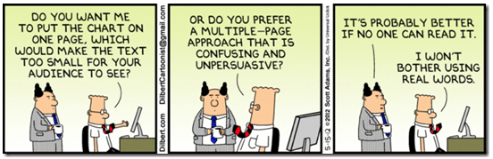
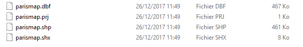
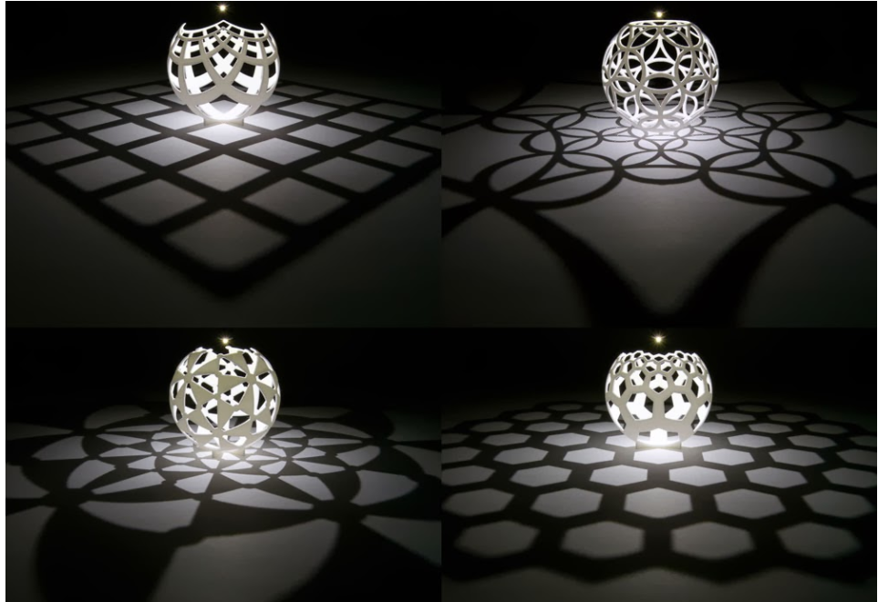

```{r setup, include=FALSE}
knitr::opts_chunk$set(cache=TRUE)
```
# Generality

## Why would I use IOslides ? | Powerpoint is good 

While it's true that Powerpoint is a powerful tool for creating presentations, we are going to see an alternative way of building these very slides directly using Rstudio. In this presentation, we are going to see what we can do. 

The pros of an ioslides presentation are :

- Enable dynamic tools (maps, graphs...)
- Can be updated by changing the source database
- Results in HTML, easily shareable even online

For the cons :

- Harder to customise than a regular powerpoint
- Not a WYSIWYG interface

## Libraries

These are the libraries we are going to use for our presentation.

```{r,message=FALSE}
# Data management
library(dplyr)
library(data.table)

# Shapefile et map
library(rgdal)
library(leaflet)

# Neighbours
library(spdep)

# Colors
library(RColorBrewer)

# Dynamic plot
library(plotly)
```

## Including R code

IOslides work the same as a regular RMarkdown, you can write Rcode which will be evaluated, and the results will be rendered in a slide.

```{r,fig.height=4}
data(cars)
plot(x=cars$speed,y=cars$dist)
```

## Writting your slides| What can I do ?

- Math with LaTeX : $d(x)=\frac{1}{\sigma\sqrt(2\pi)}e^{\frac{1}{2\sigma}(x-\mu)^2}$
- Add tables 

| Column1 | Column2 |
|---------|---------|
| A       | 1       |
| B       | 2       |
</br>

- Write with markdown language, *i.e.* using `*` or `_` to write in italic, and `__` or`**` for bold. For instance, *this sentence is in italic* and **this one in bold**. 

- Insert links to relevant contents, like [AXA's github](https://github.axa.com/)

## CSS/HTML will help you

- If you are familiar with the HTML language, you can use it too ! <font color="red">Here I can color my text in red</font> with this command `<font color="my color">My text</font>`

- With CSS I can create styles like this :
``` 
custompara { test
 color: SteelBlue;
 text-align:right;
}
```
<style type="text/css">
div#custompara {
 color: SteelBlue;
 text-align:right;
}
</style>
<div id="custompara">This text is on the right and in blue !</div>

- Of course you can add images to strengthen your ideas
<center>

</center>

## Going further 

- You can read more about markdown language [here](https://github.com/adam-p/markdown-here/wiki/Markdown-Cheatsheet), and more about ioslides [here](http://rmarkdown.rstudio.com/ioslides_presentation_format.html).

- Everyone can master something, but nobody can master everything. Most of the time the community can help you (or has already given the answer) :

    - Slack for the Axa Community (ds4a) 
<center>    
[](http://ds4a.slack.com)
</center>    
    - StackOverflow for world community 
<center>    
[](https://stackoverflow.com/)
</center>

Let's see it with a small example, a walk in Paris

# Dynamic maps and plots
## Reading

The full map of France at the IRIS scale can be found [here]( https://wxs-telechargement.ign.fr/1yhlj2ehpqf3q6dt6a2y7b64/telechargement/inspire/CONTOURS-IRIS-2017-06-30$CONTOURS-IRIS_2-1__SHP__FRA_2017-06-30/file/CONTOURS-IRIS_2-1__SHP__FRA_2017-06-30.7z). For the needs of this presentation, we created a shapefile that only contains Paris.



The shapefile object consists in (at least) 4 files :

- SHP : The actual shapefile, containing geographical informations
- SHX : Stocks the index of the recording of the SHP
- The PRJ : the projection associated with the SHP
- The DBF (database file) which contains attributes datas
```{r}
map.fr <- readOGR(dsn = "./Datas/Shapefile", layer = "parismap")
```

## Finding neighbours

The package `spdep` provides a function that will find the adjacent polygons for every individual of a shapefile. This function is very well optimized, and return the list of the indices of neighbours.

```{r}
#Finding indices of neighbours
nb_q<-poly2nb(map.fr)
# Converting indices to references
nb_list=sapply(nb_q,function(x){as.character(map.fr$CODE_IRIS[x])})
nb_list[1:3]
```
Here we can see for instance that the first entry has 9 neighbours, the second one only three and so on.

## A random walk
```{r}
random_walk_in_paris<-function(starting_point="751041603",step=2000,seed=NULL){
  # Setting the seed allows to have a reproducible example
  set.seed(seed)
  # Initialisation
  current_position=starting_point
  path=c()
  for (i in 1:step){
    indice=which(map.fr@data$CODE_IRIS==current_position)
    # Select at random a neighbour
    current_position=sample(nb_list[indice][[1]],1)
    path=c(path,current_position)
  }
  return (path)
}
my_walk=random_walk_in_paris(seed=1)
head(my_walk)
```
This function create a random path from a given IRIS. For the selected number of step, the algorithm choose randomly a neighbour and goes in that IRIS.

## Walk on the map

```{r}
#Filtering on the path
walk.map=map.fr[map.fr@data$CODE_IRIS %in% my_walk,]
mapparis<-leaflet(height=300,width = 300) %>% 
  addTiles() %>% 
  addPolygons(data=walk.map, weight = 1, opacity=1, fillOpacity = 0.6, color=grey(0.5))
```
<div class="columns-2">

We can see the selected map by plotting it with leaflet. 

- The `addTiles` function plot the background map
- The `addPolygons` plots the data you've stored in your shapefile.

For this first example we will plot every visited area in grey. Keep in mind that in this example we will just cover the basics, you can go further on the [leaflet for R website](https://rstudio.github.io/leaflet/)
  
```{r}
mapparis
```

</div>


## Add data 

The `@data` part of the shapefile is just a dataframe, so you can add any column you want:

```{r}
freq=data.frame(table(my_walk))
colnames(freq)=c("IRIS","frequency")

map.fr@data$Random=floor( #We floor to have an integer
  runif( # Runif will take a random float
    length(map.fr@data$INSEE_COM), # Size of the vector
    min=0, #Min
    max = max(freq$frequency) # Max
    )
  )

head(map.fr@data$Random)
```

Here for instance we created a random estimate of the number of time each iris has been visited. This is a dummy prediciton, don't take it seriously.

## About projection

The projection is an important thing to set before manipulating spatial object.
See the projection as a way of seeing a 3D object on a 2D plan.

<center></center>

You can switch projection from one to another if you know the EPSG code.
```{r}
# To see the actual projection
p <- proj4string(map.fr)

# More readable
showEPSG(p)
```

---- 

```{r}
# To switch to another projection
map.fr2 <- spTransform(map.fr, CRS("+init=epsg:2154"))

leaflet(height=300,width = 600) %>% 
  addTiles() %>% 
  addPolygons(data=map.fr2, weight = 1, opacity=1, fillOpacity = 0.6, color=grey(0.5))
```
</br>

In that case the projection does not even match the map coordinates. Be careful, of what is the true system of your shapefile !


## Add external data to your shapefile

Let us add some color. RColorBrewer provides many palettes. You can see them with :

```{r}
display.brewer.all()
```

----

Now we need to color it ! First we match the data frequencies with their corresponding area, with `match` to sort the vector, and then we create a palette with `colorFactor` and `brewer.pal`.

```{r}
#  Match data with your map
matchID=match(map.fr@data$CODE_IRIS, freq$IRIS)
map.fr@data=mutate(map.fr@data, frequency=freq[matchID,"frequency"])

# Add color depending on a variable
factpal <- colorFactor(brewer.pal(9,
                                 "YlOrRd"),
                       map.fr@data$frequency)

```

You can also add popup information on your dynamic map to show any information you want, here we also add the frequency as text. 

```{r,eval=FALSE}
addPolygons(..., popup = ~as.character(
                    sprintf("<b>IRIS - %s</b>\n <b>Frequency : %i</b> ", 
                            CODE_IRIS,frequency)),
                 color = ~factpal(frequency))
```

----

Let's look at the result with our data

```{r,echo=FALSE}
mapparis<-leaflet() %>% 
  addTiles() %>% 
  addPolygons(data=map.fr, weight = 1, opacity=1, fillOpacity = 0.6,popup = ~as.character(
                sprintf("<b>IRIS - %s</b>\n
                        <b>Frequency : %i</b> ", CODE_IRIS,frequency)
                ),color = ~factpal(frequency))
mapparis
```


## Creating dynamic plot

```{r}
graph_emblem <- function (dt){
  dt[,.(Pred=mean(Random),Actual=mean(frequency) ,expo= .N),by="TYP_IRIS"][,freq:=expo/sum(expo)*100]%>%
        arrange_("TYP_IRIS") %>%
        plot_ly(x=~TYP_IRIS,y=~freq, type = 'bar', name='Freq',
                marker = list(color = 'rgb(255,255,0)')) %>% 
        add_trace(y=~Pred,  type = 'scatter', mode='lines+markers', 
                  name="Random prediction", yaxis='y2',
                  marker = list(color = 'rgb(0,255,0)'),
                  line=list(color='rgb(0,255,0)')) %>%
        add_trace(y=~Actual,  type = 'scatter', mode='lines+markers', 
                  name="Actual observation", yaxis='y2',
                  marker = list(color = 'rgb(255,0,0)'),
                  line=list(color='rgb(255,0,0)')) %>% 
      
  layout(
          title=paste('Dynamic plot on','TYP_IRIS'),
          yaxis=list(title='Exposure (%)',side='right',showgrid=F,
                     zeroline=F,showline=F,showticklabels=T),
          yaxis2=list(overlaying='y',side='left',showgrid=T,
                      zeroline=F,showline=F,showticklabels=T),
          xaxis=list(tickangle=45,title="TYP_IRIS"),
          legend=list(x=0.05,y=0.85,orientation='v',bgcolor='#dddddd'),
          margin=list(l=50,r=50,b=50)
        )
} 
```

----

```{r}
# Let's change NA to 0 in the frequency table before plotting
map.fr@data$frequency[is.na(map.fr@data$frequency)]=0
graph_emblem(as.data.table(map.fr@data))
```


## Hands-on  
<center>

</center>
This is your turn to create a paragraph with :

1. _italic_
2. __bold__
3. Headers
  + list of items 
  + and a picture of your choice.
  
## Customise it yourself 

Now experiment and try to do it your way. You can :

- Change the palette used in leaflet
- Change the random walk, so at every step you have a chance of staying at the same place
- Add the number of neighbours for each individual in the map database
- Custom the color of the plotly graphic,

But if you have other ideas, feel free to share.